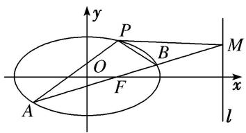
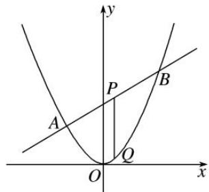
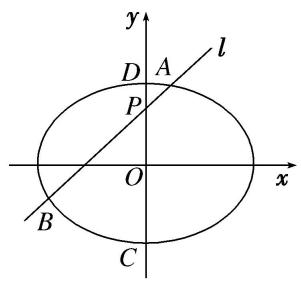
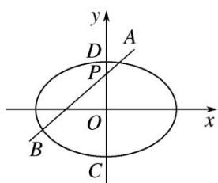

# 专题32 探究是否存在常数型问题

# 探索性问题——肯定结论

# 1. 存在性问题的解题步骤

探索性问题通常采用“肯定顺推法”，将不确定性问题明朗化．一般步骤为：

(1)假设满足条件的元素(常数、点、直线或曲线)存在，引入参变量，根据题目条件列出关于参变量的方程(组)或不等式(组);  
(2)解此方程(组)或不等式(组);   
(3)若方程(组)有实数解，则元素(常数、点、直线或曲线)存在，否则不存在.

# 2. 解决存在性问题的注意事项

探索性问题，先假设存在，推证满足条件的结论，若结论正确则存在，若结论不正确则不存在.

(1)当条件和结论不唯一时，要分类讨论.   
(2)当给出结论而要推导出存在的条件时, 先假设成立, 再推出条件.  
(3)当条件和结论都不知，按常规方法解题很难时，要思维开放，采取另外的途径.

# 【例题选讲】

[例 1] 如图，椭圆 C: $\frac{x^{2}}{a^{2}}+\frac{y^{2}}{b^{2}}=1(a>b>0)$ 经过点 $P\left(1,\frac{3}{2}\right)$ ，离心率 $e=\frac{1}{2}$ ，直线 l 的方程为 x=4.

(1)求椭圆 C 的方程;  
(2)AB 是经过右焦点 F 的任一弦(不经过点 P)，设直线 AB 与直线 l 相交于点 M，记直线 PA，PB，PM 的斜率分别为 $k_{1}$ ， $k_{2}$ ， $k_{3}$ 。问：是否存在常数 $\lambda$ ，使得 $k_{1} + k_{2} = \lambda k_{3}$ ？若存在，求出 $\lambda$ 的值；若不存在，请说明理由。

text_image

y
P
O
B
M
x
A
F
l

[破题思路] (1)题目条件中给出椭圆过点 $P\left(1, \frac{3}{2}\right)$ ，离心率 $e = \frac{1}{2}$ 。将 $P$ 点坐标代入椭圆方程可得 $a, b$ 的关系式；用离心率公式可得 $a, c$ 的关系式，另外，还有 $a^2 = b^2 + c^2$ ，即可求得 $a, b$ 的值。

(2)判断是否存在常数 $\lambda$ ，使 $k_{1} + k_{2} = \lambda k_{3}$ 成立。即方程 $k_{1} + k_{2} = \lambda k_{3}$ 是否有解。题目条件中给出直线 $AB$ 过右焦点 $F$ ，且与椭圆及直线 $l$ 分别交于点 $A, B, M$ ，直线 $PA, PB, PM$ 的斜率分别为 $k_{1}, k_{2}, k_{3}$ ，想到用斜率公式表示 $k_{1}, k_{2}, k_{3}$ ，需要 $A, B, M$ 的坐标，可设出 $A, B, M$ 的坐标，通过建立直线 $AB$ 与椭圆方程的方程组求得各坐标的关系。

[规范解答] (1)由题意得 $\left\{ \begin{array}{l} \frac{1}{a^2} + \frac{9}{4b^2} = 1, \\ \frac{c}{a} = \frac{1}{2}, \\ b^2 + c^2 = a^2, \end{array} \right.$ 解得 $\left\{ \begin{array}{l} a^2 = 4, \\ b^2 = 3, \\ c^2 = 1, \end{array} \right.$ 故椭圆 $C$ 的方程为 $\frac{x^2}{4} + \frac{y^2}{3} = 1$ .

(2)由题意可设直线 AB 的斜率为 k，则直线 AB 的方程为 $y=k(x-1)$ ，①

代入椭圆方程，并整理，得 $(4k^{2}+3)x^{2}-8k^{2}x+4(k^{2}-3)=0$ ，

设 $A(x_{1}, y_{1})$ ， $B(x_{2}, y_{2})$ ，且 $x_{1} \neq x_{2} \neq 1$ ，则 $x_{1} + x_{2} = \frac{8k^{2}}{4k^{2} + 3}$ ， $x_{1}x_{2} = \frac{4(k^{2} - 3)}{4k^{2} + 3}$ ，②

在方程①中令 x=4，得点 M 的坐标为 $(4, 3k)$ 。从而 $k_{1}=\frac{y_{1}-\frac{3}{2}}{x_{1}-1}$ ， $k_{2}=\frac{y_{2}-\frac{3}{2}}{x_{2}-1}$ ， $k_{3}=\frac{3k-\frac{3}{2}}{4-1}=k-\frac{1}{2}$ .

因为 A, F, B 三点共线，所以 $k=k_{AF}=k_{BF}$ ，即 $\frac{y_{1}}{x_{1}-1}=\frac{y_{2}}{x_{2}-1}=k$ ,

所以 $k_{1}+k_{2}=\frac{y_{1}-\frac{3}{2}}{x_{1}-1}+\frac{y_{2}-\frac{3}{2}}{x_{2}-1}=\frac{y_{1}}{x_{1}-1}+\frac{y_{2}}{x_{2}-1}-\frac{3}{2}\left(\frac{1}{x_{1}-1}+\frac{1}{x_{2}-1}\right)=2k-\frac{3}{2}\cdot\frac{x_{1}+x_{2}-2}{x_{1}x_{2}-(x_{1}+x_{2})+1}$ ，③

将②代入③得， $k_{1}+k_{2}=2k-\frac{3}{2}\cdot\frac{\frac{8k^{2}}{4k^{2}+3}-2}{\frac{4(k^{2}-3)}{4k^{2}+3}-\frac{8k^{2}}{4k^{2}+3}+1}=2k-1$ ，又 $k_{3}=k-\frac{1}{2}$ ，所以 $k_{1}+k_{2}=2k_{3}$ .

故存在常数 $\lambda=2$ 符合题意.

[题后悟通] 求解字母参数值的存在性问题时，通常的方法是首先假设满足条件的参数值存在，然后利用这些条件并结合题目的其他已知条件进行推理与计算，若不出现矛看，并且得到了相应的参数值，就说明满足条件的参数值存在；若在推理与计算中出现了矛盾，则说明满足条件的参数值不存在，同时推理与计算的过程就是说明理由的过程.

[例 2] 已知抛物线 C: $x^{2}=2py(p>0)$ 的焦点为 F，直线 $2x-y+2=0$ 交抛物线 C 于 A，B 两点，P 是线段 AB 的中点，过 P 作 x 轴的垂线交抛物线 C 于点 Q.

(1)D 是抛物线 C 上的动点，点 $E(-1, 3)$ ，若直线 AB 过焦点 F，求 $|DF| + |DE|$ 的最小值；  
(2)是否存在实数 p，使 $\left|2\overrightarrow{QA}+\overrightarrow{QB}\right|=\left|2\overrightarrow{QA}-\overrightarrow{QB}\right|$ ？若存在，求出 p 的值；若不存在，说明理由.

text_image

y
P
B
A
Q
O
x

[规范解答] (1)∵直线 $2x-y+2=0$ 与 y 轴的交点为 $(0,2)$ ,

∴ $F(0, 2)$ ，则抛物线 C 的方程为 $x^{2}=8y$ ，准线 l: y=-2.

设过 D 作 $DG \perp l$ 于 G，则 $|DF| + |DE| = |DG| + |DE|$ ,

当 E, D, G 三点共线时， $|DF| + |DE|$ 取最小值 $2 + 3 = 5$ .

(2)假设存在，抛物线 $x^{2}=2py$ 与直线 $y=2x+2$ 联立，得 $x^{2}-4px-4p=0$ ，

设 $A(x_{1}, y_{1})$ , $B(x_{2}, y_{2})$ , $\Delta=(4p)^{2}+16p=16(p^{2}+p)>0$ ，则 $x_{1}+x_{2}=4p$ , $x_{1}x_{2}=-4p$ , $\therefore Q(2p, 2p)$ .

$\because |2\overrightarrow{QA} + \overrightarrow{QB}| = |2\overrightarrow{QA} - \overrightarrow{QB}|$ ， $\therefore \overrightarrow{QA} \perp \overrightarrow{QB}$ 。则 $\overrightarrow{QA} \cdot \overrightarrow{QB} = 0$ ，

得 $(x_{1} - 2p)(x_{2} - 2p) + (y_{1} - 2p)(y_{2} - 2p) = (x_{1} - 2p)(x_{2} - 2p) + (2x_{1} + 2 - 2p)(2x_{2} + 2 - 2p)$

$$
= 5 x _ {1} x _ {2} + (4 - 6 p) \left(x _ {1} + x _ {2}\right) + 8 p ^ {2} - 8 p + 4 = 0,
$$

代入得 $4p^{2}+3p-1=0$ ，解得 $p=\frac{1}{4}$ 或 p=-1（舍去）.

因此存在实数 $p=\frac{1}{4}$ ，且满足 $\Delta>0$ ，使得 $\left|2\overrightarrow{QA}+\overrightarrow{QB}\right|=\left|2\overrightarrow{QA}-\overrightarrow{QB}\right|$ 成立。

[例 3] 已知焦点在 y 轴上的椭圆 E 的中心是原点 O，离心率等于 $\frac{\sqrt{3}}{2}$ ，以椭圆 E 的长轴和短轴为对角线的四边形的周长为 $4\sqrt{5}$ 。直线 l: y = kx + m 与 y 轴交于点 P，与椭圆 E 交于 A，B 两个相异点，且 $\overrightarrow{AP} = \lambda \overrightarrow{P} \overrightarrow{B}$ 。

(1)求椭圆 E 的方程;  
(2)是否存在 m，使 $\overrightarrow{OA} + \lambda\overrightarrow{OB} = 4\overrightarrow{OP}$ ？若存在，求 m 的取值范围；若不存在，请说明理由.

[规范解答] (1)根据已知设椭圆 E 的方程为 $\frac{y^{2}}{a^{2}} + \frac{x^{2}}{b^{2}} = 1 (a > b > 0)$ ，焦距为 2c，

由已知得 $\frac{c}{a}=\frac{\sqrt{3}}{2}$ ，所以 $c=\frac{\sqrt{3}}{2}a,\quad b^{2}=a^{2}-c^{2}=\frac{a^{2}}{4}$ .

因为以椭圆 E 的长轴和短轴为对角线的四边形的周长为 $4\sqrt{5}$ ,

所以 $4\sqrt{a^2 + b^2} = 2\sqrt{5} a = 4\sqrt{5}$ ，所以 $a = 2$ ， $b = 1$ 。所以椭圆 $E$ 的方程为 $x^2 + \frac{y^2}{4} = 1$ 。

(2)根据已知得 $P(0, m)$ ，由 $\overrightarrow{AP} = \lambda \overrightarrow{PB}$ ，得 $\overrightarrow{OP} - \overrightarrow{OA} = \lambda (\overrightarrow{OB} - \overrightarrow{OP})$ 。所以 $\overrightarrow{OA} + \lambda \overrightarrow{OB} = (1 + \lambda)\overrightarrow{OP}$ 。

因为 $\overrightarrow{OA} + \lambda \overrightarrow{OB} = 4\overrightarrow{OP}$ ，所以 $(1 + \lambda)\overrightarrow{OP} = 4\overrightarrow{OP}$ .

若 m=0，由椭圆的对称性得 $\overrightarrow{AP}=\overrightarrow{PB}$ ，即 $\overrightarrow{OA}+\overrightarrow{OB}=0$ 。所以 m=0 能使 $\overrightarrow{OA}+\lambda\overrightarrow{OB}=4\overrightarrow{OP}$ 成立。

若 $m \neq 0$ ，则 $1 + \lambda = 4$ ，解得 $\lambda = 3$ 。

设 $A(x_{1}, kx_{1}+m)$ ， $B(x_{2}, kx_{2}+m)$ ，由 $\left\{\begin{aligned}y=kx+m\\ 4x^{2}+y^{2}-4=0\end{aligned}\right.$ ，得 $(k^{2}+4)x^{2}+2mkx+m^{2}-4=0$ ，

由已知得 $\Delta=4m^{2}k^{2}-4(k^{2}+4)(m^{2}-4)>0$ ，即 $k^{2}-m^{2}+4>0$ ，且 $x_{1}+x_{2}=\frac{-2km}{k^{2}+4}$ ， $x_{1}x_{2}=\frac{m^{2}-4}{k^{2}+4}$ .

由 $\overrightarrow{AP}=3\overrightarrow{PB}$ 得 $-x_{1}=3x_{2}$ ，即 $x_{1}=-3x_{2}$ ，所以 $3(x_{1}+x_{2})^{2}+4x_{1}x_{2}=0$ ，

所以 $\frac{12k^2m^2}{(k^2 + 4)^2} +\frac{4(m^2 - 4)}{k^2 + 4} = 0$ ，即 $m^2 k^2 +m^2 -k^2 -4 = 0.$

当 $m^{2}=1$ 时， $m^{2}k^{2}+m^{2}-k^{2}-4=0$ 不成立．所以 $k^{2}=\frac{4-m^{2}}{m^{2}-1}$ .

因为 $k^{2}-m^{2}+4>0$ ，所以 $\frac{4-m^{2}}{m^{2}-1}-m^{2}+4>0$ ，即 $\frac{(4-m^{2})m^{2}}{m^{2}-1}>0$ .

所以 $1<m^{2}<4$ ，解得 -2<m<-1 或 1<m<2。

综上，当-2<m<-1或m=0或1<m<2时， $\overrightarrow{OA}+\lambda\overrightarrow{OB}=4\overrightarrow{OP}$

[例 4] (2015·四川)如图，椭圆 $E: \frac{x^{2}}{a^{2}} + \frac{y^{2}}{b^{2}} = 1 (a > b > 0)$ 的离心率是 $\frac{\sqrt{2}}{2}$ ，点 $P(0, 1)$ 在短轴 CD 上，且 $\overrightarrow{PC} \cdot \overrightarrow{PD} = -1$ .

(1)求椭圆 E 的标准方程;

(2)设 O 为坐标原点，过点 P 的动直线与椭圆交于 A, B 两点. 是否存在常数 $\lambda$ ，使得 $\overrightarrow{OA} \cdot \overrightarrow{OB} + \lambda \overrightarrow{PA} \cdot \overrightarrow{PB}$ 为定值？若存在，求 $\lambda$ 的值；若不存在，请说明理由.

text_image

y
l
D A
P
O x
B C

[规范解答] (1)由已知，点 C, D 的坐标分别为 $(0, -b)$ ， $(0, b)$ .

又点 P 的坐标为 $(0,1)$ ，且 $\overrightarrow{PC} \cdot \overrightarrow{PD} = -1$ ，于是 $\left\{\begin{aligned}1-b^{2}&=-1,\\ \frac{c}{a}&=\frac{\sqrt{2}}{2},\\ a^{2}-b^{2}&=c^{2}.\end{aligned}\right.$ 解得 $a=2,\ b=\sqrt{2}.$

所以椭圆 E 的方程为 $\frac{x^{2}}{4} + \frac{y^{2}}{2} = 1$ .

(2)当直线 AB 的斜率存在时，设直线 AB 的方程为 $y=kx+1$ ，A，B 的坐标分别为 $(x_{1}, y_{1})$ ， $(x_{2}, y_{2})$ .

联立 $\left\{\begin{aligned}\frac{x^{2}}{4}+\frac{y^{2}}{2}&=1,\\ y=kx+1\end{aligned}\right.$ 得 $(2k^{2}+1)x^{2}+4kx-2=0$ ，其判别式 $\Delta=(4k)^{2}+8(2k^{2}+1)>0$

所以 $x_{1}+x_{2}=-\frac{4k}{2k^{2}+1},\quad x_{1}x_{2}=-\frac{2}{2k^{2}+1}.$

从而， $\overrightarrow{OA}\cdot\overrightarrow{OB}+\lambda\overrightarrow{PA}\cdot\overrightarrow{PB}=x_{1}x_{2}+y_{1}y_{2}+\lambda[x_{1}x_{2}+(y_{1}-1)(y_{2}-1)]=(1+\lambda)(1+k^{2})x_{1}x_{2}+k(x_{1}+x_{2})+1$

$= \frac{(-2\lambda - 4)k^2 + (-2\lambda - 1)}{2k^2 + 1} = -\frac{\lambda - 1}{2k^2 + 1} - \lambda - 2,$ 所以，

当 $\lambda=1$ 时， $-\frac{\lambda-1}{2k^{2}+1}-\lambda-2=-3$ ，此时， $\overrightarrow{OA}\cdot\overrightarrow{OB}+\lambda\overrightarrow{PA}\cdot\overrightarrow{PB}=-3$ 为定值.

当直线 AB 斜率不存在时，直线 AB 即为直线 CD，

此时， $\overrightarrow{OA}\cdot\overrightarrow{OB}+\lambda\overrightarrow{PA}\cdot\overrightarrow{PB}=\overrightarrow{OC}\cdot\overrightarrow{OD}+\lambda\overrightarrow{PC}\cdot\overrightarrow{PD}=-2-\lambda.$

当 $\lambda=1$ 时， $\overrightarrow{OA}\cdot\overrightarrow{OB}+\lambda\overrightarrow{PA}\cdot\overrightarrow{PB}=-3$ ，为定值.

综上，存在常数 $\lambda=1$ ，使得 $\overrightarrow{OA}\cdot\overrightarrow{OB}+\lambda\overrightarrow{PA}\cdot\overrightarrow{PB}$ 为定值-3.

[例5] 已知椭圆 $x^{2} + 2y^{2} = m(m > 0)$ ，以椭圆内一点 $M(2,1)$ 为中点作弦 $AB$ ，设线段 $AB$ 的中垂线与椭圆相交于 $C$ ， $D$ 两点.

(1)求椭圆的离心率;

(2)试判断是否存在这样的 m，使得 A, B, C, D 在同一个圆上，并说明理由.

[规范解答] (1) 将方程化成椭圆的标准方程 $\frac{x^{2}}{m} + \frac{y^{2}}{\frac{m}{2}} = 1 (m > 0)$ ，则 $a = \sqrt{m}$ ， $c = \sqrt{m - \frac{m}{2}} = \sqrt{\frac{m}{2}}$ ，故 $e = \frac{c}{a} = \frac{\sqrt{2}}{2}$ .

(2)由题意，设 $A(x_{1}, y_{1})$ ， $B(x_{2}, y_{2})$ ， $C(x_{3}, y_{3})$ ， $D(x_{4}, y_{4})$ ，直线 AB 的斜率存在，设为 k，

则直线 AB 的方程为 $y=k(x-2)+1$ ，代入 $x^{2}+2y^{2}=m(m>0)$ ,

消去 y，得 $(1+2k^{2})x^{2}+4k(1-2k)x+2(2k-1)^{2}-m=0(m>0)$ .

所以 $x_{1}+x_{2}=\frac{4k(2k-1)}{1+2k^{2}}=4$ ，即 k=-1，此时，由 $\Delta>0$ ，得 m>6.

则直线 AB 的方程为 $x + y - 3 = 0$ ，直线 CD 的方程为 x - y - 1 = 0。

由 $\left\{\begin{aligned}x-y-1&=0,\\ x^{2}+2y^{2}&=m\end{aligned}\right.$ 得 $3y^{2}+2y+1-m=0,\ y_{3}+y_{4}=-\frac{2}{3}$ ，故CD的中点N为 $\left(\frac{2}{3},-\frac{1}{3}\right)$ .

由弦长公式，可得 $|AB|=\sqrt{1+k^{2}}|x_{1}-x_{2}|=\sqrt{2}\cdot\frac{\sqrt{12(m-6)}}{3}$ .

$|CD|=\sqrt{2}|y_{3}-y_{4}|=\sqrt{2}\cdot\frac{\sqrt{12m-8}}{3}>|AB|$ ，若存在圆，则圆心在 CD 上，

因为 $CD$ 的中点 $N$ 到直线 $AB$ 的距离 $d = \frac{\left|\frac{2}{3} - \frac{1}{3} - 3\right|}{\sqrt{2}} = \frac{4\sqrt{2}}{3}$ .

$$
| N A | ^ {2} = | N B | ^ {2} = \left(\frac {4 \sqrt {2}}{3}\right) ^ {2} + \left(\frac {| A B |}{2}\right) ^ {2} = \frac {6 m - 4}{9}, \text {又} \left(\frac {| C D |}{2}\right) ^ {2} = \frac {1}{4} \left(\sqrt {2} \cdot \frac {\sqrt {1 2 m - 8}}{3}\right) ^ {2} = \frac {6 m - 4}{9},
$$

故存在这样的 $m(m>6)$ ，使得 A, B, C, D 在同一个圆上.

[例 6] 已知中心在原点 O，焦点在 x 轴上的椭圆，离心率 $e=\frac{1}{2}$ ，且椭圆过点 $\left(1,\frac{3}{2}\right)$ .

(1)求椭圆的方程;

(2)椭圆左、右焦点分别为 $F_{1}$ , $F_{2}$ , 过 $F_{2}$ 的直线 $l$ 与椭圆交于不同的两点 $A$ , $B$ , 则 $\triangle F_{1}AB$ 的内切圆的面积是否存在最大值？若存在，求出这个最大值及此时的直线方程；若不存在，请说明理由.

[规范解答] (1)由题意可设椭圆方程为 $\frac{x^{2}}{a^{2}}+\frac{y^{2}}{b^{2}}=1(a>b>0)$ ，则 $\left\{\begin{aligned}\frac{c}{a}&=\frac{1}{2},\\\frac{1}{a^{2}}&+\frac{9}{4b^{2}}=1,\\a^{2}&=b^{2}+c^{2},\end{aligned}\right.$ 解得 $a^{2}=4,\ b^{2}=3$ .

∴椭圆方程为 $\frac{x^{2}}{4}+\frac{y^{2}}{3}=1$ .

(2)设 $A(x_{1}, y_{1})$ ， $B(x_{2}, y_{2})$ ，不妨设 $y_{1} > 0$ ， $y_{2} < 0$ ，设 $\triangle F_{1}AB$ 的内切圆的半径为 R，

则 $\triangle F_{1}AB$ 的周长=4a=8， $S_{\triangle F_{1}AB}=\frac{1}{2}(|AB|+|F_{1}A|+|F_{1}B|)R=4R$ ，因此， $S_{\triangle F_{1}AB}$ 最大，R就最大，

由题知，直线 l 的斜率不为零，可设直线 l 的方程为 $x=my+1$ ，

由 $\left\{\begin{aligned}x&=my+1,\\ \frac{x^{2}}{4}&+\frac{y^{2}}{3}=1,\end{aligned}\right.$ 得 $(3m^{2}+4)y^{2}+6my-9=0,\quad y_{1}+y_{2}=\frac{-6m}{3m^{2}+4},\quad y_{1}y_{2}=-\frac{9}{3m^{2}+4}.$

则 $S_{\triangle F1AB} = \frac{1}{2}|F_1F_2|(y_1 - y_2) = \frac{12\sqrt{m^2 + 1}}{3m^2 + 4}$ ，令 $\sqrt{m^2 + 1} = t$ ，则 $m^2 = t^2 - 1 (t \geq 1)$ ，

$\therefore S_{\triangle F1AB} = \frac{12t}{3t^2 + 1} = \frac{12}{3t + \frac{1}{t}}.$ 令 $f(t) = 3t + \frac{1}{t}$ , 则 $f'(t) = 3 - \frac{1}{t^2}$ ,

当 $t \geq 1$ 时， $f'(t) \geq 0$ ， $f(t)$ 在 $[1, +\infty)$ 上单调递增，有 $f(t) \geq f(1) = 4$ ， $S_{\triangle F1AB} \leq 3$ ，

即当 t=1，m=0 时， $S_{\triangle F1AB}\leq3$ ，

由 $S_{\triangle F1AB}=4R$ ，得 $R_{max}=\frac{3}{4}$ ，这时所求内切圆面积的最大值为 $\frac{9\pi}{16}$ ，故直线 l: x=1.

# 【对点训练】

1. 已知椭圆 $C: \frac{x^2}{a^2} + \frac{y^2}{b^2} = 1 (a > b > 0)$ 的左、右焦点为 $F_1, F_2$ ，其离心率为 $\frac{\sqrt{2}}{2}$ ，又抛物线 $x^2 = 4y$ 在点 $P(2, 1)$ 处的切线恰好过椭圆 $C$ 的一个焦点.

(1)求椭圆 C 的方程;

(2)过点 $M(-4, 0)$ , 斜率为 $k (k \neq 0)$ 的直线 $l$ 交椭圆 $C$ 于 $A$ , $B$ 两点, 直线 $AF_{1}$ , $BF_{1}$ 的斜率分别为 $k_{1}$ , $k_{2}$ , 是否存在常数 $\lambda$ , 使得 $k_{1} k + k_{2} k = \lambda k_{1} k_{2}$ ? 若存在, 求出 $\lambda$ 的值; 若不存在, 请说明理由.

1. 解析 (1)∵抛物线 $x^{2}=4y$ 在点 $P(2,1)$ 处的切线方程为 y=x-1，它过 x 轴上的点 $(1,0)$ ,

∴椭圆 C 的一个焦点为 $(1, 0)$ ，即 c=1，又∵ $e=\frac{c}{a}=\frac{\sqrt{2}}{2}$ ，∴ $a=\sqrt{2}$ ，b=1，

∴椭圆 C 的方程为 $\frac{x^{2}}{2} + y^{2} = 1$ .

(2)设 $A(x_{1}, y_{1})$ ， $B(x_{2}, y_{2})$ ，l 的方程为 $y=k(x+4)$ ，联立 $\left\{\begin{aligned}y&=k(x+4),\\ x^{2}&+2y^{2}=2\end{aligned}\right.$

$$
\Rightarrow (1 + 2 k ^ {2}) x ^ {2} + 1 6 k ^ {2} x + 3 2 k ^ {2} - 2 = 0, \quad \therefore \left\{ \begin{array}{l} 4 > 0, \\ x _ {1} + x _ {2} = - \frac {1 6 k ^ {2}}{1 + 2 k ^ {2}}, \\ x _ {1} x _ {2} = \frac {3 2 k ^ {2} - 2}{1 + 2 k ^ {2}}. \end{array} \right.
$$

$$
\because F _ {1} (- 1, 0), k _ {1} = \frac {y _ {1}}{x _ {1} + 1}, k _ {2} = \frac {y _ {2}}{x _ {2} + 1}, \therefore \frac {1}{k _ {1}} + \frac {1}{k _ {2}} = \frac {x _ {1} + 1}{y _ {1}} + \frac {x _ {2} + 1}{y _ {2}} = \frac {1}{k} \left(\frac {x _ {1} + 1}{x _ {1} + 4} + \frac {x _ {2} + 1}{x _ {2} + 4}\right),
$$

$\therefore \frac{k}{k_1} + \frac{k}{k_2} = \frac{2x_1x_2 + 5(x_1 + x_2) + 8}{x_1x_2 + 4(x_1 + x_2) + 16} = \frac{2}{7}, \therefore k_1k + k_2k = \frac{2}{7} k_1k_2, \therefore$ 存在常数 $\lambda = \frac{2}{7}$ .

2. 已知椭圆 $\frac{x^2}{a^2} + \frac{y^2}{b^2} = 1 (a > b > 0)$ 的长轴与短轴之和为6，椭圆上任一点到两焦点 $F_1$ ， $F_2$ 的距离之和为4.

(1)求椭圆的标准方程;

(2)若直线 AB: $y = x + m$ 与椭圆交于 A, B 两点，C, D 在椭圆上，且 C, D 两点关于直线 AB 对称，问：是否存在实数 m，使 $|AB| = \sqrt{2} |CD|$ ，若存在，求出 m 的值；若不存在，请说明理由.

2. 解析 (1)由题意, $2a = 4$ , $2a + 2b = 6$ , $\therefore a = 2$ , $b = 1$ . $\therefore$ 椭圆的标准方程为 $\frac{x^2}{4} + y^2 = 1$ .

(2)∵C，D关于直线AB对称，设直线CD的方程为 $y=-x+t$ ，

联立 $\left\{ \begin{array}{l} y = -x + t, \\ \frac{x^2}{4} + y^2 = 1 \end{array} \right.$ 消去 $y$ ，得 $5x^{2} - 8tx + 4t^{2} - 4 = 0$ ， $\Delta = 64t^{2} - 4 \times 5 \times (4t^{2} - 4) > 0$ ，解得 $t^{2} < 5$

设 C, D 两点的坐标分别为 $(x_{1}, y_{1})$ , $(x_{2}, y_{2})$ ，则 $x_{1} + x_{2} = \frac{8t}{5}$ , $x_{1}x_{2} = \frac{4t^{2} - 4}{5}$ ,

设 CD 的中点为 $M(x_{0}, y_{0})$ ，∴ $\left\{\begin{aligned}x_{0}&=\frac{x_{1}+x_{2}}{2}=\frac{4t}{5},\\ y_{0}&=-x_{0}+t=\frac{t}{5},\end{aligned}\right.$ $\therefore M\left(\frac{4t}{5}, \frac{t}{5}\right)$ ,

又点 M 也在直线 $y=x+m$ 上，则 $\frac{t}{5}=\frac{4t}{5}+m,\quad\therefore t=-\frac{5m}{3},\quad\because t^{2}<5,\quad\therefore m^{2}<\frac{9}{5}.$

则 $|CD|=\sqrt{1+1}|x_{1}-x_{2}|=\sqrt{2}\cdot\sqrt{(x_{1}+x_{2})^{2}-4x_{1}x_{2}}=\sqrt{2}\cdot\frac{4\sqrt{5-t^{2}}}{5}$ . 同理 $|AB|=\sqrt{2}\cdot\frac{4\sqrt{5-m^{2}}}{5}$ .

$$
\because | A B | = \sqrt {2} | C D |, \therefore | A B | ^ {2} = 2 | C D | ^ {2}, \therefore 2 t ^ {2} - m ^ {2} = 5, \therefore m ^ {2} = \frac {4 5}{4 1} <   \frac {9}{5},
$$

∴存在实数 m，使 $\left|AB\right|=\sqrt{2}\left|CD\right|$ ，此时 m 的值为 $\pm\frac{3\sqrt{205}}{41}$ .

3. 已知椭圆 $C_1: \frac{x^2}{a^2} + \frac{y^2}{3} = 1 (a > 0)$ 与抛物线 $C_2: y^2 = 2ax$ 相交于 $A, B$ 两点，且两曲线的焦点 $F$ 重合.

(1)求 $C_{1}$ ， $C_{2}$ 的方程；

(2)若过焦点 $F$ 的直线 $l$ 与椭圆分别交于 $M, Q$ 两点，与抛物线分别交于 $P, N$ 两点，是否存在常数 $k (k \neq 0)$ ，使得直线 $l$ 的斜率为 $k$ 且 $\frac{|PN|}{|MO|} = 2$ ？若存在，求出 $k$ 的值；若不存在，请说明理由。

3. 解析 (1) 因为 $C_1, C_2$ 的焦点重合，所以 $\sqrt{a^2 - 3} = \frac{a}{2}$ ，所以 $a^2 = 4$ 。又 $a > 0$ ，所以 $a = 2$ .

于是椭圆 $C_{1}$ 的方程为 $\frac{x^{2}}{4} + \frac{y^{2}}{3} = 1$ ，抛物线 $C_{2}$ 的方程为 $y^{2} = 4x$ .

(2)假设存在直线 l 使得 $\frac{|PN|}{|MO|}=2$ ，当 $l \perp x$ 轴时， $|MQ|=3$ ， $|PN|=4$ ，不符合题意，

∴直线 l 的斜率存在，∴可设直线 l 的方程为 $y=k(x-1)(k\neq0)$ ,

$P(x_{1}, y_{1}), Q(x_{2}, y_{2}), M(x_{3}, y_{3}), N(x_{4}, y_{4})$ . 由 $\left\{\begin{aligned}y^{2}&=4x,\\ y&=k(x-1),\end{aligned}\right.$ 可得 $k^{2}x^{2}-(2k^{2}+4)x+k^{2}=0,$

则 $x_{1} + x_{4} = \frac{2k^{2} + 4}{k^{2}}$ ， $x_{1}x_{4} = 1$ ，且 $\varDelta = 16k^2 +16 > 0$

所以 $|PN|=\sqrt{1+k^{2}}\cdot\sqrt{(x_{1}+x_{4})^{2}-4x_{1}x_{4}}=\frac{4(1+k^{2})}{k^{2}}$

由 $\left\{\begin{aligned}\frac{x^{2}}{4}+\frac{y^{2}}{3}&=1,\\ y=k(x-1),\end{aligned}\right.$ 可得 $(3+4k^{2})x^{2}-8k^{2}x+4k^{2}-12=0$ ，则 $x_{2}+x_{3}=\frac{8k^{2}}{3+4k^{2}}$ ， $x_{2}x_{3}=\frac{4k^{2}-12}{3+4k^{2}}$

且 $\Delta=144k^{2}+144>0$ ，所以 $|MQ|=\sqrt{1+k^{2}}\cdot\sqrt{(x_{2}+x_{3})^{2}-4x_{2}x_{3}}=\frac{12(1+k^{2})}{3+4k^{2}}$ .

若 $\frac{|PN|}{|MO|} = 2$ ，则 $\frac{4(1 + k^2)}{k^2} = 2\times \frac{12(1 + k^2)}{3 + 4k^2}$ 解得 $k = \pm \frac{\sqrt{6}}{2}$

故存在斜率为 $k=\pm\frac{\sqrt{6}}{2}$ 的直线 l，使得 $\frac{|PN|}{|MO|}=2$ .

4. 如图，椭圆 $E: \frac{x^2}{a^2} + \frac{y^2}{b^2} = 1 (a > b > 0)$ 的离心率是 $\frac{\sqrt{3}}{2}$ ，点 $P(0, 1)$ 在短轴 $CD$ 上，且 $\overrightarrow{PC} \cdot \overrightarrow{PD} = -1$ .

(1)求椭圆 E 的方程;

(2)设 O 为坐标原点，过点 P 的动直线与椭圆交于 A, B 两点．是否存在常数 $\lambda$ ，使得 $\overrightarrow{OA} \cdot \overrightarrow{OB} + \lambda \overrightarrow{PA} \cdot \overrightarrow{PB}$ 为定值？若存在，求出 $\lambda$ 的值；若不存在，请说明理由.

text_image

y
D
A
P
O
x
B
C

4. 解析 (1)由已知，点 C, D 的坐标分别为 $(0, -b)$ ， $(0, b)$ ，又点 P 的坐标为 $(0, 1)$ ，且 $\overrightarrow{PC} \cdot \overrightarrow{PD} = -1$ ，

于是 $\left\{\begin{aligned}1-b^{2}&=-1,\\ \frac{c}{a}&=\frac{\sqrt{3}}{2},\\ a^{2}-b^{2}&=c^{2},\end{aligned}\right.$

解得 $a=2\sqrt{2}$ ， $b=\sqrt{2}$ ，所以椭圆 E 的方程为 $\frac{x^{2}}{8}+\frac{y^{2}}{2}=1$ .

(2)当直线 AB 的斜率存在时，设直线 AB 的方程为 $y=kx+1$ ，A，B 的坐标分别为 $(x_{1}, y_{1})$ ， $(x_{2}, y_{2})$ ，

联立 $\left\{\begin{aligned}\frac{x^{2}}{8}+\frac{y^{2}}{2}&=1,\\ y=kx+1,\end{aligned}\right.$ 得 $(4k^{2}+1)x^{2}+8kx-4=0$ ，其判别式 $\Delta=(8k)^{2}+16(4k^{2}+1)>0$

所以 $x_{1}+x_{2}=-\frac{8k}{4k^{2}+1},\quad x_{1}x_{2}=-\frac{4}{4k^{2}+1},$

从而， $\overrightarrow{OA}\cdot \overrightarrow{OB} +\lambda \overrightarrow{PA}\cdot \overrightarrow{PB} = x_1x_2 + y_1y_2 + \lambda [x_1x_2 + (y_1 - 1)(y_2 - 1)] = (1 + \lambda)(1 + k^2)x_1x_2 + k(x_1 + x_2) + 1$

$$
= \frac {(- 4 \lambda - 8) k ^ {2} + (- 4 \lambda - 3)}{4 k ^ {2} + 1} = - \frac {3 \lambda + 1}{4 k ^ {2} + 1} - \lambda - 2.
$$

所以当 $\lambda = -\frac{1}{3}$ 时， $-\frac{3\lambda + 1}{4k^2 + 1} -\lambda -2 = -\frac{5}{3}$ ，此时 $\overrightarrow{OA}\cdot \overrightarrow{OB} +\lambda \overrightarrow{PA}\cdot \overrightarrow{PB} = -\frac{5}{3}$ 为定值.

当直线 AB 斜率不存在时，直线 AB 即为直线 CD，此时，

$$
\overrightarrow {O A} \cdot \overrightarrow {O B} + \lambda \overrightarrow {P A} \cdot \overrightarrow {P B} = \overrightarrow {O C} \cdot \overrightarrow {O D} - \frac {1}{3} \overrightarrow {P C} \cdot \overrightarrow {P D} = - 2 + \frac {1}{3} = - \frac {5}{3}.
$$

故存在常数 $\lambda=-\frac{1}{3}$ ，使得 $\overrightarrow{OA}\cdot\overrightarrow{OB}+\lambda\overrightarrow{PA}\cdot\overrightarrow{PB}$ 为定值 $-\frac{5}{3}$ .

5. (2015·全国II)已知椭圆 $C: 9x^{2} + y^{2} = m^{2}(m > 0)$ , 直线 $l$ 不过原点 $O$ 且不平行于坐标轴, $l$ 与 $C$ 有两个交点 $A$ , $B$ , 线段 $AB$ 的中点为 $M$ .

(1)证明：直线 OM 的斜率与 l 的斜率的乘积为定值；

(2)若 $l$ 过点 $\left[\frac{m}{3}, m\right]$ , 延长线段 $OM$ 与 $C$ 交于点 $P$ , 四边形 $OAPB$ 能否为平行四边形? 若能, 求此时 $l$ 的斜率; 若不能, 说明理由.

5. 解析 (1) 设直线 $l: y = kx + b (k \neq 0, b \neq 0)$ , $A(x_{1}, y_{1})$ , $B(x_{2}, y_{2})$ , $M(x_{M}, y_{M})$ .

将 $y=kx+b$ 代入 $9x^{2}+y^{2}=m^{2}$ ，得 $(k^{2}+9)x^{2}+2kbx+b^{2}-m^{2}=0$ ，

故 $x_{M}=\frac{x_{1}+x_{2}}{2}=\frac{-kb}{k^{2}+9},\quad y_{M}=kx_{M}+b=\frac{9b}{k^{2}+9}.$

于是直线 OM 的斜率 $k_{OM}=\frac{y_{M}}{x_{M}}=-\frac{9}{k}$ ，即 $k_{OM}\cdot k=-9$ 。所以直线 OM 的斜率与 l 的斜率的乘积为定值。

(2)四边形 OAPB 能为平行四边形.

因为直线 l 过点 $\left(\frac{m}{3}, m\right)$ ，所以 l 不过原点且与 C 有两个交点的充要条件是 k>0， $k\neq3$ .

由(1)得 OM 的方程为 $y = -\frac{9}{k}x$ . 设点 P 的横坐标为 $x_{P}$ .

由 $\left\{\begin{aligned}y&=-\frac{9}{k}x,\\ 9x^{2}&+y^{2}=m^{2},\end{aligned}\right.$ 得 $x_{P}^{2}=\frac{k^{2}m^{2}}{9k^{2}+81}$ ，即 $x_{P}=\frac{\pm km}{3\sqrt{k^{2}+9}}$ 。

将点 $\left(\frac{m}{3}, m\right)$ 的坐标代入直线l的方程得 $b=\frac{m(3-k)}{3}$ ，因此 $x_{M}=\frac{k(k-3)m}{3(k^{2}+9)}$ .

四边形 OAPB 为平行四边形，当且仅当线段 AB 与线段 OP 互相平分，

即 $x_{P} = 2x_{M}$ ，于是 $\frac{\pm km}{3\sqrt{k^2 + 9}} = 2\times \frac{k(k - 3)m}{3(k^2 + 9)}$ ，解得 $k_{1} = 4 - \sqrt{7}$ ， $k_{2} = 4 + \sqrt{7}$

因为 $k_{i}>0,\quad k_{i}\neq3,\quad i=1,2$ ，所以当直线 l 的斜率为 $4-\sqrt{7}$ 或 $4+\sqrt{7}$ 时，四边形 OAPB 为平行四边形.

6. 已知椭圆 $M: \frac{x^2}{a^2} + \frac{y^2}{b^2} = 1 (a > b > 0)$ 的一个顶点坐标为 $(0, 1)$ ，离心率为 $\frac{\sqrt{2}}{2}$ ，动直线 $y = x + m$ 交椭圆 $M$ 于不同的两点 $A, B, T(1, 1)$ .

(1)求椭圆 M 的标准方程;  
(2)试问： $\triangle TAB$ 的面积是否存在最大值？若存在，求出这个最大值；若不存在，请说明理由.

6. 解析 (1)由题意得 $\frac{c}{a} = \frac{\sqrt{2}}{2}$ , $b = 1$ , 又 $a^2 = b^2 + c^2$ , 所以 $a = \sqrt{2}$ , $c = 1$ , 椭圆 $M$ 的标准方程为 $\frac{x^2}{2} + y^2 = 1$ .

(2)由 $\left\{\begin{aligned}y&=x+m,\\ \frac{x^{2}}{2}&+y^{2}=1\end{aligned}\right.$ 得 $3x^{2}+4mx+2m^{2}-2=0.$

由题意得， $\Delta=16m^{2}-24(m^{2}-1)>0$ ，即 $m^{2}-3<0$ ，所以 $-\sqrt{3}<m<\sqrt{3}$ .

设 $A(x_{1}, y_{1})$ ， $B(x_{2}, y_{2})$ ，则 $x_{1} + x_{2} = \frac{-4m}{3}$ ， $x_{1}x_{2} = \frac{2m^{2} - 2}{3}$ ，

$$
| A B | = \sqrt {(x _ {1} - x _ {2}) ^ {2} + (y _ {1} - y _ {2}) ^ {2}} = \sqrt {2} | x _ {1} - x _ {2} | = \sqrt {2} \sqrt {(x _ {1} + x _ {2}) ^ {2} - 4 x _ {1} x _ {2}} = \frac {4}{3} \sqrt {3 - m ^ {2}}.
$$

又由题意得， $T(1, 1)$ 到直线 $y = x + m$ 的距离 $d = \frac{|m|}{\sqrt{2}}$ .

假设 $\triangle TAB$ 的面积存在最大值，则 $m \neq 0$ ， $S_{\triangle TAB} = \frac{1}{2}|AB|d = \frac{1}{2} \times \frac{4}{3}\sqrt{3 - m^2} \times \frac{|m|}{\sqrt{2}} = \frac{\sqrt{2}}{3}\sqrt{(3 - m^2)m^2}$ .

由基本不等式得， $S_{\triangle TAB} \leq \frac{\sqrt{2}}{3} \cdot \frac{(3 - m^2) + m^2}{2} = \frac{\sqrt{2}}{2}$

当且仅当 $m = \pm \frac{\sqrt{6}}{2}$ 时取等号，而 $m \in (-\sqrt{3}, 0) \cup (0, \sqrt{3})$ ，所以 $\triangle TAB$ 面积的最大值为 $\frac{\sqrt{2}}{2}$ .

故 $\triangle TAB$ 的面积存在最大值，且当 $m=\pm\frac{\sqrt{6}}{2}$ 时， $\triangle TAB$ 的面积取得最大值 $\frac{\sqrt{2}}{2}$ .

