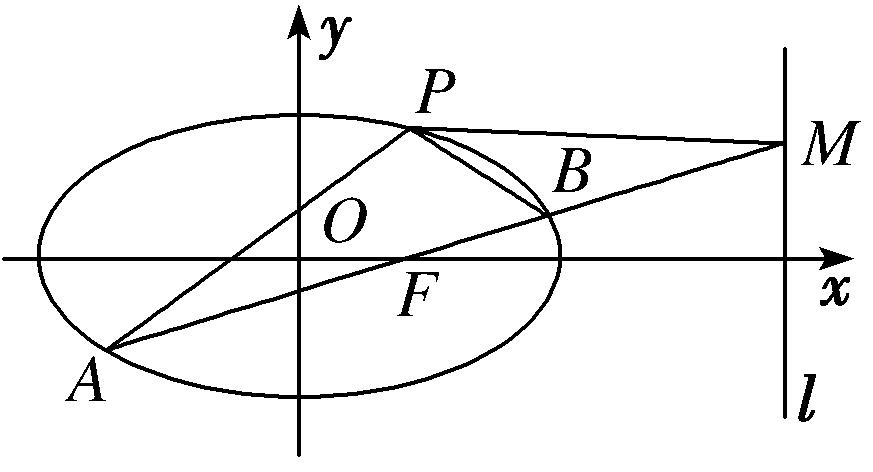
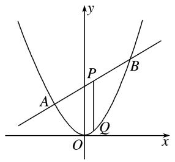
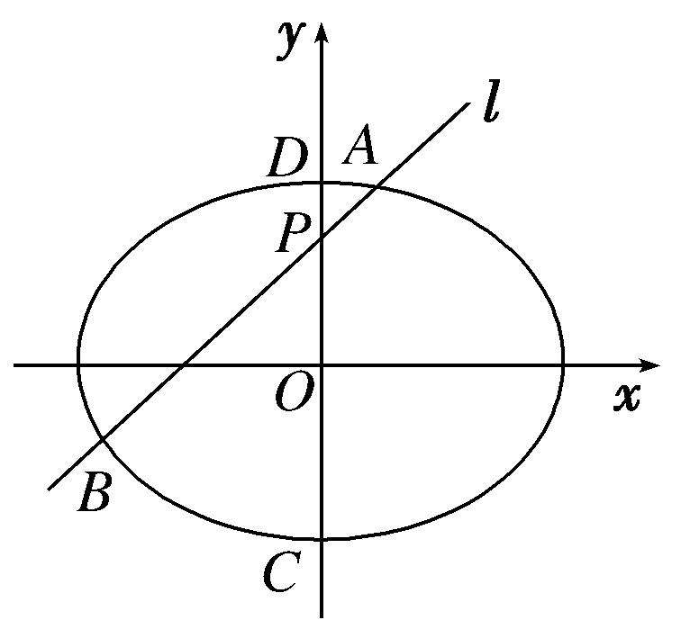
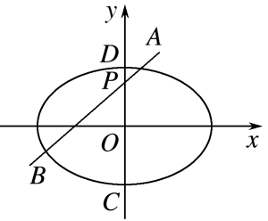

**专题32　探究是否存在常数型问题**

**探索性问题——肯定结论**

**1．存在性问题的解题步骤**

探索性问题通常采用“肯定顺推法”，将不确定性问题明朗化．一般步骤为：

(1)假设满足条件的元素(常数、点、直线或曲线)存在，引入参变量，根据题目条件列出关于参变量的方程(组)或不等式(组)；

(2)解此方程(组)或不等式(组)；

(3)若方程(组)有实数解，则元素(常数、点、直线或曲线)存在，否则不存在．

**2．解决存在性问题的注意事项**

探索性问题，先假设存在，推证满足条件的结论，若结论正确则存在，若结论不正确则不存在．

(1)当条件和结论不唯一时，要分类讨论．

(2)当给出结论而要推导出存在的条件时，先假设成立，再推出条件．

(3)当条件和结论都不知，按常规方法解题很难时，要思维开放，采取另外的途径．

**【例题选讲】**

<strong>[例1]</strong>　如图，椭圆<em>C</em>：＋＝1(<em>a</em>&gt;<em>b</em>&gt;0)经过点<em>P</em>，离心率e＝，直线<em>l</em>的方程为<em>x</em>＝4．

(1)求椭圆*C*的方程；

(2)<em>AB</em>是经过右焦点<em>F</em>的任一弦(不经过点<em>P</em>)，设直线<em>AB</em>与直线<em>l</em>相交于点<em>M</em>，记直线<em>PA</em>，<em>PB</em>，<em>PM</em>的斜率分别为<em>k</em>1，<em>k</em>2，<em>k</em>3．问：是否存在常数<em>λ</em>，使得<em>k</em>1＋<em>k</em>2＝<em>λk</em>3？若存在，求出<em>λ</em>的值；若不存在，请说明理由．

<strong>[破题思路]</strong>　(1)题目条件中给出椭圆过点<em>P</em>，离心率e＝．将<em>P</em>点坐标代入椭圆方程可得<em>a</em>，<em>b</em>的关系式；用离心率公式可得<em>a</em>，<em>c</em>的关系式，另外，还有<em>a</em>2＝<em>b</em>2＋<em>c</em>2，即可求得<em>a</em>，<em>b</em>的值．

(2)判断是否存在常数<em>λ</em>，使<em>k</em>1＋<em>k</em>2＝<em>λk</em>3成立．即方程<em>k</em>1＋<em>k</em>2＝<em>λk</em>3是否有解．题目条件中给出直线<em>AB</em>过右焦点<em>F</em>，且与椭圆及直线<em>l</em>分别交于点<em>A</em>，<em>B</em>，<em>M</em>，直线<em>PA</em>，<em>PB</em>，<em>PM</em>的斜率分别为<em>k</em>1，<em>k</em>2，<em>k</em>3，想到用斜率公式表示<em>k</em>1，<em>k</em>2，<em>k</em>3，需要<em>A</em>，<em>B</em>，<em>M</em>的坐标，可设出<em>A</em>，<em>B</em>，<em>M</em>的坐标，通过建立直线<em>AB</em>与椭圆方程的方程组求得各坐标的关系．

<strong>[规范解答]</strong>　(1)由题意得解得故椭圆<em>C</em>的方程为＋＝1．

(2)由题意可设直线*AB*的斜率为*k*，则直线*AB*的方程为*y*＝*k*(*x*－1)，①

代入椭圆方程，并整理，得(4<em>k</em>2＋3)<em>x</em>2－8<em>k</em>2<em>x</em>＋4(<em>k</em>2－3)＝0，

设<em>A</em>(<em>x</em>1，<em>y</em>1)，<em>B</em>(<em>x</em>2，<em>y</em>2)，且<em>x</em>1≠<em>x</em>2≠1，则<em>x</em>1＋<em>x</em>2＝，<em>x</em>1<em>x</em>2＝，②

在方程①中令<em>x</em>＝4，得点<em>M</em>的坐标为(4，3<em>k</em>)．从而<em>k</em>1＝，<em>k</em>2＝，<em>k</em>3＝＝<em>k</em>－．

因为<em>A</em>，<em>F</em>，<em>B</em>三点共线，所以<em>k</em>＝<em>kAF</em>＝<em>kBF</em>，即＝＝<em>k</em>，

所以<em>k</em>1＋<em>k</em>2＝＋＝＋－＝2<em>k</em>－·，③

将②代入③得，<em>k</em>1＋<em>k</em>2＝2<em>k</em>－·＝2<em>k</em>－1，又<em>k</em>3＝<em>k</em>－，所以<em>k</em>1＋<em>k</em>2＝2<em>k</em>3．

故存在常数*λ*＝2符合题意．

**[题后悟通]**　求解字母参数值的存在性问题时，通常的方法是首先假设满足条件的参数值存在，然后利用这些条件并结合题目的其他已知条件进行推理与计算，若不出现矛看，并且得到了相应的参数值，就说明满足条件的参数值存在；若在推理与计算中出现了矛盾，则说明满足条件的参数值不存在，同时推理与计算的过程就是说明理由的过程．

<strong>[例2]</strong>　已知抛物线<em>C</em>：<em>x</em>2＝2<em>py</em>(<em>p</em>&gt;0)的焦点为<em>F</em>，直线2<em>x</em>－<em>y</em>＋2＝0交抛物线<em>C</em>于<em>A</em>，<em>B</em>两点，<em>P</em>是线段<em>AB</em>的中点，过<em>P</em>作<em>x</em>轴的垂线交抛物线<em>C</em>于点<em>Q</em>．

(1)*D*是抛物线*C*上的动点，点*E*(－1，3)，若直线*AB*过焦点*F*，求|*DF*|＋|*DE*|的最小值；

(2)是否存在实数*p*，使|2＋|＝|2－|？若存在，求出*p*的值；若不存在，说明理由．

<strong>[规范解答]</strong>　(1)∵直线2<em>x</em>－<em>y</em>＋2＝0与<em>y</em>轴的交点为(0，2)，

∴<em>F</em>(0，2)，则抛物线<em>C</em>的方程为<em>x</em>2＝8<em>y</em>，准线<em>l</em>：<em>y</em>＝－2．

设过*D*作*DG*⊥*l*于*G*，则|*DF*|＋|*DE*|＝|*DG*|＋|*DE*|，

当*E*，*D*，*G*三点共线时，|*DF*|＋|*DE*|取最小值2＋3＝5．

(2)假设存在，抛物线<em>x</em>2＝2<em>py</em>与直线<em>y</em>＝2<em>x</em>＋2联立，得<em>x</em>2－4<em>px</em>－4<em>p</em>＝0，

设<em>A</em>(<em>x</em>1，<em>y</em>1)，<em>B</em>(<em>x</em>2，<em>y</em>2)，<em>Δ</em>＝(4<em>p</em>)2＋16<em>p</em>＝16(<em>p</em>2＋<em>p</em>)&gt;0，则<em>x</em>1＋<em>x</em>2＝4<em>p</em>，<em>x</em>1<em>x</em>2＝－4<em>p</em>，∴<em>Q</em>(2<em>p，</em>2<em>p</em>)．

∵|2＋|＝|2－|，∴⊥．则·＝0，

得(<em>x</em>1－2<em>p</em>)(<em>x</em>2－2<em>p</em>)＋(<em>y</em>1－2<em>p</em>)(<em>y</em>2－2<em>p</em>)＝(<em>x</em>1－2<em>p</em>)(<em>x</em>2－2<em>p</em>)＋(2<em>x</em>1＋2－2<em>p</em>)(2<em>x</em>2＋2－2<em>p</em>)

＝5<em>x</em>1<em>x</em>2＋(4－6<em>p</em>)(<em>x</em>1＋<em>x</em>2)＋8<em>p</em>2－8<em>p</em>＋4＝0，

代入得4<em>p</em>2＋3<em>p</em>－1＝0，解得<em>p</em>＝或<em>p</em>＝－1(舍去)．

因此存在实数*p*＝，且满足*Δ*>0，使得|2＋|＝|2－|成立．

<strong>[例3]</strong>　已知焦点在<em>y</em>轴上的椭圆<em>E</em>的中心是原点<em>O</em>，离心率等于，以椭圆<em>E</em>的长轴和短轴为对角线的四边形的周长为4．直线<em>l</em>：<em>y</em>＝<em>kx</em>＋<em>m</em>与<em>y</em>轴交于点<em>P</em>，与椭圆<em>E</em>交于<em>A</em>，<em>B</em>两个相异点，且＝<em>λ．</em>

(1)求椭圆*E*的方程；

(2)是否存在*m*，使＋*λ*＝4？若存在，求*m*的取值范围；若不存在，请说明理由．

<strong>[规范解答]</strong>　(1)根据已知设椭圆<em>E</em>的方程为＋＝1(<em>a</em>&gt;<em>b</em>&gt;0)，焦距为2<em>c</em>，

由已知得＝，所以<em>c</em>＝<em>a</em>，<em>b</em>2＝<em>a</em>2－<em>c</em>2＝．

因为以椭圆*E*的长轴和短轴为对角线的四边形的周长为4，

所以4＝2<em>a</em>＝4，所以<em>a</em>＝2，<em>b</em>＝1．所以椭圆<em>E</em>的方程为<em>x</em>2＋＝1．

(2)根据已知得*P*(0，*m*)，由＝*λ*，得－＝*λ*(－)．所以＋*λ*＝(1＋*λ*)．

因为＋*λ*＝4，所以(1＋*λ*)＝4．

若<em>m</em>＝0，由椭圆的对称性得＝，即＋＝<strong>0</strong>．所以<em>m</em>＝0能使＋<em>λ</em>＝4成立．

若*m*≠0，则1＋*λ*＝4，解得*λ*＝3．

设<em>A</em>(<em>x</em>1，<em>kx</em>1＋<em>m</em>)，<em>B</em>(<em>x</em>2，<em>kx</em>2＋<em>m</em>)，由，得(<em>k</em>2＋4)<em>x</em>2＋2<em>mkx</em>＋<em>m</em>2－4＝0，

由已知得<em>Δ</em>＝4<em>m</em>2<em>k</em>2－4(<em>k</em>2＋4)(<em>m</em>2－4)&gt;0，即<em>k</em>2－<em>m</em>2＋4&gt;0，且<em>x</em>1＋<em>x</em>2＝，<em>x</em>1<em>x</em>2＝．

由＝3得－<em>x</em>1＝3<em>x</em>2，即<em>x</em>1＝－3<em>x</em>2，所以3(<em>x</em>1＋<em>x</em>2)2＋4<em>x</em>1<em>x</em>2＝0，

所以＋＝0，即<em>m</em>2<em>k</em>2＋<em>m</em>2－<em>k</em>2－4＝0．

当<em>m</em>2＝1时，<em>m</em>2<em>k</em>2＋<em>m</em>2－<em>k</em>2－4＝0不成立．所以<em>k</em>2＝．

因为<em>k</em>2－<em>m</em>2＋4&gt;0，所以－<em>m</em>2＋4&gt;0，即&gt;0．

所以1&lt;<em>m</em>2&lt;4，解得－2&lt;<em>m</em>&lt;－1或1&lt;<em>m</em>&lt;2．

综上，当－2<*m*<－1或*m*＝0或1<*m*<2时，＋*λ*＝4．

<strong>[例4]</strong>　(2015·四川)如图，椭圆<em>E</em>：＋＝1(<em>a</em>&gt;<em>b</em>&gt;0)的离心率是，点<em>P</em>(0，1)在短轴<em>CD</em>上，且·＝－1．

(1)求椭圆*E*的标准方程；

(2)设*O*为坐标原点，过点*P*的动直线与椭圆交于*A*，*B*两点．是否存在常数*λ*，使得·＋*λ*·为定值？若存在，求*λ*的值；若不存在，请说明理由．

<strong>[规范解答]</strong>　(1)由已知，点<em>C</em>，<em>D</em>的坐标分别为(0，－<em>b</em>)，(0，<em>b</em>)．

又点*P*的坐标为(0,1)，且·＝－1，于是解得*a*＝2，*b*＝．

所以椭圆*E*的方程为＋＝1．

(2)当直线<em>AB</em>的斜率存在时，设直线<em>AB</em>的方程为<em>y</em>＝<em>kx</em>＋1，<em>A</em>，<em>B</em>的坐标分别为(<em>x</em>1，<em>y</em>1)，(<em>x</em>2，<em>y</em>2)．

联立得(2<em>k</em>2＋1)<em>x</em>2＋4<em>kx</em>－2＝0，其判别式<em>Δ</em>＝(4<em>k</em>)2＋8(2<em>k</em>2＋1)&gt;0，

所以<em>x</em>1＋<em>x</em>2＝－，<em>x</em>1<em>x</em>2＝－．

从而，·＋<em>λ</em>·＝<em>x</em>1<em>x</em>2＋<em>y</em>1<em>y</em>2＋<em>λ</em>[<em>x</em>1<em>x</em>2＋(<em>y</em>1－1)(<em>y</em>2－1)]＝(1＋<em>λ</em>)(1＋<em>k</em>2)<em>x</em>1<em>x</em>2＋<em>k</em>(<em>x</em>1＋<em>x</em>2)＋1

＝＝－－*λ*－2，所以，

当*λ*＝1时，－－*λ*－2＝－3，此时，·＋*λ*·＝－3为定值．

当直线*AB*斜率不存在时，直线*AB*即为直线*CD*，

此时，·＋*λ*·＝·＋*λ*·＝－2－*λ*．

当*λ*＝1时，·＋*λ*·＝－3，为定值．

综上，存在常数*λ*＝1，使得·＋*λ*·为定值－3．

<strong>[例5]</strong>　已知椭圆<em>x</em>2＋2<em>y</em>2＝<em>m</em>(<em>m</em>&gt;0)，以椭圆内一点<em>M</em>(2，1)为中点作弦<em>AB</em>，设线段<em>AB</em>的中垂线与椭圆相交于<em>C</em>，<em>D</em>两点．

(1)求椭圆的离心率；

(2)试判断是否存在这样的*m*，使得*A*，*B*，*C*，*D*在同一个圆上，并说明理由．

<strong>[规范解答]</strong>　(1)将方程化成椭圆的标准方程＋＝1(<em>m</em>&gt;0)，则<em>a</em>＝，<em>c</em>＝＝，故e＝＝．

(2)由题意，设<em>A</em>(<em>x</em>1，<em>y</em>1)，<em>B</em>(<em>x</em>2，<em>y</em>2)，<em>C</em>(<em>x</em>3，<em>y</em>3)，<em>D</em>(<em>x</em>4，<em>y</em>4)，直线<em>AB</em>的斜率存在，设为<em>k</em>，

则直线<em>AB</em>的方程为<em>y</em>＝<em>k</em>(<em>x</em>－2)＋1，代入<em>x</em>2＋2<em>y</em>2＝<em>m</em>(<em>m</em>&gt;0)，

消去<em>y</em>，得(1＋2<em>k</em>2)<em>x</em>2＋4<em>k</em>(1－2<em>k</em>)<em>x</em>＋2(2<em>k</em>－1)2－<em>m</em>＝0(<em>m</em>&gt;0)．

所以<em>x</em>1＋<em>x</em>2＝＝4，即<em>k</em>＝－1，此时，由<em>Δ</em>&gt;0，得<em>m</em>&gt;6．

则直线*AB*的方程为*x*＋*y*－3＝0，直线*CD*的方程为*x*－*y*－1＝0．

由得3<em>y</em>2＋2<em>y</em>＋1－<em>m</em>＝0，<em>y</em>3＋<em>y</em>4＝－，故<em>CD</em>的中点<em>N</em>为．

由弦长公式，可得|<em>AB</em>|＝ |<em>x</em>1－<em>x</em>2|＝·．

|<em>CD</em>|＝|<em>y</em>3－<em>y</em>4|＝·&gt;|<em>AB</em>|，若存在圆，则圆心在<em>CD</em>上，

因为*CD*的中点*N*到直线*AB*的距离*d*＝＝．

|<em>NA</em>|2＝|<em>NB</em>|2＝2＋2＝，又2＝2＝，

故存在这样的*m*(*m*>6)，使得*A*，*B*，*C*，*D*在同一个圆上．

<strong>[例6]</strong>　已知中心在原点<em>O</em>，焦点在<em>x</em>轴上的椭圆，离心率e＝，且椭圆过点．

(1)求椭圆的方程；

(2)椭圆左、右焦点分别为<em>F</em>1，<em>F</em>2，过<em>F</em>2的直线<em>l</em>与椭圆交于不同的两点<em>A</em>，<em>B</em>，则△<em>F</em>1<em>AB</em>的内切圆的面积是否存在最大值？若存在，求出这个最大值及此时的直线方程；若不存在，请说明理由．

<strong>[规范解答]</strong>　(1)由题意可设椭圆方程为＋＝1(<em>a</em>&gt;<em>b</em>&gt;0)，则解得<em>a</em>2＝4，<em>b</em>2＝3．

∴椭圆方程为＋＝1．

(2)设<em>A</em>(<em>x</em>1，<em>y</em>1)，<em>B</em>(<em>x</em>2，<em>y</em>2)，不妨设<em>y</em>1＞0，<em>y</em>2＜0，设△<em>F</em>1<em>AB</em>的内切圆的半径为<em>R</em>，

则△<em>F</em>1<em>AB</em>的周长＝4<em>a</em>＝8，<em>S</em>△<em>F</em>1<em>AB</em>＝(|<em>AB</em>|＋|<em>F</em>1<em>A</em>|＋|<em>F</em>1<em>B</em>|)<em>R</em>＝4<em>R</em>，因此，<em>S</em>△<em>F</em>1<em>AB</em>最大，<em>R</em>就最大，

由题知，直线*l*的斜率不为零，可设直线*l*的方程为*x*＝*my*＋1，

由得(3<em>m</em>2＋4)<em>y</em>2＋6<em>my</em>－9＝0，<em>y</em>1＋<em>y</em>2＝，<em>y</em>1<em>y</em>2＝－．

则<em>S</em>△<em>F</em>1<em>AB</em>＝|<em>F</em>1<em>F</em>2|(<em>y</em>1－<em>y</em>2)＝，令＝<em>t</em>，则<em>m</em>2＝<em>t</em>2－1(<em>t</em>≥1)，

∴<em>S</em>△<em>F</em>1<em>AB</em>＝＝．令<em>f</em>(<em>t</em>)＝3<em>t</em>＋，则<em>f</em>′(<em>t</em>)＝3－，

当<em>t</em>≥1时，<em>f</em>′(<em>t</em>)≥0，<em>f</em>(<em>t</em>)在[1，＋∞)上单调递增，有<em>f</em>(<em>t</em>)≥<em>f</em>(1)＝4，<em>S</em>△<em>F</em>1<em>AB</em>≤3，

即当<em>t</em>＝1，<em>m</em>＝0时，<em>S</em>△<em>F</em>1<em>AB</em>≤3，

由<em>S</em>△<em>F</em>1<em>AB</em>＝4<em>R</em>，得<em>R</em>max＝，这时所求内切圆面积的最大值为，故直线<em>l</em>：<em>x</em>＝1．

**【对点训练】**

1．已知椭圆<em>C</em>：＋＝1 (<em>a</em>&gt;<em>b</em>&gt;0)的左、右焦点为<em>F</em>1，<em>F</em>2，其离心率为，又抛物线<em>x</em>2＝4<em>y</em>在点<em>P</em>(2，

1)处的切线恰好过椭圆*C*的一个焦点．

(1)求椭圆*C*的方程；

(2)过点<em>M</em>(－4，0)，斜率为<em>k</em>(<em>k</em>≠0)的直线<em>l</em>交椭圆<em>C</em>于<em>A</em>，<em>B</em>两点，直线<em>AF</em>1，<em>BF</em>1的斜率分别为<em>k</em>1，<em>k</em>2，是否存在常数<em>λ</em>，使得<em>k</em>1<em>k</em>＋<em>k</em>2<em>k</em>＝<em>λk</em>1<em>k</em>2？若存在，求出<em>λ</em>的值；若不存在，请说明理由．

1．解析　(1)∵抛物线<em>x</em>2＝4<em>y</em>在点<em>P</em>(2，1)处的切线方程为<em>y</em>＝<em>x</em>－1，它过<em>x</em>轴上的点(1，0)，

∴椭圆*C*的一个焦点为(1，0)，即*c*＝1，又∵*e*＝＝，∴*a*＝，*b*＝1，

∴椭圆<em>C</em>的方程为＋<em>y</em>2＝1．

(2)设<em>A</em>(<em>x</em>1，<em>y</em>1)，<em>B</em>(<em>x</em>2，<em>y</em>2)，<em>l</em>的方程为<em>y</em>＝<em>k</em>(<em>x</em>＋4)，联立

⇒(1＋2<em>k</em>2)<em>x</em>2＋16<em>k</em>2<em>x</em>＋32<em>k</em>2－2＝0，∴

∵<em>F</em>1(－1，0)，<em>k</em>1＝，<em>k</em>2＝，∴＋＝＋＝，

∴＋＝＝，∴<em>k</em>1<em>k</em>＋<em>k</em>2<em>k</em>＝<em>k</em>1<em>k</em>2，∴存在常数<em>λ</em>＝．

2．已知椭圆＋＝1(<em>a</em>&gt;<em>b</em>&gt;0)的长轴与短轴之和为6，椭圆上任一点到两焦点<em>F</em>1，<em>F</em>2的距离之和为4．

(1)求椭圆的标准方程；

(2)若直线*AB*：*y*＝*x*＋*m*与椭圆交于*A*，*B*两点，*C*，*D*在椭圆上，且*C*，*D*两点关于直线*AB*对称，问：是否存在实数*m*，使|*AB*|＝|*CD*|，若存在，求出*m*的值；若不存在，请说明理由．

2．解析　(1)由题意，2<em>a</em>＝4，2<em>a</em>＋2<em>b</em>＝6，∴<em>a</em>＝2，<em>b</em>＝1．∴椭圆的标准方程为＋<em>y</em>2＝1．

(2)∵*C*，*D*关于直线*AB*对称，设直线*CD*的方程为*y*＝－*x*＋*t*，

联立消去<em>y</em>，得5<em>x</em>2－8<em>tx</em>＋4<em>t</em>2－4＝0，<em>Δ</em>＝64<em>t</em>2－4×5×(4<em>t</em>2－4)&gt;0，解得<em>t</em>2&lt;5，

设<em>C</em>，<em>D</em>两点的坐标分别为(<em>x</em>1，<em>y</em>1)，(<em>x</em>2，<em>y</em>2)，则<em>x</em>1＋<em>x</em>2＝，<em>x</em>1<em>x</em>2＝，

设<em>CD</em>的中点为<em>M</em>(<em>x</em>0，<em>y</em>0)，∴∴<em>M</em>，

又点<em>M</em>也在直线<em>y</em>＝<em>x</em>＋<em>m</em>上，则＝＋<em>m</em>，∴<em>t</em>＝－，∵<em>t</em>2&lt;5，∴<em>m</em>2&lt;．

则|<em>CD</em>|＝|<em>x</em>1－<em>x</em>2|＝·＝·．同理|<em>AB</em>|＝·．

∵|<em>AB</em>|＝|<em>CD</em>|，∴|<em>AB</em>|2＝2|<em>CD</em>|2，∴2<em>t</em>2－<em>m</em>2＝5，∴<em>m</em>2＝&lt;，

∴存在实数*m*，使|*AB*|＝|*CD*|，此时*m*的值为±．

3．已知椭圆<em>C</em>1：＋＝1(<em>a</em>&gt;0)与抛物线<em>C</em>2：<em>y</em>2＝2<em>ax</em>相交于<em>A</em>，<em>B</em>两点，且两曲线的焦点<em>F</em>重合．

(1)求<em>C</em>1，<em>C</em>2的方程；

(2)若过焦点*F*的直线*l*与椭圆分别交于*M*，*Q*两点，与抛物线分别交于*P*，*N*两点，是否存在常数*k*(*k*≠0)，使得直线*l*的斜率为*k*且＝2？若存在，求出*k*的值；若不存在，请说明理由．

3．解析　(1)因为<em>C</em>1，<em>C</em>2的焦点重合，所以＝，所以<em>a</em>2＝4．又<em>a</em>&gt;0，所以<em>a</em>＝2．

于是椭圆<em>C</em>1的方程为＋＝1，抛物线<em>C</em>2的方程为<em>y</em>2＝4<em>x</em>．

(2)假设存在直线*l*使得＝2，当*l*⊥*x*轴时，|*MQ*|＝3，|*PN*|＝4，不符合题意，

∴直线*l*的斜率存在，∴可设直线*l*的方程为*y*＝*k*(*x*－1)(*k*≠0)，

<em>P</em>(<em>x</em>1，<em>y</em>1)，<em>Q</em>(<em>x</em>2，<em>y</em>2)，<em>M</em>(<em>x</em>3，<em>y</em>3)，<em>N</em>(<em>x</em>4，<em>y</em>4)．由可得<em>k</em>2<em>x</em>2－(2<em>k</em>2＋4)<em>x</em>＋<em>k</em>2＝0，

则<em>x</em>1＋<em>x</em>4＝，<em>x</em>1<em>x</em>4＝1，且<em>Δ</em>＝16<em>k</em>2＋16&gt;0，

所以|*PN*|＝·＝．

由可得(3＋4<em>k</em>2)<em>x</em>2－8<em>k</em>2<em>x</em>＋4<em>k</em>2－12＝0，则<em>x</em>2＋<em>x</em>3＝，<em>x</em>2<em>x</em>3＝，

且<em>Δ</em>＝144<em>k</em>2＋144&gt;0，所以|<em>MQ</em>|＝·＝．

若＝2，则＝2×，解得*k*＝±．

故存在斜率为*k*＝±的直线*l*，使得＝2．

4．如图，椭圆*E*：＋＝1(*a*>*b*>0)的离心率是，点*P*(0，1)在短轴*CD*上，且·＝－1．

(1)求椭圆*E*的方程；

(2)设*O*为坐标原点，过点*P*的动直线与椭圆交于*A*，*B*两点．是否存在常数*λ*，使得·＋*λ*·为定值？若存在，求出*λ*的值；若不存在，请说明理由．

4．解析　(1)由已知，点*C*，*D*的坐标分别为(0，－*b*)，(0，*b*)，又点*P*的坐标为(0，1)，且·＝－1，

于是解得*a*＝2，*b*＝，所以椭圆*E*的方程为＋＝1．

(2)当直线<em>AB</em>的斜率存在时，设直线<em>AB</em>的方程为<em>y</em>＝<em>kx</em>＋1，<em>A</em>，<em>B</em>的坐标分别为(<em>x</em>1，<em>y</em>1)，(<em>x</em>2，<em>y</em>2)，

联立得(4<em>k</em>2＋1)<em>x</em>2＋8<em>kx</em>－4＝0，其判别式<em>Δ</em>＝(8<em>k</em>)2＋16(4<em>k</em>2＋1)&gt;0，

所以<em>x</em>1＋<em>x</em>2＝－，<em>x</em>1<em>x</em>2＝－，

从而，·＋<em>λ</em>·＝<em>x</em>1<em>x</em>2＋<em>y</em>1<em>y</em>2＋<em>λ</em>[<em>x</em>1<em>x</em>2＋(<em>y</em>1－1)(<em>y</em>2－1)]＝(1＋<em>λ</em>)(1＋<em>k</em>2)<em>x</em>1<em>x</em>2＋<em>k</em>(<em>x</em>1＋<em>x</em>2)＋1

＝＝－－*λ*－2．

所以当*λ*＝－时，－－*λ*－2＝－，此时·＋*λ*·＝－为定值．

当直线*AB*斜率不存在时，直线*AB*即为直线*CD*，此时，

·＋*λ*·＝·－·＝－2＋＝－．

故存在常数*λ*＝－，使得·＋*λ*·为定值－．

5．(2015·全国Ⅱ)已知椭圆<em>C</em>：9<em>x</em>2＋<em>y</em>2＝<em>m</em>2(<em>m</em>&gt;0)，直线<em>l</em>不过原点<em>O</em>且不平行于坐标轴，<em>l</em>与<em>C</em>有两个交

点*A*，*B*，线段*AB*的中点为*M*．

(1)证明：直线*OM*的斜率与*l*的斜率的乘积为定值；

(2)若*l*过点，延长线段*OM*与*C*交于点*P*，四边形*OAPB*能否为平行四边形？若能，求此时*l*的斜率；若不能，说明理由．

5．解析　(1)设直线<em>l</em>：<em>y</em>＝<em>kx</em>＋<em>b</em>(<em>k</em>≠0，<em>b</em>≠0)，<em>A</em>(<em>x</em>1，<em>y</em>1)，<em>B</em>(<em>x</em>2，<em>y</em>2)，<em>M</em>(<em>xM</em>，<em>yM</em>)．

将<em>y</em>＝<em>kx</em>＋<em>b</em>代入9<em>x</em>2＋<em>y</em>2＝<em>m</em>2，得(<em>k</em>2＋9)<em>x</em>2＋2<em>kbx</em>＋<em>b</em>2－<em>m</em>2＝0，

故<em>xM</em>＝＝，<em>yM</em>＝<em>kxM</em>＋<em>b</em>＝．

于是直线<em>OM</em>的斜率<em>kOM</em>＝＝－，即<em>kOM</em>·<em>k</em>＝－9．所以直线<em>OM</em>的斜率与<em>l</em>的斜率的乘积为定值．

(2)四边形*OAPB*能为平行四边形．

因为直线*l*过点，所以*l*不过原点且与*C*有两个交点的充要条件是*k*>0，*k*≠3．

由(1)得<em>OM</em>的方程为<em>y</em>＝－<em>x．</em>设点<em>P</em>的横坐标为<em>xP</em>．

由得<em>x</em>＝，即<em>xP</em>＝ ．

将点的坐标代入直线<em>l</em>的方程得<em>b</em>＝，因此<em>xM</em>＝．

四边形*OAPB*为平行四边形，当且仅当线段*AB*与线段*OP*互相平分，

即<em>xP</em>＝2<em>xM</em>，于是＝2×，解得<em>k</em>1＝4－，<em>k</em>2＝4＋．

因为<em>ki</em>&gt;0，<em>ki</em>≠3，<em>i</em>＝1,2，所以当直线<em>l</em>的斜率为4－或4＋时，四边形<em>OAPB</em>为平行四边形．

6．已知椭圆*M*：＋＝1(*a*>*b*>0)的一个顶点坐标为(0，1)，离心率为，动直线*y*＝*x*＋*m*交椭圆*M*于

不同的两点*A*，*B*，*T*(1，1)．

(1)求椭圆*M*的标准方程；

(2)试问：△*TAB*的面积是否存在最大值？若存在，求出这个最大值；若不存在，请说明理由．

6．解析　(1)由题意得＝，<em>b</em>＝1，又<em>a</em>2＝<em>b</em>2＋<em>c</em>2，所以<em>a</em>＝，<em>c</em>＝1，椭圆<em>M</em>的标准方程为＋<em>y</em>2＝1．

(2)由得3<em>x</em>2＋4<em>mx</em>＋2<em>m</em>2－2＝0．

由题意得，<em>Δ</em>＝16<em>m</em>2－24(<em>m</em>2－1)&gt;0，即<em>m</em>2－3&lt;0，所以－&lt;<em>m</em>&lt;．

设<em>A</em>(<em>x</em>1，<em>y</em>1)，<em>B</em>(<em>x</em>2，<em>y</em>2)，则<em>x</em>1＋<em>x</em>2＝，<em>x</em>1<em>x</em>2＝，

|<em>AB</em>|＝＝|<em>x</em>1－<em>x</em>2|＝ ＝．

又由题意得，*T*(1，1)到直线*y*＝*x*＋*m*的距离*d*＝．

假设△<em>TAB</em>的面积存在最大值，则<em>m</em>≠0，<em>S</em>△<em>TAB</em>＝|<em>AB</em>|<em>d</em>＝××＝．

由基本不等式得，<em>S</em>△<em>TAB</em>≤·＝，

当且仅当*m*＝±时取等号，而*m*∈(－，0)∪(0，)，所以△*TAB*面积的最大值为．

故△*TAB*的面积存在最大值，且当*m*＝±时，△*TAB*的面积取得最大值．

