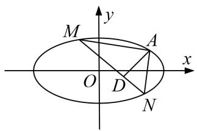
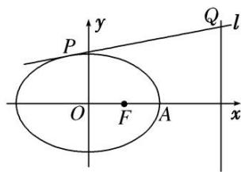
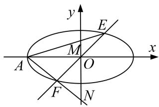
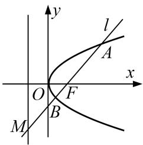
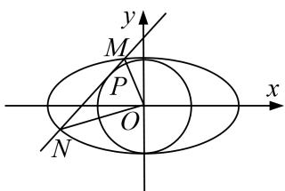
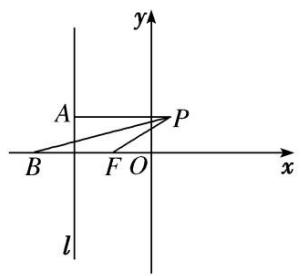
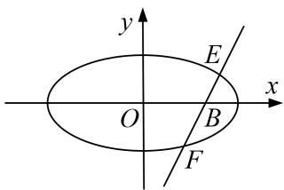

# 专题33 探究是否存在点型问题

# 探索性问题——肯定结论

#### 1. 存在性问题的解题步骤

探索性问题通常采用“肯定顺推法”，将不确定性问题明朗化．一般步骤为：  
（1）假设满足条件的元素(常数、点、直线或曲线)存在，引入参变量，根据题目条件列出关于参变量的方程(组)或不等式(组);  
（2）解此方程(组)或不等式(组);   
（3）若方程(组)有实数解，则元素(常数、点、直线或曲线)存在，否则不存在.

#### 2. 解决存在性问题的注意事项

探索性问题，先假设存在，推证满足条件的结论，若结论正确则存在，若结论不正确则不存在.  
（1）当条件和结论不唯一时，要分类讨论.   
（2）当给出结论而要推导出存在的条件时，先假设成立，再推出条件.  
（3）当条件和结论都不知，按常规方法解题很难时，要思维开放，采取另外的途径.

# 【例题选讲】

[例 1] (2020·新高考I)已知椭圆 C: $\frac{x^{2}}{a^{2}}+\frac{y^{2}}{b^{2}}=1(a>b>0)$ 的离心率为 $\frac{\sqrt{2}}{2}$ ，且过点 A(2, 1).  
（1）求 C 的方程;  
（2）点 M, N 在 C 上，且 $AM \perp AN$ ， $AD \perp MN$ ，D 为垂足．证明：存在定点 Q，使得 $|DQ|$ 为定值.

[规范解答] （1）由题设得 $\frac{4}{a^{2}}+\frac{1}{b^{2}}=1,\quad\frac{a^{2}-b^{2}}{a^{2}}=\frac{1}{2}$ ，解得 $a^{2}=6,\quad b^{2}=3$ ．所以C的方程为 $\frac{x^{2}}{6}+\frac{y^{2}}{3}=1$  
（2）设 $M(x_{1}, y_{1})$ ， $N(x_{2}, y_{2})$ 。若直线 MN 与 x 轴不垂直，
设直线 MN 的方程为 $y=kx+m$ ，代入 $\frac{x^{2}}{6}+\frac{y^{2}}{3}=1$ ，得 $(1+2k^{2})x^{2}+4kmx+2m^{2}-6=0$ .
于是 $x_{1}+x_{2}=-\frac{4km}{1+2k^{2}}$ ， $x_{1}x_{2}=\frac{2m^{2}-6}{1+2k^{2}}$ 。①
由 $AM \perp AN$ ，得 $\overrightarrow{AM} \cdot \overrightarrow{AN} = 0$ ，故 $(x_{1}-2)(x_{2}-2) + (y_{1}-1)(y_{2}-1) = 0$ ，
整理得 $(k^{2} + 1)x_{1}x_{2} + (km - k - 2)(x_{1} + x_{2}) + (m - 1)^{2} + 4 = 0.$
将①代入上式，可得 $(k^{2}+1)\frac{2m^{2}-6}{1+2k^{2}}-(km-k-2)\cdot\frac{4km}{1+2k^{2}}+(m-1)^{2}+4=0$
整理得 $(2k+3m+1)(2k+m-1)=0$ .
因为 $A(2,1)$ 不在直线 MN 上，所以 $2k+m-1\neq0$ ，所以 $2k+3m+1=0$ ， $k\neq1$ 。
所以直线 MN 的方程为 $y=k\left(x-\frac{2}{3}\right)-\frac{1}{3}(k\neq1)$ . 所以直线 MN 过点 $P\left(\frac{2}{3}, -\frac{1}{3}\right)$ .
若直线 MN 与 x 轴垂直，可得 $N(x_{1}, -y_{1})$ 。由 $\overrightarrow{AM} \cdot \overrightarrow{AN} = 0$ ，得 $(x_{1}-2)(x_{1}-2) + (y_{1}-1)(-y_{1}-1) = 0$ 。
又 $\frac{x_{1}^{2}}{6}+\frac{y_{1}^{2}}{3}=1$ ，所以 $3x_{1}^{2}-8x_{1}+4=0$ 。解得 $x_{1}=2$ （舍去）， $x_{1}=\frac{2}{3}$ 。此时直线MN过点 $P\left(\frac{2}{3},-\frac{1}{3}\right)$ 。
令 Q 为 AP 的中点，即 $Q\left(\frac{4}{3}, \frac{1}{3}\right)$ .
若 D 与 P 不重合，则由题设知 AP 是 Rt△ADP 的斜边，故 $|DQ|=\frac{1}{2}|AP|=\frac{2\sqrt{2}}{3}$ .
若 D 与 P 重合，则 $|DQ|=\frac{1}{2}|AP|$ .

综上，存在点 $Q\left(\frac{4}{3}, \frac{1}{3}\right)$ ，使得 $|DQ|$ 为定值.

[例 2] 已知椭圆 $C_{1}:\frac{x^{2}}{a^{2}}+\frac{y^{2}}{b^{2}}=1(a>b>0)$ 的离心率为 $e=\frac{\sqrt{6}}{3}$ ，过 $C_{1}$ 的左焦点 $F_{1}$ 的直线 l: x-y+2=0 被圆 $C_{2}:(x-3)^{2}+(y-3)^{2}=r^{2}(r>0)$ 截得的弦长为 $2\sqrt{2}$ .  
（1）求椭圆 $C_{1}$ 的方程;  
（2）设 $C_1$ 的右焦点为 $F_{2}$ , 在圆 $C_2$ 上是否存在点 $P$ , 满足 $|PF_1| = \frac{a^2}{b^2} |PF_2|$ ? 若存在, 指出有几个这样的点(不必求出点的坐标); 若不存在, 说明理由.

[规范解答] （1）∵直线 l 的方程为 $x-y+2=0$ ，令 y=0，得 x=-2，即 $F_{1}(-2,0)$ ,
$\therefore c = 2$ ，又 $e = \frac{c}{a} = \frac{\sqrt{6}}{3}$ ， $\therefore a^2 = 6$ ， $b^{2} = a^{2} - c^{2} = 2$ ，∴椭圆 $C_1$ 的方程为 $\frac{x^2}{6} +\frac{y^2}{2} = 1$  
（2）∵圆心 $C_{2}(3,3)$ 到直线 l: x-y+2=0 的距离 $d=\frac{|3-3+2|}{\sqrt{2}}=\sqrt{2}$ ,
又直线 l: $x-y+2=0$ 被圆 $C_{2}:(x-3)^{2}+(y-3)^{2}=r^{2}(r>0)$ 截得的弦长为 $2\sqrt{2}$ ,
$\therefore r = \sqrt{d^2 + \left(\frac{2\sqrt{2}}{2}\right)^2} = \sqrt{2 + 2} = 2$ ，故圆 $C_2$ 的方程为 $(x - 3)^2 +(y - 3)^2 = 4.$
设圆 $C_{2}$ 上存在点 $P(x, y)$ ，满足 $\left|PF_{1}\right|=\frac{a^{2}}{b^{2}}\left|PF_{2}\right|$ ，即 $\left|PF_{1}\right|=3\left|PF_{2}\right|$ ，

且 $F_{1}$ ， $F_{2}$ 的坐标分别为 $F_{1}(-2,0)$ ， $F_{2}(2,0)$ ，则 $\sqrt{(x+2)^{2}+y^{2}}=3\sqrt{(x-2)^{2}+y^{2}}$
整理得 $\left(x-\frac{5}{2}\right)^{2}+y^{2}=\frac{9}{4}$ ，它表示圆心是 $C\left(\frac{5}{2},0\right)$ ，半径是 $\frac{3}{2}$ 的圆.
$\because |CC_{2}| = \sqrt{\left(3 - \frac{5}{2}\right)^{2} + (3 - 0)^{2}} = \frac{\sqrt{37}}{2}$ ，故有 $2 - \frac{3}{2} < |CC_{2}| < 2 + \frac{3}{2}$ ，故圆 $C$ 与圆 $C_{2}$ 相交，有两个公共点.
∴ 圆 $C_{2}$ 上存在两个不同的点 P，满足 $\left|PF_{1}\right|=\frac{a^{2}}{b^{2}}\left|PF_{2}\right|$ .

[例 3] 已知椭圆 C: $\frac{x^{2}}{a^{2}}+\frac{y^{2}}{b^{2}}=1(a>b>0)$ 的右焦点为 $F(1,0)$ ，右顶点为 A，且 $|AF|=1$ .  
（1）求椭圆 C 的标准方程;  
（2）若动直线 $l: y = kx + m$ 与椭圆 $C$ 有且只有一个交点 $P$ , 且与直线 $x = 4$ 交于点 $Q$ , 问: 是否存在一个定点 $M(t, 0)$ , 使得 $\overrightarrow{MP} \cdot \overrightarrow{MQ} = 0$ ? 若存在, 求出点 $M$ 的坐标; 若不存在, 说明理由.

[规范解答] （1）由 c=1, a-c=1，得 a=2，所以 $b=\sqrt{3}$ ，故椭圆 C 的标准方程为 $\frac{x^{2}}{4}+\frac{y^{2}}{3}=1$ .  
（2）由 $\left\{\begin{aligned}y&=kx+m,\\ \frac{x^{2}}{4}&+\frac{y^{2}}{3}=1,\end{aligned}\right.$ 消去 y 得 $(3+4k^{2})x^{2}+8kmx+4m^{2}-12=0,$
$\therefore \Delta = 6 4 k ^ {2} m ^ {2} - 4 (3 + 4 k ^ {2}) (4 m ^ {2} - 1 2) = 0, \text {即} m ^ {2} = 3 + 4 k ^ {2}.$
设 $P(x_{0}, y_{0})$ ，则 $x_{0} = -\frac{4km}{3 + 4k^{2}} = -\frac{4k}{m}$ ， $y_{0} = kx_{0} + m = -\frac{4k^{2}}{m} + m = \frac{3}{m}$ ，即 $P\left(-\frac{4k}{m}, \frac{3}{m}\right)$ .
$\because M (t, 0), Q (4, 4 k + m), \therefore \overrightarrow {M P} = \left[ - \frac {4 k}{m} - t, \frac {3}{m} \right], \overrightarrow {M Q} = (4 - t, 4 k + m),$
$\therefore \overrightarrow{MP} \cdot \overrightarrow{MQ} = \left(-\frac{4k}{m} - t\right) \cdot (4 - t) + \frac{3}{m} \cdot (4k + m) = t^2 - 4t + 3 + \frac{4k}{m} (t - 1) = 0$ 恒成立，
故 $\left\{\begin{aligned}t-1&=0,\\ t^{2}-4t+3&=0,\end{aligned}\right.$ 即 t=1．∴存在点 M(1,0) 符合题意.

[例 4] 已知椭圆 C: $\frac{x^{2}}{a^{2}} + \frac{y^{2}}{b^{2}} = 1 (a > b > 0)$ 的左顶点为 A，右焦点为 $F_{2}(2, 0)$ ，点 $B(2, -\sqrt{2})$ 在椭圆 C 上.  
（1）求椭圆 C 的方程.  
（2）若直线 $y = kx (k \neq 0)$ 与椭圆 $C$ 交于 $E, F$ 两点，直线 $AE, AF$ 分别与 $y$ 轴交于点 $M, N$ . 在 $x$ 轴上，是否存在点 $P$ ，使得无论非零实数 $k$ 怎样变化，总有 $\angle MPN$ 为直角？若存在，求出点 $P$ 的坐标；若不存在，请说明理由.

[规范解答] （1）依题意，得 c=2. ∵ 点 $B(2, -\sqrt{2})$ 在 C 上，∴ $\frac{4}{a^{2}} + \frac{2}{b^{2}} = 1$ .
又 $a^{2}=b^{2}+c^{2},\quad\therefore a^{2}=8,\quad b^{2}=4,\quad\therefore$ 椭圆 C 的方程为 $\frac{x^{2}}{8}+\frac{y^{2}}{4}=1$ .  
（2）假设存在这样的点 P，设 $P(x_{0}, 0)$ ， $E(x_{1}, y_{1})$ ， $x_{1} > 0$ ，则 $F(-x_{1}, -y_{1})$ ， $\left\{\begin{aligned}y &= kx, \\ \frac{x^{2}}{8} + \frac{y^{2}}{4} &= 1,\end{aligned}\right.$
消去 $y$ 并化简得， $(1 + 2k^2) \cdot x^2 - 8 = 0$ ，解得 $x_1 = \frac{2\sqrt{2}}{\sqrt{1 + 2k^2}}$ ，则 $y_1 = \frac{2\sqrt{2}k}{\sqrt{1 + 2k^2}}$ ，又 $A(-2\sqrt{2}, 0)$ ，
∴AE所在直线的方程为 $y = \frac{k}{1 + \sqrt{1 + 2k^2}}\cdot (x + 2\sqrt{2}),\quad \therefore M\left(0,\frac{2\sqrt{2}k}{1 + \sqrt{1 + 2k^2}}\right),$
同理可得 $N\left\{0, \frac{2\sqrt{2}k}{1-\sqrt{1+2k^{2}}}\right\}$ ,
$\overrightarrow {P M} = \left(- x _ {0}, \frac {2 \sqrt {2} k}{1 + \sqrt {1 + 2 k ^ {2}}}\right), \overrightarrow {P N} = \left(- x _ {0}, \frac {2 \sqrt {2} k}{1 - \sqrt {1 + 2 k ^ {2}}}\right).$
若 $\angle MPN$ 为直角，则 $\overrightarrow{PM} \cdot \overrightarrow{PN} = 0, \therefore x_{0}^{2} - 4 = 0,$
∴ $x_{0}=2$ 或 $x_{0}=-2$ ，∴存在点 P，使得无论非零实数 k 怎样变化，总有 $\angle MPN$ 为直角，
此时点 P 的坐标为 $(2, 0)$ 或 $(-2, 0)$ .

[例 5] (2015·全国I)在直角坐标系 xOy 中，曲线 C: $y=\frac{x^{2}}{4}$ 与直线 l: $y=kx+a(a>0)$ 交于 M, N 两点.  
（1）当 k=0 时，分别求 C 在点 M 和 N 处的切线方程；  
（2）y 轴上是否存在点 P，使得当 k 变动时，总有 $\angle OPM = \angle OPN$ ？说明理由.

[规范解答] （1）由题设可得 $M(2\sqrt{a}, a)$ ， $N(-2\sqrt{a}, a)$ ，或 $M(-2\sqrt{a}, a)$ ， $N(2\sqrt{a}, a)$ .
又 $y'=\frac{x}{2}$ ，故 $y=\frac{x^{2}}{4}$ 在 $x=2\sqrt{a}$ 处的导数值为 $\sqrt{a}$ ，
所以 C 在点 $(2\sqrt{a}, a)$ 处的切线方程为 $y - a = \sqrt{a}(x - 2\sqrt{a})$ ，即 $\sqrt{ax} - y - a = 0$ .
$y=\frac{x^{2}}{4}$ 在 $x=-2\sqrt{a}$ 处的导数值为 $-\sqrt{a}$ ，所以 C 在点 $(-2\sqrt{a}, a)$ 处的切线方程为 $y-a=-\sqrt{a}(x+2\sqrt{a})$ ,
即 $\sqrt{ax} + y + a = 0$ 。故所求切线方程为 $\sqrt{ax} - y - a = 0$ 和 $\sqrt{ax} + y + a = 0$ 。  
（2）存在符合题意的点．证明如下：
设 $P(0, b)$ 为符合题意的点， $M(x_{1}, y_{1})$ ， $N(x_{2}, y_{2})$ ，直线 PM，PN 的斜率分别为 $k_{1}$ ， $k_{2}$ .
将 $y=kx+a$ 代入 C 的方程，得 $x^{2}-4kx-4a=0$ ，故 $x_{1}+x_{2}=4k$ ， $x_{1}x_{2}=-4a$ 。
从而 $k_{1}+k_{2}=\frac{y_{1}-b}{x_{1}}+\frac{y_{2}-b}{x_{2}}=\frac{2kx_{1}x_{2}+(a-b)(x_{1}+x_{2})}{x_{1}x_{2}}=\frac{k(a+b)}{a}.$
当 b=-a 时，有 $k_{1}+k_{2}=0$ ，则直线 PM 的倾斜角与直线 PN 的倾斜角互补，
故 $\angle OPM = \angle OPN$ ，所以点 $P(0, -a)$ 符合题意.

[例 6] 已知椭圆 C: $\frac{y^{2}}{a^{2}} + \frac{x^{2}}{b^{2}} = 1 (a > b > 0)$ 的上、下焦点分别为 $F_{1}$ ， $F_{2}$ ，上焦点 $F_{1}$ 到直线 $4x + 3y + 12 = 0$ 的距离为 3，椭圆 C 的离心率 $e = \frac{1}{2}$ .  
（1）求椭圆 C 的方程;  
（2）椭圆 $E: \frac{y^2}{a^2} + \frac{3x^2}{16b^2} = 1$ ，设过点 $M(0, 1)$ ，斜率存在且不为 0 的直线交椭圆 $E$ 于 $A$ ， $B$ 两点，试问 $y$ 轴上是否存在点 $P$ ，使得 $\overrightarrow{PM} = \lambda \left[ \frac{\overrightarrow{PA}}{|\overrightarrow{PA}|} + \frac{\overrightarrow{PB}}{|\overrightarrow{PB}|} \right]$ ？若存在，求出点 $P$ 的坐标；若不存在，说明理由。

[规范解答] （1）由已知椭圆 C 的方程为 $\frac{y^{2}}{a^{2}} + \frac{x^{2}}{b^{2}} = 1 (a > b > 0)$ ，设椭圆的焦点 $F_{1}(0, c)$ ,
由 $F_{1}$ 到直线 $4x + 3y + 12 = 0$ 的距离为 3，得 $\frac{|3c + 12|}{5} = 3$ ，又椭圆 C 的离心率 $e = \frac{1}{2}$ ，所以 $\frac{c}{a} = \frac{1}{2}$ ，
又 $a^{2}=b^{2}+c^{2}$ ，求得 $a^{2}=4,\ b^{2}=3$ 。椭圆 C 的方程为 $\frac{y^{2}}{4}+\frac{x^{2}}{3}=1$ 。  
（2）存在．理由如下：由（1）得椭圆 $E:\frac{x^{2}}{16}+\frac{y^{2}}{4}=1$ ，设直线 AB 的方程为 $y=kx+1(k\neq0)$ ,
联立 $\left\{ \begin{array}{l} y = kx + 1, \\ \frac{x^2}{16} + \frac{y^2}{4} = 1, \end{array} \right.$ 消去 $y$ 并整理得 $(4k^2 + 1)x^2 + 8kx - 12 = 0, \Delta = (8k)^2 + 4(4k^2 + 1) \times 12 = 256k^2 + 48 > 0.$
设 $A(x_{1}, y_{1})$ ， $B(x_{2}, y_{2})$ ，则 $x_{1} + x_{2} = -\frac{8k}{4k^{2} + 1}$ ， $x_{1}x_{2} = -\frac{12}{4k^{2} + 1}$ .
假设存在点 $P(0, t)$ 满足条件，由于 $\overrightarrow{PM} = \lambda \left( \frac{\overrightarrow{PA}}{|\overrightarrow{PA}|} + \frac{\overrightarrow{PB}}{|\overrightarrow{PB}|} \right)$ ，所以 PM 平分 $\angle APB$ .
所以直线 $PA$ 与直线 $PB$ 的倾斜角互补，所以 $k_{PA} + k_{PB} = 0$ 。即 $\frac{y_1 - t}{x_1} + \frac{y_2 - t}{x_2} = 0$
即 $x_{2}(y_{1}-t)+x_{1}(y_{2}-t)=0.$ (\*)
将 $y_{1}=kx_{1}+1,\quad y_{2}=kx_{2}+1$ 代入(\*)式，整理得 $2kx_{1}x_{2}+(1-t)(x_{1}+x_{2})=0$
所以 $-2k\cdot\frac{12}{4k^{2}+1}+\frac{(1-t)\times(-8k)}{4k^{2}+1}=0$ ，整理得 $3k+k(1-t)=0$ ，即 $k(4-t)=0$ ，因为 $k\neq0$ ，所以 t=4。
所以存在点 $P(0, 4)$ ，使得 $\overrightarrow{PM} = \lambda \left( \frac{\overrightarrow{PA}}{| \overrightarrow{PA}|} + \frac{\overrightarrow{PB}}{| \overrightarrow{PB}|} \right)$ .

[例 7] 已知椭圆方程 C: $\frac{x^{2}}{a^{2}} + \frac{y^{2}}{b^{2}} = 1 (a > b > 0)$ ，椭圆的右焦点为 $(1, 0)$ ，离心率为 $e = \frac{1}{2}$ ，直线 l: y = kx + m 与椭圆 C 相交于 A，B 两点，且 $k_{OA} \cdot k_{OB} = -\frac{3}{4}$ .  
（1）求椭圆的方程及 $\triangle AOB$ 的面积;  
（2）在椭圆上是否存在一点 $P$ ，使 $OAPB$ 为平行四边形，若存在，求出 $|OP|$ 的取值范围，若不存在说明理由.

[规范解答] （1）由题意得 $c=1,\quad\frac{c}{a}=\frac{1}{2},\quad\therefore a=2,\quad\therefore b^{2}=a^{2}-c^{2}=3,\quad\therefore$ 椭圆方程为 $\frac{x^{2}}{4}+\frac{y^{2}}{3}=1$ .
联立方程组 $\left\{\begin{aligned}\frac{x^{2}}{4}+\frac{y^{2}}{3}&=1\\ y=kx+m\end{aligned}\right.$ ，消去y整理得， $(3+4k^{2})x^{2}+8kmx+4m^{2}-12=0.$
设 $A(x_{1}, y_{1})$ ， $B(x_{2}, y_{2})$ ，则 $x_{1} + x_{2} = -\frac{8km}{3 + 4k^{2}}$ ， $x_{1}x_{2} = \frac{4m^{2} - 12}{3 + 4k^{2}}$
所以 $y_{1}y_{2}=(kx_{1}+m)(kx_{2}+m)=k^{2}x_{1}x_{2}+km(x_{1}+x_{2})+m^{2}=k^{2}\frac{4m^{2}-12}{3+4k^{2}}+km\left(-\frac{8km}{3+4k^{2}}\right)+m^{2}=\frac{3m^{2}-12k^{2}}{3+4k^{2}}.$
$\because k_{OA}\cdot k_{OB}=-\frac{3}{4},\quad\therefore\frac{y_{1}y_{2}}{x_{1}x_{2}}=-\frac{3}{4},\quad 即 y_{1}y_{2}=-\frac{3}{4}x_{1}x_{2},\quad\therefore\frac{3m^{2}-12k^{2}}{3+4k^{2}}=-\frac{3}{4}\cdot\frac{4m^{2}-12}{3+4k^{2}},\quad 即 2m^{2}-4k^{2}=3.$
$\because | A B | = \sqrt {(1 + k ^ {2}) [ (x _ {1} + x _ {2}) ^ {2} - 4 x _ {1} x _ {2} ]} = \sqrt {(1 + k ^ {2}) \cdot \frac {4 8 (4 k ^ {2} - m ^ {2} + 3)}{(3 + 4 k ^ {2}) ^ {2}}} = \sqrt {\frac {4 8 (1 + k ^ {2})}{(3 + 4 k ^ {2}) ^ {2}} \cdot \frac {3 + 4 k ^ {2}}{2}} = \sqrt {\frac {2 4 (1 + k ^ {2})}{3 + 4 k ^ {2}}}.$

O 到直线 $y=kx+m$ 的距离 $d=\frac{|m|}{\sqrt{1+k^{2}}}$ ,
$\therefore S _ {\triangle A O B} = \frac {1}{2} d | A B | = \frac {1}{2} \frac {| m |}{\sqrt {1 + k ^ {2}}} \sqrt {\frac {2 4 (1 + k ^ {2})}{3 + 4 k ^ {2}}} = \frac {1}{2} \sqrt {\frac {m ^ {2}}{1 + k ^ {2}} \cdot \frac {2 4 (1 + k ^ {2})}{3 + 4 k ^ {2}}} = \frac {1}{2} \sqrt {\frac {3 + 4 k ^ {2}}{2} \cdot \frac {2 4}{3 + 4 k ^ {2}}} = \sqrt {3}.$  
（2）若椭圆上存在一点 P，使 OAPB 为平行四边形，则 $\overrightarrow{OP} = \overrightarrow{OA} + \overrightarrow{OB}$ ，设 $P(x_{0}, y_{0})$ ,
则 $x_{0}=x_{1}+x_{2}=-\frac{8km}{3+4k^{2}}$ ， $y_{0}=y_{1}+y_{2}=\frac{6m}{3+4k^{2}}$ ，由于 P 在椭圆上，所以 $\frac{x_{0}^{2}}{4}+\frac{y_{0}^{2}}{3}=1$ ，
即 $\frac{16k^2m^2}{(3 + 4k^2)^2} +\frac{12m^2}{(3 + 4k^2)^2} = 1$ ，化简得 $4m^{2} = 3 + 4k^{2}$ ①，由 $k_{OA}\cdot k_{OB} = -\frac{3}{4}$ ，知 $2m^{2} - 4k^{2} = 3$ ②，
联立方程①②知 m=0，故不存在 P 在椭圆上的平行四边形.

[例8] 设椭圆 $M: \frac{x^2}{a^2} + \frac{y^2}{b^2} = 1 (a > b > 0)$ 的左、右焦点分别为 $A(-1, 0)$ , $B(1, 0)$ , $C$ 为椭圆 $M$ 上的点，且 $\angle ACB = \frac{\pi}{3}$ , $S_{\triangle ABC} = \frac{\sqrt{3}}{3}$ .  
（1）求椭圆 M 的标准方程;  
（2）设过椭圆 M 右焦点且斜率为 k 的动直线与椭圆 M 相交于 E, F 两点, 探究在 x 轴上是否存在定点 D, 使得 $\overrightarrow{DE} \cdot \overrightarrow{DF}$ 为定值? 若存在, 试求出定值和点 D 的坐标; 若不存在, 请说明理由.

[规范解答] （1） 在 $\triangle ABC$ 中，由余弦定理 $AB^{2}=CA^{2}+CB^{2}-2CA\cdot CB\cdot\cos C=(CA+CB)^{2}-3CA\cdot CB=4$ .
又 $S_{\triangle ABC}=\frac{1}{2}CA\cdot CB\cdot\sin C=\frac{\sqrt{3}}{4}CA\cdot CB=\frac{\sqrt{3}}{3},\quad\therefore CA\cdot CB=\frac{4}{3},$ 代入上式得 $CA+CB=2\sqrt{2}.$

椭圆长轴 $2a = 2\sqrt{2}$ ，焦距 $2c = AB = 2$ 。所以椭圆M的标准方程为 $\frac{x^2}{2} + y^2 = 1$ 。  
（2）设直线方程 $y=k(x-1)$ ， $E(x_{1},y_{1})$ ， $F(x_{2},y_{2})$ ，联立 $\left\{\begin{aligned}\frac{x^{2}}{2}+y^{2}&=1,\\ y=k(x-1),\end{aligned}\right.$
消去 y 得 $(1+2k^{2})x^{2}-4k^{2}x+2k^{2}-2=0,\quad\Delta=8k^{2}+8>0,\quad\therefore x_{1}+x_{2}=\frac{4k^{2}}{1+2k^{2}},\quad x_{1}x_{2}=\frac{2k^{2}-2}{1+2k^{2}}.$
假设 x 轴上存在定点 $D(x_{0}, 0)$ ，使得 $\overrightarrow{DE} \cdot \overrightarrow{DF}$ 为定值.
$\begin{array}{l} \therefore \overrightarrow {D E} \cdot \overrightarrow {D F} = (x _ {1} - x _ {0}, y _ {1}) \cdot (x _ {2} - x _ {0}, y _ {2}) = x _ {1} x _ {2} - x _ {0} (x _ {1} + x _ {2}) + x _ {0} ^ {2} + y _ {1} y _ {2} = x _ {1} x _ {2} - x _ {0} (x _ {1} + x _ {2}) + x _ {0} ^ {2} + k ^ {2} (x _ {1} - 1) (x _ {2} - 1) \\ = (1 + k ^ {2}) x _ {1} x _ {2} - \left(x _ {0} + k ^ {2}\right) \left(x _ {1} + x _ {2}\right) + x _ {0} ^ {2} + k ^ {2} = \frac {\left(2 x _ {0} ^ {2} - 4 x _ {0} + 1\right) k ^ {2} + \left(x _ {0} ^ {2} - 2\right)}{1 + 2 k ^ {2}} \\ \end{array}$

要使 $\overrightarrow{DE}\cdot\overrightarrow{DF}$ 为定值，则 $\overrightarrow{DE}\cdot\overrightarrow{DF}$ 的值与k无关， $\therefore2x_{0}^{2}-4x_{0}+1=2(x_{0}^{2}-2)$ ，解得 $x_{0}=\frac{5}{4}$
此时 $\overrightarrow{DE}\cdot\overrightarrow{DF}=-\frac{7}{16}$ 为定值，定点为 $\left(\frac{5}{4},0\right)$ .

[例 9] 已知 F 为抛物线 C: $y^{2}=2px(p>0)$ 的焦点，过 F 的动直线交抛物线 C 于 A, B 两点．当直线与 x 轴垂直时， $|AB|=4$ .  
（1）求抛物线 C 的方程;  
（2）若直线 $AB$ 与抛物线的准线 $l$ 相交于点 $M$ , 在抛物线 $C$ 上是否存在点 $P$ , 使得直线 $PA, PM, PB$ 的斜率成等差数列? 若存在, 求出点 $P$ 的坐标; 若不存在, 说明理由.

[规范解答] （1） 因为 $F\left(\frac{p}{2}, 0\right)$ ，在抛物线 $y^{2}=2px$ 中，令 $x=\frac{p}{2}$ ，可得 $y=\pm p$ ，
所以当直线与 x 轴垂直时 $\left|AB\right|=2p=4$ ，解得 p=2，所以抛物线的方程为 $y^{2}=4x$ .  
（2）不妨设直线 AB 的方程为 $x=my+1(m\neq0)$ ,
因为抛物线 $y^{2}=4x$ 的准线方程为 x=-1，所以 $M\left(-1, -\frac{2}{m}\right)$ .
联立 $\left\{\begin{aligned}y^{2}&=4x,\\ x&=my+1\end{aligned}\right.$ 消去x，得 $y^{2}-4my-4=0$ ，
$\Delta=16m^{2}+16>0$ 恒成立，设 $A(x_{1},y_{1})$ ， $B(x_{2},y_{2})$ ，则 $y_{1}+y_{2}=4m$ ， $y_{1}y_{2}=-4$ ，
若存在定点 $P(x_{0}, y_{0})$ 满足条件，则 $2k_{PM} = k_{PA} + k_{PB}$ ，即 $2\frac{y_{0} + \frac{2}{m}}{x_{0} + 1} = \frac{y_{0} - y_{1}}{x_{0} - x_{1}} + \frac{y_{0} - y_{2}}{x_{0} - x_{2}}$ ,
因为点 P, A, B 均在抛物线上，所以 $x_{0}=\frac{y_{0}^{2}}{4}$ ， $x_{1}=\frac{y_{1}^{2}}{4}$ ， $x_{2}=\frac{y_{2}^{2}}{4}$ .
代入化简可得 $\frac{2}{m}\frac{my_{0}+2}{y_{0}^{2}+4}=\frac{2y_{0}+y_{1}+y_{2}}{y_{0}^{2}+y_{1}+y_{2}y_{0}+y_{1}y_{2}}$ ，将 $y_{1}+y_{2}=4m,\quad y_{1}y_{2}=-4$ 代入整理可得
$\frac {m y _ {0} + 2}{m \quad y _ {0} ^ {2} + 4} = \frac {y _ {0} + 2 m}{y _ {0} ^ {2} + 4 m y _ {0} - 4}, \text {即} (m ^ {2} + 1) (y _ {0} ^ {2} - 4) = 0,$
因为上式对 $\forall m\neq0$ 恒成立，所以 $y_{0}^{2}-4=0$ ，解得 $y_{0}=\pm2$ ，将 $y_{0}=\pm2$ 代入抛物线方程，可得 $x_{0}=1$ ，
所以在抛物线 C 上存在点 $P(1, \pm2)$ ，使直线 PA，PM，PB 的斜率成等差数列.

[例 10] 已知抛物线 C: $y^{2}=2px(p>0)$ 的准线经过点 $P(-1,0)$ .  
（1）求抛物线 C 的方程.  
（2）设 O 是原点，直线 l 恒过定点 $(1, 0)$ ，且与抛物线 C 交于 A，B 两点，直线 x=1 与直线 OA，OB 分别交于点 M，N，请问：是否存在以 MN 为直径的圆经过 x 轴上的两个定点？若存在，求出两个定点的坐标；若不存在，请说明理由.

[规范解答] （1）依题意知， $-\frac{p}{2}=-1$ ，解得 p=2，所以抛物线 C 的方程为 $y^{2}=4x$ .  
（2）存在，理由如下.
设直线 AB 的方程为 $x=ty+1$ ， $A\left(\frac{y_{1}^{2}}{4}, y_{1}\right)$ ， $B\left(\frac{y_{2}^{2}}{4}, y_{2}\right)$ .
联立直线 AB 与抛物线 C 的方程得 $\left\{\begin{aligned}x&=ty+1,\\ y^{2}&=4x,\end{aligned}\right.$ 消去 x 并整理，得 $y^{2}-4ty-4=0$ .

易知 $\Delta=16t^{2}+16>0$ ，则 $\left\{\begin{aligned}y_{1}+y_{2}&=4t,\\ y_{1}y_{2}&=-4.\end{aligned}\right.$
由直线 OA 的方程 $y=\frac{4}{y_{1}}x$ ，可得 $M\left(1,\frac{4}{y_{1}}\right)$ ，由直线 OB 的方程 $y=\frac{4}{y_{2}}x$ ，可得 $N\left(1,\frac{4}{y_{2}}\right)$ .
设以 MN 为直径的圆上任一点 $D(x, y)$ ，则 $\overrightarrow{DM} \cdot \overrightarrow{DN} = 0$ ，
所以以 MN 为直径的圆的方程为 $(x-1)^{2}+\left(y-\frac{4}{y_{1}}\right)\left(y-\frac{4}{y_{2}}\right)=0$ 。令 y=0 ，得 $(x-1)^{2}+\frac{16}{y_{1}y_{2}}=0$ 。
将 $y_{1}y_{2}=-4$ 代入上式，得 $(x-1)^{2}-4=0$ ，解得 $x_{1}=-1$ ， $x_{2}=3$ 。
故存在以 MN 为直径的圆经过 x 轴上的两个定点，两个定点的坐标分别为 $(-1, 0)$ 和 $(3, 0)$ .

# 【对点训练】

1. (2019·全国I)已知点 A, B 关于坐标原点 O 对称， $|AB|=4$ ， $\odot M$ 过点 A，B 且与直线 $x+2=0$ 相切.  
（1）若 A 在直线 $x+y=0$ 上，求 $\odot M$ 的半径；  
（2）是否存在定点 P，使得当 A 运动时， $|MA|-|MP|$ 为定值？并说明理由.

1. 解析 （1）因为 $\odot M$ 过点 $A, B$ , 所以圆心 $M$ 在 $AB$ 的垂直平分线上. 由已知 $A$ 在直线 $x + y = 0$ 上, 且 $A, B$ 关于坐标原点 $O$ 对称, 所以 $M$ 在直线 $y = x$ 上, 故可设 $M(a, a)$ .
因为 $\odot M$ 与直线 $x+2=0$ 相切，所以 $\odot M$ 的半径为 $r=|a+2|$ ．连接 $MA$ (图略)，由已知得 $|AO|=2$ ．又 $MO\perp AO$ ，故可得 $2a^{2}+4=(a+2)^{2}$ ，解得 $a=0$ 或 $a=4$ ．
故 $\odot M$ 的半径 r=2 或 r=6.  
（2）存在定点 $P(1,0)$ ，使得 $|MA| - |MP|$ 为定值.

理由如下:
设 $M(x, y)$ ，由已知得 $\odot M$ 的半径为 $r = |x + 2|$ ， $|AO| = 2$ 。由于 $MO \perp AO$ ，故可得 $x^{2} + y^{2} + 4 = (x + 2)^{2}$ ，化简得 M 的轨迹方程为 $y^{2} = 4x$ 。
因为曲线 C: $y^{2}=4x$ 是以点 $P(1,0)$ 为焦点，以直线 x=-1 为准线的抛物线，所以 $|MP|=x+1$ .
因为 $|MA|-|MP|=r-|MP|=x+2-(x+1)=1$ ,
所以存在满足条件的定点 P.

2. 已知椭圆 $C$ 的中心在坐标原点，焦点在 $x$ 轴上，左顶点为 $A$ ，左焦点为 $F_{1}(-2,0)$ ，点 $B(2,\sqrt{2})$ 在椭圆 $C$ 上，直线 $y = kx(k \neq 0)$ 与椭圆 $C$ 交于 $E$ ， $F$ 两点，直线 $AE$ ， $AF$ 分别与 $y$ 轴交于点 $M$ ， $N$ .  
（1）求椭圆 C 的方程;  
（2）在 x 轴上是否存在点 P，使得无论非零实数 k 怎样变化，总有 $\angle MPN$ 为直角？若存在，求出点 P 的坐标；若不存在，请说明理由.

2. 解析 （1） 设椭圆 $C$ 的方程为 $\frac{x^2}{a^2} + \frac{y^2}{b^2} = 1 (a > b > 0)$ , 因为椭圆的左焦点为 $F_1(-2,0)$ , 所以 $a^2 - b^2 = 4$ .
由题可得椭圆的右焦点为 $F_{2}(2,0)$ ，已知点 $B(2,\sqrt{2})$ 在椭圆 C 上，由椭圆的定义知 $\left|BF_{1}\right|+\left|BF_{2}\right|=2a$ ，所以 $2a=3\sqrt{2}+\sqrt{2}=4\sqrt{2}$ ，所以 $a=2\sqrt{2}$ ，从而 b=2。
所以椭圆 C 的方程为 $\frac{x^{2}}{8} + \frac{y^{2}}{4} = 1$ .  
（2）因为椭圆 C 的左顶点为 A，则点 A 的坐标为 $(-2\sqrt{2}, 0)$ .
因为直线 $y=kx(k\neq0)$ 与椭圆 $\frac{x^{2}}{8}+\frac{y^{2}}{4}=1$ 交于两点 E, F,
设点 $E(x_{0}, y_{0})$ (不妨设 $x_{0}>0$ )，则点 $F(-x_{0}, -y_{0})$ 。联立方程 $\left\{\begin{aligned}y=kx,\\ \frac{x^{2}}{8}+\frac{y^{2}}{4}=1,\end{aligned}\right.$ 消去 y 得 $x^{2}=\frac{8}{1+2k^{2}}$ .
所以 $x_{0}=\frac{2\sqrt{2}}{\sqrt{1+2k^{2}}}$ ， $y_{0}=\frac{2\sqrt{2}k}{\sqrt{1+2k^{2}}}$ ，所以直线 AE 的方程为 $y=\frac{k}{1+\sqrt{1+2k^{2}}}(x+2\sqrt{2})$ .
因为直线 AE 与 y 轴交于点 M，令 x=0，得 $y=\frac{2\sqrt{2}k}{1+\sqrt{1+2k^{2}}}$ ，即点 $M\left(0,\frac{2\sqrt{2}k}{1+\sqrt{1+2k^{2}}}\right)$ .
同理可得点 $N\left\{0, \frac{2\sqrt{2}k}{1-\sqrt{1+2k^{2}}}\right\}$ .
假设在 x 轴上存在点 $P(t, 0)$ ，使得 $\angle MPN$ 为直角，则 $\overrightarrow{MP} \cdot \overrightarrow{NP} = 0$ .
即 $t^2 + \frac{-2\sqrt{2}k}{1 + \sqrt{1 + 2k^2}} \times \frac{-2\sqrt{2}k}{1 - \sqrt{1 + 2k^2}} = 0$ ，即 $t^2 - 4 = 0$ ，解得 $t = 2$ 或 $t = -2$ .
故存在点 $P(2,0)$ 或 $P(-2,0)$ ，无论非零实数 $k$ 怎样变化，总有 $\angle MPN$ 为直角.

3. 已知椭圆 $C: \frac{x^2}{a^2} + \frac{y^2}{b^2} = 1 (a > b > 0)$ 的离心率为 $\frac{1}{2}$ , 点 $F$ 为左焦点, 过点 $F$ 作 $x$ 轴的垂线交椭圆 $C$ 于 $A$ , $B$ 两点, 且 $|AB| = 3$ .  
（1）求椭圆 C 的方程;  
（2）在圆 $x^{2}+y^{2}=3$ 上是否存在一点 P，使得在点 P 处的切线 l 与椭圆 C 相交于 M, N 两点，且满足 $\overrightarrow{OM}\perp\overrightarrow{ON}$ ? 若存在，求 l 的方程；若不存在，请说明理由.

3. 解析 （1） $\because e = \sqrt{1 - \frac{b^2}{a^2}} = \frac{1}{2}, \therefore 3a^2 = 4b^2.$ 又 $\because |AB| = \frac{2b^2}{a} = 3, \therefore a = 2, b = \sqrt{3}.$
∴椭圆 C 的方程为 $\frac{x^{2}}{4} + \frac{y^{2}}{3} = 1$ .  
（2）假设存在点 P，使得 $\overrightarrow{OM} \perp \overrightarrow{ON}$ . 当直线 l 的斜率不存在时，

l: $x=\sqrt{3}$ 或 $x=-\sqrt{3}$ ，与椭圆 C: $\frac{x^{2}}{4}+\frac{y^{2}}{3}=1$ 相交于 M，N 两点，
此时 $M\left(\sqrt{3}, \frac{\sqrt{3}}{2}\right)$ ， $N\left(\sqrt{3}, -\frac{\sqrt{3}}{2}\right)$ 或 $M\left(-\sqrt{3}, \frac{\sqrt{3}}{2}\right)$ ， $N\left(-\sqrt{3}, -\frac{\sqrt{3}}{2}\right)$ ,
$\therefore \overrightarrow {O M} \cdot \overrightarrow {O N} = 3 - \frac {3}{4} = \frac {9}{4} \neq 0,$
∴当直线 l 的斜率不存在时，不满足 $\overrightarrow{OM} \perp \overrightarrow{ON}$ .
当直线 l 的斜率存在时，设 $y=kx+m$ ，联立 $\left\{\begin{aligned}y&=kx+m,\\ \frac{x^{2}}{4}&+\frac{y^{2}}{3}=1,\end{aligned}\right.$ 得 $(3+4k^{2})x^{2}+8kmx+4m^{2}-12=0.$
∵ 直线 l 与椭圆 C 相交于 M, N 两点，∴ $\Delta > 0$ ，化简得 $4k^{2} > m^{2} - 3$ .
设 $M(x_{1}, y_{1}), N(x_{2}, y_{2}), \therefore x_{1} + x_{2} = \frac{-8km}{3 + 4k^{2}}, x_{1}x_{2} = \frac{4m^{2} - 12}{3 + 4k^{2}}$ ,
$y _ {1} y _ {2} = (k x _ {1} + m) (k x _ {2} + m) = k ^ {2} x _ {1} x _ {2} + k m \left(x _ {1} + x _ {2}\right) + m ^ {2} = \frac {3 m ^ {2} - 1 2 k ^ {2}}{3 + 4 k ^ {2}}.$
$\because \overrightarrow {O M} \cdot \overrightarrow {O N} = 0, \therefore \frac {4 m ^ {2} - 1 2}{3 + 4 k ^ {2}} + \frac {3 m ^ {2} - 1 2 k ^ {2}}{3 + 4 k ^ {2}} = 0, \because 7 m ^ {2} - 1 2 k ^ {2} - 1 2 = 0.$
又∵直线 l 与圆 $x^{2}+y^{2}=3$ 相切，∴ $\sqrt{3}=\frac{|m|}{\sqrt{1+k^{2}}}$ ，∴ $m^{2}=3+3k^{2}$ ，∴ $21+21k^{2}-12k^{2}-12=0$ ，
解得 $k^{2}=-1$ ，显然不成立，∴在圆上不存在这样的点 P 使 $\overrightarrow{OM} \perp \overrightarrow{ON}$ 成立.

4. 如图，在平面直角坐标系中，点 $F(-1, 0)$ ，过直线 $l: x = -2$ 右侧的动点 $P$ 作 $PA \perp l$ 于点 $A$ ， $\angle APF$ 的平分线交 $x$ 轴于点 $B$ ， $|PA| = \sqrt{2} |BF|$ .  
（1）求动点 P 的轨迹 C 的方程;  
（2）过点 $F$ 的直线 $q$ 交曲线 $C$ 于 $M, N$ , 试问: $x$ 轴正半轴上是否存在点 $E$ , 直线 $EM, EN$ 分别交直线 $l$ 于 $R, S$ 两点, 使 $\angle RFS$ 为直角? 若存在, 求出点 $E$ 的坐标; 若不存在, 请说明理由.

4. 解析 （1） 设 $P(x, y)$ ，由平面几何知识得 $\frac{|PF|}{|PA|} = \frac{\sqrt{2}}{2}$ ，即 $\frac{\sqrt{x + 1 - 2 + y^2}}{|x + 2|} = \frac{\sqrt{2}}{2}$ ，化简得 $\frac{x^2}{2} + y^2 = 1$ ，所以动点 P 的轨迹 C 的方程为 $\frac{x^{2}}{2} + y^{2} = 1 (x \neq \sqrt{2})$ .  
（2）假设满足条件的点 $E(n, 0)(n>0)$ 存在，设直线 q 的方程为 x=my-1，
$M(x_{1}, y_{1}), N(x_{2}, y_{2}), R(-2, y_{3}), S(-2, y_{4})$ . 联立 $\left\{\begin{aligned}x^{2}+2y^{2}=2,\\ x=my-1,\end{aligned}\right.$ 消去 x，得 $(m^{2}+2)y^{2}-2my-1=0$
$y _ {1} + y _ {2} = \frac {2 m}{m ^ {2} + 2}, y _ {1} y _ {2} = - \frac {1}{m ^ {2} + 2},$
$x _ {1} x _ {2} = \left(m y _ {1} - 1\right) \left(m y _ {2} - 1\right) = m ^ {2} y _ {1} y _ {2} - m \left(y _ {1} + y _ {2}\right) + 1 = - \frac {m ^ {2}}{m ^ {2} + 2} - \frac {2 m ^ {2}}{m ^ {2} + 2} + 1 = \frac {2 - 2 m ^ {2}}{m ^ {2} + 2},$
$x _ {1} + x _ {2} = m \left(y _ {1} + y _ {2}\right) - 2 = \frac {2 m ^ {2}}{m ^ {2} + 2} - 2 = - \frac {4}{m ^ {2} + 2},$
由条件知 $\frac{y_1}{x_1 - n} = \frac{y_3}{-2 - n}, y_3 = -\frac{2 + n}{x_1 - n} y_1$ ，同理 $y_4 = -\frac{2 + n}{x_2 - n} y_2, k_{RF} = \frac{y_3}{-2 + 1} = -y_3, k_{SF} = -y_4.$ 因为 $\angle RFS$ 为直角，所以 $y_{3}y_{4}=-1$ ，所以 $(2+n)^{2}y_{1}y_{2}=-[x_{1}x_{2}-n(x_{1}+x_{2})+n^{2}]$ ，
$(2+n)^{2}\frac{1}{m^{2}+2}=\frac{2-2m^{2}}{m^{2}+2}+\frac{4n}{m^{2}+2}+n^{2}$ ，所以 $(n^{2}-2)(m^{2}+1)=0,\quad n=\sqrt{2}$
故满足条件的点 E 存在，其坐标为 $(\sqrt{2}, 0)$ .

5. 已知动点 $M(x, y)$ 满足： $\sqrt{x + 1^2 + y^2} + \sqrt{x - 1^2 + y^2} = 2\sqrt{2}$ .  
（1）求动点 M 的轨迹 E 的方程;  
（2）设 A, B 是轨迹 E 上的两个动点，线段 AB 的中点 N 在直线 l: $x = -\frac{1}{2}$ 上，线段 AB 的中垂线与 E 交于 P, Q 两点，是否存在点 N，使以 PQ 为直径的圆经过点 $(1, 0)$ ，若存在，求出 N 点坐标，若不存在，请说明理由.

5. 解析 （1）由 $\sqrt{x + 1^2 + y^2} + \sqrt{x - 1^2 + y^2} = 2\sqrt{2}$ 知，动点 $M$ 到定点 $(-1,0)$ 和 $(1,0)$ 的距离之和等于 $2\sqrt{2}$ ，根据椭圆的定义知，动点 $M$ 的轨迹是以定点 $(-1,0)$ 和 $(1,0)$ 为焦点的椭圆，且 $a = \sqrt{2}, c = 1$ 故 $b = 1$ ，因此椭圆方程为 $\frac{x^2}{2} + y^2 = 1$ .  
（2）当直线 AB 垂直于 x 轴时，直线 AB 方程为 $x = -\frac{1}{2}$ ,
此时 $P(-\sqrt{2}, 0)$ ， $Q(\sqrt{2}, 0)$ ， $F_{2}P \cdot F_{2}Q = -1$ ，不合题意；
当直线 AB 不垂直于 x 轴时，设存在点 $N\left(-\frac{1}{2}, m\right)$ ( $m \neq 0$ ) 点，直线 AB 的斜率为 k，
$A(x_{1}, y_{1}), B(x_{2}, y_{2})$ ，由 $\left\{\begin{aligned}\frac{x_{1}^{2}}{2}+y_{1}^{2}&=1\\ \frac{x_{2}^{2}}{2}+y_{2}^{2}&=1\end{aligned}\right.$ 得： $(x_{1}+x_{2})+2(y_{1}+y_{2})\cdot\left(\frac{y_{1}-y_{2}}{x_{1}-x_{2}}\right)=0$ ，则 $-1+4mk=0$ ，故 $k=\frac{1}{4m}$ ，此时，直线 PQ 斜率为 $k_{1}=-4m$ ，
$PQ$ 的直线方程为 $y - m = -4m\left(x + \frac{1}{2}\right)$ ，即 $y = -4mx - m$
联立 $\left\{ \begin{array}{l} y = -4mx - m \\ \frac{x^2}{2} + y^2 = 1 \end{array} \right.$ 消去 $y$ ，整理得： $(32m^2 + 1)x^2 + 16m^2x + 2m^2 - 2 = 0,$
所以 $x_{1}+x_{2}=-\frac{16m^{2}}{32m^{2}+1}$ ， $x_{1}\cdot x_{2}=\frac{2m^{2}-2}{32m^{2}+1}$ ，由题意 $\overrightarrow{F_{2}P}\cdot\overrightarrow{F_{2}Q}=0$ ，于是
$\begin{array}{l} \overrightarrow {F _ {2} P} \cdot \overrightarrow {F _ {2} Q} = (x _ {1} - 1) (x _ {2} - 1) + y _ {1} y _ {2} = x _ {1} \cdot x _ {2} - (x _ {1} + x _ {2}) + 1 + (4 m x _ {1} + m) (4 m x _ {2} + m) \\ = (1 + 1 6 m ^ {2}) x _ {1} \cdot x _ {2} + (4 m ^ {2} - 1) \left(x _ {1} + x _ {2}\right) + 1 + m ^ {2} \\ = \frac {(1 + 1 6 m ^ {2}) (2 m ^ {2} - 2)}{(3 2 m ^ {2} + 1)} + \frac {(4 m ^ {2} - 1) (- 1 6 m ^ {2})}{(3 2 m ^ {2} + 1)} + 1 + m ^ {2} = \frac {1 9 m ^ {2} - 1}{3 2 m ^ {2} + 1} = 0, \\ \end{array}$
∴ $m = \pm \frac{\sqrt{19}}{19}$ ，因为 N 在椭圆内，∴ $m^{2} < \frac{7}{8}$ ，∴ $m = \pm \frac{\sqrt{19}}{19}$ 符合条件，
综上所述，存在两点 N 符合条件，坐标为 $N(-\frac{1}{2}, \pm\frac{\sqrt{19}}{19})$ .

6. 已知圆 $O: x^{2} + y^{2} = 4$ ，点 $F(1, 0)$ ， $P$ 为平面内一动点，以线段 $FP$ 为直径的圆内切于圆 $O$ ，设动点 $P$ 的轨迹为曲线 $C$ .  
（1）求曲线 C 的方程;  
（2） $M, N$ 是曲线 $C$ 上的动点，且直线 $MN$ 经过定点 $\left[0, \frac{1}{2}\right]$ ，问在 $y$ 轴上是否存在定点 $Q$ ，使得 $\angle MQO = \angle NQO$ ，若存在，请求出定点 $Q$ ，若不存在，请说明理由.

6. 解析 （1）设 PF 的中点为 S，切点为 T，连接 OS，ST，则 $|OS| + |SF| = |OT| = 2$ ，

取 F 关于 y 轴的对称点 $F'$ ，连 $F'P$ ，故 $|F'P| + |FP| = 2(|OS| + |SF|) = 4$ .
所以点 B 的轨迹是以 $F'$ ，F 为焦点，长轴长为 4 的椭圆.
其中，a=2, c=1，曲线 C 方程为 $\frac{x^{2}}{4}+\frac{y^{2}}{3}=1$ .  
（2）假设存在满足题意的定点 Q，设 $Q(0, m)$ ，设直线 l 的方程为 $y = kx + \frac{1}{2}$ ， $M(x_{1}, y_{1})$ ， $N(x_{2}, y_{2})$ .
由 $\left\{\begin{aligned}\frac{x^{2}}{4}+\frac{y^{2}}{3}&=1,\\ y=kx+\frac{1}{2}\end{aligned}\right.$ 消去 x，得 $(3+4k^{2})x^{2}+4kx-11=0.$
由直线 l 过椭圆内一点 $\left(0, \frac{1}{2}\right)$ 作直线，故 $\Delta > 0$ ，由求根公式得： $x_{1} + x_{2} = \frac{-4k}{3 + 4k^{2}}$ ， $x_{1} \cdot x_{2} = \frac{-11}{3 + 4k^{2}}$ ，由 $\angle MQO = \angle NQO$ ，得直线 MQ 与 NQ 斜率和为零。故
$\frac {y _ {1} - m}{x _ {1}} + \frac {y _ {2} - m}{x _ {2}} = \frac {k x _ {1} + \frac {1}{2} - m}{x _ {1}} + \frac {k x _ {2} + \frac {1}{2} - m}{x _ {2}} = \frac {2 k x _ {1} x _ {2} + \left(\frac {1}{2} - m\right) (x _ {1} + x _ {2})}{x _ {1} x _ {2}} = 0,$
$2 k x _ {1} x _ {2} + \left(\frac {1}{2} - m\right) \left(x _ {1} + x _ {2}\right) = 2 k \cdot \frac {- 1 1}{3 + 4 k ^ {2}} + \left(\frac {1}{2} - m\right) \cdot \frac {- 4 k}{3 + 4 k ^ {2}} = \frac {4 k (m - 6)}{3 + 4 k ^ {2}} = 0.$

存在定点 $(0, 6)$ ，当斜率不存在时定点 $(0, 6)$ 也符合题意.

7. 已知点 $P$ 到直线 $y = -3$ 的距离比点 $P$ 到点 $A(0, 1)$ 的距离多 2.  
（1）求点 P 的轨迹方程;  
（2）经过点 $Q(0, 2)$ 的动直线 l 与点 P 的轨迹交于 M, N 两点，是否存在定点 R 使得 $\angle MRQ = \angle NRQ?$ 若存在，求出点 R 的坐标；若不存在，请说明理由.

7. 解析 （1）由题知， $|PA|$ 等于点 P 到直线 y=-1 的距离，
故 P 点的轨迹是以 A 为焦点，y = -1 为准线的抛物线，所以其方程为 $x^{2} = 4y$ .  
（2）根据图形的对称性知，若存在满足条件的定点 R，则点 R 必在 y 轴上，可设其坐标为 $(0, r)$ ，此时由 $\angle MRQ = \angle NRQ$ 可得 $k_{MR} + k_{NR} = 0$ .
设 $M(x_{1}, y_{1})$ ， $N(x_{2}, y_{2})$ ，则 $\frac{y_{1}-r}{x_{1}}+\frac{y_{2}-r}{x_{2}}=0$ ，
由题知直线 l 的斜率存在，设其方程为 $y=kx+2$ ，与 $x^{2}=4y$ 联立得 $x^{2}-4kx-8=0$ ，
则 $x_{1}+x_{2}=4k,\quad x_{1}x_{2}=-8,$
$\frac {y _ {1} - r}{x _ {1}} + \frac {y _ {2} - r}{x _ {2}} = \frac {k x _ {1} + 2 - r}{x _ {1}} + \frac {k x _ {2} + 2 - r}{x _ {2}} = 2 k + \frac {(2 - r) (x _ {1} + x _ {2})}{x _ {1} x _ {2}} = 2 k - \frac {k (2 - r)}{2} = 0,$
故 r = -2，即存在满足条件的定点 $R(0, -2)$ .

8. 已知椭圆 $C: \frac{x^2}{a^2} + \frac{y^2}{b^2} = 1 (a > b > 0)$ 的两个焦点分别为 $F_1, F_2$ ，短轴的一个端点为 $P$ ， $\triangle PF_1F_2$ 内切圆的半

径为 $\frac{b}{3}$ ，设过点 $F_{2}$ 的直线l被椭圆C截得的线段为RS，当 $l\perp x$ 轴时， $|RS|=3$ .  
（1）求椭圆 C 的标准方程;  
（2）在 $x$ 轴上是否存在一点 $T$ , 使得当 $l$ 变化时, 总有 $TS$ 与 $TR$ 所在直线关于 $x$ 轴对称? 若存在, 请求出点 $T$ 的坐标; 若不存在, 请说明理由.

8. 解析 （1）由内切圆的性质，得 $\frac{1}{2} \times 2c \times b = \frac{1}{2} \times (2a + 2c) \times \frac{b}{3}$ ，得 $\frac{c}{a} = \frac{1}{2}$ .
将 x=c 代入 $\frac{x^{2}}{a^{2}}+\frac{y^{2}}{b^{2}}=1$ ，得 $y=\pm\frac{b^{2}}{a}$ ，所以 $\frac{2b^{2}}{a}=3$ ，又 $a^{2}=b^{2}+c^{2}$ ，所以 a=2， $b=\sqrt{3}$ ，
故椭圆 C 的标准方程为 $\frac{x^{2}}{4} + \frac{y^{2}}{3} = 1$ .  
（2）当直线 l 垂直于 x 轴时，显然 x 轴上任意一点 T 都满足 TS 与 TR 所在直线关于 x 轴对称.
当直线 l 不垂直于 x 轴时，假设存在 $T(t, 0)$ 满足条件，设 l 的方程为 $y = k(x - 1)$ ， $R(x_{1}, y_{1})$ ， $S(x_{2}, y_{2})$ .
联立方程，得 $\left\{\begin{aligned}y=k(x-1),\\ 3x^{2}+4y^{2}-12=0,\end{aligned}\right.$ 得 $(3+4k^{2})x^{2}-8k^{2}x+4k^{2}-12=0,$
由根与系数的关系得 $\left\{\begin{aligned}x_{1}+x_{2}&=\frac{8k^{2}}{3+4k^{2}},\\ x_{1}x_{2}&=\frac{4k^{2}-12}{3+4k^{2}}\end{aligned}\right.$ ①，其中 $\Delta>0$ 恒成立，
由 TS 与 TR 所在直线关于 x 轴对称，得 $k_{TS} + k_{TR} = 0$ (显然 TS, TR 的斜率存在)，即 $\frac{y_{1}}{x_{1} - t} + \frac{y_{2}}{x_{2} - t} = 0$ ②.
因为 R, S 两点在直线 $y=k(x-1)$ 上，所以 $y_{1}=k(x_{1}-1)$ ， $y_{2}=k(x_{2}-1)$ ，代入②得
$\frac {k (x _ {1} - 1) (x _ {2} - t) + k (x _ {2} - 1) (x _ {1} - t)}{(x _ {1} - t) (x _ {2} - t)} = \frac {k [ 2 x _ {1} x _ {2} - (t + 1) (x _ {1} + x _ {2}) + 2 t ]}{(x _ {1} - t) (x _ {2} - t)} = 0, \text {即} 2 x _ {1} x _ {2} - (t + 1) (x _ {1} + x _ {2}) + 2 t = 0 \quad ③,$
将①代入③得 $\frac{8k^{2}-24-(t+1)8k^{2}+2t(3+4k^{2})}{3+4k^{2}}=\frac{6t-24}{3+4k^{2}}=0$ ④，则 t=4，
综上所述，存在 $T(4, 0)$ ，使得当 l 变化时，总有 TS 与 TR 所在直线关于 x 轴对称.

9. 已知椭圆 $C: \frac{x^2}{a^2} + \frac{y^2}{b^2} = 1 (a > b > 0)$ 的左、右焦点分别为 $F_1, F_2$ ，其离心率为 $\frac{1}{2}$ ，短轴长为 $2\sqrt{3}$ .  
（1）求椭圆 C 的标准方程;  
（2）过定点 $M(0, 2)$ 的直线 l 与椭圆 C 交于 G，H 两点 (G 在 M，H 之间)，设直线 l 的斜率 k > 0，在 x 轴上是否存在点 $P(m, 0)$ ，使得以 PG，PH 为邻边的平行四边形为菱形？如果存在，求出 m 的取值范围；如果不存在，请说明理由.

9. 解析 （1）由已知，得 $\left\{ \begin{array}{l} c = \frac{1}{2}, \\ b = \sqrt{3}, \\ c^2 = a^2 - b^2, \end{array} \right.$ 解得 $\left\{ \begin{array}{l} a = 2, \\ b = \sqrt{3}, \\ c = 1, \end{array} \right.$ 所以椭圆 $C$ 的标准方程为 $\frac{x^2}{4} + \frac{y^2}{3} = 1$ .  
（2）设直线 l 的方程为 $y=kx+2(k>0)$ ，联立 $\left\{\begin{aligned}y&=kx+2,\\ \frac{x^{2}}{4}&+\frac{y^{2}}{3}=1\end{aligned}\right.$ 消去 y 并整理得，
$(3+4k^{2})x^{2}+16kx+4=0$ ，由 $\Delta>0$ ，解得 $k>\frac{1}{2}$ .
设 $G(x_{1}, y_{1})$ ， $H(x_{2}, y_{2})$ ，则 $y_{1}=kx_{1}+2$ ， $y_{2}=kx_{2}+2$ ， $x_{1}+x_{2}=\frac{-16k}{4k^{2}+3}$ .
假设存在点 $P(m,0)$ ，使得以 PG，PH 为邻边的平行四边形为菱形，
则 $\overrightarrow{PG}+\overrightarrow{PH}=(x_{1}+x_{2}-2m,\ k(x_{1}+x_{2})+4),\ \overrightarrow{GH}=(x_{2}-x_{1},\ y_{2}-y_{1})=(x_{2}-x_{1},\ k(x_{2}-x_{1}))$
$(\overrightarrow{PG} + \overrightarrow{PH}) \cdot \overrightarrow{GH} = 0$ ，即 $(1 + k^2)(x_1 + x_2) + 4k - 2m = 0$ ，所以 $(1 + k^2) \cdot \frac{-16k}{4k^2 + 3} + 4k - 2m = 0$
解得 $m=-\frac{2k}{4k^{2}+3}=-\frac{2}{4k+\frac{3}{k}}$ . 因为 $k>\frac{1}{2}$ ，所以 $-\frac{\sqrt{3}}{6}\leq m<0$ ，当且仅当 $\frac{3}{k}=4k$ 时等号成立，
故存在满足题意的点 P，且 m 的取值范围是 $\left[-\frac{\sqrt{3}}{6}, 0\right]$ .

10. 已知椭圆 $C: \frac{x^2}{a^2} + \frac{y^2}{b^2} = 1 (a > b > 0)$ 的离心率为 $\frac{2\sqrt{2}}{3}$ ，左、右焦点分别为 $F_1, F_2$ ，过 $F_1$ 的直线交椭圆于 $A$ ， $B$ 两点.  
（1）若以 $AF_{1}$ 为直径的动圆内切于圆 $x^{2}+y^{2}=9$ ，求椭圆的长轴的长；  
（2）当 b=1 时，问在 x 轴上是否存在定点 T，使得 $\overrightarrow{TA}\cdot\overrightarrow{TB}$ 为定值？并说明理由.

10. 解析 （1） 设 $AF_{1}$ 的中点为 M，连接 OM， $AF_{2}$ (O 为坐标原点)，
在 $\triangle AF_{1}F_{2}$ 中，O为 $F_{1}F_{2}$ 的中点，所以 $|OM|=\frac{1}{2}|AF_{2}|=\frac{1}{2}(2a-|AF_{1}|)=a-\frac{1}{2}|AF_{1}|$ .
由题意得 $|OM|=3-\frac{1}{2}|AF_{1}|$ ，所以a=3，故椭圆的长轴的长为6.  
（2）由 $b = 1$ ， $\frac{c}{a} = \frac{2\sqrt{2}}{3}$ ， $a^2 = b^2 +c^2$ ，得 $c = 2\sqrt{2}$ ， $a = 3$ ，所以椭圆 $C$ 的方程为 $\frac{x^2}{9} +y^2 = 1$
当直线 AB 的斜率存在时，设直线 AB 的方程为 $y=k(x+2\sqrt{2})$ ,
由 $\left\{ \begin{array}{ll}x^{2} + 9y^{2} = 9,\\ y = k & x + 2\sqrt{2} \end{array} \right.$ 得 $(9k^{2} + 1)x^{2} + 36\sqrt{2} k^{2}x + 72k^{2} - 9 = 0,$
设 $A(x_{1}, y_{1})$ ， $B(x_{2}, y_{2})$ ，则 $x_{1} + x_{2} = -\frac{36\sqrt{2}k^{2}}{9k^{2} + 1}$ ， $x_{1}x_{2} = \frac{72k^{2} - 9}{9k^{2} + 1}$
$y _ {1} y _ {2} = k ^ {2} \left(x _ {1} + 2 \sqrt {2}\right) \left(x _ {2} + 2 \sqrt {2}\right) = \frac {- k ^ {2}}{9 k ^ {2} + 1}.$
设 $T(x_{0}, 0)$ ，则 $\overrightarrow{TA}=(x_{1}-x_{0}, y_{1})$ ， $\overrightarrow{TB}=(x_{2}-x_{0}, y_{2})$
$\overrightarrow {T A} \cdot \overrightarrow {T B} = x _ {1} x _ {2} - (x _ {1} + x _ {2}) x _ {0} + x _ {0} ^ {2} + y _ {1} y _ {2} = \frac {9 x _ {0} ^ {2} + 3 6 \sqrt {2} x _ {0} + 7 1 k ^ {2} + x _ {0} ^ {2} - 9}{9 k ^ {2} + 1},$
当 $9x_0^2 + 36\sqrt{2} x_0 + 71 = 9(x_0^2 - 9)$ ，即 $x_0 = -\frac{19\sqrt{2}}{9}$ 时， $\overrightarrow{TA} \cdot \overrightarrow{TB}$ 为定值，定值为 $x_0^2 - 9 = -\frac{7}{81}$ .
当直线 AB 的斜率不存在时，不妨设 $A\left(-2\sqrt{2}, \frac{1}{3}\right)$ ， $B\left(-2\sqrt{2}, -\frac{1}{3}\right)$ ,
当 $T\left(-\frac{19\sqrt{2}}{9}, 0\right)$ 时， $\overrightarrow{TA} \cdot \overrightarrow{TB} = \left(\frac{\sqrt{2}}{9}, \frac{1}{3}\right) \cdot \left(\frac{\sqrt{2}}{9}, -\frac{1}{3}\right) = -\frac{7}{81}$ .

综上，在 x 轴上存在定点 $T\left(-\frac{19\sqrt{2}}{9},0\right)$ ，使得 $\overrightarrow{TA}\cdot\overrightarrow{TB}$ 为定值.

11. 设椭圆 $M: \frac{x^2}{a^2} + \frac{y^2}{b^2} = 1 (a > b > 0)$ 的左、右焦点分别为 $A(-1, 0), B(1, 0), C$ 为椭圆 $M$ 上的点，且 $\angle ACB = \frac{\pi}{3}, S_{\triangle ABC} = \frac{\sqrt{3}}{3}$ .  
（1）求椭圆 M 的标准方程;  
（2）设过椭圆 M 右焦点且斜率为 k 的动直线与椭圆 M 相交于 E, F 两点, 探究在 x 轴上是否存在定点 D, 使得 $\overrightarrow{DE} \cdot \overrightarrow{DF}$ 为定值? 若存在, 试求出定值和点 D 的坐标; 若不存在, 请说明理由.

11. 解析 （1） 在 $\triangle ABC$ 中，由余弦定理 $AB^{2} = CA^{2} + CB^{2} - 2CA\cdot CB\cdot \cos C = (CA + CB)^{2} - 3CA\cdot CB = 4.$
又 $S_{\triangle ABC} = \frac{1}{2} CA\cdot CB\cdot \sin C = \frac{\sqrt{3}}{4} CA\cdot CB = \frac{\sqrt{3}}{3},\therefore CA\cdot CB = \frac{4}{3}$ ，代入上式得 $CA + CB = 2\sqrt{2}.$

椭圆长轴长为 $2a=2\sqrt{2}$ ，焦距为 2c=AB=2， $b^{2}=a^{2}-c^{2}=1$ .
所以椭圆 M 的标准方程为 $\frac{x^{2}}{2} + y^{2} = 1$ .  
（2）设直线方程 $y=k(x-1)$ ， $E(x_{1},y_{1})$ ， $F(x_{2},y_{2})$ ，联立 $\left\{\begin{aligned}\frac{x^{2}}{2}+y^{2}&=1,\\ y=k(x-1),\end{aligned}\right.$
消去 y 得 $(1+2k^{2})x^{2}-4k^{2}x+2k^{2}-2=0,\quad\Delta=8k^{2}+8>0,\quad\therefore x_{1}+x_{2}=\frac{4k^{2}}{1+2k^{2}},\quad x_{1}x_{2}=\frac{2k^{2}-2}{1+2k^{2}}.$
假设 x 轴上存在定点 $D(x_{0}, 0)$ ，使得 $\overrightarrow{DE} \cdot \overrightarrow{DF}$ 为定值.
$\begin{array}{l} \therefore \overrightarrow {D E} \cdot \overrightarrow {D F} = (x _ {1} - x _ {0}, y _ {1}) \cdot (x _ {2} - x _ {0}, y _ {2}) = x _ {1} x _ {2} - x _ {0} (x _ {1} + x _ {2}) + x _ {0} ^ {2} + y _ {1} y _ {2} = x _ {1} x _ {2} - x _ {0} (x _ {1} + x _ {2}) + x _ {0} ^ {2} + k ^ {2} (x _ {1} - 1) (x _ {2} - 1) \\ = (1 + k ^ {2}) x _ {1} x _ {2} - \left(x _ {0} + k ^ {2}\right) \left(x _ {1} + x _ {2}\right) + x _ {0} ^ {2} + k ^ {2} = \frac {\left(2 x _ {0} ^ {2} - 4 x _ {0} + 1\right) k ^ {2} + \left(x _ {0} ^ {2} - 2\right)}{1 + 2 k ^ {2}}. \\ \end{array}$

要使 $\overrightarrow{DE}\cdot\overrightarrow{DF}$ 为定值，则 $\overrightarrow{DE}\cdot\overrightarrow{DF}$ 的值与k无关，∴ $2x_{0}^{2}-4x_{0}+1=2(x_{0}^{2}-2)$ ，解得 $x_{0}=\frac{5}{4}$
此时 $\overrightarrow{DE}\cdot\overrightarrow{DF}=-\frac{7}{16}$ 为定值，定点为 $\left(\frac{5}{4},0\right)$ .

