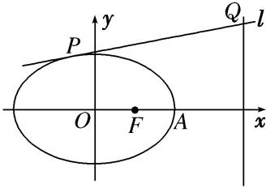
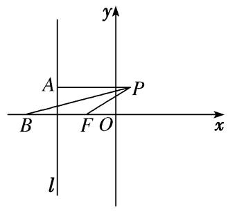

专题33　探究是否存在点型问题

探索性问题——肯定结论

1．存在性问题的解题步骤

探索性问题通常采用“肯定顺推法”，将不确定性问题明朗化．一般步骤为：  
（1）假设满足条件的元素(常数、点、直线或曲线)存在，引入参变量，根据题目条件列出关于参变量的方程(组)或不等式(组)；  
（2）解此方程(组)或不等式(组)；  
（3）若方程(组)有实数解，则元素(常数、点、直线或曲线)存在，否则不存在．

2．解决存在性问题的注意事项

探索性问题，先假设存在，推证满足条件的结论，若结论正确则存在，若结论不正确则不存在．  
（1）当条件和结论不唯一时，要分类讨论．  
（2）当给出结论而要推导出存在的条件时，先假设成立，再推出条件．  
（3）当条件和结论都不知，按常规方法解题很难时，要思维开放，采取另外的途径．

【例题选讲】

<strong>[例1]</strong>　(2020·新高考Ⅰ)已知椭圆<em>C</em>：＋＝1(<em>a</em>&gt;<em>b</em>&gt;0)的离心率为，且过点<em>A</em>(2，1)．  
（1）求*C*的方程；  
（2）点*M*，*N*在*C*上，且*AM*⊥*AN*，*AD*⊥*MN*，*D*为垂足．证明：存在定点*Q*，使得|*DQ*|为定值．

<strong>[规范解答]</strong>　（1）由题设得＋＝1，＝，解得<em>a</em>2＝6，<em>b</em>2＝3．所以<em>C</em>的方程为＋＝1．  
（2）设<em>M</em>(<em>x</em>1，<em>y</em>1)，<em>N</em>(<em>x</em>2，<em>y</em>2)．若直线<em>MN</em>与<em>x</em>轴不垂直，
设直线<em>MN</em>的方程为<em>y</em>＝<em>kx</em>＋<em>m</em>，代入＋＝1，得(1＋2<em>k</em>2)<em>x</em>2＋4<em>kmx</em>＋2<em>m</em>2－6＝0．
于是<em>x</em>1＋<em>x</em>2＝－，<em>x</em>1<em>x</em>2＝．①
由<em>AM</em>⊥<em>AN</em>，得·＝0，故(<em>x</em>1－2)(<em>x</em>2－2)＋(<em>y</em>1－1)(<em>y</em>2－1)＝0，
整理得(<em>k</em>2＋1)<em>x</em>1<em>x</em>2＋(<em>km</em>－<em>k</em>－2)(<em>x</em>1＋<em>x</em>2)＋(<em>m</em>－1)2＋4＝0．
将①代入上式，可得(<em>k</em>2＋1)－(<em>km</em>－<em>k</em>－2)·＋(<em>m</em>－1)2＋4＝0，
整理得(2*k*＋3*m*＋1)(2*k*＋*m*－1)＝0．
因为*A*(2，1)不在直线*MN*上，所以2*k*＋*m*－1≠0，所以2*k*＋3*m*＋1＝0，*k*≠1．
所以直线*MN*的方程为*y*＝*k*－(*k*≠1)．所以直线*MN*过点*P*．
若直线<em>MN</em>与<em>x</em>轴垂直，可得<em>N</em>(<em>x</em>1，－<em>y</em>1)．由·＝0，得(<em>x</em>1－2)(<em>x</em>1－2)＋(<em>y</em>1－1)(－<em>y</em>1－1)＝0．
又＋＝1，所以3<em>x</em>－8<em>x</em>1＋4＝0．解得<em>x</em>1＝2(舍去)，<em>x</em>1＝．此时直线<em>MN</em>过点<em>P</em>．
令*Q*为*AP*的中点，即*Q*．
若*D*与*P*不重合，则由题设知*AP*是Rt△*ADP*的斜边，故|*DQ*|＝|*AP*|＝．
若*D*与*P*重合，则|*DQ*|＝|*AP*|．

综上，存在点*Q*，使得|*DQ*|为定值．

<strong>[例2]</strong>　已知椭圆<em>C</em>1：＋＝1(<em>a</em>&gt;<em>b</em>&gt;0)的离心率为<em>e</em>＝，过<em>C</em>1的左焦点<em>F</em>1的直线<em>l</em>：<em>x</em>－<em>y</em>＋2＝0被圆<em>C</em>2：(<em>x</em>－3)2＋(<em>y</em>－3)2＝<em>r</em>2(<em>r</em>&gt;0)截得的弦长为2．  
（1）求椭圆<em>C</em>1的方程；  
（2）设<em>C</em>1的右焦点为<em>F</em>2，在圆<em>C</em>2上是否存在点<em>P</em>，满足|<em>PF</em>1|＝|<em>PF</em>2|？若存在，指出有几个这样的点(不必求出点的坐标)；若不存在，说明理由．

<strong>[规范解答]</strong>　（1）∵直线<em>l</em>的方程为<em>x</em>－<em>y</em>＋2＝0，令<em>y</em>＝0，得<em>x</em>＝－2，即<em>F</em>1(－2，0)，
∴<em>c</em>＝2，又<em>e</em>＝＝，∴<em>a</em>2＝6，<em>b</em>2＝<em>a</em>2－<em>c</em>2＝2，∴椭圆<em>C</em>1的方程为＋＝1．  
（2）∵圆心<em>C</em>2(3,3)到直线<em>l</em>：<em>x</em>－<em>y</em>＋2＝0的距离<em>d</em>＝＝，
又直线<em>l</em>：<em>x</em>－<em>y</em>＋2＝0被圆<em>C</em>2：(<em>x</em>－3)2＋(<em>y</em>－3)2＝<em>r</em>2(<em>r</em>&gt;0)截得的弦长为2，
∴<em>r</em>＝＝＝2，故圆<em>C</em>2的方程为(<em>x</em>－3)2＋(<em>y</em>－3)2＝4．
设圆<em>C</em>2上存在点<em>P</em>(<em>x</em>，<em>y</em>)，满足|<em>PF</em>1|＝|<em>PF</em>2|，即|<em>PF</em>1|＝3|<em>PF</em>2|，

且<em>F</em>1，<em>F</em>2的坐标分别为<em>F</em>1(－2,0)，<em>F</em>2(2，0)，则＝3，
整理得2＋<em>y</em>2＝，它表示圆心是<em>C</em>，半径是的圆．
∵|<em>CC</em>2|＝ ＝，故有2－&lt;|<em>CC</em>2|&lt;2＋，故圆<em>C</em>与圆<em>C</em>2相交，有两个公共点．
∴圆<em>C</em>2上存在两个不同的点<em>P</em>，满足|<em>PF</em>1|＝|<em>PF</em>2|．

<strong>[例3]</strong>　已知椭圆<em>C</em>：＋＝1(<em>a</em>＞<em>b</em>＞0)的右焦点为<em>F</em>(1，0)，右顶点为<em>A</em>，且|<em>AF</em>|＝1．  
（1）求椭圆*C*的标准方程；  
（2）若动直线*l*：*y*＝*kx*＋*m*与椭圆*C*有且只有一个交点*P*，且与直线*x*＝4交于点*Q*，问：是否存在一个定点*M*(*t，* 0)，使得·＝0？若存在，求出点*M*的坐标；若不存在，说明理由．

<strong>[规范解答]</strong>　（1）由<em>c</em>＝1，<em>a</em>－<em>c</em>＝1，得<em>a</em>＝2，所以<em>b</em>＝，故椭圆<em>C</em>的标准方程为＋＝1．  
（2）由消去<em>y</em>得(3＋4<em>k</em>2)<em>x</em>2＋8<em>kmx</em>＋4<em>m</em>2－12＝0，
∴<em>Δ</em>＝64<em>k</em>2<em>m</em>2－4(3＋4<em>k</em>2)(4<em>m</em>2－12)＝0，即<em>m</em>2＝3＋4<em>k</em>2．
设<em>P</em>(<em>x</em>0，<em>y</em>0)，则<em>x</em>0＝－＝－，<em>y</em>0＝<em>kx</em>0＋<em>m</em>＝－＋<em>m</em>＝，即<em>P</em>．
∵*M*(*t*，0)，*Q*(4，4*k*＋*m*)，∴＝，＝(4－*t*，4*k*＋*m*)，
∴·＝·(4－<em>t</em>)＋·(4<em>k</em>＋<em>m</em>)＝<em>t</em>2－4<em>t</em>＋3＋(<em>t</em>－1)＝0恒成立，
故即*t*＝1．∴存在点*M*(1，0)符合题意．

<strong>[例4]</strong>　已知椭圆<em>C</em>：＋＝1(<em>a</em>＞<em>b</em>＞0)的左顶点为<em>A</em>，右焦点为<em>F</em>2(2，0)，点<em>B</em>(2，－)在椭圆<em>C</em>上．  
（1）求椭圆*C*的方程．  
（2）若直线*y*＝*kx*(*k*≠0)与椭圆*C*交于*E*，*F*两点，直线*AE*，*AF*分别与*y*轴交于点*M*，*N*．在*x*轴上，是否存在点*P*，使得无论非零实数*k*怎样变化，总有∠*MPN*为直角？若存在，求出点*P*的坐标；若不存在，请说明理由．

<strong>[规范解答]</strong>　（1）依题意，得<em>c</em>＝2．∵点<em>B</em>(2，－)在<em>C</em>上，∴＋＝1．
又<em>a</em>2＝<em>b</em>2＋<em>c</em>2，∴<em>a</em>2＝8，<em>b</em>2＝4，∴椭圆<em>C</em>的方程为＋＝1．  
（2）假设存在这样的点<em>P</em>，设<em>P</em>(<em>x</em>0，0)，<em>E</em>(<em>x</em>1，<em>y</em>1)，<em>x</em>1＞0，则<em>F</em>(－<em>x</em>1，－<em>y</em>1)，
消去<em>y</em>并化简得，(1＋2<em>k</em>2)·<em>x</em>2－8＝0，解得<em>x</em>1＝，则<em>y</em>1＝，又<em>A</em>(－2，0)，
∴*AE*所在直线的方程为*y*＝·(*x*＋2)，∴*M*，
同理可得*N*，

＝，＝．
若∠*MPN*为直角，则·＝0，∴*x*－4＝0，
∴<em>x</em>0＝2或<em>x</em>0＝－2，∴存在点<em>P</em>，使得无论非零实数<em>k</em>怎样变化，总有∠<em>MPN</em>为直角，
此时点*P*的坐标为(2，0)或(－2，0)．

<strong>[例5]</strong>　(2015·全国Ⅰ)在直角坐标系<em>xOy</em>中，曲线<em>C</em>：<em>y</em>＝与直线<em>l</em>：<em>y</em>＝<em>kx</em>＋<em>a</em>(<em>a</em>&gt;0)交于<em>M</em>，<em>N</em>两点．  
（1）当*k*＝0时，分别求*C*在点*M*和*N*处的切线方程；  
（2）*y*轴上是否存在点*P*，使得当*k*变动时，总有∠*OPM*＝∠*OPN*？说明理由．

<strong>[规范解答]</strong>　（1）由题设可得<em>M</em>(2，<em>a</em>)，<em>N</em>(－2，<em>a</em>)，或<em>M</em>(－2，<em>a</em>)，<em>N</em>(2，<em>a</em>)．
又*y*′＝，故*y*＝在*x*＝2处的导数值为，
所以*C*在点(2，*a*)处的切线方程为*y*－*a*＝(*x*－2)，即*x*－*y*－*a*＝0．

*y*＝在*x*＝－2处的导数值为－，所以*C*在点(－2，*a*)处的切线方程为*y*－*a*＝－(*x*＋2)，
即*x*＋*y*＋*a*＝0．故所求切线方程为*x*－*y*－*a*＝0和*x*＋*y*＋*a*＝0．  
（2）存在符合题意的点．证明如下：
设<em>P</em>(0，<em>b</em>)为符合题意的点，<em>M</em>(<em>x</em>1，<em>y</em>1)，<em>N</em>(<em>x</em>2，<em>y</em>2)，直线<em>PM</em>，<em>PN</em>的斜率分别为<em>k</em>1，<em>k</em>2．
将<em>y</em>＝<em>kx</em>＋<em>a</em>代入<em>C</em>的方程，得<em>x</em>2－4<em>kx</em>－4<em>a</em>＝0，故<em>x</em>1＋<em>x</em>2＝4<em>k</em>，<em>x</em>1<em>x</em>2＝－4<em>a</em>．
从而<em>k</em>1＋<em>k</em>2＝＋＝＝．
当<em>b</em>＝－<em>a</em>时，有<em>k</em>1＋<em>k</em>2＝0，则直线<em>PM</em>的倾斜角与直线<em>PN</em>的倾斜角互补，
故∠*OPM*＝∠*OPN*，所以点*P*(0，－*a*)符合题意．

<strong>[例6]</strong>　已知椭圆<em>C</em>：＋＝1(<em>a</em>&gt;<em>b</em>&gt;0)的上、下焦点分别为<em>F</em>1，<em>F</em>2，上焦点<em>F</em>1到直线4<em>x</em>＋3<em>y</em>＋12＝0的距离为3，椭圆<em>C</em>的离心率<em>e</em>＝．  
（1）求椭圆*C*的方程；  
（2）椭圆*E*：＋＝1，设过点*M*(0，1)，斜率存在且不为0的直线交椭圆*E*于*A*，*B*两点，试问*y*轴上是否存在点*P*，使得＝*λ*？若存在，求出点*P*的坐标；若不存在，说明理由．

<strong>[规范解答]</strong>　（1）由已知椭圆<em>C</em>的方程为＋＝1(<em>a</em>&gt;<em>b</em>&gt;0)，设椭圆的焦点<em>F</em>1(0，<em>c</em>)，
由<em>F</em>1到直线4<em>x</em>＋3<em>y</em>＋12＝0的距离为3，得＝3，又椭圆<em>C</em>的离心率<em>e</em>＝，所以＝，
又<em>a</em>2＝<em>b</em>2＋<em>c</em>2，求得<em>a</em>2＝4，<em>b</em>2＝3．椭圆<em>C</em>的方程为＋＝1．  
（2）存在．理由如下：由（1）得椭圆*E*：＋＝1，设直线*AB*的方程为*y*＝*kx*＋1(*k*≠0)，
联立消去<em>y</em>并整理得(4<em>k</em>2＋1)<em>x</em>2＋8<em>kx</em>－12＝0，<em>Δ</em>＝(8<em>k</em>)2＋4(4<em>k</em>2＋1)×12＝256<em>k</em>2＋48&gt;0．
设<em>A</em>(<em>x</em>1，<em>y</em>1)，<em>B</em>(<em>x</em>2，<em>y</em>2)，则<em>x</em>1＋<em>x</em>2＝－，<em>x</em>1<em>x</em>2＝－．
假设存在点*P*(0，*t*)满足条件，由于＝*λ*，所以*PM*平分∠*APB*．
所以直线<em>PA</em>与直线<em>PB</em>的倾斜角互补，所以<em>kPA</em>＋<em>kPB</em>＝0．即＋＝0，
即<em>x</em>2(<em>y</em>1－<em>t</em>)＋<em>x</em>1(<em>y</em>2－<em>t</em>)＝0．(\*)
将<em>y</em>1＝<em>kx</em>1＋1，<em>y</em>2＝<em>kx</em>2＋1代入(\*)式，整理得2<em>kx</em>1<em>x</em>2＋(1－<em>t</em>)(<em>x</em>1＋<em>x</em>2)＝0，
所以－2*k*·＋＝0，整理得3*k*＋*k*(1－*t*)＝0，即*k*(4－*t*)＝0，因为*k*≠0，所以*t*＝4．
所以存在点*P*(0，4)，使得＝*λ*．

<strong>[例7]</strong>　已知椭圆方程<em>C</em>：＋＝1(<em>a</em>＞<em>b</em>＞0)，椭圆的右焦点为(1，0)，离心率为<em>e</em>＝，直线<em>l</em>：<em>y</em>＝<em>kx</em>＋<em>m</em>与椭圆<em>C</em>相交于<em>A</em>，<em>B</em>两点，且<em>kOA</em>·<em>kOB</em>＝－．  
（1）求椭圆的方程及△*AOB*的面积；  
（2）在椭圆上是否存在一点*P*，使*OAPB*为平行四边形，若存在，求出|*OP*|的取值范围，若不存在说明理由．

<strong>[规范解答]</strong>　（1）由题意得<em>c</em>＝1，＝，∴<em>a</em>＝2，∴<em>b</em>2＝<em>a</em>2－<em>c</em>2＝3，∴椭圆方程为＋＝1．
联立方程组，消去<em>y</em>整理得，(3＋4<em>k</em>2)<em>x</em>2＋8<em>kmx</em>＋4<em>m</em>2－12＝0．
设<em>A</em>(<em>x</em>1，<em>y</em>1)，<em>B</em>(<em>x</em>2，<em>y</em>2)，则<em>x</em>1＋<em>x</em>2＝－，<em>x</em>1<em>x</em>2＝，
所以<em>y</em>1<em>y</em>2＝(<em>kx</em>1＋<em>m</em>)(<em>kx</em>2＋<em>m</em>)＝<em>k</em>2<em>x</em>1<em>x</em>2＋<em>km</em>(<em>x</em>1＋<em>x</em>2)＋<em>m</em>2＝<em>k</em>2＋<em>km</em>＋<em>m</em>2＝．
∵<em>kOA</em>·<em>kOB</em>＝－，∴＝－，即<em>y</em>1<em>y</em>2＝－<em>x</em>1<em>x</em>2，∴＝－·，即2<em>m</em>2－4<em>k</em>2＝3．
∵|*AB*|＝＝＝＝．

*O*到直线*y*＝*kx*＋*m*的距离*d*＝，
∴<em>S</em>△<em>AOB</em>＝<em>d</em>|<em>AB</em>|＝＝＝＝．  
（2）若椭圆上存在一点<em>P</em>，使<em>OAPB</em>为平行四边形，则＝＋，设<em>P</em>(<em>x</em>0，<em>y</em>0)，
则<em>x</em>0＝<em>x</em>1＋<em>x</em>2＝－，<em>y</em>0＝<em>y</em>1＋<em>y</em>2＝，由于<em>P</em>在椭圆上，所以＋＝1，
即＋＝1，化简得4<em>m</em>2＝3＋4<em>k</em>2　①，由<em>kOA</em>·<em>kOB</em>＝－，知2<em>m</em>2－4<em>k</em>2＝3　②，
联立方程①②知*m*＝0，故不存在*P*在椭圆上的平行四边形．

<strong>[例8]</strong>　设椭圆<em>M</em>：＋＝1(<em>a</em>&gt;<em>b</em>&gt;0)的左、右焦点分别为<em>A</em>(－1，0)，<em>B</em>(1，0)，<em>C</em>为椭圆<em>M</em>上的点，且∠<em>ACB</em>＝，<em>S</em>△<em>ABC</em>＝．  
（1）求椭圆*M*的标准方程；  
（2）设过椭圆*M*右焦点且斜率为*k*的动直线与椭圆*M*相交于*E*，*F*两点，探究在*x*轴上是否存在定点*D*，使得·为定值？若存在，试求出定值和点*D*的坐标；若不存在，请说明理由．

<strong>[规范解答]</strong>　（1）在△<em>ABC</em>中，由余弦定理<em>AB</em>2＝<em>CA</em>2＋<em>CB</em>2－2<em>CA</em>·<em>CB</em>·cos<em>C</em>＝(<em>CA</em>＋<em>CB</em>)2－3<em>CA</em>·<em>CB</em>＝4．
又<em>S</em>△<em>ABC</em>＝<em>CA</em>·<em>CB</em>·sin<em>C</em>＝<em>CA</em>·<em>CB</em>＝，∴<em>CA</em>·<em>CB</em>＝，代入上式得<em>CA</em>＋<em>CB</em>＝2．

椭圆长轴2<em>a</em>＝2，焦距2<em>c</em>＝<em>AB</em>＝2．所以椭圆M的标准方程为＋<em>y</em>2＝1．  
（2）设直线方程<em>y</em>＝<em>k</em>(<em>x</em>－1)，<em>E</em>(<em>x</em>1，<em>y</em>1)，<em>F</em>(<em>x</em>2，<em>y</em>2)，联立
消去<em>y</em>得(1＋2<em>k</em>2)<em>x</em>2－4<em>k</em>2<em>x</em>＋2<em>k</em>2－2＝0，<em>Δ</em>＝8<em>k</em>2＋8&gt;0，∴<em>x</em>1＋<em>x</em>2＝，<em>x</em>1<em>x</em>2＝．
假设<em>x</em>轴上存在定点<em>D</em>(<em>x</em>0，0)，使得·为定值．
∴·＝(<em>x</em>1－<em>x</em>0，<em>y</em>1)·(<em>x</em>2－<em>x</em>0，<em>y</em>2)＝<em>x</em>1<em>x</em>2－<em>x</em>0(<em>x</em>1＋<em>x</em>2)＋<em>x</em>＋<em>y</em>1<em>y</em>2＝<em>x</em>1<em>x</em>2－<em>x</em>0(<em>x</em>1＋<em>x</em>2)＋<em>x</em>＋<em>k</em>2(<em>x</em>1－1)(<em>x</em>2－1)

＝(1＋<em>k</em>2)<em>x</em>1<em>x</em>2－(<em>x</em>0＋<em>k</em>2)(<em>x</em>1＋<em>x</em>2)＋<em>x</em>＋<em>k</em>2＝

要使·为定值，则·的值与<em>k</em>无关，∴2<em>x</em>－4<em>x</em>0＋1＝2(<em>x</em>－2)，解得<em>x</em>0＝，
此时·＝－为定值，定点为．

<strong>[例9]</strong>　已知<em>F</em>为抛物线<em>C</em>：<em>y</em>2＝2<em>px</em>(<em>p</em>&gt;0)的焦点，过<em>F</em>的动直线交抛物线<em>C</em>于<em>A</em>，<em>B</em>两点．当直线与<em>x</em>轴垂直时，|<em>AB</em>|＝4．  
（1）求抛物线*C*的方程；  
（2）若直线*AB*与抛物线的准线*l*相交于点*M*，在抛物线*C*上是否存在点*P*，使得直线*PA*，*PM*，*PB*的斜率成等差数列？若存在，求出点*P*的坐标；若不存在，说明理由．

<strong>[规范解答]</strong>　（1）因为<em>F</em>，在抛物线<em>y</em>2＝2<em>px</em>中，令<em>x</em>＝，可得<em>y</em>＝±<em>p</em>，
所以当直线与<em>x</em>轴垂直时|<em>AB</em>|＝2<em>p</em>＝4，解得<em>p</em>＝2，所以抛物线的方程为<em>y</em>2＝4<em>x</em>．  
（2）不妨设直线*AB*的方程为*x*＝*my*＋1(*m*≠0)，
因为抛物线<em>y</em>2＝4<em>x</em>的准线方程为<em>x</em>＝－1，所以<em>M</em>．
联立消去<em>x</em>，得<em>y</em>2－4<em>my</em>－4＝0，

<em>Δ</em>＝16<em>m</em>2＋16&gt;0恒成立，设<em>A</em>(<em>x</em>1，<em>y</em>1)，<em>B</em>(<em>x</em>2，<em>y</em>2)，则<em>y</em>1＋<em>y</em>2＝4<em>m</em>，<em>y</em>1<em>y</em>2＝－4，
若存在定点<em>P</em>(<em>x</em>0，<em>y</em>0)满足条件，则2<em>kPM</em>＝<em>kPA</em>＋<em>kPB</em>，即2＝＋，
因为点<em>P</em>，<em>A</em>，<em>B</em>均在抛物线上，所以<em>x</em>0＝，<em>x</em>1＝，<em>x</em>2＝．
代入化简可得＝，将<em>y</em>1＋<em>y</em>2＝4<em>m</em>，<em>y</em>1<em>y</em>2＝－4代入整理可得

＝，即(<em>m</em>2＋1)(<em>y</em>－4)＝0，
因为上式对∀<em>m</em>≠0恒成立，所以<em>y</em>－4＝0，解得<em>y</em>0＝±2，将<em>y</em>0＝±2代入抛物线方程，可得<em>x</em>0＝1，
所以在抛物线*C*上存在点*P*(1，±2)，使直线*PA*，*PM*，*PB*的斜率成等差数列．

<strong>[例10]</strong>　已知抛物线<em>C</em>：<em>y</em>2＝2<em>px</em>(<em>p</em>&gt;0)的准线经过点<em>P</em>(－1，0)．  
（1）求抛物线*C*的方程．  
（2）设*O*是原点，直线*l*恒过定点(1，0)，且与抛物线*C*交于*A*，*B*两点，直线*x*＝1与直线*OA*，*OB*分别交于点*M*，*N*，请问：是否存在以*MN*为直径的圆经过*x*轴上的两个定点？若存在，求出两个定点的坐标；若不存在，请说明理由．

<strong>[规范解答]</strong>　（1）依题意知，－＝－1，解得<em>p</em>＝2，所以抛物线<em>C</em>的方程为<em>y</em>2＝4<em>x</em>．  
（2）存在，理由如下．
设直线*AB*的方程为*x*＝*ty*＋1，*A*，*B*．
联立直线<em>AB</em>与抛物线<em>C</em>的方程得消去<em>x</em>并整理，得<em>y</em>2－4<em>ty</em>－4＝0．

易知<em>Δ</em>＝16<em>t</em>2＋16＞0，则
由直线*OA*的方程*y*＝*x*，可得*M*，由直线*OB*的方程*y*＝*x*，可得*N*．
设以*MN*为直径的圆上任一点*D*(*x*，*y*)，则·＝0，
所以以<em>MN</em>为直径的圆的方程为(<em>x</em>－1)2＋＝0．令<em>y</em>＝0，得(<em>x</em>－1)2＋＝0．
将<em>y</em>1<em>y</em>2＝－4代入上式，得(<em>x</em>－1)2－4＝0，解得<em>x</em>1＝－1，<em>x</em>2＝3．
故存在以*MN*为直径的圆经过*x*轴上的两个定点，两个定点的坐标分别为(－1，0)和(3，0)．

【对点训练】

1．(2019·全国Ⅰ)已知点*A*，*B*关于坐标原点*O*对称，|*AB*|＝4，⊙*M*过点*A*，*B*且与直线*x*＋2＝0相切．  
（1）若*A*在直线*x*＋*y*＝0上，求⊙*M*的半径；  
（2）是否存在定点*P*，使得当*A*运动时，|*MA*|－|*MP*|为定值？并说明理由．

1．<strong>解析</strong>　（1）因为⊙<em>M</em>过点<em>A</em>，<em>B</em>，所以圆心<em>M</em>在<em>AB</em>的垂直平分线上．由已知<em>A</em>在直线<em>x</em>＋<em>y</em>＝0上，

且*A*，*B*关于坐标原点*O*对称，所以*M*在直线*y*＝*x*上，故可设*M*(*a*，*a*)．
因为⊙<em>M</em>与直线<em>x</em>＋2＝0相切，所以⊙<em>M</em>的半径为<em>r</em>＝|<em>a</em>＋2|．连接<em>MA</em>(图略)，由已知得|<em>AO</em>|＝2．又<em>MO</em>⊥<em>AO</em>，故可得2<em>a</em>2＋4＝(<em>a</em>＋2)2，解得<em>a</em>＝0或<em>a</em>＝4．
故⊙*M*的半径*r*＝2或*r*＝6．  
（2）存在定点*P*(1，0)，使得|*MA*|－|*MP*|为定值．

理由如下：
设<em>M</em>(<em>x</em>，<em>y</em>)，由已知得⊙<em>M</em>的半径为<em>r</em>＝|<em>x</em>＋2|，|<em>AO</em>|＝2．由于<em>MO</em>⊥<em>AO</em>，故可得<em>x</em>2＋<em>y</em>2＋4＝(<em>x</em>＋2)2， 化简得<em>M</em>的轨迹方程为<em>y</em>2＝4<em>x</em>．
因为曲线<em>C</em>：<em>y</em>2＝4<em>x</em>是以点<em>P</em>(1，0)为焦点，以直线<em>x</em>＝－1为准线的抛物线，所以|<em>MP</em>|＝<em>x</em>＋1．
因为|*MA*|－|*MP*|＝*r*－|*MP*|＝*x*＋2－(*x*＋1)＝1，
所以存在满足条件的定点*P*．

2．已知椭圆<em>C</em>的中心在坐标原点，焦点在<em>x</em>轴上，左顶点为<em>A</em>，左焦点为<em>F</em>1(－2，0)，点<em>B</em>(2，)在椭

圆*C*上，直线*y*＝*kx*(*k*≠0)与椭圆*C*交于*E*，*F*两点，直线*AE*，*AF*分别与*y*轴交于点*M*，*N*．  
（1）求椭圆*C*的方程；  
（2）在*x*轴上是否存在点*P*，使得无论非零实数*k*怎样变化，总有∠*MPN*为直角？若存在，求出点*P*的坐标；若不存在，请说明理由．

2．解析　（1）设椭圆<em>C</em>的方程为＋＝1(<em>a</em>&gt;<em>b</em>&gt;0)，因为椭圆的左焦点为<em>F</em>1(－2,0)，所以<em>a</em>2－<em>b</em>2＝4．
由题可得椭圆的右焦点为<em>F</em>2(2,0)，已知点<em>B</em>(2，)在椭圆<em>C</em>上，由椭圆的定义知|<em>BF</em>1|＋|<em>BF</em>2|＝2<em>a</em>，
所以2*a*＝3＋＝4，所以*a*＝2，从而*b*＝2．
所以椭圆*C*的方程为＋＝1．  
（2）因为椭圆*C*的左顶点为*A*，则点*A*的坐标为(－2，0)．
因为直线*y*＝*kx*(*k*≠0)与椭圆＋＝1交于两点*E*，*F*，
设点<em>E</em>(<em>x</em>0，<em>y</em>0)(不妨设<em>x</em>0&gt;0)，则点<em>F</em>(－<em>x</em>0，－<em>y</em>0)．联立方程消去<em>y</em>得<em>x</em>2＝．
所以<em>x</em>0＝，<em>y</em>0＝，所以直线<em>AE</em>的方程为<em>y</em>＝(<em>x</em>＋2)．
因为直线*AE*与*y*轴交于点*M*，令*x*＝0，得*y*＝，即点*M*．
同理可得点*N*．
假设在*x*轴上存在点*P*(*t*，0)，使得∠*MPN*为直角，则·＝0．
即<em>t</em>2＋×＝0，即<em>t</em>2－4＝0，解得<em>t</em>＝2或<em>t</em>＝－2．
故存在点*P*(2，0)或*P*(－2，0)，无论非零实数*k*怎样变化，总有∠*MPN*为直角．

3．已知椭圆*C*：＋＝1(*a*>*b*>0)的离心率为，点*F*为左焦点，过点*F*作*x*轴的垂线交椭圆*C*于*A*，*B*

两点，且|*AB*|＝3．  
（1）求椭圆*C*的方程；  
（2）在圆<em>x</em>2＋<em>y</em>2＝3上是否存在一点<em>P</em>，使得在点<em>P</em>处的切线<em>l</em>与椭圆<em>C</em>相交于<em>M</em>，<em>N</em>两点，且满足⊥？若存在，求<em>l</em>的方程；若不存在，请说明理由．

3．<strong>解析</strong>　（1）∵<em>e</em>＝＝，∴3<em>a</em>2＝4<em>b</em>2．又∵|<em>AB</em>|＝＝3，∴<em>a</em>＝2，<em>b</em>＝．
∴椭圆*C*的方程为＋＝1．  
（2）假设存在点*P*，使得⊥．当直线*l*的斜率不存在时，

*l*：*x*＝或*x*＝－，与椭圆*C*：＋＝1相交于*M*，*N*两点，
此时*M*，*N*或*M*，*N*，
∴·＝3－＝≠0，
∴当直线*l*的斜率不存在时，不满足⊥．
当直线<em>l</em>的斜率存在时，设<em>y</em>＝<em>kx</em>＋<em>m</em>，联立得(3＋4<em>k</em>2)<em>x</em>2＋8<em>kmx</em>＋4<em>m</em>2－12＝0．
∵直线<em>l</em>与椭圆<em>C</em>相交于<em>M</em>，<em>N</em>两点，∴<em>Δ</em>&gt;0，化简得4<em>k</em>2&gt;<em>m</em>2－3．
设<em>M</em>(<em>x</em>1，<em>y</em>1)，<em>N</em>(<em>x</em>2，<em>y</em>2)，∴<em>x</em>1＋<em>x</em>2＝，<em>x</em>1<em>x</em>2＝，

<em>y</em>1<em>y</em>2＝(<em>kx</em>1＋<em>m</em>)(<em>kx</em>2＋<em>m</em>)＝<em>k</em>2<em>x</em>1<em>x</em>2＋<em>km</em>(<em>x</em>1＋<em>x</em>2)＋<em>m</em>2＝．
∵·＝0，∴＋＝0，∵7<em>m</em>2－12<em>k</em>2－12＝0．
又∵直线<em>l</em>与圆<em>x</em>2＋<em>y</em>2＝3相切，∴＝，∴<em>m</em>2＝3＋3<em>k</em>2，∴21＋21<em>k</em>2－12<em>k</em>2－12＝0，
解得<em>k</em>2＝－1，显然不成立，∴在圆上不存在这样的点<em>P</em>使⊥成立．

4．如图，在平面直角坐标系中，点*F*(－1，0)，过直线*l*：*x*＝－2右侧的动点*P*作*PA*⊥*l*于点*A*，∠*APF*

的平分线交*x*轴于点*B*，|*PA*|＝|*BF*|．  
（1）求动点*P*的轨迹*C*的方程；  
（2）过点*F*的直线*q*交曲线*C*于*M*，*N*，试问：*x*轴正半轴上是否存在点*E*，直线*EM*，*EN*分别交直线*l*于*R*，*S*两点，使∠*RFS*为直角？若存在，求出点*E*的坐标；若不存在，请说明理由．

4．<strong>解析</strong>　（1）设<em>P</em>(<em>x</em>，<em>y</em>)，由平面几何知识得＝，即＝，化简得＋<em>y</em>2＝1，
所以动点<em>P</em>的轨迹<em>C</em>的方程为＋<em>y</em>2＝1(<em>x</em>≠)．  
（2）假设满足条件的点*E*(*n，* 0)(*n*>0)存在，设直线*q*的方程为*x*＝*my*－1，

<em>M</em>(<em>x</em>1，<em>y</em>1)，<em>N</em>(<em>x</em>2，<em>y</em>2)，<em>R</em>(－2，<em>y</em>3)，<em>S</em>(－2，<em>y</em>4)．联立消去<em>x</em>，得(<em>m</em>2＋2)<em>y</em>2－2<em>my</em>－1＝0，

<em>y</em>1＋<em>y</em>2＝，<em>y</em>1<em>y</em>2＝－，

<em>x</em>1<em>x</em>2＝(<em>my</em>1－1)(<em>my</em>2－1)＝<em>m</em>2<em>y</em>1<em>y</em>2－<em>m</em>(<em>y</em>1＋<em>y</em>2)＋1＝－－＋1＝，

<em>x</em>1＋<em>x</em>2＝<em>m</em>(<em>y</em>1＋<em>y</em>2)－2＝－2＝－，
由条件知＝，<em>y</em>3＝－，同理<em>y</em>4＝－，<em>kRF</em>＝＝－<em>y</em>3，<em>kSF</em>＝－<em>y</em>4．
因为∠<em>RFS</em>为直角，所以<em>y</em>3<em>y</em>4＝－1，所以(2＋<em>n</em>)2<em>y</em>1<em>y</em>2＝－[<em>x</em>1<em>x</em>2－<em>n</em>(<em>x</em>1＋<em>x</em>2)＋<em>n</em>2]，

(2＋<em>n</em>)2＝＋＋<em>n</em>2，所以(<em>n</em>2－2)(<em>m</em>2＋1)＝0，<em>n</em>＝，
故满足条件的点*E*存在，其坐标为(，0)．

5．已知动点*M*(*x*，*y*)满足：＋＝2．  
（1）求动点*M*的轨迹*E*的方程；  
（2）设*A*，*B*是轨迹*E*上的两个动点，线段*AB*的中点*N*在直线*l*：*x*＝－上，线段*AB*的中垂线与*E*交于*P*，*Q*两点，是否存在点*N*，使以*PQ*为直径的圆经过点(1，0)，若存在，求出*N*点坐标，若不存在，请说明理由．

5．解析　（1）由＋＝2知，动点*M*到定点(－1，0)和(1，0)的距离之和等

于2，根据椭圆的定义知，动点*M*的轨迹是以定点(－1，0)和(1，0)为焦点的椭圆，且*a*＝，*c*＝1，
故<em>b</em>＝1，因此椭圆方程为＋<em>y</em>2＝1．  
（2）当直线*AB*垂直于*x*轴时，直线*AB*方程为*x*＝－，
此时*P*(－，0)，*Q*(，0)，·＝－1，不合题意；
当直线*AB*不垂直于*x*轴时，设存在点*N*(*m*≠0)点，直线*AB*的斜率为*k*，

<em>A</em>(<em>x</em>1，<em>y</em>1)，<em>B</em>(<em>x</em>2，<em>y</em>2)，由得：(<em>x</em>1＋<em>x</em>2)＋2(<em>y</em>1＋<em>y</em>2)·＝0，则－1＋4<em>mk</em>＝0，
故<em>k</em>＝，此时，直线<em>PQ</em>斜率为<em>k</em>1＝－4<em>m</em>，

*PQ*的直线方程为*y*－*m*＝－4*m*，即*y*＝－4*mx*－*m*，
联立消去<em>y</em>，整理得：(32<em>m</em>2＋1)<em>x</em>2＋16<em>m</em>2<em>x</em>＋2<em>m</em>2－2＝0，
所以<em>x</em>1＋<em>x</em>2＝－，<em>x</em>1·<em>x</em>2＝，由题意·＝0，于是

·＝(<em>x</em>1－1)(<em>x</em>2－1)＋<em>y</em>1<em>y</em>2＝<em>x</em>1·<em>x</em>2－(<em>x</em>1＋<em>x</em>2)＋1＋(4<em>mx</em>1＋<em>m</em>)(4<em>mx</em>2＋<em>m</em>)

＝(1＋16<em>m</em>2)<em>x</em>1·<em>x</em>2＋(4<em>m</em>2－1)(<em>x</em>1＋<em>x</em>2)＋1＋<em>m</em>2

＝＋＋1＋<em>m</em>2＝＝0，
∴<em>m</em>＝±，因为<em>N</em>在椭圆内，∴<em>m</em>2＜，∴<em>m</em>＝±符合条件，
综上所述，存在两点*N*符合条件，坐标为*N*(－，±)．

6．已知圆<em>O</em>：<em>x</em>2＋<em>y</em>2＝4，点<em>F</em>(1，0)，<em>P</em>为平面内一动点，以线段<em>FP</em>为直径的圆内切于圆<em>O</em>，设动点<em>P</em>

的轨迹为曲线*C．*  
（1）求曲线*C*的方程；  
（2）*M*，*N*是曲线*C*上的动点，且直线*MN*经过定点，问在*y*轴上是否存在定点*Q*，使得∠*MQO*＝∠*NQO*，若存在，请求出定点*Q*，若不存在，请说明理由．

6．解析　（1）设*PF*的中点为*S*，切点为*T*，连接*OS*，*ST*，则|*OS*|＋|*SF*|＝|*OT*|＝2，

取*F*关于*y*轴的对称点*F*′，连*F*′*P*，故|*F*′*P*|＋|*FP*|＝2(|*OS*|＋|*SF*|)＝4．
所以点*B*的轨迹是以*F*′，*F*为焦点，长轴长为4的椭圆．
其中，*a*＝2，*c*＝1，曲线*C*方程为＋＝1．  
（2）假设存在满足题意的定点<em>Q</em>，设<em>Q</em>(0，<em>m</em>)，设直线<em>l</em>的方程为<em>y</em>＝<em>kx</em>＋，<em>M</em>(<em>x</em>1，<em>y</em>1)，<em>N</em>(<em>x</em>2，<em>y</em>2)．
由消去<em>x</em>，得(3＋4<em>k</em>2)<em>x</em>2＋4<em>kx</em>－11＝0．
由直线<em>l</em>过椭圆内一点作直线，故<em>Δ</em>＞0，由求根公式得：<em>x</em>1＋<em>x</em>2＝，<em>x</em>1·<em>x</em>2＝，
由∠*MQO*＝∠*NQO*，得直线*MQ*与*NQ*斜率和为零．故

＋＝＋＝＝0，

2<em>kx</em>1<em>x</em>2＋(<em>x</em>1＋<em>x</em>2)＝2<em>k</em>·＋·＝＝0．

存在定点(0，6)，当斜率不存在时定点(0，6)也符合题意．

7．已知点*P*到直线*y*＝－3的距离比点*P*到点*A*(0，1)的距离多2．  
（1）求点*P*的轨迹方程；  
（2）经过点*Q*(0，2)的动直线*l*与点*P*的轨迹交于*M*，*N*两点，是否存在定点*R*使得∠*MRQ*＝∠*NRQ*？若存在，求出点*R*的坐标；若不存在，请说明理由．

7．<strong>解析</strong>　（1）由题知，|<em>PA</em>|等于点<em>P</em>到直线<em>y</em>＝－1的距离，
故<em>P</em>点的轨迹是以<em>A</em>为焦点，<em>y</em>＝－1为准线的抛物线，所以其方程为<em>x</em>2＝4<em>y</em>．  
（2）根据图形的对称性知，若存在满足条件的定点*R*，则点*R*必在*y*轴上，可设其坐标为(0，*r*)，
此时由∠<em>MRQ</em>＝∠<em>NRQ</em>可得<em>kMR</em>＋<em>kNR</em>＝0．
设<em>M</em>(<em>x</em>1，<em>y</em>1)，<em>N</em>(<em>x</em>2，<em>y</em>2)，则＋＝0，
由题知直线<em>l</em>的斜率存在，设其方程为<em>y</em>＝<em>kx</em>＋2，与<em>x</em>2＝4<em>y</em>联立得<em>x</em>2－4<em>kx</em>－8＝0，
则<em>x</em>1＋<em>x</em>2＝4<em>k</em>，<em>x</em>1<em>x</em>2＝－8，

＋＝＋＝2*k*＋＝2*k*－＝0，
故*r*＝－2，即存在满足条件的定点*R*(0，－2)．

8．已知椭圆<em>C</em>：＋＝1(<em>a</em>＞<em>b</em>＞0)的两个焦点分别为<em>F</em>1，<em>F</em>2，短轴的一个端点为<em>P</em>，△<em>PF</em>1<em>F</em>2内切圆的半

径为，设过点<em>F</em>2的直线<em>l</em>被椭圆<em>C</em>截得的线段为<em>RS</em>，当<em>l</em>⊥<em>x</em>轴时，|<em>RS</em>|＝3．  
（1）求椭圆*C*的标准方程；  
（2）在*x*轴上是否存在一点*T*，使得当*l*变化时，总有*TS*与*TR*所在直线关于*x*轴对称？若存在，请求出点*T*的坐标；若不存在，请说明理由．

8．解析　（1）由内切圆的性质，得×2*c*×*b*＝×(2*a*＋2*c*)×，得＝．
将<em>x</em>＝<em>c</em>代入＋＝1，得<em>y</em>＝±，所以＝3，又<em>a</em>2＝<em>b</em>2＋<em>c</em>2，所以<em>a</em>＝2，<em>b</em>＝，
故椭圆*C*的标准方程为＋＝1．  
（2）当直线*l*垂直于*x*轴时，显然*x*轴上任意一点*T*都满足*TS*与*TR*所在直线关于*x*轴对称．
当直线<em>l</em>不垂直于<em>x</em>轴时，假设存在<em>T</em>(<em>t</em>，0)满足条件，设<em>l</em>的方程为<em>y</em>＝<em>k</em>(<em>x</em>－1)，<em>R</em>(<em>x</em>1，<em>y</em>1)，<em>S</em>(<em>x</em>2，<em>y</em>2)．
联立方程，得得(3＋4<em>k</em>2)<em>x</em>2－8<em>k</em>2<em>x</em>＋4<em>k</em>2－12＝0，
由根与系数的关系得①，其中*Δ*＞0恒成立，
由<em>TS</em>与<em>TR</em>所在直线关于<em>x</em>轴对称，得<em>k</em>T<em>S</em>＋<em>k</em>T<em>R</em>＝0(显然<em>TS</em>，<em>TR</em>的斜率存在)，即＋＝0　②．
因为<em>R</em>，<em>S</em>两点在直线<em>y</em>＝<em>k</em>(<em>x</em>－1)上，所以<em>y</em>1＝<em>k</em>(<em>x</em>1－1)，<em>y</em>2＝<em>k</em>(<em>x</em>2－1)，代入②得

＝＝0，即2<em>x</em>1<em>x</em>2－(<em>t</em>＋1)(<em>x</em>1＋<em>x</em>2)＋2<em>t</em>＝0　③，
将①代入③得＝＝0　④，则*t*＝4，
综上所述，存在*T*(4，0)，使得当*l*变化时，总有*TS*与*TR*所在直线关于*x*轴对称．

9．已知椭圆<em>C</em>：＋＝1(<em>a</em>＞<em>b</em>＞0)的左、右焦点分别为<em>F</em>1，<em>F</em>2，其离心率为，短轴长为2．  
（1）求椭圆*C*的标准方程；  
（2）过定点*M*(0，2)的直线*l*与椭圆*C*交于*G*，*H*两点(*G*在*M*，*H*之间)，设直线*l*的斜率*k*＞0，在*x*轴上是否存在点*P*(*m*，0)，使得以*PG*，*PH*为邻边的平行四边形为菱形？如果存在，求出*m*的取值范围；如果不存在，请说明理由．

9．解析　（1）由已知，得解得所以椭圆*C*的标准方程为＋＝1．  
（2）设直线*l*的方程为*y*＝*kx*＋2(*k*＞0)，联立消去*y*并整理得，

(3＋4<em>k</em>2)<em>x</em>2＋16<em>kx</em>＋4＝0，由<em>Δ</em>＞0，解得<em>k</em>＞．
设<em>G</em>(<em>x</em>1，<em>y</em>1)，<em>H</em>(<em>x</em>2，<em>y</em>2)，则<em>y</em>1＝<em>kx</em>1＋2，<em>y</em>2＝<em>kx</em>2＋2，<em>x</em>1＋<em>x</em>2＝．
假设存在点*P*(*m,* 0)，使得以*PG*，*PH*为邻边的平行四边形为菱形，
则＋＝(<em>x</em>1＋<em>x</em>2－2<em>m</em>，<em>k</em>(<em>x</em>1＋<em>x</em>2)＋4)，＝(<em>x</em>2－<em>x</em>1，<em>y</em>2－<em>y</em>1)＝(<em>x</em>2－<em>x</em>1，<em>k</em>(<em>x</em>2－<em>x</em>1))，

(＋)·＝0，即(1＋<em>k</em>2)(<em>x</em>1＋<em>x</em>2)＋4<em>k</em>－2<em>m</em>＝0，所以(1＋<em>k</em>2)·＋4<em>k</em>－2<em>m</em>＝0，
解得*m*＝－＝－．因为*k*＞，所以－≤*m*＜0，当且仅当＝4*k*时等号成立，
故存在满足题意的点*P*，且*m*的取值范围是．

10．已知椭圆<em>C</em>：＋＝1(<em>a</em>＞<em>b</em>＞0)的离心率为，左、右焦点分别为<em>F</em>1，<em>F</em>2，过<em>F</em>1的直线交椭圆于<em>A</em>，

*B*两点．  
（1）若以<em>AF</em>1为直径的动圆内切于圆<em>x</em>2＋<em>y</em>2＝9，求椭圆的长轴的长；  
（2）当*b*＝1时，问在*x*轴上是否存在定点*T*，使得·为定值？并说明理由．

10．解析　（1）设<em>AF</em>1的中点为<em>M</em>，连接<em>OM</em>，<em>AF</em>2(<em>O</em>为坐标原点)，
在△<em>AF</em>1<em>F</em>2中，<em>O</em>为<em>F</em>1<em>F</em>2的中点，所以|<em>OM</em>|＝|<em>AF</em>2|＝(2<em>a</em>－|<em>AF</em>1|)＝<em>a</em>－|<em>AF</em>1|．
由题意得|<em>OM</em>|＝3－|<em>AF</em>1|，所以<em>a</em>＝3，故椭圆的长轴的长为6．  
（2）由<em>b</em>＝1，＝，<em>a</em>2＝<em>b</em>2＋<em>c</em>2，得<em>c</em>＝2，<em>a</em>＝3，所以椭圆<em>C</em>的方程为＋<em>y</em>2＝1．
当直线*AB*的斜率存在时，设直线*AB*的方程为*y*＝*k*(*x*＋2)，
由得(9<em>k</em>2＋1)<em>x</em>2＋36<em>k</em>2<em>x</em>＋72<em>k</em>2－9＝0，
设<em>A</em>(<em>x</em>1，<em>y</em>1)，<em>B</em>(<em>x</em>2，<em>y</em>2)，则<em>x</em>1＋<em>x</em>2＝－，<em>x</em>1<em>x</em>2＝，

<em>y</em>1<em>y</em>2＝<em>k</em>2(<em>x</em>1＋2)(<em>x</em>2＋2)＝．
设<em>T</em>(<em>x</em>0，0)，则＝(<em>x</em>1－<em>x</em>0，<em>y</em>1)，＝(<em>x</em>2－<em>x</em>0，<em>y</em>2)，

·＝<em>x</em>1<em>x</em>2－(<em>x</em>1＋<em>x</em>2)<em>x</em>0＋<em>x</em>＋<em>y</em>1<em>y</em>2＝，
当9<em>x</em>＋36<em>x</em>0＋71＝9(<em>x</em>－9)，即<em>x</em>0＝－时，·为定值，定值为<em>x</em>－9＝－．
当直线*AB*的斜率不存在时，不妨设*A*，*B*，
当*T*时，·＝·＝－．

综上，在*x*轴上存在定点*T*，使得·为定值．

11．设椭圆*M*：＋＝1(*a*>*b*>0)的左、右焦点分别为*A*(－1，0)，*B*(1，0)，*C*为椭圆*M*上的点，且∠*ACB*

＝，<em>S</em>△<em>ABC</em>＝．  
（1）求椭圆*M*的标准方程；  
（2）设过椭圆*M*右焦点且斜率为*k*的动直线与椭圆*M*相交于*E*，*F*两点，探究在*x*轴上是否存在定点*D*，使得·为定值？若存在，试求出定值和点*D*的坐标；若不存在，请说明理由．

11．<strong>解析</strong>　（1）在△<em>ABC</em>中，由余弦定理<em>AB</em>2＝<em>CA</em>2＋<em>CB</em>2－2<em>CA</em>·<em>CB</em>·cos <em>C</em>＝(<em>CA</em>＋<em>CB</em>)2－3<em>CA</em>·<em>CB</em>＝4．
又<em>S</em>△<em>ABC</em>＝<em>CA</em>·<em>CB</em>·sin <em>C</em>＝<em>CA</em>·<em>CB</em>＝，∴<em>CA</em>·<em>CB</em>＝，代入上式得<em>CA</em>＋<em>CB</em>＝2．

椭圆长轴长为2<em>a</em>＝2，焦距为2<em>c</em>＝<em>AB</em>＝2，<em>b</em>2＝<em>a</em>2－<em>c</em>2＝1．
所以椭圆<em>M</em>的标准方程为＋<em>y</em>2＝1．  
（2）设直线方程<em>y</em>＝<em>k</em>(<em>x</em>－1)，<em>E</em>(<em>x</em>1，<em>y</em>1)，<em>F</em>(<em>x</em>2，<em>y</em>2)，联立
消去<em>y</em>得(1＋2<em>k</em>2)<em>x</em>2－4<em>k</em>2<em>x</em>＋2<em>k</em>2－2＝0，<em>Δ</em>＝8<em>k</em>2＋8&gt;0，∴<em>x</em>1＋<em>x</em>2＝，<em>x</em>1<em>x</em>2＝．
假设<em>x</em>轴上存在定点<em>D</em>(<em>x</em>0，0)，使得·为定值．
∴·＝(<em>x</em>1－<em>x</em>0，<em>y</em>1)·(<em>x</em>2－<em>x</em>0，<em>y</em>2)＝<em>x</em>1<em>x</em>2－<em>x</em>0(<em>x</em>1＋<em>x</em>2)＋<em>x</em>＋<em>y</em>1<em>y</em>2＝<em>x</em>1<em>x</em>2－<em>x</em>0(<em>x</em>1＋<em>x</em>2)＋<em>x</em>＋<em>k</em>2(<em>x</em>1－1)(<em>x</em>2－1)

＝(1＋<em>k</em>2)<em>x</em>1<em>x</em>2－(<em>x</em>0＋<em>k</em>2)(<em>x</em>1＋<em>x</em>2)＋<em>x</em>＋<em>k</em>2＝．

要使·为定值，则·的值与<em>k</em>无关，∴2<em>x</em>－4<em>x</em>0＋1＝2(<em>x</em>－2)，解得<em>x</em>0＝，
此时·＝－为定值，定点为．

