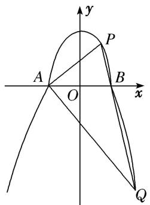
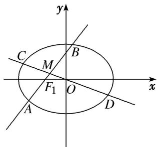
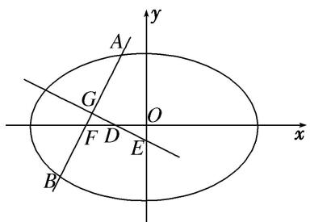
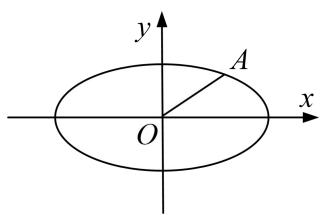
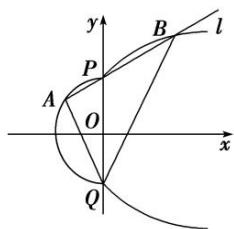

# 专题 34 探究是否存在直线型问题

# 探索性问题——肯定结论

# 1. 存在性问题的解题步骤

探索性问题通常采用“肯定顺推法”，将不确定性问题明朗化．一般步骤为：

(1)假设满足条件的元素(常数、点、直线或曲线)存在，引入参变量，根据题目条件列出关于参变量的方程(组)或不等式(组);  
(2)解此方程(组)或不等式(组);   
(3)若方程(组)有实数解，则元素(常数、点、直线或曲线)存在，否则不存在.

# 2. 解决存在性问题的注意事项

探索性问题，先假设存在，推证满足条件的结论，若结论正确则存在，若结论不正确则不存在.

(1)当条件和结论不唯一时，要分类讨论.   
(2)当给出结论而要推导出存在的条件时, 先假设成立, 再推出条件.  
(3)当条件和结论都不知，按常规方法解题很难时，要思维开放，采取另外的途径.

# 【例题选讲】

[例 1] 已知椭圆 C: $\frac{x^{2}}{a^{2}}+\frac{y^{2}}{b^{2}}=1(a>b>0)$ 的右焦点为 $F_{2}(2,0)$ ，点 $P\left(1,-\frac{\sqrt{15}}{3}\right)$ 在椭圆 C 上.

(1)求椭圆 C 的标准方程;  
(2)是否存在斜率为-1的直线 $l$ 与椭圆 $C$ 相交于 $M, N$ 两点，使得 $|F_{1}M| = |F_{1}N|(F_{1}$ 为椭圆的左焦点)? 若存在，求出直线 $l$ 的方程；若不存在，说明理由.

[规范解答] (1) 法一：∵ 椭圆 C 的右焦点为 $F_{2}(2, 0)$ ，∴ c = 2，椭圆 C 的左焦点为 $F_{1}(-2, 0)$ .

由椭圆的定义可得 $2a=\sqrt{(1+2)^{2}+\left(-\frac{\sqrt{15}}{3}\right)^{2}}+\sqrt{(1-2)^{2}+\left(-\frac{\sqrt{15}}{3}\right)^{2}}=\sqrt{\frac{96}{9}}+\sqrt{\frac{24}{9}}=2\sqrt{6}$ ,

解得 $a=\sqrt{6}$ ，∴ $b^{2}=a^{2}-c^{2}=6-4=2$ ．∴ 椭圆 C 的标准方程为 $\frac{x^{2}}{6}+\frac{y^{2}}{2}=1$ .

法二：∵椭圆 C 的右焦点为 $F_{2}(2,0)$ ，∴ c=2，故 $a^{2}-b^{2}=4$ ，

又点 $P\left(1, -\frac{\sqrt{15}}{3}\right)$ 在椭圆 C 上，则 $\frac{1}{a^{2}} + \frac{15}{9b^{2}} = 1$ ，故 $\frac{1}{b^{2} + 4} + \frac{15}{9b^{2}} = 1$ ，

化简得 $3b^{4}+4b^{2}-20=0$ ，得 $b^{2}=2,\quad a^{2}=6$ ．∴椭圆 C 的标准方程为 $\frac{x^{2}}{6}+\frac{y^{2}}{2}=1$ .

(2)假设存在满足条件的直线 l，设直线 l 的方程为 $y = -x + t$ ,

由 $\left\{\begin{aligned}\frac{x^{2}}{6}+\frac{y^{2}}{2}&=1,\\ y&=-x+t\end{aligned}\right.$ 得 $x^{2}+3(-x+t)^{2}-6=0$ ，即 $4x^{2}-6tx+(3t^{2}-6)=0$ ，

$\Delta=(-6t)^{2}-4\times4\times(3t^{2}-6)=96-12t^{2}>0$ ，解得 $-2\sqrt{2}<t<2\sqrt{2}$ .

设 $M(x_{1}, y_{1})$ ， $N(x_{2}, y_{2})$ ，则 $x_{1} + x_{2} = \frac{3t}{2}$ ， $x_{1}x_{2} = \frac{3t^{2} - 6}{4}$ ，

由于 $|F_{1}M|=|F_{1}N|$ ，设线段MN的中点为E，则 $F_{1}E\perp MN$ ，故 $k_{F1E}=-\frac{1}{k_{MN}}=1$

又 $F_{1}(-2,0), E\left(\frac{x_{1} + x_{2}}{2}, \frac{y_{1} + y_{2}}{2}\right)$ ，即 $E\left(\frac{3t}{4}, \frac{t}{4}\right)$ ， $\therefore k_{F1E} = \frac{\frac{t}{4}}{\frac{3t}{4} + 2} = 1$ ，解得 $t = -4$ .

当 t = -4 时，不满足 $-2\sqrt{2} < t < 2\sqrt{2}$ ，∴ 不存在满足条件的直线 l.

[例 2] 已知椭圆 C: $\frac{x^{2}}{a^{2}}+\frac{y^{2}}{b^{2}}=1(a>b>0)$ 的左、右焦点分别为 $F_{1}(-1,0)$ ， $F_{2}(1,0)$ ，点 $A\left(1,\frac{\sqrt{2}}{2}\right)$ 在椭圆 C 上.

(1)求椭圆 C 的标准方程;

(2)是否存在斜率为2的直线，使得当直线与椭圆 $C$ 有两个不同交点 $M$ ， $N$ 时，能在直线 $y = \frac{5}{3}$ 上找到一点 $P$ ，在椭圆 $C$ 上找到一点 $Q$ ，满足 $\overrightarrow{PM} = \overrightarrow{NQ}$ ？若存在，求出直线的方程；若不存在，说明理由.

[规范解答] (1)设椭圆 C 的焦距为 2c，则 c=1，因为 $A\left(1, \frac{\sqrt{2}}{2}\right)$ 在椭圆 C 上，

所以 $2a=|AF_{1}|+|AF_{2}|=2\sqrt{2}$ ，因此 $a=\sqrt{2}$ ， $b^{2}=a^{2}-c^{2}=1$ ，故椭圆 C 的方程为 $\frac{x^{2}}{2}+y^{2}=1$ .

(2)不存在满足条件的直线，证明如下：

假设存在斜率为 2 的直线，满足条件，则设直线的方程为 $y=2x+t$ ，

设 $M(x_{1}, y_{1})$ , $N(x_{2}, y_{2})$ , $P\left(x_{3}, \frac{5}{3}\right)$ , $Q(x_{4}, y_{4})$ , MN 的中点为 $D(x_{0}, y_{0})$ ,

由 $\left\{\begin{aligned}y=2x+t,\\ \frac{x^{2}}{2}+y^{2}=1\end{aligned}\right.$ 消去 x，得 $9y^{2}-2ty+t^{2}-8=0$ ，所以 $y_{1}+y_{2}=\frac{2t}{9}$ ，且 $\Delta=4t^{2}-36(t^{2}-8)>0$ ，

故 $y_{0}=\frac{y_{1}+y_{2}}{2}=\frac{t}{9}$ ，且 -3<t<3。 $\overrightarrow{PM}=\overrightarrow{NQ}$

由 $\overrightarrow{PM}=\overrightarrow{NQ}$ ，得 $\left(x_{1}-x_{3},y_{1}-\frac{5}{3}\right)=(x_{4}-x_{2},y_{4}-y_{2})$ ，所以有 $y_{1}-\frac{5}{3}=y_{4}-y_{2},y_{4}=y_{1}+y_{2}-\frac{5}{3}=\frac{2}{9}t-\frac{5}{3}$ .

也可由 $\overrightarrow{PM}=\overrightarrow{NQ}$ ，知四边形PMQN为平行四边形，而D为线段MN的中点，

因此，D 也为线段 PQ 的中点，所以 $y_{0}=\frac{\frac{5}{3}+y_{4}}{2}=\frac{t}{9}$ ，可得 $y_{4}=\frac{2t-15}{9}$

又-3<t<3，所以 $-\frac{7}{3}<y_{4}<-1$ ，与椭圆上点的纵坐标的取值范围是 $[-1,1]$ 矛盾.

因此不存在满足条件的直线.

[例 3] 已知圆 $C: (x-1)^{2}+y^{2}=\frac{1}{4}$ ，一动圆与直线 $x=-\frac{1}{2}$ 相切且与圆 C 外切.

(1)求动圆圆心 $P$ 的轨迹 $T$ 的方程；  
(2)若经过定点 $Q(6,0)$ 的直线 $l$ 与曲线 $T$ 交于 $A,B$ 两点， $M$ 是线段 $AB$ 的中点，过 $M$ 作 $x$ 轴的平行线与曲线 $T$ 相交于点 $N$ ，试问是否存在直线 $l$ ，使得 $NA\bot NB$ ，若存在，求出直线 $l$ 的方程；若不存在，请说明理由.

[规范解答] (1)设 $P(x, y)$ ，分析可知动圆的圆心不能在 y 轴的左侧，故 $x \geq 0$ ，

因为动圆与直线 $x=-\frac{1}{2}$ 相切，且与圆 C 外切，

所以 $|PC|-\left(x+\frac{1}{2}\right)=\frac{1}{2}$ ，所以 $|PC|=x+1$ ，

所以 $\sqrt{(x-1)^{2}+y^{2}}=x+1$ ，化简可得 $y^{2}=4x$ .

(2)设 $A(x_{1}, y_{1})$ ， $B(x_{2}, y_{2})$ ，由题意可知，当直线 l 与 y 轴垂直时，显然不符合题意，

故可设直线 l 的方程为 $x=my+6$ ,

联立 $\left\{\begin{aligned}x&=my+6,\\ y^{2}&=4x\end{aligned}\right.$ 消去x，可得 $y^{2}-4my-24=0$ ，

显然 $\Delta=16m^{2}+96>0$ ，则 $\left\{\begin{aligned}y_{1}+y_{2}&=4m,\\ y_{1}y_{2}&=-24,\end{aligned}\right.$ ①

所以 $x_{1}+x_{2}=(my_{1}+6)+(my_{2}+6)=4m^{2}+12$ ，②

因为 $x_{1}x_{2}=\frac{y_{1}^{2}}{4}\cdot\frac{y_{2}^{2}}{4}$ ，所以 $x_{1}x_{2}=36$ ，③

假设存在 $N(x_{0}, y_{0})$ ，使得 $\overrightarrow{NA} \cdot \overrightarrow{NB} = 0$ ，

由题意可知 $y_{0}=\frac{y_{1}+y_{2}}{2}$ ，所以 $y_{0}=2m$ ，④

由 N 点在抛物线上可知 $x_{0}=\frac{y_{0}^{2}}{4}$ ，即 $x_{0}=m^{2}$ ，⑤

又 $\overrightarrow{NA} = (x_{1} - x_{0}, y_{1} - y_{0}), \overrightarrow{NB} = (x_{2} - x_{0}, y_{2} - y_{0})$

若 $\overrightarrow{NA} \cdot \overrightarrow{NB} = 0$ ，则 $x_{1}x_{2} - x_{0}(x_{1} + x_{2}) + x_{0}^{2} + y_{1}y_{2} - y_{0}(y_{1} + y_{2}) + y_{0}^{2} = 0$

由①②③④⑤代入上式化简可得： $3m^{4}+16m^{2}-12=0$

即 $(m^{2}+6)(3m^{2}-2)=0$ ，所以 $m^{2}=\frac{2}{3}$ ，故 $m=\pm\frac{\sqrt{6}}{3}$

所以存在直线 $3x + \sqrt{6}y - 18 = 0$ 或 $3x - \sqrt{6}y - 18 = 0$ ，使得 $NA \perp NB$ .

[例 4] 如图，曲线 C 由上半椭圆 $C_{1}:\frac{y^{2}}{a^{2}}+\frac{x^{2}}{b^{2}}=1(a>b>0,\ y\geq0)$ 和部分抛物线 $C_{2}:y=-x^{2}+1(y\leq0)$ 连接而成， $C_{1}$ 与 $C_{2}$ 的公共点为 A，B，其中 $C_{1}$ 的离心率为 $\frac{\sqrt{3}}{2}$ .

(1)求 a, b 的值;

(2)过点 B 的直线 l 与 $C_{1}$ ， $C_{2}$ 分别交于点 P，Q（均异于点 A，B），是否存在直线 l，使得以 PQ 为直径的圆恰好过点 A，若存在，求出直线 l 的方程；若不存在，请说明理由.

text_image

y
P
A
O
B
x
Q

[规范解答] (1)在 $C_{2}$ 的方程中，令 y=0，可得 b=1.

且 $A(-1,0)$ ， $B(1,0)$ 是上半椭圆 $C_{1}$ 的左、右顶点．设 $C_{1}$ 的半焦距为 c，

由 $\frac{c}{a}=\frac{\sqrt{3}}{2}$ 及 $a^{2}-c^{2}=b^{2}=1$ 可得a=2，∴a=2，b=1.

(2)存在直线 l，理由如下：

由(1)知，上半椭圆 $C_{1}$ 的方程为 $\frac{y^{2}}{4} + x^{2} = 1 (y \geq 0)$ .

由题易知，直线 l 与 x 轴不重合也不垂直，设其方程为 $y=k(x-1)(k\neq0)$ .

代入 $C_{1}$ 的方程，整理得 $(k^{2}+4)x^{2}-2k^{2}x+k^{2}-4=0$ . (\*)

设点 P 的坐标为 $(x_{P}, y_{P})$ ，∵ 直线 l 过点 B，∴ x=1 是方程 (\*) 的一个根

由求根公式，得 $x_{P}=\frac{k^{2}-4}{k^{2}+4}$ ，从而 $y_{P}=\frac{-8k}{k^{2}+4}$ ，∴点 P 的坐标为 $\left(\frac{k^{2}-4}{k^{2}+4},\frac{-8k}{k^{2}+4}\right)$ .

同理，由 $\left\{ \begin{array}{l} y = k(x - 1)(k \neq 0), \\ y = -x^2 + 1 (y \leq 0) \end{array} \right.$ 得点 $Q$ 的坐标为 $(-k - 1, -k^2 - 2k)$ .

$$
\therefore \overrightarrow {A P} = \frac {2 k}{k ^ {2} + 4} (k, - 4), \overrightarrow {A Q} = - k (1, k + 2).
$$

依题意可知 $AP \perp AQ$ ， $\therefore \overrightarrow{AP} \cdot \overrightarrow{AQ} = 0$ ，即 $\frac{-2k^2}{k^2 + 4}[k - 4(k + 2)] = 0$ .

∵ $k \neq 0$ , ∴ $k - 4(k + 2) = 0$ ，解得 $k = -\frac{8}{3}$ ，经检验， $k = -\frac{8}{3}$ 符合题意，

故存在直线 l 的方程为 $y=-\frac{8}{3}(x-1)$ ，即 $8x+3y-8=0$ ，使得以 PQ 为直径的圆恰好过点 A.

[例 5] 如图所示，已知椭圆 G: $\frac{x^{2}}{2} + y^{2} = 1$ ，与 x 轴不重合的直线 l 经过左焦点 $F_{1}$ ，且与椭圆 G 相交于 A，B 两点，弦 AB 的中点为 M，直线 OM 与椭圆 G 相交于 C，D 两点.

(1)若直线 l 的斜率为 1，求直线 OM 的斜率.

(2)是否存在直线 l，使得 $\left|AM\right|^{2}=|\CM|\left|DM\right|$ 成立？若存在，求出直线 l 的方程；若不存在，请说明理由.

text_image

y
C
M
B
F₁
O
x
A
D

[规范解答] (1)由题意可知点 $F_{1}(-1,0)$ ，又直线 l 的斜率为 1，故直线 l 的方程为 $y=x+1$ .

设点 $A(x_{1}, y_{1})$ ， $B(x_{2}, y_{2})$ ，由 $\left\{\begin{aligned}y&=x+1,\\ \frac{x^{2}}{2}&+y^{2}=1,\end{aligned}\right.$ 消去 y 并整理得 $3x^{2}+4x=0$ ，

则 $x_{1} + x_{2} = -\frac{4}{3}, y_{1} + y_{2} = \frac{2}{3}$ ，因此中点 $M$ 的坐标为 $\left[-\frac{2}{3}, \frac{1}{3}\right]$ 。故直线 $OM$ 的斜率为 $\frac{\frac{1}{3}}{-\frac{2}{3}} = -\frac{1}{2}$ 。

(2)假设存在直线 l，使得 $\left|AM\right|^{2}=\left|CM\right|\left|DM\right|$ 成立．由题意，直线 l 不与 x 轴重合，

设直线 l 的方程为 x=my-1。由 $\left\{\begin{aligned}x&=my-1,\\ \frac{x^{2}}{2}&+y^{2}=1,\end{aligned}\right.$ 消去 x 并整理得 $(m^{2}+2)y^{2}-2my-1=0$ 。

设点 $A(x_{1}, y_{1})$ ， $B(x_{2}, y_{2})$ ，则 $\left\{\begin{aligned}y_{1}+y_{2}&=\frac{2m}{m^{2}+2},\\ y_{1}y_{2}&=-\frac{1}{m^{2}+2},\end{aligned}\right.$

可得 $|AB|=\sqrt{1+m^{2}}|y_{1}-y_{2}|=\sqrt{1+m^{2}}\sqrt{\left(\frac{2m}{m^{2}+2}\right)^{2}+\frac{4}{m^{2}+2}}=\frac{2\sqrt{2}(m^{2}+1)}{m^{2}+2},$

$$
x _ {1} + x _ {2} = m \left(y _ {1} + y _ {2}\right) - 2 = \frac {2 m ^ {2}}{m ^ {2} + 2} - 2 = \frac {- 4}{m ^ {2} + 2},
$$

所以弦 AB 的中点 M 的坐标为 $\left(\frac{-2}{m^{2}+2}, \frac{m}{m^{2}+2}\right)$ ,

故直线 $CD$ 的方程为 $y = -\frac{m}{2} x$ 。联立 $\left\{ \begin{array}{l} y = -\frac{m}{2} x, \\ \frac{x^2}{2} + y^2 = 1, \end{array} \right.$ 消去 $y$ 并整理得 $2x^2 + m^2x^2 - 4 = 0$ ，

解得 $x^{2}=\frac{4}{m^{2}+2}$ . 由对称性，设 $C(x_{0},y_{0})$ , $D(-x_{0},-y_{0})$ ，则 $x_{0}^{2}=\frac{4}{m^{2}+2}$ ,

可得 $|CD|=\sqrt{1+\frac{m^{2}}{4}}\cdot|2x_{0}|=\sqrt{(m^{2}+4)\frac{4}{m^{2}+2}}=2\sqrt{\frac{m^{2}+4}{m^{2}+2}}$

因为 $|AM|^{2}=|CM|DM|=(|OC|-|OM|)(|OD|+|OM|)$ ，且 $|OC|=|OD|$ ，所以 $|AM|^{2}=|OC|^{2}-|OM|^{2}$

故 $\frac{|AB|^{2}}{4}=\frac{|CD|^{2}}{4}-|OM|^{2}$ ，即 $|AB|^{2}=|CD|^{2}-4|OM|^{2}$

则 $\frac{8(m^2 + 1)^2}{(m^2 + 2)^2} = \frac{4(m^2 + 4)}{m^2 + 2} - 4\left[\frac{4}{(m^2 + 2)^2} + \frac{m^2}{(m^2 + 2)^2}\right]$ ，解得 $m^2 = 2$ ，故 $m = \pm \sqrt{2}$ .

所以直线 l 的方程为 $x - \sqrt{2}y + 1 = 0$ 或 $x + \sqrt{2}y + 1 = 0$ .

[题后悟通] 本题(2)的核心在于转化 $|AM|^{2}=|CM|\cdot|DM|$ 中弦长的关系. 由 $|CM|=|OC|-|OM|$ ， $|DM|=|OD|+|OM|$ ，又 $|OC|=|OD|$ ，得 $|AM|^{2}=|OC|^{2}-|OM|^{2}$ . 又 $|AM|=\frac{1}{2}|AB|$ ， $|OC|=\frac{1}{2}|CD|$ ，因此 $|AB|^{2}=|CD|^{2}-4|OM|^{2}$ ，转化为弦长 $|AB|$ ， $|CD|$ 和 $|OM|$ 三者之间的数量关系，易计算.

[例 6] 椭圆 $\frac{x^{2}}{4}+\frac{y^{2}}{3}=1$ 的左焦点为 F，过点 F 的直线交椭圆于 A，B 两点，线段 AB 的中点为 G，AB 的中垂线与 x 轴和 y 轴分别交于 D，E 两点.

(1)若点 G 的横坐标为 $-\frac{1}{4}$ ，求直线 AB 的斜率；

(2)记 $\triangle GFD$ 的面积为 $S_{1}$ , $\triangle OED(O$ 为原点)的面积为 $S_{2}$ , 试问: 是否存在直线 $AB$ , 使得 $S_{1} = S_{2}$ ? 说明理由.

text_image

A/
G
O
F D
E
B
x
y

[规范解答] (1)由条件可得 $c^{2}=a^{2}-b^{2}=1$ ，故 F 点坐标为 $(-1,0)$ .

依题意可知，直线 AB 的斜率存在，设其方程为 $y=k(x+1)$ ，将其代入 $\frac{x^{2}}{4}+\frac{y^{2}}{3}=1$ ，

整理得 $(4k^{2}+3)x^{2}+8k^{2}x+4k^{2}-12=0.$

设 $A(x_{1}, y_{1})$ ， $B(x_{2}, y_{2})$ ，所以 $x_{1} + x_{2} = \frac{-8k^{2}}{4k^{2} + 3}$ ，故点 G 的横坐标为 $\frac{x_{1} + x_{2}}{2} = \frac{-4k^{2}}{4k^{2} + 3} = -\frac{1}{4}$ ,

解得 $k=\pm\frac{1}{2}$ ，故直线 AB 的斜率为 $\frac{1}{2}$ 或 $-\frac{1}{2}$ .

(2)假设存在直线 $AB$ ，使得 $S_{1} = S_{2}$ ，显然直线 $AB$ 不能与 $x$ ， $y$ 轴垂直，即直线 $AB$ 斜率存在且不为零。

由(1)可得 $G\left(\frac{-4k^{2}}{4k^{2}+3}, \frac{3k}{4k^{2}+3}\right)$ .

设 D 点坐标为 $(x_{D},0)$ 。因为 $DG \perp AB$ ，所以 $\frac{\frac{3k}{4k^{2}+3}}{\frac{-4k^{2}}{4k^{2}+3}-x_{D}} \times k = -1$ ，解得 $x_{D} = \frac{-k^{2}}{4k^{2}+3}$ ，即 $D\left(\frac{-k^{2}}{4k^{2}+3}, 0\right)$ .

因为 $\triangle GFD\sim\triangle OED$ ，所以 $S_{1}=S_{2}\Leftrightarrow|GD|=|OD|$ .

所以 $\sqrt{\left[\frac{-k^2}{4k^2 + 3} -\frac{-4k^2}{4k^2 + 3}\right]^2 + \left(-\frac{3k}{4k^2 + 3}\right)^2} = \left|\frac{-k^2}{4k^2 + 3}\right|$ ，整理得 $8k^{2} + 9 = 0$

因为此方程无解，所以不存在直线 AB，使得 $S_{1}=S_{2}$ .

[例 7] 已知平面上动点 P 到点 $F(\sqrt{3}, 0)$ 的距离与到直线 $x = \frac{4\sqrt{3}}{3}$ 的距离之比为 $\frac{\sqrt{3}}{2}$ ，记动点 P 的轨迹为曲线 E.

(1)求曲线 E 的方程;

(2)设 $M(m, n)$ 是曲线 E 上的动点，直线 l 的方程为 $mx + ny = 1$ .

①设直线 l 与圆 $x^{2}+y^{2}=1$ 交于不同两点 C, D，求 $\left|CD\right|$ 的取值范围；

②求与动直线 l 恒相切的定椭圆 $E'$ 的方程，并探究：若 $M(m, n)$ 是曲线 $\Gamma: Ax^{2} + By^{2} = 1 (A \cdot B \neq 0)$ 上的动点，是否存在与直线 l: $mx + ny = 1$ 恒相切的定曲线 $\Gamma'$ ? 若存在，直接写出曲线 $\Gamma'$ 的方程；若不存在，说明理由.

[规范解答] (1) 设 $P(x, y)$ ，由题意，得 $\frac{\sqrt{(x - \sqrt{3})^2 + y^2}}{|x - \frac{4\sqrt{3}}{3}|} = \frac{\sqrt{3}}{2}$ ，

整理，得 $\frac{x^{2}}{4}+y^{2}=1$ ，∴曲线E的方程为 $\frac{x^{2}}{4}+y^{2}=1$ .

(2)①圆心到直线 l 的距离 $d=\frac{1}{\sqrt{m^{2}+n^{2}}}$ ，∵ 直线与圆有两个不同交点 C, D, $\therefore |CD|^{2}=4\left(1-\frac{1}{m^{2}+n^{2}}\right)$ .

又 $\because \frac{m^2}{4} + n^2 = 1 (m \neq 0), \therefore |CD|^2 = 4 \left(1 - \frac{4}{3m^2 + 4}\right). \because |m| \leq 2, \therefore 0 < m^2 \leq 4, \therefore 0 < 1 - \frac{4}{3m^2 + 4} \leq \frac{3}{4}.$

$\therefore |CD|^{2}\in(0,3],\quad|CD|\in(0,\sqrt{3}],\quad 即 |CD| 的取值范围为 (0,\sqrt{3}].$

②当 m=0, n=1 时，直线 l 的方程为 y=1；当 m=2, n=0 时，直线 l 的方程为 $x=\frac{1}{2}$ . 根据椭圆对称性，猜想 $E'$ 的方程为 $4x^{2}+y^{2}=1$ .

下面证明：直线 $mx + ny = 1 (n \neq 0)$ 与 $4x^{2} + y^{2} = 1$ 相切，其中 $\frac{m^{2}}{4} + n^{2} = 1$ ，即 $m^{2} + 4n^{2} = 4$ .

由 $\left\{ \begin{array}{l} 4x^{2} + y^{2} = 1, \\ y = \frac{1 - mx}{n}, \end{array} \right.$ 消去 $y$ 得 $(m^{2} + 4n^{2})x^{2} - 2mx + 1 - n^{2} = 0$ ，即 $4x^{2} - 2mx + 1 - n^{2} = 0$

$\therefore \Delta = 4m^{2} - 16(1 - n^{2}) = 4(m^{2} + 4n^{2} - 4) = 0$ 恒成立，

从而直线 $mx + ny = 1$ 与椭圆 $E'$ : $4x^{2} + y^{2} = 1$ 恒相切.

若点 $M(m, n)$ 是曲线 $\Gamma: Ax^{2} + By^{2} = 1 (A \cdot B \neq 0)$ 上的动点，

则直线 l: $mx + ny = 1$ 与定曲线 $\Gamma$ : $\frac{x^{2}}{A} + \frac{y^{2}}{B} = 1 (A \cdot B \neq 0)$ 恒相切.

# 【对点训练】

1. 已知中心在坐标原点 $O$ 的椭圆 $C$ 经过点 $A(2, 3)$ ，且点 $F(2, 0)$ 为其右焦点.

(1)求椭圆 C 的方程;

(2)是否存在平行于 $OA$ 的直线 $l$ , 使得直线 $l$ 与椭圆 $C$ 有公共点, 且直线 $OA$ 与 $l$ 的距离等于 4? 若存在, 求出直线 $l$ 的方程: 若不存在, 请说明理由.

text_image

y
A
O
x

1. 解析 (1)依题意，可设椭圆 C 的方程为 $\frac{x^{2}}{a^{2}} + \frac{y^{2}}{b^{2}} = 1 (a > b > 0)$ ，且可知其左焦点为 $F'(-2,0)$ .

从而有 $\left\{\begin{aligned}c=2,\\ 2a=|AF|+|AF'|=8,\end{aligned}\right.$ 解得 $\left\{\begin{aligned}c=2,\\ a=4.\end{aligned}\right.$ 又 $a^{2}=b^{2}+c^{2}$ ，所以 $b^{2}=12$ .

故椭圆 C 的方程为 $\frac{x^{2}}{16} + \frac{y^{2}}{12} = 1$ .

(2)假设存在符合题意的直线 l，设其方程为 $y=\frac{3}{2}x+t$ .

由 $\left\{\begin{aligned}y&=\frac{3}{2}x+t,\\ \frac{x^{2}}{16}&+\frac{y^{2}}{12}=1,\end{aligned}\right.$ 得 $3x^{2}+3tx+t^{2}-12=0$ ，因为直线l与椭圆C有公共点，

所以 $\Delta=(3t)^{2}-4\times3(t^{2}-12)=144-3t^{2}\geq0$ ，解得 $-4\sqrt{3}\leq t\leq4\sqrt{3}$ .

另一方面，由直线 OA 与 l 的距离等于 4，可得 $\frac{|t|}{\sqrt{\frac{9}{4}+1}}=4$ ，从而 $t=\pm2\sqrt{13}$ ，由于 $\pm2\sqrt{13}\notin[-4\sqrt{3},4\sqrt{3}]$ ，所以符合题意的直线 l 不存在.

2. 已知椭圆 $E: \frac{x^2}{a^2} + \frac{y^2}{b^2} = 1$ 的右焦点为 $F(c, 0)$ 且 $a > b > c > 0$ ，设短轴的一个端点为 $D$ ，原点 $O$ 到直线 $DF$ 的距离为 $\frac{\sqrt{3}}{2}$ ，过原点和 $x$ 轴不重合的直线与椭圆 $E$ 相交于 $C$ ， $G$ 两点，且 $|\overrightarrow{GF}| + |\overrightarrow{CF}| = 4$ .

(1)求椭圆 E 的方程;

(2)是否存在过点 $P(2,1)$ 的直线 $l$ 与椭圆 $E$ 相交于不同的两点 $A, B$ 且使得 $\overrightarrow{OP^2} = 4\overrightarrow{PA}\cdot \overrightarrow{PB}$ 成立？若存在，试求出直线 $l$ 的方程；若不存在，请说明理由.

2. 解析 (1)由椭圆的对称性知 $|\overrightarrow{GF}|+|\overrightarrow{CF}|=2a=4$ ，所以a=2。又原点O到直线DF的距离为 $\frac{\sqrt{3}}{2}$

所以 $\frac{bc}{a}=\frac{\sqrt{3}}{2}$ ，所以 $bc=\sqrt{3}$ ，又 $a^{2}=b^{2}+c^{2}=4,\quad a>b>c>0,$

所以 $b=\sqrt{3}$ ，c=1。故椭圆 E 的方程为 $\frac{x^{2}}{4}+\frac{y^{2}}{3}=1$ 。

(2)当直线 l 与 x 轴垂直时不满足条件．故可设 $A(x_{1}, y_{1})$ ， $B(x_{2}, y_{2})$ ，

直线 l 的方程为 $v=k(x-2)+1$ ，代入椭圆方程得 $(3+4k^{2})x^{2}-8k(2k-1)x+16k^{2}-16k-8=0$ 。

所以 $x_{1}+x_{2}=\frac{8k(2k-1)}{3+4k^{2}}$ ， $x_{1}x_{2}=\frac{16k^{2}-16k-8}{3+4k^{2}}$ ， $\Delta=32(6k+3)>0$ ，所以 $k>-\frac{1}{2}$ .

因为 $\overrightarrow{OP}^{2}=4\overrightarrow{PA}\cdot\overrightarrow{PB}$ ，即 $4[(x_{1}-2)(x_{2}-2)+(y_{1}-1)\cdot(y_{2}-1)]=5$

所以 $4(x_{1} - 2)(x_{2} - 2)(1 + k^{2}) = 5$ ，即 $4[x_{1}x_{2} - 2(x_{1} + x_{2}) + 4](1 + k^{2}) = 5,$

所以 $4\left[\frac{16k^{2}-16k-8}{3+4k^{2}}-2\times\frac{8k(2k-1)}{3+4k^{2}}+4\right](1+k^{2})=4\times\frac{4+4k^{2}}{3+4k^{2}}=5$ ，解得 $k=\pm\frac{1}{2}$

$k=-\frac{1}{2}$ 不符合题意，舍去．所以存在满足条件的直线 l，其方程为 $y=\frac{1}{2}x$ .

3. 如图，由部分抛物线 $y^{2}=mx+1(m>0,\ x\geq0)$ 和半圆 $x^{2}+y^{2}=r^{2}(x\leq0)$ 所组成的曲线称为“黄金抛物线 C”，若“黄金抛物线 C”经过点(3, 2)和 $(- \frac{1}{2}, \frac{\sqrt{3}}{2})$ .

(1)求“黄金抛物线 C”的方程:

(2)设 $P(0, 1)$ 和 $Q(0, -1)$ , 过点 $P$ 作直线 $l$ 与“黄金抛物线 $C$ ”交于 $A$ , $P$ , $B$ 三点, 问是否存在这样的直线 $l$ , 使得 $OP$ 平分 $\angle AOB$ ? 若存在, 求出直线 $l$ 的方程; 若不存在, 请说明理由.

text_image

y
B
l
P
A
O
x
Q

3. 解析 (1)因为“黄金抛物线 C”过点(3, 2)和 $\left(-\frac{1}{2}, \frac{\sqrt{3}}{2}\right)$ ,

所以 $r^2 = (-\frac{1}{2})^2 + (\frac{\sqrt{3}}{2})^2 = 1, 4 = 3m + 1$ ，解得 $m = 1$ .

所以“黄金抛物线 C”的方程为 $v^{2}=x+1(x\geq0)$ 和 $x^{2}+v^{2}=1(x\leq0)$ .

(2)假设存在这样的直线 $l$ ，使得 $OP$ 平分 $\angle AOB$ 。显然直线 $l$ 的斜率存在且不为 0，

结合题意可设直线 l 的方程为 $v=kx+1(k\neq0)$ ， $A(x_{A},v_{A})$ ， $B(x_{B},v_{B})$ ，不妨令 $x_{A}<0<x_{B}$ .

由 $\left\{\begin{aligned}y&=kx+1,\\ y^{2}&=x+1(x\geq0),\end{aligned}\right.$ 消去y并整理，得 $k^{2}x^{2}+(2k-1)x=0,$

所以 $x_{B}=\frac{1-2k}{k^{2}}$ ， $y_{B}=\frac{1-k}{k}$ ，即 $B(\frac{1-2k}{k^{2}},\frac{1-k}{k})$ ，由 $x_{B}>0$ 知 $k<\frac{1}{2}$ ，所以直线 BQ 的斜率为 $k_{BQ}=\frac{k}{1-2k}$ .

由 $\left\{\begin{aligned}y&=kx+1,\\ x^{2}&+y^{2}=1(x\leq0),\end{aligned}\right.$ 消去 y 并整理，得 $(k^{2}+1)x^{2}+2kx=0$ ,

所以 $x_{A} = -\frac{2k}{k^{2} + 1}, y_{A} = \frac{1 - k^{2}}{k^{2} + 1}$ ，即 $A(-\frac{2k}{k^2 + 1}, \frac{1 - k^2}{k^2 + 1})$

由 $x_{A}<0$ 知 k>0，所以直线 AQ 的斜率为 $k_{AQ}=-\frac{1}{k}$ .

因为 $QP$ 平分 $\angle AQB$ ，且直线 $QP$ 的斜率不存在，所以 $k_{AQ} + k_{BQ} = 0$ ，即 $-\frac{1}{k} + \frac{k}{1 - 2k} = 0$

由 $0 < k < \frac{1}{2}$ , 可得 $k = \sqrt{2} - 1$ .

所以存在直线 $l: y=(\sqrt{2}-1)x+1$ ，使得 QP 平分 $\angle AQB$ .

4. 已知椭圆 $E: \frac{x^2}{a^2} + \frac{y^2}{b^2} = 1 (a > b > 0)$ 过点 $Q\left(1, -\frac{\sqrt{2}}{2}\right)$ ，且离心率 $\mathrm{e} = \frac{\sqrt{2}}{2}$ ，直线 $l$ 与 $E$ 相交于 $M$ ， $N$ 两点， $l$ 与 $x$ 轴、 $y$ 轴分别相交于 $C$ ， $D$ 两点， $O$ 为坐标原点。

(1)求椭圆 E 的方程;

(2)判断是否存在直线 l，满足 $2\overrightarrow{OC} = \overrightarrow{OM} + \overrightarrow{OD}$ ， $2\overrightarrow{OD} = \overrightarrow{ON} + \overrightarrow{OC}$ ? 若存在，求出直线 l 的方程；若不存在，请说明理由.

4. 解析 (1)由题意得 $\left\{ \begin{array}{l} \frac{c}{a} = \frac{\sqrt{2}}{2}, \\ \frac{1}{a^2} + \frac{1}{2b^2} = 1, \\ a^2 = b^2 + c^2, \end{array} \right.$ 解得 $\left\{ \begin{array}{l} a^2 = 2, \\ b^2 = 1. \end{array} \right.$ 所以椭圆 $E$ 的方程为 $\frac{x^2}{2} + y^2 = 1$ .

(2)存在直线 l，满足 $2\overrightarrow{OC} = \overrightarrow{OM} + \overrightarrow{OD}$ ， $2\overrightarrow{OD} = \overrightarrow{ON} + \overrightarrow{OC}$ 。理由如下：

方法一 由题意，直线 l 的斜率存在，设直线 l 的方程为 $y=kx+m(km\neq0)$ ， $M(x_{1},y_{1})$ ， $N(x_{2},y_{2})$ ，

则 $C\left(-\frac{m}{k},0\right)$ ， $D(0,m)$ .

由方程组 $\left\{ \begin{array}{l} y = kx + m, \\ \frac{x^2}{2} + y^2 = 1, \end{array} \right.$ 得 $(1 + 2k^2)x^2 + 4kmx + 2m^2 - 2 = 0$ ，所以 $\Delta = 16k^2 - 8m^2 + 8 > 0$ 。（\*）

由根与系数的关系，得 $x_{1}+x_{2}=-\frac{4km}{1+2k^{2}}$ ， $x_{1}x_{2}=\frac{2m^{2}-2}{1+2k^{2}}$ .

因为 $2\overrightarrow{OC}=\overrightarrow{OM}+\overrightarrow{OD},\quad2\overrightarrow{OD}=\overrightarrow{ON}+\overrightarrow{OC}$ ，所以 $\overrightarrow{MC}=\overrightarrow{CD}=\overrightarrow{DN}$

所以 C, D 是线段 MN 的两个三等分点，得线段 MN 的中点与线段 CD 的中点重合.

所以 $x_{1} + x_{2} = -\frac{4km}{1 + 2k^{2}} = 0 - \frac{m}{k}$ 解得 $k = \pm \frac{\sqrt{2}}{2}$

由 C, D 是线段 MN 的两个三等分点，得 $\left|MN\right|=3\left|CD\right|$ .

所以 $\sqrt{1 + k^2} |x_1 - x_2| = 3\sqrt{\left(\frac{m}{k}\right)^2 + m^2}$ ，即 $|x_1 - x_2| = \sqrt{\left(\frac{-4km}{1 + 2k^2}\right)^2 - 4\times\frac{2m^2 - 2}{1 + 2k^2}} = 3\left|\frac{m}{k}\right|$ ，

解得 $m=\pm\frac{\sqrt{5}}{5}$ . 验证知(\*)成立.

所以存在直线 l，满足 $2\overrightarrow{OC} = \overrightarrow{OM} + \overrightarrow{OD}, 2\overrightarrow{OD} = \overrightarrow{ON} + \overrightarrow{OC}$ ，此时直线 l 的方程为 $y = \frac{\sqrt{2}}{2}x \pm \frac{\sqrt{5}}{5}$ 或 $y = -\frac{\sqrt{2}}{2}x \pm \frac{\sqrt{5}}{5}$ .

方法二 设 $M(x_{1}, y_{1})$ ， $N(x_{2}, y_{2})$ ， $C(m,0)$ ， $D(0, n)$ ，由 $2\overrightarrow{OC}=\overrightarrow{OM}+\overrightarrow{OD}$ ， $2\overrightarrow{OD}=\overrightarrow{ON}+\overrightarrow{OC}$

得 $\left\{\begin{aligned}&2(m,0)=(x_{1},y_{1})+(0,n),\\ &2(0,n)=(x_{2},y_{2})+(m,0),\end{aligned}\right.$ 解得 $M(2m,-n)$ ， $N(-m,2n)$ .

又 M, N 两点在椭圆上，所以 $\left\{\begin{aligned}&\frac{4m^{2}}{2}+n^{2}=1,\\ &\frac{m^{2}}{2}+4n^{2}=1,\end{aligned}\right.$ 即 $\left\{\begin{aligned}&2m^{2}+n^{2}=1,\\ &m^{2}+8n^{2}=2,\end{aligned}\right.$ 解得 $\left\{\begin{aligned}&m=\pm\frac{\sqrt{10}}{5},\\ &n=\pm\frac{\sqrt{5}}{5},\end{aligned}\right.$

故所求直线 l 的方程为 $5\sqrt{2}x - 10y + 2\sqrt{5} = 0$ 或 $5\sqrt{2}x - 10y - 2\sqrt{5} = 0$ 或 $5\sqrt{2}x + 10y + 2\sqrt{5} = 0$ 或 $5\sqrt{2}x + 10y - 2\sqrt{5} = 0$ .

5. 已知圆 $C: (x - 1)^2 + y^2 = \frac{1}{4}$ , 一动圆与直线 $x = -\frac{1}{2}$ 相切且与圆 $C$ 外切.

(1)求动圆圆心 P 的轨迹 T 的方程;

(2)若经过定点 $Q(6,0)$ 的直线 $l$ 与曲线 $T$ 交于 $A$ , $B$ 两点, $M$ 是线段 $AB$ 的中点, 过 $M$ 作 $x$ 轴的平行线与曲线 $T$ 相交于点 $N$ , 试问是否存在直线 $l$ , 使得 $NA \perp NB$ , 若存在, 求出直线 $l$ 的方程; 若不存在, 请说明理由.

5. 解析 (1) 设 $P(x, y)$ ，分析可知动圆的圆心不能在 y 轴的左侧，故 $x \geq 0$ ，

因为动圆与直线 $x=-\frac{1}{2}$ 相切，且与圆 C 外切，所以 $|PC|-\left(x+\frac{1}{2}\right)=\frac{1}{2}$ ，所以 $|PC|=x+1$ ，所以 $\sqrt{(x-1)^{2}+y^{2}}=x+1$ ，化简可得 $y^{2}=4x$ .

(2)设 $A(x_{1}, y_{1})$ ， $B(x_{2}, y_{2})$ ，由题意可知，当直线 l 与 y 轴垂直时，显然不符合题意，

故可设直线 l 的方程为 $x=my+6$ ，联立 $\left\{\begin{aligned}x&=my+6,\\ y^{2}&=4x\end{aligned}\right.$ 消去 x，可得 $y^{2}-4my-24=0$ ，

显然 $\Delta=16m^{2}+96>0$ ，则 $\left\{\begin{aligned}y_{1}+y_{2}&=4m,\\ y_{1}y_{2}&=-24,\end{aligned}\right.$ ①，所以 $x_{1}+x_{2}=(my_{1}+6)+(my_{2}+6)=4m^{2}+12$ ，②

因为 $x_{1}x_{2}=\frac{y_{1}^{2}}{4}\cdot\frac{y_{2}^{2}}{4}$ ，所以 $x_{1}x_{2}=36$ ，③

假设存在 $N(x_{0}, y_{0})$ ，使得 $\overrightarrow{NA} \cdot \overrightarrow{NB} = 0$ ，由题意可知 $y_{0} = \frac{y_{1} + y_{2}}{2}$ ，所以 $y_{0} = 2m$ ，④

由 N 点在抛物线上可知 $x_{0}=\frac{y_{0}^{2}}{4}$ ，即 $x_{0}=m^{2}$ ，⑤

又 $\overrightarrow{NA} = (x_{1} - x_{0}, y_{1} - y_{0})$ ， $\overrightarrow{NB} = (x_{2} - x_{0}, y_{2} - y_{0})$ ，若 $\overrightarrow{NA} \cdot \overrightarrow{NB} = 0$

则 $x_{1}x_{2}-x_{0}(x_{1}+x_{2})+x_{0}^{2}+y_{1}y_{2}-y_{0}(y_{1}+y_{2})+y_{0}^{2}=0,$

由①②③④⑤代入上式化简可得： $3m^{4}+16m^{2}-12=0$ ，即 $(m^{2}+6)(3m^{2}-2)=0$ ，

所以 $m^{2}=\frac{2}{3}$ ，故 $m=\pm\frac{\sqrt{6}}{3}$ ，所以存在直线 $3x+\sqrt{6}y-18=0$ 或 $3x-\sqrt{6}y-18=0$ ，使得 $NA\perp NB$ .

6. 已知椭圆 $P$ 的中心 $O$ 在坐标原点，焦点在 $x$ 轴上，且经过点 $A(0, 2\sqrt{3})$ ，离心率为 $\frac{1}{2}$ .

(1)求椭圆 P 的方程;

(2)是否存在过点 $E(0, -4)$ 的直线 l 交椭圆 P 于点 R, T, 且满足 $\overrightarrow{OR} \cdot \overrightarrow{OT} = \frac{16}{7}$ ? 若存在, 求直线 l 的方程; 若不存在, 请说明理由.

6. 解析 (1)设椭圆 P 的方程为 $\frac{x^{2}}{a^{2}} + \frac{y^{2}}{b^{2}} = 1 (a > b > 0)$ ，由题意得 $b = 2\sqrt{3}$ ， $e = \frac{c}{a} = \frac{1}{2}$ ,

∴ a=2c, $b^{2}=a^{2}-c^{2}=3c^{2}$ , ∴ $c^{2}=4$ , c=2, a=4, ∴ 椭圆 P 的方程为 $\frac{x^{2}}{16}+\frac{y^{2}}{12}=1$ .

(2)假设存在满足题意的直线 l，易知当直线 l 的斜率不存在时， $\overrightarrow{OR}\cdot\overrightarrow{OT}<0$ ，不满足题意。故可设直线 l 的方程为 y=kx-4， $R(x_{1},y_{1})$ ， $T(x_{2},y_{2})$ 。

$\because \overrightarrow{OR} \cdot \overrightarrow{OT} = \frac{16}{7}, \therefore x_1x_2 + y_1y_2 = \frac{16}{7}$ . 由 $\left\{\begin{aligned} y &= kx - 4, \\ \frac{x^2}{16} + \frac{y^2}{12} &= 1 \end{aligned}\right.$ 消去 $y$ ，得 $(3 + 4k^2)x^2 - 32kx + 16 = 0,$

由 $\Delta>0$ 得 $(-32k)^{2}-64(3+4k^{2})>0$ ，解得 $k^{2}>\frac{1}{4}$ . ①

$$
\because x _ {1} + x _ {2} = \frac {3 2 k}{3 + 4 k ^ {2}}, x _ {1} x _ {2} = \frac {1 6}{3 + 4 k ^ {2}}, \therefore y _ {1} y _ {2} = (k x _ {1} - 4) (k x _ {2} - 4) = k ^ {2} x _ {1} x _ {2} - 4 k (x _ {1} + x _ {2}) + 1 6,
$$

故 $x_{1}x_{2} + y_{1}y_{2} = \frac{16}{3 + 4k^{2}} +\frac{16k^{2}}{3 + 4k^{2}} -\frac{128k^{2}}{3 + 4k^{2}} +16 = \frac{16}{7}$ 解得 $k^2 = 1$ .②

由①②解得 $k = \pm 1$ ，∴直线 $l$ 的方程为 $y = \pm x - 4$ ，故存在直线 $l: x + y + 4 = 0$ 或 $x - y - 4 = 0$ 满足题意.

7. 已知椭圆 $C: \frac{x^2}{a^2} + \frac{y^2}{b^2} = 1 (a > b > 0)$ 的离心率为 $\frac{1}{2}$ ，且过点 $P\left(1, \frac{3}{2}\right)$ ， $F$ 为其右焦点.

(1)求椭圆 C 的方程;

(2)设过点 $A(4,0)$ 的直线 $l$ 与椭圆相交于 $M$ , $N$ 两点 (点 $M$ 在 $A$ , $N$ 两点之间), 是否存在直线 $l$ 使 $\triangle AMF$ 与 $\triangle MFN$ 的面积相等? 若存在, 试求直线 $l$ 的方程: 若不存在, 请说明理由.

7. 解析 (1) 因为 $\frac{c}{a} = \frac{1}{2}$ , 所以 $a = 2c$ , $b = \sqrt{3}c$ , 设椭圆方程 $\frac{x^2}{4c^2} + \frac{y^2}{3c^2} = 1$ ,

又点 $P\left(1, \frac{3}{2}\right)$ 在椭圆上，所以 $\frac{1}{4c^2} + \frac{3}{4c^2} = 1$ ，解得 $c^2 = 1$ ， $a^2 = 4$ ， $b^2 = 3$ ，所以椭圆方程为 $\frac{x^2}{4} + \frac{y^2}{3} = 1$

(2)易知直线 l 的斜率存在，设 l 的方程为 $v=k(x-4)$ ,

由 $\left\{\begin{aligned}y&=k(x-4),\\ \frac{x^{2}}{4}&+\frac{y^{2}}{3}=1,\end{aligned}\right.$ 消去 y 得 $(3+4k^{2})x^{2}-32k^{2}x+64k^{2}-12=0,$

由题意知 $\Delta=(32k^{2})^{2}-4(3+4k^{2})(64k^{2}-12)>0$ ，解得 $-\frac{1}{2}<k<\frac{1}{2}$ .

设 $M(x_{1}, y_{1})$ ， $N(x_{2}, y_{2})$ ，则 $x_{1} + x_{2} = \frac{32k^{2}}{3 + 4k^{2}}$ ，①， $x_{1}x_{2} = \frac{64k^{2} - 12}{3 + 4k^{2}}$ ，②

因为 $\triangle AMF$ 与 $\triangle MFN$ 的面积相等，所以 $|AM|=|MN|$ ，所以 $2x_{1}=x_{2}+4$ ，③

由①③消去 $x_{2}$ 得 $x_{1} = \frac{4 + 16k^{2}}{3 + 4k^{2}}$ ，④．将 $x_{2} = 2x_{1} - 4$ 代入②，得 $x_{1}(2x_{1} - 4) = \frac{64k^{2} - 12}{3 + 4k^{2}}$ ⑤

将④代入到⑤式，整理化简得 $36k^{2}=5$ ．∴ $k=\pm\frac{\sqrt{5}}{6}$ ，经检验满足题设故直线 l 的方程为 $y=\frac{\sqrt{5}}{6}(x-4)$ 或 $y=-\frac{\sqrt{5}}{6}(x-4)$ .

