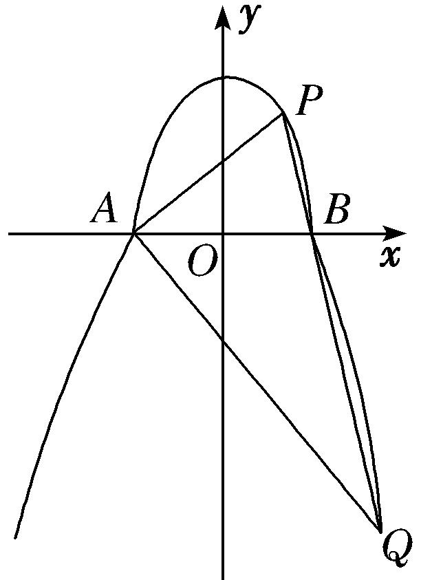
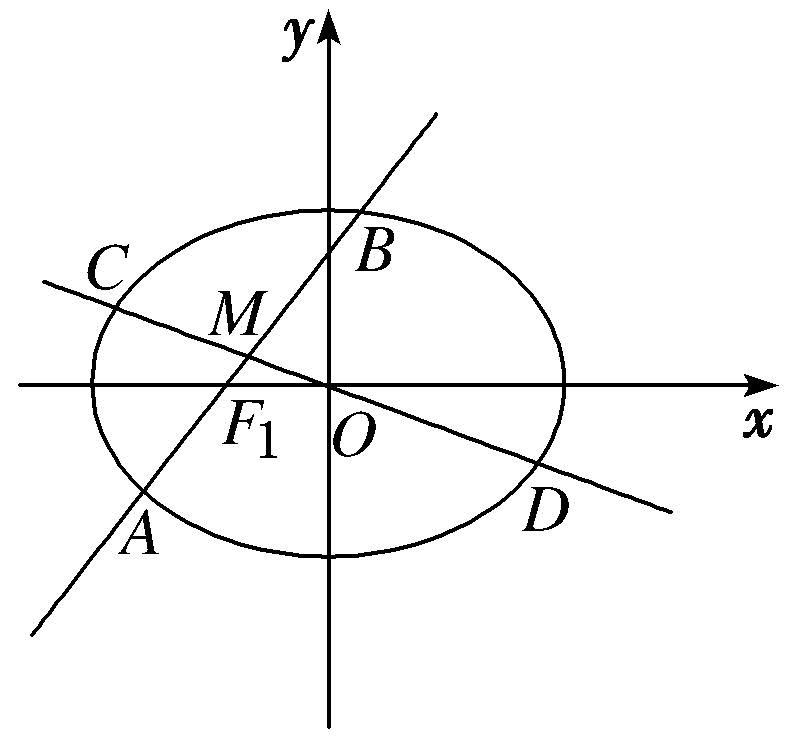
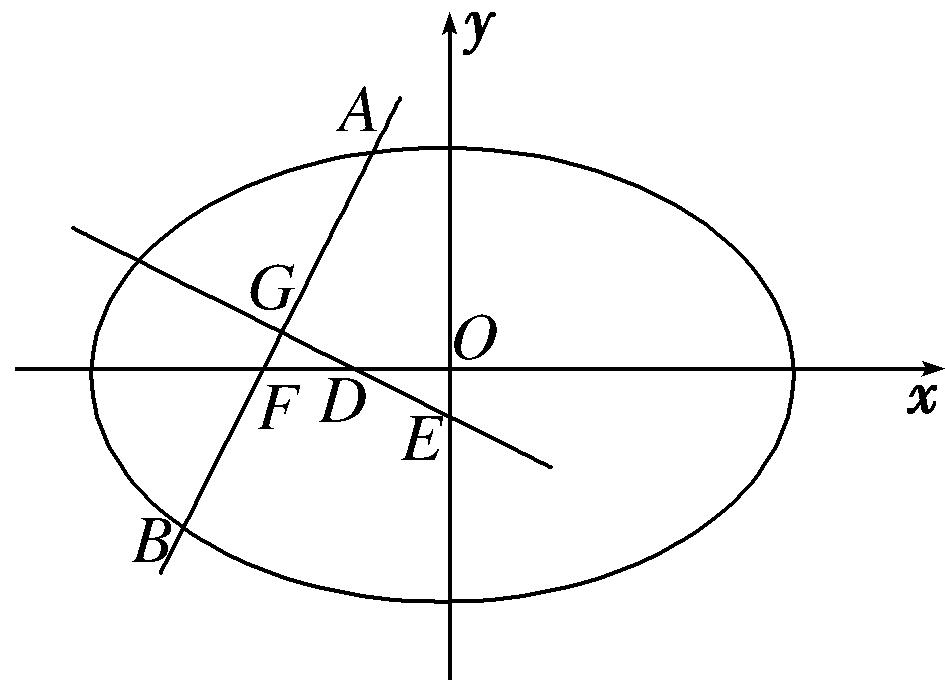
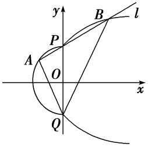

专题34　探究是否存在直线型问题

探索性问题——肯定结论

1．存在性问题的解题步骤

探索性问题通常采用“肯定顺推法”，将不确定性问题明朗化．一般步骤为：  
（1）假设满足条件的元素(常数、点、直线或曲线)存在，引入参变量，根据题目条件列出关于参变量的方程(组)或不等式(组)；  
（2）解此方程(组)或不等式(组)；  
（3）若方程(组)有实数解，则元素(常数、点、直线或曲线)存在，否则不存在．

2．解决存在性问题的注意事项

探索性问题，先假设存在，推证满足条件的结论，若结论正确则存在，若结论不正确则不存在．  
（1）当条件和结论不唯一时，要分类讨论．  
（2）当给出结论而要推导出存在的条件时，先假设成立，再推出条件．  
（3）当条件和结论都不知，按常规方法解题很难时，要思维开放，采取另外的途径．

【例题选讲】

<strong>[例1]</strong>　已知椭圆<em>C</em>：＋＝1(<em>a</em>&gt;<em>b</em>&gt;0)的右焦点为<em>F</em>2(2，0)，点<em>P</em>在椭圆<em>C</em>上．  
（1）求椭圆*C*的标准方程；  
（2）是否存在斜率为－1的直线<em>l</em>与椭圆<em>C</em>相交于<em>M</em>，<em>N</em>两点，使得|<em>F</em>1<em>M</em>|＝|<em>F</em>1<em>N</em>|(<em>F</em>1为椭圆的左焦点)？若存在，求出直线<em>l</em>的方程；若不存在，说明理由．

<strong>[规范解答]</strong>　（1）法一：∵椭圆<em>C</em>的右焦点为<em>F</em>2(2，0)，∴<em>c</em>＝2，椭圆<em>C</em>的左焦点为<em>F</em>1(－2，0)．
由椭圆的定义可得2*a*＝＋＝＋＝2，
解得<em>a</em>＝，∴<em>b</em>2＝<em>a</em>2－<em>c</em>2＝6－4＝2．∴椭圆<em>C</em>的标准方程为＋＝1．

法二：∵椭圆<em>C</em>的右焦点为<em>F</em>2(2,0)，∴<em>c</em>＝2，故<em>a</em>2－<em>b</em>2＝4，
又点*P*在椭圆*C*上，则＋＝1，故＋＝1，
化简得3<em>b</em>4＋4<em>b</em>2－20＝0，得<em>b</em>2＝2，<em>a</em>2＝6．∴椭圆<em>C</em>的标准方程为＋＝1．  
（2）假设存在满足条件的直线*l*，设直线*l*的方程为*y*＝－*x*＋*t*，
由得<em>x</em>2＋3(－<em>x</em>＋<em>t</em>)2－6＝0，即4<em>x</em>2－6<em>tx</em>＋(3<em>t</em>2－6)＝0，

<em>Δ</em>＝(－6<em>t</em>)2－4×4×(3<em>t</em>2－6)＝96－12<em>t</em>2&gt;0，解得－2&lt;<em>t</em>&lt;2．
设<em>M</em>(<em>x</em>1，<em>y</em>1)，<em>N</em>(<em>x</em>2，<em>y</em>2)，则<em>x</em>1＋<em>x</em>2＝，<em>x</em>1<em>x</em>2＝，
由于|<em>F</em>1<em>M</em>|＝|<em>F</em>1<em>N</em>|，设线段<em>MN</em>的中点为<em>E</em>，则<em>F</em>1<em>E</em>⊥<em>MN</em>，故<em>kF</em>1<em>E</em>＝－＝1，
又<em>F</em>1(－2，0)，<em>E</em>，即<em>E</em>，∴<em>kF</em>1<em>E</em>＝＝1，解得<em>t</em>＝－4．
当*t*＝－4时，不满足－2<*t*<2，∴不存在满足条件的直线*l*．

<strong>[例2]</strong>　已知椭圆<em>C</em>：＋＝1(<em>a</em>&gt;<em>b</em>&gt;0)的左、右焦点分别为<em>F</em>1(－1，0)，<em>F</em>2(1，0)，点<em>A</em>在椭圆<em>C</em>上．  
（1）求椭圆*C*的标准方程；  
（2）是否存在斜率为2的直线，使得当直线与椭圆*C*有两个不同交点*M*，*N*时，能在直线*y*＝上找到一点*P*，在椭圆*C*上找到一点*Q*，满足＝？若存在，求出直线的方程；若不存在，说明理由．

<strong>[规范解答]</strong>　（1）设椭圆<em>C</em>的焦距为2<em>c</em>，则<em>c</em>＝1，因为<em>A</em>在椭圆<em>C</em>上，
所以2<em>a</em>＝|<em>AF</em>1|＋|<em>AF</em>2|＝2，因此<em>a</em>＝，<em>b</em>2＝<em>a</em>2－<em>c</em>2＝1，故椭圆<em>C</em>的方程为＋<em>y</em>2＝1．  
（2）不存在满足条件的直线，证明如下：
假设存在斜率为2的直线，满足条件，则设直线的方程为*y*＝2*x*＋*t*，
设<em>M</em>(<em>x</em>1，<em>y</em>1)，<em>N</em>(<em>x</em>2，<em>y</em>2)，<em>P</em>，<em>Q</em>(<em>x</em>4，<em>y</em>4)，<em>MN</em>的中点为<em>D</em>(<em>x</em>0，<em>y</em>0)，
由消去<em>x</em>，得9<em>y</em>2－2<em>ty</em>＋<em>t</em>2－8＝0，所以<em>y</em>1＋<em>y</em>2＝，且<em>Δ</em>＝4<em>t</em>2－36(<em>t</em>2－8)&gt;0，
故<em>y</em>0＝＝，且－3&lt;<em>t</em>&lt;3．＝
由＝，得＝(<em>x</em>4－<em>x</em>2，<em>y</em>4－<em>y</em>2)，所以有<em>y</em>1－＝<em>y</em>4－<em>y</em>2，<em>y</em>4＝<em>y</em>1＋<em>y</em>2－＝<em>t</em>－．

也可由＝，知四边形*PMQN*为平行四边形，而*D*为线段*MN*的中点，
因此，<em>D</em>也为线段<em>PQ</em>的中点，所以<em>y</em>0＝＝，
又－3&lt;<em>t</em>&lt;3，所以－&lt;<em>y</em>4&lt;－1，与椭圆上点的纵坐标的取值范围是[－1，1]矛盾．
因此不存在满足条件的直线．

<strong>[例3]</strong>　已知圆<em>C</em>：(<em>x</em>－1)2＋<em>y</em>2＝，一动圆与直线<em>x</em>＝－相切且与圆<em>C</em>外切．  
（1）求动圆圆心*P*的轨迹*T*的方程；  
（2）若经过定点*Q*(6，0)的直线*l*与曲线*T*交于*A*，*B*两点，*M*是线段*AB*的中点，过*M*作*x*轴的平行线与曲线*T*相交于点*N*，试问是否存在直线*l*，使得*NA*⊥*NB*，若存在，求出直线*l*的方程；若不存在，请说明理由．

<strong>[规范解答]</strong>　（1）设<em>P</em>(<em>x</em>，<em>y</em>)，分析可知动圆的圆心不能在<em>y</em>轴的左侧，故<em>x</em>≥0，
因为动圆与直线*x*＝－相切，且与圆*C*外切，
所以|*PC*|－＝，所以|*PC*|＝*x*＋1，
所以 ＝<em>x</em>＋1，化简可得<em>y</em>2＝4<em>x</em>．  
（2）设<em>A</em>(<em>x</em>1，<em>y</em>1)，<em>B</em>(<em>x</em>2，<em>y</em>2)，由题意可知，当直线<em>l</em>与<em>y</em>轴垂直时，显然不符合题意，
故可设直线*l*的方程为*x*＝*my*＋6，
联立消去<em>x</em>，可得<em>y</em>2－4<em>my</em>－24＝0，
显然<em>Δ</em>＝16<em>m</em>2＋96&gt;0，则①
所以<em>x</em>1＋<em>x</em>2＝(<em>my</em>1＋6)＋(<em>my</em>2＋6)＝4<em>m</em>2＋12，②
因为<em>x</em>1<em>x</em>2＝·，所以<em>x</em>1<em>x</em>2＝36，③
假设存在<em>N</em>(<em>x</em>0，<em>y</em>0)，使得·＝0，
由题意可知<em>y</em>0＝，所以<em>y</em>0＝2<em>m</em>，④
由<em>N</em>点在抛物线上可知<em>x</em>0＝，即<em>x</em>0＝<em>m</em>2，⑤
又＝(<em>x</em>1－<em>x</em>0，<em>y</em>1－<em>y</em>0)，＝(<em>x</em>2－<em>x</em>0，<em>y</em>2－<em>y</em>0)，
若·＝0，则<em>x</em>1<em>x</em>2－<em>x</em>0(<em>x</em>1＋<em>x</em>2)＋<em>x</em>＋<em>y</em>1<em>y</em>2－<em>y</em>0(<em>y</em>1＋<em>y</em>2)＋<em>y</em>＝0，
由①②③④⑤代入上式化简可得：3<em>m</em>4＋16<em>m</em>2－12＝0，
即(<em>m</em>2＋6)(3<em>m</em>2－2)＝0，所以<em>m</em>2＝，故<em>m</em>＝±，
所以存在直线3*x*＋*y*－18＝0或3*x*－*y*－18＝0，使得*NA*⊥*NB*．

<strong>[例4]</strong>　如图，曲线<em>C</em>由上半椭圆<em>C</em>1：＋＝1(<em>a</em>＞<em>b</em>＞0，<em>y</em>≥0)和部分抛物线<em>C</em>2：<em>y</em>＝－<em>x</em>2＋1(<em>y</em>≤0)连接而成，<em>C</em>1与<em>C</em>2的公共点为<em>A</em>，<em>B</em>，其中<em>C</em>1的离心率为．  
（1）求*a*，*b*的值；  
（2）过点<em>B</em>的直线<em>l</em>与<em>C</em>1，<em>C</em>2分别交于点<em>P</em>，<em>Q</em>(均异于点<em>A</em>，<em>B</em>)，是否存在直线<em>l</em>，使得以<em>PQ</em>为直径的圆恰好过点<em>A</em>，若存在，求出直线<em>l</em>的方程；若不存在，请说明理由．

<strong>[规范解答]</strong>　（1）在<em>C</em>2的方程中，令<em>y</em>＝0，可得<em>b</em>＝1．

且<em>A</em>(－1，0)，<em>B</em>(1，0)是上半椭圆<em>C</em>1的左、右顶点．设<em>C</em>1的半焦距为<em>c</em>，
由＝及<em>a</em>2－<em>c</em>2＝<em>b</em>2＝1可得<em>a</em>＝2，∴<em>a</em>＝2，<em>b</em>＝1．  
（2）存在直线*l*，理由如下：
由（1）知，上半椭圆<em>C</em>1的方程为＋<em>x</em>2＝1(<em>y</em>≥0)．
由题易知，直线*l*与*x*轴不重合也不垂直，设其方程为
代入<em>C</em>1的方程，整理得(<em>k</em>2＋4)<em>x</em>2－2<em>k</em>2<em>x</em>＋<em>k</em>2－4＝0．(\*)
设点<em>P</em>的坐标为(<em>xP</em>，<em>yP</em>)，∵直线<em>l</em>过点<em>B</em>，∴<em>x</em>＝1是方程(\*)的一个根
由求根公式，得<em>xP</em>＝，从而<em>yP</em>＝，∴点<em>P</em>的坐标为．

同理，由得点<em>Q</em>的坐标为(－<em>k</em>－1，－<em>k</em>2－2<em>k</em>)．
∴＝(*k*，－4)，＝－*k*(1，*k*＋2)．
依题意可知*AP*⊥*AQ*，∴·＝0，即[*k*－4(*k*＋2)]＝0．
∵*k*≠0，∴*k*－4(*k*＋2)＝0，解得*k*＝－，经检验，*k*＝－符合题意，
故存在直线*l*的方程为*y*＝－(*x*－1)，即8*x*＋3*y*－8＝0，使得以*PQ*为直径的圆恰好过点*A*．

<strong>[例5]</strong>　如图所示，已知椭圆<em>G</em>：＋<em>y</em>2＝1，与<em>x</em>轴不重合的直线<em>l</em>经过左焦点<em>F</em>1，且与椭圆<em>G</em>相交于<em>A</em>，<em>B</em>两点，弦<em>AB</em>的中点为<em>M</em>，直线<em>OM</em>与椭圆<em>G</em>相交于<em>C</em>，<em>D</em>两点．  
（1）若直线*l*的斜率为1，求直线*OM*的斜率．  
（2）是否存在直线<em>l</em>，使得|<em>AM</em>|2＝|<em>CM</em>||<em>DM</em>|成立？若存在，求出直线<em>l</em>的方程；若不存在，请说明理由．

<strong>[规范解答]</strong>　（1）由题意可知点<em>F</em>1(－1，0)，又直线<em>l</em>的斜率为1，故直线<em>l</em>的方程为<em>y</em>＝<em>x</em>＋1．
设点<em>A</em>(<em>x</em>1，<em>y</em>1)，<em>B</em>(<em>x</em>2，<em>y</em>2)，由消去<em>y</em>并整理得3<em>x</em>2＋4<em>x</em>＝0，
则<em>x</em>1＋<em>x</em>2＝－，<em>y</em>1＋<em>y</em>2＝，因此中点<em>M</em>的坐标为．故直线<em>OM</em>的斜率为＝－．  
（2）假设存在直线<em>l</em>，使得|<em>AM</em>|2＝|<em>CM</em>||<em>DM</em>|成立．由题意，直线<em>l</em>不与<em>x</em>轴重合，
设直线<em>l</em>的方程为<em>x</em>＝<em>my</em>－1．由消去<em>x</em>并整理得(<em>m</em>2＋2)<em>y</em>2－2<em>my</em>－1＝0．
设点<em>A</em>(<em>x</em>1，<em>y</em>1)，<em>B</em>(<em>x</em>2，<em>y</em>2)，则
可得|<em>AB</em>|＝|<em>y</em>1－<em>y</em>2|＝ ＝，

<em>x</em>1＋<em>x</em>2＝<em>m</em>(<em>y</em>1＋<em>y</em>2)－2＝－2＝，
所以弦*AB*的中点*M*的坐标为，
故直线<em>CD</em>的方程为<em>y</em>＝－<em>x</em>．联立消去<em>y</em>并整理得2<em>x</em>2＋<em>m</em>2<em>x</em>2－4＝0，
解得<em>x</em>2＝．由对称性，设<em>C</em>(<em>x</em>0，<em>y</em>0)，<em>D</em>(－<em>x</em>0，－<em>y</em>0)，则<em>x</em>＝，
可得|<em>CD</em>|＝·|2<em>x</em>0|＝＝2 ．
因为|<em>AM</em>|2＝|<em>CM</em>||<em>DM</em>|＝(|<em>OC</em>|－|<em>OM</em>|)(|<em>OD</em>|＋|<em>OM</em>|)，且|<em>OC</em>|＝|<em>OD</em>|，所以|<em>AM</em>|2＝|<em>OC</em>|2－|<em>OM</em>|2，
故＝－|<em>OM</em>|2，即|<em>AB</em>|2＝|<em>CD</em>|2－4|<em>OM</em>|2，
则＝－4，解得<em>m</em>2＝2，故<em>m</em>＝±．
所以直线*l*的方程为*x*－*y*＋1＝0或*x*＋*y*＋1＝0．

<strong>[题后悟通]</strong>　本题（2）的核心在于转化|<em>AM</em>|2＝|<em>CM</em>|·|<em>DM</em>|中弦长的关系．由|<em>CM</em>|＝|<em>OC</em>|－|<em>OM</em>|，|<em>DM</em>|＝|<em>OD</em>|＋|<em>OM</em>|，又|<em>OC</em>|＝|<em>OD</em>|，得|<em>AM</em>|2＝|<em>OC</em>|2－|<em>OM</em>|2．又|<em>AM</em>|＝|<em>AB</em>|，|<em>OC</em>|＝|<em>CD</em>|，因此|<em>AB</em>|2＝|<em>CD</em>|2－4|<em>OM</em>|2，转化为弦长|<em>AB</em>|，|<em>CD</em>|和|<em>OM</em>|三者之间的数量关系，易计算．

<strong>[例6]</strong>　椭圆＋＝1的左焦点为<em>F</em>，过点<em>F</em>的直线交椭圆于<em>A</em>，<em>B</em>两点，线段<em>AB</em>的中点为<em>G</em>，<em>AB</em>的中垂线与<em>x</em>轴和<em>y</em>轴分别交于<em>D</em>，<em>E</em>两点．  
（1）若点*G*的横坐标为－，求直线*AB*的斜率；  
（2）记△<em>GFD</em>的面积为<em>S</em>1，△<em>OED</em>(<em>O</em>为原点)的面积为<em>S</em>2，试问：是否存在直线<em>AB</em>，使得<em>S</em>1＝<em>S</em>2？说明理由．

<strong>[规范解答]</strong>　（1）由条件可得<em>c</em>2＝<em>a</em>2－<em>b</em>2＝1，故<em>F</em>点坐标为(－1，0)．
依题意可知，直线*AB*的斜率存在，设其方程为*y*＝*k*(*x*＋1)，将其代入＋＝1，
整理得(4<em>k</em>2＋3)<em>x</em>2＋8<em>k</em>2<em>x</em>＋4<em>k</em>2－12＝0．
设<em>A</em>(<em>x</em>1，<em>y</em>1)，<em>B</em>(<em>x</em>2，<em>y</em>2)，所以<em>x</em>1＋<em>x</em>2＝，故点<em>G</em>的横坐标为＝＝－，
解得*k*＝±，故直线*AB*的斜率为或－．  
（2）假设存在直线<em>AB</em>，使得<em>S</em>1＝<em>S</em>2，显然直线<em>AB</em>不能与<em>x</em>，<em>y</em>轴垂直，即直线<em>AB</em>斜率存在且不为零．
由（1）可得*G*．
设<em>D</em>点坐标为(<em>xD,</em>0)．因为<em>DG</em>⊥<em>AB</em>，所以×<em>k</em>＝－1，解得<em>xD</em>＝，即<em>D</em>．
因为△<em>GFD</em>∽△<em>OED</em>，所以<em>S</em>1＝<em>S</em>2⇔|<em>GD</em>|＝|<em>OD</em>|．
所以 ＝，整理得8<em>k</em>2＋9＝0．
因为此方程无解，所以不存在直线<em>AB</em>，使得<em>S</em>1＝<em>S</em>2．

<strong>[例7]</strong>　已知平面上动点<em>P</em>到点<em>F</em>的距离与到直线<em>x</em>＝的距离之比为，记动点<em>P</em>的轨迹为曲线<em>E</em>．  
（1）求曲线*E*的方程；  
（2）设*M*是曲线*E*上的动点，直线*l*的方程为*mx*＋*ny*＝1．

①设直线<em>l</em>与圆<em>x</em>2＋<em>y</em>2＝1交于不同两点<em>C</em>，<em>D</em>，求|<em>CD</em>|的取值范围；
②求与动直线<em>l</em>恒相切的定椭圆<em>E</em>′的方程，并探究：若<em>M</em>是曲线<em>Γ</em>：<em>Ax</em>2＋<em>By</em>2＝1上的动点，是否存在与直线<em>l</em>：<em>mx</em>＋<em>ny</em>＝1恒相切的定曲线<em>Γ</em>′？若存在，直接写出曲线<em>Γ</em>′的方程；若不存在，说明理由．

<strong>[规范解答]</strong>　（1）设<em>P</em>(<em>x</em>，<em>y</em>)，由题意，得＝，

整理，得＋<em>y</em>2＝1，∴曲线<em>E</em>的方程为＋<em>y</em>2＝1．  
（2）①圆心到直线<em>l</em>的距离<em>d</em>＝，∵直线与圆有两个不同交点<em>C</em>，<em>D</em>，∴|<em>CD</em>|2＝4．
又∵＋<em>n</em>2＝1(<em>m</em>≠0)，∴|<em>CD</em>|2＝4．∵|<em>m</em>|≤2，∴0&lt;<em>m</em>2≤4，∴0&lt;1－≤．
∴|<em>CD</em>|2∈，|<em>CD</em>|∈，即|<em>CD</em>|的取值范围为．

②当*m*＝0，*n*＝1时，直线*l*的方程为*y*＝1；当*m*＝2，*n*＝0时，直线*l*的方程为*x*＝．
根据椭圆对称性，猜想<em>E</em>′的方程为4<em>x</em>2＋<em>y</em>2＝1．

下面证明：直线<em>mx</em>＋<em>ny</em>＝1与4<em>x</em>2＋<em>y</em>2＝1相切，其中＋<em>n</em>2＝1，即<em>m</em>2＋4<em>n</em>2＝4．
由消去<em>y</em>得<em>x</em>2－2<em>mx</em>＋1－<em>n</em>2＝0，即4<em>x</em>2－2<em>mx</em>＋1－<em>n</em>2＝0，
∴<em>Δ</em>＝4<em>m</em>2－16＝4＝0恒成立，
从而直线<em>mx</em>＋<em>ny</em>＝1与椭圆<em>E</em>′：4<em>x</em>2＋<em>y</em>2＝1恒相切．
若点<em>M</em>是曲线<em>Γ</em>：<em>Ax</em>2＋<em>By</em>2＝1上的动点，
则直线*l*：*mx*＋*ny*＝1与定曲线*Γ*′：＋＝1恒相切．

【对点训练】

1．已知中心在坐标原点*O*的椭圆*C*经过点*A*(2，3)，且点*F*(2，0)为其右焦点．  
（1）求椭圆*C*的方程；  
（2）是否存在平行于*OA*的直线*l*，使得直线*l*与椭圆*C*有公共点，且直线*OA*与*l*的距离等于4？若存在，求出直线*l*的方程；若不存在，请说明理由．

1．解析　（1）依题意，可设椭圆*C*的方程为＋＝1(*a*>*b*>0)，且可知其左焦点为*F*′(－2,0)．
从而有解得又<em>a</em>2＝<em>b</em>2＋<em>c</em>2，所以<em>b</em>2＝12．
故椭圆*C*的方程为＋＝1．  
（2）假设存在符合题意的直线*l*，设其方程为*y*＝*x*＋*t*．
由得3<em>x</em>2＋3<em>tx</em>＋<em>t</em>2－12＝0，因为直线<em>l</em>与椭圆<em>C</em>有公共点，
所以<em>Δ</em>＝(3<em>t</em>)2－4×3(<em>t</em>2－12)＝144－3<em>t</em>2≥0，解得－4≤<em>t</em>≤4．
另一方面，由直线*OA*与*l*的距离等于4，可得＝4，从而*t*＝±2，由于±2∉[－4，4 ]，
所以符合题意的直线*l*不存在．

2．已知椭圆*E*：＋＝1的右焦点为*F*(*c*，0)且*a*>*b*>*c*>0，设短轴的一个端点为*D*，原点*O*到直线*DF*

的距离为，过原点和*x*轴不重合的直线与椭圆*E*相交于*C*，*G*两点，且||＋||＝4．  
（1）求椭圆*E*的方程；  
（2）是否存在过点<em>P</em>(2，1)的直线<em>l</em>与椭圆<em>E</em>相交于不同的两点<em>A</em>，<em>B</em>且使得2＝4·成立？若存在，试求出直线<em>l</em>的方程；若不存在，请说明理由．

2．解析　（1）由椭圆的对称性知||＋||＝2*a*＝4，所以*a*＝2．又原点*O*到直线*DF*的距离为，
所以＝，所以<em>bc</em>＝，又<em>a</em>2＝<em>b</em>2＋<em>c</em>2＝4，<em>a</em>&gt;<em>b</em>&gt;<em>c</em>&gt;0，
所以*b*＝，*c*＝1．故椭圆*E*的方程为＋＝1．  
（2）当直线<em>l</em>与<em>x</em>轴垂直时不满足条件．故可设<em>A</em>(<em>x</em>1，<em>y</em>1)，<em>B</em>(<em>x</em>2，<em>y</em>2)，

直线<em>l</em>的方程为<em>y</em>＝<em>k</em>(<em>x</em>－2)＋1，代入椭圆方程得(3＋4<em>k</em>2)<em>x</em>2－8<em>k</em>(2<em>k</em>－1)<em>x</em>＋16<em>k</em>2－16<em>k</em>－8＝0，
所以<em>x</em>1＋<em>x</em>2＝，<em>x</em>1<em>x</em>2＝，<em>Δ</em>＝32(6<em>k</em>＋3)&gt;0，所以<em>k</em>&gt;－．
因为2＝4·，即4[(<em>x</em>1－2)(<em>x</em>2－2)＋(<em>y</em>1－1)·(<em>y</em>2－1)]＝5，
所以4(<em>x</em>1－2)(<em>x</em>2－2)(1＋<em>k</em>2)＝5，即4[<em>x</em>1<em>x</em>2－2(<em>x</em>1＋<em>x</em>2)＋4](1＋<em>k</em>2)＝5，
所以4(1＋<em>k</em>2)＝4×＝5，解得<em>k</em>＝±，

*k*＝－不符合题意，舍去．所以存在满足条件的直线*l*，其方程为*y*＝*x*．

3．如图，由部分抛物线<em>y</em>2＝<em>mx</em>＋1(<em>m</em>＞0，<em>x</em>≥0)和半圆<em>x</em>2＋<em>y</em>2＝<em>r</em>2(<em>x</em>≤0)所组成的曲线称为“黄金抛物线<em>C</em>”，
若“黄金抛物线*C*”经过点(3，2)和(－，)．  
（1）求“黄金抛物线*C*”的方程；  
（2）设*P*(0，1)和*Q*(0，－1)，过点*P*作直线*l*与“黄金抛物线*C*”交于*A*，*P*，*B*三点，问是否存在这样的直线*l*，使得*QP*平分∠*AQB*？若存在，求出直线*l*的方程；若不存在，请说明理由．

3．<strong>解析</strong>　（1）因为“黄金抛物线<em>C</em>”过点(3，2)和(－，)，
所以<em>r</em>2＝(－)2＋()2＝1，4＝3<em>m</em>＋1，解得<em>m</em>＝1．
所以“黄金抛物线<em>C</em>”的方程为<em>y</em>2＝<em>x</em>＋1(<em>x</em>≥0)和<em>x</em>2＋<em>y</em>2＝1(<em>x</em>≤0)．  
（2）假设存在这样的直线*l*，使得*QP*平分∠*AQB*．显然直线*l*的斜率存在且不为0，

结合题意可设直线<em>l</em>的方程为<em>y</em>＝<em>kx</em>＋1(<em>k</em>≠0)，<em>A</em>(<em>xA</em>，<em>yA</em>)，<em>B</em>(<em>xB</em>，<em>yB</em>)，不妨令<em>xA</em>＜0＜<em>xB</em>．
由消去<em>y</em>并整理，得<em>k</em>2<em>x</em>2＋(2<em>k</em>－1)<em>x</em>＝0，
所以<em>xB</em>＝，<em>yB</em>＝，即<em>B</em>(，)，由<em>xB</em>＞0知<em>k</em>＜，所以直线<em>BQ</em>的斜率为<em>kBQ</em>＝．
由消去<em>y</em>并整理，得(<em>k</em>2＋1)<em>x</em>2＋2<em>kx</em>＝0，
所以<em>xA</em>＝－，<em>yA</em>＝，即<em>A</em>(－，)，
由<em>xA</em>＜0知<em>k</em>＞0，所以直线<em>AQ</em>的斜率为<em>kAQ</em>＝－．
因为<em>QP</em>平分∠<em>AQB</em>，且直线<em>QP</em>的斜率不存在，所以<em>kAQ</em>＋<em>kBQ</em>＝0，即－＋＝0，
由0＜*k*＜，可得*k*＝－1．
所以存在直线*l*：*y*＝(－1)*x*＋1，使得*QP*平分∠*AQB*．

4．已知椭圆*E*：＋＝1(*a*>*b*>0)过点*Q*，且离心率e＝，直线*l*与*E*相交于*M*，*N*两点，*l*

与*x*轴、*y*轴分别相交于*C*，*D*两点，*O*为坐标原点．  
（1）求椭圆*E*的方程；  
（2）判断是否存在直线*l*，满足2＝＋，2＝＋？若存在，求出直线*l*的方程；若不存在，请说明理由．

4．解析　（1）由题意得解得所以椭圆<em>E</em>的方程为＋<em>y</em>2＝1．  
（2）存在直线*l*，满足2＝＋，2＝＋．理由如下：
方法一　由题意，直线<em>l</em>的斜率存在，设直线<em>l</em>的方程为<em>y</em>＝<em>kx</em>＋<em>m</em>(<em>km</em>≠0)，<em>M</em>(<em>x</em>1，<em>y</em>1)，<em>N</em>(<em>x</em>2，<em>y</em>2)，
则*C*，*D*(0，*m*)．
由方程组得(1＋2<em>k</em>2)<em>x</em>2＋4<em>kmx</em>＋2<em>m</em>2－2＝0，所以<em>Δ</em>＝16<em>k</em>2－8<em>m</em>2＋8&gt;0．(\*)
由根与系数的关系，得<em>x</em>1＋<em>x</em>2＝－，<em>x</em>1<em>x</em>2＝．
因为2＝＋，2＝＋，所以＝＝，
所以*C*，*D*是线段*MN*的两个三等分点，得线段*MN*的中点与线段*CD*的中点重合．
所以<em>x</em>1＋<em>x</em>2＝－＝0－，解得<em>k</em>＝±．
由*C*，*D*是线段*MN*的两个三等分点，得|*MN*|＝3|*CD*|．
所以|<em>x</em>1－<em>x</em>2|＝3，即|<em>x</em>1－<em>x</em>2|＝＝3，
解得*m*＝±．验证知(\*)成立．
所以存在直线*l*，满足2＝＋，2＝＋，此时直线*l*的方程为*y*＝*x*±或*y*＝－*x*±．
方法二　设<em>M</em>(<em>x</em>1，<em>y</em>1)，<em>N</em>(<em>x</em>2，<em>y</em>2)，<em>C</em>(<em>m,</em>0)，<em>D</em>(0，<em>n</em>)，由2＝＋，2＝＋，
得解得*M*(2*m*，－*n*)，*N*(－*m,* 2*n*)．
又*M*，*N*两点在椭圆上，所以即解得
故所求直线*l*的方程为5*x*－10*y*＋2＝0或5*x*－10*y*－2＝0或5*x*＋10*y*＋2＝0或5*x*＋10*y*－2＝0．

5<strong>．</strong>已知圆<em>C</em>：(<em>x</em>－1)2＋<em>y</em>2＝，一动圆与直线<em>x</em>＝－相切且与圆<em>C</em>外切．  
（1）求动圆圆心*P*的轨迹*T*的方程；  
（2）若经过定点*Q*(6，0)的直线*l*与曲线*T*交于*A*，*B*两点，*M*是线段*AB*的中点，过*M*作*x*轴的平行线与曲线*T*相交于点*N*，试问是否存在直线*l*，使得*NA*⊥*NB*，若存在，求出直线*l*的方程；若不存在，请说明理由．

5<strong>．</strong>解析　（1）设<em>P</em>(<em>x</em>，<em>y</em>)，分析可知动圆的圆心不能在<em>y</em>轴的左侧，故<em>x</em>≥0，
因为动圆与直线*x*＝－相切，且与圆*C*外切，所以|*PC*|－＝，所以|*PC*|＝*x*＋1，
所以 ＝<em>x</em>＋1，化简可得<em>y</em>2＝4<em>x</em>．  
（2）设<em>A</em>(<em>x</em>1，<em>y</em>1)，<em>B</em>(<em>x</em>2，<em>y</em>2)，由题意可知，当直线<em>l</em>与<em>y</em>轴垂直时，显然不符合题意，
故可设直线<em>l</em>的方程为<em>x</em>＝<em>my</em>＋6，联立消去<em>x</em>，可得<em>y</em>2－4<em>my</em>－24＝0，
显然<em>Δ</em>＝16<em>m</em>2＋96&gt;0，则①，所以<em>x</em>1＋<em>x</em>2＝(<em>my</em>1＋6)＋(<em>my</em>2＋6)＝4<em>m</em>2＋12，②
因为<em>x</em>1<em>x</em>2＝·，所以<em>x</em>1<em>x</em>2＝36，③
假设存在<em>N</em>(<em>x</em>0，<em>y</em>0)，使得·＝0，由题意可知<em>y</em>0＝，所以<em>y</em>0＝2<em>m</em>，④
由<em>N</em>点在抛物线上可知<em>x</em>0＝，即<em>x</em>0＝<em>m</em>2，⑤
又＝(<em>x</em>1－<em>x</em>0，<em>y</em>1－<em>y</em>0)，＝(<em>x</em>2－<em>x</em>0，<em>y</em>2－<em>y</em>0)，若·＝0，
则<em>x</em>1<em>x</em>2－<em>x</em>0(<em>x</em>1＋<em>x</em>2)＋<em>x</em>＋<em>y</em>1<em>y</em>2－<em>y</em>0(<em>y</em>1＋<em>y</em>2)＋<em>y</em>＝0，
由①②③④⑤代入上式化简可得：3<em>m</em>4＋16<em>m</em>2－12＝0，即(<em>m</em>2＋6)(3<em>m</em>2－2)＝0，
所以<em>m</em>2＝，故<em>m</em>＝±，所以存在直线3<em>x</em>＋<em>y</em>－18＝0或3<em>x</em>－<em>y</em>－18＝0，使得<em>NA</em>⊥<em>NB．</em>

6．已知椭圆*P*的中心*O*在坐标原点，焦点在*x*轴上，且经过点*A*(0，2)，离心率为．  
（1）求椭圆*P*的方程；  
（2）是否存在过点*E*(0，－4)的直线*l*交椭圆*P*于点*R*，*T*，且满足·＝？若存在，求直线*l*的方程；若不存在，请说明理由．

6．解析　（1）设椭圆*P*的方程为＋＝1(*a*>*b*>0)，由题意得*b*＝2，*e*＝＝，
∴<em>a</em>＝2<em>c</em>，<em>b</em>2＝<em>a</em>2－<em>c</em>2＝3<em>c</em>2，∴<em>c</em>2＝4，<em>c</em>＝2，<em>a</em>＝4，∴椭圆<em>P</em>的方程为＋＝1．  
（2）假设存在满足题意的直线*l*，易知当直线*l*的斜率不存在时，·<0，不满足题意．
故可设直线<em>l</em>的方程为<em>y</em>＝<em>kx</em>－4，<em>R</em>(<em>x</em>1，<em>y</em>1)，<em>T</em>(<em>x</em>2，<em>y</em>2)．
∵·＝，∴<em>x</em>1<em>x</em>2＋<em>y</em>1<em>y</em>2＝．由消去<em>y</em>，得(3＋4<em>k</em>2)<em>x</em>2－32<em>kx</em>＋16＝0，
由<em>Δ</em>&gt;0得(－32<em>k</em>)2－64(3＋4<em>k</em>2)&gt;0，解得<em>k</em>2&gt;．①
∵<em>x</em>1＋<em>x</em>2＝，<em>x</em>1<em>x</em>2＝，∴<em>y</em>1<em>y</em>2＝(<em>kx</em>1－4)(<em>kx</em>2－4)＝<em>k</em>2<em>x</em>1<em>x</em>2－4<em>k</em>(<em>x</em>1＋<em>x</em>2)＋16，
故<em>x</em>1<em>x</em>2＋<em>y</em>1<em>y</em>2＝＋－＋16＝，解得<em>k</em>2＝1．②
由①②解得*k*＝±1，∴直线*l*的方程为*y*＝±*x*－4．故存在直线*l*：*x*＋*y*＋4＝0或*x*－*y*－4＝0满足题意．

7．已知椭圆*C*：＋＝1(*a*>*b*>0)的离心率为，且过点*P*，*F*为其右焦点．  
（1）求椭圆*C*的方程；  
（2）设过点*A*(4，0)的直线*l*与椭圆相交于*M*，*N*两点(点*M*在*A*，*N*两点之间)，是否存在直线*l*使△*AMF*与△*MFN*的面积相等？若存在，试求直线*l*的方程；若不存在，请说明理由．

7．解析　（1）因为＝，所以*a*＝2*c*，*b*＝*c*，设椭圆方程＋＝1，
又点<em>P</em>在椭圆上，所以＋＝1，解得<em>c</em>2＝1，<em>a</em>2＝4，<em>b</em>2＝3，所以椭圆方程为＋＝1．  
（2）易知直线*l*的斜率存在，设*l*的方程为*y*＝*k*(*x*－4)，
由消去<em>y</em>得(3＋4<em>k</em>2)<em>x</em>2－32<em>k</em>2<em>x</em>＋64<em>k</em>2－12＝0，
由题意知<em>Δ</em>＝(32<em>k</em>2)2－4(3＋4<em>k</em>2)(64<em>k</em>2－12)&gt;0，解得－&lt;<em>k</em>&lt;．
设<em>M</em>(<em>x</em>1，<em>y</em>1)，<em>N</em>(<em>x</em>2，<em>y</em>2)，则<em>x</em>1＋<em>x</em>2＝，①，<em>x</em>1<em>x</em>2＝，②
因为△<em>AMF</em>与△<em>MFN</em>的面积相等，所以|<em>AM</em>|＝|<em>MN</em>|，所以2<em>x</em>1＝<em>x</em>2＋4，③
由①③消去<em>x</em>2得<em>x</em>1＝，④．将<em>x</em>2＝2<em>x</em>1－4代入②，得<em>x</em>1(2<em>x</em>1－4)＝⑤
将④代入到⑤式，整理化简得36<em>k</em>2＝5．∴<em>k</em>＝±，经检验满足题设
故直线*l*的方程为*y*＝(*x*－4)或*y*＝－(*x*－4)．

