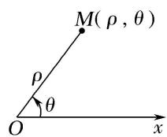
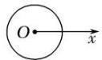
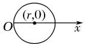
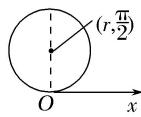
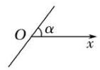
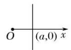
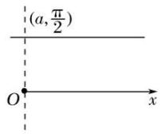

# 专题一 极坐标方程及其应用(综合型)

# 1. 极坐标系

如图(1)所示，在平面内取一个定点 O，叫做极点；自极点 O 引一条射线 Ox，叫做极轴；再选定一个长度单位、一个角度单位(通常取弧度)及其正方向(通常取逆时针方向)，这样就建立了一个极坐标系.

# 2. 极坐标

①极径：设 M 是平面内一点，极点 O 与点 M 的距离 $\left|OM\right|$ 叫做点 M 的极径，记为 $\rho$ .

②极角：以极轴 Ox 为始边，射线 OM 为终边的角 xOM 叫做点 M 的极角，记为 $\theta$ .

③极坐标: 有序数对 $(\rho, \theta)$ 叫做点 $M$ 的极坐标, 记为 $M(\rho, \theta)$ , 一般不作特殊说明时, 我们认为 $\rho \geq 0$ , $\theta$ 可取任意实数。当极角 $\theta$ 的取值范围是 $[0, 2\pi)$ 时, 平面上的点(除去极点)就与极坐标 $(\rho, \theta)(\rho \neq 0)$ 建立一一对应的关系。我们设定, 极点的极坐标中, 极径 $\rho = 0$ , 极角 $\theta$ 可取任意角。

  
图(1)

text_image

y
ρ
θ
O
M(x,y)
x

图(2)

# 3. 极坐标与直角坐标的互化

设 M 为平面上的一点，它的直角坐标为 $(x, y)$ ，极坐标为 $(\rho, \theta)$ 。由图(2)可知下面的关系式成立：

$\left\{\begin{aligned}x&=\rho\cos\theta,\\ y&=\rho\sin\theta\end{aligned}\right.$ 或 $\left\{\begin{aligned}\rho^{2}&=x^{2}+y^{2},\\ \tan\theta&=\frac{y}{x}(x\neq0),\end{aligned}\right.$ 这就是极坐标与直角坐标的互化公式.

# 4. 常见曲线的极坐标方程

<table><tr><td>曲线</td><td>图形</td><td>极坐标方程</td></tr><tr><td>圆心在极点,半径为r的圆</td><td></td><td>ρ=r(0≤θ&lt;2π)</td></tr><tr><td>圆心为(r,0),半径为r的圆</td><td></td><td>ρ=2rcosθ(-π/2≤θ&lt;π/2)</td></tr><tr><td>圆心为(r,π/2),半径为r的圆</td><td></td><td>ρ=2rsinθ(0≤θ&lt;π)</td></tr><tr><td>过极点,倾斜角为α的直线</td><td></td><td>θ=α(ρ∈R)或θ=α+π(ρ∈R)</td></tr><tr><td>过点(a,0),与极轴垂直的直线</td><td></td><td>ρcosθ=a(-π/2&lt;θ&lt;π/2)</td></tr><tr><td>过点 $\left(a, \frac{\pi}{2}\right)$ ,与极轴平行的直线</td><td></td><td> $\rho\sin\theta = a(0<\theta<\pi)$ </td></tr></table>

# [微点提醒]

关于极坐标系

1. 极坐标系的四要素：①极点；②极轴；③长度单位；④角度单位和它的正方向，四者缺一不可.
2. 一般地，点 $M(\rho, \theta)$ 的极坐标通式是 $(\rho, \theta + 2k\pi)$ 或 $(- \rho, \theta + 2k\pi + \pi)(k \in \mathbf{Z})$ . 和直角坐标不同，平面内一个点的极坐标有无数种表示.

3. 极坐标与直角坐标的重要区别：多值性.

# 【例题选讲】

[例 1] 已知点 P 的直角坐标是 $(x, y)$ . 以平面直角坐标系的原点为极坐标的极点，x 轴的正半轴为极轴，建立极坐标系. 设点 P 的极坐标是 $(\rho, \theta)$ ，点 Q 的极坐标是 $(\rho, \theta + \theta_{0})$ ，其中 $\theta_{0}$ 是常数. 设点 Q 的直角坐标是 $(m, n)$ .

(1)用 x, y, $\theta_{0}$ 表示 m, n;  
(2)若 m，n 满足 mn=1，且 $\theta_{0}=\frac{\pi}{4}$ ，求点 P 的直角坐标 $(x, y)$ 满足的方程.

[例 2] 已知曲线 $C_{1}$ 的参数方程为 $\left\{\begin{aligned} x &= 4 + 5 \cos t, \\ y &= 5 + 5 \sin t \end{aligned}\right.$ (t 为参数)，以坐标原点为极点，x 轴正半轴为极轴建立极坐标系，曲线 $C_{2}$ 的极坐标方程为 $\rho = 2 \sin \theta$ .

(1)求 $C_{1}$ 的极坐标方程， $C_{2}$ 的直角坐标方程；  
(2)求 $C_{1}$ 与 $C_{2}$ 交点的极坐标(其中 $\rho \geq 0, \quad 0 \leq \theta < 2\pi$ ).

[例 3] (2017·全国III)在直角坐标系 xOy 中，直线 $l_{1}$ 的参数方程为 $\left\{\begin{aligned}x&=2+t,\\ y&=kt\end{aligned}\right.$ (t 为参数)，直线 $l_{2}$ 的参数方程为 $\left\{\begin{aligned}x&=-2+m,\\ y&=\frac{m}{k}\end{aligned}\right.$ (m 为参数). 设 $l_{1}$ 与 $l_{2}$ 的交点为 P，当 k 变化时，P 的轨迹为曲线 C.

(1)写出 C 的普通方程;  
(2)以坐标原点为极点，x 轴正半轴为极轴建立极坐标系，设 $l_{3}:\rho(\cos\theta+\sin\theta)-\sqrt{2}=0$ ，M 为 $l_{3}$ 与 C 的交点，求 M 的极径.

[例4] 已知圆 $O_{1}$ 和圆 $O_{2}$ 的极坐标方程分别为 $\rho = 2$ ， $\rho^2 - 2\sqrt{2}\rho \cos \left( \theta - \frac{\pi}{4} \right) = 2.$

(1)将圆 $O_{1}$ 和圆 $O_{2}$ 的极坐标方程化为直角坐标方程;  
(2)求经过两圆交点的直线的极坐标方程.

[例 5] 在直角坐标系 xOy 中，以坐标原点 O 为极点，x 轴正半轴为极轴建立极坐标系，曲线 $C_{1}:\rho^{2}-4\rho\cos\theta+3=0,\quad\theta\in[0,2\pi]$ ，曲线 $C_{2}:\rho=\frac{3}{4\sin\left(\frac{\pi}{6}-\theta\right)}$ ， $\theta\in[0,2\pi]$ .

(1)求曲线 $C_{1}$ 的一个参数方程;  
(2)若曲线 $C_{1}$ 和曲线 $C_{2}$ 相交于 A, B 两点，求 $|AB|$ 的值.

[例6] 在平面直角坐标系 $xOy$ 中，圆 $C$ 的参数方程为 $\left\{ \begin{array}{l} x = 1 + \cos \varphi, \\ y = \sin \varphi \end{array} \right.$ ( $\varphi$ 为参数)，以坐标原点 $O$ 为极点， $x$ 轴的正半轴为极轴建立极坐标系.

(1)求圆 C 的极坐标方程;

(2)直线 l 的极坐标方程是 $2\rho\sin\left(\theta+\frac{\pi}{3}\right)=3\sqrt{3}$ ，射线 OM: $\theta=\frac{\pi}{3}$ 与圆 C 的交点为 O, P，与直线 l 的交点为 Q，求线段 PQ 的长.

[例 7] 在平面直角坐标系 xOy 中，已知直线 l: $x + \sqrt{3}y = 5\sqrt{3}$ ，以原点 O 为极点，x 轴的正半轴为极轴建立极坐标系，圆 C 的极坐标方程为 $\rho = 4\sin\theta$ .

(1)求直线 l 的极坐标方程和圆 C 的直角坐标方程;  
(2)射线 OP: $\theta=\frac{\pi}{6}$ 与圆 C 的交点为 O, A, 与直线 l 的交点为 B, 求线段 AB 的长.

[例8] 在平面直角坐标系 $xOy$ 中，曲线 $C$ 的参数方程为 $\left\{ \begin{array}{l} x = 2\cos \theta \\ y = 2\sin \theta + 2 \end{array} \right.$ ( $\theta$ 为参数)，以坐标原点为极点， $x$ 轴非负半轴为极轴建立极坐标系.

(1)求 C 的极坐标方程;

(2)若直线 $l_{1}$ ， $l_{2}$ 的极坐标方程分别为 $\theta=\frac{\pi}{6}(\rho\in\mathbf{R})$ ， $\theta=\frac{2\pi}{3}(\rho\in\mathbf{R})$ ，设直线 $l_{1}$ ， $l_{2}$ 与曲线 C 的交点为 O，M，N，求 $\triangle OMN$ 的面积.

[例 9] 在直角坐标系 xOy 中，曲线 $C_{1}:\left\{\begin{aligned}x=t\cos\alpha,\\ y=t\sin\alpha\end{aligned}\right.$ (t 为参数， $t\neq0$ )，其中 $0\leq\alpha<\pi$ ，在以 O 为极点，x 轴正半轴为极轴的极坐标系中，曲线 $C_{2}:\rho=2\sin\theta$ ，曲线 $C_{3}:\rho=2\sqrt{3}\cos\theta$ .

(1)求 $C_{2}$ 与 $C_{3}$ 交点的直角坐标;  
(2)若 $C_{1}$ 与 $C_{2}$ 相交于点 A， $C_{1}$ 与 $C_{3}$ 相交于点 B，求 $|AB|$ 的最大值.

[例10] 已知直线 $l$ 的参数方程为 $\left\{ \begin{array}{l} x = 1 + 2018t, \\ y = \sqrt{3} + 2018\sqrt{3} t \end{array} \right.$ ( $t$ 为参数). 在以坐标原点 $O$ 为极点， $x$ 轴的正半轴为极轴的极坐标系中，曲线 $C$ 的极坐标方程为 $\rho^2 = 4\rho \cos \theta + 2\sqrt{3}\rho \sin \theta - 4$ .

(1)求直线 l 普通方程和曲线 C 的直角坐标方程;  
(2)设直线 l 与曲线 C 交于 A, B 两点，求 $\left|OA\right|\cdot\left|OB\right|$ .

[例11] 在平面直角坐标系中，曲线 $C_1$ 的参数方程为 $\left\{ \begin{array}{l} x = 2\cos \varphi, \\ y = \sin \varphi \end{array} \right.$ ( $\varphi$ 为参数)，以原点 $O$ 为极点， $x$ 轴的正半轴为极轴建立极坐标系，曲线 $C_2$ 是圆心在极轴上且经过极点的圆，射线 $\theta = \frac{\pi}{3}$ 与曲线 $C_2$ 交于点 $D\left(2, \frac{\pi}{3}\right)$ .

(1)求曲线 $C_{1}$ 的普通方程和曲线 $C_{2}$ 的直角坐标方程;  
(2)已知极坐标系中两点 $A(\rho_1, \theta_0)$ , $B\left[\rho_2, \theta_0 + \frac{\pi}{2}\right]$ , 若 $A, B$ 都在曲线 $C_1$ 上, 求 $\frac{1}{\rho_1^2} + \frac{1}{\rho_2^2}$ 的值.

[例 12] 极坐标系与直角坐标系 xOy 有相同的长度单位，以原点 O 为极点，x 轴的正半轴为极轴建立极坐标系。已知曲线 $C_{1}$ 的极坐标方程为 $\rho=4\cos\theta$ ，曲线 $C_{2}$ 的参数方程为 $\left\{\begin{aligned}x=m+t\cos\alpha,\\ y=t\sin\alpha\end{aligned}\right.$ (t 为参数， $0\leqslant\alpha<\pi$ )，射线 $\theta=\varphi,\quad\theta=\varphi+\frac{\pi}{4},\quad\theta=\varphi-\frac{\pi}{4}$ 与曲线 $C_{1}$ 交于(不包括极点 O)三点 A，B，C。

(1)求证： $|OB|+|OC|=\sqrt{2}|OA|$ ;  
(2)当 $\varphi=\frac{\pi}{12}$ 时，B，C两点在曲线 $C_{2}$ 上，求m与 $\alpha$ 的值.

# /类题通法/

# 1. 极坐标方程与普通方程互化技巧

(1)进行极坐标方程与直角坐标方程互化的关键是抓住互化公式； $x=\rho\cos\theta,\ y=\rho\sin\theta,\ \rho^{2}=x^{2}+y^{2},\ \tan\theta=\frac{y}{x}(x\neq0).$   
(2)巧用极坐标方程两边同乘以 $\rho$ 或同时平方技巧，将极坐标方程构造成含有 $\rho \cos \theta, \rho \sin \theta, \rho^2$ 的形式，然后利用公式代入化简得到普通方程.  
(3)巧借两角和差公式，转化 $\rho\sin(\theta\pm\alpha)$ 或 $\rho\cos(\theta\pm\alpha)$ 的结构形式，进而利用互化公式得到普通方程.  
(4)将直角坐标方程中的 x 转化为 $\rho\cos\theta$ ，将 y 换成 $\rho\sin\theta$ ，即可得到其极坐标方程.  
(5)进行极坐标方程与直角坐标方程互化时, 要注意 $\rho$ , $\theta$ 的取值范围及其影响, 并重视公式的逆向与变形使用.

# 2. 求解与极坐标有关的问题的主要方法

(1)直接利用极坐标系求解，可与数形结合思想配合使用.  
(2)转化为直角坐标系，用直角坐标求解．若结果要求的是极坐标，还应将直角坐标化为极坐标.

# 3. 已知极坐标方程求线段的长度的方法

(1)先将极坐标系下点的坐标、曲线方程转化为平面直角坐标系下的点的坐标、曲线方程，然后求线段的长度.   
(2)直接在极坐标系下求解，设 $A(\rho_1, \theta_1)$ ， $B(\rho_2, \theta_2)$ ，则 $|AB| = \sqrt{\rho_1^2 + \rho_2^2 - 2\rho_1\rho_2\cos(\theta_2 - \theta_1)}$ ；如果直线过极点且与另一曲线相交，求交点之间的距离时，求出曲线的极坐标方程和直线的极坐标方程及交点的极坐标，则 $|\rho_1 - \rho_2|$ 即为所求.

# 【对点训练】

1. 在极坐标系下，已知圆 $O: \rho = \cos \theta + \sin \theta$ 和直线 $l: \rho \sin \left( \frac{\theta - \frac{\pi}{4}}{4} \right) = \frac{\sqrt{2}}{2}$ .

(1)求圆 O 和直线 l 的直角坐标方程;  
(2)当 $\theta\in(0,\pi)$ 时，求直线l与圆O公共点的一个极坐标.

2. 在直角坐标系 $xOy$ 中, 以 $O$ 为极点, $x$ 轴正半轴为极轴建立极坐标系, 曲线 $C$ 的极坐标方程为 $\rho \cos \left( \theta - \frac{\pi}{3} \right)$

=1, M, N 分别为曲线 C 与 x 轴，y 轴的交点.

(1)写出曲线 C 的直角坐标方程，并求 M，N 的极坐极；  
(2)设 M, N 的中点为 P，求直线 OP 的极坐标方程.

3. 将圆 $x^{2} + y^{2} = 1$ 上每一点的横坐标保持不变，纵坐标变为原来的2倍，得曲线 $C$ .

(1)写出 C 的参数方程;  
(2)设直线 $l: 2x + y - 2 = 0$ 与 $C$ 的交点为 $P_{1}, P_{2}$ , 以坐标原点为极点, $x$ 轴正半轴为极轴建立极坐标系,求过线段 $P_{1}P_{2}$ 的中点且与 $l$ 垂直的直线的极坐标方程.

4. 以直角坐标系中的原点 O 为极点，x 轴正半轴为极轴的极坐标系中，已知曲线的极坐标方程为 $\rho=$

$$
\frac {2}{1 - \sin \theta}.
$$

(1)将曲线的极坐标方程化为直角坐标方程;  
(2)过极点 O 作直线 l 交曲线于点 P，O，若 $\left|OP\right|=3\left|OO\right|$ ，求直线 l 的极坐标方程.

5. 已知曲线 C 的参数方程为 $\left\{\begin{aligned} x &= 2 + \sqrt{5}\cos \alpha, \\ y &= 1 + \sqrt{5}\sin \alpha \end{aligned}\right.$ (a 为参数)，以直角坐标系的原点为极点，x 轴的正半轴为极轴建立极坐标系.

(1)求曲线 C 的极坐标方程;  
(2)若直线 l 的极坐标方程为 $\rho(\sin\theta+\cos\theta)=1$ ，求直线 l 被曲线 C 截得的弦长.

6. 在直角坐标系 $xOy$ 中，曲线 $C$ 的参数方程为 $\left\{ \begin{array}{l} x = 2\cos \alpha, \\ y = 2 + 2\sin \alpha \end{array} \right.$ ( $\alpha$ 为参数)，直线 $l$ 的参数方程为 $\left\{ \begin{array}{l} x = \sqrt{3} - \frac{\sqrt{3}}{2} t, \\ y = 3 + \frac{1}{2} t \end{array} \right.$

(t 为参数). 在以坐标原点 O 为极点, x 轴的正半轴为极轴的极坐标系中, 过极点 O 的射线与曲线 C 相交于不同于极点的点 A, 且点 A 的极坐标为 $(2\sqrt{3}, \theta)$ , 其中 $\theta \in \left(\frac{\pi}{2}, \pi\right)$ .

(1)求θ的值;  
(2)若射线 $OA$ 与直线 $l$ 相交于点 $B$ , 求 $|AB|$ 的值.

7. 已知极坐标系的极点为直角坐标系 $xOy$ 的原点，极轴为 $x$ 轴的正半轴，两种坐标系中的长度单位相同，圆 $C$ 的直角坐标方程为 $x^{2} + y^{2} + 2x - 2y = 0$ ，直线 $l$ 的参数方程为 $\left\{ \begin{array}{l} x = -1 + t, \\ y = t \end{array} \right.$ （ $t$ 为参数），射线 $OM$ 的极坐标方程为 $\theta = \frac{3\pi}{4}$ .

(1)求圆 C 和直线 l 的极坐标方程;  
(2)已知射线 $OM$ 与圆 $C$ 的交点为 $O, P$ , 与直线 $l$ 的交点为 $O$ , 求线段 $PO$ 的长.

8. 在直角坐标系 $xOy$ 中，曲线 $C$ 的参数方程是 $\left\{ \begin{array}{l} x = 3 + 5\cos \alpha, \\ y = 4 + 5\sin \alpha \end{array} \right.$ (a为参数). 以坐标原点 $O$ 为极点， $x$ 轴的正半轴为极轴，建立极坐标系.

(1)求曲线 C 的极坐标方程:  
(2)设 $l_{1}$ ： $\theta = \frac{\pi}{6}$ ， $l_{2}$ ： $\theta = \frac{\pi}{3}$ ，若 $l_{1}$ ， $l_{2}$ 与曲线 $C$ 分别交于异于原点的 $A$ ， $B$ 两点，求△AOB的面积.

9. 点 $P$ 是曲线 $C_1: (x - 2)^2 + y^2 = 4$ 上的动点，以坐标原点 $O$ 为极点， $x$ 轴的正半轴为极轴建立极坐标系，

以极点 O 为中点，将点 P 逆时针旋转 $90^{\circ}$ 得到点 Q，设点 Q 的轨迹为曲线 $C_{2}$ .

(1)求曲线 $C_{1}$ ， $C_{2}$ 的极坐标方程；

(2)射线 $\theta=\frac{\pi}{3}(\rho>0)$ 与曲线 $C_{1}$ ， $C_{2}$ 分别交于A，B两点，定点 $M(2,0)$ ，求 $\triangle MAB$ 的面积.

10. 在平面直角坐标系 $xOy$ 中，曲线 $C_1$ 的参数方程为 $\left\{ \begin{array}{l} x = 2 + \cos \alpha, \\ y = 2 + \sin \alpha \end{array} \right.$ ( $\alpha$ 为参数)，直线 $C_2$ 的方程为 $y = \sqrt{3} x$ . 以坐标原点 $O$ 为极点， $x$ 轴的正半轴为极轴建立极坐标系.

(1)求曲线 $C_{1}$ 和曲线 $C_{2}$ 的极坐标方程;  
(2)若直线 $C_2$ 与曲线 $C_1$ 交于 $A, B$ 两点，求 $\frac{1}{|OA|} + \frac{1}{|OB|}$ .

