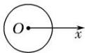
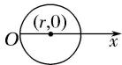
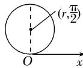
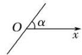
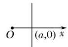
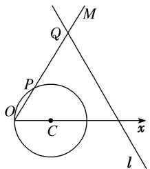

# 专题一 极坐标方程及其应用(综合型)

# 1. 极坐标系

如图(1)所示，在平面内取一个定点 O，叫做极点；自极点 O 引一条射线 Ox，叫做极轴；再选定一个长度单位、一个角度单位(通常取弧度)及其正方向(通常取逆时针方向)，这样就建立了一个极坐标系.

# 2. 极坐标

①极径：设 M 是平面内一点，极点 O 与点 M 的距离 $\left|OM\right|$ 叫做点 M 的极径，记为 $\rho$ .

②极角：以极轴 Ox 为始边，射线 OM 为终边的角 xOM 叫做点 M 的极角，记为 $\theta$ .

③极坐标: 有序数对 $(\rho, \theta)$ 叫做点 $M$ 的极坐标, 记为 $M(\rho, \theta)$ , 一般不作特殊说明时, 我们认为 $\rho \geq 0$ , $\theta$ 可取任意实数. 当极角 $\theta$ 的取值范围是 $[0, 2\pi)$ 时, 平面上的点(除去极点)就与极坐标 $(\rho, \theta)(\rho \neq 0)$ 建立一一对应的关系. 我们设定, 极点的极坐标中, 极径 $\rho = 0$ , 极角 $\theta$ 可取任意角.

  
图(1)

text_image

y
ρ
θ
O
M(x,y)
x

图(2)

# 3. 极坐标与直角坐标的互化

设 M 为平面上的一点，它的直角坐标为 $(x, y)$ ，极坐标为 $(\rho, \theta)$ 。由图(2)可知下面的关系式成立：

$\left\{\begin{aligned}x&=\rho\cos\theta,\\ y&=\rho\sin\theta\end{aligned}\right.$ 或 $\left\{\begin{aligned}\rho^{2}&=x^{2}+y^{2},\\ \tan\theta&=\frac{y}{x}(x\neq0),\end{aligned}\right.$ 这就是极坐标与直角坐标的互化公式.

# 4. 常见曲线的极坐标方程

<table><tr><td>曲线</td><td>图形</td><td>极坐标方程</td></tr><tr><td>圆心在极点,半径为r的圆</td><td></td><td>ρ=r(0≤θ&lt;2π)</td></tr><tr><td>圆心为(r,0),半径为r的圆</td><td></td><td>ρ=2rcosθ(-π/2≤θ&lt;π/2)</td></tr><tr><td>圆心为(r,π/2),半径为r的圆</td><td></td><td>ρ=2rsinθ(0≤θ&lt;π)</td></tr><tr><td>过极点,倾斜角为α的直线</td><td></td><td>θ=α(ρ∈R)或θ=α+π(ρ∈R)</td></tr><tr><td>过点(a,0),与极轴垂直的直线</td><td></td><td>ρcosθ=a(-π/2&lt;θ&lt;π/2)</td></tr><tr><td>过点 $\left(a, \frac{\pi}{2}\right)$ ,与极轴平行的直线</td><td></td><td> $\rho\sin\theta = a(0<\theta<\pi)$ </td></tr></table>

# [微点提醒]

# 关于极坐标系

1. 极坐标系的四要素：①极点；②极轴；③长度单位；④角度单位和它的正方向，四者缺一不可.  
2. 一般地，点 $M(\rho, \theta)$ 的极坐标通式是 $(\rho, \theta + 2k\pi)$ 或 $(- \rho, \theta + 2k\pi + \pi)(k \in \mathbf{Z})$ 。和直角坐标不同，平面内一个点的极坐标有无数种表示。

3. 极坐标与直角坐标的重要区别：多值性.

# 【例题选讲】

[例 1] 已知点 P 的直角坐标是 $(x, y)$ . 以平面直角坐标系的原点为极坐标的极点，x 轴的正半轴为极轴，建立极坐标系. 设点 P 的极坐标是 $(\rho, \theta)$ ，点 Q 的极坐标是 $(\rho, \theta + \theta_{0})$ ，其中 $\theta_{0}$ 是常数. 设点 Q 的直角坐标是 $(m, n)$ .

(1)用 x, y, $\theta_{0}$ 表示 m, n;  
(2)若 m, n 满足 mn=1，且 $\theta_{0}=\frac{\pi}{4}$ ，求点 P 的直角坐标 $(x, y)$ 满足的方程.

[规范解答] (1)由题意知 $\left\{\begin{aligned}x&=\rho\cos\theta,\\ y&=\rho\sin\theta,\end{aligned}\right.$ 且 $\left\{\begin{aligned}m&=\rho\cos(\theta+\theta_{0}),\\ n&=\rho\sin(\theta+\theta_{0}),\end{aligned}\right.$

所以 $\left\{\begin{aligned}m&=\rho\cos\theta\cos\theta_{0}-\rho\sin\theta\sin\theta_{0},\\ n&=\rho\sin\theta\cos\theta_{0}+\rho\cos\theta\sin\theta_{0},\end{aligned}\right.$ 即 $\left\{\begin{aligned}m&=x\cos\theta_{0}-y\sin\theta_{0},\\ n&=x\sin\theta_{0}+y\cos\theta_{0}.\end{aligned}\right.$

(2)由(1)可知 $\left\{ \begin{array}{l} m = \frac{\sqrt{2}}{2} x - \frac{\sqrt{2}}{2} y, \\ n = \frac{\sqrt{2}}{2} x + \frac{\sqrt{2}}{2} y, \end{array} \right.$ 又 $mn = 1$ ，所以 $\left[\frac{\sqrt{2}}{2} x - \frac{\sqrt{2}}{2} y\right]\left[\frac{\sqrt{2}}{2} x + \frac{\sqrt{2}}{2} y\right] = 1.$

整理得 $\frac{x^{2}}{2}-\frac{y^{2}}{2}=1$ ，所以 $\frac{x^{2}}{2}-\frac{y^{2}}{2}=1$ 即为所求方程.

[例 2] 已知曲线 $C_{1}$ 的参数方程为 $\left\{\begin{aligned} x &= 4 + 5 \cos t, \\ y &= 5 + 5 \sin t \end{aligned}\right.$ (t 为参数)，以坐标原点为极点，x 轴正半轴为极轴建立极坐标系，曲线 $C_{2}$ 的极坐标方程为 $\rho = 2 \sin \theta$ .

(1)求 $C_{1}$ 的极坐标方程， $C_{2}$ 的直角坐标方程；  
(2)求 $C_{1}$ 与 $C_{2}$ 交点的极坐标(其中 $\rho \geq 0, \quad 0 \leq \theta < 2\pi$ ).

[规范解答] (1) 将 $\left\{\begin{aligned} x &= 4 + 5 \cos t, \\ y &= 5 + 5 \sin t \end{aligned}\right.$ 消去参数 t，化为普通方程为 $(x - 4)^{2} + (y - 5)^{2} = 25$ ,

即 $C_{1}: x^{2}+y^{2}-8x-10y+16=0$ ，将 $\left\{\begin{aligned}x&=\rho\cos\theta,\\ y&=\rho\sin\theta\end{aligned}\right.$ 代入 $x^{2}+y^{2}-8x-10y+16=0$ ，

得 $\rho^{2}-8\rho\cos\theta-10\rho\sin\theta+16=0$ ，所以 $C_{1}$ 的极坐标方程为 $\rho^{2}-8\rho\cos\theta-10\rho\sin\theta+16=0$ .

因为曲线 $C_{2}$ 的极坐标方程为 $\rho=2\sin\theta$ ，变为 $\rho^{2}=2\rho\sin\theta$ ，

化为直角坐标方程为 $x^{2}+y^{2}=2y$ ，即 $x^{2}+y^{2}-2y=0$ .

(2)因为 $C_{1}$ 的普通方程为 $x^{2}+y^{2}-8x-10y+16=0$ ， $C_{2}$ 的普通方程为 $x^{2}+y^{2}-2y=0$ ，

由 $\left\{ \begin{array}{l}x^{2} + y^{2} - 8x - 10y + 16 = 0,\\ x^{2} + y^{2} - 2y = 0, \end{array} \right.$ 解得 $\left\{ \begin{array}{l}x = 1,\\ y = 1 \end{array} \right.$ 或 $\left\{ \begin{array}{l}x = 0,\\ y = 2. \end{array} \right.$

所以 $C_{1}$ 与 $C_{2}$ 交点的极坐标分别为 $\left(\sqrt{2}, \frac{\pi}{4}\right)$ ， $\left(2, \frac{\pi}{2}\right)$ .

[例 3] (2017·全国III)在直角坐标系 xOy 中，直线 $l_{1}$ 的参数方程为 $\left\{\begin{aligned}x&=2+t,\\ y&=kt\end{aligned}\right.$ (t 为参数)，直线 $l_{2}$ 的参数方程为 $\left\{\begin{aligned}x&=-2+m,\\ y&=\frac{m}{k}\end{aligned}\right.$ (m 为参数). 设 $l_{1}$ 与 $l_{2}$ 的交点为 P，当 k 变化时，P 的轨迹为曲线 C.

(1)写出 C 的普通方程;

(2)以坐标原点为极点， $x$ 轴正半轴为极轴建立极坐标系，设 $l_{3}$ ： $\rho (\cos \theta +\sin \theta) - \sqrt{2} = 0$ ， $M$ 为 $l_{3}$ 与 $C$ 的交点，求 $M$ 的极径.

[规范解答] (1) 消去参数 t 得 $l_{1}$ 的普通方程 $l_{1}: y = k(x - 2)$ ;

消去参数 m 得 $l_{2}$ 的普通方程 $l_{2}$ : $y=\frac{1}{k}(x+2)$ .

设 $P(x, y)$ ，由题设得 $\left\{\begin{aligned}y &= k(x - 2), \\ y &= \frac{1}{k}(x + 2),\end{aligned}\right.$ 消去 k 得 $x^{2} - y^{2} = 4 (y \neq 0)$ .

所以 C 的普通方程为 $x^{2}-y^{2}=4(y\neq0)$ .

(2)C 的极坐标方程为 $\rho^{2}(\cos^{2}\theta - \sin^{2}\theta) = 4 (0 < \theta < 2\pi, \theta \neq \pi)$ .

联立 $\left\{ \begin{array}{l} \rho^2 (\cos^2\theta -\sin^2\theta) = 4,\\ \rho (\cos \theta +\sin \theta) - \sqrt{2} = 0 \end{array} \right.$ 得 $\cos \theta -\sin \theta = 2(\cos \theta +\sin \theta).$

故 $\tan\theta=-\frac{1}{3}$ ，从而 $\cos^{2}\theta=\frac{9}{10}$ ， $\sin^{2}\theta=\frac{1}{10}$ .

代入 $\rho^{2}(\cos^{2}\theta-\sin^{2}\theta)=4$ 得 $\rho^{2}=5$ ，所以交点M的极径为 $\sqrt{5}$

[例 4] 已知圆 $O_{1}$ 和圆 $O_{2}$ 的极坐标方程分别为 $\rho=2,\quad\rho^{2}-2\sqrt{2}\rho\cos\left(\theta-\frac{\pi}{4}\right)=2.$

(1)将圆 $O_{1}$ 和圆 $O_{2}$ 的极坐标方程化为直角坐标方程;

(2)求经过两圆交点的直线的极坐标方程.

[规范解答] (1)由 $\rho=2$ 知 $\rho^{2}=4$ ，由坐标变换公式，得 $x^{2}+y^{2}=4$ .

因为 $\rho^2 - 2\sqrt{2}\rho \cos \left(\theta - \frac{\pi}{4}\right) = 2$ ，所以 $\rho^2 - 2\sqrt{2}\rho \left(\cos \theta \cos \frac{\pi}{4} + \sin \theta \sin \frac{\pi}{4}\right) = 2.$

由坐标变换公式，得 $x^{2}+y^{2}-2x-2y-2=0$ .

(2)将两圆的直角坐标方程相减，得经过两圆交点的直线方程为 $x + y = 1$ .

化为极坐标方程为 $\rho \cos \theta +\rho \sin \theta = 1$ ，即 $\rho \sin \left(\theta +\frac{\pi}{4}\right) = \frac{\sqrt{2}}{2}.$

[例 5] 在直角坐标系 xOy 中，以坐标原点 O 为极点，x 轴正半轴为极轴建立极坐标系，曲线 $C_{1}:\rho^{2}$

$-4\rho \cos \theta + 3 = 0, \theta \in [0, 2\pi]$ , 曲线 $C_2: \rho = \frac{3}{4\sin\left(\frac{\pi}{6} - \theta\right)}, \theta \in [0, 2\pi]$ .

(1)求曲线 $C_{1}$ 的一个参数方程;  
(2)若曲线 $C_{1}$ 和曲线 $C_{2}$ 相交于 A, B 两点，求 $|AB|$ 的值.

[规范解答] (1)由 $\rho^{2}-4\rho\cos\theta+3=0$ ，可得 $x^{2}+y^{2}-4x+3=0$ ，∴ $(x-2)^{2}+y^{2}=1$ .

令 $x-2=\cos\alpha,\quad y=\sin\alpha,\quad \therefore C_{1}$ 的一个参数方程为 $\left\{\begin{aligned}x=2+\cos\alpha,\\ y=\sin\alpha\end{aligned}\right.$ ( $\alpha$ 为参数， $\alpha\in R$ ).

(2) $C_{2}$ : $4\rho\left(\sin\frac{\pi}{6}\cos\theta-\cos\frac{\pi}{6}\sin\theta\right)=3,\quad\therefore4\left(\frac{1}{2}x-\frac{\sqrt{3}}{2}y\right)=3$ ，即 $2x-2\sqrt{3}y-3=0$ .

∵ 直线 $2x-2\sqrt{3}y-3=0$ 与圆 $(x-2)^{2}+y^{2}=1$ 相交于 A, B 两点，且圆心到直线的距离 $d=\frac{1}{4}$ ,

$$
\therefore | A B | = 2 \times \sqrt {1 - \left(\frac {1}{4}\right) ^ {2}} = 2 \times \frac {\sqrt {1 5}}{4} = \frac {\sqrt {1 5}}{2}.
$$

[例6] 在平面直角坐标系 $xOy$ 中，圆 $C$ 的参数方程为 $\left\{ \begin{array}{l} x = 1 + \cos \varphi, \\ y = \sin \varphi \end{array} \right.$ ( $\varphi$ 为参数)，以坐标原点 $O$ 为极点， $x$ 轴的正半轴为极轴建立极坐标系.

(1)求圆 C 的极坐标方程;

(2)直线 l 的极坐标方程是 $2\rho\sin\left(\theta+\frac{\pi}{3}\right)=3\sqrt{3}$ ，射线 OM: $\theta=\frac{\pi}{3}$ 与圆 C 的交点为 O, P，与直线 l 的交点为 Q，求线段 PQ 的长.

[规范解答] (1)由圆 C 的参数方程为 $\left\{\begin{aligned}x=1+\cos\varphi,\\ y=\sin\varphi\end{aligned}\right.$ ( $\varphi$ 为参数),

可得圆 C 的直角坐标方程为 $(x-1)^{2}+y^{2}=1$ ，即 $x^{2}+y^{2}-2x=0$ .

由极坐标方程与直角坐标方程的互化公式可得，圆 C 的极坐标方程为 $\rho = 2\cos \theta$ .

text_image

M
Q
P
O
C
x
l

(2)由 $\left\{\begin{aligned}\theta=\frac{\pi}{3},\\ \rho-2\cos\theta=0\end{aligned}\right.$ 得 $P\left(1,\frac{\pi}{3}\right)$ ，由 $\left\{\begin{aligned}\theta=\frac{\pi}{3},\\ 2\rho\sin\left(\theta+\frac{\pi}{3}\right)=3\sqrt{3}\end{aligned}\right.$ 得 $Q\left(3,\frac{\pi}{3}\right)$ ,

结合图可得 $|PQ|=|OQ|-|OP|=|\rho_{Q}|-|\rho_{P|=3-1=2.}$

[例 7] 在平面直角坐标系 xOy 中，已知直线 l: $x + \sqrt{3}y = 5\sqrt{3}$ ，以原点 O 为极点，x 轴的正半轴为极轴建立极坐标系，圆 C 的极坐标方程为 $\rho = 4\sin\theta$ .

(1)求直线 l 的极坐标方程和圆 C 的直角坐标方程;

(2)射线 OP: $\theta=\frac{\pi}{6}$ 与圆 C 的交点为 O, A, 与直线 l 的交点为 B, 求线段 AB 的长.

[规范解答] (1) 因为 $x = \rho \cos \theta$ , $y = \rho \sin \theta$ ，直线 $l: x + \sqrt{3}y = 5\sqrt{3}$ ,

所以直线 l 的极坐标方程为 $\rho\cos\theta+\sqrt{3}\rho\sin\theta=5\sqrt{3}$ ,

化简得 $2\rho\sin\left(\theta+\frac{\pi}{6}\right)=5\sqrt{3}$ ，即为直线 l 的极坐标方程.

由 $\rho=4\sin\theta$ ，得 $\rho^{2}=4\rho\sin\theta$ ，所以 $x^{2}+y^{2}=4y$ ，即 $x^{2}+(y-2)^{2}=4$ ，即为圆C的直角坐标方程.

(2)由题意得 $\rho_{A} = 4\sin \frac{\pi}{6} = 2$ ， $\rho_{B} = \frac{5\sqrt{3}}{2\sin\left(\frac{\pi}{6} + \frac{\pi}{6}\right)} = 5$ ，所以 $|AB| = |\rho_A - \rho_B| = 3$

[例8] 在平面直角坐标系 $xOy$ 中，曲线 $C$ 的参数方程为 $\left\{ \begin{array}{l} x = 2\cos \theta \\ y = 2\sin \theta + 2 \end{array} \right.$ ( $\theta$ 为参数)，以坐标原点为极点， $x$ 轴非负半轴为极轴建立极坐标系.

(1)求 C 的极坐标方程;

(2)若直线 $l_{1}$ ， $l_{2}$ 的极坐标方程分别为 $\theta=\frac{\pi}{6}(\rho\in\mathbf{R})$ ， $\theta=\frac{2\pi}{3}(\rho\in\mathbf{R})$ ，设直线 $l_{1}$ ， $l_{2}$ 与曲线 C 的交点为 O，M，N，求 $\triangle OMN$ 的面积.

[规范解答] (1)由参数方程 $\left\{\begin{aligned}x&=2\cos\theta\\ y&=2\sin\theta+2\end{aligned}\right.$ ( $\theta$ 为参数)，得普通方程为 $x^{2}+(y-2)^{2}=4$ ，所以C的极坐标方程为 $\rho^{2}\cos^{2}\theta+\rho^{2}\sin^{2}\theta-4\rho\sin\theta=0$ ，即 $\rho=4\sin\theta$ .

(2)不妨设直线 $l_{1}$ : $\theta=\frac{\pi}{6}(\rho\in\mathbf{R})$ 与曲线 C 的交点为 O, M, 则 $\rho_{M}=|OM|=4\sin\frac{\pi}{6}=2$ .

又直线 $l_{2}$ ： $\theta=\frac{2\pi}{3}(\rho\in\mathbf{R})$ 与曲线 C 的交点为 O，N，则 $\rho_{N}=|ON|=4\sin\frac{2\pi}{3}=2\sqrt{3}$ .

又 $\angle MON = \frac{\pi}{2}$ ，所以 $S_{\triangle OMN} = \frac{1}{2} |OM||ON| = \frac{1}{2} \times 2 \times 2\sqrt{3} = 2\sqrt{3}$ .

[例 9] 在直角坐标系 xOy 中，曲线 $C_{1}:\left\{\begin{aligned}x=t\cos\alpha,\\ y=t\sin\alpha\end{aligned}\right.$ (t 为参数， $t\neq0$ )，其中 $0\leq\alpha<\pi$ ，在以 O 为极点，x 轴正半轴为极轴的极坐标系中，曲线 $C_{2}:\rho=2\sin\theta$ ，曲线 $C_{3}:\rho=2\sqrt{3}\cos\theta$ .

(1)求 $C_{2}$ 与 $C_{3}$ 交点的直角坐标;  
(2)若 $C_{1}$ 与 $C_{2}$ 相交于点 A， $C_{1}$ 与 $C_{3}$ 相交于点 B，求 $|AB|$ 的最大值.

[规范解答] (1) 曲线 $C_{2}$ 的直角坐标方程为 $x^{2} + y^{2} - 2y = 0$ ,

曲线 $C_{3}$ 的直角坐标方程为 $x^{2}+y^{2}-2\sqrt{3}x=0$ .

联立 $\left\{\begin{aligned}x^{2}+y^{2}-2y=0,\\ x^{2}+y^{2}-2\sqrt{3}x=0,\end{aligned}\right.$ 解得 $\left\{\begin{aligned}x=0,\\ y=0,\end{aligned}\right.$ 或 $\left\{\begin{aligned}x=\frac{\sqrt{3}}{2},\\ y=\frac{3}{2}.\end{aligned}\right.$

所以 $C_{2}$ 与 $C_{3}$ 交点的直角坐标为 $(0, 0)$ 和 $\left(\frac{\sqrt{3}}{2}, \frac{3}{2}\right)$ .

(2)曲线 $C_{1}$ 的极坐标方程为 $\theta=\alpha(\rho\in\mathbf{R},\rho\neq0)$ ，其中 $0\leq\alpha<\pi$ .

因此 A 的极坐标为 $(2\sin \alpha, \alpha)$ ，B 的极坐标为 $(2\sqrt{3}\cos \alpha, \alpha)$ .

所以 $|AB|=|2\sin\alpha-2\sqrt{3}\cos\alpha|=4\left|\sin\left(\alpha-\frac{\pi}{3}\right)\right|$ ，当 $\alpha=\frac{5\pi}{6}$ 时， $|AB|$ 取得最大值，最大值为4.

[例10] 已知直线 $l$ 的参数方程为 $\left\{ \begin{array}{l} x = 1 + 2018t, \\ y = \sqrt{3} + 2018\sqrt{3} t \end{array} \right.$ ( $t$ 为参数). 在以坐标原点 $O$ 为极点， $x$ 轴的正半轴为极轴的极坐标系中，曲线 $C$ 的极坐标方程为 $\rho^2 = 4\rho \cos \theta + 2\sqrt{3}\rho \sin \theta - 4$ .

(1)求直线 l 普通方程和曲线 C 的直角坐标方程;  
(2)设直线 l 与曲线 C 交于 A, B 两点，求 $\left|OA\right|\cdot\left|OB\right|$ .

[规范解答] (1)由 $\left\{\begin{aligned}x=1+2018t,\\ y=\sqrt{3}+2018\sqrt{3}t\end{aligned}\right.$ 消去t，得 $y-\sqrt{3}=\sqrt{3}(x-1)$ ，即 $y=\sqrt{3}x$

∴ 直线 l 的普通方程为 $y=\sqrt{3}x$ ，曲线 C: $\rho^{2}=4\rho\cos\theta+2\sqrt{3}\rho\sin\theta-4$ ，
∴ 其直角坐标方程 $x^{2} + y^{2} = 4x + 2\sqrt{3}y - 4$ ，即 $(x - 2)^{2} + (y - \sqrt{3})^{2} = 3$ .

(2)易由 $y=\sqrt{3}x$ ，得直线 l 的极坐标方程为 $\theta=\frac{\pi}{3}$ ，代入曲线 C 的极坐标方程为 $\rho^{2}-5\rho+4=0$ ，

所以 $|OA|\cdot|OB|=|\rho_{A}\cdot\rho_{B}|=4$

[例 11] 在平面直角坐标系中，曲线 $C_{1}$ 的参数方程为 $\left\{\begin{aligned}x=2\cos\varphi,\\ y=\sin\varphi\end{aligned}\right.$ ( $\varphi$ 为参数)，以原点 O 为极点，x 轴的正半轴为极轴建立极坐标系，曲线 $C_{2}$ 是圆心在极轴上且经过极点的圆，射线 $\theta=\frac{\pi}{3}$ 与曲线 $C_{2}$ 交于点 $D\left(2,\frac{\pi}{3}\right)$ .

(1)求曲线 $C_{1}$ 的普通方程和曲线 $C_{2}$ 的直角坐标方程;  
(2)已知极坐标系中两点 $A(\rho_1, \theta_0)$ , $B\left[\rho_2, \theta_0 + \frac{\pi}{2}\right]$ , 若 $A, B$ 都在曲线 $C_1$ 上, 求 $\frac{1}{\rho_1^2} + \frac{1}{\rho_2^2}$ 的值.

[规范解答] (1) $\because C_{1}$ 的参数方程为 $\left\{ \begin{array}{l} x = 2\cos \varphi, \\ y = \sin \varphi, \end{array} \right.$ $\therefore C_{1}$ 的普通方程为 $\frac{x^2}{4} + y^2 = 1$ .

由题意知曲线 $C_{2}$ 的极坐标方程为 $\rho=2a\cos\theta(a$ 为半径 $)$ ,

将 $D\left(2,\frac{\pi}{3}\right)$ 代入，得 $2=2a\times\frac{1}{2},\therefore a=2,$

∴圆 $C_{2}$ 的圆心的直角坐标为(2,0)，半径为2，∴ $C_{2}$ 的直角坐标方程为 $(x-2)^{2}+y^{2}=4$ .

(2)曲线 $C_{1}$ 的极坐标方程为 $\frac{\rho^{2}\cos^{2}\theta}{4} + \rho^{2}\sin^{2}\theta = 1$ ，即 $\rho^{2} = \frac{4}{4\sin^{2}\theta + \cos^{2}\theta}$ .

$$
\therefore \rho_ {1} ^ {2} = \frac {4}{4 \sin^ {2} \theta_ {0} + \cos^ {2} \theta_ {0}}, \quad \rho_ {2} ^ {2} = \frac {4}{4 \sin^ {2} \left(\theta_ {0} + \frac {\pi}{2}\right) + \cos^ {2} \left(\theta_ {0} + \frac {\pi}{2}\right)} = \frac {4}{\sin^ {2} \theta_ {0} + 4 \cos^ {2} \theta_ {0}}.
$$

$$
\therefore \frac {1}{\rho_ {1} ^ {2}} + \frac {1}{\rho_ {2} ^ {2}} = \frac {4 \sin^ {2} \theta_ {0} + \cos^ {2} \theta_ {0}}{4} + \frac {4 \cos^ {2} \theta_ {0} + \sin^ {2} \theta_ {0}}{4} = \frac {5}{4}.
$$

[例 12] 极坐标系与直角坐标系 xOy 有相同的长度单位，以原点 O 为极点，x 轴的正半轴为极轴建立极坐标系。已知曲线 $C_{1}$ 的极坐标方程为 $\rho=4\cos\theta$ ，曲线 $C_{2}$ 的参数方程为 $\left\{\begin{aligned}x=m+t\cos\alpha,\\ y=t\sin\alpha\end{aligned}\right.$ (t 为参数， $0\leqslant\alpha<\pi$ )，射线 $\theta=\varphi,\quad\theta=\varphi+\frac{\pi}{4},\quad\theta=\varphi-\frac{\pi}{4}$ 与曲线 $C_{1}$ 交于(不包括极点 O)三点 A，B，C。

(1)求证： $|OB|+|OC|=\sqrt{2}|OA|$ ;  
(2)当 $\varphi=\frac{\pi}{12}$ 时，B，C两点在曲线 $C_{2}$ 上，求m与 $\alpha$ 的值.

[规范解答] (1)证明：设点 $A$ ， $B$ ， $C$ 的极坐标分别为 $(\rho_{1},\varphi),\left(\rho_{2},\varphi+\frac{\pi}{4}\right),\left(\rho_{3},\varphi-\frac{\pi}{4}\right)$

因为点 A, B, C 在曲线 $C_{1}$ 上，所以 $\rho_{1}=4\cos\varphi,\quad\rho_{2}=4\cos\left(\varphi+\frac{\pi}{4}\right),\quad\rho_{3}=4\cos\left(\varphi-\frac{\pi}{4}\right)$ ,

所以 $|OB|+|OC|=\rho_{2}+\rho_{3}=4\cos\left(\varphi+\frac{\pi}{4}\right)+4\cos\left(\varphi-\frac{\pi}{4}\right)=4\sqrt{2}\cos\varphi=\sqrt{2}\rho_{1}$ ，故 $|OB|+|OC|=\sqrt{2}|OA|$ .

(2)由曲线 $C_{2}$ 的方程知曲线 $C_{2}$ 是经过定点 $(m,0)$ 且倾斜角为 $\alpha$ 的直线.

当 $\varphi=\frac{\pi}{12}$ 时，B，C两点的极坐标分别为 $(2,\frac{\pi}{3})$ ， $(2\sqrt{3},-\frac{\pi}{6})$ ，

化为直角坐标为 $B(1, \sqrt{3})$ ， $C(3, -\sqrt{3})$ ，所以 $\tan \alpha = \frac{-\sqrt{3} - \sqrt{3}}{3 - 1} = -\sqrt{3}$ ，又 $0 \leqslant \alpha < \pi$ ，所以 $\alpha = \frac{2\pi}{3}$ 。故曲线 $C_2$ 的方程为 $y = -\sqrt{3}(x - 2)$ ，易知曲线 $C_2$ 恒过点 $(2, 0)$ ，即 $m = 2$ 。

# 类题通法

# 1. 极坐标方程与普通方程互化技巧

(1)进行极坐标方程与直角坐标方程互化的关键是抓住互化公式； $x=\rho\cos\theta,\ y=\rho\sin\theta,\ \rho^{2}=x^{2}+y^{2},\ \tan\theta=\frac{y}{x}(x\neq0).$   
(2)巧用极坐标方程两边同乘以 $\rho$ 或同时平方技巧，将极坐标方程构造成含有 $\rho \cos \theta, \rho \sin \theta, \rho^2$ 的形式，然后利用公式代入化简得到普通方程.  
(3)巧借两角和差公式，转化 $\rho\sin(\theta\pm\alpha)$ 或 $\rho\cos(\theta\pm\alpha)$ 的结构形式，进而利用互化公式得到普通方程.  
(4)将直角坐标方程中的 x 转化为 $\rho\cos\theta$ ，将 y 换成 $\rho\sin\theta$ ，即可得到其极坐标方程.  
(5)进行极坐标方程与直角坐标方程互化时, 要注意 $\rho$ , $\theta$ 的取值范围及其影响, 并重视公式的逆向与变形使用.

# 2. 求解与极坐标有关的问题的主要方法

(1)直接利用极坐标系求解，可与数形结合思想配合使用.  
(2)转化为直角坐标系，用直角坐标求解．若结果要求的是极坐标，还应将直角坐标化为极坐标.

# 3. 已知极坐标方程求线段的长度的方法

(1)先将极坐标系下点的坐标、曲线方程转化为平面直角坐标系下的点的坐标、曲线方程，然后求线段的长度.

(2)直接在极坐标系下求解，设 $A(\rho_1,\theta_1)$ ， $B(\rho_{2},\theta_{2})$ ，则 $|AB| = \sqrt{\rho_1^2 + \rho_2^2 - 2\rho_1\rho_2\cos(\theta_2 - \theta_1)}$ ；如果直线过极点且与另一曲线相交，求交点之间的距离时，求出曲线的极坐标方程和直线的极坐标方程及交点的极坐标，则 $|\rho_{1} - \rho_{2}|$ 即为所求.

# 【对点训练】

1. 在极坐标系下，已知圆 $O: \rho = \cos \theta + \sin \theta$ 和直线 $l: \rho \sin \left( \theta - \frac{\pi}{4} \right) = \frac{\sqrt{2}}{2}$ .

(1)求圆 O 和直线 l 的直角坐标方程;  
(2)当 $\theta\in(0,\pi)$ 时，求直线l与圆O公共点的一个极坐标.

1. 解析 (1) 圆 $O: \rho = \cos \theta + \sin \theta$ ，即 $\rho^2 = \rho \cos \theta + \rho \sin \theta$ ,

圆 O 的直角坐标方程为： $x^{2}+y^{2}=x+y$ ，即 $x^{2}+y^{2}-x-y=0$ ，

直线 l: $\rho\sin\left(\theta-\frac{\pi}{4}\right)=\frac{\sqrt{2}}{2}$ ，即 $\rho\sin\theta-\rho\cos\theta=1$ ，

则直线 l 的直角坐标方程为：y-x=1，即 $x-y+1=0$ .

(2)由 $\left\{ \begin{array}{l} x^2 + y^2 - x - y = 0, \\ x - y + 1 = 0, \end{array} \right.$ 得 $\left\{ \begin{array}{l} x = 0, \\ y = 1, \end{array} \right.$ 故直线 $l$ 与圆 $O$ 公共点的一个极坐标为 $\left(1, \frac{\pi}{2}\right)$ .

2. 在直角坐标系 $xOy$ 中，以 $O$ 为极点， $x$ 轴正半轴为极轴建立极坐标系，曲线 $C$ 的极坐标方程为 $\rho \cos \left[\theta - \frac{\pi}{3}\right] = 1$ ， $M$ ， $N$ 分别为曲线 $C$ 与 $x$ 轴， $y$ 轴的交点.

(1)写出曲线 C 的直角坐标方程，并求 M，N 的极坐极；

(2)设 M, N 的中点为 P，求直线 OP 的极坐标方程.

2. 解析 (1) 因为 $\rho\cos\left(\theta-\frac{\pi}{3}\right)=1$ ，所以 $\rho\cos\theta\cdot\cos\frac{\pi}{3}+\rho\sin\theta\cdot\sin\frac{\pi}{3}=1$ ，又 $\left\{\begin{aligned}x&=\rho\cos\theta,\\ y&=\rho\sin\theta,\end{aligned}\right.$ 所以 $\frac{1}{2}x+\frac{\sqrt{3}}{2}y=1$ ，即曲线 C 的直角坐标方程为 $x+\sqrt{3}y-2=0$ ，令 y=0，则 x=2；令 x=0，则 $y=\frac{2\sqrt{3}}{3}$ .

所以 $M(2,0)$ ， $N\left(0,\frac{2\sqrt{3}}{3}\right)$ 。所以 M 的极坐标为 $(2,0)$ ，N 的极坐标为 $\left(\frac{2\sqrt{3}}{3},\frac{\pi}{2}\right)$ 。

(2)因为 M, N 连线的中点 P 的直角坐标为 $\left(1, \frac{\sqrt{3}}{3}\right)$ ，所以 P 的极角为 $\theta = \frac{\pi}{6}$ ，所以直线 OP 的极坐标方程为 $\theta = \frac{\pi}{6} (\rho \in \mathbf{R})$ .

3. 将圆 $x^{2} + y^{2} = 1$ 上每一点的横坐标保持不变，纵坐标变为原来的2倍，得曲线 $C$ .

(1)写出 C 的参数方程:  
(2)设直线 $l: 2x + y - 2 = 0$ 与 $C$ 的交点为 $P_{1}, P_{2}$ , 以坐标原点为极点, $x$ 轴正半轴为极轴建立极坐标系,求过线段 $P_{1}P_{2}$ 的中点且与 $l$ 垂直的直线的极坐标方程.

3. 解析 (1) 设 $(x_{1}, y_{1})$ 为圆上的点，在已知变换下变为 $C$ 上点 $(x, y)$ ，依题意，得 $\left\{ \begin{array}{l} x = x_{1}, \\ y = 2y_{1}. \end{array} \right.$

由 $x_{1}^{2} + y_{1}^{2} = 1$ ，得 $x^{2} + \left(\frac{y}{2}\right)^{2} = 1$ ，即曲线 $C$ 的方程为 $x^{2} + \frac{y^{2}}{4} = 1$

故 C 的参数方程为 $\left\{\begin{aligned}x&=\cos t\\ y&=2\sin t\end{aligned}\right.$ (t 为参数).

(2)由 $\left\{ \begin{array}{l}x^{2} + \frac{y^{2}}{4} = 1,\\ 2x + y - 2 = 0, \end{array} \right.$ 解得 $\left\{ \begin{array}{ll}x = 1\\ y = 0 \end{array} \right.$ 或 $\left\{ \begin{array}{ll}x = 0,\\ y = 2. \end{array} \right.$

不妨设 $P_{1}(1,0)$ ， $P_{2}(0,2)$ ，则线段 $P_{1}P_{2}$ 的中点坐标为 $\left(\frac{1}{2},1\right)$ ，所求直线斜率为 $k=\frac{1}{2}$ ，

于是所求直线方程为 $y - 1 = \frac{1}{2}\left(x - \frac{1}{2}\right)$ ，化为极坐标方程，并整理得

$2\rho\cos\theta-4\rho\sin\theta=-3$ ，即 $\rho=\frac{3}{4\sin\theta-2\cos\theta}$ .

4. 以直角坐标系中的原点 O 为极点，x 轴正半轴为极轴的极坐标系中，已知曲线的极坐标方程为 $\rho = \frac{2}{1 - \sin \theta}$ .

(1)将曲线的极坐标方程化为直角坐标方程;

(2)过极点 O 作直线 l 交曲线于点 P, Q, 若 $|OP|=3|OQ|$ ，求直线 l 的极坐标方程.

4. 解析 (1) $\because \rho = \sqrt{x^2 + y^2}$ , $\rho \sin \theta = y$ , $\therefore \rho = \frac{2}{1 - \sin \theta}$ 化为 $\rho - \rho \sin \theta = 2$ , 得 $\rho^2 = (2 + \rho \sin \theta)^2$ ,

∴曲线的直角坐标方程为 $x^{2}=4y+4$ .

(2)设直线 l 的极坐标方程为 $\theta = \theta_{0} (\rho \in \mathbf{R})$ ，根据题意 $\frac{2}{1 - \sin \theta_{0}} = 3 \cdot \frac{2}{1 - \sin (\theta_{0} + \pi)}$ ，解得 $\theta_{0} = \frac{\pi}{6}$ 或 $\theta_{0} = \frac{5\pi}{6}$ ，直线 l 的极坐标方程 $\theta = \frac{\pi}{6} (\rho \in \mathbf{R})$ 或 $\theta = \frac{5\pi}{6} (\rho \in \mathbf{R})$ .

5. 已知曲线 C 的参数方程为 $\left\{\begin{aligned} x &= 2 + \sqrt{5}\cos \alpha, \\ y &= 1 + \sqrt{5}\sin \alpha \end{aligned}\right.$ (a为参数)，以直角坐标系的原点为极点，x 轴的正半轴为极轴建立极坐标系.

(1)求曲线 C 的极坐标方程;

(2)若直线 l 的极坐标方程为 $\rho(\sin\theta+\cos\theta)=1$ ，求直线 l 被曲线 C 截得的弦长.

5. 解析 (1) 曲线 C 的参数方程为 $\left\{\begin{aligned} x &= 2 + \sqrt{5} \cos \alpha, \\ y &= 1 + \sqrt{5} \sin \alpha \end{aligned}\right.$ ( $\alpha$ 为参数),

∴ 曲线 C 的普通方程为 $(x-2)^{2}+(y-1)^{2}=5$ 。将 $\left\{\begin{aligned}x&=\rho\cos\theta,\\ y&=\rho\sin\theta\end{aligned}\right.$ 代入并化简得 $\rho=4\cos\theta+2\sin\theta$ 即曲线 C 的极坐标方程为 $\rho=4\cos\theta+2\sin\theta$ .

(2) $\because l$ 的直角坐标方程为 $x+y-1=0$ ，∴圆心 $C(2,1)$ 到直线 l 的距离 $d=\frac{2}{\sqrt{2}}=\sqrt{2}$ ，∴弦长为 $2\sqrt{5-2}=2\sqrt{3}$ .

6. 在直角坐标系 $xOy$ 中，曲线 $C$ 的参数方程为 $\left\{ \begin{array}{l} x = 2\cos \alpha, \\ y = 2 + 2\sin \alpha \end{array} \right.$ ( $\alpha$ 为参数)，直线 $l$ 的参数方程为 $\left\{ \begin{array}{l} x = \sqrt{3} - \frac{\sqrt{3}}{2}t, \\ y = 3 + \frac{1}{2}t \end{array} \right.$ (t 为参数). 在以坐标原点 $O$ 为极点， $x$ 轴的正半轴为极轴的极坐标系中，过极点 $O$ 的射线与曲线 $C$ 相交于不同于极点的点 $A$ ，且点 $A$ 的极坐标为 $(2\sqrt{3}, \theta)$ ，其中 $\theta \in \left( \begin{array}{c}\pi \\ 2\end{array} ,\pi \right)$ .

(1)求 $\theta$ 的值;

(2)若射线 OA 与直线 l 相交于点 B，求 $\left|AB\right|$ 的值.

6. (1)由题意知，曲线 C 的普通方程为 $x^{2}+(y-2)^{2}=4$ ,

$\because x=\rho\cos\theta,\ y=\rho\sin\theta,\ \therefore$ 曲线 C 的极坐标方程为 $(\rho\cos\theta)^{2}+(\rho\sin\theta-2)^{2}=4,$ 即 $\rho=4\sin\theta.$

由 $\rho = 2\sqrt{3}$ ，得 $\sin \theta = \frac{\sqrt{3}}{2},\quad \because \theta \in \left(\frac{\pi}{2},\pi\right),\quad \therefore \theta = \frac{2\pi}{3}.$

(2)由题，易知直线 l 的普通方程为 $x + \sqrt{3}y - 4\sqrt{3} = 0$ ,

∴直线 l 的极坐标方程为 $\rho\cos\theta+\sqrt{3}\rho\sin\theta-4\sqrt{3}=0$ .

又射线 OA 的极坐标方程为 $\theta=\frac{2\pi}{3}(\rho\geq0)$ ，联立，得 $\left\{\begin{aligned}\theta&=\frac{2\pi}{3}(\rho\geq0),\\ \rho\cos\theta+\sqrt{3}\rho\sin\theta-4\sqrt{3}&=0,\end{aligned}\right.$ 解得 $\rho=4\sqrt{3}$ .

∴点 B 的极坐标为 $\left(4\sqrt{3}, \frac{2\pi}{3}\right)$ ，∴ $|AB| = |\rho_{B} - \rho_{A}| = 4\sqrt{3} - 2\sqrt{3} = 2\sqrt{3}$ .

7. 已知极坐标系的极点为直角坐标系 $xOy$ 的原点，极轴为 $x$ 轴的正半轴，两种坐标系中的长度单位相同，圆 $C$ 的直角坐标方程为 $x^{2} + y^{2} + 2x - 2y = 0$ ，直线 $l$ 的参数方程为 $\left\{ \begin{array}{l} x = -1 + t, \\ y = t \end{array} \right.$ （ $t$ 为参数），射线 $OM$ 的极坐标方程为 $\theta = \frac{3\pi}{4}$ .

(1)求圆 C 和直线 l 的极坐标方程;

(2)已知射线 OM 与圆 C 的交点为 O, P, 与直线 l 的交点为 Q, 求线段 PQ 的长.

7. 解析 (1) $\because \rho^{2} = x^{2} + y^{2}, x = \rho \cos \theta, y = \rho \sin \theta$ ，圆 $C$ 的直角坐标方程为 $x^{2} + y^{2} + 2x - 2y = 0$

$\therefore \rho^{2} + 2\rho \cos \theta - 2\rho \sin \theta = 0, \therefore$ 圆 $C$ 的极坐标方程为 $\rho = 2\sqrt{2}\sin \left( \theta - \frac{\pi}{4} \right)$ .

又直线 l 的参数方程为 $\left\{\begin{aligned} x &= -1 + t, \\ y &= t \end{aligned}\right.$ (t 为参数)，消去 t 后得 $y = x + 1$ ，

∴直线 l 的极坐标方程为 $\sin\theta-\cos\theta=\frac{1}{\rho}$ .

(2) 当 $\theta=\frac{3\pi}{4}$ 时， $|OP|=2\sqrt{2}\sin\left(\frac{3\pi}{4}-\frac{\pi}{4}\right)=2\sqrt{2}$ ,

∴点 P 的极坐标为 $\left(2\sqrt{2}, \frac{3\pi}{4}\right)$ ， $|OQ|=\frac{1}{\frac{\sqrt{2}}{2}+\frac{\sqrt{2}}{2}}=\frac{\sqrt{2}}{2}$ ,

∴点 Q 的极坐标为 $\left(\frac{\sqrt{2}}{2}, \frac{3\pi}{4}\right)$ ，故线段 PQ 的长为 $\frac{3\sqrt{2}}{2}$ .

8. 在直角坐标系 $xOy$ 中，曲线 $C$ 的参数方程是 $\left\{ \begin{array}{l} x = 3 + 5\cos \alpha, \\ y = 4 + 5\sin \alpha \end{array} \right.$ ( $\alpha$ 为参数). 以坐标原点 $O$ 为极点， $x$ 轴的正半轴为极轴，建立极坐标系.

(1)求曲线 C 的极坐标方程;

(2)设 $l_{1}$ : $\theta = \frac{\pi}{6}$ , $l_{2}$ : $\theta = \frac{\pi}{3}$ , 若 $l_{1}, l_{2}$ 与曲线 $C$ 分别交于异于原点的 $A, B$ 两点, 求 $\triangle AOB$ 的面积.

8. 解析 (1) 将曲线 $C$ 的参数方程化为普通方程为 $(x - 3)^2 + (y - 4)^2 = 25$ ，即 $x^2 + y^2 - 6x - 8y = 0$ .

∴曲线 C 的极坐标方程为 $\rho=6\cos\theta+8\sin\theta$ .

(2)设 $A\left[\rho_1, \frac{\pi}{6}\right]$ , $B\left[\rho_2, \frac{\pi}{3}\right]$ . 把 $\theta = \frac{\pi}{6}$ 代入 $\rho = 6\cos \theta + 8\sin \theta$ ，得 $\rho_1 = 4 + 3\sqrt{3}$ ， $\therefore A\left[4 + 3\sqrt{3}, \frac{\pi}{6}\right]$ .

把 $\theta = \frac{\pi}{3}$ 代入 $\rho = 6\cos \theta + 8\sin \theta$ ，得 $\rho_{2} = 3 + 4\sqrt{3}$ ， $\therefore B\left(3 + 4\sqrt{3}, \frac{\pi}{3}\right)$ .

$$
\therefore S _ {\triangle A O B} = \frac {1}{2} \rho_ {1} \rho_ {2} \sin \angle A O B = \frac {1}{2} (4 + 3 \sqrt {3}) (3 + 4 \sqrt {3}) \sin \left(\frac {\pi}{3} - \frac {\pi}{6}\right) = 1 2 + \frac {2 5 \sqrt {3}}{4}.
$$

9. 点 $P$ 是曲线 $C_1: (x - 2)^2 + y^2 = 4$ 上的动点, 以坐标原点 $O$ 为极点, $x$ 轴的正半轴为极轴建立极坐标系, 以极点 $O$ 为中点, 将点 $P$ 逆时针旋转 $90^\circ$ 得到点 $Q$ , 设点 $Q$ 的轨迹为曲线 $C_2$ .

(1)求曲线 $C_{1}$ ， $C_{2}$ 的极坐标方程；

(2)射线 $\theta = \frac{\pi}{3} (\rho >0)$ 与曲线 $C_1$ ， $C_2$ 分别交于 $A$ ， $B$ 两点，定点 $M(2,0)$ ，求△MAB的面积.

9. 解析 (1)由曲线 $C_{1}$ 的直角坐标方程 $(x-2)^{2}+y^{2}=4$ 可得曲线 $C_{1}$ 的极坐标方程为 $\rho=4\cos\theta$ .

设 $Q(\rho, \theta)$ ，则 $P\left[\rho, \theta - \frac{\pi}{2}\right]$ ，则有 $\rho = 4\cos \left(\theta - \frac{\pi}{2}\right) = 4\sin \theta$

所以曲线 $C_{2}$ 的极坐标方程为 $\rho=4\sin\theta$ .

(2) $M$ 到射线 $\theta = \frac{\pi}{3} (\rho >0)$ 的距离 $d = 2\sin \frac{\pi}{3} = \sqrt{3}$ , $|AB| = \rho_B - \rho_A = 4\left(\sin \frac{\pi}{3} -\cos \frac{\pi}{3}\right) = 2(\sqrt{3} -1)$ ,

所以 $S_{\triangle MAB}=\frac{1}{2}|AB|\times d=\frac{1}{2}\times2(\sqrt{3}-1)\times\sqrt{3}=3-\sqrt{3}.$

10. 在平面直角坐标系 $xOy$ 中，曲线 $C_1$ 的参数方程为 $\left\{ \begin{array}{l} x = 2 + \cos \alpha, \\ y = 2 + \sin \alpha \end{array} \right.$ ( $\alpha$ 为参数)，直线 $C_2$ 的方程为 $y = \sqrt{3} x$ . 以坐标原点 $O$ 为极点， $x$ 轴的正半轴为极轴建立极坐标系.

(1)求曲线 $C_{1}$ 和曲线 $C_{2}$ 的极坐标方程;

(2)若直线 $C_2$ 与曲线 $C_1$ 交于 $A, B$ 两点，求 $\frac{1}{|OA|} + \frac{1}{|OB|}$ .

10. 解析 (1)由曲线 $C_1$ 的参数方程为 $\left\{ \begin{array}{l} x = 2 + \cos \alpha, \\ y = 2 + \sin \alpha \end{array} \right.$ ( $\alpha$ 为参数),

得曲线 $C_{1}$ 的普通方程为 $(x-2)^{2}+(y-2)^{2}=1$ ，则 $C_{1}$ 的极坐标方程为 $\rho^{2}-4\rho\cos\theta-4\rho\sin\theta+7=0$ ，由于直线 $C_{2}$ 过原点，且倾斜角为 $\frac{\pi}{3}$ ，故其极坐标方程为 $\theta=\frac{\pi}{3}(\rho\in\mathbf{R})$ .

(2)由 $\left\{\begin{aligned}\rho^{2}-4\rho\cos\theta-4\rho\sin\theta+7=0,\\ \theta=\frac{\pi}{3}\end{aligned}\right.$ 得 $\rho^{2}-(2\sqrt{3}+2)\rho+7=0,$

设 A, B 对应的极径分别为 $\rho_{1}$ ， $\rho_{2}$ ，则 $\rho_{1} + \rho_{2} = 2\sqrt{3} + 2$ ， $\rho_{1}\rho_{2} = 7$ ，

$$
\therefore \frac {1}{| O A |} + \frac {1}{| O B |} = \frac {| O A | + | O B |}{| O A | \cdot | O B |} = \frac {\rho_ {1} + \rho_ {2}}{\rho_ {1} \rho_ {2}} = \frac {2 \sqrt {3} + 2}{7}.
$$

