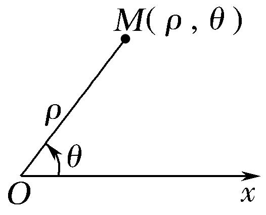
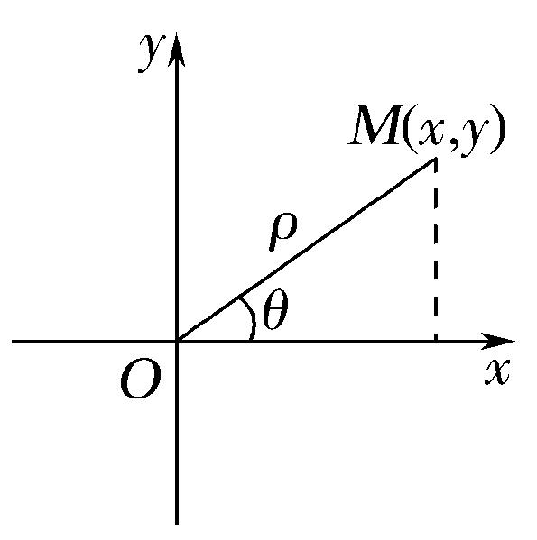
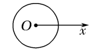
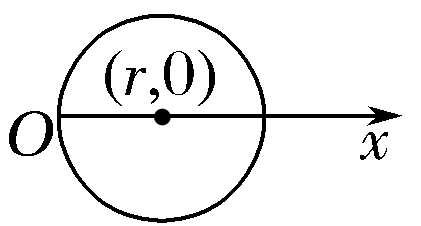
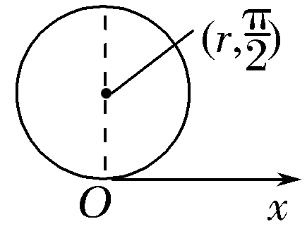
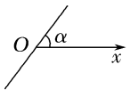
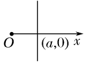
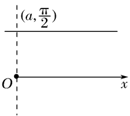
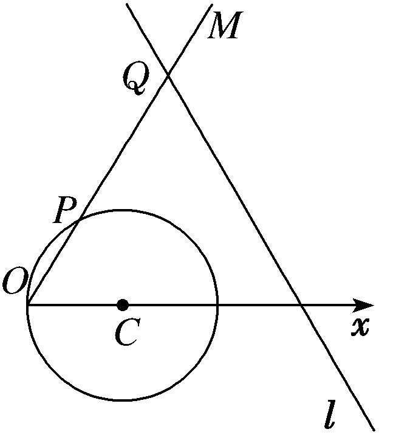
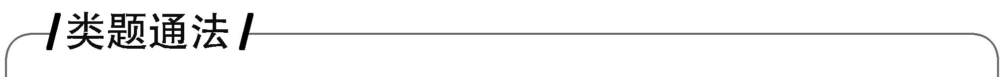

专题一　极坐标方程及其应用(综合型)

1．极坐标系
如图（1）所示，在平面内取一个定点*O*，叫做极点；自极点*O*引一条射线*Ox*，叫做极轴；再选定一个长度单位、一个角度单位(通常取弧度)及其正方向(通常取逆时针方向)，这样就建立了一个极坐标系．

2．极坐标

①极径：设*M*是平面内一点，极点*O*与点*M*的距离|*OM*|叫做点*M*的极径，记为*ρ*．

②极角：以极轴*Ox*为始边，射线*OM*为终边的角*xOM*叫做点*M*的极角，记为*θ*．

③极坐标：有序数对(*ρ*，*θ*)叫做点*M*的极坐标，记为*M*(*ρ*，*θ*)，一般不作特殊说明时，我们认为*ρ* ≥0，*θ*可取任意实数．当极角*θ*的取值范围是[0，2π)时，平面上的点(除去极点)就与极坐标(*ρ*，*θ*)(*ρ*≠0)建立一一对应的关系．我们设定，极点的极坐标中，极径*ρ*＝0，极角*θ*可取任意角．

  
图（1）　　　　　　　　　　　　图（2）

3．极坐标与直角坐标的互化
设*M*为平面上的一点，它的直角坐标为(*x*，*y*)，极坐标为(*ρ*，*θ*)．由图（2）可知下面的关系式成立：

或这就是极坐标与直角坐标的互化公式．

4．常见曲线的极坐标方程

<table><tr><td>
曲线
</td><td>
图形
</td><td>
极坐标方程
</td></tr><tr><td>
圆心在极点，半径为<em>r</em>的圆
</td><td>

</td><td>
<em>ρ</em>＝<em>r</em>(0≤<em>θ</em>&lt;2π)
</td></tr><tr><td>
圆心为(<em>r</em>，0)，半径为<em>r</em>的圆
</td><td>

</td><td>
<em>ρ</em>＝2<em>r</em>cos<em>θ</em>
</td></tr><tr><td>
圆心为，半径为<em>r</em>的圆
</td><td>

</td><td>
<em>ρ</em>＝2<em>r</em>sin<em>θ</em>(0≤<em>θ</em>&lt;π)
</td></tr><tr><td>
过极点，倾斜角为<em>α</em>的直线
</td><td>

</td><td>
<em>θ</em>＝<em>α</em>(<em>ρ</em>∈<strong>R</strong>)或<em>θ</em>＝<em>α</em>＋π(<em>ρ</em>∈<strong>R</strong>)
</td></tr><tr><td>
过点(<em>a</em>，0)，与极轴垂直的直线
</td><td>

</td><td>
<em>ρ</em>cos<em>θ</em>＝<em>a</em>
</td></tr><tr><td>
过点，与极轴平行的直线
</td><td>

</td><td>
<em>ρ</em>sin<em>θ</em>＝<em>a</em>(0&lt;<em>θ</em>&lt;π)
</td></tr></table>

[微点提醒]

关于极坐标系

1．极坐标系的四要素：①极点；②极轴；③长度单位；④角度单位和它的正方向，四者缺一不可．

2．一般地，点<em>M</em>(<em>ρ</em>，<em>θ</em>)的极坐标通式是(<em>ρ</em>，<em>θ</em>＋2<em>k</em>π)或(－<em>ρ</em>，<em>θ</em>＋2<em>k</em>π＋π)(<em>k</em>∈<strong>Z</strong>)．和直角坐标不同，平面内一个点的极坐标有无数种表示．

3．极坐标与直角坐标的重要区别：多值性．

【例题选讲】

<strong>[例1]</strong>　已知点<em>P</em>的直角坐标是(<em>x</em>，<em>y</em>)．以平面直角坐标系的原点为极坐标的极点，<em>x</em>轴的正半轴为极轴，建立极坐标系．设点<em>P</em>的极坐标是(<em>ρ</em>，<em>θ</em>)，点<em>Q</em>的极坐标是(<em>ρ</em>，<em>θ</em>＋<em>θ</em>0)，其中<em>θ</em>0是常数．设点<em>Q</em>的直角坐标是(<em>m</em>，<em>n</em>)．  
（1）用<em>x</em>，<em>y</em>，<em>θ</em>0表示<em>m</em>，<em>n</em>；  
（2）若<em>m</em>，<em>n</em>满足<em>mn</em>＝1，且<em>θ</em>0＝，求点<em>P</em>的直角坐标(<em>x</em>，<em>y</em>)满足的方程．

[规范解答]　（1）由题意知且
所以即  
（2）由（1）可知又*mn*＝1，所以＝1．
整理得－＝1，所以－＝1即为所求方程．

<strong>[例2]</strong>　已知曲线<em>C</em>1的参数方程为(<em>t</em>为参数)，以坐标原点为极点，<em>x</em>轴正半轴为极轴建立极坐标系，曲线<em>C</em>2的极坐标方程为<em>ρ</em>＝2sin <em>θ</em>.  
（1）求<em>C</em>1的极坐标方程，<em>C</em>2的直角坐标方程；  
（2）求<em>C</em>1与<em>C</em>2交点的极坐标(其中<em>ρ</em>≥0，0≤<em>θ</em>&lt;2π)．

<strong>[规范解答]</strong>　（1）将消去参数<em>t</em>，化为普通方程为(<em>x</em>－4)2＋(<em>y</em>－5)2＝25，
即<em>C</em>1：<em>x</em>2＋<em>y</em>2－8<em>x</em>－10<em>y</em>＋16＝0，将代入<em>x</em>2＋<em>y</em>2－8<em>x</em>－10<em>y</em>＋16＝0，
得<em>ρ</em>2－8<em>ρ</em>cos <em>θ</em>－10<em>ρ</em>sin <em>θ</em>＋16＝0，所以<em>C</em>1的极坐标方程为<em>ρ</em>2－8<em>ρ</em>cos <em>θ</em>－10<em>ρ</em>sin <em>θ</em>＋16＝0.
因为曲线<em>C</em>2的极坐标方程为<em>ρ</em>＝2sin <em>θ</em>，变为<em>ρ</em>2＝2<em>ρ</em>sin <em>θ</em>，

化为直角坐标方程为<em>x</em>2＋<em>y</em>2＝2<em>y</em>，即<em>x</em>2＋<em>y</em>2－2<em>y</em>＝0.  
（2）因为<em>C</em>1的普通方程为<em>x</em>2＋<em>y</em>2－8<em>x</em>－10<em>y</em>＋16＝0，<em>C</em>2的普通方程为<em>x</em>2＋<em>y</em>2－2<em>y</em>＝0，
由解得或
所以<em>C</em>1与<em>C</em>2交点的极坐标分别为，.

<strong>[例3]</strong>　(2017·全国Ⅲ)在直角坐标系<em>xOy</em>中，直线<em>l</em>1的参数方程为(<em>t</em>为参数)，直线<em>l</em>2的参数方程为(<em>m</em>为参数)．设<em>l</em>1与<em>l</em>2的交点为<em>P</em>，当<em>k</em>变化时，<em>P</em>的轨迹为曲线<em>C</em>.  
（1）写出*C*的普通方程；  
（2）以坐标原点为极点，<em>x</em>轴正半轴为极轴建立极坐标系，设<em>l</em>3：<em>ρ</em>(cos<em>θ</em>＋sin<em>θ</em>)－＝0，<em>M</em>为<em>l</em>3与<em>C</em>的交点，求<em>M</em>的极径．

<strong>[规范解答]</strong>　（1）消去参数<em>t</em>得<em>l</em>1的普通方程<em>l</em>1：<em>y</em>＝<em>k</em>(<em>x</em>－2)；
消去参数<em>m</em>得<em>l</em>2的普通方程<em>l</em>2：<em>y</em>＝(<em>x</em>＋2)．
设<em>P</em>(<em>x</em>，<em>y</em>)，由题设得消去<em>k</em>得<em>x</em>2－<em>y</em>2＝4(<em>y</em>≠0)．
所以<em>C</em>的普通方程为<em>x</em>2－<em>y</em>2＝4(<em>y</em>≠0)．  
（2）<em>C</em>的极坐标方程为<em>ρ</em>2(cos2<em>θ</em>－sin2<em>θ</em>)＝4(0&lt;<em>θ</em>&lt;2π，<em>θ</em>≠π)．
联立得cos *θ*－sin *θ*＝2(cos *θ*＋sin *θ*)．
故tan <em>θ</em>＝－，从而cos2<em>θ</em>＝，sin2<em>θ</em>＝.
代入<em>ρ</em>2(cos2<em>θ</em>－sin2<em>θ</em>)＝4得<em>ρ</em>2＝5，所以交点<em>M</em>的极径为

<strong>[例4]</strong>　已知圆<em>O</em>1和圆<em>O</em>2的极坐标方程分别为<em>ρ</em>＝2，<em>ρ</em>2－2<em>ρ</em>cos＝2.  
（1）将圆<em>O</em>1和圆<em>O</em>2的极坐标方程化为直角坐标方程；  
（2）求经过两圆交点的直线的极坐标方程．

<strong>[规范解答]</strong>　（1）由<em>ρ</em>＝2知<em>ρ</em>2＝4，由坐标变换公式，得<em>x</em>2＋<em>y</em>2＝4.
因为<em>ρ</em>2－2<em>ρ</em>cos＝2，所以<em>ρ</em>2－2<em>ρ</em>＝2.
由坐标变换公式，得<em>x</em>2＋<em>y</em>2－2<em>x</em>－2<em>y</em>－2＝0.  
（2）将两圆的直角坐标方程相减，得经过两圆交点的直线方程为*x*＋*y*＝1.

化为极坐标方程为*ρ*cos *θ*＋*ρ*sin *θ*＝1，即*ρ*sin＝．

<strong>[例5]</strong>　在直角坐标系<em>xOy</em>中，以坐标原点<em>O</em>为极点，<em>x</em>轴正半轴为极轴建立极坐标系，曲线<em>C</em>1：<em>ρ</em>2－4<em>ρ</em>cos <em>θ</em>＋3＝0，<em>θ</em>∈[0，2π]，曲线<em>C</em>2：<em>ρ</em>＝，<em>θ</em>∈[0，2π]．  
（1）求曲线<em>C</em>1的一个参数方程；  
（2）若曲线<em>C</em>1和曲线<em>C</em>2相交于<em>A</em>，<em>B</em>两点，求|<em>AB</em>|的值．

<strong>[规范解答]</strong>　（1）由<em>ρ</em>2－4<em>ρ</em>cos <em>θ</em>＋3＝0，可得<em>x</em>2＋<em>y</em>2－4<em>x</em>＋3＝0，∴(<em>x</em>－2)2＋<em>y</em>2＝1.
令<em>x</em>－2＝cos <em>α</em>，<em>y</em>＝sin <em>α</em>，∴<em>C</em>1的一个参数方程为(<em>α</em>为参数，<em>α</em>∈<strong>R</strong>)．  
（2）<em>C</em>2：4<em>ρ</em>＝3，∴4＝3，即2<em>x</em>－2<em>y</em>－3＝0.
∵直线2<em>x</em>－2<em>y</em>－3＝0与圆(<em>x</em>－2)2＋<em>y</em>2＝1相交于<em>A</em>，<em>B</em>两点，且圆心到直线的距离<em>d</em>＝，
∴|*AB*|＝2×＝2×＝．

<strong>[例6]</strong>　在平面直角坐标系<em>xOy</em>中，圆<em>C</em>的参数方程为(<em>φ</em>为参数)，以坐标原点<em>O</em>为极点，<em>x</em>轴的正半轴为极轴建立极坐标系．  
（1）求圆*C*的极坐标方程；  
（2）直线*l*的极坐标方程是2*ρ*sin＝3，射线*OM*：*θ*＝与圆*C*的交点为*O*，*P*，与直线*l*的交点为*Q*，求线段*PQ*的长．

<strong>[规范解答]</strong>　（1）由圆<em>C</em>的参数方程为(<em>φ</em>为参数)，
可得圆<em>C</em>的直角坐标方程为(<em>x</em>－1)2＋<em>y</em>2＝1，即<em>x</em>2＋<em>y</em>2－2<em>x</em>＝0.
由极坐标方程与直角坐标方程的互化公式可得，圆*C*的极坐标方程为*ρ*＝2cos *θ*.

  
（2）由得*P*，由得*Q*，

结合图可得|<em>PQ</em>|＝|<em>OQ</em>|－|<em>OP</em>|＝|<em>ρ</em>Q|－|<em>ρP</em>|＝3－1＝2．

<strong>[例7]</strong>　在平面直角坐标系<em>xOy</em>中，已知直线<em>l</em>：<em>x</em>＋<em>y</em>＝5，以原点<em>O</em>为极点，<em>x</em>轴的正半轴为极轴建立极坐标系，圆<em>C</em>的极坐标方程为<em>ρ</em>＝4sin<em>θ</em>．  
（1）求直线*l*的极坐标方程和圆*C*的直角坐标方程；  
（2）射线*OP*：*θ*＝与圆*C*的交点为*O*，*A*，与直线*l*的交点为*B*，求线段*AB*的长．

<strong>[规范解答]</strong>　（1）因为<em>x</em>＝<em>ρ</em>cos <em>θ</em>，<em>y</em>＝<em>ρ</em>sin <em>θ</em>，直线<em>l</em>：<em>x</em>＋<em>y</em>＝5，
所以直线*l*的极坐标方程为*ρ*cos *θ*＋*ρ*sin *θ*＝5，
化简得2*ρ*sin＝5，即为直线*l*的极坐标方程.
由<em>ρ</em>＝4sin <em>θ</em>，得<em>ρ</em>2＝4<em>ρ</em>sin <em>θ</em>，所以<em>x</em>2＋<em>y</em>2＝4<em>y</em>，即<em>x</em>2＋(<em>y</em>－2)2＝4，即为圆<em>C</em>的直角坐标方程.  
（2）由题意得<em>ρA</em>＝4sin ＝2，<em>ρB</em>＝＝5，所以|<em>AB</em>|＝|<em>ρA</em>－<em>ρB</em>|＝3．

<strong>[例8]</strong>　在平面直角坐标系<em>xOy</em>中，曲线<em>C</em>的参数方程为(<em>θ</em>为参数)，以坐标原点为极点，<em>x</em>轴非负半轴为极轴建立极坐标系．  
（1）求*C*的极坐标方程；  
（2）若直线<em>l</em>1，<em>l</em>2的极坐标方程分别为<em>θ</em>＝(<em>ρ</em>∈<strong>R</strong>)，<em>θ</em>＝(<em>ρ</em>∈<strong>R</strong>)，设直线<em>l</em>1，<em>l</em>2与曲线<em>C</em>的交点为<em>O</em>，<em>M</em>，<em>N</em>，求△<em>OMN</em>的面积．

<strong>[规范解答]</strong>　（1）由参数方程(<em>θ</em>为参数)，得普通方程为<em>x</em>2＋(<em>y</em>－2)2＝4，所以<em>C</em>的极坐标方程为<em>ρ</em>2cos2<em>θ</em>＋<em>ρ</em>2sin2<em>θ</em>－4<em>ρ</em>sin <em>θ</em>＝0，即<em>ρ</em>＝4sin <em>θ</em>.  
（2）不妨设直线<em>l</em>1：<em>θ</em>＝(<em>ρ</em>∈<strong>R</strong>)与曲线<em>C</em>的交点为<em>O</em>，<em>M</em>，则<em>ρM</em>＝|<em>OM</em>|＝4sin＝2．
又直线<em>l</em>2：<em>θ</em>＝(<em>ρ</em>∈<strong>R</strong>)与曲线<em>C</em>的交点为<em>O</em>，<em>N</em>，则<em>ρN</em>＝|<em>ON</em>|＝4sin＝2．
又∠<em>MON</em>＝，所以<em>S</em>△<em>OMN</em>＝|<em>OM</em>||<em>ON</em>|＝×2×2＝2．

<strong>[例9]</strong>　在直角坐标系<em>xOy</em>中，曲线<em>C</em>1： (<em>t</em>为参数，<em>t</em>≠0)，其中0≤<em>α</em>＜π，在以<em>O</em>为极点，<em>x</em>轴正半轴为极轴的极坐标系中，曲线<em>C</em>2：<em>ρ</em>＝2sin<em>θ</em>，曲线<em>C</em>3：<em>ρ</em>＝2cos<em>θ</em>．  
（1）求<em>C</em>2与<em>C</em>3交点的直角坐标；  
（2）若<em>C</em>1与<em>C</em>2相交于点<em>A</em>，<em>C</em>1与<em>C</em>3相交于点<em>B</em>，求|<em>AB</em>|的最大值．

<strong>[规范解答]</strong>　（1）曲线<em>C</em>2的直角坐标方程为<em>x</em>2＋<em>y</em>2－2<em>y</em>＝0，

曲线<em>C</em>3的直角坐标方程为<em>x</em>2＋<em>y</em>2－2<em>x</em>＝0.
联立解得或
所以<em>C</em>2与<em>C</em>3交点的直角坐标为(0，0)和.  
（2）曲线<em>C</em>1的极坐标方程为<em>θ</em>＝<em>α</em>(<em>ρ</em>∈<strong>R</strong>，<em>ρ</em>≠0)，其中0≤<em>α</em>＜π．
因此*A*的极坐标为(2sin *α*，*α*)，*B*的极坐标为(2cos *α*，*α*)．
所以|*AB*|＝|2sin *α*－2cos *α*|＝4，当*α*＝时，|*AB*|取得最大值，最大值为4．

<strong>[例10]</strong>　已知直线<em>l</em>的参数方程为(<em>t</em>为参数)．在以坐标原点<em>O</em>为极点，<em>x</em>轴的正半轴为极轴的极坐标系中，曲线<em>C</em>的极坐标方程为<em>ρ</em>2＝4<em>ρ</em>cos <em>θ</em>＋2<em>ρ</em>sin <em>θ</em>－4.  
（1）求直线*l*普通方程和曲线*C*的直角坐标方程；  
（2）设直线*l*与曲线*C*交于*A*，*B*两点，求|*OA*|·|*OB*|．

<strong>[规范解答]</strong>　（1）由消去<em>t</em>，得<em>y</em>－＝(<em>x</em>－1)，即<em>y</em>＝<em>x</em>，
∴直线<em>l</em>的普通方程为<em>y</em>＝<em>x</em>，曲线<em>C</em>：<em>ρ</em>2＝4<em>ρ</em>cos <em>θ</em>＋2<em>ρ</em>sin <em>θ</em>－4，
∴其直角坐标方程<em>x</em>2＋<em>y</em>2＝4<em>x</em>＋2<em>y</em>－4，即(<em>x</em>－2)2＋(<em>y</em>－)2＝3．  
（2）易由<em>y</em>＝<em>x</em>，得直线<em>l</em>的极坐标方程为<em>θ</em>＝，代入曲线<em>C</em>的极坐标方程为<em>ρ</em>2－5<em>ρ</em>＋4＝0，
所以|<em>OA</em>|·|<em>OB</em>|＝|<em>ρA</em>·<em>ρB</em>|＝4

<strong>[例11]</strong>　在平面直角坐标系中，曲线<em>C</em>1的参数方程为(<em>φ</em>为参数)，以原点<em>O</em>为极点，<em>x</em>轴的正半轴为极轴建立极坐标系，曲线<em>C</em>2是圆心在极轴上且经过极点的圆，射线<em>θ</em>＝与曲线<em>C</em>2交于点<em>D</em>.  
（1）求曲线<em>C</em>1的普通方程和曲线<em>C</em>2的直角坐标方程；  
（2）已知极坐标系中两点<em>A</em>(<em>ρ</em>1，<em>θ</em>0)，<em>B</em>，若<em>A</em>，<em>B</em>都在曲线<em>C</em>1上，求＋的值．

<strong>[规范解答]</strong>　（1）∵<em>C</em>1的参数方程为∴<em>C</em>1的普通方程为＋<em>y</em>2＝1．
由题意知曲线<em>C</em>2的极坐标方程为<em>ρ</em>＝2<em>a</em>cos <em>θ</em>(<em>a</em>为半径)，
将*D*代入，得2＝2*a*×，∴*a*＝2，
∴圆<em>C</em>2的圆心的直角坐标为(2，0)，半径为2，∴<em>C</em>2的直角坐标方程为(<em>x</em>－2)2＋<em>y</em>2＝4．  
（2）曲线<em>C</em>1的极坐标方程为＋<em>ρ</em>2sin2<em>θ</em>＝1，即<em>ρ</em>2＝．
∴*ρ*＝，*ρ*＝＝．
∴＋＝＋＝．

<strong>[例12]</strong>　极坐标系与直角坐标系<em>xOy</em>有相同的长度单位，以原点<em>O</em>为极点，<em>x</em>轴的正半轴为极轴建立极坐标系．已知曲线<em>C</em>1的极坐标方程为<em>ρ</em>＝4cos <em>θ</em>，曲线<em>C</em>2的参数方程为(<em>t</em>为参数，0≤<em>α</em>＜π)，射线<em>θ</em>＝<em>φ</em>，<em>θ</em>＝<em>φ</em>＋，<em>θ</em>＝<em>φ</em>－与曲线<em>C</em>1交于(不包括极点<em>O</em>)三点<em>A</em>，<em>B</em>，<em>C</em>．  
（1）求证：|*OB*|＋|*OC*|＝|*OA*|；  
（2）当<em>φ</em>＝时，<em>B</em>，<em>C</em>两点在曲线<em>C</em>2上，求<em>m</em>与<em>α</em>的值．

<strong>[规范解答]</strong>　（1）证明：设点<em>A</em>，<em>B</em>，<em>C</em>的极坐标分别为(<em>ρ</em>1，<em>φ</em>)，，，
因为点<em>A</em>，<em>B</em>，<em>C</em>在曲线<em>C</em>1上，所以<em>ρ</em>1＝4cos <em>φ</em>，<em>ρ</em>2＝4cos，<em>ρ</em>3＝4cos，
所以|<em>OB</em>|＋|<em>OC</em>|＝<em>ρ</em>2＋<em>ρ</em>3＝4cos＋4cos＝4cos <em>φ</em>＝<em>ρ</em>1，故|<em>OB</em>|＋|<em>OC</em>|＝|<em>OA</em>|．  
（2）由曲线<em>C</em>2的方程知曲线<em>C</em>2是经过定点(<em>m,</em>0)且倾斜角为<em>α</em>的直线．
当*φ*＝时，*B*，*C*两点的极坐标分别为(2，)，(2，－)，

化为直角坐标为*B*(1，)，*C*(3，－)，所以tan *α*＝＝－，又0≤*α*＜π，所以*α*＝．
故曲线<em>C</em>2的方程为<em>y</em>＝－(<em>x</em>－2)，易知曲线<em>C</em>2恒过点(2，0)，即<em>m</em>＝2．

1．极坐标方程与普通方程互化技巧  
（1）进行极坐标方程与直角坐标方程互化的关键是抓住互化公式；<em>x</em>＝<em>ρ</em>cos<em>θ</em>，<em>y</em>＝<em>ρ</em>sin<em>θ</em>，<em>ρ</em>2＝<em>x</em>2＋<em>y</em>2，tan<em>θ</em>＝(<em>x</em>≠0)．  
（2）巧用极坐标方程两边同乘以<em>ρ</em>或同时平方技巧，将极坐标方程构造成含有<em>ρ</em>cos <em>θ</em>，<em>ρ</em>sin <em>θ</em>，<em>ρ</em>2的形式，然后利用公式代入化简得到普通方程．  
（3）巧借两角和差公式，转化*ρ*sin(*θ*±*α*)或*ρ*cos(*θ*±*α*)的结构形式，进而利用互化公式得到普通方程．  
（4）将直角坐标方程中的*x*转化为*ρ*cos *θ*，将*y*换成*ρ*sin *θ*，即可得到其极坐标方程．  
（5）进行极坐标方程与直角坐标方程互化时，要注意*ρ*，*θ*的取值范围及其影响，并重视公式的逆向与变形使用．

2．求解与极坐标有关的问题的主要方法  
（1）直接利用极坐标系求解，可与数形结合思想配合使用．  
（2）转化为直角坐标系，用直角坐标求解．若结果要求的是极坐标，还应将直角坐标化为极坐标．

3．已知极坐标方程求线段的长度的方法  
（1）先将极坐标系下点的坐标、曲线方程转化为平面直角坐标系下的点的坐标、曲线方程，然后求线段的长度．  
（2）直接在极坐标系下求解，设<em>A</em>(<em>ρ</em>1，<em>θ</em>1)，<em>B</em>(<em>ρ</em>2，<em>θ</em>2)，则|<em>AB</em>|＝；如果直线过极点且与另一曲线相交，求交点之间的距离时，求出曲线的极坐标方程和直线的极坐标方程及交点的极坐标，则|<em>ρ</em>1－<em>ρ</em>2|即为所求．

【对点训练】

1．在极坐标系下，已知圆*O*：*ρ*＝cos *θ*＋sin *θ*和直线*l*：*ρ*sin＝．  
（1）求圆*O*和直线*l*的直角坐标方程；  
（2）当*θ*∈(0，π)时，求直线*l*与圆*O*公共点的一个极坐标．

1．<strong>解析</strong>　（1）圆<em>O</em>：<em>ρ</em>＝cos <em>θ</em>＋sin <em>θ</em>，即<em>ρ</em>2＝<em>ρ</em>cos <em>θ</em>＋<em>ρ</em>sin <em>θ</em>，

圆<em>O</em>的直角坐标方程为：<em>x</em>2＋<em>y</em>2＝<em>x</em>＋<em>y</em>，即<em>x</em>2＋<em>y</em>2－<em>x</em>－<em>y</em>＝0，

直线*l*：*ρ*sin＝，即*ρ*sin *θ*－*ρ*cos *θ*＝1，
则直线*l*的直角坐标方程为：*y*－*x*＝1，即*x*－*y*＋1＝0．  
（2）由得故直线*l*与圆*O*公共点的一个极坐标为．

2．在直角坐标系*xOy*中，以*O*为极点，*x*轴正半轴为极轴建立极坐标系，曲线*C*的极坐标方程为*ρ*cos

＝1，*M*，*N*分别为曲线*C*与*x*轴，*y*轴的交点．  
（1）写出曲线*C*的直角坐标方程，并求*M*，*N*的极坐极；  
（2）设*M*，*N*的中点为*P*，求直线*OP*的极坐标方程．

2．<strong>解析</strong>　（1）因为<em>ρ</em>cos＝1，所以<em>ρ</em>cos <em>θ</em>·cos＋<em>ρ</em>sin <em>θ</em>·sin＝1，又所以<em>x</em>＋<em>y</em>＝1，
即曲线*C*的直角坐标方程为*x*＋*y*－2＝0，令*y*＝0，则*x*＝2；令*x*＝0，则*y*＝．
所以*M*(2，0)，*N*．所以*M*的极坐标为(2，0)，*N*的极坐标为．  
（2）因为*M*，*N*连线的中点*P*的直角坐标为，所以*P*的极角为*θ*＝，
所以直线<em>OP</em>的极坐标方程为<em>θ</em>＝(<em>ρ</em>∈<strong>R</strong>)．

3．将圆<em>x</em>2＋<em>y</em>2＝1上每一点的横坐标保持不变，纵坐标变为原来的2倍，得曲线<em>C</em>．  
（1）写出*C*的参数方程；  
（2）设直线<em>l</em>：2<em>x</em>＋<em>y</em>－2＝0与<em>C</em>的交点为<em>P</em>1，<em>P</em>2，以坐标原点为极点，<em>x</em>轴正半轴为极轴建立极坐标系，求过线段<em>P</em>1<em>P</em>2的中点且与<em>l</em>垂直的直线的极坐标方程．

3．<strong>解析</strong>　（1）设(<em>x</em>1，<em>y</em>1)为圆上的点，在已知变换下变为<em>C</em>上点(<em>x</em>，<em>y</em>)，依题意，得

由，得，即曲线*C*的方程为．

故*C*的参数方程为(*t*为参数)．

  
（2）由解得或

不妨设<em>P</em>1(1，0)，<em>P</em>2(0，2)，则线段<em>P</em>1<em>P</em>2的中点坐标为，所求直线斜率为，

于是所求直线方程为，化为极坐标方程，并整理得

2*ρ*cos *θ*－4*ρ*sin *θ*＝－3，即．

4．以直角坐标系中的原点*O*为极点，*x*轴正半轴为极轴的极坐标系中，已知曲线的极坐标方程为*ρ*＝

.  
（1）将曲线的极坐标方程化为直角坐标方程；  
（2）过极点*O*作直线*l*交曲线于点*P*，*Q*，若|*OP*|＝3|*OQ*|，求直线*l*的极坐标方程．

4．<strong>解析</strong>　（1）∵<em>ρ</em>＝，<em>ρ</em>sin <em>θ</em>＝<em>y</em>，∴<em>ρ</em>＝化为<em>ρ</em>－<em>ρ</em>sin <em>θ</em>＝2，得<em>ρ</em>2＝(2＋<em>ρ</em>sin <em>θ</em>)2，
∴曲线的直角坐标方程为<em>x</em>2＝4<em>y</em>＋4.  
（2）设直线<em>l</em>的极坐标方程为<em>θ</em>＝<em>θ</em>0(<em>ρ</em>∈<strong>R</strong>)，根据题意＝3·，解得<em>θ</em>0＝或<em>θ</em>0＝，

直线<em>l</em>的极坐标方程<em>θ</em>＝(<em>ρ</em>∈<strong>R</strong>)或<em>θ</em>＝(<em>ρ</em>∈<strong>R</strong>)．

5．已知曲线*C*的参数方程为(*α*为参数)，以直角坐标系的原点为极点，*x*轴的正半轴

为极轴建立极坐标系．  
（1）求曲线*C*的极坐标方程；  
（2）若直线*l*的极坐标方程为*ρ*(sin *θ*＋cos *θ*)＝1，求直线*l*被曲线*C*截得的弦长．

5．<strong>解析</strong>　（1）曲线<em>C</em>的参数方程为(<em>α</em>为参数)，
∴曲线<em>C</em>的普通方程为(<em>x</em>－2)2＋(<em>y</em>－1)2＝5．将代入并化简得<em>ρ</em>＝4cos <em>θ</em>＋2sin <em>θ</em>，
即曲线C的极坐标方程为*ρ*＝4cos *θ*＋2sin *θ*．  
（2）∵*l*的直角坐标方程为*x*＋*y*－1＝0，∴圆心*C*(2，1)到直线*l*的距离*d*＝＝，
∴弦长为2＝2．

6．在直角坐标系*xOy*中，曲线*C*的参数方程为(*α*为参数)，直线*l*的参数方程为

(*t*为参数)．在以坐标原点*O*为极点，*x*轴的正半轴为极轴的极坐标系中，过极点*O*的射线与曲线*C*相交于不同于极点的点*A*，且点*A*的极坐标为(2，*θ*)，其中*θ*∈．  
（1）求*θ*的值；  
（2）若射线*OA*与直线*l*相交于点*B*，求|*AB*|的值．

6．（1）由题意知，曲线<em>C</em>的普通方程为<em>x</em>2＋(<em>y</em>－2)2＝4，
∵<em>x</em>＝<em>ρ</em>cos <em>θ</em>，<em>y</em>＝<em>ρ</em> sin <em>θ</em>，∴曲线<em>C</em>的极坐标方程为(<em>ρ</em>cos <em>θ</em>)2＋(<em>ρ</em>sin <em>θ</em>－2)2＝4，即<em>ρ</em>＝4sin <em>θ</em>．
由*ρ*＝2，得sin *θ*＝，∵*θ*∈，∴*θ*＝．  
（2）由题，易知直线*l*的普通方程为*x*＋*y*－4＝0，
∴直线*l*的极坐标方程为*ρ*cos *θ*＋*ρ*sin *θ*－4＝0．
又射线*OA*的极坐标方程为*θ*＝(*ρ*≥0)，联立，得解得*ρ*＝4．
∴点<em>B</em>的极坐标为，∴|<em>AB</em>|＝|<em>ρB</em>－<em>ρA</em>|＝4－2＝2．

7．已知极坐标系的极点为直角坐标系*xOy*的原点，极轴为*x*轴的正半轴，两种坐标系中的长度单位相同，

圆<em>C</em>的直角坐标方程为<em>x</em>2＋<em>y</em>2＋2<em>x</em>－2<em>y</em>＝0，直线<em>l</em>的参数方程为(<em>t</em>为参数)，射线<em>OM</em>的极坐标方程为<em>θ</em>＝.  
（1）求圆*C*和直线*l*的极坐标方程；  
（2）已知射线*OM*与圆*C*的交点为*O*，*P*，与直线*l*的交点为*Q*，求线段*PQ*的长．

7．<strong>解析</strong>　（1）∵<em>ρ</em>2＝<em>x</em>2＋<em>y</em>2，<em>x</em>＝<em>ρ</em>cos <em>θ</em>，<em>y</em>＝<em>ρ</em>sin <em>θ</em>，圆<em>C</em>的直角坐标方程为<em>x</em>2＋<em>y</em>2＋2<em>x</em>－2<em>y</em>＝0，
∴<em>ρ</em>2＋2<em>ρ</em>cos <em>θ</em>－2<em>ρ</em>sin <em>θ</em>＝0，∴圆<em>C</em>的极坐标方程为<em>ρ</em>＝2sin.
又直线*l*的参数方程为(*t*为参数)，消去*t*后得*y*＝*x*＋1，
∴直线*l*的极坐标方程为sin *θ*－cos *θ*＝.  
（2）当*θ*＝时，|*OP*|＝2sin＝2，
∴点*P*的极坐标为，|*OQ*|＝＝，
∴点*Q*的极坐标为，故线段*PQ*的长为.

8．在直角坐标系*xOy*中，曲线*C*的参数方程是(*α*为参数)．以坐标原点*O*为极点，*x*轴

的正半轴为极轴，建立极坐标系．  
（1）求曲线*C*的极坐标方程；  
（2）设<em>l</em>1：<em>θ</em>＝，<em>l</em>2：<em>θ</em>＝，若<em>l</em>1，<em>l</em>2与曲线<em>C</em>分别交于异于原点的<em>A</em>，<em>B</em>两点，求△<em>AOB</em>的面积．

8．<strong>解析</strong>　（1）将曲线<em>C</em>的参数方程化为普通方程为(<em>x</em>－3)2＋(<em>y</em>－4)2＝25，即<em>x</em>2＋<em>y</em>2－6<em>x</em>－8<em>y</em>＝0．
∴曲线*C*的极坐标方程为*ρ*＝6cos*θ*＋8sin*θ*．  
（2）设<em>A</em>，<em>B</em>．把<em>θ</em>＝代入<em>ρ</em>＝6cos<em>θ</em>＋8sin<em>θ</em>，得<em>ρ</em>1＝4＋3，∴<em>A</em>．

把<em>θ</em>＝代入<em>ρ</em>＝6cos<em>θ</em>＋8sin<em>θ</em>，得<em>ρ</em>2＝3＋4，∴<em>B</em>．
∴<em>S</em>△<em>AOB</em>＝<em>ρ</em>1<em>ρ</em>2sin∠<em>AOB</em>＝(4＋3)(3＋4)sin＝12＋．

9．点<em>P</em>是曲线<em>C</em>1：(<em>x</em>－2)2＋<em>y</em>2＝4上的动点，以坐标原点<em>O</em>为极点，<em>x</em>轴的正半轴为极轴建立极坐标系，

以极点<em>O</em>为中点，将点<em>P</em>逆时针旋转90°得到点<em>Q</em>，设点<em>Q</em>的轨迹为曲线<em>C</em>2.  
（1）求曲线<em>C</em>1，<em>C</em>2的极坐标方程；  
（2）射线<em>θ</em>＝(<em>ρ</em>&gt;0)与曲线<em>C</em>1，<em>C</em>2分别交于<em>A</em>，<em>B</em>两点，定点<em>M</em>(2，0)，求△<em>MAB</em>的面积.

9．<strong>解析</strong>　（1）由曲线<em>C</em>1的直角坐标方程(<em>x</em>－2)2＋<em>y</em>2＝4可得曲线<em>C</em>1的极坐标方程为<em>ρ</em>＝4cos <em>θ</em>.
设*Q*(*ρ*，*θ*)，则*P*，则有*ρ*＝4cos ＝4sin *θ*．
所以曲线<em>C</em>2的极坐标方程为<em>ρ</em>＝4sin<em>θ</em>．  
（2）<em>M</em>到射线<em>θ</em>＝(<em>ρ</em>&gt;0)的距离<em>d</em>＝2sin ＝，|<em>AB</em>|＝<em>ρB</em>－<em>ρA</em>＝4＝2(－1)，
所以<em>S</em>△<em>MAB</em>＝|<em>AB</em>|×<em>d</em>＝×2(－1)×＝3－．

10．在平面直角坐标系<em>xOy</em>中，曲线<em>C</em>1的参数方程为(<em>α</em>为参数)，直线<em>C</em>2的方程为<em>y</em>＝<em>x</em>．

以坐标原点*O*为极点，*x*轴的正半轴为极轴建立极坐标系．  
（1）求曲线<em>C</em>1和曲线<em>C</em>2的极坐标方程；  
（2）若直线<em>C</em>2与曲线<em>C</em>1交于<em>A</em>，<em>B</em>两点，求＋．

10．<strong>解析</strong>　（1）由曲线<em>C</em>1的参数方程为(<em>α</em>为参数)，
得曲线<em>C</em>1的普通方程为(<em>x</em>－2)2＋(<em>y</em>－2)2＝1，则<em>C</em>1的极坐标方程为<em>ρ</em>2－4<em>ρ</em>cos <em>θ</em>－4<em>ρ</em>sin <em>θ</em>＋7＝0，
由于直线<em>C</em>2过原点，且倾斜角为，故其极坐标方程为<em>θ</em>＝(<em>ρ</em>∈<strong>R</strong>).  
（2）由得<em>ρ</em>2－(2＋2)<em>ρ</em>＋7＝0，
设<em>A</em>，<em>B</em>对应的极径分别为<em>ρ</em>1，<em>ρ</em>2，则<em>ρ</em>1＋<em>ρ</em>2＝2＋2，<em>ρ</em>1<em>ρ</em>2＝7，
∴＋＝＝＝．

