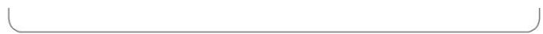

# 专题二 参数方程及其应用(综合型)

# 1. 曲线的参数方程

在平面直角坐标系中，如果曲线上任意一点的坐标 $x, y$ 都是某个变数 $t$ 的函数 $\left\{ \begin{array}{l} x = f(t), \\ y = g(t), \end{array} \right.$ 并且对于 $t$ 的每一个允许值，由这个方程组所确定的点 $M(x, y)$ 都在这条曲线上，那么这个方程组就叫做这条曲线的参数方程，联系变数 $x, y$ 的变数 $t$ 叫做参变数，简称参数。相对于参数方程而言，直接给出点的坐标间关系的方程 $F(x, y) = 0$ 叫做普通方程。

# 2. 直线、圆、椭圆的参数方程

(1)过点 $M(x_{0}, y_{0})$ ，倾斜角为 $\alpha$ 的直线 l 的参数方程为 $\left\{\begin{aligned} x &= x_{0} + t \cos \alpha, \\ y &= y_{0} + t \sin \alpha \end{aligned}\right.$ (t 为参数).  
(2)圆心在点 $M_0(x_0, y_0)$ ，半径为 $r$ 的圆的参数方程为 $\left\{ \begin{array}{l} x = x_0 + r\cos \theta, \\ y = y_0 + r\sin \theta \end{array} \right.$ ( $\theta$ 为参数).  
(3)椭圆 $\frac{x^{2}}{a^{2}}+\frac{y^{2}}{b^{2}}=1(a>b>0)$ 的参数方程为 $\left\{\begin{aligned}x&=a\cos\varphi,\\ y&=b\sin\varphi\end{aligned}\right.$ ( $\varphi$ 为参数).

[微点提醒] 直线参数方程中 $t$ 的几何意义

过点 $M(x_{0}, y_{0})$ ，倾斜角为 $\alpha$ 的直线 l 的参数方程为 $\left\{\begin{aligned} x &= x_{0} + t\cos\alpha, \\ y &= y_{0} + t\sin\alpha \end{aligned}\right.$ (t 为参数)，其中 t 表示直线上以定点 $M_{0}$ 为起点，任意一点 $M(x, y)$ 为终点的有向线段 $\overrightarrow{M_{0}M}$ 的数量。当 t > 0 时， $\overrightarrow{M_{0}M}$ 的方向向上；当 t < 0 时， $\overrightarrow{M_{0}M}$ 的方向向下；当 t = 0 时，M 与 $M_{0}$ 重合。

根据直线的参数方程标准式中 t 的几何意义，有如下常用结论：

过点 $M_0(x_0, y_0)$ ，倾斜角为 $\alpha$ 的直线 $l$ 的参数方程是 $\left\{ \begin{array}{l} x = x_0 + t \cos \alpha, \\ y = y_0 + t \sin \alpha. \end{array} \right.$ 若 $M_1, M_2$ 是 $l$ 上的两点，其对应参数分别为 $t_1, t_2$ ，则

① $|M_{1}M_{2}|=|t_{1}-t_{2}|.$   
②若线段 $M_{1}M_{2}$ 的中点 $M$ 所对应的参数为 $t$ ，则 $t = \frac{t_1 + t_2}{2}$ 中点 $M$ 到定点 $M_0$ 的距离 $|MM_0| = |t| = \left|\frac{t_1 + t_2}{2}\right|$   
③若 $M_{0}$ 为线段 $M_{1}M_{2}$ 的中点，则 $t_{1}+t_{2}=0$ .  
④ $|M_{0}M_{1}||M_{0}M_{2}|=|t_{1}t_{2}|$ .

直线的参数方程的一般式 $\left\{ \begin{array}{l} x = x_0 + at \\ y = y_0 + bt \end{array} \right.$ (t 为参数)，是过点 $M_0(x_0, y_0)$ ，斜率为 $\frac{b}{a}$ 的直线的参数方程。当且仅当 $a^2 + b^2 = 1$ 且 $b \geq 0$ 时，才是标准方程， $t$ 才具有标准方程中的几何意义。将非标准方程 $\left\{ \begin{array}{l} x = x_0 + at \\ y = y_0 + bt \end{array} \right.$ 化为

标准方程是 $\left\{ \begin{array}{l} x = x_0 \pm \frac{|a|}{\sqrt{a^2 + b^2}} t' \\ y = y_0 + \frac{|b|}{\sqrt{a^2 + b^2}} t' \end{array} \right.$ ( $t' \in \mathbf{R}$ ), 式中“±”号, 当 $a, b$ 同号时取正; 当 $a, b$ 异号时取负. 可见动点 $P$ 到定点 $P_0$ 的距离是 $\sqrt{a^2 + b^2} |t|$ . 设直线上的任意两点 $P_1, P_2$ 对应的参数分别为 $t_1, t_2$ , 则 $|P_1P_2| = \sqrt{a^2 + b^2} |t_1 - t_2|$ (弦长公式).

# 【例题选讲】

[例1] 在直角坐标系 $xOy$ 中，圆 $C_1: x^2 + y^2 = 4$ ，圆 $C_2: (x - 2)^2 + y^2 = 4$ .

(1)在以 O 为极点，x 轴正半轴为极轴的极坐标系中，分别写出圆 $C_{1}$ ， $C_{2}$ 的极坐标方程，并求出圆 $C_{1}$ ， $C_{2}$ 的交点坐标(用极坐标表示);

(2)求圆 $C_{1}$ 与 $C_{2}$ 的公共弦的参数方程.

[例 2] (2018·全国III)在平面直角坐标系 xOy 中， $\odot O$ 的参数方程为 $\left\{\begin{aligned}x&=\cos\theta\\ y&=\sin\theta\end{aligned}\right.$ ，( $\theta$ 为参数)，过点(0， $-\sqrt{2}$ )且倾斜角为 $\alpha$ 的直线 l 与 $\odot O$ 交于 A，B 两点.

(1)求 $\alpha$ 的取值范围;

(2)求 AB 中点 P 的轨迹的参数方程.

[例 3] 以直角坐标系的原点 O 为极点，x 轴的正半轴为极轴建立极坐标系，已知曲线 C 的极坐标方程为 $\rho=1$ ，直线 l 的参数方程为 $\left\{\begin{aligned} x &= 1 + \frac{1}{2}t, \\ y &= 2 + \frac{\sqrt{3}}{2}t \end{aligned}\right.$ (t 为参数).

(1)求直线 l 的普通方程与曲线 C 的直角坐标方程;

(2)设曲线 C 经过伸缩变换 $\left\{\begin{aligned}x'=2x,\\ y'=y\end{aligned}\right.$ 得到曲线 $C'$ ，设曲线 $C'$ 上任一点为 $M(x,y)$ ，求 $x+2\sqrt{3}y$ 的最大值.

[例 4] 在平面直角坐标系 xOy 中，以原点 O 为极点，x 轴的正半轴为极轴建立极坐标系，已知曲线 $C_{1}$ 的极坐标方程为 $\rho^{2}-2\sqrt{2}\rho\sin\left(\theta-\frac{\pi}{4}\right)-2=0$ ，曲线 $C_{2}$ 的极坐标方程为 $\theta=\frac{\pi}{4}$ ， $C_{1}$ 与 $C_{2}$ 相交于 A，B 两点.

(1)把 $C_{1}$ 和 $C_{2}$ 的极坐标方程化为直角坐标方程，并求点 A，B 的直角坐标；

(2)若 P 为 $C_{1}$ 上的动点，求 $\left|PA\right|^{2}+\left|PB\right|^{2}$ 的取值范围.

[例 5] 在平面直角坐标系 xOy 中, 直线 l 的参数方程为 $\left\{\begin{aligned}x&=-\sqrt{5}+\frac{\sqrt{2}}{2}t,\\ y&=\sqrt{5}+\frac{\sqrt{2}}{2}t\end{aligned}\right.$ (t 为参数), 以 O 为极点, x 轴的正半轴为极轴, 取相同的单位长度建立极坐标系, 曲线 C 的极坐标方程为 $\rho=4\cos\theta$ .

(1)求曲线 C 的直角坐标方程及直线 l 的普通方程;

(2)将曲线 C 上的所有点的横坐标缩短为原来的 $\frac{1}{2}$ ，再将所得到的曲线向左平移 1 个单位长度，得到曲线 $C_{1}$ ，求曲线 $C_{1}$ 上的点到直线 l 的距离的最小值.

[例 6] 已知曲线 $C_{1}$ : $\left\{\begin{aligned} x &= -4 + \cos t, \\ y &= 3 + \sin t \end{aligned}\right.$ (t 为参数), 曲线 $C_{2}$ : $\left\{\begin{aligned} x &= 8 \cos \theta, \\ y &= 3 \sin \theta \end{aligned}\right.$ ( $\theta$ 为参数).

(1)化 $C_{1}$ ， $C_{2}$ 的方程为普通方程，并说明它们分别表示什么曲线；

(2)若 $C_{1}$ 上的点 P 对应的参数为 $t=\frac{\pi}{2}$ ，Q 为 $C_{2}$ 上的动点，求 PQ 中点 M 到直线 $C_{3}$ ： $\left\{\begin{aligned}x=3+2t,\\ y=-2+t\end{aligned}\right.$ (t

为参数)的距离的最小值.

[例 7] 已知直线 L 的参数方程为 $\left\{\begin{aligned} x &= 2 + t, \\ y &= 2 - 2t \end{aligned}\right.$ (t 为参数)，以原点 O 为极点，x 轴的正半轴为极轴，建立极坐标系，曲线 C 的极坐标方程为 $\rho = \frac{2}{\sqrt{1 + 3\cos^{2}\theta}}$ .

(1)求直线 L 的极坐标方程和曲线 C 的直角坐标方程;

(2)过曲线 C 上任意一点 P 作与直线 L 夹角为 $\frac{\pi}{3}$ 的直线 l，设直线 l 与直线 L 的交点为 A，求 $|PA|$ 的最大值.

[例 8] (2017·全国 I) 在直角坐标系 xOy 中，曲线 C 的参数方程为 $\left\{\begin{aligned}x&=3\cos\theta,\\ y&=\sin\theta\end{aligned}\right.$ ( $\theta$ 为参数)，直线 l 的参数方程为 $\left\{\begin{aligned}x=a+4t,\\ y=1-t\end{aligned}\right.$ (t 为参数).

(1)若 a = -1，求 C 与 l 的交点坐标；

(2)若 C 上的点到 l 的距离的最大值为 $\sqrt{17}$ ，求 a.

[例 9] 在平面直角坐标系 xOy 中，以原点 O 为极点，x 轴的正半轴为极轴建立极坐标系，已知曲线 C 的极坐标方程为： $\rho\sin^{2}\theta=\cos\theta.$

(1)求曲线 C 的直角坐标方程;

(2)若直线 l 的参数方程为 $\left\{\begin{aligned}x=2-\frac{\sqrt{2}}{2}t,\\ y=\frac{\sqrt{2}}{2}t\end{aligned}\right.$ (t 为参数)，直线 l 与曲线 C 相交于 A，B 两点，求 $|AB|$ 的值.

[例 10] 在平面直角坐标系中，直线 l 的参数方程为 $\left\{\begin{aligned} x &= t + 1, \\ y &= \sqrt{3}t + 1 \end{aligned}\right.$ (t 为参数)，以原点为极点，x 轴正半轴为极轴建立极坐标系，曲线 C 的极坐标方程为 $\rho = \frac{2\cos\theta}{1 - \cos^{2}\theta}$ .

(1)写出直线 l 的极坐标方程与曲线 C 的直角坐标方程;

(2)已知与直线 l 平行的直线 $l'$ 过点 $M(2,0)$ ，且与曲线 C 交于 A，B 两点，试求 $|AB|$ .

[例 11] 已知曲线 C 的极坐标方程是 $\rho=4\cos\theta$ 。以极点为平面直角坐标系的原点，极轴为 x 轴的正半轴建立平面直角坐标系，直线 l 的参数方程是 $\left\{\begin{aligned}x&=1+t\cos\alpha,\\ y&=t\sin\alpha\end{aligned}\right.$ (t 是参数).

(1)将曲线 C 的极坐标方程化为直角坐标方程;

(2)若直线 l 与曲线 C 相交于 A、B 两点，且 $\left|AB\right|=\sqrt{14}$ ，求直线 l 的倾斜角 $\alpha$ 的值.

[例 12] (2018·全国Ⅱ)在直角坐标系 xOy 中，曲线 C 的参数方程为 $\left\{\begin{aligned}x=2\cos\theta,\\ y=4\sin\theta\end{aligned}\right.$ ( $\theta$ 为参数)，直线 l 的参数方程为 $\left\{\begin{aligned}x=1+t\cos\alpha,\\ y=2+t\sin\alpha\end{aligned}\right.$ (t 为参数).

(1)求 C 和 l 的直角坐标方程;  
(2)若曲线 C 截直线 l 所得线段的中点坐标为 $(1, 2)$ ，求 l 的斜率.

[例 13] 在平面直角坐标系 xOy 中，以坐标原点为极点，x 轴正半轴为极轴建立极坐标系，点 A 的极坐标为 $\left(\sqrt{2}, \frac{\pi}{4}\right)$ ，直线 l 的极坐标方程为 $\rho\cos\left(\theta-\frac{\pi}{4}\right)=a$ ，且 l 过点 A，曲线 $C_{1}$ 的参数方程为 $\left\{\begin{aligned}x=2\cos\alpha\\ y=\sqrt{3}\sin\alpha\end{aligned}\right.$ (α 为参数).

(1)求曲线 $C_{1}$ 上的点到直线 l 的距离的最大值;  
(2)过点 $B(-1, 1)$ 且与直线 l 平行的直线 $l_{1}$ 与曲线 $C_{1}$ 交于 M，N 两点，求 $|BM| \cdot |BN|$ 的值.

[例 14] 在平面直角坐标系 xOy 中，以 O 为极点，x 轴的正半轴为极轴建立的极坐标系中，直线 l 的极坐标方程为 $\theta=\frac{\pi}{4}(\rho\in\mathbb{R})$ ，曲线 C 的参数方程为 $\left\{\begin{aligned}x&=\sqrt{2}\cos\theta,\\ y&=\sin\theta.\end{aligned}\right.$

(1)写出直线 l 的直角坐标方程及曲线 C 的普通方程;  
(2)过点 M 且平行于直线 l 的直线与曲线 C 交于 A, B 两点，若 $\left|MA\right|\cdot\left|MB\right|=\frac{8}{3}$ ，求点 M 轨迹的直角坐标方程.

[例15] 在直角坐标系 $xOy$ 中，直线 $l$ 的参数方程为 $\left\{ \begin{array}{l} x = 3 - \frac{\sqrt{2}}{2} t, \\ y = \sqrt{5} - \frac{\sqrt{2}}{2} t \end{array} \right.$ （ $t$ 为参数）。在极坐标系（与直角

坐标系 $xOy$ 取相同的长度单位，且以原点 $O$ 为极点，以 $x$ 轴正半轴为极轴）中，圆 $C$ 的方程为 $\rho = 2\sqrt{5}\sin \theta$

(1)求圆 C 的直角坐标方程;  
(2)设圆 C 与直线 l 交于点 A、B，若点 P 的坐标为 $(3, \sqrt{5})$ ，求 $|PA| + |PB|$ .

[例 16] 在直角坐标系 xOy 中，以坐标原点为极点，x 轴正半轴为极轴建立极坐标系，已知曲线 C 的极坐标方程为 $\rho = 2(\cos\theta + \sin\theta)$ .

(1)求 C 的直角坐标方程;  
(2)直线 $l$ : $\left\{ \begin{array}{l} x = \frac{1}{2} t, \\ y = 1 + \frac{\sqrt{3}}{2} t \end{array} \right.$ (t为参数)与曲线 $C$ 交于 $A$ , $B$ 两点, 与 $y$ 轴交于点 $E$ , 求 $|EA| + |EB|$ .

# |类题通法|

# 1. 参数方程化为普通方程技巧

参数方程化普通方程：基本思路是消去参数.

常用的消参方法有：①代入消参法；②加减消参法；③恒等式(三角的或代数的)消参法；④平方后再加减消参法等.其中代入消参法、加减消参法一般是利用解方程的技巧，三角恒等式消参法常利用公式 $\sin^2\theta +\cos^2\theta = 1$ 等．要注意防止变量 $x$ 和 $y$ 取值范围的扩大或缩小，必须根据参数的取值范围，确定函数 $f(t)$ 和 $g(t)$ 的值域，即 $x$ 和 $y$ 的取值范围.

# 2. 求解参数方程问题的主要方法

(1)直接利用参数方程求解，利用直线的参数方程中参数的几何意义.  
(2)转化为直角坐标系，用直角坐标求解，

# 3. 已知参数方程求距离或线段的长度的方法

(1)曲线上的点点距离或点到直线的距离常用圆与椭圆的参数方程设圆与椭圆的点的坐标. 然后用两点间的距离公式或点到直线的距离公式求长度.  
(2)过定点的直线上的有关长度的问题用直线的参数方程中参数的几何意义求解问题.

# 【对点训练】

1. 已知在一个极坐标系中点 $C$ 的极坐标为 $\left(2, \frac{\pi}{3}\right)$ .

(1)求出以 C 为圆心，半径长为 2 的圆的极坐标方程(写出解题过程);  
(2)在直角坐标系中，以圆 C 所在极坐标系的极点为原点，极轴为 x 轴的正半轴建立直角坐标系，点 P 是圆 C 上任意一点， $Q(5, -\sqrt{3})$ ，M 是线段 PQ 的中点，当点 P 在圆 C 上运动时，求点 M 的轨迹的普通方程.

2. 在直角坐标系 $xOy$ 中, 直线 $l$ 经过点 $P(-1, 0)$ , 其倾斜角为 $\alpha$ . 以原点 $O$ 为极点, 以 $x$ 轴非负半轴为极轴, 与直角坐标系 $xOy$ 取相同的长度单位, 建立极坐标系. 设曲线 $C$ 的极坐标方程为 $\rho^2 - 6\rho \cos \theta + 5 = 0$ .

(1)若直线 l 与曲线 C 有公共点，求 $\alpha$ 的取值范围；  
(2)设 $M(x, y)$ 为曲线 C 上任意一点，求 $x + y$ 的取值范围.

3. 已知曲线 $C$ 的极坐标方程是 $\rho = 2$ ，以极点为原点，极轴为 $x$ 轴的正半轴建立平面直角坐标系，直线 $l$ 的参数方程为 $\left\{ \begin{array}{l} x = 1 + t \\ y = 2 + \sqrt{3}t \end{array} \right.$ ( $t$ 为参数).

(1)写出直线 l 的普通方程与曲线 C 的直角坐标方程;  
(2)设曲线 C 经过伸缩变换 $\left\{\begin{aligned}x^{\prime}&=x\\ y^{\prime}&=\frac{1}{2}y\end{aligned}\right.$ 得到曲线 $C'$ ，若 $M(x,y)$ 为曲线 $C'$ 上任一点，求 $x^{2}-\sqrt{3}xy+2y^{2}$ 的最小值，并求相应点 M 的坐标.

4. 在极坐标系中，曲线 $C_{1}$ 的极坐标方程是 $\rho=\frac{24}{4\cos\theta+3\sin\theta}$ ，在以极点为原点 O，极轴为 x 轴正半轴(两坐标系取相同的单位长度)的直角坐标系 xOy 中，曲线 $C_{2}$ 的参数方程为 $\left\{\begin{aligned}x&=\cos\theta,\\ y&=\sin\theta\end{aligned}\right.$ ( $\theta$ 为参数)。

(1)求曲线 $C_{1}$ 的直角坐标方程与曲线 $C_{2}$ 的普通方程;  
(2)将曲线 $C_{2}$ 经过伸缩变换 $\left\{\begin{aligned}x'=2\sqrt{2}x,\\ y'=2y\end{aligned}\right.$ 后得到曲线 $C_{3}$ ，若 M，N 分别是曲线 $C_{1}$ 和曲线 $C_{3}$ 上的动点，求 $|MN|$ 的最小值.

5. 已知在平面直角坐标系 $xOy$ 中，以 $O$ 为极点， $x$ 轴的正半轴为极轴建立极坐标系， $P$ 点的极坐标为 $\left(3, \frac{\pi}{4}\right)$ ，曲线 $C$ 的极坐标方程为 $\rho = 2\cos\left(\theta - \frac{\pi}{4}\right)$ ( $\theta$ 为参数).

(1)写出点 P 的直角坐标及曲线 C 的直角坐标方程;  
(2)若 Q 为曲线 C 上的动点，求 PQ 的中点 M 到直线 l: $2\rho\cos\theta + 4\rho\sin\theta = \sqrt{2}$ 的距离的最小值.

6. 已知曲线 $C: \frac{x^2}{4} + \frac{y^2}{9} = 1$ ，直线 $l: \begin{cases} x = 2 + t, \\ y = 2 - 2t \end{cases}$ (t 为参数).

(1)写出曲线 C 的参数方程，直线 l 的普通方程；  
(2)过曲线 C 上任意一点 P 作与 l 夹角为 $30^{\circ}$ 的直线，交 l 于点 A，求 $|PA|$ 的最大值与最小值.

7. 已知椭圆 $C: \frac{x^2}{4} + \frac{y^2}{3} = 1$ ，直线 $l: \begin{cases} x = -3 + \sqrt{3}t, \\ y = 2\sqrt{3} + t \end{cases}$ ( $t$ 为参数).

(1)写出椭圆 C 的参数方程及直线 l 的普通方程;  
(2)设 $A(1,0)$ ，若椭圆 $C$ 上的点 $P$ 满足到点 $A$ 的距离与到直线 $l$ 的距离相等，求点 $P$ 的坐标.

8. 在直角坐标系 $xOy$ 中，曲线 $C: \begin{cases} x = t\cos \alpha, \\ y = \sin \alpha \end{cases}$ ( $\alpha$ 为参数， $t > 0$ )。在以 $O$ 为极点， $x$ 轴的非负半轴为极轴的极坐标系中，直线 $l: \rho \cos \left( \theta - \frac{\pi}{4} \right) = \sqrt{2}$ 。

(1)若 l 与曲线 C 没有公共点，求 t 的取值范围；  
(2)若曲线 C 上存在点到 l 的距离的最大值为 $\frac{\sqrt{6}}{2} + \sqrt{2}$ ，求 t 的值.

9. 在平面直角坐标系 $xOy$ 中，直线 $l$ 的参数方程为 $\left\{ \begin{array}{l} x = -2 + \frac{3}{5} t, \\ y = 2 + \frac{4}{5} t \end{array} \right.$ (t 为参数)，它与曲线 $C: (y - 2)^2 - x^2 = 1$ 交于 $A, B$ 两点.

(1)求 $|AB|$ 的长;  
(2)在以 O 为极点，x 轴的正半轴为极轴建立极坐标系，设点 P 的极坐标为 $(2\sqrt{2}, \frac{3\pi}{4})$ ，求点 P 到线段 AB 中点 M 的距离.

10. 极坐标系的极点为直角坐标系 $xOy$ 的原点, 极轴为 $x$ 轴的非负半轴, 两种坐标系中的单位长度相同,曲线 $C$ 的极坐标方程为 $\rho = \frac{4\cos\theta}{\sin^2\theta}$ , 过点 $M(2, -2)$ 且倾斜角为 $\alpha$ 的直线 $l$ 与曲线 $C$ 交于 $A, B$ 两点。

(1)求曲线 C 的直角坐标方程，并用 $\left\{\begin{aligned}x&=x_{0}+t\cos\alpha,\\ y&=y_{0}+t\sin\alpha\end{aligned}\right.$ ( $\alpha$ 为直线的倾斜角，t 为参数)的形式写出直线 l 的一个参数方程；  
(2)若 M 是线段 AB 的中点，求 $\alpha$ 的值.

11. 已知曲线 C 的极坐标方程是 $\rho=4\cos\theta$ . 以极点为平面直角坐标系的原点，极轴为 x 轴的正半轴，建立平面直角坐标系，直线 l 的参数方程是 $\left\{\begin{aligned}x&=1+t\cos\alpha,\\ y&=t\sin\alpha\end{aligned}\right.$ (t 是参数).

(1)将曲线 C 的极坐标方程化为直角坐标方程;  
(2)若直线 l 与曲线 C 相交于 A, B 两点，且 $\left|AB\right|=\sqrt{13}$ ，求直线的倾斜角 $\alpha$ 的值.

12. 在平面直角坐标系 $xOy$ 中，曲线 $C$ 的参数方程为 $\left\{ \begin{array}{l} x = 2\cos \theta, \\ y = 2 + 2\sin \theta \end{array} \right.$ ( $\theta$ 为参数)，直线 $l$ 的参数方程为

$$
\left\{ \begin{array}{l} x = 1 - \frac {\sqrt {2}}{2} t, \\ y = \frac {\sqrt {2}}{2} t \end{array} \right.
$$

$(t$ 为参数). 以坐标原点 $O$ 为极点, $x$ 轴的正半轴为极轴建立极坐标系.

(1)写出直线 l 的普通方程以及曲线 C 的极坐标方程;  
(2)若直线 l 与曲线 C 的两个交点分别为 M, N, 直线 l 与 x 轴的交点为 P, 求 $\left|PM\right|\cdot\left|PN\right|$ 的值.

13. 已知曲线 $C$ 的极坐标方程是 $\rho = 2\cos \theta$ ，若以极点为平面直角坐标系的原点，极轴为 $x$ 轴的正半轴，

且取相同的单位长度建立平面直角坐标系，则直线 l 的参数方程是 $\left\{\begin{aligned}x&=\frac{\sqrt{3}}{2}t+m,\\ y&=\frac{1}{2}t\end{aligned}\right.$ (t 为参数).

(1)求曲线 C 的直角坐标方程与直线 l 的普通方程;  
(2)设点 $P(m, 0)$ ，若直线 l 与曲线 C 交于 A，B 两点，且 $|PA| \cdot |PB| = 1$ ，求非负实数 m 的值.

14. 已知在极坐标系中，点 $A\left(2, \frac{\pi}{6}\right)$ ， $B\left(2\sqrt{3}, \frac{2\pi}{3}\right)$ ， $C$ 是线段 $AB$ 的中点。以极点为原点，极轴为 $x$ 轴的正半轴，并在两坐标系中取相同的长度单位，建立平面直角坐标系，曲线 $\Omega$ 的参数方程是 $\begin{cases} x = 2\cos \theta, \\ y = -2 + 2\sin \theta \end{cases} (\theta$ 为参数).

(1)求点 C 的直角坐标，并求曲线 $\Omega$ 的普通方程；  
(2)设直线 l 过点 C 交曲线 $\Omega$ 于 P, Q 两点，求 $\overrightarrow{CP} \cdot \overrightarrow{CQ}$ 的值.

15. 在平面直角坐标系 $xOy$ 中，以 $O$ 为极点， $x$ 轴非负半轴为极轴建立坐标系，已知曲线 $C$ 的极坐标方程

为 $\rho \sin^2\theta = 4\cos \theta$ ，直线 $l$ 的参数方程为 $\left\{ \begin{array}{l} x = -2 + \frac{\sqrt{2}}{2} t, \\ y = -4 + \frac{\sqrt{2}}{2} t \end{array} \right.$ ( $t$ 为参数)，两曲线相交于 $M$ ， $N$ 两点.

(1)写出曲线 C 的直角坐标方程和直线 l 的普通方程;  
(2)若 $P(-2, -4)$ ，求 $|PM| + |PN|$ 的值.

16. 在平面直角坐标系 $xOy$ 中，曲线 $C: \begin{cases} x = \sqrt{3}\cos \alpha, \\ y = \sin \alpha \end{cases}$ ( $\alpha$ 为参数)，在以原点 $O$ 为极点， $x$ 轴的正半轴为极轴的极坐标系中，直线 $l$ 的极坐标方程为 $\frac{\sqrt{2}}{2}\rho \cos \left( \theta + \frac{\pi}{4} \right) = -1$ .

(1)求曲线 C 的普通方程和直线 l 的直角坐标方程;  
(2)过点 $M(-1,0)$ 且与直线 l 平行的直线 $l_{1}$ 交曲线 C 于 A, B 两点，求点 M 到 A, B 两点的距离之和.

