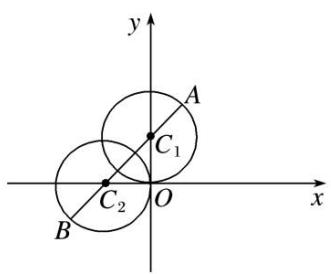

# 专题三 转化为直角坐标方程或普通方程可解决的问题

对于极坐标与参数方程等问题，通常的处理手段是将方程均转化为直角坐标系下的一般方程，然后利用传统的解析几何知识求解。要熟悉常见曲线的参数方程、极坐标方程，如：圆、椭圆、及过一点的直线，在研究直线与它们的位置关系，求曲线交点、距离、线段长等几何问题时，如果不能直接用极坐标(参数方程)解决，或解决较麻烦时常用的技巧是转化为直角坐标方程(普通方程)解决。

# 【例题选讲】

[例1] 在直角坐标系 $xOy$ 中，曲线 $C_1$ 的参数方程为 $\left\{ \begin{array}{l} x = -1 + \cos \alpha, \\ y = \sin \alpha \end{array} \right.$ ( $\alpha$ 为参数)，以原点 $O$ 为极点， $x$ 轴正半轴为极轴，建立极坐标系，直线 $l$ 的极坐标方程为 $\rho (\cos \theta + k\sin \theta) = -2 (k$ 为实数).  
（1）判断曲线 $C_{1}$ 与直线 l 的位置关系，并说明理由；  
（2）若曲线 $C_{1}$ 和直线 l 相交于 A, B 两点，且 $|AB|=\sqrt{2}$ ，求直线 l 的斜率.

[规范解答] （1）由曲线 $C_{1}$ 的参数方程 $\left\{\begin{aligned}x&=-1+\cos\alpha,\\ y&=\sin\alpha\end{aligned}\right.$ 可得其普通方程为 $(x+1)^{2}+y^{2}=1$ .
由 $\rho(\cos\theta+k\sin\theta)=-2$ 可得直线l的直角坐标方程为 $x+ky+2=0$ .
因为圆心 $(-1,0)$ 到直线l的距离 $d=\frac{1}{\sqrt{1+k^{2}}}\leq1$ ，所以直线与圆相交或相切，
当 k=0 时，d=1，直线 l 与曲线 $C_{1}$ 相切；当 $k\neq0$ 时，d<1，直线 l 与曲线 $C_{1}$ 相交.  
（2）由于曲线 $C_{1}$ 和直线 l 相交于 A, B 两点，且 $|AB|=\sqrt{2}$ ,
故圆心到直线 l 的距离 $d=\frac{1}{\sqrt{1+k^{2}}}=\sqrt{1-\left(\frac{\sqrt{2}}{2}\right)^{2}}=\frac{\sqrt{2}}{2}$ ，解得 $k=\pm1$ ，
所以直线 l 的斜率为 $\pm1$ .

[例 2] 在极坐标系中，圆 C 的方程为 $\rho=2a\cos\theta(a\neq0)$ ，以极点为坐标原点，极轴为 x 轴正半轴建立平面直角坐标系，设直线 l 的参数方程为 $\left\{\begin{aligned}x&=3t+1,\\ y&=4t+3\end{aligned}\right.$ (t 为参数).  
（1）求圆 C 的标准方程和直线 l 的普通方程;  
（2）若直线 l 与圆 C 恒有公共点，求实数 a 的取值范围.

[规范解答] （1）由 $\rho=2a\cos\theta,\quad\rho^{2}=2a\rho\cos\theta,$ 又 $\rho^{2}=x^{2}+y^{2},\quad\rho\cos\theta=x,$
所以圆 C 的标准方程为 $(x-a)^{2}+y^{2}=a^{2}$ . 由 $\left\{\begin{aligned}x=3t+1,\\ y=4t+3,\end{aligned}\right.$ 得 $\left\{\begin{aligned}\frac{x-1}{3}&=t,\\ \frac{y-3}{4}&=t,\end{aligned}\right.$
因此 $\frac{x-1}{3}=\frac{y-3}{4}$ ，所以直线l的普通方程为 $4x-3y+5=0$ .  
（2）因为直线 l 与圆 C 恒有公共点，所以 $\frac{|4a+5|}{\sqrt{4^{2}+3^{-2}}}\leq|a|$ ，两边平方得 $9a^{2}-40a-25\geq0$ ，
所以 $(9a+5)(a-5)\geq0$ ，解得 $a\leq-\frac{5}{9}$ 或 $a\geq5$ ，所以a的取值范围是 $\left(-\infty,-\frac{5}{9}\right]\cup[5,+\infty)$ .

[例 3] 在直角坐标系 xOy 中，已知曲线 $C_{1}:\left\{\begin{aligned}&x=\cos\alpha,\\ &y=\sin^{2}\alpha\end{aligned}\right.$ ( $\alpha$ 为参数)，在以坐标原点 O 为极点，x 轴正半轴为极轴的极坐标系中，曲线 $C_{2}:\rho\cos\left(\theta-\frac{\pi}{4}\right)=-\frac{\sqrt{2}}{2}$ ，曲线 $C_{3}:\rho=2\sin\theta$ .  
（1）求曲线 $C_{1}$ 与 $C_{2}$ 的交点 M 的直角坐标;  
（2）设点 A, B 分别为曲线 $C_{2}$ , $C_{3}$ 上的动点，求 $|AB|$ 的最小值.

[规范解答] （1）曲线 $C_{1}$ : $\left\{\begin{aligned}x&=\cos\alpha,\\ y&=\sin^{2}\alpha\end{aligned}\right.$ 消去参数a，得 $y+x^{2}=1,\quad x\in[-1,1]$ . ①

曲线 $C_{2}:\rho\cos\left(\theta-\frac{\pi}{4}\right)=-\frac{\sqrt{2}}{2}\Rightarrow x+y+1=0,$ ②
联立①②，消去 $v$ 可得： $x^{2} - x - 2 = 0$ ，解得 $x = -1$ 或 $x = 2$ （舍去），所以 $M(-1, 0)$ .  
（2）曲线 $C_{3}$ : $\rho=2\sin\theta$ 的直角坐标方程为 $x^{2}+(y-1)^{2}=1$ ，是以 $(0,1)$ 为圆心，半径 r=1 的圆.
设圆心为 C，则点 C 到直线 $x + y + 1 = 0$ 的距离 $d = \frac{|0 + 1 + 1|}{\sqrt{2}} = \sqrt{2}$ ，所以 $|AB|$ 的最小值为 $\sqrt{2} - 1$ .

[例 4] 极坐标系的极点为直角坐标系 xOy 的原点，极轴为 x 轴的正半轴，两种坐标系中的长度单位相同．已知曲线 C 的极坐标方程为 $\rho=2\sin\theta,\quad\theta\in[0,2\pi]$ .  
（1）求曲线 C 的直角坐标方程;  
（2）在曲线 C 上求一点 D，使它到直线 $l: \left\{\begin{aligned} x &= \sqrt{3}t + \sqrt{3}, \\ y &= -3t + 2 \end{aligned}\right.$ (t 为参数)的距离最短，写出 D 点的直角坐标.

[规范解答] （1）由 $\rho = 2\sin \theta$ 可得 $\rho^2 = 2\rho \sin \theta$ ，∴曲线 $C$ 的直角坐标方程为 $x^{2} + y^{2} - 2y = 0$  
（2）直线 l 的参数方程为 $\left\{\begin{aligned}x&=\sqrt{3}t+\sqrt{3},\\ y&=-3t+2\end{aligned}\right.$ (t 为参数)，消去 t 得 l 的普通方程为 $y=-\sqrt{3}x+5$ ,
由（1）得曲线 C 的圆心为(0, 1)，半径为 1，
又点(0, 1)到直线 l 的距离为 $\frac{|1-5|}{\sqrt{1+3}}=2>1$ ，所以曲线 C 与 l 相离.
设 $D(x_0, y_0)$ ，且点 $D$ 到直线 $l: y = -\sqrt{3} x + 5$ 的距离最短.
则曲线 C 在点 D 处的切线与直线 l: $v = -\sqrt{3}x + 5$ 平行.
$\therefore \frac {y _ {0} - 1}{x _ {0}} \cdot (- \sqrt {3}) = - 1, \text {又} x _ {0} ^ {2} + (y _ {0} - 1) ^ {2} = 1,$
$\therefore x_{0} = -\frac{\sqrt{3}}{2}$ (舍去)或 $x_0 = \frac{\sqrt{3}}{2},\therefore y_0 = \frac{3}{2},\therefore$ 点 $D$ 的直角坐标为 $\left[\frac{\sqrt{3}}{2},\frac{3}{2}\right].$

[例 5] 以原点 O 为极点，x 轴正半轴为极轴建立极坐标系，直线 l 的方程为 $\rho\sin\left(\theta-\frac{2\pi}{3}\right)=-\sqrt{3}$ ， $\odot C$ 的极坐标方程为 $\rho=4\cos\theta+2\sin\theta$ .  
（1）求直线 l 和 $\odot C$ 的直角坐标方程:  
（2）若直线 l 与圆 C 交于 A, B 两点，求弦 AB 的长.

[规范解答] （1） 直线 $l: \rho \sin \left( \theta - \frac{2\pi}{3} \right) = -\sqrt{3}, \therefore \rho \left( \sin \theta \cos \frac{2\pi}{3} - \cos \theta \sin \frac{2\pi}{3} \right) = -\sqrt{3}$ ,
$\therefore y \cdot \left(-\frac{1}{2}\right) - x \cdot \frac{\sqrt{3}}{2} = -\sqrt{3}$ ，即 $y = -\sqrt{3} x + 2\sqrt{3}$ .
$\odot C:\rho=4\cos\theta+2\sin\theta,\rho^{2}=4\rho\cos\theta+2\rho\sin\theta,\therefore x^{2}+y^{2}=4x+2y,$ 即 $x^{2}+y^{2}-4x-2y=0.$  
（2） $\odot C: x^{2}+y^{2}-4x-2y=0$ ，即 $(x-2)^{2}+(y-1)^{2}=5$ ，∴圆心 $C(2,1)$ ，半径 $R=\sqrt{5}$ ，
∴⊙C的圆心C到直线l的距离 $d=\frac{|1+2\sqrt{3}-2\sqrt{3}|}{\sqrt{(\sqrt{3})^{2}+1^{2}}}=\frac{1}{2}$
$\therefore |AB| = 2\sqrt{R^2 - d^2} = 2\sqrt{5 - \left(\frac{1}{2}\right)^2} = \sqrt{19},$ $\therefore$ 弦 $AB$ 的长为 $\sqrt{19}$

[例6] 已知曲线 $C$ 的参数方程为 $\left\{ \begin{array}{l} x = 3 + \sqrt{10}\cos \alpha, \\ y = 1 + \sqrt{10}\sin \alpha \end{array} \right.$ ( $\alpha$ 为参数)，以直角坐标系原点为极点， $x$ 轴正半轴为极轴建立极坐标系.  
（1）求曲线 C 的极坐标方程，并说明其表示什么轨迹；  
（2）若直线的极坐标方程为 $\sin\theta-\cos\theta=\frac{1}{\rho}$ ，求直线被曲线 C 截得的弦长.

[规范解答] （1）∵曲线C的参数方程为 $\left\{\begin{aligned}x&=3+\sqrt{10}\cos\alpha,\\ y&=1+\sqrt{10}\sin\alpha\end{aligned}\right.$ (α为参数),
∴曲线 C 的普通方程为 $(x-3)^{2}+(y-1)^{2}=10$ ，①

曲线 C 表示以(3,1)为圆心， $\sqrt{10}$ 为半径的圆．将 $\left\{\begin{aligned}x&=\rho\cos\theta,\\ y&=\rho\sin\theta\end{aligned}\right.$ 代入①并化简，得 $\rho=6\cos\theta+2\sin\theta$ ，即曲线 C 的极坐标方程为 $\rho=6\cos\theta+2\sin\theta$ .  
（2）∵直线的直角坐标方程为 y-x=1，∴圆心 C 到直线的距离为 $d=\frac{3\sqrt{2}}{2}$ ,
∴弦长为 $2\sqrt{10-\frac{9}{2}}=\sqrt{22}$ .

[例7] 在平面直角坐标系 $xOy$ 中，直线 $l$ 的参数方程为 $\left\{ \begin{array}{l} x = 1 + t\cos \alpha, \\ y = \sqrt{3} + t\sin \alpha \end{array} \right.$ （ $t$ 为参数），其中 $0 \leq \alpha < \pi$ ，在以 $O$ 为极点， $x$ 轴的正半轴为极轴的极坐标系中，曲线 $C_1: \rho = 4\cos \theta$ . 直线 $l$ 与曲线 $C_1$ 相切.  
（1）将曲线 $C_{1}$ 的极坐标方程化为直角坐标方程，并求 $\alpha$ 的值.  
（2）已知点 $Q(2,0)$ ，直线 l 与曲线 $C_{2}$ ： $x^{2}+\frac{y^{2}}{3}=1$ 交于 A，B 两点，求 $\triangle ABQ$ 的面积.

[规范解答] （1）曲线 $C_{1}:\rho=4\cos\theta$ ，即 $\rho^{2}=4\rho\cos\theta$ ，化为直角坐标方程为 $x^{2}+y^{2}=4x$
即 $C_{1}:(x-2)^{2}+y^{2}=4$ ，可得圆心(2,0)，半径 r=2，

直线 l 的参数方程为 $\left\{\begin{aligned} x &= 1 + t \cos \alpha, \\ y &= \sqrt{3} + t \sin \alpha \end{aligned}\right.$ (t 为参数)，其中 $0 \leq \alpha < \pi$ ,
由题意 l 与 $C_{1}$ 相切，可得普通方程为 $y-\sqrt{3}=k(x-1)$ ， $k=\tan\alpha$ ， $0\leq\alpha<\pi$ 且 $\alpha\neq\frac{\pi}{2}$
因为直线 l 与曲线 $C_{1}$ 相切，所以 $\frac{|k+\sqrt{3}|}{\sqrt{k^{2}+1}}=2$ ，所以 $k=\frac{\sqrt{3}}{3}$ ，所以 $\alpha=\frac{\pi}{6}$ .  
（2）直线 l 的方程为 $y=\frac{\sqrt{3}}{3}x+\frac{2\sqrt{3}}{3}$ ，代入曲线 $C_{2}: x^{2}+\frac{y^{2}}{3}=1$ ，整理可得 $10x^{2}+4x-5=0$ ，
设 $A(x_{1}, y_{1})$ ， $B(x_{2}, y_{2})$ ，则 $x_{1} + x_{2} = -\frac{2}{5}$ ， $x_{1} \cdot x_{2} = -\frac{1}{2}$
所以 $|AB|=\sqrt{1+\frac{1}{3}}\cdot\sqrt{\left(-\frac{2}{5}\right)^{2}-4\times\left(-\frac{1}{2}\right)}=\frac{6\sqrt{2}}{5}$ ，Q到直线的距离 $d=\frac{\frac{4\sqrt{3}}{3}}{\sqrt{\frac{1}{3}+1}}=2$
所以 $\triangle ABQ$ 的面积 $S = \frac{1}{2} \times \frac{6\sqrt{2}}{5} \times 2 = \frac{6\sqrt{2}}{5}$ .

[例8] 在直角坐标系 $xOy$ 中，曲线 $C$ 的参数方程为 $\left\{ \begin{array}{l} x = 4\cos \theta \\ y = 2\sin \theta \end{array} \right.$ ( $\theta$ 为参数)，直线 $l$ 的参数方程为 $\left\{ \begin{array}{l} x = t + \sqrt{3}, \\ y = 2t - 2\sqrt{3} \end{array} \right.$ ( $t$ 为参数)，直线 $l$ 与曲线 $C$ 交于 $A$ ， $B$ 两点.  
（1）求 $|AB|$ 的值;  
（2）若 F 为曲线 C 的左焦点，求 $\overrightarrow{FA} \cdot \overrightarrow{FB}$ 的值.

[规范解答] （1）由 $\left\{\begin{aligned}x=4\cos\theta\\ y=2\sin\theta\end{aligned}\right.$ ( $\theta$ 为参数)，消去参数 $\theta$ 得 $\frac{x^{2}}{16}+\frac{y^{2}}{4}=1$ .
由 $\left\{\begin{aligned}x=t+\sqrt{3},\\ y=2t-2\sqrt{3}\end{aligned}\right.$ 消去参数 t 得 $y=2x-4\sqrt{3}$ .
将 $y=2x-4\sqrt{3}$ 代入 $x^{2}+4y^{2}=16$ 中，得 $17x^{2}-64\sqrt{3}x+176=0$ .
设 $A(x_{1}, y_{1}), B(x_{2}, y_{2})$ ，则 $\left\{\begin{aligned}x_{1}+x_{2}&=\frac{64\sqrt{3}}{17},\\ x_{1}x_{2}&=\frac{176}{17}.\end{aligned}\right.$
所以 $|AB|=\sqrt{1+2^{2}}|x_{1}-x_{2}|=\frac{\sqrt{1+4}}{17}\times\sqrt{(64\sqrt{3})^{2}-4\times17\times176}=\frac{40}{17}$ ，所以 $|AB|$ 的值为 $\frac{40}{17}$ .  
（2）由（1）得， $F(-2\sqrt{3},0)$ ，则 $\overrightarrow{FA}\cdot\overrightarrow{FB}=(x_{1}+2\sqrt{3},y_{1})\cdot(x_{2}+2\sqrt{3},y_{2})$
$= (x _ {1} + 2 \sqrt {3}) (x _ {2} + 2 \sqrt {3}) + (2 x _ {1} - 4 \sqrt {3}) (2 x _ {2} - 4 \sqrt {3}) = x _ {1} x _ {2} + 2 \sqrt {3} (x _ {1} + x _ {2}) + 1 2 + 4 [ x _ {1} x _ {2} - 2 \sqrt {3} (x _ {1} + x _ {2}) + 1 2 ]$
$= 5 x _ {1} x _ {2} - 6 \sqrt {3} \left(x _ {1} + x _ {2}\right) + 6 0 = 5 \times \frac {1 7 6}{1 7} - 6 \sqrt {3} \times \frac {6 4 \sqrt {3}}{1 7} + 6 0 = 4 4,$
所以 $\overrightarrow{FA}\cdot\overrightarrow{FB}$ 的值为44.

# 【对点训练】

1. 在平面直角坐标系中，以坐标原点 $O$ 为极点， $x$ 轴的正半轴为极轴建立极坐标系。已知直

线 l 上两点 M, N 的极坐标分别为 $(2, 0)$ , $\left(\frac{2\sqrt{3}}{3}, \frac{\pi}{2}\right)$ ，圆 C 的参数方程为 $\left\{\begin{aligned} x &= 2 + 2\cos\theta, \\ y &= -\sqrt{3} + 2\sin\theta \end{aligned}\right.$ ( $\theta$ 为参数).  
（1）设 P 为线段 MN 的中点，求直线 OP 的平面直角坐标方程；  
（2）判断直线 l 与圆 C 的位置关系.

1. 解析 由题意知， $M, N$ 的平面直角坐标分别为 $(2, 0)$ ， $(0, \frac{2\sqrt{3}}{3})$ 。又 $P$ 为线段 $MN$ 的中点，从而点 $P$ 的平面直角坐标为 $(1, \frac{\sqrt{3}}{3})$ ，故直线 $OP$ 的平面直角坐标方程为 $y = \frac{\sqrt{3}}{3}x$ 。  
（2）因为直线 l 上两点 M, N 的平面直角坐标分别为 $(2, 0)$ , $(0, \frac{2\sqrt{3}}{3})$ ,
所以直线 l 的平面直角坐标方程为 $\sqrt{3}x + 3y - 2\sqrt{3} = 0$ 。又圆 C 的圆心坐标为 $(2, -\sqrt{3})$ ，半径 r = 2，圆心到直线 l 的距离 $d = \frac{|2\sqrt{3} - 3\sqrt{3} - 2\sqrt{3}|}{\sqrt{3 + 9}} = \frac{3}{2} < r$ ，故直线 l 与圆 C 相交。

2. 已知直线 $l$ 的参数方程为 $\left\{ \begin{array}{l} x = a - 2t, \\ y = -4t \end{array} \right.$ ( $t$ 为参数), 圆 $C$ 的参数方程为 $\left\{ \begin{array}{l} x = 4\cos \theta, \\ y = 4\sin \theta \end{array} \right.$ ( $\theta$ 为参数).  
（1）求直线 l 和圆 C 的普通方程;  
（2）若直线 l 与圆 C 有公共点，求实数 a 的取值范围.

2. 解析 （1） 直线 $l$ 的普通方程为 $2x - y - 2a = 0$ ，圆 $C$ 的普通方程为 $x^{2} + y^{2} = 16$ .  
（2）因为直线 l 与圆 C 有公共点，故圆 C 的圆心到直线 l 的距离 $d=\frac{|-2a|}{\sqrt{5}}\leq4$ ，解得 $-2\sqrt{5}\leq a\leq2\sqrt{5}$ .

3. 在平面直角坐标系 $xOy$ 中，圆 $C$ 的参数方程为 $\left\{ \begin{array}{l} x = m + 2\cos \alpha, \\ y = 2\sin \alpha \end{array} \right.$ ( $\alpha$ 为参数， $m$ 为常数). 以原点 $O$ 为极点，以 $x$ 轴的非负半轴为极轴的极坐标系中，直线 $l$ 的极坐标方程为 $\rho \cos \left( \theta - \frac{\pi}{4} \right) = \sqrt{2}$ . 若直线 $l$ 与圆 $C$ 有两个公共点，求实数 $m$ 的取值范围.

3. 解析 圆 $C$ 的普通方程为 $(x - m)^2 + y^2 = 4$ ，直线 $l$ 的极坐标方程化为 $\rho \left[ \frac{\sqrt{2}}{2} \cos \theta + \frac{\sqrt{2}}{2} \sin \theta \right] = \sqrt{2}$ ，即 $\frac{\sqrt{2}}{2} x + \frac{\sqrt{2}}{2} y = \sqrt{2}$ ，化简得 $x + y - 2 = 0$ .
因为圆 C 的圆心为 $C(m, 0)$ ，半径为 2，圆心 C 到直线 l 的距离 $d = \frac{|m - 2|}{\sqrt{2}}$ ,

直线 l 与圆 C 有两个公共点，所以 $d=\frac{|m-2|}{\sqrt{2}}<2$ ，解得 $2-2\sqrt{2}<m<2+2\sqrt{2}$ ，
即实数 m 的取值范围是 $(2-2\sqrt{2}, 2+2\sqrt{2})$

4. 在极坐标系中，已知三点 $O(0, 0)$ ， $A\left(2, \frac{\pi}{2}\right)$ ， $B\left(2\sqrt{2}, \frac{\pi}{4}\right)$ .  
（1）求经过点 O, A, B 的圆 $C_{1}$ 的极坐标方程;  
（2）以极点为坐标原点，极轴为 $x$ 轴的正半轴建立平面直角坐标系，圆 $C_2$ 的参数方程为 $\left\{ \begin{array}{l} x = -1 + a\cos \theta, \\ y = -1 + a\sin \theta \end{array} \right.$ ( $\theta$ 是参数)，若圆 $C_1$ 与圆 $C_2$ 外切，求实数 $a$ 的值.

4. 解析 （1） $O(0, 0)$ , $A\left[2, \frac{\pi}{2}\right]$ , $B\left[2\sqrt{2}, \frac{\pi}{4}\right]$ 对应的直角坐标分别为 $O(0, 0)$ , $A(0, 2)$ , $B(2, 2)$ ,
则过点 O, A, B 的圆的普通方程为 $x^{2}+y^{2}-2x-2y=0$ ，将 $\left\{\begin{aligned}x&=\rho\cos\theta,\\ y&=\rho\sin\theta\end{aligned}\right.$
代入可求得经过点 O, A, B 的圆 $C_{1}$ 的极坐标方程为 $\rho = 2\sqrt{2}\cos\left(\theta - \frac{\pi}{4}\right)$ .  
（2）圆 $C_2$ ： $\left\{ \begin{array}{l}x = -1 + a\cos \theta ,\\ y = -1 + a\sin \theta \end{array} \right.$ （ $\theta$ 是参数)对应的普通方程为 $(x + 1)^{2} + (y + 1)^{2} = a^{2},$

圆心为 $(-1,-1)$ ，半径为 $|a|$ ，而圆 $C_{1}$ 的圆心为 $(1,1)$ ，半径为 $\sqrt{2}$ ，
所以当圆 $C_{1}$ 与圆 $C_{2}$ 外切时，有 $\sqrt{2} + |a| = \sqrt{(-1 - 1)^{2} + (-1 - 1)^{2}}$ ，解得 $a = \pm \sqrt{2}$ .

5. (2018·全国 I) 在直角坐标系 $xOy$ 中, 曲线 $C_1$ 的方程为 $y = k|x| + 2$ . 以坐标原点为极点, $x$ 轴正半轴为

极轴建立极坐标系，曲线 $C_{2}$ 的极坐标方程为 $\rho^{2}+2\rho\cos\theta-3=0$ .  
（1）求 $C_{2}$ 的直角坐标方程;  
（2）若 $C_{1}$ 与 $C_{2}$ 有且仅有三个公共点，求 $C_{1}$ 的方程.

5. 解析 （1）由 $x = \rho \cos \theta, y = \rho \sin \theta$ 得 $C_2$ 的直角坐标方程为 $(x + 1)^2 + y^2 = 4$ .  
（2）由（1）知 $C_{2}$ 是圆心为 $A(-1, 0)$ ，半径为 2 的圆.
由题设知， $C_{1}$ 是过点 $B(0, 2)$ 且关于 y 轴对称的两条射线.

记 y 轴右边的射线为 $l_{1}$ ，y 轴左边的射线为 $l_{2}$ ，由于 B 在圆 $C_{2}$ 的外面，
故 $C_{1}$ 与 $C_{2}$ 有且仅有三个公共点等价于 $l_{1}$ 与 $C_{2}$ 只有一个公共点且 $l_{2}$ 与 $C_{2}$ 有两个公共点，

或 $l_{2}$ 与 $C_{2}$ 只有一个公共点且 $l_{1}$ 与 $C_{2}$ 有两个公共点.
当 $l_{1}$ 与 $C_2$ 只有一个公共点时， $A$ 到 $l_{1}$ 所在直线的距离为 2，所以 $\frac{|-k+2|}{\sqrt{k^2+1}} = 2$ ，故 $k = -\frac{4}{3}$ 或 $k = 0$ .
经检验，当 k=0 时， $l_{1}$ 与 $C_{2}$ 没有公共点；
当 $k=-\frac{4}{3}$ 时， $l_{1}$ 与 $C_{2}$ 只有一个公共点， $l_{2}$ 与 $C_{2}$ 有两个公共点.
当 $l_{2}$ 与 $C_2$ 只有一个公共点时， $A$ 到 $l_{2}$ 所在直线的距离为 2，所以 $\frac{|k + 2|}{\sqrt{k^2 + 1}} = 2$ ，故 $k = 0$ 或 $k = \frac{4}{3}$ .
经检验，当 k=0 时， $l_{1}$ 与 $C_{2}$ 没有公共点；当 $k=\frac{4}{3}$ 时， $l_{2}$ 与 $C_{2}$ 没有公共点.

综上，所求 $C_{1}$ 的方程为 $y=-\frac{4}{3}|x|+2$ .

6. 在直角坐标系 $xOy$ 中，曲线 $C_1: \begin{cases} x = t\cos \alpha, \\ y = t\sin \alpha \end{cases}$ ( $t$ 为参数， $t \neq 0$ )，其中 $0 \leq \alpha < \pi$ ，在以 $O$ 为极点， $x$ 轴正半轴为极轴的极坐标系中，曲线 $C_2: \rho = 2\sin \theta$ ，曲线 $C_3: \rho = 2\sqrt{3}\cos \theta$ .  
（1）求 $C_{2}$ 与 $C_{3}$ 交点的直角坐标;  
（2）若 $C_{1}$ 与 $C_{2}$ 相交于点 A， $C_{1}$ 与 $C_{3}$ 相交于点 B，求 $|AB|$ 的最大值.

6. 解析 （1） 曲线 $C_{2}$ 的直角坐标方程为 $x^{2} + y^{2} - 2y = 0$ ,

曲线 $C_{3}$ 的直角坐标方程为 $x^{2}+y^{2}-2\sqrt{3}x=0$ .
联立 $\left\{\begin{aligned}x^{2}+y^{2}-2y=0,\\ x^{2}+y^{2}-2\sqrt{3}x=0,\end{aligned}\right.$ 解得 $\left\{\begin{aligned}x=0,\\ y=0,\end{aligned}\right.$ 或 $\left\{\begin{aligned}x=\frac{\sqrt{3}}{2},\\ y=\frac{3}{2}.\end{aligned}\right.$ 所以 $C_{2}$ 与 $C_{3}$ 交点的直角坐标为 $(0,0)$ 和 $\left(\frac{\sqrt{3}}{2},\frac{3}{2}\right)$ .  
（2）曲线 $C_{1}$ 的极坐标方程为 $\theta=\alpha(\rho\in\mathbf{R},\quad\rho\neq0)$ ，其中 $0\leq\alpha<\pi$ .
因此 A 的极坐标为 $(2\sin\alpha, \alpha)$ ，B 的极坐标为 $(2\sqrt{3}\cos\alpha, \alpha)$ .
所以 $|AB|=|2\sin\alpha-2\sqrt{3}\cos\alpha|=4|\sin\left(\alpha-\frac{\pi}{3}\right)|$ 。当 $\alpha=\frac{5\pi}{6}$ 时， $|AB|$ 取得最大值，最大值为4。

7. 在直角坐标系 $xOy$ 中，曲线 $C$ 的参数方程为 $\left\{ \begin{array}{l} x = \sin \alpha + \cos \alpha, \\ y = \sin \alpha - \cos \alpha \end{array} \right.$ ( $\alpha$ 为参数).  
（1）求曲线 C 的普通方程;  
（2）在以 O 为极点，x 轴正半轴为极轴的极坐标系中，直线 l 的方程为 $\sqrt{2}\rho\sin\left(\frac{\pi}{4}-\theta\right)+\frac{1}{2}=0$ ，已知直线 l 与曲线 C 相交于 A，B 两点，求 $|AB|$ .

7. 解析 （1）由 $\left\{ \begin{array}{l} x = \sin \alpha + \cos \alpha, \\ y = \sin \alpha - \cos \alpha \end{array} \right.$ ( $\alpha$ 为参数)得 $\sin \alpha = \frac{x + y}{2}, \cos \alpha = \frac{x - y}{2}$ ,
将两式平方相加得 $1 = \left(\frac{x + y}{2}\right)^2 +\left(\frac{x - y}{2}\right)^2$ ，化简得 $x^{2} + y^{2} = 2$ ，故曲线 $C$ 的普通方程为 $x^{2} + y^{2} = 2$  
（2）由 $\sqrt{2}\rho \sin \left(\frac{\pi}{4} -\theta\right) + \frac{1}{2} = 0$ ，知 $\rho (\cos \theta -\sin \theta) + \frac{1}{2} = 0$ ，化为直角坐标方程为 $x - y + \frac{1}{2} = 0$

圆心到直线 l 的距离 $d=\frac{\sqrt{2}}{4}$ ，由垂径定理得 $|AB|=\frac{\sqrt{30}}{2}$ .

8. 在平面直角坐标系 $xOy$ 中，曲线 $C_1$ 的参数方程为 $\left\{ \begin{array}{l} x = 2t - 1, \\ y = -4t - 2 \end{array} \right.$ ( $t$ 为参数)，以坐标原点 $O$ 为极点， $x$ 轴

的正半轴为极轴建立极坐标系，曲线 $C_{2}$ 的极坐标方程为 $\rho=\frac{2}{1-\cos\theta}$ .  
（1）求曲线 $C_{2}$ 的直角坐标方程;  
（2）设 $M_{1}$ 是曲线 $C_{1}$ 上的点， $M_{2}$ 是曲线 $C_{2}$ 上的点，求 $|M_{1}M_{2}|$ 的最小值.

8. 解析 （1） $\because \rho = \frac{2}{1 - \cos\theta}, \therefore \rho - \rho \cos \theta = 2$ ，即 $\rho = \rho \cos \theta + 2$ .
$\because x=\rho\cos\theta,\quad\rho^{2}=x^{2}+y^{2},\quad\therefore x^{2}+y^{2}=(x+2)^{2},\quad 化简得 y^{2}-4x-4=0.$
∴曲线 $C_{2}$ 的直角坐标方程为 $y^{2}-4x-4=0$ .  
（2） $\because\left\{\begin{aligned}x=2t-1,\\ y=-4t-2\end{aligned}\right.$ (t为参数), $\therefore2x+y+4=0.$
∴曲线 $C_{1}$ 的普通方程为 $2x+y+4=0$ ，表示直线 $2x+y+4=0$ .
$\because M_{1}$ 是曲线 $C_{1}$ 上的点， $M_{2}$ 是曲线 $C_{2}$ 上的点，
∴ $|M_{1}M_{2}|$ 的最小值等于点 $M_{2}$ 到直线 $2x+y+4=0$ 的距离的最小值.
不妨设 $M_{2}(r^{2}-1, 2r)$ ，点 $M_{2}$ 到直线 $2x+y+4=0$ 的距离为 d，
则 \(d = \frac{2|r^2 + r + 1|}{\sqrt{5}} = \frac{2\left[\left(r + \frac{1}{2}\right)^2 + \frac{3}{4}\right]}{\sqrt{5}} \geqslant \frac{3}{2\sqrt{5}} = \frac{3\sqrt{5}}{10}\)，当且仅当 \(r = -\frac{1}{2}\) 时取等号。\$\therefore |M\_1M\_2|\) 的最小值为 \(\frac{3\sqrt{5}}{10}\).

9. 在直角坐标系 $xOy$ 中，以 $O$ 为极点， $x$ 轴正半轴为极轴建立极坐标系，圆 $C$ 的极坐标方程为 $\rho = 2\sqrt{2}\cos \left(\theta + \frac{\pi}{4}\right)$ ，直线 $l$ 的参数方程为 $\left\{ \begin{array}{l} x = t, \\ y = -1 + 2\sqrt{2}t \end{array} \right.$ ( $t$ 为参数)，直线 $l$ 和圆 $C$ 交于 $A$ ， $B$ 两点， $P$ 是圆 $C$ 上不同于 $A$ ， $B$ 的任意一点.  
（1）求圆心的极坐标;  
（2）求 $\triangle PAB$ 面积的最大值.

9. 解析 （1）由圆 $C$ 的极坐标方程为 $\rho = 2\sqrt{2}\cos \left(\theta + \frac{\pi}{4}\right)$ ，得 $\rho^2 = 2\sqrt{2}\left(\frac{\sqrt{2}}{2}\rho \cos \theta - \frac{\sqrt{2}}{2}\rho \sin \theta\right)$ ,

把 $\left\{\begin{aligned}x&=\rho\cos\theta,\\ y&=\rho\sin\theta\end{aligned}\right.$ 代入可得圆C的直角坐标方程为 $x^{2}+y^{2}-2x+2y=0$ ,
即 $(x-1)^{2}+(y+1)^{2}=2.\therefore$ 圆心坐标为 $(1,-1),\therefore$ 圆心的极坐标为 $\left(\sqrt{2},\frac{7\pi}{4}\right)$ .  
（2）由题意，得直线 l 的直角坐标方程为 $2\sqrt{2}x - y - 1 = 0$ .
∴圆心(1，-1)到直线 l 的距离 $d=\frac{|2\sqrt{2}+1-1|}{\sqrt{(2\sqrt{2}^{2}+(-1)^{2}}}=2\frac{\sqrt{2}}{3}$ ，∴ $AB=2\sqrt{r^{2}-d^{2}}=2\sqrt{2-\frac{8}{9}}=\frac{2\sqrt{10}}{3}$ .

点 P 到直线 l 的距离的最大值为 $r+d=\sqrt{2}+\frac{2\sqrt{2}}{3}=\frac{5\sqrt{2}}{3}$ ,
$\therefore S _ {\max} = \frac {1}{2} \times \frac {2 \sqrt {1 0}}{3} \times \frac {5 \sqrt {2}}{3} = \frac {1 0 \sqrt {5}}{9}.$

10. 已知曲线 $C_1$ 的参数方程是 $\left\{ \begin{array}{l} x = 2\cos \theta, \\ y = 2 + 2\sin \theta \end{array} \right.$ ( $\theta$ 为参数), 以直角坐标原点为极点, $x$ 轴的正半轴为极轴建立极坐标系, 曲线 $C_2$ 的极坐标方程是 $\rho = -4\cos \theta$ .  
（1）求曲线 $C_{1}$ 与 $C_{2}$ 的交点的极坐标;  
（2） $A, B$ 两点分别在曲线 $C_1$ 与 $C_2$ 上，当 $|AB|$ 最大时，求 $\triangle OAB$ 的面积 ( $O$ 为坐标原点).

10. 解析 （1）由 $\left\{\begin{aligned}x&=2\cos\theta,\\ y&=2+2\sin\theta,\end{aligned}\right.$ 得 $\left\{\begin{aligned}x&=2\cos\theta,\\ y&-2=2\sin\theta,\end{aligned}\right.$ 两式平方相加，得
$x ^ {2} + (y - 2) ^ {2} = 4, \text {即} x ^ {2} + y ^ {2} - 4 y = 0. \tag {①}$
由 $\rho=-4\cos\theta$ ，得 $\rho^{2}=-4\rho\cos\theta$ ，即 $x^{2}+y^{2}=-4x$ 。②

①-②得 $x + y = 0$ ，代入①得交点为 $(0,0),(-2,2)$ .其极坐标为 $(0,0),\left[2\sqrt{2},\frac{3\pi}{4}\right].$  
（2）如图．由平面几何知识可知， $A$ ， $C_1$ ， $C_2$ ， $B$ 依次排列且共线时 $|AB|$ 最大，
此时 $|AB|=2\sqrt{2}+4$ ，点O到AB的距离为 $\sqrt{2}$ ．∴ $\triangle OAB$ 的面积为 $S=\frac{1}{2}\times(2\sqrt{2}+4)\times\sqrt{2}=2+2\sqrt{2}$

11. 已知曲线 $C_1$ 的参数方程为 $\left\{ \begin{array}{l} x = -2 - \frac{\sqrt{3}}{2} t, \\ y = \frac{1}{2} t, \end{array} \right.$ 曲线 $C_2$ 的极坐标方程为 $\rho = 2\sqrt{2}\cos \theta - \frac{\pi}{4}$ ，以极点为坐标原点，极轴为 $x$ 轴正半轴建立平面直角坐标系.  
（1）求曲线 $C_{2}$ 的直角坐标方程;  
（2）求曲线 $C_{2}$ 上的动点 M 到曲线 $C_{1}$ 的距离的最大值.

11. 解析 $（1）\rho = 2\sqrt{2}\cos \left(\theta -\frac{\pi}{4}\right) = 2(\cos \theta +\sin \theta)$ ，即 $\rho^2 = 2(\rho \cos \theta +\rho \sin \theta)$ ，可得 $x^{2} + y^{2} - 2x - 2y = 0$ 故 $C_2$ 的直角坐标方程为 $(x - 1)^2 +(y - 1)^2 = 2.$  
（2） $C_{1}$ 的普通方程为 $x+\sqrt{3}y+2=0$ ，由（1）知曲线 $C_{2}$ 是以(1,1)为圆心，以 $\sqrt{2}$ 为半径的圆，

且圆心到直线 $C_{1}$ 的距离 $d=\frac{|1+\sqrt{3}+2|}{\sqrt{1^{2}+(\sqrt{3})^{2}}}=\frac{3+\sqrt{3}}{2}$ ,
所以动点 M 到曲线 $C_{1}$ 的距离的最大值为 $\frac{3+\sqrt{3}+2\sqrt{2}}{2}$ .

12. 在平面直角坐标系 $xOy$ 中， $C_1: \begin{cases} x = t, \\ y = k(t - 1) \end{cases}$ (t 为参数). 以原点 $O$ 为极点， $x$ 轴的正半轴为极轴建立极坐标系，已知曲线 $C_2: \rho^2 + 10\rho \cos \theta - 6\rho \sin \theta + 33 = 0$ .  
（1）求 $C_{1}$ 的普通方程及 $C_{2}$ 的直角坐标方程，并说明它们分别表示什么曲线；  
（2）若 P, Q 分别为 $C_{1}$ , $C_{2}$ 上的动点，且 $|PQ|$ 的最小值为 2，求 k 的值.

12. 解析 （1）由 $\left\{ \begin{array}{l} x = t, \\ y = k(t - 1) \end{array} \right.$ 可得其普通方程为 $y = k(x - 1)$ ，它表示过定点(1，0)，斜率为 $k$ 的直线。由 $\rho^2 + 10\rho \cos \theta - 6\rho \sin \theta + 33 = 0$ 可得其直角坐标方程为 $x^2 + y^2 + 10x - 6y + 33 = 0$ 整理得 $(x + 5)^2 + (y - 3)^2 = 1$ ，它表示圆心为(-5,3)，半径为1的圆。  
（2）因为圆心 $(-5, 3)$ 到直线 $y = k(x - 1)$ 的距离 $d = \frac{|-6k - 3|}{\sqrt{1 + k^2}} = \frac{|6k + 3|}{\sqrt{1 + k^2}}$ ，故 $|PQ|$ 的最小值为 $\frac{|6k + 3|}{\sqrt{1 + k^2}} - 1$ 故 $\frac{|6k + 3|}{\sqrt{1 + k^2}} - 1 = 2$ ，得 $3k^2 + 4k = 0$ ，解得 $k = 0$ 或 $k = -\frac{4}{3}$ .

13. 已知曲线 $C$ 的极坐标方程为 $\rho = 4\cos \theta$ ，以极点为原点，极轴为 $x$ 轴正半轴建立平面直角坐标系，设

直线 l 的参数方程为 $\left\{\begin{aligned} x &= 5 + \frac{\sqrt{3}}{2}t, \\ y &= \frac{1}{2}t \end{aligned}\right.$ (t 为参数).  
（1）求曲线 C 的直角坐标方程与直线 l 的普通方程;  
（2）设曲线 C 与直线 l 相交于 P, Q 两点，以 PQ 为一条边作曲线 C 的内接矩形，求该矩形的面积.

13. 解析 （1）由 $\rho = 4\cos \theta$ ，得 $\rho^2 = 4\rho \cos \theta$ ，即曲线 $C$ 的直角坐标方程为 $x^{2} + y^{2} = 4x$
由 $\left\{\begin{aligned}x&=5+\frac{\sqrt{3}}{2}t,\\ y&=\frac{1}{2}t\end{aligned}\right.$ (t为参数)，得 $y=\frac{1}{\sqrt{3}}(x-5)$ ，即直线l的普通方程为 $x-\sqrt{3}y-5=0$ .  
（2）由（1）可知 C 为圆，且圆心坐标为(2,0)，半径为 2，则弦心距 $d=\frac{|2-\sqrt{3}\times0-5|}{\sqrt{1+3}}=\frac{3}{2}$ ,

弦长 $|PQ|=2\sqrt{2^{2}-(\frac{3}{2})^{2}}=\sqrt{7}$ ，因此以PQ为一条边的圆C的内接矩形面积 $S=2d\cdot|PQ|=3\sqrt{7}$ .

