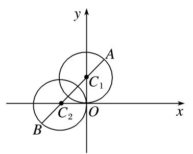

专题三　转化为直角坐标方程或普通方程可解决的问题

对于极坐标与参数方程等问题，通常的处理手段是将方程均转化为直角坐标系下的一般方程，然后利用传统的解析几何知识求解．要熟悉常见曲线的参数方程、极坐标方程，如：圆、椭圆、及过一点的直线，在研究直线与它们的位置关系，求曲线交点、距离、线段长等几何问题时，如果不能直接用极坐标(参数方程)解决，或解决较麻烦时常用的技巧是转化为直角坐标方程(普通方程)解决．

【例题选讲】

<strong>[例1]</strong>　在直角坐标系<em>xOy</em>中，曲线<em>C</em>1的参数方程为(<em>α</em>为参数)，以原点<em>O</em>为极点，<em>x</em>轴正半轴为极轴，建立极坐标系，直线<em>l</em>的极坐标方程为<em>ρ</em>(cos <em>θ</em>＋<em>k</em>sin <em>θ</em>)＝－2(<em>k</em>为实数)．  
（1）判断曲线<em>C</em>1与直线<em>l</em>的位置关系，并说明理由；  
（2）若曲线<em>C</em>1和直线<em>l</em>相交于<em>A</em>，<em>B</em>两点，且|<em>AB</em>|＝，求直线<em>l</em>的斜率．

<strong>[规范解答]</strong>　（1）由曲线<em>C</em>1的参数方程可得其普通方程为(<em>x</em>＋1)2＋<em>y</em>2＝1.
由*ρ*(cos *θ*＋*k*sin *θ*)＝－2可得直线*l*的直角坐标方程为*x*＋*ky*＋2＝0.
因为圆心(－1,0)到直线*l*的距离*d*＝≤1，所以直线与圆相交或相切，
当<em>k</em>＝0时，<em>d</em>＝1，直线<em>l</em>与曲线<em>C</em>1相切；当<em>k</em>≠0时，<em>d</em>&lt;1，直线<em>l</em>与曲线<em>C</em>1相交．  
（2）由于曲线<em>C</em>1和直线<em>l</em>相交于<em>A</em>，<em>B</em>两点，且|<em>AB</em>|＝，
故圆心到直线*l*的距离*d*＝＝ ＝，解得*k*＝±1，
所以直线*l*的斜率为±1．

<strong>[例2]</strong>　在极坐标系中，圆<em>C</em>的方程为<em>ρ</em>＝2<em>a</em>cos <em>θ</em>(<em>a</em>≠0)，以极点为坐标原点，极轴为<em>x</em>轴正半轴建立平面直角坐标系，设直线<em>l</em>的参数方程为(<em>t</em>为参数)．  
（1）求圆*C*的标准方程和直线*l*的普通方程；  
（2）若直线*l*与圆*C*恒有公共点，求实数*a*的取值范围．

<strong>[规范解答]</strong>　（1）由<em>ρ</em>＝2<em>a</em>cos <em>θ</em>，<em>ρ</em>2＝2<em>aρ</em>cos <em>θ</em>，又<em>ρ</em>2＝<em>x</em>2＋<em>y</em>2，<em>ρ</em>cos <em>θ</em>＝<em>x</em>，
所以圆<em>C</em>的标准方程为(<em>x</em>－<em>a</em>)2＋<em>y</em>2＝<em>a</em>2.由得
因此＝，所以直线*l*的普通方程为4*x*－3*y*＋5＝0．  
（2）因为直线<em>l</em>与圆<em>C</em>恒有公共点，所以≤|<em>a</em>|，两边平方得9<em>a</em>2－40<em>a</em>－25≥0，
所以(9*a*＋5)(*a*－5)≥0，解得*a*≤－或*a*≥5，所以*a*的取值范围是∪．

<strong>[例3]</strong>　在直角坐标系<em>xOy</em>中，已知曲线<em>C</em>1：(<em>α</em>为参数)，在以坐标原点<em>O</em>为极点，<em>x</em>轴正半轴为极轴的极坐标系中，曲线<em>C</em>2：<em>ρ</em>cos＝－，曲线<em>C</em>3：<em>ρ</em>＝2sin <em>θ</em>．  
（1）求曲线<em>C</em>1与<em>C</em>2的交点<em>M</em>的直角坐标；  
（2）设点<em>A</em>，<em>B</em>分别为曲线<em>C</em>2，<em>C</em>3上的动点，求|<em>AB</em>|的最小值．

<strong>[规范解答]</strong>　（1）曲线<em>C</em>1：消去参数<em>α</em>，得<em>y</em>＋<em>x</em>2＝1，<em>x</em>∈[－1，1]．①

曲线<em>C</em>2：<em>ρ</em>cos＝－⇒<em>x</em>＋<em>y</em>＋1＝0，②
联立①②，消去<em>y</em>可得：<em>x</em>2－<em>x</em>－2＝0，解得<em>x</em>＝－1或<em>x</em>＝2(舍去)，所以<em>M</em>(－1，0)．  
（2）曲线<em>C</em>3：<em>ρ</em>＝2sin <em>θ</em>的直角坐标方程为<em>x</em>2＋(<em>y</em>－1)2＝1，是以(0，1)为圆心，半径<em>r</em>＝1的圆．
设圆心为*C*，则点*C*到直线*x*＋*y*＋1＝0的距离*d*＝＝，所以|*AB*|的最小值为－1．

<strong>[例4]</strong>　极坐标系的极点为直角坐标系<em>xOy</em>的原点，极轴为<em>x</em>轴的正半轴，两种坐标系中的长度单位相同．已知曲线<em>C</em>的极坐标方程为<em>ρ</em>＝2sin<em>θ</em>，<em>θ</em>∈[0，2π]．  
（1）求曲线*C*的直角坐标方程；  
（2）在曲线*C*上求一点*D*，使它到直线*l*：(*t*为参数)的距离最短，写出*D*点的直角坐标．

<strong>[规范解答]</strong>　（1）由<em>ρ</em>＝2sin<em>θ</em>可得<em>ρ</em>2＝2<em>ρ</em>sin<em>θ</em>，∴曲线<em>C</em>的直角坐标方程为<em>x</em>2＋<em>y</em>2－2<em>y</em>＝0．  
（2）直线*l*的参数方程为(*t*为参数)，消去*t*得*l*的普通方程为*y*＝－*x*＋5，
由（1）得曲线*C*的圆心为(0，1)，半径为1，
又点(0，1)到直线l的距离为＝2＞1，所以曲线*C*与*l*相离．
设<em>D</em>(<em>x</em>0，<em>y</em>0)，且点<em>D</em>到直线<em>l</em>：<em>y</em>＝－<em>x</em>＋5的距离最短，
则曲线*C*在点*D*处的切线与直线*l*：*y*＝－*x*＋5平行，
∴·(－)＝－1，又<em>x</em>＋(<em>y</em>0－1)2＝1，
∴<em>x</em>0＝－(舍去)或<em>x</em>0＝，∴<em>y</em>0＝，∴点<em>D</em>的直角坐标为．

<strong>[例5]</strong>　以原点<em>O</em>为极点，<em>x</em>轴正半轴为极轴建立极坐标系，直线<em>l</em>的方程为<em>ρ</em>sin＝－，⊙<em>C</em>的极坐标方程为<em>ρ</em>＝4cos <em>θ</em>＋2sin <em>θ</em>．  
（1）求直线*l*和⊙*C*的直角坐标方程；  
（2）若直线*l*与圆*C*交于*A*，*B*两点，求弦*AB*的长．

<strong>[规范解答]</strong>　（1）直线<em>l</em>：<em>ρ</em>sin＝－，∴<em>ρ</em>＝－，
∴*y*·－*x*·＝－，即*y*＝－*x*＋2．

⊙<em>C</em>：<em>ρ</em>＝4cos <em>θ</em>＋2sin <em>θ</em>，<em>ρ</em>2＝4<em>ρ</em>cos <em>θ</em>＋2<em>ρ</em>sin <em>θ</em>，∴<em>x</em>2＋<em>y</em>2＝4<em>x</em>＋2<em>y</em>，即<em>x</em>2＋<em>y</em>2－4<em>x</em>－2<em>y</em>＝0．  
（2）⊙<em>C</em>：<em>x</em>2＋<em>y</em>2－4<em>x</em>－2<em>y</em>＝0，即(<em>x</em>－2)2＋(<em>y</em>－1)2＝5，∴圆心<em>C</em>(2，1)，半径<em>R</em>＝，
∴⊙*C*的圆心*C*到直线*l*的距离*d*＝＝，
∴|*AB*|＝2＝2＝，∴弦*AB*的长为．

<strong>[例6]</strong>　已知曲线<em>C</em>的参数方程为(<em>α</em>为参数)，以直角坐标系原点为极点，<em>x</em>轴正半轴为极轴建立极坐标系．  
（1）求曲线*C*的极坐标方程，并说明其表示什么轨迹；  
（2）若直线的极坐标方程为sin *θ*－cos *θ*＝，求直线被曲线*C*截得的弦长．

<strong>[规范解答]</strong>　（1）∵曲线<em>C</em>的参数方程为(<em>α</em>为参数)，
∴曲线<em>C</em>的普通方程为(<em>x</em>－3)2＋(<em>y</em>－1)2＝10，①

曲线*C*表示以(3,1)为圆心，为半径的圆．将代入①并化简，得*ρ*＝6cos *θ*＋2sin *θ*，
即曲线*C*的极坐标方程为*ρ*＝6cos *θ*＋2sin *θ*．  
（2）∵直线的直角坐标方程为*y*－*x*＝1，∴圆心*C*到直线的距离为*d*＝，
∴弦长为2 ＝．

<strong>[例7]</strong>　在平面直角坐标系<em>xOy</em>中，直线<em>l</em>的参数方程为(<em>t</em>为参数)，其中0≤<em>α</em>＜π，在以<em>O</em>为极点，<em>x</em>轴的正半轴为极轴的极坐标系中，曲线<em>C</em>1：<em>ρ</em>＝4cos <em>θ</em>.直线<em>l</em>与曲线<em>C</em>1相切．  
（1）将曲线<em>C</em>1的极坐标方程化为直角坐标方程，并求<em>α</em>的值．  
（2）已知点<em>Q</em>(2，0)，直线<em>l</em>与曲线<em>C</em>2：<em>x</em>2＋＝1交于<em>A</em>，<em>B</em>两点，求△<em>ABQ</em>的面积．

<strong>[规范解答]</strong>　（1）曲线<em>C</em>1：<em>ρ</em>＝4cos <em>θ</em>，即<em>ρ</em>2＝4<em>ρ</em>cos <em>θ</em>，化为直角坐标方程为<em>x</em>2＋<em>y</em>2＝4<em>x</em>，
即<em>C</em>1：(<em>x</em>－2)2＋<em>y</em>2＝4，可得圆心(2，0)，半径<em>r</em>＝2，

直线*l*的参数方程为(*t*为参数)，其中0≤*α*＜π，
由题意<em>l</em>与<em>C</em>1相切，可得普通方程为<em>y</em>－＝<em>k</em>(<em>x</em>－1)，<em>k</em>＝tan <em>α</em>，0≤<em>α</em>＜π且<em>α</em>≠，
因为直线<em>l</em>与曲线<em>C</em>1相切，所以＝2，所以<em>k</em>＝，所以<em>α</em>＝．  
（2）直线<em>l</em>的方程为<em>y</em>＝<em>x</em>＋，代入曲线<em>C</em>2：<em>x</em>2＋＝1，整理可得10<em>x</em>2＋4<em>x</em>－5＝0，
设<em>A</em>(<em>x</em>1，<em>y</em>1)，<em>B</em>(<em>x</em>2，<em>y</em>2)，则<em>x</em>1＋<em>x</em>2＝－，<em>x</em>1·<em>x</em>2＝－，
所以|*AB*|＝·＝，*Q*到直线的距离*d*＝＝2，
所以△*ABQ*的面积*S*＝××2＝．

<strong>[例8]</strong>　在直角坐标系<em>xOy</em>中，曲线<em>C</em>的参数方程为(<em>θ</em>为参数)，直线<em>l</em>的参数方程为(<em>t</em>为参数)，直线<em>l</em>与曲线<em>C</em>交于<em>A</em>，<em>B</em>两点．  
（1）求|*AB*|的值；  
（2）若*F*为曲线*C*的左焦点，求·的值．

<strong>[规范解答]</strong>　（1）由(<em>θ</em>为参数)，消去参数<em>θ</em>得＋＝1．
由消去参数*t*得*y*＝2*x*－4．
将<em>y</em>＝2<em>x</em>－4代入<em>x</em>2＋4<em>y</em>2＝16中，得17<em>x</em>2－64<em>x</em>＋176＝0．
设<em>A</em>(<em>x</em>1，<em>y</em>1)，<em>B</em>(<em>x</em>2，<em>y</em>2)，则
所以|<em>AB</em>|＝|<em>x</em>1－<em>x</em>2|＝×＝，所以|<em>AB</em>|的值为．  
（2）由（1）得，<em>F</em>(－2，0)，则·＝(<em>x</em>1＋2，<em>y</em>1)·(<em>x</em>2＋2，<em>y</em>2)

＝(<em>x</em>1＋2)(<em>x</em>2＋2)＋(2<em>x</em>1－4)(2<em>x</em>2－4)＝<em>x</em>1<em>x</em>2＋2(<em>x</em>1＋<em>x</em>2)＋12＋4[<em>x</em>1<em>x</em>2－2(<em>x</em>1＋<em>x</em>2)＋12]

＝5<em>x</em>1<em>x</em>2－6(<em>x</em>1＋<em>x</em>2)＋60＝5×－6×＋60＝44，
所以·的值为44．

【对点训练】

1．在平面直角坐标系中，以坐标原点*O*为极点，*x*轴的正半轴为极轴建立极坐标系．已知直

线*l*上两点*M*，*N*的极坐标分别为(2，0)，，圆*C*的参数方程为(*θ*为参数)．  
（1）设*P*为线段*MN*的中点，求直线*OP*的平面直角坐标方程；  
（2）判断直线*l*与圆*C*的位置关系．

1．<strong>解析</strong>　由题意知，<em>M</em>，<em>N</em>的平面直角坐标分别为(2，0)，(0，)．又<em>P</em>为线段<em>MN</em>的中点，从而点<em>P</em>

的平面直角坐标为(1，)，故直线*OP*的平面直角坐标方程为．

  
（2）因为直线*l*上两点*M*，*N*的平面直角坐标分别为(2，0)，(0，)，

所以直线*l*的平面直角坐标方程为．又圆*C*的圆心坐标为(2，)，半径*r*＝2，

圆心到直线*l*的距离，故直线*l*与圆*C*相交．

2．已知直线*l*的参数方程为(*t*为参数)，圆*C*的参数方程为(*θ*为参数)．  
（1）求直线*l*和圆*C*的普通方程；  
（2）若直线*l*与圆*C*有公共点，求实数*a*的取值范围．

2．<strong>解析</strong>　（1）直线<em>l</em>的普通方程为2<em>x</em>－<em>y</em>－2<em>a</em>＝0，圆<em>C</em>的普通方程为<em>x</em>2＋<em>y</em>2＝16．

  
（2）因为直线*l*与圆*C*有公共点，故圆*C*的圆心到直线*l*的距离，解得．

3．在平面直角坐标系*xOy*中，圆*C*的参数方程为(*α*为参数，*m*为常数)．以原点*O*为极点，

以*x*轴的非负半轴为极轴的极坐标系中，直线*l*的极坐标方程为*ρ*cos＝．若直线*l*与圆*C*有两个公共点，求实数*m*的取值范围．

3．<strong>解析</strong>　圆<em>C</em>的普通方程为(<em>x</em>－<em>m</em>)2＋<em>y</em>2＝4，直线<em>l</em>的极坐标方程化为<em>ρ</em>＝，
即*x*＋*y*＝，化简得*x*＋*y*－2＝0．
因为圆*C*的圆心为*C*(*m*，0)，半径为2，圆心*C*到直线*l*的距离*d*＝，

直线*l*与圆*C*有两个公共点，所以*d*＝＜2，解得2－2＜*m*＜2＋2，
即实数*m*的取值范围是

4．在极坐标系中，已知三点*O*(0，0)，*A*，*B*.  
（1）求经过点<em>O</em>，<em>A</em>，<em>B</em>的圆<em>C</em>1的极坐标方程；  
（2）以极点为坐标原点，极轴为<em>x</em>轴的正半轴建立平面直角坐标系，圆<em>C</em>2的参数方程为(<em>θ</em>是参数)，若圆<em>C</em>1与圆<em>C</em>2外切，求实数<em>a</em>的值．

4．<strong>解析</strong>　（1）<em>O</em>(0，0)，<em>A</em>，<em>B</em>对应的直角坐标分别为<em>O</em>(0，0)，<em>A</em>(0，2)，<em>B</em>(2，2)，
则过点<em>O</em>，<em>A</em>，<em>B</em>的圆的普通方程为<em>x</em>2＋<em>y</em>2－2<em>x</em>－2<em>y</em>＝0，将
代入可求得经过点<em>O</em>，<em>A</em>，<em>B</em>的圆<em>C</em>1的极坐标方程为<em>ρ</em>＝2cos．  
（2）圆<em>C</em>2：(<em>θ</em>是参数)对应的普通方程为(<em>x</em>＋1)2＋(<em>y</em>＋1)2＝<em>a</em>2，

圆心为(－1，－1)，半径为|<em>a</em>|，而圆<em>C</em>1的圆心为(1,1)，半径为，
所以当圆<em>C</em>1与圆<em>C</em>2外切时，有＋|<em>a</em>|＝，解得<em>a</em>＝±．

5．(2018·全国Ⅰ)在直角坐标系<em>xOy</em>中，曲线<em>C</em>1的方程为<em>y</em>＝<em>k</em>|<em>x</em>|＋2．以坐标原点为极点，<em>x</em>轴正半轴为

极轴建立极坐标系，曲线<em>C</em>2的极坐标方程为<em>ρ</em>2＋2<em>ρ</em>cos <em>θ</em>－3＝0．  
（1）求<em>C</em>2的直角坐标方程；  
（2）若<em>C</em>1与<em>C</em>2有且仅有三个公共点，求<em>C</em>1的方程．

5．<strong>解析</strong>　（1）由<em>x</em>＝<em>ρ</em>cos <em>θ</em>，<em>y</em>＝<em>ρ</em>sin <em>θ</em>得<em>C</em>2的直角坐标方程为(<em>x</em>＋1)2＋<em>y</em>2＝4．  
（2）由（1）知<em>C</em>2是圆心为<em>A</em>(－1，0)，半径为2的圆．
由题设知，<em>C</em>1是过点<em>B</em>(0，2)且关于<em>y</em>轴对称的两条射线．

记<em>y</em>轴右边的射线为<em>l</em>1，<em>y</em>轴左边的射线为<em>l</em>2，由于<em>B</em>在圆<em>C</em>2的外面，
故<em>C</em>1与<em>C</em>2有且仅有三个公共点等价于<em>l</em>1与<em>C</em>2只有一个公共点且<em>l</em>2与<em>C</em>2有两个公共点，

或<em>l</em>2与<em>C</em>2只有一个公共点且<em>l</em>1与<em>C</em>2有两个公共点．
当<em>l</em>1与<em>C</em>2只有一个公共点时，<em>A</em>到<em>l</em>1所在直线的距离为2，所以＝2，故<em>k</em>＝－或<em>k</em>＝0．
经检验，当<em>k</em>＝0时，<em>l</em>1与<em>C</em>2没有公共点；
当<em>k</em>＝－时，<em>l</em>1与<em>C</em>2只有一个公共点，<em>l</em>2与<em>C</em>2有两个公共点．
当<em>l</em>2与<em>C</em>2只有一个公共点时，<em>A</em>到<em>l</em>2所在直线的距离为2，所以＝2，故<em>k</em>＝0或<em>k</em>＝．
经检验，当<em>k</em>＝0时，<em>l</em>1与<em>C</em>2没有公共点；当<em>k</em>＝时，<em>l</em>2与<em>C</em>2没有公共点．

综上，所求<em>C</em>1的方程为<em>y</em>＝－|<em>x</em>|＋2．

6．在直角坐标系<em>xOy</em>中，曲线<em>C</em>1：(<em>t</em>为参数，<em>t</em>≠0)，其中0≤<em>α</em>＜π，在以<em>O</em>为极点，<em>x</em>轴正半

轴为极轴的极坐标系中，曲线<em>C</em>2：<em>ρ</em>＝2sin<em>θ</em>，曲线<em>C</em>3：<em>ρ</em>＝2cos<em>θ</em>．  
（1）求<em>C</em>2与<em>C</em>3交点的直角坐标；  
（2）若<em>C</em>1与<em>C</em>2相交于点<em>A</em>，<em>C</em>1与<em>C</em>3相交于点<em>B</em>，求|<em>AB</em>|的最大值．

6．<strong>解析</strong>　（1）曲线<em>C</em>2的直角坐标方程为<em>x</em>2＋<em>y</em>2－2<em>y</em>＝0，

曲线<em>C</em>3的直角坐标方程为<em>x</em>2＋<em>y</em>2－2<em>x</em>＝0．
联立解得或所以<em>C</em>2与<em>C</em>3交点的直角坐标为(0，0)和．  
（2）曲线<em>C</em>1的极坐标方程为<em>θ</em>＝<em>α</em>(<em>ρ</em>∈<strong>R</strong>，<em>ρ</em>≠0)，其中0≤<em>α</em>＜π．
因此*A*的极坐标为(2sin*α*，*α*)，*B*的极坐标为(2cos*α*，*α*)．
所以|*AB*|＝|2sin *α*－2cos *α*|＝4．当*α*＝时，|*AB*|取得最大值，最大值为4．

7．在直角坐标系*xOy*中，曲线*C*的参数方程为(*α*为参数).  
（1）求曲线*C*的普通方程；  
（2）在以*O*为极点，*x*轴正半轴为极轴的极坐标系中，直线*l*的方程为*ρ*sin＋＝0，已知直线*l*与曲线*C*相交于*A*，*B*两点，求|*AB*|.

7．<strong>解析</strong>　（1）由(<em>α</em>为参数)得sin <em>α</em>＝，cos <em>α</em>＝，
将两式平方相加得1＝＋，化简得<em>x</em>2＋<em>y</em>2＝2．故曲线<em>C</em>的普通方程为<em>x</em>2＋<em>y</em>2＝2.  
（2）由*ρ*sin＋＝0，知*ρ*(cos *θ*－sin *θ*)＋＝0，化为直角坐标方程为*x*－*y*＋＝0，

圆心到直线*l*的距离*d*＝，由垂径定理得|*AB*|＝.

8．在平面直角坐标系<em>xOy</em>中，曲线<em>C</em>1的参数方程为(<em>t</em>为参数)，以坐标原点<em>O</em>为极点，<em>x</em>轴

的正半轴为极轴建立极坐标系，曲线<em>C</em>2的极坐标方程为<em>ρ</em>＝．  
（1）求曲线<em>C</em>2的直角坐标方程；  
（2）设<em>M</em>1是曲线<em>C</em>1上的点，<em>M</em>2是曲线<em>C</em>2上的点，求|<em>M</em>1<em>M</em>2|的最小值．

8．<strong>解析</strong>　（1）∵<em>ρ</em>＝，∴<em>ρ</em>－<em>ρ</em>cos<em>θ</em>＝2，即<em>ρ</em>＝<em>ρ</em>cos<em>θ</em>＋2．
∵<em>x</em>＝<em>ρ</em>cos<em>θ</em>，<em>ρ</em>2＝<em>x</em>2＋<em>y</em>2，∴<em>x</em>2＋<em>y</em>2＝(<em>x</em>＋2)2，化简得<em>y</em>2－4<em>x</em>－4＝0．
∴曲线<em>C</em>2的直角坐标方程为<em>y</em>2－4<em>x</em>－4＝0．  
（2）∵(*t*为参数)，∴2*x*＋*y*＋4＝0．
∴曲线<em>C</em>1的普通方程为2<em>x</em>＋<em>y</em>＋4＝0，表示直线2<em>x</em>＋<em>y</em>＋4＝0．
∵<em>M</em>1是曲线<em>C</em>1上的点，<em>M</em>2是曲线<em>C</em>2上的点，
∴|<em>M</em>1<em>M</em>2|的最小值等于点<em>M</em>2到直线2<em>x</em>＋<em>y</em>＋4＝0的距离的最小值．
不妨设<em>M</em>2(<em>r</em>2－1，2<em>r</em>)，点<em>M</em>2到直线2<em>x</em>＋<em>y</em>＋4＝0的距离为<em>d</em>，
则<em>d</em>＝＝≥＝，当且仅当<em>r</em>＝－时取等号．∴|<em>M</em>1<em>M</em>2|的最小值为．

9．在直角坐标系*xOy*中，以*O*为极点，*x*轴正半轴为极轴建立极坐标系，圆*C*的极坐标方程为*ρ*＝2

cos，直线*l*的参数方程为(*t*为参数)，直线*l*和圆*C*交于*A*，*B*两点，*P*是圆*C*上不同于*A*，*B*的任意一点.  
（1）求圆心的极坐标；  
（2）求△*PAB*面积的最大值.

9．<strong>解析</strong>　（1）由圆<em>C</em>的极坐标方程为<em>ρ</em>＝2cos，得<em>ρ</em>2＝2，

把代入可得圆<em>C</em>的直角坐标方程为<em>x</em>2＋<em>y</em>2－2<em>x</em>＋2<em>y</em>＝0，
即(<em>x</em>－1)2＋(<em>y</em>＋1)2＝2.∴圆心坐标为(1，－1)，∴圆心的极坐标为.  
（2）由题意，得直线*l*的直角坐标方程为2*x*－*y*－1＝0.
∴圆心(1，－1)到直线*l*的距离*d*＝＝，∴*AB*＝2＝2＝.

点*P*到直线*l*的距离的最大值为*r*＋*d*＝＋＝，
∴<em>S</em>max＝××＝.

10．已知曲线<em>C</em>1的参数方程是(<em>θ</em>为参数)，以直角坐标原点为极点，<em>x</em>轴的正半轴为极轴建

立极坐标系，曲线<em>C</em>2的极坐标方程是<em>ρ</em>＝－4cos <em>θ</em>.  
（1）求曲线<em>C</em>1与<em>C</em>2的交点的极坐标；  
（2）<em>A</em>，<em>B</em>两点分别在曲线<em>C</em>1与<em>C</em>2上，当|<em>AB</em>|最大时，求△<em>OAB</em>的面积(<em>O</em>为坐标原点)．

10．解析　（1）由得两式平方相加，得

<em>x</em>2＋(<em>y</em>－2)2＝4，即<em>x</em>2＋<em>y</em>2－4<em>y</em>＝0．①
由<em>ρ</em>＝－4cos <em>θ</em>，得<em>ρ</em>2＝－4<em>ρ</em>cos <em>θ</em>，即<em>x</em>2＋<em>y</em>2＝－4<em>x</em>．②

①－②得*x*＋*y*＝0，代入①得交点为(0，0)，(－2，2)．其极坐标为(0，0)，.  
（2）如图．由平面几何知识可知，<em>A</em>，<em>C</em>1，<em>C</em>2，<em>B</em>依次排列且共线时|<em>AB</em>|最大，
此时|*AB*|＝2＋4，点*O*到*AB*的距离为．∴△*OAB*的面积为*S*＝×(2＋4)×＝2＋2．

11．已知曲线<em>C</em>1的参数方程为曲线<em>C</em>2的极坐标方程为<em>ρ</em>＝2cos<em>θ</em>－，以极点为坐标

原点，极轴为*x*轴正半轴建立平面直角坐标系．  
（1）求曲线<em>C</em>2的直角坐标方程；  
（2）求曲线<em>C</em>2上的动点<em>M</em>到曲线<em>C</em>1的距离的最大值．

11．<strong>解析</strong>　（1）<em>ρ</em>＝2cos＝2(cos <em>θ</em>＋sin <em>θ</em>)，即<em>ρ</em>2＝2(<em>ρ</em>cos <em>θ</em>＋<em>ρ</em>sin <em>θ</em>)，可得<em>x</em>2＋<em>y</em>2－2<em>x</em>－2<em>y</em>＝0，
故<em>C</em>2的直角坐标方程为(<em>x</em>－1)2＋(<em>y</em>－1)2＝2.  
（2）<em>C</em>1的普通方程为<em>x</em>＋<em>y</em>＋2＝0，由（1）知曲线<em>C</em>2是以(1，1)为圆心，以为半径的圆，

且圆心到直线<em>C</em>1的距离<em>d</em>＝＝，
所以动点<em>M</em>到曲线<em>C</em>1的距离的最大值为.

12．在平面直角坐标系<em>xOy</em>中，<em>C</em>1：(<em>t</em>为参数)．以原点<em>O</em>为极点，<em>x</em>轴的正半轴为极轴建立

极坐标系，已知曲线<em>C</em>2：<em>ρ</em>2＋10<em>ρ</em>cos <em>θ</em>－6<em>ρ</em>sin <em>θ</em>＋33＝0.  
（1）求<em>C</em>1的普通方程及<em>C</em>2的直角坐标方程，并说明它们分别表示什么曲线；  
（2）若<em>P</em>，<em>Q</em>分别为<em>C</em>1，<em>C</em>2上的动点，且|<em>PQ</em>|的最小值为2，求<em>k</em>的值．

12．<strong>解析</strong>　（1）由可得其普通方程为<em>y</em>＝<em>k</em>(<em>x</em>－1)，它表示过定点(1，0)，斜率为<em>k</em>的直线．
由<em>ρ</em>2＋10<em>ρ</em>cos <em>θ</em>－6<em>ρ</em>sin <em>θ</em>＋33＝0可得其直角坐标方程为<em>x</em>2＋<em>y</em>2＋10<em>x</em>－6<em>y</em>＋33＝0，
整理得(<em>x</em>＋5)2＋(<em>y</em>－3)2＝1，它表示圆心为(－5,3)，半径为1的圆．  
（2）因为圆心(－5，3)到直线*y*＝*k*(*x*－1)的距离*d*＝＝，故|*PQ*|的最小值为－1，
故－1＝2，得3<em>k</em>2＋4<em>k</em>＝0，解得<em>k</em>＝0或<em>k</em>＝－．

13．已知曲线*C*的极坐标方程为*ρ*＝4cos *θ*，以极点为原点，极轴为*x*轴正半轴建立平面直角坐标系，设

直线*l*的参数方程为(*t*为参数)．  
（1）求曲线*C*的直角坐标方程与直线*l*的普通方程；  
（2）设曲线*C*与直线*l*相交于*P*，*Q*两点，以*PQ*为一条边作曲线*C*的内接矩形，求该矩形的面积．

13．<strong>解析</strong>　（1）由<em>ρ</em>＝4cos <em>θ</em>，得<em>ρ</em>2＝4<em>ρ</em>cos <em>θ</em>，即曲线<em>C</em>的直角坐标方程为<em>x</em>2＋<em>y</em>2＝4<em>x</em>，
由(*t*为参数)，得*y*＝(*x*－5)，即直线*l*的普通方程为*x*－*y*－5＝0．  
（2）由（1）可知*C*为圆，且圆心坐标为(2,0)，半径为2，则弦心距*d*＝＝，

弦长|*PQ*|＝2＝，因此以*PQ*为一条边的圆*C*的内接矩形面积*S*＝2*d*·|*PQ*|＝3．

