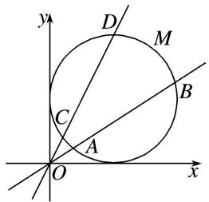

# 专题四 过极点的射线上线段长度及与长度相关的问题

极径的几何意义及其应用  
（1）几何意义：极径 $\rho$ 表示极坐标平面内点M到极点O的距离.  
（2）应用：一般应用于过极点的直线与曲线相交，所得的弦长问题，需要用极径表示出弦长，结合根与系数的关系解题.

已知极坐标方程求线段的长度有两种方法
方法一 先将极坐标系下点的坐标、曲线方程转化为平面直角坐标系下的点的坐标、曲线方程，然后求线段的长度.
方法二 直接在极坐标系下求解，设 $A(\rho_1, \theta_1), B(\rho_2, \theta_2)$ ，则 $|AB| = \sqrt{\rho_1^2 + \rho_2^2 - 2\rho_1\rho_2\cos (\theta_2 - \theta_1)}$ ，如果直线过极点且与另一曲线相交，求交点之间的距离时，求出曲线的极坐标方程和直线的极坐标方程及交点的极坐标，则 $|\rho_1 - \rho_2|$ 即为所求.

# 【例题选讲】

[例1] 已知极坐标系的极点为平面直角坐标系 $xOy$ 的原点，极轴为 $x$ 轴的正半轴，两种坐标系中的长度单位相同，曲线 $C$ 的参数方程为 $\left\{ \begin{array}{l} x = -1 + \sqrt{2}\cos \alpha, \\ y = 1 + \sqrt{2}\sin \alpha \end{array} \right.$ ( $\alpha$ 为参数)，直线 $l$ 过点 $(-1, 0)$ ，且斜率为 $\frac{1}{2}$ ，射线 $OM$ 的极坐标方程为 $\theta = \frac{3\pi}{4}$ .  
（1）求曲线 C 和直线 l 的极坐标方程;  
（2）已知射线 OM 与曲线 C 的交点为 O, P, 与直线 l 的交点为 Q, 则线段 PQ 的长.

[规范解答] （1）∵曲线 C 的参数方程为 $\left\{\begin{aligned}x&=-1+\sqrt{2}\cos\alpha,\\ y&=1+\sqrt{2}\sin\alpha\end{aligned}\right.$ (α为参数),
∴曲线 C 的普通方程为 $(x+1)^{2}+(y-1)^{2}=2$ ，将 $x=\rho\cos\theta,\quad y=\rho\sin\theta$ 代入整理得 $\rho+2\cos\theta-2\sin\theta=0$ ，即曲线 C 的极坐标方程为 $\rho=2\sqrt{2}\sin\left(\theta-\frac{\pi}{4}\right)$ .
∵ 直线 l 过点 $(-1, 0)$ ，且斜率为 $\frac{1}{2}$ ，∴ 直线 l 的方程为 $y = \frac{1}{2}(x + 1)$ ,
∴直线 l 的极坐标方程为 $\rho\cos\theta-2\rho\sin\theta+1=0$ .  
（2）当 $\theta = \frac{3\pi}{4}$ 时， $|OP| = 2\sqrt{2}\sin \left(\frac{3\pi}{4} -\frac{\pi}{4}\right) = 2\sqrt{2},$ $|OQ| = \frac{1}{2\times\frac{\sqrt{2}}{2} + \frac{\sqrt{2}}{2}} = \frac{\sqrt{2}}{3},$
故线段 PQ 的长为 $2\sqrt{2}-\frac{\sqrt{2}}{3}=\frac{5\sqrt{2}}{3}$ .

[例2] 已知平面直角坐标系中，曲线 $C$ 的参数方程为 $\left\{ \begin{array}{l} x = 1 + \sqrt{5}\cos \alpha, \\ y = 2 + \sqrt{5}\sin \alpha \end{array} \right.$ ( $\alpha$ 为参数)，直线 $l_{1}: x = 0$ 直线 $l_{2}: x - y = 0$ ，以原点为极点， $x$ 轴正半轴为极轴，建立极坐标系.  
（1）写出曲线 C 和直线 $l_{1}$ ， $l_{2}$ 的极坐标方程；  
（2）若直线 $l_{1}$ 与曲线 C 交于 O, A 两点，直线 $l_{2}$ 与曲线 C 交于 O, B 两点，求 $|AB|$ .

[规范解答] （1）依题意知，曲线 $C:(x-1)^{2}+(y-2)^{2}=5$ ，即 $x^{2}-2x+y^{2}-4y=0$ ，
将 $x=\rho\cos\theta,\quad y=\rho\sin\theta$ 代入上式，得 $\rho=2\cos\theta+4\sin\theta$ .
因为直线 $l_{1}$ : x=0，直线 $l_{2}$ : x-y=0，
故直线 $l_{1}$ ， $l_{2}$ 的极坐标方程为 $l_{1}$ ： $\theta=\frac{\pi}{2}(\rho\in\mathbf{R})$ ， $l_{2}$ ： $\theta=\frac{\pi}{4}(\rho\in\mathbf{R})$ .  
（2）设 A, B 两点对应的极径分别为 $\rho_{1}$ , $\rho_{2}$ ，在 $\rho=2\cos\theta+4\sin\theta$ 中，
令 $\theta = \frac{\pi}{2}$ ，得 $\rho_{1} = 2\cos \frac{\pi}{2} + 4\sin \frac{\pi}{2} = 4$ ，令 $\theta = \frac{\pi}{4}$ ，得 $\rho_{2} = 2\cos \frac{\pi}{4} + 4\sin \frac{\pi}{4} = 3\sqrt{2}$ ，因为 $\frac{\pi}{2} - \frac{\pi}{4} = \frac{\pi}{4}$
所以 $|AB|=\sqrt{\rho_{1}^{2}+\rho_{2}^{2}-2\rho_{1}\rho_{2}\cos\frac{\pi}{4}}=\sqrt{10}.$

[例 3] 在直角坐标系 xOy 中, 已知曲线 E 经过点 $P\left(1, \frac{2\sqrt{3}}{3}\right)$ , 其参数方程为 $\left\{\begin{aligned}x &= a\cos \alpha, \\ y &= \sqrt{2}\sin \alpha\end{aligned}\right.$ (a 为参数), 以原点 O 为极点, x 轴的正半轴为极轴建立极坐标系.  
（1）求曲线 E 的极坐标方程;  
（2）若直线 l 交 E 于点 A, B，且 $OA \perp OB$ ，求证： $\frac{1}{|OA|^{2}} + \frac{1}{|OB|^{2}}$ 为定值，并求出这个定值.

[规范解答] （1） 将点 $P\left(1, \frac{2\sqrt{3}}{3}\right)$ 代入曲线 E 的方程，得 $\left\{\begin{aligned}1 &= a\cos\alpha, \\ \frac{2\sqrt{3}}{3} &= \sqrt{2}\sin\alpha,\end{aligned}\right.$ 解得 $a^{2}=3$ ,
所以曲线 E 的普通方程为 $\frac{x^{2}}{3} + \frac{y^{2}}{2} = 1$ ，极坐标方程为 $\rho^{2}\left(\frac{1}{3}\cos^{2}\theta + \frac{1}{2}\sin^{2}\theta\right) = 1$ .  
（2）不妨设点 A, B 的极坐标分别为 $A(\rho_{1}, \theta)$ , $B\left(\rho_{2}, \theta + \frac{\pi}{2}\right)$ , $\rho_{1} > 0$ , $\rho_{2} > 0$ ,
$\text {则} \left\{ \begin{array}{l} \frac {1}{3} (\rho_ {1} \cos \theta) ^ {2} + \frac {1}{2} (\rho_ {1} \sin \theta) ^ {2} = 1, \\ \frac {1}{3} \left[ \rho_ {2} \cos \left(\theta + \frac {\pi}{2}\right) \right] _ {2} + \frac {1}{2} \left[ \rho_ {2} \sin \left(\theta + \frac {\pi}{2}\right) \right] _ {2} = 1, \end{array} \right. \quad \text {即} \left\{ \begin{array}{l} \frac {1}{\rho_ {1} ^ {2}} = \frac {1}{3} \cos^ {2} \theta + \frac {1}{2} \sin^ {2} \theta , \\ \frac {1}{\rho_ {2} ^ {2}} = \frac {1}{3} \sin^ {2} \theta + \frac {1}{2} \cos^ {2} \theta , \end{array} \right.$
所以 $\frac{1}{\rho_{1}^{2}}+\frac{1}{\rho_{2}^{2}}=\frac{5}{6}$ ，即 $\frac{1}{|OA|^{2}}+\frac{1}{|OB|^{2}}=\frac{5}{6}$ ，所以 $\frac{1}{|OA|^{2}}+\frac{1}{|OB|^{2}}$ 为定值 $\frac{5}{6}$ .

[例 4] 在直角坐标系 xOy 中，以 O 为极点，x 轴正半轴为极轴建立极坐标系．已知曲线 M 的参数方程为 $\left\{\begin{aligned} x &= 1 + \cos \varphi, \\ y &= 1 + \sin \varphi \end{aligned}\right.$ ( $\varphi$ 为参数)， $l_{1}, l_{2}$ 为过点 O 的两条直线， $l_{1}$ 交 M 于 A，B 两点， $l_{2}$ 交 M 于 C，D 两点，且 $l_{1}$ 的倾斜角为 $\alpha$ ， $\angle AOC = \frac{\pi}{6}$ .  
（1）求 $l_{1}$ 和 M 的极坐标方程;  
（2）当 $\alpha=\left\{0,\frac{\pi}{6}\right]$ 时，求点O到A，B，C，D四点的距离之和的最大值.

[规范解答] （1）依题意知，直线 $l_{1}$ 的极坐标方程为 $\theta=\alpha(\rho\in\mathbf{R})$ ,

由 $\left\{\begin{aligned}x=1+\cos\varphi,\\ y=1+\sin\varphi,\end{aligned}\right.$ 消去 $\varphi$ ，得 $(x-1)^{2}+(y-1)^{2}=1$ ，将 $x=\rho\cos\theta$ ， $y=\rho\sin\theta$ 代入上式，
得 $\rho^{2}-2\rho\cos\theta-2\rho\sin\theta+1=0$ ，故M的极坐标方程为 $\rho^{2}-2\rho\cos\theta-2\rho\sin\theta+1=0$ .  
（2）依题意可设 $A(\rho_1, \alpha)$ , $B(\rho_2, \alpha)$ , $C\left[\rho_3, \alpha + \frac{\pi}{6}\right]$ , $D\left[\rho_4, \alpha + \frac{\pi}{6}\right]$ , 且 $\rho_1, \rho_2, \rho_3, \rho_4$ 均为正数，将 $\theta = \alpha$ 代入 $\rho^2 - 2\rho \cos \theta - 2\rho \sin \theta + 1 = 0$ ，得 $\rho^2 - 2(\cos \alpha + \sin \alpha)\rho + 1 = 0$
所以 $\rho_{1} + \rho_{2} = 2(\cos \alpha +\sin \alpha)$ ，同理可得， $\rho_3 + \rho_4 = 2\left[\cos \left(\alpha +\frac{\pi}{6}\right) + \sin \left(\alpha +\frac{\pi}{6}\right)\right],$
所以点 O 到 A, B, C, D 四点的距离之和为 $\rho_{1} + \rho_{2} + \rho_{3} + \rho_{4} = 2(\cos \alpha + \sin \alpha) + 2\left[\cos\left(\alpha + \frac{\pi}{6}\right) + \sin\left(\alpha + \frac{\pi}{6}\right)\right]$ $=(1+\sqrt{3})\sin \alpha+(3+\sqrt{3})\cos \alpha=2(1+\sqrt{3})\sin\left(\alpha+\frac{\pi}{3}\right)$ ,
因为 $\alpha \in \left[0, \frac{\pi}{6}\right]$ ，所以 $\alpha + \frac{\pi}{3} \in \left[\frac{\pi}{3}, \frac{\pi}{2}\right]$ ，所以当 $\sin \left[\alpha + \frac{\pi}{3}\right] = \sin \frac{\pi}{2} = 1$ ，即 $\alpha = \frac{\pi}{6}$ 时，
$\rho_{1}+\rho_{2}+\rho_{3}+\rho_{4}$ 取得最大值 $2+2\sqrt{3}$ ，所以点 O 到 A，B，C，D 四点距离之和的最大值为 $2+2\sqrt{3}$ .

[例 5] 在直角坐标系 xOy 中，圆 C 的参数方程为 $\left\{\begin{aligned}x&=2+2\cos\alpha,\\ y&=2\sin\alpha\end{aligned}\right.$ (α为参数)，以 O 为极点，x 轴的正半轴为极轴建立极坐标系，直线的极坐标方程为 $\rho(\sin\theta+\sqrt{3}\cos\theta)=\sqrt{3}$ .  
（1）求 C 的极坐标方程;  
（2）射线 OM: $\theta=\theta_{1}\left(\frac{\pi}{6}\leq\theta_{1}\leq\frac{\pi}{3}\right)$ 与圆 C 的交点为 O, P, 与直线 l 的交点为 Q, 求 $|OP|\cdot|OQ|$ 的取值范围.

[规范解答] （1）圆 C 的普通方程是 $(x-2)^{2}+y^{2}=4$ ，又 $x=\rho\cos\theta,\quad y=\rho\sin\theta,$
所以圆 C 的极坐标方程为 $\rho=4\cos\theta$ .  
（2）设 $P(\rho_1,\theta_1)$ ，则有 $\rho_{1} = 4\cos \theta_{1}$ ，设 $Q(\rho_{2},\theta_{1})$ ，且直线 $l$ 的极坐标方程是 $\rho (\sin \theta +\sqrt{3}\cos \theta) = \sqrt{3}$
则有 $\rho_{2} = \frac{\sqrt{3}}{\sin\theta_{1} + \sqrt{3}\cos\theta_{1}}$ ，所以 $|OP||OQ| = \rho_{1}\rho_{2} = \frac{4\sqrt{3}\cos\theta_{1}}{\sin\theta_{1} + \sqrt{3}\cos\theta_{1}} = \frac{4\sqrt{3}}{\sqrt{3} + \tan\theta_{1}}\left(\frac{\pi}{6}\leq \theta_{1}\leq \frac{\pi}{3}\right),$
所以 $2 \leq |OP||OQ| \leq 3$ ，即 $|OP||OQ|$ 的取值范围是 [2, 3].

[例6] 在平面直角坐标系 $xOy$ 中，曲线 $C_1$ 的参数方程为 $\left\{ \begin{array}{l} x = 2\cos \alpha \\ y = 2 + 2\sin \alpha \end{array} \right.$ ( $\alpha$ 为参数)，以原点 $O$ 为极点， $x$ 轴的正半轴为极轴建立极坐标系，曲线 $C_2$ 的极坐标方程为 $\rho \cos^2 \theta = \sin \theta (\rho \geq 0, 0 \leq \theta < \pi)$ .  
（1）写出曲线 $C_{1}$ 的极坐标方程，并求 $C_{1}$ 与 $C_{2}$ 交点的极坐标；  
（2）射线 $\theta = \beta \left(\frac{\pi}{6} < \beta < \frac{\pi}{3}\right)$ 与曲线 $C_1, C_2$ 分别交于点 $A, B(A, B$ 异于原点)，求 $\frac{|OA|}{|OB|}$ 的取值范围.

[规范解答] （1）由题意可得曲线 $C_{1}$ 的普通方程为 $x^{2}+(y-2)^{2}=4$ ，把 $x=\rho\cos\theta,\quad y=\rho\sin\theta$ 代入，得曲线 $C_{1}$ 的极坐标方程为 $\rho=4\sin\theta$ ，联立 $\left\{\begin{aligned}\rho&=4\sin\theta,\\ \rho&\cos^{2}\theta=\sin\theta,\end{aligned}\right.$ 得 $4\sin\theta\cos^{2}\theta=\sin\theta$ ，此时 $0\leq\theta<\pi$ ，

①当 $\sin\theta=0$ 时， $\theta=0,\quad\rho=0$ ，得交点的极坐标为 $(0,0)$ ;

②当 $\sin\theta\neq0$ 时， $\cos^{2}\theta=\frac{1}{4}$ ，当 $\cos\theta=\frac{1}{2}$ 时， $\theta=\frac{\pi}{3}$ ， $\rho=2\sqrt{3}$ ，得交点的极坐标为 $\left(2\sqrt{3},\frac{\pi}{3}\right)$ ,
当 $\cos\theta=-\frac{1}{2}$ 时， $\theta=\frac{2\pi}{3}$ ， $\rho=2\sqrt{3}$ ，得交点的极坐标为 $\left(2\sqrt{3},\frac{2\pi}{3}\right)$ ,
所以 $C_{1}$ 与 $C_{2}$ 交点的极坐标为 $(0, 0)$ ， $\left(2\sqrt{3}, \frac{\pi}{3}\right)$ ， $\left(2\sqrt{3}, \frac{2\pi}{3}\right)$ .  
（2）将 $\theta=\beta$ 代入 $C_{1}$ 的极坐标方程中，得 $\rho_{1}=4\sin\beta$ ，代入 $C_{2}$ 的极坐标方程中，得 $\rho_{2}=\frac{\sin\beta}{\cos^{2}\beta}$
所以 $\frac{|OA|}{|OB|}=\frac{4\sin\beta}{\frac{\sin\beta}{\cos^{2}\beta}}=4\cos^{2}\beta$ ，因为 $\frac{\pi}{6}\leq\beta\leq\frac{\pi}{3}$ ，所以 $1\leq4\cos^{2}\beta\leq3$ ，所以 $\frac{|OA|}{|OB|}$ 的取值范围为[1，3].

[例 7] 在平面直角坐标系 xOy 中，曲线 $C_{1}:\left\{\begin{aligned}x&=a\cos\varphi,\\ y&=b\sin\varphi\end{aligned}\right.$ ( $\varphi$ 为参数)，其中 a>b>0。以 O 为极点，x 轴的正半轴为极轴的极坐标系中，曲线 $C_{2}:\rho=2\cos\theta$ ，射线 l: $\theta=\alpha(\rho\geq0)$ 。若射线 l 与曲线 $C_{1}$ 交于点 P，当 $\alpha=0$ 时，射线 l 与曲线 $C_{2}$ 交于点 Q， $|PQ|=1$ ；当 $\alpha=\frac{\pi}{2}$ 时，射线 l 与曲线 $C_{2}$ 交于点 O， $|OP|=\sqrt{3}$ 。  
（1）求曲线 $C_{1}$ 的普通方程;  
（2）设直线 $l'$ : $\left\{\begin{aligned}x&=-t,\\ y&=\sqrt{3}t\end{aligned}\right.$ (t 为参数， $t\neq0$ )与曲线 $C_{2}$ 交于点 R，若 $\alpha=\frac{\pi}{3}$ ，求 $\triangle OPR$ 的面积.

[规范解答] （1）因为曲线 $C_{1}$ 的参数方程为 $\left\{\begin{aligned}x&=a\cos\varphi,\\ y&=b\sin\varphi\end{aligned}\right.$ ( $\varphi$ 为参数)，且 a>b>0，
所以曲线 $C_{1}$ 的普通方程为 $\frac{x^{2}}{a^{2}} + \frac{y^{2}}{b^{2}} = 1$ ，而其极坐标方程为 $\frac{\rho^{2}\cos^{2}\theta}{a^{2}} + \frac{\rho^{2}\sin^{2}\theta}{b^{2}} = 1$ .
将 $\theta=0(\rho\geq0)$ 代入 $\frac{\rho^{2}\cos^{2}\theta}{a^{2}}+\frac{\rho^{2}\sin^{2}\theta}{b^{2}}=1$ ，得 $\rho=a$ ，即点P的极坐标为 $(a,0)$ ;
将 $\theta=0(\rho\geq0)$ 代入 $\rho=2\cos\theta$ ，得 $\rho=2$ ，即点Q的极坐标为(2,0).
因为 $|PQ|=1$ ，所以 $|PQ|=|a-2|=1$ ，所以a=1或a=3.
将 $\theta = \frac{\pi}{2} (\rho \geq 0)$ 代入 $\frac{\rho^2\cos^2\theta}{a^2} +\frac{\rho^2\sin^2\theta}{b^2} = 1$ ，得 $\rho = b$ ，即点 $P$ 的极坐标为 $\left(b,\frac{\pi}{2}\right),$
因为 $|OP|=\sqrt{3}$ ，所以 $b=\sqrt{3}$ 。又因为a>b>0，所以a=3，所以曲线 $C_{1}$ 的普通方程为 $\frac{x^{2}}{9}+\frac{y^{2}}{3}=1$ 。  
（2）因为直线 $l'$ 的参数方程为 $\left\{\begin{aligned}x&=-t,\\ y&=\sqrt{3}t\end{aligned}\right.$ (t 为参数， $t\neq0$ )，所以直线 $l'$ 的普通方程为 $y=-\sqrt{3}x(x\neq0)$ ,

而其极坐标方程为 $\theta = -\frac{\pi}{3} (\rho \in \mathbf{R}, \rho \neq 0)$ ,
所以将直线 $l'$ 的方程 $\theta = -\frac{\pi}{3}$ 代入曲线 $C_{2}$ 的方程 $\rho = 2\cos \theta$ ，得 $\rho = 1$ ，即 $|OR| = 1$ .
因为将射线 l 的方程 $\theta=\frac{\pi}{3}(\rho\geq0)$ 代入曲线 $C_{1}$ 的方程 $\frac{\rho^{2}\cos^{2}\theta}{9}+\frac{\rho^{2}\sin^{2}\theta}{3}=1$ ，得 $\rho=\frac{3\sqrt{10}}{5}$ ，即 $|OP|=\frac{3\sqrt{10}}{5}$ ,
所以 $S_{\triangle OPR}=\frac{1}{2}|OP||OR|\sin\angle POR=\frac{1}{2}\times\frac{3\sqrt{10}}{5}\times1\times\sin\frac{2\pi}{3}=\frac{3\sqrt{30}}{20}.$

[例 8] 在平面直角坐标系 xOy 中，曲线 C 的参数方程为 $\left\{\begin{aligned}x&=a+a\cos\beta,\\ y&=a\sin\beta\end{aligned}\right.$ (a>0)，以 O 为极点，x 轴的正半轴为极轴，建立极坐标系，直线 l 的极坐标方程 $\rho\cos\left(\theta-\frac{\pi}{3}\right)=\frac{3}{2}$ .  
（1）若曲线 $C$ 与 $l$ 只有一个公共点，求 $a$ 的值.  
（2） $A, B$ 为曲线 $C$ 上的两点，且 $\angle AOB = \frac{\pi}{3}$ ，求 $\triangle OAB$ 的面积最大值.

[规范解答] （1）曲线 C 是以 $(a, 0)$ 为圆心，以 a 为半径的圆；直线 l 的直角坐标方程为 $x + \sqrt{3}y - 3 = 0$ ，由直线 l 与圆 C 只有一个公共点，则可得 $\frac{|a - 3|}{2} = a$ ，解得：a = -3（舍）或 a = 1，所以 a = 1。  
（2）解法一：由题意，曲线 C 的极坐标方程为 $\rho=2a\cos\theta(a>0)$ ,
设 A 的极角为 $\theta$ ，B 的极角为 $\theta + \frac{\pi}{3}$ ，
则 $S_{\triangle OAB} = \frac{1}{2} |OB|\cdot |OA|\sin \frac{\pi}{3} = \frac{\sqrt{3}}{4}\left|2a\cos \left(\theta +\frac{\pi}{3}\right)\right|\cdot |2a\cos \theta | = \sqrt{3} a^2\left|\cos \theta \cdot \cos \left(\theta +\frac{\pi}{3}\right)\right|$
因为 $\cos\theta\cdot\cos\left(\theta+\frac{\pi}{3}\right)=\frac{1}{2}\cos\left(2\theta+\frac{\pi}{3}\right)+\frac{1}{4}$ ，所以当 $\theta=-\frac{\pi}{6}$ 时， $\frac{1}{2}\cos\left(2\theta+\frac{\pi}{3}\right)+\frac{1}{4}$ 取得最大值 $\frac{3}{4}$ ,
所以 $\triangle AOB$ 的面积最大值为 $\frac{3\sqrt{3}a^{2}}{4}$ .
解法二：因为曲线 C 是以 $(a, 0)$ 为圆心，以 a 为半径的圆，且 $\angle AOB = \frac{\pi}{3}$ ,
由正弦定理得： $\frac{|AB|}{\sin\frac{\pi}{3}}=2a$ ，所以 $|AB|=\sqrt{3}a$ ，由余弦定理得： $|AB|^{2}=3a^{2}=|OA|^{2}+|OB|^{2}-|OA||OB|\geq|OA||OB|$
则 $S_{\triangle OAB}=\frac{1}{2}|OB|\cdot|OA|\sin\frac{\pi}{3}\leq\frac{1}{2}\times3a^{2}\times\frac{\sqrt{3}}{2}=\frac{3\sqrt{3}a^{2}}{4}$ . 所以 $\triangle OAB$ 的面积最大值为 $\frac{3\sqrt{3}a^{2}}{4}$ .

[例 9] (2017·全国 II) 在直角坐标系 xOy 中，以坐标原点为极点，x 轴的正半轴为极轴建立极坐标系，曲线 $C_{1}$ 的极坐标方程为 $\rho\cos\theta=4$ .  
（1） $M$ 为曲线 $C_1$ 上的动点，点 $P$ 在线段 $OM$ 上，且满足 $|OM|\cdot |OP| = 16$ ，求点 $P$ 的轨迹 $C_2$ 的直角坐标方程；  
（2）设点 A 的极坐标为 $\left\{2, \frac{\pi}{3}\right\}$ ，点 B 在曲线 $C_{2}$ 上，求 $\triangle OAB$ 面积的最大值.

[规范解答] （1）设点 P 的极坐标为 $(\rho, \theta)(\rho>0)$ ，点 M 的极坐标为 $(\rho_{1}, \theta)(\rho_{1}>0)$ ，由题设知，
$|OP|=\rho,\quad|OM|=\rho_{1}=\frac{4}{\cos\theta}.$ 由 $|OM|\cdot|OP|=16$ ，得 $C_{2}$ 的极坐标方程 $\rho=4\cos\theta(\rho>0)$ .
所以 $C_{2}$ 的直角坐标方程为 $(x-2)^{2}+y^{2}=4(x\neq0)$ .  
（2）设点 B 的极坐标为 $(\rho_{B}, \alpha)(\rho_{B}>0)$ . 由题设知 $|OA|=2, \rho_{B}=4\cos\alpha$ . 于是 $\triangle OAB$ 的面积
$S = \frac {1}{2} | O A | \cdot \rho_ {B} \cdot \sin \angle A O B = 4 \cos \alpha \left| \sin \left(\alpha - \frac {\pi}{3}\right) \right| = 4 \cos \alpha \left| \frac {1}{2} \sin \alpha - \frac {\sqrt {3}}{2} \cos \alpha \right| = | \sin 2 \alpha - \sqrt {3} \cos 2 \alpha - \sqrt {3} |$
$= 2\left|\sin \left(2\alpha -\frac{\pi}{3}\right) - \frac{\sqrt{3}}{2}\right| \leq 2 + \sqrt{3}.$ 当 $2\alpha -\frac{\pi}{3} = -\frac{\pi}{2}$ 即 $\alpha = -\frac{\pi}{12}$ 时， $S$ 取得最大值 $2 + \sqrt{3},$
所以 $\triangle OAB$ 面积的最大值为 $2+\sqrt{3}$ .

[例 10] 在直角坐标系 xOy 中，曲线 $C_{1}$ 的参数方程为 $\left\{\begin{aligned}x&=a+\sqrt{3}\cos t,\\ y&=\sqrt{3}\sin t\end{aligned}\right.$ (t 为参数，a>0). 以坐标原点 O 为极点，以 x 轴正半轴为极轴的极坐标系中，曲线 $C_{1}$ 上一点 A 的极坐标为 $\left(\begin{aligned}1,&\frac{\pi}{3}\end{aligned}\right)$ ，曲线 $C_{2}$ 的极坐标方程为 $\rho=\cos\theta$ .  
（1）求曲线 $C_{1}$ 的极坐标方程;  
（2）设点 M, N 在 $C_{1}$ 上，点 P 在 $C_{2}$ 上(异于极点)，若 O, M, P, N 四点依次在同一条直线 l 上，且 $|MP|$ ， $|OP|$ ， $|PN|$ 成等比数列，求 l 的极坐标方程.

[规范解答] （1）曲线 $C_{1}$ 的直角坐标方程为 $(x-a)^{2}+y^{2}=3$ ，化简得 $x^{2}+y^{2}-2ax+a^{2}-3=0$ .
又 $x^{2}+y^{2}=\rho^{2}$ ， $x=\rho\cos\theta$ ，所以 $\rho^{2}-2a\rho\cos\theta+a^{2}-3=0$ .
代入点 $\left(1,\frac{\pi}{3}\right)$ ，得 $a^{2}-a-2=0$ ，解得a=2或a=-1(舍去).
所以曲线 $C_{1}$ 的极坐标方程为 $\rho^{2}-4\rho\cos\theta+1=0$ .  
（2）由题意知，设直线 l 的极坐标方程为 $\theta = \alpha (\rho \in \mathbf{R})$ ,
设点 $M(\rho_{1}, \alpha)$ ， $N(\rho_{2}, \alpha)$ ， $P(\rho_{3}, \alpha)$ ，则 $\rho_{1} < \rho_{3} < \rho_{2}$ .
联立 $\left\{ \begin{array}{l} \rho^2 - 4\rho \cos \theta + 1 = 0, \\ \theta = \alpha, \end{array} \right.$ 得 $\rho^2 - 4\rho \cos \alpha + 1 = 0$ ，所以 $\rho_1 + \rho_2 = 4\cos \alpha, \rho_1\rho_2 = 1$ .
联立 $\left\{\begin{aligned}\rho&=\cos\theta,\\ \theta&=\alpha,\end{aligned}\right.$ 得 $\rho_{3}=\cos\alpha$ . 因为 $|MP|$ , $|OP|$ , $|PN|$ 成等比数列,
所以 $\rho_3^2 = (\rho_3 - \rho_1)(\rho_2 - \rho_3)$ ，即 $2\rho_3^2 = (\rho_1 + \rho_2)\rho_3 - \rho_1\rho_2$ 。所以 $2\cos^2\alpha = 4\cos^2\alpha - 1$ ，解得 $\cos \alpha = \frac{\sqrt{2}}{2}$ （舍负）.
经检验，满足 O, M, P, N 四点依次在同一条直线上，所以 l 的极坐标方程为 $\theta = \pm \frac{\pi}{4} (\rho \in \mathbf{R})$ .

# 【对点训练】

1. 已知极坐标系的极点为直角坐标系 $xOy$ 的原点，极轴为 $x$ 轴的正半轴，两种坐标系中的长度单位相同，圆 $C$ 的直角坐标方程为 $x^{2} + y^{2} + 2x - 2y = 0$ ，直线 $l$ 的参数方程为 $\left\{ \begin{array}{l} x = -1 + t, \\ y = t \end{array} \right.$ （ $t$ 为参数），射线 $OM$

的极坐标方程为 $\theta=\frac{3\pi}{4}$ .  
（1）求圆 C 和直线 l 的极坐标方程;  
（2）已知射线 $OM$ 与圆 $C$ 的交点为 $O, P$ , 与直线 $l$ 的交点为 $Q$ , 求线段 $PQ$ 的长.

1. 解析 （1） $\because \rho^{2} = x^{2} + y^{2}, x = \rho \cos \theta, y = \rho \sin \theta$ ，圆 $C$ 的直角坐标方程为 $x^{2} + y^{2} + 2x - 2y = 0$
$\therefore \rho^{2}+2\rho\cos\theta-2\rho\sin\theta=0,\quad\therefore$ 圆 C 的极坐标方程为 $\rho=2\sqrt{2}\sin\left(\theta-\frac{\pi}{4}\right)$ .
又直线 l 的参数方程为 $\left\{\begin{aligned} x &= -1 + t, \\ y &= t \end{aligned}\right.$ (t 为参数)，消去 t 后得 $y = x + 1$ ，
∴直线 l 的极坐标方程为 $\sin\theta-\cos\theta=\frac{1}{\rho}$ .  
（2）当 $\theta = \frac{3\pi}{4}$ 时， $|OP| = 2\sqrt{2}\sin \left(\frac{3\pi}{4} -\frac{\pi}{4}\right) = 2\sqrt{2},$ ，∴点 $P$ 的极坐标为 $\left[2\sqrt{2},\frac{3\pi}{4}\right),|OQ| = \frac{1}{\frac{\sqrt{2}}{2} + \frac{\sqrt{2}}{2}} = \frac{\sqrt{2}}{2},$
∴点 Q 的极坐标为 $\left(\frac{\sqrt{2}}{2}, \frac{3\pi}{4}\right)$ ，故线段 PQ 的长为 $\frac{3\sqrt{2}}{2}$ .

2. (2016·全国Ⅱ)在直角坐标系 $xOy$ 中, 圆 $C$ 的方程为 $(x + 6)^{2} + y^{2} = 25$ .  
（1）以坐标原点为极点，x 轴的正半轴为极轴建立极坐标系，求 C 的极坐标方程；  
（2）直线 l 的参数方程是 $\left\{\begin{aligned}x &= t\cos \alpha, \\ y &= t\sin \alpha\end{aligned}\right.$ (t 为参数)，l 与 C 交于 A，B 两点， $|AB| = \sqrt{10}$ ，求 l 的斜率.

2. 解析 （1）由 $x=\rho\cos\theta,\quad y=\rho\sin\theta$ 可得圆 C 的极坐标方程 $\rho^{2}+12\rho\cos\theta+11=0$ .  
（2）在（1）中建立的极坐标系中，直线 l 的极坐标方程为 $\theta = \alpha (\rho \in \mathbb{R})$ .
设 A, B 所对应的极径分别为 $\rho_{1}$ , $\rho_{2}$ ，将 l 的极坐标方程代入到 C 的极坐标方程，得
$\rho^ {2} + 1 2 \rho \cos \alpha + 1 1 = 0. \text {于是} \rho_ {1} + \rho_ {2} = - 1 2 \cos \alpha , \rho_ {1} \rho_ {2} = 1 1.$
$\vert A B \vert = \left| \rho_ {1} - \rho_ {2} \right| = \sqrt {\left(\rho_ {1} + \rho_ {2}\right) ^ {2} - 4 \rho_ {1} \rho_ {2}} = \sqrt {1 4 4 \cos^ {2} \alpha - 4 4}.$
由 $|AB|=\sqrt{10}$ ，得 $\cos^{2}\alpha=\frac{3}{8}$ ， $\tan\alpha=\pm\frac{\sqrt{15}}{3}$ ，所以l的斜率为 $\frac{\sqrt{15}}{3}$ 或 $-\frac{\sqrt{15}}{3}$ .

3. 已知曲线 C 的极坐标方程为 $\rho^{2}=\frac{9}{\cos^{2}\theta+9\sin^{2}\theta}$ ，以极点为平面直角坐标系的原点 O，极轴为 x 轴的正半轴建立平面直角坐标系.  
（1）求曲线 C 的直角坐标方程;  
（2） $A, B$ 为曲线 $C$ 上两点，若 $OA \perp OB$ ，求 $\frac{1}{|OA|^2} + \frac{1}{|OB|^2}$ 的值.

3. 解析 （1）由 $\rho^2 = \frac{9}{\cos^2\theta + 9\sin^2\theta}$ 得 $\rho^2\cos^2\theta + 9\rho^2\sin^2\theta = 9$
将 $x=\rho\cos\theta,\quad y=\rho\sin\theta$ 代入得到曲线 C 的直角坐标方程是 $\frac{x^{2}}{9}+y^{2}=1$ .  
（2）因为 $\rho^2 = \frac{9}{\cos^2\theta + 9\sin^2\theta}$ , 所以 $\frac{1}{\rho^2} = \frac{\cos^2\theta}{9} + \sin^2\theta,$
由 $OA \perp OB$ ，设 $A(\rho_{1}, \alpha)$ ，则点 B 的坐标可设为 $\left(\rho_{2}, \alpha \pm \frac{\pi}{2}\right)$ ,
所以 $\frac{1}{|OA|^2} +\frac{1}{|OB|^2} = \frac{1}{\rho_1^2} +\frac{1}{\rho_2^2} = \frac{\cos^2\alpha}{9} +\sin^2\alpha +\frac{\sin^2\alpha}{9} +\cos^2\alpha = \frac{1}{9} +1 = \frac{10}{9}.$

4. 已知曲线 C 的参数方程是 $\left\{\begin{aligned} x &= a \cos \varphi, \\ y &= \sqrt{3} \sin \varphi \end{aligned}\right.$ ( $\varphi$ 为参数，a > 0)，直线 l 的参数方程是 $\left\{\begin{aligned} x &= 3 + t, \\ y &= -1 - t \end{aligned}\right.$ (t 为参数)，曲线 C 与直线 l 有一个公共点在 x 轴上，以坐标原点为极点，x 轴的正半轴为极轴建立极坐标系.  
（1）求曲线 C 的普通方程;  
（2）若点 $A(\rho_1,\theta)$ ， $B\left[\rho_{2},\theta +\frac{2\pi}{3}\right],C\left[\rho_{3},\theta +\frac{4\pi}{3}\right]$ 在曲线 $C$ 上，求 $\frac{1}{|OA|^2} +\frac{1}{|OB|^2} +\frac{1}{|OC|^2}$ 的值.

4. 解析 （1） 直线 $l$ 的普通方程为 $x + y = 2$ ，与 $x$ 轴的交点为 $(2,0)$ 。又曲线 $C$ 的普通方程为 $\frac{x^2}{a^2} + \frac{y^2}{3} = 1$ ，所以 $a = 2$ ，故所求曲线 $C$ 的普通方程是 $\frac{x^2}{4} + \frac{y^2}{3} = 1$ .  
（2）因为点 $A(\rho_{1}, \theta)$ ， $B\left[\rho_{2}, \theta + \frac{2\pi}{3}\right]$ ， $C\left[\rho_{3}, \theta + \frac{4\pi}{3}\right]$ 在曲线 C 上，
即点 $A(\rho_1\cos \theta, \rho_1\sin \theta), B\left[\rho_2\cos \left[\theta + \frac{2\pi}{3}\right], \rho_2\sin \left[\theta + \frac{2\pi}{3}\right]\right], C\left[\rho_3\cos \left[\theta + \frac{4\pi}{3}\right], \rho_3\sin \left[\theta + \frac{4\pi}{3}\right]\right]$ 在曲线 $C$ 上，故 $\frac{1}{|OA|^2} + \frac{1}{|OB|^2} + \frac{1}{|OC|^2} = \frac{1}{\rho_1^2} + \frac{1}{\rho_2^2} + \frac{1}{\rho_3^2} =$
$\frac {1}{4} \left[ \cos^ {2} \theta + \cos^ {2} \left(\theta + \frac {2 \pi}{3}\right) + \cos^ {2} \left(\theta + \frac {4 \pi}{3}\right) \right] + \frac {1}{3} \left[ \sin^ {2} \theta + \sin^ {2} \left(\theta + \frac {2 \pi}{3}\right) + \sin^ {2} \left(\theta + \frac {4 \pi}{3}\right) \right]$
$= \frac {1}{4} \left[ \frac {1 + \cos 2 \theta}{2} + \frac {1 + \cos \left(2 \theta + \frac {4 \pi}{3}\right)}{2} + \frac {1 + \cos \left(2 \theta + \frac {8 \pi}{3}\right)}{2} \right] + \frac {1}{3} \left[ \frac {1 - \cos 2 \theta}{2} + \frac {1 - \cos \left(2 \theta + \frac {4 \pi}{3}\right)}{2} + \frac {1 - \cos \left(2 \theta + \frac {8 \pi}{3}\right)}{2} \right]$
$= \frac {1}{4} \times \frac {3}{2} + \frac {1}{3} \times \frac {3}{2} = \frac {7}{8}.$

5. 在平面直角坐标系 $xOy$ 中，曲线 $C_1$ 的参数方程为 $\left\{ \begin{array}{l} x = 1 + \cos \alpha, \\ y = \sin \alpha \end{array} \right.$ ( $\alpha$ 为参数); 在以原点 $O$ 为极点， $x$ 轴的正半轴为极轴的极坐标系中，曲线 $C_2$ 的极坐标方程为 $\rho \cos^2 \theta = \sin \theta$ .  
（1）求曲线 $C_{1}$ 的极坐标方程和曲线 $C_{2}$ 的直角坐标方程;  
（2）若射线 $l: y = kx (x \geq 0)$ 与曲线 $C_{1}, C_{2}$ 的交点分别为 A, B (A, B 异于原点)，当斜率 $k \in (1, \sqrt{3}]$ 时，求 $|OA| \cdot |OB|$ 的取值范围.

5. 解析 （1） 曲线 $C_1$ 的直角坐标方程为 $(x - 1)^2 + y^2 = 1$ ，即 $x^2 - 2x + y^2 = 0$
将 $\left\{\begin{aligned}x&=\rho\cos\theta,\\ y&=\rho\sin\theta\end{aligned}\right.$ 代入并化简得曲线 $C_{1}$ 的极坐标方程为 $\rho=2\cos\theta.$
由 $\rho\cos^{2}\theta=\sin\theta$ 两边同时乘 $\rho$ ，得 $\rho^{2}\cos^{2}\theta=\rho\sin\theta$ ，

结合 $\left\{\begin{aligned}x&=\rho\cos\theta,\\ y&=\rho\sin\theta\end{aligned}\right.$ 得曲线 $C_{2}$ 的直角坐标方程为 $x^{2}=y$ .  
（2）设射线 $l: y = kx(x \geq 0)$ 的倾斜角为 $\varphi$ ，则射线的极坐标方程为 $\theta = \varphi$ ，且 $k = \tan \varphi \in (1, \sqrt{3}]$ .
联立 $\left\{\begin{aligned}\rho=2\cos\theta,\\ \theta=\varphi,\end{aligned}\right.$ 得 $|OA|=\rho_{A}=2\cos\varphi$ ，联立 $\left\{\begin{aligned}\rho\cos^{2}\theta=\sin\theta,\\ \theta=\varphi,\end{aligned}\right.$ 得 $|OB|=\rho_{B}=\frac{\sin\varphi}{\cos^{2}\varphi}$
所以 $|OA|\cdot|OB|= \rho_{A}\cdot\rho_{B}=2\cos\varphi\cdot\frac{\sin\varphi}{\cos^{2}\varphi}=2\tan\varphi=2k\in(2,2\sqrt{3}]$ ，即 $|OA|\cdot|OB|$ 的取值范围是 $(2,2\sqrt{3}]$ .

6. 在直角坐标系 $xOy$ 中，曲线 $C$ 的参数方程为 $\left\{ \begin{array}{l} x = \sqrt{2}\cos \varphi, \\ y = \sin \varphi \end{array} \right.$ ( $\varphi$ 为参数). 以坐标原点为极点， $x$ 轴的正半轴为极轴建立极坐标系， $A$ ， $B$ 为 $C$ 上两点，且 $OA \perp OB$ ，设射线 $OA: \theta = \alpha$ ，其中 $0 < \alpha < \frac{\pi}{2}$ .  
（1）求曲线 C 的极坐标方程;  
（2）求 $|OA|\cdot|OB|$ 的最小值.

6. 解析 （1） 将曲线 $C$ 的参数方程 $\left\{ \begin{array}{l} x = \sqrt{2} \cos \varphi, \\ y = \sin \varphi \end{array} \right.$ ( $\varphi$ 为参数) 化为普通坐标方程为 $\frac{x^2}{2} + y^2 = 1$ .
因为 $x=\rho\cos\theta,\quad y=\rho\sin\theta$ ，所以曲线 C 的极坐标方程为 $\rho^{2}=\frac{2}{1+\sin^{2}\theta}$ .  
（2）根据题意：射线 OB 的极坐标方程为 $\theta = \alpha + \frac{\pi}{2}$ 或 $\theta = \alpha - \frac{\pi}{2}$ ,
所以 $|OA|=\sqrt{\frac{2}{1+\sin^{2}\alpha}}$ ， $|OB|=\sqrt{\frac{2}{1+\sin^{2}\left(\alpha\pm\frac{\pi}{2}\right)}}=\sqrt{\frac{2}{1+\cos^{2}\alpha}}$
所以 $|OA|\cdot|OB|=\sqrt{\frac{2}{1+\sin^{2}\alpha}\cdot\frac{2}{1+\cos^{2}\alpha}}=\sqrt{\frac{4}{(1+\sin^{2}\alpha)(1+\cos^{2}\alpha)}}\geq\frac{2}{\frac{1+\sin^{2}\alpha+1+\cos^{2}\alpha}{2}}=\frac{4}{3}.$
当且仅当 $\sin^{2}\alpha=\cos^{2}\alpha$ ，即 $\alpha=\frac{\pi}{4}$ 时， $|OA|\cdot|OB|$ 取得最小值为 $\frac{4}{3}$ .

7. 在直角坐标系 $xOy$ 中，曲线 $C_1$ 的参数方程为 $\left\{ \begin{array}{l} x = \sqrt{2}\cos \varphi, \\ y = \sin \varphi \end{array} \right.$ (其中 $\varphi$ 为参数)，曲线 $C_2: x^2 + y^2 - 2y = 0$ .

以原点 O 为极点，x 轴的正半轴为极轴建立极坐标系，射线 $l: \theta = \alpha (\rho \geq 0)$ 与曲线 $C_{1}$ ， $C_{2}$ 分别交于点 A，B (均异于原点 O).  
（1）求曲线 $C_{1}$ ， $C_{2}$ 的极坐标方程；  
（2）当 $0<\alpha<\frac{\pi}{2}$ 时，求 $|OA|^{2}+|OB|^{2}$ 的取值范围.

7. 解析 （1） $\because \left\{ \begin{array}{l} x = \sqrt{2}\cos \varphi, \\ y = \sin \varphi, \end{array} \right.\therefore \frac{x^2}{2} +y^2 = 1$ ，由 $\left\{ \begin{array}{l} x = \rho \cos \theta, \\ y = \rho \sin \theta, \end{array} \right.$ 得曲线 $C_1$ 的极坐标方程为 $\rho^2 = \frac{2}{1 + \sin^2\theta}$ ;
$\because x^{2}+y^{2}-2y=0,\quad\therefore$ 曲线 $C_{2}$ 的极坐标方程为 $\rho=2\sin\theta.$  
（2）设 A, B 对应的极径分别为 $\rho_{1}$ , $\rho_{2}$ ，则由（1）得， $|OA|^{2}=\rho_{1}^{2}=\frac{2}{1+\sin^{2}\alpha}$ ， $|OB|^{2}=\rho_{2}^{2}=4\sin^{2}\alpha$ ，
$\therefore | O A | ^ {2} + | O B | ^ {2} = \frac {2}{1 + \sin^ {2} \alpha} + 4 \sin^ {2} \alpha = \frac {2}{1 + \sin^ {2} \alpha} + 4 (1 + \sin^ {2} \alpha) - 4,$
$\because 0 < \alpha < \frac{\pi}{2}, \therefore 1 < 1 + \sin^2 \alpha < 2, \therefore 6 < \frac{2}{1 + \sin^2 \alpha} + 4 (1 + \sin^2 \alpha) < 9, \therefore |OA|^2 + |OB|^2$ 的取值范围为(2，5).  
（2） 另解 联立 $\theta = \alpha (\rho \geq 0)$ 与 $C_{1}$ 的极坐标方程得 $|OA|^{2} = \frac{2}{1 + \sin^{2}\alpha}$ ,
联立 $\theta=\alpha(\rho\geq0)$ 与 $C_{2}$ 的极坐标方程得 $|OB|^{2}=4\sin^{2}\alpha,$
$\text { 则 } | O A | ^ {2} + | O B | ^ {2} = \frac {2}{1 + \sin^ {2} \alpha} + 4 \sin^ {2} \alpha = \frac {2}{1 + \sin^ {2} \alpha} + 4 (1 + \sin^ {2} \alpha) - 4.$
令 $t = 1 + \sin^2\alpha$ ，则 $|OA|^2 + |OB|^2 = \frac{2}{t} + 4t - 4,$
当 $0<\alpha<\frac{\pi}{2}$ 时， $t\in(1,2)$ ，设 $f(t)=\frac{2}{t}+4t-4$ ，易得 $f(t)$ 在 $(1,2)$ 上单调递增，
∴ $2 < |OA|^{2} + |OB|^{2} < 5$ ，故 $|OA|^{2} + |OB|^{2}$ 的取值范围是 $(2, 5)$ .

8. 在直角坐标系 $xOy$ 中，曲线 $C$ 的参数方程为 $\left\{ \begin{array}{l} x = 1 + \cos \alpha, \\ y = \sin \alpha \end{array} \right.$ ( $\alpha$ 为参数)，直线 $l$ 的参数方程为 $\left\{ \begin{array}{l} x = 1 - t, \\ y = 3 + t \end{array} \right.$

(t 为参数)，在以坐标原点为极点，x 轴的正半轴为极轴的极坐标系中，射线 m: $\theta=\beta(\rho>0)$ .  
（1）求 C 和 l 的极坐标方程;  
（2）设点 A 是 m 与 C 的一个交点(异于原点)，点 B 是 m 与 l 的交点，求 $\frac{|OA|}{|OB|}$ 的最大值.

8. 解析 （1） 曲线 $C$ 的普通方程为 $(x - 1)^2 + y^2 = 1$ ，由 $\left\{ \begin{array}{l} \rho \cos \theta = x, \\ \rho \sin \theta = y, \end{array} \right.$ 得 $(\rho \cos \theta - 1)^2 + \rho^2 \sin^2 \theta = 1$
化简得 C 的极坐标方程为 $\rho=2\cos\theta$ .
因为 l 的普通方程为 $x + y - 4 = 0$ ，所以极坐标方程为 $\rho \cos \theta + \rho \sin \theta - 4 = 0$ ，
所以 l 的极坐标方程为 $\rho\sin\left(\theta+\frac{\pi}{4}\right)=2\sqrt{2}$ .  
（2）设 $A(\rho_1, \beta)$ , $B(\rho_2, \beta)$ , 则 $\frac{|OA|}{|OB|} = \frac{\rho_1}{\rho_2} = 2\cos \beta \cdot \frac{\sin \beta + \cos \beta}{4} = \frac{1}{2} (\sin \beta \cos \beta + \cos^2 \beta) = \frac{\sqrt{2}}{4}\sin \left(2\beta + \frac{\pi}{4}\right) + \frac{1}{4},$
由射线 m 与 C，直线 l 相交，则不妨设 $\beta\in\left(-\frac{\pi}{4},\frac{\pi}{4}\right)$ ，则 $2\beta+\frac{\pi}{4}\in\left(-\frac{\pi}{4},\frac{3\pi}{4}\right)$ ,
所以当 $2\beta + \frac{\pi}{4} = \frac{\pi}{2}$ ，即 $\beta = \frac{\pi}{8}$ 时， $\frac{|OA|}{|OB|}$ 取得最大值，即 $\left(\frac{|OA|}{|OB|}\right)_{\max} = \frac{\sqrt{2} + 1}{4}$ .

9. 已知圆 $C: x^{2} + y^{2} = 4$ ，直线 $l: x + y = 2$ . 以 $O$ 为极点， $x$ 轴的正半轴为极轴，取相同的单位长度建立极坐标系.  
（1）将圆 C 和直线 l 方程化为极坐标方程;  
（2） $P$ 是 $l$ 上的点, 射线 $OP$ 交圆 $C$ 于点 $R$ , 又点 $Q$ 在 $OP$ 上, 且满足 $|OQ| \cdot |OP| = |OR|^2$ , 当点 $P$ 在 $l$ 上移动时, 求点 $Q$ 轨迹的极坐标方程.

9. 解析 （1） 将 $x = \rho \cos \theta$ , $y = \rho \sin \theta$ 分别代入圆 C 和直线 l 的直角坐标方程得其极坐标方程为
$C: \rho = 2, l: \rho (\cos \theta + \sin \theta) = 2.$  
（2）设 P, Q, R 的极坐标分别为 $(\rho_{1}, \theta)$ , $(\rho, \theta)$ , $(\rho_{2}, \theta)$ ，则由 $|OQ| \cdot |OP| = |OR|^{2}$ ，得 $\rho \rho_{1} = \rho_{2}^{2}$ .
又 $\rho_{2}=2,\quad\rho_{1}=\frac{2}{\cos\theta+\sin\theta},\quad所以\frac{2\rho}{\cos\theta+\sin\theta}=4,$
故点 Q 轨迹的极坐标方程为 $\rho=2(\cos\theta+\sin\theta)(\rho\neq0)$ .

10. 已知直线 l 的参数方程为 $\left\{\begin{aligned} x &= \frac{1}{2}t, \\ y &= \frac{\sqrt{3}}{2}t \end{aligned}\right.$ (t 为参数)，曲线 C 的参数方程为 $\left\{\begin{aligned} x &= 1 + 2\cos \theta, \\ y &= 2\sqrt{3} + 2\sin \theta \end{aligned}\right.$ ( $\theta$ 为参数)，以坐标原点为极点，x 轴的正半轴为极轴建立极坐标系，点 P 的极坐标为 $\left[2\sqrt{3}, \frac{2\pi}{3}\right]$ .  
（1）求直线 l 以及曲线 C 的极坐标方程;  
（2）设直线 l 与曲线 C 交于 A, B 两点，求 $\triangle PAB$ 的面积.

10. 解析 （1）由 $\left\{ \begin{array}{l} x = \frac{1}{2} t, \\ y = \frac{\sqrt{3}}{2} t, \end{array} \right.$ 消去 $t$ 得 $y = \sqrt{3} x$ ，则 $\rho \sin \theta = \sqrt{3} \rho \cos \theta, \therefore \theta = \frac{\pi}{3}$ ,
∴直线 l 的极坐标方程为 $\theta=\frac{\pi}{3}(\rho\in\mathbf{R})$ .

曲线 C: $(x-1)^{2}+(y-2\sqrt{3})^{2}=4$ ，则 $(\rho\cos\theta-1)^{2}+(\rho\sin\theta-2\sqrt{3})^{2}=4$ ，
∴曲线 C 的极坐标方程为 $\rho^{2}-2\rho\cos\theta-4\sqrt{3}\rho\sin\theta+9=0$ .  
（2）由 $\left\{\begin{aligned}\rho^{2}-2\rho\cos\theta-4\sqrt{3}\rho\sin\theta+9=0,\\ \theta=\frac{\pi}{3},\end{aligned}\right.$ 得到 $\rho^{2}-7\rho+9=0$ ，设其两根为 $\rho_{1}$ ， $\rho_{2}$ ，
则 $\rho_{1} + \rho_{2} = 7$ ， $\rho_{1}\rho_{2} = 9$ ，∴ $|AB| = |\rho_{2} - \rho_{1}| = \sqrt{(\rho_{1} + \rho_{2})^{2} - 4\rho_{1}\rho_{2}} = \sqrt{13}.$
∵点P的极坐标为 $\left(2\sqrt{3},\frac{2\pi}{3}\right)$ ，∴ $|OP|=2\sqrt{3}$ ， $\angle POB=\frac{\pi}{3}$
$\therefore S _ {\triangle P A B} = \left| S _ {\triangle P O B} - S _ {\triangle P O A} \right| = \frac {1}{2} \times \frac {\sqrt {3}}{2} \times 2 \sqrt {3} \times | A B | = \frac {3 \sqrt {1 3}}{2}.$

11. 在直角坐标系 $xOy$ 中，曲线 $C$ 的参数方程为 $\left\{ \begin{array}{l} x = \sqrt{3} + 2\cos \alpha, \\ y = 1 + 2\sin \alpha \end{array} \right.$ ( $\alpha$ 为参数). 以平面直角坐标系的原点为极点， $x$ 轴的正半轴为极轴建立极坐标系.  
（1）求曲线 C 的极坐标方程;  
（2）过原点 O 的直线 $l_{1}$ ， $l_{2}$ 分别与曲线 C 交于除原点外的 A，B 两点，若 $\angle AOB = \frac{\pi}{3}$ ，求 $\triangle AOB$ 的面积的最大值.

11. 解析 （1） 曲线 $C$ 的普通方程为 $(x - \sqrt{3})^2 + (y - 1)^2 = 4$ ，即 $x^2 + y^2 - 2\sqrt{3} x - 2y = 0$
所以，曲线 C 的极坐标方程为 $\rho^{2}-2\sqrt{3}\rho\cos\theta-2\rho\sin\theta=0$ ，即 $\rho=4\sin\left(\theta+\frac{\pi}{3}\right)$ .  
（2）不妨设 $A(\rho_{1}, \theta)$ ， $B\left(\rho_{2}, \theta + \frac{\pi}{3}\right)$ ， $\theta \in \left(-\frac{\pi}{2}, \frac{\pi}{2}\right)$ ，则 $\rho_{1} = 4\sin\left(\theta + \frac{\pi}{3}\right)$ ， $\rho_{2} = 4\sin\left(\theta + \frac{2\pi}{3}\right)$ ,
$\triangle AOB$ 的面积 $S = \frac{1}{2} |OA|\cdot |OB|\sin \frac{\pi}{3} = \frac{1}{2}\rho_{1}\rho_{2}\sin \frac{\pi}{3} = 4\sqrt{3}\sin \left(\theta +\frac{\pi}{3}\right)\sin \left(\theta +\frac{2\pi}{3}\right) = 2\sqrt{3}\cos 2\theta +\sqrt{3}\leq 3\sqrt{3}.$
所以，当 $\theta=0$ 时， $\triangle AOB$ 的面积取最大值 $3\sqrt{3}$ .

12. 在直角坐标系 $xOy$ 中，曲线 $C_1$ 的参数方程为 $\left\{ \begin{array}{l} x = 2 + 2\cos \theta, \\ y = 2\sin \theta \end{array} \right.$ ( $\theta$ 为参数)，点 $M$ 为曲线 $C_1$ 上的动点，

动点 P 满足 $\overrightarrow{OP}=a\overrightarrow{OM}(a>0$ 且 $a\neq1)$ ，点 P 的轨迹为曲线 $C_{2}$ .  
（1）求曲线 $C_{2}$ 的方程，并说明 $C_{2}$ 是什么曲线；  
（2）在以坐标原点为极点，以 $x$ 轴的正半轴为极轴的极坐标系中， $A$ 点的极坐标为 $\left[2, \frac{\pi}{3}\right]$ ，射线 $\theta = \alpha$ 与 $C_2$ 的异于极点的交点为 $B$ ，已知 $\triangle AOB$ 面积的最大值为 $4 + 2\sqrt{3}$ ，求 $a$ 的值.

12. 解析 （1） 设 $P(x, y)$ , $M(x_0, y_0)$ , 由 $\overrightarrow{OP} = a\overrightarrow{OM}$ , 得 $\left\{ \begin{array}{l} x = ax_0, \\ y = ay_0. \end{array} \right.$ $\therefore \left\{ \begin{array}{l} x_0 = \frac{x}{a}, \\ y_0 = \frac{y}{a}. \end{array} \right.$
∵点M在 $C_{1}$ 上，∴ $\left\{\begin{aligned}\frac{x}{a}&=2+2\cos\theta,\\ \frac{y}{a}&=2\sin\theta,\end{aligned}\right.$ 即 $\left\{\begin{aligned}x&=2a+2a\cos\theta,\\ y&=2a\sin\theta\end{aligned}\right.$ (θ为参数)，
消去参数 $\theta$ ，得 $(x - 2a)^{2} + y^{2} = 4a^{2}(a > 0$ 且 $a\neq 1)$ . ∴曲线 $C_2$ 是以(2a，0)为圆心，以 $2a$ 为半径的圆.  
（2）方法一 $A$ 点的直角坐标为 $(1, \sqrt{3})$ ，∴直线 $OA$ 的普通方程为 $y = \sqrt{3} x$ ，即 $\sqrt{3} x - y = 0$ .
设 B 点坐标为 $(2a + 2a \cos \alpha, 2a \sin \alpha)$ ，则 B 点到直线 $\sqrt{3}x - y = 0$ 的距离
$d = \frac {a | 2 \sqrt {3} \cos \alpha - 2 \sin \alpha + 2 \sqrt {3} |}{2} = a \left| 2 \cos \left(\alpha + \frac {\pi}{6}\right) + \sqrt {3} \right|. \quad \therefore \text {当} \alpha = - \frac {\pi}{6} \text {时,} d _ {\max} = (\sqrt {3} + 2) a.$
∴ $S_{\triangle AOB}$ 的最大值为 $\frac{1}{2}\times2\times(\sqrt{3}+2)a=4+2\sqrt{3},\quad\therefore a=2.$
方法二 将 $x=\rho\cos\theta,\quad y=\rho\sin\theta$ 代入 $(x-2a)^{2}+y^{2}=4a^{2}$ ，并整理得 $\rho=4a\cos\theta$
令 $\theta=\alpha$ ，得 $\rho=4a\cos\alpha,\therefore B(4a\cos\alpha,\alpha)$ .
$\therefore S _ {\triangle A O B} = \frac {1}{2} | O A | \cdot | O B | \cdot \sin \angle A O B = 4 a \cos \alpha \left| \sin \left(\alpha - \frac {\pi}{3}\right) \right| = a | 2 \sin \alpha \cos \alpha - 2 \sqrt {3} \cos^ {2} \alpha |$
$= a \left| \sin 2 \alpha - \sqrt {3} \cos 2 \alpha - \sqrt {3} \right| = a \left| 2 \sin \left(2 \alpha - \frac {\pi}{3}\right) - \sqrt {3} \right|,$
∴ 当 $\alpha = -\frac{\pi}{12}$ 时， $S_{\triangle AOB}$ 取得最大值 $(2 + \sqrt{3})a$ ，依题意知 $(2 + \sqrt{3})a = 4 + 2\sqrt{3}$ ，∴ a = 2.

