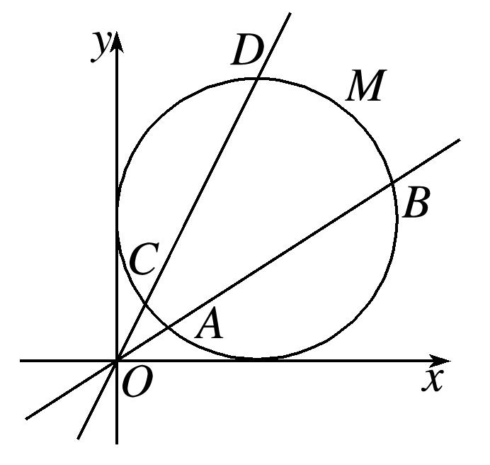

专题四　过极点的射线上线段长度及与长度相关的问题

极径的几何意义及其应用  
（1）几何意义：极径*ρ*表示极坐标平面内点*M*到极点*O*的距离．  
（2）应用：一般应用于过极点的直线与曲线相交，所得的弦长问题，需要用极径表示出弦长，结合根与系数的关系解题．

已知极坐标方程求线段的长度有两种方法
方法一　先将极坐标系下点的坐标、曲线方程转化为平面直角坐标系下的点的坐标、曲线方程，然后求线段的长度．
方法二　直接在极坐标系下求解，设<em>A</em>(<em>ρ</em>1，<em>θ</em>1)，<em>B</em>(<em>ρ</em>2，<em>θ</em>2)，则|<em>AB</em>|＝，如果直线过极点且与另一曲线相交，求交点之间的距离时，求出曲线的极坐标方程和直线的极坐标方程及交点的极坐标，则|<em>ρ</em>1－<em>ρ</em>2|即为所求．

【例题选讲】

<strong>[例1]</strong>　已知极坐标系的极点为平面直角坐标系<em>xOy</em>的原点，极轴为<em>x</em>轴的正半轴，两种坐标系中的长度单位相同，曲线<em>C</em>的参数方程为(<em>α</em>为参数)，直线<em>l</em>过点(－1，0)，且斜率为，射线<em>OM</em>的极坐标方程为<em>θ</em>＝．  
（1）求曲线*C*和直线*l*的极坐标方程；  
（2）已知射线*OM*与曲线*C*的交点为*O*，*P*，与直线*l*的交点为*Q*，则线段*PQ*的长．

<strong>[规范解答]</strong>　（1）∵曲线<em>C</em>的参数方程为(<em>α</em>为参数)，
∴曲线<em>C</em>的普通方程为(<em>x</em>＋1)2＋(<em>y</em>－1)2＝2，将<em>x</em>＝<em>ρ</em>cos <em>θ</em>，<em>y</em>＝<em>ρ</em>sin <em>θ</em>代入整理得<em>ρ</em>＋2cos <em>θ</em>－2sin <em>θ</em>＝0，
即曲线*C*的极坐标方程为*ρ*＝2sin.
∵直线*l*过点(－1，0)，且斜率为，∴直线*l*的方程为*y*＝(*x*＋1)，
∴直线*l*的极坐标方程为*ρ*cos *θ*－2*ρ*sin *θ*＋1＝0.  
（2）当*θ*＝时，|*OP*|＝2sin＝2，|*OQ*|＝＝，
故线段*PQ*的长为2－＝．

<strong>[例2]</strong>　已知平面直角坐标系中，曲线<em>C</em>的参数方程为(<em>α</em>为参数)，直线<em>l</em>1：<em>x</em>＝0，直线<em>l</em>2：<em>x</em>－<em>y</em>＝0，以原点为极点，<em>x</em>轴正半轴为极轴，建立极坐标系．  
（1）写出曲线<em>C</em>和直线<em>l</em>1，<em>l</em>2的极坐标方程；  
（2）若直线<em>l</em>1与曲线<em>C</em>交于<em>O</em>，<em>A</em>两点，直线<em>l</em>2与曲线<em>C</em>交于<em>O</em>，<em>B</em>两点，求|<em>AB</em>|.

<strong>[规范解答]</strong>　（1）依题意知，曲线<em>C</em>：(<em>x</em>－1)2＋2＝5，即<em>x</em>2－2<em>x</em>＋<em>y</em>2－4<em>y</em>＝0，
将*x*＝*ρ*cos *θ*，*y*＝*ρ*sin *θ*代入上式，得*ρ*＝2cos *θ*＋4sin *θ*．
因为直线<em>l</em>1：<em>x</em>＝0，直线<em>l</em>2：<em>x</em>－<em>y</em>＝0，
故直线<em>l</em>1，<em>l</em>2的极坐标方程为<em>l</em>1：<em>θ</em>＝(<em>ρ</em>∈<strong>R</strong>)，<em>l</em>2：<em>θ</em>＝(<em>ρ</em>∈<strong>R</strong>)．  
（2）设<em>A</em>，<em>B</em>两点对应的极径分别为<em>ρ</em>1，<em>ρ</em>2，在<em>ρ</em>＝2cos <em>θ</em>＋4sin <em>θ</em>中，
令<em>θ</em>＝，得<em>ρ</em>1＝2cos＋4sin＝4，令<em>θ</em>＝，得<em>ρ</em>2＝2cos＋4sin＝3，因为－＝，
所以|*AB*|＝＝．

<strong>[例3]</strong>　在直角坐标系<em>xOy</em>中，已知曲线<em>E</em>经过点<em>P</em>，其参数方程为(<em>α</em>为参数)，以原点<em>O</em>为极点，<em>x</em>轴的正半轴为极轴建立极坐标系．  
（1）求曲线*E*的极坐标方程；  
（2）若直线*l*交*E*于点*A*，*B*，且*OA*⊥*OB*，求证：＋为定值，并求出这个定值．

<strong>[规范解答]</strong>　（1）将点<em>P</em>代入曲线<em>E</em>的方程，得解得<em>a</em>2＝3，
所以曲线<em>E</em>的普通方程为＋＝1，极坐标方程为<em>ρ</em>2＝1．  
（2）不妨设点<em>A</em>，<em>B</em>的极坐标分别为<em>A</em>(<em>ρ</em>1，<em>θ</em>)，<em>B</em>，<em>ρ</em>1&gt;0，<em>ρ</em>2&gt;0，
则即
所以＋＝，即＋＝，所以＋为定值．

<strong>[例4]</strong>　在直角坐标系<em>xOy</em>中，以<em>O</em>为极点，<em>x</em>轴正半轴为极轴建立极坐标系．已知曲线<em>M</em>的参数方程为(<em>φ</em>为参数)，<em>l</em>1，<em>l</em>2为过点<em>O</em>的两条直线，<em>l</em>1交<em>M</em>于<em>A</em>，<em>B</em>两点，<em>l</em>2交<em>M</em>于<em>C</em>，<em>D</em>两点，且<em>l</em>1的倾斜角为<em>α</em>，∠<em>AOC</em>＝．  
（1）求<em>l</em>1和<em>M</em>的极坐标方程；  
（2）当*α*＝时，求点*O*到*A*，*B*，*C*，*D*四点的距离之和的最大值．

<strong>[规范解答]</strong>　（1）依题意知，直线<em>l</em>1的极坐标方程为<em>θ</em>＝<em>α</em>(<em>ρ</em>∈<strong>R</strong>)，

由消去<em>φ</em>，得(<em>x</em>－1)2＋(<em>y</em>－1)2＝1，将<em>x</em>＝<em>ρ</em>cos <em>θ</em>，<em>y</em>＝<em>ρ</em>sin <em>θ</em>代入上式，
得<em>ρ</em>2－2<em>ρ</em>cos <em>θ</em>－2<em>ρ</em>sin <em>θ</em>＋1＝0，故<em>M</em>的极坐标方程为<em>ρ</em>2－2<em>ρ</em>cos <em>θ</em>－2<em>ρ</em>sin <em>θ</em>＋1＝0．  
（2）依题意可设<em>A</em>(<em>ρ</em>1，<em>α</em>)，<em>B</em>(<em>ρ</em>2，<em>α</em>)，<em>C</em>，<em>D</em>，且<em>ρ</em>1，<em>ρ</em>2，<em>ρ</em>3，<em>ρ</em>4均为正数，
将<em>θ</em>＝<em>α</em>代入<em>ρ</em>2－2<em>ρ</em>cos <em>θ</em>－2<em>ρ</em>sin <em>θ</em>＋1＝0，得<em>ρ</em>2－2(cos <em>α</em>＋sin <em>α</em>)<em>ρ</em>＋1＝0，
所以<em>ρ</em>1＋<em>ρ</em>2＝2(cos <em>α</em>＋sin <em>α</em>)，同理可得，<em>ρ</em>3＋<em>ρ</em>4＝2，
所以点<em>O</em>到<em>A</em>，<em>B</em>，<em>C</em>，<em>D</em>四点的距离之和为<em>ρ</em>1＋<em>ρ</em>2＋<em>ρ</em>3＋<em>ρ</em>4＝2(cos <em>α</em>＋sin <em>α</em>)＋2

＝(1＋)sin *α*＋(3＋)cos *α*＝2(1＋)sin，
因为*α*∈，所以*α*＋∈，所以当sin＝sin＝1，即*α*＝时，

<em>ρ</em>1＋<em>ρ</em>2＋<em>ρ</em>3＋<em>ρ</em>4取得最大值2＋2，所以点<em>O</em>到<em>A</em>，<em>B</em>，<em>C</em>，<em>D</em>四点距离之和的最大值为2＋2．

<strong>[例5]</strong>　在直角坐标系<em>xOy</em>中，圆<em>C</em>的参数方程为(<em>α</em>为参数)，以<em>O</em>为极点，<em>x</em>轴的正半轴为极轴建立极坐标系，直线的极坐标方程为<em>ρ</em>(sin <em>θ</em>＋cos <em>θ</em>)＝,．  
（1）求*C*的极坐标方程；  
（2）射线<em>OM</em>：<em>θ</em>＝<em>θ</em>1与圆<em>C</em>的交点为<em>O</em>，<em>P</em>，与直线<em>l</em>的交点为<em>Q</em>，求|<em>OP</em>|·|<em>OQ</em>|的取值范围．

<strong>[规范解答]</strong>　（1）圆<em>C</em>的普通方程是(<em>x</em>－2)2＋<em>y</em>2＝4，又<em>x</em>＝<em>ρ</em>cos <em>θ</em>，<em>y</em>＝<em>ρ</em>sin <em>θ</em>，
所以圆*C*的极坐标方程为*ρ*＝4cos *θ*.  
（2）设<em>P</em>(<em>ρ</em>1，<em>θ</em>1)，则有<em>ρ</em>1＝4cos <em>θ</em>1，设<em>Q</em>(<em>ρ</em>2，<em>θ</em>1)，且直线<em>l</em>的极坐标方程是<em>ρ</em>(sin <em>θ</em>＋cos <em>θ</em>)＝，
则有<em>ρ</em>2＝，所以|<em>OP</em>||<em>OQ</em>|＝<em>ρ</em>1<em>ρ</em>2＝＝，
所以2≤|*OP*||*OQ*|≤3，即|*OP*||*OQ*|的取值范围是[2，3]．

<strong>[例6]</strong>　在平面直角坐标系<em>xOy</em>中，曲线<em>C</em>1的参数方程为(<em>α</em>为参数)，以原点<em>O</em>为极点，<em>x</em>轴的正半轴为极轴建立极坐标系，曲线<em>C</em>2的极坐标方程为<em>ρ</em>cos2<em>θ</em>＝sin <em>θ</em>(<em>ρ</em>≥0，0≤<em>θ</em>&lt;π)．  
（1）写出曲线<em>C</em>1的极坐标方程，并求<em>C</em>1与<em>C</em>2交点的极坐标；  
（2）射线<em>θ</em>＝<em>β</em>与曲线<em>C</em>1，<em>C</em>2分别交于点<em>A</em>，<em>B</em>(<em>A</em>，<em>B</em>异于原点)，求的取值范围．

<strong>[规范解答]</strong>　（1）由题意可得曲线<em>C</em>1的普通方程为<em>x</em>2＋(<em>y</em>－2)2＝4，把<em>x</em>＝<em>ρ</em>cos <em>θ</em>，<em>y</em>＝<em>ρ</em>sin <em>θ</em>代入，
得曲线<em>C</em>1的极坐标方程为<em>ρ</em>＝4sin <em>θ</em>，联立得4sin <em>θ</em>cos2<em>θ</em>＝sin <em>θ</em>，此时0≤<em>θ</em>&lt;π，

①当sin *θ*＝0时，*θ*＝0，*ρ*＝0，得交点的极坐标为(0，0)；
②当sin <em>θ</em>≠0时，cos2<em>θ</em>＝，当cos <em>θ</em>＝时，<em>θ</em>＝，<em>ρ</em>＝2，得交点的极坐标为，
当cos *θ*＝－时，*θ*＝，*ρ*＝2，得交点的极坐标为，
所以<em>C</em>1与<em>C</em>2交点的极坐标为(0，0)，，．  
（2）将<em>θ</em>＝<em>β</em>代入<em>C</em>1的极坐标方程中，得<em>ρ</em>1＝4sin <em>β</em>，代入<em>C</em>2的极坐标方程中，得<em>ρ</em>2＝，
所以＝＝4cos2<em>β</em>，因为≤<em>β</em>≤，所以1≤4cos2<em>β</em>≤3，所以的取值范围为[1，3]．

<strong>[例7]</strong>　在平面直角坐标系<em>xOy</em>中，曲线<em>C</em>1：(<em>φ</em>为参数)，其中<em>a</em>&gt;<em>b</em>&gt;0．以<em>O</em>为极点，<em>x</em>轴的正半轴为极轴的极坐标系中，曲线<em>C</em>2：<em>ρ</em>＝2cos <em>θ</em>，射线<em>l</em>：<em>θ</em>＝<em>α</em>(<em>ρ</em>≥0)．若射线<em>l</em>与曲线<em>C</em>1交于点<em>P</em>，当<em>α</em>＝0时，射线<em>l</em>与曲线<em>C</em>2交于点<em>Q</em>，|<em>PQ</em>|＝1；当<em>α</em>＝时，射线<em>l</em>与曲线<em>C</em>2交于点<em>O</em>，|<em>OP</em>|＝.  
（1）求曲线<em>C</em>1的普通方程；  
（2）设直线<em>l</em>′：(<em>t</em>为参数，<em>t</em>≠0)与曲线<em>C</em>2交于点<em>R</em>，若<em>α</em>＝，求△<em>OPR</em>的面积．

<strong>[规范解答]</strong>　（1）因为曲线<em>C</em>1的参数方程为(<em>φ</em>为参数)，且<em>a</em>&gt;<em>b</em>&gt;0，
所以曲线<em>C</em>1的普通方程为＋＝1，而其极坐标方程为＋＝1.
将*θ*＝0(*ρ*≥0)代入＋＝1，得*ρ*＝*a*，即点*P*的极坐标为；
将*θ*＝0(*ρ*≥0)代入*ρ*＝2cos *θ*，得*ρ*＝2，即点*Q*的极坐标为(2,0)．
因为|*PQ*|＝1，所以|*PQ*|＝|*a*－2|＝1，所以*a*＝1或*a*＝3.
将*θ*＝(*ρ*≥0)代入＋＝1，得*ρ*＝*b*，即点*P*的极坐标为，
因为|<em>OP</em>|＝，所以<em>b</em>＝．又因为<em>a</em>&gt;<em>b</em>&gt;0，所以<em>a</em>＝3，所以曲线<em>C</em>1的普通方程为＋＝1.  
（2）因为直线*l*′的参数方程为(*t*为参数，*t*≠0)，所以直线*l*′的普通方程为*y*＝－*x*(*x*≠0)，

而其极坐标方程为<em>θ</em>＝－(<em>ρ</em>∈<strong>R</strong>，<em>ρ</em>≠0)，
所以将直线<em>l</em>′的方程<em>θ</em>＝－代入曲线<em>C</em>2的方程<em>ρ</em>＝2cos <em>θ</em>，得<em>ρ</em>＝1，即|<em>OR</em>|＝1.
因为将射线<em>l</em>的方程<em>θ</em>＝(<em>ρ</em>≥0)代入曲线<em>C</em>1的方程＋＝1，得<em>ρ</em>＝，即|<em>OP</em>|＝，
所以<em>S</em>△<em>OPR</em>＝|<em>OP</em>||<em>OR</em>|sin∠<em>POR</em>＝××1×sin ＝．

<strong>[例8]</strong>　在平面直角坐标系<em>xOy</em>中，曲线<em>C</em>的参数方程为(<em>a</em>＞0)，以<em>O</em>为极点，<em>x</em>轴的正半轴为极轴，建立极坐标系，直线<em>l</em>的极坐标方程<em>ρ</em>cos＝．  
（1）若曲线*C*与*l*只有一个公共点，求*a*的值．  
（2）*A*，*B*为曲线*C*上的两点，且∠*AOB*＝，求△*OAB*的面积最大值．

<strong>[规范解答]</strong>　（1）曲线<em>C</em>是以(<em>a</em>，0)为圆心，以<em>a</em>为半径的圆；直线<em>l</em>的直角坐标方程为<em>x</em>＋<em>y</em>－3＝0，
由直线*l*与圆*C*只有一个公共点，则可得＝*a*，解得：*a*＝－3(舍)或*a*＝1，所以*a*＝1．  
（2）解法一：由题意，曲线*C*的极坐标方程为*ρ*＝2*a*cos *θ*(*a*＞0)，
设*A*的极角为*θ*，*B*的极角为*θ*＋，
则<em>S</em>△<em>OAB</em>＝|<em>OB</em>|·|<em>OA</em>|sin＝·|2<em>a</em>cos <em>θ</em>|＝<em>a</em>2
因为cos *θ*·cos＝cos＋，所以当*θ*＝－时，cos＋取得最大值，
所以△*AOB*的面积最大值为．
解法二：因为曲线*C*是以(*a*，0)为圆心，以*a*为半径的圆，且∠*AOB*＝，
由正弦定理得：＝2<em>a</em>，所以|<em>AB</em>|＝<em>a</em>，由余弦定理得：|<em>AB</em>|2＝3<em>a</em>2＝|<em>OA</em>|2＋|<em>OB</em>|2－|<em>OA</em>||<em>OB</em>|≥|<em>OA</em>||<em>OB</em>|，
则<em>S</em>△<em>OAB</em>＝|<em>OB</em>|·|<em>OA</em>|sin≤×3<em>a</em>2×＝．所以△<em>OAB</em>的面积最大值为．

<strong>[例9]</strong>　(2017·全国Ⅱ)在直角坐标系<em>xOy</em>中，以坐标原点为极点，<em>x</em>轴的正半轴为极轴建立极坐标系，曲线<em>C</em>1的极坐标方程为<em>ρ</em>cos <em>θ</em>＝4．  
（1）<em>M</em>为曲线<em>C</em>1上的动点，点<em>P</em>在线段<em>OM</em>上，且满足|<em>OM</em>|·|<em>OP</em>|＝16，求点<em>P</em>的轨迹<em>C</em>2的直角坐标方程；  
（2）设点<em>A</em>的极坐标为，点<em>B</em>在曲线<em>C</em>2上，求△<em>OAB</em>面积的最大值．

<strong>[规范解答]</strong>　（1）设点<em>P</em>的极坐标为(<em>ρ</em>，<em>θ</em>)(<em>ρ</em>&gt;0)，点<em>M</em>的极坐标为(<em>ρ</em>1，<em>θ</em>)(<em>ρ</em>1&gt;0)，由题设知，

|<em>OP</em>|＝<em>ρ</em>，|<em>OM</em>|＝<em>ρ</em>1＝．由|<em>OM</em>|·|<em>OP</em>|＝16，得<em>C</em>2的极坐标方程<em>ρ</em>＝4cos <em>θ</em>(<em>ρ</em>&gt;0)．
所以<em>C</em>2的直角坐标方程为(<em>x</em>－2)2＋<em>y</em>2＝4(<em>x</em>≠0)．  
（2）设点<em>B</em>的极坐标为(<em>ρB</em>，<em>α</em>)(<em>ρB</em>&gt;0)．由题设知|<em>OA</em>|＝2，<em>ρB</em>＝4cos <em>α</em>．于是△<em>OAB</em>的面积

<em>S</em>＝|<em>OA</em>|·<em>ρB</em>·sin∠<em>AOB</em>＝4cos <em>α</em>＝4cos <em>α</em>＝|sin 2<em>α</em>－cos 2<em>α</em>－|

＝2≤2＋．当2*α*－＝－，即*α*＝－时，*S*取得最大值2＋，
所以△*OAB*面积的最大值为2＋．

<strong>[例10]</strong>　在直角坐标系<em>xOy</em>中，曲线<em>C</em>1的参数方程为(<em>t</em>为参数，<em>a</em>&gt;0)．以坐标原点<em>O</em>为极点，以<em>x</em>轴正半轴为极轴的极坐标系中，曲线<em>C</em>1上一点<em>A</em>的极坐标为，曲线<em>C</em>2的极坐标方程为<em>ρ</em>＝cos <em>θ</em>．  
（1）求曲线<em>C</em>1的极坐标方程；  
（2）设点<em>M</em>，<em>N</em>在<em>C</em>1上，点<em>P</em>在<em>C</em>2上(异于极点)，若<em>O</em>，<em>M</em>，<em>P</em>，<em>N</em>四点依次在同一条直线<em>l</em>上，且|<em>MP</em>|，|<em>OP</em>|，|<em>PN</em>|成等比数列，求<em>l</em>的极坐标方程．

<strong>[规范解答]</strong>　（1）曲线<em>C</em>1的直角坐标方程为(<em>x</em>－<em>a</em>)2＋<em>y</em>2＝3，化简得<em>x</em>2＋<em>y</em>2－2<em>ax</em>＋<em>a</em>2－3＝0．
又<em>x</em>2＋<em>y</em>2＝<em>ρ</em>2，<em>x</em>＝<em>ρ</em>cos <em>θ</em>，所以<em>ρ</em>2－2<em>aρ</em>cos <em>θ</em>＋<em>a</em>2－3＝0．
代入点，得<em>a</em>2－<em>a</em>－2＝0，解得<em>a</em>＝2或<em>a</em>＝－1(舍去)．
所以曲线<em>C</em>1的极坐标方程为<em>ρ</em>2－4<em>ρ</em>cos <em>θ</em>＋1＝0．  
（2）由题意知，设直线<em>l</em>的极坐标方程为<em>θ</em>＝<em>α</em>(<em>ρ</em>∈<strong>R</strong>)，
设点<em>M</em>，<em>N</em>，<em>P</em>，则<em>ρ</em>1&lt;<em>ρ</em>3&lt;<em>ρ</em>2．
联立得<em>ρ</em>2－4<em>ρ</em>cos <em>α</em>＋1＝0，所以<em>ρ</em>1＋<em>ρ</em>2＝4cos <em>α</em>，<em>ρ</em>1<em>ρ</em>2＝1．
联立得<em>ρ</em>3＝cos <em>α</em>．因为|<em>MP</em>|，|<em>OP</em>|，|<em>PN</em>|成等比数列，
所以<em>ρ</em>＝(<em>ρ</em>3－<em>ρ</em>1)(<em>ρ</em>2－<em>ρ</em>3)，即2<em>ρ</em>＝(<em>ρ</em>1＋<em>ρ</em>2)<em>ρ</em>3－<em>ρ</em>1<em>ρ</em>2．所以2cos2<em>α</em>＝4cos2<em>α</em>－1，解得cos <em>α</em>＝(舍负)．
经检验，满足<em>O</em>，<em>M</em>，<em>P</em>，<em>N</em>四点依次在同一条直线上，所以<em>l</em>的极坐标方程为<em>θ</em>＝±(<em>ρ</em>∈<strong>R</strong>)．

【对点训练】

1．已知极坐标系的极点为直角坐标系*xOy*的原点，极轴为*x*轴的正半轴，两种坐标系中的长度单位相同，

圆<em>C</em>的直角坐标方程为<em>x</em>2＋<em>y</em>2＋2<em>x</em>－2<em>y</em>＝0，直线<em>l</em>的参数方程为(<em>t</em>为参数)，射线<em>OM</em>的极坐标方程为<em>θ</em>＝．  
（1）求圆*C*和直线*l*的极坐标方程；  
（2）已知射线*OM*与圆*C*的交点为*O*，*P*，与直线*l*的交点为*Q*，求线段*PQ*的长．

1．<strong>解析</strong>　（1）∵<em>ρ</em>2＝<em>x</em>2＋<em>y</em>2，<em>x</em>＝<em>ρ</em>cos <em>θ</em>，<em>y</em>＝<em>ρ</em>sin <em>θ</em>，圆<em>C</em>的直角坐标方程为<em>x</em>2＋<em>y</em>2＋2<em>x</em>－2<em>y</em>＝0，
∴<em>ρ</em>2＋2<em>ρ</em>cos <em>θ</em>－2<em>ρ</em>sin <em>θ</em>＝0，∴圆<em>C</em>的极坐标方程为<em>ρ</em>＝2sin.
又直线*l*的参数方程为(*t*为参数)，消去*t*后得*y*＝*x*＋1，
∴直线*l*的极坐标方程为sin *θ*－cos *θ*＝．  
（2）当*θ*＝时，|*OP*|＝2sin＝2，∴点*P*的极坐标为，|*OQ*|＝＝，
∴点*Q*的极坐标为，故线段*PQ*的长为．

2．(2016·全国Ⅱ)在直角坐标系<em>xOy</em>中，圆<em>C</em>的方程为(<em>x</em>＋6)2＋<em>y</em>2＝25．  
（1）以坐标原点为极点，*x*轴的正半轴为极轴建立极坐标系，求*C*的极坐标方程；  
（2）直线*l*的参数方程是(*t*为参数)，*l*与*C*交于*A*，*B*两点，|*AB*|＝，求*l*的斜率．

2．<strong>解析</strong>　（1）由<em>x</em>＝<em>ρ</em>cos <em>θ</em>，<em>y</em>＝<em>ρ</em>sin <em>θ</em>可得圆<em>C</em>的极坐标方程<em>ρ</em>2＋12<em>ρ</em>cos <em>θ</em>＋11＝0.  
（2）在（1）中建立的极坐标系中，直线<em>l</em>的极坐标方程为<em>θ</em>＝<em>α</em>(<em>ρ</em>∈<strong>R</strong>)．
设<em>A</em>，<em>B</em>所对应的极径分别为<em>ρ</em>1，<em>ρ</em>2，将<em>l</em>的极坐标方程代入到<em>C</em>的极坐标方程，得

<em>ρ</em>2＋12<em>ρ</em>cos <em>α</em>＋11＝0．于是<em>ρ</em>1＋<em>ρ</em>2＝－12cos <em>α</em>，<em>ρ</em>1<em>ρ</em>2＝11.

|<em>AB</em>|＝|<em>ρ</em>1－<em>ρ</em>2|＝＝.
由|<em>AB</em>|＝，得cos2<em>α</em>＝，tan <em>α</em>＝±，所以<em>l</em>的斜率为或－．

3．已知曲线<em>C</em>的极坐标方程为<em>ρ</em>2＝，以极点为平面直角坐标系的原点<em>O</em>，极轴为<em>x</em>轴的正

半轴建立平面直角坐标系．  
（1）求曲线*C*的直角坐标方程；  
（2）*A*，*B*为曲线*C*上两点，若*OA*⊥*OB*，求＋的值．

3．<strong>解析</strong>　（1）由<em>ρ</em>2＝得<em>ρ</em>2cos2<em>θ</em>＋9<em>ρ</em>2sin2<em>θ</em>＝9，
将<em>x</em>＝<em>ρ</em>cos <em>θ</em>，<em>y</em>＝<em>ρ</em>sin <em>θ</em>代入得到曲线<em>C</em>的直角坐标方程是＋<em>y</em>2＝1.  
（2）因为<em>ρ</em>2＝，所以＝＋sin2<em>θ</em>，
由<em>OA</em>⊥<em>OB</em>，设<em>A</em>(<em>ρ</em>1，<em>α</em>)，则点<em>B</em>的坐标可设为，
所以＋＝＋＝＋sin2<em>α</em>＋＋cos2<em>α</em>＝＋1＝.

4．已知曲线*C*的参数方程是(*φ*为参数，*a*>0)，直线*l*的参数方程是(*t*为参数)，

曲线*C*与直线*l*有一个公共点在*x*轴上，以坐标原点为极点，*x*轴的正半轴为极轴建立极坐标系．  
（1）求曲线*C*的普通方程；  
（2）若点<em>A</em>(<em>ρ</em>1，<em>θ</em>)，<em>B</em>，<em>C</em>在曲线<em>C</em>上，求＋＋的值．

4．<strong>解析</strong>　（1）直线<em>l</em>的普通方程为<em>x</em>＋<em>y</em>＝2，与<em>x</em>轴的交点为(2，0)．又曲线<em>C</em>的普通方程为＋＝1，
所以*a*＝2，故所求曲线*C*的普通方程是＋＝1.  
（2）因为点<em>A</em>(<em>ρ</em>1，<em>θ</em>)，<em>B</em>，<em>C</em>在曲线<em>C</em>上，
即点<em>A</em>(<em>ρ</em>1cos <em>θ</em>，<em>ρ</em>1sin <em>θ</em>)，<em>B</em>，<em>C</em>在曲线<em>C</em>上，
故＋＋＝＋＋＝

＋

＝＋

＝×＋×＝.

5．在平面直角坐标系<em>xOy</em>中，曲线<em>C</em>1的参数方程为(<em>α</em>为参数)；在以原点<em>O</em>为极点，<em>x</em>轴

的正半轴为极轴的极坐标系中，曲线<em>C</em>2的极坐标方程为<em>ρ</em>cos2 <em>θ</em>＝sin <em>θ</em>.  
（1）求曲线<em>C</em>1的极坐标方程和曲线<em>C</em>2的直角坐标方程；  
（2）若射线<em>l</em>：<em>y</em>＝<em>kx</em>(<em>x</em>≥0)与曲线<em>C</em>1，<em>C</em>2的交点分别为<em>A</em>，<em>B</em>(<em>A</em>，<em>B</em>异于原点)，当斜率<em>k</em>∈(1，]时，求|<em>OA</em>|·|<em>OB</em>|的取值范围.

5．<strong>解析</strong>　（1）曲线<em>C</em>1的直角坐标方程为(<em>x</em>－1)2＋<em>y</em>2＝1，即<em>x</em>2－2<em>x</em>＋<em>y</em>2＝0，
将代入并化简得曲线<em>C</em>1的极坐标方程为<em>ρ</em>＝2cos <em>θ</em>.
由<em>ρ</em>cos2 <em>θ</em>＝sin <em>θ</em>两边同时乘<em>ρ</em>，得<em>ρ</em>2cos2 <em>θ</em>＝<em>ρ</em>sin <em>θ</em>，

结合得曲线<em>C</em>2的直角坐标方程为<em>x</em>2＝<em>y</em>.  
（2）设射线*l*：*y*＝*kx*(*x*≥0)的倾斜角为*φ*，则射线的极坐标方程为*θ*＝*φ*，且*k*＝tan *φ*∈(1，].
联立得|<em>OA</em>|＝<em>ρA</em>＝2cos <em>φ</em>，联立得|<em>OB</em>|＝<em>ρB</em>＝，
所以|<em>OA</em>|·|<em>OB</em>|＝<em>ρA</em>·<em>ρB</em>＝2cos <em>φ</em>·＝2tan <em>φ</em>＝2<em>k</em>∈(2，2]，即|<em>OA</em>|·|<em>OB</em>|的取值范围是(2，2].

6．在直角坐标系*xOy*中，曲线*C*的参数方程为(*φ*为参数).以坐标原点为极点，*x*轴的正半

轴为极轴建立极坐标系，*A*，*B*为*C*上两点，且*OA*⊥*OB*，设射线*OA*：*θ*＝*α*，其中0<*α*<.  
（1）求曲线*C*的极坐标方程；  
（2）求|*OA*|·|*OB*|的最小值.

6．<strong>解析</strong>　（1）将曲线<em>C</em>的参数方程(<em>φ</em>为参数)化为普通坐标方程为＋<em>y</em>2＝1.
因为<em>x</em>＝<em>ρ</em>cos <em>θ</em>，<em>y</em>＝<em>ρ</em>sin <em>θ</em>，所以曲线<em>C</em>的极坐标方程为<em>ρ</em>2＝.．  
（2）根据题意：射线*OB*的极坐标方程为*θ*＝*α*＋或*θ*＝*α*－，
所以|*OA*|＝，|*OB*|＝＝，
所以|*OA*|·|*OB*|＝＝≥＝.
当且仅当sin2 <em>α</em>＝cos2 <em>α</em>，即<em>α</em>＝时，|<em>OA</em>|·|<em>OB</em>|取得最小值为.

7．在直角坐标系<em>xOy</em>中，曲线<em>C</em>1的参数方程为(其中<em>φ</em>为参数)，曲线<em>C</em>2：<em>x</em>2＋<em>y</em>2－2<em>y</em>＝0．

以原点<em>O</em>为极点，<em>x</em>轴的正半轴为极轴建立极坐标系，射线<em>l</em>：<em>θ</em>＝<em>α</em>(<em>ρ</em>≥0)与曲线<em>C</em>1，<em>C</em>2分别交于点<em>A</em>，<em>B</em>(均异于原点<em>O</em>)．  
（1）求曲线<em>C</em>1，<em>C</em>2的极坐标方程；  
（2）当0&lt;<em>α</em>&lt;时，求|<em>OA</em>|2＋|<em>OB</em>|2的取值范围．

7．<strong>解析</strong>　（1）∵∴＋<em>y</em>2＝1，由得曲线<em>C</em>1的极坐标方程为<em>ρ</em>2＝；
∵<em>x</em>2＋<em>y</em>2－2<em>y</em>＝0，∴曲线<em>C</em>2的极坐标方程为<em>ρ</em>＝2sin <em>θ</em>.  
（2）设<em>A</em>，<em>B</em>对应的极径分别为<em>ρ</em>1，<em>ρ</em>2，则由（1）得，|<em>OA</em>|2＝<em>ρ</em>＝，|<em>OB</em>|2＝<em>ρ</em>＝4sin2 <em>α</em>，
∴|<em>OA</em>|2＋|<em>OB</em>|2＝＋4sin2 <em>α</em>＝＋4(1＋sin2<em>α</em>)－4，
∵0&lt;<em>α</em>&lt;，∴1&lt;1＋sin2<em>α</em>&lt;2，∴6&lt;＋4(1＋sin2<em>α</em>)&lt;9，∴|<em>OA</em>|2＋|<em>OB</em>|2的取值范围为(2，5).  
（2）另解　联立<em>θ</em>＝<em>α</em>(<em>ρ</em>≥0)与<em>C</em>1的极坐标方程得|<em>OA</em>|2＝，
联立<em>θ</em>＝<em>α</em>(<em>ρ</em>≥0)与<em>C</em>2的极坐标方程得|<em>OB</em>|2＝4sin2<em>α</em>，
则|<em>OA</em>|2＋|<em>OB</em>|2＝＋4sin2<em>α</em>＝＋4(1＋sin2<em>α</em>)－4.
令<em>t</em>＝1＋sin2<em>α</em>，则|<em>OA</em>|2＋|<em>OB</em>|2＝＋4<em>t</em>－4，
当0<*α*<时，*t*∈(1，2)，设*f*(*t*)＝＋4*t*－4，易得*f*(*t*)在(1，2)上单调递增，
∴2&lt;|<em>OA</em>|2＋|<em>OB</em>|2&lt;5，故|<em>OA</em>|2＋|<em>OB</em>|2的取值范围是(2，5).

8．在直角坐标系*xOy*中，曲线*C*的参数方程为(*α*为参数)，直线*l*的参数方程为

(*t*为参数)，在以坐标原点为极点，*x*轴的正半轴为极轴的极坐标系中，射线*m*：*θ*＝*β*(*ρ*>0)．  
（1）求*C*和*l*的极坐标方程；  
（2）设点*A*是*m*与*C*的一个交点(异于原点)，点*B*是*m*与*l*的交点，求的最大值．

8．<strong>解析</strong>　（1）曲线<em>C</em>的普通方程为(<em>x</em>－1)2＋<em>y</em>2＝1，由得2＋<em>ρ</em>2sin2<em>θ</em>＝1，
化简得*C*的极坐标方程为*ρ*＝2cos *θ*.
因为*l*的普通方程为*x*＋*y*－4＝0，所以极坐标方程为*ρ*cos *θ*＋*ρ*sin *θ*－4＝0，
所以*l*的极坐标方程为*ρ*sin＝2．  
（2）设<em>A</em>(<em>ρ</em>1，<em>β</em>)，<em>B</em>(<em>ρ</em>2，<em>β</em>)，则＝＝2cos <em>β</em>·＝(sin <em>β</em>cos <em>β</em>＋cos2<em>β</em>)＝sin＋，
由射线*m*与*C*，直线*l*相交，则不妨设*β*∈，则2*β*＋∈，
所以当2<em>β</em>＋＝，即<em>β</em>＝时，取得最大值，即max＝．

9．已知圆<em>C</em>：<em>x</em>2＋<em>y</em>2＝4，直线<em>l</em>：<em>x</em>＋<em>y</em>＝2.以<em>O</em>为极点，<em>x</em>轴的正半轴为极轴，取相同的单位长度建立极

坐标系．  
（1）将圆*C*和直线*l*方程化为极坐标方程；  
（2）<em>P</em>是<em>l</em>上的点，射线<em>OP</em>交圆<em>C</em>于点<em>R</em>，又点<em>Q</em>在<em>OP</em>上，且满足|<em>OQ</em>|·|<em>OP</em>|＝|<em>OR</em>|2，当点<em>P</em>在<em>l</em>上移动时，求点<em>Q</em>轨迹的极坐标方程．

9．<strong>解析</strong>　（1）将<em>x</em>＝<em>ρ</em>cos <em>θ</em>，<em>y</em>＝<em>ρ</em>sin <em>θ</em>分别代入圆<em>C</em>和直线<em>l</em>的直角坐标方程得其极坐标方程为

*C*：*ρ*＝2，*l*：*ρ*(cos *θ*＋sin *θ*)＝2.  
（2）设<em>P</em>，<em>Q</em>，<em>R</em>的极坐标分别为(<em>ρ</em>1，<em>θ</em>)，(<em>ρ</em>，<em>θ</em>)，(<em>ρ</em>2，<em>θ</em>)，则由|<em>OQ</em>|·|<em>OP</em>|＝|<em>OR</em>|2，得<em>ρρ</em>1＝<em>ρ</em>.
又<em>ρ</em>2＝2，<em>ρ</em>1＝，所以＝4，
故点*Q*轨迹的极坐标方程为*ρ*＝2(cos *θ*＋sin *θ*)(*ρ*≠0)．

10．已知直线*l*的参数方程为(*t*为参数)，曲线*C*的参数方程为(*θ*为参数)，

以坐标原点为极点，*x*轴的正半轴为极轴建立极坐标系，点*P*的极坐标为.  
（1）求直线*l*以及曲线*C*的极坐标方程；  
（2）设直线*l*与曲线*C*交于*A*，*B*两点，求△*PAB*的面积．

10．<strong>解析</strong>　（1）由消去<em>t</em>得<em>y</em>＝<em>x</em>，则<em>ρ</em>sin <em>θ</em>＝<em>ρ</em>cos <em>θ</em>，∴<em>θ</em>＝，
∴直线<em>l</em>的极坐标方程为<em>θ</em>＝(<em>ρ</em>∈<strong>R</strong>)．

曲线<em>C</em>：(<em>x</em>－1)2＋(<em>y</em>－2)2＝4，则(<em>ρ</em>cos <em>θ</em>－1)2＋(<em>ρ</em>sin <em>θ</em>－2)2＝4，
∴曲线<em>C</em>的极坐标方程为<em>ρ</em>2－2<em>ρ</em>cos <em>θ</em>－4<em>ρ</em>sin <em>θ</em>＋9＝0.  
（2）由得到<em>ρ</em>2－7<em>ρ</em>＋9＝0，设其两根为<em>ρ</em>1，<em>ρ</em>2，
则<em>ρ</em>1＋<em>ρ</em>2＝7，<em>ρ</em>1<em>ρ</em>2＝9，∴|<em>AB</em>|＝|<em>ρ</em>2－<em>ρ</em>1|＝＝.
∵点*P*的极坐标为，∴|*OP*|＝2，∠*POB*＝，
∴<em>S</em>△<em>PAB</em>＝|<em>S</em>△<em>POB</em>－<em>S</em>△<em>POA</em>|＝××2×|<em>AB</em>|＝.

11．在直角坐标系*xOy*中，曲线*C*的参数方程为(*α*为参数).以平面直角坐标系的原点为

极点，*x*轴的正半轴为极轴建立极坐标系.  
（1）求曲线*C*的极坐标方程；  
（2）过原点<em>O</em>的直线<em>l</em>1，<em>l</em>2分别与曲线<em>C</em>交于除原点外的<em>A</em>，<em>B</em>两点，若∠<em>AOB</em>＝，求△<em>AOB</em>的面积的最大值.

11．<strong>解析</strong>　（1）曲线<em>C</em>的普通方程为(<em>x</em>－)2＋(<em>y</em>－1)2＝4，即<em>x</em>2＋<em>y</em>2－2<em>x</em>－2<em>y</em>＝0，
所以，曲线<em>C</em>的极坐标方程为<em>ρ</em>2－2<em>ρ</em>cos <em>θ</em>－2<em>ρ</em>sin <em>θ</em>＝0，即<em>ρ</em>＝4sin.  
（2）不妨设<em>A</em>(<em>ρ</em>1，<em>θ</em>)，<em>B</em>，<em>θ</em>∈，则<em>ρ</em>1＝4sin，<em>ρ</em>2＝4sin，

△<em>AOB</em>的面积<em>S</em>＝|<em>OA</em>|·|<em>OB</em>|sin＝<em>ρ</em>1<em>ρ</em>2sin ＝4sinsin＝2cos 2<em>θ</em>＋≤3.
所以，当*θ*＝0时，△*AOB*的面积取最大值3.

12．在直角坐标系<em>xOy</em>中，曲线<em>C</em>1的参数方程为(<em>θ</em>为参数)，点<em>M</em>为曲线<em>C</em>1上的动点，

动点<em>P</em>满足＝<em>a</em>(<em>a</em>&gt;0且<em>a</em>≠1)，点<em>P</em>的轨迹为曲线<em>C</em>2.  
（1）求曲线<em>C</em>2的方程，并说明<em>C</em>2是什么曲线；  
（2）在以坐标原点为极点，以<em>x</em>轴的正半轴为极轴的极坐标系中，<em>A</em>点的极坐标为，射线<em>θ</em>＝<em>α</em>与<em>C</em>2的异于极点的交点为<em>B</em>，已知△<em>AOB</em>面积的最大值为4＋2，求<em>a</em>的值．

12．<strong>解析</strong>　（1）设<em>P</em>(<em>x</em>，<em>y</em>)，<em>M</em>，由＝<em>a</em>，得∴
∵点<em>M</em>在<em>C</em>1上，∴即(<em>θ</em>为参数)，
消去参数<em>θ</em>，得2＋<em>y</em>2＝4<em>a</em>2(<em>a</em>&gt;0且<em>a</em>≠1)．∴曲线<em>C</em>2是以为圆心，以2<em>a</em>为半径的圆．  
（2）方法一　*A*点的直角坐标为(1，)，∴直线*OA*的普通方程为*y*＝*x*，即*x*－*y*＝0．
设*B*点坐标为(2*a*＋2*a*cos *α*，2*a*sin *α*)，则*B*点到直线*x*－*y*＝0的距离

<em>d</em>＝＝<em>a</em>．∴当<em>α</em>＝－时，<em>d</em>max＝(＋2)<em>a</em>．
∴<em>S</em>△<em>AOB</em>的最大值为×2×(＋2)<em>a</em>＝4＋2，∴<em>a</em>＝2．
方法二　将<em>x</em>＝<em>ρ</em>cos <em>θ</em>，<em>y</em>＝<em>ρ</em>sin <em>θ</em>代入2＋<em>y</em>2＝4<em>a</em>2，并整理得<em>ρ</em>＝4<em>a</em>cos <em>θ</em>，
令*θ*＝*α*，得*ρ*＝4*a*cos *α*，∴*B*．
∴<em>S</em>△<em>AOB</em>＝|<em>OA</em>|·|<em>OB</em>|·sin∠<em>AOB</em>＝4<em>a</em>cos <em>α</em>＝<em>a</em>|2sin <em>α</em>cos <em>α</em>－2cos2<em>α</em>|

＝*a*|sin 2*α*－cos 2*α*－|＝*a*，
∴当<em>α</em>＝－时，<em>S</em>△<em>AOB</em>取得最大值(2＋)<em>a</em>，依题意知(2＋)<em>a</em>＝4＋2，∴<em>a</em>＝2．

