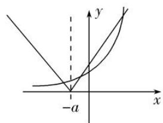

# 专题02 曲线的切线方程

# 考点一 求切线的方程

# 【方法总结】

# 求曲线切线方程的步骤

(1)求曲线在点 $P(x_{0}, y_{0})$ 处的切线方程的步骤

第一步，求出函数 $y=f(x)$ 在点 $x=x_{0}$ 处的导数值 $f'(x_{0})$ ，即曲线 $y=f(x)$ 在点 $P(x_{0}, f(x_{0}))$ 处切线的斜率；

第二步，由点斜式方程求得切线方程为 $y - f(x_{0}) = f'(x_{0}) \cdot (x - x_{0})$ .

(2)求曲线过点 $P(x_{0}, y_{0})$ 的切线方程的步骤

第一步，设出切点坐标 $P'(x_{1}, f(x_{1}))$ ;

第二步，写出过 $P'(x_{1}, f(x_{1}))$ 的切线方程为 $y - f(x_{1}) = f'(x_{1})(x - x_{1})$ ;

第三步，将点 P 的坐标 $(x_{0}, y_{0})$ 代入切线方程，求出 $x_{1}$ ;

第四步，将 $x_{1}$ 的值代入方程 $y-f(x_{1})=f'(x_{1})(x-x_{1})$ 可得过点 $P(x_{0},y_{0})$ 的切线方程.

注意：在求曲线的切线方程时，注意两个“说法”：求曲线在点 $P$ 处的切线方程和求曲线过点 $P$ 的切线方程，在点 $P$ 处的切线，一定是以点 $P$ 为切点，过点 $P$ 的切线，不论点 $P$ 在不在曲线上，点 $P$ 不一定是切点.

# 【例题选讲】

[例 1](1)(2021·全国甲)曲线 $y=\frac{2x-1}{x+2}$ 在点 $(-1,-3)$ 处的切线方程为 \_\_\_\_.

(2) (2020·全国I)函数 $f(x)=x^{4}-2x^{3}$ 的图象在点 $(1, f(1))$ 处的切线方程为()

A. $y = -2x - 1$

B. $y = -2x + 1$

C. y=2x-3

D. $y=2x+1$

(3) (2018·全国 I ) 设函数 $f(x) = x^3 + (a - 1)x^2 + ax$ . 若 $f(x)$ 为奇函数, 则曲线 $y = f(x)$ 在点 (0, 0) 处的切线方程为 ( )

A. $y = -2x$

B. $y = -x$

C. y=2x

D. y=x

(4) (2020·全国 I ) 曲线 $y = \ln x + x + 1$ 的一条切线的斜率为 2，则该切线的方程为 \_\_\_\_.

(5)已知函数 $f(x) = x\ln x$ ，若直线 $l$ 过点 $(0, -1)$ ，并且与曲线 $y = f(x)$ 相切，则直线 $l$ 的方程为 \_\_\_\_.

(6) (2021·新高考I)若过点 $(a, b)$ 可以作曲线 $y = e^{x}$ 的两条切线，则（）

A. $e^{b}<a$

B. $e^{a}<b$

C. $0 < a < e^{b}$

D. $0<b<e^{a}$

(7)已知曲线 $f(x) = x^{3} - x + 3$ 在点 $P$ 处的切线与直线 $x + 2y - 1 = 0$ 垂直，则 $P$ 点的坐标为（）

A. $(1, 3)$

B. $(-1, 3)$

C. (1, 3)或(-1, 3)

D. $(1, -3)$

(8) (2019·江苏)在平面直角坐标系 $xOy$ 中, 点 $A$ 在曲线 $y = \ln x$ 上, 且该曲线在点 $A$ 处的切线经过点(-e, -1)(e为自然对数的底数), 则点 $A$ 的坐标是 \_\_\_\_.

(9)设函数 $f(x)=x^{3}+(a-1)\cdot x^{2}+ax$ ，若 $f(x)$ 为奇函数，且函数 $y=f(x)$ 在点 $P(x_{0},f(x_{0}))$ 处的切线与直线 $x+y=0$ 垂直，则切点 $P(x_{0},f(x_{0}))$ 的坐标为 \_\_\_\_.

(10)函数 $y=\frac{x-1}{x+1}$ 在点 $(0, -1)$ 处的切线与两坐标轴围成的封闭图形的面积为()

A. $\frac{1}{8}$

B. $\frac{1}{4}$

C. $\frac{1}{2}$

D. 1

(11)曲线 $y=x^{2}-\ln x$ 上的点到直线 x-y-2=0 的最短距离是 \_\_\_\_.

# 【对点训练】

1. 设点 $P$ 是曲线 $y = x^{3} - \sqrt{3} x + \frac{2}{3}$ 上的任意一点，则曲线在点 $P$ 处切线的倾斜角 $\alpha$ 的取值范围为（ ）

A. $\left[0, \frac{\pi}{2}\right] \cup \left[\frac{5\pi}{6}, \pi\right]$

B. $\left[\frac{2\pi}{3},\pi\right]$

C. $\left[0, \frac{\pi}{2}\right] \cup \left[\frac{2\pi}{3}, \pi\right]$

D. $\left(\frac{\pi}{2},\frac{5\pi}{6}\right]$

2. 函数 $f(x)=\mathrm{e}^{x}+\frac{1}{x}$ 在 x=1 处的切线方程为 \_\_\_\_.

3. (2019·全国 I) 曲线 $y = 3(x^{2} + x)e^{x}$ 在点(0, 0)处的切线方程为 \_\_\_\_.

4. 曲线 $f(x) = \frac{1 - 2\ln x}{x}$ 在点 $P(1, f(1))$ 处的切线 $l$ 的方程为()

A. $x+y-2=0$

B. $2x+y-3=0$

C. $3x+y+2=0$

D. $3x+y-4=0$

5. (2019·全国Ⅱ)曲线 $y=2\sin x+\cos x$ 在点 $(\pi,-1)$ 处的切线方程为()

A. $x - y - \pi -1 = 0$

B. $2x - y - 2\pi - 1 = 0$

C. $2x+y-2\pi+1=0$

D. $x+y-\pi+1=0$

6. (2019·天津)曲线 $y=\cos x-\frac{x}{2}$ 在点(0,1)处的切线方程为 \_\_\_\_.

7. 已知 $f(x)=x\left(\mathrm{e}^{x}+\frac{a}{\mathrm{e}^{x}}\right)$ 为奇函数(其中 e 是自然对数的底数)，则曲线 $y=f(x)$ 在 x=0 处的切线方程为 \_\_\_\_.

8. 已知曲线 $y=\frac{1}{3}x^{3}$ 上一点 $P\left(2,\frac{8}{3}\right)$ ，则过点 P 的切线方程为 \_\_\_\_.

9. 已知函数 $f(x) = x \ln x$ ，若直线 $l$ 过点 $(0, -1)$ ，并且与曲线 $y = f(x)$ 相切，则直线 $l$ 的方程为 \_\_\_\_.

10. 设函数 $f(x) = f\left(\frac{1}{2}\right)x^2 - 2x + f(1)\ln x$ ，曲线 $f(x)$ 在 $(1, f(1))$ 处的切线方程是（）

A. 5x-y-4=0

B. 3x-y-2=0

C. x-y=0

D. x=1

11. 我国魏晋时期的科学家刘徽创立了“割圆术”，实施“以直代曲”的近似计算，用正 n 边形进行“内外夹逼”的办法求出了圆周率 $\pi$ 的精度较高的近似值，这是我国最优秀的传统科学文化之一．借用“以直代曲”的近似计算方法，在切点附近，可以用函数图象的切线近似代替在切点附近的曲线来近似计算．设 $f(x)=\ln(1+x)$ ，则曲线 $y=f(x)$ 在点 $(0,0)$ 处的切线方程为 \_\_\_\_，用此结论计算 $\ln2022-\ln2021\approx$ \_\_\_\_．

12. 曲线 $f(x)=x+\ln x$ 在点 $(1,1)$ 处的切线与坐标轴围成的三角形的面积为()

A. 2

B. $\frac{3}{2}$

C. $\frac{1}{2}$

D. $\frac{1}{4}$

13. 已知曲线 $y=\frac{1}{3}x^{3}+\frac{4}{3}$ .

(1)求曲线在点 $P(2, 4)$ 处的切线方程;

(2)求曲线过点 $P(2, 4)$ 的切线方程.

14. 设函数 $f(x) = ax - \frac{b}{x}$ ，曲线 $y = f(x)$ 在点(2, $f(2)$ )处的切线方程为 $7x - 4y - 12 = 0$ .

(1)求 $f(x)$ 的解析式;

(2)证明曲线 $f(x)$ 上任一点处的切线与直线 $x = 0$ 和直线 $v = x$ 所围成的三角形面积为定值，并求此定值.

15. (2021·全国乙)已知函数 $f(x) = x^{3} - x^{2} + ax + 1$ .

(1)讨论 $f(x)$ 的单调性;

(2)求曲线 $y=f(x)$ 过坐标原点的切线与曲线 $y=f(x)$ 的公共点的坐标.

# 考点二 求参数的值(范围)

# 【方法总结】

处理与切线有关的参数问题，通常根据曲线、切线、切点的三个关系列出参数的方程并解出参数：①切点处的导数是切线的斜率；②切点在切线上；③切点在曲线上.

注意：曲线上横坐标的取值范围；谨记切点既在切线上又在曲线上.

# 【例题选讲】

[例 1](1)已知曲线 $f(x)=ax^{3}+\ln x$ 在 $(1, f(1))$ 处的切线的斜率为 2，则实数 a 的值是 \_\_\_\_.

(2)若函数 $f(x) = \ln x + 2x^{2} - ax$ 的图象上存在与直线 $2x - y = 0$ 平行的切线，则实数 $a$ 的取值范围是 \_\_\_\_.

(3)设函数 $f(x)=a\ln x+bx^{3}$ 的图象在点(1, -1)处的切线经过点(0, 1)，则 $a+b$ 的值为 \_\_\_\_.

(4)(2019·全国III)已知曲线 $y=ae^{x}+x\ln x$ 在点 $(1, ae)$ 处的切线方程为 $y=2x+b$ ，则()

A. $a = \mathrm{e}, b = -1$

B. $a = \mathrm{e}, b = 1$

C. $a = \mathrm{e}^{-1}$ ， $b = 1$

D. $a = \mathrm{e}^{-1}$ ， $b = -1$

(5)设曲线 $y = \frac{x + 1}{x - 2}$ 在点(1，-2)处的切线与直线 $ax + by + c = 0$ 垂直，则 $\frac{a}{b} = (\quad)$

A. $\frac{1}{3}$

B. $-\frac{1}{3}$

C. 3

D.-3

(6)已知直线 y=kx-2 与曲线 $y=x\ln x$ 相切，则实数 k 的值为 \_\_\_\_.

(7)已知函数 $f(x) = x + \frac{a}{2x}$ ，若曲线 $y = f(x)$ 存在两条过(1, 0)点的切线，则 $a$ 的取值范围是 \_\_\_\_.

(8)关于 x 的方程 $2|x+a|=e^{x}$ 有 3 个不同的实数解，则实数 a 的取值范围为 \_\_\_\_.

text_image

-a
y
x

# 【对点训练】

1. 若曲线 $y = x \ln x$ 在 $x = 1$ 与 $x = t$ 处的切线互相垂直，则正数 $t$ 的值为 \_\_\_\_.

2. 设曲线 $y = \mathrm{e}^{ax} - \ln (x + 1)$ 在 $x = 0$ 处的切线方程为 $2x - y + 1 = 0$ ，则 $a = (\quad)$

A. 0

B. 1

C. 2

D. 3

3. 若曲线 $f(x) = x^3 - x + 3$ 在点 $P$ 处的切线平行于直线 $y = 2x - 1$ ，则 $P$ 点的坐标为( )

A. $(1, 3)$

B. $(-1, 3)$

C. (1, 3)或(-1, 3)

D. $(1, -3)$

4. 函数 $f(x) = \ln x + ax$ 的图象存在与直线 $2x - y = 0$ 平行的切线，则实数 $a$ 的取值范围是 \_\_\_\_.

5. 已知函数 $f(x) = x \cos x + a \sin x$ 在 $x = 0$ 处的切线与直线 $3x - y + 1 = 0$ 平行，则实数 $a$ 的值为 \_\_\_\_.

6. 已知函数 $f(x)=x^{3}+ax+b$ 的图象在点 $(1,f(1))$ 处的切线方程为 2x-y-5=0，则 a=\_\_\_\_; b=\_\_\_\_.

7. 若函数 $f(x) = ax - \frac{3}{x}$ 的图象在点(1, $f(1)$ )处的切线过点(2, 4)，则 $a =$ \_\_\_\_.

8. 若曲线 $y = \mathrm{e}^x$ 在 $x = 0$ 处的切线也是曲线 $y = \ln x + b$ 的切线，则 $b = (\quad)$

A. -1

B. 1

C. 2

D. e

9. 曲线 $y = (ax + 1)e^x$ 在点(0, 1)处的切线与 $x$ 轴交于点 $\left(-\frac{1}{2}, 0\right)$ ，则 $a =$ \_\_\_\_；

10. 过点 $M(-1, 0)$ 引曲线 $C: y = 2x^{3} + ax + a$ 的两条切线，这两条切线与 $y$ 轴分别交于 $A$ 、 $B$ 两点，若 $|MA| = |MB|$ ，则 $a =$ \_\_\_\_.

11. 已知曲线 $C: f(x) = x^3 - 3x$ ，直线 $l: y = ax - \sqrt{3}a$ ，则 $a = 6$ 是直线 $l$ 与曲线 $C$ 相切的（）

A. 充分不必要条件

B. 必要不充分条件

C. 充要条件

D. 既不充分也不必要条件

12. 已知点 $M$ 是曲线 $y = \frac{1}{3} x^3 - 2x^2 + 3x + 1$ 上任意一点，曲线在 $M$ 处的切线为 $l$ ，求：

(1)斜率最小的切线方程;

(2)切线 l 的倾斜角 $\alpha$ 的取值范围.

13. 已知函数 $f(x)=x^{3}+(1-a)x^{2}-a(a+2)x+b(a,\ b\in\mathbf{R})$ .

(1)若函数 $f(x)$ 的图象过原点，且在原点处的切线斜率为 -3，求 a, b 的值；  
(2)若曲线 $y=f(x)$ 存在两条垂直于 y 轴的切线，求 a 的取值范围.

14. 已知函数 $f(x) = \frac{1}{3} x^3 - 2x^2 + 3x (x \in \mathbf{R})$ 的图象为曲线 $C$ .

(1)求在曲线 C 上任意一点切线斜率的取值范围;  
(2)若在曲线 C 上存在两条相互垂直的切线，求其中一条切线与曲线 C 的切点的横坐标的取值范围.

