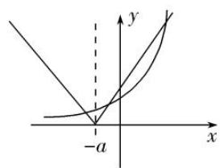

# 专题02 曲线的切线方程

# 考点一 求切线的方程

# 【方法总结】

# 求曲线切线方程的步骤  
（1）求曲线在点 $P(x_{0}, y_{0})$ 处的切线方程的步骤

第一步，求出函数 $y=f(x)$ 在点 $x=x_{0}$ 处的导数值 $f'(x_{0})$ ，即曲线 $y=f(x)$ 在点 $P(x_{0}, f(x_{0}))$ 处切线的斜率；
第二步，由点斜式方程求得切线方程为 $y - f(x_{0}) = f'(x_{0}) \cdot (x - x_{0})$ .  
（2）求曲线过点 $P(x_{0}, y_{0})$ 的切线方程的步骤

第一步，设出切点坐标 $P'(x_{1}, f(x_{1}))$ ;
第二步，写出过 $P'(x_{1}, f(x_{1}))$ 的切线方程为 $y - f(x_{1}) = f'(x_{1})(x - x_{1})$ ;
第三步，将点 P 的坐标 $(x_{0}, y_{0})$ 代入切线方程，求出 $x_{1}$ ;
第四步，将 $x_{1}$ 的值代入方程 $y-f(x_{1})=f'(x_{1})(x-x_{1})$ 可得过点 $P(x_{0},y_{0})$ 的切线方程.

注意：在求曲线的切线方程时，注意两个“说法”：求曲线在点 $P$ 处的切线方程和求曲线过点 $P$ 的切线方程，在点 $P$ 处的切线，一定是以点 $P$ 为切点，过点 $P$ 的切线，不论点 $P$ 在不在曲线上，点 $P$ 不一定是切点.

# 【例题选讲】

[例 1]（1）(2021·全国甲)曲线 $y=\frac{2x-1}{x+2}$ 在点 $(-1,-3)$ 处的切线方程为 \_\_\_\_.
答案 $5x - y + 2 = 0$ 解析 $y' = \left(\frac{2x - 1}{x + 2}\right)' = \frac{2(x + 2) - (2x - 1)}{(x + 2)^2} = \frac{5}{(x + 2)^2}$ ，所以 $y'|_{x=-1} = \frac{5}{(-1 + 2)^2} = 5$ ，所以切线方程为 $y + 3 = 5(x + 1)$ ，即 $5x - y + 2 = 0$ 。  
（2） (2020·全国I)函数 $f(x) = x^4 - 2x^3$ 的图象在点(1, $f(1)$ )处的切线方程为()

A. $y = -2x - 1$

B. $y = -2x + 1$

C. y=2x-3

D. $y=2x+1$
答案 B 解析 $f(1)=1-2=-1$ ，切点坐标为 $(1,-1)$ ， $f'(x)=4x^{3}-6x^{2}$ ，所以切线的斜率为 $k=f'（1）=4\times1^{3}-6\times1^{2}=-2$ ，切线方程为 $y+1=-2(x-1)$ ，即 $y=-2x+1$ 。  
（3） (2018·全国 I ) 设函数 $f(x) = x^3 + (a - 1)x^2 + ax$ . 若 $f(x)$ 为奇函数, 则曲线 $y = f(x)$ 在点 (0, 0) 处的切线方程为 ( )

A. y = -2x

B. $y = -x$

C. y=2x

D. y=x
答案 D 解析 法一 因为函数 $f(x)=x^{3}+(a-1)x^{2}+ax$ 为奇函数，所以 $f(-x)=-f(x)$ ，所以 $(-x)^{3}+(a-1)(-x)^{2}+a(-x)=-[x^{3}+(a-1)x^{2}+ax]$ ，所以 $2(a-1)x^{2}=0$ 。因为 $x\in R$ ，所以 a=1，所以 $f(x)=x^{3}+x$ ，所以 $f'(x)=3x^{2}+1$ ，所以 $f'（0）=1$ ，所以曲线 $y=f(x)$ 在点 $(0,0)$ 处的切线方程为 y=x。故选 D.

法二 因为函数 $f(x) = x^{3} + (a - 1)x^{2} + ax$ 为奇函数，所以 $f(-1) + f(1) = 0$ ，所以 $-1 + a - 1 - a + (1 + a - 1 + a) = 0$ ，解得 $a = 1$ ，此时 $f(x) = x^{3} + x$ （经检验， $f(x)$ 为奇函数），所以 $f'(x) = 3x^{2} + 1$ ，所以 $f'（0） = 1$ ，所以曲

线 $y=f(x)$ 在点 $(0,0)$ 处的切线方程为 y=x. 故选 D.

法三 易知 $f(x)=x^{3}+(a-1)x^{2}+ax=x[x^{2}+(a-1)x+a]$ ，因为 $f(x)$ 为奇函数，所以函数 $g(x)=x^{2}+(a-1)x+a$ 为偶函数，所以 a-1=0，解得 a=1，所以 $f(x)=x^{3}+x$ ，所以 $f'(x)=3x^{2}+1$ ，所以 $f'（0）=1$ ，所以曲线 $y=f(x)$ 在点 $(0,0)$ 处的切线方程为 y=x。故选 D.  
（4） (2020·全国 I ) 曲线 $y = \ln x + x + 1$ 的一条切线的斜率为 2，则该切线的方程为 \_\_\_\_.
答案 $2x - y = 0$ 解析 设切点坐标为 $(x_0, y_0)$ ，因为 $y = \ln x + x + 1$ ，所以 $y' = \frac{1}{x} + 1$ ，所以切线的斜率为 $\frac{1}{x_0} + 1 = 2$ ，解得 $x_0 = 1$ 。所以 $y_0 = \ln 1 + 1 + 1 = 2$ ，即切点坐标为 $(1, 2)$ ，所以切线方程为 $y - 2 = 2(x - 1)$ ，即 $2x - y = 0$ 。  
（5）已知函数 $f(x) = x\ln x$ ，若直线 $l$ 过点 $(0, -1)$ ，并且与曲线 $y = f(x)$ 相切，则直线 $l$ 的方程为 \_\_\_\_.
答案 $x - y - 1 = 0$ 解析 $\because$ 点 $(0, -1)$ 不在曲线 $f(x) = x\ln x$ 上， $\therefore$ 设切点为 $(x_0, y_0)$ . 又 $\because f'(x) = 1 + \ln x, \therefore$ 直线 $l$ 的方程为 $y + 1 = (1 + \ln x_0)x$ . $\therefore$ 由 $\left\{ \begin{array}{l} y_0 = x_0\ln x_0, \\ y_0 + 1 = (1 + \ln x_0)x_0, \end{array} \right.$ 解得 $x_0 = 1, y_0 = 0$ . $\therefore$ 直线 $l$ 的方程为 $y = x - 1$ ，即 $x - y - 1 = 0$ .  
（6） (2021·新高考I)若过点(a, b)可以作曲线 $y = e^{x}$ 的两条切线，则()

A. $e^{b}<a$

B. $e^{a}<b$

C. $0 < a < e^{b}$

D. $0 < b < e^{a}$
答案 D 解析 根据 $y=e^{x}$ 图象特征， $y=e^{x}$ 是下凸函数，又过点 $(a,b)$ 可以作曲线 $y=e^{x}$ 的两条切线，则点 $(a,b)$ 在曲线 $y=e^{x}$ 的下方且在 x 轴的上方，得 $0<b<e^{a}$ 。故选 D.  
（7）已知曲线 $f(x)=x^{3}-x+3$ 在点 P 处的切线与直线 $x+2y-1=0$ 垂直，则 P 点的坐标为()

A. $(1, 3)$

B. $(-1, 3)$

C. $(1, 3)$ 或 $(-1, 3)$

D. $(1,-3)$
答案 C 解析 设切点 $P(x_{0}, y_{0})$ , $f'(x)=3x^{2}-1$ ，又直线 $x+2y-1=0$ 的斜率为 $-\frac{1}{2}$ , $\therefore f'(x_{0})=3x_{0}^{2}-1=2$ , $\therefore x_{0}^{2}=1$ , $\therefore x_{0}=\pm1$ ，又切点 $P(x_{0}, y_{0})$ 在 $y=f(x)$ 上， $\therefore y_{0}=x_{0}^{3}-x_{0}+3$ , $\therefore$ 当 x\_{0}=1 时， $y_{0}=3$ ; 当 x\_{0}=-1 时， $y_{0}=3$ . $\therefore$ 切点 P 为 (1, 3) 或 (-1, 3).  
（8） (2019·江苏)在平面直角坐标系 $xOy$ 中，点 $A$ 在曲线 $y = \ln x$ 上，且该曲线在点 $A$ 处的切线经过点（一e，-1)(e为自然对数的底数)，则点 $A$ 的坐标是 \_\_\_\_.
答案 (e, 1) 解析 设 $A(m, n)$ , 则曲线 $y = \ln x$ 在点 $A$ 处的切线方程为 $y - n = \frac{1}{m} (x - m)$ . 又切线过点 $(-e, -1)$ , 所以有 $n + 1 = \frac{1}{m} (m + e)$ . 再由 $n = \ln m$ , 解得 $m = e, n = 1$ . 故点 $A$ 的坐标为 $(e, 1)$ .  
（9）设函数 $f(x) = x^{3} + (a - 1)\cdot x^{2} + ax$ ，若 $f(x)$ 为奇函数，且函数 $y = f(x)$ 在点 $P(x_0, f(x_0))$ 处的切线与直线 $x + y = 0$ 垂直，则切点 $P(x_0, f(x_0))$ 的坐标为 \_\_\_\_.
答案 (0, 0) 解析 $\because f(x) = x^3 + (a - 1)x^2 + ax, \therefore f'(x) = 3x^2 + 2(a - 1)x + a.$ 又 $f(x)$ 为奇函数， $\therefore f(-x) = -f(x)$ 恒成立，即 $-x^3 + (a - 1)x^2 - ax = -x^3 - (a - 1)x^2 - ax$ 恒成立， $\therefore a = 1, f'(x) = 3x^2 + 1, 3x_0^2 + 1 = 1, x_0 = 0, f(x_0) = 0, \therefore$ 切点 $P(x_0, f(x_0))$ 的坐标为(0, 0).  
（10）函数 $y=\frac{x-1}{x+1}$ 在点 $(0, -1)$ 处的切线与两坐标轴围成的封闭图形的面积为()

A. $\frac{1}{8}$

B. $\frac{1}{4}$

C. $\frac{1}{2}$

D. 1
答案 B 解析 $\because y=\frac{x-1}{x+1},\quad\therefore y'=\frac{(x+1)-(x-1)}{(x+1)^{2}}=\frac{2}{x+1}$ , $\therefore k=y'|_{x=0}=2,\quad\therefore$ 切线方程为 $y+1=2(x-0)$ ，即 y=2x-1，令 x=0，得 y=-1；令 y=0，得 $x=\frac{1}{2}$ ，故所求的面积为 $\frac{1}{2}\times1\times\frac{1}{2}=\frac{1}{4}$ .  
（11）曲线 $y=x^{2}-\ln x$ 上的点到直线 x-y-2=0 的最短距离是 \_\_\_\_.
答案 $\sqrt{2}$ 解析 设曲线在点 $P(x_0, y_0)(x_0 > 0)$ 处的切线与直线 $x - y - 2 = 0$ 平行，则 $y' \big|_{x = x_0} = \left(2x - \frac{1}{x}\right) \big|_{x = x_0} = 2x_0 - \frac{1}{x_0} = 1$ . $\therefore x_0 = 1, y_0 = 1$ ，则 $P(1, 1)$ ，则曲线 $y = x^2 - \ln x$ 上的点到直线 $x - y - 2 = 0$ 的最短距离 $d = \frac{|1 - 1 - 2|}{\sqrt{1^2 + (-1)^2}} = \sqrt{2}$ .

# 【对点训练】

1. 设点 $P$ 是曲线 $y = x^{3} - \sqrt{3} x + \frac{2}{3}$ 上的任意一点，则曲线在点 $P$ 处切线的倾斜角 $\alpha$ 的取值范围为（ ）

A. $\left[0, \frac{\pi}{2}\right] \cup \left[\frac{5\pi}{6}, \pi\right]$

B. $\left[\frac{2\pi}{3},\pi\right]$

C. $\left[0, \frac{\pi}{2}\right] \cup \left[\frac{2\pi}{3}, \pi\right]$

D. $\left(\frac{\pi}{2},\frac{5\pi}{6}\right]$

1. 答案 C 解析 $y' = 3x^{2} - \sqrt{3}, \therefore y' \geq -\sqrt{3}, \therefore \tan \alpha \geq -\sqrt{3},$ 又 $\alpha \in [0, \pi)$ ，故 $\alpha \in \begin{bmatrix} 0, & \frac{\pi}{2} \end{bmatrix} \cup \begin{bmatrix} \frac{2\pi}{3}, & \pi \end{bmatrix}$ ，故选 C.

2. 函数 $f(x)=\mathrm{e}^{x}+\frac{1}{x}$ 在 x=1 处的切线方程为 \_\_\_\_.

2. 答案 $y = (e - 1)x + 2$ 解析 $f'(x) = e^x - \frac{1}{x^2}$ , $\therefore f'（1） = e - 1$ , 又 $f(1) = e + 1$ , $\therefore$ 切点为 $(1, e + 1)$ , 切线斜率 $k = f'（1） = e - 1$ , 即切线方程为 $y - (e + 1) = (e - 1)(x - 1)$ , 即 $y = (e - 1)x + 2$ .

3. (2019·全国 I ) 曲线 $y=3(x^{2}+x)e^{x}$ 在点 $(0,0)$ 处的切线方程为 \_\_\_\_.

3. 答案 $y = 3x$ 解析 $y' = 3(2x + 1)e^x + 3(x^2 + x)e^x = 3e^x (x^2 + 3x + 1)$ ，所以曲线在点(0, 0)处的切线的斜率 $k = e^{0} \times 3 = 3$ ，所以所求切线方程为 $y = 3x$ .

4. 曲线 $f(x) = \frac{1 - 2\ln x}{x}$ 在点 $P(1, f(1))$ 处的切线 $l$ 的方程为()

A. $x+y-2=0$

B. $2x+y-3=0$

C. $3x+y+2=0$

D. $3x+y-4=0$

4. 答案 D 解析 因为 $f(x)=\frac{1-2\ln x}{x}$ ，所以 $f'(x)=\frac{-3+2\ln x}{x^{2}}$ 。又 $f(1)=1$ ，且 $f'（1）=-3$ ，故所求切线方程为 $y-1=-3(x-1)$ ，即 $3x+y-4=0$ 。

5. (2019·全国Ⅱ)曲线 $y=2\sin x+\cos x$ 在点 $(\pi,-1)$ 处的切线方程为()

A. $x - y - \pi - 1 = 0$

B. 2x-y-2π-1=0

C. $2x+y-2\pi+1=0$

D. $x + y - \pi + 1 = 0$

5. 答案 C 解析 设 $y=f(x)=2\sin x+\cos x$ ，则 $f'(x)=2\cos x-\sin x,\quad\therefore f'(\pi)=-2,\quad\therefore$ 曲线在点 $(\pi,-1)$ 处的切线方程为 $y-(-1)=-2(x-\pi)$ ，即 $2x+y-2\pi+1=0$ 。故选 C.

6. (2019·天津)曲线 $y=\cos x-\frac{x}{2}$ 在点(0,1)处的切线方程为 \_\_\_\_.

6. 答案 $y = -\frac{1}{2} x + 1$ 解析 $y' = -\sin x - \frac{1}{2}$ ，将 $x = 0$ 代入，可得切线斜率为 $-\frac{1}{2}$ . 所以切线方程为 $y - 1 = -\frac{1}{2} x$ ，即 $y = -\frac{1}{2} x + 1$ .

7. 已知 $f(x)=x\left(\mathrm{e}^{x}+\frac{a}{\mathrm{e}^{x}}\right)$ 为奇函数(其中 e 是自然对数的底数)，则曲线 $y=f(x)$ 在 x=0 处的切线方程为 \_\_\_\_.

7. 答案 $2x - y = 0$ 解析 $\because f(x)$ 为奇函数， $\therefore f(-1) + f(1) = 0$ ，即 $\mathrm{e} + \frac{a}{\mathrm{e}} - \frac{1}{\mathrm{e}} - a\mathrm{e} = 0$ ，解得 $a = 1$ ， $f(x) = x\left(\mathrm{e}^x + \frac{1}{\mathrm{e}^x}\right)$ ， $\therefore f'(x) = \left(\mathrm{e}^x + \frac{1}{\mathrm{e}^x}\right) + x\left(\mathrm{e}^x - \frac{1}{\mathrm{e}^x}\right)$ ， $\therefore$ 曲线 $y = f(x)$ 在 $x = 0$ 处的切线的斜率为 2，又 $f(0) = 0$ ， $\therefore$ 曲线 $y = f(x)$ 在 $x = 0$ 处的切线的方程为 $2x - y = 0$ 。

8. 已知曲线 $y=\frac{1}{3}x^{3}$ 上一点 $P\left(2,\frac{8}{3}\right)$ ，则过点 P 的切线方程为 \_\_\_\_.

8. 答案 $3x - 3y + 2 = 0$ 或 $12x - 3y - 16 = 0$ 解析 设切点坐标为 $\left[ \begin{array}{l} x_0, \frac{1}{3} x_0^3 \end{array} \right]$ ，由 $y' = \left[ \begin{array}{l} \frac{1}{3} x^3 \end{array} \right]' = x^2$ ，得 $y'|x = x_0 = x_0^2$ ，即过点 $P$ 的切线的斜率为 $x_0^2$ ，又切线过点 $P\left[2, \frac{8}{3}\right]$ ，若 $x_0 \neq 2$ ，则 $x_0^2 = \frac{\frac{1}{3} x_0^3 - \frac{8}{3}}{x_0 - 2}$ ，解得 $x_0 = -1$ ，此时切线的斜率为 1；若 $x_0 = 2$ ，则切线的斜率为 4．故所求的切线方程是 $y - \frac{8}{3} = x - 2$ 或 $y - \frac{8}{3} = 4(x - 2)$ ，即 $3x - 3y + 2 = 0$ 或 $12x - 3y - 16 = 0$ ．

9. 已知函数 $f(x) = x \ln x$ ，若直线 $l$ 过点 $(0, -1)$ ，并且与曲线 $y = f(x)$ 相切，则直线 $l$ 的方程为 \_\_\_\_.

9. 答案 $x - y - 1 = 0$ 解析 $\because$ 点 $(0, -1)$ 不在曲线 $f(x) = x\ln x$ 上， $\therefore$ 设切点为 $(x_0, y_0)$ . 又 $\because f'(x) = 1 + \ln x, \therefore$ 直线 $l$ 的方程为 $y + 1 = (1 + \ln x_0)x$ . $\therefore$ 由 $\left\{ \begin{array}{l} y_0 = x_0\ln x_0, \\ y_0 + 1 = (1 + \ln x_0)x_0, \end{array} \right.$ 解得 $x_0 = 1, y_0 = 0$ . $\therefore$ 直线 $l$ 的方程为 $y = x - 1$ ，即 $x - y - 1 = 0$ .

10. 设函数 $f(x) = f\left(\frac{1}{2}\right)x^2 - 2x + f(1)\ln x$ ，曲线 $f(x)$ 在 $(1, f(1))$ 处的切线方程是（）

A. 5x-y-4=0

B. $3x - y - 2 = 0$

C. x-y=0

D. $x = 1$

10. 答案 A 解析 因为 $f(x)=f^{\left(\frac{1}{2}\right)}x^{2}-2x+f(1)\ln x$ ，所以 $f'(x)=2f^{\left(\frac{1}{2}\right)}x-2+\frac{f(1)}{x}$ 。令 $x=\frac{1}{2}$ 得 $f^{\left(\frac{1}{2}\right)}=2f^{\left(\frac{1}{2}\right)}$ $\times\frac{1}{2}-2+2f(1)$ ，即 $f(1)=1$ 。又 $f(1)=f^{\left(\frac{1}{2}\right)}-2$ ，所以 $f^{\left(\frac{1}{2}\right)}=3$ ，所以 $f'（1）=2f^{\left(\frac{1}{2}\right)}-2+f(1)=6-2+1=5$ 。所以曲线在点 $(1, f(1))$ 处的切线方程为 y-1=5(x-1)，即 5x-y-4=0。

11. 我国魏晋时期的科学家刘徽创立了“割圆术”，实施“以直代曲”的近似计算，用正 $n$ 边形进行“内外夹逼”的办法求出了圆周率 $\pi$ 的精度较高的近似值，这是我国最优秀的传统科学文化之一．借用“以直代曲”

的近似计算方法，在切点附近，可以用函数图象的切线近似代替在切点附近的曲线来近似计算．设 $f(x)=\ln(1+x)$ ，则曲线 $y=f(x)$ 在点 $(0,0)$ 处的切线方程为\_\_\_\_，用此结论计算 $\ln2022-\ln2021\approx$ \_\_\_\_.

11. 答案 $y = x \frac{1}{2021}$ 解析 函数 $f(x) = \ln(1 + x)$ ，则 $f'(x) = \frac{1}{1 + x}, f'（0） = 1, f(0) = 0, \therefore$ 切线方程为 $y = x$ . $\ln 2022 - \ln 2021 = \ln \left(1 + \frac{1}{2021}\right) = f\left(\frac{1}{2021}\right)$ ，根据以直代曲， $x = \frac{1}{2021}$ 也非常接近切点 $x = 0$ . $\therefore$ 可以将 $x = \frac{1}{2021}$ 代入切线近似代替 $f\left(\frac{1}{2021}\right)$ ，即 $f\left(\frac{1}{2021}\right) \approx \frac{1}{2021}$ .

12. 曲线 $f(x) = x + \ln x$ 在点(1, 1)处的切线与坐标轴围成的三角形的面积为( )

A. 2

B. $\frac{3}{2}$

C. $\frac{1}{2}$

D. $\frac{1}{4}$

12. 答案 D 解析 $f'(x)=1+\frac{1}{x}$ ，则 $f'（1）=2$ ，故曲线 $f(x)=x+\ln x$ 在点 $(1,1)$ 处的切线方程为 $y-1=2(x-1)$ ，即 y=2x-1，此切线与两坐标轴的交点坐标分别为 $(0,-1)$ ， $\left(\frac{1}{2},0\right)$ ，则切线与坐标轴围成的三角形的面积为 $\frac{1}{2}\times1\times\frac{1}{2}=\frac{1}{4}$ ，故选 D.

13. 已知曲线 $y=\frac{1}{3}x^{3}+\frac{4}{3}$ .  
（1）求曲线在点 $P(2, 4)$ 处的切线方程;  
（2）求曲线过点 $P(2, 4)$ 的切线方程.

13. 解析 （1） $\because P(2,4)$ 在曲线 $y=\frac{1}{3}x^{3}+\frac{4}{3}$ 上，且 $y'=x^{2}$ ,
∴在点 $P(2, 4)$ 处的切线的斜率为 $y'\big|_{x=2}=4$ .
∴曲线在点 $P(2, 4)$ 处的切线方程为 y-4=4(x-2)，即 4x-y-4=0.  
（2）设曲线 $y=\frac{1}{3}x^{3}+\frac{4}{3}$ 与过点 $P(2,4)$ 的切线相切于点 $A\left(x_{0},\frac{1}{3}x_{0}^{3}+\frac{4}{3}\right)$ ，则切线的斜率为 $y'|x=x_{0}=x_{0}^{2}$ .
∴切线方程为 $y-\left(\frac{1}{3}x_{0}^{3}+\frac{4}{3}\right)=x_{0}^{2}(x-x_{0})$ ，即 $y=x_{0}^{2}\cdot x-\frac{2}{3}x_{0}^{3}+\frac{4}{3}$ .
∵点 $P(2,4)$ 在切线上，∴ $4=2x_{0}^{2}-\frac{2}{3}x_{0}^{3}+\frac{4}{3}$ ，即 $x_{0}^{3}-3x_{0}^{2}+4=0$ ，∴ $x_{0}^{3}+x_{0}^{2}-4x_{0}^{2}+4=0$ ，
$\therefore x_{0}^{2}(x_{0} + 1) - 4(x_{0} + 1)(x_{0} - 1) = 0,\quad \therefore (x_{0} + 1)(x_{0} - 2)^{2} = 0$ ，解得 $x_0 = -1$ 或 $x_0 = 2$
故所求的切线方程为 $x-y+2=0$ 或 4x-y-4=0.

14. 设函数 $f(x)=ax-\frac{b}{x}$ ，曲线 $y=f(x)$ 在点 $(2, f(2))$ 处的切线方程为 7x-4y-12=0.  
（1）求 $f(x)$ 的解析式;  
（2）证明曲线 $f(x)$ 上任一点处的切线与直线 x=0 和直线 y=x 所围成的三角形面积为定值，并求此定值.

14. 解析 （1） 方程 $7x - 4y - 12 = 0$ 可化为 $y = \frac{7}{4} x - 3$ ,
当 $x = 2$ 时， $y = \frac{1}{2}$ 。又 $f'(x) = a + \frac{b}{x^2}$ ，于是 $\left\{ \begin{array}{l} 2a - \frac{b}{2} = \frac{1}{2}, \\ a + \frac{b}{4} = \frac{7}{4}, \end{array} \right.$ 解得 $\left\{ \begin{array}{l} a = 1, \\ b = 3. \end{array} \right.$ 故 $f(x) = x - \frac{3}{x}$ .  
（2）设 $P(x_{0}, y_{0})$ 为曲线上任一点，
由 $y'=1+\frac{3}{x^{2}}$ 知曲线在点 $P(x_{0},y_{0})$ 处的切线方程为 $y-y_{0}=\left(1+\frac{3}{x_{0}^{2}}\right)(x-x_{0})$ ,
即 $y-\left(x_{0}-\frac{3}{x_{0}}\right)=\left(1+\frac{3}{x_{0}^{2}}\right)(x-x_{0})$ . 令 x=0，得 $y=-\frac{6}{x_{0}}$ ,
从而得切线与直线 x=0 的交点坐标为 $\left(0, -\frac{6}{x_{0}}\right)$ .
令 y=x，得 $y=x=2x_{0}$ ，从而得切线与直线 y=x 的交点坐标为 $(2x_{0}, 2x_{0})$ .
所以点 $P(x_{0}, y_{0})$ 处的切线与直线 x=0, y=x 所围成的三角形的面积为 $S=\frac{1}{2}\left|\frac{-6}{x_{0}}\right| |2x_{0}|=6$ .
故曲线 $y=f(x)$ 上任一点处的切线与直线 x=0，y=x 所围成的三角形面积为定值，且此定值为 6.

15. (2021·全国乙)已知函数 $f(x) = x^{3} - x^{2} + ax + 1$ .  
（1）讨论 $f(x)$ 的单调性;  
（2）求曲线 $y=f(x)$ 过坐标原点的切线与曲线 $y=f(x)$ 的公共点的坐标.

15. 解析 （1）由题意知 $f(x)$ 的定义域为 R, $f'(x)=3x^{2}-2x+a$ ，对于 $f'(x)=0$ , $\Delta=(-2)^{2}-4\times3a=4(1-3a)$ .

① 当 $a \geq \frac{1}{3}$ 时， $\Delta \leq 0$ ， $f'(x) \geq 0$ 在 R 上恒成立，所以 $f(x)$ 在 R 上单调递增；
②当 $a<\frac{1}{3}$ 时，令 $f(x)=0$ ，即 $3x^{2}-2x+a=0$ ，解得 $x_{1}=\frac{1-\sqrt{1-3a}}{3}$ ， $x_{2}=\frac{1+\sqrt{1-3a}}{3}$ ，
令 $f'(x)>0$ ，则 $x<x_{1}$ 或 $x>x_{2}$ ；令 $f'(x)<0$ ，则 $x_{1}<x<x_{2}$ .
所以 $f(x)$ 在 $(-∞, x_{1})$ 上单调递增，在 $(x_{1}, x_{2})$ 上单调递减，在 $(x_{2}, +∞)$ 上单调递增.

综上，当 $a \geq \frac{1}{3}$ 时， $f(x)$ 在 $\mathbf{R}$ 上单调递增；当 $a < \frac{1}{3}$ 时， $f(x)$ 在 $\left(-\infty, \frac{1 - \sqrt{1 - 3a}}{3}\right)$ 上单调递增，
在 $\left(\frac{1-\sqrt{1-3a}}{3},\frac{1+\sqrt{1-3a}}{3}\right)$ 上单调递减，在 $\left(\frac{1+\sqrt{1-3a}}{3},+\infty\right)$ 上单调递增.  
（2）记曲线 $y=f(x)$ 过坐标原点的切线为 l，切点为 $P(x_{0}, x_{0}^{3}-x_{0}^{2}+ax_{0}+1)$ .
因为 $f'(x_{0})=3x_{0}^{2}-2x_{0}+a$ ，所以切线 l 的方程为 $y-(x_{0}^{3}-x_{0}^{2}+ax_{0}+1)=(3x_{0}^{2}-2x_{0}+a)(x-x_{0})$ .
由 l 过坐标原点，得 $2x_{0}^{3}-x_{0}^{2}-1=0$ ，解得 $x_{0}=1$ ，所以切线 l 的方程为 $y=(1+a)x$ .
由 $\left\{\begin{aligned}y=(1+a)x,\\ y=x^{3}-x^{2}+ax+1\end{aligned}\right.$ 解得 $\left\{\begin{aligned}x=1,\\ y=1+a\end{aligned}\right.$ 或 $\left\{\begin{aligned}x=-1,\\ y=-1-a.\end{aligned}\right.$
所以曲线 $y=f(x)$ 过坐标原点的切线与曲线 $y=f(x)$ 的公共点的坐标为 $(1, 1+a)$ 和 $(-1, -1-a)$ .

# 考点二 求参数的值(范围)

# 【方法总结】

处理与切线有关的参数问题，通常根据曲线、切线、切点的三个关系列出参数的方程并解出参数：①切点处的导数是切线的斜率；②切点在切线上；③切点在曲线上.

注意：曲线上横坐标的取值范围；谨记切点既在切线上又在曲线上.

# 【例题选讲】

[例 1]（1）已知曲线 $f(x)=ax^{3}+\ln x$ 在 $(1, f(1))$ 处的切线的斜率为 2，则实数 a 的值是 \_\_\_\_.
答案 $\frac{1}{3}$ 解析 $f(x)=3ax^{2}+\frac{1}{x}$ ，则 $f'（1）=3a+1=2$ ，解得 $a=\frac{1}{3}$ .  
（2）若函数 $f(x) = \ln x + 2x^{2} - ax$ 的图象上存在与直线 $2x - y = 0$ 平行的切线，则实数 $a$ 的取值范围是 \_\_\_\_.
答案 [2, +∞) 解析 直线 2x-y=0 的斜率 k=2，又曲线 $f(x)$ 上存在与直线 2x-y=0 平行的切线，∴ $f'(x)=\frac{1}{x}+4x-a=2$ 在 $(0, +\infty)$ 内有解，则 $a=4x+\frac{1}{x}-2,\quad x>0$ 。又 $4x+\frac{1}{x}\geq2\sqrt{4x\cdot\frac{1}{x}}=4$ ，当且仅当 $x=\frac{1}{2}$ 时取“=”。∴ $a\geq4-2=2$ 。∴ a 的取值范围是 $[2, +\infty)$ .  
（3）设函数 $f(x) = a \ln x + bx^3$ 的图象在点(1, -1)处的切线经过点(0, 1)，则 $a + b$ 的值为 \_\_\_\_.
答案 0 解析 依题意得 $f(x) = \frac{a}{x} + 3bx^2$ ，于是有 $\begin{cases} f(1) = -1, \\ f'（1） = \frac{1 + 1}{0 - 1}, \end{cases}$ 即 $\begin{cases} b = -1, \\ a + 3b = -2, \end{cases}$ 解得 $\begin{cases} a = 1, \\ b = -1, \end{cases}$ 所以 $a + b = 0$ .  
（4）(2019·全国III)已知曲线 $y=ae^{x}+x\ln x$ 在点(1, ae)处的切线方程为 $y=2x+b$ ，则()

A. $a = \mathrm{e}, b = -1$

B. $a = \mathrm{e}, b = 1$

C. $a = \mathrm{e}^{-1}$ ， $b = 1$

D. $a = \mathrm{e}^{-1}$ ， $b = -1$
答案 D 解析 因为 $y' = ae^{x} + \ln x + 1$ ，所以 $y'|_{x=1} = ae + 1$ ，所以曲线在点 $(1, ae)$ 处的切线方程为 $y - ae = (ae + 1)(x - 1)$ ，即 $y = (ae + 1)x - 1$ ，所以 $\begin{cases} ae + 1 = 2, \\ b = -1, \end{cases}$ 解得 $\begin{cases} a = e^{-1}, \\ b = -1. \end{cases}$  
（5）设曲线 $y=\frac{x+1}{x-2}$ 在点 $(1,-2)$ 处的切线与直线 $ax+by+c=0$ 垂直，则 $\frac{a}{b}=(\quad)$

A. $\frac{1}{3}$

B. $-\frac{1}{3}$

C. 3

D. -3
答案 B 解析 由题可得 $y' = \frac{-3}{(x - 2)^2}$ ，所以曲线在点(1，-2)处的切线的斜率为-3．因为切线与直线 $ax + by + c = 0$ 垂直，所以 $-3 \cdot \left(-\frac{a}{b}\right) = -1$ ，解得 $\frac{a}{b} = -\frac{1}{3}$ ，故选B.  
（6）已知直线 y=kx-2 与曲线 $y=x\ln x$ 相切，则实数 k 的值为 \_\_\_\_.
答案 $1 + \ln 2$ 解析 设切点为 $(m, m\ln m)$ , $y' = 1 + \ln x$ , $y'|_{x=m} = 1 + \ln m$ , $\therefore y - m\ln m = (1 + \ln m)(x - m)$ , 即 $y = (1 + \ln m)x - m$ , 又 $y = kx - 2$ , $\therefore \begin{cases} 1 + \ln m = k, \\ m = 2, \end{cases}$ 即 $k = 1 + \ln 2$ .  
（7）已知函数 $f(x) = x + \frac{a}{2x}$ ，若曲线 $y = f(x)$ 存在两条过(1, 0)点的切线，则 $a$ 的取值范围是 \_\_\_\_.
答案 $(- \infty, -2) \cup (0, +\infty)$ 解析 $f'(x) = 1 - \frac{a}{2x^2}$ , 设切点坐标为 $\left[ x_0, x_0 + \frac{a}{2x_0} \right]$ , $\therefore$ 切线的斜率 $k = f'(x_0) = 1 - \frac{a}{2x_0}$ , $\therefore$ 切线方程为 $y - \left[ x_0 + \frac{a}{2x_0} \right] = \left[ 1 - \frac{a}{2x_0^2} \right](x - x_0)$ , 又切线过点 $(1, 0)$ , 即 $-\left[ x_0 + \frac{a}{2x_0} \right] = \left[ 1 - \frac{a}{2x_0^2} \right](1 - x_0)$ , 整理得 $2x_0^2 + 2ax_0 - a = 0$ , $\because$ 曲线存在两条切线, 故该方程有两个解, $\therefore \Delta = 4a^2 - 8(-a) > 0$ , 解得 $a > 0$ 或 $a < -2$ .  
（8）关于 x 的方程 $2|x+a|=e^{x}$ 有 3 个不同的实数解，则实数 a 的取值范围为 \_\_\_\_.
答案 $(1 - \ln 2, +\infty)$ 解析 由题意，临界情况为 $y = 2(x + a)$ 与 $y = \mathrm{e}^x$ 相切的情况， $y' = \mathrm{e}^x = 2$ ，则 $x = \ln 2$ ，所以切点坐标为 $(\ln 2, 2)$ ，则此时 $a = 1 - \ln 2$ ，所以只要 $y = 2|x + a|$ 图象向左移动，都会产生3个交点，所以 $a > 1 - \ln 2$ ，即 $a \in (1 - \ln 2, +\infty)$ .

# 【对点训练】

1. 若曲线 $y=x\ln x$ 在 x=1 与 x=t 处的切线互相垂直，则正数 t 的值为 \_\_\_\_.

1. 答案 $e^{-2}$ 解析 因为 $y'=\ln x+1$ ，所以 $(\ln1+1)(\ln t+1)=-1$ ，∴ $\ln t=-2$ ， $t=e^{-2}$ .

2. 设曲线 $y = \mathrm{e}^{ax} - \ln (x + 1)$ 在 $x = 0$ 处的切线方程为 $2x - y + 1 = 0$ ，则 $a = (\quad)$

A. 0

B. 1

C. 2

D. 3

2. 答案 D 解析 $\because y = \mathrm{e}^{ax} - \ln (x + 1), \therefore y' = a\mathrm{e}^{ax} - \frac{1}{x + 1}, \therefore$ 当 $x = 0$ 时， $y' = a - 1$ . $\because$ 曲线 $y = \mathrm{e}^{ax} - \ln (x + 1)$ 在 $x = 0$ 处的切线方程为 $2x - y + 1 = 0, \therefore a - 1 = 2$ ，即 $a = 3$ . 故选 D.

3. 若曲线 $f(x) = x^3 - x + 3$ 在点 $P$ 处的切线平行于直线 $y = 2x - 1$ ，则 $P$ 点的坐标为( )

A. $(1, 3)$

B. $(-1, 3)$

C. (1, 3)或(-1, 3)

D. $(1,-3)$

3. 答案 C 解析 $f(x) = 3x^{2} - 1$ ，令 $f'(x) = 2$ ，则 $3x^{2} - 1 = 2$ ，解得 $x = 1$ 或 $x = -1$ ， $\therefore P(1, 3)$ 或 $(-1, 3)$ ，经检验点 $(1, 3)$ ， $(-1, 3)$ 均不在直线 $y = 2x - 1$ 上，故选 C.

4. 函数 $f(x)=\ln x+ax$ 的图象存在与直线 2x-y=0 平行的切线，则实数 a 的取值范围是 \_\_\_\_.

4. 答案 $(- \infty, 2)$ 解析 由题意知 $f(x) = 2$ 在 $(0, +\infty)$ 上有解．所以 $f(x) = \frac{1}{x} + a = 2$ 在 $(0, +\infty)$ 上有解，则 $a = 2 - \frac{1}{x}$ . 因为 $x > 0$ ，所以 $2 - \frac{1}{x} < 2$ ，所以 $a$ 的取值范围是 $(- \infty, 2)$ .

5. 已知函数 $f(x) = x\cos x + a\sin x$ 在 $x = 0$ 处的切线与直线 $3x - y + 1 = 0$ 平行，则实数 $a$ 的值为 \_\_\_\_.

5. 答案 2 解析 $f(x) = \cos x + x \cdot (-\sin x) + a \cos x = (1 + a) \cos x - x \sin x, \therefore f'（0） = 1 + a = 3, \therefore a = 2$ .

6. 已知函数 $f(x)=x^{3}+ax+b$ 的图象在点 $(1,f(1))$ 处的切线方程为 2x-y-5=0，则 a=\_\_\_\_; b=\_\_\_\_.

6. 答案 -1 -3 解析 由题意得 $f'(x) = 3x^2 + a$ ，则由切线方程得 $\left\{ \begin{array}{l} f(1) = 1 + a + b = 2 \times 1 - 5, \\ f'（1） = 3 + a = 2, \end{array} \right.$ 解得 $a = -1$ ， $b = -3$ .

7. 若函数 $f(x)=ax-\frac{3}{x}$ 的图象在点 $(1, f(1))$ 处的切线过点 $(2, 4)$ ，则 a= \_\_\_\_.

7. 答案 2 解析 $f(x) = a + \frac{3}{x^2}$ , $f'（1） = a + 3$ , $f(1) = a - 3$ ，故 $f(x)$ 的图象在点 $(1, a - 3)$ 处的切线方程为 $y - (a - 3) = (a + 3)(x - 1)$ ，又切线过点 $(2, 4)$ ，所以 $4 - (a - 3) = a + 3$ ，解得 $a = 2$ .

8. 若曲线 $y = \mathrm{e}^{x}$ 在 $x = 0$ 处的切线也是曲线 $y = \ln x + b$ 的切线，则 $b = (\quad)$

A. -1

B. 1

C. 2

D. e

8. 答案 C 解析 $y = \mathrm{e}^{x}$ 的导数为 $y' = \mathrm{e}^{x}$ ，则曲线 $y = \mathrm{e}^{x}$ 在 $x = 0$ 处的切线斜率 $k = 1$ ，则曲线 $y = \mathrm{e}^{x}$ 在 $x = 0$ 处的切线方程为 $y - 1 = x$ ，即 $y = x + 1$ . 设 $y = x + 1$ 与 $y = \ln x + b$ 相切的切点为 $(m, m + 1)$ . 又 $y' = \frac{1}{x}$ ，则 $\frac{1}{m} = 1$ ，解得 $m = 1$ . 所以切点坐标为(1, 2)，则 $2 = b + \ln 1$ ，得 $b = 2$ .

9. 曲线 $y = (ax + 1)e^x$ 在点(0, 1)处的切线与 $x$ 轴交于点 $\left(-\frac{1}{2}, 0\right)$ ，则 $a =$ \_\_\_\_；
9. 答案 1 解析 $y' = \mathrm{e}^{x}(ax + 1 + a)$ ，所以 $y'|_{x=0} = 1 + a$ ，则曲线 $y = (ax + 1)\mathrm{e}^x$ 在(0, 1)处的切线方程为 $y = (1 + a)x + 1$ ，又切线与 $x$ 轴的交点为 $\left(-\frac{1}{2}, 0\right)$ ，所以 $0 = (1 + a) \times \left(-\frac{1}{2}\right) + 1$ ，解得 $a = 1$ .

10. 过点 $M(-1, 0)$ 引曲线 $C: y = 2x^{3} + ax + a$ 的两条切线，这两条切线与 $y$ 轴分别交于 $A$ 、 $B$ 两点，若 $|MA| = |MB|$ ，则 $a =$ \_\_\_\_.

10. 答案 $-\frac{27}{4}$ 解析 设切点坐标为 $(t, 2t^{3} + at + a)$ ， $\because y' = 6x^{2} + a$ ， $\therefore 6t^{2} + a = \frac{2t^{3} + at + a}{t + 1}$ ，即 $4t^{3} + 6t^{2} = 0$ ，解得 t = 0 或 $t = -\frac{3}{2}$ ， $\because |MA| = |MB|$ ，∴两切线的斜率互为相反数，即 $2a + 6 \times \left(-\frac{3}{2}\right)^{2} = 0$ ，解得 $a = -\frac{27}{4}$ .

11. 已知曲线 $C: f(x) = x^3 - 3x$ ，直线 $l: y = ax - \sqrt{3}a$ ，则 $a = 6$ 是直线 $l$ 与曲线 $C$ 相切的（）

A. 充分不必要条件

B. 必要不充分条件

C. 充要条件

D. 既不充分也不必要条件

11. 答案 A 解析 因为曲线 $C: f(x) = x^3 - 3x$ ，所以 $f'(x) = 3x^2 - 3$ 。设直线 $l$ 与曲线 $C$ 相切，且切点的横

坐标为 $x_0$ ，则切线方程为 $y = (3x_0^2 - 3)x - 2x_0^3$ ，所以 $\left\{ \begin{array}{l}3x_0^2 - 3 = a,\\ 2x_0^3 = \sqrt{3} a, \end{array} \right.$ 解得 $\left\{ \begin{array}{l}x_0 = \sqrt{3},\\ a = 6 \end{array} \right.$ 或 $\left\{ \begin{array}{l}x_0 = -\frac{\sqrt{3}}{2},\\ a = -\frac{3}{4}, \end{array} \right.$
所以 a=6 是直线 l 与曲线 C 相切的充分不必要条件，故选 A.

12. 已知点 $M$ 是曲线 $y = \frac{1}{3} x^3 - 2x^2 + 3x + 1$ 上任意一点，曲线在 $M$ 处的切线为 $l$ ，求：  
（1）斜率最小的切线方程;  
（2）切线 l 的倾斜角 $\alpha$ 的取值范围.

12. 解析 （1） $y' = x^2 - 4x + 3 = (x - 2)^2 - 1 \geq -1$ ，∴ 当 $x = 2$ 时， $y'_{\min} = -1$ ， $y = \frac{5}{3}$ ，
∴斜率最小的切线过点 $\left(2,\frac{5}{3}\right)$ ，斜率k=-1，∴切线方程为 $y-\frac{5}{3}=-1\times(x-2)$ ，即 $3x+3y-11=0$ .  
（2）由（1）得 $k \geq -1$ ， $\therefore \tan \alpha \geq -1$ ，又 $\because \alpha \in [0, \pi)$ ， $\therefore \alpha \in \left[0, \frac{\pi}{2}\right] \cup \left[\frac{3\pi}{4}, \pi\right]$ .
故 $\alpha$ 的取值范围为 $\left[0,\frac{\pi}{2}\right]\cup\left[\frac{3\pi}{4},\pi\right]$ .

13. 已知函数 $f(x)=x^{3}+(1-a)x^{2}-a(a+2)x+b(a,\ b\in\mathbf{R})$ .  
（1）若函数 $f(x)$ 的图象过原点，且在原点处的切线斜率为 -3，求 a, b 的值；  
（2）若曲线 $y=f(x)$ 存在两条垂直于 y 轴的切线，求 a 的取值范围.

13. 解析 $f'(x)=3x^{2}+2(1-a)x-a(a+2)$ .  
（1）由题意得 $\left\{\begin{aligned}f(0)&=b=0,\\ f'（0）&=-a(a+2)=-3,\end{aligned}\right.$ 解得 b=0, a=-3 或 a=1.  
（2）因为曲线 $y=f(x)$ 存在两条垂直于 y 轴的切线，
所以关于 x 的方程 $f'(x)=3x^{2}+2(1-a)x-a(a+2)=0$ 有两个不相等的实数根，
所以 $\Delta=4(1-a)^{2}+12a(a+2)>0$ ，即 $4a^{2}+4a+1>0$ ，所以 $a\neq-\frac{1}{2}$ .
所以 a 的取值范围为 $\left(-\infty, -\frac{1}{2}\right) \cup \left(-\frac{1}{2}, +\infty\right)$ .

14. 已知函数 $f(x)=\frac{1}{3}x^{3}-2x^{2}+3x(x\in\mathbf{R})$ 的图象为曲线 C.  
（1）求在曲线 C 上任意一点切线斜率的取值范围;  
（2）若在曲线 C 上存在两条相互垂直的切线，求其中一条切线与曲线 C 的切点的横坐标的取值范围.

14. 解析 （1）由题意得 $f'(x)=x^{2}-4x+3$ ，则 $f'(x)=(x-2)^{2}-1\geq-1$ ，
即曲线 C 上任意一点处的切线斜率的取值范围是 $[-1, +\infty)$ .  
（2）设曲线 C 的其中一条切线的斜率为 $k(k \neq 0)$ ,
则由题意并结合（1）中结论可知 $\left\{\begin{aligned}k&\geq-1,\\ -\frac{1}{k}&\geq-1\end{aligned}\right.$ ，解得 $-1\leq k<0$ 或 $k\geq1$ ，
则 $-1 \leq x^{2} - 4x + 3 < 0$ 或 $x^{2} - 4x + 3 \geq 1$ ，解得 $x \in (-\infty, 2 - \sqrt{2}] \cup (1, 3) \cup [2 + \sqrt{2}, +\infty)$ .

