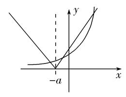

**专题02　曲线的切线方程**

**考点一**　求切线的方程

【**方法总结**】

求曲线切线方程的步骤

(1)求曲线在点<em>P</em>(<em>x</em>0，<em>y</em>0)处的切线方程的步骤

第一步，求出函数<em>y</em>＝<em>f</em>(<em>x</em>)在点<em>x</em>＝<em>x</em>0处的导数值<em>f</em>′(<em>x</em>0)，即曲线<em>y</em>＝<em>f</em>(<em>x</em>)在点<em>P</em>(<em>x</em>0，<em>f</em>(<em>x</em>0))处切线的斜率；

第二步，由点斜式方程求得切线方程为<em>y</em>－<em>f</em>(<em>x</em>0)＝<em>f</em>′(<em>x</em>0)·(<em>x</em>－<em>x</em>0)．

(2)求曲线过点<em>P</em>(<em>x</em>0，<em>y</em>0)的切线方程的步骤

第一步，设出切点坐标<em>P</em>′(<em>x</em>1，<em>f</em>(<em>x</em>1))；

第二步，写出过<em>P</em>′(<em>x</em>1，<em>f</em>(<em>x</em>1))的切线方程为<em>y</em>－<em>f</em>(<em>x</em>1)＝<em>f</em>′(<em>x</em>1)(<em>x</em>－<em>x</em>1)；

第三步，将点<em>P</em>的坐标(<em>x</em>0，<em>y</em>0)代入切线方程，求出<em>x</em>1；

第四步，将<em>x</em>1的值代入方程<em>y</em>－<em>f</em>(<em>x</em>1)＝<em>f</em>′(<em>x</em>1)(<em>x</em>－<em>x</em>1)可得过点<em>P</em>(<em>x</em>0，<em>y</em>0)的切线方程．

注意：在求曲线的切线方程时，注意两个“说法”：求曲线在点*P*处的切线方程和求曲线过点*P*的切线方程，在点*P*处的切线，一定是以点*P*为切点，过点*P*的切线，不论点*P*在不在曲线上，点*P*不一定是切点．

**【例题选讲】**

<strong>[例1]</strong>(1) (2021·全国甲)曲线<em>y</em>＝在点(－1，－3)处的切线方程为\_\_\_\_\_\_\_\_．

答案　5<em>x</em>－<em>y</em>＋2＝0　解析　<em>y</em>′＝′＝＝，所以<em>y</em>′|<em>x</em>＝－1＝＝5，所以切线方程为<em>y</em>＋3＝5(<em>x</em>＋1)，即5<em>x</em>－<em>y</em>＋2＝0．

(2) (2020·全国Ⅰ)函数<em>f</em>(<em>x</em>)＝<em>x</em>4－2<em>x</em>3的图象在点(1，<em>f</em>(1))处的切线方程为(　　)

A．*y*＝－2*x*－1　　　　B．*y*＝－2*x*＋1　　　　C．*y*＝2*x*－3　　　　D．*y*＝2*x*＋1

答案　B　解析　<em>f</em>(1)＝1－2＝－1，切点坐标为(1，－1)，<em>f</em>′(<em>x</em>)＝4<em>x</em>3－6<em>x</em>2，所以切线的斜率为<em>k</em>＝<em>f</em>′(1)＝4×13－6×12＝－2，切线方程为<em>y</em>＋1＝－2(<em>x</em>－1)，即<em>y</em>＝－2<em>x</em>＋1．

(3) (2018·全国Ⅰ)设函数<em>f</em>(<em>x</em>)＝<em>x</em>3＋(<em>a</em>－1)<em>x</em>2＋<em>ax</em>．若<em>f</em>(<em>x</em>)为奇函数，则曲线<em>y</em>＝<em>f</em>(<em>x</em>)在点(0，0)处的切线方程为(　　)

A．*y*＝－2*x*　　　　　　B．*y*＝－*x*　　　　　　C．*y*＝2*x*　　　　　　D．*y*＝*x*

答案　D　解析　法一　因为函数<em>f</em>(<em>x</em>)＝<em>x</em>3＋(<em>a</em>－1)<em>x</em>2＋<em>ax</em>为奇函数，所以<em>f</em>(－<em>x</em>)＝－<em>f</em>(<em>x</em>)，所以(－<em>x</em>)3＋(<em>a</em>－1)(－<em>x</em>)2＋<em>a</em>(－<em>x</em>)＝－[<em>x</em>3＋(<em>a</em>－1)<em>x</em>2＋<em>ax</em>]，所以2(<em>a</em>－1)<em>x</em>2＝0．因为<em>x</em>∈<strong>R</strong>，所以<em>a</em>＝1，所以<em>f</em>(<em>x</em>)＝<em>x</em>3＋<em>x</em>，所以<em>f</em>′(<em>x</em>)＝3<em>x</em>2＋1，所以<em>f</em>′(0)＝1，所以曲线<em>y</em>＝<em>f</em>(<em>x</em>)在点(0，0)处的切线方程为<em>y</em>＝<em>x</em>．故选D．

法二　因为函数<em>f</em>(<em>x</em>)＝<em>x</em>3＋(<em>a</em>－1)<em>x</em>2＋<em>ax</em>为奇函数，所以<em>f</em>(－1)＋<em>f</em>(1)＝0，所以－1＋<em>a</em>－1－<em>a</em>＋(1＋<em>a</em>－1＋<em>a</em>)＝0，解得<em>a</em>＝1，此时<em>f</em>(<em>x</em>)＝<em>x</em>3＋<em>x</em>(经检验，<em>f</em>(<em>x</em>)为奇函数)，所以<em>f</em>′(<em>x</em>)＝3<em>x</em>2＋1，所以<em>f</em>′(0)＝1，所以曲线<em>y</em>＝<em>f</em>(<em>x</em>)在点(0，0)处的切线方程为<em>y</em>＝<em>x</em>．故选D．

法三　易知<em>f</em>(<em>x</em>)＝<em>x</em>3＋(<em>a</em>－1)<em>x</em>2＋<em>ax</em>＝<em>x</em>[<em>x</em>2＋(<em>a</em>－1)<em>x</em>＋<em>a</em>]，因为<em>f</em>(<em>x</em>)为奇函数，所以函数<em>g</em>(<em>x</em>)＝<em>x</em>2＋(<em>a</em>－1)<em>x</em>＋<em>a</em>为偶函数，所以<em>a</em>－1＝0，解得<em>a</em>＝1，所以<em>f</em>(<em>x</em>)＝<em>x</em>3＋<em>x</em>，所以<em>f</em>′(<em>x</em>)＝3<em>x</em>2＋1，所以<em>f</em>′(0)＝1，所以曲线<em>y</em>＝<em>f</em>(<em>x</em>)在点(0，0)处的切线方程为<em>y</em>＝<em>x</em>．故选D．

(4) (2020·全国Ⅰ)曲线*y*＝ln *x*＋*x*＋1的一条切线的斜率为2，则该切线的方程为\_\_\_\_\_\_\_\_．

答案　2<em>x</em>－<em>y</em>＝0　解析　设切点坐标为(<em>x</em>0，<em>y</em>0)，因为<em>y</em>＝ln <em>x</em>＋<em>x</em>＋1，所以<em>y</em>′＝＋1，所以切线的斜率为＋1＝2，解得<em>x</em>0＝1．所以<em>y</em>0＝ln 1＋1＋1＝2，即切点坐标为(1，2)，所以切线方程为<em>y</em>－2＝2(<em>x</em>－1)，即2<em>x</em>－<em>y</em>＝0．

(5)已知函数<em>f</em>(<em>x</em>)＝<em>x</em>ln<em>x</em>，若直线<em>l</em>过点(0，－1)，并且与曲线<em>y</em>＝<em>f</em>(<em>x</em>)相切，则直线<em>l</em>的方程为_________．

答案　<em>x</em>－<em>y</em>－1＝0　解析　∵点(0，－1)不在曲线<em>f</em>(<em>x</em>)＝<em>x</em>ln <em>x</em>上，∴设切点为(<em>x</em>0，<em>y</em>0)．又∵<em>f</em>′(<em>x</em>)＝1＋ln <em>x</em>，∴直线<em>l</em>的方程为<em>y</em>＋1＝(1＋ln <em>x</em>0)<em>x</em>．∴由解得<em>x</em>0＝1，<em>y</em>0＝0．∴直线<em>l</em>的方程为<em>y</em>＝<em>x</em>－1，即<em>x</em>－<em>y</em>－1＝0．

(6) (2021·新高考Ⅰ)若过点(<em>a</em>，<em>b</em>)可以作曲线<em>y</em>＝e<em>x</em>的两条切线，则(　　)

A．e<em>b</em>&lt;<em>a</em>　　　　　　B．e<em>a</em>&lt;<em>b</em>　　　　　　C．0&lt;<em>a</em>&lt;e<em>b</em> 　　　　　　D．0&lt;<em>b</em>&lt;e<em>a</em>

答案　D　解析　根据<em>y</em>＝e<em>x</em>图象特征，<em>y</em>＝e<em>x</em>是下凸函数，又过点(<em>a</em>，<em>b</em>)可以作曲线<em>y</em>＝e<em>x</em>的两条切线，则点(<em>a</em>，<em>b</em>)在曲线<em>y</em>＝e<em>x</em>的下方且在<em>x</em>轴的上方，得0&lt;<em>b</em>&lt;e<em>a</em>．故选D．

(7)已知曲线<em>f</em>(<em>x</em>)＝<em>x</em>3－<em>x</em>＋3在点<em>P</em>处的切线与直线<em>x</em>＋2<em>y</em>－1＝0垂直，则<em>P</em>点的坐标为(　　)

A．(1，3)　　　　B．(－1，3)　　　　C．(1，3)或(－1，3)　　　　D．(1，－3)

答案　C　解析　设切点<em>P</em>(<em>x</em>0，<em>y</em>0)，<em>f</em>′(<em>x</em>)＝3<em>x</em>2－1，又直线<em>x</em>＋2<em>y</em>－1＝0的斜率为－，∴<em>f</em>′(<em>x</em>0)＝3<em>x</em>－1＝2，∴<em>x</em>＝1，∴<em>x</em>0＝±1，又切点<em>P</em>(<em>x</em>0，<em>y</em>0)在<em>y</em>＝<em>f</em>(<em>x</em>)上，∴<em>y</em>0＝<em>x</em>－<em>x</em>0＋3，∴当<em>x</em>0＝1时，<em>y</em>0＝3；当<em>x</em>0＝－1时，<em>y</em>0＝3．∴切点<em>P</em>为(1，3)或(－1，3)．

(8) (2019·江苏)在平面直角坐标系*xOy*中，点*A*在曲线*y*＝ln*x*上，且该曲线在点*A*处的切线经过点(－e，－1)(e为自然对数的底数)，则点*A*的坐标是\_\_\_\_\_\_\_\_．

答案　(e，1)　解析　设*A*(*m*，*n*)，则曲线*y*＝ln *x*在点*A*处的切线方程为*y*－*n*＝(*x*－*m*)．又切线过点(－e，－1)，所以有*n*＋1＝(*m*＋e)．再由*n*＝ln *m*，解得*m*＝e，*n*＝1．故点*A*的坐标为(e，1)．

(9)设函数<em>f</em>(<em>x</em>)＝<em>x</em>3＋(<em>a</em>－1)·<em>x</em>2＋<em>ax</em>，若<em>f</em>(<em>x</em>)为奇函数，且函数<em>y</em>＝<em>f</em>(<em>x</em>)在点<em>P</em>(<em>x</em>0，<em>f</em>(<em>x</em>0))处的切线与直线<em>x</em>＋<em>y</em>＝0垂直，则切点<em>P</em>(<em>x</em>0，<em>f</em>(<em>x</em>0))的坐标为________．

答案　(0，0)　解析　∵<em>f</em>(<em>x</em>)＝<em>x</em>3＋(<em>a</em>－1)<em>x</em>2＋<em>ax</em>，∴<em>f</em>′(<em>x</em>)＝3<em>x</em>2＋2(<em>a</em>－1)<em>x</em>＋<em>a</em>．又<em>f</em>(<em>x</em>)为奇函数，∴<em>f</em>(－<em>x</em>)＝－<em>f</em>(<em>x</em>)恒成立，即－<em>x</em>3＋(<em>a</em>－1)<em>x</em>2－<em>ax</em>＝－<em>x</em>3－(<em>a</em>－1)<em>x</em>2－<em>ax</em>恒成立，∴<em>a</em>＝1，<em>f</em>′(<em>x</em>)＝3<em>x</em>2＋1，3<em>x</em>＋1＝1，<em>x</em>0＝0，<em>f</em>(<em>x</em>0)＝0，∴切点<em>P</em>(<em>x</em>0，<em>f</em>(<em>x</em>0))的坐标为(0，0)．

(10)函数*y*＝在点(0，－1)处的切线与两坐标轴围成的封闭图形的面积为(　　)

A．　　　　　　　　B．　　　　　　　　C．　　　　　　　　D．1

答案　B　解析　∵<em>y</em>＝，∴<em>y</em>′＝＝，∴<em>k</em>＝<em>y</em>′|<em>x</em>＝0＝2，∴切线方程为<em>y</em>＋1＝2(<em>x</em>－0)，即<em>y</em>＝2<em>x</em>－1，令<em>x</em>＝0，得<em>y</em>＝－1；令<em>y</em>＝0，得<em>x</em>＝，故所求的面积为×1×＝．

(11)曲线<em>y</em>＝<em>x</em>2－ln<em>x</em>上的点到直线<em>x</em>－<em>y</em>－2＝0的最短距离是________．

答案　　解析　设曲线在点<em>P</em>(<em>x</em>0，<em>y</em>0)(<em>x</em>0&gt;0)处的切线与直线<em>x</em>－<em>y</em>－2＝0平行，则＝＝2<em>x</em>0－＝1．∴<em>x</em>0＝1，<em>y</em>0＝1，则<em>P</em>(1，1)，则曲线<em>y</em>＝<em>x</em>2－ln <em>x</em>上的点到直线<em>x</em>－<em>y</em>－2＝0的最短距离<em>d</em>＝＝．

【**对点训练**】

1．设点<em>P</em>是曲线<em>y</em>＝<em>x</em>3－<em>x</em>＋上的任意一点，则曲线在点<em>P</em>处切线的倾斜角<em>α</em>的取值范围为(　　)

A．∪　　　B．　　　C．∪　　　D．

1．答案　C　解析　<em>y</em>′＝3<em>x</em>2－，∴<em>y</em>′≥－，∴tan <em>α</em>≥－，又<em>α</em>∈[0，π)，故<em>α</em>∈∪，故

选C．

2．函数<em>f</em>(<em>x</em>)＝e<em>x</em>＋在<em>x</em>＝1处的切线方程为________．

2．答案　<em>y</em>＝(e－1)<em>x</em>＋2　解析　<em>f</em>′(<em>x</em>)＝e<em>x</em>－，∴<em>f</em>′(1)＝e－1，又<em>f</em>(1)＝e＋1，∴切点为(1，e＋1)，切

线斜率*k*＝*f*′(1)＝e－1，即切线方程为*y*－(e＋1)＝(e－1)(*x*－1)，即*y*＝(e－1)*x*＋2．

3．(2019·全国Ⅰ)曲线<em>y</em>＝3(<em>x</em>2＋<em>x</em>)e<em>x</em>在点(0，0)处的切线方程为\_\_\_\_\_\_\_\_．

3．答案　<em>y</em>＝3<em>x</em>　解析　<em>y</em>′＝3(2<em>x</em>＋1)e<em>x</em>＋3(<em>x</em>2＋<em>x</em>)e<em>x</em>＝3e<em>x</em>(<em>x</em>2＋3<em>x</em>＋1)，所以曲线在点(0，0)处的切线的斜率

<em>k</em>＝e0×3＝3，所以所求切线方程为<em>y</em>＝3<em>x</em>．

4．曲线*f*(*x*)＝在点*P*(1，*f*(1))处的切线*l*的方程为(　　)

A．*x*＋*y*－2＝0　　B．2*x*＋*y*－3＝0　　C．3*x*＋*y*＋2＝0　　D．3*x*＋*y*－4＝0

4．答案　D　解析　因为*f*(*x*)＝，所以*f*′(*x*)＝．又*f*(1)＝1，且*f*′(1)＝－3，故所求切线方

程为*y*－1＝－3(*x*－1)，即3*x*＋*y*－4＝0．

5．(2019·全国Ⅱ)曲线*y*＝2sin *x*＋cos *x*在点(π，－1)处的切线方程为(　　)

A．*x*－*y*－π－1＝0 　　　　　　　　　　　　　　B．2*x*－*y*－2π－1＝0

C．2*x*＋*y*－2π＋1＝0　　　　　　　　　　　　　　D．*x*＋*y*－π＋1＝0

5．答案　C　解析　设*y*＝*f*(*x*)＝2sin *x*＋cos *x*，则*f*′(*x*)＝2cos *x*－sin *x*，∴*f*′(π)＝－2，∴曲线在点(π，－1)

处的切线方程为*y*－(－1)＝－2(*x*－π)，即2*x*＋*y*－2π＋1＝0．故选C．

6．(2019·天津)曲线*y*＝cos *x*－在点(0，1)处的切线方程为\_\_\_\_\_\_\_\_．

6．答案　*y*＝－*x*＋1　解析　*y*′＝－sin *x*－，将*x*＝0代入，可得切线斜率为－．所以切线方程为*y*－1

＝－*x*，即*y*＝－*x*＋1．

7．已知<em>f</em>(<em>x</em>)＝<em>x</em>为奇函数(其中e是自然对数的底数)，则曲线<em>y</em>＝<em>f</em>(<em>x</em>)在<em>x</em>＝0处的切线方程为_______．

7．答案　2*x*－*y*＝0　解析　∵*f*(*x*)为奇函数，∴*f*(－1)＋*f*(1)＝0，即e＋－－*a*e＝0，解得*a*＝1，*f*(*x*)＝

*x*，∴*f*′(*x*)＝＋*x*，∴曲线*y*＝*f*(*x*)在*x*＝0处的切线的斜率为2，又*f*(0)＝0，∴曲线*y*＝*f*(*x*)在*x*＝0处的切线的方程为2*x*－*y*＝0．

8．已知曲线<em>y</em>＝<em>x</em>3上一点<em>P</em>，则过点<em>P</em>的切线方程为\_\_\_\_\_\_\_\_．

8．答案　3<em>x</em>－3<em>y</em>＋2＝0或12<em>x</em>－3<em>y</em>－16＝0　解析　设切点坐标为，由<em>y</em>′＝′＝<em>x</em>2，得<em>y</em>′|<em>x</em>＝<em>x</em>0

＝<em>x</em>，即过点<em>P</em>的切线的斜率为<em>x</em>，又切线过点<em>P</em>，若<em>x</em>0≠2，则<em>x</em>＝，解得<em>x</em>0＝－1，此时切线的斜率为1；若<em>x</em>0＝2，则切线的斜率为4．故所求的切线方程是<em>y</em>－＝<em>x</em>－2或<em>y</em>－＝4(<em>x</em>－2)，即3<em>x</em>－3<em>y</em>＋2＝0或12<em>x</em>－3<em>y</em>－16＝0．

9．已知函数<em>f</em>(<em>x</em>)＝<em>x</em>ln <em>x</em>，若直线<em>l</em>过点(0，－1)，并且与曲线<em>y</em>＝<em>f</em>(<em>x</em>)相切，则直线<em>l</em>的方程为__________．

9．答案　<em>x</em>－<em>y</em>－1＝0　解析　∵点(0，－1)不在曲线<em>f</em>(<em>x</em>)＝<em>x</em>ln <em>x</em>上，∴设切点为(<em>x</em>0，<em>y</em>0)．又∵<em>f</em>′(<em>x</em>)＝1＋

ln<em>x</em>，∴直线<em>l</em>的方程为<em>y</em>＋1＝(1＋ln <em>x</em>0)<em>x</em>．∴由解得<em>x</em>0＝1，<em>y</em>0＝0．∴直线<em>l</em>的方程为<em>y</em>＝<em>x</em>－1，即<em>x</em>－<em>y</em>－1＝0．

10．设函数<em>f</em>(<em>x</em>)＝<em>f</em>′<em>x</em>2－2<em>x</em>＋<em>f</em>(1)ln <em>x</em>，曲线<em>f</em>(<em>x</em>)在(1，<em>f</em>(1))处的切线方程是(　　)

A．5*x*－*y*－4＝0　　　　B．3*x*－*y*－2＝0　　　　C．*x*－*y*＝0　　　　D．*x*＝1

10．答案　A　解析　因为<em>f</em>(<em>x</em>)＝<em>f</em>′<em>x</em>2－2<em>x</em>＋<em>f</em>(1)ln <em>x</em>，所以<em>f</em>′(<em>x</em>)＝2<em>f</em>′<em>x</em>－2＋．令<em>x</em>＝得<em>f</em>′＝2<em>f</em>′

×－2＋2*f*(1)，即*f*(1)＝1．又*f*(1)＝*f*′－2，所以*f*′＝3，所以*f*′(1)＝2*f*′－2＋*f*(1)＝6－2＋1＝5．所以曲线在点(1，*f*(1))处的切线方程为*y*－1＝5(*x*－1)，即5*x*－*y*－4＝0．

11．我国魏晋时期的科学家刘徽创立了“割圆术”，实施“以直代曲”的近似计算，用正*n*边形进行“内外夹逼”

的办法求出了圆周率π的精度较高的近似值，这是我国最优秀的传统科学文化之一．借用“以直代曲”的近似计算方法，在切点附近，可以用函数图象的切线近似代替在切点附近的曲线来近似计算．设*f*(*x*)＝ln(1＋*x*)，则曲线*y*＝*f*(*x*)在点(0，0)处的切线方程为\_\_\_\_\_\_\_\_，用此结论计算ln2 022－ln2 021≈\_\_\_\_\_\_\_\_．

11．答案　*y*＝*x*　　解析　函数*f*(*x*)＝ln(1＋*x*)，则*f*′(*x*)＝，*f*′(0)＝1，*f*(0)＝0，∴切线方程为*y*＝*x*．∴

ln2 022－ln2 021＝ln＝*f* ，根据以直代曲，*x*＝也非常接近切点*x*＝0．∴可以将*x*＝代入切线近似代替*f* ，即*f* ≈．

12．曲线*f*(*x*)＝*x*＋ln*x*在点(1，1)处的切线与坐标轴围成的三角形的面积为(　　)

A．2　　　　　　　　B．　　　　　　　　C．　　　　　　　　D．

12．答案　D　解析　*f*′(*x*)＝1＋，则*f*′(1)＝2，故曲线*f*(*x*)＝*x*＋ln *x* 在点(1，1)处的切线方程为*y*－1＝2(*x*

－1)，即*y*＝2*x*－1，此切线与两坐标轴的交点坐标分别为(0，－1)，，则切线与坐标轴围成的三角形的面积为×1×＝，故选D．

13．已知曲线<em>y</em>＝<em>x</em>3＋．

(1)求曲线在点*P*(2，4)处的切线方程；

(2)求曲线过点*P*(2，4)的切线方程．

13．解析　(1)∵<em>P</em>(2，4)在曲线<em>y</em>＝<em>x</em>3＋上，且<em>y</em>′＝<em>x</em>2，

∴在点<em>P</em>(2，4)处的切线的斜率为<em>y</em>′|<em>x</em>＝2＝4．

∴曲线在点*P*(2，4)处的切线方程为*y*－4＝4(*x*－2)，即4*x*－*y*－4＝0．

(2)设曲线<em>y</em>＝<em>x</em>3＋与过点<em>P</em>(2，4)的切线相切于点<em>A</em>，则切线的斜率为<em>y</em>′|<em>x</em>＝<em>x</em>0＝<em>x</em>．

∴切线方程为<em>y</em>－＝<em>x</em>(<em>x</em>－<em>x</em>0)，即<em>y</em>＝<em>x</em>·<em>x</em>－<em>x</em>＋．

∵点*P*(2，4)在切线上，∴4＝2*x*－*x*＋，即*x*－3*x*＋4＝0，∴*x*＋*x*－4*x*＋4＝0，

∴<em>x</em>(<em>x</em>0＋1)－4(<em>x</em>0＋1)(<em>x</em>0－1)＝0，∴(<em>x</em>0＋1)(<em>x</em>0－2)2＝0，解得<em>x</em>0＝－1或<em>x</em>0＝2，

故所求的切线方程为*x*－*y*＋2＝0或4*x*－*y*－4＝0．

14．设函数*f*(*x*)＝*ax*－，曲线*y*＝*f*(*x*)在点(2，*f*(2))处的切线方程为7*x*－4*y*－12＝0．

(1)求*f*(*x*)的解析式；

(2)证明曲线*f*(*x*)上任一点处的切线与直线*x*＝0和直线*y*＝*x*所围成的三角形面积为定值，并求此定值．

14．解析　(1)方程7*x*－4*y*－12＝0可化为*y*＝*x*－3，

当*x*＝2时，*y*＝．又*f*′(*x*)＝*a*＋，于是解得故*f*(*x*)＝*x*－．

(2)设<em>P</em>(<em>x</em>0，<em>y</em>0)为曲线上任一点，

由<em>y</em>′＝1＋知曲线在点<em>P</em>(<em>x</em>0，<em>y</em>0)处的切线方程为<em>y</em>－<em>y</em>0＝(<em>x</em>－<em>x</em>0)，

即<em>y</em>－＝(<em>x</em>－<em>x</em>0)．令<em>x</em>＝0，得<em>y</em>＝－，

从而得切线与直线*x*＝0的交点坐标为．

令<em>y</em>＝<em>x</em>，得<em>y</em>＝<em>x</em>＝2<em>x</em>0，从而得切线与直线<em>y</em>＝<em>x</em>的交点坐标为(2<em>x</em>0，2<em>x</em>0)．

所以点<em>P</em>(<em>x</em>0，<em>y</em>0)处的切线与直线<em>x</em>＝0，<em>y</em>＝<em>x</em>所围成的三角形的面积为<em>S</em>＝|2<em>x</em>0|＝6．

故曲线*y*＝*f*(*x*)上任一点处的切线与直线*x*＝0，*y*＝*x*所围成的三角形面积为定值，且此定值为6．

15．(2021·全国乙)已知函数<em>f</em>(<em>x</em>)＝<em>x</em>3－<em>x</em>2＋<em>ax</em>＋1．

(1)讨论*f*(*x*)的单调性；

(2)求曲线*y*＝*f*(*x*)过坐标原点的切线与曲线*y*＝*f*(*x*)的公共点的坐标．

15．解析　(1)由题意知<em>f</em>(<em>x</em>)的定义域为<strong>R</strong>，<em>f</em>′(<em>x</em>)＝3<em>x</em>2－2<em>x</em>＋<em>a</em>，对于<em>f</em>′(<em>x</em>)＝0，<em>Δ</em>＝(－2)2－4×3<em>a</em>＝4(1－3<em>a</em>)．

①当<em>a</em>≥时，<em>Δ</em>≤0，<em>f</em>′(<em>x</em>)≥0在<strong>R</strong>上恒成立，所以<em>f</em>(<em>x</em>)在<strong>R</strong>上单调递增；

②当<em>a</em>&lt;时，令<em>f</em>′(<em>x</em>)＝0，即3<em>x</em>2－2<em>x</em>＋<em>a</em>＝0，解得<em>x</em>1＝，<em>x</em>2＝，

令<em>f</em>′(<em>x</em>)&gt;0，则<em>x</em>&lt;<em>x</em>1或<em>x</em>&gt;<em>x</em>2；令<em>f</em>′(<em>x</em>)&lt;0，则<em>x</em>1&lt;<em>x</em>&lt;<em>x</em>2．

所以<em>f</em>(<em>x</em>)在(－∞，<em>x</em>1)上单调递增，在(<em>x</em>1，<em>x</em>2)上单调递减，在(<em>x</em>2，＋∞)上单调递增．

综上，当<em>a</em>≥时，<em>f</em>(<em>x</em>)在<strong>R</strong>上单调递增；当<em>a</em>&lt;时，<em>f</em>(<em>x</em>)在上单调递增，

在上单调递减，在上单调递增．

(2)记曲线<em>y</em>＝<em>f</em>(<em>x</em>)过坐标原点的切线为<em>l</em>，切点为<em>P</em>(<em>x</em>0，<em>x</em>－<em>x</em>＋<em>ax</em>0＋1)．

因为<em>f</em>′(<em>x</em>0)＝3<em>x</em>－2<em>x</em>0＋<em>a</em>，所以切线<em>l</em>的方程为<em>y</em>－(<em>x</em>－<em>x</em>＋<em>ax</em>0＋1)＝(3<em>x</em>－2<em>x</em>0＋<em>a</em>)(<em>x</em>－<em>x</em>0)．

由<em>l</em>过坐标原点，得2<em>x</em>－<em>x</em>－1＝0，解得<em>x</em>0＝1，所以切线<em>l</em>的方程为<em>y</em>＝(1＋<em>a</em>)<em>x</em>．

由解得或

所以曲线*y*＝*f*(*x*)过坐标原点的切线与曲线*y*＝*f*(*x*)的公共点的坐标为(1，1＋*a*)和(－1，－1－*a*)．

**考点二**　求参数的值(范围)

【**方法总结**】

处理与切线有关的参数问题，通常根据曲线、切线、切点的三个关系列出参数的方程并解出参数：①切点处的导数是切线的斜率；②切点在切线上；③切点在曲线上．

注意：曲线上横坐标的取值范围；谨记切点既在切线上又在曲线上．

**【例题选讲】**

<strong>[例1]</strong>(1)已知曲线<em>f</em>(<em>x</em>)＝<em>ax</em>3＋ln<em>x</em>在(1，<em>f</em>(1))处的切线的斜率为2，则实数<em>a</em>的值是\_\_\_\_\_\_\_\_．

答案　　解析　<em>f</em>′(<em>x</em>)＝3<em>ax</em>2＋，则<em>f</em>′(1)＝3<em>a</em>＋1＝2，解得<em>a</em>＝．

(2)若函数<em>f</em>(<em>x</em>)＝ln<em>x</em>＋2<em>x</em>2－<em>ax</em>的图象上存在与直线2<em>x</em>－<em>y</em>＝0平行的切线，则实数<em>a</em>的取值范围是________．

答案　[2，＋∞)　解析　直线2*x*－*y*＝0的斜率*k*＝2，又曲线*f*(*x*)上存在与直线2*x*－*y*＝0平行的切线，∴*f*′(*x*)＝＋4*x*－*a*＝2在(0，＋∞)内有解，则*a*＝4*x*＋－2，*x*>0．又4*x*＋≥2＝4，当且仅当*x*＝时取“＝”．∴*a*≥4－2＝2．∴*a*的取值范围是[2，＋∞)．

(3)设函数<em>f</em>(<em>x</em>)＝<em>a</em>ln<em>x</em>＋<em>bx</em>3的图象在点(1，－1)处的切线经过点(0，1)，则<em>a</em>＋<em>b</em>的值为________．

答案　0　解析　依题意得<em>f</em>′(<em>x</em>)＝＋3<em>bx</em>2，于是有即解得所以<em>a</em>＋<em>b</em>＝0．

(4)(2019·全国Ⅲ)已知曲线<em>y</em>＝<em>a</em>e<em>x</em>＋<em>x</em>ln <em>x</em>在点(1，<em>a</em>e)处的切线方程为<em>y</em>＝2<em>x</em>＋<em>b</em>，则(　　)

A．<em>a</em>＝e，<em>b</em>＝－1　　　B．<em>a</em>＝e，<em>b</em>＝1　　　C．<em>a</em>＝e－1，<em>b</em>＝1　　　D．<em>a</em>＝e－1，<em>b</em>＝－1

答案　D　解析　因为<em>y</em>′＝<em>a</em>e<em>x</em>＋ln<em>x</em>＋1，所以<em>y</em>′|<em>x</em>＝1＝<em>a</em>e＋1，所以曲线在点(1，<em>a</em>e)处的切线方程为<em>y</em>－<em>a</em>e＝(<em>a</em>e＋1)(<em>x</em>－1)，即<em>y</em>＝(<em>a</em>e＋1)<em>x</em>－1，所以解得

(5)设曲线*y*＝在点(1，－2)处的切线与直线*ax*＋*by*＋*c*＝0垂直，则＝(　　)

A．　　　　　　　　B．－　　　　　　　　C．3　　　　　　　　D．－3

答案　B　解析　由题可得*y*′＝，所以曲线在点(1，－2)处的切线的斜率为－3．因为切线与直线*ax*＋*by*＋*c*＝0垂直，所以－3·＝－1，解得＝－，故选B．

(6)已知直线*y*＝*kx*－2与曲线*y*＝*x*ln*x*相切，则实数*k*的值为\_\_\_\_\_\_\_\_．

答案　1＋ln 2　解析　设切点为(<em>m</em>，<em>m</em>ln <em>m</em>)，<em>y</em>′＝1＋ln <em>x</em>，<em>y</em>′|<em>x</em>＝<em>m</em>＝1＋ln <em>m</em>，∴<em>y</em>－<em>m</em>ln <em>m</em>＝(1＋ln <em>m</em>)(<em>x</em>－<em>m</em>)，即<em>y</em>＝(1＋ln <em>m</em>)<em>x</em>－<em>m</em>，又<em>y</em>＝<em>kx</em>－2，∴即<em>k</em>＝1＋ln 2．

(7)已知函数<em>f</em>(<em>x</em>)＝<em>x</em>＋，若曲线<em>y</em>＝<em>f</em>(<em>x</em>)存在两条过(1，0)点的切线，则<em>a</em>的取值范围是___________．

答案　(－∞，－2)∪(0，＋∞)　解析　<em>f</em>′(<em>x</em>)＝1－，设切点坐标为，∴切线的斜率<em>k</em>＝<em>f</em>′(<em>x</em>0)＝1－，∴切线方程为<em>y</em>－＝(<em>x</em>－<em>x</em>0)，又切线过点(1，0)，即－＝(1－<em>x</em>0)，整理得2<em>x</em>＋2<em>ax</em>0－<em>a</em>＝0，∵曲线存在两条切线，故该方程有两个解，∴<em>Δ</em>＝4<em>a</em>2－8(－<em>a</em>)&gt;0，解得<em>a</em>&gt;0或<em>a</em>&lt;－2．

(8)关于<em>x</em>的方程2|<em>x</em>＋<em>a</em>|＝e<em>x</em>有3个不同的实数解，则实数<em>a</em>的取值范围为\_\_\_\_\_\_\_\_．

答案　(1－ln2，＋∞)　解析　由题意，临界情况为<em>y</em>＝2(<em>x</em>＋<em>a</em>)与<em>y</em>＝e<em>x</em>相切的情况，<em>y</em>′＝e<em>x</em>＝2，则<em>x</em>＝ln2，所以切点坐标为(ln2，2)，则此时<em>a</em>＝1－ln2，所以只要<em>y</em>＝2|<em>x</em>＋<em>a</em>|图象向左移动，都会产生3个交点，所以<em>a</em>&gt;1－ln2，即<em>a</em>∈(1－ln2，＋∞)．

【**对点训练**】

1．若曲线*y*＝*x*ln*x*在*x*＝1与*x*＝*t*处的切线互相垂直，则正数*t*的值为\_\_\_\_\_\_\_\_．

1．答案　e－2　解析　因为<em>y</em>′＝ln<em>x</em>＋1，所以(ln1＋1)(ln<em>t</em>＋1)＝－1，∴ln<em>t</em>＝－2，<em>t</em>＝e－2．

2．设曲线<em>y</em>＝e<em>ax</em>－ln(<em>x</em>＋1)在<em>x</em>＝0处的切线方程为2<em>x</em>－<em>y</em>＋1＝0，则<em>a</em>＝(　　)

A．0　　　　　　　　B．1　　　　　　　　C．2　　　　　　　　D．3

2．答案　D　解析　∵<em>y</em>＝e<em>ax</em>－ln(<em>x</em>＋1)，∴<em>y</em>′＝<em>a</em>e<em>ax</em>－，∴当<em>x</em>＝0时，<em>y</em>′＝<em>a</em>－1．∵曲线<em>y</em>＝e<em>ax</em>－ln(<em>x</em>

＋1)在*x*＝0处的切线方程为2*x*－*y*＋1＝0，∴*a*－1＝2，即*a*＝3．故选D．

3．若曲线<em>f</em>(<em>x</em>)＝<em>x</em>3－<em>x</em>＋3在点<em>P</em>处的切线平行于直线<em>y</em>＝2<em>x</em>－1，则<em>P</em>点的坐标为(　　)

A．(1，3)　　　　B．(－1，3)　　　　C．(1，3)或(－1，3)　　　　D．(1，－3)

3．答案　C　解析　<em>f</em>′(<em>x</em>)＝3<em>x</em>2－1，令<em>f</em>′(<em>x</em>)＝2，则3<em>x</em>2－1＝2，解得<em>x</em>＝1或<em>x</em>＝－1，∴<em>P</em>(1，3)或(－1，3)，

经检验点(1，3)，(－1，3)均不在直线*y*＝2*x*－1上，故选C．

4．函数<em>f</em>(<em>x</em>)＝ln<em>x</em>＋<em>ax</em>的图象存在与直线2<em>x</em>－<em>y</em>＝0平行的切线，则实数<em>a</em>的取值范围是______．

4．答案　(－∞，2)　解析　由题意知*f*′(*x*)＝2在(0，＋∞)上有解．所以*f*′(*x*)＝＋*a*＝2在(0，＋∞)上有解，

则*a*＝2－．因为*x*＞0，所以2－＜2，所以*a*的取值范围是(－∞，2)．

5．已知函数<em>f</em>(<em>x</em>)＝<em>x</em>cos<em>x</em>＋<em>a</em>sin<em>x</em>在<em>x</em>＝0处的切线与直线3<em>x</em>－<em>y</em>＋1＝0平行，则实数<em>a</em>的值为________．

5．答案　2　解析　*f*′(*x*)＝cos*x*＋*x*·(－sin*x*)＋*a*cos*x*＝(1＋*a*)cos*x*－*x*sin*x*，∴*f*′(0)＝1＋*a*＝3，∴*a*＝2．

6．已知函数<em>f</em>(<em>x</em>)＝<em>x</em>3＋<em>ax</em>＋<em>b</em>的图象在点(1，<em>f</em>(1))处的切线方程为2<em>x</em>－<em>y</em>－5＝0，则<em>a</em>＝\_\_\_\_\_\_\_\_；<em>b</em>＝\_\_\_\_\_\_\_\_．

6．答案　－1　－3　解析　由题意得<em>f</em>′(<em>x</em>)＝3<em>x</em>2＋<em>a</em>，则由切线方程得解得<em>a</em>＝

－1，*b*＝－3．

7．若函数*f*(*x*)＝*ax*－的图象在点(1，*f*(1))处的切线过点(2，4)，则*a*＝\_\_\_\_\_\_\_\_．

7．答案　2　解析　*f*′(*x*)＝*a*＋，*f*′(1)＝*a*＋3，*f*(1)＝*a*－3，故*f*(*x*)的图象在点(1，*a*－3)处的切线方程为*y*

－(*a*－3)＝(*a*＋3)(*x*－1)，又切线过点(2，4)，所以4－(*a*－3)＝*a*＋3，解得*a*＝2．

8．若曲线<em>y</em>＝e<em>x</em>在<em>x</em>＝0处的切线也是曲线<em>y</em>＝ln<em>x</em>＋<em>b</em>的切线，则<em>b</em>＝(　　)

A．－1　　　　　　　　B．1　　　　　　　　C．2　　　　　　　　D．e

8．答案　C　解析　<em>y</em>＝e<em>x</em>的导数为<em>y</em>′＝e<em>x</em>，则曲线<em>y</em>＝e<em>x</em>在<em>x</em>＝0处的切线斜率<em>k</em>＝1，则曲线<em>y</em>＝e<em>x</em>在<em>x</em>

＝0处的切线方程为*y*－1＝*x*，即*y*＝*x*＋1．设*y*＝*x*＋1与*y*＝ln *x*＋*b*相切的切点为(*m*，*m*＋1)．又*y*′＝，则＝1，解得*m*＝1．所以切点坐标为(1，2)，则2＝*b*＋ln 1，得*b*＝2．

9．曲线<em>y</em>＝(<em>ax</em>＋1)e<em>x</em>在点(0，1)处的切线与<em>x</em>轴交于点，则<em>a</em>＝______；

9．答案　1　解析　<em>y</em>′＝e<em>x</em>(<em>ax</em>＋1＋<em>a</em>)，所以<em>y</em>′|<em>x</em>＝0＝1＋<em>a</em>，则曲线<em>y</em>＝(<em>ax</em>＋1)e<em>x</em>在(0，1)处的切线方程为<em>y</em>

＝(1＋*a*)*x*＋1，又切线与*x*轴的交点为，所以0＝(1＋*a*)×＋1，解得*a*＝1．

10．过点<em>M</em>(－1，0)引曲线<em>C</em>：<em>y</em>＝2<em>x</em>3＋<em>ax</em>＋<em>a</em>的两条切线，这两条切线与<em>y</em>轴分别交于<em>A</em>、<em>B</em>两点，若|<em>MA</em>|

＝|<em>MB</em>|，则<em>a</em>＝______．

10．答案　－　解析　设切点坐标为(<em>t，</em>2<em>t</em>3＋<em>at</em>＋<em>a</em>)，∵<em>y</em>′＝6<em>x</em>2＋<em>a</em>，∴6<em>t</em>2＋<em>a</em>＝，即4<em>t</em>3＋6<em>t</em>2

＝0，解得<em>t</em>＝0或<em>t</em>＝－，∵|<em>MA</em>|＝|<em>MB</em>|，∴两切线的斜率互为相反数，即2<em>a</em>＋6×2＝0，解得<em>a</em>＝－．

11．已知曲线<em>C</em>：<em>f</em>(<em>x</em>)＝<em>x</em>3－3<em>x</em>，直线<em>l</em>：<em>y</em>＝<em>ax</em>－<em>a</em>，则<em>a</em>＝6是直线<em>l</em>与曲线<em>C</em>相切的(　　)

A．充分不必要条件　　B．必要不充分条件　　C．充要条件　　D．既不充分也不必要条件

11．答案　A　解析　因为曲线<em>C</em>：<em>f</em>(<em>x</em>)＝<em>x</em>3－3<em>x</em>，所以<em>f</em>′(<em>x</em>)＝3<em>x</em>2－3．设直线<em>l</em>与曲线<em>C</em>相切，且切点的横

坐标为<em>x</em>0，则切线方程为<em>y</em>＝(3<em>x</em>－3)<em>x</em>－2<em>x</em>，所以解得或所以<em>a</em>＝6是直线<em>l</em>与曲线<em>C</em>相切的充分不必要条件，故选A．

12．已知点<em>M</em>是曲线<em>y</em>＝<em>x</em>3－2<em>x</em>2＋3<em>x</em>＋1上任意一点，曲线在<em>M</em>处的切线为<em>l</em>，求：

(1)斜率最小的切线方程；

(2)切线*l*的倾斜角*α*的取值范围．

12．解析　(1)<em>y</em>′＝<em>x</em>2－4<em>x</em>＋3＝(<em>x</em>－2)2－1≥－1，∴当<em>x</em>＝2时，<em>y</em>′min＝－1，<em>y</em>＝，

∴斜率最小的切线过点，斜率*k*＝－1，∴切线方程为*y*－＝－1×(*x*－2)，即3*x*＋3*y*－11＝0．

(2)由(1)得*k*≥－1，∴tan *α*≥－1，又∵*α*∈[0，π)，∴*α*∈∪．

故*α*的取值范围为∪．

13．已知函数<em>f</em>(<em>x</em>)＝<em>x</em>3＋(1－<em>a</em>)<em>x</em>2－<em>a</em>(<em>a</em>＋2)<em>x</em>＋<em>b</em>(<em>a</em>，<em>b</em>∈<strong>R</strong>)．

(1)若函数*f*(*x*)的图象过原点，且在原点处的切线斜率为－3，求*a*，*b*的值；

(2)若曲线*y*＝*f*(*x*)存在两条垂直于*y*轴的切线，求*a*的取值范围．

13．解析　<em>f</em>′(<em>x</em>)＝3<em>x</em>2＋2(1－<em>a</em>)<em>x</em>－<em>a</em>(<em>a</em>＋2)．

(1)由题意得解得*b*＝0，*a*＝－3或*a*＝1．

(2)因为曲线*y*＝*f*(*x*)存在两条垂直于*y*轴的切线，

所以关于<em>x</em>的方程<em>f</em>′(<em>x</em>)＝3<em>x</em>2＋2(1－<em>a</em>)<em>x</em>－<em>a</em>(<em>a</em>＋2)＝0有两个不相等的实数根，

所以<em>Δ</em>＝4(1－<em>a</em>)2＋12<em>a</em>(<em>a</em>＋2)&gt;0，即4<em>a</em>2＋4<em>a</em>＋1&gt;0，所以<em>a</em>≠－．

所以*a*的取值范围为∪．

14．已知函数<em>f</em>(<em>x</em>)＝<em>x</em>3－2<em>x</em>2＋3<em>x</em>(<em>x</em>∈<strong>R</strong>)的图象为曲线<em>C</em>．

(1)求在曲线*C*上任意一点切线斜率的取值范围；

(2)若在曲线*C*上存在两条相互垂直的切线，求其中一条切线与曲线*C*的切点的横坐标的取值范围．

14．解析　(1)由题意得<em>f</em>′(<em>x</em>)＝<em>x</em>2－4<em>x</em>＋3，则<em>f</em>′(<em>x</em>)＝(<em>x</em>－2)2－1≥－1，

即曲线*C*上任意一点处的切线斜率的取值范围是[－1，＋∞)．

(2)设曲线*C*的其中一条切线的斜率为*k*(*k*≠0)，

则由题意并结合(1)中结论可知，解得－1≤*k*<0或*k*≥1，

则－1≤<em>x</em>2－4<em>x</em>＋3&lt;0或<em>x</em>2－4<em>x</em>＋3≥1，解得<em>x</em>∈(－∞，2－]∪(1，3)∪[2＋，＋∞)．

