# 专题04 函数的单调性

# 函数的单调性与导数的关系

已知函数 $f(x)$ 在区间 $(a, b)$ 上可导，

(1)如果 $f'(x)>0$ ，那么函数 $y=f(x)$ 在 $(a, b)$ 内单调递增；  
(2)如果 $f'(x)<0$ ，那么函数 $y=f(x)$ 在 $(a, b)$ 内单调递减；  
(2)如果 $f'(x)=0$ ，那么函数 $y=f(x)$ 在 $(a, b)$ 内是常数函数.

注意：1．在某区间内 $f'(x)>0(f'(x)<0)$ 是函数 $f(x)$ 在此区间上为增(减)函数的充分不必要条件.

2. 可导函数 $f(x)$ 在 $(a, b)$ 上是增(减)函数的充要条件是 $\forall x \in (a, b)$ ，都有 $f'(x) \geq 0 (f'(x) \leq 0)$ 且 $f'(x)$ 在 $(a, b)$ 上的任何子区间内都不恒为零.

(1)在函数定义域内讨论导数的符号.   
(2)两个或多个增(减)区间之间的连接符号，不用“∪”，可用“，”或用“和”.

# 考点一 不含参数的函数的单调性

# 【方法总结】

# 利用导数判断函数单调性的步骤

第 1 步，确定函数的定义域；

第 2 步，求出导数 $f'(x)$ 的零点；

第 3 步，用 $f'(x)$ 的零点将 $f(x)$ 的定义域划分为若干个区间，列表给出 $f'(x)$ 在各区间上的正负，由此得出函数 $y=f(x)$ 在定义域内的单调性.

# 【例题选讲】

[例 1](1)定义在[-2, 2]上的函数 $f(x)$ 与其导函数 $f'(x)$ 的图象如图所示，设 O 为坐标原点，A, B, C, D 四点的横坐标依次为 $-\frac{1}{2}$ ， $-\frac{1}{6}$ ， $1, \frac{4}{3}$ ，则函数 $y = \frac{f(x)}{\mathrm{e}^x}$ 的单调递减区间是（）

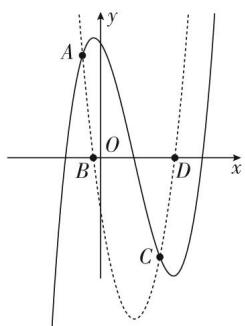

text_image

A
y
O
B
D
x
C

A. $\left(-\frac{1}{6},\frac{4}{3}\right)$

B. $\left(-\frac{1}{2},1\right)$

C. $\left(-\frac{1}{2}, -\frac{1}{6}\right)$

D. $(1, 2)$

(2)已知函数 $y=f(x)$ 的导函数 $y=f'(x)$ 的图象如图所示，则函数 $y=f(x)$ 的图象可以是()

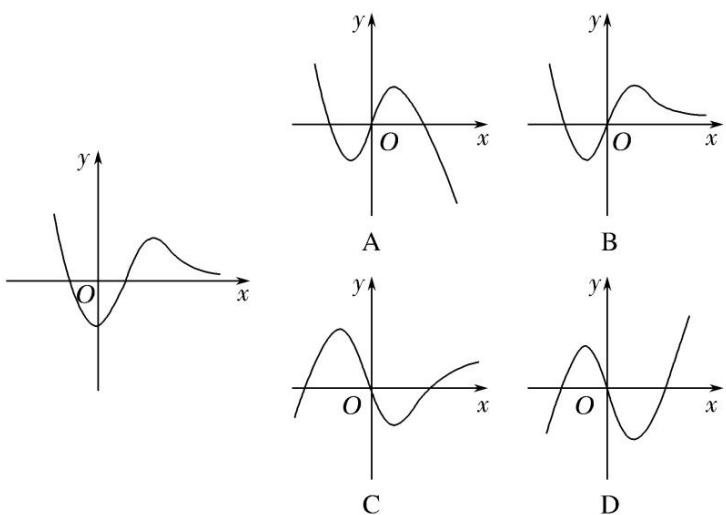

(3)函数 $f(x)=x^{2}+x\sin x$ 的图象大致为()

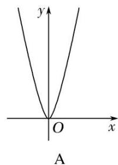

text_image

y
O
x
A

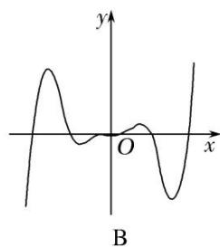

text_image

y
O
x
B

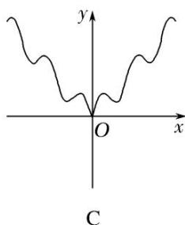

text_image

y
O
x
C

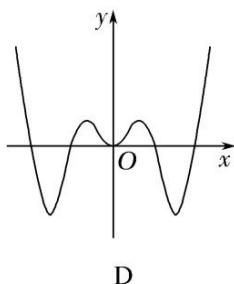

text_image

y
O
x
D

(4)函数 $f(x) = x + 2\sqrt{1 - x}$ 的单调递增区间是 \_\_\_\_；单调递减区间是 \_\_\_\_。

(5)设函数 $f(x) = x(\mathrm{e}^x - 1) - \frac{1}{2} x^2$ ，则 $f(x)$ 的单调递增区间是 \_\_\_\_，单调递减区间是 \_\_\_\_。

(6)函数 $y = \frac{1}{2} x^2 - \ln x$ 的单调递减区间为()

A. $(-1, 1)$

B. $(0, 1)$

C. $(1, +\infty)$

D. $(0, +\infty)$

(7)设函数 $f(x)=2(x^{2}-x)\ln x-x^{2}+2x$ ，则函数 $f(x)$ 的单调递减区间为()

A. $\left(0,\frac{1}{2}\right)$

B. $\begin{pmatrix}\frac{1}{2},&1\end{pmatrix}$

C. $(1, +\infty)$

D. $(0, +\infty)$

(8)已知定义在区间 $(0, \pi)$ 上的函数 $f(x) = x + 2\cos x$ ，则 $f(x)$ 的单调递增区间为 \_\_\_\_.

(9)函数 $f(x)=2|\sin x|+\cos 2x$ 在 $[- \frac{\pi}{2}, \frac{\pi}{2}]$ 上的单调递增区间为()

A. $[- \frac{\pi}{2}, - \frac{\pi}{6} ]$ 和 $[0, \frac{\pi}{6} ]$

B. $[- \frac{\pi}{6}, 0]$ 和 $[\frac{\pi}{6}, \frac{\pi}{2}]$

C. $[- \frac{\pi}{2}, - \frac{\pi}{6} ]$ 和 $[\frac{\pi}{6}, \frac{\pi}{2} ]$

D. $[-\frac{\pi}{6}, \frac{\pi}{6}]$

(10)下列函数中，在 $(0, +\infty)$ 上为增函数的是（ ）

A. $f(x)=\sin2x$

B. $f(x)=xe^{x}$

C. $f(x)=x^{3}-x$

D. $f(x) = -x + \ln x$

[例 2] 已知函数 $f(x)=\frac{\ln x+k}{\mathrm{e}^{x}}$ (k 为常数)，曲线 $y=f(x)$ 在点 $(1, f(1))$ 处的切线与 x 轴平行.

(1)求实数 k 的值;  
(2)求函数 $f(x)$ 的单调区间.

# 【对点训练】

1. 如图是函数 $y = f(x)$ 的导函数 $y = f'(x)$ 的图象，则下列判断正确的是()

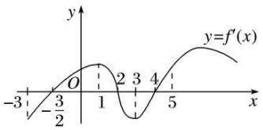

line

| x | y = f'(x) |
|---|---|
| -3 | -3 |
| 0 | 0 |
| 1 | 2 |
| 2 | 3 |
| 3 | 4 |
| 4 | 5 |
| 5 | 6 |
| 6 | 7 |
| 7 | 8 |
| 8 | 9 |
| 9 | 10 |
| 10 | 11 |
| 11 | 12 |
| 12 | 13 |
| 13 | 14 |
| 14 | 15 |
| 15 | 16 |
| 16 | 17 |
| 17 | 18 |
| 18 | 19 |
| 19 | 20 |
| 20 | 21 |
| 21 | 22 |
| 22 | 23 |
| 23 | 24 |
| 24 | 25 |
| 25 | 26 |
| 26 | 27 |
| 27 | 28 |
| 28 | 29 |
| 29 | 30 |
| 30 | 31 |
| 31 | 32 |
| 32 | 33 |
| 33 | 34 |
| 34 | 35 |
| 35 | 36 |
| 36 | 37 |
| 37 | 38 |
| 38 | 39 |
| 39 | 40 |
| 40 | 41 |
| 41 | 42 |
| 42 | 43 |
| 43 | 44 |
| 44 | 45 |
| 45 | 46 |
| 46 | 47 |
| 47 | 48 |
| 48 | 49 |
| 49 | 50 |
| 50 | 51 |
| 51 | 52 |
| 52 | 53 |
| 53 | 54 |
| 54 | 55 |
| 55 | 56 |
| 56 | 57 |
| 57 | 58 |
| 58 | 59 |
| 59 | 60 |
| 60 | 61 |
| 61 | 62 |
| 62 | 63 |
| 63 | 64 |
| 64 | 65 |
| 65 | 66 |
| 66 | 67 |
| 67 | 68 |
| 68 | 69 |
| 69 | 70 |
| 70 | 71 |
| 71 | 72 |
| 72 | 73 |
| 73 | 74 |
| 74 | 75 |
| 75 | 76 |
| 76 | 77 |
| 77 | 78 |
| 78 | 79 |
| 79 | 80 |
| 80 | 81 |
| 81 | 82 |
| 82 | 83 |
| 83 | 84 |
| 84 | 85 |
| 85 | 86 |
| 86 | 87 |
| 87 | 88 |
| 88 | 89 |
| 89 | 90 |
| 90 | -3 (x)   |
| -3 (x)   | -3 (x)   |
| -2 (x)   | -2 (x)   |
| -1 (x)   | -1 (x)   |
| -1 (x)   | -1 (x)   |
| -1 (x)   | -1 (x)   |
| -1 (x)   | -1 (x)   |
| -1 (x)   | -1 (x)   |
| -1 (x)   | -1 (x)   |
| -1 (x)   | -1 (x)   |
| -1 (y)   | -1 (y)   |
| -1 (y)   | -1 (y)   |
| -1 (y)   | -1 (y)   |
| -1 (y)   | -1 (y)   |
| -1 (y)   | -1 (y)   |
| -1 (y)   | -1 (y)   |
| -1 (y)   | -1 (y)   |
| -1 (y) / (-3)| -1 (y)   |
| -1 (y) / (-2)| -1 (y)   |
| -1 (y) / (-1)| -1 (y)   |
| -1 (y) / (-2)| -1 (y)   |
| -1 (y) / (-3)| -1 (y)   |
| -1 (y) / (-4)| -1 (y)   |
| -1 (y) / (-5)| -1 (y)   |
| -1 (y) / (-6)| -1 (y)   |
| -1 (y) / (-7)| -1 (y)   |
| -1 (y) / (-8)| -1 (y)   |
| -1 (y) / (-9)| -1 (y)   |
| -1 (y) / (-10)| -1 (y)   |
| -1 (y) / (-11)| -1 (y)   |
| -1 (y) / (-12)| -1 (y)   |
| -1 (y) / (-13)| -1 (y)   |
| -1 (y) / (-14)| -1 (y)   |
| -1 (y) / (-15)| -1 (y)   |
| -1 (y) / (-16)| -1 (y)   |
| -1 (y) / (-17)| -1 (y)   |
| -1 (y) / (-18)| -1 (y)   |
| -1 (y) / (-19)| -1 (y)   |
| -1 (y) / (-20)| -1 (y)   |
| -1 (y) / (-21)| -1 (y)   |
| -1 (y) / (-22)| -1 (y)   |
| -1 (y) / (-23)| -1 (y)   |
| -1 (y) / (-24)| -1 (y)   |
| -1 (y) / (-25)| -1 (y)   |
| -1 (y) / (-26)| -1 (y)   |
| -1 (y) / (-27)| -1 (y)   |
| -1 (y) / (-28)| -1 (y)   |
| -1 (y) / (-29)| -1 (y)   |
| -1 (y) / (-30)| -0.5    |

A. 在区间 $(-2, 1)$ 上 $f(x)$ 单调递增

B. 在区间(1, 3)上 $f(x)$ 单调递减

C. 在区间(4, 5)上 $f(x)$ 单调递增

D. 在区间(3, 5)上 $f(x)$ 单调递增

2. 函数 $y = f(x)$ 的导函数 $y = f'(x)$ 的图象如图所示，则函数 $y = f(x)$ 的图象可能是()

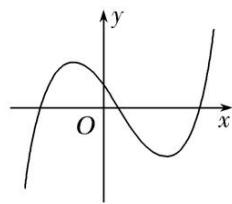

text_image

y
O
x

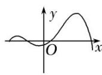  
A

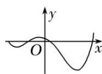  
B

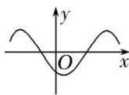  
C

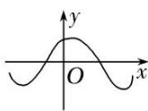  
D

3. (多选)已知函数 $f(x)$ 的导函数 $f'(x)$ 的图象如图所示, 那么下列图象中不可能是函数 $f(x)$ 的图象的是()

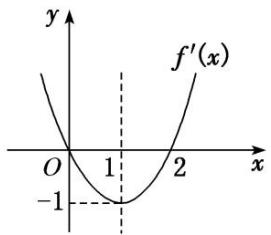

text_image

y
f'(x)
O
1
2
x
-1

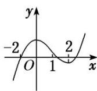  
A

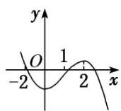  
B

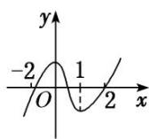  
C

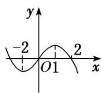  
D

4. 函数 $f(x)$ 的导函数 $f'(x)$ 有下列信息:

① $f'(x)>0$ 时，-1<x<2；② $f'(x)<0$ 时，x<-1或x>2；③ $f'(x)=0$ 时，x=-1或x=2.

则函数 $f(x)$ 的大致图象是（

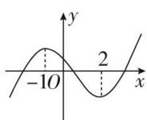  
A

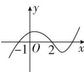  
B

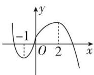  
C

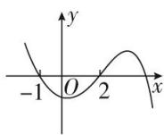  
D

5. 函数 $y=f(x)$ 的图象如图所示，则 $y=f'(x)$ 的图象可能是()

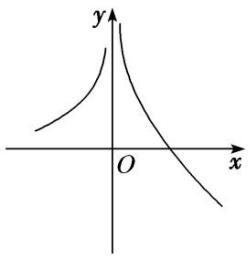

text_image

y
O
x

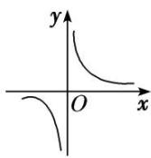

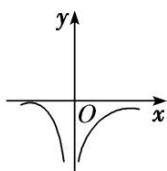

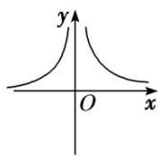

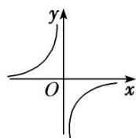  
A   
B   
C   
D

6. 已知函数 $f(x) = x^2 + 2\cos x$ ，若 $f'(x)$ 是 $f(x)$ 的导函数，则函数 $f'(x)$ 的图象大致是（）

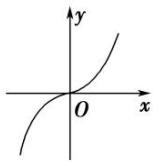  
A

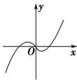  
B

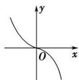  
C

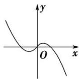  
D

7. 函数 $y=4x^{2}+\frac{1}{x}$ 的单调递增区间为()

A. $(0, +\infty)$

B. $\left(\frac{1}{2},+\infty\right)$

C. $(-∞,-1)$

D. $\left(-\infty,-\frac{1}{2}\right)$

8. 函数 $f(x)=(x-2)\mathrm{e}^{x}$ 的单调递增区间为 \_\_\_\_.

9. 函数 $f(x) = (x - 1)e^x - x^2$ 的单调递增区间为 \_\_\_\_，单调递减区间为 \_\_\_\_.

10. 函数 $f(x)=x^{2}-2\ln x$ 的单调递减区间是()

A. $(0, 1)$

B. $(1, +\infty)$

C. $(-\infty, 1)$

D. $(-1, 1)$

11. 函数 $y=x+\frac{3}{x}+2\ln x$ 的单调递减区间是()

A. $(-3, 1)$

B. $(0, 1)$

C. $(-1, 3)$

D. $(0, 3)$

12. 函数 $f(x)=x\ln x+x$ 的单调递增区间是()

A. $\left(\frac{1}{e^{2}},+\infty\right)$

B. $\left(0,\frac{1}{\mathrm{e}^{2}}\right)$

C. $\left(\frac{\sqrt{e}}{e},+\infty\right)$

D. $\left(0,\frac{\sqrt{e}}{e}\right)$

13. 已知函数 $f(x)=x^{2}-5x+2\ln x$ ，则函数 $f(x)$ 的单调递增区间是()

A. $\left(0,\frac{1}{2}\right)$ 和 $(1,+\infty)$

B. $(0, 1)$ 和 $(2, +\infty)$

C. $\left(0,\frac{1}{2}\right)$ 和 $(2,+\infty)$

D. $(1, 2)$

14. 函数 $f(x)=\frac{x}{\ln x}$ 的单调递减区间是 \_\_\_\_.

15. 函数 $f(x)=\mathrm{e}^{x}\cos x$ 的单调递增区间为 \_\_\_\_.

16. 函数 $y=x\cos x-\sin x$ 在下面哪个区间上单调递增()

A. $\left(\frac{\pi}{2},\frac{3\pi}{2}\right)$

B. $(\pi, 2\pi)$

C. $\left(\frac{3\pi}{2},\frac{5\pi}{2}\right)$

D. $(2\pi, 3\pi)$

17. 已知定义在区间 $(- \pi, \pi)$ 上的函数 $f(x) = x \sin x + \cos x$ ，则 $f(x)$ 的单调递增区间为 \_\_\_\_.

18. (多选)若函数 $g(x)=\mathrm{e}^{x}f(x)(\mathrm{e}=2.718\cdots,\mathrm{e}$ 为自然对数的底数)在 $f(x)$ 的定义域上单调递增，则称函数 $f(x)$ 具有 M 性质．下列函数不具有 M 性质的为()

A. $f(x)=\frac{1}{x}$

B. $f(x)=x^{2}+1$

C. $f(x)=\sin x$

D. $f(x)=x$

19. 已知函数 $f(x)=\frac{1}{2}x^{3}+x^{2}$ .

(1)求曲线 $f(x)$ 在点 $\left[-\frac{4}{3}, f\left(-\frac{4}{3}\right)\right]$ 处的切线方程；

(2)讨论函数 $y=f(x)e^{x}$ 的单调性.

20. 设函数 $f(x) = x\mathrm{e}^{a - x} + bx$ ，曲线 $y = f(x)$ 在点(2， $f(2)$ )处的切线方程为 $y = (\mathrm{e} - 1)x + 4$ .

(1)求 a, b 的值;  
(2)求 $f(x)$ 的单调区间.

# 考点二 比较大小或解不等式

# 【方法总结】

# 利用导数比较大小或解不等式的常用技巧

利用题目条件，构造辅助函数，把比较大小或求解不等式的问题转化为先利用导数研究函数的单调性问题，再由单调性比较大小或解不等式.

# 【例题选讲】

[例 3](1)在 R 上可导的函数 $f(x)$ 的图象如图所示，则关于 x 的不等式 $xf'(x)<0$ 的解集为()

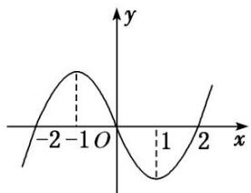

line

| x | y |
|---|---|
| -2 | 0 |
| -1 | 1 |
| 0 | 0 |
| 1 | -1 |
| 2 | 0 |

A. $(-\infty, -1) \cup (0, 1)$

B. $(-1, 0) \cup (1, +\infty)$

C. $(-2, -1) \cup (1, 2)$

D. $(-\infty, -2) \cup (2, +\infty)$

(2)已知函数 $f(x) = x\sin x$ ， $x \in \mathbf{R}$ ，则 $f\left(\frac{\pi}{5}\right)$ ， $f(1)$ ， $f\left(-\frac{\pi}{3}\right)$ 的大小关系为（）

A. $f\left(-\frac{\pi}{3}\right) > f(1) > f\left(\frac{\pi}{5}\right)$

B. $f(1)>f\left(-\frac{\pi}{3}\right)>f\left(\frac{\pi}{5}\right)$

C. $f\left(\frac{\pi}{5}\right) > f(1) > f\left(-\frac{\pi}{3}\right)$

D. $f\left(-\frac{\pi}{3}\right) > f\left(\frac{\pi}{5}\right) > f(1)$

(3)已知奇函数 $f(x)$ 是 R 上的增函数， $g(x)=xf(x)$ ，则()

A. $g\left(\log_3\frac{1}{4}\right) > g(2 - \frac{3}{2}) > g(2 - \frac{2}{3})$

B. $g\left(\log_3\frac{1}{4}\right) > g(2 - \frac{2}{3}) > g(2 - \frac{3}{2})$

C. $g(2 - \frac{3}{2}) > g(2 - \frac{2}{3}) > g\left(\log_3\frac{1}{4}\right)$

D. $g(2 - \frac{2}{3}) > g(2 - \frac{3}{2}) > g\left(\log_3\frac{1}{4}\right)$

(4)对于 R 上可导的任意函数 $f(x)$ ，若满足 $\frac{1-x}{f'(x)} \leq 0$ ，则必有()

A. $f(0)+f(2)>2f(1)$

B. $f(0) + f(2)\leq 2f(1)$

C. $f(0)+f(2)<2f(1)$

D. $f(0) + f(2)\geq 2f(1)$

(5)已知函数 $f(x) = \mathrm{e}^{x} - \mathrm{e}^{-x} - 2x + 1$ ，则不等式 $f(2x - 3) > 1$ 的解集为 \_\_\_\_.

(6)设函数 $f(x)$ 为奇函数，且当 $x \geq 0$ 时， $f(x) = e^x - \cos x$ ，则不等式 $f(2x - 1) + f(x - 2) > 0$ 的解集为()

A. $(-\infty, 1)$

B. $\left(-\infty,\frac{1}{3}\right)$

C. $\left(\frac{1}{3},+\infty\right)$

D. $(1, +\infty)$

# 【对点训练】

1. 已知函数 $y = f(x) (x \in \mathbf{R})$ 的图象如图所示，则不等式 $xf'(x) \geq 0$ 的解集为 \_\_\_\_.

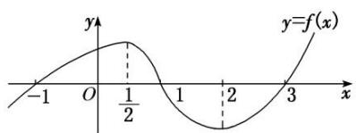

line

| x    | y=f(x) |
| ---- | ------ |
| -1   | -1     |
| 0    | 1      |
| 1/2  | 0.8    |
| 2    | -0.5   |
| 3    | 1      |

2. 已知函数 $f(x) = 3x + 2\cos x$ ，若 $a = f(3\sqrt{2})$ ， $b = f(2)$ ， $c = f(\log_27)$ ，则 $a, b, c$ 的大小关系是（）

A. a<b<c

B. c<a<b

C. b<a<c

D. b<c<a

3. 已知函数 $f(x) = \sin x + \cos x - 2x$ , $a = f(-\pi)$ , $b = f(2^{\mathrm{e}})$ , $c = f(\ln 2)$ ，则 $a, b, c$ 的大小关系是（）

A. a>c>b

B. a>b>c

C. b>a>c

D. c>b>a

4. 函数 $f(x)$ 在定义域 $\mathbf{R}$ 内可导，若 $f(x) = f(2 - x)$ ，且当 $x \in (-\infty, 1)$ 时， $(x - 1)f'(x) < 0$ ，设 $a = f(0)$ ， $b = f\left(\frac{1}{2}\right)$ ， $c = f(3)$ ，则 $a, b, c$ 的大小关系为（）

A. a<b<c

B. c<b<a

C. c<a<b

D. b<c<a

5. 已知函数 $f(x) = x^3 - 2x + \mathrm{e}^x - \frac{1}{\mathrm{e}^x}$ ，其中 $\mathbf{e}$ 是自然对数的底数。若 $f(a - 1) + f(2a^2) \leq 0$ ，则实数 $a$ 的取值范围是 \_\_\_\_。

6. 已知函数 $f(x) = \frac{1}{3} x^3 - 4x + 2\mathrm{e}^x - 2\mathrm{e}^{-x}$ ，其中 $\mathbf{e}$ 为自然对数的底数，若 $f(a - 1) + f(2a^2) \leqslant 0$ ，则实数 $a$ 的取值范围是（）

A. $(-\infty, -1]$

B. $\left[\frac{1}{2},+\infty\right]$

C. $\left(-1,\frac{1}{2}\right)$

D. $\left[-1,\frac{1}{2}\right]$

7. 若函数 $f(x)=\ln x+\mathrm{e}^{x}-\sin x$ ，则不等式 $f(x-1)\leqslant f(1)$ 的解集为 \_\_\_\_.

8. 已知函数 $f(x) = x \sin x + \cos x + x^2$ ，则不等式 $f(\ln x) + f\left(\ln \frac{1}{x}\right) < 2f(1)$ 的解集为 \_\_\_\_.

# 考点三 根据函数的单调性求参数

# 【方法总结】

# 利用单调性求参数的两类热点问题的处理方法

(1)函数 $f(x)$ 在区间 D 上存在递增(减)区间.

方法一：转化为“ $f(x)>0(<0)$ 在区间 D 上有解”；

方法二：转化为“存在区间 D 的一个子区间使 $f'(x) > 0 (< 0)$ 成立”.

(2)函数 $f(x)$ 在区间 D 上递增(减).

方法一：转化为“ $f(x)\geq0(\leq0)$ 在区间D上恒成立”问题；

方法二：转化为“区间 D 是函数 $f(x)$ 的单调递增(减)区间的子集”.

# 【例题选讲】

[例 4](1)若函数 $f(x)=2x^{3}-3mx^{2}+6x$ 在区间 $(1, +\infty)$ 上为增函数，则实数 m 的取值范围是()

A. $(-\infty, 1]$

B. $(-∞, 1)$

C. $(-∞, 2]$

D. $(-∞, 2)$

(2)设函数 $f(x)=\frac{1}{2}x^{2}-9\ln x$ 在区间 $[a-1,a+1]$ 上单调递减，则实数a的取值范围是\_\_\_\_.

(3)若函数 $f(x) = \mathrm{e}^{x}(\sin x + a)$ 在区间 $(0, \pi)$ 上单调递减，则实数 $a$ 的取值范围是（）

A. $[- \sqrt{2}, +\infty)$

B. $[1, +\infty)$

C. $(-\infty, -\sqrt{2}]$

D. $(-∞, 1]$

(4)若 $f(x)=\left\{\begin{aligned}&x+\frac{4a^{2}}{x+a}-4a,&0<x\leq a,\\ &x-x\ln x,&x>a\end{aligned}\right.$

是 $(0, +\infty)$ 上的减函数，则实数 $a$ 的取值范围是（ ）

A. $[1, \mathrm{e}^2]$

B. $[\mathbf{e},\mathbf{e}^2 ]$

C. $[e, +\infty)$

D. $[\mathrm{e}^2, +\infty)$

(5)若函数 $f(x)=-\frac{1}{3}x^{3}+\frac{1}{2}x^{2}+2ax$ 在 $\left[\frac{2}{3},+\infty\right]$ 上存在单调递增区间，则 a 的取值范围是 \_\_\_\_.

(6)若函数 $f(x) = 2x^{2} - \ln x$ 在其定义域的一个子区间 $(k - 1, k + 1)$ 内不是单调函数，则实数 $k$ 的取值范围是 \_\_\_\_.

[例 5] 已知函数 $f(x)=\ln x$ , $g(x)=\frac{1}{2}ax^{2}+2x(a\neq0)$ .

(1)若函数 $h(x)=f(x)-g(x)$ 在 $[1,4]$ 上单调递减，求 a 的取值范围；

(2)若函数 $h(x)=f(x)-g(x)$ 在 $[1, 4]$ 上存在单调递减区间，求 a 的取值范围；

(3)若函数 $h(x)=f(x)-g(x)$ 在 $[1,4]$ 上不单调，求 a 的取值范围.

[例 6] 已知函数 $f(x)=\ln x$ ， $g(x)=\frac{1}{2}ax+b$ .

(1)若 $f(x)$ 与 $g(x)$ 的图象在 x=1 处相切，求 $g(x)$ ;

(2)若 $\varphi (x) = \frac{m(x - 1)}{x + 1} -f(x)$ 在 $[1, + \infty)$ 上是减函数，求实数 $m$ 的取值范围.

# 【对点训练】

1. 已知函数 $f(x) = x^{2} + \frac{a}{x}$ ，若函数 $f(x)$ 在 $[2, +\infty)$ 上单调递增，则实数 $a$ 的取值范围为（）

A. $(-\infty, 8)$

B. $(-\infty, 16]$

C. $(- \infty, -8) \cup (8, +\infty)$

D. $(- \infty, -16] \cup [16, +\infty)$

2. 已知函数 $f(x) = \frac{1}{3} ax^3 - x^2 + x$ 在区间(0, 2)上是单调增函数，则实数 $a$ 的取值范围为 \_\_\_\_.

3. 若 $y = x + \frac{a^2}{x} (a > 0)$ 在 $[2, +\infty)$ 上是增函数，则 $a$ 的取值范围是 \_\_\_\_.

4. 若函数 $f(x)=x^{2}+\frac{1+ax^{2}}{x}$ 在 $\left[\frac{1}{3}, +\infty\right)$ 上是增函数，则实数 a 的取值范围是 \_\_\_\_.

5. 已知函数 $f(x) = \sin 2x + 4\cos x - ax$ 在 $\mathbf{R}$ 上单调递减，则实数 $a$ 的取值范围是（）

A. $[0, 3]$

B. $[3, +\infty)$

C. $(3, +\infty)$

D. $[0, +\infty)$

6. 若函数 $g(x) = \ln x + \frac{1}{2} x^2 - (b - 1)x$ 存在单调递减区间，则实数 $b$ 的取值范围是（）

A. $[3, +\infty)$

B. $(3, +\infty)$

C. $(-∞, 3)$

D. $(-∞, 3]$

7. 已知函数 $f(x) = \ln x + (x - b)^2 (b \in \mathbf{R})$ 在 $\left[\frac{1}{2}, 2\right]$ 上存在单调递增区间，则实数 $b$ 的取值范围是 \_\_\_\_.

8. 已知函数 $f(x) = -\frac{1}{2} x^2 + 4x - 3\ln x$ 在 $[t, t+1]$ 上不单调，则 $t$ 的取值范围是 \_\_\_\_.

9. (多选)若函数 $f(x) = ax^3 + 3x^2 - x + 1$ 恰好有三个单调区间，则实数 $a$ 的取值可以是()

A.-3

B.-1

C. 0

D. 2

10. 已知二次函数 $h(x)=ax^{2}+bx+2$ ，其导函数 $y=h'(x)$ 的图象如图所示， $f(x)=6\ln x+h(x)$ .

(1)求函数 $f(x)$ 的解析式;

(2)若函数 $f(x)$ 在区间 $\left(1, m+\frac{1}{2}\right)$ 上是单调函数，求实数 m 的取值范围.

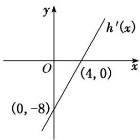

text_image

y
h'(x)
O
(4, 0)
x
(0, -8)

11. 已知函数 $f(x) = x^{2} + a\ln x$ .

(1)当 a = -2 时，求函数 $f(x)$ 的单调递减区间；

(2)若函数 $g(x) = f(x) + \frac{2}{x}$ 在 $[1, +\infty)$ 上单调，求实数 $a$ 的取值范围.

12. 已知函数 $f(x)=\mathrm{e}^{x}-ax\mathrm{e}^{x}-a(a\in\mathbf{R})$ .

(1)若 $f(x)$ 在 $(0, +\infty)$ 上单调递减，求 a 的取值范围；

(2)求证： $x$ 在 $(0, 2)$ 上任取一个值，不等式 $\frac{1}{x} - \frac{1}{\mathrm{e}^x - 1} < \frac{1}{2}$ 恒成立(注：e为自然对数的底数).

