# 专题04 函数的单调性

# 函数的单调性与导数的关系

已知函数 $f(x)$ 在区间 $(a, b)$ 上可导，  
（1）如果 $f'(x)>0$ ，那么函数 $y=f(x)$ 在 $(a, b)$ 内单调递增；  
（2）如果 $f'(x)<0$ ，那么函数 $y=f(x)$ 在 $(a, b)$ 内单调递减；  
（2）如果 $f'(x)=0$ ，那么函数 $y=f(x)$ 在 $(a, b)$ 内是常数函数.

注意：1．在某区间内 $f'(x)>0(f'(x)<0)$ 是函数 $f(x)$ 在此区间上为增(减)函数的充分不必要条件.

2. 可导函数 $f(x)$ 在 $(a, b)$ 上是增(减)函数的充要条件是 $\forall x \in (a, b)$ ，都有 $f'(x) \geq 0 (f'(x) \leq 0)$ 且 $f'(x)$ 在 $(a, b)$ 上的任何子区间内都不恒为零.  
（1）在函数定义域内讨论导数的符号.   
（2）两个或多个增(减)区间之间的连接符号，不用“∪”，可用“，”或用“和”.

# 考点一 不含参数的函数的单调性

# 【方法总结】

# 利用导数判断函数单调性的步骤

第 1 步，确定函数的定义域；
第 2 步，求出导数 $f'(x)$ 的零点；
第 3 步，用 $f'(x)$ 的零点将 $f(x)$ 的定义域划分为若干个区间，列表给出 $f'(x)$ 在各区间上的正负，由此得出函数 $y=f(x)$ 在定义域内的单调性.

# 【例题选讲】

[例 1]（1）定义在[-2, 2]上的函数 $f(x)$ 与其导函数 $f'(x)$ 的图象如图所示，设 O 为坐标原点，A，B，C，D 四点的横坐标依次为 $-\frac{1}{2}$ ， $-\frac{1}{6}$ ， $1, \frac{4}{3}$ ，则函数 $y = \frac{f(x)}{\mathrm{e}^x}$ 的单调递减区间是（）

A. $\left(-\frac{1}{6},\frac{4}{3}\right)$

B. $\left(-\frac{1}{2},1\right)$

C. $\left(-\frac{1}{2}, -\frac{1}{6}\right)$

D. $(1, 2)$
答案 B 解析 若虚线部分为函数 $y=f(x)$ 的图象，则该函数只有一个极值点，但其导函数图象(实线)与 x 轴有三个交点，不符合题意；若实线部分为函数 $y=f(x)$ 的图象，则该函数有两个极值点，则其导函数图象(虚线)与 x 轴恰好也只有两个交点，符合题意。对函数 $y=\frac{f(x)}{\mathrm{e}^{x}}$ 求导得 $y'=\frac{f'(x)-f(x)}{\mathrm{e}^{x}}$ ，由 $y'<0$ ，得 $f'(x)<f(x)$ ，
由图象可知，满足不等式 $f(x) < f(x)$ 的 $x$ 的取值范围是 $\left(-\frac{1}{2}, 1\right)$ ，因此，函数 $y = \frac{f(x)}{\mathrm{e}^x}$ 的单调递减区间为 $\left(-\frac{1}{2}, 1\right)$ . 故选 B.  
（2）已知函数 $y = f(x)$ 的导函数 $y = f'(x)$ 的图象如图所示，则函数 $y = f(x)$ 的图象可以是()

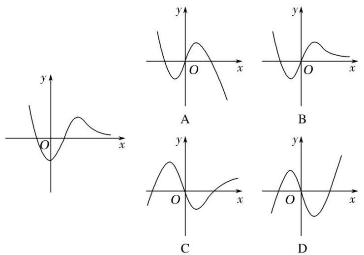
答案 C 解析 根据导函数的正负与原函数的单调性的关系，结合导函数 $f(x)$ 的图象可知，原函数 $f(x)$ 先单调递增，再单调递减，最后缓慢单调递增，选项C符合题意，故选C.  
（3）函数 $f(x)=x^{2}+x\sin x$ 的图象大致为()

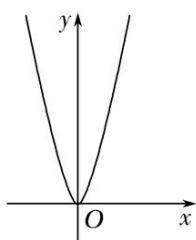

A

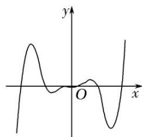

B

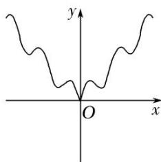

C

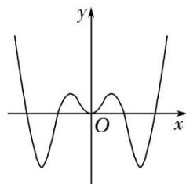

D
答案 A 解析 函数 $f(x)=x^{2}+x\sin x$ 的定义域为 R，且 $f(-x)=(-x)^{2}+(-x)\sin(-x)=x^{2}+x\sin x=f(x)$ ，即函数 $f(x)$ 为偶函数．当 x>0 时， $x+\sin x>0$ ，故 $f'(x)=x(1+\cos x)+(x+\sin x)>0$ ，即 $f(x)$ 在 $(0,+\infty)$ 上单调递增，故选 A.  
（4）函数 $f(x)=x+2\sqrt{1-x}$ 的单调递增区间是\_\_\_\_；单调递减区间是\_\_\_\_。
答案 $(- \infty, 0)$ (0, 1) 解析 $f(x)$ 的定义域为 $\{x | x \leq 1\}$ , $f'(x) = 1 - \frac{1}{\sqrt{1 - x}}$ . 令 $f(x) = 0$ , 得 $x = 0$ . 当

0<x<1 时， $f'(x)<0$ 。当 x<0 时， $f'(x)>0$ 。∴ $f(x)$ 的单调递增区间为 $(-∞, 0)$ ，单调递减区间为 $(0, 1)$ 。  
（5）设函数 $f(x) = x(\mathrm{e}^x - 1) - \frac{1}{2} x^2$ ，则 $f(x)$ 的单调递增区间是 \_\_\_\_，单调递减区间是 \_\_\_\_.
答案 $(- \infty, -1)$ , $(0, +\infty)$ $[-1, 0]$ 解析 $\because f(x) = x(e^x - 1) - \frac{1}{2} x^2$ , $\therefore f'(x) = e^x - 1 + x e^x - x = (e^x - 1)(x + 1)$ . 令 $f'(x) = 0$ , 得 $x = -1$ 或 $x = 0$ . 当 $x \in (-\infty, -1)$ 时, $f'(x) > 0$ . 当 $x \in [-1, 0]$ 时, $f'(x) \leq 0$ . 当 $x \in (0, +\infty)$ 时, $f'(x) > 0$ . 故 $f(x)$ 在 $(- \infty, -1)$ , $(0, +\infty)$ 上单调递增, 在 $[-1, 0]$ 上单调递减.  
（6）函数 $y = \frac{1}{2} x^2 - \ln x$ 的单调递减区间为()

A. $(-1, 1)$

B. $(0, 1)$

C. $(1, +\infty)$

D. $(0, +\infty)$
答案 B 解析 $y=\frac{1}{2}x^{2}-\ln x,\quad y'=x-\frac{1}{x}=\frac{x^{2}-1}{x}=\frac{(x-1)(x+1)}{x}(x>0)$ . 令 $y'<0$ ，得 0<x<1，∴递减区间为 $(0,1)$ .  
（7）设函数 $f(x)=2(x^{2}-x)\ln x-x^{2}+2x$ ，则函数 $f(x)$ 的单调递减区间为()

A. $\left(0,\frac{1}{2}\right)$

B. $\left(\frac{1}{2},\ 1\right)$

C. $(1, +\infty)$

D. $(0, +\infty)$
答案 B 解析 由题意可得 $f(x)$ 的定义域为 $(0, +\infty)$ ， $f'(x) = 2(2x - 1)\ln x + 2(x^2 - x)\cdot \frac{1}{x} - 2x + 2 = (4x - 2)\ln x$ 。由 $f'(x) < 0$ 可得 $(4x - 2)\ln x < 0$ ，所以 $\left\{ \begin{array}{l} 4x - 2 > 0, \\ \ln x < 0 \end{array} \right.$ 或 $\left\{ \begin{array}{l} 4x - 2 < 0, \\ \ln x > 0, \end{array} \right.$ 解得 $\frac{1}{2} < x < 1$ ，故函数 $f(x)$ 的单调递减区间为 $\left[ \frac{1}{2}, 1 \right]$ ，选 B.  
（8）已知定义在区间 $(0, \pi)$ 上的函数 $f(x) = x + 2\cos x$ ，则 $f(x)$ 的单调递增区间为 \_\_\_\_.
答案 $\left(0, \frac{\pi}{6}\right), \left(\frac{5\pi}{6}, \pi\right)$ 解析 $f'(x)=1-2\sin x, x \in (0, \pi)$ . 令 $f'(x)=0$ , 得 $x=\frac{\pi}{6}$ 或 $x=\frac{5\pi}{6}$ , 当 $0<x<\frac{\pi}{6}$ 时, $f'(x)>0$ , 当 $\frac{\pi}{6}<x<\frac{5\pi}{6}$ 时, $f'(x)<0$ , 当 $\frac{5\pi}{6}<x<\pi$ 时, $f'(x)>0$ , $\therefore f(x)$ 在 $\left(0, \frac{\pi}{6}\right)$ 和 $\left(\frac{5\pi}{6}, \pi\right)$ 上单调递增, 在 $\left(\frac{\pi}{6}, \frac{5\pi}{6}\right)$ 上单调递减.  
（9）函数 $f(x)=2|\sin x|+\cos 2x$ 在 $[- \frac{\pi}{2}, \frac{\pi}{2}]$ 上的单调递增区间为()

A. $[- \frac{\pi}{2}, - \frac{\pi}{6} ]$ 和 $[0, \frac{\pi}{6} ]$

B. $[- \frac{\pi}{6}, 0]$ 和 $[\frac{\pi}{6}, \frac{\pi}{2}]$

C. $[- \frac{\pi}{2}, - \frac{\pi}{6} ]$ 和 $[\frac{\pi}{6}, \frac{\pi}{2} ]$

D. $[-\frac{\pi}{6},\frac{\pi}{6} ]$
答案 A 解析 由题意, 因为 $f(-x) = 2|\sin(-x)| + \cos(-2x) = 2|\sin x| + \cos 2x = f(x)$ , 所以 $f(x)$ 为偶函数, 当 $0 \leq x \leq \frac{\pi}{2}$ 时, $f(x) = 2\sin x + \cos 2x$ , 则 $f'(x) = 2\cos x - 2\sin 2x$ , 令 $f'(x) \geq 0$ , 得 $\sin x \leq \frac{1}{2}$ , 所以 $0 \leq x \leq \frac{\pi}{6}$ , 由 $f(x)$ 为偶函数, 可得当 $-\frac{\pi}{6} \leq x \leq 0$ 时, $f(x)$ 单调递减, 则在 $[- \frac{\pi}{2}, -\frac{\pi}{6}]$ 上单调递增, 故选 A.  
（10）下列函数中，在 $(0, +\infty)$ 上为增函数的是（ ）

A. $f(x)=\sin2x$

B. $f(x)=xe^{x}$

C. $f(x) = x^{3} - x$

D. $f(x) = -x + \ln x$
答案 B 解析 对于 A, $f(x)=\sin 2x$ 的单调递增区间是 $\left[\frac{k\pi-\frac{\pi}{4}, k\pi+\frac{\pi}{4}}{4}\right](k\in\mathbb{Z})$ ; 对于 B, $f'(x)=\mathrm{e}^{x}(x+1)$ ，当 $x\in(0,+\infty)$ 时， $f'(x)>0$ ，∴ 函数 $f(x)=xe^{x}$ 在 $(0,+\infty)$ 上为增函数；对于 C, $f'(x)=3x^{2}-1$ ，令 $f'(x)>0$ ，得 $x>\frac{\sqrt{3}}{3}$ 或 $x<-\frac{\sqrt{3}}{3}$ ，∴ 函数 $f(x)=x^{3}-x$ 在 $\left(-\infty,-\frac{\sqrt{3}}{3}\right)$ 和 $\left(\frac{\sqrt{3}}{3},+\infty\right)$ 上单调递增；对于 D, $f'(x)=-1+\frac{1}{x}=-\frac{x-1}{x}$ ，令 $f'(x)>0$ ，得 0<x<1，∴ 函数 $f(x)=-x+\ln x$ 在区间 $(0,1)$ 上单调递增．故选 B.

[例 2] 已知函数 $f(x)=\frac{\ln x+k}{\mathrm{e}^{x}}$ (k 为常数)，曲线 $y=f(x)$ 在点 $(1, f(1))$ 处的切线与 x 轴平行.  
（1）求实数 k 的值;  
（2）求函数 $f(x)$ 的单调区间.
解析 $（1）f'(x)=\frac{\frac{1}{x}-\ln x-k}{\mathrm{e}^{x}}(x>0)$ . 又由题意知 $f'（1）=\frac{1-k}{\mathrm{e}}=0$ ，所以 k=1.  
（2）由（1）知， $f(x)=\frac{\frac{1}{x}-\ln x-1}{\mathrm{e}^{x}}(x>0)$ . 设 $h(x)=\frac{1}{x}-\ln x-1(x>0)$ ，则 $h'(x)=-\frac{1}{x^{2}}-\frac{1}{x}<0$ ,
所以 $h(x)$ 在 $(0, +\infty)$ 上单调递减．由 $h(1)=0$ 知，当 0<x<1 时， $h(x)>0$ ，所以 $f'(x)>0$ ；当 x>1 时， $h(x)<0$ ，所以 $f'(x)<0$ 。

综上， $f(x)$ 的单调增区间是 $(0, 1)$ ，单调减区间为 $(1, +\infty)$ .

# 【对点训练】

1. 如图是函数 $y = f(x)$ 的导函数 $y = f'(x)$ 的图象，则下列判断正确的是()

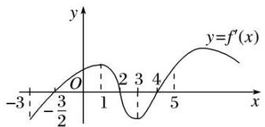

A. 在区间 $(-2, 1)$ 上 $f(x)$ 单调递增

B. 在区间(1, 3)上 $f(x)$ 单调递减

C. 在区间(4, 5)上 $f(x)$ 单调递增

D. 在区间(3, 5)上 $f(x)$ 单调递增

1. 答案 C 解析 在(4, 5)上 $f'(x)>0$ 恒成立，∴ $f(x)$ 在区间(4, 5)上单调递增.

2. 函数 $y=f(x)$ 的导函数 $y=f'(x)$ 的图象如图所示，则函数 $y=f(x)$ 的图象可能是()

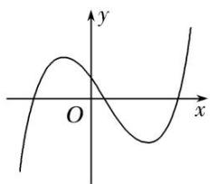

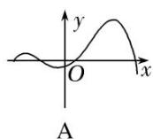

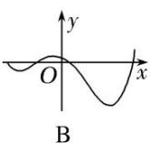

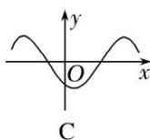

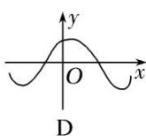

2. 答案 D 解析 设导函数 $y=f'(x)$ 与 x 轴交点的横坐标从左往右依次为 $x_{1}$ ， $x_{2}$ ， $x_{3}$ ，由导函数 $y=f'(x)$ 的图象易得当 $x\in(-\infty, x_{1})\cup(x_{2}, x_{3})$ 时， $f'(x)<0$ ；当 $x\in(x_{1}, x_{2})\cup(x_{3}, +\infty)$ 时， $f'(x)>0$ （其中 $x_{1}<0<x_{2}<x_{3}$ ），所以函数 $f(x)$ 在 $(-∞, x_{1})$ ， $(x_{2}, x_{3})$ 上单调递减，在 $(x_{1}, x_{2})$ ， $(x_{3}, +∞)$ 上单调递增，观察各选项，只有 D 选项符合.

3. (多选)已知函数 $f(x)$ 的导函数 $f'(x)$ 的图象如图所示, 那么下列图象中不可能是函数 $f(x)$ 的图象的是()

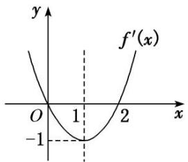

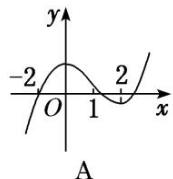

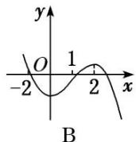

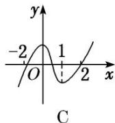

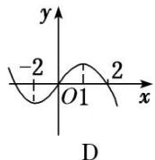

3. 答案 BCD 解析 由导函数图象可得: 当 $x < 0$ 时, $f'(x) > 0$ , 即函数 $f(x)$ 在 $(- \infty, 0)$ 上单调递增; 当 $0 < x < 2$ 时, $f'(x) < 0$ , 即函数 $f(x)$ 在 $(0, 2)$ 上单调递减; 当 $x > 2$ 时, $f'(x) > 0$ , 即函数 $f(x)$ 在 $(2, +\infty)$ 上单调递增. 故选 B、C、D.

4. 函数 $f(x)$ 的导函数 $f'(x)$ 有下列信息:

① $f'(x)>0$ 时，-1<x<2；② $f'(x)<0$ 时，x<-1或x>2；③ $f'(x)=0$ 时，x=-1或x=2.
则函数 $f(x)$ 的大致图象是()

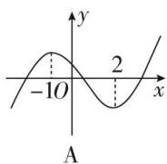

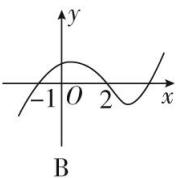

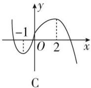

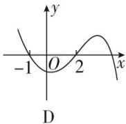

4. 答案 C 解析 由题意可知函数 $f(x)$ 在 $(-1, 2)$ 上单调递增，在 $(- \infty, -1)$ 和 $(2, +\infty)$ 上单调递减，故选 C.

5. 函数 $y=f(x)$ 的图象如图所示，则 $y=f'(x)$ 的图象可能是()

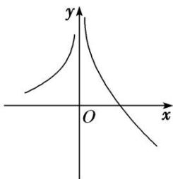

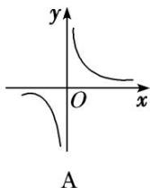

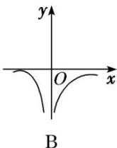

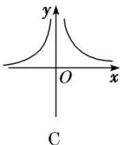

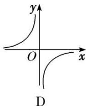

5. 答案 D 解析 由函数 $f(x)$ 的图象可知， $f(x)$ 在 $(- \infty, 0)$ 上单调递增， $f(x)$ 在 $(0, +\infty)$ 上单调递减，所以在 $(- \infty, 0)$ 上， $f'(x) > 0$ ；在 $(0, +\infty)$ 上， $f'(x) < 0$ ，选项 D 满足。

6. 已知函数 $f(x)=x^{2}+2\cos x$ ，若 $f'(x)$ 是 $f(x)$ 的导函数，则函数 $f'(x)$ 的图象大致是()

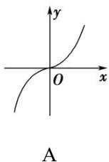

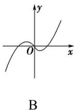

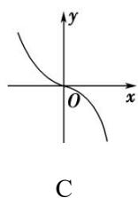

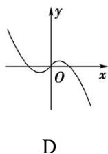

6. 答案 A 解析 设 $g(x) = f'(x) = 2x - 2\sin x$ ，则 $g'(x) = 2 - 2\cos x \geq 0$ 。所以函数 $f'(x)$ 在 R 上单调递增，故选 A.

7. 函数 $y=4x^{2}+\frac{1}{x}$ 的单调递增区间为()

A. $(0, +\infty)$

B. $\left(\frac{1}{2},+\infty\right)$

C. $(-∞,-1)$

D. $\left(-\infty,-\frac{1}{2}\right)$

7. 答案 B 解析 由 $y = 4x^{2} + \frac{1}{x} (x \neq 0)$ ，得 $y' = 8x - \frac{1}{x^{2}}$ ，令 $y' > 0$ ，即 $8x - \frac{1}{x^{2}} > 0$ ，解得 $x > \frac{1}{2}$ ，∴函数 $y = 4x^{2} + \frac{1}{x}$ 的单调递增区间为 $\left(\frac{1}{2}, +\infty\right)$ . 故选 B.

8. 函数 $f(x)=(x-2)\mathrm{e}^{x}$ 的单调递增区间为 \_\_\_\_.

8. 答案 $(1, +\infty)$ 解析 $f(x)$ 的定义域为 $\mathbf{R}$ , $f'(x) = (x - 1)e^x$ , 令 $f'(x) = 0$ , 得 $x = 1$ , 当 $x \in (1, +\infty)$ 时, $f'(x) > 0$ ; 当 $x \in (-\infty, 1)$ 时, $f'(x) < 0$ , $\therefore f(x)$ 的单调递增区间为 $(1, +\infty)$ .

9. 函数 $f(x) = (x - 1)\mathrm{e}^x - x^2$ 的单调递增区间为 \_\_\_\_，单调递减区间为 \_\_\_\_.

9. 答案 $(- \infty, 0)$ , $(\ln 2, + \infty)$ (0, $\ln 2$ ) 解析 $f(x)$ 的定义域为 $\mathbf{R}$ , $f'(x) = x e^x - 2x = x(e^x - 2)$ , 令 $f'(x) = 0$ , 得 $x = 0$ 或 $x = \ln 2$ , 当 $x$ 变化时, $f'(x)$ , $f(x)$ 的变化情况如下表,

<table><tr><td>x</td><td>(-∞,0)</td><td>0</td><td>(0,ln2)</td><td>ln2</td><td>(ln2,+∞)</td></tr><tr><td>f(x)</td><td>+</td><td>0</td><td>-</td><td>0</td><td>+</td></tr><tr><td>f(x)</td><td>单调递增</td><td></td><td>单调递减</td><td></td><td>单调递增</td></tr></table>
∴ $f(x)$ 的单调递增区间为 $(-∞, 0)$ ， $(\ln 2, +∞)$ ，单调递减区间为 $(0, \ln 2)$ .

10. 函数 $f(x)=x^{2}-2\ln x$ 的单调递减区间是()

A. $(0, 1)$

B. $(1, +\infty)$

C. $(-∞, 1)$

D. $(-1, 1)$

10. 答案 A 解析 $\because f'(x) = 2x - \frac{2}{x} = \frac{2(x + 1)(x - 1)}{x} (x > 0)$ ，令 $f'(x) = 0$ ，得 $x = 1$ ， $\therefore$ 当 $x \in (0, 1)$ 时， $f'(x) < 0$ ， $f(x)$ 单调递减；当 $x \in (1, +\infty)$ 时， $f'(x) > 0$ ， $f(x)$ 单调递增.

11. 函数 $y=x+\frac{3}{x}+2\ln x$ 的单调递减区间是()

A. $(-3,1)$

B. $(0, 1)$

C. $(-1, 3)$

D. $(0, 3)$

11. 答案 B 解析 $y' = 1 - \frac{3}{x^{2}} + \frac{2}{x} = \frac{x^{2} + 2x - 3}{x^{2}} (x > 0)$ ，令 $y' < 0$ 得 $\left\{\begin{aligned} x^{2} + 2x - 3 & < 0 \\ x & > 0 \end{aligned}\right.$ ，解得 0 < x < 1，故选 B.

12. 函数 $f(x)=x\ln x+x$ 的单调递增区间是()

A. $\left(\frac{1}{e^{2}},+\infty\right)$

B. $\left(0,\frac{1}{\mathrm{e}^{2}}\right)$

C. $\left(\frac{\sqrt{e}}{e},+\infty\right)$

D. $\left(0,\frac{\sqrt{e}}{e}\right)$

12. 答案 A 解析 因为函数 $f(x)=x\ln x+x(x>0)$ ，所以 $f'(x)=\ln x+2$ ，由 $f'(x)>0$ ，得 $\ln x+2>0$ ，可得 $x>\frac{1}{e^{2}}$ ，故函数 $f(x)=x\ln x+x$ 的单调递增区间是 $\left(\frac{1}{e^{2}}, +\infty\right)$ .

13. 已知函数 $f(x) = x^{2} - 5x + 2\ln x$ ，则函数 $f(x)$ 的单调递增区间是（）

A. $\left(0,\frac{1}{2}\right)$ 和 $(1,+\infty)$

B. $(0, 1)$ 和 $(2, +\infty)$

C. $\left(0,\frac{1}{2}\right)$ 和 $(2,+\infty)$

D. $(1, 2)$

13. 解析 C 答案 函数 $f(x)=x^{2}-5x+2\ln x$ 的定义域是 $(0,+\infty)$ . $f'(x)=2x-5+\frac{2}{x}=\frac{2x^{2}-5x+2}{x}=$
$\frac{(x-2)(2x-1)}{x}$ ，令 $f(x)>0$ ，解得 $0<x<\frac{1}{2}$ 或x>2，故函数 $f(x)$ 的单调递增区间是 $\begin{bmatrix}0,&\frac{1}{2}\end{bmatrix}$ 和 $(2,+\infty)$ .

14. 函数 $f(x)=\frac{x}{\ln x}$ 的单调递减区间是 \_\_\_\_.

14. 答案 (0, 1) 和 (1, e) 解析 由 $f'(x) = \frac{\ln x - 1}{\ln x^2} < 0$ 得 $\left\{ \begin{array}{l} \ln x - 1 < 0, \\ \ln x \neq 0, \end{array} \right.$ 解得 $0 < x < 1$ 或 $1 < x < e$ . $\therefore f(x)$ 的单调递减区间为 (0, 1) 和 (1, e).

15. 函数 $f(x)=\mathrm{e}^{x}\cos x$ 的单调递增区间为 \_\_\_\_.

15. 答案 $\left[2k\pi - \frac{3}{4}\pi, 2k\pi + \frac{\pi}{4}\right](k \in \mathbf{Z})$ 解析 $f'(x) = e^x \cos x - e^x \sin x = e^x (\cos x - \sin x)$ ，令 $f'(x) > 0$ 得 $\cos x > \sin x$ ， $\therefore 2k\pi - \frac{3}{4}\pi < x < 2k\pi + \frac{\pi}{4}$ ， $k \in \mathbf{Z}$ ，即函数 $f(x)$ 的单调递增区间为 $\left[2k\pi - \frac{3}{4}\pi, 2k\pi + \frac{\pi}{4}\right](k \in \mathbf{Z})$ 。

16. 函数 $y = x\cos x - \sin x$ 在下面哪个区间上单调递增()

A. $\left(\frac{\pi}{2},\frac{3\pi}{2}\right)$

B. $(\pi, 2\pi)$

C. $\left(\frac{3\pi}{2},\frac{5\pi}{2}\right)$

D. $(2\pi, 3\pi)$

16. 答案 B 解析 $y' = -x\sin x$ ，经验证，4个选项中只有在 $(\pi, 2\pi)$ 内 $y' > 0$ 恒成立， $\therefore y = x\cos x - \sin x$ 在 $(\pi, 2\pi)$ 上单调递增.

17. 已知定义在区间 $(- \pi, \pi)$ 上的函数 $f(x) = x \sin x + \cos x$ ，则 $f(x)$ 的单调递增区间为 \_\_\_\_.

17. 答案 $\left[-\pi, -\frac{\pi}{2}\right], \left[0, \frac{\pi}{2}\right]$ 解析 $f'(x)=\sin x+x\cos x-\sin x=x\cos x$ 。令 $f'(x)=x\cos x>0$ ，则其在区间 $(- \pi, \pi)$ 上的解集为 $\left[-\pi, -\frac{\pi}{2}\right]$ 和 $\left[0, \frac{\pi}{2}\right]$ ，即 $f(x)$ 的单调递增区间为 $\left[-\pi, -\frac{\pi}{2}\right], \left[0, \frac{\pi}{2}\right]$ .

18. (多选)若函数 $g(x)=\mathrm{e}^{x}f(x)(\mathrm{e}=2.718\cdots,\mathrm{e}$ 为自然对数的底数)在 $f(x)$ 的定义域上单调递增，则称函数 $f(x)$ 具有 M 性质．下列函数不具有 M 性质的为()

A. $f(x)=\frac{1}{x}$

B. $f(x)=x^{2}+1$

C. $f(x)=\sin x$

D. $f(x)=x$

18. 答案 ACD 解析 对于 A, $f(x)=\frac{1}{x}$ ，则 $g(x)=\frac{\mathrm{e}^{x}}{x}$ ， $g'(x)=\frac{\mathrm{e}^{x}(x-1)}{x^{2}}$ ，当 x<1 且 $x\neq0$ 时， $g'(x)<0$ ，当 x>1 时， $g'(x)>0$ ，∴ $g(x)$ 在 $(-∞,0)$ ， $(0,1)$ 上单调递减，在 $(1,+∞)$ 上单调递增；对于 B， $f(x)=x^{2}+1$ ，则 $g(x)=\mathrm{e}^{x}f(x)=\mathrm{e}^{x}(x^{2}+1)$ ， $g'(x)=\mathrm{e}^{x}(x^{2}+1)+2xe^{x}=\mathrm{e}^{x}(x+1)^{2}>0$ 在实数集 R 上恒成立，∴ $g(x)=\mathrm{e}^{x}f(x)$ 在定义域 R 上是增函数；对于 C， $f(x)=\sin x$ ，则 $g(x)=\mathrm{e}^{x}\sin x$ ， $g'(x)=\mathrm{e}^{x}(\sin x+\cos x)=\sqrt{2}\mathrm{e}^{x}\sin\left[\frac{x+\pi}{4}\right]$ ，显然 $g(x)$ 不单调；对于 D， $f(x)=x$ ，则 $g(x)=xe^{x}$ ，则 $g'(x)=(x+1)\mathrm{e}^{x}$ 。当 x<-1 时， $g'(x)<0$ ，所以 $g(x)$ 在 R 上先减后增；∴ 具有 M 性质的函数的选项为 B，不具有 M 性质的函数的选项为 A，C，D。

19. 已知函数 $f(x)=\frac{1}{2}x^{3}+x^{2}$ .  
（1）求曲线 $f(x)$ 在点 $\left[-\frac{4}{3}, f\left(-\frac{4}{3}\right)\right]$ 处的切线方程；  
（2）讨论函数 $y=f(x)e^{x}$ 的单调性.

19. 解析 （1） $\because f(x)=\frac{1}{2}x^{3}+x^{2}, \therefore f'(x)=\frac{3}{2}x^{2}+2x.\therefore f'\left(-\frac{4}{3}\right)=0.$ 又 $f\left(-\frac{4}{3}\right)=\frac{16}{27},$
∴ 曲线 $f(x)$ 在 $\left[-\frac{4}{3}, f\left(-\frac{4}{3}\right)\right]$ 处的切线方程为 $y=\frac{16}{27}$ .  
（2） 令 $g(x) = f(x)e^x = \left(\frac{1}{2} x^3 + x^2\right)e^x$ , $\therefore g'(x) = \left(\frac{3}{2} x^2 + 2x\right)e^x + \left(\frac{1}{2} x^3 + x^2\right)e^x = \frac{1}{2} x(x + 1)(x + 4)e^x$ .
令 $g'(x)=0$ ，解得 x=0，x=-1 或 x=-4，
当 x<-4 时， $g'(x)<0$ ， $g(x)$ 单调递减；当 -4<x<-1 时， $g'(x)>0$ ， $g(x)$ 单调递增；
当-1<x<0时， $g'(x)<0$ ， $g(x)$ 单调递减；当x>0时， $g'(x)>0$ ， $g(x)$ 单调递增.

综上可知， $g(x)$ 在 $(-∞, -4)$ 和 $(-1, 0)$ 上单调递减，在 $(-4, -1)$ 和 $(0, +∞)$ 上单调递增.

20. 设函数 $f(x)=xe^{a^{-x}}+bx$ ，曲线 $y=f(x)$ 在点 $(2, f(2))$ 处的切线方程为 $y=(e-1)x+4$ .  
（1）求 a, b 的值;  
（2）求 $f(x)$ 的单调区间.

20. 解析 （1） $\because f(x)=x\mathrm{e}^{a^{-}x}+bx,\quad\therefore f'(x)=(1-x)\mathrm{e}^{a^{-}x}+b.$
由题意得 $\left\{\begin{aligned}f(2)=2e+2,\\ f'（2）=e-1,\end{aligned}\right.$ 即 $\left\{\begin{aligned}2e^{a^{-2}}+2b=2e+2,\\ -e^{a^{-2}}+b=e-1,\end{aligned}\right.$ 解得 a=2, b=e.  
（2）由（1）得 $f(x)=xe^{2-x}+ex$ ,
由 $f'(x)=\mathrm{e}^{2-x}(1-x+\mathrm{e}^{x-1})$ 及 $e^{2-x}>0$ 知， $f'(x)$ 与 $1-x+e^{x-1}$ 同号.
令 $g(x)=1-x+e^{x-1}$ ，则 $g'(x)=-1+e^{x-1}$ .
当 $x \in (-\infty, 1)$ 时， $g'(x) < 0$ ， $g(x)$ 在 $(-∞, 1)$ 上递减；
当 $x \in (1, +\infty)$ 时， $g'(x) > 0$ ， $g(x)$ 在 $(1, +\infty)$ 上递增，
$\therefore g(x)\geq g(1)=1$ 在 R 上恒成立， $\therefore f'(x)>0$ 在 R 上恒成立.
∴ $f(x)$ 的单调递增区间为 $(-∞, +∞)$ ，无单调递减区间.

# 考点二 比较大小或解不等式

# 【方法总结】

# 利用导数比较大小或解不等式的常用技巧
利用题目条件，构造辅助函数，把比较大小或求解不等式的问题转化为先利用导数研究函数的单调性问题，再由单调性比较大小或解不等式.

# 【例题选讲】

[例 3]（1）在 R 上可导的函数 $f(x)$ 的图象如图所示，则关于 x 的不等式 $xf'(x)<0$ 的解集为()

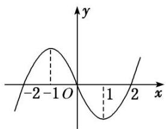

A. $(-\infty, -1) \cup (0, 1)$

B. $(-1, 0) \cup (1, +\infty)$

C. $(-2, -1) \cup (1, 2)$

D. $(-\infty, -2) \cup (2, +\infty)$
答案 A 解析 在 $(-∞,-1)$ 和 $(1,+∞)$ 上， $f(x)$ 单调递增，所以 $f'(x)>0$ ，使 $xf'(x)<0$ 的范围为 $(-∞,-1)$ ；在 $(-1,1)$ 上， $f(x)$ 单调递减，所以 $f'(x)<0$ ，使 $xf'(x)<0$ 的范围为 $(0,1)$ 。综上，关于 x 的不等式 $xf'(x)<0$ 的解集为 $(-∞,-1)∪(0,1)$ 。  
（2）已知函数 $f(x) = x\sin x$ ， $x \in \mathbf{R}$ ，则 $f\left(\frac{\pi}{5}\right)$ ， $f(1)$ ， $f\left(-\frac{\pi}{3}\right)$ 的大小关系为（）

A. $f\left(-\frac{\pi}{3}\right) > f(1) > f\left(\frac{\pi}{5}\right)$

B. $f(1)>f\left(-\frac{\pi}{3}\right)>f\left(\frac{\pi}{5}\right)$

C. $f\left(\frac{\pi}{5}\right) > f(1) > f\left(-\frac{\pi}{3}\right)$

D. $f\left(-\frac{\pi}{3}\right) > f\left(\frac{\pi}{5}\right) > f(1)$
答案 A 解析 因为 $f(x)=x\sin x$ ，所以 $f(-x)=(-x)\cdot\sin(-x)=x\sin x=f(x)$ ，所以函数 $f(x)$ 是偶函数，所以 $f\left(-\frac{\pi}{3}\right)=f\left(\frac{\pi}{3}\right)$ 。又当 $x\in\left(0,\frac{\pi}{2}\right)$ 时， $f'(x)=\sin x+x\cos x>0$ ，所以函数 $f(x)$ 在 $\left(0,\frac{\pi}{2}\right)$ 上是增函数，所以 $f\left(\frac{\pi}{5}\right)<f(1)<f\left(\frac{\pi}{3}\right)$ ，即 $f\left(-\frac{\pi}{3}\right)>f(1)>f\left(\frac{\pi}{5}\right)$ ，故选 A.  
（3）已知奇函数 $f(x)$ 是 R 上的增函数， $g(x)=xf(x)$ ，则()

A. $g\left(\log_3\frac{1}{4}\right) > g(2 - \frac{3}{2}) > g(2 - \frac{2}{3})$

B. $g\left(\log_3\frac{1}{4}\right) > g(2 - \frac{2}{3}) > g(2 - \frac{3}{2})$

C. $g(2 - \frac{3}{2}) > g(2 - \frac{2}{3}) > g\left(\log_3\frac{1}{4}\right)$

D. $g(2 - \frac{2}{3}) > g(2 - \frac{3}{2}) > g\left(\log_3\frac{1}{4}\right)$
答案 B 解析 由奇函数 $f(x)$ 是 R 上的增函数，可得 $f'(x) \geq 0$ ，以及当 $x > 0$ 时， $f(x) > 0$ ，当 $x < 0$ 时， $f(x) < 0$ 。由 $g(x) = xf(x)$ ，得 $g(-x) = -xf(-x) = xf(x) = g(x)$ ，即 $g(x)$ 为偶函数。因为 $g'(x) = f(x) + xf'(x)$ ，所以当 $x > 0$ 时， $g'(x) > 0$ ，当 $x < 0$ 时， $g'(x) < 0$ 。故当 $x > 0$ 时，函数 $g(x)$ 单调递增，当 $x < 0$ 时，函数 $g(x)$ 单调递减。因为 $g\left(\log_3\frac{1}{4}\right) = g(\log_34)$ ， $0 < 2 - \frac{3}{2} < 2 - \frac{2}{3} < 2^0 = 1 < \log_34$ ，所以 $g\left(\log_3\frac{1}{4}\right) > g(2 - \frac{2}{3}) > g(2 - \frac{3}{2})$ 。故选 B.  
（4）对于 R 上可导的任意函数 $f(x)$ ，若满足 $\frac{1-x}{f'(x)} \leq 0$ ，则必有()

A. $f(0)+f(2)>2f(1)$

B. $f(0) + f(2)\leq 2f(1)$

C. $f(0) + f(2) < 2f(1)$

D. $f(0)+f(2)\geq2f(1)$
答案 A 解析 当 x<1 时， $f(x)<0$ ，此时函数 $f(x)$ 单调递减，当 x>1 时， $f'(x)>0$ ，此时函数 $f(x)$ 单调递增，∴ 当 x=1 时，函数 $f(x)$ 取得极小值同时也取得最小值，所以 $f(0)>f(1)$ ， $f(2)>f(1)$ ，则 $f(0)+f(2)>2f(1)$ .  
（5）已知函数 $f(x)=\mathrm{e}^{x}-\mathrm{e}^{-x}-2x+1$ ，则不等式 $f(2x-3)>1$ 的解集为 \_\_\_\_.
答案 $\left(\frac{3}{2}, +\infty\right)$ 解析 $f(x)=\mathrm{e}^{x}-\mathrm{e}^{-x}-2x+1$ ，定义域为 R， $f(x)=\mathrm{e}^{x}+\mathrm{e}^{-x}-2\geq2\sqrt{\mathrm{e}^{x}\cdot\mathrm{e}^{-x}}-2=0$ ，当且仅当 x=0 时取“=”，∴ $f(x)$ 在 R 上单调递增，又 $f(0)=1$ ，∴ 原不等式可化为 $f(2x-3)>f(0)$ ，即 2x-3>0，解得 $x>\frac{3}{2}$ ，∴ 原不等式的解集为 $\left(\frac{3}{2}, +\infty\right)$ .  
（6）设函数 $f(x)$ 为奇函数，且当 $x \geq 0$ 时， $f(x) = e^x - \cos x$ ，则不等式 $f(2x - 1) + f(x - 2) > 0$ 的解集为（）

A. $(-\infty, 1)$

B. $\left(-\infty,\frac{1}{3}\right)$

C. $\left(\frac{1}{3},+\infty\right)$

D. $(1, +\infty)$
答案 D 解析 根据题意，当 $x \geq 0$ 时， $f(x) = \mathrm{e}^x - \cos x$ ，此时有 $f'(x) = \mathrm{e}^x + \sin x > 0$ ，则 $f(x)$ 在 $[0, +\infty)$ 上为增函数，又 $f(x)$ 为 $\mathbf{R}$ 上的奇函数，故 $f(x)$ 在 $\mathbf{R}$ 上为增函数。 $f(2x - 1) + f(x - 2) > 0 \Rightarrow f(2x - 1) > -f(x - 2) \Rightarrow f(2x - 1) > f(2 - x) \Rightarrow 2x - 1 > 2 - x$ ，解得 $x > 1$ ，即不等式的解集为 $(1, +\infty)$ 。

# 【对点训练】

1. 已知函数 $y = f(x) (x \in \mathbf{R})$ 的图象如图所示，则不等式 $xf'(x) \geq 0$ 的解集为 \_\_\_\_.

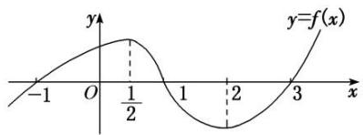

1. 答案 $\left[0, \frac{1}{2}\right] \cup [2, +\infty)$ 解析 由 $f(x)$ 图象特征可得，在 $\left[-\infty, \frac{1}{2}\right]$ 和 $[2, +\infty)$ 上 $f'(x) \geq 0$ ，在 $\left[\frac{1}{2}, 2\right]$ 上 $f'(x) < 0$ ，所以 $xf'(x) \geq 0 \Leftrightarrow \begin{cases} x \geq 0, \\ f'(x) \geq 0 \end{cases}$ 或 $\begin{cases} x \leq 0, \\ f'(x) \leq 0 \end{cases} \Leftrightarrow 0 \leq x \leq \frac{1}{2}$ 或 $x \geq 2$ ，所以 $xf'(x) \geq 0$ 的解集为 $\left[0, \frac{1}{2}\right] \cup [2, +\infty)$ .

2. 已知函数 $f(x) = 3x + 2\cos x$ ，若 $a = f(3\sqrt{2})$ ， $b = f(2)$ ， $c = f(\log_27)$ ，则 $a, b, c$ 的大小关系是（）

A. a<b<c

B. c<a<b

C. b<a<c

D. b<c<a

2. 答案 D 解析 根据题意, 函数 $f(x)=3x+2\cos x$ , $f'(x)=3-2\sin x$ , 因为 $f'(x)=3-2\sin x>0$ 在 $\mathbf{R}$ 上恒成立, 所以 $f(x)$ 在 $\mathbf{R}$ 上为增函数. 又由 $2=\log_{2}4<\log_{2}7<3<3\sqrt{2}$ , 则 $b<c<a$ . 故选 D.

3. 已知函数 $f(x) = \sin x + \cos x - 2x$ ， $a = f(-\pi)$ ， $b = f(2^{\mathrm{e}})$ ， $c = f(\ln 2)$ ，则 $a, b, c$ 的大小关系是（）

A. a>c>b

B. a>b>c

C. b>a>c

D. c>b>a

3. 答案 A 解析 $f(x)$ 的定义域为 R， $f'(x)=\cos x-\sin x-2=\sqrt{2}\cos\left(x+\frac{\pi}{4}\right)-2<0,\quad\therefore f(x)$ 在 R 上单调递减，又 $2^{e}>1,\quad0<\ln2<1,\quad\therefore-\pi<\ln2<2^{e}$ ，故 $f(-\pi)>f(\ln2)>f(2^{e})$ ，即 a>c>b.

4. 函数 $f(x)$ 在定义域 $\mathbf{R}$ 内可导，若 $f(x) = f(2 - x)$ ，且当 $x \in (-\infty, 1)$ 时， $(x - 1)f'(x) < 0$ ，设 $a = f(0)$ ， $b = f\left(\frac{1}{2}\right)$ ， $c = f(3)$ ，则 $a, b, c$ 的大小关系为（）

A. a<b<c

B. c<b<a

C. c<a<b

D. b<c<a

4. 答案 C 解析 因为当 $x \in (-\infty, 1)$ 时， $(x-1)f'(x) < 0$ ，所以 $f(x) > 0$ ，所以函数 $f(x)$ 在 $(-\infty, 1)$ 上是单调递增函数，所以 $a = f(0) < f\left(\frac{1}{2}\right) = b$ ，又 $f(x) = f(2 - x)$ ，所以 $c = f(3) = f(-1)$ ，所以 $c = f(-1) < f(0) = a$ ，所

以 c<a<b，故选 C.

5. 已知函数 $f(x) = x^3 - 2x + \mathrm{e}^x - \frac{1}{\mathrm{e}^x}$ ，其中 $\mathbf{e}$ 是自然对数的底数。若 $f(a - 1) + f(2a^2) \leq 0$ ，则实数 $a$ 的取值范围是 \_\_\_\_。

5. 答案 $\left[-1, \frac{1}{2}\right]$ 解析 $f(-x) = (-x)^3 + 2x + e^{-x} - e^x = -f(x)$ ，所以函数 $f(x)$ 为奇函数。又 $f'(x) = 3x^2 - 2 + e^x + \frac{1}{e^x} \geq 0 - 2 + 2 = 0$ ，所以函数 $f(x)$ 为单调递增函数。不等式 $f(a - 1) + f(2a^2) \leq 0$ 可化为 $f(2a^2) \leq -f(a - 1) = f(1 - a)$ ，所以 $2a^2 \leq 1 - a$ ，解得 $-1 \leq a \leq \frac{1}{2}$ 。

6. 已知函数 $f(x) = \frac{1}{3} x^3 - 4x + 2e^x - 2e^{-x}$ ，其中 $e$ 为自然对数的底数，若 $f(a - 1) + f(2a^2) \leqslant 0$ ，则实数 $a$ 的取值范围是（）

A. $(-\infty, -1]$

B. $\left[\frac{1}{2},+\infty\right]$

C. $\left(-1,\frac{1}{2}\right)$

D. $\left[-1,\frac{1}{2}\right]$

6. 答案 D 解析 $f'(x)=x^{2}-4+2\mathrm{e}^{x}+2\mathrm{e}^{-x}\geq x^{2}-4+2\sqrt{4\mathrm{e}^{x}\cdot\mathrm{e}^{-x}}=x^{2}\geq0,\quad\therefore f(x)$ 在 R 上是增函数．又 $f(-x)=-\frac{1}{3}x^{3}+4x+2\mathrm{e}^{-x}-2\mathrm{e}^{x}=-f(x)$ ，知 $f(x)$ 为奇函数．故 $f(a-1)+f(2a^{2})\leq0\Leftrightarrow f(a-1)\leq f(-2a^{2})$ ，∴ $a-1\leq-2a^{2}$ ，解之得 $-1\leq a\leq\frac{1}{2}$ .

7. 若函数 $f(x)=\ln x+\mathrm{e}^{x}-\sin x$ ，则不等式 $f(x-1)\leqslant f(1)$ 的解集为 \_\_\_\_.

7. 答案 (1, 2] 解析 $f(x)$ 的定义域为 $(0, +\infty)$ , $\therefore f'(x) = \frac{1}{x} + e^x - \cos x$ . $\because x > 0$ , $\therefore e^x > 1$ , $\therefore f'(x) > 0$ , $\therefore f(x)$ 在 $(0, +\infty)$ 上单调递增, 又 $f(x - 1) \leqslant f(1)$ , $\therefore 0 < x - 1 \leqslant 1$ , 即 $1 < x \leqslant 2$ , 原不等式的解集为 $(1, 2]$ .

8. 已知函数 $f(x) = x \sin x + \cos x + x^2$ ，则不等式 $f(\ln x) + f\left(\ln \frac{1}{x}\right) < 2f(1)$ 的解集为 \_\_\_\_.

8. 答案 $\left(\frac{1}{e}, e\right)$ 解析 $f(x)=x\sin x+\cos x+x^{2}$ 是偶函数，所以 $f\left(\ln \frac{1}{x}\right)=f(-\ln x)=f(\ln x)$ . 则原不等式可变形为 $f(\ln x)<f(1)\Leftrightarrow f(|\ln x|)<f(1)$ . 又 $f'(x)=x\cos x+2x=x(2+\cos x)$ ，由 $2+\cos x>0$ ，得当 x>0 时， $f'(x)>0$ . 所以 $f(x)$ 在 $(0, +\infty)$ 上单调递增. $\therefore |\ln x|<1\Leftrightarrow-1<\ln x<1\Leftrightarrow\frac{1}{e}<x<e$ .

# 考点三 根据函数的单调性求参数

# 【方法总结】

# 利用单调性求参数的两类热点问题的处理方法  
（1）函数 $f(x)$ 在区间 D 上存在递增(减)区间.
方法一：转化为“ $f(x)>0(<0)$ 在区间 D 上有解”；
方法二：转化为“存在区间 D 的一个子区间使 $f'(x) > 0 (< 0)$ 成立”.  
（2）函数 $f(x)$ 在区间 D 上递增(减).
方法一：转化为“ $f'(x) \geq 0 (\leq 0)$ 在区间 D 上恒成立”问题；
方法二：转化为“区间 D 是函数 $f(x)$ 的单调递增(减)区间的子集”.

# 【例题选讲】

[例 4]（1）若函数 $f(x)=2x^{3}-3mx^{2}+6x$ 在区间 $(1, +\infty)$ 上为增函数，则实数 m 的取值范围是()

A. $(-\infty, 1]$

B. $(-∞, 1)$

C. $(-\infty, 2]$

D. $(-∞, 2)$
答案 C 解析 $f(x)=6x^{2}-6mx+6$ ，由已知条件知 $x\in(1,+\infty)$ 时， $f'(x)\geq0$ 恒成立，设 $g(x)=6x^{2}-6mx+6$ ，则 $g(x)\geq0$ 在 $(1,+\infty)$ 上恒成立，
解法一：若 $\Delta = 36(m^2 -4)\leq 0$ ，即 $-2\leq m\leq 2$ ，满足 $g(x)\geq 0$ 在 $(1, + \infty)$ 上恒成立；若 $\Delta = 36(m^2 -4) > 0$ ，即 $m <   - 2$ 或 $m > 2$ ，则 $\left\{ \begin{array}{l}\frac{m}{2} <  1,\\ g(1) = 12 - 6m\geq 0, \end{array} \right.$ 解得 $m <   2$ ，∴ $m <   - 2$ ，综上得 $m\leq 2$ ，∴实数 $m$ 的取值范围是 $(- \infty ,$ 2].
解法二：问题转化为 $m \leq x + \frac{1}{x}$ 在 $(1, +\infty)$ 上恒成立，而当 $x \in (1, +\infty)$ 时，函数 $y = x + \frac{1}{x} > 2$ ，故 $m \leq 2$ ，故选 C.  
（2）设函数 $f(x) = \frac{1}{2} x^2 - 9\ln x$ 在区间 $[a - 1, a + 1]$ 上单调递减，则实数 $a$ 的取值范围是 \_\_\_\_.
答案 (1,2] 解析 易知 $f(x)$ 的定义域为 $(0, +\infty)$ , 且 $f'(x) = x - \frac{9}{x}$ . 又 $x > 0$ , 由 $f'(x) = x - \frac{9}{x} \leq 0$ , 得 $0 < x \leq 3$ . 因为函数 $f(x)$ 在区间 $[a - 1, a + 1]$ 上单调递减, 所以 $\left\{ \begin{array}{l} a - 1 > 0, \\ a + 1 \leq 3, \end{array} \right.$ 解得 $1 < a \leq 2$ .  
（3）若函数 $f(x) = \mathrm{e}^{x} (\sin x + a)$ 在区间 $(0, \pi)$ 上单调递减，则实数 $a$ 的取值范围是（）

A. $[- \sqrt{2}, +\infty)$

B. $[1, +\infty)$

C. $(-∞, -\sqrt{2}]$

D. $(-∞, 1]$
答案 C 解析 由题意, 知 $f'(x) = \mathrm{e}^{x} (\sin x + \cos x + a) \leq 0$ 在区间 $(0, \pi)$ 内恒成立, 即 $a \leq -\sqrt{2} \sin \left( x + \frac{\pi}{4} \right)$ 在区间 $(0, \pi)$ 内恒成立. 因为 $x + \frac{\pi}{4} \in \left( \frac{\pi}{4}, \frac{5\pi}{4} \right)$ , 所以 $\sin \left( x + \frac{\pi}{4} \right) \in \left( -\frac{\sqrt{2}}{2}, 1 \right]$ , 所以 $-\sqrt{2} \sin \left( x + \frac{\pi}{4} \right) \in [-\sqrt{2}, 1)$ , 所以 $a \leq -\sqrt{2}$ . 故选 C.  
（4）若 $f(x)=\left\{\begin{aligned}x+\frac{4a^{2}}{x+a}-4a,\quad&0<x\leq a,\\ x-x\ln x,\quad&x>a\end{aligned}\right.$

是 $(0, +\infty)$ 上的减函数，则实数 $a$ 的取值范围是（ ）

A. $[1, \mathrm{e}^2]$

B. $[\mathbf{e},\mathbf{e}^2 ]$

C. $[\mathbf{e}, + \infty)$

D. $[\mathrm{e}^2, +\infty)$
答案 D 解析 由题意，当 $x > a$ 时， $f'(x) = 1 - (\ln x + 1) = -\ln x$ ，则 $-\ln x \leq 0$ 在 $x > a$ 时恒成立，则 $a \geq 1$ ；当 $0 < x \leq a$ 时， $f'(x) = 1 - \frac{4a^2}{(x + a)^2}$ ，则 $1 - \frac{4a^2}{(x + a)^2} \leq 0$ 在 $0 < x \leq a$ 时恒成立，即 $-3a \leq x \leq a$ 在 $0 < x \leq a$ 时恒成立，解得 $a > 0$ ，且 $a + \frac{4a^2}{a + a} - 4a \geq a - a \ln a$ ，解得 $\ln a \geq 2$ ，即 $a \geq e^2$ ，故 $\left\{ \begin{array}{l} a \geq 1, \\ a > 0, \\ a \geq e^2, \end{array} \right.$ 解得 $a \geq e^2$ ，故选 D.  
（5）若函数 $f(x) = -\frac{1}{3} x^3 + \frac{1}{2} x^2 + 2ax$ 在 $\left[\frac{2}{3}, +\infty\right]$ 上存在单调递增区间，则 $a$ 的取值范围是 \_\_\_\_.
答案 $\left(-\frac{1}{9}, +\infty\right)$ 解析 对 $f(x)$ 求导，得 $f'(x) = -x^2 + x + 2a = -\left(x - \frac{1}{2}\right)^2 + \frac{1}{4} + 2a$ 。由题意知， $f'(x) > 0$ 在 $\left[\frac{2}{3}, +\infty\right]$ 上有解，当 $x \in \left[\frac{2}{3}, +\infty\right]$ 时， $f'(x)$ 的最大值为 $f'\left(\frac{2}{3}\right) = \frac{2}{9} + 2a$ 。令 $\frac{2}{9} + 2a > 0$ ，解得 $a > -\frac{1}{9}$ ，所以 $a$ 的取值范围是 $\left[-\frac{1}{9}, +\infty\right]$ .  
（6）若函数 $f(x) = 2x^{2} - \ln x$ 在其定义域的一个子区间 $(k - 1, k + 1)$ 内不是单调函数，则实数 $k$ 的取值范围是 \_\_\_\_.
答案 $\left[1, \frac{3}{2}\right]$ 解析 $f(x)$ 的定义域为 $(0, +\infty)$ , $f'(x) = 4x - \frac{1}{x} = \frac{4x^2 - 1}{x}$ , 当 $x \in \left[0, \frac{1}{2}\right]$ 时, $f'(x) < 0$ , 当 $x \in \left[\frac{1}{2}, +\infty\right]$ 时, $f'(x) > 0$ , $\therefore f(x)$ 在 $\left[0, \frac{1}{2}\right]$ 上单调递减, 在 $\left[\frac{1}{2}, +\infty\right]$ 上单调递增, 依题意有 $\left\{ \begin{array}{l} k + 1 > k - 1, \\ k - 1 \geq 0, \\ k + 1 > \frac{1}{2}, \\ k - 1 < \frac{1}{2}, \end{array} \right.$
解得 $1 \leq k < \frac{3}{2}$ .

[例 5] 已知函数 $f(x)=\ln x$ ， $g(x)=\frac{1}{2}ax^{2}+2x(a\neq0)$ .  
（1）若函数 $h(x)=f(x)-g(x)$ 在 $[1,4]$ 上单调递减，求 a 的取值范围；  
（2）若函数 $h(x)=f(x)-g(x)$ 在 $[1,4]$ 上存在单调递减区间，求 a 的取值范围；  
（3）若函数 $h(x)=f(x)-g(x)$ 在 $[1,4]$ 上不单调，求 a 的取值范围.
解析 （1）由 $h(x)$ 在 $[1, 4]$ 上单调递减得，当 $x \in [1, 4]$ 时， $h'(x) = \frac{1}{x} - ax - 2 \leq 0$ 恒成立，
即 $a \geq \frac{1}{x^2} - \frac{2}{x}$ 恒成立．所以 $a \geq G(x)_{\max}$ ，而 $G(x) = \left(\frac{1}{x} - 1\right)^2 - 1$
因为 $x \in [1, 4]$ ，所以 $\frac{1}{x} \in \left[\frac{1}{4}, 1\right]$ ,
所以 $G(x)_{\max} = -\frac{7}{16}$ (此时 $x = 4$ )，所以 $a \geq -\frac{7}{16}$ 且 $a \neq 0$ ，即 $a$ 的取值范围是 $\left[-\frac{7}{16}, 0\right] \cup (0, +\infty)$ .  
（2） $h(x)$ 在[1, 4]上存在单调递减区间，则 $h'(x) < 0$ 在[1, 4]上有解，
所以当 $x \in [1, 4]$ 时， $a > \frac{1}{x^2} - \frac{2}{x}$ 有解，又当 $x \in [1, 4]$ 时， $\left(\frac{1}{x^2} - \frac{2}{x}\right)_{\min} = -1$
所以 a > -1 且 $a \neq 0$ ，即 a 的取值范围是 $(-1, 0) \cup (0, +\infty)$ .  
（3）因为 $h(x)$ 在 $[1, 4]$ 上不单调，所以 $h'(x)=0$ 在 $(1, 4)$ 上有解，即 $a=\frac{1}{x^{2}}-\frac{2}{x}$ 有解，
令 $m(x)=\frac{1}{x^{2}}-\frac{2}{x}$ ， $x\in(1,4)$ ，则 $-1<m(x)<-\frac{7}{16}$ ，所以实数 a 的取值范围为 $\left(-1,-\frac{7}{16}\right)$ .

[例 6] 已知函数 $f(x)=\ln x$ , $g(x)=\frac{1}{2}ax+b$ .  
（1）若 $f(x)$ 与 $g(x)$ 的图象在 $x = 1$ 处相切，求 $g(x)$  
（2）若 $\varphi (x) = \frac{m(x - 1)}{x + 1} -f(x)$ 在 $[1, + \infty)$ 上是减函数，求实数 $m$ 的取值范围.
解析 （1）由已知得 $f(x)=\frac{1}{x}$ ，所以 $f(1)=1=\frac{1}{2}a$ ，所以a=2.
又因为 $g(1)=\frac{1}{2}a+b=f(1)=0$ ，所以 b=-1。所以 $g(x)=x-1$ 。  
（2）因为 $\varphi (x) = \frac{m(x - 1)}{x + 1} -f(x) = \frac{m(x - 1)}{x + 1} -\ln x$ 在[1， $+\infty)$ 上是减函数.
所以 $\varphi'(x) = \frac{-x^2 + (2m - 2)x - 1}{x(x + 1)^2} \leq 0$ 在 $[1, +\infty)$ 上恒成立，即 $x^2 - (2m - 2)x + 1 \geq 0$ 在 $[1, +\infty)$ 上恒成立，
则 $2m-2\leq x+\frac{1}{x},\quad x\in[1,+\infty)$ ，因为 $x+\frac{1}{x}\geq2$ ，当且仅当 x=1 时取等号，所以 $2m-2\leq2$ ，即 $m\leq2$ .
故实数 m 的取值范围是 $(-∞, 2]$ .

# 【对点训练】

1. 已知函数 $f(x) = x^{2} + \frac{a}{x}$ ，若函数 $f(x)$ 在 $[2, +\infty)$ 上单调递增，则实数 $a$ 的取值范围为（）

A. $(-\infty, 8)$

B. $(-∞, 16]$

C. $(- \infty, -8) \cup (8, +\infty)$

D. $(- \infty, -16] \cup [16, +\infty)$

1. 答案 B 解析 $f'(x)=2x-\frac{a}{x^{2}}$ ，∴ 当 $x\in[2,+\infty)$ 时， $f'(x)=2x-\frac{a}{x^{2}}\geq0$ 恒成立，即 $a\leq2x^{3}$ 恒成立，∵ $x\geq2$ ， $\therefore(2x^{3})_{\min}=16$ ，故 $a\leq16$ .

2. 已知函数 $f(x) = \frac{1}{3} ax^3 - x^2 + x$ 在区间(0, 2)上是单调增函数，则实数 $a$ 的取值范围为 \_\_\_\_.

2. 答案 $[1, +\infty)$ 解析 $f'(x) = ax^2 - 2x + 1 \geq 0 \Rightarrow a \geq -\frac{1}{x^2} + \frac{2}{x} = -\left(\frac{1}{x} - 1\right)^2 + 1$ 在 $(0, 2)$ 上恒成立，即 $a \geq 1$ .

3. 若 $y = x + \frac{a^2}{x} (a > 0)$ 在 $[2, +\infty)$ 上是增函数，则 $a$ 的取值范围是 \_\_\_\_.

3. 答案 (0, 2] 解析 由 $y' = 1 - \frac{a^2}{x^2} \geq 0$ ，得 $x \leq -a$ 或 $x \geq a$ . $\therefore y = x + \frac{a^2}{x}$ 的单调递增区间为 $(- \infty, -a]$ ， $[a, +\infty)$ . $\because$ 函数在 $[2, +\infty)$ 上单调递增， $\therefore [2, +\infty) \subseteq [a, +\infty)$ ， $\therefore a \leq 2$ 。又 $a > 0$ ， $\therefore 0 < a \leq 2$ .

4. 若函数 $f(x)=x^{2}+\frac{1+ax^{2}}{x}$ 在 $\left[\frac{1}{3}, +\infty\right)$ 上是增函数，则实数 a 的取值范围是 \_\_\_\_.

4. 答案 $\left[\frac{25}{3}, +\infty\right)$ 解析 由已知得， $f'(x)=2x+a-\frac{1}{x^{2}}$ ，若函数 $f(x)$ 在 $\left[\frac{1}{3}, +\infty\right)$ 上是增函数，则当 $x\in\left[\frac{1}{3}, \right.$
$+\infty)$ 时， $2x+a-\frac{1}{x^{2}}\geq0$ 恒成立，即 $a\geq\frac{1}{x^{2}}-2x$ 恒成立，即 $a\geq\left(\frac{1}{x^{2}}-2x\right)_{\max}$ ，设 $u(x)=\frac{1}{x^{2}}-2x,\quad x\in[\frac{1}{3},+\infty)$ ，则 $u'(x)=\frac{-2}{x^{3}}-2<0$ ，即函数 $u(x)$ 在 $[\frac{1}{3},+\infty)$ 上单调递减，所以当 $x=\frac{1}{3}$ 时，函数 $u(x)$ 取得最大值 $u\left(\frac{1}{3}\right)=\frac{25}{3}$ ，所以 $a\geq\frac{25}{3}$ 。故实数a的取值范围是 $\left[\frac{25}{3},+\infty\right)$ 。

5. 已知函数 $f(x) = \sin 2x + 4\cos x - ax$ 在 $\mathbf{R}$ 上单调递减，则实数 $a$ 的取值范围是（）

A. $[0, 3]$

B. $[3, +\infty)$

C. $(3, +\infty)$

D. $[0, +\infty)$

5. 答案 B 解析 $f'(x)=2\cos 2x-4\sin x-a=2(1-2\sin^{2}x)-4\sin x-a=-4\sin^{2}x-4\sin x+2-a=-(2\sin x+1)^{2}+3-a$ 。由题设， $f'(x)\leq0$ 在 R 上恒成立，因此 $a\geq3-(2\sin x+1)^{2}$ 恒成立，则 $a\geq3$

6. 若函数 $g(x) = \ln x + \frac{1}{2} x^2 - (b - 1)x$ 存在单调递减区间，则实数 $b$ 的取值范围是（）

A. $[3, +\infty)$

B. $(3, +\infty)$

C. $(-\infty, 3)$

D. $(-∞, 3]$

6. 答案 B 解析 函数 $g(x)=\ln x+\frac{1}{2}x^{2}-(b-1)x$ 的定义域为 $(0,+\infty)$ ，且其导数为 $g'(x)=\frac{1}{x}+x-(b-1)$ .
由 $g(x)$ 存在单调递减区间知 $g'(x)<0$ 在 $(0,+\infty)$ 上有解，即 $x+\frac{1}{x}+1-b<0$ 有解。因为函数 $g(x)$ 的定义域为 $(0,+\infty)$ ，所以 $x+\frac{1}{x}\geq2$ 。要使 $x+\frac{1}{x}+1-b<0$ 有解，只需要 $x+\frac{1}{x}$ 的最小值小于 b-1，所以 2<b-1，即 b>3，所以实数 b 的取值范围是 $(3,+\infty)$ 。故选 B.

7. 已知函数 $f(x) = \ln x + (x - b)^2 (b \in \mathbf{R})$ 在 $\left[\frac{1}{2}, 2\right]$ 上存在单调递增区间，则实数 $b$ 的取值范围是 \_\_\_\_.

7. 答案 $\left(-\infty, \frac{9}{4}\right)$ 解析 由题意得 $f'(x)=\frac{1}{x}+2(x-b)=\frac{1}{x}+2x-2b$ ，因为函数 $f(x)$ 在 $\left[\frac{1}{2}, 2\right]$ 上存在单调递增区间，所以 $f'(x)=\frac{1}{x}+2x-2b>0$ 在 $\left[\frac{1}{2}, 2\right]$ 上有解，所以 $b<\left(\frac{1}{2x}+x\right)$ ， $x\in\left[\frac{1}{2}, 2\right]$ ，由函数的性质易得当 x=2 时， $\frac{1}{2x}+x$ 取得最大值，即 $\left(\frac{1}{2x}+x\right)_{\max}=\frac{1}{2\times2}+2=\frac{9}{4}$ ，所以 b 的取值范围为 $\left(-\infty, \frac{9}{4}\right)$ .

8. 已知函数 $f(x) = -\frac{1}{2} x^2 + 4x - 3\ln x$ 在 $[t, t+1]$ 上不单调，则 $t$ 的取值范围是 \_\_\_\_.

8. 答案 $(0, 1) \cup (2, 3)$ 解析 由题意知 $f'(x) = -x + 4 - \frac{3}{x} = \frac{-x^2 + 4x - 3}{x} = -\frac{(x - 1)(x - 3)}{x}$ , 由 $f'(x) = 0$ 得函数 $f(x)$ 的两个极值点为 1, 3, 则只要这两个极值点有一个在区间 $(t, t + 1)$ 内, 函数 $f(x)$ 在区间 $[t, t + 1]$ 上就不单调, 由 $t < 1 < t + 1$ 或 $t < 3 < t + 1$ , 得 $0 < t < 1$ 或 $2 < t < 3$ .

9. (多选)若函数 $f(x) = ax^3 + 3x^2 - x + 1$ 恰好有三个单调区间，则实数 $a$ 的取值可以是( )

A.-3

B.-1

C. 0

D. 2

9. 答案 BD 解析 依题意知， $f(x)=3ax^{2}+6x-1$ 有两个不相等的零点，故 $\left\{\begin{aligned}a&\neq0,\\ \Delta&=36+12a>0\end{aligned}\right.$ 解得 a>

-3 且 $a \neq 0$ 。故选 BD.

10. 已知二次函数 $h(x) = ax^2 + bx + 2$ ，其导函数 $y = h'(x)$ 的图象如图所示， $f(x) = 6\ln x + h(x)$ .  
（1）求函数 $f(x)$ 的解析式;  
（2）若函数 $f(x)$ 在区间 $\left(1, m+\frac{1}{2}\right)$ 上是单调函数，求实数 m 的取值范围.

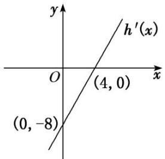

10. 解析 （1）由已知, $h'(x)=2ax+b$ , 其图象为直线, 且过 $(0,-8)$ , $(4,0)$ 两点,

把两点坐标代入 $h'(x)=2ax+b$ ，得 $\left\{\begin{aligned}b&=-8,\\ 8a+b&=0,\end{aligned}\right.$ 解得 $\left\{\begin{aligned}a&=1,\\ b&=-8,\end{aligned}\right.$
所以 $h(x)=x^{2}-8x+2,\ f(x)=6\ln x+x^{2}-8x+2.$  
（2）由（1）得 $f'(x)=\frac{6}{x}+2x-8=\frac{2(-1)(x-3)}{x}$ .
因为 x>0，所以 $f'(x)$ ， $f(x)$ 的变化如表所示.

<table><tr><td>x</td><td>(0,1)</td><td>1</td><td>(1,3)</td><td>3</td><td>(3,+∞)</td></tr><tr><td>f(x)</td><td>+</td><td>0</td><td>-</td><td>0</td><td>+</td></tr><tr><td>f(x)</td><td>单调递增</td><td></td><td>单调递减</td><td></td><td>单调递增</td></tr></table>
所以 $f(x)$ 的单调递增区间为 $(0, 1)$ 和 $(3, +\infty)$ ，单调递减区间为 $(1, 3)$ ，要使函数 $f(x)$ 在区间 $\left[\begin{aligned}1, & m+\frac{1}{2}\end{aligned}\right]$ 上是单调函数，则 $\left\{\begin{aligned}1<m+\frac{1}{2},\\ m+\frac{1}{2}\leq3,\end{aligned}\right.$ 解得 $\frac{1}{2}<m\leq\frac{5}{2}$ . 故实数m的取值范围是 $\left[\frac{1}{2},\frac{5}{2}\right]$ .

11. 已知函数 $f(x)=x^{2}+a\ln x$ .  
（1）当 a=-2 时，求函数 $f(x)$ 的单调递减区间；  
（2）若函数 $g(x) = f(x) + \frac{2}{x}$ 在 $[1, +\infty)$ 上单调，求实数 $a$ 的取值范围.

11. 解析 （1）由题意, 知函数 $f(x)$ 的定义域为 $(0, +\infty)$ ,
当 a=-2 时， $f'(x)=2x-\frac{2}{x}=\frac{2(x+1)(x-1)}{x}$ ，由 $f'(x)<0$ 得 0<x<1，
故 $f(x)$ 的单调递减区间是 $(0, 1)$ .  
（2）由题意，得 $g'(x)=2x+\frac{a}{x}-\frac{2}{x^{2}}$ ,
$\because$ 函数 $g(x)$ 在 $[1, +\infty)$ 上单调，当 $g(x)$ 为 $[1, +\infty)$ 上的单调增函数时，则 $g'(x) \geq 0$ 在 $[1, +\infty)$ 上恒成立，即 $a \geq \frac{2}{x} - 2x^2$ 在 $[1, +\infty)$ 上恒成立，设 $\varphi(x) = \frac{2}{x} - 2x^2$ .
∵ $\varphi(x)$ 在 $[1, +\infty)$ 上单调递减，∴ 在 $[1, +\infty)$ 上， $\varphi(x)_{\max} = \varphi(1) = 0$ ，∴ $a \geq 0$ .
当 $g(x)$ 为 $[1, +\infty)$ 上的单调减函数时，则 $g'(x) \leq 0$ 在 $[1, +\infty)$ 上恒成立，易知其不可能成立.
∴实数 a 的取值范围为 $[0, +\infty)$ .

12. 已知函数 $f(x) = \mathrm{e}^x - ax\mathrm{e}^x - a (a \in \mathbf{R})$ .  
（1）若 $f(x)$ 在 $(0, +\infty)$ 上单调递减，求 $a$ 的取值范围；  
（2）求证： $x$ 在 $(0,2)$ 上任取一个值，不等式 $\frac{1}{x} -\frac{1}{e^x - 1} <  \frac{1}{2}$ 恒成立(注：e为自然对数的底数).

12. 解析 （1）由已知得 $f'(x)=\mathrm{e}^{x}(x+1)\left(\frac{1}{x+1}-a\right)$ .
由函数 $f(x)$ 在 $(0, +\infty)$ 上单调递减得 $f'(x) \leq 0$ 恒成立.
$\therefore\frac{1}{1+x}-a\leq0$ ，即 $a\geq\frac{1}{1+x}$ ，又 $\frac{1}{1+x}\in(0,1)$ ,
∴a的取值范围为 $[1, +\infty)$ .  
（2）要证原不等式恒成立，即证 $e^{x}-1-x<\frac{1}{2}x(e^{x}-1)$ ，即 $(x-2)e^{x}+x+2>0$ 在 $x\in(0,2)$ 上恒成立.
设 $F(x)=(x-2)e^{x}+x+2$ ，则 $F'(x)=(x-1)e^{x}+1$ .
在（1）中，令 a=1，则 $f(x)=\mathrm{e}^{x}-xe^{x}-1$ ， $f(x)$ 在 $(0,2)$ 上单调递减，∴ $F'(x)=-f(x)$ 在 $(0,2)$ 上单调递增，而 $F'（0）=0$ ，∴ 在 $(0,2)$ 上 $F'(x)>0$ 恒成立，∴ $F(x)$ 在 $(0,2)$ 上单调递增，∴ $F(x)>F(0)=0$ ，
即当 $x \in (0, 2)$ 时， $\frac{1}{x} - \frac{1}{e^{x} - 1} < \frac{1}{2}$ 恒成立.

