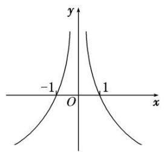
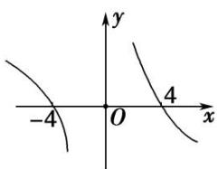
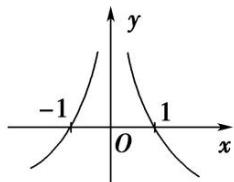
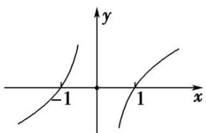

# 专题 06 构造函数法解决导数不等式问题(一)

以抽象函数为背景、题设条件或所求结论中具有“ $f(x) \pm g(x)$ ， $f(x)g(x)$ ， $\frac{f(x)}{g(x)}$ ”等特征式、旨在考查导数运算法则的逆向、变形应用能力的客观题，是近几年高考试卷中的一位“常客”，常以压轴题小题的形式出现，解答这类问题的有效策略是将前述式子的外形结构特征与导数运算法则结合起来，合理构造出相关的可导函数，然后利用该函数的性质解决问题.

导数是函数单调性的延伸，如果把题目中直接给出的增减性换成一个 $f'(x)$ ，则单调性就变的相当隐晦了，另外在导数中的抽象函数不等式问题中，我们要研究的往往不是 $f(x)$ 本身的单调性，而是包含 $f(x)$ 的一个新函数的单调性，因此构造函数变的相当重要，另外题目中若给出的是 $f'(x)$ 的形式，则我们要构造的则是一个包含 $f(x)$ 的新函数，因为只有这个新函数求导之后才会出现 $f'(x)$ ，因此解决导数抽象函数不等式的重中之重是构造函数.

构造函数是数学的一种重要思想方法, 它体现了数学的发现、类比、化归、猜想、实验和归纳等思想. 分析近些年的高考, 发现构造函数的思想越来越重要, 而且很多都用在压轴题(无论是主观题还是客观题)的解答上.

构造函数的主要步骤:  
（1）分析：分析已知条件，联想函数模型；  
（2）构造：构造辅助函数，转化问题本质；  
（3）回归：解析所构函数，回归所求问题.

# 考点一 构造 $F(x) = x^{n}f(x)(n\in \mathbf{Z}$ ，且 $n\neq 0)$ 类型的辅助函数

# 【方法总结】  
（1） 若 $F(x)=x^{n}f(x)$ ，则 $F'(x)=nx^{n-1}f(x)+x^{n}f'(x)=x^{n-1}[nf(x)+xf'(x)]$ ;  
（2）若 $F(x)=\frac{f(x)}{x^{n}}$ ，则 $F'(x)=\frac{f'(x)x^{n}-nx^{n-1}f(x)}{x^{2n}}=\frac{xf'(x)-nf(x)}{x^{n+1}}$ .
由此得到结论：  
（1）出现 $nf(x)+xf'(x)$ 形式，构造函数 $F(x)=x^{n}f(x)$ ;  
（2）出现 $xf'(x)-nf(x)$ 形式，构造函数 $F(x)=\frac{f(x)}{x^{n}}$ .

# 【例题选讲】

[例 1]（1）已知 $f(x)$ 的定义域为 $(0, +\infty)$ ， $f'(x)$ 为 $f(x)$ 的导函数，且满足 $f(x) < -xf'(x)$ ，则不等式 $f(x+1) > (x-1)f(x^{2}-1)$ 的解集是()

A. $(0, 1)$

B. $(1, +\infty)$

C. $(1, 2)$

D. $(2, +\infty)$
答案 D 解析 因为 $f(x)<-xf'(x)$ ，所以 $f(x)+xf'(x)<0$ ，即 $(xf(x))'<0$ ，所以函数 $y=xf(x)$ 在 $(0,+\infty)$ 上

单调递减．由不等式 $f(x + 1) > (x - 1)f(x^2 - 1)$ ，可得 $(x + 1)f(x + 1) > (x^2 - 1)f(x^2 - 1)$ ，所以 $\left\{ \begin{array}{l} x + 1 > 0, \\ x^2 - 1 > 0, \\ x^2 - 1 > x + 1, \end{array} \right.$ 解
得 x>2. 选 D.  
（2）已知函数 $f(x)$ 是定义在区间 $(0, +\infty)$ 上的可导函数，其导函数为 $f'(x)$ ，且满足 $xf'(x) + 2f(x) > 0$ ，则不等式 $\frac{(x + 2021)f(x + 2021)}{5} < \frac{5f(5)}{x + 2021}$ 的解集为（）

A. $\{x|x>-2016\}$

B. $\{x|x < -2016\}$

C. $\{x\mid-2\ 016<x<0\}$

D. $\{x|-2\ 021<x<-2\ 016\}$
答案 D 解析 构造函数 $g(x)=x^{2}f(x)$ ，则 $g'(x)=x[2f(x)+xf'(x)]$ 。当 x>0 时，∵ $2f(x)+xf'(x)>0$ ，∴ $g'(x)>0$ ，∴ $g(x)$ 在 $(0,+\infty)$ 上单调递增。∵ 不等式 $\frac{(x+2021)f(x+2021)}{5}<\frac{5f(5)}{x+2021}$ ，∴ 当 $x+2021>0$ ，即 x>-2021 时， $(x+2021)^{2}f(x+2021)<5^{2}f(5)$ ，即 $g(x+2021)<g(5)$ ，∴ $0<x+2021<5$ ，∴ -2021<x<-2016。  
（3）(2015·全国Ⅱ)设函数 $f'(x)$ 是奇函数 $f(x)(x \in \mathbf{R})$ 的导函数， $f(-1) = 0$ ，当 $x > 0$ 时， $xf'(x) - f(x) < 0$ ，则使得 $f(x) > 0$ 成立的 $x$ 的取值范围是（）

A. $(-\infty, -1) \cup (0, 1)$

B. $(-1, 0) \cup (1, +\infty)$

C. $(-\infty, -1) \cup (-1, 0)$

D. $(0, 1) \cup (1, +\infty)$
答案 A 解析 设 $y=g(x)=\frac{f(x)}{x}(x\neq0)$ ，则 $g'(x)=\frac{xf'(x)-f(x)}{x^{2}}$ ，当 x>0 时， $xf'(x)-f(x)<0$ ， $\therefore g'(x)<0$ ， $\therefore g(x)$ 在 $(0,+\infty)$ 上为减函数，且 $g(1)=f(1)=-f(-1)=0$ 。 $\because f(x)$ 为奇函数， $\therefore g(x)$ 为偶函数， $\therefore g(x)$ 的图象的示意图如图所示。当 x>0 时，由 $f(x)>0$ ，得 $g(x)>0$ ，由图知 0<x<1，当 x<0 时，由 $f(x)>0$ ，得 $g(x)<0$ ，由图知 x<-1， $\therefore$ 使得 $f(x)>0$ 成立的 x 的取值范围是 $(-∞,-1)∪(0,1)$ ，故选 A.

  
（4）设 $f(x)$ 是定义在 R 上的偶函数，当 $x < 0$ 时， $f(x) + xf'(x) < 0$ ，且 $f(-4) = 0$ ，则不等式 $xf(x) > 0$ 的解集为 \_\_\_\_.
答案 $(- \infty, -4) \cup (0, 4)$ 解析 构造 $F(x) = xf(x)$ ，则 $F'(x) = f(x) + xf'(x)$ ，当 $x < 0$ 时， $f(x) + xf'(x) < 0$ 可以推出当 $x < 0$ 时， $F'(x) < 0$ ， $\therefore F(x)$ 在 $(- \infty, 0)$ 上单调递减。 $\because f(x)$ 为偶函数， $x$ 为奇函数， $\therefore F(x)$ 为奇函数， $\therefore F(x)$ 在 $(0, +\infty)$ 上也单调递减。根据 $f(-4) = 0$ 可得 $F(-4) = 0$ ，根据函数的单调性、奇偶性可得函数图象如图所示，根据图象可知 $xf(x) > 0$ 的解集为 $(- \infty, -4) \cup (0, 4)$ 。

  
（5）已知 $f(x)$ 是定义在区间 $(0, +\infty)$ 内的函数，其导函数为 $f'(x)$ ，且不等式 $xf'(x) < 2f(x)$ 恒成立，则（

A. $4f(1) < f(2)$

B. $4f(1) > f(2)$

C. $f(1)<4f(2)$

D. $f(1) > 4f'（2）$
答案 B 解析 令 $g(x) = \frac{f(x)}{x^2} (x > 0)$ ，则 $g'(x) = \frac{x f'(x) - 2 f(x)}{x^3}$ ，由不等式 $xf'(x) < 2f(x)$ 恒成立知 $g'(x) < 0$ ，即 $g(x)$ 在 $(0, +\infty)$ 是减函数， $\therefore g(1) > g(2)$ ，即 $\frac{f(1)}{1} > \frac{f(2)}{4}$ ，即 $4f(1) > f(2)$ ，故选 B.  
（6）已知定义域为 $\mathbf{R}$ 的奇函数 $y = f(x)$ 的导函数为 $y = f'(x)$ ，当 $x > 0$ 时， $xf'(x) - f(x) < 0$ ，若 $a = \frac{f(e)}{e}, b = \frac{f(\ln 2)}{\ln 2}$ ， $c = \frac{f(-3)}{-3}$ ，则 $a, b, c$ 的大小关系正确的是（）

A. $a < b < c$

B. b<c<a

C. a<c<b

D. c<a<b
答案 D 解析 设 $g(x)=\frac{f(x)}{x}$ ，则 $g'(x)=\frac{xf'(x)-f(x)}{x^{2}}$ ，当 x>0 时， $xf'(x)-f(x)<0$ ，则 $g'(x)=\frac{xf'(x)-f(x)}{x^{2}}<0$ ，即函数 $g(x)$ 在 $x\in(0,+\infty)$ 时为减函数。由函数 $y=f(x)$ 为奇函数知 $f(-3)=-f(3)$ ，则 $c=\frac{f(-3)}{-3}=\frac{f(3)}{3}$ 。∵ $a=\frac{f(e)}{e}=g(e)$ ， $b=\frac{f(\ln 2)}{\ln 2}=g(\ln 2)$ ， $c=\frac{f(3)}{3}=g(3)$ 且 $3>\mathrm{e}>\ln 2$ ，∴ $g(3)<g(\mathrm{e})<g(\ln 2)$ ，即 c<a<b，故选 D.

# 【对点训练】

1. 设函数 $f(x)$ 是定义在 $(- \infty, 0)$ 上的可导函数，其导函数为 $f'(x)$ ，且 $2f(x) + xf'(x) > x^2$ ，则不等式 $(x + 2021)^2 f(x + 2021) - 4f(-2) > 0$ 的解集为（）

A. $(-\infty, -2021)$

B. $(-∞, -2023)$

C. $(-2\ 023,\ 0)$

D. $(-2\ 021,\ 0)$

1. 答案 B 解析 由 $2f(x) + xf'(x) > x^2$ ，结合 $x \in (-\infty, 0)$ 得 $2xf(x) + x^2f'(x) < x^3 < 0$ ，故 $[x^2f(x)]' < 0$ ，设 $g(x) = x^2f(x)$ ，则 $g(x)$ 在 $(- \infty, 0)$ 上单调递减， $(x + 2021)^2f(x + 2021) - 4f(-2) > 0$ 可化为 $(x + 2021)^2f(x + 2021) > (-2)^2f(-2)$ ，所以 $\left\{ \begin{array}{l} x + 2021 < -2, \\ x + 2021 < 0, \end{array} \right.$ 解得 $x < -2023$ 。故选 B.

2. 设 $f'(x)$ 是奇函数 $f(x)(x \in \mathbf{R})$ 的导函数， $f(-2) = 0$ ，当 $x > 0$ 时， $xf'(x) - f(x) > 0$ ，则使得 $f(x) > 0$ 成立的 $x$ 的取值范围是 \_\_\_\_.

2. 答案 $(-2, 0) \cup (2, +\infty)$ 解析 令 $g(x) = \frac{f(x)}{x}$ , 则 $g'(x) = \frac{x f'(x) - f(x)}{x^2} > 0$ , $x \in (0, +\infty)$ . 所以函数 $g(x)$ 在 $(0, +\infty)$ 上单调递增. 又 $g(-x) = \frac{f(-x)}{-x} = \frac{-f(x)}{-x} = \frac{f(x)}{x} = g(x)$ , 则 $g(x)$ 是偶函数, $g(-2) = 0 = g(2)$ . 则 $f(x) = x g(x) > 0 \Leftrightarrow \begin{cases} x > 0, \\ g(x) > 0 \end{cases}$ 或 $\begin{cases} x < 0, \\ g(x) < 0. \end{cases}$ 解得 $x > 2$ 或 $-2 < x < 0$ , 故不等式 $f(x) > 0$ 的解集为 $(-2, 0) \cup (2, +\infty)$ .

3. 已知偶函数 $f(x) (x \neq 0)$ 的导函数为 $f'(x)$ ，且满足 $f(-1) = 0$ ，当 $x > 0$ 时， $2f(x) > xf'(x)$ ，则使得 $f(x) > 0$ 成立的 $x$ 的取值范围是 \_\_\_\_.

3. 答案 $(-1, 0) \cup (0, 1)$ 解析 构造 $F(x) = \frac{f(x)}{x^2}$ , 则 $F'(x) = \frac{f'(x) \cdot x - 2f(x)}{x^3}$ , 当 $x > 0$ 时, $xf'(x) - 2f(x) < 0$ , 可以推出当 $x > 0$ 时, $F'(x) < 0$ , $F(x)$ 在 $(0, +\infty)$ 上单调递减. $\because f(x)$ 为偶函数, $x^2$ 为偶函数, $\therefore F(x)$ 为偶函数, $\therefore F(x)$ 在 $(- \infty, 0)$ 上单调递增. 根据 $f(-1) = 0$ 可得 $F(-1) = 0$ , 根据函数的单调性、奇偶性可得函数图象如图所示，根据图象可知 $f(x)>0$ 的解集为 $(-1,0)\cup(0,1)$ .

4. 设 $f(x)$ 是定义在 $\mathbf{R}$ 上的偶函数，且 $f(1) = 0$ ，当 $x < 0$ 时，有 $xf'(x) - f(x) > 0$ 恒成立，则不等式 $f(x) > 0$ 的解集为 \_\_\_\_.

4. 答案 $(- \infty, -1) \cup (1, +\infty)$ 解析 构造 $F(x) = \frac{f(x)}{x}$ ，则 $F'(x) = \frac{f'(x) \cdot x - f(x)}{x^2}$ ，当 $x < 0$ 时， $xf'(x) - f(x) > 0$ ，可以推出当 $x < 0$ 时， $F'(x) > 0$ ， $F(x)$ 在 $(- \infty, 0)$ 上单调递增。\$\because f(x)\$为偶函数，\$x\$为奇函数，\$\therefore F(x)\$为奇函数，\$\therefore F(x)\$在 $(0, +\infty)$ 上也单调递增。根据 $f(1) = 0$ 可得 $F(1) = 0$ ，根据函数的单调性、奇偶性可得函数图象，根据图象可知 $f(x) > 0$ 的解集为 $(- \infty, -1) \cup (1, +\infty)$ 。

5. 设 $f(x)$ 是定义在 $\mathbf{R}$ 上的奇函数, $f(2)=0$ , 当 $x>0$ 时, 有 $\frac{xf'(x)-f(x)}{x^2}<0$ 恒成立, 则不等式 $x^2f(x)>0$ 的解集是 \_\_\_\_.

5. 答案 $(- \infty, -2) \cup (0, 2)$ 解析 $\because$ 当 $x > 0$ 时， $\left[\frac{f(x)}{x}\right]' = \frac{x f'(x) - f(x)}{x^2} < 0, \therefore \varphi(x) = \frac{f(x)}{x}$ 在 $(0, +\infty)$ 上为减函数，又 $f(2) = 0$ ，即 $\varphi(2) = 0, \therefore$ 在 $(0, +\infty)$ 上，当且仅当 $0 < x < 2$ 时， $\varphi(x) > 0$ ，此时 $x^2 f(x) > 0$ 。又 $f(x)$ 为奇函数， $\therefore h(x) = x^2 f(x)$ 也为奇函数，由数形结合知 $x \in (-\infty, -2)$ 时 $f(x) > 0$ 。故 $x^2 f(x) > 0$ 的解集为 $(- \infty, -2) \cup (0, 2)$ .

6. 设 $f(x)$ 是定义在 $\mathbf{R}$ 上的奇函数，且 $f(2) = 0$ ，当 $x > 0$ 时， $\frac{xf'(x) - f(x)}{x^2} < 0$ 恒成立，则不等式 $\frac{f(x)}{x} > 0$ 的解集为（）

A. $(-2, 0) \cup (2, +\infty)$

B. $(-2, 0) \cup (0, 2)$

C. $(-\infty, -2) \cup (0, 2)$

D. $(- \infty, -2) \cup (2, +\infty)$

6. 答案 B 解析 设 $g(x)=\frac{f(x)}{x}$ ，则 $g'(x)=\left[\frac{f(x)}{x}\right]'=\frac{xf'(x)-f(x)}{x^{2}}$ ，当 x>0 时， $g'(x)<0$ ，所以函数 $g(x)=\frac{f(x)}{x}$ 在 $(0,+\infty)$ 上单调递减。因为 $f(x)$ 是奇函数，所以 $g(x)=\frac{f(x)}{x}$ 是偶函数。因为 $f(2)=0$ ，所以 $f(-2)=0$ 。所以不等式 $\frac{f(x)}{x}>0$ 的解集为 $(-2,0)\cup(0,2)$ 。故选 B。

7. $f(x)$ 是定义在 $(0, +\infty)$ 上的非负可导函数，且满足 $xf'(x) - f(x) < 0$ ，对任意正数 $a, b$ ，若 $a < b$ ，则必有（）

A. $af(b) < bf(a)$

B. $bf(a) < af(b)$

C. $af(a) < bf(b)$

D. $bf(b) < af(a)$

7. 答案 A 解析 设函数 $F(x) = \frac{f(x)}{x} (x > 0)$ ，则 $F'(x) = \left[\frac{f(x)}{x}\right]' = \frac{xf'(x) - f(x)}{x^2}$ . 因为 $x > 0$ ， $xf'(x) - f(x) < 0$ ，所以 $F'(x) < 0$ ，故函数 $F(x)$ 在 $(0, +\infty)$ 上为减函数。又 $0 < a < b$ ，所以 $F(a) > F(b)$ ，即 $\frac{f(a)}{a} > \frac{f(b)}{b}$ ，则 $bf(a) > af(b)$ 。

8. 设函数 $f(x)$ 的导函数为 $f'(x)$ ，对任意 $x \in \mathbf{R}$ ，都有 $xf'(x) < f(x)$ 成立，则（）

A. $3f(2)>2f(3)$

B. $3f(2)=2f(3)$

C. $3f(2)<2f(3)$

D. $3f(2)$ 与 $2f(3)$ 大小不确定

8. 答案 A 解析 令 $F(x) = \frac{f(x)}{x}$ ，则 $F'(x) = \frac{xf'(x) - f(x)}{x^2} < 0$ ，所以 $F(x)$ 为减函数，则 $\frac{f(2)}{2} > \frac{f(3)}{3}$ . 所以 $3f(2) > 2f(3)$ .

9. 定义在区间 $(0, +\infty)$ 上的函数 $y = f(x)$ 使不等式 $2f(x) < xf'(x) < 3f(x)$ 恒成立，其中 $y = f'(x)$ 为 $y = f(x)$ 的导函数，则（）

A. $8 < \frac{f(2)}{f(1)} < 16$

B. $4 < \frac{f(2)}{f(1)} < 8$

C. $3 \leq \frac{f(2)}{f(1)} < 4$

D. $2 < \frac{f(2)}{f(1)} < 3$

9. 答案 B 解析 $\because xf'(x) - 2f(x) > 0, x > 0, \therefore \left[\frac{f(x)}{x^2}\right]' = \frac{f'(x) \cdot x^2 - 2xf(x)}{x^4} = \frac{xf'(x) - 2f(x)}{x^3} > 0, \therefore y = \frac{f(x)}{x^2}$ 在 $(0, +\infty)$ 上单调递增， $\therefore \frac{f(2)}{2^2} > \frac{f(1)}{1^2}$ ，即 $\frac{f(2)}{f(1)} > 4.$ $\because xf'(x) - 3f(x) < 0, x > 0, \therefore \left[\frac{f(x)}{x^3}\right]' = \frac{f'(x) \cdot x^3 - 3x^2f(x)}{x^6} = \frac{xf'(x) - 3f(x)}{x^4} < 0,$ $\therefore y = \frac{f(x)}{x^3}$ 在 $(0, +\infty)$ 上单调递减， $\therefore \frac{f(2)}{2^3} < \frac{f(1)}{1^3}$ ，即 $f(2) < 8$ ，综上， $4 < \frac{f(2)}{f(1)} < 8.$

# 考点二 构造 $F(x) = \mathrm{e}^{nx}f(x)(n\in \mathbf{Z}$ ，且 $n\neq 0)$ 类型的辅助函数

# 【方法总结】  
（1）若 $F(x)=\mathrm{e}^{nx}f(x)$ ，则 $F'(x)=n\cdot\mathrm{e}^{nx}f(x)+\mathrm{e}^{nx}f'(x)=\mathrm{e}^{nx}[f'(x)+nf(x)]$ ;  
（2）若 $F(x) = \frac{f(x)}{\mathrm{e}^{nx}}$ ，则 $F'(x) = \frac{f'(x)\mathrm{e}^{nx} - n\mathrm{e}^{nx}f(x)}{\mathrm{e}^{2nx}} = \frac{f'(x) - nf(x)}{\mathrm{e}^{nx}}.$
由此得到结论:  
（1）出现 $f'(x)+nf(x)$ 形式，构造函数 $F(x)=\mathrm{e}^{nx}f(x)$ ;  
（2）出现 $f'(x)-nf(x)$ 形式，构造函数 $F(x)=\frac{f(x)}{\mathrm{e}^{nx}}$ .

# 【例题选讲】

[例 1]（1）若定义在 R 上的函数 $f(x)$ 满足 $f'(x)+2f(x)>0$ ，且 $f(0)=1$ ，则不等式 $f(x)>\frac{1}{\mathrm{e}^{2x}}$ 的解集为 \_\_\_\_.
答案 (0, +∞) 解析 构造 $F(x)=f(x)\cdot\mathrm{e}^{2x}$ ，∴ $F'(x)=f'(x)\cdot\mathrm{e}^{2x}+f(x)\cdot2\mathrm{e}^{2x}=\mathrm{e}^{2x}[f'(x)+2f(x)]>0$ ，∴ $F(x)$ 在 R 上单调递增，且 $F(0)=f(0)\cdot\mathrm{e}^{0}=1$ ，不等式 $f(x)>\frac{1}{\mathrm{e}^{2x}}$ 可化为 $f(x)\mathrm{e}^{2x}>1$ ，即 $F(x)>F(0)$ ，∴ x>0，∴ 原不等式的解集为 $(0,+\infty)$ .  
（2）定义域为 R 的可导函数 $y=f(x)$ 的导函数为 $f'(x)$ ，满足 $f(x)>f'(x)$ ，且 $f(0)=1$ ，则不等式 $\frac{f(x)}{e^{x}}<1$ 的解集为 \_\_\_\_.
答案 $\{x|x > 0\}$ 解析 令 $g(x) = \frac{f(x)}{\mathrm{e}^x}$ ，则 $g'(x) = \frac{\mathrm{e}^xf'(x) - (\mathrm{e}^x)'f(x)}{(\mathrm{e}^x)^2} = \frac{f'(x) - f(x)}{\mathrm{e}^x}$ 。由题意得 $g'(x) < 0$ 恒成立，所以函数 $g(x) = \frac{f(x)}{\mathrm{e}^x}$ 在 $\mathbf{R}$ 上单调递减。又 $g(0) = \frac{f(0)}{\mathrm{e}^0} = 1$ ，所以 $\frac{f(x)}{\mathrm{e}^x} < 1$ ，即 $g(x) < g(0)$ ，所以 $x > 0$ ，所以不等式的解集为 $\{x|x > 0\}$ 。  
（3）若定义在 $\mathbf{R}$ 上的函数 $f(x)$ 满足 $f'(x) - 2f(x) > 0$ ， $f(0) = 1$ ，则不等式 $f(x) > \mathrm{e}^{2x}$ 的解集为
答案 (0, +∞) 解析 构造 $F(x)=\frac{f(x)}{\mathrm{e}^{2x}}$ ，则 $F'(x)=\frac{\mathrm{e}^{2x}f'(x)-2\mathrm{e}^{2x}f(x)}{\mathrm{e}^{4x}}=\frac{f'(x)-2f(x)}{\mathrm{e}^{2x}}$ ，函数 $f(x)$ 满足 $f'(x)-2f(x)>0$ ，则 $F'(x)>0$ ， $F(x)$ 在 R 上单调递增。又 $\because f(0)=1$ ，则 $F(0)=1$ ， $f(x)>\mathrm{e}^{2x}\Leftrightarrow\frac{f(x)}{\mathrm{e}^{2x}}>1\Leftrightarrow F(x)>F(0)$ ，根据单调性得 x>0。  
（4）设定义域为 R 的函数 $f(x)$ 满足 $f'(x)>f(x)$ ，则不等式 $e^{x-1}f(x)<f(2x-1)$ 的解集为 \_\_\_\_.
答案 (1, +∞) 解析 令 $g(x) = \frac{f(x)}{\mathrm{e}^x}$ ，则 $g'(x) = \frac{f'(x) - f(x)}{\mathrm{e}^x} > 0$ ，故 $g(x)$ 在 R 上单调递增，不等式 $\mathrm{e}^{x - f(x)} < f(2x - 1)$ ，即 $\frac{f(x)}{\mathrm{e}^x} < \frac{f(2x - 1)}{\mathrm{e}^{2x - 1}}$ ，故 $g(x) < g(2x - 1)$ ，故 $x < 2x - 1$ ，解得 $x > 1$ ，所以原不等式的解集为 (1, +∞).  
（5）定义在 $\mathbf{R}$ 上的函数 $f(x)$ 满足: $f(x) > 1 - f'(x)$ , $f(0) = 0$ , $f'(x)$ 是 $f(x)$ 的导函数, 则不等式 $\mathrm{e}^x f(x) > \mathrm{e}^x - 1$ (其中 $\mathrm{e}$ 为自然对数的底数)的解集为()

A. $(0, +\infty)$

B. $(- \infty, -1) \cup (0, +\infty)$

C. $(-\infty, 0) \cup (1, +\infty)$

D. $(-1, +\infty)$
答案 A 解析 设 $g(x)=\mathrm{e}^{x}f(x)-\mathrm{e}^{x}$ ，则 $g'(x)=\mathrm{e}^{x}f(x)+\mathrm{e}^{x}f'(x)-\mathrm{e}^{x}$ 。由已知 $f(x)>1-f'(x)$ ，可得 $g'(x)>0$ 在 R 上恒成立，即 $g(x)$ 是 R 上的增函数。因为 $f(0)=0$ ，所以 $g(0)=-1$ ，则不等式 $\mathrm{e}^{x}f(x)>\mathrm{e}^{x}-1$ 可化为 $g(x)>g(0)$ ，所以原不等式的解集为 $(0,+\infty)$ 。  
（6）定义在 $\mathbf{R}$ 上的函数 $f(x)$ 的导函数为 $f'(x)$ ，若对任意 $x$ ，有 $f(x) > f'(x)$ ，且 $f(x) + 2021$ 为奇函数，则不等式 $f(x) + 2021\mathrm{e}^x < 0$ 的解集是（）

A. $(-\infty, 0)$

B. $(0, +\infty)$

C. $\left(-\infty,\frac{1}{e}\right)$

D. $\left(\frac{1}{e},+\infty\right)$
答案 B 解析 设 $h(x)=\frac{f(x)}{\mathrm{e}^{x}}$ ，则 $h'(x)=\frac{f'(x)-f(x)}{\mathrm{e}^{x}}<0$ ，所以 $h(x)$ 是定义在 R 上的减函数。因为 $f(x)+2$

021 为奇函数, 所以 $f(0) = -2021$ , $h(0) = -2021$ . 因为 $f(x) + 2021\mathrm{e}^{x} < 0$ , 所以 $\frac{f(x)}{\mathrm{e}^x} < -2021$ , 即 $h(x) < h(0)$ , 结合函数 $h(x)$ 的单调性可知 $x > 0$ , 所以不等式 $f(x) + 2021\mathrm{e}^{x} < 0$ 的解集是 $(0, +\infty)$ . 故选 B.  
（7）已知定义在 $\mathbf{R}$ 上的偶函数 $f(x)$ (函数 $f(x)$ 的导函数为 $f'(x)$ ) 满足 $f\left[\frac{x - \frac{1}{2}}{2}\right] + f(x + 1) = 0$ ， $\mathrm{e}^3 f(2021) = 1$ ，若 $f(x) > f'(-x)$ ，则关于 $x$ 的不等式 $f(x + 2) > \frac{1}{\mathrm{e}^x}$ 的解集为（）

A. $(-\infty, 3)$

B. $(3, +\infty)$

C. $(-\infty, 0)$

D. $(0, +\infty)$
答案 B 解析 $\because f(x)$ 是偶函数， $\therefore f(x)=f(-x)$ ， $f'(x)=[f(-x)]'=-f'(-x)$ ， $\therefore f'(-x)=-f'(x)$ ， $f(x)>f'(x)$
$-x) = -f'(x)$ ，即 $f(x) + f'(x) > 0$ ，设 $g(x) = \mathrm{e}^x f(x)$ ，则 $[\mathrm{e}^x f(x)]' = \mathrm{e}^x [f(x) + f'(x)] > 0$ ， $\therefore g(x)$ 在 $(- \infty, + \infty)$ 上单调递增，由 $f\left(x-\frac{1}{2}\right)+f(x+1)=0$ ，得 $f(x)+f\left(x+\frac{3}{2}\right)=0,\quad f\left(x+\frac{3}{2}\right)+f(x+3)=0$ ，相减可得 $f(x)=f(x+3)$ ， $f(x)$ 的周期为3，∴ $e^{3}f(2021)=e^{3}f(2)=1$ ， $g(2)=e^{2}f(2)=\frac{1}{e}$ ， $f(x+2)>\frac{1}{e^{x}}$ ，结合 $f(x)$ 的周期为3可化为 $e^{x-1}f(x-1)>\frac{1}{e}=e^{2}f(2)$ ， $g(x-1)>g(2)$ ，x-1>2，x>3，∴不等式的解集为 $(3,+\infty)$ ，故选B.  
（8）已知函数 $f(x)$ 是定义在 $\mathbf{R}$ 上的可导函数， $f'(x)$ 为其导函数，若对于任意实数 $x$ ，有 $f(x) - f'(x) > 0$ ，则（）

A. $ef(2021)>f(2022)$

B. ef(2 021)<f(2 022)

C. $ef(2021)=f(2022)$

D. ef(2021)与f(2022)大小不能确定
答案 A 解析 令 $g(x) = \frac{f(x)}{\mathrm{e}^x}$ ，则 $g'(x) = \frac{\mathrm{e}^x f'(x) - \mathrm{e}^x f(x)}{\mathrm{e}^{2x}} = \frac{f'(x) - f(x)}{\mathrm{e}^x}$ ，因为 $f(x) - f'(x) > 0$ ，所以 $g'(x) < 0$ ，所以函数 $g(x)$ 在 R 上单调递减，所以 $g(2021) > g(2022)$ ，即 $\frac{f(2021)}{\mathrm{e}^{2021}} > \frac{f(2022)}{\mathrm{e}^{2022}}$ ，所以 $ef(2021) > f(2022)$ ，故选 A.  
（9）已知 $f(x)$ 是定义在 $(-∞, +∞)$ 上的函数，导函数 $f'(x)$ 满足 $f'(x) < f(x)$ 对于 $x ∈ R$ 恒成立，则()

A. $f(2) > \mathrm{e}^{2}f(0), f(2021) > \mathrm{e}^{2021}f(0)$

B. $f(2) < \mathrm{e}^{2} f(0), f(2021) > \mathrm{e}^{2021} f(0)$

C. $f(2)>\mathrm{e}^{2}f(0)$ , $f(2\ 021)<\mathrm{e}^{2\ 021}f(0)$

D. $f(2) < \mathrm{e}^{2} f(0), f(2021) < \mathrm{e}^{2021} f(0)$
答案 D 解析 构造 $F(x)=\frac{f(x)}{\mathrm{e}^{x}}$ ，则 $F'(x)=\frac{\mathrm{e}^{x}f'(x)-\mathrm{e}^{x}f(x)}{\mathrm{e}^{2x}}=\frac{f'(x)-f(x)}{\mathrm{e}^{x}}$ ，导函数 $f'(x)$ 满足 $f(x)<f(x)$ ，则 $F'(x)<0$ ， $F(x)$ 在 R 上单调递减，根据单调性可知选 D.  
（10）已知函数 $f(x)$ 在 $\mathbf{R}$ 上可导，其导函数为 $f'(x)$ ，若 $f(x)$ 满足： $(x - 1)[f'(x) - f(x)] > 0$ ， $f(2 - x) = f(x) \cdot e^{2x}$ ，则下列判断一定正确的是（）

A. $f(1) < f(0)$

B. $f(2) > \mathrm{e}^2 f(0)$

C. $f(3) > \mathrm{e}^{3}f(0)$

D. $f(4) < \mathrm{e}^{4} f(0)$
答案 C 解析 构造 $F(x)=\frac{f(x)}{\mathrm{e}^{x}}$ ，则 $F'(x)=\frac{\mathrm{e}^{x}f'(x)-\mathrm{e}^{x}f(x)}{\mathrm{e}^{2x}}=\frac{f'(x)-f(x)}{\mathrm{e}^{x}}$ ，导函数 $f'(x)$ 满足 $(x-1)[f'(x)-f(x)]>0$ ，则 x>1 时 $F'(x)>0$ ， $F(x)$ 在 $[1,+\infty)$ 上单调递增。当 x<1 时 $F'(x)<0$ ， $F(x)$ 在 $(-∞,1]$ 上单调递减。又由 $f(2-x)=f(x)\mathrm{e}^{2-2x}\Leftrightarrow F(2-x)=F(x)\Rightarrow F(x)$ 关于 x=1 对称，从而 $F(3)>F(0)$ 即 $\frac{f(3)}{\mathrm{e}^{3}}>\frac{f(0)}{\mathrm{e}^{0}}$ ，∴ $f(3)>\mathrm{e}^{3}f(0)$ ，故选 C.

# 【对点训练】

1. 已知定义在 $\mathbf{R}$ 上的可导函数 $f(x)$ 的导函数为 $f'(x)$ ，满足 $f'(x) < f(x)$ ，且 $f(0) = \frac{1}{2}$ ，则不等式 $f(x) - \frac{1}{2} e^x < 0$ 的解集为（）

A. $\left(-\infty,\frac{1}{2}\right)$

B. $(0, +\infty)$

C. $\left(\frac{1}{2},+\infty\right)$

D. $(-∞, 0)$

1. 答案 B 解析 构造函数 $g(x)=\frac{f(x)}{\mathrm{e}^{x}}$ ，则 $g'(x)=\frac{f'(x)-f(x)}{\mathrm{e}^{x}}$ ，因为 $f'(x)<f(x)$ ，所以 $g'(x)<0$ ，故函数 $g(x)$ 在 R 上为减函数，又 $f(0)=\frac{1}{2}$ ，所以 $g(0)=\frac{f(0)}{\mathrm{e}^{0}}=\frac{1}{2}$ ，则不等式 $f(x)-\frac{1}{2}\mathrm{e}^{x}<0$ 可化为 $\frac{f(x)}{\mathrm{e}^{x}}<\frac{1}{2}$ ，即 $g(x)<\frac{1}{2}=g(0)$ ，
所以 x>0，即所求不等式的解集为 $(0, +\infty)$ .

2. 已知函数 $f'(x)$ 是函数 $f(x)$ 的导函数， $f(1) = \frac{1}{\mathrm{e}}$ ，对任意实数 $x$ ，都有 $f(x) - f'(x) > 0$ ，则不等式 $f(x) < \mathrm{e}^{x - 2}$ 的解集为（）

A. $(-\infty, e)$

B. $(1, +\infty)$

C. $(1, e)$

D. $(\mathrm{e}, + \infty)$

2. 答案 B 解析 设 $g(x)=\frac{f(x)}{\mathrm{e}^{x}}$ ，则 $g'(x)=\frac{f'(x)\mathrm{e}^{x}-\mathrm{e}^{x}f(x)}{(\mathrm{e}^{x})^{2}}=\frac{f'(x)-f(x)}{\mathrm{e}^{x}}$ 。∵ 对任意实数 x，都有 $f(x)-f'(x)>0$ ，∴ $g'(x)<0$ ，即 $g(x)$ 为 R 上的减函数。 $g(1)=\frac{f(1)}{\mathrm{e}}=\frac{1}{\mathrm{e}^{2}}$ ，由不等式 $f(x)<\mathrm{e}^{x-2}$ ，得 $\frac{f(x)}{\mathrm{e}^{x}}<\mathrm{e}^{-2}=\frac{1}{\mathrm{e}^{2}}$ ，即 $g(x)<g(1)$ 。∵ $g(x)$ 为 R 上的减函数，∴ x>1，∴ 不等式 $f(x)<\mathrm{e}^{x-2}$ 的解集为 $(1,+\infty)$ 。故选 B.

3. 已知 $f'(x)$ 是定义在 $\mathbf{R}$ 上的连续函数 $f(x)$ 的导函数，若 $f'(x) - 2f(x) < 0$ ，且 $f(-1) = 0$ ，则 $f(x) > 0$ 的解集为（）

A. $(-\infty, -1)$

B. $(-1, 1)$

C. $(-\infty, 0)$

D. $(-1, +\infty)$

3. 答案 A 解析 设 $g(x)=\frac{f(x)}{\mathrm{e}^{2x}}$ ，则 $g'(x)=\frac{f'(x)-2f(x)}{\mathrm{e}^{2x}}<0$ 在 R 上恒成立，所以 $g(x)$ 在 R 上单调递减。因为 $f(x)>0$ ，所以 $g(x)>0$ ，又 $g(-1)=0$ ，所以 x<-1。

4. 已知定义在 $\mathbf{R}$ 上的可导函数 $f(x)$ 的导函数为 $f'(x)$ ，满足 $f'(x) > f(x)$ ，且 $f(x + 3)$ 为偶函数， $f(6) = 1$ ，则不等式 $f(x) > e^x$ 的解集为（）

A. $(-2, +\infty)$

B. $(0, +\infty)$

C. $(1, +\infty)$

D. $(4, +\infty)$

4. 答案 B 解析 因为 $f(x+3)$ 为偶函数，所以 $f(3-x)=f(x+3)$ ，因此 $f(0)=f(6)=1$ 。设 $h(x)=\frac{f(x)}{\mathrm{e}^{x}}$ ，则原不等式即 $h(x)>h(0)$ 。又 $h'(x)=\frac{f'(x)\cdot\mathrm{e}^{x}-f(x)\cdot\mathrm{e}^{x}}{(\mathrm{e}^{x})^{2}}=\frac{f'(x)-f(x)}{\mathrm{e}^{x}}$ ，依题意 $f(x)>f(x)$ ，故 $h'(x)>0$ ，因此函数 $h(x)$ 在 R 上是增函数，所以由 $h(x)>h(0)$ ，得 x>0。故选 B.

5. 已知函数 $f(x)$ 的定义域是 $\mathbf{R}$ ， $f(0) = 2$ ，对任意的 $x \in \mathbf{R}$ ， $f(x) + f'(x) > 1$ ，则不等式 $e^x \cdot f(x) > e^x + 1$ 的解集是（）

A. $\{x|x>0\}$

B. $\{x|x<0\}$

C. $|x|x < -1$ ，或 $x > 1|$

D. $\{x|x < -1$ ，或 $0 < x < 1\}$

5. 答案 A 解析 构造函数 $g(x) = \mathrm{e}^x \cdot f(x) - \mathrm{e}^x - 1$ ，求导，得 $g'(x) = \mathrm{e}^x \cdot f(x) + \mathrm{e}^x \cdot f'(x) - \mathrm{e}^x = \mathrm{e}^x [f(x) + f'(x) - 1]$ 。由已知 $f(x) + f'(x) > 1$ ，可得到 $g'(x) > 0$ ，所以 $g(x)$ 为 R 上的增函数。又 $g(0) = \mathrm{e}^0 \cdot f(0) - \mathrm{e}^0 - 1 = 0$ ，所以 $\mathrm{e}^x \cdot f(x) > \mathrm{e}^x + 1$ ，即 $g(x) > 0$ 的解集为 $\{x | x > 0\}$ 。

6. 已知函数 $f(x)$ 的定义域为 $\mathbf{R}$ ，且 $f(x) + 1 < f'(x)$ ， $f(0) = 2$ ，则不等式 $f(x) + 1 > 3\mathrm{e}^x$ 的解集为（）

A. $(1, +\infty)$

B. $(-∞, 1)$

C. $(0, +\infty)$

D. $(-∞, 0)$

6. 答案 C 解析 构造函数 $g(x)=\frac{f(x)+1}{\mathrm{e}^{x}}$ ，则 $g'(x)=\frac{f'(x)-f(x)-1}{\mathrm{e}^{x}}>0$ ，故 $g(x)$ 在 R 上为增函数。又 $g(0)=\frac{f(0)+1}{\mathrm{e}^{0}}=3$ ，由 $f(x)+1>3\mathrm{e}^{x}$ ，得 $\frac{f(x)+1}{\mathrm{e}^{x}}>3$ ，即 $g(x)>g(0)$ ，解得 x>0。故选 C。

7. 定义在 $\mathbf{R}$ 上的可导函数 $f(x)$ 满足 $f(x) + f'(x) < 0$ ，则下列各式一定成立的是（）

A. $e^{2}f(2021)<f(2019)$

B. $e^{2}f(2021)>f(2019)$

C. $f(2021)<f(2019)$

D. $f(2021)>f(2019)$

7. 答案 A 解析 根据题意，设 $g(x)=\mathrm{e}^{x}f(x)$ ，其导函数 $g'(x)=\mathrm{e}^{x}f(x)+\mathrm{e}^{x}f'(x)=\mathrm{e}^{x}[f(x)+f'(x)]$ ，又由函数$f(x)$ 与其导函数 $f'(x)$ 满足 $f(x)+f'(x)<0$ ，则有 $g'(x)<0$ ，则函数 $g(x)$ 在R上为减函数，则有 $g(2021)<g(2019)$ ，即 $e^{2021}f(2021)<e^{2019}f(2019)$ ，即 $e^{2}f(2021)<f(2019)$ .

8. 定义在 $\mathbf{R}$ 上的函数 $f(x)$ 满足 $f'(x) > f(x)$ 恒成立，若 $x_{1} < x_{2}$ ，则 $\mathrm{e}^{x_1} f(x_2)$ 与 $\mathrm{e}^{x_2} f(x_1)$ 的大小关系为（）

A. $\mathrm{e}^{x_{1}}f(x_{2})>\mathrm{e}^{x_{2}}f(x_{1})$

B. $\mathrm{e}^{x_{1}}f(x_{2})<\mathrm{e}^{x_{2}}f(x_{1})$

C. $\mathrm{e}^{x_{1}}f(x_{2})=\mathrm{e}^{x_{2}}f(x_{1})$

D. $\mathbf{e}^{x_1}f(x_2)$ 与 $\mathbf{e}^{x_2}f(x_1)$ 的大小关系不确定

8. 答案 A 解析 设 $g(x) = \frac{f(x)}{\mathrm{e}^x}$ ，则 $g'(x) = \frac{f'(x)\mathrm{e}^x - f(x)\mathrm{e}^x}{(\mathrm{e}^x)^2} = \frac{f'(x) - f(x)}{\mathrm{e}^x}$ . 由题意得 $g'(x) > 0$ ，所以 $g(x)$ 在 R 上单调递增，当 $x_1 < x_2$ 时， $g(x_1) < g(x_2)$ ，即 $\frac{f(x_1)}{\mathrm{e}^{x_1}} < \frac{f(x_2)}{\mathrm{e}^{x_2}}$ ，所以 $\mathrm{e}^{x_1} f(x_2) > \mathrm{e}^{x_2} f(x_1)$ .

9. 设函数 $f(x)$ 的导函数为 $f'(x)$ ，对任意 $x \in \mathbf{R}$ 都有 $f(x) > f'(x)$ 成立，则（）

A. $3f(\ln2)<2f(\ln3)$

B. $3f(\ln2)=2f(\ln3)$

C. $3f(\ln2) > 2f(\ln3)$

D. $3f(\ln 2)$ 与 $2f(\ln 3)$ 的大小不确定

9. 答案 C 解析 令 $F(x) = \frac{f(x)}{\mathrm{e}^x}$ ，则 $F'(x) = \frac{f'(x) - f(x)}{\mathrm{e}^x}$ ，因为对 $\forall x \in \mathbb{R}$ 都有 $f(x) > f'(x)$ ，所以 $F'(x) < 0$ ，即 $F(x)$ 在 R 上单调递减。又 $\ln 2 < \ln 3$ ，所以 $F(\ln 2) > F(\ln 3)$ ，即 $\frac{f(\ln 2)}{\mathrm{e}^{\ln 2}} > \frac{f(\ln 3)}{\mathrm{e}^{\ln 3}}$ ，所以 $\frac{f(\ln 2)}{2} > \frac{f(\ln 3)}{3}$ ，即 $3f(\ln 2) > 2f(\ln 3)$ ，故选 C.

10. 已知函数 $f(x)$ 是定义在 $\mathbf{R}$ 上的可导函数，且对于 $\forall x \in \mathbf{R}$ ，均有 $f(x) > f'(x)$ ，则有（）

A. $e^{2022}f(-2022)<f(0)$ , $f(2022)>e^{2022}f(0)$

B. $e^{2022}f(-2022)<f(0)$ , $f(2022)<e^{2022}f(0)$

C. $e^{2022}f(-2022)>f(0)$ , $f(2022)>e^{2022}f(0)$

D. $e^{2022}f(-2022)>f(0)$ , $f(2022)<e^{2022}f(0)$

10. 答案 D 解析 构造函数 $g(x)=\frac{f(x)}{\mathrm{e}^{x}}$ ，则 $g'(x)=\frac{f'(x)\mathrm{e}^{x}-(\mathrm{e}^{x})'f(x)}{(\mathrm{e}^{x})^{2}}=\frac{f'(x)-f(x)}{\mathrm{e}^{x}}$ ，因为 $\forall x\in R$ ，均有 $f(x)>f'(x)$ ，并 $e^{x}>0$ ，所以 $g'(x)<0$ ，故函数 $g(x)=\frac{f(x)}{\mathrm{e}^{x}}$ 在 R 上单调递减，所以 $g(-2022)>g(0)$ ， $g(2022)<g(0)$ ，即 $\frac{f(-2022)}{\mathrm{e}^{-2022}}>f(0)$ ， $\frac{f(2022)}{\mathrm{e}^{2022}}<f(0)$ ，也就是 $e^{2022}f(-2022)>f(0)$ ， $f(2022)<e^{2022}f(0)$ .

考点三 构造 $F(x) = f(x)\sin x$ ， $F(x) = \frac{f(x)}{\sin x}$ ， $F(x) = f(x)\cos x$ ， $F(x) = \frac{f(x)}{\cos x}$ 类型的辅助函数

# 【方法总结】  
（1）若 $F(x)=f(x)\sin x$ ，则 $F'(x)=f'(x)\sin x+f(x)\cos x;$   
（2）若 $F(x)=\frac{f(x)}{\sin x}$ ，则 $F'(x)=\frac{f'(x)\sin x-f(x)\cos x}{\sin^{2}x}$ ;  
（3）若 $F(x)=f(x)\cos x$ ，则 $F'(x)=f'(x)\cos x-f(x)\sin x;$   
（4）若 $F(x)=\frac{f(x)}{\cos x}$ ，则 $F'(x)=\frac{f'(x)\cos x+f(x)\sin x}{\cos^{2}x}$ .
由此得到结论:  
（1）出现 $f'(x)\sin x + f(x)\cos x$ 形式，构造函数 $F(x) = f(x)\sin x$ ;  
（2）出现 $\frac{f(x)\sin x - f(x)\cos x}{\sin^2x}$ 形式，构造函数 $F(x) = \frac{f(x)}{\sin x}$ ;  
（3）出现 $f'(x)\cos x - f(x)\sin x$ 形式，构造函数 $F(x) = f(x)\cos x$ ;  
（4）出现 $\frac{f'(x)\cos x+f(x)\sin x}{\cos^{2}x}$ 形式，构造函数 $F(x)=\frac{f(x)}{\cos x}$ .

# 【例题选讲】

[例 1]（1）已知函数 $f(x)$ 是定义在 $\left(-\frac{\pi}{2}, \frac{\pi}{2}\right)$ 上的奇函数. 当 $x \in [0, \frac{\pi}{2})$ 时, $f(x) + f'(x) \tan x > 0$ , 则不等式 $\cos xf(x + \frac{\pi}{2}) + \sin xf(-x) > 0$ 的解集为()

A. $\left(\frac{\pi}{4},\frac{\pi}{2}\right)$

B. $\left(-\frac{\pi}{4},\frac{\pi}{2}\right)$

C. $\left(-\frac{\pi}{4},0\right)$

D. $\left(-\frac{\pi}{2}, -\frac{\pi}{4}\right)$
答案 C 解析 令 $g(x) = f(x)\sin x$ ，则 $g'(x) = f(x)\cos x + f'(x)\sin x = [f(x) + f'(x)\tan x]\cos x$ ，当 $x \in [0, \frac{\pi}{2})$ 时， $f(x) + f'(x)\tan x > 0$ ， $\cos x > 0$ ， $\therefore g'(x) > 0$ ，即函数 $g(x)$ 单调递增。又 $g(0) = 0$ ， $\therefore x \in [0, \frac{\pi}{2})$ 时， $g(x) = f(x)\sin x \geq 0$ 。 $\because f(x)$ 是定义在 $\left(-\frac{\pi}{2}, \frac{\pi}{2}\right)$ 上的奇函数， $\therefore g(x)$ 是定义在 $\left(-\frac{\pi}{2}, \frac{\pi}{2}\right)$ 上的偶函数。不等式 $\cos xf(x + \frac{\pi}{2}) + \sin xf(-x) > 0$ ，即 $\sin \left(x + \frac{\pi}{2}\right) \cdot f \left(x + \frac{\pi}{2}\right) > \sin x \cdot f(x)$ ，即 $g \left(x + \frac{\pi}{2}\right) > g(x)$ ， $\therefore |x + \frac{\pi}{2}| > |x|$ ， $\therefore x > -\frac{\pi}{4}$ ①，又 $-\frac{\pi}{2} < x + \frac{\pi}{2} < \frac{\pi}{2}$ ，故 $-\pi < x < 0$ ②，由①②得不等式的解集是 $\left(-\frac{\pi}{4}, 0\right)$ 。故选 C.  
（2）对任意的 $x \in \left[0, \frac{\pi}{2}\right]$ ，不等式 $f(x) \tan x < f'(x)$ 恒成立，则下列不等式错误的是（ ）

A. $f\left(\frac{\pi}{3}\right) > \sqrt{2}f\left(\frac{\pi}{4}\right)$

B. $f\left(\frac{\pi}{3}\right) > 2f(1)\cos 1$

C. $2f(1)\cos 1 > \sqrt{2} f\left(\frac{\pi}{4}\right)$

D. $\sqrt{2} f\left(\frac{\pi}{4}\right) < \sqrt{3} f\left(\frac{\pi}{6}\right)$
答案 D 解析 因为 $x \in \begin{pmatrix} 0, & \frac{\pi}{2} \end{pmatrix}$ ，所以 $\sin x > 0, \cos x > 0$ ，构造函数 $F(x) = f(x) \cos x$ ，则 $F'(x) = -f(x) \sin x + f'(x) \cos x$ ，因为对任意的 $x \in \begin{pmatrix} 0, & \frac{\pi}{2} \end{pmatrix}$ ，不等式 $f(x) \tan x < f'(x)$ 恒成立，所以 $f(x) \sin x < f'(x) \cos x$ 恒成立，即 $f'(x) \cos x - f(x) \sin x > 0$ 恒成立，所以 $F'(x) > 0$ 恒成立，所以函数 $F(x)$ 在 $x \in \begin{pmatrix} 0, & \frac{\pi}{2} \end{pmatrix}$ 上单调递增，所以 $F\left(\frac{\pi}{6}\right)<F\left(\frac{\pi}{4}\right)<F(1)<F\left(\frac{\pi}{3}\right)$ ，所以 $f\left(\frac{\pi}{6}\right)\cos\frac{\pi}{6}<f\left(\frac{\pi}{4}\right)\cos\frac{\pi}{4}<f(1)\cos1<f\left(\frac{\pi}{3}\right)\cos\frac{\pi}{3}$ ，所以 $\frac{\sqrt{3}}{2}f\left(\frac{\pi}{6}\right)<\frac{\sqrt{2}}{2}f\left(\frac{\pi}{4}\right)<f(1)\cos1<\frac{1}{2}f\left(\frac{\pi}{3}\right)$ ，
所以 $\sqrt{3}f\left(\frac{\pi}{6}\right)<\sqrt{2}f\left(\frac{\pi}{4}\right)<2f(1)\cos1<f\left(\frac{\pi}{3}\right)$ ，结合选项知 D 错误，故选 D.  
（3）定义在 $\left(0, \frac{\pi}{2}\right)$ 上的函数 $f(x)$ ，函数 $f'(x)$ 是它的导函数，且恒有 $f(x) < f'(x)\tan x$ 成立，则（）

A. $\sqrt{3} f\left(\frac{\pi}{4}\right) > \sqrt{2} f\left(\frac{\pi}{3}\right)$

B. $f(1) < 2f\left(\frac{\pi}{2}\right)\sin 1$

C. $\sqrt{2} f\left(\frac{\pi}{6}\right) > f\left(\frac{\pi}{4}\right)$

D. $\sqrt{3} f\left(\frac{\pi}{6}\right) <   f\left(\frac{\pi}{3}\right)$
答案 D 解析 $f(x) < f'(x) \tan x \Leftrightarrow f'(x) \sin x - f(x) \cos x > 0$ ，令 $F(x) = \frac{f(x)}{\sin x}$ ，则 $F'(x) = \frac{f'(x) \sin x - f(x) \cos x}{\sin^{2} x} > 0$ ，即函数 $F(x)$ 在 $\left(0, \frac{\pi}{2}\right)$ 上是增函数， $\therefore F\left(\frac{\pi}{6}\right) < F\left(\frac{\pi}{3}\right)$ ，即 $\frac{f\left(\frac{\pi}{6}\right)}{\sin \frac{\pi}{6}} < \frac{f\left(\frac{\pi}{3}\right)}{\sin \frac{\pi}{3}}$ ， $\therefore \sqrt{3} f\left(\frac{\pi}{6}\right) < f\left(\frac{\pi}{3}\right)$ ，故选 D.  
（4）已知函数 $y = f(x)$ 对于任意的 $x \in \left(-\frac{\pi}{2}, \frac{\pi}{2}\right)$ 满足 $f'(x)\cos x + f(x)\sin x > 0$ (其中 $f'(x)$ 是函数 $f(x)$ 的导函数)，则下列不等式不成立的是（）

A. $\sqrt{2} f\left(\frac{\pi}{3}\right) <   f\left(\frac{\pi}{4}\right)$

B. $\sqrt{2} f\left(-\frac{\pi}{3}\right) <   f\left(-\frac{\pi}{4}\right)$

C. $f(0) < \sqrt{2} f\left(\frac{\pi}{4}\right)$

D. $f(0)<2f\begin{pmatrix}\frac{\pi}{3}\end{pmatrix}$
答案 A 解析 构造 $F(x)=\frac{f(x)}{\cos x}$ ，则 $F'(x)=\frac{f'(x)\cos x+f(x)\sin x}{\cos^{2}x}$ ，导函数 $f'(x)$ 满足 $f'(x)\cos x+f(x)\sin x>0$ ，则 $F'(x)>0$ ， $F(x)$ 在 $\left(-\frac{\pi}{2},\frac{\pi}{2}\right)$ 上单调递增。把选项转化后可知选 A.  
（5）已知定义在 $\left(0, \frac{\pi}{2}\right)$ 上的函数 $f(x)$ ， $f'(x)$ 是 $f(x)$ 的导函数，且恒有 $\cos xf'(x) + \sin xf(x) < 0$ 成立，则（）

A. $f\left(\frac{\pi}{6}\right) > \sqrt{2} f\left(\frac{\pi}{4}\right)$

B. $\sqrt{3} f\left(\frac{\pi}{6}\right) > f\left(\frac{\pi}{3}\right)$

C. $f\left(\frac{\pi}{6}\right) > \sqrt{3} f\left(\frac{\pi}{3}\right)$

D. $\sqrt{2} f\left(\frac{\pi}{6}\right) > \sqrt{3} f\left(\frac{\pi}{4}\right)$
答案 CD 解析 设 $g(x)=\frac{f(x)}{\cos x}$ ，则 $g'(x)=\frac{f'(x)\cdot\cos x+f(x)\cdot\sin x}{\cos^{2}x}$ ，因为当 $x\in\left(0,\frac{\pi}{2}\right)$ 时， $\cos xf'(x)+\sin xf(x)<0$ ，所以当 $x\in\left(0,\frac{\pi}{2}\right)$ 时， $g'(x)=\frac{f'(x)\cdot\cos x+f(x)\cdot\sin x}{\cos^{2}x}<0$ ，因此 $g(x)$ 在 $\left(0,\frac{\pi}{2}\right)$ 上单调递减，所以 $g\left(\frac{\pi}{6}\right)>g\left(\frac{\pi}{3}\right)$ ， $g\left(\frac{\pi}{6}\right)>g\left(\frac{\pi}{4}\right)$ ，即 $\frac{f\left(\frac{\pi}{6}\right)}{\sqrt{3}}>\frac{f\left(\frac{\pi}{3}\right)}{\frac{1}{2}}\Rightarrow f\left(\frac{\pi}{6}\right)>\sqrt{3}f\left(\frac{\pi}{3}\right)$ ， $\frac{f\left(\frac{\pi}{6}\right)}{\sqrt{3}}>\frac{f\left(\frac{\pi}{4}\right)}{\sqrt{2}}\Rightarrow\sqrt{2}f\left(\frac{\pi}{6}\right)>\sqrt{3}f\left(\frac{\pi}{4}\right)$ 。故选 CD.  
（6）已知函数 $y = f(x)$ 对于任意的 $x \in \left[0, \frac{\pi}{2}\right]$ 满足 $f'(x) \cdot \cos x + f(x) \sin x = 1 + \ln x$ ，其中 $f'(x)$ 是函数 $f(x)$ 的导函数，则下列不等式成立的是（）

A. $\sqrt{2} f\left(\frac{\pi}{3}\right) <   f\left(\frac{\pi}{4}\right)$

B. $\sqrt{2} f\left(\frac{\pi}{3}\right) > f\left(\frac{\pi}{4}\right)$

C. $\sqrt{2} f\left(\frac{\pi}{6}\right) > \sqrt{3} f\left(\frac{\pi}{4}\right)$

D. $\sqrt{2} f\left(\frac{\pi}{3}\right) > f\left(\frac{\pi}{6}\right)$
答案 B 解析 设 $g(x)=\frac{f(x)}{\cos x}$ ，则 $g'(x)=\frac{f'(x)\cos x+f(x)\sin x}{\cos^{2}x}=\frac{1+\ln x}{\cos^{2}x}$ ， $x\in\left(0,\frac{\pi}{2}\right)$ 。令 $g'(x)=0$ 得 x= $\frac{1}{e}$ ，当 $x\in\left(0,\frac{1}{e}\right)$ 时 $g'(x)<0$ ，函数 $g(x)$ 单调递减，当 $x\in\left(\frac{1}{e},\frac{\pi}{2}\right)$ 时， $g'(x)>0$ ，函数 $g(x)$ 单调递增。 $\because\frac{1}{e}<\frac{\pi}{6}<\frac{\pi}{4}<\frac{\pi}{3}<\frac{\pi}{2}$ ， $\therefore g\left(\frac{\pi}{6}\right)<g\left(\frac{\pi}{4}\right)<g\left(\frac{\pi}{3}\right)$ ，即 $\frac{f\left(\frac{\pi}{3}\right)}{\frac{1}{2}}>\frac{f\left(\frac{\pi}{4}\right)}{\frac{\sqrt{2}}{2}}>\frac{f\left(\frac{\pi}{6}\right)}{\frac{\sqrt{3}}{2}}$ ，化简得 $\sqrt{2}f\left(\frac{\pi}{3}\right)>f\left(\frac{\pi}{4}\right)$ ， $\sqrt{3}f\left(\frac{\pi}{3}\right)>f\left(\frac{\pi}{6}\right)$ ， $\sqrt{3}f\left(\frac{\pi}{4}\right)>\sqrt{2}f\left(\frac{\pi}{6}\right)$ ，故选 B.

