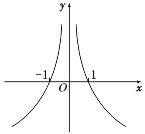
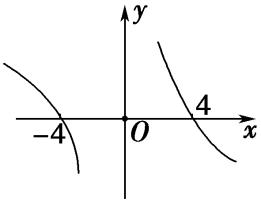
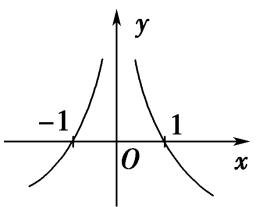
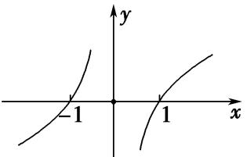

专题06　构造函数法解决导数不等式问题(一)

以抽象函数为背景、题设条件或所求结论中具有“*f*(*x*)±*g*(*x*)，*f*(*x*)*g*(*x*)，”等特征式、旨在考查导数运算法则的逆向、变形应用能力的客观题，是近几年高考试卷中的一位“常客”，常以压轴题小题的形式出现，解答这类问题的有效策略是将前述式子的外形结构特征与导数运算法则结合起来，合理构造出相关的可导函数，然后利用该函数的性质解决问题．

导数是函数单调性的延伸，如果把题目中直接给出的增减性换成一个*f*′(*x*)，则单调性就变的相当隐晦了，另外在导数中的抽象函数不等式问题中，我们要研究的往往不是*f*(*x*)本身的单调性，而是包含*f*(*x*)的一个新函数的单调性，因此构造函数变的相当重要，另外题目中若给出的是*f*′(*x*)的形式，则我们要构造的则是一个包含*f*(*x*)的新函数，因为只有这个新函数求导之后才会出现*f*′(*x*)，因此解决导数抽象函数不等式的重中之重是构造函数．

构造函数是数学的一种重要思想方法，它体现了数学的发现、类比、化归、猜想、实验和归纳等思想．分析近些年的高考，发现构造函数的思想越来越重要，而且很多都用在压轴题(无论是主观题还是客观题)的解答上．

构造函数的主要步骤：  
（1）分析：分析已知条件，联想函数模型；  
（2）构造：构造辅助函数，转化问题本质；  
（3）回归：解析所构函数，回归所求问题．

<strong>考点一　构造</strong><em><strong>F</strong></em><strong>(</strong><em><strong>x</strong></em><strong>)＝</strong><em><strong>xnf</strong></em><strong>(</strong><em><strong>x</strong></em><strong>)(</strong><em><strong>n</strong></em><strong>∈Z，且</strong><em><strong>n</strong></em><strong>≠0)类型的辅助函数</strong>

【方法总结】  
（1）若<em>F</em>(<em>x</em>)＝<em>xnf</em>(<em>x</em>)，则<em>F</em>′(<em>x</em>)＝<em>nxn</em>－1<em>f</em>(<em>x</em>)＋<em>xnf</em>′(<em>x</em>)＝<em>xn</em>－1[<em>nf</em>(<em>x</em>)＋<em>xf</em>′(<em>x</em>)]；  
（2）若*F*(*x*)＝，则*F*′(*x*)＝＝．
由此得到结论：  
（1）出现<em>nf</em>(<em>x</em>)＋<em>xf</em>′(<em>x</em>)形式，构造函数<em>F</em>(<em>x</em>)＝<em>xnf</em>(<em>x</em>)；  
（2）出现*xf*′(*x*)－*nf*(*x*)形式，构造函数*F*(*x*)＝．

【例题选讲】

<strong>[例1]</strong>（1）已知<em>f</em>(<em>x</em>)的定义域为(0，＋∞)，<em>f</em>′(<em>x</em>)为<em>f</em>(<em>x</em>)的导函数，且满足<em>f</em>(<em>x</em>)＜－<em>xf</em>′(<em>x</em>)，则不等式<em>f</em>(<em>x</em>＋1)&gt;(<em>x</em>－1)<em>f</em>(<em>x</em>2－1)的解集是(　　)

A．(0，1)　　　　　
B．(1，＋∞)　　　　　
C．(1，2)　　　　　
D．(2，＋∞)
答案　D　解析　因为<em>f</em>(<em>x</em>)&lt;－<em>xf</em>′(<em>x</em>)，所以<em>f</em>(<em>x</em>)＋<em>xf</em>′(<em>x</em>)&lt;0，即(<em>xf</em>(<em>x</em>))′&lt;0，所以函数<em>y</em>＝<em>xf</em>(<em>x</em>)在(0，＋∞)上单调递减．由不等式<em>f</em>(<em>x</em>＋1)&gt;(<em>x</em>－1)<em>f</em>(<em>x</em>2－1)，可得(<em>x</em>＋1)<em>f</em>(<em>x</em>＋1)&gt;(<em>x</em>2－1)<em>f</em>(<em>x</em>2－1)，所以解得<em>x</em>&gt;2．选D．  
（2）已知函数*f*(*x*)是定义在区间(0，＋∞)上的可导函数，其导函数为*f*′(*x*)，且满足*xf*′(*x*)＋2*f*(*x*)＞0，则不等式＜的解集为(　　)

A．{*x*|*x*＞－2 016}　　
B．{*x*|*x*＜－2 016}　　
C．{*x*|－2 016＜*x*＜0}　　
D．{*x*|－2 021＜*x*＜－2 016}
答案　D　解析　构造函数<em>g</em>(<em>x</em>)＝<em>x</em>2<em>f</em>(<em>x</em>)，则<em>g</em>′(<em>x</em>)＝<em>x</em>[2<em>f</em>(<em>x</em>)＋<em>xf</em>′(<em>x</em>)]．当<em>x</em>＞0时，∵2<em>f</em>(<em>x</em>)＋<em>xf</em>′(<em>x</em>)＞0，∴<em>g</em>′(<em>x</em>)＞0，∴<em>g</em>(<em>x</em>)在(0，＋∞)上单调递增．∵不等式＜，∴当<em>x</em>＋2 021＞0，即<em>x</em>＞－2 021时，(<em>x</em>＋2 021)2<em>f</em>(<em>x</em>＋2 021)＜52<em>f</em>（5），即<em>g</em>(<em>x</em>＋2 021)＜<em>g</em>（5），∴0&lt;<em>x</em>＋2 021＜5，∴－2 021＜<em>x</em>＜－2 016．  
（3）(2015·全国Ⅱ)设函数<em>f</em>′(<em>x</em>)是奇函数<em>f</em>(<em>x</em>)(<em>x</em>∈<strong>R</strong>)的导函数，<em>f</em>(－1)＝0，当<em>x</em>&gt;0时，<em>xf</em>′(<em>x</em>)－<em>f</em>(<em>x</em>)&lt;0，则使得<em>f</em>(<em>x</em>)&gt;0成立的<em>x</em>的取值范围是(　　)

A．(－∞，－1)∪(0，1)　　　　　　　　　
B．(－1，0)∪(1，＋∞)

C．(－∞，－1)∪(－1，0)　　　　　　　　
D．(0，1)∪(1，＋∞)
答案　A　解析　设*y*＝*g*(*x*)＝(*x*≠0)，则*g*′(*x*)＝，当*x*>0时，*xf*′(*x*)－*f*(*x*)<0，∴*g*′(*x*)<0，∴*g*(*x*)在(0，＋∞)上为减函数，且*g*（1）＝*f*（1）＝－*f*(－1)＝0．∵*f*(*x*)为奇函数，∴*g*(*x*)为偶函数，∴*g*(*x*)的图象的示意图如图所示．当*x*>0时，由*f*(*x*)>0，得*g*(*x*)>0，由图知0<*x*<1，当*x*<0时，由*f*(*x*)>0，得*g*(*x*)<0，由图知*x*<－1，∴使得*f*(*x*)>0成立的*x*的取值范围是(－∞，－1)∪(0，1)，故选A．

  
（4）设<em>f</em>(<em>x</em>)是定义在<strong>R</strong>上的偶函数，当<em>x</em>＜0时，<em>f</em>(<em>x</em>)＋<em>xf</em>′(<em>x</em>)＜0，且<em>f</em>(－4)＝0，则不等式<em>xf</em>(<em>x</em>)＞0的解集为\_\_\_\_\_\_\_\_．
答案　(－∞，－4)∪(0，4)　解析　构造*F*(*x*)＝*xf*(*x*)，则*F*′(*x*)＝*f*(*x*)＋*xf*′(*x*)，当*x*＜0时，*f*(*x*)＋*xf*′(*x*)＜0，可以推出当*x*＜0时，*F*′(*x*)＜0，∴*F*(*x*)在(－∞，0)上单调递减．∵*f*(*x*)为偶函数，*x*为奇函数，∴*F*(*x*)为奇函数，∴*F*(*x*)在(0，＋∞)上也单调递减．根据*f*(－4)＝0可得*F*(－4)＝0，根据函数的单调性、奇偶性可得函数图象如图所示，根据图象可知*xf*(*x*)＞0的解集为(－∞，－4)∪(0，4)．

  
（5）已知*f*(*x*)是定义在区间(0，＋∞)内的函数，其导函数为*f*′(*x*)，且不等式*xf*′(*x*)＜2*f*(*x*)恒成立，则(　　)

A．4*f*（1）＜*f*（2）　　　　
B．4*f*（1）＞*f*（2）　　　　
C．*f*（1）＜4*f*（2）　　　　
D．*f*（1）＞4*f*′（2）
答案　<strong>B</strong>　解析　令<em>g</em>(<em>x</em>)＝(<em>x</em>＞0)，则<em>g</em>′(<em>x</em>)＝，由不等式<em>xf</em>′(<em>x</em>)＜2<em>f</em>(<em>x</em>)恒成立知<em>g</em>′(<em>x</em>)＜0，即<em>g</em>(<em>x</em>)在(0，＋∞)是减函数，∴<em>g</em>（1）＞<em>g</em>（2），即＞，即4<em>f</em>（1）＞<em>f</em>（2），故选B．  
（6）已知定义域为<strong>R</strong>的奇函数<em>y</em>＝<em>f</em>(<em>x</em>)的导函数为<em>y</em>＝<em>f</em>′(<em>x</em>)，当<em>x</em>＞0时，<em>xf</em>′(<em>x</em>)－<em>f</em>(<em>x</em>)＜0，若<em>a</em>＝，<em>b</em>＝，<em>c</em>＝，则<em>a</em>，<em>b</em>，<em>c</em>的大小关系正确的是(　　)

A．*a*＜*b*＜*c*　　　　　　
B．*b*＜*c*＜*a*　　　　　　
C．*a*＜*c*＜*b*　　　　　　
D．*c*＜*a*＜*b*
答案　<strong>D</strong>　解析　设<em>g</em>(<em>x</em>)＝，则<em>g</em>′(<em>x</em>)＝，当<em>x</em>＞0时，<em>xf</em>′(<em>x</em>)－<em>f</em>(<em>x</em>)＜0，则<em>g</em>′(<em>x</em>)＝＜0，即函数<em>g</em>(<em>x</em>)在<em>x</em>∈(0，＋∞)时为减函数．由函数<em>y</em>＝<em>f</em>(<em>x</em>)为奇函数知<em>f</em>(－3)＝－<em>f</em>（3），则<em>c</em>＝＝．∵<em>a</em>＝＝<em>g</em>(e)，<em>b</em>＝＝<em>g</em>(ln 2)，<em>c</em>＝＝<em>g</em>（3）且3＞e＞ln 2，∴<em>g</em>（3）＜<em>g</em>(e)＜<em>g</em>(ln 2)，即<em>c</em>＜<em>a</em>＜<em>b</em>，故选D．

【对点训练】

1．设函数<em>f</em>(<em>x</em>)是定义在(－∞，0)上的可导函数，其导函数为<em>f</em>′(<em>x</em>)，且2<em>f</em>(<em>x</em>)＋<em>xf</em>′(<em>x</em>)&gt;<em>x</em>2，则不等式(<em>x</em>＋2 021)2<em>f</em>(<em>x</em>

＋2 021)－4*f*(－2)>0的解集为(　　)

A．(－∞，－2 021)　　
B．(－∞，－2 023)　　
C．(－2 023，0)　　
D．(－2 021，0)

1．答案　B　解析　由2<em>f</em>(<em>x</em>)＋<em>xf</em>′(<em>x</em>)&gt;<em>x</em>2，结合<em>x</em>∈(－∞，0)得2<em>xf</em>(<em>x</em>)＋<em>x</em>2<em>f</em>′(<em>x</em>)&lt;<em>x</em>3&lt;0，故[<em>x</em>2<em>f</em>(<em>x</em>)]′&lt;0，设<em>g</em>(<em>x</em>)

＝<em>x</em>2<em>f</em>(<em>x</em>)，则<em>g</em>(<em>x</em>)在(－∞，0)上单调递减，(<em>x</em>＋2 021)2<em>f</em>(<em>x</em>＋2 021)－4<em>f</em>(－2)&gt;0可化为(<em>x</em>＋2 021)2<em>f</em>(<em>x</em>＋2 021)&gt;(－2)2<em>f</em>(－2)，所以解得<em>x</em>&lt;－2 023．故选B．

2．设<em>f</em>′(<em>x</em>)是奇函数<em>f</em>(<em>x</em>)(<em>x</em>∈<strong>R</strong>)的导函数，<em>f</em>(－2)＝0，当<em>x</em>＞0时，<em>xf</em>′(<em>x</em>)－<em>f</em>(<em>x</em>)＞0，则使得<em>f</em>(<em>x</em>)＞0成立的<em>x</em>

的取值范围是\_\_\_\_\_\_\_\_．

2．答案　(－2，0)∪(2，＋∞)　解析　令*g*(*x*)＝，则*g*′(*x*)＝＞0，*x*∈(0，＋∞)．所以函数*g*(*x*)
在(0，＋∞)上单调递增．又*g*(－*x*)＝＝＝＝*g*(*x*)，则*g*(*x*)是偶函数，*g*(－2)＝0＝*g*（2）．则*f*(*x*)＝*xg*(*x*)＞0⇔或解得*x*＞2或－2＜*x*＜0，故不等式*f*(*x*)＞0的解集为(－2,0)∪(2，＋∞)．

3．已知偶函数*f*(*x*)(*x*≠0)的导函数为*f*′(*x*)，且满足*f*(－1)＝0，当*x*＞0时，2*f*(*x*)＞*xf*′(*x*)，则使得*f*(*x*)＞0成

立的*x*的取值范围是\_\_\_\_\_\_\_\_．

3．答案　(－1，0)∪(0，1)　解析　构造*F*(*x*)＝，则*F*′(*x*)＝，当*x*＞0时，*xf*′(*x*)－2*f*(*x*)＜0，

可以推出当<em>x</em>＞0时，<em>F</em>′(<em>x</em>)＜0，<em>F</em>(<em>x</em>)在(0，＋∞)上单调递减．∵<em>f</em>(<em>x</em>)为偶函数，<em>x</em>2为偶函数，∴<em>F</em>(<em>x</em>)为偶函数，∴<em>F</em>(<em>x</em>)在(－∞，0)上单调递增．根据<em>f</em>(－1)＝0可得<em>F</em>(－1)＝0，根据函数的单调性、奇偶性可得函数图象如图所示，根据图象可知<em>f</em>(<em>x</em>)＞0的解集为(－1，0)∪(0，1)．

4．设<em>f</em>(<em>x</em>)是定义在<strong>R</strong>上的偶函数，且<em>f</em>（1）＝0，当<em>x</em>＜0时，有<em>xf</em>′(<em>x</em>)－<em>f</em>(<em>x</em>)＞0恒成立，则不等式<em>f</em>(<em>x</em>)＞0的
解集为\_\_\_\_\_\_\_\_．

4．答案　(－∞，－1)∪(1，＋∞)　解析　构造*F*(*x*)＝，则*F*′(*x*)＝，当*x*＜0时，*xf*′(*x*)－*f*(*x*)

＞0，可以推出当*x*＜0时，*F*′(*x*)＞0，*F*(*x*)在(－∞，0)上单调递增．∵*f*(*x*)为偶函数，*x*为奇函数，∴*F*(*x*)为奇函数，∴*F*(*x*)在(0，＋∞)上也单调递增．根据*f*（1）＝0可得*F*（1）＝0，根据函数的单调性、奇偶性可得函数图象，根据图象可知*f*(*x*)＞0的解集为(－∞，－1)∪(1，＋∞)．

5．设<em>f</em>(<em>x</em>)是定义在<strong>R</strong>上的奇函数，<em>f</em>（2）＝0，当<em>x</em>&gt;0时，有&lt;0恒成立，则不等式<em>x</em>2<em>f</em>(<em>x</em>)&gt;0的解集

是\_\_\_\_\_\_\_\_\_\_\_\_\_\_\_\_．

5．答案　(－∞，－2)∪(0，2)　解析　∵当*x*>0时，′＝<0，∴*φ*(*x*)＝在(0，＋∞)上为

减函数，又<em>f</em>（2）＝0，即<em>φ</em>（2）＝0，∴在(0，＋∞)上，当且仅当0&lt;<em>x</em>&lt;2时，<em>φ</em>(<em>x</em>)&gt;0，此时<em>x</em>2<em>f</em>(<em>x</em>)&gt;0．又<em>f</em>(<em>x</em>)为奇函数，∴<em>h</em>(<em>x</em>)＝<em>x</em>2<em>f</em>(<em>x</em>)也为奇函数，由数形结合知<em>x</em>∈(－∞，－2)时<em>f</em>(<em>x</em>)&gt;0．故<em>x</em>2<em>f</em>(<em>x</em>)&gt;0的解集为(－∞，－2)∪(0，2)．

6．设<em>f</em>(<em>x</em>)是定义在<strong>R</strong>上的奇函数，且<em>f</em>（2）＝0，当<em>x</em>&gt;0时，&lt;0恒成立，则不等式&gt;0的解集

为(　　)

A．(－2，0)∪(2，＋∞)　
B．(－2，0)∪(0，2)　
C．(－∞，－2)∪(0，2)　
D．(－∞，－2)∪(2，＋∞)

6．答案　B　解析　设*g*(*x*)＝，则*g*′(*x*)＝′＝，当*x*>0时，*g*′(*x*)<0，所以函数*g*(*x*)＝
在(0，＋∞)上单调递减．因为*f*(*x*)是奇函数，所以*g*(*x*)＝是偶函数．因为*f*（2）＝0，所以*f*(－2)＝0．所以不等式>0的解集为(－2，0)∪(0，2)．故选B．

7．*f*(*x*)是定义在(0，＋∞)上的非负可导函数，且满足*xf*′(*x*)－*f*(*x*)＜0，对任意正数*a*，*b*，若*a*<*b*，则必有(　　)

A．*af*(*b*)＜*bf*(*a*)　　　　
B．*bf*(*a*)＜*af*(*b*)　　　　
C．*af*(*a*)＜*bf*(*b*)　　　　
D．*bf*(*b*)＜*af*(*a*)

7．答案　A　解析　设函数*F*(*x*)＝(*x*>0)，则*F*′(*x*)＝[]′＝．因为*x*>0，*xf*′(*x*)－*f*(*x*)＜0，所

以*F*′(*x*)＜0，故函数*F*(*x*)在(0，＋∞)上为减函数．又0<*a*<*b*，所以*F*(*a*)＞*F*(*b*)，即＞，则*bf*(*a*)＞*af*(*b*)．

8．设函数<em>f</em>(<em>x</em>)的导函数为<em>f</em>′(<em>x</em>)，对任意<em>x</em>∈<strong>R</strong>，都有<em>xf</em>′(<em>x</em>)&lt;<em>f</em>(<em>x</em>)成立，则(　　)

A．3*f*（2）>2*f*（3）　　　　
B．3*f*（2）＝2*f*（3）　　　
C．3*f*（2）<2*f*（3）　　　　
D．3*f*（2）与2*f*（3）大小不确定

8．答案　A　解析　令*F*(*x*)＝，则*F*′(*x*)＝<0，所以*F*(*x*)为减函数，则>．所以3*f*（2）>2*f*（3）．

9．定义在区间(0，＋∞)上的函数*y*＝*f*(*x*)使不等式2*f*(*x*)<*xf*′(*x*)<3*f*(*x*)恒成立，其中*y*＝*f*′(*x*)为*y*＝*f*(*x*)的导函

数，则(　　)

A．8<<16　　　　
B．4<<8　　　　
C．3<<4　　　　
D．2<<3

9．答案　B　解析　∵*xf*′(*x*)－2*f*(*x*)>0，*x*>0，∴′＝＝>0，∴*y*＝在(0，＋

∞)上单调递增，∴>，即>4．∵*xf*′(*x*)－3*f*(*x*)<0，*x*>0，∴′＝＝<0，∴*y*＝在(0，＋∞)上单调递减，∴<，即<8，综上，4<<8．

<strong>考点二　构造</strong><em><strong>F</strong></em><strong>(</strong><em><strong>x</strong></em><strong>)＝e</strong><em><strong>nxf</strong></em><strong>(</strong><em><strong>x</strong></em><strong>)(</strong><em><strong>n</strong></em><strong>∈Z，且</strong><em><strong>n</strong></em><strong>≠0)类型的辅助函数</strong>

【方法总结】  
（1）若<em>F</em>(<em>x</em>)＝e<em>nxf</em>(<em>x</em>)，则<em>F</em>′(<em>x</em>)＝<em>n</em>·e<em>nxf</em>(<em>x</em>)＋e<em>nxf</em>′(<em>x</em>)＝e<em>nx</em>[<em>f</em>′(<em>x</em>)＋<em>nf</em>(<em>x</em>)]；  
（2）若*F*(*x*)＝，则*F*′(*x*)＝＝．
由此得到结论：  
（1）出现<em>f</em>′(<em>x</em>)＋<em>nf</em>(<em>x</em>)形式，构造函数<em>F</em>(<em>x</em>)＝e<em>nxf</em>(<em>x</em>)；  
（2）出现*f*′(*x*)－*nf*(*x*)形式，构造函数*F*(*x*)＝．

【例题选讲】

<strong>[例1]</strong>（1）若定义在<strong>R</strong>上的函数<em>f</em>(<em>x</em>)满足<em>f</em>′(<em>x</em>)＋2<em>f</em>(<em>x</em>)&gt;0，且<em>f</em>（0）＝1，则不等式<em>f</em>(<em>x</em>)&gt;的解集为________．
答案　(0，＋∞)　解析　构造<em>F</em>(<em>x</em>)＝<em>f</em>(<em>x</em>)·e2<em>x</em>，∴<em>F</em>′(<em>x</em>)＝<em>f</em>′(<em>x</em>)·e2<em>x</em>＋<em>f</em>(<em>x</em>)·2e2<em>x</em>＝e2<em>x</em>[<em>f</em>′(<em>x</em>)＋2<em>f</em>(<em>x</em>)]&gt;0，∴<em>F</em>(<em>x</em>)在<strong>R</strong>上单调递增，且<em>F</em>（0）＝<em>f</em>（0）·e0＝1，不等式<em>f</em>(<em>x</em>)&gt;可化为<em>f</em>(<em>x</em>)e2<em>x</em>&gt;1，即<em>F</em>(<em>x</em>)&gt;<em>F</em>（0），∴<em>x</em>&gt;0，∴原不等式的解集为(0，＋∞)．  
（2）定义域为<strong>R</strong>的可导函数<em>y</em>＝<em>f</em>(<em>x</em>)的导函数为<em>f</em>′(<em>x</em>)，满足<em>f</em>(<em>x</em>)&gt;<em>f</em>′(<em>x</em>)，且<em>f</em>（0）＝1，则不等式&lt;1的解集为\_\_\_\_\_\_\_\_．
答案　{<em>x</em>|<em>x</em>&gt;0}　解析　令<em>g</em>(<em>x</em>)＝，则<em>g</em>′(<em>x</em>)＝＝．由题意得<em>g</em>′(<em>x</em>)&lt;0恒成立，所以函数<em>g</em>(<em>x</em>)＝在<strong>R</strong>上单调递减．又<em>g</em>（0）＝＝1，所以&lt;1，即<em>g</em>(<em>x</em>)&lt;<em>g</em>（0），所以<em>x</em>&gt;0，所以不等式的解集为{<em>x</em>|<em>x</em>&gt;0}．  
（3）若定义在<strong>R</strong>上的函数<em>f</em>(<em>x</em>)满足<em>f</em>′(<em>x</em>)－2<em>f</em>(<em>x</em>)＞0，<em>f</em>（0）＝1，则不等式<em>f</em>(<em>x</em>)＞e2<em>x</em>的解集为\_\_\_\_\_\_\_\_．
答案　(0，＋∞)　解析　构造<em>F</em>(<em>x</em>)＝，则<em>F</em>′(<em>x</em>)＝＝，函数<em>f</em>(<em>x</em>)满足<em>f</em>′(<em>x</em>)－2<em>f</em>(<em>x</em>)＞0，则<em>F</em>′(<em>x</em>)＞0，<em>F</em>(<em>x</em>)在<strong>R</strong>上单调递增．又∵<em>f</em>（0）＝1，则<em>F</em>（0）＝1，<em>f</em>(<em>x</em>)＞e2<em>x</em>⇔＞1⇔<em>F</em>(<em>x</em>)＞<em>F</em>（0），根据单调性得<em>x</em>＞0．  
（4）设定义域为<strong>R</strong>的函数<em>f</em>(<em>x</em>)满足<em>f</em>′(<em>x</em>)&gt;<em>f</em>(<em>x</em>)，则不等式e<em>x</em>－1<em>f</em>(<em>x</em>)&lt;<em>f</em>(2<em>x</em>－1)的解集为\_\_\_\_\_\_\_\_．
答案　(1，＋∞)　解析　令<em>g</em>(<em>x</em>)＝，则<em>g</em>′(<em>x</em>)＝&gt;0，故<em>g</em>(<em>x</em>)在<strong>R</strong>上单调递增，不等式e<em>x</em>－1<em>f</em>(<em>x</em>)&lt;<em>f</em>(2<em>x</em>－1)，即&lt;，故<em>g</em>(<em>x</em>)&lt;<em>g</em>(2<em>x</em>－1)，故<em>x</em>&lt;2<em>x</em>－1，解得<em>x</em>&gt;1，所以原不等式的解集为(1，＋∞)．  
（5）定义在<strong>R</strong>上的函数<em>f</em>(<em>x</em>)满足：<em>f</em>(<em>x</em>)&gt;1－<em>f</em>′(<em>x</em>)，<em>f</em>（0）＝0，<em>f</em>′(<em>x</em>)是<em>f</em>(<em>x</em>)的导函数，则不等式e<em>xf</em>(<em>x</em>)&gt;e<em>x</em>－1(其中e为自然对数的底数)的解集为(　　)

A．(0，＋∞)　　
B．(－∞，－1)∪(0，＋∞)　　
C．(－∞，0)∪(1，＋∞)　　
D．(－1，＋∞)
答案　A　解析　设<em>g</em>(<em>x</em>)＝e<em>xf</em>(<em>x</em>)－e<em>x</em>，则<em>g</em>′(<em>x</em>)＝e<em>xf</em>(<em>x</em>)＋e<em>xf</em>′(<em>x</em>)－e<em>x</em>．由已知<em>f</em>(<em>x</em>)&gt;1－<em>f</em>′(<em>x</em>)，可得<em>g</em>′(<em>x</em>)&gt;0在<strong>R</strong>上恒成立，即<em>g</em>(<em>x</em>)是<strong>R</strong>上的增函数．因为<em>f</em>（0）＝0，所以<em>g</em>（0）＝－1，则不等式e<em>xf</em>(<em>x</em>)&gt;e<em>x</em>－1可化为<em>g</em>(<em>x</em>)&gt;<em>g</em>（0），所以原不等式的解集为(0，＋∞)．  
（6）定义在<strong>R</strong>上的函数<em>f</em>(<em>x</em>)的导函数为<em>f</em>′(<em>x</em>)，若对任意<em>x</em>，有<em>f</em>(<em>x</em>)&gt;<em>f</em>′(<em>x</em>)，且<em>f</em>(<em>x</em>)＋2 021为奇函数，则不等式<em>f</em>(<em>x</em>)＋2 021e<em>x</em>&lt;0的解集是(　　)

A．(－∞，0)　　　　　
B．(0，＋∞)　　　　　
C．　　　　　
D．
答案　B　解析　设<em>h</em>(<em>x</em>)＝，则<em>h</em>′(<em>x</em>)＝&lt;0，所以<em>h</em>(<em>x</em>)是定义在<strong>R</strong>上的减函数．因为<em>f</em>(<em>x</em>)＋2

021为奇函数，所以<em>f</em>（0）＝－2 021，<em>h</em>（0）＝－2 021．因为<em>f</em>(<em>x</em>)＋2 021e<em>x</em>&lt;0，所以&lt;－2 021，即<em>h</em>(<em>x</em>)&lt;<em>h</em>（0），结合函数<em>h</em>(<em>x</em>)的单调性可知<em>x</em>&gt;0，所以不等式<em>f</em>(<em>x</em>)＋2 021e<em>x</em>&lt;0的解集是(0，＋∞)．故选B<strong>．</strong>  
（7）已知定义在<strong>R</strong>上的偶函数<em>f</em>(<em>x</em>)(函数<em>f</em>(<em>x</em>)的导函数为<em>f</em>′(<em>x</em>))满足<em>f</em> ＋<em>f</em>(<em>x</em>＋1)＝0，e3<em>f</em>(2 021)＝1，若<em>f</em>(<em>x</em>)&gt;<em>f</em>′(－<em>x</em>)，则关于<em>x</em>的不等式<em>f</em>(<em>x</em>＋2)&gt;的解集为(　　)

A．(－∞，3)　　　　
B．(3，＋∞)　　　　
C．(－∞，0)　　　　
D．(0，＋∞)
答案　B　解析　∵*f*(*x*)是偶函数，∴*f*(*x*)＝*f*(－*x*)，*f*′(*x*)＝′＝－*f*′(－*x*)，∴*f*′(－*x*)＝－*f*′(*x*)，*f*(*x*)>*f*′(

－<em>x</em>)＝－<em>f</em>′(<em>x</em>)，即<em>f</em>(<em>x</em>)＋<em>f</em>′(<em>x</em>)&gt;0，设<em>g</em>(<em>x</em>)＝e<em>xf</em>(<em>x</em>)，则′＝e<em>x</em>&gt;0，∴<em>g</em>(<em>x</em>)在(－∞，＋∞)上单调递增，由<em>f</em> ＋<em>f</em>(<em>x</em>＋1)＝0，得<em>f</em>(<em>x</em>)＋<em>f</em> ＝0，<em>f</em> ＋<em>f</em>＝0，相减可得<em>f</em>(<em>x</em>)＝<em>f</em>，<em>f</em>(<em>x</em>)的周期为3，∴e3<em>f</em>＝e3<em>f</em>（2）＝1，<em>g</em>（2）＝e2<em>f</em>（2）＝，<em>f</em>(<em>x</em>＋2)&gt;，结合<em>f</em>(<em>x</em>)的周期为3可化为e<em>x</em>－1<em>f</em>(<em>x</em>－1)&gt;＝e2<em>f</em>（2），<em>g</em>(<em>x</em>－1)&gt;<em>g</em>（2），<em>x</em>－1&gt;2，<em>x</em>&gt;3，∴不等式的解集为，故选B．  
（8）已知函数<em>f</em>(<em>x</em>)是定义在<strong>R</strong>上的可导函数，<em>f</em>′(<em>x</em>)为其导函数，若对于任意实数<em>x</em>，有<em>f</em>(<em>x</em>)－<em>f</em>′(<em>x</em>)＞0，则(　　)

A．e*f*(2 021)＞*f*(2 022)　　　　　　　　　　　　　
B．e*f*(2 021)＜*f*(2 022)

C．e*f*(2 021)＝*f*(2 022)　　　　　　　　　　　　　
D．e*f*(2 021)与*f*(2 022)大小不能确定
答案　<strong>A</strong>　解析　令<em>g</em>(<em>x</em>)＝，则<em>g</em>′(<em>x</em>)＝＝，因为<em>f</em>(<em>x</em>)－<em>f</em>′(<em>x</em>)＞0，所以<em>g</em>′(<em>x</em>)＜0，所以函数<em>g</em>(<em>x</em>)在<strong>R</strong>上单调递减，所以<em>g</em>(2 021)＞<em>g</em>(2 022)，即＞，所以e<em>f</em>(2 021)＞<em>f</em>(2 022)，故选A．  
（9）已知<em>f</em>(<em>x</em>)是定义在(－∞，＋∞)上的函数，导函数<em>f</em>′(<em>x</em>)满足<em>f</em>′(<em>x</em>)&lt;<em>f</em>(<em>x</em>)对于<em>x</em>∈<strong>R</strong>恒成立，则(　　)

A．<em>f</em>（2）&gt;e2<em>f</em>（0），<em>f</em>(2 021)&gt;e2 021<em>f</em>（0）　　　　　　　　
B．<em>f</em>（2）&lt;e2<em>f</em>（0），<em>f</em>(2 021)&gt;e2 021<em>f</em>（0）

C．<em>f</em>（2）&gt;e2<em>f</em>（0），<em>f</em>(2 021)&lt;e2 021<em>f</em>（0）　　　　　　　　
D．<em>f</em>（2）&lt;e2<em>f</em>（0），<em>f</em>(2 021)&lt;e2 021<em>f</em>（0）
答案　D　解析　构造<em>F</em>(<em>x</em>)＝，则<em>F</em>′(<em>x</em>)＝＝，导函数<em>f</em>′(<em>x</em>)满足<em>f</em>′(<em>x</em>)&lt;<em>f</em>(<em>x</em>)，则<em>F</em>′(<em>x</em>)&lt;0，<em>F</em>(<em>x</em>)在<strong>R</strong>上单调递减，根据单调性可知选D．  
（10）已知函数<em>f</em>(<em>x</em>)在<strong>R</strong>上可导，其导函数为<em>f</em>′(<em>x</em>)，若<em>f</em>(<em>x</em>)满足：(<em>x</em>－1)[<em>f</em>′(<em>x</em>)－<em>f</em>(<em>x</em>)]＞0，<em>f</em>(2－<em>x</em>)＝<em>f</em>(<em>x</em>)·e2－2<em>x</em>，则下列判断一定正确的是(　　)

A．<em>f</em>（1）＜<em>f</em>（0）　　　　
B．<em>f</em>（2）＞e2<em>f</em>（0）　　　　
C．<em>f</em>（3）＞e3<em>f</em>（0）　　　　
D．<em>f</em>（4）＜e4<em>f</em>（0）
答案　<strong>C</strong>　解析　构造<em>F</em>(<em>x</em>)＝，则<em>F</em>′(<em>x</em>)＝＝，导函数<em>f</em>′(<em>x</em>)满足(<em>x</em>－1)[<em>f</em>′(<em>x</em>)－<em>f</em>(<em>x</em>)]＞0，则<em>x</em>＞1时<em>F</em>′(<em>x</em>)＞0，<em>F</em>(<em>x</em>)在[1，＋∞)上单调递增．当<em>x</em>＜1时<em>F</em>′(<em>x</em>)＜0，<em>F</em>(<em>x</em>)在(－∞，1]上单调递减．又由<em>f</em>(2－<em>x</em>)＝<em>f</em>(<em>x</em>)e2－2<em>x</em>⇔<em>F</em>(2－<em>x</em>)＝<em>F</em>(<em>x</em>)⇒<em>F</em>(<em>x</em>)关于<em>x</em>＝1对称，从而<em>F</em>（3）＞<em>F</em>（0）即＞，∴<em>f</em>（3）＞e3<em>f</em>（0），故选C．

【对点训练】

1．已知定义在<strong>R</strong>上的可导函数<em>f</em>(<em>x</em>)的导函数为<em>f</em>′(<em>x</em>)，满足<em>f</em>′(<em>x</em>)&lt;<em>f</em>(<em>x</em>)，且<em>f</em>（0）＝，则不等式<em>f</em>(<em>x</em>)－e<em>x</em>&lt;0的
解集为(　　)

A．　　　　　
B．(0，＋∞)　　　　　
C．　　　　　
D．(－∞，0)

1．答案　B　解析　构造函数*g*(*x*)＝，则*g*′(*x*)＝，因为*f*′(*x*)<*f*(*x*)，所以*g*′(*x*)<0，故函数*g*(*x*)
在<strong>R</strong>上为减函数，又<em>f</em>（0）＝，所以<em>g</em>（0）＝＝，则不等式<em>f</em>(<em>x</em>)－e<em>x</em>&lt;0可化为&lt;，即<em>g</em>(<em>x</em>)&lt;＝<em>g</em>（0），所以<em>x</em>&gt;0，即所求不等式的解集为(0，＋∞)．

2．已知函数<em>f</em>′(<em>x</em>)是函数<em>f</em>(<em>x</em>)的导函数，<em>f</em>（1）＝，对任意实数<em>x</em>，都有<em>f</em>(<em>x</em>)－<em>f</em>′(<em>x</em>)&gt;0，则不等式<em>f</em>(<em>x</em>)&lt;e<em>x</em>－2的
解集为(　　)

A．(－∞，e)　　　　　
B．(1，＋∞)　　　　　
C．(1，e)　　　　　
D．(e，＋∞)

2．答案　B　解析　设*g*(*x*)＝，则*g*′(*x*)＝＝．∵对任意实数*x*，都有*f* (*x*)－*f* ′(*x*)>

0，∴<em>g</em>′(<em>x</em>)&lt;0，即<em>g</em>(<em>x</em>)为<strong>R</strong>上的减函数．<em>g</em>（1）＝＝，由不等式<em>f</em> (<em>x</em>)&lt;e<em>x</em>－2，得&lt;e－2＝，即<em>g</em>(<em>x</em>)&lt;<em>g</em>（1）．∵<em>g</em>(<em>x</em>)为<strong>R</strong>上的减函数，∴<em>x</em>&gt;1，∴不等式<em>f</em> (<em>x</em>)&lt;e<em>x</em>－2的解集为(1，＋∞)．故选B．

3．已知<em>f</em>′(<em>x</em>)是定义在<strong>R</strong>上的连续函数<em>f</em>(<em>x</em>)的导函数，若<em>f</em>′(<em>x</em>)－2<em>f</em>(<em>x</em>)＜0，且<em>f</em>(－1)＝0，则<em>f</em>(<em>x</em>)＞0的解集为

(　　)

A．(－∞，－1)　　　　
B．(－1，1)　　　　
C．(－∞，0)　　　　
D．(－1，＋∞)

3．答案　<strong>A</strong>　解析　设<em>g</em>(<em>x</em>)＝，则<em>g</em>′(<em>x</em>)＝＜0在<strong>R</strong>上恒成立，所以<em>g</em>(<em>x</em>)在<strong>R</strong>上单调递减．因

为*f*(*x*)＞0，所以*g*(*x*)＞0，又*g*(－1)＝0，所以*x*＜－1．

4．已知定义在<strong>R</strong>上的可导函数<em>f</em>(<em>x</em>)的导函数为<em>f</em>′(<em>x</em>)，满足<em>f</em>′(<em>x</em>)&gt;<em>f</em>(<em>x</em>)，且<em>f</em>(<em>x</em>＋3)为偶函数，<em>f</em>（6）＝1，则不

等式<em>f</em>(<em>x</em>)&gt;e<em>x</em>的解集为(　　)

A．(－2，＋∞)　　　　　
B．(0，＋∞)　　　　　
C．(1，＋∞)　　　　　
D．(4，＋∞)

4．答案　B　解析　因为*f* (*x*＋3)为偶函数，所以*f* (3－*x*)＝*f* (*x*＋3)，因此*f* （0）＝*f* （6）＝1．设*h*(*x*)＝，
则原不等式即<em>h</em>(<em>x</em>)&gt;<em>h</em>（0）．又<em>h</em>′(<em>x</em>)＝＝，依题意<em>f</em>′(<em>x</em>)&gt;<em>f</em>(<em>x</em>)，故<em>h</em>′(<em>x</em>)&gt;0，因此函数<em>h</em>(<em>x</em>)在<strong>R</strong>上是增函数，所以由<em>h</em>(<em>x</em>)&gt;<em>h</em>（0），得<em>x</em>&gt;0．故选B．

5．已知函数<em>f</em>(<em>x</em>)的定义域是<strong>R</strong>，<em>f</em>（0）＝2，对任意的<em>x</em>∈<strong>R</strong>，<em>f</em>(<em>x</em>)＋<em>f</em>′(<em>x</em>)&gt;1，则不等式e<em>x</em>·<em>f</em>(<em>x</em>)&gt;e<em>x</em>＋1的解集是

(　　)

A．{*x*|*x*>0}　　　
B．{*x*|*x*<0}　　　
C．|*x*|*x*<－1，或*x*>1|　　　
D．{*x*|*x*<－1，或0<*x*<1}

5．答案　A　解析　构造函数<em>g</em>(<em>x</em>)＝e<em>x</em>·<em>f</em>(<em>x</em>)－e<em>x</em>－1，求导，得<em>g</em>′(<em>x</em>)＝e<em>x</em>·<em>f</em>(<em>x</em>)＋e<em>x</em>·<em>f</em>′(<em>x</em>)－e<em>x</em>＝e<em>x</em>[<em>f</em>(<em>x</em>)＋<em>f</em>′(<em>x</em>)－1]

．由已知<em>f</em>(<em>x</em>)＋<em>f</em>′(<em>x</em>)&gt;1，可得到<em>g</em>′(<em>x</em>)&gt;0，所以<em>g</em>(<em>x</em>)为<strong>R</strong>上的增函数．又<em>g</em>（0）＝e0·<em>f</em>（0）－e0－1＝0，所以e<em>x</em>·<em>f</em>(<em>x</em>)&gt;e<em>x</em>＋1，即<em>g</em>(<em>x</em>)&gt;0的解集为{<em>x</em>|<em>x</em>&gt;0}．

6．已知函数<em>f</em>(<em>x</em>)的定义域为<strong>R</strong>，且<em>f</em>(<em>x</em>)＋1&lt;<em>f</em>′(<em>x</em>)，<em>f</em>（0）＝2，则不等式<em>f</em>(<em>x</em>)＋1&gt;3e<em>x</em>的解集为(　　)

A．(1，＋∞)　　　　　
B．(－∞，1)　　　　　
C．(0，＋∞)　　　　　
D．(－∞，0)

6．答案　C　解析　构造函数<em>g</em>(<em>x</em>)＝，则<em>g</em>′(<em>x</em>)＝&gt;0，故<em>g</em>(<em>x</em>)在<strong>R</strong>上为增函数．又<em>g</em>（0）

＝＝3，由<em>f</em>(<em>x</em>)＋1&gt;3e<em>x</em>，得&gt;3，即<em>g</em>(<em>x</em>)&gt;<em>g</em>（0），解得<em>x</em>&gt;0．故选C．

7．定义在<strong>R</strong>上的可导函数<em>f</em>(<em>x</em>)满足<em>f</em>(<em>x</em>)＋<em>f</em>′(<em>x</em>)&lt;0，则下列各式一定成立的是(　　)

A．e2<em>f</em>（2021）&lt;<em>f</em>（2019）　　
B．e2<em>f</em>（2021）&gt;<em>f</em>（2019）　　
C．<em>f</em>（2021）&lt;<em>f</em>（2019）　　
D．<em>f</em>（2021）&gt;<em>f</em>（2019）

7．答案　A　解析　根据题意，设<em>g</em>(<em>x</em>)＝e<em>xf</em>(<em>x</em>)，其导函数<em>g</em>′(<em>x</em>)＝e<em>xf</em>(<em>x</em>)＋e<em>xf</em>′(<em>x</em>)＝e<em>x</em>[<em>f</em>(<em>x</em>)＋<em>f</em>′(<em>x</em>)]，又由函数

<em>f</em>(<em>x</em>)与其导函数<em>f</em>′(<em>x</em>)满足<em>f</em>(<em>x</em>)＋<em>f</em>′(<em>x</em>)&lt;0，则有<em>g</em>′(<em>x</em>)&lt;0，则函数<em>g</em>(<em>x</em>)在<strong>R</strong>上为减函数，则有<em>g</em>（2021）&lt;<em>g</em>（2019），即e2021<em>f</em>（2021）&lt;e2019<em>f</em>（2019），即e2<em>f</em>（2021）&lt;<em>f</em>（2019）．

8．定义在<strong>R</strong>上的函数<em>f</em>(<em>x</em>)满足<em>f</em>′(<em>x</em>)&gt;<em>f</em>(<em>x</em>)恒成立，若<em>x</em>1&lt;<em>x</em>2，则<em>f</em>(<em>x</em>2)与<em>f</em>(<em>x</em>1)的大小关系为(　　)

A．<em>f</em>(<em>x</em>2)&gt;<em>f</em>(<em>x</em>1)　　　　　　　　　　
B．<em>f</em>(<em>x</em>2)&lt;<em>f</em>(<em>x</em>1)

C．<em>f</em>(<em>x</em>2)＝<em>f</em>(<em>x</em>1)　　　　　　　　　　
D．<em>f</em>(<em>x</em>2)与<em>f</em>(<em>x</em>1)的大小关系不确定

8．答案　A　解析　设<em>g</em>(<em>x</em>)＝，则<em>g</em>′(<em>x</em>)＝＝．由题意得<em>g</em>′(<em>x</em>)&gt;0，所以<em>g</em>(<em>x</em>)在<strong>R</strong>

上单调递增，当<em>x</em>1&lt;<em>x</em>2时，<em>g</em>(<em>x</em>1)&lt;<em>g</em>(<em>x</em>2)，即&lt;，所以<em>f</em>(<em>x</em>2)&gt;<em>f</em>(<em>x</em>1)．

9．设函数<em>f</em>(<em>x</em>)的导函数为<em>f</em>′(<em>x</em>)，对任意<em>x</em>∈<strong>R</strong>都有<em>f</em>(<em>x</em>)＞<em>f</em>′(<em>x</em>)成立，则(　　)

A．3*f*(ln2)＜2*f*(ln3)　　　　　　　　　　　
B．3*f*(ln2)＝2*f*(ln3)

C．3*f*(ln2)＞2*f*(ln3)　　　　　　　　　　　
D．3*f*(ln2)与2*f*(ln3)的大小不确定

9．答案　<strong>C</strong>　解析　　令<em>F</em>(<em>x</em>)＝，则<em>F</em>′(<em>x</em>)＝，因为对∀<em>x</em>∈<strong>R</strong>都有<em>f</em>(<em>x</em>)＞<em>f</em>′(<em>x</em>)，所以<em>F</em>′(<em>x</em>)＜0，
即<em>F</em>(<em>x</em>)在<strong>R</strong>上单调递减．又ln2＜ln3，所以<em>F</em>(ln2)＞<em>F</em>(ln3)，即＞，所以＞，即3<em>f</em>(ln2)＞2<em>f</em>(ln3)，故选C．

10．已知函数<em>f</em>(<em>x</em>)是定义在<strong>R</strong>上的可导函数，且对于∀<em>x</em>∈<strong>R</strong>，均有<em>f</em>(<em>x</em>)&gt;<em>f</em>′(<em>x</em>)，则有(　　)

A．e2022<em>f</em>(－2022)&lt;<em>f</em>（0），<em>f</em>（2022）&gt;e2022<em>f</em>（0）　　　　
B．e2022<em>f</em>(－2022)&lt;<em>f</em>（0），<em>f</em>（2022）&lt;e2022<em>f</em>（0）

C．e2022<em>f</em>(－2022)&gt;<em>f</em>（0），<em>f</em>（2022）&gt;e2022<em>f</em>（0）　　　　
D．e2022<em>f</em>(－2022)&gt;<em>f</em>（0），<em>f</em>（2022）&lt;e2022<em>f</em>（0）

10．答案　D　解析　构造函数<em>g</em>(<em>x</em>)＝，则<em>g</em>′(<em>x</em>)＝＝，因为∀<em>x</em>∈<strong>R</strong>，均有<em>f</em>(<em>x</em>)&gt;

<em>f</em>′(<em>x</em>)，并e<em>x</em>&gt;0，所以<em>g</em>′(<em>x</em>)&lt;0，故函数<em>g</em>(<em>x</em>)＝在<strong>R</strong>上单调递减，所以<em>g</em>(－2022)&gt;<em>g</em>（0），<em>g</em>（2022）&lt;<em>g</em>（0），
即&gt;<em>f</em>（0），&lt;<em>f</em>（0），也就是e2022<em>f</em>(－2022)&gt;<em>f</em>（0），<em>f</em>（2022）&lt;e2022<em>f</em>（0）．

<strong>考点三　构造</strong><em><strong>F</strong></em><strong>(</strong><em><strong>x</strong></em><strong>)＝</strong><em><strong>f</strong></em><strong>(</strong><em><strong>x</strong></em><strong>)sin</strong> <em><strong>x</strong></em><strong>，</strong><em><strong>F</strong></em><strong>(</strong><em><strong>x</strong></em><strong>)＝，</strong><em><strong>F</strong></em><strong>(</strong><em><strong>x</strong></em><strong>)＝</strong><em><strong>f</strong></em><strong>(</strong><em><strong>x</strong></em><strong>) cos</strong> <em><strong>x</strong></em><strong>，</strong><em><strong>F</strong></em><strong>(</strong><em><strong>x</strong></em><strong>)＝类型的辅助函数</strong>

【方法总结】  
（1）若*F*(*x*)＝*f*(*x*)sin*x*，则*F*′(*x*)＝*f*′(*x*)sin*x*＋*f*(*x*)cos*x*；  
（2）若*F*(*x*)＝，则*F*′(*x*)＝；  
（3）若*F*(*x*)＝*f*(*x*)cos*x*，则*F*′(*x*)＝*f*′(*x*)cos*x*－*f*(*x*)sin*x*；  
（4）若*F*(*x*)＝，则*F*′(*x*)＝．
由此得到结论：  
（1）出现*f*′(*x*)sin*x*＋*f*(*x*)cos*x*形式，构造函数*F*(*x*)＝*f*(*x*)sin*x*；  
（2）出现形式，构造函数*F*(*x*)＝；  
（3）出现*f*′(*x*)cos*x*－*f*(*x*)sin*x*形式，构造函数*F*(*x*)＝*f*(*x*)cos*x*；  
（4）出现形式，构造函数*F*(*x*)＝．

【例题选讲】

<strong>[例1]</strong>（1）已知函数<em>f</em>(<em>x</em>)是定义在上的奇函数．当<em>x</em>∈[0，)时，<em>f</em>(<em>x</em>)＋<em>f</em>′(<em>x</em>)tan<em>x</em>&gt;0，则不等式cos<em>xf</em>(<em>x</em>＋)＋sin<em>xf</em>(－<em>x</em>)&gt;0的解集为(　　)

A．　　　　　　
B．　　　　　　
C．　　　　　　
D．
答案　C　解析　令*g*(*x*)＝*f*(*x*)sin*x*，则*g*′(*x*)＝*f*(*x*)cos*x*＋*f*′(*x*)sin*x*＝[*f*(*x*)＋*f*′(*x*)tan*x*]cos*x*，当*x*∈[0，)时，*f*(*x*)＋*f*′(*x*)tan*x*>0，cos*x*>0，∴*g*′(*x*)>0，即函数*g*(*x*)单调递增．又*g*（0）＝0，∴*x*∈[0，)时，*g*(*x*)＝*f*(*x*)sin*x*≥0．∵*f*(*x*)是定义在上的奇函数，∴*g*(*x*)是定义在上的偶函数．不等式cos*xf*(*x*＋)＋sin*xf*(－*x*)>0，即sin·*f*>sin*x*·*f*(*x*)，即*g*>*g*(*x*)，∴|*x*＋|>|*x*|，∴*x*>－　①，又－<*x*＋<，故－π<*x*<0　②，由①②得不等式的解集是．故选C．  
（2）对任意的*x*∈，不等式*f*(*x*)tan*x*<*f*′(*x*)恒成立，则下列不等式错误的是(　　)

A．*f* >*f* 　　
B．*f* >2*f*（1）cos 1　　
C．2*f*（1）cos1>*f* 　　
D．*f* <*f*
答案　D　解析　因为*x*∈，所以sin *x*>0，cos *x*>0，构造函数*F*(*x*)＝*f*(*x*)cos *x*，则*F*′(*x*)＝－*f*(*x*)sin*x*＋*f*′(*x*)cos *x*，因为对任意的*x*∈，不等式*f*(*x*)tan *x*<*f*′(*x*)恒成立，所以*f*(*x*)sin *x*<*f*′(*x*)cos *x*恒成立，即*f*′(*x*)cos *x*－*f*(*x*)sin*x*>0恒成立，所以*F*′(*x*)>0恒成立，所以函数*F*(*x*)在*x*∈上单调递增，所以*F* <*F* <*F*（1）<*F* ，所以*f* cos<*f* cos<*f*（1）cos1<*f* cos，所以*f* <*f* <*f*（1）cos1<*f* ，所以*f* <*f* <2*f*（1）cos1<*f* ，结合选项知D错误，故选D．  
（3）定义在上的函数*f*(*x*)，函数*f*′(*x*)是它的导函数，且恒有*f*(*x*)＜*f*′(*x*)tan*x*成立，则(　　)

A．*f* ＞*f* 　　　
B．*f*（1）＜2*f* sin 1　　　
C．*f* ＞*f* 　　　
D．*f* ＜*f*
答案　<strong>D</strong>　解析　<em>f</em>(<em>x</em>)＜<em>f</em>′(<em>x</em>)tan <em>x</em>⇔<em>f</em>′(<em>x</em>)sin <em>x</em>－<em>f</em>(<em>x</em>)cos <em>x</em>＞0，令<em>F</em>(<em>x</em>)＝，则<em>F</em>′(<em>x</em>)＝＞0，即函数<em>F</em>(<em>x</em>)在上是增函数，∴<em>F</em> ＜<em>F</em> ，即＜，∴<em>f</em> ＜<em>f</em> ，故选D．  
（4）已知函数*y*＝*f*(*x*)对于任意的*x*∈满足*f*′(*x*)cos*x*＋*f*(*x*)sin*x*>0(其中*f*′(*x*)是函数*f*(*x*)的导函数)，则下列不等式不成立的是(　　)

A． *f* <*f* 　　
B． *f* <*f* 　　
C．*f*（0）< *f* 　　
D．*f*（0）<2*f*
答案　A　解析　构造*F*(*x*)＝，则*F*′(*x*)＝，导函数*f*′(*x*)满足*f*′(*x*)cos*x*＋*f*(*x*)sin*x*>0，则*F*′(*x*)>0，*F*(*x*)在上单调递增．把选项转化后可知选A．  
（5）已知定义在上的函数*f*(*x*)，*f*′(*x*)是*f*(*x*)的导函数，且恒有cos*xf*′(*x*)＋sin*xf*(*x*)<0成立，则(　　)

A．*f* ＞*f* 　　　
B．*f* ＞*f* 　　　
C．*f* ＞*f* 　　　
D．*f* ＞*f*
答案　CD　解析　设*g*(*x*)＝，则*g*′(*x*)＝，因为当*x*∈时，cos*xf*′(*x*)＋sin*xf*(*x*)<0，所以当*x*∈时，*g*′(*x*)＝<0，因此*g*(*x*)在上单调递减，所以*g* >*g* ，*g* >*g* ，即>⇒*f* >*f* ，>⇒*f* >*f* ．故选CD．  
（6）已知函数*y*＝*f*(*x*)对于任意的*x*∈满足*f*′(*x*)·cos*x*＋*f*(*x*)sin*x*＝1＋ln*x*，其中*f*′(*x*)是函数*f*(*x*)的导函数，则下列不等式成立的是(　　)

A．*f* ＜*f* 　　
B．*f* ＞*f* 　　
C．*f* ＞*f* 　　
D．*f* ＞*f*
答案　<strong>B</strong>　解析　设<em>g</em>(<em>x</em>)＝，则<em>g</em>′(<em>x</em>)＝＝，<em>x</em>∈．令<em>g</em>′(<em>x</em>)＝0得<em>x</em>＝，当<em>x</em>∈时<em>g</em>′(<em>x</em>)＜0，函数<em>g</em>(<em>x</em>)单调递减，当<em>x</em>∈时，<em>g</em>′(<em>x</em>)＞0，函数<em>g</em>(<em>x</em>)单调递增．∵＜＜＜＜，∴<em>g</em> ＜<em>g</em> ＜<em>g</em> ，即＞＞，化简得<em>f</em> ＞<em>f</em> ，<em>f</em> ＞<em>f</em> ，<em>f</em> ＞<em>f</em> ，故选B．

