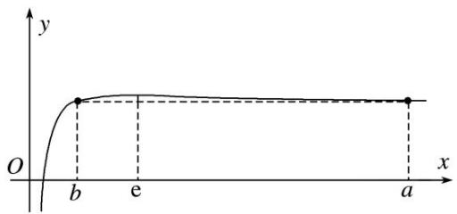
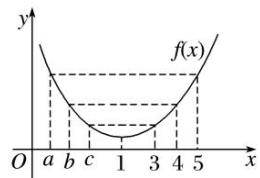
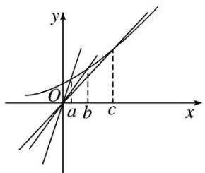
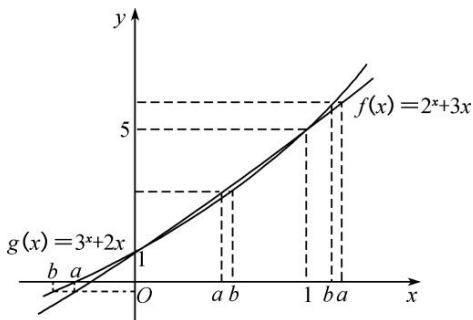

# 专题 07 构造函数法解决导数不等式问题(二)

考点四 构造 $F(x) = f(x)\pm g(x)$ ， $F(x) = f(x)g(x)$ ， $F(x) = \frac{f(x)}{g(x)}$ 类型的辅助函数

# 【方法总结】  
（1）若 $F(x)=f(x)+ax^{n}+b$ ，则 $F'(x)=f'(x)+nax^{n-1}$ ;  
（2）若 $F(x)=f(x)\pm g(x)$ ，则 $F'(x)=f'(x)\pm g'(x)$ ;  
（3）若 $F(x)=f(x)g(x)$ ，则 $F'(x)=f'(x)g(x)+f(x)g'(x)$ ;  
（4）若 $F(x)=\frac{f(x)}{g(x)}$ ，则 $F'(x)=\frac{f'(x)g(x)-f(x)g'(x)}{[g(x)]^{2}}$ .
由此得到结论:  
（1）出现 $f'(x)+nax^{n-1}$ 形式，构造函数 $F(x)=f(x)+ax^{n}+b$ ;  
（2）出现 $f'(x) \pm g'(x)$ 形式，构造函数 $F(x) = f(x) \pm g(x)$ ;  
（3）出现 $f'(x)g(x)+f(x)g'(x)$ 形式，构造函数 $F(x)=f(x)g(x)$ ;  
（4）出现 $f'(x)g(x)-f(x)g'(x)$ 形式，构造函数 $F(x)=\frac{f(x)}{g(x)}$ .

# 【例题选讲】

[例 1]（1）函数 $f(x)$ 的定义域为 R， $f(-1)=3$ ，对任意 $x\in R$ ， $f'(x)<3$ ，则 $f(x)>3x+6$ 的解集为()

A. $\{x|-1<x<1\}$

B. $\{x|x>-1\}$

C. $\{x|x<-1\}$

D. R
答案 C 解析 设 $g(x)=f(x)-(3x+6)$ ，则 $g'(x)=f'(x)-3<0$ ，所以 $g(x)$ 为减函数，又 $g(-1)=f(-1)-3=0$ ，所以根据单调性可知 $g(x)>0$ 的解集是 $\{x|x<-1\}$ .  
（2）定义在 $\mathbf{R}$ 上的函数 $f(x)$ 满足 $f(1) = 1$ ，且对 $\forall x \in \mathbf{R}$ ， $f'(x) < \frac{1}{2}$ ，则不等式 $f(\log_2 x) > \frac{\log_2 x + 1}{2}$ 的解集为 \_\_\_\_.
答案 (0, 2) 解析 构造函数 $F(x) = f(x) - \frac{1}{2} x$ ，则 $F'(x) = f'(x) - \frac{1}{2} < 0$ ，∴ 函数 $F(x)$ 在 $\mathbf{R}$ 上是减函数。由 $f(1) = 1$ ，得 $F(1) = f(1) - \frac{1}{2} = 1 - \frac{1}{2} = \frac{1}{2}$ ，∴ $f(\log_2 x) > \frac{\log_2 x + 1}{2} \Leftrightarrow f(\log_2 x) - \frac{1}{2} \log_2 x > \frac{1}{2} \Leftrightarrow F(\log_2 x) > F(1) \Leftrightarrow \log_2 x < 1 \Leftrightarrow 0 < x < 2$ .  
（3）定义在 $\mathbf{R}$ 上的可导函数 $f(x)$ 满足 $f(1) = 1$ ，且 $2f'(x) > 1$ ，当 $x \in \left[-\frac{\pi}{2}, \frac{3\pi}{2}\right]$ 时，不等式 $f(2\cos x) > \frac{3}{2} - 2\sin^2\frac{x}{2}$ 的解集为（）

A. $\left(\frac{\pi}{3},\frac{4\pi}{3}\right)$

B. $\left(-\frac{\pi}{3},\frac{4\pi}{3}\right)$

C. $\left(0,\frac{\pi}{3}\right)$

D. $\left(-\frac{\pi}{3},\frac{\pi}{3}\right)$
答案 D 解析 令 $g(x) = f(x) - \frac{x}{2} - \frac{1}{2}$ ，则 $g'(x) = f'(x) - \frac{1}{2} > 0$ ，∴ $g(x)$ 在 $\mathbf{R}$ 上单调递增，且 $g(1) = f(1) - \frac{1}{2} - \frac{1}{2} = 0$ ，∵ $f(2\cos x) - \frac{3}{2} + 2\sin^2\frac{x}{2} = f(2\cos x) - \frac{2\cos x}{2} - \frac{1}{2} = g(2\cos x)$ ，∴ $f(2\cos x) > \frac{3}{2} - 2\sin^2\frac{x}{2}$ ，即 $g(2\cos x) > 0$ ，
∴ $2\cos x > 1$ ，又 $x \in \left[-\frac{\pi}{2}, \frac{3\pi}{2}\right]$ ，∴ $x \in \left(-\frac{\pi}{3}, \frac{\pi}{3}\right)$ .  
（4） $f(x)$ 是定义在 R 上的偶函数，当 $x \geq 0$ 时， $f'(x) > 2x$ 。若 $f(a - 2) - f(a) \geq 4 - 4a$ ，则实数 a 的取值范围是（）

A. $(-\infty, 1]$

B. $[1, +\infty)$

C. $(-\infty, 2]$

D. $[2, +\infty)$
答案 A 解析 令 $G(x) = f(x) - x^2$ ，则 $G'(x) = f'(x) - 2x$ 。当 $x \in [0, +\infty)$ 时， $G'(x) = f'(x) - 2x > 0$ ，∴ $G(x)$ 在 $[0, +\infty)$ 上是增函数。由 $f(a - 2) - f(a) \geq 4 - 4a$ ，得 $f(a - 2) - (a - 2)^2 \geq f(a) - a^2$ ，即 $G(a - 2) \geq G(a)$ ，又 $f(x)$ 是定义在 R 上的偶函数，知 $G(x)$ 是偶函数。故 $|a - 2| \geq |a|$ ，解得 $a \leq 1$ 。  
（5）已知 $f'(x)$ 是函数 $f(x)$ 的导数，且 $f(-x) = f(x)$ ，当 $x \geq 0$ 时， $f'(x) > 3x$ ，则不等式 $f(x) - f(x - 1) < 3x - \frac{3}{2}$ 的解集是（）

A. $\left(-\frac{1}{2},0\right)$

B. $\left(-\infty,-\frac{1}{2}\right)$

C. $\left(\frac{1}{2},+\infty\right)$

D. $\left(-\infty,\frac{1}{2}\right)$
答案 D 解析 设 $g(x)=f(x)-\frac{3}{2}x^{2}$ ，则 $g'(x)=f'(x)-3x$ 。因为当 $x\geq0$ 时， $f'(x)>3x$ ，所以当 $x\geq0$ 时， $g'(x)=f'(x)-3x>0$ ，即 $g(x)$ 在 $[0,+\infty)$ 上单调递增。因为 $f(-x)=f(x)$ ，所以 $g(-x)=f(-x)-\frac{3}{2}x^{2}=f(x)-\frac{3}{2}x^{2}=g(x)$ ，所以 $g(x)$ 是偶函数。因为 $f(x)-f(x-1)<3x-\frac{3}{2}$ ，所以 $f(x)-\frac{3}{2}x^{2}<f(x-1)-\frac{3}{2}(x-1)^{2}$ ，即 $g(x)<g(x-1)$ ，所以 $g(|x|)<g(|x-1|)$ ，则 $|x|<|x-1|$ ，解得 $x<\frac{1}{2}$ 。故选 D。  
（6）设 $f'(x)$ 是奇函数 $f(x)(x \in \mathbf{R})$ 的导数，当 $x > 0$ 时， $f(x) + f'(x) \cdot x \ln x < 0$ ，则不等式 $(x - 1)f(x) > 0$ 的解集为 \_\_\_\_.
答案 (0, 1) 解析 由于函数 $y = f(x)$ 为 $\mathbf{R}$ 上的奇函数，则 $f(0) = 0$ ，当 $x > 0$ 时， $f(x) + f'(x) \cdot x \ln x < 0$ ，则 $f(1) < 0$ 。当 $x > 0$ 时，构造函数 $g(x) = f(x) \ln x$ ，则 $g'(x) = f'(x) \ln x + f(x) \cdot \frac{1}{x} = \frac{f(x) + f'(x) \cdot x \ln x}{x} < 0$ ，所以函数 $y = g(x)$ 在区间 $(0, +\infty)$ 上单调递减，且 $g(1) = 0$ 。当 $0 < x < 1$ 时， $\ln x < 0$ ， $g(x) > g(1) = 0$ ，即 $f(x) \ln x > 0$ ，此时 $f(x) < 0$ ；当 $x > 1$ 时， $\ln x > 0$ ， $g(x) < g(1) = 0$ ，即 $f(x) \ln x < 0$ ，此时 $f(x) < 0$ 。又 $f(1) < 0$ ，所以当 $x > 0$ 时， $f(x) < 0$ 。由于函数 $y = f(x)$ 为 $\mathbf{R}$ 上的奇函数，当 $x < 0$ 时， $f(x) > 0$ ，对于不等式 $(x - 1)f(x) > 0$ ，当 $x < 0$ 时， $x - 1 < 0$ ，则 $f(x) < 0$ ，不符合题意；当 $0 < x < 1$ 时， $x - 1 < 0$ ，则 $f(x) < 0$ ，符合题意；当 $x > 1$ 时， $x - 1 > 0$ ，则 $f(x) > 0$ ，不符合题意。综上所述，不等式 $(x - 1)f(x) > 0$ 的解集为 $(0, 1)$ .  
（7）(多选)定义在 $(0, +\infty)$ 上的函数 $f(x)$ 的导函数为 $f'(x)$ ，且 $(x + 1)f'(x) - f(x) < x^2 + 2x$ 对任意 $x \in (0, +\infty)$ 恒成立。下列结论正确的是（）

A. $2f(2) - 3f(1) > 5$

B. 若 $f(1)=2,\quad x>1$ ，则 $f(x)>x^{2}+\frac{1}{2}x+\frac{1}{2}$

C. $f(3)-2f(1)<7$

D. 若 $f(1)=2,\quad0<x<1$ ，则 $f(x)>x^{2}+\frac{1}{2}x+\frac{1}{2}$
解析 CD 答案 设函数 $g(x)=\frac{f(x)-x^{2}}{x+1}$ ，则 $g'(x)=\frac{(x+1)f'(x)-f(x)-(x^{2}+2x)}{(x+1)^{2}}$ 。因为 $(x+1)f'(x)-f(x)$
$<x^{2}+2x$ 对任意 $x\in(0,+\infty)$ 恒成立，所以 $g'(x)<0$ ，故 $g(x)$ 在 $(0,+\infty)$ 上单调递减，从而 $g(1)>g(2)>g(3)$ ，整理得 $2f(2)-3f(1)<5$ ， $f(3)-2f(1)<7$ ，故 A 错误，C 正确。当 0<x<1 时，若 $f(1)=2$ ，因为 $g(x)$ 在 $(0,+\infty)$ 上单调递减，所以 $g(x)>g(1)=\frac{1}{2}$ ，即 $\frac{f(x)-x^{2}}{x+1}>\frac{1}{2}$ ，即 $f(x)>x^{2}+\frac{1}{2}x+\frac{1}{2}$ ，故 D 正确，从而 B 不正确。即结论正确的是 CD.  
（8）已知函数 $f(x)$ ，对 $\forall x \in \mathbf{R}$ ，都有 $f(-x) + f(x) = x^2$ ，在 $(0, +\infty)$ 上， $f'(x) < x$ ，若 $f(4 - m) - f(m) \geq 8 - 4m$ ，则实数 $m$ 的取值范围为（）

A. $[-2, 2]$

B. $[2, +\infty)$

C. $[0, +\infty)$

D. $(- \infty, -2] \cup [2, +\infty)$
答案 B 解析 因为对 $\forall x \in \mathbf{R}$ ，都有 $f(-x) + f(x) = x^2$ ，所以 $f(0) = 0$ ，设 $g(x) = f(x) - \frac{1}{2} x^2$ ，则 $g(-x) = f(-x) - \frac{1}{2} x^2$ ，所以 $g(x) + g(-x) = f(x) - \frac{1}{2} x^2 + f(-x) - \frac{1}{2} x^2 = 0$ ，又 $g(0) = f(0) - 0 = 0$ ，所以 $g(x)$ 为奇函数，且 $f(x) = g(x) + \frac{1}{2} x^2$ ，所以 $f(4-m) - f(m) = g(4-m) + \frac{1}{2}(4-m)^2 - \left[g(m) + \frac{1}{2} m^2\right] = g(4-m) - g(m) + 8 - 4m \geq 8 - 4m$ ，则 $g(4-m) - g(m) \geq 0$ ，即 $g(4-m) \geq g(m)$ . 当 $x > 0$ 时， $g'(x) = f'(x) - x < 0$ ，所以 $g(x)$ 在 $(0, +\infty)$ 上为减函数，又 $g(x)$ 为奇函数，所以 $4-m \leq m$ ，解得 $m \geq 2$ .  
（9）已知函数 $y = f(x)$ 是 $\mathbf{R}$ 上的可导函数，当 $x \neq 0$ 时，有 $f'(x) + \frac{f(x)}{x} > 0$ ，则函数 $F(x) = xf(x) + \frac{1}{x}$ 的零点个数是（）

A. 0

B. 1

C. 2

D. 3
答案 B 解析 依题意, 记 $g(x) = xf(x)$ , 则 $g'(x) = xf'(x) + f(x), g(0) = 0$ , 当 $x > 0$ 时, $g'(x) = x[f'(x) + \frac{f(x)}{x}] > 0$ , $g(x)$ 是增函数, $g(x) > 0$ ; 当 $x < 0$ 时, $g'(x) = x[f'(x) + \frac{f(x)}{x}] < 0$ , $g(x)$ 是减函数, $g(x) > 0$ . 在同一坐标系内画出函数 $y = g(x)$ 与 $y = -\frac{1}{x}$ 的大致图象, 结合图象可知, 它们共有 1 个公共点, 因此函数 $F(x) = xf(x) + \frac{1}{x}$ 的零点个数是 1.  
（10）函数 $f(x)$ 满足 $x^{2}f'(x)+2xf(x)=\frac{\mathrm{e}^{x}}{x}$ ， $f(2)=\frac{\mathrm{e}^{2}}{8}$ ，当 x>0 时， $f(x)$ 的极值状态是 \_\_\_\_.
答案 没有极大值也没有极小值 解析 因为 $x^{2}f'(x)+2xf(x)=\frac{e^{x}}{x}$ ，关键因为等式右边函数的原函数不容易找出，因此把等式左边函数的原函数找出来，设 $h(x)=x^{2}f(x)$ ，则 $h'(x)=\frac{e^{x}}{x}$ ，且 $h(2)=\frac{e^{2}}{2}$ ，因为 $x^{2}f'(x)+2xf(x)=\frac{e^{x}}{x}$ ，则 $f'(x)=\frac{e^{x}-2h(x)}{x^{3}}$ ，判断 $f(x)$ 的极值状态就是判断 $f'(x)$ 的正负，设 $g(x)=\mathrm{e}^{x}-2h(x)$ ，则 $g'(x)=\mathrm{e}^{x}-2h'(x)=\mathrm{e}^{x}-2\cdot\frac{\mathrm{e}^{x}}{x}=\mathrm{e}^{x}\cdot\frac{x-2}{x}$ ，这里涉及二阶导， $g(x)$ 在 x=2 处取得最小值 0，因此 $g(x)\geq0$ ，则 $f'(x)\geq0$ ，故 $f(x)$ 没有极大值也没有极小值（有难度，但不失为好题目）.

# 【对点训练】

1. 已知函数 $f(x)$ 的定义域为 $\mathbf{R}$ ， $f(-1) = 2$ ，且对任意 $x \in \mathbf{R}$ ， $f'(x) > 2$ ，则 $f(x) > 2x + 4$ 的解集为（）

A. $(-1, 1)$

B. $(-1, +\infty)$

C. $(-\infty, -1)$

D. $(-\infty, +\infty)$

1. 答案 B 解析 由 $f(x) > 2x + 4$ ，得 $f(x) - 2x - 4 > 0$ 。设 $F(x) = f(x) - 2x - 4$ ，则 $F'(x) = f'(x) - 2$ 。因为 $f'(x) > 2$ ，所以 $F'(x) > 0$ 在 R 上恒成立，所以 $F(x)$ 在 R 上单调递增。又 $F(-1) = f(-1) - 2 \times (-1) - 4 = 2 + 2 - 4 = 0$ ，故不等式 $f(x) - 2x - 4 > 0$ 等价于 $F(x) > F(-1)$ ，所以 $x > -1$ ，故选 B。

2. 已知函数 $f(x) (x \in \mathbf{R})$ 满足 $f(1) = 1$ ， $f(x)$ 的导数 $f'(x) < \frac{1}{2}$ ，则不等式 $f(x^2) < \frac{x^2}{2} + \frac{1}{2}$ 的解集为 \_\_\_\_.

2. 答案 $\{x|x<-1\text{ 或 }x>1\}$ 解析 设 $F(x)=f(x)-\frac{1}{2}x$ , $\therefore F'(x)=f'(x)-\frac{1}{2}$ , $\because f'(x)<\frac{1}{2}$ , $\therefore F'(x)=f'(x)-\frac{1}{2}<0$ , 即函数 $F(x)$ 在 $\mathbf{R}$ 上单调递减. $\because f(x^2)<\frac{x^2}{2}+\frac{1}{2}$ , $\therefore f(x^2)-\frac{x^2}{2}<f(1)-\frac{1}{2}$ , $\therefore F(x^2)<F(1)$ , 而函数 $F(x)$ 在 $\mathbf{R}$ 上单调递减, $\therefore x^2>1$ , 即不等式的解集为 $\{x|x<-1\text{ 或 }x>1\}$ .

3. 已知定义域为 $\mathbf{R}$ 的函数 $f(x)$ 的导数为 $f'(x)$ ，且满足 $f'(x) < 2x, f(2) = 3$ ，则不等式 $f(x) > x^2 - 1$ 的解集是（）

A. $(-\infty, -1)$

B. $(-1, +\infty)$

C. $(2, +\infty)$

D. $(-\infty, 2)$

3. 答案 D 解析 令 $g(x) = f(x) - x^2$ ，则 $g'(x) = f'(x) - 2x < 0$ ，即函数 $g(x)$ 在 R 上单调递减。又不等式 $f(x) > x^2 - 1$ 可化为 $f(x) - x^2 > -1$ ，而 $g(2) = f(2) - 2^2 = 3 - 4 = -1$ ，所以不等式可化为 $g(x) > g(2)$ ，故不等式的解集为 $(- \infty, 2)$ 。故选 D。

4. 定义在 $(0, +\infty)$ 上的函数 $f(x)$ 满足 $x^{2} f'(x) + 1 > 0$ , $f(1) = 4$ , 则不等式 $f(x) > \frac{1}{x} + 3$ 的解集为 \_\_\_\_.

4. 解析 $(1, +\infty)$ 答案 由 $x^{2}f(x) + 1 > 0$ 得 $f'(x) + \frac{1}{x^2} > 0$ ，构造函数 $g(x) = f(x) - \frac{1}{x} - 3$ ，则 $g'(x) = f'(x) + \frac{1}{x^2} > 0$ ，即 $g(x)$ 在 $(0, +\infty)$ 上是增函数。又 $f(1) = 4$ ，则 $g(1) = f(1) - 1 - 3 = 0$ ，从而 $g(x) > 0$ 的解集为 $(1, +\infty)$ ，即 $f(x) > \frac{1}{x} + 3$ 的解集为 $(1, +\infty)$ 。

5. 设 $f(x)$ 为 $\mathbf{R}$ 上的奇函数，当 $x \geq 0$ 时， $f'(x) - \cos x < 0$ ，则不等式 $f(x) < \sin x$ 的解集为 \_\_\_\_.

5. 答案 $(0, +\infty)$ 解析 令 $\varphi(x) = f(x) - \sin x$ ， $\therefore$ 当 $x \geq 0$ 时， $\varphi'(x) = f'(x) - \cos x < 0$ ， $\therefore \varphi(x)$ 在 $[0, +\infty)$ 上单调递减，又 $f(x)$ 为 $\mathbf{R}$ 上的奇函数， $\therefore \varphi(x)$ 为 $\mathbf{R}$ 上的奇函数， $\therefore \varphi(x)$ 在 $(- \infty, 0]$ 上单调递减，故 $\varphi(x)$ 在 $\mathbf{R}$ 上单调递减且 $\varphi(0) = 0$ ，不等式 $f(x) < \sin x$ 可化为 $f(x) - \sin x < 0$ ，即 $\varphi(x) < 0$ ，即 $\varphi(x) < \varphi(0)$ ，故 $x > 0$ ， $\therefore$ 原不等式的解集为 $(0, +\infty)$ .

6. 设 $f(x)$ 和 $g(x)$ 分别是定义在 $\mathbf{R}$ 上的奇函数和偶函数， $f'(x)$ ， $g'(x)$ 分别为其导数，当 $x < 0$ 时， $f'(x)g(x) + f(x)g'(x) > 0$ ，且 $g(-3) = 0$ ，则不等式 $f(x)g(x) < 0$ 的解集是（）

A. $(-3, 0) \cup (3, +\infty)$

B. $(-3, 0) \cup (0, 3)$

C. $(- \infty, -3) \cup (3, +\infty)$

D. $(-\infty, -3) \cup (0, 3)$

6. 答案 D 解析 令 $h(x) = f(x)g(x)$ ，当 $x < 0$ 时， $h'(x) = f'(x)g(x) + f(x)g'(x) > 0$ ，则 $h(x)$ 在 $(- \infty, 0)$ 上单调递增，又 $f(x)$ ， $g(x)$ 分别是定义在 R 上的奇函数和偶函数，所以 $h(x)$ 为奇函数，所以 $h(x)$ 在 $(0, +\infty)$ 上单调递增。又由 $g(-3) = 0$ ，可得 $h(-3) = -h(3) = 0$ ，所以当 $x < -3$ 或 $0 < x < 3$ 时， $h(x) < 0$ ，故选 D。

7. 设 $f(x)$ , $g(x)$ 是定义在 $\mathbf{R}$ 上的恒大于 0 的可导函数, 且 $f'(x)g(x) - f(x)g'(x) < 0$ , 则当 $a < x < b$ 时, 有( )

A. $f(x)g(x) > f(b)g(b)$

B. $f(x)g(a) > f(a)g(x)$

C. $f(x)g(b) > f(b)g(x)$

D. $f(x)g(x) > f(a)g(a)$

7. 解析 C 答案 令 $F(x) = \frac{f(x)}{g(x)}$ ，则 $F'(x) = \frac{f'(x)g(x) - f(x)g'(x)}{[g(x)]^2} < 0$ ，所以 $F(x)$ 在 R 上单调递减。又 $a < x < b$ ，所以 $\frac{f(a)}{g(a)} > \frac{f(x)}{g(x)} > \frac{f(b)}{g(b)}$ 。又 $f(x) > 0$ ， $g(x) > 0$ ，所以 $f(x)g(b) > f(b)g(x)$ 。

8. 设函数 $f(x)$ 在 $\mathbf{R}$ 上存在导数 $f'(x)$ ，对任意 $x \in \mathbf{R}$ ，都有 $f(-x) + f(x) = x^2$ ，在 $(0, +\infty)$ 上 $f'(x) < x$ ，若 $f(2 - m) + f(-m) - m^2 + 2m - 2 \geq 0$ ，则实数 $m$ 的取值范围为

8. 答案 $[1, +\infty)$ 解析 令 $g(x) = f(x) - \frac{x^2}{2}$ , 则 $g(-x) + g(x) = 0$ , $g(x)$ 是 $\mathbf{R}$ 上的奇函数。又当 $x \in (0, +\infty)$ 时, $g'(x) = f'(x) - x < 0$ , 所以 $g(x)$ 在 $(0, +\infty)$ 上单调递减, 所以 $g(x)$ 是 $\mathbf{R}$ 上的单调减函数。原不等式等价于 $g(2 - m) + g(-m) \geq 0$ , $g(2 - m) \geq -g(-m) = g(m)$ , 所以 $2 - m \leq m$ , $m \geq 1$ 。

9. 已知 $f(x)$ 是定义在 $\mathbf{R}$ 上的减函数，其导函数 $f'(x)$ 满足 $\frac{f(x)}{f'(x)} + x < 1$ ，则下列结论正确的是（）

A. 对于任意 $x \in R$ ， $f(x) < 0$

B. 对于任意 $x \in \mathbf{R}$ , $f(x) > 0$

C. 当且仅当 $x \in (-\infty, 1)$ , $f(x) < 0$

D. 当且仅当 $x \in (1, +\infty)$ , $f(x) > 0$

9. 答案 B 解析 $\because\frac{f(x)}{f'(x)}+x<1,\ f(x)$ 是定义在 R 上的减函数， $f'(x)<0,\ \therefore f(x)+xf'(x)>f'(x),\ \therefore f(x)+(x-1)f'(x)>0,\ \therefore [(x-1)f(x)]'>0,\ \therefore$ 函数 $y=(x-1)f(x)$ 在 R 上单调递增，而 x=1 时，y=0，则 x<1 时，y<0，故 $f(x)>0.\ x>1$ 时，x-1>0，y>0，故 $f(x)>0,\ \therefore f(x)>0$ 对任意 $x\in R$ 成立，故选 B.

10. 已知 $y = f(x)$ 为 $\mathbf{R}$ 上的可导函数，当 $x \neq 0$ 时， $f(x) + \frac{f(x)}{x} > 0$ ，若 $g(x) = f(x) + \frac{1}{x}$ ，则函数 $g(x)$ 的零点个数为（）

A. 1

B. 2

C. 0

D. 0 或 2

10. 答案 C 解析 令 $h(x) = xf(x)$ ，因为当 $x \neq 0$ 时， $\frac{xf'(x) + f(x)}{x} > 0$ ，所以 $\frac{h'(x)}{x} > 0$ ，因此当 $x > 0$ 时， $h'(x) > 0$ ，当 $x < 0$ 时， $h'(x) < 0$ ，又 $h(0) = 0$ ，易知当 $x \neq 0$ 时， $h(x) > 0$ ，又 $g(x) = \frac{h(x) + 1}{x}$ ，所以 $g(x) \neq 0$ ，故函数 $g(x)$ 的零点个数为 0

# 考点五 构造具体函数关系式

# 【方法总结】

这类题型需要根据题意构造具体的函数关系式，通过具体的关系式去解决不等式及求值问题.

# 【例题选讲】

[例 1] （1） (2020·全国 I) 若 $2^{a} + \log_{2}a = 4^{b} + 2\log_{4}b$ ，则()

A. a>2b

B. $a <   2b$

C. $a > b^{2}$

D. $a < b^{2}$
答案 B 解析 由指数和对数的运算性质得 $2^{a} + \log_{2}a = 4^{b} + 2\log_{4}b = 2^{2b} + \log_{2}b$ 。令 $f(x) = 2^{x} + \log_{2}x$ ，则 $f(x)$ 在 $(0, +\infty)$ 上单调递增。又 $\because 2^{2b} + \log_{2}b < 2^{2b} + \log_{2}b + 1 = 2^{2b} + \log_{2}(2b)$ ， $\therefore 2^{a} + \log_{2}a < 2^{2b} + \log_{2}(2b)$ ，即 $f(a) < f(2b)$ ， $\therefore a < 2b$ 。故选 B.  
（2）已知 $\alpha$ ， $\beta \in \left[-\frac{\pi}{2},\frac{\pi}{2}\right]$ ，且 $\alpha \sin \alpha -\beta \sin \beta >0$ ，则下列结论正确的是（

A. $\alpha >\beta$

B. $\alpha^{2}>\beta^{2}$

C. $\alpha<\beta$

D. $\alpha +\beta >0$
答案 B 解析 构造函数 $f(x)=x\sin x$ ，则 $f'(x)=\sin x+x\cos x$ 。当 $x\in\left[0,\frac{\pi}{2}\right]$ 时， $f'(x)\geq0$ ， $f(x)$ 是增函数，当 $x\in\left[-\frac{\pi}{2},0\right]$ 时， $f'(x)<0$ ， $f(x)$ 是减函数，又 $f(x)$ 为偶函数，∴ $\alpha\sin\alpha-\beta\sin\beta>0\Leftrightarrow\alpha\sin\alpha>\beta\sin\beta\Leftrightarrow f(\alpha)>f(\beta)\Leftrightarrow f(|\alpha|)>f(|\beta|)\Leftrightarrow|\alpha|>|\beta|\Leftrightarrow\alpha^{2}>\beta^{2}$ ，故选 B.  
（3）(多选)若 $0<x_{1}<x_{2}<1$ ，则()

A. $x_{1} + \ln x_{2} > x_{2} + \ln x_{1}$

B. $x_{1} + \ln x_{2} <   x_{2} + \ln x_{1}$

C. $x_{2}e^{x_{1}}>x_{1}e^{x_{2}}$

D. $x_{2}e^{x_{1}}<x_{1}e^{x_{2}}$
答案 AC 解析 令 $f(x) = x - \ln x$ ， $\therefore f'(x) = 1 - \frac{1}{x} = \frac{x - 1}{x}$ ，当 $0 < x < 1$ 时， $f(x) < 0$ ， $\therefore f(x)$ 在(0, 1)上单调递减。 $\because 0 < x_1 < x_2 < 1$ ， $\therefore f(x_2) < f(x_1)$ ，即 $x_2 - \ln x_2 < x_1 - \ln x_1$ ，即 $x_1 + \ln x_2 > x_2 + \ln x_1$ 。设 $g(x) = \frac{\mathrm{e}^x}{x}$ ，则 $g'(x) = \frac{x\mathrm{e}^x - \mathrm{e}^x}{x^2} = \frac{\mathrm{e}^x(x - 1)}{x^2}$ 。当 $0 < x < 1$ 时， $g'(x) < 0$ ，即 $g(x)$ 在(0, 1)上单调递减， $\because 0 < x_1 < x_2 < 1$ ， $\therefore g(x_2) < g(x_1)$ ，即 $\frac{\mathrm{e}^{x_2}}{x_2} < \frac{\mathrm{e}^{x_1}}{x_1}$ ， $\therefore x_2\mathrm{e}^{x_1} > x_1\mathrm{e}^{x_2}$ ，故选 AC.  
（4）已知函数 $f(x) = \frac{\mathrm{e}^x}{x} - ax, x \in (0, +\infty)$ ，当 $x_2 > x_1$ 时，不等式 $\frac{f(x_1)}{x_2} - \frac{f(x_2)}{x_1} < 0$ 恒成立，则实数 $a$ 的取值范围是（）

A. $(-\infty, e]$

B. $(-∞, e)$

C. $(-∞,\frac{e}{2})$

D. $(-∞, \frac{e}{2}]$
答案 D 解析 由 $\frac{f(x_{1})}{x_{2}}-\frac{f(x_{2})}{x_{1}}<0$ ，得 $x_{1}f(x_{1})<x_{2}f(x_{2})$ ，令 $g(x)=xf(x)$ ，则 $g(x)$ 在 $(0,+\infty)$ 上调递增，又因为 $g(x)=e^{x}-ax^{2}$ ，所以 $g'(x)=e^{x}-2ax\geq0$ ，在 $(0,+\infty)$ 上恒成立，即 $a\leq\frac{e^{x}}{2x}$ ，令 $h(x)=\frac{e^{x}}{2x}$ ，则 $h'(x)=\frac{e^{x}(x-1)}{2x^{2}}$ ，令 $h'(x)=0$ ，则 $h(x)$ 在 $(0,1)$ 单调递减，在 $(1,+\infty)$ 单调递增，所以 $h(x)_{\min}=h(1)=\frac{e}{2}$ ，选D.  
（5）(多选)若实数 $a \geq 2$ ，则下列不等式中一定成立的是（ ）

A. $(a+1)^{a+2}>(a+2)^{a+1}$

B. $\log_{a}(a+1)>\log_{a+1}(a+2)$

C. $\log_{a}(a+1)<\frac{a+1}{a}$

D. $\log_{a+1}(a+2)<\frac{a+2}{a+1}$
答案 ABD 解析 若 A 成立，则 $(a+1)^{a+2}>(a+2)^{a+1}$ ，两边取自然对数，得 $(a+2)\ln(a+1)>(a+1)\ln(a+2)$ ，因为 $a\geq2$ ，所以 $\frac{\ln(a+1)}{a+1}>\frac{\ln(a+2)}{a+2}$ 。令 $f(x)=\frac{\ln x}{x}$ ，则 $x\geq3$ ， $f'(x)=\frac{1-\ln x}{x^{2}}<0$ ，故 $f(x)$ 在 $[3,+\infty)$ 上单调递减，所以 $\frac{\ln(a+1)}{a+1}>\frac{\ln(a+2)}{a+2}$ ，故 A 成立；若 B 成立，则 $\log_{a}(a+1)>\log_{a+1}(a+2)$ ，即 $\frac{\ln(a+1)}{\ln a}>\frac{\ln(a+2)}{\ln(a+1)}$ ，设 $g(x)=\frac{\ln(x+1)}{\ln x}$ ， $x\geq2$ ，则 $g'(x)=\frac{\frac{\ln x}{x+1}-\frac{\ln(x+1)}{x}}{(\ln x)^{2}}=\frac{x\ln x-(x+1)\ln(x+1)}{x\cdot(x+1)(\ln x)^{2}}$ ，令 $h(x)=x\ln x$ ， $x\geq2$ ，则 $h'(x)=\ln x+1>0$ ，故 $h(x)$ 在 $[2,+\infty)$ 上单调递增，所以 $x\ln x-(x+1)\ln(x+1)<0$ ，所以 $g'(x)<0$ ，故 $g(x)$ 在 $[2,+\infty)$ 上单调递增。

单调递减，所以 $\frac{\ln(a + 1)}{\ln a} >\frac{\ln(a + 2)}{\ln(a + 1)}$ ，故B成立；若C成立，则 $\log_a(a + 1) <   \frac{a + 1}{a}$ 即 $\frac{\ln(a + 1)}{a + 1} <  \frac{\ln a}{a}$ ，由A知 $f(x) = \frac{\ln x}{x}$ 在[2,e)上单调递增，在(e, $+\infty)$ 上单调递减，取 $a = 2$ ，故C不成立；若D成立，则 $\log_{a + 1}(a + 2) <   \frac{a + 2}{a + 1}$ 即 $\frac{\ln(a + 2)}{a + 2} <  \frac{\ln(a + 1)}{a + 1}$ ，由A知D成立．故选ABD.  
（6） (2021·全国乙) 设 $a = 2\ln 1.01$ ， $b = \ln 1.02$ ， $c = \sqrt{1.04} - 1$ ，则()

A. a<b<c

B. b<c<a

C. b<a<c

D. $c < a < b$
答案 B 解析 $b-c=\ln1.02-\sqrt{1.04}+1$ ，设 $f(x)=\ln(x+1)-\sqrt{1+2x}+1$ ，则 $b-c=f(0.02)$ ， $f'(x)=\frac{1}{x+1}-\frac{2}{2\sqrt{1+2x}}=\frac{\sqrt{1+2x}-(x+1)}{(x+1)\sqrt{1+2x}}$ ，当 x>0 时， $x+1=\sqrt{(x+1)^{2}}>\sqrt{1+2x}$ ，故当 x>0 时， $f'(x)=\frac{\sqrt{1+2x}-(x+1)}{(x+1)\sqrt{1+2x}}<0$ ，所以 $f(x)$ 在 $(0,+\infty)$ 上单调递减，所以 $f(0.02)<f(0)=0$ ，即 b<c。 $a-c=2\ln1.01-\sqrt{1.04}+1$ ，设 $g(x)=2\ln(x+1)-\sqrt{1+4x}+1$ ，则 $a-c=g(0.01)$ ， $g'(x)=\frac{2}{x+1}-\frac{4}{2\sqrt{1+4x}}=\frac{2[\sqrt{1+4x}-(x+1)]}{(x+1)\sqrt{1+4x}}$ ，当 0<x<2 时， $\sqrt{4x+1}=\sqrt{2x+2x+1}>\sqrt{x^{2}+2x+1}=\sqrt{(x+1)^{2}}=x+1$ ，故当 0<x<2 时， $g'(x)>0$ ，所以 $g(x)$ 在 $(0,2)$ 上单调递增，所以 $g(0.01)>g(0)=0$ ，故 c<a，从而有 b<c<a，故选 B.  
（7）已知函数 $f(x)$ 的定义域为 $(0, +\infty)$ ，导函数为 $f'(x)$ ，若 $xf'(x) - f(x) = x \ln x$ ，且 $f\left(\frac{1}{e}\right) = \frac{1}{e}$ ，则（）

A. $f\left(\frac{1}{e}\right)=0$

B. $f(x)$ 在 $x = \frac{1}{\mathrm{e}}$ 处取得极大值

C. $0 <   f(1) <   1$

D. $f(x)$ 在 $(0, +\infty)$ 上单调递增
答案 ACD 解析 由题知函数 $f(x)$ 的定义域为 $(0, +\infty)$ ，导函数为 $f'(x)$ ， $xf'(x) - f(x) = x \ln x$ ，即满足 $\frac{x f'(x) - f(x)}{x^2} = \frac{\ln x}{x}$ 。因为 $\left[\frac{f(x)}{x}\right]' = \frac{x f'(x) - f(x)}{x^2}$ ，所以 $\left[\frac{f(x)}{x}\right]' = \frac{\ln x}{x}$ ，所以可设 $\frac{f(x)}{x} = \frac{1}{2} \ln^2 x + b$ （ $b$ 为常数），所以 $f(x) = \frac{1}{2} x \ln^2 x + bx$ 。因为 $f\left(\frac{1}{e}\right) = \frac{1}{2} \cdot \frac{1}{e} \ln^2 \frac{1}{e} + \frac{b}{e} = \frac{1}{e}$ ，解得 $b = \frac{1}{2}$ ，所以 $f(x) = \frac{1}{2} x \ln^2 x + \frac{1}{2} x$ ，所以 $f(1) = \frac{1}{2}$ ，满足 $0 < f(1) < 1$ ，所以 C 正确；因为 $f'(x) = \frac{1}{2} \ln^2 x + \ln x + \frac{1}{2} = \frac{1}{2} (\ln x + 1)^2 \geq 0$ ，且仅有 $f'\left(\frac{1}{e}\right) = 0$ ，所以 B 错误，A，D 正确。故选 ACD。

# 【对点训练】

1. 若 $a = \frac{\ln 2}{2}, b = \frac{\ln 3}{3}, c = \frac{\ln 6}{6}$ ，则（）

A. a<b<c

B. c<b<a

C. c<a<b

D. b<a<c

1. 答案 C 解析 设 $f(x)=\frac{\ln x}{x}$ ，则 $f'(x)=\frac{1-\ln x}{x^{2}}$ ，所以 $f(x)$ 在 $(0, e)$ 上单调递增，在 $(e, +\infty)$ 上单调递减，即有 $f(6)<f(4)<f(3)$ ，所以 $\frac{\ln 6}{6}<\frac{\ln 4}{4}=\frac{\ln 2}{2}<\frac{\ln 3}{3}$ ，故 c<a<b.

2. 设 $a, b > 0$ ，则“ $a > b$ ”是“ $a^a > b^b$ ”的（）

A. 充分不必要条件

B. 必要不充分条件

C. 充要条件

D. 既不充分也不必要条件

2. 答案 D 解析 因为 $a, b > 0$ ，由 $a^a > b^b$ 可得 $a \ln a > b \ln b$ . 设函数 $f(x) = x \ln x$ ，则 $f'(x) = \ln x + 1$ ，由 $f'(x) > 0$ 可得 $x > \frac{1}{e}$ ，所以函数 $f(x) = x \ln x$ 在 $\left[0, \frac{1}{e}\right]$ 上单调递减，在 $\left[\frac{1}{e}, +\infty\right]$ 上单调递增，所以 $a > b$ 不一定有 $a \ln a > b \ln b$ ，即 $a^a > b^b$ ，所以充分性不成立；当 $a^a > b^b$ ，即 $a \ln a > b \ln b$ 时，不一定有 $a > b$ ，所以必要性不成立，所以“ $a > b$ ”是“ $a^a > b^b$ ”的既不充分也不必要条件，故选 D.

3. 已知 $0 < x_{1} < x_{2} < 1$ ，则（）

A. $\frac{\ln x_{1}}{x_{2}} > \frac{\ln x_{2}}{x_{1}}$

B. $\frac{\ln x_1}{x_2} < \frac{\ln x_2}{x_1}$

C. $x_{2}\ln x_{1}>x_{1}\ln x_{2}$

D. $x_{2} \ln x_{1} < x_{1} \ln x_{2}$

3. 答案 D 解析 设 $f(x)=x\ln x$ ，则 $f'(x)=\ln x+1$ ，由 $f'(x)>0$ ，得 $x>\frac{1}{e}$ ，所以函数 $f(x)$ 在 $\left(\frac{1}{e},+\infty\right)$ 上单调递增；由 $f'(x)<0$ ，得 $0<x<\frac{1}{e}$ ，函数 $f(x)$ 在 $\left(0,\frac{1}{e}\right)$ 上单调递减，故函数 $f(x)$ 在 $(0,1)$ 上不单调，所以 $f(x_{1})$ 与 $f(x_{2})$ 的大小无法确定，从而排除 A，B；设 $g(x)=\frac{\ln x}{x}$ ，则 $g'(x)=\frac{1-\ln x}{x^{2}}$ ，由 $g'(x)>0$ ，得 0<x<e，即函数 $g(x)$ 在 $(0,e)$ 上单调递增，故函数 $g(x)$ 在 $(0,1)$ 上单调递增，所以 $g(x_{1})<g(x_{2})$ ，即 $\frac{\ln x_{1}}{x_{1}}<\frac{\ln x_{2}}{x_{2}}$ ，所以 $x_{2}\ln x_{1}<x_{1}\ln x_{2}$ 。故选 D.

4. 已知 $a > b > 0$ , $a^b = b^a$ , 有如下四个结论: （1） $b < e$ ; （2） $b > e$ ; （3） 存在 $a$ , $b$ 满足 $a \cdot b < e^2$ ; （4） 存在 $a$ , $b$ 满足 $a \cdot b > e^2$ , 则正确结论的序号是( )

A. （1）（3）

B. （2）（3）

C. （1）（4）

D. （2）（4）

4. 答案 C 解析 由 $a^b = b^a$ 两边取对数得 $b \ln a = a \ln b \Rightarrow \frac{\ln a}{a} = \frac{\ln b}{b}$ . 对于 $y = \frac{\ln x}{x}$ , 由图象易知当 $b < e < a$ 时, 才可能满足题意. 故（1）正确, （2）错误; 另外, 由 $a^b = b^a$ , 令 $a = 4$ , $b = 2$ , 则 $a > e$ , $b < e$ , $ab = 8 > e^2$ , 故（4）正确, （3）错误. 因此, 选 C.

5. 设 $x, y, z$ 为正数，且 $2^{x} = 3^{y} = 5^{z}$ ，则（）

A. 2x<3y<5z

B. 5z<2x<3y

C. 3y<5z<2x

D. 3y<2x<5z

5. 答案 D 解析 令 $2^{x} = 3^{y} = 5^{z} = t(t > 1)$ ，两边取对数得 $x = \log_{2}t = \frac{\ln t}{\ln 2}$ ， $y = \log_{3}t = \frac{\ln t}{\ln 3}$ ， $z = \log_{5}t = \frac{\ln t}{\ln 5}$ ，从而 $2x = \frac{2}{\ln 2}\ln t$ ， $3y = \frac{3}{\ln 3}\ln t$ ， $5z = \frac{5}{\ln 5}\ln t$ 。由 $t > 1$ 知，要比较三者大小，只需比较 $\frac{2}{\ln 2}, \frac{3}{\ln 3}, \frac{5}{\ln 5}$ 的大小。又 $\frac{2}{\ln 2} = \frac{4}{\ln 4}$ ， $e < 3 < 4 < 5$ ，由 $y = \frac{\ln x}{x}$ 在 $(e, +\infty)$ 上单调递减可知， $\frac{\ln 3}{3} > \frac{\ln 4}{4} > \frac{\ln 5}{5}$ ，从而 $\frac{3}{\ln 3} < \frac{4}{\ln 4} < \frac{5}{\ln 5}$ ，

3y<2x<5z，故选 D.

6. 已知 $a < 5$ 且 $a \mathrm{e}^{5} = 5 \mathrm{e}^{a}$ , $b < 4$ 且 $b \mathrm{e}^{4} = 4 \mathrm{e}^{b}$ , $c < 3$ 且 $c \mathrm{e}^{3} = 3 \mathrm{e}^{c}$ , 则( )

A. $c < b < a$

B. b<c<a

C. $a < c < b$

D. a<b<c

6. 答案 D 解析 方法一 由已知 $\frac{\mathrm{e}^5}{5} = \frac{\mathrm{e}^a}{a}, \frac{\mathrm{e}^4}{4} = \frac{\mathrm{e}^b}{b}$ ,

$\frac{e^{3}}{3}=\frac{e^{c}}{c}$ ，设 $f(x)=\frac{e^{x}}{x}$ ，则 $f'(x)=\frac{(x-1)e^{x}}{x^{2}}$ ，所以 $f(x)$ 在(0，1)上单调递减，在 $(1,+\infty)$ 上单调递增，所以 $f(3)<f(4)<f(5)$ ， $f(c)<f(b)<f(a)$ ，所以a<b<c.
方法二 设 $e^{x}=\frac{e^{5}}{5}x$ ，①， $e^{x}=\frac{e^{4}}{4}x$ ，②， $e^{x}=\frac{e^{3}}{3}x$ ，③，a, b, c 依次为方程①②③的根，结合图象，方程的根可以看作两个图象的交点的横坐标， $\because\frac{e^{5}}{5}>\frac{e^{4}}{4}>\frac{e^{3}}{3}$ ，由图可知 a<b<c.

7. 若 $0 < x_{1} < x_{2} < a$ ，都有 $x_{2} \ln x_{1} - x_{1} \ln x_{2} \leqslant x_{1} - x_{2}$ 成立，则 $a$ 的最大值为（ ）

A. $\frac{1}{2}$

B. 1

C. e

D. 2e

7. 答案 B 解析 $\frac{\ln x_1}{x_1} - \frac{\ln x_2}{x_2} \leq \frac{1}{x_2} - \frac{1}{x_1}$ ，即 $\frac{\ln x_1}{x_1} + \frac{1}{x_1} \leq \frac{\ln x_2}{x_2} + \frac{1}{x_2}$ ，令 $f(x) = \frac{\ln x}{x} + \frac{1}{x}$ ，则 $f(x)$ 在 $(0, a)$ 上为增函数，所以 $f'(x) \geq 0$ 在 $(0, a)$ 上恒成立， $f'(x) = \frac{-\ln x}{x^2}$ ，令 $f'(x) = 0$ ，解得 $x = 1$ ，所以 $f(x)$ 在 $(0, 1)$ 上为增函数，在 $(1, +\infty)$ 上为减函数，所以 $a \leq 1$ ，所以 $a$ 的最大值为 1，选 B.

8. 下列四个命题：① $\ln 5 < \sqrt{5} \ln 2$ ；② $\ln \pi > \sqrt{\frac{\pi}{e}}$ ；③ $2^{\sqrt{11}} < 11$ ；④ $3 \ln 2 > 4\sqrt{2}$ 。其中真命题的个数是（）

A. 1

B. 2

C. 3

D. 4

8. 答案 B 解析 构造函数 $f(x) = \frac{\ln x}{x}$ ，则 $f'(x) = \frac{1 - \ln x}{x^2}$ ，当 $x \in (0, e)$ 时， $f'(x) > 0$ ， $f(x)$ 单调递增；当 $x \in (e, +\infty)$ 时， $f'(x) < 0$ ， $f(x)$ 单调递减。① $\ln 5 < \sqrt{5} \ln 2 \Rightarrow 2 \ln \sqrt{5} < \sqrt{5} \ln 2 \Rightarrow \frac{\ln \sqrt{5}}{\sqrt{5}} < \frac{\ln 2}{2}$ ，又 $2 < \sqrt{5} < e$ ，故错误。② $\ln \pi > \sqrt{\frac{\pi}{e}} \Rightarrow 2 \ln \sqrt{\pi} > \frac{\sqrt{\pi}}{\sqrt{e}} \Rightarrow \frac{\ln \sqrt{\pi}}{\sqrt{\pi}} > \frac{\frac{1}{2}}{\sqrt{e}} = \frac{\ln \sqrt{e}}{\sqrt{e}}$ ，又 $e > \sqrt{\pi} > \sqrt{e}$ ，故正确。③ $2^{\sqrt{11}} < 11 \Rightarrow \sqrt{11} \ln 2 < \ln 11 = 2 \ln \sqrt{11} \Rightarrow \frac{\ln 2}{2}$
$= \frac{\ln 4}{4} < \frac{\ln\sqrt{11}}{\sqrt{11}}$ ，又 $4 > \sqrt{11} > e$ ，故正确．④ $3\mathrm{e}\ln 2 > 4\sqrt{2}\Rightarrow 2\mathrm{e}\ln 2^{\frac{3}{2}} > 2\times 2^{\frac{3}{2}}\Rightarrow \frac{\ln 2^{\frac{3}{2}}}{2^{\frac{3}{2}}} >\frac{\ln e}{e}$ ，显然错误．因此选B.

9. 已知函数 $f(x) = e^{x} + m\ln x (x \in \mathbf{R})$ ，若对任意正数 $x_{1}, x_{2}$ ，当 $x_{1} > x_{2}$ 时，都有 $f(x_{1}) - f(x_{2}) > x_{1} - x_{2}$ 成立，则实数 $m$ 的取值范围是 \_\_\_\_.

9. 答案 $m \geqslant 0$ 解析 由 $f(x_{1}) - f(x_{2}) > x_{1} - x_{2}$ 得， $f(x_{1}) - x_{1} > f(x_{2}) - x_{2}$ ，令 $g(x) = f(x) - x$ ，所以 $g(x_{1}) > g(x_{2})$ ，所以 $g(x)$ 在 $(0, +\infty)$ 单调递增，又 $g(x) = f(x) - x = e^{x} + m\ln x - x$ ，所以 $g'(x) = e^{x} + \frac{m}{x} - 1 \geq 0$ ，在 $(0, +\infty)$ 上恒成立，即 $m \geq (1 - e^{x})x$ ，令 $h(x) = (1 - e^{x})x$ ，则 $h'(x) = -e^{x}(x + 1) + 1 < 0$ ，所以 $h(x)$ 在 $(0, +\infty)$ 单调递减，所以 $h(x)_{min} = 0$ （但取不到）。所以 $m \geq 0$ 。

10. 若实数 $a, b$ 满足 $2^{a} + 3a = 3^{b} + 2b$ ，则下列关系式中可能成立的是（）

A. $0 < a < b < 1$

B. $b < a < 0$

C. $1 < a < b$

D. a=b

10. 答案 ABD 解析 因为实数 $a, b$ 满足 $2^{a} + 3a = 3^{b} + 2b$ ，所以设 $f(x) = 2^{x} + 3x, g(x) = 3^{x} + 2x$ ，在同一平面直角坐标系中作出 $f(x)$ 与 $g(x)$ 的图象如图所示。由图象可知：①当 $x < 0$ 时， $f(x) < g(x)$ ，所以当 $2^{a} + 3a = 3^{b} + 2b$ 时， $b < a < 0$ ，故 B 正确；②当 $x = 0$ 或 1 时， $f(x) = g(x)$ ，所以当 $2^{a} + 3a = 3^{b} + 2b$ 时， $a = b = 0$ 或 $a = b = 1$ ，故 D 正确；③当 $0 < x < 1$ 时， $f(x) > g(x)$ ，所以当 $2^{a} + 3a = 3^{b} + 2b$ 时， $0 < a < b < 1$ ，故 A 正确；④当 $x > 1$ 时， $f(x) < g(x)$ ，所以当 $2^{a} + 3a = 3^{b} + 2b$ 时， $1 < b < a$ ，故 C 错误。故选 ABD。

11. 已知函数 $f(x) = \frac{\mathrm{e}^x}{x} - ax, x \in (0, +\infty)$ ，当 $x_2 > x_1$ 时，不等式 $\frac{f(x_1)}{x_2} < \frac{f(x_2)}{x_1}$ 恒成立，则实数 $a$ 的取值范围为（）

A. $(-\infty, e]$

B. $(-\infty, e)$

C. $\left(-\infty,\frac{e}{2}\right)$

D. $\left[-\infty,\frac{e}{2}\right]$

11. 答案 D 解析 因为 $x \in (0, +\infty)$ ，所以 $x_1 f(x_1) < x_2 f(x_2)$ ，即函数 $g(x) = xf(x) = e^x - ax^2$ 在 $x \in (0, +\infty)$ 上是单调增函数，则 $g'(x) = e^x - 2ax \geq 0$ 在 $x \in (0, +\infty)$ 上恒成立，所以 $2a \leq \frac{e^x}{x}$ 在 $x \in (0, +\infty)$ 上恒成立。令 $m(x) = \frac{e^x}{x}$ ，则 $m'(x) = \frac{(x - 1)e^x}{x^2}$ ，当 $x \in (0, 1)$ 时， $m'(x) < 0$ ， $m(x)$ 单调递减，当 $x \in (1, +\infty)$ 时， $m'(x) > 0$ ， $m(x)$ 单调递增，所以 $2a \leq m(x)_{\min} = m(1) = e$ ，所以 $a \leq \frac{e}{2}$ 。故选 D.

12. 设 $f'(x)$ 为函数 $f(x)$ 的导函数，已知 $x^{2}f'(x)+xf(x)=\ln x,\quad f(e)=\frac{1}{e}$ ，则下列结论正确的是()

A. $f(x)$ 在 $(0, +\infty)$ 单调递增

B. $f(x)$ 在 $(0, +\infty)$ 单调递减

C. $f(x)$ 在 $(0, +\infty)$ 上有极大值

D. $f(x)$ 在 $(0, +\infty)$ 上有极小值

12. 答案 B 解析 由 $x^{2}f(x) + xf(x) = \ln x$ ，得 $xf'(x) + f(x) = \frac{\ln x}{x}$ ，构造 $F'(x) = xf'(x) + f(x) = \frac{\ln x}{x}$ ， $F(x) = xf(x) = \frac{\ln^2 x}{2} + m$ ，当 $x = e$ 时， $xf(x) = \frac{\ln^2 x}{2} + m$ ，又 $e f(e) = \frac{\ln^2 e}{2} + m$ ，所以 $m = \frac{1}{2}$ ，所以 $f(x) = \frac{\ln^2 x + 1}{2x}$ ，所以 $f'(x) = -\frac{(\ln x - 1)^2}{2x^2} \leq 0$ ， $f(x)$ 在 $(0, +\infty)$ 单调递减，选 B.

13. (多选)下列不等式中恒成立的有()

A. $\ln(x+1)\geqslant\frac{x}{x+1},\quad x>-1$

B. $\ln x \leqslant \frac{1}{2} \left( x - \frac{1}{x} \right)$ , $x > 0$

C. $e^{x} \geqslant x + 1$

D. $\cos x \geqslant 1 - \frac{1}{2} x^2$

13. 答案 ACD 解析 A 选项，因为 $x > -1$ ，令 $t = x + 1 > 0$ ， $f(t) = \ln t + \frac{1}{t} - 1$ ，则 $f'(t) = \frac{1}{t} - \frac{1}{t^2} = \frac{t - 1}{t^2}$ ，所以当 $0 < t < 1$ 时， $f'(t) = \frac{t - 1}{t^2} < 0$ ，即 $f(t)$ 单调递减；当 $t > 1$ 时， $f'(t) = \frac{t - 1}{t^2} > 0$ ，即 $f(t)$ 单调递增，所以 $f(t)_{\min} = f(1) = 0$ ，即 $f(t) = \ln t + \frac{1}{t} - 1 \geq 0$ ，即 $\ln t \geq \frac{t - 1}{t}$ ，即 $\ln (x + 1) \geq \frac{x}{x + 1}$ ， $x > -1$ 恒成立，故 A 正确；B 选项，令 $f(x) = \ln x - \frac{1}{2} \left[ x - \frac{1}{x} \right]$ ， $x > 0$ ，则 $f'(x) = \frac{1}{x} - \frac{1}{2} \left[ 1 + \frac{1}{x^2} \right] = \frac{2x - x^2 - 1}{2x^2} = -\frac{(x - 1)^2}{2x^2} \leq 0$ 显然恒成立，所以 $f(x) = \ln x - \frac{1}{2} \left[ x - \frac{1}{x} \right]$ 在 $x > 0$ 上单调递减，又 $f(1) = 0$ ，所以当 $x \in (0, 1)$ 时， $f(x) > f(1) = 0$ ，即 $\ln x > \frac{1}{2} \left[ x - \frac{1}{x} \right]$ ，故 B 错；C 选项，令 $f(x) = e^x - x - 1$ ，则 $f'(x) = e^x - 1$ ，当 $x > 0$ 时， $f'(x) = e^x - 1 > 0$ ，所以 $f(x)$ 单调递增；当 $x < 0$ 时， $f'(x) = e^x - 1 < 0$ ，所以 $f(x)$ 单调递减，则 $f(x) \geq f(0) = 0$ ，即 $e^x \geq x + 1$ 恒成立，故 C 正确；D 选项，令 $f(x) = \cos x - 1 + \frac{1}{2} x^2$ ，则 $f'(x) = -\sin x + x$ ，令 $h(x) = f'(x) = -\sin x + x$ ，则 $h'(x) = -\cos x + 1 \geq 0$ 恒成立，即函数 $f'(x) = -\sin x + x$ 单调递增，又 $f'（0） = 0$ ，所以当 $x > 0$ 时， $f'(x) > 0$ ，即 $f(x) = \cos x - 1 + \frac{1}{2} x^2$ 单调递增；当 $x < 0$ 时， $f'(x) < 0$ ，即 $f(x) = \cos x - 1 + \frac{1}{2} x^2$ 单调递减，所以 $f(x)_{\min} = f(0) = 0$ ，因此 $\cos x \geq 1 - \frac{1}{2} x^2$ 恒成立，故 D 正确。

