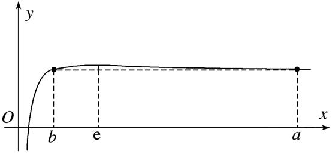
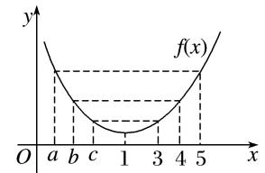
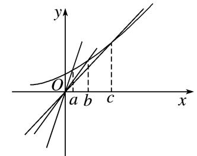
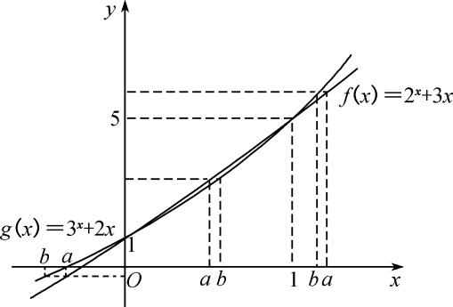

专题07　构造函数法解决导数不等式问题(二)

<strong>考点四　构造</strong><em><strong>F</strong></em><strong>(</strong><em><strong>x</strong></em><strong>)＝</strong><em><strong>f</strong></em><strong>(</strong><em><strong>x</strong></em><strong>)±</strong><em><strong>g</strong></em><strong>(</strong><em><strong>x</strong></em><strong>)，</strong><em><strong>F</strong></em><strong>(</strong><em><strong>x</strong></em><strong>)＝</strong><em><strong>f</strong></em><strong>(</strong><em><strong>x</strong></em><strong>)</strong><em><strong>g</strong></em><strong>(</strong><em><strong>x</strong></em><strong>)，</strong><em><strong>F</strong></em><strong>(</strong><em><strong>x</strong></em><strong>)＝类型的辅助函数</strong>

【方法总结】  
（1）若<em>F</em>(<em>x</em>)＝<em>f</em>(<em>x</em>)＋<em>axn</em>＋<em>b</em>，则<em>F</em>′(<em>x</em>)＝<em>f</em>′(<em>x</em>)＋<em>naxn</em>－1；  
（2）若*F*(*x*)＝*f*(*x*)±*g*(*x*)，则*F*′(*x*)＝*f*′(*x*)±*g*′(*x*)；  
（3）若*F*(*x*)＝*f*(*x*)*g*(*x*)，则*F*′(*x*)＝*f*′(*x*)*g*(*x*)＋*f*(*x*)*g*′(*x*)；  
（4）若*F*(*x*)＝，则*F*′(*x*)＝．
由此得到结论：  
（1）出现<em>f</em>′(<em>x</em>)＋<em>naxn</em>－1形式，构造函数<em>F</em>(<em>x</em>)＝<em>f</em>(<em>x</em>)＋<em>axn</em>＋<em>b</em>；  
（2）出现*f*′(*x*)±*g*′(*x*)形式，构造函数*F*(*x*)＝*f*(*x*)±*g*(*x*)；  
（3）出现*f*′(*x*)*g*(*x*)＋*f*(*x*)*g*′(*x*)形式，构造函数*F*(*x*)＝*f*(*x*)*g*(*x*)；  
（4）出现*f*′(*x*)*g*(*x*)－*f*(*x*)*g*′(*x*)形式，构造函数*F*(*x*)＝．

【例题选讲】

<strong>[例1]</strong>（1）函数<em>f</em>(<em>x</em>)的定义域为<strong>R</strong>，<em>f</em>(－1)＝3，对任意<em>x</em>∈<strong>R</strong>，<em>f</em>′(<em>x</em>)&lt;3，则<em>f</em>(<em>x</em>)&gt;3<em>x</em>＋6的解集为(　　)

A．{<em>x</em>|－1&lt;<em>x</em>&lt;1}　　　　　
B．{<em>x</em>|<em>x</em>&gt;－1}　　　　　
C．{<em>x</em>|<em>x</em>&lt;－1}　　　　　
D．<strong>R</strong>
答案　C　解析　设*g*(*x*)＝*f*(*x*)－(3*x*＋6)，则*g*′(*x*)＝*f*′(*x*)－3<0，所以*g*(*x*)为减函数，又*g*(－1)＝*f*(－1)－3＝0，所以根据单调性可知*g*(*x*)>0的解集是{*x*|*x*<－1}．  
（2）定义在<strong>R</strong>上的函数<em>f</em>(<em>x</em>)满足<em>f</em>（1）＝1，且对∀<em>x</em>∈<strong>R</strong>，<em>f</em>′(<em>x</em>)＜，则不等式<em>f</em>(log2<em>x</em>)＞的解集为\_\_\_\_\_\_\_\_．
答案　(0，2)　解析　构造函数<em>F</em>(<em>x</em>)＝<em>f</em>(<em>x</em>)－<em>x</em>，则<em>F</em>′(<em>x</em>)＝<em>f</em>′(<em>x</em>)－＜0，∴函数<em>F</em>(<em>x</em>)在<strong>R</strong>上是减函数．由<em>f</em>（1）＝1，得<em>F</em>（1）＝<em>f</em>（1）－＝1－＝，∴<em>f</em>(log2<em>x</em>)＞⇔<em>f</em>(log2<em>x</em>)－log2<em>x</em>＞⇔<em>F</em>(log2<em>x</em>)＞<em>F</em>（1）⇔log2<em>x</em>＜1⇔0＜<em>x</em>＜2．  
（3）定义在<strong>R</strong>上的可导函数<em>f</em>(<em>x</em>)满足<em>f</em>（1）＝1，且2<em>f</em>′(<em>x</em>)&gt;1，当<em>x</em>∈时，不等式<em>f</em>(2cos <em>x</em>)&gt;－2sin2的解集为(　　)

A．　　　　　　
B．　　　　　　
C．　　　　　　
D．
答案　D　解析　令<em>g</em>(<em>x</em>)＝<em>f</em>(<em>x</em>)－－，则<em>g</em>′(<em>x</em>)＝<em>f</em>′(<em>x</em>)－&gt;0，∴<em>g</em>(<em>x</em>)在<strong>R</strong>上单调递增，且<em>g</em>（1）＝<em>f</em>（1）－－＝0，∵<em>f</em>(2cos <em>x</em>)－＋2sin2＝<em>f</em>(2cos <em>x</em>)－－＝<em>g</em>(2cos <em>x</em>)，∴<em>f</em>(2cos <em>x</em>)&gt;－2sin2，即<em>g</em>(2cos <em>x</em>)&gt;0，∴2cos <em>x</em>&gt;1，又<em>x</em>∈，∴<em>x</em>∈．  
（4）<em>f</em>(<em>x</em>)是定义在<strong>R</strong>上的偶函数，当<em>x</em>≥0时，<em>f</em>′(<em>x</em>)＞2<em>x</em>．若<em>f</em>(<em>a</em>－2)－<em>f</em>(<em>a</em>)≥4－4<em>a</em>，则实数<em>a</em>的取值范围是(　　)

A．(－∞，1]　　　　　
B．[1，＋∞)　　　　　
C．(－∞，2]　　　　　
D．[2，＋∞)
答案　A　解析　令<em>G</em>(<em>x</em>)＝<em>f</em>(<em>x</em>)－<em>x</em>2，则<em>G</em>′(<em>x</em>)＝<em>f</em>′(<em>x</em>)－2<em>x</em>．当<em>x</em>∈[0，＋∞)时，<em>G</em>′(<em>x</em>)＝<em>f</em>′(<em>x</em>)－2<em>x</em>＞0，∴<em>G</em>(<em>x</em>)在[0，＋∞)上是增函数．由<em>f</em>(<em>a</em>－2)－<em>f</em>(<em>a</em>)≥4－4<em>a</em>，得<em>f</em>(<em>a</em>－2)－(<em>a</em>－2)2≥<em>f</em>(<em>a</em>)－<em>a</em>2，即<em>G</em>(<em>a</em>－2)≥<em>G</em>(<em>a</em>)，又<em>f</em>(<em>x</em>)是定义在R上的偶函数，知<em>G</em>(<em>x</em>)是偶函数．故|<em>a</em>－2|≥|<em>a</em>|，解得<em>a</em>≤1．  
（5）已知*f*′(*x*)是函数*f*(*x*)的导数，且*f*(－*x*)＝*f*(*x*)，当*x*≥0时，*f*′(*x*)>3*x*，则不等式*f*(*x*)－*f*(*x*－1)<3*x*－的解集是(　　)

A．　　　　　
B．　　　　　
C．　　　　　
D．
答案　D　解析　设<em>g</em>(<em>x</em>)＝<em>f</em>(<em>x</em>)－<em>x</em>2，则<em>g</em>′(<em>x</em>)＝<em>f</em>′(<em>x</em>)－3<em>x</em>．因为当<em>x</em>≥0时，<em>f</em>′(<em>x</em>)&gt;3<em>x</em>，所以当<em>x</em>≥0时，<em>g</em>′(<em>x</em>)＝<em>f</em>′(<em>x</em>)－3<em>x</em>&gt;0，即<em>g</em>(<em>x</em>)在[0，＋∞)上单调递增．因为<em>f</em>(－<em>x</em>)＝<em>f</em>(<em>x</em>)，所以<em>g</em>(－<em>x</em>)＝<em>f</em>(－<em>x</em>)－<em>x</em>2＝<em>f</em>(<em>x</em>)－<em>x</em>2＝<em>g</em>(<em>x</em>)，所以<em>g</em>(<em>x</em>)是偶函数．因为<em>f</em>(<em>x</em>)－<em>f</em>(<em>x</em>－1)&lt;3<em>x</em>－，所以<em>f</em>(<em>x</em>)－<em>x</em>2&lt;<em>f</em>(<em>x</em>－1)－(<em>x</em>－1)2，即<em>g</em>(<em>x</em>)&lt;<em>g</em>(<em>x</em>－1)，所以<em>g</em>(|<em>x</em>|)&lt;<em>g</em>(|<em>x</em>－1|)，则|<em>x</em>|&lt;|<em>x</em>－1|，解得<em>x</em>&lt;．故选D．  
（6）设<em>f</em>′(<em>x</em>)是奇函数<em>f</em>(<em>x</em>)(<em>x</em>∈<strong>R</strong>)的导数，当<em>x</em>&gt;0时，<em>f</em>(<em>x</em>)＋<em>f</em>′(<em>x</em>)·<em>x</em>ln<em>x</em>&lt;0，则不等式(<em>x</em>－1)<em>f</em>(<em>x</em>)&gt;0的解集为\_\_\_\_\_\_\_\_．
答案　(0，1)　解析　由于函数<em>y</em>＝<em>f</em>(<em>x</em>)为<strong>R</strong>上的奇函数，则<em>f</em>（0）＝0．当<em>x</em>&gt;0时，<em>f</em>(<em>x</em>)＋<em>f</em>′(<em>x</em>)·<em>x</em>ln<em>x</em>&lt;0，则<em>f</em>（1）&lt;0．当<em>x</em>&gt;0时，构造函数<em>g</em>(<em>x</em>)＝<em>f</em>(<em>x</em>)ln<em>x</em>，则<em>g</em>′(<em>x</em>)＝<em>f</em>′(<em>x</em>)ln<em>x</em>＋<em>f</em>(<em>x</em>)·＝&lt;0，所以函数<em>y</em>＝<em>g</em>(<em>x</em>)在区间(0，＋∞)上单调递减，且<em>g</em>（1）＝0．当0&lt;<em>x</em>&lt;1时，ln<em>x</em>&lt;0，<em>g</em>(<em>x</em>)&gt;<em>g</em>（1）＝0，即<em>f</em>(<em>x</em>)ln<em>x</em>&gt;0，此时<em>f</em>(<em>x</em>)&lt;0；当<em>x</em>&gt;1时，ln<em>x</em>&gt;0，<em>g</em>(<em>x</em>)&lt;<em>g</em>（1）＝0，即<em>f</em>(<em>x</em>)ln<em>x</em>&lt;0，此时<em>f</em>(<em>x</em>)&lt;0．又<em>f</em>（1）&lt;0，所以当<em>x</em>&gt;0时，<em>f</em>(<em>x</em>)&lt;0．由于函数<em>y</em>＝<em>f</em>(<em>x</em>)为<strong>R</strong>上的奇函数，当<em>x</em>&lt;0时，<em>f</em>(<em>x</em>)&gt;0．对于不等式(<em>x</em>－1)<em>f</em>(<em>x</em>)&gt;0，当<em>x</em>&lt;0时，<em>x</em>－1&lt;0，则<em>f</em>(<em>x</em>)&lt;0，不符合题意；当0&lt;<em>x</em>&lt;1时，<em>x</em>－1&lt;0，则<em>f</em>(<em>x</em>)&lt;0，符合题意；当<em>x</em>&gt;1时，<em>x</em>－1&gt;0，则<em>f</em>(<em>x</em>)&gt;0，不符合题意．综上所述，不等式(<em>x</em>－1)<em>f</em>(<em>x</em>)&gt;0的解集为(0，1)．  
（7）(多选)定义在(0，＋∞)上的函数<em>f</em>(<em>x</em>)的导函数为<em>f</em>′(<em>x</em>)，且(<em>x</em>＋1)<em>f</em>′(<em>x</em>)－<em>f</em>(<em>x</em>)＜<em>x</em>2＋2<em>x</em>对任意<em>x</em>∈(0，＋∞)恒成立．下列结论正确的是(　　)

A．2<em>f</em>（2）－3<em>f</em>（1）＞5　　　　　　　　　　　　
B．若<em>f</em>（1）＝2，<em>x</em>＞1，则<em>f</em>(<em>x</em>)＞<em>x</em>2＋<em>x</em>＋

C．<em>f</em>（3）－2<em>f</em>（1）＜7　　　　　　　　　　　　
D．若<em>f</em>（1）＝2，0＜<em>x</em>＜1，则<em>f</em>(<em>x</em>)＞<em>x</em>2＋<em>x</em>＋
解析　<strong>CD</strong>　答案　设函数<em>g</em>(<em>x</em>)＝，则<em>g</em>′(<em>x</em>)＝．因为(<em>x</em>＋1)<em>f</em>′(<em>x</em>)－<em>f</em>(<em>x</em>)＜<em>x</em>2＋2<em>x</em>对任意<em>x</em>∈(0，＋∞)恒成立，所以<em>g</em>′(<em>x</em>)＜0，故<em>g</em>(<em>x</em>)在(0，＋∞)上单调递减，从而<em>g</em>（1）＞<em>g</em>（2）＞<em>g</em>（3），整理得2<em>f</em>（2）－3<em>f</em>（1）＜5，<em>f</em>（3）－2<em>f</em>（1）＜7，故A错误，C正确．当0＜<em>x</em>＜1时，若<em>f</em>（1）＝2，因为<em>g</em>(<em>x</em>)在(0，＋∞)上单调递减，所以<em>g</em>(<em>x</em>)＞<em>g</em>（1）＝，即＞，即<em>f</em>(<em>x</em>)＞<em>x</em>2＋<em>x</em>＋，故D正确，从而B不正确．即结论正确的是CD．  
（8）已知函数<em>f</em>(<em>x</em>)，对∀<em>x</em>∈<strong>R</strong>，都有<em>f</em>(－<em>x</em>)＋<em>f</em>(<em>x</em>)＝<em>x</em>2，在(0，＋∞)上，<em>f</em>′(<em>x</em>)&lt;<em>x</em>，若<em>f</em>(4－<em>m</em>)－<em>f</em>(<em>m</em>)≥8－4<em>m</em>，则实数<em>m</em>的取值范围为(　　)

A．[－2，2]　　　　
B．[2，＋∞)　　　　
C．[0，＋∞)　　　　
D．(－∞，－2]∪[2，＋∞)
答案　B　解析　因为对∀<em>x</em>∈<strong>R</strong>，都有<em>f</em> (－<em>x</em>)＋<em>f</em> (<em>x</em>)＝<em>x</em>2，所以<em>f</em> （0）＝0，设<em>g</em>(<em>x</em>)＝<em>f</em> (<em>x</em>)－<em>x</em>2，则<em>g</em>(－<em>x</em>)＝<em>f</em> (－<em>x</em>)－<em>x</em>2，所以<em>g</em>(<em>x</em>)＋<em>g</em>(－<em>x</em>)＝<em>f</em> (<em>x</em>)－<em>x</em>2＋<em>f</em> (－<em>x</em>)－<em>x</em>2＝0，又<em>g</em>（0）＝<em>f</em> （0）－0＝0，所以<em>g</em>(<em>x</em>)为奇函数，且<em>f</em> (<em>x</em>)＝<em>g</em>(<em>x</em>)＋<em>x</em>2，所以<em>f</em> (4－<em>m</em>)－<em>f</em> (<em>m</em>)＝<em>g</em>(4－<em>m</em>)＋(4－<em>m</em>)2－＝<em>g</em>(4－<em>m</em>)－<em>g</em>(<em>m</em>)＋8－4<em>m</em>≥8－4<em>m</em>，则<em>g</em>(4－<em>m</em>)－<em>g</em>(<em>m</em>)≥0，即<em>g</em>(4－<em>m</em>)≥<em>g</em>(<em>m</em>)．当<em>x</em>&gt;0时，<em>g</em>′(<em>x</em>)＝<em>f</em> ′(<em>x</em>)－<em>x</em>&lt;0，所以<em>g</em>(<em>x</em>)在(0，＋∞)上为减函数，又<em>g</em>(<em>x</em>)为奇函数，所以4－<em>m</em>≤<em>m</em>，解得<em>m</em>≥2．  
（9）已知函数<em>y</em>＝<em>f</em>(<em>x</em>)是<strong>R</strong>上的可导函数，当<em>x</em>≠0时，有<em>f</em>′(<em>x</em>)＋&gt;0，则函数<em>F</em>(<em>x</em>)＝<em>xf</em>(<em>x</em>)＋的零点个数是(　　)

A．0　　　　　　　  　
B．1　　　　  　　　　
C．2　　　　　  　　　
D．3
答案　B　解析　依题意，记*g*(*x*)＝*xf*(*x*)，则*g*′(*x*)＝*xf*′(*x*)＋*f*(*x*)，*g*（0）＝0，当*x*>0时，*g*′(*x*)＝*x*[*f*′(*x*)＋]>0，*g*(*x*)是增函数，*g*(*x*)>0；当*x*<0时，*g*′(*x*)＝*x*[*f*′(*x*)＋]<0，*g*(*x*)是减函数，*g*(*x*)>0．在同一坐标系内画出函数*y*＝*g*(*x*)与*y*＝－的大致图象，结合图象可知，它们共有1个公共点，因此函数*F*(*x*)＝*xf*(*x*)＋的零点个数是1．  
（10）函数<em>f</em>(<em>x</em>)满足<em>x</em>2<em>f</em>′(<em>x</em>)＋2<em>xf</em>(<em>x</em>)＝，<em>f</em>（2）＝，当<em>x</em>&gt;0时，<em>f</em>(<em>x</em>)的极值状态是\_\_\_\_\_\_\_\_\_\_\_．
答案　没有极大值也没有极小值　解析　因为<em>x</em>2<em>f</em>′(<em>x</em>)＋2<em>xf</em>(<em>x</em>)＝，关键因为等式右边函数的原函数不容易找出，因此把等式左边函数的原函数找出来，设<em>h</em>(<em>x</em>)＝<em>x</em>2<em>f</em>(<em>x</em>)，则<em>h</em>′(<em>x</em>)＝，且<em>h</em>（2）＝，因为<em>x</em>2<em>f</em>′(<em>x</em>)＋2<em>xf</em>(<em>x</em>)＝，则<em>f</em>′(<em>x</em>)＝，判断<em>f</em>(<em>x</em>)的极值状态就是判断<em>f</em>′(<em>x</em>)的正负，设<em>g</em>(<em>x</em>)＝e<em>x</em>－2<em>h</em>(<em>x</em>)，则<em>g</em>′(<em>x</em>)＝e<em>x</em>－2<em>h</em>′(<em>x</em>)＝e<em>x</em>－2·＝e<em>x</em>·，这里涉及二阶导，<em>g</em>(<em>x</em>)在<em>x</em>＝2处取得最小值0，因此<em>g</em>(<em>x</em>) ≥0，则<em>f</em>′(<em>x</em>)≥0，故<em>f</em>(<em>x</em>)没有极大值也没有极小值(有难度，但不失为好题目)．

【对点训练】

1．已知函数<em>f</em>(<em>x</em>)的定义域为<strong>R</strong>，<em>f</em>(－1)＝2，且对任意<em>x</em>∈<strong>R</strong>，<em>f</em>′(<em>x</em>)＞2，则<em>f</em>(<em>x</em>)＞2<em>x</em>＋4的解集为(　　)

A．(－1，1)　　　　
B．(－1，＋∞)　　　　
C．(－∞，－1)　　　　
D．(－∞，＋∞)

1．答案　<strong>B</strong>　解析　由<em>f</em>(<em>x</em>)＞2<em>x</em>＋4，得<em>f</em>(<em>x</em>)－2<em>x</em>－4＞0．设<em>F</em>(<em>x</em>)＝<em>f</em>(<em>x</em>)－2<em>x</em>－4，则<em>F</em>′(<em>x</em>)＝<em>f</em>′(<em>x</em>)－2．因为<em>f</em>′(<em>x</em>)

＞2，所以<em>F</em>′(<em>x</em>)＞0在<strong>R</strong>上恒成立，所以<em>F</em>(<em>x</em>)在<strong>R</strong>上单调递增．又<em>F</em>(－1)＝<em>f</em>(－1)－2×(－1)－4＝2＋2－4＝0，故不等式<em>f</em>(<em>x</em>)－2<em>x</em>－4＞0等价于<em>F</em>(<em>x</em>)＞<em>F</em>(－1)，所以<em>x</em>＞－1，故选B．

2．已知函数<em>f</em>(<em>x</em>)(<em>x</em>∈<strong>R</strong>)满足<em>f</em>（1）＝1，<em>f</em>(<em>x</em>)的导数<em>f</em>′(<em>x</em>)&lt;，则不等式<em>f</em>(<em>x</em>2)&lt;＋的解集为____________．

2．答案　{*x*|*x*<－1或*x*>1}　解析　设*F*(*x*)＝*f*(*x*)－*x*，∴*F*′(*x*)＝*f*′(*x*)－，∵*f*′(*x*)<，∴*F*′(*x*)＝*f*′(*x*)－<0，
即函数<em>F</em>(<em>x</em>)在<strong>R</strong>上单调递减．∵<em>f</em>(<em>x</em>2)&lt;＋，∴<em>f</em>(<em>x</em>2)－&lt;<em>f</em>（1）－，∴<em>F</em>(<em>x</em>2)&lt;<em>F</em>（1），而函数<em>F</em>(<em>x</em>)在<strong>R</strong>上单调递减，∴<em>x</em>2&gt;1，即不等式的解集为{<em>x</em>|<em>x</em>&lt;－1或<em>x</em>&gt;1}．

3．已知定义域为<strong>R</strong>的函数<em>f</em>(<em>x</em>)的导数为<em>f</em>′(<em>x</em>)，且满足<em>f</em>′(<em>x</em>)&lt;2<em>x</em>，<em>f</em>（2）＝3，则不等式<em>f</em>(<em>x</em>)&gt;<em>x</em>2－1的解集是(　　)

A．(－∞，－1)　　　　　
B．(－1，＋∞)　　　　　
C．(2，＋∞)　　　　　
D．(－∞，2)

3．答案　D　解析　令<em>g</em>(<em>x</em>)＝<em>f</em>(<em>x</em>)－<em>x</em>2，则<em>g</em>′(<em>x</em>)＝<em>f</em>′(<em>x</em>)－2<em>x</em>&lt;0，即函数<em>g</em>(<em>x</em>)在<strong>R</strong>上单调递减．又不等式<em>f</em>(<em>x</em>)&gt;<em>x</em>2

－1可化为<em>f</em>(<em>x</em>)－<em>x</em>2&gt;－1，而<em>g</em>（2）＝<em>f</em>（2）－22＝3－4＝－1，所以不等式可化为<em>g</em>(<em>x</em>)&gt;<em>g</em>（2），故不等式的解集为(－∞，2)．故选D．

4．定义在(0，＋∞)上的函数<em>f</em>(<em>x</em>)满足<em>x</em>2<em>f</em>′(<em>x</em>)＋1＞0，<em>f</em>（1）＝4，则不等式<em>f</em>(<em>x</em>)＞＋3的解集为\_\_\_\_\_\_\_\_．

4．解析　(1，＋∞)　答案　由<em>x</em>2<em>f</em>′(<em>x</em>)＋1＞0得<em>f</em>′(<em>x</em>)＋＞0，构造函数<em>g</em>(<em>x</em>)＝<em>f</em>(<em>x</em>)－－3，则<em>g</em>′(<em>x</em>)＝<em>f</em>′(<em>x</em>)＋

＞0，即*g*(*x*)在(0，＋∞)上是增函数．又*f*（1）＝4，则*g*（1）＝*f*（1）－1－3＝0，从而*g*(*x*)＞0的解集为(1，＋∞)，即*f*(*x*)＞＋3的解集为(1，＋∞)．

5．设<em>f</em>(<em>x</em>)为<strong>R</strong>上的奇函数，当<em>x</em>≥0时，<em>f</em>′(<em>x</em>)－cos<em>x</em>&lt;0，则不等式<em>f</em>(<em>x</em>)&lt;sin<em>x</em>的解集为________．

5．答案　(0，＋∞)　解析　令*φ*(*x*)＝*f*(*x*)－sin*x*，∴当*x*≥0时，*φ*′(*x*)＝*f*′(*x*)－cos*x*<0，∴*φ*(*x*)在[0，＋∞)上

单调递减，又<em>f</em>(<em>x</em>)为<strong>R</strong>上的奇函数，∴<em>φ</em>(<em>x</em>)为<strong>R</strong>上的奇函数，∴<em>φ</em>(<em>x</em>)在(－∞，0]上单调递减，故<em>φ</em>(<em>x</em>)在<strong>R</strong>上单调递减且<em>φ</em>（0）＝0，不等式<em>f</em>(<em>x</em>)&lt;sin<em>x</em>可化为<em>f</em>(<em>x</em>)－sin<em>x</em>&lt;0，即<em>φ</em>(<em>x</em>)&lt;0，即<em>φ</em>(<em>x</em>)&lt;<em>φ</em>（0），故<em>x</em>&gt;0，∴原不等式的解集为(0，＋∞)．

6．设<em>f</em>(<em>x</em>)和<em>g</em>(<em>x</em>)分别是定义在<strong>R</strong>上的奇函数和偶函数，<em>f</em>′(<em>x</em>)，<em>g</em>′(<em>x</em>)分别为其导数，当<em>x</em>＜0时，<em>f</em>′(<em>x</em>)<em>g</em>(<em>x</em>)＋

*f*(*x*)*g*′(*x*)＞0，且*g*(－3)＝0，则不等式*f*(*x*)*g*(*x*)＜0的解集是(　　)

A．(－3，0)∪(3，＋∞)　　　　　　　　　　　
B．(－3，0)∪(0，3)

C．(－∞，－3)∪(3，＋∞)　　　　　　　　　　
D．(－∞，－3)∪(0，3)

6．答案　<strong>D</strong>　解析　令<em>h</em>(<em>x</em>)＝<em>f</em>(<em>x</em>)<em>g</em>(<em>x</em>)，当<em>x</em>＜0时，<em>h</em>′(<em>x</em>)＝<em>f</em>′(<em>x</em>)<em>g</em>(<em>x</em>)＋<em>f</em>(<em>x</em>)<em>g</em>′(<em>x</em>)＞0，则<em>h</em>(<em>x</em>)在(－∞，0)上单

调递增，又<em>f</em>(<em>x</em>)，<em>g</em>(<em>x</em>)分别是定义在<strong>R</strong>上的奇函数和偶函数，所以<em>h</em>(<em>x</em>)为奇函数，所以<em>h</em>(<em>x</em>)在(0，＋∞)上单调递增．又由<em>g</em>(－3)＝0，可得<em>h</em>(－3)＝－<em>h</em>（3）＝0，所以当<em>x</em>＜－3或0＜<em>x</em>＜3时，<em>h</em>(<em>x</em>)＜0，故选D．

7．设<em>f</em>(<em>x</em>)，<em>g</em>(<em>x</em>)是定义在<strong>R</strong>上的恒大于0的可导函数，且<em>f</em>′(<em>x</em>)<em>g</em>(<em>x</em>)－<em>f</em>(<em>x</em>)<em>g</em>′(<em>x</em>)＜0，则当<em>a</em>＜<em>x</em>＜<em>b</em>时，有(　　)

A．*f*(*x*)*g*(*x*)＞*f*(*b*)*g*(*b*)　　　
B．*f*(*x*)*g*(*a*)＞*f*(*a*)*g*(*x*)　　　
C．*f*(*x*)*g*(*b*)＞*f*(*b*)*g*(*x*)　　　
D．*f*(*x*)*g*(*x*)＞*f*(*a*)*g*(*a*)

7．解析　<strong>C</strong>　答案　令<em>F</em>(<em>x</em>)＝，则<em>F</em>′(<em>x</em>)＝＜0，所以<em>F</em>(<em>x</em>)在<strong>R</strong>上单调递减．又<em>a</em>＜<em>x</em>

＜*b*，所以＞＞．又*f*(*x*)＞0，*g*(*x*)＞0，所以*f*(*x*)*g*(*b*)＞*f*(*b*)*g*(*x*)．

8．设函数<em>f</em>(<em>x</em>)在<strong>R</strong>上存在导数<em>f</em>′(<em>x</em>)，对任意<em>x</em>∈<strong>R</strong>，都有<em>f</em>(－<em>x</em>)＋<em>f</em>(<em>x</em>)＝<em>x</em>2，在(0，＋∞)上<em>f</em>′(<em>x</em>)&lt;<em>x</em>，若<em>f</em>(2－

<em>m</em>)＋<em>f</em>(－<em>m</em>)－<em>m</em>2＋2<em>m</em>－2≥0，则实数<em>m</em>的取值范围为\_\_\_\_\_\_\_\_\_\_．

8．答案　[1，＋∞)　解析　令<em>g</em>(<em>x</em>)＝<em>f</em>(<em>x</em>)－，则<em>g</em>(－<em>x</em>)＋<em>g</em>(<em>x</em>)＝0，<em>g</em>(<em>x</em>)是<strong>R</strong>上的奇函数．又当<em>x</em>∈(0，＋

∞)时，<em>g</em>′(<em>x</em>)＝<em>f</em>′(<em>x</em>)－<em>x</em>&lt;0，所以<em>g</em>(<em>x</em>)在(0，＋∞)上单调递减，所以<em>g</em>(<em>x</em>)是<strong>R</strong>上的单调减函数．原不等式等价于<em>g</em>(2－<em>m</em>)＋<em>g</em>(－<em>m</em>)≥0，<em>g</em>(2－<em>m</em>)≥－<em>g</em>(－<em>m</em>)＝<em>g</em>(<em>m</em>)，所以2－<em>m</em>≤<em>m</em>，<em>m</em>≥1．

9．已知<em>f</em>(<em>x</em>)是定义在<strong>R</strong>上的减函数，其导函数<em>f</em>′(<em>x</em>)满足＋<em>x</em>&lt;1，则下列结论正确的是(　　)

A．对于任意<em>x</em>∈<strong>R</strong>，<em>f</em>(<em>x</em>)&lt;0　　　　　　　　
B．对于任意<em>x</em>∈<strong>R</strong>，<em>f</em>(<em>x</em>)&gt;0

C．当且仅当*x*∈(－∞，1)，*f*(*x*)<0　　　　　
D．当且仅当*x*∈(1，＋∞)，*f*(*x*)>0

9．答案　B　解析　∵＋<em>x</em>&lt;1，<em>f</em>(<em>x</em>)是定义在<strong>R</strong>上的减函数，<em>f</em>′(<em>x</em>)&lt;0，∴<em>f</em>(<em>x</em>)＋<em>xf</em>′(<em>x</em>)&gt;<em>f</em>′(<em>x</em>)，∴<em>f</em>(<em>x</em>)＋(<em>x</em>－

1)<em>f</em>′(<em>x</em>)&gt;0，∴[(<em>x</em>－1)<em>f</em>(<em>x</em>)]′&gt;0，∴函数<em>y</em>＝(<em>x</em>－1)<em>f</em>(<em>x</em>)在<strong>R</strong>上单调递增，而<em>x</em>＝1时，<em>y</em>＝0，则<em>x</em>&lt;1时，<em>y</em>&lt;0，故<em>f</em>(<em>x</em>)&gt;0．<em>x</em>&gt;1时，<em>x</em>－1&gt;0，<em>y</em>&gt;0，故<em>f</em>(<em>x</em>)&gt;0，∴<em>f</em>(<em>x</em>)&gt;0对任意<em>x</em>∈<strong>R</strong>成立，故选B．

10．已知<em>y</em>＝<em>f</em>(<em>x</em>)为<strong>R</strong>上的可导函数，当<em>x</em>≠0时，<em>f</em>′(<em>x</em>)＋＞0，若<em>g</em>(<em>x</em>)＝<em>f</em>(<em>x</em>)＋，则函数<em>g</em>(<em>x</em>)的零点个数

为(　　)

A．1　　　　　　　　
B．2　　　　　　　　
C．0　　　　　　　　
D．0或2

10．答案　C　解析　令*h*(*x*)＝*xf*(*x*)，因为当*x*≠0时，＞0，所以＞0，因此当*x*＞0时，*h*′(*x*)

＞0，当*x*＜0时，*h*′(*x*)＜0，又*h*（0）＝0，易知当*x*≠0时，*h*(*x*)＞0，又*g*(*x*)＝，所以*g*(*x*)≠0，故函数*g*(*x*)的零点个数为0

考点五　构造具体函数关系式

【方法总结】

这类题型需要根据题意构造具体的函数关系式，通过具体的关系式去解决不等式及求值问题．

【例题选讲】

<strong>[例1]</strong> （1） (2020·全国Ⅰ)若2<em>a</em>＋log2<em>a</em>＝4<em>b</em>＋2log4<em>b</em>，则(　　)

A．<em>a</em>&gt;2<em>b</em>　　　　　　
B．<em>a</em>&lt;2<em>b</em>　　　　　　
C．<em>a</em>&gt;<em>b</em>2　　　　　　
D．<em>a</em>&lt;<em>b</em>2
答案　<strong>B</strong>　解析　由指数和对数的运算性质得2<em>a</em>＋log2<em>a</em>＝4<em>b</em>＋2log4<em>b</em>＝22<em>b</em>＋log2<em>b</em>．令<em>f</em>(<em>x</em>)＝2<em>x</em>＋log2<em>x</em>，则<em>f</em>(<em>x</em>)在(0，＋∞)上单调递增．又∵22<em>b</em>＋log2<em>b</em>&lt;22<em>b</em>＋log2<em>b</em>＋1＝22<em>b</em>＋log2(2<em>b</em>)，∴2<em>a</em>＋log2<em>a</em>&lt;22<em>b</em>＋log2(2<em>b</em>)，即<em>f</em>(<em>a</em>)&lt;<em>f</em>(2<em>b</em>)，∴<em>a</em>&lt;2<em>b</em>．故选B．  
（2）已知*α*，*β*∈，且*α*sin*α*－*β*sin*β*＞0，则下列结论正确的是(　　)

A．<em>α</em>＞<em>β</em>　　　　　
B．<em>α</em>2＞<em>β</em>2　　　　　
C．<em>α</em>＜<em>β</em>　　　　　
D．<em>α</em>＋<em>β</em>＞0
答案　<strong>B</strong>　解析　构造函数<em>f</em>(<em>x</em>)＝<em>x</em>sin<em>x</em>，则<em>f</em>′(<em>x</em>)＝sin<em>x</em>＋<em>x</em>cos<em>x</em>．当<em>x</em>∈时，<em>f</em>′(<em>x</em>)≥0，<em>f</em>(<em>x</em>)是增函数，当<em>x</em>∈时，<em>f</em>′(<em>x</em>)＜0，<em>f</em>(<em>x</em>)是减函数，又<em>f</em>(<em>x</em>)为偶函数，∴<em>α</em>sin<em>α</em>－<em>β</em>sin<em>β</em>＞0⇔<em>α</em>sin<em>α</em>＞<em>β</em>sin<em>β</em>⇔<em>f</em>(<em>α</em>)＞<em>f</em>(<em>β</em>)⇔<em>f</em>(|<em>α</em>|)＞<em>f</em>(|<em>β</em>|)⇔|<em>α</em>|＞|<em>β</em>|⇔<em>α</em>2＞<em>β</em>2，故选B．  
（3）(多选)若0&lt;<em>x</em>1&lt;<em>x</em>2&lt;1，则(　　)

A．<em>x</em>1＋ln<em>x</em>2&gt;<em>x</em>2＋ln<em>x</em>1　　　
B．<em>x</em>1＋ln<em>x</em>2&lt;<em>x</em>2＋ln<em>x</em>1　　　
C．&gt;　　　
D．&lt;

答案　AC　解析　令<em>f</em>(<em>x</em>)＝<em>x</em>－ln<em>x</em>，∴<em>f</em>′(<em>x</em>)＝1－＝，当0&lt;<em>x</em>&lt;1时，<em>f</em>′(<em>x</em>)&lt;0，∴<em>f</em>(<em>x</em>)在(0，1)上单调递减．∵0&lt;<em>x</em>1&lt;<em>x</em>2&lt;1，∴<em>f</em>(<em>x</em>2)&lt;<em>f</em>(<em>x</em>1)，即<em>x</em>2－ln<em>x</em>2&lt;<em>x</em>1－ln<em>x</em>1，即<em>x</em>1＋ln<em>x</em>2&gt;<em>x</em>2＋ln<em>x</em>1．设<em>g</em>(<em>x</em>)＝，则<em>g</em>′(<em>x</em>)＝＝．当0&lt;<em>x</em>&lt;1时，<em>g</em>′(<em>x</em>)&lt;0，即<em>g</em>(<em>x</em>)在(0，1)上单调递减，∵0&lt;<em>x</em>1&lt;<em>x</em>2&lt;1，∴<em>g</em>(<em>x</em>2)&lt;<em>g</em>(<em>x</em>1)，即&lt;，∴&gt;，故选AC．

## （4）已知函数<em>f</em>(<em>x</em>)＝－<em>ax</em>，<em>x</em>∈(0，＋∞)，当<em>x</em>2＞<em>x</em>1时，不等式－&lt;0恒成立，则实数<em>a</em>的取值范围是(　　)

## A．(－∞，*e*]　　　　　　B．(－∞，*e*)　　　　　　C．(－∞，)　　　　　　D．(－∞，]

## 答案　D　解析　由－&lt;0，得<em>x</em>1<em>f</em>(<em>x</em>1) &lt;<em>x</em>2<em>f</em>(<em>x</em>2)，令<em>g</em>(<em>x</em>)＝<em>xf</em>(<em>x</em>)，则<em>g</em>(<em>x</em>)在(0，＋∞)上调递增，又因为<em>g</em>(<em>x</em>)＝<em>ex</em>－<em>ax</em>2，所以<em>g</em>′(<em>x</em>)＝<em>ex</em>－2<em>ax</em>≥0，在(0，＋∞)上恒成立，即<em>a</em>≤，令<em>h</em>(<em>x</em>)＝，则<em>h</em>′(<em>x</em>)＝，令<em>h</em>′(<em>x</em>)＝0，则<em>h</em>(<em>x</em>)在(0，1)单调递减，在(1，＋∞)单调递增，所以<em>h</em>(<em>x</em>)min＝<em>h</em>（1）＝，选D．  
（5）(多选)若实数*a*≥2，则下列不等式中一定成立的是(　　)

A．(<em>a</em>＋1)<em>a</em>＋2&gt;(<em>a</em>＋2)<em>a</em>＋1　　　　　　　　　
B．log<em>a</em>(<em>a</em>＋1)&gt;log<em>a</em>＋1(<em>a</em>＋2)

C．log<em>a</em>(<em>a</em>＋1)&lt; 　　　　　　　　　　
D．log<em>a</em>＋1(<em>a</em>＋2)&lt;
答案　ABD　解析　若A成立，则(<em>a</em>＋1)<em>a</em>＋2&gt;(<em>a</em>＋2)<em>a</em>＋1，两边取自然对数，得(<em>a</em>＋2)ln(<em>a</em>＋1)&gt;(<em>a</em>＋1)ln(<em>a</em>＋2)，因为<em>a</em>≥2，所以&gt;．令<em>f</em>(<em>x</em>)＝，则<em>x</em>≥3，<em>f</em>′(<em>x</em>)＝&lt;0，故<em>f</em>(<em>x</em>)在[3，＋∞)上单调递减，所以&gt;，故A成立；若B成立，则log<em>a</em>(<em>a</em>＋1)&gt;log<em>a</em>＋1(<em>a</em>＋2)，即&gt;，设<em>g</em>(<em>x</em>)＝，<em>x</em>≥2，则<em>g</em>′(<em>x</em>)＝＝，令<em>h</em>(<em>x</em>)＝<em>x</em> ln<em>x</em>，<em>x</em>≥2，则<em>h</em>′(<em>x</em>)＝ln<em>x</em>＋1&gt;0，故<em>h</em>(<em>x</em>)在[2，＋∞)上单调递增，所以<em>x</em> ln<em>x</em>－(<em>x</em>＋1)ln(<em>x</em>＋1)&lt;0，所以<em>g</em>′(<em>x</em>)&lt;0，故<em>g</em>(<em>x</em>)在[2，＋∞)上单调递减，所以&gt;，故B成立；若C成立，则log<em>a</em>(<em>a</em>＋1)&lt;，即&lt;，由A知<em>f</em>(<em>x</em>)＝在[2，e)上单调递增，在(e，＋∞)上单调递减，取<em>a</em>＝2，故C不成立；若D成立，则log<em>a</em>＋1(<em>a</em>＋2)&lt;，即&lt;，由A知D成立．故选ABD．  
（6） (2021·全国乙)设*a*＝2ln1.01，*b*＝ln1.02，*c*＝－1，则(　　)

A．*a*<*b*<*c*　　　　　　
B．*b*<*c*<*a*　　　　　　
C．*b*<*a*<*c*　　　　　　
D．*c*<*a*<*b*
答案　B　解析　*b*－*c*＝ln1.02－＋1，设*f*(*x*)＝ln(*x*＋1)－＋1，则*b*－*c*＝*f*(0.02)，*f*′(*x*)＝－＝，当*x*>0时，*x*＋1＝>，故当*x*>0时，*f*′(*x*)＝<0，所以*f*(*x*)在(0，＋∞)上单调递减，所以*f*(0.02)<*f*（0）＝0，即*b*<*c*．*a*－*c*＝2ln 1.01－＋1，设*g*(*x*)＝2ln(*x*＋1)－＋1，则*a*－*c*＝*g*(0.01)，*g*′(*x*)＝－＝，当0<*x*<2时，＝>＝＝*x*＋1，故当0<*x*<2时，*g*′(*x*)>0，所以*g*(*x*)在(0，2)上单调递增，所以*g*(0.01)>*g*（0）＝0，故*c*<*a*，从而有*b*<*c*<*a*，故选B．  
（7）已知函数*f*(*x*)的定义域为(0，＋∞)，导函数为*f*′(*x*)，若*xf*′(*x*)－*f*(*x*)＝*x*ln*x*，且*f*＝，则(　　)

A．*f*′＝0　　
B．*f*(*x*)在*x*＝处取得极大值　　
C．0<*f*（1）<1　　
D．*f*(*x*)在(0，＋∞)上单调递增
答案　ACD　解析　由题知函数<em>f</em>(<em>x</em>)的定义域为(0，＋∞)，导函数为<em>f</em>′(<em>x</em>)，<em>xf</em>′(<em>x</em>)－<em>f</em>(<em>x</em>)＝<em>x</em>ln<em>x</em>，即满足＝．因为′＝，所以′＝，所以可设＝ln2<em>x</em>＋<em>b</em>(<em>b</em>为常数)，所以<em>f</em>(<em>x</em>)＝<em>x</em>ln2<em>x</em>＋<em>bx</em>．因为<em>f</em>＝·ln2＋＝，解得<em>b</em>＝，所以<em>f</em>(<em>x</em>)＝<em>x</em>ln2<em>x</em>＋<em>x</em>，所以<em>f</em>（1）＝，满足0&lt;<em>f</em>（1）&lt;1，所以C正确；因为<em>f</em>′(<em>x</em>)＝ln2<em>x</em>＋ln<em>x</em>＋＝(ln<em>x</em>＋1)2≥0，且仅有<em>f</em>′＝0，所以B错误，A，D正确．故选ACD．

【对点训练】

1．若*a*＝，*b*＝，*c*＝，则(　　)

A．*a*<*b*<*c*　　　　　
B．*c*<*b*<*a*　　　　　
C．*c*<*a*<*b*　　　　　
D．*b*<*a*<*c*

1．答案　C　解析　设*f*(*x*)＝，则*f*′(*x*)＝，所以*f*(*x*)在(0，e)上单调递增，在(e，＋∞)上单调递

减，即有*f*（6）<*f*（4）<*f*（3），所以<＝<，故*c*<*a*<*b*．

2．设<em>a</em>，<em>b</em>&gt;0，则“<em>a</em>&gt;<em>b</em>”是“<em>aa</em>&gt;<em>bb</em>”的(　　)

A．充分不必要条件　　
B．必要不充分条件　　
C．充要条件　　
D．既不充分也不必要条件

2．答案　D　解析　因为<em>a</em>，<em>b</em>&gt;0，由<em>aa</em>&gt;<em>bb</em>可得<em>a</em>ln <em>a</em>&gt;<em>b</em>ln <em>b</em>．设函数<em>f</em>(<em>x</em>)＝<em>x</em>ln <em>x</em>，则<em>f</em>′(<em>x</em>)＝ln <em>x</em>＋1，由<em>f</em>′(<em>x</em>)&gt;0
可得<em>x</em>&gt;，所以函数<em>f</em>(<em>x</em>)＝<em>x</em>ln<em>x</em>在上单调递减，在上单调递增，所以<em>a</em>&gt;<em>b</em>不一定有<em>a</em>ln <em>a</em>&gt;<em>b</em>ln<em>b</em>，即<em>aa</em>&gt;<em>bb</em>，所以充分性不成立；当<em>aa</em>&gt;<em>bb</em>，即<em>a</em>ln <em>a</em>&gt;<em>b</em>ln <em>b</em>时，不一定有<em>a</em>&gt;<em>b</em>，所以必要性不成立，所以“<em>a</em>&gt;<em>b</em>”是“<em>aa</em>&gt;<em>bb</em>”的既不充分也不必要条件，故选D．

3．已知0&lt;<em>x</em>1&lt;<em>x</em>2&lt;1，则(　　)

A．&gt;　　　　
B．&lt;　　　　
C．<em>x</em>2ln <em>x</em>1&gt;<em>x</em>1ln <em>x</em>2　　　　　　　　
D．<em>x</em>2ln <em>x</em>1&lt;<em>x</em>1ln <em>x</em>2

3．答案　D　解析　设*f*(*x*)＝*x*ln *x*，则*f*′(*x*)＝ln *x*＋1，由*f*′(*x*)>0，得*x*>，所以函数*f*(*x*)在上单

调递增；由<em>f</em>′(<em>x</em>)&lt;0，得0&lt;<em>x</em>&lt;，函数<em>f</em>(<em>x</em>)在上单调递减，故函数<em>f</em>(<em>x</em>)在(0，1)上不单调，所以<em>f</em>(<em>x</em>1)与<em>f</em>(<em>x</em>2)的大小无法确定，从而排除A，B；设<em>g</em>(<em>x</em>)＝，则<em>g</em>′(<em>x</em>)＝，由<em>g</em>′(<em>x</em>)&gt;0，得0&lt;<em>x</em>&lt;e，即函数<em>g</em>(<em>x</em>)在(0，e)上单调递增，故函数<em>g</em>(<em>x</em>)在(0，1)上单调递增，所以<em>g</em>(<em>x</em>1)&lt;<em>g</em>(<em>x</em>2)，即&lt;，所以<em>x</em>2ln <em>x</em>1&lt;<em>x</em>1ln <em>x</em>2．故选D．

4．已知<em>a</em>&gt;<em>b</em>&gt;0，<em>ab</em>＝<em>ba</em>，有如下四个结论：（1）<em>b</em>&lt;e；（2）<em>b</em>&gt;e；（3）存在<em>a</em>，<em>b</em>满足<em>a</em>·<em>b</em>&lt;e2；（4）存在<em>a</em>，<em>b</em>满足

<em>a</em>·<em>b</em>&gt;e2，则正确结论的序号是(　　)

A．（1）（3）　　　　　　
B．（2）（3）　　　　　　
C．（1）（4）　　　　　　
D．（2）（4）

4．答案　C　解析　由<em>ab</em>＝<em>ba</em>两边取对数得<em>b</em>ln <em>a</em>＝<em>a</em>ln <em>b</em>⇒＝．对于<em>y</em>＝，由图象易知当<em>b</em>&lt;e&lt;<em>a</em>

时，才可能满足题意．故（1）正确，（2）错误；另外，由<em>ab</em>＝<em>ba</em>，令<em>a</em>＝4，<em>b</em>＝2，则<em>a</em>&gt;e，<em>b</em>&lt;e，<em>ab</em>＝8&gt;e2，故（4）正确，（3）错误．因此，选C．

5．设<em>x</em>，<em>y</em>，<em>z</em>为正数，且2<em>x</em>＝3<em>y</em>＝5<em>z</em>，则(　　)

A．2*x*<3*y*<5*z*　　　　　
B．5*z*<2*x*<3*y*　　　　　
C．3*y*<5*z*<2*x*　　　　　
D．3*y*<2*x*<5*z*

5．答案　D　解析　令2<em>x</em>＝3<em>y</em>＝5<em>z</em>＝<em>t</em>(<em>t</em>&gt;1)，两边取对数得<em>x</em>＝log2<em>t</em>＝，<em>y</em>＝log3<em>t</em>＝，<em>z</em>＝log5<em>t</em>＝，
从而2*x*＝ln *t*，3*y*＝ln *t*，5*z*＝ln *t*．由*t*>1知，要比较三者大小，只需比较，，的大小．又＝，e<3<4<5，由*y*＝在(e，＋∞)上单调递减可知，>>，从而<<，3*y*<2*x*<5*z*，故选D．

6．已知<em>a</em>&lt;5且<em>a</em>e5＝5e<em>a</em>，<em>b</em>&lt;4且<em>b</em>e4＝4e<em>b</em>，<em>c</em>&lt;3且<em>c</em>e3＝3e<em>c</em>，则(　　)

A．*c*<*b*<*a*　　　　　
B．*b*<*c*<*a*　　　　　
C．*a*<*c*<*b*　　　　　
D．*a*<*b*<*c*

6．答案　D　解析　方法一　由已知＝，＝，

＝，设*f*(*x*)＝，则*f*′(*x*)＝，所以*f*(*x*)在(0，1)上单调递减，在(1，＋∞)上单调递增，所以*f*（3）<*f*（4）<*f*（5），*f*(*c*)<*f*(*b*)<*f*(*a*)，所以*a*<*b*<*c*．
方法二　设e<em>x</em>＝<em>x</em>，①，e<em>x</em>＝<em>x</em>，②，e<em>x</em>＝<em>x</em>，③，<em>a</em>，<em>b</em>，<em>c</em>依次为方程①②③的根，结合图象，方程的根可以看作两个图象的交点的横坐标，∵&gt;&gt;，由图可知<em>a</em>&lt;<em>b</em>&lt;<em>c</em>．

7．若0&lt;<em>x</em>1&lt;<em>x</em>2&lt;<em>a</em>，都有<em>x</em>2ln<em>x</em>1－<em>x</em>1ln<em>x</em>2≤<em>x</em>1－<em>x</em>2成立，则<em>a</em>的最大值为(　　)

A．　　　　　　　　
B．1　　　　　　　　
C．e　　　　　　　　
D．2e

7．答案　B　解析　－≤－，即＋≤＋，令*f*(*x*)＝＋，则*f*(*x*)在(0，*a*)上为增函数，
所以*f*′(*x*)≥0在(0，*a*)上恒成立，*f*′(*x*)＝，令*f*′(*x*)＝0，解得*x*＝1，所以*f*(*x*)在(0，1)上为增函数，在(1，＋∞)上为减函数，所以*a*≤1，所以*a*的最大值为1，选B．

8．下列四个命题：①ln 5<ln 2；②ln π>；③<11；④3eln 2>4．其中真命题的个数是(　　)

A．1　　　　　　　　
B．2　　　　　　　　
C．3　　　　　　　　
D．4

8．答案　B　解析　构造函数*f*(*x*)＝，则*f*′(*x*)＝，当*x*∈(0，e)时，*f*′(*x*)>0，*f*(*x*)单调递增；当*x*

∈(e，＋∞)时，*f*′(*x*)<0，*f*(*x*)单调递减．①ln 5<ln 2⇒2ln<ln 2⇒<，又2<<e，故错误．②ln π>⇒2ln>⇒>＝，又e>>，故正确．③<11⇒ln 2<ln 11＝2ln⇒＝<，又4>>e，故正确．④3eln 2>4⇒>2×⇒>，显然错误．因此选B．

## 9．已知函数<em>f</em>(<em>x</em>)＝<em>ex</em>＋<em>m</em>ln<em>x</em>(<em>x</em>∈<strong>R</strong>)，若对任意正数<em>x</em>1，<em>x</em>2，当<em>x</em>1＞<em>x</em>2时，都有<em>f</em>(<em>x</em>1)－<em>f</em>(<em>x</em>2)＞<em>x</em>1－<em>x</em>2成立，

## 则实数*m*的取值范围是\_\_\_\_\_\_\_\_．

## 9．答案　<em>m</em>≥0　解析　由<em>f</em>(<em>x</em>1)－<em>f</em>(<em>x</em>2)＞<em>x</em>1－<em>x</em>2得，<em>f</em>(<em>x</em>1)－<em>x</em>1＞<em>f</em>(<em>x</em>2)－<em>x</em>2，令<em>g</em>(<em>x</em>)＝<em>f</em>(<em>x</em>)－<em>x</em>，所以<em>g</em>(<em>x</em>1)＞<em>g</em>(<em>x</em>2)

## ，所以<em>g</em>(<em>x</em>)在(0，＋∞)单调递增，又<em>g</em>(<em>x</em>)＝<em>f</em>(<em>x</em>)－<em>x</em>＝<em>ex</em>＋<em>m</em>ln<em>x</em>－<em>x</em>，所以<em>g</em>′(<em>x</em>)＝<em>ex</em>＋－1≥0，在(0，＋∞) 上恒成立，即<em>m</em>≥(1－<em>ex</em>)<em>x</em>，令<em>h</em>(<em>x</em>)＝(1－<em>ex</em>)<em>x</em>，则<em>h</em>′(<em>x</em>)＝－<em>ex</em>(<em>x</em>＋1)＋1&lt;0，所以<em>h</em>(<em>x</em>)在(0，＋∞)单调递减，所以<em>h</em>(<em>x</em>)<em>min</em>＝0(但取不到)．所以<em>m</em>≥0．

10．若实数<em>a</em>，<em>b</em>满足2<em>a</em>＋3<em>a</em>＝3<em>b</em>＋2<em>b</em>，则下列关系式中可能成立的是(　　)

A．0<*a*<*b*<1　　　　　　
B．*b*<*a*<0　　　　　　
C．1<*a*<*b*　　　　　　
D．*a*＝*b*

10．答案　ABD　解析　因为实数<em>a</em>，<em>b</em>满足2<em>a</em>＋3<em>a</em>＝3<em>b</em>＋2<em>b</em>，所以设<em>f</em>(<em>x</em>)＝2<em>x</em>＋3<em>x</em>，<em>g</em>(<em>x</em>)＝3<em>x</em>＋2<em>x</em>，在同一

平面直角坐标系中作出<em>f</em>(<em>x</em>)与<em>g</em>(<em>x</em>)的图象如图所示．由图象可知：①当<em>x</em>&lt;0 时，<em>f</em>(<em>x</em>)&lt;<em>g</em>(<em>x</em>)，所以当2<em>a</em>＋3<em>a</em>＝3<em>b</em>＋2<em>b</em>时，<em>b</em>&lt;<em>a</em>&lt;0，故B正确；②当<em>x</em>＝0或1时，<em>f</em>(<em>x</em>)＝<em>g</em>(<em>x</em>)，所以当2<em>a</em>＋3<em>a</em>＝3<em>b</em>＋2<em>b</em>时，<em>a</em>＝<em>b</em>＝0或<em>a</em>＝<em>b</em>＝1，故D正确；③当0&lt;<em>x</em>&lt;1 时，<em>f</em>(<em>x</em>)&gt;<em>g</em>(<em>x</em>)，所以当2<em>a</em>＋3<em>a</em>＝3<em>b</em>＋2<em>b</em>时，0&lt;<em>a</em>&lt;<em>b</em>&lt;1，故A正确；④当<em>x</em>&gt;1 时，<em>f</em>(<em>x</em>)&lt;<em>g</em>(<em>x</em>)，所以当2<em>a</em>＋3<em>a</em>＝3<em>b</em>＋2<em>b</em>时，1&lt;<em>b</em>&lt;<em>a</em>，故C错误．故选ABD．

11．已知函数<em>f</em>(<em>x</em>)＝－<em>ax</em>，<em>x</em>∈(0，＋∞)，当<em>x</em>2&gt;<em>x</em>1时，不等式&lt;恒成立，则实数<em>a</em>的取值范围为(　　)

A．(－∞，e] 　　　　　　
B．(－∞，e) 　　　　　　
C．　　　　　　
D．

11．答案　D　解析　因为<em>x</em>∈(0，＋∞)，所以<em>x</em>1<em>f</em>(<em>x</em>1)&lt;<em>x</em>2<em>f</em>(<em>x</em>2)，即函数<em>g</em>(<em>x</em>)＝<em>xf</em>(<em>x</em>)＝e<em>x</em>－<em>ax</em>2在<em>x</em>∈(0，＋∞)

上是单调增函数，则<em>g</em>′(<em>x</em>)＝e<em>x</em>－2<em>ax</em>≥0在<em>x</em>∈(0，＋∞)上恒成立，所以2<em>a</em>≤在<em>x</em>∈(0，＋∞)上恒成立．令<em>m</em>(<em>x</em>)＝，则<em>m</em>′(<em>x</em>)＝，当<em>x</em>∈(0，1)时，<em>m</em>′(<em>x</em>)&lt;0，<em>m</em>(<em>x</em>)单调递减，当<em>x</em>∈(1，＋∞)时，<em>m</em>′(<em>x</em>)&gt;0，<em>m</em>(<em>x</em>)单调递增，所以2<em>a</em>≤<em>m</em>(<em>x</em>)min＝<em>m</em>（1）＝e，所以<em>a</em>≤．故选D．

12．设<em>f</em>′(<em>x</em>)为函数<em>f</em>(<em>x</em>)的导函数，已知<em>x</em>2<em>f</em>′(<em>x</em>)＋<em>xf</em>(<em>x</em>)＝ln<em>x</em>，<em>f</em>(e)＝，则下列结论正确的是(　　)

A．*f*(*x*)在(0，＋∞)单调递增　　　　　　  　　
B．*f*(*x*)在(0，＋∞)单调递减

C．*f*(*x*)在(0，＋∞)上有极大值　　　　　　　　
D．*f*(*x*)在(0，＋∞)上有极小值

12．答案　B　解析　由<em>x</em>2<em>f</em>′(<em>x</em>)＋<em>xf</em>(<em>x</em>)＝ln<em>x</em>，得<em>xf</em>′(<em>x</em>)＋<em>f</em>(<em>x</em>)＝，构造<em>F</em>′(<em>x</em>)＝<em>xf</em>′(<em>x</em>)＋<em>f</em>(<em>x</em>)＝，<em>F</em>(<em>x</em>)＝<em>xf</em>(<em>x</em>)

＝＋*m*，当*x*＝e时，*xf*(*x*)＝＋*m*，又e *f*(e)＝＋*m*，所以*m*＝，所以*f*(*x*)＝，所以*f*′(*x*)＝－≤0，*f*(*x*)在(0，＋∞)单调递减，选B．

13．(多选)下列不等式中恒成立的有(　　)

A．ln(*x*＋1)≥，*x*>－1　　　　　　　　
B．ln *x*≤，*x*>0

C．e<em>x</em>≥<em>x</em>＋1　　　　　　　　　　　　　　
D．cos <em>x</em>≥1－<em>x</em>2

13．答案　ACD　解析　A选项，因为*x*>－1，令*t*＝*x*＋1>0，*f*(*t*)＝ln *t*＋－1，则*f*′(*t*)＝－＝，所

以当0&lt;<em>t</em>&lt;1时，<em>f</em>′(<em>t</em>)＝&lt;0，即<em>f</em>(<em>t</em>)单调递减；当<em>t</em>&gt;1时，<em>f</em>′(<em>t</em>)＝&gt;0，即<em>f</em>(<em>t</em>)单调递增，所以<em>f</em>(<em>t</em>)min＝<em>f</em>（1）＝0，即<em>f</em>(<em>t</em>)＝ln <em>t</em>＋－1≥0，即ln <em>t</em>≥，即ln(<em>x</em>＋1)≥，<em>x</em>&gt;－1恒成立，故A正确；B选项，令<em>f</em>(<em>x</em>)＝ln <em>x</em>－，<em>x</em>&gt;0，则<em>f</em>′(<em>x</em>)＝－＝＝－≤0显然恒成立，所以<em>f</em>(<em>x</em>)＝ln <em>x</em>－在<em>x</em>&gt;0上单调递减，又<em>f</em>（1）＝0，所以当<em>x</em>∈(0，1)时，<em>f</em>(<em>x</em>)&gt;<em>f</em>（1）＝0，即ln <em>x</em>&gt;，故B错；C选项，令<em>f</em>(<em>x</em>)＝e<em>x</em>－<em>x</em>－1，则<em>f</em>′(<em>x</em>)＝e<em>x</em>－1，当<em>x</em>&gt;0时，<em>f</em>′(<em>x</em>)＝e<em>x</em>－1&gt;0，所以<em>f</em>(<em>x</em>)单调递增；当<em>x</em>&lt;0时，<em>f</em>′(<em>x</em>)＝e<em>x</em>－1&lt;0，所以<em>f</em>(<em>x</em>)单调递减，则<em>f</em>(<em>x</em>)≥<em>f</em>（0）＝0，即e<em>x</em>≥<em>x</em>＋1恒成立，故C正确；D选项，令<em>f</em>(<em>x</em>)＝cos <em>x</em>－1＋<em>x</em>2，则<em>f</em>′(<em>x</em>)＝－sin <em>x</em>＋<em>x</em>，令<em>h</em>(<em>x</em>)＝<em>f</em>′(<em>x</em>)＝－sin <em>x</em>＋<em>x</em>，则<em>h</em>′(<em>x</em>)＝－cos <em>x</em>＋1≥0恒成立，即函数<em>f</em>′(<em>x</em>)＝－sin <em>x</em>＋<em>x</em>单调递增，又<em>f</em>′（0）＝0，所以当<em>x</em>&gt;0时，<em>f</em>′(<em>x</em>)&gt;0，即<em>f</em>(<em>x</em>)＝cos <em>x</em>－1＋<em>x</em>2单调递增；当<em>x</em>&lt;0时，<em>f</em>′(<em>x</em>)&lt;0，即<em>f</em>(<em>x</em>)＝cos <em>x</em>－1＋<em>x</em>2单调递减，所以<em>f</em>(<em>x</em>)min＝<em>f</em>（0）＝0，因此cos <em>x</em>≥1－<em>x</em>2恒成立，故D正确．

