# 专题08 函数的极值

#### 1. 函数的极小值:

函数 $y = f(x)$ 在点 $x = x_0$ 的函数值 $f(x_0)$ 比它在点 $x = x_0$ 附近其他点的函数值都小， $f'(x_0) = 0$ ；而且在点 $x = x_0$ 附近的左侧 $f'(x) < 0$ ，右侧 $f'(x) > 0$ 。则 $x_0$ 叫做函数 $y = f(x)$ 的极小值点， $f(x_0)$ 叫做函数 $y = f(x)$ 的极小值。如图1.

图1

图2

#### 2. 函数的极大值:

函数 $y = f(x)$ 在点 $x = x_0$ 的函数值 $f(x_0)$ 比它在点 $x = x_0$ 附近其他点的函数值都大， $f'(x_0) = 0$ ；而且在点 $x = x_0$ 附近的左侧 $f'(x) > 0$ ，右侧 $f'(x) < 0$ 。则 $x_0$ 叫做函数 $y = f(x)$ 的极大值点， $f(x_0)$ 叫做函数 $y = f(x)$ 的极大值。如图2.

3. 极小值点、极大值点统称为极值点，极小值和极大值统称为极值.

对极值的深层理解:  
（1）极值点不是点;  
（2）极值是函数的局部性质；  
（2）按定义，极值点 $x_{i}$ 是区间 $[a, b]$ 内部的点(如图)，不会是端点a，b；  
（3）若 $f(x)$ 在 $(a, b)$ 内有极值，那么 $f(x)$ 在 $(a, b)$ 内绝不是单调函数，即在区间上单调的函数没有极值.  
（4）根据函数的极值可知函数的极大值 $f(x_0)$ 比在点 $x_0$ 附近的点的函数值都大，在函数的图象上表现为极大值对应的点是局部的“高峰”；函数的极小值 $f(x_0)$ 比在点 $x_0$ 附近的点的函数值都小，在函数的图象上表现为极小值对应的点是局部的“低谷”。一个函数在其定义域内可以有许多极小值和极大值，在某一点处的极小值也可能大于另一个点处的极大值，极大值与极小值没有必然的联系，即极小值不一定比极大值小，极大值不一定比极小值大；  
（5）使 $f'(x)=0$ 的点称为函数 $f(x)$ 的驻点，可导函数的极值点一定是它的驻点。驻点可能是极值点，也可能不是极值点。例如 $f(x)=x^{3}$ 的导数 $f'(x)=3x^{2}$ 在点x=0处有 $f'（0）=0$ ，即x=0是 $f(x)=x^{3}$ 的驻点，但从 $f(x)$ 在 $(-∞,+∞)$ 上为增函数可知，x=0不是 $f(x)$ 的极值点。因此若 $f'(x_{0})=0$ ，则 $x_{0}$ 不一定是极值点，即 $f'(x_{0})=0$ 是 $f(x)$ 在 $x=x_{0}$ 处取到极值的必要不充分条件，函数 $y=f'(x)$ 的变号零点，才是函数的极值点；  
（6）函数 $f(x)$ 在 $[a, b]$ 上有极值，极值也不一定不唯一。它的极值点的分布是有规律的，如上图，相邻两个极大值点之间必有一个极小值点，同样相邻两个极小值点之间必有一个极大值点。一般地，当函数 $f(x)$ 在 $[a, b]$ 上连续且有有限个极值点时，函数 $f(x)$ 在 $[a, b]$ 内的极大值点、极小值点是交替出现的。

# 考点一 根据函数图象判断极值

# 【方法总结】

# 由图象判断函数 $y = f(x)$ 的极值  
（1） $y=f(x)$ 的图象与x轴的交点的横坐标为 $x_{0}$ ，可得函数 $y=f(x)$ 的可能极值点 $x_{0}$ ;  
（2）如果在 $x_0$ 附近的左侧 $f'(x) > 0$ ，右侧 $f'(x) < 0$ ，那么 $f(x_0)$ 是极大值；如果在 $x_0$ 附近的左侧 $f'(x) \leq 0$ ，右侧 $f'(x) \geq 0$ ，那么 $f(x_0)$ 是极小值.

# 【例题选讲】

[例 1]（1）函数 $f(x)$ 的定义域为 R，导函数 $f'(x)$ 的图象如图所示，则函数 $f(x)$ ( )

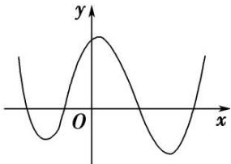

A. 无极大值点、有四个极小值点

B. 有三个极大值点、一个极小值点

C. 有两个极大值点、两个极小值点

D. 有四个极大值点、无极小值点  
（2）设函数 $f(x)$ 在 $\mathbf{R}$ 上可导，其导函数为 $f'(x)$ ，且函数 $y = (1 - x)f'(x)$ 的图象如图所示，则下列结论中一定成立的是（）

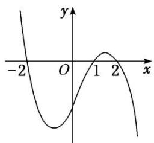

A. 函数 $f(x)$ 有极大值 $f(2)$ 和极小值 $f(1)$

B. 函数 $f(x)$ 有极大值 $f(-2)$ 和极小值 $f(1)$

C. 函数 $f(x)$ 有极大值 $f(2)$ 和极小值 $f(-2)$

D. 函数 $f(x)$ 有极大值 $f(-2)$ 和极小值 $f(2)$  
（3）函数 $f(x) = x^{3} + bx^{2} + cx + d$ 的大致图象如图所示， $x_{1}, x_{2}$ 是函数 $y = f(x)$ 的两个极值点，则 $x_{1}^{2} + x_{2}^{2}$ 等于（）

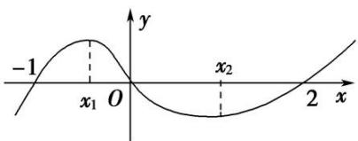

A. $\frac{8}{9}$

B. $\frac{10}{9}$

C. $\frac{16}{9}$

D. $\frac{28}{9}$  
（4）已知函数 $y = \frac{f'(x)}{x}$ 的图象如图所示(其中 $f'(x)$ 是定义域为 $\mathbf{R}$ 的函数 $f(x)$ 的导函数)，则以下说法错误的是()

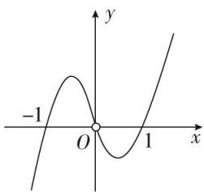

A. $f'（1）=f'(-1)=0$

B. 当 $x = -1$ 时，函数 $f(x)$ 取得极大值

C. 方程 $xf'(x) = 0$ 与 $f(x) = 0$ 均有三个实数根

D. 当 $x = 1$ 时, 函数 $f(x)$ 取得极小值  
（5）(多选)函数 $y = f(x)$ 导函数的图象如图所示，则下列选项正确的有()

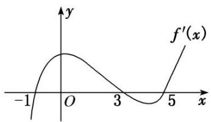

A. $(-1, 3)$ 为函数 $y = f(x)$ 的递增区间

B. (3, 5)为函数 $y = f(x)$ 的递减区间

C. 函数 $y=f(x)$ 在 x=0 处取得极大值

D. 函数 $y = f(x)$ 在 $x = 5$ 处取得极小值  
（6）(2018·全国III)函数 $y=-x^{4}+x^{2}+2$ 的图象大致为()

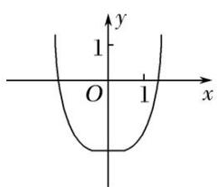

A

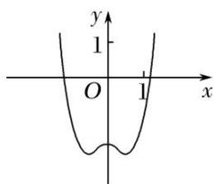

B

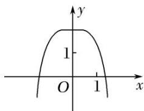

C

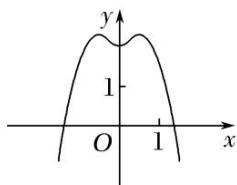

D

# 【对点训练】

1. 如图是 $f(x)$ 的导函数 $f'(x)$ 的图象，则 $f(x)$ 的极小值点的个数为（ ）

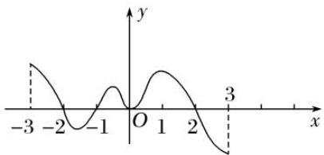

A. 1

B. 2

C. 3

D. 4

2. 设函数 $f(x)$ 在 $\mathbf{R}$ 上可导, 其导函数为 $f'(x)$ , 且函数 $g(x) = xf'(x)$ 的图象如图所示, 则下列结论中一定成立的是( )

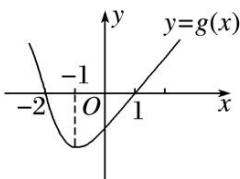

A. $f(x)$ 有两个极值点

B. $f(0)$ 为函数的极大值

C. $f(x)$ 有两个极小值

D. $f(-1)$ 为 $f(x)$ 的极小值

3. 已知函数 $f(x) = x^3 + bx^2 + cx$ 的图象如图所示，则 $x_1^2 + x_2^2$ 等于（）

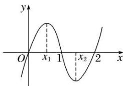

A. $\frac{2}{3}$

B. $\frac{4}{3}$

C. $\frac{8}{3}$

D. $\frac{16}{3}$

4. 已知三次函数 $f(x) = ax^3 + bx^2 + cx + d$ 的图象如图所示，则 $\frac{f'（0）}{f'（1）} =$ \_\_\_\_.

5. (多选)函数 $y=f(x)$ 的导函数 $f'(x)$ 的图象如图所示，则以下命题错误的是()

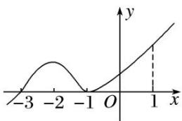

A. -3 是函数 $y = f(x)$ 的极值点

B. -1 是函数 $y = f(x)$ 的最小值点

C. $y=f(x)$ 在区间 $(-3,1)$ 上单调递增

D. $y = f(x)$ 在 $x = 0$ 处切线的斜率小于零

# 考点二 求已知函数的极值

# 【方法总结】

# 求函数的极值或极值点的步骤  
（1）确定函数的定义域;   
（2）求导数 $f'(x)$ ;  
（3）解方程 $f'(x)=0$ ，求出函数定义域内的所有根；
④检查 $f'(x)$ 在方程 $f'(x)=0$ 的根的左右两侧的符号．如果左正右负，那么 $f(x)$ 在这个根处取得极大值；如果左负右正，那么 $f(x)$ 在这个根处取得极小值.

# 【例题选讲】

[例 1]（1）函数 $f(x)=x^{2}e^{-x}$ 的极大值为 \_\_\_\_，极小值为 \_\_\_\_.  
（2）设函数 $f(x)=\frac{2}{x}+\ln x$ ，则()

A. $x = \frac{1}{2}$ 为 $f(x)$ 的极大值点

B. $x = \frac{1}{2}$ 为 $f(x)$ 的极小值点

C. $x = 2$ 为 $f(x)$ 的极大值点

D. $x = 2$ 为 $f(x)$ 的极小值点  
（3）已知函数 $f(x) = 2\mathrm{e}f(\mathrm{e})\ln x - \frac{x}{\mathrm{e}}$ ，则 $f(x)$ 的极大值点为（）

A. $\frac{1}{e}$

B. 1

C. e

D. 2e  
（4）已知 e 为自然对数的底数，设函数 $f(x)=(\mathrm{e}^{x}-1)\cdot(x-1)^{k}(k=1,2)$ ，则()

A. 当 $k = 1$ 时, $f(x)$ 在 $x = 1$ 处取到极小值

B. 当 $k = 1$ 时, $f(x)$ 在 $x = 1$ 处取到极大值

C. 当 $k = 2$ 时, $f(x)$ 在 $x = 1$ 处取到极小值

D. 当 $k = 2$ 时， $f(x)$ 在 $x = 1$ 处取到极大值  
（5）若 x=-2 是函数 $f(x)=(x^{2}+ax-1)\mathrm{e}^{x-1}$ 的极值点，则 $f(x)$ 的极小值为()

A.-1

B. $-2\mathrm{e}^{-3}$

C. $5\mathrm{e}^{-3}$

D. 1  
（6）设 $f'(x)$ 为函数 $f(x)$ 的导函数，已知 $x^{2}f'(x)+xf(x)=\ln x,\quad f(1)=\frac{1}{2}$ ，则下列结论不正确的是()

A. $xf(x)$ 在 $(0, +\infty)$ 上单调递增

B. $xf(x)$ 在 $(0, +\infty)$ 上单调递减

C. $xf(x)$ 在 $(0, +\infty)$ 上有极大值 $\frac{1}{2}$

D. $xf(x)$ 在 $(0, +\infty)$ 上有极小值 $\frac{1}{2}$

[例 2] 给出定义：设 $f'(x)$ 是函数 $y=f(x)$ 的导函数， $f''(x)$ 是函数 $f'(x)$ 的导函数，
若方程 $f''(x)=0$ 有实数解 $x_{0}$ ，则称点 $(x_{0}, f(x_{0}))$ 为函数 $y=f(x)$ 的拐点．已知 $f(x)=ax+\sqrt{3}\sin x-\cos x$ .  
（1）求证：函数 $y=f(x)$ 的拐点 $M(x_{0}, f(x_{0}))$ 在直线 y=ax 上；  
（2） $x\in(0,2\pi)$ 时，讨论 $f(x)$ 的极值点的个数.

[例 3] (2021·天津高考节选)已知 a>0，函数 $f(x)=ax-x\cdot e^{x}$ .  
（1）求函数 $y=f(x)$ 在点 $(0, f(0))$ 处的切点的方程;  
（2）证明 $f(x)$ 存在唯一极值点.

# 【对点训练】

1. 函数 $f(x) = 2x - x\ln x$ 的极值是( )

A. $\frac{1}{e}$

B. $\frac{2}{e}$

C. e

D. $e^{2}$

2. 函数 $f(x) = (x^2 - 1)^2 + 2$ 的极值点是( )

A. $x = 1$

B. $x = -1$

C. x=1 或 -1 或 0

D. x=0

3. 函数 $f(x) = \frac{1}{2} x^2 + \ln x - 2x$ 的极值点的个数是( )

A. 0

B. 1

C. 2

D. 无数

4. 函数 $f(x) = (x^2 - x - 1)e^x$ (其 $e = 2$ . 718...是自然对数的底数)的极值点是 \_\_\_\_；极大值为 \_\_\_\_.

5. 已知函数 $f(x)=ax^{3}-bx+2$ 的极大值和极小值分别为 M, m，则 $M+m=(\quad)$

A. 0

B. 1

C. 2

D. 4

6. 若 $x = -2$ 是函数 $f(x) = \frac{1}{3} x^3 - ax^2 - 2x + 1$ 的一个极值点，则函数 $f(x)$ 的极小值为（）

A. $-\frac{11}{3}$

B. $-\frac{1}{6}$

C. $\frac{1}{6}$

D. $\frac{17}{3}$

7. 已知函数 $f(x) = 2\ln x + ax^2 - 3x$ 在 $x = 2$ 处取得极小值，则 $f(x)$ 的极大值为（）

A. 2

B. $-\frac{5}{2}$

C. $3 + \ln 2$

D. $-2 + 2\ln 2$

8. 已知函数 $f(x)=x\ln x$ ，则()

A. $f(x)$ 的单调递增区间为 $(\mathrm{e}, +\infty)$ 
B. $f(x)$ 在 $\left[0, \frac{1}{\mathrm{e}}\right]$ 上是减函数 
C. 当 $x \in (0, 1]$ 时， $f(x)$ 有最小值 $-\frac{1}{\mathrm{e}}$ 
D. $f(x)$ 在定义域内无极值

9. (多选)已知函数 $f(x) = \frac{x^2 + x - 1}{\mathrm{e}^x}$ ，则下列结论正确的是()

A. 函数 $f(x)$ 存在两个不同的零点  
B. 函数 $f(x)$ 既存在极大值又存在极小值  
C. 当 $-\mathrm{e} < k \leq 0$ 时，方程 $f(x) = k$ 有且只有两个实根  
D. 若 $x \in [t, +\infty)$ 时， $f(x)_{\max} = \frac{5}{\mathrm{e}^2}$ ，则 $t$ 的最小值为2

10. 若函数 $f(x) = (1 - x)(x^2 + ax + b)$ 的图象关于点 $(-2, 0)$ 对称， $x_1, x_2$ 分别是 $f(x)$ 的极大值点与极小值点，则 $x_2 - x_1 =$ \_\_\_\_.

11. 已知函数 $f(x) = \mathrm{e}^{x}(x - 1) - \frac{1}{2}\mathrm{e}^{a}x^{2}, a < 0$ .  
（1）求曲线 $y=f(x)$ 在点 $(0, f(0))$ 处的切线方程；  
（2）求函数 $f(x)$ 的极小值.

12. 已知函数 $f(x) = \frac{\mathrm{e}^x + 2}{x}$ .  
（1）求函数 $f(x)$ 的图象在 $(1, f(1))$ 处的切线方程；  
（2）证明：函数 $f(x)$ 仅有唯一的极小值点.

# 考点三 已知函数的极值(点)求参数的值(范围)

# 【方法总结】

# 由函数极值求参数的值或范围
讨论极值点有无(个数)问题，转化为讨论 $f'(x)=0$ 根的有无(个数). 然后由已知条件列出方程或不等式求出参数的值或范围，特别注意：极值点处的导数为0，而导数为0的点不一定是极值点，要检验导数为0的点两侧导数是否异号.

# 【例题选讲】

[例 1]（1）若函数 $f(x)=x(x-m)^{2}$ 在 x=1 处取得极小值，则 m= \_\_\_\_.  
（2）已知 $f(x)=x^{3}+3ax^{2}+bx+a^{2}$ 在 x=-1 处有极值 0，则 $a+b=$ \_\_\_\_.  
（3）若函数 $f(x)$ 的导数 $f'(x)=\left(x-\frac{5}{2}\right)(x-k)^k(k\geq1,k\in\mathbf{Z})$ ，已知x=k是函数 $f(x)$ 的极大值点，则k= \_\_\_\_.  
（4）设函数 $f(x)=\ln x-\frac{1}{2}ax^{2}-bx$ ，若x=1是 $f(x)$ 的极大值点，则a的取值范围为\_\_\_\_.  
（5）若函数 $f(x) = \frac{ax^2}{2} - (1 + 2a)x + 2\ln x (a > 0)$ 在区间 $\left[\frac{1}{2}, 1\right]$ 内有极大值，则 $a$ 的取值范围是（）

A. $\left(\frac{1}{e},+\infty\right)$

B. $(1, +\infty)$

C. $(1, 2)$

D. $(2, +\infty)$  
（6）若函数 $f(x)=x^{2}-x+a\ln x$ 在 $[1,+\infty)$ 上有极值点，则实数 a 的取值范围为 \_\_\_\_；  
（7）已知函数 $f(x)=x(\ln x-ax)$ 有两个极值点，则实数 a 的取值范围是 \_\_\_\_.  
（8） (2021·全国乙) 设 $a \neq 0$ ，若 $x = a$ 为函数 $f(x) = a(x - a)^2(x - b)$ 的极大值点，则（）

A. $a < b$

B. a>b

C. $ab < a^{2}$

D. $ab > a^{2}$

[例 2] 已知曲线 $f(x)=xe^{x}-\frac{2}{3}ax^{3}-ax^{2}, a\in\mathbf{R}.$  
（1）当 a=0 时，求曲线 $y=f(x)$ 在点 $(1, f(1))$ 处的切线方程；  
（2）若函数 $y=f(x)$ 有三个极值点，求实数 a 的取值范围.

# 【对点训练】

1. 若函数 $f(x) = (x + a)\mathrm{e}^x$ 的极值点为 1，则 $a = (\quad)$

A.-2

B.-1

C. 0

D. 1

2. 已知函数 $f(x) = x(x - c)^2$ 在 $x = 2$ 处有极小值，则实数 $c$ 的值为（）

A. 6

B. 2

C. 2 或 6

D. 0

3. 已知函数 $f(x) = ax^3 + bx^2 + cx - 17(a, b, c \in \mathbf{R})$ 的导函数为 $f'(x), f'(x) \leq 0$ 的解集为 $\{x | -2 \leq x \leq 3\}$ ，若 $f(x)$ 的极小值等于-98，则 $a$ 的值是（）

A. $-\frac{81}{22}$

B. $\frac{1}{3}$

C. 2

D. 5

4. 若函数 $f(x)=x^{3}-2cx^{2}+x$ 有极值点，则实数 c 的取值范围为 \_\_\_\_.

5. 设 $a \in \mathbf{R}$ , 若函数 $y = e^x + ax$ , $x \in \mathbf{R}$ 有大于零的极值点, 则实数 $a$ 的取值范围是 \_\_\_\_.

6. 若函数 $f(x) = (2 - a)\left[(x - 2)e^x - \frac{1}{2}ax^2 + ax\right]$ 在 $\left(\frac{1}{2}, 1\right)$ 上有极大值，则实数 $a$ 的取值范围为（）

A. $(\sqrt{e}, e)$

B. $(\sqrt{e}, 2)$

C. (2, e)

D. $(\mathrm{e}, + \infty)$

7. 已知函数 $f(x) = \frac{x}{\ln x} - ax$ 在 $(1, +\infty)$ 上有极值，则实数 $a$ 的取值范围为（）

A. $\left(-\infty,\frac{1}{4}\right]$

B. $\left(-\infty,\frac{1}{4}\right)$

C. $\left(0,\frac{1}{4}\right]$

D. 0, $\frac{1}{4}$

8. 若函数 $f(x)=x^{2}-x+a\ln x$ 有极值，则实数 a 的取值范围是 \_\_\_\_.

9. 若函数 $f(x)=\frac{1}{2}x^{2}+(a-1)x-a\ln x$ 存在唯一的极值，且此极值不小于 1，则实数 a 的取值范围为 \_\_\_\_.

10. 已知函数 $f(x) = x \ln x + m e^{x}$ (e 为自然对数的底数)有两个极值点，则实数 $m$ 的取值范围是 \_\_\_\_.

11. 已知函数 $f(x) = x \ln x - \frac{1}{2} ax^2 - 2x$ 有两个极值点，则实数 $a$ 的取值范围是 \_\_\_\_.

12. 已知函数 $f(x) = \frac{x}{\mathrm{e}^x} - a$ . 若 $f(x)$ 有两个零点，则实数 $a$ 的取值范围是（）

A. $[0, 1)$

B. $(0, 1)$

C. $\begin{pmatrix}0,\frac{1}{\mathrm{e}}\end{pmatrix}$

D. $\left[0,\frac{1}{e}\right]$

