# 专题08 函数的极值

# 1. 函数的极小值:

函数 $y = f(x)$ 在点 $x = x_0$ 的函数值 $f(x_0)$ 比它在点 $x = x_0$ 附近其他点的函数值都小， $f'(x_0) = 0$ ；而且在点 $x = x_0$ 附近的左侧 $f'(x) < 0$ ，右侧 $f'(x) > 0$ 。则 $x_0$ 叫做函数 $y = f(x)$ 的极小值点， $f(x_0)$ 叫做函数 $y = f(x)$ 的极小值。如图1.

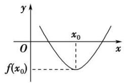

text_image

y
O
x₀
f(x₀)

图1

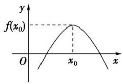

text_image

y
f(x₀)
O
x₀
x

图2

# 2. 函数的极大值:

函数 $y = f(x)$ 在点 $x = x_0$ 的函数值 $f(x_0)$ 比它在点 $x = x_0$ 附近其他点的函数值都大， $f'(x_0) = 0$ ；而且在点 $x = x_0$ 附近的左侧 $f'(x) > 0$ ，右侧 $f'(x) < 0$ 。则 $x_0$ 叫做函数 $y = f(x)$ 的极大值点， $f(x_0)$ 叫做函数 $y = f(x)$ 的极大值。如图2.

3. 极小值点、极大值点统称为极值点，极小值和极大值统称为极值.

对极值的深层理解:

(1)极值点不是点;

(2)极值是函数的局部性质；

(2)按定义，极值点 $x_{i}$ 是区间 $[a, b]$ 内部的点(如图)，不会是端点a，b；

(3)若 $f(x)$ 在 $(a, b)$ 内有极值，那么 $f(x)$ 在 $(a, b)$ 内绝不是单调函数，即在区间上单调的函数没有极值.

(4)根据函数的极值可知函数的极大值 $f(x_0)$ 比在点 $x_0$ 附近的点的函数值都大，在函数的图象上表现为极大值对应的点是局部的“高峰”；函数的极小值 $f(x_0)$ 比在点 $x_0$ 附近的点的函数值都小，在函数的图象上表现为极小值对应的点是局部的“低谷”。一个函数在其定义域内可以有许多极小值和极大值，在某一点处的极小值也可能大于另一个点处的极大值，极大值与极小值没有必然的联系，即极小值不一定比极大值小，极大值不一定比极小值大；

(5)使 $f'(x)=0$ 的点称为函数 $f(x)$ 的驻点，可导函数的极值点一定是它的驻点。驻点可能是极值点，也可能不是极值点。例如 $f(x)=x^{3}$ 的导数 $f'(x)=3x^{2}$ 在点x=0处有 $f'(0)=0$ ，即x=0是 $f(x)=x^{3}$ 的驻点，但从 $f(x)$ 在 $(-∞,+∞)$ 上为增函数可知，x=0不是 $f(x)$ 的极值点。因此若 $f'(x_{0})=0$ ，则 $x_{0}$ 不一定是极值点，即 $f'(x_{0})=0$ 是 $f(x)$ 在 $x=x_{0}$ 处取到极值的必要不充分条件，函数 $y=f'(x)$ 的变号零点，才是函数的极值点；

(6)函数 $f(x)$ 在 $[a, b]$ 上有极值，极值也不一定不唯一。它的极值点的分布是有规律的，如上图，相邻两个极大值点之间必有一个极小值点，同样相邻两个极小值点之间必有一个极大值点。一般地，当函数 $f(x)$ 在 $[a, b]$ 上连续且有有限个极值点时，函数 $f(x)$ 在 $[a, b]$ 内的极大值点、极小值点是交替出现的。

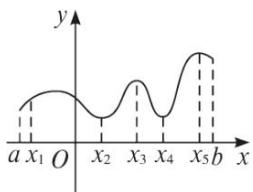

text_image

y
a x₁ O x₂ x₃ x₄ x₅ b x

# 考点一 根据函数图象判断极值

# 【方法总结】

# 由图象判断函数 $y = f(x)$ 的极值

(1) $y=f'(x)$ 的图象与x轴的交点的横坐标为 $x_{0}$ ，可得函数 $y=f(x)$ 的可能极值点 $x_{0}$ ;

(2)如果在 $x_0$ 附近的左侧 $f'(x) > 0$ ，右侧 $f'(x) < 0$ ，那么 $f(x_0)$ 是极大值；如果在 $x_0$ 附近的左侧 $f'(x) \leq 0$ ，右侧 $f'(x) \geq 0$ ，那么 $f(x_0)$ 是极小值.

# 【例题选讲】

[例 1](1)函数 $f(x)$ 的定义域为 R，导函数 $f'(x)$ 的图象如图所示，则函数 $f(x)$ ( )

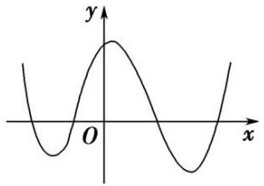

text_image

y
O
x

A. 无极大值点、有四个极小值点

B. 有三个极大值点、一个极小值点

C. 有两个极大值点、两个极小值点

D. 有四个极大值点、无极小值点

答案 C 解析 设 $f'(x)$ 的图象与 x 轴的 4 个交点从左至右依次为 $x_{1}$ ， $x_{2}$ ， $x_{3}$ ， $x_{4}$ 。当 $x < x_{1}$ 时， $f'(x) > 0$ ， $f(x)$ 为增函数，当 $x_{1} < x < x_{2}$ 时， $f'(x) < 0$ ， $f(x)$ 为减函数，则 $x = x_{1}$ 为极大值点，同理， $x = x_{3}$ 为极大值点， $x = x_{2}$ ， $x = x_{4}$ 为极小值点，故选 C.

(2)设函数 $f(x)$ 在 $\mathbf{R}$ 上可导，其导函数为 $f'(x)$ ，且函数 $y = (1 - x)f'(x)$ 的图象如图所示，则下列结论中一定成立的是（）

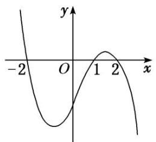

line

| x | y |
|---|---|
| -2 | -2 |
| 0 | 0 |
| 1 | 2 |
| 2 | -2 |

A. 函数 $f(x)$ 有极大值 $f(2)$ 和极小值 $f(1)$

B. 函数 $f(x)$ 有极大值 $f(-2)$ 和极小值 $f(1)$

C. 函数 $f(x)$ 有极大值 $f(2)$ 和极小值 $f(-2)$

D. 函数 $f(x)$ 有极大值 $f(-2)$ 和极小值 $f(2)$

答案 D 解析 由题图可知，当 x<-2 时， $f(x)>0$ ；当 -2<x<1 时， $f(x)<0$ ；当 1<x<2 时， $f(x)<0$ ；当 x>2 时， $f'(x)>0$ 。由此可以得到函数 $f(x)$ 在 x=-2 处取得极大值，在 x=2 处取得极小值。故选 D.

(3)函数 $f(x)=x^{3}+bx^{2}+cx+d$ 的大致图象如图所示， $x_{1}, x_{2}$ 是函数 $y=f(x)$ 的两个极值点，则 $x_{1}^{2}+x_{2}^{2}$ 等于（）

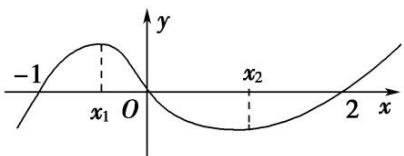

line

| x    | y    |
| ---- | ---- |
| -1   | -1   |
| x₁   | 0    |
| x₂   | 0    |
| 2    | 1    |

A. $\frac{8}{9}$

B. $\frac{10}{9}$

C. $\frac{16}{9}$

D. $\frac{28}{9}$

答案 C 解析 因为函数 $f(x)$ 的图象过原点，所以 d=0 。又 $f(-1)=0$ 且 $f(2)=0$ ，即 $-1+b-c=0$ 且 $8+4b+2c=0$ ，解得 b=-1，c=-2，所以函数 $f(x)=x^{3}-x^{2}-2x$ ，所以 $f'(x)=3x^{2}-2x-2$ 。由题意知 $x_{1}$ ， $x_{2}$ 是函数 $f(x)$ 的极值点，所以 $x_{1}$ ， $x_{2}$ 是 $f'(x)=0$ 的两个根，所以 $x_{1}+x_{2}=\frac{2}{3}$ ， $x_{1}x_{2}=-\frac{2}{3}$ ，所以 $x_{1}^{2}+x_{2}^{2}=(x_{1}+x_{2})^{2}-2x_{1}x_{2}=\frac{4}{9}+\frac{4}{3}=\frac{16}{9}$ ，故选 C

(4)已知函数 $y = \frac{f'(x)}{x}$ 的图象如图所示(其中 $f'(x)$ 是定义域为 $\mathbf{R}$ 的函数 $f(x)$ 的导函数)，则以下说法错误的是()

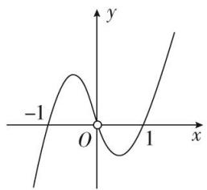

line

| x | y |
|---|---|
| -1 | -1 |
| 0 | 0 |
| 1 | 1 |

A. $f'(1)=f'(-1)=0$

B. 当 $x = -1$ 时，函数 $f(x)$ 取得极大值

C. 方程 $xf'(x) = 0$ 与 $f(x) = 0$ 均有三个实数根

D. 当 $x = 1$ 时，函数 $f(x)$ 取得极小值

答案 C 解析 由图象可知 $f'(1) = f'(-1) = 0$ ，A 说法正确。当 $x < -1$ 时， $\frac{f'(x)}{x} < 0$ ，此时 $f'(x) > 0$ ；当 $-1 < x < 0$ 时， $\frac{f'(x)}{x} > 0$ ，此时 $f(x) < 0$ ，故当 $x = -1$ 时，函数 $f(x)$ 取得极大值，B 说法正确。当 $0 < x < 1$ 时， $\frac{f'(x)}{x} < 0$ ，此时 $f'(x) < 0$ ；当 $x > 1$ 时， $\frac{f'(x)}{x} > 0$ ，此时 $f(x) > 0$ ，故当 $x = 1$ 时，函数 $f(x)$ 取得极小值，D 说法正确。故选 C.

(5)(多选)函数 $y = f(x)$ 导函数的图象如图所示，则下列选项正确的有()

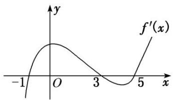

line

| x   | f'(x) |
| --- | ----- |
| -1  | -1.2  |
| 0   | 1.2   |
| 3   | -1.2  |
| 5   | 1.2   |

A. $(-1, 3)$ 为函数 $y = f(x)$ 的递增区间

B. (3, 5)为函数 $y = f(x)$ 的递减区间

C. 函数 $y=f(x)$ 在 x=0 处取得极大值

D. 函数 $y = f(x)$ 在 $x = 5$ 处取得极小值

答案 ABD 解析 由函数 $y = f(x)$ 导函数的图象可知， $f(x)$ 的单调递减区间是 $(- \infty, -1)$ ， $(3, 5)$ ，单调递增区间为 $(-1, 3)$ ， $(5, +\infty)$ ，所以 $f(x)$ 在 $x = -1$ ，5 取得极小值，在 $x = 3$ 取得极大值，C 错误。故选 A、B、D.

(6) (2018·全国III)函数 $y = -x^{4} + x^{2} + 2$ 的图象大致为()

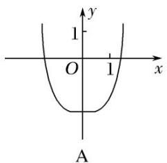

text_image

y
1
O 1 x
A

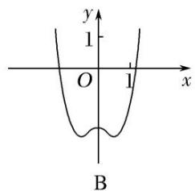

text_image

y
1
O 1 x
B

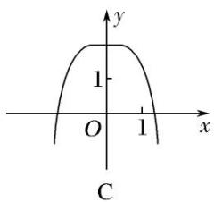

text_image

y
1
O 1 x
C

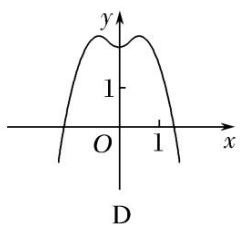

text_image

y
1
O 1 x
D

答案 D 解析 当 $x = 0$ 时， $y = 2$ ，排除 A，B。由 $y' = -4x^3 + 2x = 0$ ，得 $x = 0$ 或 $x = \pm \frac{\sqrt{2}}{2}$ ，结合三次函数的图象特征，知原函数在 $(-1, 1)$ 上有三个极值点，所以排除 C，故选 D。

# 【对点训练】

1. 如图是 $f(x)$ 的导函数 $f'(x)$ 的图象，则 $f(x)$ 的极小值点的个数为( )

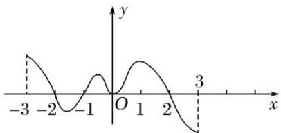

line

| x | y |
|---|---|
| -3 | -0.5 |
| -2 | -0.8 |
| -1 | -0.6 |
| 0 | 0 |
| 1 | 0.7 |
| 2 | 0.4 |
| 3 | -0.9 |

A. 1

B. 2

C. 3

D. 4

1. 答案 A 解析 由题意知在 x = -1 处 $f'(-1) = 0$ ，且其左右两侧导数符号为左负右正.

2. 设函数 $f(x)$ 在 $\mathbf{R}$ 上可导, 其导函数为 $f'(x)$ , 且函数 $g(x) = xf'(x)$ 的图象如图所示, 则下列结论中一定成立的是( )

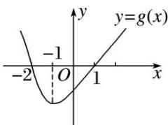

line

| x | y = g(x) |
|---|---|
| -2 | -1 |
| 0 | 0 |
| 1 | 1 |

A. $f(x)$ 有两个极值点

B. $f(0)$ 为函数的极大值

C. $f(x)$ 有两个极小值

D. $f(-1)$ 为 $f(x)$ 的极小值

2. 答案 BC 解析 由题图知，当 $x \in (-\infty, -2)$ 时， $g(x) > 0$ ， $\therefore f'(x) < 0$ ，当 $x \in (-2, 0)$ 时， $g(x) < 0$ ， $\therefore f'(x) > 0$ ，当 $x \in (0, 1)$ 时， $g(x) < 0$ ， $\therefore f'(x) < 0$ ，当 $x \in (1, +\infty)$ 时， $g(x) > 0$ ， $\therefore f'(x) > 0$ 。 $\therefore f(x)$ 在 $(- \infty, -2)$ ， $(0, 1)$ 上单调递减，在 $(-2, 0)$ ， $(1, +\infty)$ 上单调递增。故 AD 错误，BC 正确。

3. 已知函数 $f(x) = x^3 + bx^2 + cx$ 的图象如图所示，则 $x_1^2 + x_2^2$ 等于（）

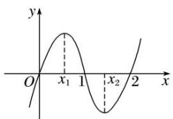

line

| x | y |
|---|---|
| 0 | 0 |
| x₁ | Peak |
| 1 | Minimum |
| x₂ | Peak |
| 2 | Rising |

A. $\frac{2}{3}$

B. $\frac{4}{3}$

C. $\frac{8}{3}$

D. $\frac{16}{3}$

3. 答案 C 解析 由题中图象可知 $f(x)$ 的图象经过点(1, 0)与(2, 0)， $x_1$ ， $x_2$ 是函数 $f(x)$ 的极值点，所以 $1 + b + c = 0$ ， $8 + 4b + 2c = 0$ ，解得 $b = -3$ ， $c = 2$ ，所以 $f(x) = x^3 - 3x^2 + 2x$ ，所以 $f'(x) = 3x^2 - 6x + 2$ ， $x_1$ ， $x_2$ 是方程 $3x^2 - 6x + 2 = 0$ 的两根，所以 $x_1 + x_2 = 2$ ， $x_1 \cdot x_2 = \frac{2}{3}$ ， $\therefore x_1^2 + x_2^2 = (x_1 + x_2)^2 - 2x_1x_2 = 4 - 2 \times \frac{2}{3} = \frac{8}{3}$ .

4. 已知三次函数 $f(x) = ax^3 + bx^2 + cx + d$ 的图象如图所示，则 $\frac{f'(0)}{f'(1)} = \underline{\quad}$ .

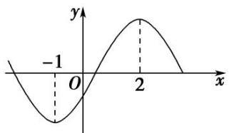

line

| x | y |
|---|---|
| -1 | -1 |
| 0 | 0 |
| 2 | 1 |

4. 答案 1 解析 $f(x) = 3ax^{2} + 2bx + c$ ，由图象知，方程 $f(x) = 0$ 的两根为 -1 和 2，则有

$$
\left\{ \begin{array}{l} - \frac {2 b}{3 a} = - 1 + 2, \\ \frac {c}{3 a} = - 1 \times 2, \end{array} \right.
$$

即 $\left\{ \begin{array}{l}3a + 2b = 0,\\ 6a + c = 0, \end{array} \right.$ $\therefore \frac{f(0)}{f(1)} = \frac{c}{3a + 2b + c} = \frac{c}{c} = 1.$

5. (多选)函数 $y = f(x)$ 的导函数 $f'(x)$ 的图象如图所示，则以下命题错误的是()

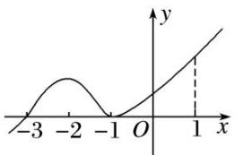

line

| x | y |
|---|---|
| -3 | -3 |
| -2 | 0 |
| -1 | -1 |
| 0 | 0 |
| 1 | 1 |

A. -3 是函数 $y=f(x)$ 的极值点

B. -1 是函数 $y = f(x)$ 的最小值点

C. $y=f(x)$ 在区间 $(-3,1)$ 上单调递增

D. $y = f(x)$ 在 $x = 0$ 处切线的斜率小于零

5. 答案 BD 解析 根据导函数的图象可知当 $x \in (-\infty, -3)$ 时， $f'(x) < 0$ ，当 $x \in (-3, +\infty)$ 时， $f'(x) \geq 0$ ， $\therefore$ 函数 $y = f(x)$ 在 $(- \infty, -3)$ 上单调递减，在 $(-3, +\infty)$ 上单调递增，则-3是函数 $y = f(x)$ 的极值点， $\because$ 函数 $y = f(x)$ 在 $(-3, +\infty)$ 上单调递增， $\therefore -1$ 不是函数 $y = f(x)$ 的最小值点， $\because$ 函数 $y = f(x)$ 在 $x = 0$ 处的导数大于0， $\therefore y = f(x)$ 在 $x = 0$ 处切线的斜率大于零．故错误的命题为BD.

# 考点二 求已知函数的极值

# 【方法总结】

# 求函数的极值或极值点的步骤

(1)确定函数的定义域;

(2)求导数 $f'(x)$ ;

(3)解方程 $f'(x)=0$ ，求出函数定义域内的所有根；

④检查 $f'(x)$ 在方程 $f'(x)=0$ 的根的左右两侧的符号．如果左正右负，那么 $f(x)$ 在这个根处取得极大值；如果左负右正，那么 $f(x)$ 在这个根处取得极小值.

# 【例题选讲】

[例 1](1)函数 $f(x)=x^{2}e^{-x}$ 的极大值为 \_\_\_\_，极小值为 \_\_\_\_.

答案 $4\mathrm{e}^{-2}$ 0 解析 $f(x)$ 的定义域为 $(- \infty, + \infty)$ , $f'(x) = -\mathrm{e}^{-x} x (x - 2)$ . 当 $x \in (-\infty, 0)$ 或 $x \in (2, + \infty)$ 时, $f'(x) < 0$ ; 当 $x \in (0, 2)$ 时, $f'(x) > 0$ . 所以 $f(x)$ 在 $(- \infty, 0)$ , $(2, + \infty)$ 上单调递减, 在 $(0, 2)$ 上单调递增. 故当 $x = 0$ 时, $f(x)$ 取得极小值, 极小值为 $f(0) = 0$ ; 当 $x = 2$ 时, $f(x)$ 取得极大值, 极大值为 $f(2) = 4\mathrm{e}^{-2}$ .

(2)设函数 $f(x)=\frac{2}{x}+\ln x$ ，则()

A. $x = \frac{1}{2}$ 为 $f(x)$ 的极大值点

B. $x = \frac{1}{2}$ 为 $f(x)$ 的极小值点

C. $x = 2$ 为 $f(x)$ 的极大值点

D. $x = 2$ 为 $f(x)$ 的极小值点

答案 D 解析 $f'(x)=-\frac{2}{x^{2}}+\frac{1}{x}=\frac{x-2}{x^{2}}(x>0)$ ，当 0<x<2 时， $f(x)<0$ ，当 x>2 时， $f(x)>0$ ，所以 x=2 为 $f(x)$ 的极小值点.

(3)已知函数 $f(x)=2\mathrm{e}f^{\prime}(\mathrm{e})\ln x-\frac{x}{\mathrm{e}}$ ，则 $f(x)$ 的极大值点为()

A. $\frac{1}{e}$

B. 1

C. e

D. 2e

答案 D 解析 $f'(x)=\frac{2e f'(e)}{x}-\frac{1}{e}$ ，故 $f(e)=\frac{1}{e}$ ，故 $f(x)=2\ln x-\frac{x}{e}$ ，令 $f'(x)=\frac{2}{x}-\frac{1}{e}>0$ ，解得 0<x<2e，令 $f'(x)<0$ ，解得 x>2e，故 $f(x)$ 在 $(0,2e)$ 上递增，在 $(2e,+\infty)$ 上递减，∴ x=2e 时， $f(x)$ 取得极大值 $2\ln 2$ ，则 $f(x)$ 的极大值点为 2e.

(4)已知 e 为自然对数的底数，设函数 $f(x)=(\mathrm{e}^{x}-1)\cdot(x-1)^{k}(k=1,2)$ ，则()

A. 当 $k = 1$ 时, $f(x)$ 在 $x = 1$ 处取到极小值

B. 当 $k = 1$ 时, $f(x)$ 在 $x = 1$ 处取到极大值

C. 当 $k = 2$ 时, $f(x)$ 在 $x = 1$ 处取到极小值

D. 当 $k = 2$ 时, $f(x)$ 在 $x = 1$ 处取到极大值

答案 C 解析 因为 $f'(x)=(x-1)^{k-1}[e^{x}(x-1+k)-k]$ ，当 k=1 时， $f'(1)>0$ ，故 1 不是函数 $f(x)$ 的极值点．当 k=2 时，当 $x_{0}<x<1(x_{0}$ 为 $f(x)$ 的极大值点）时， $f'(x)<0$ ，函数 $f(x)$ 单调递减；当 x>1 时， $f'(x)>0$ ，函数 $f(x)$ 单调递增．故 $f(x)$ 在 x=1 处取到极小值．故选 C.

(5)若 x=-2 是函数 $f(x)=(x^{2}+ax-1)e^{x^{-1}}$ 的极值点，则 $f(x)$ 的极小值为()

A. -1

B. $-2\mathrm{e}^{-3}$

C. $5\mathrm{e}^{-3}$

D. 1

答案 A 解析 $f'(x)=(2x+a)\mathrm{e}^{x-1}+(x^{2}+ax-1)\mathrm{e}^{x-1}=[x^{2}+(a+2)x+a-1]\mathrm{e}^{x-1}$ . ∵ x=-2 是 $f(x)$ 的极值点，∴ $f'(-2)=0$ ，即 $(4-2a-4+a-1)\mathrm{e}^{-3}=0$ ，得 a=-1. ∴ $f(x)=(x^{2}-x-1)\mathrm{e}^{x-1}$ ， $f'(x)=(x^{2}+x-2)\mathrm{e}^{x-1}$ . 由 $f'(x)>0$ ，得 x<-2 或 x>1；由 $f'(x)<0$ ，得 -2<x<1. ∴ $f(x)$ 在 $(-∞,-2)$ 上单调递增，在 $(-2,1)$ 上单调递减，在 $(1,+\infty)$ 上单调递增，∴ $f(x)$ 的极小值点为 1，∴ $f(x)$ 的极小值为 $f(1)=-1$ .

(6)设 $f'(x)$ 为函数 $f(x)$ 的导函数，已知 $x^{2}f'(x)+xf(x)=\ln x,\quad f(1)=\frac{1}{2}$ ，则下列结论不正确的是()

A. $xf(x)$ 在 $(0, +\infty)$ 上单调递增

B. $xf(x)$ 在 $(0, +\infty)$ 上单调递减

C. $xf(x)$ 在 $(0, +\infty)$ 上有极大值 $\frac{1}{2}$

D. $xf(x)$ 在 $(0, +\infty)$ 上有极小值 $\frac{1}{2}$

答案 ABC 解析 由 $x^{2}f'(x) + xf(x) = \ln x$ 得 $x > 0$ ，则 $xf'(x) + f(x) = \frac{\ln x}{x}$ ，即 $[xf(x)]' = \frac{\ln x}{x}$ ，设 $g(x) = xf(x)$ ，即 $g'(x) = \frac{\ln x}{x}$ ，由 $g'(x) > 0$ 得 $x > 1$ ，由 $g'(x) < 0$ 得 $0 < x < 1$ ，即 $xf(x)$ 在 $(1, +\infty)$ 上单调递增，在 $(0, 1)$ 上单调递减，即当 $x = 1$ 时，函数 $g(x) = xf(x)$ 取得极小值 $g(1) = f(1) = \frac{1}{2}$ . 故选ABC.

[例 2] 给出定义：设 $f'(x)$ 是函数 $y=f(x)$ 的导函数， $f''(x)$ 是函数 $f'(x)$ 的导函数，

若方程 $f''(x)=0$ 有实数解 $x_{0}$ ，则称点 $(x_{0}, f(x_{0}))$ 为函数 $y=f(x)$ 的拐点．已知 $f(x)=ax+\sqrt{3}\sin x-\cos x$ .

(1)求证：函数 $y=f(x)$ 的拐点 $M(x_{0}, f(x_{0}))$ 在直线 y=ax 上；

(2) $x\in(0,2\pi)$ 时，讨论 $f(x)$ 的极值点的个数.

解析 (1) $\because f(x) = ax + \sqrt{3}\sin x - \cos x, \therefore f'(x) = a + \sqrt{3}\cos x + \sin x,$

$$
\therefore f ^ {\prime \prime} (x) = - \sqrt {3} \sin x + \cos x, \quad \because f ^ {\prime \prime} (x _ {0}) = 0, \quad \therefore - \sqrt {3} \sin x _ {0} + \cos x _ {0} = 0.
$$

而 $f(x_{0})=ax_{0}+\sqrt{3}\sin x_{0}-\cos x_{0}=ax_{0}$ . ∴点 $M(x_{0},f(x_{0}))$ 在直线 y=ax 上.

(2)令 $f(x)=0$ ，得 $a=-2\sin\left(x+\frac{\pi}{3}\right)$ ,

作出函数 $y = -2 \sin \left( x + \frac{\pi}{3} \right)$ ， $x \in (0, 2\pi)$ 与函数 y = a 的草图如下所示：

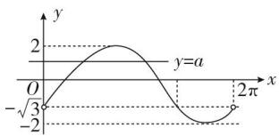

line

| x | y |
|---|---|
| -√3 | 0 |
| 0 | 2 |
| ∞ | -2 |
| 2π | 0 |

由图可知，当 $a \geq 2$ 或 $a \leq -2$ 时， $f(x)$ 无极值点；当 $a = -\sqrt{3}$ 时， $f(x)$ 有一个极值点；

当 $-2<a<-\sqrt{3}$ 或 $-\sqrt{3}<a<2$ 时， $f(x)$ 有两个极值点.

[例 3] (2021·天津高考节选)已知 a > 0，函数 $f(x) = ax - x \cdot e^{x}$ .

(1)求函数 $y=f(x)$ 在点 $(0, f(0))$ 处的切点的方程;

(2)证明 $f(x)$ 存在唯一极值点.

解析 (1) 因为 $f(0)=0$ ， $f'(x)=a-(x+1)e^{x}$ ，所以 $f'(0)=a-1$ ，

所以函数在 $(0, f(0))$ 处的切线方程为 $(a-1)\cdot x-y=0$ .

(2)若证明 $f(x)$ 仅有一个极值点，即证 $f'(x)=a-(x+1)e^{x}=0$ ，只有一个解，

即证 $a=(x+1)e^{x}$ 只有一个解，

令 $g(x)=(x+1)e^{x}$ ，只需证 $g(x)=(x+1)e^{x}$ 的图象与直线 $y=a(a>0)$ 仅有一个交点， $g'(x)=(x+2)e^{x}$

当 x=-2 时， $g'(x)=0$ ，

当 x<-2 时， $g'(x)<0$ ， $g(x)$ 单调递减，当 x>-2 时， $g'(x)>0$ ， $g(x)$ 单调递增，

当 x=-2 时， $g(-2)=-\mathrm{e}^{-2}<0$ 。当 $x\to+\infty$ 时， $g(x)\to+\infty$ ，当 $x\to-\infty$ 时， $g(x)\to0^{-}$

画出函数 $g(x)=(x+1)\mathrm{e}^{x}$ 的图象大致如下，

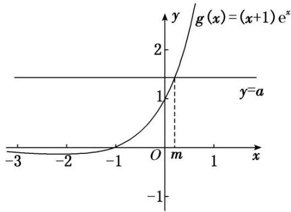

text_image

g(x)=(x+1)e^x
y=a
-3 -2 -1 O m 1 x
-1
-1

因为 a>0，所以 $g(x)=(x+1)e^{x}$ 的图象与直线 $y=a(a>0)$ 仅有一个交点。即 $f(x)$ 存在唯一极值点。

# 【对点训练】

1. 函数 $f(x) = 2x - x\ln x$ 的极值是( )

A. $\frac{1}{e}$

B. $\frac{2}{e}$

C. e

D. $e^{2}$

1. 答案 C 解析 因为 $f'(x)=2-(\ln x+1)=1-\ln x$ ，当 $f'(x)>0$ 时，解得 0<x<e；当 $f'(x)<0$ 时，解得 x>e，所以 x=e 时， $f(x)$ 取到极大值， $f(x)_{\text{极大值}}=f(e)=e$ 。故选 C。

2. 函数 $f(x) = (x^2 - 1)^2 + 2$ 的极值点是（）

A. $x = 1$

B. $x = -1$

C. $x = 1$ 或-1或0

D. x=0

2. 答案 C 解析 $f'(x)=2(x^{2}-1)\cdot2x=4x(x+1)(x-1)$ ，令 $f'(x)=0$ ，解得 x=0 或 x=-1 或 x=1。

3. 函数 $f(x) = \frac{1}{2} x^2 + \ln x - 2x$ 的极值点的个数是( )

A. 0

B. 1

C. 2

D. 无数

3. 答案 A 解析 函数定义域为 $(0, +\infty)$ ，且 $f'(x) = x + \frac{1}{x} - 2 = \frac{x^2 - 2x + 1}{x} = \frac{(x - 1)^2}{x} \geq 0$ ，即 $f(x)$ 在定义域上单调递增，无极值点.

4. 函数 $f(x) = (x^2 - x - 1)e^x$ (其 $e = 2$ . 718...是自然对数的底数)的极值点是 \_\_\_\_；极大值为 \_\_\_\_.

4. 答案 1 或 -2 $\frac{5}{\mathrm{e}^2}$ 解析 由已知得 $f'(x) = (x^2 - x - 1 + 2x - 1)\mathrm{e}^x = (x^2 + x - 2)\mathrm{e}^x = (x + 2)(x - 1)\mathrm{e}^x$ ，因为 $\mathrm{e}^x > 0$ ，令 $f'(x) = 0$ ，可得 $x = -2$ 或 $x = 1$ ，当 $x < -2$ 时， $f'(x) > 0$ ，即函数 $f(x)$ 在 $(- \infty, -2)$ 上单调递增；当 $-2 < x < 1$ 时， $f'(x) < 0$ ，即函数 $f(x)$ 在区间 $(-2, 1)$ 上单调递减；当 $x > 1$ 时， $f'(x) > 0$ ，即函数 $f(x)$ 在区间 $(1, +\infty)$ 上单调递增。故 $f(x)$ 的极值点为 -2 或 1，且极大值为 $f(-2) = \frac{5}{\mathrm{e}^2}$ .

5. 已知函数 $f(x) = ax^3 - bx + 2$ 的极大值和极小值分别为 $M, m$ ，则 $M + m = (\quad)$

A. 0

B. 1

C. 2

D. 4

5. 答案 D 解析 $f(x) = 3ax^2 - b = 0$ ，由题意，知该方程有两个根，设该方程的两个根分别为 $x_1, x_2$ ，故 $f(x)$ 在 $x_1, x_2$ 处取到极值， $M + m = ax_1^3 - bx_1 + 2 + ax_2^3 - bx_2 + 2 = -b(x_1 + x_2) + a(x_1 + x_2)[(x_1 + x_2)^2 - 3x_1x_2] + 4$ ，又 $x_1 + x_2 = 0$ ， $x_1x_2 = -\frac{b}{3a}$ ，所以 $M + m = 4$ ，故选 D.

6. 若 $x = -2$ 是函数 $f(x) = \frac{1}{3} x^3 - ax^2 - 2x + 1$ 的一个极值点，则函数 $f(x)$ 的极小值为（）

A. $-\frac{11}{3}$

B. $-\frac{1}{6}$

C. $\frac{1}{6}$

D. $\frac{17}{3}$

6. 答案 B 解析 由题意，得 $f(x) = x^2 - 2ax - 2$ 。又 $x = -2$ 是函数 $f(x)$ 的一个极值点，所以 $f'(-2) = 2 + 4a = 0$ ，解得 $a = -\frac{1}{2}$ 。所以 $f(x) = \frac{1}{3}x^3 + \frac{1}{2}x^2 - 2x + 1$ ，所以 $f'(x) = x^2 + x - 2 = (x + 2)(x - 1)$ 。当 $x < -2$ 或 $x > 1$ 时， $f'(x) > 0$ ；当 $-2 < x < 1$ 时， $f'(x) < 0$ 。所以函数 $y = f(x)$ 的单调递增区间为 $(- \infty, -2)$ ， $(1, +\infty)$ ，单调递减区间为 $(-2, 1)$ 。当 $x = 1$ 时，函数 $y = f(x)$ 取得极小值，为 $f(1) = \frac{1}{3} + \frac{1}{2} - 2 + 1 = -\frac{1}{6}$ 。故选 B。

7. 已知函数 $f(x) = 2\ln x + ax^2 - 3x$ 在 $x = 2$ 处取得极小值，则 $f(x)$ 的极大值为（）

A. 2

B. $-\frac{5}{2}$

C. $3 + \ln 2$

D. $-2+2\ln2$

7. 答案 B 解析 由题意得， $f'(x)=\frac{2}{x}+2ax-3$ ，∵ $f(x)$ 在 x=2 处取得极小值，∴ $f(2)=4a-2=0$ ，解得 $a=\frac{1}{2}$ ，∴ $f(x)=2\ln x+\frac{1}{2}x^{2}-3x$ ， $f'(x)=\frac{2}{x}+x-3=\frac{(x-1)(x-2)}{x}$ ，∴ $f(x)$ 在 $(0,1)$ ， $(2,+\infty)$ 上单调递增，在 $(1,2)$ 上单调递减，∴ $f(x)$ 的极大值为 $f(1)=\frac{1}{2}-3=-\frac{5}{2}$ .

8. 已知函数 $f(x)=x\ln x$ ，则()

A. $f(x)$ 的单调递增区间为 $(\mathbf{e}, +\infty)$

B. $f(x)$ 在 $\begin{pmatrix}0,&\frac{1}{e}\end{pmatrix}$ 上是减函数

C. 当 $x \in (0, 1]$ 时， $f(x)$ 有最小值 $-\frac{1}{e}$

D. $f(x)$ 在定义域内无极值

8. 答案 BC 解析 因为 $f'(x)=\ln x+1(x>0)$ ，令 $f'(x)=0$ ，所以 $x=\frac{1}{e}$ ，当 $x\in\left(0,\frac{1}{e}\right)$ 时， $f'(x)<0$ ，当 $x\in\left(\frac{1}{e},+\infty\right)$ 时， $f'(x)>0$ ，所以 $f(x)$ 在 $\left(0,\frac{1}{e}\right)$ 上单调递减，在 $\left(\frac{1}{e},+\infty\right)$ 上单调递增， $x=\frac{1}{e}$ 是极小值点，所以 A 错误，B 正确；当 $x\in(0,1]$ 时，根据单调性可知， $f(x)_{\min}=f\left(\frac{1}{e}\right)=-\frac{1}{e}$ ，故 C 正确；显然 $f(x)$ 有极小值 $f\left(\frac{1}{e}\right)$ ，故 D 错误。故选 BC。

9. (多选)已知函数 $f(x) = \frac{x^2 + x - 1}{\mathrm{e}^x}$ ，则下列结论正确的是()

A. 函数 $f(x)$ 存在两个不同的零点  
B. 函数 $f(x)$ 既存在极大值又存在极小值  
C. 当 $-e<k\leq0$ 时，方程 $f(x)=k$ 有且只有两个实根  
D. 若 $x \in [t, +\infty)$ 时， $f(x)_{\max} = \frac{5}{e^{2}}$ ，则 t 的最小值为 2

9. 答案 ABC 解析 由 $f(x) = 0$ ，得 $x^2 + x - 1 = 0$ ， $\therefore x = \frac{-1 \pm \sqrt{5}}{2}$ ，故 A 正确。 $f'(x) = -\frac{x^2 - x - 2}{e^x} =$

$-\frac{(x+1)(x-2)}{\mathrm{e}^x}$ , 当 $x \in (-\infty, -1) \cup (2, +\infty)$ 时, $f'(x) < 0$ , 当 $x \in (-1, 2)$ 时, $f'(x) > 0$ , $\therefore f(x)$ 在 $(- \infty, -1)$ , $(2, +\infty)$ 上单调递减, 在 $(-1, 2)$ 上单调递增, $\therefore f(-1)$ 是函数的极小值, $f(2)$ 是函数的极大值, 故 B 正确. 又 $f(-1) = -\mathrm{e}$ , $f(2) = \frac{5}{\mathrm{e}^2}$ , 且当 $x \to -\infty$ 时, $f(x) \to +\infty$ , $x \to +\infty$ 时, $f(x) \to 0$ , $\therefore f(x)$ 的图象如图所示, 由图知 C 正确, D 不正确.

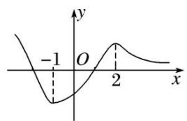

line

| x | y |
|---|---|
| -1 | -1 |
| 0 | 0 |
| 2 | 1 |

10. 若函数 $f(x) = (1 - x)(x^2 + ax + b)$ 的图象关于点 $(-2, 0)$ 对称， $x_1, x_2$ 分别是 $f(x)$ 的极大值点与极小值点，则 $x_2 - x_1 =$ \_\_\_\_.

10. 答案 $-2\sqrt{3}$ 解析 因为函数 $f(x)=(1-x)(x^{2}+ax+b)$ 的图象关于点 $(-2,0)$ 对称，且 $f(1)=0$ ，所以 $f(-5)=0$ ， $f(-2)=0$ ，所以 x=-2，x=-5 是方程 $x^{2}+ax+b=0$ 的两个根。由根与系数的关系可得，a=7，b=10，所以 $f(x)=(1-x)(x^{2}+7x+10)$ ，所以 $f'(x)=-(x^{2}+7x+10)+(1-x)(2x+7)=-3(x^{2}+4x+1)$ 。又因为 $x_{1}, x_{2}$ 分别是 $f(x)$ 的极大值点与极小值点，所以 $x_{1}, x_{2}$ 是 $x^{2}+4x+1=0$ 的两个根，且 $x_{1}>x_{2}$ 。解方程可得， $x_{1}=-2+\sqrt{3}$ ， $x_{2}=-2-\sqrt{3}$ ，所以 $x_{2}-x_{1}=-2\sqrt{3}$ 。

11. 已知函数 $f(x) = \mathrm{e}^{x}(x - 1) - \frac{1}{2}\mathrm{e}^{a}x^{2}, a < 0$ .

(1)求曲线 $y=f(x)$ 在点 $(0, f(0))$ 处的切线方程;

(2)求函数 $f(x)$ 的极小值.

11. 解析 (1) 因为 $f(x)=\mathrm{e}^{x}(x-1)-\frac{1}{2}\mathrm{e}^{a}x^{2}$ ，所以 $f'(x)=xe^{x}-xe^{a}$ 。所以 $f(0)=-1$ ， $f'(0)=0$ 。

所以曲线 $y=f(x)$ 在点 $(0, f(0))$ 处的切线方程为 y=-1.

(2) $f'(x)=xe^{x}-xe^{a}=x(e^{x}-e^{a})$ ，令 $f'(x)=0$ ，得x=0或 $x=a(a<0)$ .

$f(x)$ 与 $f'(x)$ 在R上的变化情况如表：

<table><tr><td>x</td><td> $(-\infty, a)$ </td><td>a</td><td> $(a, 0)$ </td><td>0</td><td> $(0, +\infty)$ </td></tr><tr><td>f&#x27;(x)</td><td>+</td><td>0</td><td>-</td><td>0</td><td>+</td></tr><tr><td>f(x)</td><td></td><td></td><td></td><td></td><td></td></tr></table>

由表可知，当 x=0 时， $f(x)$ 有极小值 $f(0)=-1$ .

12. 已知函数 $f(x)=\frac{e^{x}+2}{x}$ .

(1)求函数 $f(x)$ 的图象在 $(1, f(1))$ 处的切线方程；

(2)证明：函数 $f(x)$ 仅有唯一的极小值点.

12. 解析 (1) 因为 $f(x) = \frac{\mathrm{e}^x(x - 1) - 2}{x^2}$ ，所以切线斜率 $k = f(1) = -2$ .

又因为 $f(1)=\mathrm{e}+2$ ，所以切线方程为 $y-(\mathrm{e}+2)=-2(x-1)$ ，即 $2x+y-\mathrm{e}-4=0$ .

(2)证明：令 $h(x)=\mathrm{e}^{x}(x-1)-2$ ，则 $h'(x)=\mathrm{e}^{x}\cdot x$ ，所以 $x\in(-\infty,0)$ 时， $h'(x)<0$ ，

$x\in(0,+\infty)$ 时， $h'(x)>0$ 。当 $x\in(-\infty,0)$ 时，易知 $h(x)<0$ ，

所以 $f'(x)<0,\ f(x)$ 在 $(-∞,0)$ 上没有极值点.

当 $x \in (0, +\infty)$ 时，因为 $h(1) = -2 < 0,\quad h(2) = e^{2} - 2 > 0,$

所以 $f'(1)<0,\ f'(2)>0,\ f(x)$ 在 $(1,2)$ 上有极小值点.

又因为 $h(x)$ 在 $(0, +\infty)$ 上单调递增，所以函数 $f(x)$ 仅有唯一的极小值点.

# 考点三 已知函数的极值(点)求参数的值(范围)

# 【方法总结】

# 由函数极值求参数的值或范围

讨论极值点有无(个数)问题，转化为讨论 $f'(x)=0$ 根的有无(个数). 然后由已知条件列出方程或不等式求出参数的值或范围，特别注意：极值点处的导数为0，而导数为0的点不一定是极值点，要检验导数为0的点两侧导数是否异号.

# 【例题选讲】

[例 1](1)若函数 $f(x)=x(x-m)^{2}$ 在 x=1 处取得极小值，则 m= \_\_\_\_.

答案 1 解析 由 $f'(1) = 0$ 可得 $m = 1$ 或 $m = 3$ . 当 $m = 3$ 时, $f'(x) = 3(x - 1)(x - 3)$ , 当 $1 < x < 3$ 时, $f'(x) < 0$ ; 当 $x < 1$ 或 $x > 3$ 时, $f'(x) > 0$ , 此时 $f(x)$ 在 $x = 1$ 处取得极大值, 不合题意, 当 $m = 1$ 时, $f'(x) = (x - 1)(3x - 1)$ . 当 $\frac{1}{3} < x < 1$ 时, $f'(x) < 0$ ; 当 $x < \frac{1}{3}$ 或 $x > 1$ 时, $f'(x) > 0$ , 此时 $f(x)$ 在 $x = 1$ 处取得极小值, 符合题意, 所以 $m = 1$ .

(2)已知 $f(x)=x^{3}+3ax^{2}+bx+a^{2}$ 在x=-1处有极值0，则 $a+b=$ \_\_\_\_.

答案 11 解析 $f'(x) = 3x^2 + 6ax + b$ ，由题意得 $\begin{cases} f'(-1) = 0, \\ f(-1) = 0, \end{cases}$ 解得 $\begin{cases} a = 1, \\ b = 3 \end{cases}$ 或 $\begin{cases} a = 2, \\ b = 9, \end{cases}$ 当 $a = 1$ ， $b = 3$ 时， $f'(x) = 3x^2 + 6x + 3 = 3(x + 1)^2 \geq 0$ ，∴ $f(x)$ 在 $\mathbf{R}$ 上单调递增，∴ $f(x)$ 无极值，所以 $a = 1$ ， $b = 3$ 不符合题意，当 $a = 2$ ， $b = 9$ 时，经检验满足题意．∴ $a + b = 11$ .

(3)若函数 $f(x)$ 的导数 $f'(x)=\left(x-\frac{5}{2}\right)(x-k)^k(k\geq1,k\in\mathbf{Z})$ ，已知x=k是函数 $f(x)$ 的极大值点，则k= \_\_\_\_.

答案 1 解析 因为函数的导数为 $f'(x) = \left(x - \frac{5}{2}\right)(x - k)^k$ ， $k \geq 1$ ， $k \in \mathbf{Z}$ ，所以若 $k$ 是偶数，则 $x = k$ ，不是极值点，则 $k$ 是奇数，若 $k < \frac{5}{2}$ ，由 $f'(x) > 0$ ，解得 $x > \frac{5}{2}$ 或 $x < k$ ；由 $f'(x) < 0$ ，解得 $k < x < \frac{5}{2}$ ，即当 $x = k$ 时，函数 $f(x)$ 取得极大值．因为 $k \in \mathbf{Z}$ ，所以 $k = 1$ ．若 $k > \frac{5}{2}$ ，由 $f'(x) > 0$ ，解得 $x > k$ 或 $x < \frac{5}{2}$ ；由 $f'(x) < 0$ ，解得 $\frac{5}{2} < x < k$ ，即当 $x = k$ 时，函数 $f(x)$ 取得极小值，不满足条件．

(4)设函数 $f(x)=\ln x-\frac{1}{2}ax^{2}-bx$ ，若x=1是 $f(x)$ 的极大值点，则a的取值范围为\_\_\_\_.

答案 a>-1 解析 $f(x)$ 的定义域为 $(0, +\infty)$ ， $f'(x)=\frac{1}{x}-ax-b$ ，由 $f'(1)=0$ ，得 b=1-a，所以 $f'(x)$

$= \frac{1}{x} - ax + a - 1 = \frac{-ax^2 + 1 + ax - x}{x} = \frac{-(ax + 1)(x - 1)}{x}$ . ①若 $a \geq 0$ , 当 $0 < x < 1$ 时, $f'(x) > 0$ , $f(x)$ 单调递增; 当 $x > 1$ 时, $f'(x) < 0$ , $f(x)$ 单调递减, 所以 $x = 1$ 是 $f(x)$ 的极大值点. ②若 $a < 0$ , 由 $f'(x) = 0$ , 得 $x = 1$ 或 $x = -\frac{1}{a}$ . 因为 $x = 1$ 是 $f(x)$ 的极大值点, 所以 $-\frac{1}{a} > 1$ , 解得 $-1 < a < 0$ . 综合①②得 $a$ 的取值范围是 $a > -1$ .

(5)若函数 $f(x) = \frac{ax^2}{2} - (1 + 2a)x + 2\ln x (a > 0)$ 在区间 $\left[\frac{1}{2}, 1\right]$ 内有极大值，则 $a$ 的取值范围是（）

A. $\left(\frac{1}{e},+\infty\right)$

B. $(1, +\infty)$

C. $(1, 2)$

D. $(2, +\infty)$

答案 C 解析 $f'(x)=ax-(1+2a)+\frac{2}{x}=\frac{ax^{2}-(2a+1)x+2}{x}(a>0,\ x>0)$ ，若 $f(x)$ 在区间 $\left(\frac{1}{2},\ 1\right)$ 内有极大值，即 $f'(x)=0$ 在 $\left(\frac{1}{2},\ 1\right)$ 内有解，且 $f'(x)$ 在区间 $\left(\frac{1}{2},\ 1\right)$ 内先大于 0，后小于 0，则 $\left\{\begin{aligned}&f'\left(\frac{1}{2}\right)>0,\\&f'(1)<0,\end{aligned}\right.$ 即 $\frac{\frac{1}{4}a-\frac{1}{2}(2a+1)+2}{\frac{1}{2}}>0,$ 解得 1<a<2，故选 C. $a-(2a+1)+2<0,$

(6)若函数 $f(x) = x^{2} - x + a\ln x$ 在 $[1, +\infty)$ 上有极值点，则实数 $a$ 的取值范围为 \_\_\_\_；

答案 $(- \infty, -1]$ 解析 函数 $f(x)$ 的定义域为 $(0, +\infty)$ ， $f'(x) = 2x - 1 + \frac{a}{x} = \frac{2x^2 - x + a}{x}$ ，由题意知 $2x^2 - x + a = 0$ 在 $\mathbf{R}$ 上有两个不同的实数解，且在 $[1, +\infty)$ 上有解，所以 $\Delta = 1 - 8a > 0$ ，且 $2 \times 1^2 - 1 + a \leq 0$ ，所以 $a \in (-\infty, -1]$ .

(7)已知函数 $f(x)=x(\ln x-ax)$ 有两个极值点，则实数 a 的取值范围是 \_\_\_\_.

答案 $\left(0, \frac{1}{2}\right)$ 解析 $f(x) = x(\ln x - ax)$ ，定义域为 $(0, +\infty)$ ， $f'(x) = 1 + \ln x - 2ax$ 。由题意知，当 $x > 0$ 时， $1 + \ln x - 2ax = 0$ 有两个不相等的实数根，即 $2a = \frac{1 + \ln x}{x}$ 有两个不相等的实数根，令 $\varphi(x) = \frac{1 + \ln x}{x}(x > 0)$ ， $\therefore \varphi'(x) = \frac{-\ln x}{x^2}$ 。当 $0 < x < 1$ 时， $\varphi'(x) > 0$ ；当 $x > 1$ 时， $\varphi'(x) < 0$ ， $\therefore \varphi(x)$ 在 $(0, 1)$ 上单调递增，在 $(1, +\infty)$ 上单调递减，且 $\varphi(1) = 1$ ，当 $x \to 0$ 时， $\varphi(x) \to -\infty$ ，当 $x \to +\infty$ 时， $\varphi(x) \to 0$ ，则 $0 < 2a < 1$ ，即 $0 < a < \frac{1}{2}$ 。

(8) (2021·全国乙) 设 $a \neq 0$ ，若 $x = a$ 为函数 $f(x) = a(x - a)^2(x - b)$ 的极大值点，则（）

A. $a < b$

B. a>b

C. $ab < a^{2}$

D. $ab > a^{2}$

答案 D 解析 法一 (特殊值法) 当 $a = 1, b = 2$ 时，函数 $f(x) = (x - 1)^2 (x - 2)$ ，画出该函数的图象如图1所示，可知 $x = 1$ 为函数 $f(x)$ 的极大值点，满足题意。从而，根据 $a = 1, b = 2$ 可判断选项B，C错误；当 $a = -1, b = -2$ 时，函数 $f(x) = -(x + 1)^2 (x + 2)$ ，画出该函数的图象如图2所示，可知 $x = -1$ 为函数 $f(x)$ 的极大值点，满足题意。从而，根据 $a = -1, b = -2$ 可判断选项A错误。

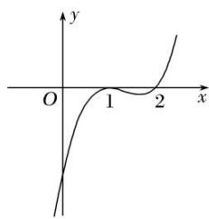

line

| x | y |
|---|---|
| 0 | 0 |
| 1 | 1 |
| 2 | 2 |

图1

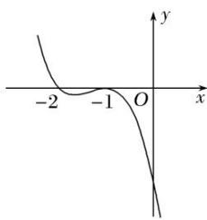

line

| x   | y    |
| --- | ---- |
| -2  | ~0   |
| -1  | ~-0.5|
| 0   | 0    |

图2

法二 (数形结合法)当 a>0 时，根据题意作出函数 $f(x)$ 的大致图象，如图 3 所示，观察可知 b>a.

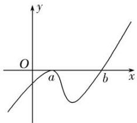

text_image

y
O
a
b
x

图3

当 a<0 时，根据题意作出函数 $f(x)$ 的大致图象，如图 4 所示，观察可知 a>b.

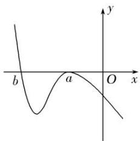

text_image

b
a
O
x
y

图4

综上，可知必有 $ab > a^2$ 成立．故选D.

[例 2] 已知曲线 $f(x)=xe^{x}-\frac{2}{3}ax^{3}-ax^{2}, a\in\mathbf{R}.$

(1)当 a=0 时，求曲线 $y=f(x)$ 在点 $(1, f(1))$ 处的切线方程；  
(2)若函数 $y=f(x)$ 有三个极值点，求实数 a 的取值范围.

解析 (1) 当 a=0 时， $f(x)=xe^{x}\Rightarrow f'(x)=e^{x}+xe^{x}\Rightarrow f'(1)=2e$

又 $f(1)=\mathrm{e}$ ，故曲线 $y=f(x)$ 在 x=1 处的切线方程为 $y-\mathrm{e}=2\mathrm{e}(x-1)$ ，化简得 $y=2\mathrm{e}x-\mathrm{e}$ .

(2) 因为 $f'(x)=\mathrm{e}^{x}(x+1)-2ax(x+1)=(x+1)(\mathrm{e}^{x}-2ax)$ ,

所以令 $f'(x)=0\Rightarrow(x+1)(e^{x}-2ax)=0\Rightarrow x+1=0$ 或 $e^{x}-2ax=0$ ,

由于函数 $y=f(x)$ 有三个极值点，所以方程 $e^{x}-2ax=0$ 必有两个不同的实根，

设 $g(x)=\mathrm{e}^{x}-2ax$ ，则 $g'(x)=\mathrm{e}^{x}-2a$ ，

易知 $a \leq 0$ 时， $g'(x) > 0$ ， $g(x)$ 在 R 上单调递增，不合题意，故 a > 0，所以 $g(x)$ 的两个零点必为正数.

令 $g'(x)=0\Rightarrow e^{x}-2a=0\Rightarrow x=\ln(2a)$ ,

所以在 $x \in (-\infty, \ln(2a))$ 时， $g'(x) < 0$ ， $g(x)$ 单调递减；在 $x \in (\ln(2a), +\infty)$ 时， $g'(x) > 0$ ， $g(x)$ 单调递增.

依题意，要使得函数 $g(x)=\mathrm{e}^{x}-2ax$ 有两个不同的零点 $x_{1}, x_{2}(x_{1}<x_{2})$ ，则 $g(x)_{\min}=g(\ln(2a))<0$ ，

于是 $\mathrm{e}^{\ln(2a)}-2a\ln(2a)<0\Rightarrow2a-2a\ln(2a)<0\Rightarrow1-\ln(2a)<0\Rightarrow a>\frac{\mathrm{e}}{2}.$

所以当 $a > \frac{e}{2}$ 时，在 $x \in (-\infty, -1)$ 时， $f'(x) < 0$ ， $f(x)$ 单调递减，在 $x \in (-1, x_1)$ 时， $f'(x) > 0$ ， $f(x)$ 单调递增，在 $x \in (x_1, x_2)$ 时， $f'(x) < 0$ ， $f(x)$ 单调递减，在 $x \in (x_2, +\infty)$ 时， $f'(x) > 0$ ， $f(x)$ 单调递增.

故实数 a 的取值范围是 $\left(\frac{e}{2}, +\infty\right)$ .

# 【对点训练】

1. 若函数 $f(x) = (x + a)\mathrm{e}^x$ 的极值点为 1，则 $a = (\quad)$

A. -2

B.-1

C. 0

D. 1

1. 答案 A 解析 $f'(x)=\mathrm{e}^{x}+(x+a)\mathrm{e}^{x}=(x+a+1)\mathrm{e}^{x}$ . 由题意知 $f'(1)=\mathrm{e}(2+a)=0,\therefore a=-2$ . 故选 A.

2. 已知函数 $f(x) = x(x - c)^2$ 在 $x = 2$ 处有极小值，则实数 $c$ 的值为（）

A. 6

B. 2

C. 2 或 6

D. 0

2. 答案 B 解析 由 $f(2) = 0$ 可得 $c = 2$ 或 6. 当 $c = 2$ 时, 结合图象(图略)可知函数先增后减再增, 在 $x = 2$ 处取得极小值; 当 $c = 6$ 时, 结合图象(图略)可知, 函数在 $x = 2$ 处取得极大值. 故选 B.

3. 已知函数 $f(x) = ax^3 + bx^2 + cx - 17(a, b, c \in \mathbf{R})$ 的导函数为 $f'(x), f'(x) \leq 0$ 的解集为 $\{x | -2 \leq x \leq 3\}$ ，若 $f(x)$ 的极小值等于-98，则 $a$ 的值是（）

A. $-\frac{81}{22}$

B. $\frac{1}{3}$

C. 2

D. 5

3. 答案 C 解析 由题意, $f(x) = 3ax^2 + 2bx + c$ , 因为 $f(x) \leq 0$ 的解集为 $\{x | -2 \leq x \leq 3\}$ , 所以 $a > 0$ , 且 $-2 + 3 = -\frac{2b}{3a}$ , $-2 \times 3 = \frac{c}{3a}$ , 则 $3a = -2b$ , $c = -18a$ , $f(x)$ 的极小值为 $f(3) = 27a + 9b + 3c - 17 = -98$ , 解得 $a = 2$ , $b = -3$ , $c = -36$ , 故选 C.

4. 若函数 $f(x)=x^{3}-2cx^{2}+x$ 有极值点，则实数 c 的取值范围为 \_\_\_\_.

4. 答案 $\left(-\infty, -\frac{\sqrt{3}}{2}\right)\cup\left(\frac{\sqrt{3}}{2}, +\infty\right)$ 解析 若函数 $f(x)=x^{3}-2cx^{2}+x$ 有极值点，则 $f'(x)=3x^{2}-4cx+1=0$ 有两个不等实根，故 $\Delta=(-4c)^{2}-12>0$ ，解得 $c>\frac{\sqrt{3}}{2}$ 或 $c<-\frac{\sqrt{3}}{2}$ 。所以实数 c 的取值范围为 $\left(-\infty, -\frac{\sqrt{3}}{2}\right)\cup\left(\frac{\sqrt{3}}{2}, +\infty\right)$ .

5. 设 $a \in \mathbf{R}$ , 若函数 $y = \mathrm{e}^{x} + ax$ , $x \in \mathbf{R}$ 有大于零的极值点, 则实数 $a$ 的取值范围是 \_\_\_\_.

5. 答案 $(- \infty, -1)$ 解析 由 $y' = e^x + a = 0$ 得 $x = \ln (-a)(a < 0)$ ，显然 $x = \ln (-a)$ 为函数的极小值点，又 $\ln (-a) > 0$ ， $\therefore -a > 1$ ，即 $a < -1$ 。

6. 若函数 $f(x) = (2 - a)\left[(x - 2)e^x - \frac{1}{2}ax^2 + ax\right]$ 在 $\left(\frac{1}{2}, 1\right)$ 上有极大值，则实数 $a$ 的取值范围为（）

A. $(\sqrt{e}, e)$

B. $(\sqrt{e}, 2)$

C. (2, e)

D. $(e, +\infty)$

6. 答案 B 解析 令 $f(x) = (2 - a)(x - 1)(\mathrm{e}^x - a) = 0$ ，得 $x = \ln a \in \left(\frac{1}{2}, 1\right)$ ，解得 $a \in (\sqrt{\mathrm{e}}, \mathrm{e})$ ，由题意知，当 $x \in \left(\frac{1}{2}, \ln a\right)$ 时， $f(x) > 0$ ，当 $x \in (\ln a, 1)$ 时， $f(x) < 0$ ，所以 $2 - a > 0$ ，得 $a < 2$ 。综上， $a \in (\sqrt{\mathrm{e}}, 2)$ 。故选 B.

7. 已知函数 $f(x) = \frac{x}{\ln x} - ax$ 在 $(1, +\infty)$ 上有极值，则实数 $a$ 的取值范围为（）

A. $\left(-\infty,\frac{1}{4}\right]$

B. $\left(-\infty,\frac{1}{4}\right)$

C. $\left\{0,\frac{1}{4}\right]$

D. 0, $\frac{1}{4}$

7. 答案 B 解析 $f(x)=\frac{\ln x-1}{(\ln x)^{2}}-a$ ，设 $g(x)=\frac{\ln x-1}{(\ln x)^{2}}=\frac{1}{\ln x}-\frac{1}{(\ln x)^{2}}$ ，因为函数 $f(x)$ 在 $(1,+\infty)$ 上有极值，所以 $f'(x)=g(x)-a$ 有正有负。令 $\frac{1}{\ln x}=t$ ，由 x>1 可得 $\ln x>0$ ，即 t>0，得到 $y=t-t^{2}=-\left(t-\frac{1}{2}\right)^{2}+\frac{1}{4}\leq\frac{1}{4}$ 。所以 $a<\frac{1}{4}$ ，故选 B.

8. 若函数 $f(x)=x^{2}-x+a\ln x$ 有极值，则实数 a 的取值范围是 \_\_\_\_.

8. 答案 $\left(-\infty, \frac{1}{8}\right)$ 解析 $f(x)$ 的定义域为 $(0, +\infty)$ ， $f'(x)=2x-1+\frac{a}{x}=\frac{2x^{2}-x+a}{x}$ ，由题意知 $y=f'(x)$ 有变号零点，令 $2x^{2}-x+a=0$ ，即 $a=-2x^{2}+x(x>0)$ ，令 $\varphi(x)=-2x^{2}+x=-2\left(x-\frac{1}{4}\right)^{2}+\frac{1}{8}(x>0)$ ，其图象如图所示，故 $a<\frac{1}{8}$ .

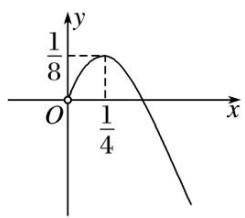

line

| Point | x | y |
|---|---|---|
| O | 0 | 0 |
| 1/4 | 0.5 | 0.8 |
| 1/8 | 0.75 | 0.95 |
| (final point) | 1.25 | 0.6 |

9. 若函数 $f(x)=\frac{1}{2}x^{2}+(a-1)x-a\ln x$ 存在唯一的极值，且此极值不小于 1，则实数 a 的取值范围为 \_\_\_\_.

9. 答案 $\left[\frac{3}{2}, +\infty\right]$ 解析 对函数求导得 $f(x) = x - 1 + a\left(1 - \frac{1}{x}\right) = \frac{(x + a)(x - 1)}{x}, x > 0$ ，因为函数存在唯一的极值，所以导函数存在唯一的零点，且零点大于0，故 $x = 1$ 是唯一的极值点，此时 $-a \leq 0$ ，且 $f(1) = -\frac{1}{2} + a \geq 1$ ，所以 $a \geq \frac{3}{2}$ .

10. 已知函数 $f(x) = x \ln x + m e^{x}$ (e 为自然对数的底数)有两个极值点，则实数 $m$ 的取值范围是 \_\_\_\_.

10. 答案 $\left(-\frac{1}{e}, 0\right)$ 解析 $f(x)=x\ln x+me^{x}(x>0)$ ， $\therefore f'(x)=\ln x+1+me^{x}(x>0)$ ，令 $f'(x)=0$ ，得 $-m=\frac{\ln x+1}{e^{x}}$ ，设 $g(x)=\frac{\ln x+1}{e^{x}}$ ，则 $g'(x)=\frac{\frac{1}{x}-\ln x-1}{e^{x}}(x>0)$ ，令 $h(x)=\frac{1}{x}-\ln x-1$ ，则 $h'(x)=-\frac{1}{x^{2}}-\frac{1}{x}<0(x>0)$ ， $\therefore h(x)$ 在 $(0,+\infty)$ 上单调递减且 $h(1)=0$ ， $\therefore$ 当 $x\in(0,1]$ 时， $h(x)\geq0$ ，即 $g'(x)\geq0$ ， $g(x)$ 在 $(0,1]$ 上单调递增；当 $x\in(1,+\infty)$ 时， $h(x)<0$ ，即 $g'(x)<0$ ， $g(x)$ 在 $(1,+\infty)$ 上单调递减，故 $g(x)_{\max}=g(1)=\frac{1}{e}$ ，而当 $x\to0$ 时， $g(x)\to-\infty$ ，当 $x\to+\infty$ 时， $g(x)\to0$ ，若 $f(x)$ 有两极值点，只要 y=-m 和 $g(x)$ 的图象在 $(0,+\infty)$ 上有两个交点，

只需 $0 < -m < \frac{1}{e}$ ，故 $-\frac{1}{e} < m < 0$ .

11. 已知函数 $f(x) = x \ln x - \frac{1}{2} ax^2 - 2x$ 有两个极值点，则实数 $a$ 的取值范围是 \_\_\_\_.

11. 答案 $\left(0, \frac{1}{\mathrm{e}^{2}}\right)$ 解析 $f(x)$ 的定义域为 $(0, +\infty)$ ，且 $f'(x) = \ln x - ax - 1$ 。根据题意可得 $f'(x)$ 在 $(0, +\infty)$ 上有两个不同的零点，则 $\ln x - ax - 1 = 0$ 有两个不同的正根，从而转化为 $a = \frac{\ln x - 1}{x}$ 有两个不同的正根，所以 y = a 与 $y = \frac{\ln x - 1}{x}$ 的图象有两个不同的交点，令 $h(x) = \frac{\ln x - 1}{x}$ ，则 $h'(x) = \frac{2 - \ln x}{x^2}$ ，令 $h'(x) > 0$ 得 $0 < x < e^2$ ，令 $h'(x) < 0$ 得 $x > e^2$ ，所以函数 $h(x)$ 在 $(0, e^2)$ 为增函数，在 $(e^2, +\infty)$ 为减函数，又 $h(e^2) = \frac{1}{e^2}$ ， $x \to 0$ 时， $h(x) \to -\infty$ ， $x \to +\infty$ 时， $h(x) \to 0$ ，所以 $0 < a < \frac{1}{e^2}$ 。

12. 已知函数 $f(x) = \frac{x}{\mathrm{e}^x} - a$ . 若 $f(x)$ 有两个零点，则实数 $a$ 的取值范围是( )

A. $[0, 1)$ B. $(0, 1)$ C. $\left[0, \frac{1}{\mathrm{e}}\right]$ D. $\left[0, \frac{1}{\mathrm{e}}\right]$

12. 答案 C 解析 $f'(x)=\frac{1-x}{\mathrm{e}^{x}}$ ，所以 $f'(x)$ ， $f(x)$ 的变化如下表：

<table><tr><td>x</td><td> $(-\infty, 1)$ </td><td>1</td><td> $(1, +\infty)$ </td></tr><tr><td>f(x)</td><td>+</td><td>0</td><td>-</td></tr><tr><td>f(x)</td><td></td><td>极大值</td><td></td></tr></table>

若 a=0, x>0 时， $f(x)>0$ ， $f(x)$ 最多只有一个零点，所以 $a\neq0$ 。若 $f(x)$ 有两个零点，则 $\frac{1}{e}-a>0$ ，即 $a<\frac{1}{e}$ ，结合 a=0 时 $f(x)$ 的符号知 $0<a<\frac{1}{e}$ 。故选 C.

