专题08　函数的极值

1．函数的极小值：

函数<em>y</em>＝<em>f</em>(<em>x</em>)在点<em>x</em>＝<em>x</em>0的函数值<em>f</em>(<em>x</em>0)比它在点<em>x</em>＝<em>x</em>0附近其他点的函数值都小，<em>f</em>′(<em>x</em>0)＝0；而且在点<em>x</em>＝<em>x</em>0附近的左侧<em>f</em>′(<em>x</em>)&lt;0，右侧<em>f</em>′(<em>x</em>)&gt;0．则<em>x</em>0叫做函数<em>y</em>＝<em>f</em>(<em>x</em>)的极小值点，<em>f</em>(<em>x</em>0)叫做函数<em>y</em>＝<em>f</em>(<em>x</em>)的极小值．如图1．

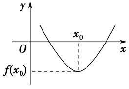

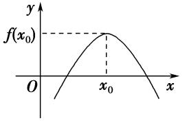  
图1　　　　　　　　　　　　　　　　图2

2．函数的极大值：

函数<em>y</em>＝<em>f</em>(<em>x</em>)在点<em>x</em>＝<em>x</em>0的函数值<em>f</em>(<em>x</em>0)比它在点<em>x</em>＝<em>x</em>0附近其他点的函数值都大，<em>f</em>′(<em>x</em>0)＝0；而且在点<em>x</em>＝<em>x</em>0附近的左侧<em>f</em>′(<em>x</em>)&gt;0，右侧<em>f</em>′(<em>x</em>)&lt;0．则<em>x</em>0叫做函数<em>y</em>＝<em>f</em>(<em>x</em>)的极大值点，<em>f</em>(<em>x</em>0)叫做函数<em>y</em>＝<em>f</em>(<em>x</em>)的极大值．如图2．

3．极小值点、极大值点统称为极值点，极小值和极大值统称为极值．

对极值的深层理解：

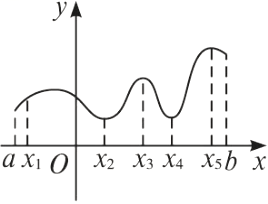  
（1）极值点不是点；  
（2）极值是函数的局部性质；  
（2）按定义，极值点<em>xi</em>是区间［<em>a</em>，<em>b</em>］内部的点(如图)，不会是端点<em>a</em>，<em>b</em>；  
（3）若*f*(*x*)在(*a*，*b*)内有极值，那么*f*(*x*)在(*a*，*b*)内绝不是单调函数，即在区间上单调的函数没有极值．  
（4）根据函数的极值可知函数的极大值<em>f</em>(<em>x</em>0)比在点<em>x</em>0附近的点的函数值都大，在函数的图象上表现为极大值对应的点是局部的“高峰”；函数的极小值<em>f</em>(<em>x</em>0)比在点<em>x</em>0附近的点的函数值都小，在函数的图象上表现为极小值对应的点是局部的“低谷”．一个函数在其定义域内可以有许多极小值和极大值，在某一点处的极小值也可能大于另一个点处的极大值，极大值与极小值没有必然的联系，即极小值不一定比极大值小，极大值不一定比极小值大；  
（5）使<em>f</em>′(<em>x</em>)＝0的点称为函数<em>f</em>(<em>x</em>)的驻点，可导函数的极值点一定是它的驻点．驻点可能是极值点，也可能不是极值点．例如<em>f</em>(<em>x</em>)＝<em>x</em>3的导数<em>f</em>′(<em>x</em>)＝3<em>x</em>2在点<em>x</em>＝0处有<em>f</em>′（0）＝0，即<em>x</em>＝0是<em>f</em>(<em>x</em>)＝<em>x</em>3的驻点，但从<em>f</em>(<em>x</em>)在(－∞，＋∞)上为增函数可知，<em>x</em>＝0不是<em>f</em>(<em>x</em>)的极值点．因此若<em>f</em>′(<em>x</em>0)＝0，则<em>x</em>0不一定是极值点，即<em>f</em>′(<em>x</em>0)＝0是<em>f</em>(<em>x</em>)在<em>x</em>＝<em>x</em>0处取到极值的必要不充分条件，函数<em>y</em>＝<em>f</em>′(<em>x</em>)的变号零点，才是函数的极值点；  
（6）函数*f*(*x*)在［*a*，*b*］上有极值，极值也不一定不唯一．它的极值点的分布是有规律的，如上图，相邻两个极大值点之间必有一个极小值点，同样相邻两个极小值点之间必有一个极大值点．一般地，当函数*f*(*x*)在［*a*，*b*］上连续且有有限个极值点时，函数*f*(*x*)在［*a*，*b*］内的极大值点、极小值点是交替出现的．

考点一　根据函数图象判断极值

【方法总结】
由图象判断函数*y*＝*f*(*x*)的极值  
（1）<em>y</em>＝<em>f</em>′(<em>x</em>)的图象与<em>x</em>轴的交点的横坐标为<em>x</em>0，可得函数<em>y</em>＝<em>f</em>(<em>x</em>)的可能极值点<em>x</em>0；  
（2）如果在<em>x</em>0附近的左侧<em>f</em>′(<em>x</em>)＞0，右侧<em>f</em>′(<em>x</em>)＜0，那么<em>f</em>(<em>x</em>0)是极大值；如果在<em>x</em>0附近的左侧<em>f</em>′(<em>x</em>)≤0，右侧<em>f</em>′(<em>x</em>)≥0，那么<em>f</em>(<em>x</em>0)是极小值．

【例题选讲】

<strong>[例1]</strong>（1）函数<em>f</em>(<em>x</em>)的定义域为<strong>R</strong>，导函数<em>f</em>′(<em>x</em>)的图象如图所示，则函数<em>f</em>(<em>x</em>)(　　)

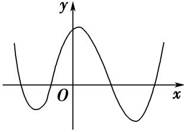

A．无极大值点、有四个极小值点　　　　　　　　
B．有三个极大值点、一个极小值点

C．有两个极大值点、两个极小值点　　　　　　　
D．有四个极大值点、无极小值点
答案　<strong>C</strong>　解析　设<em>f</em>′(<em>x</em>)的图象与<em>x</em>轴的4个交点从左至右依次为<em>x</em>1，<em>x</em>2，<em>x</em>3，<em>x</em>4．当<em>x</em>＜<em>x</em>1时，<em>f</em>′(<em>x</em>)＞0，<em>f</em>(<em>x</em>)为增函数，当<em>x</em>1＜<em>x</em>＜<em>x</em>2时，<em>f</em>′(<em>x</em>)＜0，<em>f</em>(<em>x</em>)为减函数，则<em>x</em>＝<em>x</em>1为极大值点，同理，<em>x</em>＝<em>x</em>3为极大值点，<em>x</em>＝<em>x</em>2，<em>x</em>＝<em>x</em>4为极小值点，故选C．  
（2）设函数<em>f</em>(<em>x</em>)在<strong>R</strong>上可导，其导函数为<em>f</em>′(<em>x</em>)，且函数<em>y</em>＝(1－<em>x</em>)<em>f</em>′(<em>x</em>)的图象如图所示，则下列结论中一定成立的是(　　)

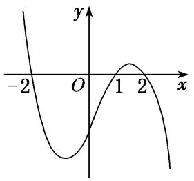

A．函数*f*(*x*)有极大值*f*（2）和极小值*f*（1）　　　　　
B．函数*f*(*x*)有极大值*f*(－2)和极小值*f*（1）

C．函数*f*(*x*)有极大值*f*（2）和极小值*f*(－2)　　　　
D．函数*f*(*x*)有极大值*f*(－2)和极小值*f*（2）
答案　D　解析　由题图可知，当*x*<－2时，*f*′(*x*)>0；当－2<*x*<1时，*f*′(*x*)<0；当1<*x*<2时，*f*′(*x*)<0；当*x*>2时，*f*′(*x*)>0．由此可以得到函数*f*(*x*)在*x*＝－2处取得极大值，在*x*＝2处取得极小值．故选D．  
（3）函数<em>f</em>(<em>x</em>)＝<em>x</em>3＋<em>bx</em>2＋<em>cx</em>＋<em>d</em>的大致图象如图所示，<em>x</em>1，<em>x</em>2是函数<em>y</em>＝<em>f</em>(<em>x</em>)的两个极值点，则<em>x</em>＋<em>x</em>等于(　　)

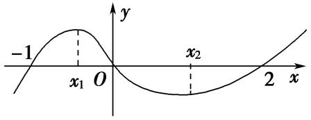

A．　　　　　　　　
B．　　　　　　　　
C．　　　　　　　　
D．
答案　<strong>C</strong>　解析　因为函数<em>f</em>(<em>x</em>)的图象过原点，所以<em>d</em>＝0．又<em>f</em>(－1)＝0且<em>f</em>（2）＝0，即－1＋<em>b</em>－<em>c</em>＝0且8＋4<em>b</em>＋2<em>c</em>＝0，解得<em>b</em>＝－1，<em>c</em>＝－2，所以函数<em>f</em>(<em>x</em>)＝<em>x</em>3－<em>x</em>2－2<em>x</em>，所以<em>f</em>′(<em>x</em>)＝3<em>x</em>2－2<em>x</em>－2．由题意知<em>x</em>1，<em>x</em>2是函数<em>f</em>(<em>x</em>)的极值点，所以<em>x</em>1，<em>x</em>2是<em>f</em>′(<em>x</em>)＝0的两个根，所以<em>x</em>1＋<em>x</em>2＝，<em>x</em>1<em>x</em>2＝－，所以<em>x</em>＋<em>x</em>＝(<em>x</em>1＋<em>x</em>2)2－2<em>x</em>1<em>x</em>2＝＋＝，故选C  
（4）已知函数<em>y</em>＝的图象如图所示(其中<em>f</em>′(<em>x</em>)是定义域为<strong>R</strong>的函数<em>f</em>(<em>x</em>)的导函数)，则以下说法错误的是(　　)

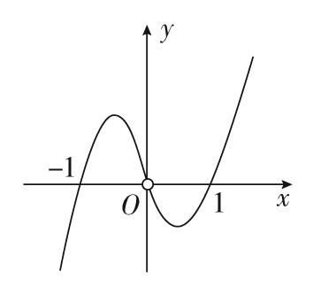

A．*f*′（1）＝*f*′(－1)＝0　　　　　　　　　　　　　　
B．当*x*＝－1时，函数*f*(*x*)取得极大值

C．方程*xf*′(*x*)＝0与*f*(*x*)＝0均有三个实数根　　　　
D．当*x*＝1时，函数*f*(*x*)取得极小值
答案　C　解析　由图象可知*f*′（1）＝*f*′(－1)＝0，A说法正确．当*x*<－1时，<0，此时*f*′(*x*)>0；当－1<*x*<0时，>0，此时*f*′(*x*)<0，故当*x*＝－1时，函数*f*(*x*)取得极大值，B说法正确．当0<*x*<1时，<0，此时*f*′(*x*)<0；当*x*>1时，>0，此时*f*′(*x*)>0，故当*x*＝1时，函数*f*(*x*)取得极小值，D说法正确．故选C．  
（5）(多选)函数*y*＝*f*(*x*)导函数的图象如图所示，则下列选项正确的有(　　)

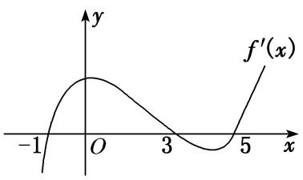

A．(－1，3)为函数*y*＝*f*(*x*)的递增区间　　　　　　
B．(3，5)为函数*y*＝*f*(*x*)的递减区间

C．函数*y*＝*f*(*x*)在*x*＝0处取得极大值　　　　　　
D．函数*y*＝*f*(*x*)在*x*＝5处取得极小值
答案　ABD　解析　由函数*y*＝*f*(*x*)导函数的图象可知，*f*(*x*)的单调递减区间是(－∞，－1)，(3，5)，单调递增区间为(－1，3)，(5，＋∞)，所以*f*(*x*)在*x*＝－1，5取得极小值，在*x*＝3取得极大值，C错误．故选A、B、D．  
（6） (2018·全国Ⅲ)函数<em>y</em>＝－<em>x</em>4＋<em>x</em>2＋2的图象大致为(　　)

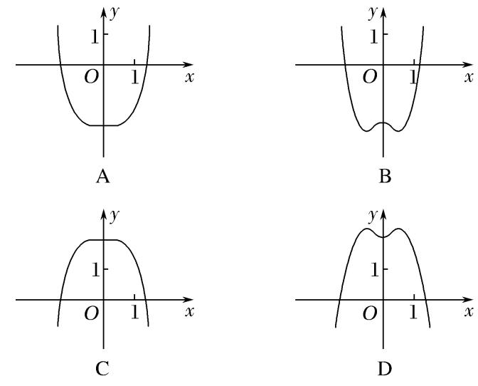
答案　D　解析　当<em>x</em>＝0时，<em>y</em>＝2，排除A，B．由<em>y</em>′＝－4<em>x</em>3＋2<em>x</em>＝0，得<em>x</em>＝0或<em>x</em>＝±，结合三次函数的图象特征，知原函数在(－1，1)上有三个极值点，所以排除C，故选D．

【对点训练】

1．如图是*f*(*x*)的导函数*f*′(*x*)的图象，则*f*(*x*)的极小值点的个数为(　　)

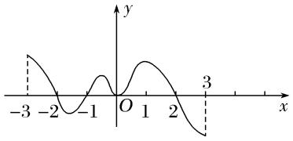

A．1　　　　　　　　
B．2　　　　　　　　
C．3　　　　　　　　
D．4

1．答案　A　解析　由题意知在*x*＝－1处*f*′(－1)＝0，且其左右两侧导数符号为左负右正．

2．设函数<em>f</em>(<em>x</em>)在<strong>R</strong>上可导，其导函数为<em>f</em>′(<em>x</em>)，且函数<em>g</em>(<em>x</em>)＝<em>xf</em>′(<em>x</em>)的图象如图所示，则下列结论中一定成立

的是(　　)

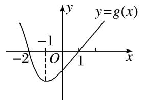

A．*f*(*x*)有两个极值点　　　　　　　　　　　　　　　
B．*f*（0）为函数的极大值

C．*f*(*x*)有两个极小值　　　　　　　　　　　　　　　
D．*f*(－1)为*f*(*x*)的极小值

2．答案　BC　解析　由题图知，当*x*∈(－∞，－2)时，*g*(*x*)>0，∴*f*′(*x*)<0，当*x*∈(－2，0)时，*g*(*x*)<0，∴*f*′(*x*)

>0，当*x*∈(0，1)时，*g*(*x*)<0，∴*f*′(*x*)<0，当*x*∈(1，＋∞)时，*g*(*x*)>0，∴*f*′(*x*)>0．∴*f*(*x*)在(－∞，－2)，(0，1)上单调递减，在(－2，0)，(1，＋∞)上单调递增．故AD错误，BC正确．

3．已知函数<em>f</em>(<em>x</em>)＝<em>x</em>3＋<em>bx</em>2＋<em>cx</em>的图象如图所示，则<em>x</em>＋<em>x</em>等于(　　)

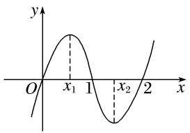

A．　　　　　　　　
B．　　　　　　　　
C．　　　　　　　　
D．

3．答案　C　解析　由题中图象可知<em>f</em>(<em>x</em>)的图象经过点(1，0)与(2，0)，<em>x</em>1，<em>x</em>2是函数<em>f</em>(<em>x</em>)的极值点，所以1

＋<em>b</em>＋<em>c</em>＝0，8＋4<em>b</em>＋2<em>c</em>＝0，解得<em>b</em>＝－3，<em>c</em>＝2，所以<em>f</em>(<em>x</em>)＝<em>x</em>3－3<em>x</em>2＋2<em>x</em>，所以<em>f</em>′(<em>x</em>)＝3<em>x</em>2－6<em>x</em>＋2，<em>x</em>1，<em>x</em>2是方程3<em>x</em>2－6<em>x</em>＋2＝0的两根，所以<em>x</em>1＋<em>x</em>2＝2，<em>x</em>1·<em>x</em>2＝，∴<em>x</em>＋<em>x</em>＝(<em>x</em>1＋<em>x</em>2)2－2<em>x</em>1<em>x</em>2＝4－2×＝．

4．已知三次函数<em>f</em>(<em>x</em>)＝<em>ax</em>3＋<em>bx</em>2＋<em>cx</em>＋<em>d</em>的图象如图所示，则＝\_\_\_\_\_\_\_\_．

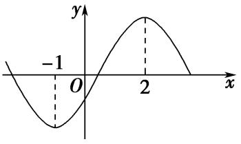

4．答案　1　解析　<em>f</em>′(<em>x</em>)＝3<em>ax</em>2＋2<em>bx</em>＋<em>c</em>，由图象知，方程<em>f</em>′(<em>x</em>)＝0的两根为－1和2，则有
即∴＝＝＝1．

5．(多选)函数*y*＝*f*(*x*)的导函数*f*′(*x*)的图象如图所示，则以下命题错误的是(　　)

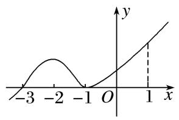

A．－3是函数*y*＝*f*(*x*)的极值点　　　　　　　　
B．－1是函数*y*＝*f*(*x*)的最小值点

C．*y*＝*f*(*x*)在区间(－3，1)上单调递增　　　　　
D．*y*＝*f*(*x*)在*x*＝0处切线的斜率小于零

5．答案　BD　解析　根据导函数的图象可知当*x*∈(－∞，－3)时，*f*′(*x*)<0，当*x*∈(－3，＋∞)时，*f*′(*x*)≥0，
∴函数*y*＝*f*(*x*)在(－∞，－3)上单调递减，在(－3，＋∞)上单调递增，则－3是函数*y*＝*f*(*x*)的极值点，∵函数*y*＝*f*(*x*)在(－3，＋∞)上单调递增，∴－1不是函数*y*＝*f*(*x*)的最小值点，∵函数*y*＝*f*(*x*)在*x*＝0处的导数大于0，∴*y*＝*f*(*x*)在*x*＝0处切线的斜率大于零．故错误的命题为BD．

考点二　求已知函数的极值

【方法总结】

求函数的极值或极值点的步骤  
（1）确定函数的定义域；  
（2）求导数*f*′(*x*)；  
（3）解方程*f*′(*x*)＝0，求出函数定义域内的所有根；
④检查*f*′(*x*)在方程*f*′(*x*)＝0的根的左右两侧的符号．如果左正右负，那么*f*(*x*)在这个根处取得极大值；如果左负右正，那么*f*(*x*)在这个根处取得极小值．

【例题选讲】

<strong>[例1]</strong>（1）函数<em>f</em>(<em>x</em>)＝<em>x</em>2e－<em>x</em>的极大值为\_\_\_\_\_\_\_\_\_\_，极小值为\_\_\_\_\_\_\_\_．
答案　4e－2　0　解析　<em>f</em>(<em>x</em>)的定义域为(－∞，＋∞)，<em>f</em>′(<em>x</em>)＝－e－<em>xx</em>(<em>x</em>－2)．当<em>x</em>∈(－∞，0)或<em>x</em>∈(2，＋∞)时，<em>f</em>′(<em>x</em>)＜0；当<em>x</em>∈(0，2)时，<em>f</em>′(<em>x</em>)＞0．所以<em>f</em>(<em>x</em>)在(－∞，0)，(2，＋∞)上单调递减，在(0，2)上单调递增．故当<em>x</em>＝0时，<em>f</em>(<em>x</em>)取得极小值，极小值为<em>f</em>（0）＝0；当<em>x</em>＝2时，<em>f</em>(<em>x</em>)取得极大值，极大值为<em>f</em>（2）＝4e－2．  
（2）设函数*f*(*x*)＝＋ln*x*，则(　　)

A．*x*＝为*f*(*x*)的极大值点　　　　　　　　
B．*x*＝为*f*(*x*)的极小值点

C．*x*＝2为*f*(*x*)的极大值点　　　　　　　　
D．*x*＝2为*f*(*x*)的极小值点
答案　<strong>D</strong>　解析　<em>f</em>′(<em>x</em>)＝－＋＝(<em>x</em>＞0)，当0＜<em>x</em>＜2时，<em>f</em>′(<em>x</em>)＜0，当<em>x</em>＞2时，<em>f</em>′(<em>x</em>)＞0，所以<em>x</em>＝2为<em>f</em>(<em>x</em>)的极小值点．  
（3）已知函数*f*(*x*)＝2e*f*′(e)ln*x*－，则*f*(*x*)的极大值点为(　　)

A．　　　　　　　　
B．1　　　　　　　　
C．e　　　　　　　　
D．2e
答案　D　解析　*f*′(*x*)＝－，故*f*′(e)＝，故*f*(*x*)＝2ln*x*－，令*f*′(*x*)＝－>0，解得0<*x*<2e，令*f*′(*x*)<0，解得*x*>2e，故*f*(*x*)在(0，2e)上递增，在(2e，＋∞)上递减，∴*x*＝2e时，*f*(*x*)取得极大值2ln 2，则*f*(*x*)的极大值点为2e．  
（4）已知e为自然对数的底数，设函数<em>f</em>(<em>x</em>)＝(e<em>x</em>－1)·(<em>x</em>－1)<em>k</em>(<em>k</em>＝1，2)，则(　　)

A．当*k*＝1时，*f*(*x*)在*x*＝1处取到极小值　　　　　
B．当*k*＝1时，*f*(*x*)在*x*＝1处取到极大值

C．当*k*＝2时，*f*(*x*)在*x*＝1处取到极小值　　　　　
D．当*k*＝2时，*f*(*x*)在*x*＝1处取到极大值
答案　C　解析　因为<em>f</em>′(<em>x</em>)＝(<em>x</em>－1)<em>k</em>－1[e<em>x</em>(<em>x</em>－1＋<em>k</em>)－<em>k</em>]，当<em>k</em>＝1时，<em>f</em>′（1）&gt;0，故1不是函数<em>f</em>(<em>x</em>)的极值点．当<em>k</em>＝2时，当<em>x</em>0&lt;<em>x</em>&lt;1(<em>x</em>0为<em>f</em>(<em>x</em>)的极大值点)时，<em>f</em>′(<em>x</em>)&lt;0，函数<em>f</em>(<em>x</em>)单调递减；当<em>x</em>&gt;1时，<em>f</em>′(<em>x</em>)&gt;0，函数<em>f</em>(<em>x</em>)单调递增．故<em>f</em>(<em>x</em>)在<em>x</em>＝1处取到极小值．故选C．  
（5）若<em>x</em>＝－2是函数<em>f</em>(<em>x</em>)＝(<em>x</em>2＋<em>ax</em>－1)e<em>x</em>－1的极值点，则<em>f</em>(<em>x</em>)的极小值为(　　)

A．－1　　　　　　　　　
B．－2e－3 　　　　　　　　
C．5e－3　　　　　　　　
D．1
答案　<strong>A</strong>　解析　<em>f</em>′(<em>x</em>)＝(2<em>x</em>＋<em>a</em>)e<em>x</em>－1＋(<em>x</em>2＋<em>ax</em>－1)e<em>x</em>－1＝[<em>x</em>2＋(<em>a</em>＋2)<em>x</em>＋<em>a</em>－1]e<em>x</em>－1．∵<em>x</em>＝－2是<em>f</em>(<em>x</em>)的极值点，∴<em>f</em>′(－2)＝0，即(4－2<em>a</em>－4＋<em>a</em>－1)e－3＝0，得<em>a</em>＝－1．∴<em>f</em>(<em>x</em>)＝(<em>x</em>2－<em>x</em>－1)e<em>x</em>－1，<em>f</em>′(<em>x</em>)＝(<em>x</em>2＋<em>x</em>－2)e<em>x</em>－1．由<em>f</em>′(<em>x</em>)＞0，得<em>x</em>＜－2或<em>x</em>＞1；由<em>f</em>′(<em>x</em>)＜0，得－2＜<em>x</em>＜1．∴<em>f</em>(<em>x</em>)在(－∞，－2)上单调递增，在(－2，1)上单调递减，在(1，＋∞)上单调递增，∴<em>f</em>(<em>x</em>)的极小值点为1，∴<em>f</em>(<em>x</em>)的极小值为<em>f</em>（1）＝－1．  
（6）设<em>f</em>′(<em>x</em>)为函数<em>f</em>(<em>x</em>)的导函数，已知<em>x</em>2<em>f</em>′(<em>x</em>)＋<em>xf</em>(<em>x</em>)＝ln<em>x</em>，<em>f</em>（1）＝，则下列结论不正确的是(　　)

A．*xf*(*x*)在(0，＋∞)上单调递增　　　　　　　　　
B．*xf*(*x*)在(0，＋∞)上单调递减

C．*xf*(*x*)在(0，＋∞)上有极大值　　　　　　　　
D．*xf*(*x*)在(0，＋∞)上有极小值
答案　ABC　解析　由<em>x</em>2<em>f</em>′(<em>x</em>)＋<em>xf</em>(<em>x</em>)＝ln <em>x</em>得<em>x</em>＞0，则<em>xf</em>′(<em>x</em>)＋<em>f</em>(<em>x</em>)＝，即[<em>xf</em>(<em>x</em>)]′＝，设<em>g</em>(<em>x</em>)＝<em>xf</em>(<em>x</em>)，即<em>g</em>′(<em>x</em>)＝，由<em>g</em>′(<em>x</em>)＞0得<em>x</em>＞1，由<em>g</em>′(<em>x</em>)＜0得0＜<em>x</em>＜1，即<em>xf</em>(<em>x</em>)在(1，＋∞)上单调递增，在(0，1)上单调递减，即当<em>x</em>＝1时，函数<em>g</em>(<em>x</em>)＝<em>xf</em>(<em>x</em>)取得极小值<em>g</em>（1）＝<em>f</em>（1）＝．故选ABC．

<strong>[例2]</strong>　给出定义：设<em>f</em>′(<em>x</em>)是函数<em>y</em>＝<em>f</em>(<em>x</em>)的导函数，<em>f</em>″(<em>x</em>)是函数<em>f</em>′(<em>x</em>)的导函数，
若方程<em>f</em>″(<em>x</em>)＝0有实数解<em>x</em>0，则称点(<em>x</em>0，<em>f</em>(<em>x</em>0))为函数<em>y</em>＝<em>f</em>(<em>x</em>)的拐点．已知<em>f</em>(<em>x</em>)＝<em>ax</em>＋sin<em>x</em>－cos<em>x</em>．  
（1）求证：函数<em>y</em>＝<em>f</em>(<em>x</em>)的拐点<em>M</em>(<em>x</em>0，<em>f</em>(<em>x</em>0))在直线<em>y</em>＝<em>ax</em>上；  
（2）*x*∈(0，2π)时，讨论*f*(*x*)的极值点的个数．
解析　（1）∵*f*(*x*)＝*ax*＋sin*x*－cos*x*，∴*f*′(*x*)＝*a*＋cos*x*＋sin*x*，
∴<em>f</em>″(<em>x</em>)＝－sin<em>x</em>＋cos<em>x</em>，∵<em>f</em>″(<em>x</em>0)＝0，∴－sin<em>x</em>0＋cos<em>x</em>0＝0．

而<em>f</em>(<em>x</em>0)＝<em>ax</em>0＋sin<em>x</em>0－cos<em>x</em>0＝<em>ax</em>0．∴点<em>M</em>(<em>x</em>0，<em>f</em>(<em>x</em>0))在直线<em>y</em>＝<em>ax</em>上．  
（2）令*f*′(*x*)＝0，得*a*＝－2sin，

作出函数*y*＝－2sin，*x*∈(0，2π)与函数*y*＝*a*的草图如下所示：

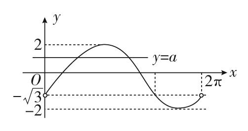
由图可知，当*a*≥2或*a*≤－2时，*f*(*x*)无极值点；当*a*＝－时，*f*(*x*)有一个极值点；
当－2<*a*<－或－<*a*<2时，*f*(*x*)有两个极值点．

<strong>[例3]</strong>　(2021·天津高考节选)已知<em>a</em>＞0，函数<em>f</em>(<em>x</em>)＝<em>ax</em>－<em>x</em>·e<em>x</em>．  
（1）求函数*y*＝*f*(*x*)在点(0，*f*（0）)处的切点的方程；  
（2）证明*f*(*x*)存在唯一极值点．
解析　（1）因为<em>f</em>（0）＝0，<em>f</em>′(<em>x</em>)＝<em>a</em>－(<em>x</em>＋1)e<em>x</em>，所以<em>f</em>′（0）＝<em>a</em>－1，
所以函数在(0，*f*（0）)处的切线方程为(*a*－1)·*x*－*y*＝0．  
（2）若证明<em>f</em>(<em>x</em>)仅有一个极值点，即证<em>f</em>′(<em>x</em>)＝<em>a</em>－(<em>x</em>＋1)e<em>x</em>＝0，只有一个解，
即证<em>a</em>＝(<em>x</em>＋1)e<em>x</em>只有一个解，
令<em>g</em>(<em>x</em>)＝(<em>x</em>＋1)e<em>x</em>，只需证<em>g</em>(<em>x</em>)＝(<em>x</em>＋1)e<em>x</em>的图象与直线<em>y</em>＝<em>a</em>(<em>a</em>＞0)仅有一个交点，<em>g</em>′(<em>x</em>)＝(<em>x</em>＋2)e<em>x</em>，
当*x*＝－2时，*g*′(*x*)＝0，
当*x*＜－2时，*g*′(*x*)＜0，*g*(*x*)单调递减，当*x*＞－2时，*g*′(*x*)＞0，*g*(*x*)单调递增，
当<em>x</em>＝－2时，<em>g</em>(－2)＝－e－2＜0．当<em>x</em>→＋∞时，<em>g</em>(<em>x</em>)→＋∞，当<em>x</em>→－∞时，<em>g</em>(<em>x</em>)→0－，

画出函数<em>g</em>(<em>x</em>)＝(<em>x</em>＋1)e<em>x</em>的图象大致如下，

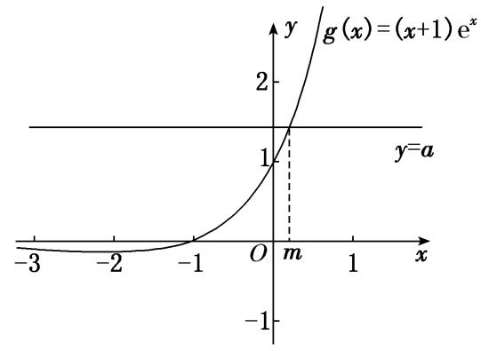
因为<em>a</em>＞0，所以<em>g</em>(<em>x</em>)＝(<em>x</em>＋1)e<em>x</em>的图象与直线<em>y</em>＝<em>a</em>(<em>a</em>＞0)仅有一个交点．即<em>f</em>(<em>x</em>)存在唯一极值点．

【对点训练】

1．函数*f*(*x*)＝2*x*－*x*ln *x*的极值是(　　)

A．　　　　　　　　
B．　　　　　　　　
C．e　　　　　　　　
D．e2

1．答案　C　解析　因为*f*′(*x*)＝2－(ln *x*＋1)＝1－ln *x*，当*f*′(*x*)＞0时，解得0＜*x*＜e；当*f*′(*x*)＜0时，解得

<em>x</em>＞e，所以<em>x</em>＝e时，<em>f</em>(<em>x</em>)取到极大值，<em>f</em>(<em>x</em>)极大值＝<em>f</em>(e)＝e．故选C．

2．函数<em>f</em>(<em>x</em>)＝(<em>x</em>2－1)2＋2的极值点是(　　)

A．*x*＝1　　　　　　
B．*x*＝－1　　　　　　
C．*x*＝1或－1或0　　　　　　
D．*x*＝0

2．答案　C　解析　<em>f</em>′(<em>x</em>)＝2(<em>x</em>2－1)·2<em>x</em>＝4<em>x</em>(<em>x</em>＋1)(<em>x</em>－1)，令<em>f</em>′(<em>x</em>)＝0，解得<em>x</em>＝0或<em>x</em>＝－1或<em>x</em>＝1．

3．函数<em>f</em>(<em>x</em>)＝<em>x</em>2＋ln <em>x</em>－2<em>x</em>的极值点的个数是(　　)

A．0　　　　　　　　　
B．1　　　　　　　　
C．2　　　　　　　　
D．无数

3．答案　A　解析　函数定义域为(0，＋∞)，且*f*′(*x*)＝*x*＋－2＝＝≥0，即*f*(*x*)在定义

域上单调递增，无极值点．

4．函数<em>f</em>(<em>x</em>)＝(<em>x</em>2－<em>x</em>－1)e<em>x</em>(其e＝2．718…是自然对数的底数)的极值点是________；极大值为________．

4．答案　1或－2　　解析　由已知得<em>f</em>′(<em>x</em>)＝(<em>x</em>2－<em>x</em>－1＋2<em>x</em>－1)e<em>x</em>＝(<em>x</em>2＋<em>x</em>－2)e<em>x</em>＝(<em>x</em>＋2)(<em>x</em>－1)e<em>x</em>，因为e<em>x</em>

＞0，令*f*′(*x*)＝0，可得*x*＝－2或*x*＝1，当*x*＜－2时，*f*′(*x*)＞0，即函数*f*(*x*)在(－∞，－2)上单调递增；当－2＜*x*＜1时，*f*′(*x*)＜0，即函数*f*(*x*)在区间(－2，1)上单调递减；当*x*＞1时，*f*′(*x*)＞0，即函数*f*(*x*)在区间(1，＋∞)上单调递增．故*f*(*x*)的极值点为－2或1，且极大值为*f*(－2)＝．

5．已知函数<em>f</em>(<em>x</em>)＝<em>ax</em>3－<em>bx</em>＋2的极大值和极小值分别为<em>M</em>，<em>m</em>，则<em>M</em>＋<em>m</em>＝(　　)

A．0　　　　　　　　
B．1　　　　　　　　
C．2　　　　　　　　
D．4

5．答案　D　解析　<em>f</em>′(<em>x</em>)＝3<em>ax</em>2－<em>b</em>＝0，由题意，知该方程有两个根，设该方程的两个根分别为<em>x</em>1，<em>x</em>2，
故<em>f</em>(<em>x</em>)在<em>x</em>1，<em>x</em>2处取到极值，<em>M</em>＋<em>m</em>＝<em>ax</em>－<em>bx</em>1＋2＋<em>ax</em>－<em>bx</em>2＋2＝－<em>b</em>(<em>x</em>1＋<em>x</em>2)＋<em>a</em>(<em>x</em>1＋<em>x</em>2)[(<em>x</em>1＋<em>x</em>2)2－3<em>x</em>1<em>x</em>2]＋4，又<em>x</em>1＋<em>x</em>2＝0，<em>x</em>1<em>x</em>2＝－，所以<em>M</em>＋<em>m</em>＝4，故选D．

6．若<em>x</em>＝－2是函数<em>f</em>(<em>x</em>)＝<em>x</em>3－<em>ax</em>2－2<em>x</em>＋1的一个极值点，则函数<em>f</em>(<em>x</em>)的极小值为(　　)

A．－　　　　　　　　
B．－　　　　　　　　
C．　　　　　　　　
D．

6．答案　B　解析　由题意，得<em>f</em>′(<em>x</em>)＝<em>x</em>2－2<em>ax</em>－2．又<em>x</em>＝－2是函数<em>f</em>(<em>x</em>)的一个极值点，所以<em>f</em>′(－2)＝2

＋4<em>a</em>＝0，解得<em>a</em>＝－．所以<em>f</em>(<em>x</em>)＝<em>x</em>3＋<em>x</em>2－2<em>x</em>＋1，所以<em>f</em>′(<em>x</em>)＝<em>x</em>2＋<em>x</em>－2＝(<em>x</em>＋2)(<em>x</em>－1)．当<em>x</em>＜－2或<em>x</em>＞1时，<em>f</em>′(<em>x</em>)＞0；当－2＜<em>x</em>＜1时，<em>f</em>′(<em>x</em>)＜0．所以函数<em>y</em>＝<em>f</em>(<em>x</em>)的单调递增区间为(－∞，－2)，(1，＋∞)，单调递减区间为(－2，1)．当<em>x</em>＝1时，函数<em>y</em>＝<em>f</em>(<em>x</em>)取得极小值，为<em>f</em>（1）＝＋－2＋1＝－．故选B．

7．已知函数<em>f</em>(<em>x</em>)＝2ln <em>x</em>＋<em>ax</em>2－3<em>x</em>在<em>x</em>＝2处取得极小值，则<em>f</em>(<em>x</em>)的极大值为(　　)

A．2　　　　　　　　
B．－　　　　　　　　
C．3＋ln 2　　　　　　　　
D．－2＋2ln 2

7．答案　B　解析　由题意得，*f*′(*x*)＝＋2*ax*－3，∵*f*(*x*)在*x*＝2处取得极小值，∴*f*′（2）＝4*a*－2＝0，解得

<em>a</em>＝，∴<em>f</em>(<em>x</em>)＝2ln <em>x</em>＋<em>x</em>2－3<em>x</em>，<em>f</em>′(<em>x</em>)＝＋<em>x</em>－3＝，∴<em>f</em>(<em>x</em>)在(0，1)，(2，＋∞)上单调递增，在(1，2)上单调递减，∴<em>f</em>(<em>x</em>)的极大值为<em>f</em>（1）＝－3＝－．

8．已知函数*f*(*x*)＝*x*ln*x*，则(　　)

A．*f*(*x*)的单调递增区间为(e，＋∞)　　　　　　
B．*f*(*x*)在上是减函数

C．当*x*∈(0，1]时，*f*(*x*)有最小值－　　　　　　
D．*f*(*x*)在定义域内无极值

8．答案　BC　解析　因为*f*′(*x*)＝ln *x*＋1(*x*＞0)，令*f*′(*x*)＝0，所以*x*＝，当*x*∈时，*f*′(*x*)＜0，当*x*

∈时，<em>f</em>′(<em>x</em>)＞0，所以<em>f</em>(<em>x</em>)在上单调递减，在上单调递增，<em>x</em>＝是极小值点，所以A错误，B正确；当<em>x</em>∈(0，1]时，根据单调性可知，<em>f</em>(<em>x</em>)min＝<em>f</em>＝－，故C正确；显然<em>f</em>(<em>x</em>)有极小值<em>f</em>，故D错误．故选BC．

9．(多选)已知函数*f*(*x*)＝，则下列结论正确的是(　　)

A．函数*f*(*x*)存在两个不同的零点

B．函数*f*(*x*)既存在极大值又存在极小值

C．当－e<*k*≤0时，方程*f*(*x*)＝*k*有且只有两个实根

D．若<em>x</em>∈[<em>t</em>，＋∞)时，<em>f</em>(<em>x</em>)max＝，则<em>t</em>的最小值为2

9．答案　ABC　解析　由<em>f</em>(<em>x</em>)＝0，得<em>x</em>2＋<em>x</em>－1＝0，∴<em>x</em>＝，故A正确．<em>f</em>′(<em>x</em>)＝－＝

－，当*x*∈(－∞，－1)∪(2，＋∞)时，*f*′(*x*)<0，当*x*∈(－1，2)时，*f*′(*x*)>0，∴*f*(*x*)在(－∞，－1)，(2，＋∞)上单调递减，在(－1，2)上单调递增，∴*f*(－1)是函数的极小值，*f*（2）是函数的极大值，故B正确．又*f*(－1)＝－e，*f*（2）＝，且当*x*→－∞时，*f*(*x*)→＋∞，*x*→＋∞时，*f*(*x*)→0，∴*f*(*x*)的图象如图所示，由图知C正确，D不正确．

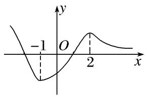

10．若函数<em>f</em>(<em>x</em>)＝(1－<em>x</em>)(<em>x</em>2＋<em>ax</em>＋<em>b</em>)的图象关于点(－2，0)对称，<em>x</em>1，<em>x</em>2分别是<em>f</em>(<em>x</em>)的极大值点与极小值点，
则<em>x</em>2－<em>x</em>1＝\_\_\_\_\_\_\_\_．

10．答案　－2　解析　因为函数<em>f</em>(<em>x</em>)＝(1－<em>x</em>)(<em>x</em>2＋<em>ax</em>＋<em>b</em>)的图象关于点(－2，0)对称，且<em>f</em>（1）＝0，所以

<em>f</em>(－5)＝0，<em>f</em>(－2)＝0，所以<em>x</em>＝－2，<em>x</em>＝－5是方程<em>x</em>2＋<em>ax</em>＋<em>b</em>＝0的两个根．由根与系数的关系可得，<em>a</em>＝7，<em>b</em>＝10，所以<em>f</em>(<em>x</em>)＝(1－<em>x</em>)(<em>x</em>2＋7<em>x</em>＋10)，所以<em>f</em>′(<em>x</em>)＝－(<em>x</em>2＋7<em>x</em>＋10)＋(1－<em>x</em>)(2<em>x</em>＋7)＝－3(<em>x</em>2＋4<em>x</em>＋1)．又因为<em>x</em>1，<em>x</em>2分别是<em>f</em>(<em>x</em>)的极大值点与极小值点，所以<em>x</em>1，<em>x</em>2是<em>x</em>2＋4<em>x</em>＋1＝0的两个根，且<em>x</em>1&gt;<em>x</em>2．解方程可得，<em>x</em>1＝－2＋，<em>x</em>2＝－2－，所以<em>x</em>2－<em>x</em>1＝－2．

11．已知函数<em>f</em>(<em>x</em>)＝e<em>x</em>(<em>x</em>－1)－e<em>ax</em>2，<em>a</em>＜0．  
（1）求曲线*y*＝*f*(*x*)在点(0，*f*（0）)处的切线方程；  
（2）求函数*f*(*x*)的极小值．

11．解析　（1）因为<em>f</em>(<em>x</em>)＝e<em>x</em>(<em>x</em>－1)－e<em>ax</em>2，所以<em>f</em>′(<em>x</em>)＝<em>x</em>e<em>x</em>－<em>x</em>e<em>a</em>．所以<em>f</em>（0）＝－1，<em>f</em>′（0）＝0．
所以曲线*y*＝*f*(*x*)在点(0，*f*（0）)处的切线方程为*y*＝－1．  
（2）<em>f</em>′(<em>x</em>)＝<em>x</em>e<em>x</em>－<em>x</em>e<em>a</em>＝<em>x</em>(e<em>x</em>－e<em>a</em>)，令<em>f</em>′(<em>x</em>)＝0，得<em>x</em>＝0或<em>x</em>＝<em>a</em>(<em>a</em>＜0)．

<em>f</em>(<em>x</em>)与<em>f</em>′(<em>x</em>)在<strong>R</strong>上的变化情况如表：

<table><tr><td>
<em>x</em>
</td><td>
(－∞，<em>a</em>)
</td><td>
<em>a</em>
</td><td>
(<em>a，</em>0)
</td><td>
0
</td><td>
(0，＋∞)
</td></tr><tr><td>
<em>f</em>′(<em>x</em>)
</td><td>
＋
</td><td>
0
</td><td>
－
</td><td>
0
</td><td>
＋
</td></tr><tr><td>
<em>f</em>(<em>x</em>)
</td><td></td><td></td><td></td><td></td><td></td></tr></table>
由表可知，当*x*＝0时，*f*(*x*)有极小值*f*（0）＝－1．

12．已知函数*f*(*x*)＝．  
（1）求函数*f*(*x*)的图象在(1，*f*（1）)处的切线方程；  
（2）证明：函数*f*(*x*)仅有唯一的极小值点．

12．解析　（1）因为*f*′(*x*)＝，所以切线斜率*k*＝*f*′（1）＝－2．
又因为*f*（1）＝e＋2，所以切线方程为*y*－(e＋2)＝－2(*x*－1)，即2*x*＋*y*－e－4＝0．  
（2）证明：令<em>h</em>(<em>x</em>)＝e<em>x</em>(<em>x</em>－1)－2，则<em>h</em>′(<em>x</em>)＝e<em>x</em>·<em>x</em>，所以<em>x</em>∈(－∞，0)时，<em>h</em>′(<em>x</em>)&lt;0，

*x*∈(0，＋∞)时，*h*′(*x*)>0．当*x*∈(－∞，0)时，易知*h*(*x*)<0，
所以*f*′(*x*)<0，*f*(*x*)在(－∞，0)上没有极值点．
当<em>x</em>∈(0，＋∞)时，因为<em>h</em>（1）＝－2&lt;0，<em>h</em>（2）＝e2－2&gt;0，
所以*f*′（1）<0，*f*′（2）>0，*f*(*x*)在(1，2)上有极小值点．
又因为*h*(*x*)在(0，＋∞)上单调递增，所以函数*f*(*x*)仅有唯一的极小值点．

考点三　已知函数的极值(点)求参数的值(范围)

【方法总结】
由函数极值求参数的值或范围
讨论极值点有无(个数)问题，转化为讨论*f*′(*x*)＝0根的有无(个数)．然后由已知条件列出方程或不等式求出参数的值或范围，特别注意：极值点处的导数为0，而导数为0的点不一定是极值点，要检验导数为0的点两侧导数是否异号．

【例题选讲】

<strong>[例1]</strong>（1）若函数<em>f</em>(<em>x</em>)＝<em>x</em>(<em>x</em>－<em>m</em>)2在<em>x</em>＝1处取得极小值，则<em>m</em>＝\_\_\_\_\_\_\_\_．
答案　1　解析　由*f*′（1）＝0可得*m*＝1或*m*＝3．当*m*＝3时，*f*′(*x*)＝3(*x*－1)(*x*－3)，当1＜*x*＜3时，*f*′(*x*)＜0；当*x*＜1或*x*＞3时，*f*′(*x*)＞0，此时*f*(*x*)在*x*＝1处取得极大值，不合题意，当*m*＝1时，*f*′(*x*)＝(*x*－1)(3*x*－1)．当<*x*<1时，*f*′(*x*)<0；当*x*<或*x*>1时，*f*′(*x*)>0，此时*f*(*x*)在*x*＝1处取得极小值，符合题意，所以*m*＝1．  
（2）已知<em>f</em>(<em>x</em>)＝<em>x</em>3＋3<em>ax</em>2＋<em>bx</em>＋<em>a</em>2在<em>x</em>＝－1处有极值0，则<em>a</em>＋<em>b</em>＝\_\_\_\_\_\_\_\_．
答案　11　解析　<em>f</em>′(<em>x</em>)＝3<em>x</em>2＋6<em>ax</em>＋<em>b</em>，由题意得解得或当<em>a</em>＝1，<em>b</em>＝3时，<em>f</em>′(<em>x</em>)＝3<em>x</em>2＋6<em>x</em>＋3＝3(<em>x</em>＋1)2≥0，∴<em>f</em>(<em>x</em>)在<strong>R</strong>上单调递增，∴<em>f</em>(<em>x</em>)无极值，所以<em>a</em>＝1，<em>b</em>＝3不符合题意，当<em>a</em>＝2，<em>b</em>＝9时，经检验满足题意．∴<em>a</em>＋<em>b</em>＝11．  
（3）若函数<em>f</em>(<em>x</em>)的导数<em>f</em>′(<em>x</em>)＝(<em>x</em>－<em>k</em>)<em>k</em>(<em>k</em>≥1，<em>k</em>∈<strong>Z</strong>)，已知<em>x</em>＝<em>k</em>是函数<em>f</em>(<em>x</em>)的极大值点，则<em>k</em>＝________．
答案　1　解析　因为函数的导数为<em>f</em>′(<em>x</em>)＝(<em>x</em>－<em>k</em>)<em>k</em>，<em>k</em>≥1，<em>k</em>∈<strong>Z</strong>，所以若<em>k</em>是偶数，则<em>x</em>＝<em>k</em>，不是极值点，则<em>k</em>是奇数，若<em>k</em>&lt;，由<em>f</em>′(<em>x</em>)&gt;0，解得<em>x</em>&gt;或<em>x</em>&lt;<em>k</em>；由<em>f</em>′(<em>x</em>)&lt;0，解得<em>k</em>&lt;<em>x</em>&lt;，即当<em>x</em>＝<em>k</em>时，函数<em>f</em>(<em>x</em>)取得极大值．因为<em>k</em>∈<strong>Z</strong>，所以<em>k</em>＝1．若<em>k</em>&gt;，由<em>f</em>′(<em>x</em>)&gt;0，解得<em>x</em>&gt;<em>k</em>或<em>x</em>&lt;；由<em>f</em>′(<em>x</em>)&lt;0，解得&lt;<em>x</em>&lt;<em>k</em>，即当<em>x</em>＝<em>k</em>时，函数<em>f</em>(<em>x</em>)取得极小值，不满足条件．  
（4）设函数<em>f</em>(<em>x</em>)＝ln<em>x</em>－<em>ax</em>2－<em>bx</em>，若<em>x</em>＝1是<em>f</em>(<em>x</em>)的极大值点，则<em>a</em>的取值范围为\_\_\_\_\_\_\_\_．
答案　*a*>－1　解析　*f*(*x*)的定义域为(0，＋∞)，*f*′(*x*)＝－*ax*－*b*，由*f*′（1）＝0，得*b*＝1－*a*，所以*f*′(*x*)＝－*ax*＋*a*－1＝＝．①若*a*≥0，当0<*x*<1时，*f*′(*x*)>0，*f*(*x*)单调递增；当*x*>1时，*f*′(*x*)<0，*f*(*x*)单调递减，所以*x*＝1是*f*(*x*)的极大值点．②若*a*<0，由*f*′(*x*)＝0，得*x*＝1或*x*＝－．因为*x*＝1是*f*(*x*)的极大值点，所以－>1，解得－1<*a*<0．综合①②得*a*的取值范围是*a*>－1．  
（5）若函数*f*(*x*)＝－(1＋2*a*)*x*＋2ln*x*(*a*>0)在区间内有极大值，则*a*的取值范围是(　　)

A．　　　　
B．(1，＋∞)　　　　
C．(1，2)　　　　
D．(2，＋∞)
答案　C　解析　*f*′(*x*)＝*ax*－(1＋2*a*)＋＝(*a*>0，*x*>0)，若*f*(*x*)在区间内有极大值，即*f*′(*x*)＝0在内有解，且*f*′(*x*)在区间内先大于0，后小于0，则即解得1<*a*<2，故选C．  
（6）若函数<em>f</em>(<em>x</em>)＝<em>x</em>2－<em>x</em>＋<em>a</em>ln<em>x</em>在[1，＋∞)上有极值点，则实数<em>a</em>的取值范围为________；
答案　(－∞，－1]　解析　函数<em>f</em>(<em>x</em>)的定义域为(0，＋∞)，<em>f</em>′(<em>x</em>)＝2<em>x</em>－1＋＝，由题意知2<em>x</em>2－<em>x</em>＋<em>a</em>＝0在<strong>R</strong>上有两个不同的实数解，且在[1，＋∞)上有解，所以<em>Δ</em>＝1－8<em>a</em>&gt;0，且2×12－1＋<em>a</em>≤0，所以<em>a</em>∈(－∞，－1]．  
（7）已知函数*f*(*x*)＝*x*(ln*x*－*ax*)有两个极值点，则实数*a*的取值范围是\_\_\_\_\_\_\_\_．
答案　　解析　*f*(*x*)＝*x*(ln*x*－*ax*)，定义域为(0，＋∞)，*f*′(*x*)＝1＋ln *x*－2*ax*．由题意知，当*x*>0时，1＋ln*x*－2*ax*＝0有两个不相等的实数根，即2*a*＝有两个不相等的实数根，令*φ*(*x*)＝(*x*>0)，∴*φ*′(*x*)＝．当0<*x*<1时，*φ*′(*x*)>0；当*x*>1时，*φ*′(*x*)<0，∴*φ*(*x*)在(0，1)上单调递增，在(1，＋∞)上单调递减，且*φ*（1）＝1，当*x*→0时，*φ*(*x*)→－∞，当*x*→＋∞时，*φ*(*x*)→0，则0<2*a*<1，即0<*a*<．  
（8） (2021·全国乙)设<em>a</em>≠0，若<em>x</em>＝<em>a</em>为函数<em>f</em>(<em>x</em>)＝<em>a</em>(<em>x</em>－<em>a</em>)2(<em>x</em>－<em>b</em>)的极大值点，则(　　)

A．<em>a</em>&lt;<em>b</em>　　　　　　
B．<em>a</em>&gt;<em>b</em>　　　　　　
C．<em>ab</em>&lt;<em>a</em>2　　　　　　　　　
D．<em>ab</em>&gt;<em>a</em>2
答案　D　解析　法一　(特殊值法)当<em>a</em>＝1，<em>b</em>＝2时，函数<em>f</em>(<em>x</em>)＝(<em>x</em>－1)2(<em>x</em>－2)，画出该函数的图象如图1所示，可知<em>x</em>＝1为函数<em>f</em>(<em>x</em>)的极大值点，满足题意．从而，根据<em>a</em>＝1，<em>b</em>＝2可判断选项B，C错误；当<em>a</em>＝－1，<em>b</em>＝－2时，函数<em>f</em>(<em>x</em>)＝－(<em>x</em>＋1)2(<em>x</em>＋2)，画出该函数的图象如图2所示，可知<em>x</em>＝－1为函数<em>f</em>(<em>x</em>)的极大值点，满足题意．从而，根据<em>a</em>＝－1，<em>b</em>＝－2可判断选项A错误．

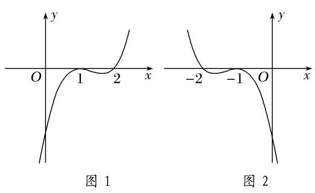

法二　(数形结合法)当*a*>0时，根据题意作出函数*f*(*x*)的大致图象，如图3所示，观察可知*b*>*a*．
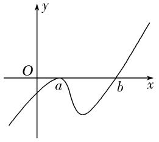

图3

当*a*<0时，根据题意作出函数*f*(*x*)的大致图象，如图4所示，观察可知*a*>*b*．
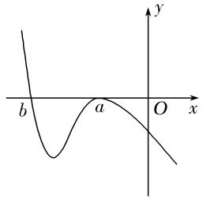

图4

综上，可知必有<em>ab</em>&gt;<em>a</em>2成立．故选D．

<strong>[例2]</strong>　已知曲线<em>f</em>(<em>x</em>)＝<em>x</em>e<em>x</em>－<em>ax</em>3－<em>ax</em>2，<em>a</em>∈<strong>R</strong>．  
（1）当*a*＝0时，求曲线*y*＝*f*(*x*)在点(1，*f*（1）)处的切线方程；  
（2）若函数*y*＝*f*(*x*)有三个极值点，求实数*a*的取值范围．
解析　（1）当<em>a</em>＝0时，<em>f</em>(<em>x</em>)＝<em>x</em>e<em>x</em>⇒<em>f</em>′(<em>x</em>)＝e<em>x</em>＋<em>x</em>e<em>x</em>⇒<em>f</em>′（1）＝2e，
又*f*（1）＝e，故曲线*y*＝*f*(*x*)在*x*＝1处的切线方程为*y*－e＝2e(*x*－1)，化简得*y*＝2e*x*－e．  
（2）因为<em>f</em>′(<em>x</em>)＝e<em>x</em>(<em>x</em>＋1)－2<em>ax</em>(<em>x</em>＋1)＝(<em>x</em>＋1)(e<em>x</em>－2<em>ax</em>)，
所以令<em>f</em>′(<em>x</em>)＝0⇒(<em>x</em>＋1)(e<em>x</em>－2<em>ax</em>)＝0⇒<em>x</em>＋1＝0或e<em>x</em>－2<em>ax</em>＝0，
由于函数<em>y</em>＝<em>f</em>(<em>x</em>)有三个极值点，所以方程e<em>x</em>－2<em>ax</em>＝0必有两个不同的实根，
设<em>g</em>(<em>x</em>)＝e<em>x</em>－2<em>ax</em>，则<em>g</em>′(<em>x</em>)＝e<em>x</em>－2<em>a</em>，

易知<em>a</em>≤0时，<em>g</em>′(<em>x</em>)&gt;0，<em>g</em>(<em>x</em>)在<strong>R</strong>上单调递增，不合题意，故<em>a</em>&gt;0，所以<em>g</em>(<em>x</em>)的两个零点必为正数．
令<em>g</em>′(<em>x</em>)＝0⇒e<em>x</em>－2<em>a</em>＝0⇒<em>x</em>＝ln(2<em>a</em>)，
所以在*x*∈(－∞，ln(2*a*))时，*g*′(*x*)<0，*g*(*x*)单调递减；在*x*∈(ln(2*a*)，＋∞)时，*g*′(*x*)>0，*g*(*x*)单调递增．
依题意，要使得函数<em>g</em>(<em>x</em>)＝e<em>x</em>－2<em>ax</em>有两个不同的零点<em>x</em>1，<em>x</em>2(<em>x</em>1&lt;<em>x</em>2)，则<em>g</em>(<em>x</em>)min＝<em>g</em>(ln(2<em>a</em>))&lt;0，
于是eln(2<em>a</em>)－2<em>a</em>ln(2<em>a</em>)&lt;0⇒2<em>a</em>－2<em>a</em>ln(2<em>a</em>)&lt;0⇒1－ln(2<em>a</em>)&lt;0⇒<em>a</em>&gt;．
所以当<em>a</em>&gt;时，在<em>x</em>∈(－∞，－1)时，<em>f</em>′(<em>x</em>)&lt;0，<em>f</em>(<em>x</em>)单调递减，在<em>x</em>∈(－1，<em>x</em>1)时，<em>f</em>′(<em>x</em>)&gt;0，<em>f</em>(<em>x</em>)单调递增，
在<em>x</em>∈(<em>x</em>1，<em>x</em>2)时，<em>f</em>′(<em>x</em>)&lt;0，<em>f</em>(<em>x</em>)单调递减，在<em>x</em>∈(<em>x</em>2，＋∞)时，<em>f</em>′(<em>x</em>)&gt;0，<em>f</em>(<em>x</em>)单调递增．
故实数*a*的取值范围是．

【对点训练】

1．若函数<em>f</em>(<em>x</em>)＝(<em>x</em>＋<em>a</em>)e<em>x</em>的极值点为1，则<em>a</em>＝(　　)

A．－2　　　　　　　　
B．－1　　　　　　　　
C．0　　　　　　　　
D．1

1．答案　A　解析　<em>f</em>′(<em>x</em>)＝e<em>x</em>＋(<em>x</em>＋<em>a</em>)e<em>x</em>＝(<em>x</em>＋<em>a</em>＋1)e<em>x</em>．由题意知<em>f</em>′（1）＝e(2＋<em>a</em>)＝0，∴<em>a</em>＝－2．故选A．

2．已知函数<em>f</em>(<em>x</em>)＝<em>x</em>(<em>x</em>－<em>c</em>)2在<em>x</em>＝2处有极小值，则实数<em>c</em>的值为(　　)

A．6　　　　　　　　
B．2　　　　　　　　
C．2或6　　　　　　　　
D．0

2．答案　<strong>B</strong>　解析　由<em>f</em>′（2）＝0可得<em>c</em>＝2或6．当<em>c</em>＝2时，结合图象(图略)可知函数先增后减再增，在<em>x</em>

＝2处取得极小值；当*c*＝6时，结合图象(图略)可知，函数在*x*＝2处取得极大值．故选B．

3．已知函数<em>f</em>(<em>x</em>)＝<em>ax</em>3＋<em>bx</em>2＋<em>cx</em>－17(<em>a</em>，<em>b</em>，<em>c</em>∈<strong>R</strong>)的导函数为<em>f</em>′(<em>x</em>)，<em>f</em>′(<em>x</em>)≤0的解集为{<em>x</em>|－2≤<em>x</em>≤3}，若<em>f</em>(<em>x</em>)的

极小值等于－98，则*a*的值是(　　)

A．－　　　　　　　　
B．　　　　　　　　
C．2　　　　　　　　
D．5

3．答案　C　解析　由题意，<em>f</em>′(<em>x</em>)＝3<em>ax</em>2＋2<em>bx</em>＋<em>c</em>，因为<em>f</em>′(<em>x</em>)≤0的解集为{<em>x</em>|－2≤<em>x</em>≤3}，所以<em>a</em>&gt;0，且－2＋

3＝－，－2×3＝，则3*a*＝－2*b*，*c*＝－18*a*，*f*(*x*)的极小值为*f*（3）＝27*a*＋9*b*＋3*c*－17＝－98，解得*a*＝2，*b*＝－3，*c*＝－36，故选C．

4．若函数<em>f</em>(<em>x</em>)＝<em>x</em>3－2<em>cx</em>2＋<em>x</em>有极值点，则实数<em>c</em>的取值范围为________．

4．答案　∪　解析　若函数<em>f</em>(<em>x</em>)＝<em>x</em>3－2<em>cx</em>2＋<em>x</em>有极值点，则<em>f</em>′(<em>x</em>)＝3<em>x</em>2－4<em>cx</em>＋1

＝0有两个不等实根，故<em>Δ</em>＝(－4<em>c</em>)2－12＞0，解得<em>c</em>＞或<em>c</em>＜－．所以实数<em>c</em>的取值范围为∪．

5．设<em>a</em>∈<strong>R</strong>，若函数<em>y</em>＝e<em>x</em>＋<em>ax</em>，<em>x</em>∈<strong>R</strong>有大于零的极值点，则实数<em>a</em>的取值范围是\_\_\_\_\_\_\_\_．

5．答案　(－∞，－1)　解析　由<em>y</em>′＝e<em>x</em>＋<em>a</em>＝0得<em>x</em>＝ln (－<em>a</em>)(<em>a</em>&lt;0)，显然<em>x</em>＝ln (－<em>a</em>)为函数的极小值点，
又ln (－*a*)>0，∴－*a*>1，即*a*<－1．

6．若函数*f*(*x*)＝(2－*a*)在上有极大值，则实数*a*的取值范围为(　　)

A．(，e)　　　　　　　
B．(，2)　　　　　　　
C．(2，e)　　　　　　　
D．(e，＋∞)

6．答案　B　解析　令<em>f</em>′(<em>x</em>)＝(2－<em>a</em>)(<em>x</em>－1)(e<em>x</em>－<em>a</em>)＝0，得<em>x</em>＝ln <em>a</em>∈，解得<em>a</em>∈(，e)，由题意知，
当*x*∈时，*f*′(*x*)>0，当*x*∈(ln*a，* 1)时，*f*′(*x*)<0，所以2－*a*>0，得*a*<2．综上，*a*∈(，2)．故选B．

7．已知函数*f*(*x*)＝－*ax*在(1，＋∞)上有极值，则实数*a*的取值范围为(　　)

A．　　　　　
B．　　　　　
C．　　　　　
D．0，

7．答案　B　解析　*f*′(*x*)＝－*a*，设*g*(*x*)＝＝－，因为函数*f*(*x*)在(1，＋∞)上有极值，
所以<em>f</em>′(<em>x</em>)＝<em>g</em>(<em>x</em>)－<em>a</em>有正有负．令＝<em>t</em>，由<em>x</em>&gt;1可得ln <em>x</em>&gt;0，即<em>t</em>&gt;0，得到<em>y</em>＝<em>t</em>－<em>t</em>2＝－2＋≤．所以<em>a</em>&lt;，故选B．

8．若函数<em>f</em>(<em>x</em>)＝<em>x</em>2－<em>x</em>＋<em>a</em>ln<em>x</em>有极值，则实数<em>a</em>的取值范围是\_\_\_\_\_\_\_\_．

8．答案　　解析　*f*(*x*)的定义域为(0，＋∞)，*f*′(*x*)＝2*x*－1＋＝，由题意知*y*＝*f*′(*x*)有

变号零点，令2<em>x</em>2－<em>x</em>＋<em>a</em>＝0，即<em>a</em>＝－2<em>x</em>2＋<em>x</em>(<em>x</em>&gt;0)，令<em>φ</em>(<em>x</em>)＝－2<em>x</em>2＋<em>x</em>＝－22＋(<em>x</em>&gt;0)，其图象如图所示，故<em>a</em>&lt;．

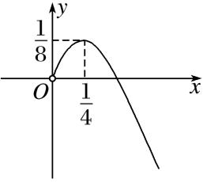

9．若函数<em>f</em>(<em>x</em>)＝<em>x</em>2＋(<em>a</em>－1)<em>x</em>－<em>a</em>ln<em>x</em>存在唯一的极值，且此极值不小于1，则实数<em>a</em>的取值范围为\_\_\_\_\_\_\_\_．

9．答案　　解析　对函数求导得*f*′(*x*)＝*x*－1＋*a*＝，*x*>0，因为函数存在唯

一的极值，所以导函数存在唯一的零点，且零点大于0，故*x*＝1是唯一的极值点，此时－*a*≤0，且*f*（1）＝－＋*a*≥1，所以*a*≥．

10．已知函数<em>f</em>(<em>x</em>)＝<em>x</em>ln<em>x</em>＋<em>m</em>e<em>x</em>(e为自然对数的底数)有两个极值点，则实数<em>m</em>的取值范围是\_\_\_\_\_\_\_\_\_\_．

10．答案　　解析　<em>f</em>(<em>x</em>)＝<em>x</em>ln <em>x</em>＋<em>m</em>e<em>x</em>(<em>x</em>&gt;0)，∴<em>f</em>′(<em>x</em>)＝ln<em>x</em>＋1＋<em>m</em>e<em>x</em>(<em>x</em>&gt;0)，令<em>f</em>′(<em>x</em>)＝0，得－<em>m</em>＝，
设<em>g</em>(<em>x</em>)＝，则<em>g</em>′(<em>x</em>)＝(<em>x</em>&gt;0)，令<em>h</em>(<em>x</em>)＝－ln<em>x</em>－1，则<em>h</em>′(<em>x</em>)＝－－&lt;0(<em>x</em>&gt;0)，∴<em>h</em>(<em>x</em>)在(0，＋∞)上单调递减且<em>h</em>（1）＝0，∴当<em>x</em>∈(0，1]时，<em>h</em>(<em>x</em>)≥0，即<em>g</em>′(<em>x</em>)≥0，<em>g</em>(<em>x</em>)在(0，1]上单调递增；当<em>x</em>∈(1，＋∞)时，<em>h</em>(<em>x</em>)&lt;0，即<em>g</em>′(<em>x</em>)&lt;0，<em>g</em>(<em>x</em>)在(1，＋∞)上单调递减，故<em>g</em>(<em>x</em>)max＝<em>g</em>（1）＝，而当<em>x</em>→0时，<em>g</em>(<em>x</em>)→－∞，当<em>x</em>→＋∞时，<em>g</em>(<em>x</em>)→0，若<em>f</em>(<em>x</em>)有两极值点，只要<em>y</em>＝－<em>m</em>和<em>g</em>(<em>x</em>)的图象在(0，＋∞)上有两个交点，只需0&lt;－<em>m</em>&lt;，故－&lt;<em>m</em>&lt;0．

11．已知函数<em>f</em>(<em>x</em>)＝<em>x</em>ln <em>x</em>－<em>ax</em>2－2<em>x</em>有两个极值点，则实数<em>a</em>的取值范围是\_\_\_\_\_\_\_\_．

11．答案　　解析　*f*(*x*)的定义域为(0，＋∞)，且*f*′(*x*)＝ln *x*－*ax*－1．根据题意可得*f*′(*x*)在(0，＋∞)

上有两个不同的零点，则ln <em>x</em>－<em>ax</em>－1＝0有两个不同的正根，从而转化为<em>a</em>＝有两个不同的正根，所以<em>y</em>＝<em>a</em>与<em>y</em>＝的图象有两个不同的交点，令<em>h</em>(<em>x</em>)＝，则<em>h</em>′(<em>x</em>)＝，令<em>h</em>′(<em>x</em>)&gt;0得0&lt;<em>x</em>&lt;e2，令<em>h</em>′(<em>x</em>)&lt;0得<em>x</em>&gt;e2，所以函数<em>h</em>(<em>x</em>)在(0，e2)为增函数，在(e2，＋∞)为减函数，又<em>h</em>(e2)＝，<em>x</em>→0时，<em>h</em>(<em>x</em>)→－∞，<em>x</em>→＋∞时，<em>h</em>(<em>x</em>)→0，所以0&lt;<em>a</em>&lt;．

12．已知函数*f*(*x*)＝－*a*．若*f*(*x*)有两个零点，则实数*a*的取值范围是(　　)

A．[0，1) 　　　　　　　　
B．(0，1) 　　　　　　　　
C．　　　　　　　　
D．

12．答案　C　解析　*f*′(*x*)＝，所以*f*′(*x*)，*f*(*x*)的变化如下表：

<table><tr><td>
<em>x</em>
</td><td>
(－∞，1)
</td><td>
1
</td><td>
(1，＋∞)
</td></tr><tr><td>
<em>f</em>′(<em>x</em>)
</td><td>
＋
</td><td>
0
</td><td>
－
</td></tr><tr><td>
<em>f</em>(<em>x</em>)
</td><td></td><td>
极大值
</td><td></td></tr></table>
若*a*＝0，*x*＞0时，*f*(*x*)＞0，*f*(*x*)最多只有一个零点，所以*a*≠0．若*f*(*x*)有两个零点，则－*a*＞0，即*a*＜，结合*a*＝0时*f*(*x*)的符号知0＜*a*＜．故选C．

