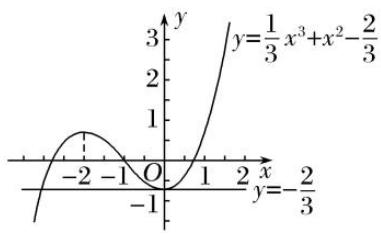

# 专题09 函数的最值

# 考点一 求已知函数的最值

# 【方法总结】

# 导数法求给定区间上函数的最值问题的一般步骤

(1)求函数 $f(x)$ 的导数 $f'(x)$ ;  
(2)求 $f(x)$ 在给定区间上的单调性和极值；  
(3)求 $f(x)$ 在给定区间上的端点值;  
(4)将 $f(x)$ 的各极值与 $f(x)$ 的端点值进行比较，确定 $f(x)$ 的最大值与最小值；  
(5)反思回顾，查看关键点，易错点和解题规范.

# 【例题选讲】

[例 1](1)函数 $f(x)=\ln x-x$ 在区间 $(0, e]$ 上的最大值为 \_\_\_\_.

答案 -1 解析 $f'(x) = \frac{1}{x} - 1$ ，令 $f'(x) = 0$ 得 $x = 1$ 。当 $x \in (0, 1)$ 时， $f'(x) > 0$ ；当 $x \in (1, e]$ 时， $f'(x) < 0$ 。 $\therefore$ 当 $x = 1$ 时， $f(x)$ 取得最大值，且 $f(x)_{\max} = f(1) = \ln 1 - 1 = -1$ 。

(2)函数 $f(x)=\frac{1}{2}x^{2}+x-2\ln x$ 的最小值为 \_\_\_\_.

答案 $\frac{3}{2}$ 解析 因为 $f'(x) = x + 1 - \frac{2}{x} = \frac{(x + 2)(x - 1)}{x} (x > 0)$ ，所以 $f(x)$ 在 $(0, 1)$ 上单调递减，在 $(1, +\infty)$ 上单调递增，所以 $f(x)_{\min} = f(1) = \frac{1}{2} + 1 = \frac{3}{2}$ .

(3)已知函数 $f(x) = \frac{1}{3} x^3 + mx^2 + nx + 2$ ，其导函数 $f'(x)$ 为偶函数， $f(1) = -\frac{2}{3}$ ，则函数 $g(x) = f'(x)e^x$ 在区间[0, 2]上的最小值为 \_\_\_\_.

答案 -2e 解析 由题意可得 $f'(x) = x^2 + 2mx + n$ ， $\because f'(x)$ 为偶函数， $\therefore m = 0$ ，故 $f(x) = \frac{1}{3}x^3 + nx + 2$ ， $\because f(1) = \frac{1}{3} + n + 2 = -\frac{2}{3}$ ， $\therefore n = -3$ 。 $\therefore f(x) = \frac{1}{3}x^3 - 3x + 2$ ，则 $f'(x) = x^2 - 3$ 。故 $g(x) = e^x(x^2 - 3)$ ，则 $g'(x) = e^x(x^2 - 3 + 2x) = e^x(x - 1) \cdot (x + 3)$ ，据此可知函数 $g(x)$ 在区间[0, 1)上单调递减，在区间(1, 2]上单调递增，故函数 $g(x)$ 的极小值，即最小值为 $g(1) = e^1 \cdot (1^2 - 3) = -2e$ 。

(4)已知函数 $f(x)=2\sin x+\sin 2x$ ，则 $f(x)$ 的最小值是 \_\_\_\_.

答案 $-\frac{3\sqrt{3}}{2}$ 解析 $\because f(x)$ 的最小正周期 $T=2\pi,\therefore$ 求 $f(x)$ 的最小值相当于求 $f(x)$ 在 $[0,2\pi]$ 上的最小值. $f'(x)=2\cos x+2\cos 2x=2\cos x+2(2\cos^{2}x-1)=4\cos^{2}x+2\cos x-2=2(2\cos x-1)(\cos x+1)$ . 令 $f'(x)=0$ , 解得 $\cos x=\frac{1}{2}$ 或 $\cos x=-1,x\in[0,2\pi]$ . $\therefore$ 由 $\cos x=-1$ , 得 $x=\pi;$ 由 $\cos x=\frac{1}{2}$ , 得 $x=\frac{5}{3}\pi$ 或 $x=\frac{\pi}{3}$ . $\because$ 函数的最值只能在导数值为 0 的点或区间端点处取到, $f(\pi)=2\sin\pi+\sin 2\pi=0,f\left(\frac{\pi}{3}\right)=2\sin\frac{\pi}{3}+\sin\frac{2\pi}{3}=\frac{3\sqrt{3}}{2},f\left(\frac{5}{3}\pi\right)=$

$-\frac{3\sqrt{3}}{2}, f(0)=0, f(2\pi)=0, \therefore f(x)$ 的最小值为 $-\frac{3\sqrt{3}}{2}$ .

(5)设正实数 x，则 $f(x)=\frac{\ln^{2}x}{x^{\ln x}}$ 的值域为 \_\_\_\_.

答案 $\left[0, \frac{1}{\mathrm{e}}\right]$ 解析 令 $\ln x = t$ ，则 $x = \mathrm{e}^t$ ， $\therefore g(t) = \frac{t^2}{\mathrm{e}t^2}$ ，令 $t^2 = m, m \geq 0$ ， $\therefore h(m) = \frac{m}{\mathrm{e}^m}$ ， $\therefore h'(m) = \frac{\mathrm{e}^m(1 - m)}{\mathrm{e}^{2m}}$ ，令 $h'(m) = 0$ ，解得 $m = 1$ ，当 $0 \leq m < 1$ 时， $h'(m) > 0$ ，函数 $h(m)$ 单调递增，当 $m \geq 1$ 时， $h'(m) < 0$ ，函数 $h(m)$ 单调递减， $\therefore h(m)_{\max} = h(1) = \frac{1}{\mathrm{e}}$ ， $\because f(0) = 0$ ，当 $m \to +\infty$ 时， $h(m) \to 0$ ， $\therefore f(x) = \frac{\ln^2 x}{x^{\ln x}}$ 的值域为 $\left[0, \frac{1}{\mathrm{e}}\right]$ .

(6)已知函数 $f(x) = \mathrm{e}\ln x$ 和 $g(x) = x + 1$ 的图象与直线 $y = m$ 的交点分别为 $P(x_{1},y_{1})$ ， $Q(x_{2},y_{2})$ ，则 $x_{1} - x_{2}$ 的取值范围是（）

A. $[1, +\infty)$

B. $[2, +\infty)$

C. $\left[\frac{1}{2},+\infty\right]$

D. $\left[\frac{3}{2},+\infty\right]$

答案 A 解析 由题意知 $f(x_1) = g(x_2)$ ，所以 $\mathrm{e}\ln x_1 = x_2 + 1$ ，即 $x_2 = \mathrm{e}\ln x_1 - 1$ ，则 $x_1 - x_2 = x_1 - \mathrm{e}\ln x_1 + 1$ ， $x_1 > 0$ 。令 $h(x) = x - \mathrm{e}\ln x + 1 (x > 0)$ ，则 $h'(x) = 1 - \frac{\mathrm{e}}{x} = \frac{x - \mathrm{e}}{x}$ 。当 $x > \mathrm{e}$ 时， $h'(x) > 0$ ，当 $0 < x < \mathrm{e}$ 时， $h'(x) < 0$ ，所以 $h(x)$ 在 $(0, \mathrm{e})$ 上单调递减，在 $(\mathrm{e}, +\infty)$ 上单调递增，所以 $h(x)_{\min} = h(\mathrm{e}) = 1$ 。又当 $x \to 0^+$ 时， $h(x) \to +\infty$ ，当 $x \to +\infty$ 时， $h(x) \to +\infty$ ，所以 $h(x)$ 在 $(0, +\infty)$ 上的值域为 $[1, +\infty)$ ，所以 $x_1 - x_2$ 的取值范围为 $[1, +\infty)$ 。

(7)已知不等式 $e^{x}-1\geq kx+\ln x$ 对于任意的 $x\in(0,+\infty)$ 恒成立，则 k 的最大值为 \_\_\_\_.

答案 e-1 解析 $\forall x\in(0,+\infty)$ ，不等式 $e^{x}-1\geq kx+\ln x$ 恒成立，等价于 $\forall x\in(0,+\infty)$ ， $k\leq\frac{e^{x}-1-\ln x}{x}$ 恒成立，令 $\varphi(x)=\frac{e^{x}-1-\ln x}{x}(x>0)$ ，则 $\varphi'(x)=\frac{e^{x}(x-1)+\ln x}{x^{2}}$ ，当 $x\in(0,1)$ 时， $\varphi'(x)<0$ ，当 $x\in(1,+\infty)$ 时， $\varphi'(x)>0$ ，∴ $\varphi(x)$ 在 $(0,1)$ 上单调递减，在 $(1,+\infty)$ 上单调递增，∴ $\varphi(x)_{\min}=\varphi(1)=e-1$ ，∴ $k\leq e-1$ 。

(8)(多选)设函数 $f(x)=\frac{x+\mathrm{e}^{|x|}}{\mathrm{e}^{|x|}}$ ，则下列选项正确的是()

A. $f(x)$ 为奇函数

B. $f(x)$ 的图象关于点 $(0, 1)$ 对称

C. $f(x)$ 的最大值为 $\frac{1}{e} + 1$

D. $f(x)$ 的最小值为 $-\frac{1}{\mathrm{e}} + 1$

答案 BCD 解析 $f(x)=\frac{x}{\mathrm{e}^{|x|}}+1$ ，不满足 $f(-x)=-f(x)$ ，故 A 项错误；令 $g(x)=\frac{x}{\mathrm{e}^{|x|}}$ ，则 $g(-x)=\frac{-x}{\mathrm{e}^{|-x|}}=\frac{-x}{\mathrm{e}^{|x|}}=-g(x)$ ，所以 $g(x)$ 为奇函数，则 $f(x)$ 关于点 $(0,1)$ 对称，B 项正确；设 $f(x)=\frac{x}{\mathrm{e}^{|x|}}+1$ 的最大值为 M，则 $g(x)$ 的最大值为 M-1，设 $f(x)=\frac{x}{\mathrm{e}^{|x|}}+1$ 的最小值为 N，则 $g(x)$ 的最小值为 N-1，当 x>0 时， $g(x)=\frac{x}{\mathrm{e}^{x}}$ ，所以 $g'(x)=\frac{1-x}{\mathrm{e}^{x}}$ ，当 0<x<1 时， $g'(x)>0$ ，当 x>1 时， $g'(x)<0$ ，所以当 0<x<1 时， $g(x)$ 单调递增，当 x>1 时， $g(x)$ 单调递减，所以 $g(x)$ 在 x=1 处取得最大值，最大值为 $g(1)=\frac{1}{\mathrm{e}}$ ，由于 $g(x)$ 为奇函数，所以 $g(x)$

在 x = -1 处取得最小值，最小值为 $g(-1) = -\frac{1}{e}$ ，所以 $f(x)$ 的最大值为 $M = \frac{1}{e} + 1$ ，最小值为 $N = -\frac{1}{e} + 1$ ，故 C、D 项正确。故选 B、C、D。

[例 2] 已知函数 $f(x)=\mathrm{e}^{x}\cos x-x$ .

(1)求曲线 $y=f(x)$ 在点 $(0, f(0))$ 处的切线方程;

(2)求函数 $f(x)$ 在区间 $\left[0, \frac{\pi}{2}\right]$ 上的最大值和最小值.

解析 (1) 因为 $f(x)=\mathrm{e}^{x}\cos x-x$ ，所以 $f'(x)=\mathrm{e}^{x}(\cos x-\sin x)-1$ ， $f'(0)=0$ .

又因为 $f(0)=1$ ，所以曲线 $y=f(x)$ 在点 $(0, f(0))$ 处的切线方程为 y=1。

(2) 设 $h(x)=\mathrm{e}^{x}(\cos x-\sin x)-1$ ，则 $h'(x)=\mathrm{e}^{x}(\cos x-\sin x-\sin x-\cos x)=-2\mathrm{e}^{x}\sin x.$

当 $x \in \begin{bmatrix} 0, & \frac{\pi}{2} \end{bmatrix}$ 时， $h'(x) < 0$ ，所以 $h(x)$ 在区间 $\begin{bmatrix} 0, & \frac{\pi}{2} \end{bmatrix}$ 上单调递减.

所以对任意 $x \in \begin{bmatrix} 0, & \frac{\pi}{2} \end{bmatrix}$ ，有 $h(x) < h(0) = 0$ ，即 $f'(x) < 0$ 。所以函数 $f(x)$ 在区间 $\begin{bmatrix} 0, & \frac{\pi}{2} \end{bmatrix}$ 上单调递减。
因此 $f(x)$ 在区间 $\begin{bmatrix}0, & \frac{\pi}{2}\end{bmatrix}$ 上的最大值为 $f(0)=1$ ，最小值为 $f\left(\frac{\pi}{2}\right)=-\frac{\pi}{2}$ .

[例 3] (2017·浙江)已知函数 $f(x)=(x-\sqrt{2x-1})\mathrm{e}^{-x}\left(x\geqslant\frac{1}{2}\right)$ .

(1)求 $f(x)$ 的导函数;

(2)求 $f(x)$ 在区间 $\left[\frac{1}{2}, +\infty\right]$ 上的取值范围.

解析 (1) $f'(x)=(x-\sqrt{2x-1})'e^{-x}+(x-\sqrt{2x-1})(e^{-x})'= \left(1-\frac{1}{\sqrt{2x-1}}\right)e^{-x}-(x-\sqrt{2x-1})e^{-x}$

$$
= \left[ 1 - \frac {1}{\sqrt {2 x - 1}} - x + \sqrt {2 x - 1} \right] \mathrm{e} ^ {- x} = (1 - x) \left(1 - \frac {2}{\sqrt {2 x - 1}}\right) \mathrm{e} ^ {- x} \left(x > \frac {1}{2}\right).
$$

(2) 令 $f'(x) = (1 - x)\left(1 - \frac{2}{\sqrt{2x - 1}}\right)e^{-x} = 0$ ，解得 $x = 1$ 或 $\frac{5}{2}$ .

当 x 变化时， $f(x)$ ， $f'(x)$ 的变化如下表：

<table><tr><td>x</td><td> $\frac{1}{2}$ </td><td> $\left( \frac{1}{2}, 1 \right)$ </td><td>1</td><td> $\left( 1, \frac{5}{2} \right)$ </td><td> $\frac{5}{2}$ </td><td> $\left( \frac{5}{2}, +\infty \right)$ </td></tr><tr><td>f&#x27;(x)</td><td></td><td>-</td><td>0</td><td>+</td><td>0</td><td>-</td></tr><tr><td>f(x)</td><td> $\frac{1}{2}e - \frac{1}{2}$ </td><td></td><td>0</td><td></td><td> $\frac{1}{2}e - \frac{5}{2}$ </td><td></td></tr></table>

又 $f\left(\frac{1}{2}\right)=\frac{1}{2}e-\frac{1}{2},\quad f(1)=0,\quad f\left(\frac{5}{2}\right)=\frac{1}{2}e-\frac{5}{2},\quad$ 则 $f(x)$ 在区间 $\left[\frac{1}{2},+\infty\right]$ 上的最大值为 $\frac{1}{2}e-\frac{1}{2}.$

又 $f(x) = (x - \sqrt{2x - 1})\mathrm{e}^{-x} = \frac{1}{2} (\sqrt{2x - 1} -1)^{2}\mathrm{e}^{-x}\geq 0.$

综上， $f(x)$ 在区间 $\left[\frac{1}{2}, +\infty\right]$ 上的取值范围是 $\left[0, \frac{1}{2}e - \frac{1}{2}\right]$ .

[例 4] (2021·北京)已知函数 $f(x)=\frac{3-2x}{x^{2}+a}$ .

(1)若 a=0，求 $y=f(x)$ 在 $(1, f(1))$ 处的切线方程；  
(2)若函数 $f(x)$ 在 x = -1 处取得极值，求 $f(x)$ 的单调区间，以及最大值和最小值.

解析 (1) 当 $a = 0$ 时， $f(x) = \frac{3 - 2x}{x^2}$ ，则 $f'(x) = \frac{x^2 \cdot (-2) - (3 - 2x) \cdot 2x}{x^4} = \frac{2x - 6}{x^3}$ .

当 x=1 时， $f(1)=1$ ， $f'(1)=-4$ ，

故 $y=f(x)$ 在 $(1, f(1))$ 处的切线方程为 $y-1=-4(x-1)$ ，整理得 $4x+y-5=0$ .

(2)已知函数 $f(x) = \frac{3 - 2x}{x^2 + a}$ ，则 $f'(x) = \frac{(x^2 + a) \cdot (-2) - (3 - 2x) \cdot 2x}{(x^2 + a)^2} = \frac{2(x^2 - 3x - a)}{(x^2 + a)^2}$ .

若函数 $f(x)$ 在 x = -1 处取得极值，则 $f'(-1) = 0$ ，即 $\frac{2(4 - a)}{(a + 1)^2} = 0$ ，解得 a = 4。

经检验，当 a=4 时，x=-1 为函数 $f(x)$ 的极大值，符合题意.

此时 $f(x)=\frac{3-2x}{x^{2}+4}$ ，其定义域为 R， $f'(x)=\frac{2(x-4)(x+1)}{(x^{2}+4)^{2}}$

令 $f'(x)=0$ ，解得 $x_{1}=-1$ ， $x_{2}=4$ 。 $f(x)$ ， $f'(x)$ 随 x 的变化趋势如下表：

<table><tr><td>x</td><td> $(-\infty, -1)$ </td><td>-1</td><td> $(-1, 4)$ </td><td>4</td><td> $(4, +\infty)$ </td></tr><tr><td>f&#x27;(x)</td><td>+</td><td>0</td><td>-</td><td>0</td><td>+</td></tr><tr><td>f(x)</td><td>↗</td><td>极大值</td><td>↘</td><td>极小值</td><td>↗</td></tr></table>

故函数 $f(x)$ 的单调递增区间为 $(-∞, -1)$ ， $(4, +∞)$ ，单调递减区间为 $(-1, 4)$ .

由上表知 $f(x)$ 的极大值为 $f(-1)=1$ ，极小值为 $f(4)=-\frac{1}{4}$ .

又因为 $x<\frac{3}{2}$ 时， $f(x)>0;\quad x>\frac{3}{2}$ 时， $f(x)<0,$

所以函数 $f(x)$ 的最大值为 $f(-1)=1$ ，最小值为 $f(4)=-\frac{1}{4}$ .

[例 5] 已知函数 $f(x)=\left\{\begin{aligned}-x^{3}+x^{2},&x<1,\\ a\ln x,&x\geq1.\end{aligned}\right.$

(1)求 $f(x)$ 在区间 $(-∞, 1)$ 上的极小值和极大值；  
(2)求 $f(x)$ 在 $[-1, e]$ (e 为自然对数的底数) 上的最大值.

解析 (1) 当 $x < 1$ 时, $f'(x) = -3x^2 + 2x = -x(3x - 2)$ ,

令 $f(x)=0$ ，解得 x=0 或 $x=\frac{2}{3}$ .

当 x 变化时， $f'(x)$ ， $f(x)$ 的变化情况如下表：

<table><tr><td>x</td><td> $(-\infty, 0)$ </td><td>0</td><td> $\left(0, \frac{2}{3}\right)$ </td><td> $\frac{2}{3}$ </td><td> $\left(\frac{2}{3}, 1\right)$ </td></tr><tr><td>f(x)</td><td>-</td><td>0</td><td>+</td><td>0</td><td>-</td></tr><tr><td>f(x)</td><td></td><td>极小值</td><td></td><td>极大值</td><td></td></tr></table>

故当 x=0 时，函数 $f(x)$ 取到极小值，极小值为 $f(0)=0$ ，

当 $x=\frac{2}{3}$ 时，函数 $f(x)$ 取到极大值，极大值为 $f\left(\frac{2}{3}\right)=\frac{4}{27}$ .

(2)①当 $-1 \leq x < 1$ 时，根据(1)知，函数 $f(x)$ 在 $[-1, 0)$ 和 $\left[\frac{2}{3}, 1\right]$ 上单调递减，在 $\left[0, \frac{2}{3}\right]$ 上单调递增. 因为 $f(-1) = 2$ ， $f\left[\frac{2}{3}\right] = \frac{4}{27}$ ， $f(0) = 0$ ，所以 $f(x)$ 在 $[-1, 1)$ 上的最大值为 2.

②当 $1 \leq x \leq e$ 时， $f(x) = a \ln x$ ，当 $a \leq 0$ 时， $f(x) \leq 0$ ;

当 a>0 时， $f(x)$ 在 $[1, e]$ 上单调递增．则 $f(x)$ 在 $[1, e]$ 上的最大值为 $f(e)=a$ .

故当 $a \geq 2$ 时， $f(x)$ 在 $[-1, e]$ 上的最大值为 a;

当 a<2 时， $f(x)$ 在 $[-1, e]$ 上的最大值为 2.

# 【对点训练】

1. 函数 $y = \frac{x}{\mathrm{e}^x}$ 在[0, 2]上的最大值是( )

A. $\frac{1}{e}$

B. $\frac{2}{e^{2}}$

C. 0

D. $\frac{1}{2\sqrt{e}}$

1. 答案 A 解析 易知 $y'=\frac{1-x}{e^{x}}$ , $x\in[0,2]$ ，令 $y'>0$ ，得 $0\leq x<1$ ，令 $y'<0$ ，得 $1<x\leq2$ ，所以函数 $y=\frac{x}{e^{x}}$ 在 $[0,1]$ 上单调递增，在 $(1,2]$ 上单调递减，所以 $y=\frac{x}{e^{x}}$ 在 $[0,2]$ 上的最大值是 $y_{\max}=\frac{1}{e}$ ，故选 A.

2. 函数 $f(x)=2x-\ln x$ 的最小值为 \_\_\_\_.

2. 答案 $1 + \ln 2$ 解析 $f(x)$ 的定义域为 $(0, +\infty)$ , $f'(x) = 2 - \frac{1}{x} = \frac{2x - 1}{x}$ , 当 $0 < x < \frac{1}{2}$ 时, $f'(x) < 0$ ; 当 $x > \frac{1}{2}$ 时, $f'(x) > 0$ . $\therefore f(x)$ 在 $\left(0, \frac{1}{2}\right)$ 上单调递减, 在 $\left(\frac{1}{2}, +\infty\right)$ 上单调递增, $\therefore f(x)_{\min} = f\left(\frac{1}{2}\right) = 1 - \ln \frac{1}{2} = 1 + \ln 2$ .

3. 已知 $f(x) = 2x^{3} - 6x^{2} + m$ (m 为常数) 在 $[-2, 2]$ 上有最大值 3，那么此函数在 $[-2, 2]$ 上的最小值是()

A. -37

B. -29

C. -5

D. 以上都不对

3. 答案 A 解析 $\because f'(x) = 6x^2 - 12x = 6x(x - 2), \therefore f(x)$ 在 $(-2, 0)$ 上单调递增，在 $(0, 2)$ 上单调递减， $\therefore x = 0$ 为极大值点，也为最大值点， $\therefore f(0) = m = 3, \therefore m = 3.\therefore f(-2) = -37, f(2) = -5.\therefore$ 最小值是-37．故选A.

4. 已知函数 $f(x) = x + 2\sin x, x \in [0, 2\pi]$ ，则 $f(x)$ 的值域为（）

A. $\left[\frac{4\pi}{3} -\sqrt{3},\frac{2\pi}{3} +\sqrt{3}\right]$

B. $\left[0,\frac{4\pi}{3}-\sqrt{3}\right]$

C. $\left[\frac{2\pi}{3} +\sqrt{3}, 2\pi \right]$

D. $[0, 2\pi]$

4. 答案 D 解析 $f(x) = 1 + 2\cos x, x \in [0, 2\pi]$ ，令 $f'(x) = 0$ ，得 $\cos x = -\frac{1}{2}, \therefore x = \frac{2\pi}{3}$ 或 $x = \frac{4\pi}{3}$ ，又 $f\left(\frac{2\pi}{3}\right)$

$$
\begin{array}{l} {= \frac {2 \pi}{3} + \sqrt {3}, f \left(\frac {4 \pi}{3}\right) = \frac {4 \pi}{3} - \sqrt {3}, f (0) = 0, f (2 \pi) = 2 \pi , f \left(\frac {4 \pi}{3}\right) - f \left(\frac {2 \pi}{3}\right) = \frac {2 \pi}{3} - 2 \sqrt {3} <   0, \therefore f (0) <   f \left(\frac {4 \pi}{3}\right) <   f \left(\frac {2 \pi}{3}\right) <   f (2 \pi),} \\ {\therefore f (x) _ {\max} = f (2 \pi) = 2 \pi , f (x) _ {\min} = f (0) = 0, \therefore f (x) \text {的值域为} [ 0, 2 \pi ].} \end{array}
$$

5. 设 $0 < x < \pi$ ，则函数 $y = \frac{2 - \cos x}{\sin x}$ 的最小值是 \_\_\_\_.

5. 答案 $\sqrt{3}$ 解析 $y' = \frac{\sin^2 x - (2 - \cos x)\cos x}{\sin^2 x} = \frac{1 - 2\cos x}{\sin^2 x}$ . 因为 $0 < x < \pi$ ，所以当 $\frac{\pi}{3} < x < \pi$ 时， $y' > 0$ ；当 $0 < x < \frac{\pi}{3}$ 时， $y' < 0$ 。所以当 $x = \frac{\pi}{3}$ 时， $y_{\min} = \sqrt{3}$ .

6. 若曲线 $y = x\mathrm{e}^{x} + \frac{m}{x + 1} (x < -1)$ 存在两条垂直于 $y$ 轴的切线，则 $m$ 的取值范围为 \_\_\_\_.

6. 答案 $\left(-\frac{27}{e^{4}}, 0\right)$ 解析 由题意可得， $y'=(x+1)e^{x}-\frac{m}{(x+1)^{2}}=0$ ，即 $m=(x+1)^{3}e^{x}$ 在 $(-∞, -1)$ 上有两个不同的解。设 $f(x)=(x+1)^{3}e^{x}(x<-1)$ ， $f'(x)=(x+1)^{2}e^{x}(x+4)$ 。当 x<-4 时， $f'(x)<0$ ；当 -4<x<-1 时， $f'(x)>0$ 。所以 $f(x)_{\min}=f(-4)=-\frac{27}{e^{4}}$ ，当 x<-1 时， $f(x)<0$ ，故 $m\in\left(-\frac{27}{e^{4}}, 0\right)$ 。

7. 已知实数 $x, y$ 满足 $4^{x} + 9^{y} = 1$ ，则 $2^{x + 1} + 3^{y + 1}$ 的取值范围是 \_\_\_\_.

7. 答案 $(2, \sqrt{13}]$ 解析 由 $4^{x} + 9^{y} = 1$ 得 $2^{2x} + 3^{2y} = 1$ , $3^{y} = \sqrt{1 - 2^{2x}}$ , 其中 $2^{2x} \in (0, 1)$ , 所以 $2^{x} \in (0, 1)$ , 所以 $2^{x+1} + 3^{y+1} = 2 \times 2^{x} + 3 \times 3^{y} = 2 \times 2^{x} + 3\sqrt{1 - 2^{2x}}$ , 令 $t = 2^{x}$ , 则 $f(t) = 2t + 3\sqrt{1 - t^2} (0 < t < 1)$ , 则 $f'(t) = 2 - \frac{3t}{\sqrt{1 - t^2}}$ , 令 $f'(t) = 2 - \frac{3t}{\sqrt{1 - t^2}} = 0$ 得 $t = \frac{2\sqrt{13}}{13}$ , 所以函数 $f(t)$ 在 $\left[0, \frac{2\sqrt{13}}{13}\right]$ 上单调递增, 在 $\left[\frac{2\sqrt{13}}{13}, 1\right]$ 上单调递减, 且 $f(0) = 3$ , $f\left[\frac{2\sqrt{13}}{13}\right] = \sqrt{13}$ , $f(1) = 2$ , 所以 $2^{x+1} + 3^{y+1}$ 的取值范围为 $(2, \sqrt{13}]$ .

8. 已知函数 $f(x) = \ln x - ax$ ，其中 $x \in [1, +\infty)$ ，若不等式 $f(x) \leqslant 0$ 恒成立，则实数 $a$ 的取值范围为( )

A. $[1, +\infty)$

B. $\left[-\infty,\quad1-\frac{1}{e}\right]$

C. $\left[\frac{1}{e},+\infty\right]$

D. $[0, +\infty)$

8. 答案 C 解析 当 $x \in [1, +\infty)$ 时，不等式 $f(x) \leqslant 0$ 恒成立等价于 $a \geqslant \frac{\ln x}{x}$ 在 $[1, +\infty)$ 上恒成立，令 $g(x) = \frac{\ln x}{x}$ ，则 $g'(x) = \frac{1 - \ln x}{x^2}$ 。当 0 < x < e 时， $g'(x) > 0$ ；当 x > e 时， $g'(x) < 0$ ；所以 $g(x)_{\max} = g(e) = \frac{1}{e}$ ，所以 $a \geqslant \frac{1}{e}$ 。故选 C。

9. 已知函数 $f(x) = x^3 - 3x - 1$ ，若对于区间 $[-3, 2]$ 上的任意 $x_1, x_2$ ，都有 $|f(x_1) - f(x_2)| \leqslant t$ ，则实数 $t$ 的最小值是（）

A. 20

B. 18

C. 3

D. 0

9. 答案 A 解析 因为 $f(x) = 3x^{2} - 3 = 3(x - 1)(x + 1), x \in [-3, 2]$ ，所以 $f(x)$ 在 $[-1, 1]$ 上单调递减，在 $[1, 2]$ 和 $[-3, -1]$ 上单调递增。 $f(-3) = -19, f(-1) = 1, f(1) = -3, f(2) = 1$ ，所以在区间 $[-3, 2]$ 上， $f(x)_{\max}=1$ ， $f(x)_{\min}=-19$ ，又由题设知在 $[-3,2]$ 上 $|f(x_{1})-f(x_{2})|\leqslant f(x)_{\max}-f(x)_{\min}=20$ ，所以 $t\geqslant20$ ，故选A.

10. (多选)已知函数 $f(x) = \frac{\ln x}{x}$ ， $g(x) = xe^{-x}$ ，若存在 $x_1 \in (0, +\infty)$ ， $x_2 \in \mathbf{R}$ ，使得 $f(x_1) = g(x_2) = k (k < 0)$ 成立，则下列结论正确的是（）

A. $\ln x_{1}=x_{2}$

B. $\ln(-x_{2})=-x_{1}$

C. $\left(\frac{x_{2}}{x_{1}}\right)^{2}\cdot e^{k}$ 的最大值为 $\frac{4}{e^{2}}$

D. $\left(\frac{x_2}{x_1}\right)^2 \cdot \mathrm{e}^k$ 的最大值为 $\frac{1}{\mathrm{e}^2}$

10. 答案 AC 解析 由 $f(x_1) = g(x_2) = k (k < 0)$ ，得 $\frac{\ln x_1}{x_1} = x_2 e - x_2 < 0$ (\*), $\therefore 0 < x_1 < 1, x_2 < 0$ 。由(\*)可得 $\frac{-\ln x_1}{x_1} = -x_2 e - x_2 > 0$ ，两边同时取对数可得 $\ln (-\ln x_1) - \ln x_1 = \ln (-x_2) - x_2$ 。∵函数 $y = \ln x + x$ 在(0, +∞)上为增函数，∴ $-\ln x_1 = -x_2$ ，∴ $\ln x_1 = x_2$ ，∴ $\frac{x_2}{x_1} = \frac{\ln x_1}{x_1} = k$ ，故 $\left(\frac{x_2}{x_1}\right)^2 \cdot e^k = k^2 \cdot e^k$ 。设 $h(k) = k^2 \cdot e^k (k < 0)$ ，∴ $h'(k) = e^k (k^2 + 2k)$ ，由 $e^k (k^2 + 2k) > 0$ ，可得 $k < -2$ ，故 $h(k)$ 在(-∞, -2)上单调递增，在(-2, 0)上单调递减，故 $h(k)_{\max} = h(-2) = \frac{4}{e^2}$ ，因此 $\left(\frac{x_2}{x_1}\right)^2 \cdot e^k$ 的最大值为 $\frac{4}{e^2}$ 。综上，AC 正确。

11. 设函数 $f(x) = x^{2} + 1 - \ln x$ .

(1)求 $f(x)$ 的单调区间；

(2)求函数 $g(x) = f(x) - x$ 在区间 $\left[\frac{1}{2}, 2\right]$ 上的最小值.

11. 解析 (1) 易知 $f(x)$ 的定义域为 $(0, +\infty)$ ， $f'(x)=2x-\frac{1}{x}$ ,

由 $f'(x)>0$ ，得 $x>\frac{\sqrt{2}}{2}$ ，由 $f'(x)<0$ ，得 $0<x<\frac{\sqrt{2}}{2}$ .

∴ $f(x)$ 的单调递减区间为 $\left(0, \frac{\sqrt{2}}{2}\right)$ ，单调递增区间为 $\left(\frac{\sqrt{2}}{2}, +\infty\right)$ .

(2)由题意知 $g(x)=x^{2}+1-\ln x-x,\quad g'(x)=2x-\frac{1}{x}-1=\frac{(2x+1)(x-1)}{x},$

由 $g'(x)>0$ ，得 x>1，由 $g'(x)\leq0$ ，得 $0<x\leq1$ ，

$\therefore g(x)$ 在 $\left[\frac{1}{2}, 1\right]$ 上单调递减，在(1，2]上单调递增，∴在 $\left[\frac{1}{2}, 2\right]$ 上， $g(x)$ 的最小值为 $g(1)=1$ 。

12. 已知函数 $f(x) = \frac{ax^2 + bx + c}{\mathrm{e}^x} (a > 0)$ 的导函数 $f'(x)$ 的两个零点为-3和0.

(1)求 $f(x)$ 的单调区间；

(2)若 $f(x)$ 的极小值为 $-e^{3}$ ，求 $f(x)$ 在区间 $[-5, +\infty)$ 上的最大值.

12. 解析 $(1)f'(x) = \frac{(2ax + b)e^x - (ax^2 + bx + c)e^x}{(e^x)^2} = \frac{-ax^2 + (2a - b)x + b - c}{e^x}$ .

令 $g(x)=-ax^{2}+(2a-b)x+b-c,$

因为 $e^{x}>0$ ，所以 $f'(x)$ 的零点就是 $g(x)=-ax^{2}+(2a-b)x+b-c$ 的零点，且 $f'(x)$ 与 $g(x)$ 符号相同.

又因为 a>0，所以当 -3<x<0 时， $g(x)>0$ ，即 $f'(x)>0$ ，

当 x<-3 或 x>0 时， $g(x)<0$ ，即 $f'(x)<0$ ，

所以 $f(x)$ 的单调递增区间是 $(-3, 0)$ ，单调递减区间是 $(-∞, -3)$ ， $(0, +∞)$ .

(2)由(1)知，x=-3 是 $f(x)$ 的极小值点，

所以有 $\left\{\begin{aligned}f(-3)&=\frac{9a-3b+c}{e^{-3}}=-e^{3},\\ g(0)&=b-c=0,\\ g(-3)&=-9a-3(2a-b)+b-c=0,\end{aligned}\right.$

解得 a=1, b=5, c=5，所以 $f(x)=\frac{x^{2}+5x+5}{e^{x}}$ .

由(1)可知当 x=0 时 $f(x)$ 取得极大值 $f(0)=5$ ,

故 $f(x)$ 在区间 $[-5, +\infty)$ 上的最大值取 $f(-5)$ 和 $f(0)$ 中的最大者.

而 $f(-5) = \frac{5}{\mathrm{e}^{-5}} = 5\mathrm{e}^{5} > 5 = f(0),$

所以函数 $f(x)$ 在区间 $[-5, +\infty)$ 上的最大值是 $5e^{5}$ .

13. (2019·全国III)已知函数 $f(x) = 2x^{3} - ax^{2} + 2$ .

(1)讨论 $f(x)$ 的单调性;

(2)当 0<a<3 时，记 $f(x)$ 在区间 $[0,1]$ 的最大值为 M，最小值为 m，求 M-m 的取值范围.

13. 解析 (1) $f(x)$ 的定义域为 R, $f'(x)=6x^{2}-2ax=2x(3x-a)$ . 令 $f'(x)=0$ , 得 x=0 或 $x=\frac{a}{3}$ .

若 $a > 0$ ，则当 $x\in (-\infty ,0)\cup \left(\frac{a}{3}, + \infty\right)$ 时， $f(x) > 0$ ，当 $x\in \left(0,\frac{a}{3}\right)$ 时， $f(x) <   0$

故 $f(x)$ 在 $(-∞, 0)$ ， $\left(\frac{a}{3}, +∞\right)$ 上单调递增，在 $\left(0, \frac{a}{3}\right)$ 上单调递减；

若 a=0，则 $f(x)$ 在 $(-∞, +∞)$ 上单调递增；

若 a<0，则当 $x\in\left(-\infty,\frac{a}{3}\right)\cup(0,+\infty)$ 时， $f(x)>0$ ，当 $x\in\left(\frac{a}{3},0\right)$ 时， $f(x)<0$ ，

故 $f(x)$ 在 $\left(-\infty, \frac{a}{3}\right)$ ， $(0, +\infty)$ 上单调递增，在 $\left(\frac{a}{3}, 0\right)$ 上单调递减.

(2)当 $0 < a < 3$ 时，由(1)知， $f(x)$ 在 $\left[0, \frac{a}{3}\right]$ 上单调递减，在 $\left[\frac{a}{3}, 1\right]$ 上单调递增，所以 $f(x)$ 在 $[0, 1]$ 的最小值为 $f\left[\frac{a}{3}\right] = -\frac{a^3}{27} + 2$ ，最大值为 $f(0) = 2$ 或 $f(1) = 4 - a$ .

于是 $m=-\frac{a^{3}}{27}+2,\quad M=\left\{\begin{aligned}&4-a, &0<a<2,\\ &2, &2\leq a<3.\end{aligned}\right.$ 所以 $M-m=\left\{\begin{aligned}&2-a+\frac{a^{3}}{27}, &0<a<2,\\ &\frac{a^{3}}{27}, &2\leq a<3.\end{aligned}\right.$

①当 0<a<2 时，可知 $y=2-a+\frac{a^{3}}{27}$ 单调递减，所以 M-m 的取值范围是 $\left(\frac{8}{27}, 2\right)$ .

②当 $2 \leq a < 3$ 时， $y = \frac{a^{3}}{27}$ 单调递增，所以 M - m 的取值范围是 $\left[\frac{8}{27}, 1\right]$ .

综上，M-m 的取值范围是 $\left[\frac{8}{27}, 2\right]$ .

# 考点二 已知函数的最值求参数的值(范围)

# 【例题选讲】

[例 1](1)函数 $f(x)=x^{3}-3x^{2}-9x+k$ 在区间 $[-4, 4]$ 上的最大值为 10，则其最小值为 \_\_\_\_.

答案 -71 解析 $f(x) = 3x^{2} - 6x - 9 = 3(x - 3)(x + 1)$ . 由 $f'(x) = 0$ 得 $x = 3$ 或 $x = -1$ . 又 $f(-4) = k - 76$ , $f(3) = k - 27$ , $f(-1) = k + 5$ , $f(4) = k - 20$ . 由 $f(x)_{\max} = k + 5 = 10$ , 得 $k = 5$ , $\therefore f(x)_{\min} = k - 76 = -71$ .

(2)若函数 $f(x) = a\sin x + \frac{1}{3}\sin 3x$ 在 $x = \frac{\pi}{3}$ 处有最值，则 $a$ 等于（）

A. 2 B. 1 C. $\frac{2\sqrt{3}}{3}$ D. 0

答案 A 解析 $\because f(x)$ 在 $x = \frac{\pi}{3}$ 处有最值， $\therefore x = \frac{\pi}{3}$ 是函数 $f(x)$ 的极值点。又 $f'(x) = a\cos x + \cos 3x$ ， $\therefore f\left(\frac{\pi}{3}\right) = a\cos \frac{\pi}{3} + \cos \pi = 0$ ，解得 $a = 2$ 。

(3)函数 $f(x)=3x-x^{3}$ 在区间 $(a^{2}-12, a)$ 上有最小值，则实数 a 的取值范围是 \_\_\_\_.

答案（-1，2] 解析 $f'(x) = 3 - 3x^2 = -3(x + 1)(x - 1)$ ，令 $f'(x) = 0$ ，得 $x_1 = -1, x_2 = 1$ 。当 $x$ 变化时， $f'(x)$ ， $f(x)$ 的变化情况如下表：

<table><tr><td>x</td><td> $(-\infty, -1)$ </td><td>-1</td><td> $(-1, 1)$ </td><td>1</td><td> $(1, +\infty)$ </td></tr><tr><td>f&#x27;(x)</td><td>-</td><td>0</td><td>+</td><td>0</td><td>-</td></tr><tr><td>f(x)</td><td>↓</td><td>极小值-2</td><td>↑</td><td>极大值2</td><td>↓</td></tr></table>

又由 $3x - x^{3} = -2$ ，得 $(x + 1)^{2}(x - 2) = 0$ 。∴ $x_{3} = -1$ ， $x_{4} = 2$ 。∵ $f(x)$ 在开区间 $(a^{2} - 12, a)$ 上有最小值，
∴ 最小值一定是极小值．∴ $\left\{\begin{aligned}&a^{2}-12<-1<a,\\ &a\leq2,\end{aligned}\right.$ 解得 $-1<a\leq2$ .

(4)已知函数 $f(x)=\ln x-ax$ 存在最大值0，则a= \_\_\_\_.

答案 $\frac{1}{\mathrm{e}}$ 解析 $f'(x) = \frac{1}{x} - a, x > 0$ 。当 $a \leq 0$ 时， $f'(x) = \frac{1}{x} - a > 0$ 恒成立，函数 $f(x)$ 单调递增，不存在最大值；当 $a > 0$ 时，令 $f'(x) = \frac{1}{x} - a = 0$ ，解得 $x = \frac{1}{a}$ 。当 $0 < x < \frac{1}{a}$ 时， $f'(x) > 0$ ，函数 $f(x)$ 单调递增；当 $x > \frac{1}{a}$ 时， $f'(x) < 0$ ，函数 $f(x)$ 单调递减。 $\therefore f(x)_{\max} = f\left(\frac{1}{a}\right) = \ln \frac{1}{a} - 1 = 0$ ，解得 $a = \frac{1}{\mathrm{e}}$ 。

(5)(多选)若函数 $f(x)=2x^{3}-ax^{2}(a<0)$ 在 $\left(\frac{a}{2},\frac{a+6}{3}\right)$ 上有最大值，则a的取值可能为()

A. -6

B. -5

C. -4

D.-3

答案 ABC 解析 令 $f'(x) = 2x(3x - a) = 0$ ，解得 $x_1 = 0$ ， $x_2 = \frac{a}{3} (a < 0)$ ，当 $\frac{a}{3} < x < 0$ 时， $f'(x) < 0$ ；当 $x < \frac{a}{3}$ 或 $x > 0$ 时， $f'(x) > 0$ ，则 $f(x)$ 的单调递增区间为 $\left(-\infty, \frac{a}{3}\right)$ ， $(0, +\infty)$ ，单调递减区间为 $\left(\frac{a}{3}, 0\right)$ ，从而 $f(x)$ 在 $x = \frac{a}{3}$ 处取得极大值 $f\left(\frac{a}{3}\right) = -\frac{a^3}{27}$ ，由 $f(x) = -\frac{a^3}{27}$ ，得 $\left(x - \frac{a}{3}\right)^2\left(2x + \frac{a}{3}\right) = 0$ ，解得 $x = \frac{a}{3}$ 或 $x = -\frac{a}{6}$ ，又 $f(x)$ 在 $\left(\frac{a}{2}, \frac{a + 6}{3}\right)$ 上有最大值，所以 $\frac{a}{3} < \frac{a + 6}{3} \leq -\frac{a}{6}$ ，解得 $a \leq -4$ 。所以选项 A，B，C 符合题意。

(6)设函数 $f(x) = \mathrm{e}^{x} - \cos x - 2a$ ， $g(x) = x$ ，若存在 $x_{1}, x_{2} \in [0, \pi]$ 使得 $f(x_{1}) = g(x_{2})$ 成立，则 $x_{2} - x_{1}$ 的最小值为1时，实数 $a = (\quad)$

A. -1

B. $-\frac{1}{2}$

C. $\frac{1}{2}$

D. 1

答案 B 解析 令 $F(x) = f(x) - g(x) = \mathrm{e}^x - \cos x - x - 2a$ ，由 $f(x_1) = g(x_2)$ 得 $x_2 = \mathrm{e}^{x_1} - \cos x_1 - 2a$ ，则 $x_2 - x_1 = \mathrm{e}^{x_1} - \cos x_1 - x_1 - 2a$ ，则 $x_2 - x_1$ 的最小值即 $F(x)$ 在 $[0, \pi]$ 上的最小值。∵ $F'(x) = \mathrm{e}^x + \sin x - 1 \geq 0$ 恒成立， $x \in [0, \pi]$ ，∴ $F(x)$ 在 $[0, \pi]$ 上单调递增，∴ $F(x)_{\min} = F(0) = -2a = (x_2 - x_1)_{\min} = 1$ ，∴ $a = -\frac{1}{2}$ .

# 【对点训练】

1. 已知函数 $f(x) = 2x^{3} - 6x^{2} + a$ 在 $[-2, 2]$ 上有最小值 $-37$ ，则 $a$ 的值为 \_\_\_\_， $f(x)$ 在 $[-2, 2]$ 上的最大值为 \_\_\_\_.

1. 答案 3 3 解析 $f(x) = 6x^{2} - 12x = 6x(x - 2)$ . 由 $f'(x) = 0$ ，得 $x = 0$ 或 $x = 2$ . 当 $x$ 变化时， $f'(x), f(x)$ 的变化情况如下表：

<table><tr><td>x</td><td>-2</td><td>(-2,0)</td><td>0</td><td>(0,2)</td><td>2</td></tr><tr><td>f&#x27;(x)</td><td></td><td>+</td><td>0</td><td>-</td><td>0</td></tr><tr><td>f(x)</td><td>-40+a</td><td></td><td>极大值a</td><td></td><td>-8+a</td></tr></table>

所以当 x = -2 时， $f(x)_{\min} = -40 + a = -37$ ，所以 a = 3。

所以当 x=0 时， $f(x)$ 取得最大值 3.

2. 若函数 $y = x^{3} + \frac{3}{2} x^{2} + m$ 在 $[-2, 1]$ 上的最大值为 $\frac{9}{2}$ ，则 $m$ 等于（）

A. 0

B. 1

C. 2

D. $\frac{5}{2}$

2. 答案 C 解析 $y' = 3x^{2} + 3x = 3x(x + 1)$ ，易知当 -1 < x < 0 时， $y' < 0$ ，当 -2 < x < -1 或 0 < x < 1 时， $y' > 0$ ，所以函数 $y = x^{3} + \frac{3}{2}x^{2} + m$ 在 $(-2, -1)$ ， $(0, 1)$ 上单调递增，在 $(-1, 0)$ 上单调递减，又当 x = -1 时， $y = m + \frac{1}{2}$ ，当 x = 1 时， $y = m + \frac{5}{2}$ ，所以最大值为 $m + \frac{5}{2} = \frac{9}{2}$ ，解得 m = 2。

2. 已知函数 $f(x) = x^3 + 3x^2 - 9x + 1$ ，若 $f(x)$ 在区间 $[k, 2]$ 上的最大值为 28，则实数 $k$ 的取值范围为（）

A. $[-3, +\infty)$

B. $(-3, +\infty)$

C. $(-\infty, -3)$

D. $(-\infty, -3]$

2. 答案 D 解析 由题意知 $f'(x) = 3x^2 + 6x - 9$ ，令 $f'(x) = 0$ ，解得 $x = 1$ 或 $x = -3$ ，所以 $f'(x)$ ， $f(x)$ 随 $x$ 的变化情况如下表：

<table><tr><td>x</td><td> $(-\infty, -3)$ </td><td>-3</td><td> $(-3, 1)$ </td><td>1</td><td> $(1, +\infty)$ </td></tr><tr><td>f&#x27;(x)</td><td>+</td><td>0</td><td>-</td><td>0</td><td>+</td></tr><tr><td>f(x)</td><td>↗</td><td>极大值</td><td>↘</td><td>极小值</td><td>↗</td></tr></table>

又 $f(-3)=28,\ f(1)=-4,\ f(2)=3,\ f(x)$ 在区间 $[k,2]$ 上的最大值为 28，所以 $k\leq-3$ .

3. 若函数 $f(x) = \frac{1}{3} x^3 + x^2 - \frac{2}{3}$ 在区间 $(a, a + 5)$ 上存在最小值，则实数 $a$ 的取值范围是（）

A. $[-5, 0)$

B. $(-5, 0)$

C. $[-3, 0)$

D. $(-3,0)$

3. 答案 C 解析 由题意， $f'(x)=x^{2}+2x=x(x+2)$ ，故 $f(x)$ 在 $(-∞, -2)$ ， $(0, +∞)$ 上是增函数，在 $(-2, 0)$ 上是减函数，作出其图象如图所示。令 $\frac{1}{3}x^{3}+x^{2}-\frac{2}{3}=-\frac{2}{3}$ 得，x=0 或 x=-3，则结合图象可知， $\left\{\begin{aligned}-3&\leq a<0,\\ a&+5>0,\end{aligned}\right.$ 解得 $a\in[-3, 0)$ ，故选 C.

line

| x | y |
|---|---|
| -2 | 0 |
| -1 | 1 |
| 0 | 0 |
| 1 | 1 |
| 2 | 3 |

4. 已知函数 $f(x) = \ln x - \frac{m}{x} (m \in \mathbf{R})$ 在区间[1, e]上取得最小值 4，则 $m =$ \_\_\_\_.

4. 答案 -3e 解析 $f(x) = \frac{1}{x} + \frac{m}{x^2} = \frac{x + m}{x^2}$ ，若 $m \geq 0$ ， $f(x) > 0$ ， $f(x)$ 在[1，e]上为增函数，有 $f(x)_{\min} = f(1) = -m = 4$ ， $m = -4$ ，舍去。若 $m < 0$ ，令 $f(x) = 0$ ，则 $x = -m$ ，且当 $x < -m$ 时， $f'(x) < 0$ ， $f(x)$ 单调递减，当 $x > -m$ 时， $f'(x) > 0$ ， $f(x)$ 单调递增。若 $-m \leq 1$ ，即 $m \geq -1$ 时， $f(x)_{\min} = f(1) = -m \leq 1$ ，不可能等于4；若 $1 < -m \leq e$ ，即 $-e \leq m < -1$ 时， $f(x)_{\min} = f(-m) = \ln(-m) + 1$ ，令 $\ln(-m) + 1 = 4$ ，得 $m = -e^3 \notin [-e, -1)$ ；若 $-m > e$ ，即 $m < -e$ 时， $f(x)_{\min} = f(e) = 1 - \frac{m}{e}$ ，令 $1 - \frac{m}{e} = 4$ ，得 $m = -3e$ ，符合题意。综上所述， $m = -3e$ 。

5. 已知函数 $f(x) = \frac{x}{x^2 + a} (a > 0)$ 在 $[1, +\infty)$ 上的最大值为 $\frac{\sqrt{3}}{3}$ ，则 $a$ 的值为（）

A. $\sqrt{3} - 1$

B. $\frac{3}{4}$

C. $\frac{4}{3}$

D. $\sqrt{3} + 1$

5. 答案 A 解析 由 $f(x) = \frac{x}{x^2 + a}$ ，得 $f'(x) = \frac{a - x^2}{(x^2 + a)^2}$ ，当 $a > 1$ 时，若 $x > \sqrt{a}$ ，则 $f'(x) < 0$ ， $f(x)$ 单调递减，若 $1 < x < \sqrt{a}$ ，则 $f'(x) > 0$ ， $f(x)$ 单调递增，故当 $x = \sqrt{a}$ 时，函数 $f(x)$ 有最大值 $\frac{1}{2\sqrt{a}} = \frac{\sqrt{3}}{3}$ ，解得 $a = \frac{3}{4} < 1$ ，不符合题意。当 $a = 1$ 时，函数 $f(x)$ 在 $[1, +\infty)$ 上单调递减，最大值为 $f(1) = \frac{1}{2}$ ，不符合题意。当 $0 < a < 1$ 时，函

数 $f(x)$ 在 $[1, +\infty)$ 上单调递减．此时最大值为 $f(1)=\frac{1}{a+1}=\frac{\sqrt{3}}{3}$ ，解得 $a=\sqrt{3}-1$ ，符合题意．故a的值为 $\sqrt{3}-1$

