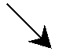
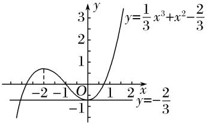

**专题09　函数的最值**

**考点一**　求已知函数的最值

【**方法总结**】

导数法求给定区间上函数的最值问题的一般步骤

(1)求函数*f*(*x*)的导数*f*′(*x*)；

(2)求*f*(*x*)在给定区间上的单调性和极值；

(3)求*f*(*x*)在给定区间上的端点值；

(4)将*f*(*x*)的各极值与*f*(*x*)的端点值进行比较，确定*f*(*x*)的最大值与最小值；

(5)反思回顾，查看关键点，易错点和解题规范．

**【例题选讲】**

<strong>[例1]</strong>(1)函数<em>f</em>(<em>x</em>)＝ln<em>x</em>－<em>x</em>在区间(0，e]上的最大值为\_\_\_\_\_\_\_\_．

答案　－1　解析　<em>f</em>′(<em>x</em>)＝－1，令<em>f</em>′(<em>x</em>)＝0得<em>x</em>＝1．当<em>x</em>∈(0，1)时，<em>f</em>′(<em>x</em>)＞0；当<em>x</em>∈(1，e]时，<em>f</em>′(<em>x</em>)＜0．∴当<em>x</em>＝1时，<em>f</em>(<em>x</em>)取得最大值，且<em>f</em>(<em>x</em>)max＝<em>f</em>(1)＝ln 1－1＝－1．

(2)函数<em>f</em>(<em>x</em>)＝<em>x</em>2＋<em>x</em>－2ln<em>x</em>的最小值为________．

答案　　解析　因为<em>f</em>′(<em>x</em>)＝<em>x</em>＋1－＝(<em>x</em>＞0)，所以<em>f</em>(<em>x</em>)在(0，1)上单调递减，在(1，＋∞)上单调递增，所以<em>f</em>(<em>x</em>)min＝<em>f</em>(1)＝＋1＝．

(3)已知函数<em>f</em>(<em>x</em>)＝<em>x</em>3＋<em>mx</em>2＋<em>nx</em>＋2，其导函数<em>f</em>′(<em>x</em>)为偶函数，<em>f</em>(1)＝－，则函数<em>g</em>(<em>x</em>)＝<em>f</em>′(<em>x</em>)e<em>x</em>在区间[0，2]上的最小值为________．

答案　－2e　解析　由题意可得<em>f</em>′(<em>x</em>)＝<em>x</em>2＋2<em>mx</em>＋<em>n</em>，∵<em>f</em>′(<em>x</em>)为偶函数，∴<em>m</em>＝0，故 <em>f</em>(<em>x</em>)＝<em>x</em>3＋<em>nx</em>＋2，∵<em>f</em>(1)＝＋<em>n</em>＋2＝－，∴<em>n</em>＝－3．∴<em>f</em>(<em>x</em>)＝<em>x</em>3－3<em>x</em>＋2，则<em>f</em>′(<em>x</em>)＝<em>x</em>2－3．故<em>g</em>(<em>x</em>)＝e<em>x</em>(<em>x</em>2－3)，则<em>g</em>′(<em>x</em>)＝e<em>x</em>(<em>x</em>2－3＋2<em>x</em>)＝e<em>x</em>(<em>x</em>－1)·(<em>x</em>＋3)，据此可知函数<em>g</em>(<em>x</em>)在区间[0，1)上单调递减，在区间(1，2]上单调递增，故函数<em>g</em>(<em>x</em>)的极小值，即最小值为<em>g</em>(1)＝e1·(12－3)＝－2e．

(4)已知函数*f*(*x*)＝2sin*x*＋sin2*x*，则*f*(*x*)的最小值是\_\_\_\_\_\_\_\_．

答案　－　解析　∵<em>f</em>(<em>x</em>)的最小正周期<em>T</em>＝2π，∴求<em>f</em>(<em>x</em>)的最小值相当于求<em>f</em>(<em>x</em>)在[0，2π]上的最小值．<em>f</em>′(<em>x</em>)＝2cos<em>x</em>＋2cos2<em>x</em>＝2cos<em>x</em>＋2(2cos2<em>x</em>－1)＝4cos2<em>x</em>＋2cos<em>x</em>－2＝2(2cos<em>x</em>－1)(cos<em>x</em>＋1)．令<em>f</em>′(<em>x</em>)＝0，解得cos<em>x</em>＝或cos<em>x</em>＝－1，<em>x</em>∈[0，2π]．∴由cos<em>x</em>＝－1，得<em>x</em>＝π；由cos<em>x</em>＝，得<em>x</em>＝π或<em>x</em>＝．∵函数的最值只能在导数值为0的点或区间端点处取到，<em>f</em>(π)＝2sinπ＋sin2π＝0，<em>f</em> ＝2sin＋sin＝，<em>f</em> ＝－，<em>f</em>(0)＝0，<em>f</em>(2π)＝0，∴<em>f</em>(<em>x</em>)的最小值为－．

(5)设正实数*x*，则*f*(*x*)＝的值域为\_\_\_\_\_\_\_\_．

答案　　解析　令ln <em>x</em>＝<em>t</em>，则<em>x</em>＝e<em>t</em>，∴<em>g</em>(<em>t</em>)＝，令<em>t</em>2＝<em>m</em>，<em>m</em>≥0，∴<em>h</em>(<em>m</em>)＝，∴<em>h</em>′(<em>m</em>)＝，令<em>h</em>′(<em>m</em>)＝0，解得<em>m</em>＝1，当0≤<em>m</em>&lt;1时，<em>h</em>′(<em>m</em>)&gt;0，函数<em>h</em>(<em>m</em>)单调递增，当<em>m</em>≥1时，<em>h</em>′(<em>m</em>)&lt;0，函数<em>h</em>(<em>m</em>)单调递减，∴<em>h</em>(<em>m</em>)max＝<em>h</em>(1)＝，∵<em>f</em>(0)＝0，当<em>m</em>→＋∞时，<em>h</em>(<em>m</em>)→0，∴<em>f</em>(<em>x</em>)＝的值域为．

(6)已知函数<em>f</em>(<em>x</em>)＝eln<em>x</em>和<em>g</em>(<em>x</em>)＝<em>x</em>＋1的图象与直线<em>y</em>＝<em>m</em>的交点分别为<em>P</em>(<em>x</em>1，<em>y</em>1)，<em>Q</em>(<em>x</em>2，<em>y</em>2)，则<em>x</em>1－<em>x</em>2的取值范围是(　　)

A．[1，＋∞)　　　　　B．[2，＋∞)　　　　　C．　　　　　D．

答案　A　解析　由题意知<em>f</em>(<em>x</em>1)＝<em>g</em>(<em>x</em>2)，所以eln <em>x</em>1＝<em>x</em>2＋1，即<em>x</em>2＝eln <em>x</em>1－1，则<em>x</em>1－<em>x</em>2＝<em>x</em>1－eln <em>x</em>1＋1，<em>x</em>1&gt;0．令<em>h</em>(<em>x</em>)＝<em>x</em>－eln <em>x</em>＋1(<em>x</em>&gt;0)，则<em>h</em>′(<em>x</em>)＝1－＝．当<em>x</em>&gt;e时，<em>h</em>′(<em>x</em>)&gt;0，当0&lt;<em>x</em>&lt;e时，<em>h</em>′(<em>x</em>)&lt;0，所以<em>h</em>(<em>x</em>)在(0，e)上单调递减，在(e，＋∞)上单调递增，所以<em>h</em>(<em>x</em>)min＝<em>h</em>(e)＝1．又当<em>x</em>→ 0＋时，<em>h</em>(<em>x</em>)→＋∞，当<em>x</em>→＋∞时，<em>h</em>(<em>x</em>)→＋∞，所以<em>h</em>(<em>x</em>)在(0，＋∞)上的值域为[1，＋∞)，所以<em>x</em>1－<em>x</em>2的取值范围为[1，＋∞)．

(7)已知不等式e<em>x</em>－1≥<em>kx</em>＋ln<em>x</em>对于任意的<em>x</em>∈(0，＋∞)恒成立，则<em>k</em>的最大值为\_\_\_\_\_\_\_\_．

答案　e－1　解析　∀<em>x</em>∈(0，＋∞)，不等式e<em>x</em>－1≥<em>kx</em>＋ln <em>x</em>恒成立，等价于∀<em>x</em>∈(0，＋∞)，<em>k</em>≤恒成立，令<em>φ</em>(<em>x</em>)＝(<em>x</em>&gt;0)，则<em>φ</em>′(<em>x</em>)＝，当<em>x</em>∈(0，1)时，<em>φ</em>′(<em>x</em>)&lt;0，当<em>x</em>∈(1，＋∞)时，<em>φ</em>′(<em>x</em>)&gt;0，∴<em>φ</em>(<em>x</em>)在(0，1)上单调递减，在(1，＋∞)上单调递增，∴<em>φ</em>(<em>x</em>)min＝<em>φ</em>(1)＝e－1，∴<em>k</em>≤e－1．

(8)(多选)设函数*f*(*x*)＝，则下列选项正确的是(　　)

A．*f*(*x*)为奇函数　　　　　　　　　　　　　B．*f*(*x*)的图象关于点(0，1)对称

C．*f*(*x*)的最大值为＋1　　　　　　　　　　　D．*f*(*x*)的最小值为－＋1

答案　BCD　解析　*f*(*x*)＝＋1，不满足*f*(－*x*)＝－*f*(*x*)，故A项错误；令*g*(*x*)＝，则*g*(－*x*)＝＝＝－*g*(*x*)，所以*g*(*x*)为奇函数，则*f*(*x*)关于点(0，1)对称，B项正确；设*f*(*x*)＝＋1的最大值为*M*，则*g*(*x*)的最大值为*M*－1，设*f*(*x*)＝＋1的最小值为*N*，则*g*(*x*)的最小值为*N*－1，当*x*＞0时，*g*(*x*)＝，所以*g*′(*x*)＝，当0＜*x*＜1时，*g*′(*x*)＞0，当*x*＞1时，*g*′(*x*)＜0，所以当0＜*x*＜1时，*g*(*x*)单调递增，当*x*＞1时，*g*(*x*)单调递减，所以*g*(*x*)在*x*＝1处取得最大值，最大值为*g*(1)＝，由于*g*(*x*)为奇函数，所以*g*(*x*)在*x*＝－1处取得最小值，最小值为*g*(－1)＝－，所以*f*(*x*)的最大值为*M*＝＋1，最小值为*N*＝－＋1，故C、D项正确．故选B、C、D．

<strong>[例2]</strong>　已知函数<em>f</em>(<em>x</em>)＝e<em>x</em>cos <em>x</em>－<em>x</em>．

(1)求曲线*y*＝*f*(*x*)在点(0，*f*(0))处的切线方程；

(2)求函数*f*(*x*)在区间上的最大值和最小值．

解析　(1)因为<em>f</em>(<em>x</em>)＝e<em>x</em>cos <em>x</em>－<em>x</em>，所以<em>f</em>′(<em>x</em>)＝e<em>x</em>(cos <em>x</em>－sin <em>x</em>)－1，<em>f</em>′(0)＝0．

又因为*f*(0)＝1，所以曲线*y*＝*f*(*x*)在点(0，*f*(0))处的切线方程为*y*＝1．

(2)设<em>h</em>(<em>x</em>)＝e<em>x</em>(cos <em>x</em>－sin <em>x</em>)－1，则<em>h</em>′(<em>x</em>)＝e<em>x</em>(cos <em>x</em>－sin <em>x</em>－sin <em>x</em>－cos <em>x</em>)＝－2e<em>x</em>sin <em>x</em>．

当*x*∈时，*h*′(*x*)＜0，所以*h*(*x*)在区间上单调递减．

所以对任意*x*∈，有*h*(*x*)＜*h*(0)＝0，即*f*′(*x*)＜0．所以函数*f*(*x*)在区间上单调递减．

因此*f*(*x*)在区间上的最大值为*f*(0)＝1，最小值为*f*＝－．

<strong>[例3]</strong>　(2017·浙江)已知函数<em>f</em>(<em>x</em>)＝(<em>x</em>－)e－<em>x</em>．

(1)求*f*(*x*)的导函数；

(2)求*f*(*x*)在区间上的取值范围．

解析　(1)<em>f</em>′(<em>x</em>)＝(<em>x</em>－)′e－<em>x</em>＋(<em>x</em>－)(e－<em>x</em>)′＝e－<em>x</em>－(<em>x</em>－)e－<em>x</em>

＝e－<em>x</em>＝(1－<em>x</em>)e－<em>x</em>．

(2)令<em>f</em>′(<em>x</em>)＝(1－<em>x</em>)e－<em>x</em>＝0，解得<em>x</em>＝1或．

当*x*变化时，*f*(*x*)，*f*′(*x*)的变化如下表：

<table><tr><td>
<em>x</em>
</td><td></td><td></td><td>
1
</td><td></td><td></td><td></td></tr><tr><td>
<em>f</em>′(<em>x</em>)
</td><td></td><td>
－
</td><td>
0
</td><td>
＋
</td><td>
0
</td><td>
－
</td></tr><tr><td>
<em>f</em>(<em>x</em>)
</td><td>
e－
</td><td></td><td>
0
</td><td></td><td>
e－
</td><td></td></tr></table>

又*f*＝e－，*f*(1)＝0，*f*＝e－，则*f*(*x*)在区间上的最大值为e－．

又<em>f</em>(<em>x</em>)＝(<em>x</em>－)e－<em>x</em>＝(－1)2e－<em>x</em>≥0．

综上，*f*(*x*)在区间上的取值范围是．

<strong>[例4]</strong>　(2021·北京)已知函数<em>f</em>(<em>x</em>)＝．

(1)若*a*＝0，求*y*＝*f*(*x*)在(1，*f*(1))处的切线方程；

(2)若函数*f*(*x*)在*x*＝－1处取得极值，求*f*(*x*)的单调区间，以及最大值和最小值．

解析　(1)当*a*＝0时，*f*(*x*)＝，则*f*′(*x*)＝＝．

当*x*＝1时，*f*(1)＝1，*f*′(1)＝－4，

故*y*＝*f*(*x*)在(1，*f*(1))处的切线方程为*y*－1＝－4(*x*－1)，整理得4*x*＋*y*－5＝0．

(2)已知函数*f*(*x*)＝，则*f*′(*x*)＝＝．

若函数*f*(*x*)在*x*＝－1处取得极值，则*f*′(－1)＝0，即＝0，解得*a*＝4．

经检验，当*a*＝4时，*x*＝－1为函数*f*(*x*)的极大值，符合题意．

此时<em>f</em>(<em>x</em>)＝，其定义域为<strong>R</strong>，<em>f</em>′(<em>x</em>)＝，

令<em>f</em>′(<em>x</em>)＝0，解得<em>x</em>1＝－1，<em>x</em>2＝4．<em>f</em>(<em>x</em>)，<em>f</em>′(<em>x</em>)随<em>x</em>的变化趋势如下表：

<table><tr><td>
<em>x</em>
</td><td>
(－∞，－1)
</td><td>
－1
</td><td>
(－1，4)
</td><td>
4
</td><td>
(4，＋∞)
</td></tr><tr><td>
<em>f</em>′(<em>x</em>)
</td><td>
＋
</td><td>
0
</td><td>
－
</td><td>
0
</td><td>
＋
</td></tr><tr><td>
<em>f</em>(<em>x</em>)
</td><td>
↗
</td><td>
极大值
</td><td>
↘
</td><td>
极小值
</td><td>
↗
</td></tr></table>

故函数*f*(*x*)的单调递增区间为(－∞，－1)，(4，＋∞)，单调递减区间为(－1，4)．

由上表知*f*(*x*)的极大值为*f*(－1)＝1，极小值为*f*(4)＝－．

又因为*x*<时，*f*(*x*)>0；*x*>时，*f*(*x*)<0，

所以函数*f*(*x*)的最大值为*f*(－1)＝1，最小值为*f*(4)＝－．

<strong>[例5]</strong>　已知函数<em>f</em>(<em>x</em>)＝

(1)求*f*(*x*)在区间(－∞，1)上的极小值和极大值；

(2)求*f*(*x*)在[－1，e](e为自然对数的底数)上的最大值．

解析　(1)当<em>x</em>&lt;1时，<em>f</em>′(<em>x</em>)＝－3<em>x</em>2＋2<em>x</em>＝－<em>x</em>(3<em>x</em>－2)，

令*f*′(*x*)＝0，解得*x*＝0或*x*＝．

当*x*变化时，*f*′(*x*)，*f*(*x*)的变化情况如下表：

<table><tr><td>
<em>x</em>
</td><td>
(－∞，0)
</td><td>
0
</td><td></td><td></td><td></td></tr><tr><td>
<em>f</em>′(<em>x</em>)
</td><td>
－
</td><td>
0
</td><td>
＋
</td><td>
0
</td><td>
－
</td></tr><tr><td>
<em>f</em>(<em>x</em>)
</td><td></td><td>
极小值
</td><td></td><td>
极大值
</td><td></td></tr></table>

故当*x*＝0时，函数*f*(*x*)取到极小值，极小值为*f*(0)＝0，

当*x*＝时，函数*f*(*x*)取到极大值，极大值为*f*＝．

(2)①当－1≤*x*<1时，根据(1)知，函数*f*(*x*)在[－1，0)和上单调递减，在上单调递增．

因为*f*(－1)＝2，*f*＝，*f*(0)＝0，所以*f*(*x*)在[－1，1)上的最大值为2．

②当1≤*x*≤e时，*f*(*x*)＝*a*ln *x*，当*a*≤0时，*f*(*x*)≤0；

当*a*>0时，*f*(*x*)在[1，e]上单调递增．则*f*(*x*)在[1，e]上的最大值为*f*(e)＝*a*．

故当*a*≥2时，*f*(*x*)在[－1，e]上的最大值为*a*；

当*a*<2时，*f*(*x*)在[－1，e]上的最大值为2．

【**对点训练**】

1．函数*y*＝在[0，2]上的最大值是(　　)

A．　　　　　　　　B．　　　　　　　　C．0　　　　　　　　D．

1．答案　<strong>A</strong>　解析　易知<em>y</em>′＝，<em>x</em>∈[0，2]，令<em>y</em>′＞0，得0≤<em>x</em>＜1，令<em>y</em>′＜0，得1＜<em>x</em>≤2，所以函数<em>y</em>

＝在[0，1]上单调递增，在(1，2]上单调递减，所以<em>y</em>＝在[0，2]上的最大值是<em>y</em>max＝，故选A．

2．函数*f*(*x*)＝2*x*－ln*x*的最小值为\_\_\_\_\_\_\_\_．

2．答案　1＋ln 2　解析　*f*(*x*)的定义域为(0，＋∞)，*f*′(*x*)＝2－＝，当0<*x*<时，*f*′(*x*)<0；当*x*>时，

<em>f</em>′(<em>x</em>)&gt;0．∴<em>f</em>(<em>x</em>)在上单调递减，在上单调递增，∴<em>f</em>(<em>x</em>)min＝<em>f</em> ＝1－ln ＝1＋ln 2．

3．已知<em>f</em>(<em>x</em>)＝2<em>x</em>3－6<em>x</em>2＋<em>m</em>(<em>m</em>为常数)在[－2，2]上有最大值3，那么此函数在[－2，2]上的最小值是(　　)

A．－37　　　　　　　　B．－29　　　　　　　　C．－5　　　　　　　　D．以上都不对

3．答案　<strong>A</strong>　解析　∵<em>f</em>′(<em>x</em>)＝6<em>x</em>2－12<em>x</em>＝6<em>x</em>(<em>x</em>－2)，∴<em>f</em>(<em>x</em>)在(－2，0)上单调递增，在(0，2)上单调递减，∴

*x*＝0为极大值点，也为最大值点，∴*f*(0)＝*m*＝3，∴*m*＝3．∴*f*(－2)＝－37，*f*(2)＝－5．∴最小值是－37．故选A．

4．已知函数*f*(*x*)＝*x*＋2sin*x*，*x*∈[0，2π]，则*f*(*x*)的值域为(　　)

A．　　B．　　C．　　D．[0，2π]

4．答案　D　解析　*f*′(*x*)＝1＋2cos*x*，*x*∈[0，2π]，令*f*′(*x*)＝0，得cos*x*＝－，∴*x*＝或*x*＝，又*f*

＝＋，<em>f</em> ＝－，<em>f</em>(0)＝0，<em>f</em>(2π)＝2π，<em>f</em> －<em>f</em> ＝－2&lt;0，∴<em>f</em>(0)&lt;<em>f</em> &lt;<em>f</em> &lt;<em>f</em>(2π)，∴<em>f</em>(<em>x</em>)max＝<em>f</em>(2π)＝2π，<em>f</em>(<em>x</em>)min＝<em>f</em>(0)＝0，∴<em>f</em>(<em>x</em>)的值域为[0，2π]．

5．设0<*x*<π，则函数*y*＝的最小值是\_\_\_\_\_\_\_\_．

5．答案　　解析　*y*′＝＝．因为0<*x*<π，所以当<*x*<π时，*y*′>0；当0<*x*<

时，<em>y</em>′&lt;0．所以当<em>x</em>＝时，<em>y</em>min＝．

6．若曲线<em>y</em>＝<em>x</em>e<em>x</em>＋(<em>x</em>&lt;－1)存在两条垂直于<em>y</em>轴的切线，则<em>m</em>的取值范围为\_\_\_\_\_\_\_\_．

6．答案　　解析　由题意可得，<em>y</em>′＝(<em>x</em>＋1)e<em>x</em>－＝0，即<em>m</em>＝(<em>x</em>＋1)3e<em>x</em>在(－∞，－1)上

有两个不同的解．设<em>f</em>(<em>x</em>)＝(<em>x</em>＋1)3e<em>x</em>(<em>x</em>&lt;－1)，<em>f</em>′(<em>x</em>)＝(<em>x</em>＋1)2e<em>x</em>(<em>x</em>＋4)．当<em>x</em>&lt;－4时，<em>f</em>′(<em>x</em>)&lt;0；当－4&lt;<em>x</em>&lt;－1时，<em>f</em>′(<em>x</em>)&gt;0．所以<em>f</em>(<em>x</em>)min＝<em>f</em>(－4)＝－，当<em>x</em>&lt;－1时，<em>f</em>(<em>x</em>)&lt;0，故<em>m</em>∈．

7．已知实数<em>x</em>，<em>y</em>满足4<em>x</em>＋9<em>y</em>＝1，则2<em>x</em>＋1＋3<em>y</em>＋1的取值范围是\_\_\_\_\_\_\_\_．

7．答案　(2，]　解析　由4<em>x</em>＋9<em>y</em>＝1得22<em>x</em>＋32<em>y</em>＝1，3<em>y</em>＝，其中22<em>x</em>∈(0，1)，所以2<em>x</em>∈(0，

1)，所以2<em>x</em>＋1＋3<em>y</em>＋1＝2×2<em>x</em>＋3×3<em>y</em>＝2×2<em>x</em>＋3，令<em>t</em>＝2<em>x</em>，则<em>f</em>(<em>t</em>)＝2<em>t</em>＋3(0&lt;<em>t</em>&lt;1)，则<em>f</em>′(<em>t</em>)＝2－，令<em>f</em>′(<em>t</em>)＝2－＝0得<em>t</em>＝，所以函数<em>f</em>(<em>t</em>)在上单调递增，在上单调递减，且<em>f</em>(0)＝3，<em>f</em>＝，<em>f</em>(1)＝2，所以2<em>x</em>＋1＋3<em>y</em>＋1的取值范围为(2，]．

8．已知函数*f*(*x*)＝ln*x*－*ax*，其中*x*∈，若不等式*f*(*x*)≤0恒成立，则实数*a*的取值范围为(　　)

A．　　　　B．　　　　C．　　　　D．

8．答案　C　解析　当*x*∈时，不等式*f*(*x*)≤0恒成立等价于*a*≥在上恒成立，

令<em>g</em>(<em>x</em>)＝，则<em>g</em>′(<em>x</em>)＝．当0&lt;<em>x</em>&lt;e时，<em>g</em>′(<em>x</em>)&gt;0；当<em>x</em>&gt;e时，<em>g</em>′(<em>x</em>)&lt;0；所以<em>g</em>(<em>x</em>)max＝<em>g</em>(e)＝，所以<em>a</em>≥．故选C．

9．已知函数<em>f</em>(<em>x</em>)＝<em>x</em>3－3<em>x</em>－1，若对于区间[－3，2]上的任意<em>x</em>1，<em>x</em>2，都有|<em>f</em>(<em>x</em>1)－<em>f</em>(<em>x</em>2)|≤<em>t</em>，则实数<em>t</em>的最小

值是(　　)

A．20　　　　　　　　B．18　　　　　　　　C．3　　　　　　　　D．0

9．答案　A　解析　因为<em>f</em>′(<em>x</em>)＝3<em>x</em>2－3＝3(<em>x</em>－1)(<em>x</em>＋1)，<em>x</em>∈[－3，2]，所以<em>f</em>(<em>x</em>)在[－1，1]上单调递减，

在[1，2]和[－3，－1]上单调递增．<em>f</em>(－3)＝－19，<em>f</em>(－1)＝1，<em>f</em>(1)＝－3，<em>f</em>(2)＝1，所以在区间[－3，2]上，<em>f</em>(<em>x</em>)max＝1，<em>f</em>(<em>x</em>)min＝－19，又由题设知在[－3，2]上|<em>f</em>(<em>x</em>1)－<em>f</em>(<em>x</em>2)|≤<em>f</em>(<em>x</em>)max－<em>f</em>(<em>x</em>)min＝20，所以<em>t</em>≥20，故选A．

10．(多选)已知函数<em>f</em>(<em>x</em>)＝，<em>g</em>(<em>x</em>)＝<em>x</em>e－<em>x</em>，若存在<em>x</em>1∈(0，＋∞)，<em>x</em>2∈<strong>R</strong>，使得<em>f</em>(<em>x</em>1)＝<em>g</em>(<em>x</em>2)＝<em>k</em>(<em>k</em>＜0)成立，

则下列结论正确的是(　　)

A．ln <em>x</em>1＝<em>x</em>2　　　　　　　　　　　　　B．ln(－<em>x</em>2)＝－<em>x</em>1

C．2·e<em>k</em>的最大值为　　　　　　　　D．2·e<em>k</em>的最大值为

10．答案　<strong>AC</strong>　解析　由<em>f</em>(<em>x</em>1)＝<em>g</em>(<em>x</em>2)＝<em>k</em>(<em>k</em>＜0)，得＝<em>x</em>2e－<em>x</em>2＜0　(\*)，∴0＜<em>x</em>1＜1，<em>x</em>2＜0．由(\*)可得

＝－<em>x</em>2e－<em>x</em>2＞0，两边同时取对数可得ln(－ln <em>x</em>1)－ln <em>x</em>1＝ln(－<em>x</em>2)－<em>x</em>2．∵函数<em>y</em>＝ln <em>x</em>＋<em>x</em>在(0，＋∞)上为增函数，∴－ln <em>x</em>1＝－<em>x</em>2，∴ln <em>x</em>1＝<em>x</em>2，∴＝＝<em>k</em>，故2·e<em>k</em>＝<em>k</em>2·e<em>k</em>．设<em>h</em>(<em>k</em>)＝<em>k</em>2·e<em>k</em>(<em>k</em>＜0)，∴<em>h</em>′(<em>k</em>)＝e<em>k</em>(<em>k</em>2＋2<em>k</em>)，由e<em>k</em>(<em>k</em>2＋2<em>k</em>)＞0，可得<em>k</em>＜－2，故<em>h</em>(<em>k</em>)在(－∞，－2)上单调递增，在(－2，0)上单调递减，故<em>h</em>(<em>k</em>)max＝<em>h</em>(－2)＝，因此2·e<em>k</em>的最大值为．综上，AC正确．

11．设函数<em>f</em>(<em>x</em>)＝<em>x</em>2＋1－ln <em>x</em>．

(1)求*f*(*x*)的单调区间；

(2)求函数*g*(*x*)＝*f*(*x*)－*x*在区间上的最小值．

11．解析　(1)易知*f*(*x*)的定义域为(0，＋∞)，*f*′(*x*)＝2*x*－，

由*f*′(*x*)＞0，得*x*＞，由*f*′(*x*)＜0，得0＜*x*＜．

∴*f*(*x*)的单调递减区间为，单调递增区间为．

(2)由题意知<em>g</em>(<em>x</em>)＝<em>x</em>2＋1－ln <em>x</em>－<em>x</em>，<em>g</em>′(<em>x</em>)＝2<em>x</em>－－1＝，

由*g*′(*x*)＞0，得*x*＞1，由*g*′(*x*)≤0，得0＜*x*≤1，

∴*g*(*x*)在上单调递减，在(1，2]上单调递增，∴在上，*g*(*x*)的最小值为*g*(1)＝1．

12．已知函数*f*(*x*)＝(*a*>0)的导函数*f*′(*x*)的两个零点为－3和0．

(1)求*f*(*x*)的单调区间；

(2)若<em>f</em>(<em>x</em>)的极小值为－e3，求<em>f</em>(<em>x</em>)在区间[－5，＋∞)上的最大值．

12．解析　(1)*f*′(*x*)＝＝．

令<em>g</em>(<em>x</em>)＝－<em>ax</em>2＋(2<em>a</em>－<em>b</em>)<em>x</em>＋<em>b</em>－<em>c</em>，

因为e<em>x</em>&gt;0，所以<em>f</em>′(<em>x</em>)的零点就是<em>g</em>(<em>x</em>)＝－<em>ax</em>2＋(2<em>a</em>－<em>b</em>)<em>x</em>＋<em>b</em>－<em>c</em>的零点，且<em>f</em>′(<em>x</em>)与<em>g</em>(<em>x</em>)符号相同．

又因为*a*>0，所以当－3<*x*<0时，*g*(*x*)>0，即*f*′(*x*)>0，

当*x*<－3或*x*>0时，*g*(*x*)<0，即*f*′(*x*)<0，

所以*f*(*x*)的单调递增区间是(－3，0)，单调递减区间是(－∞，－3)，(0，＋∞)．

(2)由(1)知，*x*＝－3是*f*(*x*)的极小值点，

所以有

解得*a*＝1，*b*＝5，*c*＝5，所以*f*(*x*)＝．

由(1)可知当*x*＝0时*f*(*x*)取得极大值*f*(0)＝5，

故*f*(*x*)在区间[－5，＋∞)上的最大值取*f*(－5)和*f*(0)中的最大者．

而<em>f</em>(－5)＝＝5e5&gt;5＝<em>f</em>(0)，

所以函数<em>f</em>(<em>x</em>)在区间[－5，＋∞)上的最大值是5e5．

13．(2019·全国Ⅲ)已知函数<em>f</em>(<em>x</em>)＝2<em>x</em>3－<em>ax</em>2＋2．

(1)讨论*f*(*x*)的单调性；

(2)当0<*a*<3时，记*f*(*x*)在区间[0，1]的最大值为*M*，最小值为*m*，求*M*－*m*的取值范围．

13．解析　(1)<em>f</em>(<em>x</em>)的定义域为<strong>R</strong>，<em>f</em>′(<em>x</em>)＝6<em>x</em>2－2<em>ax</em>＝2<em>x</em>(3<em>x</em>－<em>a</em>)．令<em>f</em>′(<em>x</em>)＝0，得<em>x</em>＝0或<em>x</em>＝．

若*a*>0，则当*x*∈(－∞，0)∪时，*f*′(*x*)>0，当*x*∈时，*f*′(*x*)<0，

故*f*(*x*)在(－∞，0)，上单调递增，在上单调递减；

若*a*＝0，则*f*(*x*)在(－∞，＋∞)上单调递增；

若*a*<0，则当*x*∈∪(0，＋∞)时，*f*′(*x*)>0，当*x*∈时，*f*′(*x*)<0，

故*f*(*x*)在，(0，＋∞)上单调递增，在上单调递减．

(2)当0<*a*<3时，由(1)知，*f*(*x*)在上单调递减，在上单调递增，所以*f*(*x*)在[0，1]的最小值为*f* ＝－＋2，最大值为*f*(0)＝2或*f*(1)＝4－*a*．

于是*m*＝－＋2，*M*＝所以*M*－*m*＝

①当0<*a*<2时，可知*y*＝2－*a*＋单调递减，所以*M*－*m*的取值范围是．

②当2≤*a*<3时，*y*＝单调递增，所以*M*－*m*的取值范围是．

综上，*M*－*m*的取值范围是．

**考点二**　已知函数的最值求参数的值(范围)

**【例题选讲】**

<strong>[例1]</strong>(1)函数<em>f</em>(<em>x</em>)＝<em>x</em>3－3<em>x</em>2－9<em>x</em>＋<em>k</em>在区间[－4，4]上的最大值为10，则其最小值为\_\_\_\_\_\_\_\_．

答案　－71　解析　<em>f</em>′(<em>x</em>)＝3<em>x</em>2－6<em>x</em>－9＝3(<em>x</em>－3)(<em>x</em>＋1)．由<em>f</em>′(<em>x</em>)＝0得<em>x</em>＝3或<em>x</em>＝－1．又<em>f</em>(－4)＝<em>k</em>－76，<em>f</em>(3)＝<em>k</em>－27，<em>f</em>(－1)＝<em>k</em>＋5，<em>f</em>(4)＝<em>k</em>－20．由<em>f</em>(<em>x</em>)max＝<em>k</em>＋5＝10，得<em>k</em>＝5，∴<em>f</em>(<em>x</em>)min＝<em>k</em>－76＝－71．

(2)若函数*f*(*x*)＝*a*sin *x*＋sin3*x*在*x*＝处有最值，则*a*等于(　　)

A．2　　　　　　　　B．1　　　　　　　　C．　　　　　　　　D．0

答案　A　解析　∵*f*(*x*)在*x*＝处有最值，∴*x*＝是函数*f*(*x*)的极值点．又*f*′(*x*)＝*a*cos *x*＋cos 3*x*，∴*f*′＝*a*cos ＋cos π＝0，解得*a*＝2．

(3)函数<em>f</em>(<em>x</em>)＝3<em>x</em>－<em>x</em>3在区间(<em>a</em>2－12，<em>a</em>)上有最小值，则实数<em>a</em>的取值范围是\_\_\_\_\_\_\_\_．

答案　(－1，2]　解析　<em>f</em>′(<em>x</em>)＝3－3<em>x</em>2＝－3(<em>x</em>＋1)(<em>x</em>－1)，令<em>f</em>′(<em>x</em>)＝0，得<em>x</em>1＝－1，<em>x</em>2＝1．当<em>x</em>变化时，<em>f</em>′(<em>x</em>)，<em>f</em>(<em>x</em>)的变化情况如下表：

<table><tr><td>
<em>x</em>
</td><td>
(－∞，－1)
</td><td>
－1
</td><td>
(－1，1)
</td><td>
1
</td><td>
(1，＋∞)
</td></tr><tr><td>
<em>f</em>′(<em>x</em>)
</td><td>
－
</td><td>
0
</td><td>
＋
</td><td>
0
</td><td>
－
</td></tr><tr><td>
<em>f</em>(<em>x</em>)
</td><td>

</td><td>
极小值－2
</td><td>

</td><td>
极大值2
</td><td>

</td></tr></table>

又由3<em>x</em>－<em>x</em>3＝－2，得(<em>x</em>＋1)2(<em>x</em>－2)＝0．∴<em>x</em>3＝－1，<em>x</em>4＝2．∵<em>f</em>(<em>x</em>)在开区间(<em>a</em>2－12，<em>a</em>)上有最小值，∴最小值一定是极小值．∴解得－1&lt;<em>a</em>≤2．

(4)已知函数*f*(*x*)＝ln*x*－*ax*存在最大值0，则*a*＝\_\_\_\_\_\_\_\_．

答案　　解析　<em>f</em>′(<em>x</em>)＝－<em>a</em>，<em>x</em>＞0．当<em>a</em>≤0时，<em>f</em>′(<em>x</em>)＝－<em>a</em>＞0恒成立，函数<em>f</em>(<em>x</em>)单调递增，不存在最大值；当<em>a</em>＞0时，令<em>f</em>′(<em>x</em>)＝－<em>a</em>＝0，解得<em>x</em>＝．当0＜<em>x</em>＜时，<em>f</em>′(<em>x</em>)＞0，函数<em>f</em>(<em>x</em>)单调递增；当<em>x</em>＞时，<em>f</em>′(<em>x</em>)＜0，函数<em>f</em>(<em>x</em>)单调递减．∴<em>f</em>(<em>x</em>)max＝<em>f</em> ＝ln －1＝0，解得<em>a</em>＝．

(5)(多选)若函数<em>f</em>(<em>x</em>)＝2<em>x</em>3－<em>ax</em>2(<em>a</em>＜0)在上有最大值，则<em>a</em>的取值可能为(　　)

A．－6　　　　　　　　B．－5　　　　　　　　C．－4　　　　　　　　D．－3

答案　<strong>ABC</strong>　解析　令<em>f</em>′(<em>x</em>)＝2<em>x</em>(3<em>x</em>－<em>a</em>)＝0，解得<em>x</em>1＝0，<em>x</em>2＝(<em>a</em>＜0)，当＜<em>x</em>＜0时，<em>f</em>′(<em>x</em>)＜0；当<em>x</em>＜或<em>x</em>＞0时，<em>f</em>′(<em>x</em>)＞0，则<em>f</em>(<em>x</em>)的单调递增区间为，(0，＋∞)，单调递减区间为，从而<em>f</em>(<em>x</em>)在<em>x</em>＝处取得极大值<em>f</em>＝－，由<em>f</em>(<em>x</em>)＝－，得2＝0，解得<em>x</em>＝或<em>x</em>＝－，又<em>f</em>(<em>x</em>)在上有最大值，所以＜≤－，解得<em>a</em>≤－4．所以选项A，B，C符合题意．

(6)设函数<em>f</em>(<em>x</em>)＝e<em>x</em>－cos <em>x</em>－2<em>a</em>，<em>g</em>(<em>x</em>)＝<em>x</em>，若存在<em>x</em>1，<em>x</em>2∈[0，π]使得<em>f</em>(<em>x</em>1)＝<em>g</em>(<em>x</em>2)成立，则<em>x</em>2－<em>x</em>1的最小值为1时，实数<em>a</em>＝(　　)

A．－1　　　　　　　　B．－　　　　　　　　C．　　　　　　　　D．1

答案　B　解析　令<em>F</em>(<em>x</em>)＝<em>f</em>(<em>x</em>)－<em>g</em>(<em>x</em>)＝e<em>x</em>－cos <em>x</em>－<em>x</em>－2<em>a</em>，由<em>f</em>(<em>x</em>1)＝<em>g</em>(<em>x</em>2)得<em>x</em>2＝e<em>x</em>1－cos <em>x</em>1－2<em>a</em>，则<em>x</em>2－<em>x</em>1＝e<em>x</em>1－cos <em>x</em>1－<em>x</em>1－2<em>a</em>，则<em>x</em>2－<em>x</em>1的最小值即<em>F</em>(<em>x</em>)在[0，π]上的最小值．∵<em>F</em>′(<em>x</em>)＝e<em>x</em>＋sin <em>x</em>－1≥0恒成立，<em>x</em>∈[0，π]，∴<em>F</em>(<em>x</em>)在[0，π]上单调递增，∴<em>F</em>(<em>x</em>)min＝<em>F</em>(0)＝－2<em>a</em>＝(<em>x</em>2－<em>x</em>1)min＝1，∴<em>a</em>＝－．

【**对点训练**】

1．已知函数<em>f</em>(<em>x</em>)＝2<em>x</em>3－6<em>x</em>2＋<em>a</em>在[－2，2]上有最小值－37，则<em>a</em>的值为\_\_\_\_\_\_\_\_\_\_\_\_， <em>f</em>(<em>x</em>)在[－2，2]上

的最大值为\_\_\_\_\_\_\_\_．

1．答案　3　3　解析　<em>f</em>′(<em>x</em>)＝6<em>x</em>2－12<em>x</em>＝6<em>x</em>(<em>x</em>－2)．由<em>f</em>′(<em>x</em>)＝0，得<em>x</em>＝0或<em>x</em>＝2．当<em>x</em>变化时，<em>f</em>′(<em>x</em>)，<em>f</em>(<em>x</em>)

的变化情况如下表：

<table><tr><td>
<em>x</em>
</td><td>
－2
</td><td>
(－2，0)
</td><td>
0
</td><td>
(0，2)
</td><td>
2
</td></tr><tr><td>
<em>f</em>′(<em>x</em>)
</td><td></td><td>
＋
</td><td>
0
</td><td>
－
</td><td>
0
</td></tr><tr><td>
<em>f</em>(<em>x</em>)
</td><td>
－40＋<em>a</em>
</td><td>

</td><td>
极大值<em>a</em>
</td><td>

</td><td>
－8＋<em>a</em>
</td></tr></table>

所以当<em>x</em>＝－2时，<em>f</em>(<em>x</em>)min＝－40＋<em>a</em>＝－37，所以<em>a</em>＝3．

所以当*x*＝0时，*f*(*x*)取得最大值3．

2．若函数<em>y</em>＝<em>x</em>3＋<em>x</em>2＋<em>m</em>在[－2，1]上的最大值为，则<em>m</em>等于(　　)

A．0　　　　　　　　B．1　　　　　　　　C．2　　　　　　　　D．

2．答案　C　解析　<em>y</em>′＝3<em>x</em>2＋3<em>x</em>＝3<em>x</em>(<em>x</em>＋1)，易知当－1&lt;<em>x</em>&lt;0时，<em>y</em>′&lt;0，当－2&lt;<em>x</em>&lt;－1或0&lt;<em>x</em>&lt;1时，<em>y</em>′&gt;0，

所以函数<em>y</em>＝<em>x</em>3＋<em>x</em>2＋<em>m</em>在(－2，－1)，(0，1)上单调递增，在(－1，0)上单调递减，又当<em>x</em>＝－1时，<em>y</em>＝<em>m</em>＋，当<em>x</em>＝1时，<em>y</em>＝<em>m</em>＋，所以最大值为<em>m</em>＋＝，解得<em>m</em>＝2．

2．已知函数<em>f</em>(<em>x</em>)＝<em>x</em>3＋3<em>x</em>2－9<em>x</em>＋1，若<em>f</em>(<em>x</em>)在区间[<em>k，</em>2]上的最大值为28，则实数<em>k</em>的取值范围为(　　)

A．[－3，＋∞)　　　　B．(－3，＋∞)　　　　C．(－∞，－3)　　　　D．(－∞，－3]

2．答案　<strong>D</strong>　解析　由题意知<em>f</em>′(<em>x</em>)＝3<em>x</em>2＋6<em>x</em>－9，令<em>f</em>′(<em>x</em>)＝0，解得<em>x</em>＝1或<em>x</em>＝－3，所以<em>f</em>′(<em>x</em>)，<em>f</em>(<em>x</em>)随<em>x</em>

的变化情况如下表：

<table><tr><td>
<em>x</em>
</td><td>
(－∞，－3)
</td><td>
－3
</td><td>
(－3，1)
</td><td>
1
</td><td>
(1，＋∞)
</td></tr><tr><td>
<em>f</em>′(<em>x</em>)
</td><td>
＋
</td><td>
0
</td><td>
－
</td><td>
0
</td><td>
＋
</td></tr><tr><td>
<em>f</em>(<em>x</em>)
</td><td>

</td><td>
极大值
</td><td>

</td><td>
极小值
</td><td>

</td></tr></table>

又*f*(－3)＝28，*f*(1)＝－4，*f*(2)＝3，*f*(*x*)在区间[*k，* 2]上的最大值为28，所以*k*≤－3．

3．若函数<em>f</em>(<em>x</em>)＝<em>x</em>3＋<em>x</em>2－在区间(<em>a</em>，<em>a</em>＋5)上存在最小值，则实数<em>a</em>的取值范围是(　　)

A．[－5，0)　　　　　B．(－5，0)　　　　　C．[－3，0)　　　　　D．(－3，0)

3．答案　C　解析　由题意，<em>f</em>′(<em>x</em>)＝<em>x</em>2＋2<em>x</em>＝<em>x</em>(<em>x</em>＋2)，故<em>f</em>(<em>x</em>)在(－∞，－2)，(0，＋∞)上是增函数，在(－2，

0)上是减函数，作出其图象如图所示．令<em>x</em>3＋<em>x</em>2－＝－得，<em>x</em>＝0或<em>x</em>＝－3，则结合图象可知，解得<em>a</em>∈[－3，0)，故选C．

4．已知函数<em>f</em>(<em>x</em>)＝ln <em>x</em>－(<em>m</em>∈<strong>R</strong>)在区间[1，e]上取得最小值4，则<em>m</em>＝\_\_\_\_\_\_\_\_．

4．答案　－3e　解析　<em>f</em>′(<em>x</em>)＝＋＝，若<em>m</em>≥0，<em>f</em>′(<em>x</em>)&gt;0，<em>f</em>(<em>x</em>)在[1，e]上为增函数，有<em>f</em>(<em>x</em>)min＝<em>f</em>(1)＝

－<em>m</em>＝4，<em>m</em>＝－4，舍去．若<em>m</em>&lt;0，令<em>f</em>′(<em>x</em>)＝0，则<em>x</em>＝－<em>m</em>，且当<em>x</em>&lt;－<em>m</em>时，<em>f</em>′(<em>x</em>)&lt;0，<em>f</em>(<em>x</em>)单调递减，当<em>x</em>&gt;－<em>m</em>时，<em>f</em>′(<em>x</em>)&gt;0，<em>f</em>(<em>x</em>)单调递增．若－<em>m</em>≤1，即<em>m</em>≥－1时，<em>f</em>(<em>x</em>)min＝<em>f</em>(1)＝－<em>m</em>≤1，不可能等于4；若1&lt;－<em>m</em>≤e，即－e≤<em>m</em>&lt;－1时，<em>f</em>(<em>x</em>)min＝<em>f</em>(－<em>m</em>)＝ln(－<em>m</em>)＋1，令ln(－<em>m</em>)＋1＝4，得<em>m</em>＝－e3∉[－e，－1)；若－<em>m</em>&gt;e，即<em>m</em>&lt;－e时，<em>f</em>(<em>x</em>)min＝<em>f</em>(e)＝1－，令1－＝4，得<em>m</em>＝－3e，符合题意．综上所述，<em>m</em>＝－3e．

5．已知函数*f*(*x*)＝(*a*>0)在[1，＋∞)上的最大值为，则*a*的值为(　　)

A．－1　　　　　　B．　　　　　　C．　　　　　　D．＋1

5．答案　A　解析　由*f*(*x*)＝，得*f*′(*x*)＝，当*a*>1时，若*x*>，则*f*′(*x*)<0，*f*(*x*)单调递减，若

1<*x*<，则*f*′(*x*)>0，*f*(*x*)单调递增，故当*x*＝时，函数*f*(*x*)有最大值＝，解得*a*＝<1，不符合题意．当*a*＝1时，函数*f*(*x*)在[1，＋∞)上单调递减，最大值为*f*(1)＝，不符合题意．当0<*a*<1时，函数*f*(*x*)在[1，＋∞)上单调递减．此时最大值为*f*(1)＝＝，解得*a*＝－1，符合题意．故*a*的值为－1

