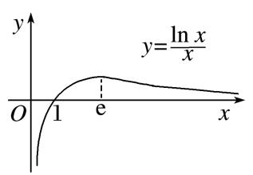

专题12　导数中隐零点的应用

【方法总结】
利用导数解决函数问题常与函数单调性的判断有关，而函数的单调性与其导函数的零点有着紧密的联系，按导函数零点能否求精确解可以分为两类：一类是数值上能精确求解的，称之为“显零点”；另一类是能够判断其存在但无法用显性的代数表达的(*f*′(*x*)＝0是超越形式)，称之为“隐零点”．对于隐零点问题，常常涉及灵活的代数变形、整体代换、构造函数、不等式应用等技巧．

用隐零点处理问题时，先证明函数<em>f</em>(<em>x</em>)在某区上单调，然后用零点存在性定理说明只有一个零点．此时设出零点<em>x</em>0，则<em>f</em>′(<em>x</em>)＝0的根为<em>x</em>0，即有<em>f</em>′(<em>x</em>0)＝0．注意确定<em>x</em>0的合适范围，如果含参<em>x</em>0的范围往往和参数<em>a</em>的范围有关．这时就可以把超越式用代数式表示，同时根据<em>x</em>0的范围可进行适当的放缩．从而问题得以解决．基本解决思路是：形式上虚设，运算上代换，数值上估算．用隐零点可解决导数压轴题中的不等式证明、恒成立能成立等问题．

隐零点问题求解三步曲  
（1）用函数零点存在定理判定导函数零点的存在性，列出零点方程<em>f</em>′(<em>x</em>0)＝0，并结合<em>f</em>′(<em>x</em>)的单调性得到零点的取值范围．  
（2）以零点为分界点，说明导函数*f*′(*x*)的正负，进而得到*f*(*x*)的最值表达式．  
（3）将零点方程适当变形，整体代入最值式子进行化简证明，有时（1）中的零点范围还可以适当缩小．

注意：

确定隐性零点范围的方式是多种多样的，可以由零点的存在性定理确定，也可以由函数的图象特征得到，甚至可以由题设直接得到等等．至于隐性零点的范围精确到多少，由所求解问题决定，因此必要时尽可能缩小其范围．进行代数式的替换过程中，尽可能将目标式变形为整式或分式，那么就需要尽可能将指、对数函数式用有理式替换，这是能否继续深入的关键．最后值得说明的是，隐性零点代换实际上是一种明修栈道，暗渡陈仓的策略，也是数学中“设而不求”思想的体现．

考点一　不等式证明中的“隐零点”

【例题选讲】

<strong>[例1]</strong>　(2015全国Ⅱ)设函数<em>f</em>(<em>x</em>)＝e2<em>x</em>－<em>a</em>ln<em>x</em>．  
（1）讨论*f*(*x*)的导函数*f*′(*x*)的零点的个数；  
（2）证明：当*a*>0时，*f*(*x*)≥2*a*＋*a*ln．

<strong>解析</strong>　（1）<em>f</em>(<em>x</em>)的定义域为(0，＋∞)，<em>f</em>′(<em>x</em>)＝2e2<em>x</em>－(<em>x</em>&gt;0)．由<em>f</em>′(<em>x</em>)＝0得2<em>x</em>e2<em>x</em>＝<em>a</em>．
令<em>g</em>(<em>x</em>)＝2<em>x</em>e2<em>x</em>，<em>g</em>′(<em>x</em>)＝(4<em>x</em>＋2)e2<em>x</em>&gt;0(<em>x</em>&gt;0)，从而<em>g</em>(<em>x</em>)在(0，＋∞)上单调递增，所以<em>g</em>(<em>x</em>)&gt;<em>g</em>（0）＝0．
当*a*>0时，方程*g*(*x*)＝*a*有一个根，即*f*′(*x*)存在唯一零点；
当*a*≤0时，方程*g*(*x*)＝*a*没有根，即*f*′(*x*)没有零点．  
（2）由（1）可设<em>f</em>′(<em>x</em>)在(0，＋∞)上的唯一零点为<em>x</em>0，
当<em>x</em>∈(0，<em>x</em>0)时，<em>f</em>′(<em>x</em>)&lt;0；当<em>x</em>∈(<em>x</em>0，＋∞)时，<em>f</em>′(<em>x</em>)&gt;0．
故<em>f</em>(<em>x</em>)在(0，<em>x</em>0)上单调递减，在(<em>x</em>0，＋∞)上单调递增，所以[<em>f</em>(<em>x</em>)]min＝<em>f</em>(<em>x</em>0)．

由2e2<em>x</em>0－＝0得e2<em>x</em>0＝，又<em>x</em>0＝，得ln <em>x</em>0＝ln＝ln－2<em>x</em>0，

所以<em>f</em>(<em>x</em>0)＝－<em>a</em>ln <em>x</em>0＝－<em>a</em>＝＋2<em>ax</em>0＋<em>a</em>ln≥2＋<em>a</em>ln ＝2<em>a</em>＋<em>a</em>ln．
故当*a*>0时，*f*(*x*)≥2*a*＋*a*ln．

<strong>[例2]</strong>　(2013全国Ⅱ)设函数<em>f</em>(<em>x</em>)＝e<em>x</em>－ln(<em>x</em>＋<em>m</em>)．  
（1）若*x*＝0是*f*(*x*)的极值点，求*m*的值，并讨论*f*(*x*)的单调性；  
（2）当*m*≤2时，求证：*f*(*x*)＞0．

<strong>解析</strong>　（1）<em>f</em>′(<em>x</em>)＝e<em>x</em>－．由<em>x</em>＝0是<em>f</em>(<em>x</em>)的极值点得<em>f</em>′（0）＝0，所以<em>m</em>＝1．
于是<em>f</em>(<em>x</em>)＝e<em>x</em>－ln(<em>x</em>＋1)，定义域为(－1，＋∞)，<em>f</em>′(<em>x</em>)＝e<em>x</em>－．

函数<em>f</em>′(<em>x</em>)＝e<em>x</em>－在(－1，＋∞)单调递增，且<em>f</em>′（0）＝0．
因此当*x*∈(－1，0)时，*f*′(*x*)＜0；当*x*∈(0，＋∞)时，*f*′(*x*)＞0．
所以*f*(*x*)在(－1，0)单调递减，在(0，＋∞)单调递增．  
（2）当*m*≤2，*x*∈(－*m*，＋∞)时，ln(*x*＋*m*)≤ln(*x*＋2)，故只需证明当*m*＝2时，*f*(*x*)＞0．
当<em>m</em>＝2时，函数<em>f</em>′(<em>x</em>)＝e<em>x</em>－在(－2，＋∞)单调递增．又<em>f</em>′(－1)＜0，<em>f</em>′（0）＞0，
故<em>f</em>′(<em>x</em>)＝0在(－2，＋∞)有唯一实根<em>x</em>0，且<em>x</em>0∈(－1，0)．
当<em>x</em>∈(－2，<em>x</em>0)时，<em>f</em>′(<em>x</em>)＜0；当<em>x</em>∈(<em>x</em>0，＋∞)时，<em>f</em>′(<em>x</em>)＞0，从而当<em>x</em>＝<em>x</em>0时，<em>f</em>(<em>x</em>)取得最小值．

由<em>f</em>′(<em>x</em>0)＝0得＝，ln(<em>x</em>0＋2)＝－<em>x</em>0，故<em>f</em>(<em>x</em>)≥<em>f</em>(<em>x</em>0)＝＋<em>x</em>0＝＞0．

综上，当*m*≤2时，*f*(*x*)＞0．

<strong>[例3]</strong>　已知函数<em>f</em>(<em>x</em>)＝<em>x</em>e<em>x</em>－<em>a</em>(<em>x</em>＋ln<em>x</em>)．  
（1）讨论*f*(*x*)极值点的个数；  
（2）若<em>x</em>0是<em>f</em>(<em>x</em>)的一个极小值点，且<em>f</em>(<em>x</em>0)&gt;0，证明：<em>f</em>(<em>x</em>0)&gt;2(<em>x</em>0－<em>x</em>)．
解析　（1） <em>f</em>′(<em>x</em>)＝(<em>x</em>＋1)e<em>x</em>－<em>a</em>＝(<em>x</em>＋1)＝，<em>x</em>∈(0，＋∞)．

①当*a*≤0时，*f*′(*x*)>0，*f*(*x*)在(0，＋∞)上为增函数，不存在极值点；
②当<em>a</em>&gt;0时，令<em>h</em>(<em>x</em>)＝<em>x</em>e<em>x</em>－<em>a</em>，<em>h</em>′(<em>x</em>)＝(<em>x</em>＋1)e<em>x</em>&gt;0．显然函数<em>h</em>(<em>x</em>)在(0，＋∞)上是增函数，
又因为当<em>x</em>→0时，<em>h</em>(<em>x</em>)→－<em>a</em>&lt;0，<em>h</em>(<em>a</em>)＝<em>a</em>(e<em>a</em>－1)&gt;0，必存在<em>x</em>0&gt;0，使<em>h</em>(<em>x</em>0)＝0．
当<em>x</em>∈(0，<em>x</em>0)时，<em>h</em>(<em>x</em>)&lt;0，<em>f</em>′(<em>x</em>)&lt;0，<em>f</em>(<em>x</em>)为减函数；当<em>x</em>∈(<em>x</em>0，＋∞)时，<em>h</em>(<em>x</em>)&gt;0，<em>f</em>′(<em>x</em>)&gt;0，<em>f</em>(<em>x</em>)为增函数．
所以，<em>x</em>＝<em>x</em>0是<em>f</em>(<em>x</em>)的极小值点．综上，当<em>a</em>≤0时，<em>f</em>(<em>x</em>)无极值点，当<em>a</em>&gt;0时，<em>f</em>(<em>x</em>)有一个极值点．  
（2）由（1）得，<em>f</em>′(<em>x</em>0)＝0，即<em>x</em>0e<em>x</em>0＝<em>a</em>，<em>f</em>(<em>x</em>0)＝<em>x</em>0e<em>x</em>0－<em>a</em>(<em>x</em>0＋ln <em>x</em>0)＝<em>x</em>0e<em>x</em>0(1－<em>x</em>0－ln <em>x</em>0)，
因为<em>f</em>(<em>x</em>0)&gt;0，所以1－<em>x</em>0－ln <em>x</em>0&gt;0，令<em>g</em>(<em>x</em>)＝1－<em>x</em>－ln <em>x</em>，<em>g</em>′(<em>x</em>)＝－1－&lt;0，

<em>g</em>(<em>x</em>)在(0，＋∞)上是减函数，且<em>g</em>（1）＝0，由<em>g</em>(<em>x</em>)&gt;<em>g</em>（1）得<em>x</em>&lt;1，所以<em>x</em>0∈(0，1)，
设*φ*(*x*)＝ln *x*－*x*＋1，*x*∈(0，1)，*φ*′(*x*)＝－1＝，当*x*∈(0，1)时，*φ*′(*x*)>0，所以*φ*(*x*)为增函数，

*φ*(*x*)<*φ*（1）＝0，即*φ*(*x*)<0，即ln *x*<*x*－1，所以－ln *x*>1－*x*，
所以ln(<em>x</em>＋1)&lt;<em>x</em>，所以e<em>x</em>&gt;<em>x</em>＋1&gt;0，则e<em>x</em>0&gt;<em>x</em>0＋1．
因为<em>x</em>0∈(0，1)，所以1－<em>x</em>0－ln <em>x</em>0&gt;1－<em>x</em>0＋1－<em>x</em>0＝2(1－<em>x</em>0)&gt;0．

相乘得e<em>x</em>0(1－<em>x</em>0－ln <em>x</em>0)&gt;(<em>x</em>0＋1)(2－2<em>x</em>0)，
所以<em>f</em>(<em>x</em>0)＝<em>x</em>0e<em>x</em>0(1－<em>x</em>0－ln <em>x</em>0)&gt;2<em>x</em>0(<em>x</em>0＋1)(1－<em>x</em>0)＝2<em>x</em>0(1－<em>x</em>)＝2(<em>x</em>0－<em>x</em>)．
故<em>f</em>(<em>x</em>0)&gt;2(<em>x</em>0－<em>x</em>)成立．

<strong>[例4]</strong>　已知函数<em>f</em>(<em>x</em>)＝<em>a</em>e<em>x</em>＋sin<em>x</em>＋<em>x</em>，<em>x</em>∈[0，π]．  
（1）证明：当*a*＝－1时，函数*f*(*x*)有唯一的极大值点；  
（2）当－2<*a*<0时，证明：*f*(*x*)<π．
解析　（1）当<em>a</em>＝－1时，<em>f</em>(<em>x</em>)＝<em>x</em>＋sin <em>x</em>－e<em>x</em>，<em>f</em>′(<em>x</em>)＝1＋cos <em>x</em>－e<em>x</em>，
因为<em>x</em>∈[0，π]，所以1＋cos <em>x</em>≥0，令<em>g</em>(<em>x</em>)＝1＋cos <em>x</em>－e<em>x</em>，<em>g</em>′(<em>x</em>)＝－e<em>x</em>－sin <em>x</em>&lt;0，
所以<em>g</em>(<em>x</em>)在区间[0，π]上单调递减．因为<em>g</em>（0）＝2－1＝1&gt;0，<em>g</em>(π)＝－eπ&lt;0，
所以存在<em>x</em>0∈(0，π)，使得<em>f</em>′(<em>x</em>0)＝0，且当0&lt;<em>x</em>&lt;<em>x</em>0时，<em>f</em>′(<em>x</em>)&gt;0；当<em>x</em>0&lt;<em>x</em>&lt;π时，<em>f</em>′(<em>x</em>)&lt;0．
所以函数<em>f</em>(<em>x</em>)的单调递增区间是[0，<em>x</em>0]，单调递减区间是[<em>x</em>0，π]．
所以函数<em>f</em>(<em>x</em>)存在唯一的极大值点<em>x</em>0．  
（2）当－2&lt;<em>a</em>&lt;0时，令<em>h</em>(<em>x</em>)＝<em>a</em>e<em>x</em>＋sin <em>x</em>＋<em>x</em>－π，则<em>h</em>′(<em>x</em>)＝<em>a</em>e<em>x</em>＋cos <em>x</em>＋1，
令<em>k</em>(<em>x</em>)＝<em>a</em>e<em>x</em>＋cos <em>x</em>＋1，则<em>k</em>′(<em>x</em>)＝<em>a</em>e<em>x</em>－sin <em>x</em>&lt;0，
所以函数*h*′(*x*)在区间[0，π]上单调递减，
因为<em>h</em>′（0）＝<em>a</em>＋2&gt;0，<em>h</em>′(π)＝<em>a</em>eπ&lt;0，所以存在<em>t</em>∈(0，π)，使得<em>h</em>′(<em>t</em>)＝0，即<em>a</em>e<em>t</em>＋cos <em>t</em>＋1＝0，

且当0<*x*<*t*时，*h*′(*x*)>0；当*t*<*x*<π时，*h*′(*x*)<0．
所以函数*h*(*x*)在区间[0，*t*]上单调递增，在区间[*t*，π]上单调递减．

<em>h</em>(<em>x</em>)max＝<em>h</em>(<em>t</em>)＝<em>a</em>e<em>t</em>＋sin <em>t</em>＋<em>t</em>－π，<em>t</em>∈(0，π)，
因为<em>a</em>e<em>t</em>＋cos <em>t</em>＋1＝0，只需证<em>φ</em>(<em>t</em>)＝sin <em>t</em>－cos <em>t</em>＋<em>t</em>－1－π&lt;0即可，

*φ*′(*t*)＝cos *t*＋sin *t*＋1＝sin *t*＋(1＋cos *t*)>0，
所以函数*φ*(*t*)在区间(0，π)上单调递增，*φ*(*t*)<*φ*(π)＝0，即*f*(*x*)<π．

【对点训练】

1．已知函数<em>f</em>(<em>x</em>)＝(<em>x</em>－1)e<em>x</em>－<em>ax</em>的图象在<em>x</em>＝0处的切线方程是<em>x</em>＋<em>y</em>＋<em>b</em>＝0．  
（1）求*a*，*b*的值；  
（2）求证函数<em>f</em>(<em>x</em>)有唯一的极值点<em>x</em>0，且<em>f</em>(<em>x</em>0)&gt;－．

1．解析　（1）因为<em>f</em>′(<em>x</em>)＝<em>x</em>e<em>x</em>－<em>a</em>，由<em>f</em>′（0）＝－1得<em>a</em>＝1，又当<em>x</em>＝0时，<em>f</em>(<em>x</em>)＝－1，
所以切线方程为*y*－(－1)＝－1(*x*－0)，即*x*＋*y*＋1＝0，所以*b*＝1．  
（2）令<em>g</em>(<em>x</em>)＝<em>f</em>′(<em>x</em>)＝<em>x</em>e<em>x</em>－1，则<em>g</em>′(<em>x</em>)＝(<em>x</em>＋1)e<em>x</em>，
所以当*x*<－1时，*g*(*x*)单调递减，且此时*g*(*x*)<0，则*g*(*x*)在(－∞，－1)内无零点；
当*x*≥－1时，*g*(*x*)单调递增，且*g*(－1)<0，*g*（1）＝e－1>0，
所以<em>g</em>(<em>x</em>)＝0有唯一解<em>x</em>0，<em>f</em>(<em>x</em>)有唯一的极值点<em>x</em>0．由<em>x</em>0e<em>x</em>0＝1⇒e<em>x</em>0＝，

<em>f</em>(<em>x</em>0)＝－<em>x</em>0＝1－，又<em>g</em>＝－1&lt;0，

<em>g</em>（1）＝e－1&gt;0⇒&lt;<em>x</em>0&lt;1⇒2&lt;＋<em>x</em>0&lt;，所以<em>f</em>(<em>x</em>0)&gt;－．

2．已知函数<em>f</em>(<em>x</em>)＝e<em>x</em>－<em>t</em>－ln<em>x</em>．  
（1）若*x*＝1是*f*(*x*)的极值点，求*t*的值，并讨论*f*(*x*)的单调性；  
（2）当*t*≤2时，证明：*f*(*x*)>0．

2．解析　（1）函数*f*(*x*)的定义域(0，＋∞)，
因为<em>f</em>′(<em>x</em>)＝e<em>x</em>－<em>t</em>－，<em>x</em>＝1是<em>f</em>(<em>x</em>)的极值点，
所以<em>f</em>′（1）＝e1－<em>t</em>－1＝0，所以<em>t</em>＝1，所以<em>f</em>′(<em>x</em>)＝e<em>x</em>－1－，
因为<em>y</em>＝e<em>x</em>－1和<em>y</em>＝－，在(0，＋∞)上单调递增，所以<em>f</em>′(<em>x</em>)在(0，＋∞)上单调递增，
∴当*x*>1时，*f*′(*x*)>0；0<*x*<1时，*f*′(*x*)<0，
此时，*f*(*x*)的单调递减区间为(0，1)，单调递增区间为(1，＋∞)，  
（2）当<em>t</em>≤2时，<em>f</em>(<em>x</em>)＝e<em>x</em>－<em>t</em>－ln <em>x</em>≥e<em>x</em>－2－ln <em>x</em>，
设<em>g</em>(<em>x</em>)＝e<em>x</em>－2－ln <em>x</em>，则<em>g</em>′(<em>x</em>)＝e<em>x</em>－2－，
因为<em>y</em>＝e<em>x</em>－2和<em>y</em>＝－在(0，＋∞)上单调递增，所以<em>g</em>′(<em>x</em>)在(0，＋∞)上单调递增，
因为<em>g</em>′（1）＝－1&lt;0，<em>g</em>′（2）＝1－＝&gt;0，所以存在<em>x</em>0∈(1，2)使得<em>g</em>′(<em>x</em>0)＝0，
所以在(0，<em>x</em>0)上使得<em>g</em>′(<em>x</em>)&lt;0，在(<em>x</em>0，＋∞)上<em>g</em>′(<em>x</em>)&gt;0，
所以<em>g</em>(<em>x</em>)在(0，<em>x</em>0)单调递减，在(<em>x</em>0，＋∞)上单调递增，所以<em>g</em>(<em>x</em>)≥<em>g</em>(<em>x</em>0)，
因为<em>g</em>′(<em>x</em>0)＝0，即e<em>x</em>0－2＝，所以ln <em>x</em>0＝2－<em>x</em>0，
所以<em>g</em>(<em>x</em>0)＝e<em>x</em>0－2－ln <em>x</em>0＝＋<em>x</em>0－2，
因为<em>x</em>0∈(1，2)，所以<em>g</em>(<em>x</em>0)＝＋<em>x</em>0－2&gt;2－2＝0，所以<em>f</em>(<em>x</em>)&gt;0．

3．已知函数<em>f</em>＝<em>a</em>e<em>x</em>－2<em>x</em>，<em>a</em>∈<strong>R</strong>．  
（1）求函数*f*的极值；  
（2）当*a*≥1时，证明：*f*－ln*x*＋2*x*>2．

3．解析　（1） <em>f</em>′＝<em>a</em>e<em>x</em>－2，
当<em>a</em>≤0时，<em>f</em>′&lt;0，<em>f</em>在<strong>R</strong>上单调递减，则<em>f</em>无极值．
当*a*>0时，令*f*′＝0得*x*＝ln，令*f*′>0得*x*>ln，令*f*′<0得*x*<ln，
∴*f*在上单调递减，在上单调递增，
∴*f*的极小值为*f* ＝2－2ln，无极大值，

综上，当*a*≤0时，*f*无极值．当*a*>0时，*f*的极小值为2－2ln，无极大值．  
（2）当<em>a</em>≥1时，<em>f</em>－ln <em>x</em>＋2<em>x</em>≥e<em>x</em>－ln <em>x</em>，
令<em>g</em>＝e<em>x</em>－ln <em>x</em>－2，转化为证明<em>g</em>&gt;0，
∵<em>g</em>′＝e<em>x</em>－，令<em>φ</em>(<em>x</em>)＝e<em>x</em>－(<em>x</em>&gt;0)，则<em>φ</em>′(<em>x</em>)＝e<em>x</em>＋(<em>x</em>&gt;0)，则<em>φ</em>′(<em>x</em>)&gt;0，
∴*g*′在上为增函数，∵*g*′＝e－1>0，*g*′＝－2<0，
∴∃<em>x</em>0∈，使得<em>g</em>′＝0，∴函数<em>g</em>在上单调递减，在上单调递增，

∴<em>g</em>≥<em>g</em>＝－ln <em>x</em>0－2＝＋<em>x</em>0－2≥2－2＝0，
∵<em>x</em>0≠1，∴<em>g</em>(<em>x</em>)&gt;0，∴<em>f</em>－ln <em>x</em>＋2<em>x</em>&gt;2．

4．已知函数<em>f</em>(<em>x</em>)＝＋<em>bx</em>ln<em>x</em>，其中<em>a</em>，<em>b</em>∈<strong>R</strong>．  
（1）若函数*f*(*x*)在点(e，*f*(e))处的切线方程为*y*＝*x*＋e，求*a*，*b*的值；  
（2）当*b*>1时，*f*(*x*)≥1对任意*x*∈恒成立，证明：*a*>．

4．<strong>解析</strong>　（1）由题得<em>f</em>′(<em>x</em>)＝－＋<em>b</em>(ln <em>x</em>＋1)，∴<em>f</em>′(e)＝－＋2<em>b</em>＝1，且<em>f</em>(e)＝＋e<em>b</em>＝2e，
从而解得<em>a</em>＝e2，<em>b</em>＝1．  
（2）由<em>f</em>(<em>x</em>)≥1对任意<em>x</em>∈恒成立，得＋<em>bx</em>ln <em>x</em>≥1，等价于<em>a</em>≥<em>x</em>－<em>bx</em>2ln <em>x</em>，
令<em>g</em>(<em>x</em>)＝<em>x</em>－<em>bx</em>2ln <em>x</em>，<em>x</em>∈，则<em>g</em>′(<em>x</em>)＝1－<em>b</em>(2<em>x</em>ln <em>x</em>＋<em>x</em>)，令<em>φ</em>(<em>x</em>)＝1－<em>b</em>(2<em>x</em>ln <em>x</em>＋<em>x</em>)，
则*φ*′(*x*)＝－*b*(2ln *x*＋3)，易知*φ*′(*x*)<0，故*g*′(*x*)在上单调递减，
因为<em>g</em>′(e－)＝1－<em>b</em>(－e－＋e－)＝1&gt;0，<em>g</em>′（1）＝1－<em>b</em>(2ln1＋1)＝1－<em>b</em>&lt;0，
故<em>x</em>0∈(e－，1)，使<em>g</em>′(<em>x</em>0)＝1－<em>b</em>(2<em>x</em>0ln <em>x</em>0＋<em>x</em>0)＝0，则<em>g</em>(<em>x</em>)在上单调递增，在(<em>x</em>0，2]上单调递减，
故<em>g</em>(<em>x</em>)max＝<em>g</em>(<em>x</em>0)＝<em>x</em>0－<em>bx</em>ln <em>x</em>0＝，令<em>h</em>(<em>x</em>)＝，

易知<em>h</em>(<em>x</em>)在(e－，1)上单调递增，则<em>a</em>≥&gt;＝&gt;．

5．已知函数<em>f</em>(<em>x</em>)＝e<em>x</em>＋<em>a</em>－ln<em>x</em>(其中e＝2.718 28…，是自然对数的底数)．  
（1）当*a*＝0时，求函数*f*(*x*)的图象在(1，*f*（1）)处的切线方程；  
（2）求证：当*a*>1－时，*f*(*x*)>e＋1．

5．<strong>解析</strong>　（1）∵<em>a</em>＝0时，∴<em>f</em>(<em>x</em>)＝e<em>x</em>－ln <em>x</em>，<em>f</em>′(<em>x</em>)＝e<em>x</em>－(<em>x</em>&gt;0)，∴<em>f</em>（1）＝e，<em>f</em>′（1）＝e－1，
∴函数*f*(*x*)的图象在(1，*f*（1）)处的切线方程为：*y*－e＝(e－1)(*x*－1)，即(e－1)*x*－*y*＋1＝0．  
（2）∵<em>f</em>′(<em>x</em>)＝e<em>x</em>＋<em>a</em>－(<em>x</em>&gt;0)，设<em>g</em>(<em>x</em>)＝<em>f</em>′(<em>x</em>)，则<em>g</em>′(<em>x</em>)＝e<em>x</em>＋<em>a</em>＋&gt;0，∴<em>g</em>(<em>x</em>)是增函数，
∵e<em>x</em>＋<em>a</em>&gt;e<em>a</em>，∴由e<em>a</em>&gt;，得<em>x</em>&gt;e－<em>a</em>，∴当<em>x</em>&gt;e－<em>a</em>时，<em>f</em>′(<em>x</em>)&gt;0；
若0&lt;<em>x</em>&lt;1，则e<em>x</em>＋<em>a</em>&lt;e<em>a</em>＋1，由e<em>a</em>＋1&lt;得，<em>x</em>&lt;e－<em>a</em>－1，∴当0&lt;<em>x</em>&lt;min{1，e－<em>a</em>－1}时，<em>f</em>′(<em>x</em>)&lt;0，
故<em>f</em>′(<em>x</em>)＝0仅有一解，记为<em>x</em>0，则当0&lt;<em>x</em>&lt;<em>x</em>0时，<em>f</em>′(<em>x</em>)&lt;0，<em>f</em>(<em>x</em>)递减；当<em>x</em>&gt;<em>x</em>0时，<em>f</em>′(<em>x</em>)&gt;0，<em>f</em>(<em>x</em>)递增；
∴<em>f</em>(<em>x</em>)min＝<em>f</em>(<em>x</em>0)＝e<em>x</em>0＋<em>a</em>－ln <em>x</em>0，而<em>f</em>′(<em>x</em>0)＝e<em>x</em>0＋<em>a</em>－＝0，所以e<em>x</em>0＋<em>a</em>＝，所以<em>a</em>＝－ln <em>x</em>0－<em>x</em>0，

记<em>h</em>(<em>x</em>)＝ln <em>x</em>＋<em>x</em>，则<em>f</em>(<em>x</em>0)＝－ln <em>x</em>0＝<em>h</em>，<em>a</em>&gt;1－，即－<em>a</em>&lt;－1，所以<em>h</em>(<em>x</em>0)&lt;<em>h</em>，

而<em>h</em>(<em>x</em>)显然是增函数，∴0&lt;<em>x</em>0&lt;，∴&gt;e，∴<em>h</em>&gt;<em>h</em>(e)＝e＋1．综上，当<em>a</em>&gt;1－时，<em>f</em>(<em>x</em>)&gt;e＋1．

考点二　不等式恒成立与存在性中的“隐零点”

【例题选讲】

<strong>[例1]</strong>　已知函数<em>f</em>(<em>x</em>)＝<em>ax</em>＋<em>x</em>ln<em>x</em>(<em>a</em>∈<strong>R</strong>)．  
（1）若函数*f*(*x*)在区间[e，＋∞)上为增函数，求*a*的取值范围；  
（2）当<em>a</em>＝1且<em>k</em>∈<strong>Z</strong>时，不等式<em>k</em>(<em>x</em>－1)&lt;<em>f</em>(<em>x</em>)在<em>x</em>∈(1，＋∞)上恒成立，求<em>k</em>的最大值．

<strong>解析</strong>　（1）∵函数<em>f</em>(<em>x</em>)在区间[e，＋∞)上为增函数，∴<em>f</em>′(<em>x</em>)＝<em>a</em>＋ln<em>x</em>＋1≥0在区间[e，＋∞)上恒成立，
∴<em>a</em>≥(－ln <em>x</em>－1)max＝－2，∴<em>a</em>≥－2．∴<em>a</em>的取值范围是[－2，＋∞)．  
（2）当<em>a</em>＝1时，<em>f</em>(<em>x</em>)＝<em>x</em>＋<em>x</em>ln<em>x</em>，<em>k</em>∈<strong>Z</strong>时，不等式<em>k</em>(<em>x</em>－1)&lt;<em>f</em>(<em>x</em>)在<em>x</em>∈(1，＋∞)上恒成立，∴<em>k</em>&lt;，
令*g*(*x*)＝，则*g*′(*x*)＝，令*h*(*x*)＝*x*－ln*x*－2(*x*>1)．则*h*′(*x*)＝1－＝>0，
∴*h*(*x*)在(1，＋∞)上单调递增，∵*h*（3）＝1－ln3<0，*h*（4）＝2－2ln2>0，

存在<em>x</em>0∈(3，4)，使<em>h</em>(<em>x</em>0)＝0，即当1&lt;<em>x</em>&lt;<em>x</em>0时，<em>h</em>(<em>x</em>)&lt;0，即<em>g</em>′(<em>x</em>)&lt;0，当<em>x</em>&gt;<em>x</em>0时，<em>h</em>(<em>x</em>)&gt;0，即<em>g</em>′(<em>x</em>)&gt;0，

<em>g</em>(<em>x</em>)在(1，<em>x</em>0)上单调递减，在(<em>x</em>0，＋∞)上单调递增．令<em>h</em>(<em>x</em>0)＝<em>x</em>0－ln<em>x</em>0－2＝0，即ln<em>x</em>0＝<em>x</em>0－2，

<em>g</em>(<em>x</em>)min＝<em>g</em>(<em>x</em>0)＝＝＝<em>x</em>0∈(3，4)．<em>k</em>&lt;<em>g</em>(<em>x</em>)min＝<em>x</em>0∈(3，4)，且<em>k</em>∈<strong>Z</strong>，∴<em>k</em>max＝3．

<strong>[例2]</strong>　(2020·新高考Ⅰ)已知函数<em>f</em>(<em>x</em>)＝<em>a</em>e<em>x</em>－1－ln<em>x</em>＋ln<em>a</em>．  
（1）当*a*＝e时，求曲线*y*＝*f*(*x*)在点(1，*f*（1）)处的切线与两坐标轴围成的三角形的面积；  
（2）若*f*(*x*)≥1，求*a*的取值范围．

<strong>解析</strong>　（1）当<em>a</em>＝e时，<em>f</em>(<em>x</em>)＝e<em>x</em>－ln <em>x</em>＋1，∴<em>f</em>′(<em>x</em>)＝e<em>x</em>－，∴<em>f</em>′（1）＝e－1．
∵*f*（1）＝e＋1，∴切点坐标为(1，1＋e)，
∴曲线*y*＝*f*(*x*)在点(1，*f*（1）)处的切线方程为*y*－e－1＝(e－1)·(*x*－1)，即*y*＝(e－1)*x*＋2，
∴切线与两坐标轴的交点坐标分别为(0，2)，，
∴所求三角形面积为×2×＝．  
（2）解法一　(隐零点)
∵<em>f</em>(<em>x</em>)＝<em>a</em>e<em>x</em>－1－ln <em>x</em>＋ln<em>a</em>，∴<em>f</em>′(<em>x</em>)＝<em>a</em>e<em>x</em>－1－，且<em>a</em>&gt;0．
设<em>g</em>(<em>x</em>)＝<em>f</em>′(<em>x</em>)，则<em>g</em>′(<em>x</em>)＝<em>a</em>e<em>x</em>－1＋&gt;0，∴<em>g</em>(<em>x</em>)在(0，＋∞)上单调递增，即<em>f</em>′(<em>x</em>)在(0，＋∞)上单调递增，
当*a*＝1时，*f*′（1）＝0，则*f*(*x*)在(0，1)上单调递减，在(1，＋∞)上单调递增，
∴<em>f</em>(<em>x</em>)min＝<em>f</em>（1）＝1，∴<em>f</em>(<em>x</em>)≥1成立；

当*a*>1时，<1，∴<1，∴*f*′*f*′（1）＝，
∴存在唯一<em>x</em>0&gt;0，使得<em>f</em>′(<em>x</em>0)＝<em>a</em>e<em>x</em>0－1－＝0，且当<em>x</em>∈(0，<em>x</em>0)时<em>f</em>′(<em>x</em>)&lt;0，当<em>x</em>∈(<em>x</em>0，＋∞)时<em>f</em>′(<em>x</em>)&gt;0，
∴<em>a</em>e <em>x</em>0－1＝，∴ln<em>a</em>＋<em>x</em>0－1＝－ln<em>x</em>0，
因此<em>f</em>(<em>x</em>)min＝<em>f</em>(<em>x</em>0)＝<em>a</em>e <em>x</em>0－1－ln<em>x</em>0＋ln<em>a</em>＝＋ln<em>a</em>＋<em>x</em>0－1＋ln<em>a</em>≥2ln<em>a</em>－1＋2＝2ln<em>a</em>＋1&gt;1，
∴*f*(*x*)>1，∴*f*(*x*)≥1恒成立；
当0<*a*<1时，*f*（1）＝*a*＋ln*a*<*a*<1，∴*f*（1）<1，*f*(*x*)≥1不恒成立．
综上所述，*a*的取值范围是[1，＋∞)．
解法二　(同构)
∵<em>f</em>(<em>x</em>)＝<em>a</em>e<em>x</em>－1－ln <em>x</em>＋<em>f</em>(<em>x</em>)＝<em>a</em>e<em>x</em>－1－ln<em>x</em>＋ln<em>a</em>＝eln <em>a</em>＋<em>x</em>－1－ln<em>x</em>＋ln<em>a</em>≥1等价于eln <em>a</em>＋<em>x</em>－1＋ln<em>a</em>＋<em>x</em>－1≥ln<em>x</em>＋<em>x</em>＝eln <em>x</em>＋ln<em>x</em>，
令<em>g</em>(<em>x</em>)＝e<em>x</em>＋<em>x</em>，上述不等式等价于<em>g</em>(ln<em>a</em>＋<em>x</em>－1)≥<em>g</em>(ln<em>x</em>)，
显然*g*(*x*)为单调递增函数，∴又等价于ln*a*＋*x*－1≥ln*x*，即ln*a*≥ln*x*－*x*＋1，
令*h*(*x*)＝ln*x*－*x*＋1，则*h*′(*x*)＝－1＝，
在(0，1)上*h*′(*x*)>0，*h*(*x*)单调递增；在(1，＋∞)上*h*′(*x*)<0，*h*(*x*)单调递减，
∴<em>h</em>(<em>x</em>)max＝<em>h</em>（1）＝0，ln <em>a</em>≥0，即<em>a</em>≥1，∴<em>a</em>的取值范围是[1，＋∞)．

<strong>[例3]</strong>　已知函数<em>f</em>(<em>x</em>)＝ln<em>x</em>－<em>kx</em>(<em>k</em>∈<strong>R</strong>)，<em>g</em>(<em>x</em>)＝<em>x</em>(e<em>x</em>－2)．  
（1）若*f*(*x*)有唯一零点，求*k*的取值范围；  
（2）若*g*(*x*)－*f*(*x*)≥1恒成立，求*k*的取值范围．
解析　（1）由*f*(*x*)＝ln*x*－*kx*有唯一零点，可得方程ln*x*－*kx*＝0，即*k*＝有唯一实根，
令*h*(*x*)＝，则*h*′(*x*)＝，由*h*′(*x*)>0，得0<*x*<e；由*h*′(*x*)<0，得*x*>e，
∴*h*(*x*)在(0，e)上单调递增，在(e，＋∞)上单调递减．∴*h*(*x*)≤*h*(e)＝，
又*h*（1）＝0，∴当0<*x*<1时，*h*(*x*)<0；又当*x*>e时，*h*(*x*)＝>0，
则*h*(*x*)＝的大致图象如图所示，

可知，*k*＝或*k*≤0．  
（2）∵<em>x</em>(e<em>x</em>－2)－(ln <em>x</em>－<em>kx</em>)≥1恒成立，且<em>x</em>&gt;0，∴<em>k</em>≥－e<em>x</em>＋2恒成立，
令<em>φ</em>(<em>x</em>)＝－e<em>x</em>＋2，则 <em>φ</em>′(<em>x</em>)＝－e<em>x</em>＝，
令<em>μ</em>(<em>x</em>)＝－ln <em>x</em>－<em>x</em>2e<em>x</em>，则 <em>μ</em>′(<em>x</em>)＝－－(2<em>x</em>e<em>x</em>＋<em>x</em>2e<em>x</em>)＝－－<em>x</em>e<em>x</em>(2＋<em>x</em>)&lt;0(<em>x</em>&gt;0)，

∴*μ*(*x*)在(0，＋∞)上单调递减，又*μ*＝1－>0，*μ*（1）＝－e<0，

由函数零点存在定理知，存在唯一零点<em>x</em>0∈，使<em>μ</em>(<em>x</em>0)＝0，即－ln <em>x</em>0＝<em>x</em>，

两边取对数可得ln(－ln <em>x</em>0)＝2ln <em>x</em>0＋<em>x</em>0，即ln(－ln <em>x</em>0)＋(－ln <em>x</em>0)＝<em>x</em>0＋ln <em>x</em>0，
由函数<em>y</em>＝<em>x</em>＋ln <em>x</em>为增函数，可得<em>x</em>0＝－ln <em>x</em>0，
又当0&lt;<em>x</em>&lt;<em>x</em>0时，<em>μ</em>(<em>x</em>)&gt;0，<em>φ</em>′(<em>x</em>)&gt;0；当<em>x</em>&gt;<em>x</em>0时，<em>μ</em>(<em>x</em>)&lt;0, <em>φ</em>′(<em>x</em>)&lt;0，
∴<em>φ</em>(<em>x</em>)在(0，<em>x</em>0)上单调递增，在(<em>x</em>0，＋∞)上单调递减，

∴<em>φ</em>(<em>x</em>)≤<em>φ</em>(<em>x</em>0)＝－＋2＝－＋2＝1，∴<em>k</em>≥<em>φ</em>(<em>x</em>0)＝1，
即*k*的取值范围为*k*≥1．

<strong>[例4]</strong>　已知<em>f</em>(<em>x</em>)＝<em>a</em>sin<em>x</em>，<em>g</em>(<em>x</em>)＝ln<em>x</em>，其中<em>a</em>∈<strong>R</strong>，<em>y</em>＝<em>g</em>－1(<em>x</em>)是<em>y</em>＝<em>g</em>(<em>x</em>)的反函数．  
（1）若0<*a*≤1，证明：函数*G*(*x*)＝*f*(1－*x*)＋*g*(*x*)在区间(0，1)上是增函数；  
（2）设<em>F</em>(<em>x</em>)＝<em>g</em>－1(<em>x</em>)－<em>mx</em>2－2(<em>x</em>＋1)＋<em>b</em>，若对任意的<em>x</em>&gt;0，<em>m</em>&lt;0有<em>F</em>(<em>x</em>)&gt;0恒成立，求满足条件的最小整数<em>b</em>的值．
解析　（1）由题意知*G*(*x*)＝*a*sin(1－*x*)＋ln*x*，*G*′(*x*)＝－*a*cos(1－*x*)(*x*>0)，
当*x*∈(0，1)，0<*a*≤1时，>1，0<cos(1－*x*)<1，∴*a*cos(1－*x*)<1，∴*G*′(*x*)>0，
故函数*G*(*x*)在区间(0，1)上是增函数．  
（2）解法一　由对任意的<em>x</em>&gt;0，<em>m</em>&lt;0有<em>F</em>(<em>x</em>)＝<em>g</em>－1(<em>x</em>)－<em>mx</em>2－2(<em>x</em>＋1)＋<em>b</em>＝e<em>x</em>－<em>mx</em>2－2<em>x</em>＋<em>b</em>－2&gt;0恒成立，
即<em>b</em>&gt;－e<em>x</em>＋<em>mx</em>2＋2<em>x</em>＋2恒成立，令<em>h</em>(<em>x</em>)＝－e<em>x</em>＋<em>mx</em>2＋2<em>x</em>＋2，则<em>h</em>′(<em>x</em>)＝－e<em>x</em>＋2<em>mx</em>＋2，

<em>h</em>′′(<em>x</em>)＝－e<em>x</em>＋2<em>m</em>&lt;0，∴<em>h</em>′(<em>x</em>)＝－e<em>x</em>＋2<em>mx</em>＋2在(0，＋∞) 上单调递减，<em>h</em>′(<em>x</em>)<em>max</em>&lt; <em>h</em>′（0）＝0，

且当<em>x</em>→＋∞时，<em>h</em>′(<em>x</em>) →－∞，则必存在<em>x</em>0，使得<em>h</em>(<em>x</em>0)＝0，即－＋2<em>mx</em>0＋2＝0，∴<em>m</em>＝，

∴<em>h</em>(<em>x</em>)在(0，<em>x</em>0)上单调递增，在(<em>x</em>0，＋∞)上单调递减，∴<em>h</em>(<em>x</em>)<em>max</em>＝<em>h</em>(<em>x</em>0)＝－＋2<em>mx</em>0＋2，

即<em>h</em>(<em>x</em>0)＝－＋·<em>x</em>＋2<em>x</em>0＋2＝＋<em>x</em>0＋2，令<em>m</em>(<em>x</em>)＝e<em>x</em>＋<em>x</em>＋2，<em>x</em>∈(0，ln2)，
则<em>m</em>′(<em>x</em>)＝(<em>x</em>－1)e<em>x</em>＋1，令<em>n</em>(<em>x</em>)＝(<em>x</em>－1)e<em>x</em>＋1，则<em>n</em>′(<em>x</em>)＝<em>x</em>e<em>x</em>&gt;0，∴<em>m</em>′(<em>x</em>)在(0，ln2)上单调递增，
∴*m*′(*x*)>*m*′（0）＝>0，∴*m*(*x*)在(0，ln2)上单调递增，∴*m*(*x*)<*m*(ln2)＝2ln2，∴*b*≥2ln2，又*b*为整数，
∴最小整数*b*的值为2．
解法二　由对任意的<em>x</em>&gt;0，<em>m</em>&lt;0有<em>F</em>(<em>x</em>)＝<em>g</em>－1(<em>x</em>)－<em>mx</em>2－2(<em>x</em>＋1)＋<em>b</em>＝e<em>x</em>－<em>mx</em>2－2<em>x</em>＋<em>b</em>－2&gt;0恒成立，
即<em>x</em>2<em>m</em>－e<em>x</em>＋2<em>x</em>－<em>b</em>＋2&lt;0恒成立，令<em>h</em>(<em>m</em>)＝<em>x</em>2<em>m</em>－e<em>x</em>＋2<em>x</em>－<em>b</em>＋2，<em>h</em>′(<em>m</em>)＝<em>x</em>2≥0，
∴<em>h</em>(<em>m</em>)＝<em>x</em>2<em>m</em>－e<em>x</em>＋2<em>x</em>－<em>b</em>＋2在(－∞，0)上单调递增，

即∴*h*(*m*) < *h*（0）＝－＋2*x*－*b*＋2<0即可，即*b*>－＋2*x*＋2

令*m*(*x*)＝－＋2*x*＋2，∵*m*′(*x*)＝－＋2，令*m*′(*x*)＝0，解得*x*＝ln 2．
∴*m*(*x*)在(0，ln 2)上单调递增，在(ln 2，＋∞)上单调递减，
∴<em>m</em>(<em>x</em>)<em>max</em>＝<em>m</em>(ln 2)＝2ln 2，∴<em>b</em>≥2ln 2，又<em>b</em>为整数，∴最小整数<em>b</em>的值为2．

<strong>[例5]</strong>　已知函数<em>f</em>(<em>x</em>)＝－2(<em>x</em>＋<em>a</em>)ln<em>x</em>＋<em>x</em>2－2<em>ax</em>－2<em>a</em>2＋<em>a</em>，其中<em>a</em>&gt;0．  
（1）设*g*(*x*)是*f*(*x*)的导函数，讨论*g*(*x*)的单调性；  
（2）证明：存在*a*∈(0，1)，使得*f*(*x*)≥0在区间(1，＋∞)内恒成立，且*f*(*x*)＝0在区间(1，＋∞)内有唯一解．
解析　（1）由已知，函数*f*(*x*)的定义域为(0，＋∞)，*g*(*x*)＝*f*′(*x*)＝2(*x*－*a*)－2ln *x*－2，
∴*g*′(*x*)＝2－＋＝．
当0<*a*<时，*g*(*x*)在，上单调递增，
在区间上单调递减；
当*a*≥时，*g*(*x*)在(0，＋∞)上单调递增．  
（2）由*f*′(*x*)＝2(*x*－*a*)－2ln *x*－2＝0，解得*a*＝，
令<em>φ</em>(<em>x</em>)＝－2ln <em>x</em>＋<em>x</em>2－2<em>x</em>－2＋，
则*φ*（1）＝1>0，*φ*(e)＝－－2<0．
故存在<em>x</em>0∈(1，e)，使得<em>φ</em>(<em>x</em>0)＝0．
令<em>a</em>0＝，<em>u</em>(<em>x</em>)＝<em>x</em>－1－ln <em>x</em>(<em>x</em>≥1)，
由*u*′(*x*)＝1－≥0知，函数*u*(*x*)在(1，＋∞)上单调递增．
∴0＝&lt;＝<em>a</em>0&lt;＝&lt;1．即<em>a</em>0∈(0，1)，
当<em>a</em>＝<em>a</em>0时，有<em>f</em>′(<em>x</em>0)＝0，<em>f</em>(<em>x</em>0)＝<em>φ</em>(<em>x</em>0)＝0．因为<em>f</em>′(<em>x</em>)在(1，＋∞)上单调递增，
故当<em>x</em>∈(1，<em>x</em>0)时，<em>f</em>′(<em>x</em>)&lt;0，从而<em>f</em>(<em>x</em>)&gt;<em>f</em>(<em>x</em>0)＝0；当<em>x</em>∈(<em>x</em>0，＋∞)时，<em>f</em>′(<em>x</em>)&gt;0，从而<em>f</em>(<em>x</em>)&gt;<em>f</em>(<em>x</em>0)＝0．
∴当*x*∈(1，＋∞)时，*f*(*x*)≥0．
综上所述，存在*a*∈(0，1)，使得*f*(*x*)≥0在区间(1，＋∞)内恒成立，且*f*(*x*)＝0在区间(1，＋∞)内有唯一解．

【对点训练】

1．已知函数*f*＝*x*ln*x*．  
（1）求曲线*y*＝*f*在点处的切线方程；  
（2）若当*x*>1时，*f*＋*x*>*k*恒成立，求正整数*k*的最大值．

1．解　（1）函数*f*的定义域为，*f*′＝ln *x*＋1，因为*f*′＝2，*f*＝e，
所以曲线*y*＝*f*在点处的切线方程为*y*－e＝2，即2*x*－*y*－e＝0．  
（2）由*f*＋*x*>*k*，得*x*ln *x*＋*x*>*k*．即*k*<对于*x*>1恒成立，
令<em>g</em>＝，只需<em>k</em>&lt;<em>g</em>(<em>x</em>)min，

*g*′(*x*)＝＝，
令*u*＝*x*－ln *x*－2，则*u*′＝1－＝>0，
所以*u*＝*x*－ln *x*－2在上单调递增，
因为*u*＝－ln 2<0，*u*＝1－ln 3<0，*u*＝2－ln 4>0，
所以∃<em>x</em>0∈，使得<em>u</em>＝<em>x</em>0－ln <em>x</em>0－2＝0，

且当1&lt;<em>x</em>&lt;<em>x</em>0时，<em>g</em>′(<em>x</em>)&lt;0，<em>g</em>(<em>x</em>)单调递减，当<em>x</em>&gt;<em>x</em>0时，<em>g</em>′(<em>x</em>)&gt;0，<em>g</em>(<em>x</em>)单调递增，
所以*g*(*x*)在上单调递减，在上单调递增，
所以<em>g</em>(<em>x</em>)min＝<em>g</em>(<em>x</em>0)＝＝＝<em>x</em>0∈，
又因为<em>k</em>∈<strong>N</strong>\*，所以<em>k</em>max＝3．

2．(2012全国Ⅱ)设函数<em>f</em>(<em>x</em>)＝e<em>x</em>－<em>ax</em>－2．  
（1）求*f*(*x*)的单调区间；  
（2）若*a*＝1，*k*为整数，且当*x*>0时，(*x*－*k*)*f*′(*x*)＋*x*＋1>0，求*k*的最大值．

2．<strong>解析</strong>　（1） <em>f</em>(<em>x</em>)的定义域为(－∞，＋∞)，<em>f</em>′(<em>x</em>)＝e<em>x</em>－<em>a</em>．
若*a*≤0，则*f*′(*x*)>0，所以*f*(*x*)在(－∞，＋∞)单调递增．
若*a*>0，则当*x*∈(－∞，ln*a*)时，*f*′(*x*)<0，当*x*∈(ln*a*，＋∞)时，*f*′(*x*)>0．
所以*f*(*x*)在(－∞，ln*a*)单调递减，在(ln*a*，＋∞)单调递增．  
（2）由于<em>a</em>＝1，所以(<em>x</em>－<em>k</em>) <em>f´</em>(<em>x</em>)＋<em>x</em>＋1＝(<em>x</em>－<em>k</em>)(e<em>x</em>－1)＋<em>x</em>＋1．
故当*x*>0时，(*x*－*k*) *f´*(*x*)＋*x*＋1>0等价于*k*<＋*x*(*x*>0)  ①
令*g*(*x*)＝＋*x*，则*g*′(*x*)＝．
由（1）知，函数<em>h</em>(<em>x</em>)＝e<em>x</em>－<em>x</em>－2在(0，＋∞)单调递增．而<em>h</em>（1）&lt;0，<em>h</em>（2）&gt;0，
所以<em>h</em>(<em>x</em>)在(0，＋∞)存在唯一的零点，故<em>g</em>′(<em>x</em>)在(0，＋∞)存在唯一的零点，设此零点为<em>x</em>0，
则<em>x</em>0∈(1，2)．当<em>x</em>∈(0，<em>x</em>0)时，<em>g</em>′(<em>x</em>)&lt;0，；当<em>x</em>∈(<em>x</em>0，＋∞)时，<em>g</em>′(<em>x</em>)&gt;0，

所以<em>g</em>(<em>x</em>)在(0，＋∞)的最小值为<em>g</em>(<em>x</em>0)，又由<em>g</em>′(<em>x</em>0)＝0，可得＝<em>x</em>0＋2，
所以<em>g</em>(<em>x</em>0)＝<em>x</em>0＋1∈(2，3)．，故①等价于<em>k</em>&lt;<em>g</em>(<em>x</em>0)，故整数<em>k</em>的最大值为2．

3．已知函数<em>f</em>(<em>x</em>)＝(<em>x</em>－<em>a</em>)e<em>x</em>(<em>a</em>∈<strong>R</strong>)．  
（1）讨论*f*(*x*)的单调性；  
（2）当<em>a</em>＝2时，设函数<em>g</em>(<em>x</em>)＝<em>f</em>(<em>x</em>)＋ln<em>x</em>－<em>x</em>－<em>b</em>，<em>b</em>∈<strong>Z</strong>，若<em>g</em>(<em>x</em>)≤0对任意的<em>x</em>∈恒成立，求<em>b</em>的最小值．

3．解析　（1）由题意，函数<em>f</em>(<em>x</em>)＝(<em>x</em>－<em>a</em>)e<em>x</em>(<em>a</em>∈<strong>R</strong>)，可得<em>f</em>′(<em>x</em>)＝(<em>x</em>－<em>a</em>＋1)e<em>x</em>，
当*x*∈(－∞，*a*－1)时，*f*′(*x*)<0；当*x*∈(*a*－1，＋∞)时，*f*′(*x*)>0，
故函数*f*(*x*)在(－∞，*a*－1)上单调递减，在(*a*－1，＋∞)上单调递增．  
（2）由函数<em>g</em>(<em>x</em>)＝<em>f</em>(<em>x</em>)＋ln <em>x</em>－<em>x</em>－<em>b</em>＝(<em>x</em>－2)e<em>x</em>＋ln <em>x</em>－<em>x</em>－<em>b</em>(<em>b</em>∈<strong>Z</strong>)，
因为<em>g</em>(<em>x</em>)≤0对任意的<em>x</em>∈恒成立．即<em>b</em>≥(<em>x</em>－2)e<em>x</em>＋ln <em>x</em>－<em>x</em>对任意的<em>x</em>∈恒成立，
令函数<em>h</em>(<em>x</em>)＝(<em>x</em>－2)e<em>x</em>＋ln <em>x</em>－<em>x</em>，则<em>h</em>′(<em>x</em>)＝(<em>x</em>－1)e<em>x</em>＋－1＝(<em>x</em>－1)，
因为*x*∈，所以*x*－1<0．
再令函数<em>t</em>(<em>x</em>)＝e<em>x</em>－，可得<em>t</em>′(<em>x</em>)＝e<em>x</em>＋&gt;0，所以函数<em>t</em>(<em>x</em>)单调递增．
因为<em>t</em>＝e－2&lt;0，<em>t</em>（1）＝e－1&gt;0，所以一定存在唯一的<em>x</em>0∈，

使得<em>t</em>(<em>x</em>0)＝0，即e<em>x</em>0＝，即<em>x</em>0＝－ln <em>x</em>0，
所以<em>h</em>(<em>x</em>)在上单调递增，在(<em>x</em>0，1)上单调递减，
所以<em>h</em>(<em>x</em>)max＝<em>h</em>(<em>x</em>0)＝(<em>x</em>0－2)e<em>x</em>0＋ln <em>x</em>0－<em>x</em>0＝1－2∈(－4，－3)．
因为<em>b</em>∈<strong>Z</strong>，所以<em>b</em>的最小值为－3．

4．已知函数*f*(*x*)＝*x*－ln*x*－．  
（1）求*f*(*x*)的最大值；  
（2）若<em>f</em>(<em>x</em>)＋e<em>x</em>－<em>bx</em>≥1恒成立，求实数<em>b</em>的取值范围．

4．解析　（1）*f*(*x*)＝*x*－ln *x*－，定义域为(0，＋∞)，*f*′(*x*)＝1－－＝．
令<em>g</em>(<em>x</em>)＝<em>x</em>－e<em>x</em>(<em>x</em>&gt;0)，则<em>g</em>′(<em>x</em>)＝1－e<em>x</em>&lt;0，所以<em>g</em>(<em>x</em>)在(0，＋∞)上单调递减，故<em>g</em>(<em>x</em>)&lt;<em>g</em>（0）＝－1&lt;0，
当*x*∈(0，1)时，*f*′(*x*)>0，*f*(*x*)在(0，1)上单调递增；
当*x*∈(1，＋∞)时，*f*′(*x*)<0，*f*(*x*)在(1，＋∞)上单调递减．
所以<em>f</em>(<em>x</em>)max＝<em>f</em>（1）＝1－e．  
（2）<em>f</em>(<em>x</em>)＋e<em>x</em>－<em>bx</em>≥1，⇔－ln <em>x</em>＋<em>x</em>－＋<em>x</em>e<em>x</em>＋－<em>bx</em>≥1，⇔≥<em>b</em>恒成立，
令*φ*(*x*)＝，则*φ*′(*x*)＝．
令<em>h</em>(<em>x</em>)＝<em>x</em>2e<em>x</em>＋ln <em>x</em>，则<em>h</em>(<em>x</em>)在(0，＋∞)上单调递增，<em>x</em>→0，<em>h</em>(<em>x</em>)→－∞，且<em>h</em>（1）＝e&gt;0，
所以<em>h</em>(<em>x</em>)在(0，1)上存在零点<em>x</em>0，即<em>h</em>(<em>x</em>0)＝<em>x</em>e<em>x</em>0＋ln <em>x</em>0＝0，

<em>x</em>e<em>x</em>0＋ln <em>x</em>0＝0⇔<em>x</em>0e<em>x</em>0＝－＝(eln )，
由于<em>y</em>＝<em>x</em>e<em>x</em>在(0，＋∞)上单调递增，故<em>x</em>0＝ln＝－ln <em>x</em>0，即e<em>x</em>0＝，
所以<em>φ</em>(<em>x</em>)在(0，<em>x</em>0)上单调递减，在(<em>x</em>0，＋∞)上单调递增，

<em>φ</em>(<em>x</em>)min＝<em>φ</em>(<em>x</em>0)＝＝＝2，
因此*b*≤2，即实数*b*的取值范围是(－∞，2]．

5．设函数<em>f</em>(<em>x</em>)＝e<em>x</em>＋<em>ax</em>，<em>a</em>∈<strong>R</strong>．  
（1）若*f*(*x*)有两个零点，求*a*的取值范围；  
（2）若对任意的<em>x</em>∈[0，＋∞)均有2<em>f</em>(<em>x</em>)＋3≥<em>x</em>2＋<em>a</em>2，求<em>a</em>的取值范围．

5．解析　（1）由题意得<em>f</em>′(<em>x</em>)＝e<em>x</em>＋<em>a</em>，
当<em>a</em>≥0时，<em>f</em>′(<em>x</em>)&gt;0，此时函数<em>f</em>(<em>x</em>)在<strong>R</strong>上单调递增，不符合题意；
当*a*<0时，令*f*′(*x*)＝0，得*x*＝ln(－*a*)，函数*f*(*x*)在(－∞，ln(－*a*))上单调递减，
在(ln(－*a*)，＋∞)上单调递增，则*f*(ln(－*a*))为*f*(*x*)的极小值，

要使函数*f*(*x*)有两个零点，则*f*(ln(－*a*))<0，解得*a*<－e，
所以*a*的取值范围为(－∞，－e)．  
（2）令<em>g</em>(<em>x</em>)＝2<em>f</em>(<em>x</em>)＋3－<em>x</em>2－<em>a</em>2＝2e<em>x</em>－(<em>x</em>－<em>a</em>)2＋3，<em>x</em>≥0，则<em>g</em>′(<em>x</em>)＝2(e<em>x</em>－<em>x</em>＋<em>a</em>)．
设<em>h</em>(<em>x</em>)＝2(e<em>x</em>－<em>x</em>＋<em>a</em>)，则<em>h</em>′(<em>x</em>)＝2(e<em>x</em>－1)≥0．
所以*h*(*x*)在[0，＋∞)上单调递增，且*h*（0）＝2(*a*＋1)．

①当*a*＋1≥0，即*a*≥－1时，*g*′(*x*)≥0恒成立，即函数*g*(*x*)在[0，＋∞)上单调递增，
所以<em>g</em>（0）＝5－<em>a</em>2≥0，解得－≤<em>a</em>≤．又<em>a</em>≥－1，所以－1≤<em>a</em>≤．

②当<em>a</em>＋1&lt;0，即<em>a</em>&lt;－1时，则存在<em>x</em>0&gt;0，使<em>h</em>(<em>x</em>0)＝0且
当<em>x</em>∈(0，<em>x</em>0)时，<em>h</em>(<em>x</em>)&lt;0，即<em>g</em>′(<em>x</em>)&lt;0，函数<em>g</em>(<em>x</em>)在(0，<em>x</em>0)上单调递减；
当<em>x</em>∈(<em>x</em>0，＋∞)时，<em>h</em>(<em>x</em>)&gt;0，即<em>g</em>′(<em>x</em>)&gt;0，函数<em>g</em>(<em>x</em>)在(<em>x</em>0，＋∞)上单调递增，
所以<em>g</em>(<em>x</em>)min＝<em>g</em>(<em>x</em>0)＝2e<em>x</em>0－(<em>x</em>0－<em>a</em>)2＋3．又<em>h</em>(<em>x</em>0)＝2(e<em>x</em>0－<em>x</em>0＋<em>a</em>)＝0，
从而<em>g</em>(<em>x</em>)min＝<em>g</em>(<em>x</em>0)＝2e<em>x</em>0－<em>x</em>＋2<em>ax</em>0－<em>a</em>2＋3＝2<em>x</em>0－2<em>a</em>－<em>x</em>＋2<em>ax</em>0－<em>a</em>2＋3

＝－<em>x</em>＋2(<em>a</em>＋1)<em>x</em>0－(<em>a</em>＋3)(<em>a</em>－1)＝(－<em>x</em>0＋<em>a</em>＋3)(<em>x</em>0－<em>a</em>＋1)≥0，
即<em>a</em>－1≤<em>x</em>0≤<em>a</em>＋3．
由于<em>x</em>0是单调增函数<em>h</em>(<em>x</em>)＝2(e<em>x</em>－<em>x</em>＋<em>a</em>)在[0，＋∞)上的唯一零点，

要使得<em>a</em>－1≤<em>x</em>0≤<em>a</em>＋3(<em>a</em>&lt;－1)，则只需0≤<em>x</em>0≤<em>a</em>＋3，
故只需保证<em>g</em>′(<em>a</em>＋3)＝2[e<em>a</em>＋3－2(<em>a</em>＋3)＋2<em>a</em>]≥0，即e<em>a</em>＋3≥3，故实数，ln 3－3≤<em>a</em>&lt;－1．
综上所述，*a*的取值范围为[ln3－3，]．

