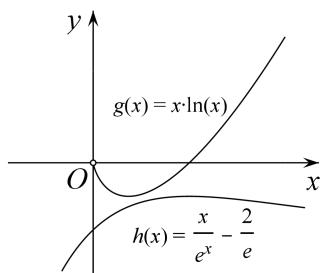
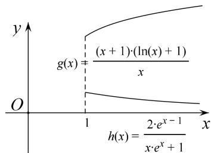
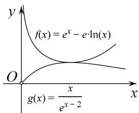
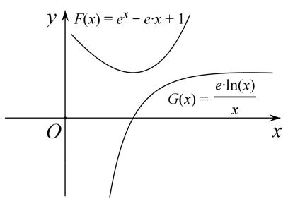

# 专题13 导数中对数单身狗指数找基友的应用

导数在高考中占据了及其重要的地位，导数是研究函数的一个重要的工具，在判断函数的单调性、求函数的极值、最值与解决函数的零点(方程的根)、不等式问题中都用到导数．而这类问题都有一条经验性规则：对数单身狗，指数找基友，指对在一起，常常要分手.

# 考点一 对数单身狗

# 【方法总结】
在证明或处理含对数函数的不等式时，如 $f(x)$ 为可导函数，则有 $(f(x)\ln x)' = f'(x)\ln x + \frac{f(x)}{x}$ ，若 $f(x)$ 为非常数函数，求导式子中含有 $\ln x$ ，这类问题需要多次求导，烦琐复杂。通常要将对数型的函数“独立分离”出来，这样再对新函数求导时，就不含对数了，只需一次就可以求出它的极值点，从而避免了多次求导。这种相当于让对数函数“孤军奋战”的变形过程，我们形象的称之为“对数单身狗”。

1. 设 $f(x) > 0$ , $f(x)\ln x + g(x) > 0 \Leftrightarrow \ln x + \frac{g(x)}{f(x)} > 0$ , 则 $(\ln x + \frac{g(x)}{f(x)})' = \frac{1}{x} + (\frac{g(x)}{f(x)})'$ , 不含超越函数, 求解过程简单. 或者 $f(x)\ln x + g(x) > 0 \Leftrightarrow f(x)(\ln x + \frac{g(x)}{f(x)}) > 0$ , 即将前面部分提出, 就留下 $\ln x$ 这个单身狗, 然后研究剩余部分.  
2. 设 $f(x) \neq 0$ , $f(x)\ln x + g(x) = 0 \Leftrightarrow \ln x + \frac{g(x)}{f(x)} = 0$ , 则 $(\ln x + \frac{g(x)}{f(x)})' = \frac{1}{x} + \frac{g(x)}{f(x)}'$ , 不含超越函数, 求解过程简单. 或者 $f(x)\ln x + g(x) = 0 \Leftrightarrow f(x)(\ln x + \frac{g(x)}{f(x)}) = 0$ , 即将前面部分提出, 就留下 $\ln x$ 这个单身狗, 然后研究剩余部分.

# 【例题选讲】

[例 1] (2016·全国II)已知函数 $f(x)=(x+1)\ln x-a(x-1)$ .  
（1）当 a=4 时，求曲线 $y=f(x)$ 在 $(1, f(1))$ 处的切线方程；  
（2）若当 $x \in (1, +\infty)$ 时， $f(x) > 0$ ，求 $a$ 的取值范围.
解析 （1） $f(x)$ 的定义域为 $(0, +\infty)$ . 当 a=4 时， $f(x)=(x+1)\ln x-4(x-1)$ ,
$f(1)=0,\ f'(x)=\ln x+\frac{1}{x}-3,\ f'（1）=-2.$ 故曲线 $y=f(x)$ 在 $(1,\ f(1))$ 处的切线方程为 $2x+y-2=0.$  
（2） 当 $x \in (1, +\infty)$ 时， $f(x) > 0$ 等价于 $\ln x - \frac{a(x-1)}{x+1} > 0$ .
设 $g(x)=\ln x-\frac{a(x-1)}{x+1}$ ，则 $g'(x)=\frac{1}{x}-\frac{2a}{(x+1)^{2}}=\frac{x^{2}+2(1-a)x+1}{x(x+1)^{2}}$ ， $g(1)=0$ .

①当 $a \leq 2,\quad x \in (1,+\infty)$ 时， $x^{2}+2(1-a)x+1 \geq x^{2}-2x+1>0,$
故 $g'(x)>0,\quad g(x)$ 在 $(1,+\infty)$ 上单调递增，因此 $g(x)>0;$

②当 a > 2 时，令 $g'(x) = 0$ 得 $x_{1} = a - 1 - \sqrt{(a - 1)^{2} - 1}$ ， $x_{2} = a - 1 + \sqrt{(a - 1)^{2} - 1}$ .
由 $x_{2}>1$ 和 $x_{1}x_{2}=1$ 得 $0<x_{1}<1$ ，故当 $x\in(1,x_{2})$ 时， $g'(x)<0,\quad g(x)$ 在 $(1,x_{2})$ 上单调递减，
因此 $g(x)<g(1)=0$ .

综上，a 的取值范围是 $(-∞, 2]$ .

[例 2] 已知函数 $f(x)=\frac{a\ln x}{x+1}+\frac{b}{x}$ ，曲线 $y=f(x)$ 在点 $(1, f(1))$ 处的切线方程为 $x+2y-3=0$ .  
（1）求 $a, b$ 的值;  
（2）证明：当 x>0，且 $x\neq1$ 时， $f(x)>\frac{\ln x}{x-1}$ .
解析 $（1）f'(x)=\frac{a\left(\frac{x+1}{x}-\ln x\right)}{(x+1)^{2}}-\frac{b}{x^{2}}(x>0)$ . 由于直线 $x+2y-3=0$ 的斜率为 $-\frac{1}{2}$ ，且过点 $(1,1)$ ,
故 $\left\{\begin{aligned}f(1)&=1,\\ f'（1）&=-\frac{1}{2},\end{aligned}\right.$
即 $\left\{\begin{aligned}b&=1,\\ \frac{a}{2}-b&=-\frac{1}{2}.\end{aligned}\right.$
解得 $\left\{\begin{aligned}a=1,\\ b=1.\end{aligned}\right.$  
（2）由（1）知 $f(x)=\frac{\ln x}{x+1}+\frac{1}{x}(x>0)$ ，所以 $f(x)-\frac{\ln x}{x-1}=\frac{1}{1-x^{2}}\left(2\ln x-\frac{x^{2}-1}{x}\right)$ .

考虑函数 $h(x)=2\ln x-\frac{x^{2}-1}{x}(x>0)$ ，则 $h'(x)=\frac{2}{x}-\frac{2x^{2}-(x^{2}-1)}{x^{2}}=-\frac{(x-1)^{2}}{x^{2}}$ .
所以当 $x \neq 1$ 时， $h'(x) < 0$ 。而 $h(1) = 0$ ，故当 $x \in (0, 1)$ 时， $h(x) > 0$ ，可得 $\frac{1}{1 - x^{2}} h(x) > 0$ ;
当 $x \in (1, +\infty)$ 时， $h(x) < 0$ ，可得 $\frac{1}{1 - x^{2}} h(x) > 0$ 。从而当 x > 0，且 $x \neq 1$ 时， $f(x) - \frac{\ln x}{x - 1} > 0$ ，即 $f(x) > \frac{\ln x}{x - 1}$ 。

# 【对点精练】

1. 若不等式 $x \ln x \geq a(x - 1)$ 对所 $x \geq 1$ 有都成立，求实数 $a$ 的取值范围.

1. 解析 原问题等价于 $\ln x - \frac{a(x-1)}{x} \geq 0$ 对所有 $x \geq 1$ 都成立，
令 $h(x)=\ln x-\frac{a(x-1)}{x}(x\geq1)$ ，则 $f'(x)=\frac{x-a}{x^{2}}$ .  
（1）当 $a \leq 1$ 时， $f'(x) = \frac{x - a}{x^2} \geq 0$ 恒成立，即 $f(x)$ 在 $[1, +\infty)$ 上单调递增，因而 $f(x) \geq f(1) = 0$ 恒成立；  
（2） 当 a > 1 时，令 $f'(x) = 0$ ，则 x = a， $f(x)$ 在 $(0, a)$ 上单调递减，在 $(a, +\infty)$ 上单调递增，
$f(x)_{\min}=f(a)=\ln a-a+1$ ，不合题意．综上所述，实数a的取值范围是 $(-∞,1]$ .

2. (2017·全国II)已知函数 $f(x)=ax^{2}-ax-x\ln x$ ，且 $f(x)\geq0$ .  
（1）求 a;  
（2）证明： $f(x)$ 存在唯一的极大值点 $x_{0}$ ，且 $e^{-2}<f(x_{0})<2^{-2}$ .

2. 解析 （1） $f(x)$ 的定义域为 $(0, +\infty)$ . 设 $g(x)=ax-a-\ln x$ ，则 $f(x)=xg(x)$ ， $f(x)\geq0$ 等价于 $g(x)\geq0$ .
因为 $g(1)=0,\quad g(x)\geq0$ ，故 $g'（1）=0$ ，而 $g'(x)=a-\frac{1}{x}$ ， $g'（1）=a-1$ ，得 a=1。
若 a=1，则 $g'(x)=1-\frac{1}{x}$ . 当 0<x<1 时， $g'(x)<0$ ， $g(x)$ 单调递减；当 x>1 时， $g'(x)>0$ ， $g(x)$ 单调递增.
所以 x=1 是 $g(x)$ 的极小值点，故 $g(x)\geq g(1)=0$ 。综上，a=1。  
（2）由（1）知 $f(x)=x^{2}-x-x\ln x,\quad f'(x)=2x-2-\ln x.$
设 $h(x)=2x-2-\ln x$ ，则 $h'(x)=2-\frac{1}{x}$ 。当 $x\in\left(0,\frac{1}{2}\right)$ 时， $h'(x)<0$ ；当 $x\in\left(\frac{1}{2},+\infty\right)$ 时， $h'(x)>0$ 。
所以 $h(x)$ 在 $\left(0, \frac{1}{2}\right)$ 单调递减，在 $\left(\frac{1}{2}, +\infty\right)$ 单调递增．又 $h(e^{-2})>0,\quad h\left(\frac{1}{2}\right)<0,\quad h(1)=0,$
所以 $h(x)$ 在 $\left(0, \frac{1}{2}\right)$ 有唯一零点 $x_{0}$ ，在 $\left[\frac{1}{2}, +\infty\right]$ 有唯一零点 1，

且当 $x \in (0, x_{0})$ 时， $h(x) > 0$ ；当 $x \in (x_{0}, 1)$ 时， $h(x) < 0$ ；当 $x \in (1, +\infty)$ 时， $h(x) > 0$ 。
因为 $f'(x)=h(x)$ ，所以 $x=x_{0}$ 是 $f(x)$ 的唯一极大值点。由 $f'(x_{0})=0$ 得 $\ln x_{0}=2(x_{0}-1)$ ，故 $f(x_{0})=x_{0}(1-x_{0})$ 。由 $x_{0}\in(0,1)$ 得 $f(x_{0})<\frac{1}{4}$ 。因为 $x=x_{0}$ 是 $f(x)$ 在 $(0,1)$ 的最大值点，由 $e^{-1}\in(0,1)$ ， $f'(e^{-1})\neq0$ 得 $f(x_{0})>f(e^{-1})=e^{-2}$ ，所以 $e^{-2}<f(x_{0})<2^{-2}$ 。

3. (2018·全国III)已知函数 $f(x)=(2+x+ax^{2})\cdot\ln(1+x)-2x$ .  
（1）若 a=0，证明：当 -1<x<0 时， $f(x)<0$ ；当 x>0 时， $f(x)>0$ ;  
（2）若 x=0 是 $f(x)$ 的极大值点，求 a.

3. 解析 （1） 当 $a = 0$ 时， $f(x) = (2 + x)\ln(1 + x) - 2x$ ， $f'(x) = \ln(1 + x) - \frac{x}{1 + x}$ .
设函数 $g(x)=\ln(1+x)-\frac{x}{1+x}$ ，则 $g'(x)=\frac{x}{(1+x)^{2}}$ .
当-1<x<0时， $g'(x)<0$ ；当x>0时， $g'(x)>0$ ，故当x>-1时， $g(x)\geq g(0)=0$ ，

且仅当 x=0 时， $g(x)=0$ ，从而 $f'(x)\geq0$ ，且仅当 x=0 时， $f'(x)=0$ 。
所以 $f(x)$ 在 $(-1, +\infty)$ 上单调递增．又 $f(0)=0$ ，
故当 -1 < x < 0 时， $f(x) < 0$ ；当 x > 0 时， $f(x) > 0$ .

另解 当 a=0 时， $f(x)=(2+x)\ln(1+x)-2x(x>-1)$ ，由于 $2+x>0$ 。故令 $g(x)=\ln(1+x)-\frac{2x}{2+x}$ ,
$g'(x)=\frac{1}{1+x}-\frac{4}{(2+x)^{2}}=\frac{x^{2}}{(x+1)(x+2)}$ ，故 $x\in(-1,+\infty)$ ， $g'（0）>0$ 。所以 $g(x)$ 在 $(-1,+\infty)$ 上单调递增。
因为 $g(0)=0$ ，所以，当 -1<x<0 时，gx)<0；当 x>0 时， $g(x)>0$ ，
故当-1<x<0时， $f(x)<0$ ；当x>0时， $f(x)>0$ 。  
（2）①若 $a \geq 0$ ，由（1）知，当 x > 0 时， $f(x) \geq (2 + x) \ln(1 + x) - 2x > 0 = f(0)$ ，这与 x = 0 是 $f(x)$ 的极大值点矛盾.

②若 a<0，设函数 $h(x)=\frac{f(x)}{2+x+ax^{2}}=\ln(1+x)-\frac{2x}{2+x+ax^{2}}$ .
由于当 $|x|<\min\left\{1,\sqrt{\frac{1}{|a|}}\right\}$ 时， $2+x+ax^{2}>0$ ，故h(x)与f(x)符号相同．又 $h(0)=f(0)=0$
故 $x = 0$ 是 $f(x)$ 的极大值点，当且仅当 $x = 0$ 是 $h(x)$ 的极大值点.
$h ^ {'} (x) = \frac {1}{1 + x} - \frac {2 (2 + x + a x ^ {2}) - 2 x (1 + 2 a x)}{(2 + x + a x ^ {2}) ^ {2}} = \frac {x ^ {2} \left(a ^ {2} x ^ {2} + 4 a x + 6 a + 1\right)}{(x + 1) \left(a x ^ {2} + x + 2\right) ^ {2}}.$
若 $6a+1>0$ ，则当 $0<x<-\frac{6a+1}{4a}$ ，且 $|x|<\min\left\{1,\sqrt{\frac{1}{|a|}}\right\}$ 时， $h'(x)>0$ ，故 x=0 不是 $h(x)$ 的极大值点.
若 $6a+1<0$ ，则 $a^{2}x^{2}+4ax+6a+1=0$ 存在根 $x_{1}<0$ ，
故当 $x \in (x_1, 0)$ ，且 $|x| < \min \left\{1, \sqrt{\frac{1}{|a|}}\right\}$ 时， $h'(x) < 0$ ，所以 $x = 0$ 不是 $h(x)$ 的极大值点.
若 $6a+1=0$ ，则 $h'(x)=\frac{x^{3}(x-24)}{(x+1)(x^{2}-6x-12)^{2}}$ ，则当 $x\in(-1,0)$ 时， $h'(x)>0$ ；当 $x\in(0,1)$ 时， $h'(x)<0$ 。
所以 x=0 是 $h(x)$ 的极大值点，从而 x=0 是 $f(x)$ 的极大值点．综上， $a=-\frac{1}{6}$ .

# 考点二 指数找基友

# 【方法总结】
在证明或处理含指数函数的不等式时，通常要将指数型的函数“结合”起来，即让指数型的函数乘以或除以一个多项式函数，这样再对新函数求导时，只需一次就可以求出它的极值点，从而避免了多次求导。这种相当于让指数函数寻找“合作伙伴”的变形过程，我们形象的称之为“指数找基友”。

1. 由 $e^x + f(x) > 0 \Leftrightarrow 1 + \frac{f(x)}{e^x} > 0$ ，则 $(1 + \frac{f(x)}{e^x})' = \frac{f'(x) - f(x)}{e^x}$ 是一个多项式函数，变形后可大大简化运算.

2. 由 $\mathrm{e}^x + f(x) = 0 \Leftrightarrow 1 + \frac{f(x)}{\mathrm{e}^x} = 0$ ，则 $(1 + \frac{f(x)}{\mathrm{e}^x})' = \frac{f'(x) - f(x)}{\mathrm{e}^x}$ 是一个多项式函数，变形后可大大简化运算.

# 【例题选讲】

[例 3] (2018·全国II)已知函数 $f(x)=\mathrm{e}^{x}-ax^{2}$ .  
（1）若 a=1，证明：当 $x \geq 0$ 时， $f(x) \geq 1$ ;  
（2）若 $f(x)$ 在 $(0, +\infty)$ 只有一个零点，求 a.
解析 （1） 当 $a = 1$ 时, $f(x) \geq 1$ 等价于 $(x^{2} + 1)\mathrm{e}^{-x} - 1 \leq 0$ .
设函数 $g(x)=(x^{2}+1)e^{-x}-1$ ，则 $g'(x)=-(x^{2}-2x+1)e^{-x}=-(x-1)^{2}e^{-x}$ .
当 $x \neq 1$ 时， $g'(x) < 0$ ，所以 $g(x)$ 在 $(0, +\infty)$ 上单调递减。而 $g(0) = 0$ ，故当 $x \geq 0$ 时， $g(x) \leq 0$ ，即 $f(x) \geq 1$ 。

另解 当 a=1 时， $f(x)=\mathrm{e}^{x}-x^{2}$ ，则 $f'(x)=\mathrm{e}^{x}-2x$ .
令 $g(x)=f'(x)$ ，则 $g'(x)=\mathrm{e}^{x}-2$ 。令 $g'(x)=0$ ，解得 $x=\ln2$ 。
当 $x \in (0, \ln 2)$ 时， $g'(x) < 0$ ；当 $x \in (\ln 2, +\infty)$ 时， $g'(x) > 0$ .
∴当 $x \geq 0$ 时， $g(x) \geq g(\ln 2) = 2 - 2\ln 2 > 0$ ,
∴ $f(x)$ 在 $[0, +\infty)$ 上单调递增，∴ $f(x) \geq f(0) = 1$ .  
（2）设函数 $h(x) = 1 - ax^{2}\mathrm{e}^{-x}$ . $f(x)$ 在 $(0, +\infty)$ 上只有一个零点等价于 $h(x)$ 在 $(0, +\infty)$ 上只有一个零点.  
(i) 当 $a \leq 0$ 时， $h(x) > 0$ ， $h(x)$ 没有零点；  
(ii) 当 a > 0 时， $h'(x) = ax(x - 2)e^{-x}$ .
当 $x \in (0, 2)$ 时， $h'(x) < 0$ ；当 $x \in (2, +\infty)$ 时， $h'(x) > 0$ .
所以 $h(x)$ 在 $(0, 2)$ 上单调递减，在 $(2, +\infty)$ 上单调递增.
故 $h(2)=1-\frac{4a}{\mathrm{e}^{2}}$ 是 $h(x)$ 在 $(0, +\infty)$ 上的最小值.

①当 $h(2)>0$ ，即 $a<\frac{e^{2}}{4}$ 时， $h(x)$ 在 $(0,+\infty)$ 上没有零点.  
②当 $h(2)=0$ ，即 $a=\frac{e^{2}}{4}$ 时， $h(x)$ 在 $(0, +\infty)$ 上只有一个零点.  
③当 $h(2)<0$ ，即 $a>\frac{e^{2}}{4}$ 时，因为 $h(0)=1$ ，所以 $h(x)$ 在 $(0,2)$ 上有一个零点.
由（1）知，当 x>0 时， $e^{x}>x^{2}$ ，所以 $h(4a)=1-\frac{16a^{3}}{e^{4a}}=1-\frac{16a^{3}}{(e^{2a})^{2}}>1-\frac{16a^{3}}{(2a)^{4}}=1-\frac{1}{a}>0,$
故 $h(x)$ 在 $(2, 4a)$ 上有一个零点．因此 $h(x)$ 在 $(0, +\infty)$ 上有两个零点.

综上，当 $f(x)$ 在 $(0, +\infty)$ 上只有一个零点时， $a=\frac{e^{2}}{4}$ .

另解(参变分离) 若 $f(x)$ 在 $(0, +\infty)$ 上只有一个零点，即方程 $e^{x}-ax^{2}=0$ 在 $(0, +\infty)$ 上只有一个解，
由 $a=\frac{e^{x}}{x^{2}}$ ，令 $\varphi(x)=\frac{e^{x}}{x^{2}}$ ， $x\in(0,+\infty)$ ， $\varphi'(x)=\frac{e^{x}(x-2)}{x^{3}}$ ，令 $\varphi'(x)=0$ ，解得 x=2。
当 $x \in (0, 2)$ 时， $\varphi'(x) < 0$ ；当 $x \in (2, +\infty)$ 时， $\varphi'(x) > 0$ .
$\therefore \varphi (x) _ {\min} = \varphi （2） = \frac {\mathrm{e} ^ {2}}{4}. \quad \therefore a = \frac {\mathrm{e} ^ {2}}{4}.$

[例 4](2020·全国I)已知函数 $f(x)=\mathrm{e}^{x}+ax^{2}-x$ .  
（1）当 a=1 时，讨论 $f(x)$ 的单调性；  
（2）当 $x \geq 0$ 时， $f(x) \geq \frac{1}{2} x^3 + 1$ ，求 $a$ 的取值范围.
解析 （1） 当 $a = 1$ 时, $f(x) = \mathrm{e}^{x} + x^{2} - x$ , $f'(x) = \mathrm{e}^{x} + 2x - 1$ ,
由于 $f''(x)=\mathrm{e}^{x}+2>0$ ，故 $f'(x)$ 单调递增，注意到 $f'（0）=0$ ，
故当 $x \in (-\infty, 0)$ 时， $f(x) < 0$ ， $f(x)$ 单调递减，当 $x \in (0, +\infty)$ 时， $f'(x) > 0$ ， $f(x)$ 单调递增.  
（2） $f(x)\geq\frac{1}{2}x^{3}+1$ 等价于 $\left(\frac{1}{2}x^{3}-ax^{2}+x+1\right)e^{-x}\leq1$ .
设函数 $g(x)=\left(\frac{1}{2}x^{3}-ax^{2}+x+1\right)e^{-x}(x\geq0)$ ，则 $g'(x)=-\left(\frac{1}{2}x^{3}-ax^{2}+x+1-\frac{3}{2}x^{2}+2ax-1\right)e^{-x}$
$= - \frac {1}{2} x [ x ^ {2} - (2 a + 3) x + 4 a + 2 ] \mathrm{e} ^ {- x} = - \frac {1}{2} x (x - 2 a - 1) (x - 2) \mathrm{e} ^ {- x}.$

(i) 若 $2a + 1 \leq 0$ ，即 $a \leq -\frac{1}{2}$ ，则当 $x \in (0, 2)$ 时， $g'(x) > 0$ .
所以 $g(x)$ 在 $(0, 2)$ 单调递增，而 $g(0)=1$ ，故当 $x \in (0, 2)$ 时， $g(x)>1$ ，不合题意.

（ii）若 $0 < 2a + 1 < 2$ ，即 $-\frac{1}{2} < a < \frac{1}{2}$ ，则当 $x \in (0, 2a + 1) \cup (2, +\infty)$ 时， $g'(x) < 0$ ；当 $x \in (2a + 1, 2)$ 时， $g'(x) > 0$ .
所以 $g(x)$ 在 $(0, 2a+1)$ ， $(2, +\infty)$ 单调递减，在 $(2a+1, 2)$ 单调递增.
由于 $g(0)=1$ ，所以 $g(x)\leq1$ 当且仅当 $g(2)=(7-4a)e^{-2}\leq1$ ，即 $a\geq\frac{7-e^{2}}{4}$ 。所以当 $\frac{7-e^{2}}{4}\leq a<\frac{1}{2}$ 时， $g(x)\leq1$ 。

（iii）若 $2a+1\geq2$ ，即 $a\geq\frac{1}{2}$ ，则 $g(x)\leq(\frac{1}{2}x^{3}+x+1)e^{-x}$ .
由于 $0 \in \left[\frac{7 - \mathrm{e}^2}{4}, \frac{1}{2}\right)$ ，故由（ii）可得 $\left(\frac{1}{2} x^3 - ax^2 + x + 1\right) \mathrm{e}^{-x} \leq 1$ 。故当时 $a \geq \frac{1}{2}$ ， $g(x) \leq 1$ 。

综上，a 的取值范围是 $\left[\frac{7-\mathrm{e}^{2}}{4}, +\infty\right]$ .

另解(参变分离) 由 $f(x)\geq\frac{1}{2}x^{3}+1$ ，得 $e^{x}+ax^{2}-x\geq\frac{1}{2}x^{3}+1$ ，其中 $x\geq0$ ，

①当 x=0 时，不等式为 $1 \geq 1$ ，显然成立，符合题意；  
②当 x>0 时，分离参数 a 得 $a\geq-\frac{e^{x}-\frac{1}{2}x^{3}-x-1}{x^{2}}$ ,

记 $g(x) = -\frac{\mathrm{e}^x - \frac{1}{2} x^3 - x - 1}{x^2}, g'(x) = -\frac{(x - 2)\left[\mathrm{e}^x - \frac{1}{2} x^2 - x - 1\right]}{x^3},$
令 $h(x)=\mathrm{e}^{x}-\frac{1}{2}x^{2}-x-1(x\geq0)$ ，则 $h'(x)=\mathrm{e}^{x}-x-1$ ， $h''(x)=\mathrm{e}^{x}-1\geq0$ ，
故 $h'(x)$ 单调递增， $h'(x) \geq h'（0） = 0$ ，故函数 $h(x)$ 单调递增， $h(x) \geq h(0) = 0$ ，
由 $h(x) \geq 0$ 可得 $e^{x} - \frac{1}{2} x^{2} - x - 1 \geq 0$ 恒成立，
故当 $x \in (0, 2)$ 时， $g'(x) > 0$ ， $g(x)$ 单调递增；当 $x \in (2, +\infty)$ 时， $g'(x) < 0$ ， $g(x)$ 单调递减.
因此， $g(x)_{\max}=g(2)=\frac{7-\mathrm{e}^{2}}{4}$ ，综上可得，实数a的取值范围是 $\left[\frac{7-\mathrm{e}^{2}}{4},+\infty\right]$ .

# 【对点精练】

1. 已知函数 $f(x) = \mathrm{e}^{x} - 1 - x - ax^{2}$ ，当 $x \geq 0$ 时， $f(x) \geq 0$ 恒成立，求实数 $a$ 的取值范围.

1. 解析 解法一 由 $f'(x) = \mathrm{e}^x - 1 - 2ax$ ，又 $\mathrm{e}^x \geq x + 1$ ，所以 $f(x) = \mathrm{e}^x - 1 - 2ax \geq x - 2ax = (1 - 2a)x$ ，
所以当 $1-2a \geq 0$ ，即 $a \leq \frac{1}{2}$ 时， $f'(x) \geq 0 (x \geq 0)$ ，而 $f(0) = 0$ ，于是当 $x \geq 0$ 时， $f(x) \geq 0$ ，满足题意；
又 $x \neq 0$ 时， $e^{x} > x + 1$ ，所以可得 $e^{-x} > 1 - x$ ，
从而当 $a > \frac{1}{2}$ 时， $f'(x) = e^{x} - 1 - 2ax \leq e^{x} - e^{-x} \cdot e^{-x} + 2a(e^{-x} - 1) = (1 - e^{-x}) \cdot (e^{x} - 2a)$ ,
故当 $x \in (0, \ln 2a)$ 时， $f(x) < 0$ ，而 $f(0) = 0$ ，于是当 $x \in (0, \ln 2a)$ 时， $f(x) < 0$ ，不合题意.
综上所述，实数 a 的取值范围为 $\left[-\infty, \frac{1}{2}\right]$ .
解法二 因为 $e^{x} \geq x + 1$ ，所以当 $a \leq 0$ 时， $e^{x} \geq ax^{2} + x + 1$ 恒成立，故只需讨论 a > 0 的情形.
令 $F(x)=\mathrm{e}^{-x}(1+x+ax^{2})-1$ ，问题等价于 $F(x)\leq0$ ，
由 $F'(x)=\mathrm{e}^{-x}[-ax^{2}+(2a-1)x]=0$ 得 $x_{1}=0,\quad x_{2}=\frac{2a-1}{a}$ .
当 $0 < a \leq \frac{1}{2}$ 时， $F(x)$ 在 $[0, +\infty)$ 上单调递减，所以 $F(x) \leq F(0) = 0$ 恒成立；
当 $a > \frac{1}{2}$ 时，因为 $F(x)$ 在 $[0, x_{2}]$ 上单调递增，所以 $F(x_{2}) \geq F(0) = 0$ 恒成立，此时 $F(x) \leq 0$ 不恒成立.
综上所述，实数 a 的取值范围是 $\left[-\infty, \frac{1}{2}\right]$ .

2. 已知函数 $f(x)=\mathrm{e}^{-x}+ax(a\in\mathbf{R})$ .  
（1）讨论 $f(x)$ 的最值;  
（2）若 a=0，求证： $f(x)>-\frac{1}{2}x^{2}+\frac{5}{8}$ .

2. 解析：（1）依题意，得 $f'(x) = -\mathrm{e}^{-x} + a$ .

①当 $a \leq 0$ 时， $f'(x) < 0$ ，所以 $f(x)$ 在 R 上单调递减，故 $f(x)$ 不存在最大值和最小值；
②当 a>0 时，由 $f'(x)=0$ 得 $x=-\ln a$ .
当 $x \in (-\infty, -\ln a)$ 时， $f(x) < 0$ ， $f(x)$ 单调递减；当 $x \in (-\ln a, +\infty)$ 时， $f'(x) > 0$ ， $f(x)$ 单调递增.
故当 $x = -\ln a$ 时， $f(x)$ 取得极小值，也是最小值，最小值为 $f(-\ln a) = a - a \ln a$ ，不存在最大值。综上，当 $a \leq 0$ 时， $f(x)$ 不存在最大值和最小值；当 $a > 0$ 时， $f(x)$ 的最小值为 $a - a \ln a$ ，不存在最大值。  
（2） 当 $a=0$ 时， $f(x)=\mathrm{e}^{-x}$ ，要证 $f(x)>-\frac{1}{2}x^{2}+\frac{5}{8}$ ，即证 $\mathrm{e}^{-x}>-\frac{1}{2}x^{2}+\frac{5}{8}$ ，即证 $(5-4x^{2})\mathrm{e}^{x}<8$ 。
设 $h(x)=(5-4x^{2})\mathrm{e}^{x}$ ,
当 $5-4x^{2}\leq0$ ，即 $x\leq-\frac{\sqrt{5}}{2}$ 或 $x\geq\frac{\sqrt{5}}{2}$ 时， $h(x)\leq0<8$ ;
当 $5 - 4x^{2} > 0$ ，即 $-\frac{\sqrt{5}}{2} < x < \frac{\sqrt{5}}{2}$ 时， $h'(x) = (-4x^2 - 8x + 5)\mathrm{e}^x = -(2x - 1)(2x + 5)\mathrm{e}^x,$
所以当 $-\frac{\sqrt{5}}{2} < x < \frac{1}{2}$ 时， $h'(x) > 0$ ， $h(x)$ 在 $\left[-\frac{\sqrt{5}}{2}, \frac{1}{2}\right]$ 上单调递增，
当 $\frac{1}{2}<x<\frac{\sqrt{5}}{2}$ 时， $h'(x)<0,\quad h(x)$ 在 $\left(\frac{1}{2},\quad\frac{\sqrt{5}}{2}\right)$ 上单调递减，
所以当 $-\frac{\sqrt{5}}{2} < x < \frac{\sqrt{5}}{2}$ 时， $h(x) \leq h\left(\frac{1}{2}\right) = 4\sqrt{e} < 8.$
综上所述，不等式 $f(x) > -\frac{1}{2} x^2 + \frac{5}{8}$ 成立.

3. 已知函数 $f(x)=a(x-1)$ ， $g(x)=(ax-1)\cdot e^{x}$ ， $a\in R$ .  
（1）求证：存在唯一实数 a，使得直线 $y=f(x)$ 和曲线 $y=g(x)$ 相切；  
（2）若不等式 $f(x)>g(x)$ 有且只有两个整数解，求a的取值范围.

3. 解析 $（1）f'(x)=a,\quad g'(x)=(ax+a-1)e^{x}.$
设直线 $y=f(x)$ 和曲线 $y=g(x)$ 的切点的坐标为 $(x_{0}, y_{0})$ ，则 $y_{0}=a(x_{0}-1)=(ax_{0}-1)e^{x_{0}}$
得 $a(x_{0}e^{x_{0}}-x_{0}+1)=e^{x_{0}}$ ，①
又因为直线 $y=f(x)$ 和曲线 $y=g(x)$ 相切，所以 $a=g'(x_{0})=(ax_{0}+a-1)e^{x_{0}}$
整理得 $a(x_{0}e^{x_{0}} + e^{x_{0}} - 1) = e^{x_{0}}$ ，②

结合①②得 $x_{0}e^{x_{0}}-x_{0}+1=x_{0}e^{x_{0}}+e^{x_{0}}-1$ ，即 $e^{x_{0}}+x_{0}-2=0$ ，令 $h(x)=e^{x}+x-2$ ，
则 $h'(x)=\mathrm{e}^{x}+1>0$ ，所以 $h(x)$ 在 R 上单调递增.
又因为 $h(0)=-1<0,\quad h(1)=\mathrm{e}-1>0$ ，所以存在唯一实数 $x_{0}$ ，使得 $e^{x_{0}}+x_{0}-2=0$ ，且 $x_{0}\in(0,1)$
所以存在唯一实数 a，使①②两式成立，故存在唯一实数 a，使得直线 $y=f(x)$ 与曲线 $y=g(x)$ 相切.  
（2）令 $f(x) > g(x)$ ，即 $a(x - 1) > (ax - 1)\mathrm{e}^x$ ，所以 $ax\mathrm{e}^x - ax + a < \mathrm{e}^x$ ，所以 $a\left(x - \frac{x - 1}{\mathrm{e}^x}\right) < 1$ ，
令 $m(x)=x-\frac{x-1}{\mathrm{e}^{x}}$ ，则 $m'(x)=\frac{\mathrm{e}^{x}+x-2}{\mathrm{e}^{x}}$ ,
由（1）可得 $m(x)$ 在 $(-∞, x_{0})$ 上单调递减，在 $(x_{0}, +∞)$ 上单调递增，且 $x_{0} ∈ (0, 1)$ ,
故当 $x \leq 0$ 时， $m(x) \geq m(0) = 1$ ，当 $x \geq 1$ 时， $m(x) \geq m(1) = 1$ ，所以当 $x \in Z$ 时， $m(x) \geq 1$ 恒成立.

①当 $a \leq 0$ 时， $am(x) < 1$ 恒成立，此时有无数个整数解，舍去；
②当 0 < a < 1 时， $m(x) < \frac{1}{a}$ ，因为 $\frac{1}{a} > 1$ ， $m(0) = m(1) = 1$ ，
所以两个整数解分别为0，1，即 $\left\{\begin{aligned}m(2)\geq\frac{1}{a},\\ m(-1)\geq\frac{1}{a},\end{aligned}\right.$ 解得 $a\geq\frac{e^{2}}{2e^{2}-1}$ ，即 $a\in\left[\frac{e^{2}}{2e^{2}-1},+\infty\right]$ ;

③当 $a \geq 1$ 时， $m(x) < \frac{1}{a}$ ，因为 $\frac{1}{a} \leq 1$ ， $m(x)$ 在 $x \in Z$ 时大于或等于 1，所以 $m(x) < \frac{1}{a}$ 无整数解，舍去.
综上所述，a 的取值范围为 $\left[\frac{e^{2}}{2e^{2}-1}, +\infty\right]$ .

# 考点三 指对在一起，常常要分手

# 【方法总结】
设 $f(x)$ 为可导函数，则有 $(\mathrm{e}^{x}\ln x - f(x))' = \mathrm{e}^{x}\ln x + \frac{\mathrm{e}^{x}}{x} - f'(x)$ ，若 $f(x)$ 为非常数函数，求导式子中还是含有 $\mathbf{e}^x$ ， $\ln x$ ，针对此类型，可以采用作商的方法，构造 $\frac{\mathrm{e}^{x}\ln x - f(x)}{\mathrm{e}^{x}} = \ln x - \frac{f(x)}{\mathrm{e}^{x}}$ ，从而达到简化证明和求极值、最值的目的， $\mathrm{e}^x\ln x$ 腻在一起，常常会分手.

# 【例题选讲】

[例 5] (2014·全国I) 设函数 $f(x)=ae^{x}\ln x+\frac{be^{x-1}}{x}$ ，曲线 $y=f(x)$ 在点 $(1, f(1))$ 处的切线为 $y=e(x-1)+2$ .  
（1）求 $a, b$ ;  
（2）证明： $f(x)>1$ .
解析 $（1）f'(x)=ae^{x}\left(\ln x+\frac{1}{x}\right)+\frac{be^{x-1}(x-1)}{x^{2}}(x>0)$ ，由于直线 $y=e(x-1)+2$ 的斜率为 e，图象过点 $(1,2)$ ，
所以 $\left\{\begin{aligned}f(1)&=2,\\ f'（1）&=e,\end{aligned}\right.$ 即 $\left\{\begin{aligned}b&=2,\\ ae&=e,\end{aligned}\right.$ 解得 $\left\{\begin{aligned}a&=1,\\ b&=2.\end{aligned}\right.$  
（2）由（1）知 $f(x)=\mathrm{e}^{x}\ln x+\frac{2\mathrm{e}^{x-1}}{x}(x>0)$ ，从而 $f(x)>1$ 等价于 $x\ln x>x\mathrm{e}^{-x}-\frac{2}{\mathrm{e}}$ .

构造函数 $g(x)=x\ln x$ ，则 $g'(x)=1+\ln x$ ，
所以当 $x \in \begin{pmatrix} 0, & \frac{1}{\mathrm{e}} \end{pmatrix}$ 时， $g'(x) < 0$ ，当 $x \in \begin{pmatrix} \frac{1}{\mathrm{e}}, & +\infty \end{pmatrix}$ 时， $g'(x) > 0$ ，
故 $g(x)$ 在 $\left(0, \frac{1}{\mathrm{e}}\right)$ 上单调递减，在 $\left(\frac{1}{\mathrm{e}}, +\infty\right)$ 上单调递增，从而 $g(x)$ 在 $(0, +\infty)$ 上的最小值为 $g\left(\frac{1}{\mathrm{e}}\right) = -\frac{1}{\mathrm{e}}$

构造函数 $h(x)=xe^{-x}-\frac{2}{e}$ ，则 $h'(x)=e^{-x}(1-x)$ .
所以当 $x \in (0, 1)$ 时， $h'(x) > 0$ ；当 $x \in (1, +\infty)$ 时， $h'(x) < 0$ ;
故 $h(x)$ 在 $(0, 1)$ 上单调递增，在 $(1, +\infty)$ 上单调递减，从而 $h(x)$ 在 $(0, +\infty)$ 上的最大值为 $h(1) = -\frac{1}{e}$ . 综上，当 x > 0 时， $g(x) > h(x)$ ，即 $f(x) > 1$ .

[例6]已知函数 $f(x) = \frac{1}{x} + a\ln x$ ， $g(x) = \frac{\mathrm{e}^x}{x}$ .  
（1）讨论函数 $f(x)$ 的单调性;  
（2）证明： $a = 1$ 时， $f(x) + g(x) - \left(1 + \frac{\mathrm{e}}{x^2}\right)\ln x > \mathrm{e}.$
解析 （1） $f(x)=\frac{1}{x}+a\ln x,\quad x\in(0,+\infty).$ $f(x)=-\frac{1}{x^{2}}+\frac{a}{x}=\frac{ax-1}{x^{2}}.$
当 $a \leq 0$ 时， $f'(x) < 0$ ，函数 $f(x)$ 在 $x \in (0, +\infty)$ 上单调递减.
当 a>0 时，由 $f(x)<0$ ，得 $0<x<\frac{1}{a}$ ，由 $f(x)>0$ ，得 $x>\frac{1}{a}$ ，
所以函数 $f(x)$ 在 $\left(0, \frac{1}{a}\right)$ 上单调递减，在 $\left(\frac{1}{a}, +\infty\right)$ 上单调递增.  
（2） $a = 1$ 时，要证 $f(x) + g(x) - \left(1 + \frac{\mathrm{e}}{x^2}\right)\ln x > \mathrm{e}.$
即要证 $\frac{1}{x} +\frac{\mathrm{e}^x}{x} -\frac{\mathrm{e}}{x^2}\ln x - \mathrm{e} > 0\Leftrightarrow \mathrm{e}^x -\mathrm{e}x + 1>\frac{\mathrm{e}\ln x}{x}, x\in (0, + \infty).$
令 $F(x)=\mathrm{e}^{x}-\mathrm{e}x+1,\quad F'(x)=\mathrm{e}^{x}-\mathrm{e},$
当 $x \in (0, 1)$ 时， $F'(x) < 0$ ，此时函数 $F(x)$ 单调递减；
当 $x \in (1, +\infty)$ 时， $F'(x) > 0$ ，此时函数 $F(x)$ 单调递增.
可得当 x=1 时，函数 $F(x)$ 取得最小值 $F(1)=1$ .
令 $G(x)=\frac{\mathrm{e}\ln x}{x}$ ， $G'(x)=\frac{\mathrm{e}(1-\ln x)}{x^{2}}$ ,
当 0<x<e 时， $G'(x)>0$ ，此时 $G(x)$ 为增函数，当 x>e 时， $G'(x)<0$ ，此时 $G(x)$ 为减函数，
所以 x=e 时，函数 $G(x)$ 取得最大值 $G(e)=1$ .

x=1 与 x=e 不同时取得，因此 $F(x)>G(x)$ ，即 $e^{x}-ex+1>\frac{e\ln x}{x}$ ， $x\in(0,+\infty)$ 。故原不等式成立。

# 【对点精练】

1. 设函数 $f(x) = \frac{\ln x + 1}{x}$ ，求证：当 $x > 1$ 时，不等式 $\frac{f(x)}{\mathrm{e} + 1} > \frac{2\mathrm{e}^{x - 1}}{(x + 1)(xe^x + 1)}$ .

1. 解析 将不等式 $\frac{f(x)}{\mathrm{e} + 1} > \frac{2\mathrm{e}^{x - 1}}{(x + 1)(x\mathrm{e}^x + 1)}$ 变形为 $\frac{1}{\mathrm{e} + 1}\cdot \frac{(x + 1)(\ln x + 1)}{x} > \frac{2\mathrm{e}^{x - 1}}{x\mathrm{e}^x + 1},$
分别构造函数 $g(x)=\frac{(x+1)(\ln x+1)}{x}$ 和函数 $h(x)=\frac{2e^{x-1}}{xe^{x}+1}$ .

对于 $g'(x)=\frac{x-\ln x}{x^{2}}$ ，令 $\varphi(x)=x-\ln x$ ，则 $\varphi'(x)=1-\frac{1}{x}=\frac{x-1}{x}$ .
因为 x>1，所以 $\varphi'(x)>0$ ，所以 $\varphi(x)$ 在 $(1,+\infty)$ 上是增函数，所以 $\varphi(x)>\varphi(1)=1>0$ ，
所以 $g'(x)>0$ ，所以 $g(x)$ 在 $(1,+\infty)$ 上是增函数，所以当 x>1 时， $g(x)>g(1)=2$ ，故 $\frac{g(x)}{e+1}>\frac{2}{e+1}$ .

对于 $h'(x)=\frac{2\mathrm{e}^{x-1}(1-\mathrm{e}^{x})}{(x\mathrm{e}^{x}+1)^{2}}$ ，因为 x>1，所以 $1-e^{x}<0$ ，所以 $h'(x)<0$ ，
所以 $h(x)$ 在 $(1, +\infty)$ 上是减函数，所以当 x > 1 时， $h(x) < h(1) = \frac{2}{e+1}$ .
综上所述，当 $x > 1$ 时， $\frac{g(x)}{\mathrm{e} + 1} >h(x)$ ，即 $\frac{f(x)}{\mathrm{e} + 1} >\frac{2\mathrm{e}^{x - 1}}{(x + 1)(xe^x + 1)}.$
> 

> 
> |  |  |
> | --- | --- |
> | （第1题） | （第2题） |
> 
 
(第1题)
 
2. 已知 $f(x)=\mathrm{e}^{x}-a\ln x-a$ ，其中常数 a>0.  
（1）当 a>e 时，求函数 $f(x)$ 的极值；  
（2）求证： $e^{2x-2}-e^{x-1}\ln x-x\geq0.$

2. 解析 （1） 当 $a = \mathrm{e}$ 时， $f(x) = \mathrm{e}^x - \mathrm{e}\ln x - \mathrm{e}$ ， $f'(x) = \mathrm{e}^x - \frac{\mathrm{e}}{x}$ ， $f'（1） = 0$ 。
$f''(x)=\mathrm{e}^{x}+\frac{\mathrm{e}}{x^{2}}>0,\quad\therefore f'(x)$ 在 $(0,+\infty)$ 单调递增.
$\therefore x \in (0, 1)$ 时， $f'(x) < f'（1） = 0$ ， $x \in (1, +\infty)$ ， $f'(x) > f'（1） = 0$ 。
$\therefore f(x)$ 在 $(0,1)$ 单调递减，在 $(1, +\infty)$ 单调递增． $\therefore f(x)$ 的极小值为 $f(1) = 0$ ，无极大值.  
（2）由（1）得 $\mathrm{e}^x -\mathrm{e}\ln x - \mathrm{e}\geq 0\Rightarrow \mathrm{e}^x -\mathrm{e}\ln x\geq \mathrm{e}$ ，所证不等式： $\mathrm{e}^{2x - 2} - \mathrm{e}^{x - 1}\ln x - x\geq 0\Leftrightarrow \mathrm{e}^x -\mathrm{e}\ln x\geq \frac{x}{\mathrm{e}^{x - 2}}.$
设 $g(x) = \frac{x}{\mathrm{e}^{x - 2}} = x\mathrm{e}^{2 - x}$ ， $g'(x) = \mathrm{e}^{2 - x} - x\mathrm{e}^{2 - x} = (1 - x)\mathrm{e}^{2 - x}$ ，令 $g'(x) > 0$ 可解得： $x < 1$ 。
$\therefore g(x)$ 在 $(0,1)$ 单调递增，在 $(1, +\infty)$ 单调递减． $\therefore g(x)_{\max} = g(1) = e$
$\therefore \mathrm{e}^{x}-\mathrm{e}\ln x\geq\mathrm{e}\geq g(x)$ ，即 $\mathrm{e}^{x}-\mathrm{e}\ln x\geq\frac{x}{\mathrm{e}^{x-2}}$ ， $\therefore \mathrm{e}^{2x-2}-\mathrm{e}^{x-1}\ln x-x\geq0$ 。

3. 已知函数 $f(x)=\frac{1}{x}+a\ln x,\quad g(x)=\frac{\mathrm{e}^{x}}{x}.$  
（1）讨论函数 $f(x)$ 的单调性;  
（2）证明： $a = 1$ 时， $f(x) + g(x) - \left(1 + \frac{\mathrm{e}}{x^2}\right)\ln x > \mathrm{e}.$

3. 解析 （1） $f(x)=\frac{1}{x}+a\ln x,\quad x\in(0,+\infty).$ $f'(x)=-\frac{1}{x^{2}}+\frac{a}{x}=\frac{ax-1}{x^{2}}.$
当 $a \leq 0$ 时， $f'(x) < 0$ ，函数 $f(x)$ 在 $x \in (0, +\infty)$ 上单调递减.
当 a>0 时，由 $f'(x)<0$ ，得 $0<x<\frac{1}{a}$ ，由 $f'(x)>0$ ，得 $x>\frac{1}{a}$ ，
所以函数 $f(x)$ 在 $\left(0, \frac{1}{a}\right)$ 上单调递减，在 $\left(\frac{1}{a}, +\infty\right)$ 上单调递增.  
（2） $a = 1$ 时，要证 $f(x) + g(x) - \left(1 + \frac{\mathrm{e}}{x^2}\right)\ln x > \mathrm{e}.$
即要证 $\frac{1}{x}+\frac{e^{x}}{x}-\frac{e}{x^{2}}\ln x-e>0\Leftrightarrow e^{x}-ex+1>\frac{e\ln x}{x},\quad x\in(0,+\infty).$
令 $F(x)=\mathrm{e}^{x}-\mathrm{e}x+1,\quad F'(x)=\mathrm{e}^{x}-\mathrm{e},$
当 $x \in (0, 1)$ 时， $F'(x) < 0$ ，此时函数 $F(x)$ 单调递减；
当 $x \in (1, +\infty)$ 时， $F'(x) > 0$ ，此时函数 $F(x)$ 单调递增.
可得当 x=1 时，函数 $F(x)$ 取得最小值 $F(1)=1$ .
令 $G(x)=\frac{\mathrm{e}\ln x}{x}$ ， $G'(x)=\frac{\mathrm{e}(1-\ln x)}{x^{2}}$
当 0<x<e 时， $G'(x)>0$ ，此时 $G(x)$ 为增函数，当 x>e 时， $G'(x)<0$ ，此时 $G(x)$ 为减函数，
所以 x=e 时，函数 $G(x)$ 取得最大值 $G(e)=1$ .

x=1 与 x=e 不同时取得，因此 $F(x)>G(x)$ ，即 $e^{x}-ex+1>\frac{e\ln x}{x}$ ， $x\in(0,+\infty)$ 。故原不等式成立。

