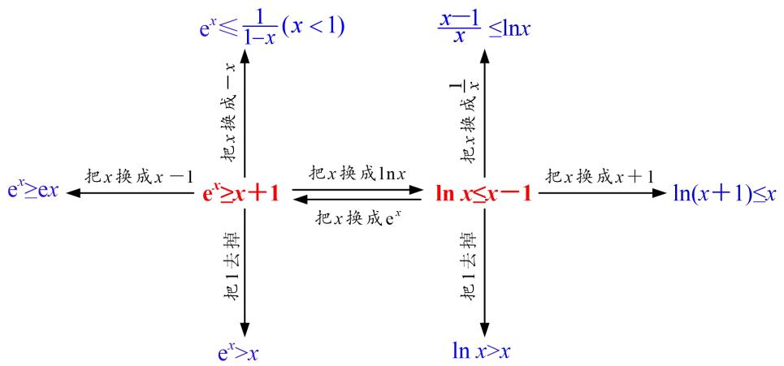

# 专题14 两个经典不等式的应用

逻辑推理是得到数学结论，构建数学体系的重要方式，是数学严谨性的基本保证。利用两个经典不等式解决问题，降低了思考问题的难度，优化了推理和运算过程。

1. 对数形式: $x \geq 1 + \ln x (x > 0)$ , 当且仅当 $x = 1$ 时, 等号成立.  
2. 指数形式: $e^{x} \geq x + 1 (x \in \mathbf{R})$ , 当且仅当 $x = 0$ 时, 等号成立.

进一步可得到一组不等式链： $e^{x}>x+1>x>1+\ln x(x>0$ ，且 $x\neq1)$ .

注意：选填题可直接使用，解答题必须先证明后再使用.

# 考点一 两个经典不等式的应用

1. 对数形式: $x \geq 1 + \ln x (x > 0)$ , 当且仅当 $x = 1$ 时, 等号成立.  
2. 指数形式: $e^{x} \geq x + 1 (x \in \mathbf{R})$ , 当且仅当 $x = 0$ 时, 等号成立.

# 【例题选讲】

[例 1] （1）已知对任意 x，都有 $xe^{2x}-ax-x\geq1+\ln x$ ，则实数 a 的取值范围是 \_\_\_\_.  
（2）已知函数 $f(x)=\mathrm{e}^{x}-ax-1$ ， $g(x)=\ln x-ax-1$ ，其中 0<a<1，e 为自然对数的底数，若 $\exists x_{0}\in(0,+\infty)$ ，使 $f(x_{0})g(x_{0})>0$ ，则实数 a 的取值范围是 \_\_\_\_。

[例 2] 函数 $f(x)=\ln(x+1)-ax,\quad g(x)=1-e^{x}$ .  
（1）讨论函数 $f(x)$ 的单调性;  
（2）若 $f(x)\geq g(x)$ 在 $x\in [0, + \infty)$ 上恒成立，求实数 $a$ 的取值范围.

[例 3] 已知函数 $f(x)=\mathrm{e}^{x}-a$ .  
（1）若函数 $f(x)$ 的图象与直线 l: y = x - 1 相切，求 a 的值；  
（2）若 $f(x)-\ln x>0$ 恒成立，求整数 a 的最大值.

[例 4] 已知函数 $f(x)=x^{2}-(a-2)x-a\ln x(a\in\mathbf{R})$ .  
（1）求函数 $y=f(x)$ 的单调区间；  
（2）当 a=1 时，证明：对任意的 x>0， $f(x)+\mathrm{e}^{x}>x^{2}+x+2$ .

[例 5] 已知函数 $f(x)=x-1-a\ln x$ .  
（1）若 $f(x)\geq0$ ，求a的值；  
（2）证明：对于任意正整数 $n$ ， $\left(1 + \frac{1}{2}\right)\left(1 + \frac{1}{2^2}\right) \ldots \cdot \left(1 + \frac{1}{2^n}\right) < e.$

# 【对点训练】

1. 已知函数 $f(x) = \mathrm{e}^{x}$ ， $x \in \mathbf{R}$ 。证明：曲线 $y = f(x)$ 与曲线 $y = \frac{1}{2} x^{2} + x + 1$ 有唯一公共点。

2. (2018·全国I改编)已知函数 $f(x)=ae^{x}-\ln x-1$ .  
（1）设 x=2 是 $f(x)$ 的极值点，求 a 的值并求 $f(x)$ 的单调区间；  
（2）求证：当 $a=\frac{1}{e}$ 时， $f(x)\geq0$ .

3. (2020·山东)已知函数 $f(x) = ae^{x - 1} - \ln x + \ln a$ .  
（1）当 $a = \mathrm{e}$ 时，求曲线 $y = f(x)$ 在点(1， $f(1))$ 处的切线与两坐标轴围成的三角形的面积；  
（2）若 $f(x)\geq 1$ ，求 $a$ 的取值范围.

4. 已知函数 $f(x)=ae^{x}+2x-1$ (其中常数 e=2.71828...是自然对数的底数).  
（1）讨论函数 $f(x)$ 的单调性;  
（2）证明：对任意的 $a \geq 1$ ，当 x > 0 时， $f(x) \geq (x + ae)x$ .

5. 已知函数 $f(x)=a\ln x+1(a\in\mathbf{R})$ .  
（1）若 $g(x)=x-f(x)$ ，讨论函数 $g(x)$ 的单调性；  
（2）若 $t(x)=\frac{1}{2}x^{2}+x,\ h(x)=\mathrm{e}^{x}-1$ (其中 e 是自然对数的底数)，且 $a=1,\ x\in(0,+\infty)$ ，求证： $h(x)>t(x)>f(x)$ .

6. 已知函数 $f(x)=kx-\ln x-1(k>0)$ .  
（1）若函数 $f(x)$ 有且只有一个零点，求实数k的值；  
（2）证明：当 $n \in \mathbf{N}^*$ 时， $1 + \frac{1}{2} + \frac{1}{3} + \ldots + \frac{1}{n} > \ln(n + 1)$ .

# 考点二 经典不等式的变形不等式的应用

# 【例题选讲】

[例1] 证明下列不等式  
（1） $e^{x-1}\geq x$ ; （2） $\ln(x+1)\leq x$ ; （3） $\frac{x}{1+x}<\ln(1+x)(x>0)$ ; （4） $e^{x}-\ln(x+2)>0$ .

[例 2] （1） 已知函数 $f(x)=\frac{1}{\ln(x+1)-x}$ ，则 $y=f(x)$ 的图象大致为()

[例 3] 设函数 $f(x)=\ln x-x+1$ .  
（1）讨论 $f(x)$ 的单调性;  
（2）证明：当 $x \in (1, +\infty)$ 时， $1 < \frac{x - 1}{\ln x} < x$ .

[例 4] 已知函数 $f(x)=\ln(1+x)$ .  
（1）求证：当 $x \in (0, +\infty)$ 时， $\frac{x}{1 + x} < f(x) < x;$  
（2）已知 e 为自然对数的底数，证明： $\forall n\in N^{*}$ ， $\sqrt{e}<\left(1+\frac{1}{n^{2}}\right)\left(1+\frac{2}{n^{2}}\right)\cdots\left(1+\frac{n}{n^{2}}\right)<e.$

# 【对点训练】

1. 已知函数 $f(x) = \ln x + \frac{a}{x}, a \in \mathbf{R}$ .  
（1）讨论函数 $f(x)$ 的单调性;  
（2）当 a>0 时，证明： $f(x)\geq\frac{2a-1}{a}$ .

2. 已知函数 $f(x)=x\ln x$ , $g(x)=x-1$ .  
（1）求 $F(x)=g(x)-f(x)$ 的单调区间和最值；  
（2）证明：对大于1的任意自然数n，都有 $\frac{1}{2}+\frac{1}{3}+\frac{1}{4}+\ldots+\frac{1}{n}<\ln n.$

