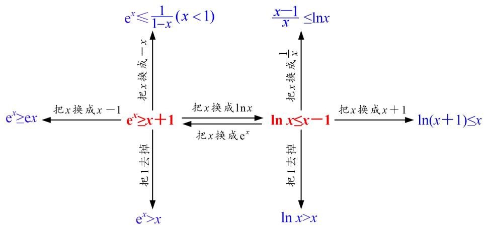
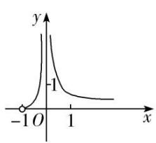
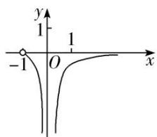
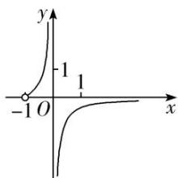
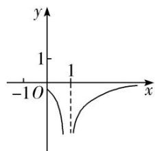

# 专题 14 两个经典不等式的应用

逻辑推理是得到数学结论，构建数学体系的重要方式，是数学严谨性的基本保证。利用两个经典不等式解决问题，降低了思考问题的难度，优化了推理和运算过程。

1. 对数形式: $x \geq 1 + \ln x (x > 0)$ , 当且仅当 $x = 1$ 时, 等号成立.  
2. 指数形式: $\mathrm{e}^{x} \geq x + 1 (x \in \mathbf{R})$ , 当且仅当 $x = 0$ 时, 等号成立.

进一步可得到一组不等式链： $e^{x}>x+1>x>1+\ln x(x>0$ ，且 $x\neq1)$ .

注意：选填题可直接使用，解答题必须先证明后再使用.

# 考点一 两个经典不等式的应用

1. 对数形式: $x \geq 1 + \ln x (x > 0)$ , 当且仅当 $x = 1$ 时, 等号成立.
证明 由题意知 x>0，令 $f(x)=x-1-\ln x$ ，所以 $f'(x)=1-\frac{1}{x}=\frac{x-1}{x}$ ,
所以当 $f'(x)>0$ 时，x>1；当 $f'(x)<0$ 时，0<x<1，
故 $f(x)$ 在 $(0, 1)$ 上单调递减，在 $(1, +\infty)$ 上单调递增，
所以 $f(x)$ 有最小值 $f(1)=0$ ，故有 $f(x)=x-1-\ln x\geq f(1)=0$ ，即 $\ln x\leq x-1$ 成立.

2. 指数形式: $e^{x} \geq x + 1 (x \in \mathbf{R})$ , 当且仅当 $x = 0$ 时, 等号成立.
证明 设 $f(x)=\mathrm{e}^{x}-x-1$ ，则 $f'(x)=\mathrm{e}^{x}-1$ ，由 $f'(x)=0$ ，得 x=0，
所以当 x<0 时， $f'(x)<0$ ；当 x>0 时， $f'(x)>0$ ，
所以 $f(x)$ 在 $(-∞, 0)$ 上单调递减，在 $(0, +∞)$ 上单调递增，
所以 $f(x) \geq f(0) = 0$ ，即 $e^{x} - x - 1 \geq 0$ ，所以 $e^{x} \geq x + 1$ .

# 【例题选讲】

[例 1] （1）已知对任意 x，都有 $xe^{2x}-ax-x\geq1+\ln x$ ，则实数 a 的取值范围是 \_\_\_\_.
答案 $(- \infty, 1]$ 解析 根据题意可知， $x > 0$ ，由 $x \cdot e^{2x} - ax - x \geq 1 + \ln x$ ，可得 $a \leq e^{2x} - \frac{\ln x + 1}{x} - 1 (x > 0)$ 恒成立，令 $f(x) = e^{2x} - \frac{\ln x + 1}{x} - 1$ ，则 $a \leq f(x)_{\min}$ ，现证明 $e^x \geq x + 1$ 恒成立，设 $g(x) = e^x - x - 1$ ， $g'(x) = e^x - 1$ ，当 $g'(x) = 0$ 时，解得 $x = 0$ ，当 $x < 0$ 时， $g'(x) < 0$ ， $g(x)$ 单调递减，当 $x > 0$ 时， $g'(x) > 0$ ， $g(x)$ 单调递增，故当 $x = 0$ 时，函数 $g(x)$ 取得最小值， $g(0) = 0$ ，所以 $g(x) \geq g(0) = 0$ ，即 $e^x - x - 1 \geq 0 \Leftrightarrow e^x \geq x + 1$ 恒成立， $f(x) = e^{2x} - \frac{\ln x + 1}{x} - 1 = \frac{x \cdot e^{2x} - \ln x - 1}{x} - 1 = \frac{e^{\ln x + 2x} - \ln x - 1}{x} - 1 \geq \frac{\ln x + 2x + 1 - \ln x - 1}{x} - 1 = 1$ ，所以 $f(x)_{\min} = 1$ ，即 $a \leq 1$ 。所以实数 $a$ 的取值范围是 $(- \infty, 1]$ 。  
（2）已知函数 $f(x) = \mathrm{e}^x - ax - 1$ ， $g(x) = \ln x - ax - 1$ ，其中 $0 < a < 1$ ，e为自然对数的底数，若 $\exists x_0 \in (0, +\infty)$ ，使 $f(x_0)g(x_0) > 0$ ，则实数 $a$ 的取值范围是 \_\_\_\_.
答案 $\left(0, \frac{1}{\mathrm{e}^2}\right)$ 解析 令 $M(x) = \mathrm{e}^x - x - 1, x \in (0, +\infty)$ ，则 $M'(x) = \mathrm{e}^x - 1$ ，当 $x \in (0, +\infty)$ 时， $M'(x) > 0$ ，所以 $M(x)$ 在 $(0, +\infty)$ 上单调递增，所以 $M(x) > M(0) = 0$ ，所以 $\mathrm{e}^x > x + 1$ 。由于 $0 < a < 1$ ，所以当 $x \in (0, +\infty)$

时， $f(x)=\mathrm{e}^{x}-ax-1>0$ ，故若 $\exists x_{0}\in(0,+\infty)$ ，使 $f(x_{0})g(x_{0})>0$ ，转化为 $\exists x_{0}\in(0,+\infty)$ ， $g(x_{0})>0$ ，则 $g(x_{0})=\ln x_{0}-ax_{0}-1>0$ ，即 $a<\frac{\ln x_{0}}{x_{0}}-\frac{1}{x_{0}}$ 。令 $h(x)=\frac{\ln x}{x}-\frac{1}{x}$ ， $h'(x)=\frac{2-\ln x}{x^{2}}$ 。当 $x\in(0,\mathrm{e}^{2})$ 时， $h'(x)>0$ ，当 $x\in(\mathrm{e}^{2},+\infty)$ 时， $h'(x)<0$ ，所以函数 $h(x)$ 在 $(0,\mathrm{e}^{2})$ 上单调递增，在 $(\mathrm{e}^{2},+\infty)$ 上单调递减。所以 $h(x)\leq h(\mathrm{e}^{2})=\frac{\ln\mathrm{e}^{2}}{\mathrm{e}^{2}}-\frac{1}{\mathrm{e}^{2}}=\frac{1}{\mathrm{e}^{2}}$ 。所以 $0<a<\frac{1}{\mathrm{e}^{2}}$ ，即 $a\in\left(0,\frac{1}{\mathrm{e}^{2}}\right)$ 。

[例 2] 函数 $f(x)=\ln(x+1)-ax,\quad g(x)=1-\mathrm{e}^{x}.$  
（1）讨论函数 $f(x)$ 的单调性;  
（2）若 $f(x)\geq g(x)$ 在 $x\in[0,+\infty)$ 上恒成立，求实数 a 的取值范围.
解析 （1）函数 $f(x)$ 的定义域为 $x \in (-1, +\infty)$ , $f'(x) = \frac{1}{x + 1} - a = \frac{-ax + 1 - a}{x + 1}$ .

(i) 当 a=0 时， $f'(x)>0$ ， $f(x)$ 在 $(-1, +\infty)$ 上单调递增；
(ii) 当 $a \neq 0$ 时，令 $f(x) = 0$ 得 $x = \frac{1 - a}{a} = \frac{1}{a} - 1$ ，若 $a < 0$ ，则 $\frac{1}{a} - 1 < -1$ ，若 $a > 0$ ，则 $\frac{1}{a} - 1 > -1$ .

①当 a<0 时， $f(x)=\frac{1}{x+1}-a>0$ ，函数 $f(x)$ 在 $(-1, +\infty)$ 上单调递增；
当 a>0 时， $f'(x)=\frac{-a\left(x-\frac{1-a}{a}\right)}{x+1}$ ，所以当 $x\in\left(-1,\frac{1-a}{a}\right)$ 时， $f'(x)>0$ ， $f(x)$ 单调递增，
当 $x \in \left(\frac{1-a}{a}, +\infty\right)$ 时， $f'(x) < 0$ ， $f(x)$ 单调递减，

综上可得，当 $a \leq 0$ 时， $f(x)$ 在 $(-1, +\infty)$ 上单调递增；当 $a > 0$ 时， $f(x)$ 在 $\left[-1, \frac{1 - a}{a}\right]$ 上单调递增，在 $\left[\frac{1 - a}{a}, +\infty\right]$ 上单调递减.  
（2）设函数 $h(x)=f(x)-g(x)=\ln(x+1)+\mathrm{e}^{x}-ax-1,\quad x\geq0$ ，则 $h'(x)=\frac{1}{x+1}+\mathrm{e}^{x}-a,$
当 $a \leq 2$ 时，由 $\mathrm{e}^x \geq x + 1$ 得 $h'(x) = \frac{1}{x + 1} + \mathrm{e}^x - a \geq \frac{1}{x + 1} + x + 1 - a \geq 0,$
于是， $h(x)$ 在 $[0, +\infty)$ 上单调递增，所以 $h(x) \geq h(0) = 0$ 恒成立，符合题意；
当 a>2 时，由于 $x \geq 0$ ， $h(0)=0$ ，令函数 $m(x)=h'(x)$ ，
则 $m'(x)=-\frac{1}{(x+1)^{2}}+\mathrm{e}^{x}(x\geq0)$ . 所以 $m'(x)\geq0$ ,
故 $h'(x)$ 在 $[0, +\infty)$ 上单调递增，而 $h'（0） = 2 - a < 0$ 。则存在一个 $x_0 > 0$ ，使得 $h'(x_0) = 0$
所以当 $x \in [0, x_{0})$ 时， $h(x)$ 单调递减，故 $h(x_{0}) < h(0) = 0$ ，不符合题意.

综上，实数 a 的取值范围为 $(-∞, 2]$ .

[例 3] 已知函数 $f(x)=\mathrm{e}^{x}-a$ .  
（1）若函数 $f(x)$ 的图象与直线 l: y = x - 1 相切，求 a 的值；  
（2）若 $f(x)-\ln x>0$ 恒成立，求整数 a 的最大值.
解析 （1） $f'(x)=\mathrm{e}^{x}$ ，因为函数 $f(x)$ 的图象与直线y=x-1相切，
所以令 $f(x)=1$ ，即 $e^{x}=1$ ，得 x=0，∴切点坐标为 $(0,-1)$ ，则 $f(0)=1-a=-1$ ，∴a=2。  
（2）先证明 $e^{x}\geq x+1$ ，设 $F(x)=e^{x}-x-1$ ，则 $F'(x)=e^{x}-1$ ，令 $F'(x)=0$ ，则 x=0，
当 $x \in (0, +\infty)$ 时， $F'(x) > 0$ ；当 $x \in (-\infty, 0)$ 时， $F'(x) < 0$ .
所以 $F(x)$ 在 $(0, +\infty)$ 上单调递增，在 $(-∞, 0)$ 上单调递减，
所以 $F(x)_{\min}=F(0)=0$ ，即 $F(x)\geq0$ 恒成立。∴ $e^{x}\geq x+1$ ，从而 $e^{x}-2\geq x-1$ (x=0 时取等号).

以 $\ln x$ 代换 x 得 $\ln x \leq x - 1$ (当 x = 1 时，等号成立)，所以 $e^{x} - 2 > \ln x$ .
当 $a \leq 2$ 时， $\ln x < e^{x} - 2 \leq e^{x} - a$ ，则当 $a \leq 2$ 时， $f(x) - \ln x > 0$ 恒成立.
当 $a \geq 3$ 时，存在 x，使 $e^{x} - a < \ln x$ ，即 $e^{x} - a > \ln x$ 不恒成立.

综上，整数 a 的最大值为 2.

[例 4] 已知函数 $f(x)=x^{2}-(a-2)x-a\ln x(a\in\mathbf{R})$ .  
（1）求函数 $y=f(x)$ 的单调区间；  
（2）当 a=1 时，证明：对任意的 x>0， $f(x)+\mathrm{e}^{x}>x^{2}+x+2$ .
解析 （1）函数 $f(x)$ 的定义域是 $(0, +\infty)$ ， $f'(x)=2x-(a-2)-\frac{a}{x}=\frac{(x+1)(2x-a)}{x}$ ,
当 $a \leq 0$ 时， $f'(x) > 0$ 对任意 $x \in (0, +\infty)$ 恒成立，∴ 函数 $f(x)$ 在区间 $(0, +\infty)$ 上单调递增；
当 a>0 时，由 $f'(x)>0$ 得 $x>\frac{a}{2}$ ，由 $f'(x)<0$ ，得 $0<x<\frac{a}{2}$ ，
∴函数 $f(x)$ 在区间 $\left(\frac{a}{2}, +\infty\right)$ 上单调递增，在区间 $\left(0, \frac{a}{2}\right)$ 上单调递减.  
（2）当 a=1 时， $f(x)=x^{2}+x-\ln x$ ，要证明 $f(x)+\mathrm{e}^{x}>x^{2}+x+2$

只需证明 $e^{x}-\ln x-2>0$ ，先证明当 x>0 时， $e^{x}>x+1$ ，
令 $g(x)=\mathrm{e}^{x}-x-1(x>0)$ ，则 $g'(x)=\mathrm{e}^{x}-1$ ，当 x>0 时， $g'(x)>0$ ， $g(x)$ 单调递增，
∴当 x>0 时， $g(x)>g(0)=0$ 即 $e^{x}>x+1$ ，∴ $e^{x}-\ln x-2>x+1-\ln x-2=x-\ln x-1$ .
∴只要证明 $x-\ln x-1\geq0(x>0)$ ，令 $h(x)=x-\ln x-1(x>0)$ ,
则 $h'(x)=1-\frac{1}{x}=\frac{x-1}{x}(x>0)$ ，易知 $h(x)$ 在 $(0,1]$ 上单调递减，在 $[1,+\infty)$ 上单调递增，
∴ $h(x) \geq h(1) = 0$ 即 $x - \ln x - 1 \geq 0$ 成立，
$\therefore f(x)+e^{x}>x^{2}+x+2$ 成立.

[例 5] 已知函数 $f(x)=x-1-a\ln x$ .  
（1）若 $f(x)\geq 0$ ，求 $\pmb{a}$ 的值；  
（2）证明：对于任意正整数 $n$ ， $\left(1 + \frac{1}{2}\right)\left(1 + \frac{1}{2^2}\right)\dots \cdot \left(1 + \frac{1}{2^n}\right) <   \mathbf{e}.$
解析 （1） $f(x)$ 的定义域为 $(0, +\infty)$ ,

①若 $a \leq 0$ ，因为 $f\left(\frac{1}{2}\right) = -\frac{1}{2} + a \ln 2 < 0$ ，所以不满足题意；  
②若 a>0，由 $f(x)=1-\frac{a}{x}=\frac{x-a}{x}$ 知，
当 $x \in (0, a)$ 时， $f'(x) < 0$ ；当 $x \in (a, +\infty)$ 时， $f'(x) > 0$ ;
所以 $f(x)$ 在 $(0, a)$ 单调递减，在 $(a, +\infty)$ 单调递增，
故 x=a 是 $f(x)$ 在 $(0, +\infty)$ 的唯一最小值点.
因为 $f(1)=0$ ，所以当且仅当 a=1 时， $f(x)\geq0$ ，故 a=1。  
（2）由（1）知当 $x \in (1, +\infty)$ 时， $x - 1 - \ln x > 0$ .
令 $x=1+\frac{1}{2^{n}}$ ，得 $\ln\left(1+\frac{1}{2^{n}}\right)<\frac{1}{2^{n}}$ .
从而 $\ln\left(1+\frac{1}{2}\right)+\ln\left(1+\frac{1}{2^{2}}\right)+\ldots+\ln\left(1+\frac{1}{2^{n}}\right)<\frac{1}{2}+\frac{1}{2^{2}}+\ldots+\frac{1}{2^{n}}=1-\frac{1}{2^{n}}<1.$
故 $\left(1+\frac{1}{2}\right)\left(1+\frac{1}{2^{2}}\right)\cdots\left(1+\frac{1}{2^{n}}\right)<e.$

# 【对点训练】

1. 已知函数 $f(x) = \mathrm{e}^{x}, x \in \mathbf{R}$ . 证明：曲线 $y = f(x)$ 与曲线 $y = \frac{1}{2} x^2 + x + 1$ 有唯一公共点.  
1. 解析 令 $g(x) = f(x) - \left(\frac{1}{2} x^2 + x + 1\right) = \mathrm{e}^x - \frac{1}{2} x^2 - x - 1, \quad x \in \mathbf{R}$ ，则 $g'(x) = \mathrm{e}^x - x - 1$ ，
由经典不等式 $e^{x}\geq x+1$ 恒成立可知， $g'(x)\geq0$ 恒成立，所以 $g(x)$ 在 R 上为单调递增函数，且 $g(0)=0$ .
所以函数 $g(x)$ 有唯一零点，即两曲线有唯一公共点.

2. (2018·全国I改编)已知函数 $f(x)=ae^{x}-\ln x-1$ .  
（1）设 x=2 是 $f(x)$ 的极值点，求 a 的值并求 $f(x)$ 的单调区间；  
（2）求证：当 $a = \frac{1}{\mathrm{e}}$ 时， $f(x) \geq 0$ .

2. 解析 （1） $f(x)$ 的定义域为 $(0, +\infty)$ , $f'(x)=a\cdot e^{x}-\frac{1}{x}$ , 由题设知, $f'（2）=a\cdot e^{2}-\frac{1}{2}=0$ , 所以 $a=\frac{1}{2e^{2}}$ ,
从而 $f(x)=\frac{1}{2e^{2}}e^{x}-\ln x-1,\quad f'(x)=\frac{1}{2e^{2}}e^{x}-\frac{1}{x}(x>0).$
因为 $f'(x)=\frac{1}{2e^{2}}e^{x}-\frac{1}{x}$ 在 $(0,+\infty)$ 上是增函数，且 $f'（2）=0$ ，所以当 0<x<2 时， $f'(x)<0$ ；当 x>2 时， $f'(x)>0$ 。所以 $f(x)$ 在 $(0,2)$ 上单调递减，在 $(2,+\infty)$ 上单调递增。  
（2）当 $a = \frac{1}{\mathrm{e}}$ 时， $f(x) = \frac{\mathrm{e}^x}{\mathrm{e}} - \ln x - 1$ ，所以只要证明 $\frac{\mathrm{e}^x}{\mathrm{e}} - \ln x - 1 \geq 0$ 即可.
设 $g(x)=\mathrm{e}^{x}-\mathrm{e}x(x>0)$ ，则 $g'(x)=\mathrm{e}^{x}-\mathrm{e}(x>0)$ ，可知 $g(x)$ 在 $(0,1]$ 上是减函数，在 $[1,+\infty)$ 上是增函数，所以 $g(x)\geq g(1)=0$ ，即 $e^{x}\geq ex\Rightarrow\frac{e^{x}}{e}\geq x$ 。又由 $e^{x}\geq ex(x>0)\Rightarrow x\geq1+\ln x(x>0)$ ，
所以 $\frac{e^{x}}{e}-\ln x-1\geq x-\ln x-1\geq0$ ，所以 $\frac{e^{x}}{e}-\ln x-1\geq0$ 得证，
所以当 $a=\frac{1}{e}$ 时， $f(x)\geq0$ .

3. (2020·山东)已知函数 $f(x) = ae^{x - 1} - \ln x + \ln a$ .  
（1）当 a=e 时，求曲线 $y=f(x)$ 在点 $(1, f(1))$ 处的切线与两坐标轴围成的三角形的面积；  
（2）若 $f(x)\geq 1$ ，求 $\pmb{a}$ 的取值范围.

3. 解析 $f(x)$ 的定义域为 $(0, +\infty)$ ， $f'(x) = a e^{x-1} - \frac{1}{x}$ .  
（1） 当 $a = \mathrm{e}$ 时， $f(x) = \mathrm{e}^x - \ln x + 1$ ， $f'（1） = \mathrm{e} - 1$

曲线 $y=f(x)$ 在点 $(1, f(1))$ 处的切线方程为 $y-(\mathrm{e}+1)=(\mathrm{e}-1)(x-1)$ ，即 $y=(\mathrm{e}-1)x+2$ .

直线 $y=(\mathrm{e}-1)x+2$ 在 x 轴、y 轴上的截距分别为 $\frac{-2}{\mathrm{e}-1}$ ，2．因此所求三角形的面积为 $\frac{2}{\mathrm{e}-1}$ .  
（2） 当 0 < a < 1 时， $f(1) = a + \ln a < 1$ .
当 a=1 时， $f(x)=\mathrm{e}^{x-1}-\ln x,\ f'(x)=\mathrm{e}^{x-1}-\frac{1}{x}.$
当 $x \in (0, 1)$ 时， $f'(x) < 0$ ；当 $x \in (1, +\infty)$ 时， $f'(x) > 0$ .
所以当 x=1 时， $f(x)$ 取得最小值，最小值为 $f(1)=1$ ，从而 $f(x)\geq1$ .
当 a>1 时， $f(x)=ae^{x-1}-\ln x+\ln a>e^{x-1}-\ln x\geq1$ .

综上，a 的取值范围是 $[1, +\infty)$ .

4. 已知函数 $f(x)=ae^{x}+2x-1$ (其中常数 e=2.71828...是自然对数的底数).  
（1）讨论函数 $f(x)$ 的单调性;  
（2）证明：对任意的 $a \geq 1$ ，当 x > 0 时， $f(x) \geq (x + ae)x$ .

4. 解析 （1） 由 $f(x) = ae^x + 2x - 1$ ，得 $f'(x) = ae^x + 2$ .

①当 $a \geq 0$ 时， $f(x) > 0$ ，函数 $f(x)$ 在 R 上单调递增；
②当 a<0 时，由 $f'(x)>0$ ，解得 $x<\ln\left(-\frac{2}{a}\right)$ ，由 $f'(x)<0$ ，解得 $x>\ln\left(-\frac{2}{a}\right)$ ,
故 $f(x)$ 在 $\left[-\infty, \ln \left(-\frac{2}{a}\right)\right]$ 上单调递增，在 $\left[\ln \left(-\frac{2}{a}\right), +\infty\right]$ 上单调递减.
综上所述，当 $a \geq 0$ 时，函数 $f(x)$ 在 R 上单调递增；
当 a<0 时， $f(x)$ 在 $\left(-\infty, \ln\left(-\frac{2}{a}\right)\right)$ 上单调递增，在 $\left(\ln\left(-\frac{2}{a}\right), +\infty\right)$ 上单调递减.  
（2）对任意 $a \geq 1$ ，当 $x > 0$ 时， $f(x) \geq (x + ae)x \Leftrightarrow \frac{e^x}{x} - \frac{x}{a} - \frac{1}{ax} + \frac{2}{a} - e \geq 0$ .
令 $g(x)=\frac{\mathrm{e}^{x}}{x}-\frac{x}{a}-\frac{1}{ax}+\frac{2}{a}-\mathrm{e}$ ，则 $g'(x)=\frac{(x-1)(ae^{x}-x-1)}{ax^{2}}$ .
当 $a \geq 1$ 时， $ae^{x} - x - 1 \geq e^{x} - x - 1$ .
令 $h(x)=\mathrm{e}^{x}-x-1$ ，则当 x>0 时， $h'(x)=\mathrm{e}^{x}-1>0$ .
∴当 x>0 时， $h(x)$ 单调递增， $h(x)>h(0)=0$ 。∴ $ae^{x}-x-1>0$ 。
∴当 0<x<1 时， $g'(x)<0$ ；当 x=1 时， $g'(x)=0$ ；当 x>1 时， $g'(x)>0$ 。
∴ $g(x)$ 在 $(0, 1)$ 上单调递减，在 $(1, +\infty)$ 上单调递增，
$\therefore g(x) \geq g(1) = 0$ ，即 $\frac{\mathrm{e}^x}{x} - \frac{x}{a} - \frac{1}{ax} + \frac{2}{a} - \mathrm{e} \geq 0$ ，故 $f(x) \geq (x + ae)x$ .

5. 已知函数 $f(x) = a\ln x + 1 (a \in \mathbf{R})$ .  
（1）若 $g(x)=x-f(x)$ ，讨论函数 $g(x)$ 的单调性；  
（2）若 $t(x) = \frac{1}{2} x^2 +x$ ， $h(x) = \mathrm{e}^{x} - 1$ (其中e是自然对数的底数)，且 $a = 1$ ， $x\in (0, + \infty)$ ，求证： $h(x) > t(x) > f(x)$

5. 解析 （1）由题意得， $g(x)=x-f(x)=x-a\ln x-1$

其定义域为 $(0, +\infty)$ ， $g'(x)=1-\frac{a}{x}=\frac{x-a}{x}$
当 $a \leq 0$ 时， $g'(x) > 0$ 在 $(0, +\infty)$ 上恒成立，则函数 $g(x)$ 在 $(0, +\infty)$ 上单调递增；
当 a>0 时，易得函数 $g(x)$ 在 $(0, a)$ 上单调递减，在 $(a, +\infty)$ 上单调递增.  
（2）设 $u(x) = h(x) - t(x) = \mathrm{e}^x -1 - \frac{1}{2} x^2 -x$ ，则 $u'(x) = \mathrm{e}^{x} - x - 1$
设 $m(x)=u'(x)=\mathrm{e}^{x}-x-1$ ，则 $m'(x)=\mathrm{e}^{x}-1$ ，
当 x>0 时， $m'(x)>0$ 恒成立，则 $m(x)$ 在 $(0, +\infty)$ 上单调递增，
∴ $m(x) > m(0) = 0$ ，则 $u(x)$ 在 $(0, +\infty)$ 上单调递增，∴ $u(x) > u(0) = 0$ ，
∴ $h(x) - t(x) > 0$ 在 $(0, +\infty)$ 上恒成立，即 $h(x) > t(x)$ .
当 a=1 时，设 $v(x)=t(x)-x=\frac{1}{2}x^{2}$ ,
∵ 当 x>0 时， $v(x)>0$ ，即 $t(x)>x$ ．设 $s(x)=x-\ln x-1$ ，则 $s'(x)=1-\frac{1}{x}=\frac{x-1}{x}$ .

易得 $s(x)$ 在 $(0, 1)$ 上单调递减，在 $(1, +\infty)$ 上单调递增，
$\therefore s(x)\geq s(1)=0,\quad\therefore x\geq\ln x+1=f(x)\therefore t(x)>x\geq f(x),\quad 即 t(x)>f(x),$
综上所述， $h(x)>t(x)>f(x)$ .

6. 已知函数 $f(x) = kx - \ln x - 1 (k > 0)$ .  
（1）若函数 $f(x)$ 有且只有一个零点，求实数k的值；  
（2）证明：当 $n \in \mathbf{N}^*$ 时， $1 + \frac{1}{2} + \frac{1}{3} + \ldots + \frac{1}{n} > \ln(n + 1)$ .

6. 解析 （1） 法一: $f(x) = kx - \ln x - 1$ , $f'(x) = k - \frac{1}{x} = \frac{kx - 1}{x} (x > 0, k > 0)$ ,
当 $0 < x < \frac{1}{k}$ 时， $f'(x) < 0$ ；当 $x > \frac{1}{k}$ 时， $f'(x) > 0$ ．∴ $f(x)$ 在 $(0, \frac{1}{k})$ 上单调递减，在 $(\frac{1}{k}, +\infty)$ 上单调递增.
$\therefore f(x)_{\min} = f\left(\frac{1}{k}\right) = \ln k,\quad \because f(x)\text{有且只有一个零点，}\therefore \ln k = 0,\quad \therefore k = 1.$

法二：由题意知方程 $kx - \ln x - 1 = 0$ 仅有一个实根，由 $kx - \ln x - 1 = 0$ ，得 $k = \frac{\ln x + 1}{x} (x > 0)$
令 $g(x)=\frac{\ln x+1}{x}(x>0)$ ， $g'(x)=\frac{-\ln x}{x^{2}}$ ，当 0<x<1 时， $g'(x)>0$ ；当 x>1 时， $g'(x)<0$ .
∴ $g(x)$ 在 $(0,1)$ 上单调递增，在 $(1,+\infty)$ 上单调递减，∴ $g(x)_{\max}=g(1)=1$ ，当 $x\to+\infty$ 时， $g(x)\to0$ ，
∴要使 $f(x)$ 仅有一个零点，则k=1.

法三：函数 $f(x)$ 有且只有一个零点，即直线 y=kx 与曲线 $y=\ln x+1$ 相切，设切点为 $(x_{0}, y_{0})$ ,
由 $y=\ln x+1$ ，得 $y'=\frac{1}{x}$ ，∴ $\left\{\begin{aligned}k&=\frac{1}{x_{0}},\\ y_{0}&=kx_{0},\\ y_{0}&=\ln x_{0}+1,\end{aligned}\right.$ ∴ $k=x_{0}=y_{0}=1$ ，∴ 实数 k 的值为 1.  
（2）由（1）知 $x-\ln x-1\geq0$ ，即 $x-1\geq\ln x$ ，当且仅当 x=1 时取等号，
$\because n\in N^{*}$ ，令 $x=\frac{n+1}{n}$ ，得 $\frac{1}{n}>\ln\frac{n+1}{n}$ ， $\therefore 1+\frac{1}{2}+\frac{1}{3}+\ldots+\frac{1}{n}>\ln\frac{2}{1}+\ln\frac{3}{2}+\ldots+\ln\frac{n+1}{n}=\ln(n+1)$ ,
故 $1 + \frac{1}{2} +\frac{1}{3} +\ldots +\frac{1}{n} >\ln (n + 1).$

# 考点二 经典不等式的变形不等式的应用

# 【例题选讲】

[例1] 证明下列不等式  
（1） $e^{x-1}\geq x$ ; （2） $\ln(x+1)\leq x$ ; （3） $\frac{x}{1+x}<\ln(1+x)(x>0)$ ; （4） $e^{x}-\ln(x+2)>0$ .
解析 （1） 方法一 令 $f(x) = \mathrm{e}^{x - 1} - x$ ，则 $f'(x) = \mathrm{e}^{x - 1} - 1$ .
若 x<1，则 $f'(x)<0$ ， $f(x)$ 在 $(-∞, 1)$ 上单调递减；若 x>1，则 $f'(x)>0$ ， $f(x)$ 在 $(1, +∞)$ 上单调递增.
$\therefore f (x) _ {\min} = f （1） = 0, \quad \therefore f (x) \geq 0, \quad \therefore e ^ {x - 1} \geq x.$
方法二 令 t=x-1，则 $x=t+1$ 。由 $e^{t}\geq t+1$ ，得 $e^{x^{-1}}\geq x$  
（2）由题意知 x > -1，令 $f(x) = \ln(x + 1) - x$ ，所以 $f'(x) = \frac{1}{x + 1} - 1 = \frac{-x}{x + 1}$ ,
所以当 $f'(x)>0$ 时，-1<x<0；当 $f'(x)<0$ 时，x>0，
故 $f(x)$ 在 $(-1, 0)$ 上单调递增，在 $(0, +\infty)$ 上单调递减，
所以 $f(x)$ 有最大值 $f(0)=0$ ，故有 $f(x)=\ln(x+1)-x\leq f(0)=0$ ，即 $\ln(x+1)\leq x$ 成立.  
（3）方法一 构造函数 $f(x) = \ln (1 + x) - \frac{x}{1 + x}$ ，则 $g(0) = 0$ .
当 $x > 0$ 时， $f'(x) = \frac{1}{1 + x} - \left[\frac{1}{1 + x} - \frac{x}{(1 + x)^2}\right] = \frac{x}{(1 + x)^2} > 0.$
即当 x>0 时，函数 $f(x)$ 单调递增．即 $f(x)>f(0)=0$ .
故 $f(x)=\ln(1+x)-\frac{x}{1+x}>0$ ，即 $\frac{x}{1+x}<\ln(1+x)$ .
方法二 $\because \ln x \leq x - 1$ ，且当 x = 1 时等号成立.
$\therefore \ln \frac{1}{x + 1} < \frac{1}{x + 1} - 1 (x > 0)$ , 即 $\ln \frac{1}{x + 1} < \frac{-x}{x + 1}$ , $\therefore \frac{x}{x + 1} < \ln (x + 1)$ .  
（4）令 $f(x)=\mathrm{e}^{x}-x-1$ ，则 $f'(x)=\mathrm{e}^{x}-1$ ，令 $f'(x)=0$ ，得 x=0，
当 x<0 时， $f'(x)<0$ ， $f(x)$ 单调递减，当 x>0 时， $f'(x)>0$ ， $f(x)$ 单调递增，
$\therefore f(x)\geq f(0)=0,$ 即 $e^{x}-x-1\geq0,$
∴ $e^{x}\geq x+1$ (当且仅当x=0时，等号成立). ①
令 $g(x)=x+1-\ln(x+2)$ ，则 $g'(x)=1-\frac{1}{x+2}=\frac{x+1}{x+2}(x>-2)$ ,

易知 $g(x)$ 在 $(-2, -1)$ 上单调递减，在 $(-1, +\infty)$ 上单调递增，
∴ $g(x) \geq g(-1) = 0$ ，即 $x + 1 - \ln(x + 2) \geq 0$ ，即 $x + 1 \geq \ln(x + 2)$ （当且仅当 x = -1 时，等号成立）。②
∵①和②中的等号不能同时成立，∴由①和②得 $e^{x}>\ln(x+2)$ ，即 $e^{x}-\ln(x+2)>0$ .

[例2] （1）已知函数 $f(x) = \frac{1}{\ln(x + 1) - x}$ ，则 $y = f(x)$ 的图象大致为（）

A

B

C

D  
（1）答案 B 解析 因为 $f(x)$ 的定义域为 $\{x|x>-1, \text{且 } x\neq0\}$ ，所以排除选项 D。当 x>0 时，由经典不等式 $x>1+\ln x(x>0)$ ，以 $x+1$ 代替 x，得 $x>\ln(x+1)(x>-1, \text{且 } x\neq0)$ ，所以 $\ln(x+1)-x<0(x>-1, \text{且 } x\neq0)$ ，即 x>0 或 -1<x<0 时均有 $f(x)<0$ ，排除 A、C，易知 B 正确。  
（2）函数 $f(x) = \mathrm{e}^{x - 1} - \frac{1}{2} ax^2 + (a - 1)x + a^2$ 在 $(- \infty, + \infty)$ 上单调递增，则实数 $a$ 的取值范围是（）

A. $\{1\}$

B. $\{-1, 1\}$

C. $\{0, 1\}$

D. $\{-1, 0\}$
答案 A 解析 $f(x)=\mathrm{e}^{x-1}-ax+(a-1)\geq0$ 恒成立，即 $\mathrm{e}^{x-1}\geq ax-(a-1)$ 恒成立，由于： $e^{x}\geq x+1$ ，即 $e^{x}-1\geq x$ ，∴只需要 $x\geq ax-(a-1)$ ，即 $(a-1)(x-1)\leq0$ 恒成立，所以 a=1.

[例 3] 设函数 $f(x)=\ln x-x+1$ .  
（1）讨论 $f(x)$ 的单调性;  
（2）证明：当 $x \in (1, +\infty)$ 时， $1 < \frac{x - 1}{\ln x} < x$ .
解析 （1）由题意知， $f(x)$ 的定义域为 $(0, +\infty)$ ， $f'(x)=\frac{1}{x}-1$ ，令 $f'(x)=0$ ，解得x=1.
当 0<x<1 时， $f'(x)>0$ ， $f(x)$ 单调递增；当 x>1 时， $f'(x)<0$ ， $f(x)$ 单调递减。  
（2）由（1）知 $f(x)$ 在 x=1 处取得最大值，最大值为 $f(1)=0$ .
所以当 $x \neq 1$ 时， $\ln x < x - 1$ 。故当 $x \in (1, +\infty)$ 时， $\ln x < x - 1$ ， $\ln \frac{1}{x} < \frac{1}{x} - 1$ ，即 $1 < \frac{x - 1}{\ln x} < x$ .

[例 4] 已知函数 $f(x)=\ln(1+x)$ .  
（1）求证：当 $x \in (0, +\infty)$ 时， $\frac{x}{1 + x} < f(x) < x;$  
（2）已知 e 为自然对数的底数，证明： $\forall n\in N^{*}$ ， $\sqrt{e}<\left(1+\frac{1}{n^{2}}\right)\left(1+\frac{2}{n^{2}}\right)\cdots\left(1+\frac{n}{n^{2}}\right)<e.$
解析 （1） 令 $g(x) = f(x) - \frac{x}{x + 1} = \ln(1 + x) - \frac{x}{x + 1} (x > 0)$ ，则 $g'(x) = \frac{1}{x + 1} - \frac{1}{(x + 1)^2} = \frac{x}{(x + 1)^2} > 0 (x > 0)$ .
∴ $g(x)$ 在 $(0, +\infty)$ 上单调递增，∴ 当 $x \in (0, +\infty)$ 时， $g(x) > g(0) = 0$ ，即 $f(x) > \frac{x}{x + 1}$ 成立.
令 $h(x)=f(x)-x=\ln(1+x)-x(x>0)$ ，则 $h'(x)=\frac{1}{x+1}-1=-\frac{x}{x+1}<0(x>0)$ ,
∴ $h(x)$ 在 $(0, +\infty)$ 上单调递减，∴ 当 $x \in (0, +\infty)$ 时， $h(x) < h(0) = 0$ ，即 $f(x) < x$ 成立.
综上所述，当 $x \in (0, +\infty)$ 时， $\frac{x}{1 + x} < f(x) < x$ 成立.  
（2）由（1）可知， $\ln(1+x)<x$ 对 $x\in(0,+\infty)$ 都成立.
$\therefore \ln \left(1 + \frac {1}{n ^ {2}}\right) + \ln \left(1 + \frac {2}{n ^ {2}}\right) + \dots + \ln \left(1 + \frac {n}{n ^ {2}}\right) <   \frac {1}{n ^ {2}} + \frac {2}{n ^ {2}} + \dots + \frac {n}{n ^ {2}},$
即 $\ln\left[\left(1+\frac{1}{n^{2}}\right)\left(1+\frac{2}{n^{2}}\right)\cdots\left(1+\frac{n}{n^{2}}\right)\right]<\frac{1+2+\cdots+n}{n^{2}}=\frac{n+1}{2n}$ .
$\because n \in \mathbf {N} ^ {*}, \therefore \frac {n + 1}{2 n} = \frac {1}{2} + \frac {1}{2 n} \leqslant \frac {1}{2} + \frac {1}{2 \times 1} = 1.$
$\therefore \ln \left[ \left(1 + \frac {1}{n ^ {2}}\right) \left(1 + \frac {2}{n ^ {2}}\right) \dots \left(1 + \frac {n}{n ^ {2}}\right) \right] <   1. \quad \therefore \left(1 + \frac {1}{n ^ {2}}\right) \left(1 + \frac {2}{n ^ {2}}\right) \dots \left(1 + \frac {n}{n ^ {2}}\right) <   e.$
又由（1）可知， $\ln(1+x)>\frac{x}{x+1}$ 对 $x\in(0,+\infty)$ 都成立， $\therefore\ln\left(1+\frac{k}{n^{2}}\right)>\frac{\frac{k}{n^{2}}}{1+\frac{k}{n^{2}}}=\frac{k}{n^{2}+k}(k=1,2,\ldots,n).$
$\therefore \ln \left[ \left(1 + \frac {1}{n ^ {2}}\right) \left(1 + \frac {2}{n ^ {2}}\right) \dots \left(1 + \frac {n}{n ^ {2}}\right) \right] = \ln \left(1 + \frac {1}{n ^ {2}}\right) + \ln \left(1 + \frac {2}{n ^ {2}}\right) + \dots + \ln \left(1 + \frac {n}{n ^ {2}}\right) > \frac {1}{n ^ {2} + 1} + \frac {2}{n ^ {2} + 2} + \dots +$
$\frac {n}{n ^ {2} + n} \geq \frac {1}{n ^ {2} + n} + \frac {2}{n ^ {2} + n} + \dots + \frac {n}{n ^ {2} + n} = \frac {1 + 2 + \dots + n}{n ^ {2} + n} = \frac {1}{2}.$
$\therefore \ln \left[ \left(1 + \frac {1}{n ^ {2}}\right) \left(1 + \frac {2}{n ^ {2}}\right) \dots \left(1 + \frac {n}{n ^ {2}}\right) \right] > \frac {1}{2}. \quad \therefore \left(1 + \frac {1}{n ^ {2}}\right) \left(1 + \frac {2}{n ^ {2}}\right) \dots \left(1 + \frac {n}{n ^ {2}}\right) > \sqrt {\mathrm{e}}.$
$\therefore \sqrt {\mathrm{e}} <   \left(1 + \frac {1}{n ^ {2}}\right) \left(1 + \frac {2}{n ^ {2}}\right) \dots \cdot \left(1 + \frac {n}{n ^ {2}}\right) <   \mathrm{e}.$

# 【对点训练】

1. 已知函数 $f(x) = \ln x + \frac{a}{x}, a \in \mathbf{R}$ .  
（1）讨论函数 $f(x)$ 的单调性;  
（2）当 $a > 0$ 时，证明： $f(x)\geq \frac{2a - 1}{a}$

1. 解析 （1） $f'(x)=\frac{1}{x}-\frac{a}{x^{2}}=\frac{x-a}{x^{2}}$ (x>0).
当 $a \leq 0$ 时， $f'(x) > 0$ ， $f(x)$ 在 $(0, +\infty)$ 上单调递增.
当 a>0 时，若 x>a，则 $f'(x)>0$ ，函数 $f(x)$ 在 $(a, +\infty)$ 上单调递增；
若 0<x<a，则 $f'(x)<0$ ，函数 $f(x)$ 在 $(0, a)$ 上单调递减.  
（2）由（1）知，当 a>0 时， $f(x)_{\min}=f(a)=\ln a+1$ .
要证 $f(x) \geq \frac{2a - 1}{a}$ ，只需证 $\ln a + 1 \geq \frac{2a - 1}{a}$ ，即证 $\ln a + \frac{1}{a} - 1 \geq 0$ .
令函数 $g(a)=\ln a+\frac{1}{a}-1$ ，则 $g'(a)=\frac{1}{a}-\frac{1}{a^{2}}=\frac{a-1}{a^{2}}$ (a>0),
当 0<a<1 时， $g'(a)<0$ ，当 a>1 时， $g'(a)>0$ ，
所以 $g(a)$ 在 $(0, 1)$ 上单调递减，在 $(1, +\infty)$ 上单调递增，所以 $g(a)_{\min}=g(1)=0$ .
所以 $\ln a + \frac{1}{a} - 1 \geq 0$ 恒成立，所以 $f(x) \geq \frac{2a - 1}{a}$ .

2. 已知函数 $f(x) = x \ln x$ ， $g(x) = x - 1$ .  
（1）求 $F(x)=g(x)-f(x)$ 的单调区间和最值；  
（2）证明：对大于1的任意自然数n，都有 $\frac{1}{2}+\frac{1}{3}+\frac{1}{4}+\ldots+\frac{1}{n}<\ln n.$

2. 解析 （1） 由 $F(x)=x-1-x\ln x, x>0$ ，则 $F'(x)=-\ln x$ ,
所以当 x>1 时， $F'(x)=-\ln x<0$ ，当 0<x<1 时， $F'(x)=-\ln x>0$ ，
所以当 x=1 时， $F(x)$ 取最大值 $F(1)=0$ .
即当 $x \neq 1$ 时， $F(x) < 0$ ，当 x = 1 时， $F(x) = 0$ ，
所以 $F(x)$ 在 $(0, 1)$ 上是单调增函数，在 $(1, +\infty)$ 上是单调减函数，
当 x=1 时， $F(x)$ 取最大值 $F(1)=0$ ，无最小值.  
（2）由（1）可知， $x \ln x > x - 1$ 对任意 $x > 0$ 且 $x \neq 1$ 恒成立.
故 $1 - \frac{1}{x} < \ln x$ ，取 $x = \frac{n}{n - 1} (n > 1$ 且 $n \in \mathbf{N}$ 得， $1 - \frac{n - 1}{n} < \ln \frac{n}{n - 1} \Rightarrow \frac{1}{n} < \ln n - \ln (n - 1)$ ，
所以错误! $\frac{1}{i}<$ 错误! $\ln i-\ln(i-1)$ ], 即 $\frac{1}{2}+\frac{1}{3}+\frac{1}{4}+\ldots+\frac{1}{n}<\ln n$ ,

综上，对大于1的任意自然数 $n$ ，都有 $\frac{1}{2} +\frac{1}{3} +\frac{1}{4} +\ldots +\frac{1}{n} <  \ln n$ 成立.

