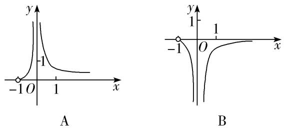
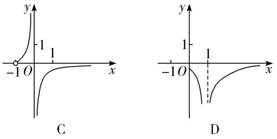

专题14　两个经典不等式的应用

逻辑推理是得到数学结论，构建数学体系的重要方式，是数学严谨性的基本保证．利用两个经典不等式解决问题，降低了思考问题的难度，优化了推理和运算过程．

1．对数形式：*x*≥1＋ln*x*(*x*>0)，当且仅当*x*＝1时，等号成立．

2．指数形式：e<em>x</em>≥<em>x</em>＋1(<em>x</em>∈<strong>R</strong>)，当且仅当<em>x</em>＝0时，等号成立．

进一步可得到一组不等式链：e<em>x</em>&gt;<em>x</em>＋1&gt;<em>x</em>&gt;1＋ln<em>x</em>(<em>x</em>&gt;0，且<em>x</em>≠1)．

注意：选填题可直接使用，解答题必须先证明后再使用．

考点一　两个经典不等式的应用

1．对数形式：*x*≥1＋ln*x*(*x*>0)，当且仅当*x*＝1时，等号成立．
证明　由题意知*x*>0，令*f*(*x*)＝*x*－1－ln *x*，所以*f*′(*x*)＝1－＝，
所以当*f*′(*x*)>0时，*x*>1；当*f*′(*x*)<0时，0<*x*<1，
故*f*(*x*)在(0，1)上单调递减，在(1，＋∞)上单调递增，
所以*f*(*x*)有最小值*f*（1）＝0，故有*f*(*x*)＝*x*－1－ln *x*≥*f*（1）＝0，即ln *x*≤*x*－1成立．

2．指数形式：e<em>x</em>≥<em>x</em>＋1(<em>x</em>∈<strong>R</strong>)，当且仅当<em>x</em>＝0时，等号成立．
证明　设<em>f</em>(<em>x</em>)＝e<em>x</em>－<em>x</em>－1，则<em>f</em>′(<em>x</em>)＝e<em>x</em>－1，由<em>f</em>′(<em>x</em>)＝0，得<em>x</em>＝0，
所以当*x*<0时，*f*′(*x*)<0；当*x*>0时，*f*′(*x*)>0，
所以*f*(*x*)在(－∞，0)上单调递减，在(0，＋∞)上单调递增，
所以<em>f</em>(<em>x</em>)≥<em>f</em>（0）＝0，即e<em>x</em>－<em>x</em>－1≥0，所以e<em>x</em>≥<em>x</em>＋1．

【例题选讲】

<strong>[例1]</strong>　（1）已知对任意<em>x</em>，都有<em>x</em>e2<em>x</em>－<em>ax</em>－<em>x</em>≥1＋ln<em>x</em>，则实数<em>a</em>的取值范围是\_\_\_\_\_\_\_\_．
答案　(－∞，1]　解析　根据题意可知，<em>x</em>&gt;0，由<em>x</em>·e2<em>x</em>－<em>ax</em>－<em>x</em>≥1＋ln <em>x</em>，可得<em>a</em>≤e2<em>x</em>－－1(<em>x</em>&gt;0)恒成立，令<em>f</em>(<em>x</em>)＝e2<em>x</em>－－1，则<em>a</em>≤<em>f</em>(<em>x</em>)min，现证明e<em>x</em>≥<em>x</em>＋1恒成立，设<em>g</em>(<em>x</em>)＝e<em>x</em>－<em>x</em>－1，<em>g</em>′(<em>x</em>)＝e<em>x</em>－1，当<em>g</em>′(<em>x</em>)＝0时，解得<em>x</em>＝0，当<em>x</em>&lt;0时，<em>g</em>′(<em>x</em>)&lt;0，<em>g</em>(<em>x</em>)单调递减，当<em>x</em>&gt;0时，<em>g</em>′(<em>x</em>)&gt;0，<em>g</em>(<em>x</em>)单调递增，故当<em>x</em>＝0时，函数<em>g</em>(<em>x</em>)取得最小值，<em>g</em>（0）＝0，所以<em>g</em>(<em>x</em>)≥<em>g</em>（0）＝0，即e<em>x</em>－<em>x</em>－1≥0⇔e<em>x</em>≥<em>x</em>＋1恒成立，<em>f</em>(<em>x</em>)＝e2<em>x</em>－－1＝－1＝－1≥－1＝1，所以<em>f</em>(<em>x</em>)min＝1，即<em>a</em>≤1．所以实数<em>a</em>的取值范围是(－∞，1]．  
（2）已知函数<em>f</em>(<em>x</em>)＝e<em>x</em>－<em>ax</em>－1，<em>g</em>(<em>x</em>)＝ln <em>x</em>－<em>ax</em>－1，其中0&lt;<em>a</em>&lt;1，e为自然对数的底数，若∃<em>x</em>0∈(0，＋∞)，使<em>f</em>(<em>x</em>0)<em>g</em>(<em>x</em>0)&gt;0，则实数<em>a</em>的取值范围是\_\_\_\_\_\_\_\_．
答案　　解析　令<em>M</em>(<em>x</em>)＝e<em>x</em>－<em>x</em>－1，<em>x</em>∈(0，＋∞)，则<em>M</em>′(<em>x</em>)＝e<em>x</em>－1，当<em>x</em>∈(0，＋∞)时，<em>M</em>′(<em>x</em>)&gt;0，所以<em>M</em>(<em>x</em>)在(0，＋∞)上单调递增，所以<em>M</em>(<em>x</em>)&gt;<em>M</em>（0）＝0，所以e<em>x</em>&gt;<em>x</em>＋1．由于0&lt;<em>a</em>&lt;1，所以当<em>x</em>∈(0，＋∞)时，<em>f</em>(<em>x</em>)＝e<em>x</em>－<em>ax</em>－1&gt;0，故若∃<em>x</em>0∈(0，＋∞)，使<em>f</em>(<em>x</em>0)<em>g</em>(<em>x</em>0)&gt;0，转化为∃<em>x</em>0∈(0，＋∞)，<em>g</em>(<em>x</em>0)&gt;0，则<em>g</em>(<em>x</em>0)＝ln <em>x</em>0－<em>ax</em>0－1&gt;0，即<em>a</em>&lt;－．令<em>h</em>(<em>x</em>)＝－，<em>h</em>′(<em>x</em>)＝．当<em>x</em>∈(0，e2)时，<em>h</em>′(<em>x</em>)&gt;0，当<em>x</em>∈(e2，＋∞)时，<em>h</em>′(<em>x</em>)&lt;0，所以函数<em>h</em>(<em>x</em>)在(0，e2)上单调递增，在(e2，＋∞)上单调递减．所以<em>h</em>(<em>x</em>)≤<em>h</em>(e2)＝－＝．所以0&lt;<em>a</em>&lt;，即<em>a</em>∈．

<strong>[例2]</strong>　函数<em>f</em>(<em>x</em>)＝ln(<em>x</em>＋1)－<em>ax</em>，<em>g</em>(<em>x</em>)＝1－e<em>x</em>．  
（1）讨论函数*f*(*x*)的单调性；  
（2）若*f*(*x*)≥*g*(*x*)在*x*∈[0，＋∞)上恒成立，求实数*a*的取值范围．
解析　（1）函数*f*(*x*)的定义域为*x*∈(－1，＋∞)，*f*′(*x*)＝－*a*＝．

(ⅰ)当*a*＝0时，*f*′(*x*)>0，*f*(*x*)在(－1，＋∞)上单调递增；
(ⅱ)当*a*≠0时，令*f*′(*x*)＝0得*x*＝＝－1，若*a*<0，则－1<－1，若*a*>0，则－1>－1．

①当*a*<0时，*f*′(*x*)＝－*a*>0，函数*f*(*x*)在(－1，＋∞)上单调递增；
当*a*>0时，*f*′(*x*)＝，所以当*x*∈时，*f*′(*x*)>0，*f*(*x*)单调递增，
当*x*∈时，*f*′(*x*)<0，*f*(*x*)单调递减，

综上可得，当*a*≤0时，*f*(*x*)在(－1，＋∞)上单调递增；当*a*>0时，*f*(*x*)在上单调递增，
在上单调递减．  
（2）设函数<em>h</em>(<em>x</em>)＝<em>f</em>(<em>x</em>)－<em>g</em>(<em>x</em>)＝ln(<em>x</em>＋1)＋e<em>x</em>－<em>ax</em>－1，<em>x</em>≥0，则<em>h</em>′(<em>x</em>)＝＋e<em>x</em>－<em>a</em>，
当<em>a</em>≤2时，由e<em>x</em>≥<em>x</em>＋1得<em>h</em>′(<em>x</em>)＝＋e<em>x</em>－<em>a</em>≥＋<em>x</em>＋1－<em>a</em>≥0，
于是，*h*(*x*)在[0，＋∞)上单调递增，所以*h*(*x*)≥*h*（0）＝0恒成立，符合题意；
当*a*>2时，由于*x*≥0，*h*（0）＝0，令函数*m*(*x*)＝*h*′(*x*)，
则<em>m</em>′(<em>x</em>)＝－＋e<em>x</em>(<em>x</em>≥0)．所以<em>m</em>′(<em>x</em>)≥0，
故<em>h</em>′(<em>x</em>)在[0，＋∞)上单调递增，而<em>h</em>′（0）＝2－<em>a</em>&lt;0．则存在一个<em>x</em>0&gt;0，使得<em>h</em>′(<em>x</em>0)＝0，
所以当<em>x</em>∈[0，<em>x</em>0)时，<em>h</em>(<em>x</em>)单调递减，故<em>h</em>(<em>x</em>0)&lt;<em>h</em>（0）＝0，不符合题意．

综上，实数*a*的取值范围为(－∞，2]．

<strong>[例3]</strong>　已知函数<em>f</em>(<em>x</em>)＝e<em>x</em>－<em>a</em>．  
（1）若函数*f*(*x*)的图象与直线*l*：*y*＝*x*－1相切，求*a*的值；  
（2）若*f*(*x*)－ln*x*>0恒成立，求整数*a*的最大值．
解析　（1）<em>f</em>′(<em>x</em>)＝e<em>x</em>，因为函数<em>f</em>(<em>x</em>)的图象与直线<em>y</em>＝<em>x</em>－1相切，
所以令<em>f</em>′(<em>x</em>)＝1，即e<em>x</em>＝1，得<em>x</em>＝0，∴切点坐标为(0，－1)，则<em>f</em>（0）＝1－<em>a</em>＝－1，∴<em>a</em>＝2．  
（2）先证明e<em>x</em>≥<em>x</em>＋1，设<em>F</em>(<em>x</em>)＝e<em>x</em>－<em>x</em>－1，则<em>F</em>′(<em>x</em>)＝e<em>x</em>－1，令<em>F</em>′(<em>x</em>)＝0，则<em>x</em>＝0，
当*x*∈(0，＋∞)时，*F*′(*x*)>0；当*x*∈(－∞，0)时，*F*′(*x*)<0．
所以*F*(*x*)在(0，＋∞)上单调递增，在(－∞，0)上单调递减，
所以<em>F</em>(<em>x</em>)min＝<em>F</em>（0）＝0，即<em>F</em>(<em>x</em>)≥0恒成立．∴e<em>x</em>≥<em>x</em>＋1，从而e<em>x</em>－2≥<em>x</em>－1(<em>x</em>＝0时取等号)．

以ln <em>x</em>代换<em>x</em>得ln <em>x</em>≤<em>x</em>－1(当<em>x</em>＝1时，等号成立)，所以e<em>x</em>－2&gt;ln <em>x</em>．
当<em>a</em>≤2时，ln <em>x</em>&lt;e<em>x</em>－2≤e<em>x</em>－<em>a</em>，则当<em>a</em>≤2时，<em>f</em>(<em>x</em>)－ln <em>x</em>&gt;0恒成立．
当<em>a</em>≥3时，存在<em>x</em>，使e<em>x</em>－<em>a</em>&lt;ln <em>x</em>，即e<em>x</em>－<em>a</em>&gt;ln <em>x</em>不恒成立．

综上，整数*a*的最大值为2．

<strong>[例4]</strong>　已知函数<em>f</em>(<em>x</em>)＝<em>x</em>2－(<em>a</em>－2)<em>x</em>－<em>a</em>ln<em>x</em>(<em>a</em>∈<strong>R</strong>)．  
（1）求函数*y*＝*f*(*x*)的单调区间；  
（2）当<em>a</em>＝1时，证明：对任意的<em>x</em>&gt;0，<em>f</em>(<em>x</em>)＋e<em>x</em>&gt;<em>x</em>2＋<em>x</em>＋2．
解析　（1）函数*f*(*x*)的定义域是(0，＋∞)，*f*′(*x*)＝2*x*－(*a*－2)－＝，
当*a*≤0时，*f*′(*x*)>0对任意*x*∈(0，＋∞)恒成立，∴函数*f*(*x*)在区间(0，＋∞)上单调递增；
当*a*>0时，由*f*′(*x*)>0得*x*>，由*f*′(*x*)<0，得0<*x*<，
∴函数*f*(*x*)在区间上单调递增，在区间上单调递减．  
（2）当<em>a</em>＝1时，<em>f</em>(<em>x</em>)＝<em>x</em>2＋<em>x</em>－ln <em>x</em>，要证明<em>f</em>(<em>x</em>)＋e<em>x</em>&gt;<em>x</em>2＋<em>x</em>＋2，

只需证明e<em>x</em>－ln <em>x</em>－2 &gt;0，先证明当<em>x</em>&gt;0时，e<em>x</em>&gt;<em>x</em>＋1，
令<em>g</em>(<em>x</em>)＝e<em>x</em>－<em>x</em>－1(<em>x</em>&gt;0)，则<em>g</em>′(<em>x</em>)＝e<em>x</em>－1，当<em>x</em>&gt;0时，<em>g</em>′(<em>x</em>)&gt;0，<em>g</em>(<em>x</em>)单调递增，
∴当<em>x</em>&gt;0时，<em>g</em>(<em>x</em>)&gt;<em>g</em>（0）＝0即e<em>x</em>&gt;<em>x</em>＋1，∴e<em>x</em>－ln <em>x</em>－2&gt;<em>x</em>＋1－ln <em>x</em>－2＝<em>x</em>－ln <em>x</em>－1．
∴只要证明*x*－ln *x*－1≥0(*x*>0)，令*h*(*x*)＝*x*－ln *x*－1(*x*>0)，
则*h*′(*x*)＝1－＝(*x*>0)，易知*h*(*x*)在(0，1]上单调递减，在[1，＋∞)上单调递增，
∴*h*(*x*)≥*h*（1）＝0即*x*－ln *x*－1≥0成立，
∴<em>f</em>(<em>x</em>)＋e<em>x</em>&gt;<em>x</em>2＋<em>x</em>＋2成立．

<strong>[例5]</strong>　已知函数<em>f</em>(<em>x</em>)＝<em>x</em>－1－<em>a</em> ln<em>x</em>．  
（1）若*f*(*x*)≥0，求*a*的值；  
（2）证明：对于任意正整数*n*，·…·<e．
解析　（1）*f*(*x*)的定义域为(0，＋∞)，

①若*a*≤0，因为*f*＝－＋*a* ln2<0，所以不满足题意；
②若*a*>0，由*f*′(*x*)＝1－＝知，
当*x*∈(0，*a*)时，*f*′(*x*)<0；当*x*∈(*a*，＋∞)时，*f*′(*x*)>0；
所以*f*(*x*)在(0，*a*)单调递减，在(*a*，＋∞)单调递增，
故*x*＝*a*是*f*(*x*)在(0，＋∞)的唯一最小值点．
因为*f*（1）＝0，所以当且仅当*a*＝1时，*f*(*x*)≥0，故*a*＝1．  
（2）由（1）知当*x*∈(1，＋∞)时，*x*－1－ln *x*>0．
令*x*＝1＋，得ln <．
从而ln ＋ln ＋…＋ln <＋＋…＋＝1－<1．
故·…·<e．

【对点训练】

1．已知函数<em>f</em>(<em>x</em>)＝e<em>x</em>，<em>x</em>∈<strong>R</strong>．证明：曲线<em>y</em>＝<em>f</em>(<em>x</em>)与曲线<em>y</em>＝<em>x</em>2＋<em>x</em>＋1有唯一公共点．

1．解析　令<em>g</em>(<em>x</em>)＝<em>f</em>(<em>x</em>)－＝e<em>x</em>－<em>x</em>2－<em>x</em>－1，<em>x</em>∈<strong>R</strong>，则<em>g</em>′(<em>x</em>)＝e<em>x</em>－<em>x</em>－1，
由经典不等式e<em>x</em>≥<em>x</em>＋1恒成立可知，<em>g</em>′(<em>x</em>)≥0恒成立，所以<em>g</em>(<em>x</em>)在<strong>R</strong>上为单调递增函数，且<em>g</em>（0）＝0．
所以函数*g*(*x*)有唯一零点，即两曲线有唯一公共点．

2．(2018·全国Ⅰ改编)已知函数<em>f</em>(<em>x</em>)＝<em>a</em>e<em>x</em>－ln<em>x</em>－1．  
（1）设*x*＝2是*f*(*x*)的极值点，求*a*的值并求*f*(*x*)的单调区间；  
（2）求证：当*a*＝时，*f*(*x*)≥0．

2．解析　（1）<em>f</em>(<em>x</em>)的定义域为(0，＋∞)，<em>f</em>′(<em>x</em>)＝<em>a</em>·e<em>x</em>－，由题设知，<em>f</em>′（2）＝<em>a</em>·e2－＝0，所以<em>a</em>＝，
从而<em>f</em>(<em>x</em>)＝e<em>x</em>－ln<em>x</em>－1，<em>f</em>′(<em>x</em>)＝e<em>x</em>－(<em>x</em>&gt;0)．
因为<em>f</em>′(<em>x</em>)＝e<em>x</em>－在(0，＋∞)上是增函数，且<em>f</em>′（2）＝0，所以当0&lt;<em>x</em>&lt;2时，<em>f</em>′(<em>x</em>)&lt;0；当<em>x</em>&gt;2时，<em>f</em>′(<em>x</em>)&gt;0．
所以*f*(*x*)在(0，2)上单调递减，在(2，＋∞)上单调递增．  
（2）当*a*＝时，*f*(*x*)＝－ln*x*－1，所以只要证明－ln*x*－1≥0即可．
设<em>g</em>(<em>x</em>)＝e<em>x</em>－e<em>x</em>(<em>x</em>&gt;0)，则<em>g</em>′(<em>x</em>)＝e<em>x</em>－e(<em>x</em>&gt;0)，可知<em>g</em>(<em>x</em>)在(0，1]上是减函数，在[1，＋∞)上是增函数，
所以<em>g</em>(<em>x</em>)≥<em>g</em>（1）＝0，即e<em>x</em>≥e<em>x</em>⇒≥<em>x</em>．又由e<em>x</em>≥e<em>x</em>(<em>x</em>&gt;0)⇒<em>x</em>≥1＋ln<em>x</em>(<em>x</em>&gt;0)，
所以－ln*x*－1≥*x*－ln*x*－1≥0，所以－ln*x*－1≥0得证，
所以当*a*＝时，*f*(*x*)≥0．

3．(2020·山东)已知函数<em>f</em>(<em>x</em>)＝<em>a</em>e<em>x</em>－1－ln<em>x</em>＋ln<em>a</em>．  
（1）当*a*＝e时，求曲线*y*＝*f*(*x*)在点(1，*f*（1）)处的切线与两坐标轴围成的三角形的面积；  
（2）若*f*(*x*)≥1，求*a*的取值范围．

3．解析　<em>f</em>(<em>x</em>)的定义域为(0，＋∞)，<em>f</em>′(<em>x</em>)＝<em>a</em>e<em>x</em>－1－．  
（1）当<em>a</em>＝e时，<em>f</em>(<em>x</em>)＝e<em>x</em>－ln <em>x</em>＋1，<em>f</em>′（1）＝e－1，

曲线*y*＝*f*(*x*)在点(1，*f*（1）)处的切线方程为*y*－(e＋1)＝(e－1)(*x*－1)，即*y*＝(e－1)*x*＋2．

直线*y*＝(e－1)*x*＋2在*x*轴、*y*轴上的截距分别为，2．因此所求三角形的面积为．  
（2）当0<*a*<1时，*f*（1）＝*a*＋ln *a*<1．
当<em>a</em>＝1时，<em>f</em>(<em>x</em>)＝e<em>x</em>－1－ln <em>x</em>，<em>f</em>′(<em>x</em>)＝e<em>x</em>－1－．
当*x*∈(0，1)时，*f*′(*x*)<0；当*x*∈(1，＋∞)时，*f*′(*x*)>0．
所以当*x*＝1时，*f*(*x*)取得最小值，最小值为*f*（1）＝1，从而*f*(*x*)≥1．
当<em>a</em>&gt;1时，<em>f</em>(<em>x</em>)＝<em>a</em>e<em>x</em>－1－ln <em>x</em>＋ln <em>a</em>&gt;e<em>x</em>－1－ln <em>x</em>≥1．

综上，*a*的取值范围是[1，＋∞)．

4．已知函数<em>f</em>(<em>x</em>)＝<em>a</em>e<em>x</em>＋2<em>x</em>－1(其中常数e＝2．718 28…是自然对数的底数)．  
（1）讨论函数*f*(*x*)的单调性；  
（2）证明：对任意的*a*≥1，当*x*>0时，*f*(*x*)≥(*x*＋*a*e)*x*．

4．解析　（1）由<em>f</em>(<em>x</em>)＝<em>a</em>e<em>x</em>＋2<em>x</em>－1，得<em>f</em>′(<em>x</em>)＝<em>a</em>e<em>x</em>＋2．

①当<em>a</em>≥0时，<em>f</em>′(<em>x</em>)&gt;0，函数<em>f</em>(<em>x</em>)在<strong>R</strong>上单调递增；
②当*a*<0时，由*f*′(*x*)>0，解得*x*<ln，由*f*′(*x*)<0，解得*x*>ln，
故*f*(*x*)在上单调递增，在上单调递减．
综上所述，当<em>a</em>≥0时，函数<em>f</em>(<em>x</em>)在<strong>R</strong>上单调递增；
当*a*<0时，*f*(*x*)在上单调递增，在上单调递减．  
（2）对任意*a*≥1，当*x*>0时，*f*(*x*)≥(*x*＋*a*e)*x*⇔－－＋－e≥0．
令*g*(*x*)＝－－＋－e，则*g*′(*x*)＝．
当<em>a</em>≥1时，<em>a</em>e<em>x</em>－<em>x</em>－1≥e<em>x</em>－<em>x</em>－1．
令<em>h</em>(<em>x</em>)＝e<em>x</em>－<em>x</em>－1，则当<em>x</em>&gt;0时，<em>h</em>′(<em>x</em>)＝e<em>x</em>－1&gt;0．
∴当<em>x</em>&gt;0时，<em>h</em>(<em>x</em>)单调递增，<em>h</em>(<em>x</em>)&gt;<em>h</em>（0）＝0．∴<em>a</em>e<em>x</em>－<em>x</em>－1&gt;0．
∴当0<*x*<1时，*g*′(*x*)<0；当*x*＝1时，*g*′(*x*)＝0；当*x*>1时，*g*′(*x*)>0．
∴*g*(*x*)在(0，1)上单调递减，在(1，＋∞)上单调递增，
∴*g*(*x*)≥*g*（1）＝0，即－－＋－e≥0，故*f*(*x*)≥(*x*＋*a*e)*x*．

5．已知函数<em>f</em>(<em>x</em>)＝<em>a</em>ln<em>x</em>＋1(<em>a</em>∈<strong>R</strong>)．  
（1）若*g*(*x*)＝*x*－*f*(*x*)，讨论函数*g*(*x*)的单调性；  
（2）若<em>t</em>(<em>x</em>)＝<em>x</em>2＋<em>x</em>，<em>h</em>(<em>x</em>)＝e<em>x</em>－1(其中e是自然对数的底数)，且<em>a</em>＝1，<em>x</em>∈(0，＋∞)，求证：<em>h</em>(<em>x</em>)&gt;<em>t</em>(<em>x</em>)&gt;<em>f</em>(<em>x</em>)．

5．解析　（1）由题意得，*g*(*x*)＝*x*－*f*(*x*)＝*x*－*a*ln *x*－1，

其定义域为(0，＋∞)，*g*′(*x*)＝1－＝，
当*a*≤0时，*g*′(*x*)>0在(0，＋∞)上恒成立，则函数*g*(*x*)在(0，＋∞)上单调递增；
当*a*>0时，易得函数*g*(*x*)在(0，*a*)上单调递减，在(*a*，＋∞)上单调递增．  
（2）设<em>u</em>(<em>x</em>)＝<em>h</em>(<em>x</em>)－<em>t</em>(<em>x</em>)＝e<em>x</em>－1－<em>x</em>2－<em>x</em>，则<em>u</em>′(<em>x</em>)＝e<em>x</em>－<em>x</em>－1，
设<em>m</em>(<em>x</em>)＝<em>u</em>′(<em>x</em>)＝e<em>x</em>－<em>x</em>－1，则<em>m</em>′(<em>x</em>)＝e<em>x</em>－1，
当*x*>0时，*m*′(*x*)>0恒成立，则*m*(*x*)在(0，＋∞)上单调递增，
∴*m*(*x*)>*m*（0）＝0，则*u*(*x*)在(0，＋∞)上单调递增，∴*u*(*x*)>*u*（0）＝0，
∴*h*(*x*)－*t*(*x*)>0在(0，＋∞)上恒成立，即*h*(*x*)>*t*(*x*)．
当<em>a</em>＝1时，设<em>v</em>(<em>x</em>)＝<em>t</em>(<em>x</em>)－<em>x</em>＝<em>x</em>2，
∵当*x*>0时，*v*(*x*)>0，即*t*(*x*)>*x*．设*s*(*x*)＝*x*－ln *x*－1，则*s*′(*x*)＝1－＝．

易得*s*(*x*)在(0，1)上单调递减，在(1，＋∞)上单调递增，
∴*s*(*x*)≥*s*（1）＝0，∴*x*≥ln *x*＋1＝*f*(*x*)∴*t*(*x*)>*x*≥*f*(*x*)，即*t*(*x*)>*f*(*x*)，
综上所述，*h*(*x*)>*t*(*x*)>*f*(*x*)．

6．已知函数*f* (*x*)＝*kx*－ln*x*－1(*k*>0)．  
（1）若函数*f* (*x*)有且只有一个零点，求实数*k*的值；  
（2）证明：当<em>n</em>∈<strong>N</strong>\*时，1＋＋＋…＋&gt;ln(<em>n</em>＋1)．

6．<strong>解析</strong>　（1）法一：<em>f</em> (<em>x</em>)＝<em>kx</em>－ln <em>x</em>－1，<em>f</em> ′(<em>x</em>)＝<em>k</em>－＝(<em>x</em>&gt;0，<em>k</em>&gt;0)，
当0<*x*<时，*f* ′(*x*)<0；当*x*>时，*f* ′(*x*)>0．∴*f* (*x*)在(0，)上单调递减，在(，＋∞)上单调递增．
∴<em>f</em> (<em>x</em>)min＝<em>f</em> ＝ln <em>k</em>，∵<em>f</em> (<em>x</em>)有且只有一个零点，∴ln <em>k</em>＝0，∴<em>k</em>＝1．

法二：由题意知方程*kx*－ln *x*－1＝0仅有一个实根，由*kx*－ln *x*－1＝0，得*k*＝(*x*>0)，
令*g*(*x*)＝(*x*>0)，*g*′(*x*)＝，当0<*x*<1时，*g*′(*x*)>0；当*x*>1时，*g*′(*x*)<0．
∴<em>g</em>(<em>x</em>)在(0,1)上单调递增，在(1，＋∞)上单调递减，∴<em>g</em>(<em>x</em>)max＝<em>g</em>（1）＝1，当<em>x</em>→＋∞时，<em>g</em>(<em>x</em>)→0，
∴要使*f* (*x*)仅有一个零点，则*k*＝1．

法三：函数<em>f</em> (<em>x</em>)有且只有一个零点，即直线<em>y</em>＝<em>kx</em>与曲线<em>y</em>＝ln <em>x</em>＋1相切，设切点为(<em>x</em>0，<em>y</em>0)，
由<em>y</em>＝ln <em>x</em>＋1，得<em>y</em>′＝，∴∴<em>k</em>＝<em>x</em>0＝<em>y</em>0＝1，∴实数<em>k</em>的值为1．  
（2）由（1）知*x*－ln *x*－1≥0，即*x*－1≥ln *x*，当且仅当*x*＝1时取等号，
∵<em>n</em>∈<strong>N</strong>\*，令<em>x</em>＝，得&gt;ln，∴1＋＋＋…＋&gt;ln＋ln＋…＋ln＝ln(<em>n</em>＋1)，
故1＋＋＋…＋>ln(*n*＋1)．

考点二　经典不等式的变形不等式的应用

【例题选讲】

[例1]　证明下列不等式  
（1）e<em>x</em>－1≥<em>x</em>；（2）ln(<em>x</em>＋1)≤<em>x</em>；（3）&lt;ln(1＋<em>x</em>) (<em>x</em>&gt;0)；（4）e<em>x</em>－ln(<em>x</em>＋2)&gt;0．
解析　（1）方法一　令<em>f</em>(<em>x</em>)＝e<em>x</em>－1－<em>x</em>，则<em>f</em>′(<em>x</em>)＝e<em>x</em>－1－1．
若*x*<1，则*f*′(*x*)<0，*f*(*x*)在(－∞，1)上单调递减；若*x*>1，则*f*′(*x*)>0，*f*(*x*)在(1，＋∞)上单调递增．
∴<em>f</em>(<em>x</em>)min＝<em>f</em>（1）＝0，∴<em>f</em>(<em>x</em>)≥0，∴e<em>x</em>－1≥<em>x</em>．
方法二　令<em>t</em>＝<em>x</em>－1，则<em>x</em>＝<em>t</em>＋1．由e<em>t</em>≥<em>t</em>＋1，得e<em>x</em>－1≥<em>x</em>．  
（2）由题意知*x*>－1，令*f*(*x*)＝ln(*x*＋1)－*x*，所以*f*′(*x*)＝－1＝，
所以当*f*′(*x*)>0时，－1<*x*<0；当*f*′(*x*)<0时，*x*>0，
故*f*(*x*)在(－1，0)上单调递增，在(0，＋∞)上单调递减，
所以*f*(*x*)有最大值*f*（0）＝0，故有*f*(*x*)＝ln(*x*＋1)－*x*≤*f*（0）＝0，即ln(*x*＋1)≤*x*成立．  
（3）方法一　构造函数*f*(*x*)＝ln(1＋*x*)－，则*g*（0）＝0．
当*x*>0时，*f*′(*x*)＝－＝>0．
即当*x*>0时，函数*f*(*x*)单调递增．即*f*(*x*)>*f*（0）＝0．
故*f*(*x*)＝ln(1＋*x*)－>0，即<ln(1＋*x*)．
方法二　∵ln *x*≤*x*－1，且当*x*＝1时等号成立．
∴ln <－1(*x*>0)，即ln <，∴<ln(*x*＋1)．  
（4）令<em>f</em>(<em>x</em>)＝e<em>x</em>－<em>x</em>－1，则<em>f</em>′(<em>x</em>)＝e<em>x</em>－1，令<em>f</em>′(<em>x</em>)＝0，得<em>x</em>＝0，
当*x*<0时，*f*′(*x*)<0，*f*(*x*)单调递减，当*x*>0时，*f*′(*x*)>0，*f*(*x*)单调递增，
∴<em>f</em>(<em>x</em>)≥<em>f</em>（0）＝0，即e<em>x</em>－<em>x</em>－1≥0，
∴e<em>x</em>≥<em>x</em>＋1(当且仅当<em>x</em>＝0时，等号成立)．①
令*g*(*x*)＝*x*＋1－ln(*x*＋2)，则*g*′(*x*)＝1－＝(*x*>－2)，

易知*g*(*x*)在(－2，－1)上单调递减，在(－1，＋∞)上单调递增，
∴*g*(*x*)≥*g*(－1)＝0，即*x*＋1－ln(*x*＋2)≥0，即*x*＋1≥ln(*x*＋2)(当且仅当*x*＝－1时，等号成立)．②
∵①和②中的等号不能同时成立，∴由①和②得e<em>x</em>&gt;ln(<em>x</em>＋2)，即e<em>x</em>－ln(<em>x</em>＋2)&gt;0．

<strong>[例2]</strong>　（1）已知函数<em>f</em>(<em>x</em>)＝，则<em>y</em>＝<em>f</em>(<em>x</em>)的图象大致为(　　)

  
（1）答案　<strong>B</strong>　解析　因为<em>f</em>(<em>x</em>)的定义域为{<em>x</em>|<em>x</em>&gt;－1，且<em>x</em>≠0}，所以排除选项D．当<em>x</em>&gt;0时，由经典不等式<em>x</em>&gt;1＋ln<em>x</em>(<em>x</em>&gt;0)，以<em>x</em>＋1代替<em>x</em>，得<em>x</em>&gt;ln(<em>x</em>＋1)(<em>x</em>&gt;－1，且<em>x</em>≠0)，所以ln(<em>x</em>＋1)－<em>x</em>&lt;0(<em>x</em>&gt;－1，且<em>x</em>≠0)，即<em>x</em>&gt;0或－1&lt;<em>x</em>&lt;0时均有<em>f</em>(<em>x</em>)&lt;0，排除A、C，易知B正确．  
（2）函数<em>f</em>(<em>x</em>)＝e<em>x</em>－1－<em>ax</em>2＋(<em>a</em>－1)<em>x</em>＋<em>a</em>2在(－∞，＋∞)上单调递增，则实数<em>a</em>的取值范围是(　　)

A．{1}　　　　　　　　
B．{－1，1}　　　　　　　　
C．{0，1}　　　　　　　
D．{－1，0}
答案　A　解析　<em>f</em>′(<em>x</em>)＝e<em>x</em>－1－<em>ax</em>＋(<em>a</em>－1)≥0恒成立，即e<em>x</em>－1≥<em>ax</em>－(<em>a</em>－1)恒成立，由于：e<em>x</em>≥<em>x</em>＋1，即e<em>x</em>－1≥<em>x</em>，∴只需要<em>x</em>≥<em>ax</em>－(<em>a</em>－1)，即(<em>a</em>－1)(<em>x</em>－1)≤0恒成立，所以<em>a</em>＝1．

<strong>[例3]</strong>　设函数<em>f</em>(<em>x</em>)＝ln<em>x</em>－<em>x</em>＋1．  
（1）讨论*f*(*x*)的单调性；  
（2）证明：当*x*∈(1，＋∞)时，1<<*x*．
解析　（1）由题意知，*f*(*x*)的定义域为(0，＋∞)，*f*′(*x*)＝－1，令*f*′(*x*)＝0，解得*x*＝1．
当0<*x*<1时，*f*′(*x*)>0，*f*(*x*)单调递增；当*x*>1时，*f*′(*x*)<0，*f*(*x*)单调递减．  
（2）由（1）知*f*(*x*)在*x*＝1处取得最大值，最大值为*f*（1）＝0．
所以当*x*≠1时，ln *x*<*x*－1．故当*x*∈(1，＋∞)时，ln *x*<*x*－1，ln <－1，即1<<*x*．

<strong>[例4]</strong>　已知函数<em>f</em>(<em>x</em>)＝ln(1＋<em>x</em>)．  
（1）求证：当*x*∈(0，＋∞)时，<*f*(*x*)<*x*；  
（2）已知e为自然对数的底数，证明：∀<em>n</em>∈<strong>N</strong>\*，&lt;·…·&lt;e．
解析　（1）令*g*(*x*)＝*f*(*x*)－＝ln(1＋*x*)－(*x*>0)，则*g*′(*x*)＝－＝>0(*x*>0)．
∴*g*(*x*)在(0，＋∞)上单调递增，∴当*x*∈(0，＋∞)时，*g*(*x*)>*g*（0）＝0，即*f*(*x*)>成立．
令*h*(*x*)＝*f*(*x*)－*x*＝ln(1＋*x*)－*x*(*x*>0)，则*h*′(*x*)＝－1＝－<0(*x*>0)，
∴*h*(*x*)在(0，＋∞)上单调递减，∴当*x*∈(0，＋∞)时，*h*(*x*)<*h*（0）＝0，即*f*(*x*)<*x*成立．
综上所述，当*x*∈(0，＋∞)时，<*f*(*x*)<*x*成立．  
（2）由（1）可知，ln(1＋*x*)<*x*对*x*∈(0，＋∞)都成立．
∴ln＋ln＋…＋ln<＋＋…＋，
即ln<＝．
∵<em>n</em>∈<strong>N</strong>\*，∴＝＋≤＋＝1．
∴ln<1．∴·…·<e．
又由（1）可知，ln(1＋*x*)>对*x*∈(0，＋∞)都成立，∴ln>＝(*k*＝1，2，…，*n*)．
∴ln＝ln＋ln＋…＋ln>＋＋…＋≥＋＋…＋＝＝．
∴ln>．∴·…·>．
∴<·…·<e．

【对点训练】

1．已知函数<em>f</em>(<em>x</em>)＝ln<em>x</em>＋，<em>a</em>∈<strong>R</strong>．  
（1）讨论函数*f*(*x*)的单调性；  
（2）当*a*>0时，证明：*f*(*x*)≥．

1．解析　（1） *f*′(*x*)＝－＝(*x*>0)．
当*a*≤0时，*f*′(*x*)>0，*f*(*x*)在(0，＋∞)上单调递增．
当*a*>0时，若*x*>*a*，则*f*′(*x*)>0，函数*f*(*x*)在(*a*，＋∞)上单调递增；
若0<*x*<*a*，则*f*′(*x*)<0，函数*f*(*x*)在(0，*a*)上单调递减．  
（2）由（1）知，当<em>a</em>&gt;0时，<em>f</em>(<em>x</em>)min＝<em>f</em>(<em>a</em>)＝ln<em>a</em>＋1．
要证*f*(*x*)≥，只需证ln *a*＋1≥，即证ln *a*＋－1≥0．
令函数*g*(*a*)＝ln *a*＋－1，则*g*′(*a*)＝－＝(*a*>0)，
当0<*a*<1时，*g*′(*a*)<0，当*a*>1时，*g*′(*a*)>0，
所以<em>g</em>(<em>a</em>)在(0，1)上单调递减，在(1，＋∞)上单调递增，所以<em>g</em>(<em>a</em>)min＝<em>g</em>（1）＝0．
所以ln *a*＋－1≥0恒成立，所以*f*(*x*)≥．

2．已知函数*f*(*x*)＝*x*ln*x*，*g*(*x*)＝*x*－1．  
（1）求*F*(*x*)＝*g*(*x*)－*f*(*x*)的单调区间和最值；  
（2）证明：对大于1的任意自然数*n*，都有＋＋＋…＋＜ln*n*．

2．解析　（1）由*F*(*x*)＝*x*－1－*x*ln *x*，*x*>0，则*F*′(*x*)＝－ln *x*，
所以当*x*＞1时，*F*′(*x*)＝－ln *x*＜0，当0＜*x*＜1时，*F*′(*x*)＝－ln *x*＞0，
所以当*x*＝1时，*F*(*x*)取最大值*F*（1）＝0.
即当*x*≠1时，*F*(*x*)＜0，当*x*＝1时，*F*(*x*)＝0，
所以*F*(*x*)在(0，1)上是单调增函数，在(1，＋∞)上是单调减函数，
当*x*＝1时，*F*(*x*)取最大值*F*（1）＝0，无最小值．  
（2）由（1）可知，*x*ln *x*＞*x*－1对任意*x*＞0且*x*≠1恒成立．
故1－＜ln <em>x</em>，取<em>x</em>＝(<em>n</em>＞1且<em>n</em>∈<strong>N</strong>)得，1－＜ln⇒＜ln <em>n</em>－ln(<em>n</em>－1)，
所以＜ln *i*－ln(*i*－1)]，即＋＋＋…＋＜ln *n*，

综上，对大于1的任意自然数*n*，都有＋＋＋…＋＜ln *n*成立．

