# 专题16 导数中有关 $x$ 与 $\mathrm{e}^x$ ， $\ln x$ 的组合函数问题

在函数的综合问题中，常以 $x$ 与 $\mathrm{e}^x$ ， $\ln x$ 组合的函数为基础来命题，将基本初等函数的概念、图象与性质糅合在一起，发挥导数的工具作用，应用导数研究函数性质、证明相关不等式(或比较大小)、求参数的取值范围(或最值).着眼于知识点的巧妙组合，注重对函数与方程、转化与化归、分类讨论和数形结合等思想的灵活运用，突出对数学思维能力和数学核心素养的考查.

六大经典超越函数的图象

<table><tr><td>函数</td><td> $f(x)=xe^x$ </td><td> $f(x)=\frac{e^x}{x}$ </td><td> $f(x)=\frac{x}{e^x}$ </td></tr><tr><td>图象</td><td>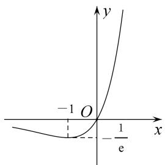</td><td>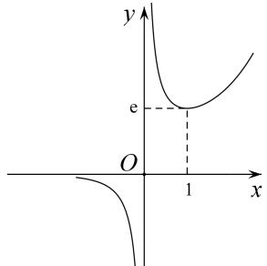</td><td>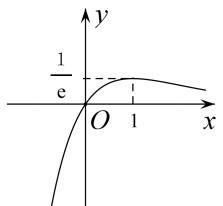</td></tr><tr><td>函数</td><td> $f(x)=x\ln x$ </td><td> $f(x)=\frac{\ln x}{x}$ </td><td> $f(x)=\frac{x}{\ln x}$ </td></tr><tr><td>图象</td><td>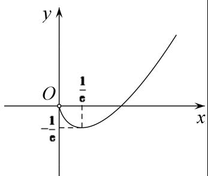</td><td>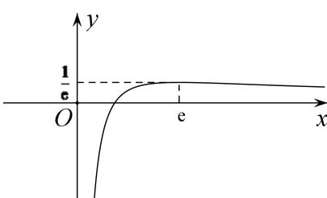</td><td>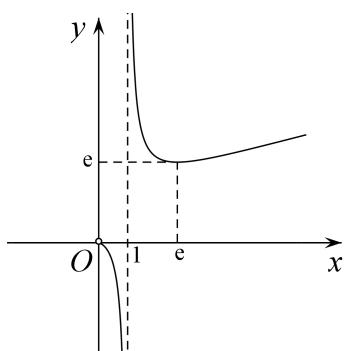</td></tr></table>

# 考点一 $x$ 与 $\ln x$ 的组合函数问题

(1)熟悉函数 $f(x) = h(x)\ln x(h(x) = ax^2 + bx + c(a, b \text{不能同时为 } 0))$ 的图象特征，做到对图(1)(2)中两个特殊函数的图象“有形可寻”.

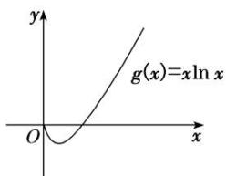

text_image

y
g(x)=xln x
O
x

(1)

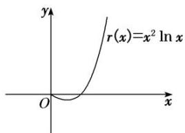

text_image

r(x)=x² ln x
y
O
x

(2)

(2)熟悉函数 $f(x) = \frac{\ln x}{h(x)} (h(x) = ax^2 + bx + c(a, b \text{不能同时为 } 0), h(x) \neq 0)$ 的图象特征，做到

对图(3)(4)中两个特殊函数的图象“有形可寻”.

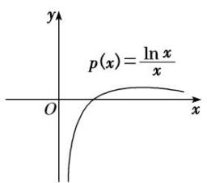

text_image

p(x)=\frac{\ln x}{x}

(3)

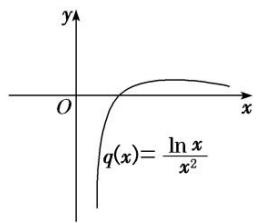

text_image

y
O
x
q(x)=\frac{\ln x}{x^2}

(4)

# 【例题选讲】

[例1] 设函数 $f(x) = x \ln x - \frac{ax^2}{2} + a - x (a \in \mathbf{R})$ .

(1)若函数 $f(x)$ 有两个不同的极值点，求实数 a 的取值范围；

(2) 若 $a = 2, k \in \mathbb{N}, g(x) = 2 - 2x - x^2$ ，且当 $x > 2$ 时不等式 $k(x - 2) + g(x) < f(x)$ 恒成立，试求 $k$ 的最大值.

# 【对点训练】

1. 若 $a=\frac{\ln2}{2}$ ， $b=\frac{\ln3}{3}$ ， $c=\frac{\ln6}{6}$ ，则()

A. a<b<c

B. $c < b < a$

C. c<a<b

D. b<a<c

2. 已知 $a > b > 0$ , $a^b = b^a$ , 有如下四个结论: (1) $b < e$ ; (2) $b > e$ ; (3) 存在 $a$ , $b$ 满足 $a \cdot b < e^2$ ; (4) 存在 $a$ , $b$ 满足

$a \cdot b > e^{2}$ ，则正确结论的序号是()

A. (1)(3)

B. (2)(3)

C. (1)(4)

D. (2)(4)

3. 设 x, y, z 为正数，且 $2^{x}=3^{y}=5^{z}$ ，则()

A. 2x<3y<5z

B. 5z<2x<3y

C. 3y<5z<2x

D. 3y<2x<5z

4. 下列四个命题：① $\ln 5 < \sqrt{5} \ln 2$ ；② $\ln \pi > \sqrt{\frac{\pi}{e}}$ ；③ $2^{\sqrt{11}} < 11$ ；④ $3 \ln 2 > 4\sqrt{2}$ 。其中真命题的个数是（）

A. 1

B. 2

C. 3

D. 4

5. 已知函数 $f(x)=kx^{2}-\ln x$ ，若 $f(x)>0$ 在函数定义域内恒成立，则 k 的取值范围是()

A. $\left(\frac{1}{e}, e\right)$

B. $\left(\frac{1}{2e},\frac{1}{e}\right)$

C. $\left(-\infty,\frac{1}{2e}\right)$

D. $\left(\frac{1}{2e},+\infty\right)$

6. 已知 $0 < x_{1} < x_{2} < 1$ ，则()

A. $\frac{\ln x_{1}}{x_{2}}>\frac{\ln x_{2}}{x_{1}}$

B. $\frac{\ln x_1}{x_2} < \frac{\ln x_2}{x_1}$

C. $x_{2}\ln x_{1}>x_{1}\ln x_{2}$

D. $x_{2}\ln x_{1}<x_{1}\ln x_{2}$

7. 已知函数 $f(x)=ax-\frac{\ln x}{x}$ ， $a\in R$ .

(1)若 $f(x)\geq0$ ，求a的取值范围；

(2)若 $y=f(x)$ 的图象与直线 y=a 相切，求 a 的值.

8. 已知函数 $f(x)=x^{3}-a\ln x(a\in\mathbf{R})$ .

(1)讨论函数 $f(x)$ 的单调性;  
(2)若函数 $y = f(x)$ 在区间(1, e]上存在两个不同零点，求实数 $a$ 的取值范围.

# 考点二 $x$ 与 $\mathbf{e}^x$ 的组合函数问题

(1)熟悉函数 $f(x) = h(x)\mathrm{e}^{g(x)}(g(x))$ 为一次函数， $h(x) = ax^{2} + bx + c(a, b \text{不能同时为 } 0))$ 的图象特征，做到对图(1)(2)中两个特殊函数的图象“有形可寻”.

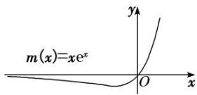  
(1)

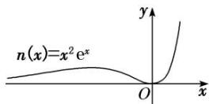  
(2)

(2)熟悉函数 $f(x) = \frac{\mathrm{e}^x}{h(x)} (h(x) = ax^2 + bx + c(a, b \text{不能同时为 } 0), h(x) \neq 0)$ 的图象特征，做到对图(3)(4)中两个特殊函数的图象“有形可寻”.

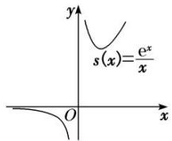  
(3)

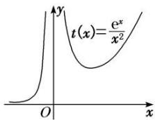  
(4)

# 【例题选讲】

[例1] 已知函数 $f(x) = a(x - 1)$ ， $g(x) = (ax - 1) \cdot \mathrm{e}^x$ ， $a \in \mathbf{R}$ .

(1)求证：存在唯一实数 a，使得直线 $y=f(x)$ 和曲线 $y=g(x)$ 相切；  
(2)若不等式 $f(x)>g(x)$ 有且只有两个整数解，求a的取值范围.

# 考点三 $x$ 与 $\mathrm{e}^x$ ， $\ln x$ 的组合函数问题

(1)熟悉函数 $f(x) = h(x)\ln x \pm e^{x}(h(x) = ax^{2} + bx + c(a, b \text{不能同时为 } 0))$ 的图形特征，做到对图(1)(2)(3)(4)所示的特殊函数的图象“有形可寻”.

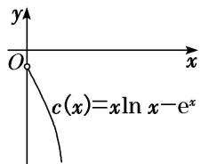

text_image

y
O
x
c(x)=xln x-e^x

(1)

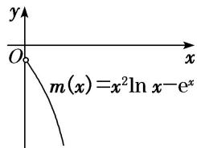

text_image

y
O
x
m(x)=x²ln x-eˣ

(2)

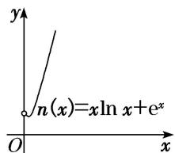

text_image

y
n(x)=xln x+e^x
O
x

(3)

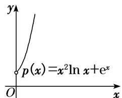

text_image

p(x)=x²ln x+e^x

(4)

(2)熟悉函数 $f(x) = \frac{\mathrm{e}^x}{h(x)} \pm \ln x$ (其中 $h(x) = ax^2 + bx + c$ ( $a, b$ 不同时为0))的图形特征，做到对图(5)(6)所示的两个特殊函数的图象“有形可寻”.

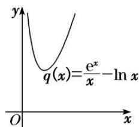

text_image

q(x)=\frac{e^x}{x}-\ln x

(5)

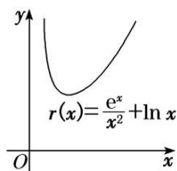

text_image

r(x)=\frac{e^x}{x^2}+\ln x

(6)

# 命题点1 分离参数，设而不求

# 【例题选讲】

[例1] 已知函数 $f(x) = \ln x + \frac{m}{x}$ ， $g(x) = \frac{\mathrm{e}^x}{x} (\mathrm{e} = 2.71828\dots\dots$ 为自然对数的底数），是否存在整数 $m$ ，使得对任意的 $x \in \left(\frac{1}{2}, +\infty\right)$ ，都有 $y = f(x)$ 的图象在 $y = g(x)$ 的图象下方？若存在，请求出整数 $m$ 的最大值；若不存在，请说明理由。

# 命题点2 分离 $\ln x$ 与 $\mathbf{e}^x$

[例 2] 已知函数 $f(x)=ax^{2}-x\ln x$ .

(1)若函数 $f(x)$ 在 $(0, +\infty)$ 上单调递增，求实数 a 的取值范围；

(2)若 $a = \mathrm{e}$ ，证明：当 $x > 0$ 时， $f(x) <   x\mathrm{e}^{x} + \frac{1}{\mathrm{e}}.$

# 【对点训练】

1. 已知函数 $f(x) = \ln x + \frac{a}{x} (a > 0)$ .

(1)若函数 $f(x)$ 有零点，求实数 $a$ 的取值范围；

(2)证明：当 $a \geq \frac{2}{\mathrm{e}}$ 时， $\ln x + \frac{a}{x} - \mathrm{e}^{-x} > 0.$

