# 专题16 导数中有关 $x$ 与 $\mathrm{e}^x$ ， $\ln x$ 的组合函数问题

在函数的综合问题中，常以 $x$ 与 $\mathrm{e}^x$ ， $\ln x$ 组合的函数为基础来命题，将基本初等函数的概念、图象与性质糅合在一起，发挥导数的工具作用，应用导数研究函数性质、证明相关不等式(或比较大小)、求参数的取值范围(或最值).着眼于知识点的巧妙组合，注重对函数与方程、转化与化归、分类讨论和数形结合等思想的灵活运用，突出对数学思维能力和数学核心素养的考查.

# 六大经典超越函数的图象

<table><tr><td>函数</td><td> $f(x)=xe^x$ </td><td> $f(x)=\frac{e^x}{x}$ </td><td> $f(x)=\frac{x}{e^x}$ </td></tr><tr><td>图象</td><td>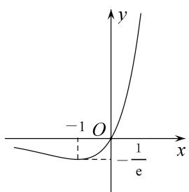</td><td>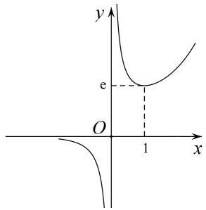</td><td>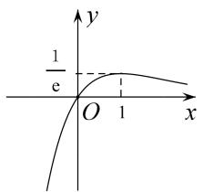</td></tr><tr><td>函数</td><td> $f(x)=x\ln x$ </td><td> $f(x)=\frac{\ln x}{x}$ </td><td> $f(x)=\frac{x}{\ln x}$ </td></tr><tr><td>图象</td><td>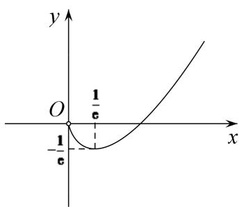</td><td>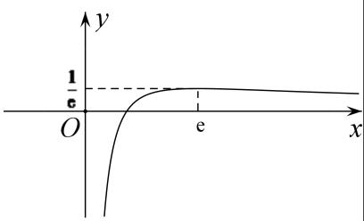</td><td>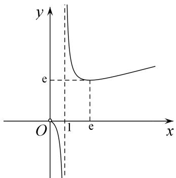</td></tr></table>

# 考点一 $x$ 与 $\ln x$ 的组合函数问题

(1)熟悉函数 $f(x) = h(x)\ln x(h(x) = ax^2 + bx + c(a, b \text{ 不能同时为 } 0))$ 的图象特征，做到对图(1)(2)中两个特殊函数的图象“有形可寻”.

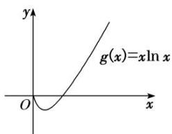

text_image

y
g(x)=xln x
O
x

(1)

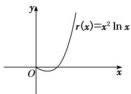

text_image

r(x)=x² ln x
y
O
x

(2)

(2)熟悉函数 $f(x) = \frac{\ln x}{h(x)} (h(x) = ax^2 + bx + c (a, b \text{不能同时为} 0), h(x) \neq 0)$ 的图象特征，做到对图(3)(4)中两个特殊函数的图象“有形可寻”.

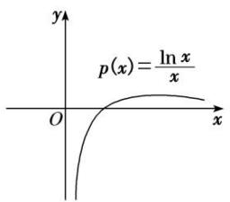

text_image

p(x)=\frac{\ln x}{x}

(3)

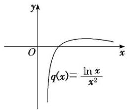

text_image

y
O
x
q(x)=\frac{\ln x}{x^2}

(4)

# 【例题选讲】

[例 1] 设函数 $f(x)=x\ln x-\frac{ax^{2}}{2}+a-x(a\in\mathbf{R})$ .

(1)若函数 $f(x)$ 有两个不同的极值点，求实数 a 的取值范围；  
(2)若 $a = 2$ ， $k\in \mathbb{N}$ ， $g(x) = 2 - 2x - x^2$ ，且当 $x > 2$ 时不等式 $k(x - 2) + g(x) <   f(x)$ 恒成立，试求 $k$ 的最大值.

分析 (1)将原问题转化为两个函数图象的交点问题, 利用数形结合思想进行求解; (2)将不等式恒成立问题转化为函数的最值问题进行求解.

解析 (1)由题意知，函数 $f(x)$ 的定义域为 $(0, +\infty)$ ， $f'(x) = \ln x + 1 - ax - 1 = \ln x - ax$ ，

令 $f'(x)=0$ ，可得 $a=\frac{\ln x}{x}$ ,

令 $h(x)=\frac{\ln x}{x}(x>0)$ ，则由题可知直线 y=a 与函数 $h(x)$ 的图象有两个不同的交点，

$h'(x)=\frac{1-\ln x}{x^{2}}$ ，令 $h'(x)=0$ ，得 x=e，可知 $h(x)$ 在 $(0,\mathrm{e})$ 上单调递增，在 $(\mathrm{e},+\infty)$ 上单调递减，

$h(x)_{\max}=h(e)=\frac{1}{e}$ ，当 $x\to0$ 时， $h(x)\to-\infty$ ，当 $x\to+\infty$ 时， $h(x)\to0$ ，故实数a的取值范围为 $\begin{pmatrix}0,&\frac{1}{e}\end{pmatrix}$ .

(2) 当 a=2 时， $f(x)=x\ln x-x^{2}+2-x,\quad k(x-2)+g(x)<f(x)$ ,

即 $k(x-2)+2-2x-x^{2}<x\ln x-x^{2}+2-x$ ，整理得 $k(x-2)<x\ln x+x$ ，

因为 x>2，所以 $k<\frac{x\ln x+x}{x-2}$ . 设 $F(x)=\frac{x\ln x+x}{x-2}(x>2)$ ，则 $F'(x)=\frac{x-4-2\ln x}{(x-2)^{2}}$ .

令 $m(x)=x-4-2\ln x(x>2)$ ，则 $m'(x)=1-\frac{2}{x}>0$ ，所以 $m(x)$ 在 $(2,+\infty)$ 上单调递增，

$$
m (8) = 4 - 2 \ln 8 <   4 - 2 \ln \mathrm{e} ^ {2} = 4 - 4 = 0, m (1 0) = 6 - 2 \ln 1 0 > 6 - 2 \ln \mathrm{e} ^ {3} = 6 - 6 = 0,
$$

所以函数 $m(x)$ 在 $(8, 10)$ 上有唯一的零点 $x_{0}$ ,

即 $x_{0}-4-2\ln x_{0}=0$ ，故当 $2<x<x_{0}$ 时， $m(x)<0$ ，即 $F'(x)<0$ ，当 $x>x_{0}$ 时， $F'(x)>0$ ，

所以 $F(x)_{\min}=F(x_{0})=\frac{x_{0}\ln x_{0}+x_{0}}{x_{0}-2}=\frac{x_{0}\left(1+\frac{x_{0}-4}{2}\right)}{x_{0}-2}=\frac{x_{0}}{2}$ ，所以 $k<\frac{x_{0}}{2}$ ,

因为 $x_{0}\in(8,10)$ ，所以 $\frac{x_{0}}{2}\in(4,5)$ ，故 k 的最大值为 4.

点评 1. 极值点问题通常可转化为零点问题，且需要检验零点两侧导函数值的符号是否相反，若已知极值点求参数的取值范围，一定要对结果进行验证。解答任意性(恒成立)、存在性(有解)问题时通常有分离参变量、分拆函数等求解方法，可根据式子的结构特征，进行选择和调整，一般可转化为最值问题进行求解。

2. 对于有关 $x$ 与 $\ln x$ 的组合函数为背景的试题，要求理解导数公式和导数的运算法则等基础知识，能够灵活利用导数研究函数的单调性，能够恰当地构造函数，并根据区间的不同进行分析、讨论，寻求合理的证明和解不等式的策略。

# 【对点训练】

1. 若 $a = \frac{\ln 2}{2}, b = \frac{\ln 3}{3}, c = \frac{\ln 6}{6}$ ，则（）

A. a<b<c

B. c<b<a

C. c<a<b

D. b<a<c

1. 答案 C 解析 设 $f(x) = \frac{\ln x}{x}$ ，则 $f'(x) = \frac{1 - \ln x}{x^2}$ ，所以 $f(x)$ 在 $(0, e)$ 上单调递增，在 $(e, +\infty)$ 上单调递减，即有 $f(6) < f(4) < f(3)$ ，所以 $\frac{\ln 6}{6} < \frac{\ln 4}{4} = \frac{\ln 2}{2} < \frac{\ln 3}{3}$ ，故 $c < a < b$ .

2. 已知 $a > b > 0$ , $a^b = b^a$ , 有如下四个结论: (1) $b < e$ ; (2) $b > e$ ; (3) 存在 $a, b$ 满足 $a \cdot b < e^2$ ; (4) 存在 $a, b$ 满足 $a \cdot b > e^2$ , 则正确结论的序号是( )

A. (1)(3)

B. (2)(3)

C. (1)(4)

D. (2)(4)

2. 答案 C 解析 由 $a^b = b^a$ 两边取对数得 $b\ln a = a\ln b \Rightarrow \frac{\ln a}{a} = \frac{\ln b}{b}$ . 对于 $y = \frac{\ln x}{x}$ , 由图象易知当 $b < e < a$ 时, 才可能满足题意. 故(1)正确, (2)错误; 另外, 由 $a^b = b^a$ , 令 $a = 4$ , $b = 2$ , 则 $a > e$ , $b < e$ , $ab = 8 > e^2$ , 故(4)正确, (3)错误. 因此, 选 C.

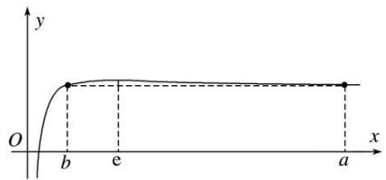

text_image

y
O
b
e
a
x

3. 设 $x, y, z$ 为正数，且 $2^{x} = 3^{y} = 5^{z}$ ，则（）

A. 2x<3y<5z

B. 5z<2x<3y

C. 3y<5z<2x

D. 3y<2x<5z

3. 答案 D 解析 令 $2^{x} = 3^{y} = 5^{z} = t(t > 1)$ ，两边取对数得 $x = \log_{2}t = \frac{\ln t}{\ln 2}$ ， $y = \log_{3}t = \frac{\ln t}{\ln 3}$ ， $z = \log_{5}t = \frac{\ln t}{\ln 5}$ ，从而 $2x = \frac{2}{\ln 2}\ln t$ ， $3y = \frac{3}{\ln 3}\ln t$ ， $5z = \frac{5}{\ln 5}\ln t$ 。由 $t > 1$ 知，要比较三者大小，只需比较 $\frac{2}{\ln 2}, \frac{3}{\ln 3}, \frac{5}{\ln 5}$ 的大小。又 $\frac{2}{\ln 2} = \frac{4}{\ln 4}$ ， $e < 3 < 4 < 5$ ，由 $y = \frac{\ln x}{x}$ 在 $(e, +\infty)$ 上单调递减可知， $\frac{\ln 3}{3} > \frac{\ln 4}{4} > \frac{\ln 5}{5}$ ，从而 $\frac{3}{\ln 3} < \frac{4}{\ln 4} < \frac{5}{\ln 5}$ ， $3y < 2x < 5z$ ，故选 D.

4. 下列四个命题：① $\ln 5 < \sqrt{5} \ln 2$ ；② $\ln \pi > \sqrt{\frac{\pi}{e}}$ ；③ $2^{\sqrt{11}} < 11$ ；④ $3 \ln 2 > 4\sqrt{2}$ 。其中真命题的个数是（）

A. 1

B. 2

C. 3

D. 4

4. 答案 B 解析 构造函数 $f(x)=\frac{\ln x}{x}$ ，则 $f'(x)=\frac{1-\ln x}{x^{2}}$ ，当 $x\in(0,\mathrm{e})$ 时， $f'(x)>0$ ， $f(x)$ 单调递增；当 $x\in(\mathrm{e},+\infty)$ 时， $f'(x)<0$ ， $f(x)$ 单调递减。① $\ln5<\sqrt{5}\ln2\Rightarrow2\ln\sqrt{5}<\sqrt{5}\ln2\Rightarrow\frac{\ln\sqrt{5}}{\sqrt{5}}<\frac{\ln2}{2}$ ，又 $2<\sqrt{5}<e$ ，故错误。②

$\ln \pi > \sqrt{\frac{\pi}{e}} \Rightarrow 2 \ln \sqrt{\pi} > \frac{\sqrt{\pi}}{\sqrt{e}} \Rightarrow \frac{\ln \sqrt{\pi}}{\sqrt{\pi}} > \frac{\frac{1}{2}}{\sqrt{e}} = \frac{\ln \sqrt{e}}{\sqrt{e}}$ ，又 $e > \sqrt{\pi} > \sqrt{e}$ ，故正确。③ $2^{\sqrt{11}} < 11 \Rightarrow \sqrt{11} \ln 2 < \ln 11 = 2 \ln \sqrt{11} \Rightarrow \frac{\ln 2}{2} = \frac{\ln 4}{4} < \frac{\ln \sqrt{11}}{\sqrt{11}}$ ，又 $4 > \sqrt{11} > e$ ，故正确。④ $3 \ln 2 > 4\sqrt{2} \Rightarrow 2e \ln 2^{\frac{3}{2}} > 2 \times 2^{\frac{3}{2}} \Rightarrow \frac{\ln 2^{\frac{3}{2}}}{2^{\frac{3}{2}}} > \frac{\ln e}{e}$ ，显然错误。因此选B.

5. 已知函数 $f(x) = kx^{2} - \ln x$ ，若 $f(x) > 0$ 在函数定义域内恒成立，则 $k$ 的取值范围是（）

A. $\begin{pmatrix}\frac{1}{e},&e\end{pmatrix}$

B. $\left(\frac{1}{2e},\frac{1}{e}\right)$

C. $\left(-\infty,\frac{1}{2e}\right)$

D. $\left(\frac{1}{2e},+\infty\right)$

5. 答案 D 解析 由题意得 $f(x) > 0$ 在函数定义域内恒成立，即 $kx^{2} - \ln x > 0$ 在函数定义域内恒成立，即 $k > \frac{\ln x}{x^{2}}$ 在函数定义域内恒成立，设 $g(x) = \frac{\ln x}{x^{2}}$ ，则 $g'(x) = \frac{x - 2x\ln x}{x^{4}} = \frac{x(1 - 2\ln x)}{x^{4}}$ ，当 $x \in (0, \sqrt{\mathrm{e}})$ 时， $g'(x) > 0$ ，函数 $g(x)$ 单调递增；当 $x \in (\sqrt{\mathrm{e}}, +\infty)$ 时， $g'(x) < 0$ ，函数 $g(x)$ 单调递减，所以当 $x = \sqrt{\mathrm{e}}$ 时，函数 $g(x)$ 取得最大值，此时最大值为 $g(\sqrt{\mathrm{e}}) = \frac{1}{2\mathrm{e}}$ ，所以实数 $k$ 的取值范围是 $\left[\frac{1}{2\mathrm{e}}, +\infty\right]$ ，故选 D.

6. 已知 $0 < x_{1} < x_{2} < 1$ ，则（）

A. $\frac{\ln x_{1}}{x_{2}} > \frac{\ln x_{2}}{x_{1}}$

B. $\frac{\ln x_1}{x_2} < \frac{\ln x_2}{x_1}$

C. $x_{2}\ln x_{1}>x_{1}\ln x_{2}$

D. $x_{2} \ln x_{1} < x_{1} \ln x_{2}$

6. 答案 D 解析 设 $f(x)=x\ln x$ ，则 $f'(x)=\ln x+1$ ，由 $f'(x)>0$ ，得 $x>\frac{1}{e}$ ，所以函数 $f(x)$ 在 $\left(\frac{1}{e},+\infty\right)$ 上单调递增；由 $f'(x)<0$ ，得 $0<x<\frac{1}{e}$ ，函数 $f(x)$ 在 $\left(0,\frac{1}{e}\right)$ 上单调递减，故函数 $f(x)$ 在 $(0,1)$ 上不单调，所以 $f(x_{1})$ 与 $f(x_{2})$ 的大小无法确定，从而排除 A，B；设 $g(x)=\frac{\ln x}{x}$ ，则 $g'(x)=\frac{1-\ln x}{x^{2}}$ ，由 $g'(x)>0$ ，得 0<x<e，即函数 $g(x)$ 在 $(0,e)$ 上单调递增，故函数 $g(x)$ 在 $(0,1)$ 上单调递增，所以 $g(x_{1})<g(x_{2})$ ，即 $\frac{\ln x_{1}}{x_{1}}<\frac{\ln x_{2}}{x_{2}}$ ，所以 $x_{2}\ln x_{1}<x_{1}\ln x_{2}$ 。故选 D.

7. 已知函数 $f(x) = ax - \frac{\ln x}{x}$ , $a \in \mathbf{R}$ .

(1)若 $f(x)\geq0$ ，求a的取值范围；  
(2)若 $y=f(x)$ 的图象与直线 y=a 相切，求 a 的值.

7. 解析 (1)由题易知，函数 $f(x)$ 的定义域为 $(0, +\infty)$ .

由 $f(x) \geq 0$ ，得 $ax - \frac{\ln x}{x} \geq 0$ ，所以 $ax \geq \frac{\ln x}{x}$ ，又 x > 0，所以 $a \geq \frac{\ln x}{x^{2}}$ .

令 $g(x)=\frac{\ln x}{x^{2}}$ ，则 $g'(x)=\frac{1-2\ln x}{x^{3}}$ 。令 $g'(x)>0$ ，得 $0<x<\sqrt{e}$ ，令 $g'(x)<0$ ，得 $x>\sqrt{e}$ 。

所以当 $0 < x < \sqrt{e}$ 时， $g(x)$ 单调递增，当 $x > \sqrt{e}$ 时， $g(x)$ 单调递减.

所以当 $x=\sqrt{e}$ 时， $g(x)$ 取得最大值 $g(\sqrt{e})=\frac{1}{2e}$ ,

所以 $a \geq \frac{1}{2e}$ ，即 a 的取值范围是 $\left[\frac{1}{2e}, +\infty\right]$ .

(2)设 $y = f(x)$ 的图象与直线 $y = a$ 相切于点 $(t, a)$ ，依题意可得 $\left\{ \begin{array}{l} f(t) = a, \\ f'(t) = 0. \end{array} \right.$

因为 $f'(x)=a-\frac{1-\ln x}{x^{2}}$ ，所以 $\left\{\begin{aligned}at-\frac{\ln t}{t}&=a,\\ a-\frac{1-\ln t}{t^{2}}&=0,\end{aligned}\right.$ 消去 a 可得 $t-1-(2t-1)\ln t=0$ . (\*)

令 $h(t)=t-1-(2t-1)\ln t$ ，则 $h'(t)=\frac{1}{t}-2\ln t-1$ ，

易知 $h'(t)$ 在 $(0, +\infty)$ 上单调递减，且 $h'(1)=0$ ，

所以当 0<t<1 时， $h'(t)>0$ ， $h(t)$ 单调递增，当 t>1 时， $h'(t)<0$ ， $h(t)$ 单调递减。

所以当且仅当 t=1 时， $h(t)=0$ ，即(\*)式成立，所以 $a=\frac{1-\ln1}{1^{2}}=1$ .

点评 1. 求解有关 $x$ 与 $\mathrm{e}^x$ , $x$ 与 $\ln x$ 的组合函数问题, 要把相关问题转化为熟悉易解的函数模型来处理; 若函数最值不易求解时, 可重新分拆、组合、构建新函数, 然后借助导数研究函数的性质来求解.

2. 本例中(1)先将不等式 $f(x) \geq 0$ 转化为 $a \geq \frac{\ln x}{x^2}$ ，再构造函数 $g(x) = \frac{\ln x}{x^2}$ ，求其最大值即可求得 $a$ 的取值范围；(2)先由 $y = f(x)$ 的图象与直线 $y = a$ 相切，得到方程组，再构造新函数，通过研究新函数的单调性，求出 $a$ 的值.

8. 已知函数 $f(x)=x^{3}-a\ln x(a\in\mathbf{R})$ .

(1)讨论函数 $f(x)$ 的单调性;

(2)若函数 $y=f(x)$ 在区间 $(1, e]$ 上存在两个不同零点，求实数 a 的取值范围.

8. 解析 (1) $\because f(x) = 3x^{2} - \frac{a}{x} = \frac{3x^{3} - a}{x} (x > 0)$ .

①当 $a \leq 0$ 时， $f'(x) > 0$ ，此时函数在 $(0, +\infty)$ 上单调递增；

②当 a>0 时，令 $f'(x)=\frac{3x^{3}-a}{x}=0$ ，得 $x=\sqrt[3]{\frac{a}{3}}$ ,

当 $x \in \left(0, \sqrt[3]{\frac{a}{3}}\right)$ 时， $f'(x) < 0$ ，此时函数 $f(x)$ 在 $\left(0, \sqrt[3]{\frac{a}{3}}\right)$ 上单调递减；

当 $x \in \left[ \sqrt[3]{\frac{a}{3}}, +\infty \right]$ 时， $f'(x) > 0$ ，此时函数 $f(x)$ 在 $\left[ \sqrt[3]{\frac{a}{3}}, +\infty \right]$ 上单调递增.

(2)由题意知： $a=\frac{x^{3}}{\ln x}$ 在区间 $(1,\mathrm{e}]$ 上有两个不同实数解，

即直线 y=a 与函数 $g(x)=\frac{x^{3}}{\ln x}$ 的图象在区间 $(1, e]$ 上有两个不同的交点，

因为 $g'(x)=\frac{x^{2}(3\ln x-1)}{(\ln x)^{2}}$ ，令 $g'(x)=0$ ，得 $x=\sqrt[3]{e}$

所以当 $x \in (1, \sqrt[3]{e})$ 时， $g'(x) < 0$ ，函数在 $(1, \sqrt[3]{e})$ 上单调递减；

当 $x \in (\sqrt[3]{\mathrm{e}}, \mathrm{e}]$ 时， $g'(x) > 0$ ，函数在 $(\sqrt[3]{\mathrm{e}}, \mathrm{e}]$ 上单调递增；

则 $g(x)_{\min}=g(\sqrt[3]{e})=3e$ ，而 $g(e\frac{1}{27})=\frac{e^{\frac{1}{9}}}{\ln e\frac{1}{27}}=27e^{\frac{1}{9}}>27$ ，且 $g(e)=e^{3}<27$ .

所以要使直线 $y = a$ 与函数 $g(x) = \frac{x^3}{\ln x}$ 的图象在区间(1，e]上有两个不同的交点，则 $3\mathrm{e} < a \leq \mathrm{e}^3$

所以 a 的取值范围为 $(3e, e^{3}]$ .

# 考点二 $x$ 与 $\mathbf{e}^x$ 的组合函数问题

(1)熟悉函数 $f(x)=h(x)\mathrm{e}^{g(x)}(g(x))$ 为一次函数， $h(x)=ax^{2}+bx+c(a, b$ 不能同时为 0)) 的图象特征，做到对图(1)(2)中两个特殊函数的图象“有形可寻”.

  
(1)

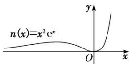  
(2)

(2)熟悉函数 $f(x) = \frac{\mathrm{e}^x}{h(x)} (h(x) = ax^2 + bx + c (a, b \text{ 不能同时为 } 0), h(x) \neq 0)$ 的图象特征，做到对图(3)(4)中两个特殊函数的图象“有形可寻”.

  
(3)

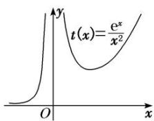  
(4)

# 【例题选讲】

[例 1] 已知函数 $f(x)=a(x-1)$ ， $g(x)=(ax-1)\cdot\mathrm{e}^{x}$ ， $a\in\mathbf{R}$ .

(1)求证：存在唯一实数 a，使得直线 $y=f(x)$ 和曲线 $y=g(x)$ 相切；  
(2)若不等式 $f(x)>g(x)$ 有且只有两个整数解，求a的取值范围.

分析 (1)设切点的坐标为 $(x_0, y_0)$ ，然后由切点既在直线上又在曲线上得到关于 $x_0$ 的方程，再构造函数，从而通过求导研究新函数的单调性使问题得证；(2)首先将问题转化为 $a\left(x - \frac{x - 1}{e^x}\right) < 1$ ，然后令 $m(x) = x - \frac{x - 1}{e^x}$ ，再通过求导研究函数 $m(x)$ 的单调性，求得最小值，从而分 $a \leq 0$ ， $0 < a < 1$ ， $a \geq 1$ 三种情况来讨论，进而求得 $a$ 的取值范围.

解析 (1) $f'(x)=a,\quad g'(x)=(ax+a-1)e^{x}$ .

设直线 $y=f(x)$ 和曲线 $y=g(x)$ 的切点的坐标为 $(x_{0}, y_{0})$ ，则 $y_{0}=a(x_{0}-1)=(ax_{0}-1)e^{x_{0}}$

得 $a(x_{0}\mathrm{e}^{x_{0}}-x_{0}+1)=\mathrm{e}^{x_{0}}$ ，①

又因为直线 $y=f(x)$ 和曲线 $y=g(x)$ 相切，所以 $a=g'(x_{0})=(ax_{0}+a-1)e^{x_{0}}$

整理得 $a(x_{0}e^{x_{0}}+ex_{0}-1)=e^{x_{0}}$ ，②

结合①②得 $x_{0}e^{x_{0}}-x_{0}+1=x_{0}e^{x_{0}}+ex_{0}-1$ ，即 $e^{x_{0}}+x_{0}-2=0$ ，令 $h(x)=e^{x}+x-2$ ，

则 $h'(x)=\mathrm{e}^{x}+1>0$ ，所以 $h(x)$ 在 R 上单调递增.

又因为 $h(0)=-1<0,\quad h(1)=\mathrm{e}-1>0$ ，所以存在唯一实数 $x_{0}$ ，使得 $e^{x_{0}}+x_{0}-2=0$ ，且 $x_{0}\in(0,1)$

所以存在唯一实数 a，使①②两式成立，故存在唯一实数 a，使得直线 $y=f(x)$ 与曲线 $y=g(x)$ 相切.

(2)令 $f(x) > g(x)$ ，即 $a(x - 1) > (ax - 1)\mathrm{e}^x$ ，所以 $ax\mathrm{e}^x - ax + a < \mathrm{e}^x$ ，所以 $a\left(x - \frac{x - 1}{\mathrm{e}^x}\right) < 1$ ，

令 $m(x)=x-\frac{x-1}{\mathrm{e}^{x}}$ ，则 $m'(x)=\frac{\mathrm{e}^{x}+x-2}{\mathrm{e}^{x}}$ ,

由(1)可得 $m(x)$ 在 $(-∞, x_{0})$ 上单调递减，在 $(x_{0}, +∞)$ 上单调递增，且 $x_{0} ∈ (0, 1)$ ,

故当 $x \leq 0$ 时， $m(x) \geq m(0) = 1$ ，当 $x \geq 1$ 时， $m(x) \geq m(1) = 1$ ，所以当 $x \in Z$ 时， $m(x) \geq 1$ 恒成立.

①当 $a \leq 0$ 时， $am(x) < 1$ 恒成立，此时有无数个整数解，舍去；

②当 0 < a < 1 时， $m(x) < \frac{1}{a}$ ，因为 $\frac{1}{a} > 1$ ， $m(0) = m(1) = 1$ ，

所以两个整数解分别为 0, 1，即 $\left\{\begin{aligned}m(2)\geq\frac{1}{a},\\ m(-1)\geq\frac{1}{a},\end{aligned}\right.$ 解得 $a\geq\frac{e^{2}}{2e^{2}-1}$ ，即 $a\in\left[\frac{e^{2}}{2e^{2}-1},+\infty\right]$ ;

③当 $a \geq 1$ 时， $m(x) < \frac{1}{a}$ ，因为 $\frac{1}{a} \leq 1$ ， $m(x)$ 在 $x \in Z$ 时大于或等于 1，所以 $m(x) < \frac{1}{a}$ 无整数解，舍去.

综上所述，a 的取值范围为 $\left[\frac{e^{2}}{2e^{2}-1}, +\infty\right]$ .

点评 1. 涉及函数的零点的个数问题、方程解的个数问题、函数图象的交点个数问题时，一般先通过导数研究函数的单调性、最大值、最小值等，再借助函数的大致图象判断零点、方程的根、函数图象的交点的情况，归根到底还是研究函数的性质，如单调性、极值等.

2. 在求解有关 $x$ 与 $\mathbf{e}^x$ 的组合函数综合题时要把握三点: (1)灵活运用复合函数的求导法则, 由外向内,层层求导; (2)把相关问题转化为熟悉易解的函数模型来处理; (3)函数最值不易求解时, 可重新组合、分拆,构建新函数, 通过分类讨论新函数的单调性求最值.

3. 以形助数、数形沟通，实现数形结合，形象直观地得出结论，体现了直观想象等数学核心素养.

# 考点三 $x$ 与 $\mathrm{e}^x$ ， $\ln x$ 的组合函数问题

(1)熟悉函数 $f(x) = h(x)\ln x \pm e^{x}(h(x) = ax^{2} + bx + c(a, b \text{不能同时为 } 0))$ 的图形特征，做到对图(1)(2)(3)(4)所示的特殊函数的图象“有形可寻”.

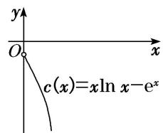

text_image

y
O
x
c(x)=xln x-e^x

(1)

text_image

y
O
x
m(x)=x²ln x-eˣ

(2)

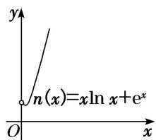

text_image

y
n(x)=xln x+e^x
O
x

(3)

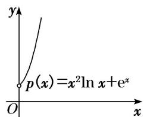

text_image

y
p(x)=x²ln x+eˣ
O
x

(4)

(2)熟悉函数 $f(x) = \frac{\mathrm{e}^x}{h(x)} \pm \ln x$ (其中 $h(x) = ax^2 + bx + c(a, b \text{ 不同时为 } 0)$ ) 的图形特征，做到对图(5)(6)所示的两个特殊函数的图象“有形可寻”.

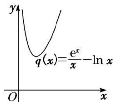

text_image

q(x)=\frac{e^x}{x}-\ln x

(5)

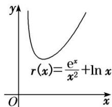

text_image

r(x)=\frac{e^x}{x^2}+\ln x

(6)

# 命题点1 分离参数，设而不求

# 【例题选讲】

[例 1] 已知函数 $f(x)=\ln x+\frac{m}{x}$ ， $g(x)=\frac{\mathrm{e}^{x}}{x}(\mathrm{e}=2.71828.....为自然对数的底数)$ ，是否存在整数 m，使得对任意的 $x\in\left(\frac{1}{2},+\infty\right)$ ，都有 $y=f(x)$ 的图象在 $y=g(x)$ 的图象下方？若存在，请求出整数 m 的最大值；若不存在，请说明理由.

解析 假设存在整数 m 满足题意，则不等式 $\ln x + \frac{m}{x} < \frac{e^{x}}{x}$ ，对任意的 $x \in \left(\frac{1}{2}, +\infty\right)$ 恒成立，

即 $m < e^{x} - x \ln x$ 对任意的 $x \in \left(\frac{1}{2}, +\infty\right)$ 恒成立．令 $v(x) = e^{x} - x \ln x$ ，则 $v'(x) = e^{x} - \ln x - 1$ ，

令 $\varphi(x) = \mathrm{e}^x - \ln x - 1$ ，则 $\varphi'(x) = \mathrm{e}^x - \frac{1}{x}$ ，易知 $\varphi'(x)$ 在 $\left[\frac{1}{2}, +\infty\right]$ 上单调递增，

因为 $\varphi^{\prime}\left(\frac{1}{2}\right) = \mathrm{e}^{\frac{1}{2}} - 2 < 0$ ， $\varphi'(1) = \mathrm{e} - 1 > 0$ 且 $\varphi'(x)$ 的图象在 $\left(\frac{1}{2}, 1\right)$ 上连续，

所以存在唯一的 $x_{0}\in\left(\frac{1}{2},\quad1\right)$ ，使得 $\varphi'(x_{0})=0$ ，即 $e^{x_{0}}-\frac{1}{x_{0}}=0$ ，则 $x_{0}=-\ln x_{0}$ .

当 $x \in \left(\frac{1}{2}, x_{0}\right)$ 时， $\varphi(x)$ 单调递减；当 $x \in (x_{0}, +\infty)$ 时， $\varphi(x)$ 单调递增.

则 $\varphi(x)$ 在 $x = x_0$ 处取得最小值，且最小值为 $\varphi(x_0) = \mathrm{e}^{x_0} - \ln x_0 - 1 = \frac{1}{x_0} + x_0 - 1 > 2\sqrt{x_0 \cdot \frac{1}{x_0}} - 1 = 1 > 0$

所以 $v'(x)>0$ ，即 $v(x)$ 在 $\left(\frac{1}{2},+\infty\right)$ 上单调递增，所以 $m\leq e^{\frac{1}{2}}-\frac{1}{2}\ln\frac{1}{2}=e^{\frac{1}{2}}+\frac{1}{2}\ln2\approx1$ 。995 29,

故存在整数 m 满足题意，且 m 的最大值为 1.

点评 1. 对于恒成立或有解问题分离参数后，导函数的零点不可求，且不能借助图象或观察得到，常采用设而不求，整体代入的方法.

2. 本例通过虚设零点 $x_0$ 得到 $x_0 = -\ln x_0$ ，将 $\mathrm{ex}_0 - \ln x_0 - 1$ 转化为普通代数式 $\frac{1}{x_0} + x_0 - 1$ ，然后使用基本不等式求出最值，同时消掉 $x_0$ ，即借助 $\varphi'(x_0) = 0$ 作整体代换，采取设而不求，达到化简求解的目的。

# 命题点2 分离 $\ln x$ 与 $\mathbf{e}^x$

[例 2] 已知函数 $f(x)=ax^{2}-x\ln x$ .

(1)若函数 $f(x)$ 在 $(0, +\infty)$ 上单调递增，求实数 a 的取值范围；  
(2)若 a=e，证明：当 x>0 时， $f(x)<xe^{x}+\frac{1}{e}$ .

解析 (1)由题意知， $f'(x)=2ax-\ln x-1$ .

因为函数 $f(x)$ 在 $(0, +\infty)$ 上单调递增，所以当 x > 0 时， $f'(x) \geq 0$ ，即 $2a \geq \frac{\ln x + 1}{x}$ 在 x > 0 时恒成立.

令 $g(x)=\frac{\ln x+1}{x}(x>0)$ ，则 $g'(x)=-\frac{\ln x}{x^{2}}$ ,

易知 $g(x)$ 在 $(0, 1)$ 上单调递增，在 $(1, +\infty)$ 上单调递减，则 $g(x)_{\max} = g(1) = 1$ ，所以 $2a \geq 1$ ，即 $a \geq \frac{1}{2}$ .故实数 a 的取值范围是 $\left[\frac{1}{2}, +\infty\right]$ .

(2)证明 若 $a = \mathrm{e}$ ，要证 $f(x) < x\mathrm{e}^x + \frac{1}{\mathrm{e}}$ ，只需证 $\mathrm{ex} - \ln x < \mathrm{e}^x + \frac{1}{\mathrm{ex}}$ ，即 $\mathrm{ex} - \mathrm{e}^x < \ln x + \frac{1}{\mathrm{ex}}$ .

令 $h(x)=\ln x+\frac{1}{\mathrm{e}x}(x>0)$ ，则 $h'(x)=\frac{\mathrm{e}x-1}{\mathrm{e}x^{2}}$ ,

易知 $h(x)$ 在 $\left(0, \frac{1}{e}\right)$ 上单调递减，在 $\left(\frac{1}{e}, +\infty\right)$ 上单调递增，则 $h(x)_{\min} = h\left(\frac{1}{e}\right) = 0$ ，所以 $\ln x + \frac{1}{ex} \geq 0$ .

再令 $\varphi(x)=\mathrm{e}x-\mathrm{e}^{x}$ ，则 $\varphi'(x)=\mathrm{e}-\mathrm{e}^{x}$

易知 $\varphi(x)$ 在 $(0,1)$ 上单调递增，在 $(1,+\infty)$ 上单调递减，则 $\varphi(x)_{\max}=\varphi(1)=0$ ，所以 $ex-e^{x}\leq0$ .

因为 $h(x)$ 与 $\varphi(x)$ 不同时为 0，所以 $ex - e^{x} < \ln x + \frac{1}{ex}$ ，故原不等式成立.

点评 1. 若直接求导比较复杂或无从下手时，可将待证式进行变形，构造两个都便于求导的函数，从而找到可以传递的中间量，达到证明的目标.

2. 本题第(2)小题中变形后再隔离分析构造函数，原不等式化为 $\ln x + \frac{1}{\mathrm{e}x} > \mathrm{e}x - \mathrm{e}^x (x > 0)$ (分离 $\ln x$ 与 $\mathbf{e}^x$ ), 便于探求构造的函数 $h(x) = \ln x + \frac{1}{\mathrm{e}x}$ 和 $\varphi(x) = \mathrm{e}x - \mathrm{e}^x$ 的单调性，分别求出 $h(x)$ 的最小值与 $\varphi(x)$ 的最大值，借助“中间媒介”证明不等式.

# 【对点训练】

1. 已知函数 $f(x) = \ln x + \frac{a}{x} (a > 0)$ .

(1)若函数 $f(x)$ 有零点，求实数a的取值范围；

(2)证明：当 $a \geq \frac{2}{\mathrm{e}}$ 时， $\ln x + \frac{a}{x} - \mathrm{e}^{-x} > 0$ .

1. 解析 (1)由题意可知，函数 $f(x)$ 的定义域为 $(0, +\infty)$ 。由 $f(x) = \ln x + \frac{a}{x} = 0$ 有解，得 $a = -x \ln x$ 有解，令 $g(x) = -x \ln x$ ，则 $g'(x) = -(\ln x + 1)$ .

$\because$ 当 $x\in\left(0,\frac{1}{e}\right)$ 时， $g'(x)>0$ ，当 $x\in\left(\frac{1}{e},+\infty\right)$ 时， $g'(x)<0$ ，

∴ 函数 $g(x)$ 在 $\left(0, \frac{1}{e}\right)$ 上单调递增，在 $\left(\frac{1}{e}, +\infty\right)$ 上单调递减，故 $g(x)_{\max} = g\left(\frac{1}{e}\right) = -\frac{1}{e} \ln \frac{1}{e} = \frac{1}{e}$ .

$\because a = -x \ln x$ 有解，且 $x > 0, a > 0, \therefore 0 < a \leq \frac{1}{e}, \therefore$ 实数 $a$ 的取值范围为 $\left[0, \frac{1}{e}\right]$ .

(2)要证当 $a \geq \frac{2}{e}$ 时， $\ln x + \frac{a}{x} - e^{-x} > 0$ ，即证 $\ln x + \frac{a}{x} > e^{-x}$ ,

$\because x>0,\quad\therefore$ 即证 $x\ln x+a>x\mathrm{e}^{-x}$ ，即证 $(x\ln x+a)_{\min}>(x\mathrm{e}^{-x})_{\max}$ .

令 $h(x)=x\ln x+a$ ，则 $h'(x)=\ln x+1$ 。当 $0<x<\frac{1}{e}$ 时， $f'(x)<0$ ；当 $x>\frac{1}{e}$ 时， $f'(x)>0$ 。

∴函数 $h(x)$ 在 $\left(0, \frac{1}{e}\right)$ 上单调递减，在 $\left(\frac{1}{e}, +\infty\right)$ 上单调递增，∴ $h(x)_{\min}=h\left(\frac{1}{e}\right)=-\frac{1}{e}+a$ 故当 $a \geq \frac{2}{e}$ 时， $h(x) \geq -\frac{1}{e} + a \geq \frac{1}{e}$ . ①

令 $\varphi(x)=xe^{-x}$ ，则 $\varphi'(x)=e^{-x}-xe^{-x}=e^{-x}(1-x)$ .

当 0<x<1 时， $\varphi'(x)>0$ ；当 x>1 时， $\varphi'(x)<0$ 。∴函数 $\varphi(x)$ 在 $(0,1)$ 上单调递增，在 $(1,+\infty)$ 上单调递减，$\therefore \varphi (x)_{\max} = \varphi (1) = \frac{1}{\mathrm{e}}.$ 故当 $x > 0$ 时， $\varphi (x)\leq \frac{1}{\mathrm{e}}.$ ②

显然，不等式①②中的等号不能同时成立，故当 $a \geq \frac{2}{e}$ 时， $\ln x + \frac{a}{x} - e^{-x} > 0$ .

