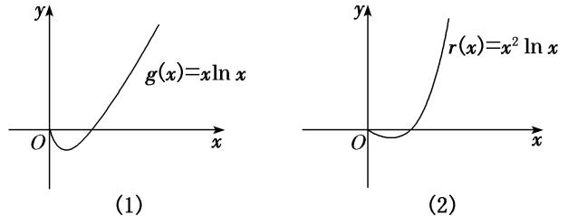
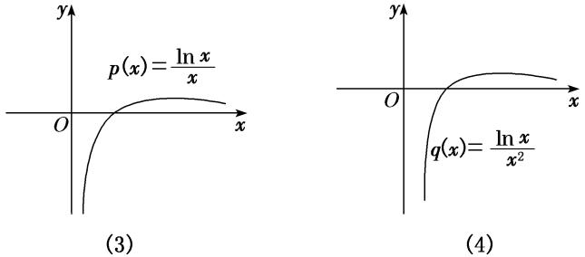
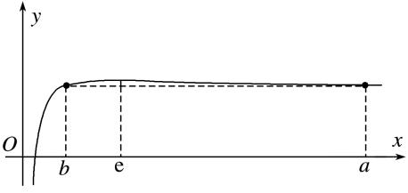
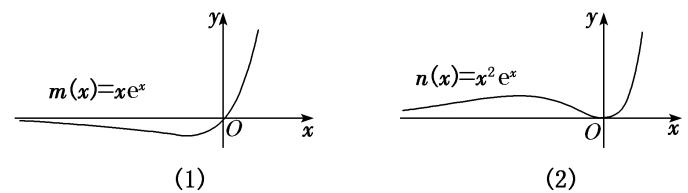
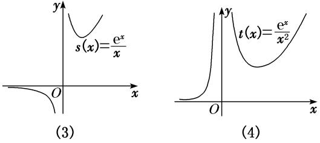
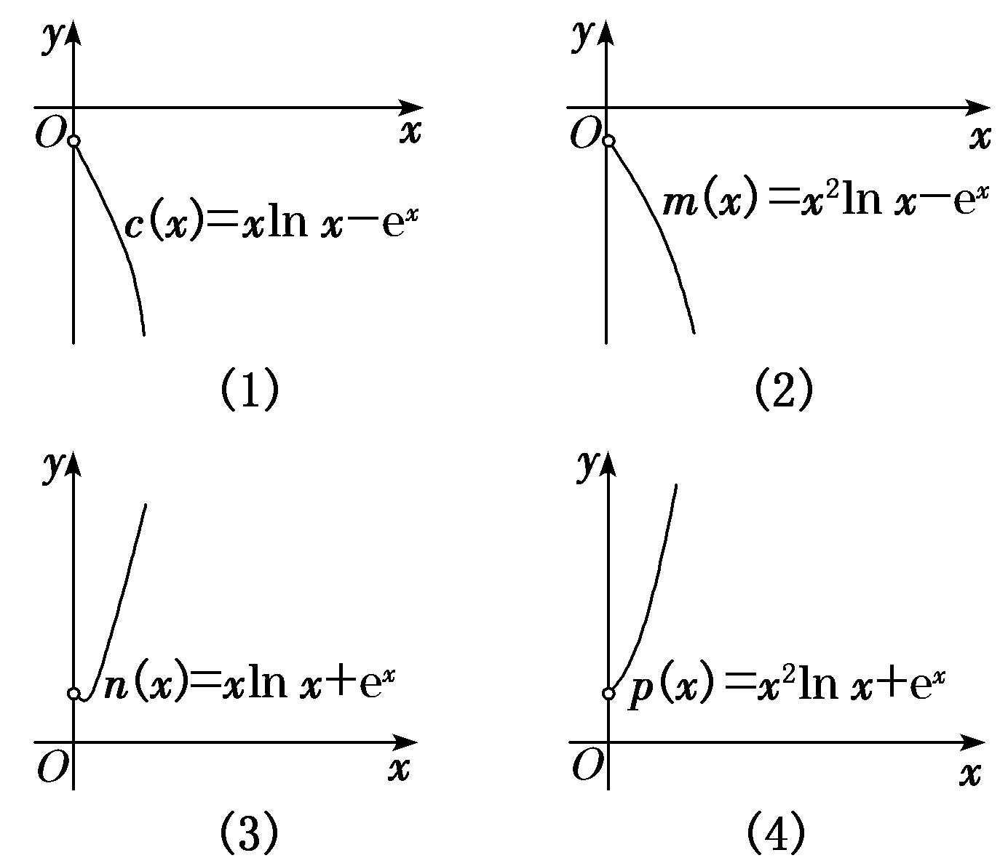
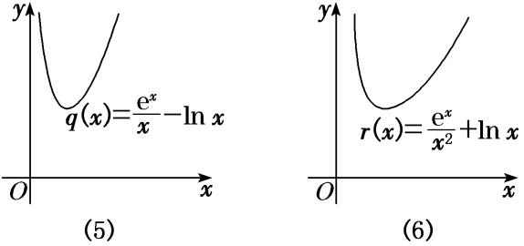

### <strong>专题16　导数中有关</strong><em><strong>x</strong></em><strong>与e</strong><em><strong>x</strong></em><strong>，ln</strong><em><strong>x</strong></em><strong>的组合函数问题</strong>

在函数的综合问题中，常以<em>x</em>与e<em>x</em>，ln<em>x</em>组合的函数为基础来命题，将基本初等函数的概念、图象与性质糅合在一起，发挥导数的工具作用，应用导数研究函数性质、证明相关不等式(或比较大小)、求参数的取值范围(或最值).着眼于知识点的巧妙组合，注重对函数与方程、转化与化归、分类讨论和数形结合等思想的灵活运用，突出对数学思维能力和数学核心素养的考查．

六大经典超越函数的图象

<table><tr><td>
函数
</td><td>
<em>f</em>(<em>x</em>)＝<em>x</em>e<em>x</em>
</td><td>
<em>f</em>(<em>x</em>)＝
</td><td>
<em>f</em>(<em>x</em>)＝
</td></tr><tr><td>
图象
</td><td>

</td><td>

</td><td>

</td></tr><tr><td>
函数
</td><td>
<em>f</em>(<em>x</em>)＝<em>x</em>ln<em>x</em>
</td><td>
<em>f</em>(<em>x</em>)＝
</td><td>
<em>f</em>(<em>x</em>)＝
</td></tr><tr><td>
图象
</td><td>

</td><td>

</td><td>

</td></tr></table>

### <strong>考点一</strong>　<em><strong>x</strong></em><strong>与ln</strong><em><strong>x</strong></em><strong>的组合函数问题</strong>  
（1）熟悉函数<em>f</em>(<em>x</em>)＝<em>h</em>(<em>x</em>)ln<em>x</em>(<em>h</em>(<em>x</em>)＝<em>ax</em>2＋<em>bx</em>＋<em>c</em>(<em>a</em>，<em>b</em>不能同时为0))的图象特征，做到对图（1）（2）中两个特殊函数的图象“有形可寻”．

  
（2）熟悉函数<em>f</em>(<em>x</em>)＝(<em>h</em>(<em>x</em>)＝<em>ax</em>2＋<em>bx</em>＋<em>c</em>(<em>a</em>，<em>b</em>不能同时为0)，<em>h</em>(<em>x</em>)≠0)的图象特征，做到对图（3）（4）中两个特殊函数的图象“有形可寻”．

【例题选讲】

<strong>[例1]</strong>　设函数<em>f</em>(<em>x</em>)＝<em>x</em>ln<em>x</em>－＋<em>a</em>－<em>x</em>(<em>a</em>∈<strong>R</strong>)．  
（1）若函数*f*(*x*)有两个不同的极值点，求实数*a*的取值范围；  
（2）若<em>a</em>＝2，<em>k</em>∈N，<em>g</em>(<em>x</em>)＝2－2<em>x</em>－<em>x</em>2，且当<em>x</em>＞2时不等式<em>k</em>(<em>x</em>－2)＋<em>g</em>(<em>x</em>)＜<em>f</em>(<em>x</em>)恒成立，试求<em>k</em>的最大值．
分析　　（1）将原问题转化为两个函数图象的交点问题，利用数形结合思想进行求解；（2）将不等式恒成立问题转化为函数的最值问题进行求解．
解析　（1）由题意知，函数*f*(*x*)的定义域为(0，＋∞)，*f*′(*x*)＝ln *x*＋1－*ax*－1＝ln *x*－*ax*，
令*f*′(*x*)＝0，可得*a*＝，
令*h*(*x*)＝(*x*＞0)，则由题可知直线*y*＝*a*与函数*h*(*x*)的图象有两个不同的交点，

*h*′(*x*)＝，令*h*′(*x*)＝0，得*x*＝e，可知*h*(*x*)在(0，e)上单调递增，在(e，＋∞)上单调递减，

<em>h</em>(<em>x</em>)max＝<em>h</em>(e)＝，当<em>x</em>→0时，<em>h</em>(<em>x</em>)→－∞，当<em>x</em>→＋∞时，<em>h</em>(<em>x</em>)→0，故实数<em>a</em>的取值范围为．  
（2）当<em>a</em>＝2时，<em>f</em>(<em>x</em>)＝<em>x</em>ln <em>x</em>－<em>x</em>2＋2－<em>x</em>，<em>k</em>(<em>x</em>－2)＋<em>g</em>(<em>x</em>)＜<em>f</em>(<em>x</em>)，
即<em>k</em>(<em>x</em>－2)＋2－2<em>x</em>－<em>x</em>2＜<em>x</em>ln<em>x</em>－<em>x</em>2＋2－<em>x</em>，整理得<em>k</em>(<em>x</em>－2)＜<em>x</em>ln<em>x</em>＋<em>x</em>，
因为*x*＞2，所以*k*＜．设*F*(*x*)＝(*x*＞2)，则*F*′(*x*)＝．
令*m*(*x*)＝*x*－4－2ln *x*(*x*＞2)，则*m*′(*x*)＝1－＞0，所以*m*(*x*)在(2，＋∞)上单调递增，

<em>m</em>（8）＝4－2ln 8＜4－2ln e2＝4－4＝0，<em>m</em>（10）＝6－2ln10＞6－2ln e3＝6－6＝0，
所以函数<em>m</em>(<em>x</em>)在(8，10)上有唯一的零点<em>x</em>0，
即<em>x</em>0－4－2ln <em>x</em>0＝0，故当2＜<em>x</em>＜<em>x</em>0时，<em>m</em>(<em>x</em>)＜0，即<em>F</em>′(<em>x</em>)＜0，当<em>x</em>＞<em>x</em>0时，<em>F</em>′(<em>x</em>)＞0，
所以<em>F</em>(<em>x</em>)min＝<em>F</em>(<em>x</em>0)＝＝＝，所以<em>k</em>＜，
因为<em>x</em>0∈(8，10)，所以∈(4，5)，故<em>k</em>的最大值为4．

点评　1．极值点问题通常可转化为零点问题，且需要检验零点两侧导函数值的符号是否相反，若已知极值点求参数的取值范围，一定要对结果进行验证．解答任意性(恒成立)、存在性(有解)问题时通常有分离参变量、分拆函数等求解方法，可根据式子的结构特征，进行选择和调整，一般可转化为最值问题进行求解．

2．对于有关*x*与ln*x*的组合函数为背景的试题，要求理解导数公式和导数的运算法则等基础知识，能够灵活利用导数研究函数的单调性，能够恰当地构造函数，并根据区间的不同进行分析、讨论，寻求合理的证明和解不等式的策略．

【对点训练】

1．若*a*＝，*b*＝，*c*＝，则(　　)

A．*a*<*b*<*c*　　　　　
B．*c*<*b*<*a*　　　　　
C．*c*<*a*<*b*　　　　　
D．*b*<*a*<*c*

1．答案　C　解析　设*f*(*x*)＝，则*f*′(*x*)＝，所以*f*(*x*)在(0，e)上单调递增，在(e，＋∞)上单调递

减，即有*f*（6）<*f*（4）<*f*（3），所以<＝<，故*c*<*a*<*b*．

2．已知<em>a</em>&gt;<em>b</em>&gt;0，<em>ab</em>＝<em>ba</em>，有如下四个结论：（1）<em>b</em>&lt;e；（2）<em>b</em>&gt;e；（3）存在<em>a</em>，<em>b</em>满足<em>a</em>·<em>b</em>&lt;e2；（4）存在<em>a</em>，<em>b</em>满足

<em>a</em>·<em>b</em>&gt;e2，则正确结论的序号是(　　)

A．（1）（3）　　　　　　
B．（2）（3）　　　　　　
C．（1）（4）　　　　　　
D．（2）（4）

2．答案　C　解析　由<em>ab</em>＝<em>ba</em>两边取对数得<em>b</em>ln <em>a</em>＝<em>a</em>ln <em>b</em>⇒＝．对于<em>y</em>＝，由图象易知当<em>b</em>&lt;e&lt;<em>a</em>

时，才可能满足题意．故（1）正确，（2）错误；另外，由<em>ab</em>＝<em>ba</em>，令<em>a</em>＝4，<em>b</em>＝2，则<em>a</em>&gt;e，<em>b</em>&lt;e，<em>ab</em>＝8&gt;e2，故（4）正确，（3）错误．因此，选C．

3．设<em>x</em>，<em>y</em>，<em>z</em>为正数，且2<em>x</em>＝3<em>y</em>＝5<em>z</em>，则(　　)

A．2*x*<3*y*<5*z*　　　　　
B．5*z*<2*x*<3*y*　　　　　
C．3*y*<5*z*<2*x*　　　　　
D．3*y*<2*x*<5*z*

3．答案　D　解析　令2<em>x</em>＝3<em>y</em>＝5<em>z</em>＝<em>t</em>(<em>t</em>&gt;1)，两边取对数得<em>x</em>＝log2<em>t</em>＝，<em>y</em>＝log3<em>t</em>＝，<em>z</em>＝log5<em>t</em>＝，
从而2*x*＝ln *t*，3*y*＝ln *t*，5*z*＝ln *t*．由*t*>1知，要比较三者大小，只需比较，，的大小．又＝，e<3<4<5，由*y*＝在(e，＋∞)上单调递减可知，>>，从而<<，3*y*<2*x*<5*z*，故选D．

4．下列四个命题：①ln 5<ln 2；②ln π>；③<11；④3eln 2>4．其中真命题的个数是(　　)

A．1　　　　　　　　
B．2　　　　　　　　
C．3　　　　　　　　
D．4

4．答案　B　解析　构造函数*f*(*x*)＝，则*f*′(*x*)＝，当*x*∈(0，e)时，*f*′(*x*)>0，*f*(*x*)单调递增；当*x*

∈(e，＋∞)时，*f*′(*x*)<0，*f*(*x*)单调递减．①ln 5<ln 2⇒2ln<ln 2⇒<，又2<<e，故错误．②ln π>⇒2ln>⇒>＝，又e>>，故正确．③<11⇒ln 2<ln 11＝2ln⇒＝<，又4>>e，故正确．④3eln 2>4⇒>2×⇒>，显然错误．因此选B．

5．已知函数<em>f</em>(<em>x</em>)＝<em>kx</em>2－ln <em>x</em>，若<em>f</em>(<em>x</em>)&gt;0在函数定义域内恒成立，则<em>k</em>的取值范围是(　　)

A．　　　　
B．　　　　　
C．　　　　
D．

5．答案　D　解析　由题意得<em>f</em>(<em>x</em>)&gt;0在函数定义域内恒成立，即<em>kx</em>2－ln <em>x</em>&gt;0在函数定义域内恒成立，即

*k*>在函数定义域内恒成立，设*g*(*x*)＝，则*g*′(*x*)＝＝，当*x*∈(0，)时，*g*′(*x*)>0，函数*g*(*x*)单调递增；当*x*∈(，＋∞)时，*g*′(*x*)<0，函数*g*(*x*)单调递减，所以当*x*＝时，函数*g*(*x*)取得最大值，此时最大值为*g*()＝，所以实数*k*的取值范围是，故选D．

6．已知0&lt;<em>x</em>1&lt;<em>x</em>2&lt;1，则(　　)

A．&gt;　　　　
B．&lt;　　　　
C．<em>x</em>2ln <em>x</em>1&gt;<em>x</em>1ln <em>x</em>2　　　　　　　　
D．<em>x</em>2ln <em>x</em>1&lt;<em>x</em>1ln <em>x</em>2

6．答案　D　解析　设*f*(*x*)＝*x*ln *x*，则*f*′(*x*)＝ln *x*＋1，由*f*′(*x*)>0，得*x*>，所以函数*f*(*x*)在上单

调递增；由<em>f</em>′(<em>x</em>)&lt;0，得0&lt;<em>x</em>&lt;，函数<em>f</em>(<em>x</em>)在上单调递减，故函数<em>f</em>(<em>x</em>)在(0，1)上不单调，所以<em>f</em>(<em>x</em>1)与<em>f</em>(<em>x</em>2)的大小无法确定，从而排除A，B；设<em>g</em>(<em>x</em>)＝，则<em>g</em>′(<em>x</em>)＝，由<em>g</em>′(<em>x</em>)&gt;0，得0&lt;<em>x</em>&lt;e，即函数<em>g</em>(<em>x</em>)在(0，e)上单调递增，故函数<em>g</em>(<em>x</em>)在(0，1)上单调递增，所以<em>g</em>(<em>x</em>1)&lt;<em>g</em>(<em>x</em>2)，即&lt;，所以<em>x</em>2ln <em>x</em>1&lt;<em>x</em>1ln <em>x</em>2．故选D．

7．已知函数<em>f</em>(<em>x</em>)＝<em>ax</em>－，<em>a</em>∈<strong>R</strong>．  
（1）若*f*(*x*)≥0，求*a*的取值范围；  
（2）若*y*＝*f*(*x*)的图象与直线*y*＝*a*相切，求*a*的值．

7．解析　（1）由题易知，函数*f*(*x*)的定义域为(0，＋∞)．
由*f*(*x*)≥0，得*ax*－≥0，所以*ax*≥，又*x*>0，所以*a*≥．
令*g*(*x*)＝，则*g*′(*x*)＝．令*g*′(*x*)>0，得0<*x*<，令*g*′(*x*)<0，得*x*>．
所以当0<*x*<时，*g*(*x*)单调递增，当*x*>时，*g*(*x*)单调递减．
所以当*x*＝时，*g*(*x*)取得最大值*g*()＝，
所以*a*≥，即*a*的取值范围是．  
（2）设*y*＝*f*(*x*)的图象与直线*y*＝*a*相切于点(*t*，*a*)，依题意可得
因为*f*′(*x*)＝*a*－，所以消去*a*可得*t*－1－(2*t*－1)ln *t*＝0．(\*)
令*h*(*t*)＝*t*－1－(2*t*－1)ln *t*，则*h*′(*t*)＝－2ln *t*－1，

易知*h*′(*t*)在(0，＋∞)上单调递减，且*h*′（1）＝0，
所以当0<*t*<1时，*h*′(*t*)>0，*h*(*t*)单调递增，当*t*>1时，*h*′(*t*)<0，*h*(*t*)单调递减．
所以当且仅当*t*＝1时，*h*(*t*)＝0，即(\*)式成立，所以*a*＝＝1．

点评　1．求解有关<em>x</em>与e<em>x</em>，<em>x</em>与ln<em>x</em>的组合函数问题，要把相关问题转化为熟悉易解的函数模型来处理；若函数最值不易求解时，可重新分拆、组合、构建新函数，然后借助导数研究函数的性质来求解．

### 2．本例中（1）先将不等式*f*(*x*)≥0转化为*a*≥，再构造函数*g*(*x*)＝，求其最大值即可求得*a*的取值范围；（2）先由*y*＝*f*(*x*)的图象与直线*y*＝*a*相切，得到方程组，再构造新函数，通过研究新函数的单调性，求出*a*的值．

8．已知函数<em>f</em>(<em>x</em>)＝<em>x</em>3－<em>a</em>ln<em>x</em>(<em>a</em>∈<strong>R</strong>)．  
（1）讨论函数*f*(*x*)的单调性；  
（2）若函数*y*＝*f*(*x*)在区间(1，e]上存在两个不同零点，求实数*a*的取值范围．

8．解析　（1）∵<em>f</em>′(<em>x</em>)＝3<em>x</em>2－＝(<em>x</em>&gt;0)．

①当*a*≤0时，*f*′(*x*)>0，此时函数在(0，＋∞)上单调递增；
②当*a*>0时，令*f*′(*x*)＝＝0，得*x*＝，
当*x*∈时，*f*′(*x*)<0，此时函数*f*(*x*)在上单调递减；
当*x*∈时，*f*′(*x*)>0，此时函数*f*(*x*)在上单调递增．  
（2）由题意知：*a*＝在区间(1，e]上有两个不同实数解，
即直线*y*＝*a*与函数*g*(*x*)＝的图象在区间(1，e]上有两个不同的交点，
因为*g*′(*x*)＝，令*g*′(*x*)＝0，得*x*＝，
所以当*x*∈(1，)时，*g*′(*x*)<0，函数在(1，)上单调递减；
当*x*∈(，e]时，*g*′(*x*)>0，函数在(，e]上单调递增；
则<em>g</em>(<em>x</em>)min＝<em>g</em>()＝3e，而<em>g</em>(e)＝＝27e&gt;27，且<em>g</em>(e)＝e3&lt;27．
所以要使直线<em>y</em>＝<em>a</em>与函数<em>g</em>(<em>x</em>)＝的图象在区间(1，e]上有两个不同的交点，则3e&lt;<em>a</em>≤e3，

### 所以<em>a</em>的取值范围为(3e，e3]．

### <strong>考点二</strong>　<em><strong>x</strong></em><strong>与e</strong><em><strong>x</strong></em><strong>的组合函数问题</strong>  
（1）熟悉函数<em>f</em>(<em>x</em>)＝<em>h</em>(<em>x</em>)e<em>g</em>(<em>x</em>)(<em>g</em>(<em>x</em>)为一次函数，<em>h</em>(<em>x</em>)＝<em>ax</em>2＋<em>bx</em>＋<em>c</em>(<em>a</em>，<em>b</em>不能同时为0))的图象特征，做到对图（1）（2）中两个特殊函数的图象“有形可寻”．

  
（2）熟悉函数<em>f</em>(<em>x</em>)＝(<em>h</em>(<em>x</em>)＝<em>ax</em>2＋<em>bx</em>＋<em>c</em>(<em>a</em>，<em>b</em>不能同时为0)，<em>h</em>(<em>x</em>)≠0)的图象特征，做到对图（3）（4）中两个特殊函数的图象“有形可寻”．

【例题选讲】

<strong>[例1]</strong>　已知函数<em>f</em>(<em>x</em>)＝<em>a</em>(<em>x</em>－1)，<em>g</em>(<em>x</em>)＝(<em>ax</em>－1)·e<em>x</em>，<em>a</em>∈<strong>R</strong>．  
（1）求证：存在唯一实数*a*，使得直线*y*＝*f*(*x*)和曲线*y*＝*g*(*x*)相切；  
（2）若不等式*f*(*x*)＞*g*(*x*)有且只有两个整数解，求*a*的取值范围．
分析　（1）设切点的坐标为(<em>x</em>0，<em>y</em>0)，然后由切点既在直线上又在曲线上得到关于<em>x</em>0的方程，再构造函数，从而通过求导研究新函数的单调性使问题得证；（2）首先将问题转化为<em>a</em>＜1，然后令<em>m</em>(<em>x</em>)＝<em>x</em>－，再通过求导研究函数<em>m</em>(<em>x</em>)的单调性，求得最小值，从而分<em>a</em>≤0，0＜<em>a</em>＜1，<em>a</em>≥1三种情况来讨论，进而求得<em>a</em>的取值范围．
解析　（1）<em>f</em>′(<em>x</em>)＝<em>a</em>，<em>g</em>′(<em>x</em>)＝(<em>ax</em>＋<em>a</em>－1)e<em>x</em>．
设直线<em>y</em>＝<em>f</em>(<em>x</em>)和曲线<em>y</em>＝<em>g</em>(<em>x</em>)的切点的坐标为(<em>x</em>0，<em>y</em>0)，则<em>y</em>0＝<em>a</em>(<em>x</em>0－1)＝(<em>ax</em>0－1)e<em>x</em>0，
得<em>a</em>(<em>x</em>0e<em>x</em>0－<em>x</em>0＋1)＝e<em>x</em>0，①
又因为直线<em>y</em>＝<em>f</em>(<em>x</em>)和曲线<em>y</em>＝<em>g</em>(<em>x</em>)相切，所以<em>a</em>＝<em>g</em>′(<em>x</em>0)＝(<em>ax</em>0＋<em>a</em>－1)e<em>x</em>0，
整理得<em>a</em>(<em>x</em>0e<em>x</em>0＋e<em>x</em>0－1)＝e<em>x</em>0，②

结合①②得<em>x</em>0e<em>x</em>0－<em>x</em>0＋1＝<em>x</em>0e<em>x</em>0＋e<em>x</em>0－1，即e<em>x</em>0＋<em>x</em>0－2＝0，令<em>h</em>(<em>x</em>)＝e<em>x</em>＋<em>x</em>－2，
则<em>h</em>′(<em>x</em>)＝e<em>x</em>＋1＞0，所以<em>h</em>(<em>x</em>)在<strong>R</strong>上单调递增．
又因为<em>h</em>（0）＝－1＜0，<em>h</em>（1）＝e－1＞0，所以存在唯一实数<em>x</em>0，使得e<em>x</em>0＋<em>x</em>0－2＝0，且<em>x</em>0∈(0，1)，
所以存在唯一实数*a*，使①②两式成立，故存在唯一实数*a*，使得直线*y*＝*f*(*x*)与曲线*y*＝*g*(*x*)相切．  
（2）令<em>f</em>(<em>x</em>)＞<em>g</em>(<em>x</em>)，即<em>a</em>(<em>x</em>－1)＞(<em>ax</em>－1)e<em>x</em>，所以<em>ax</em>e<em>x</em>－<em>ax</em>＋<em>a</em>＜e<em>x</em>，所以<em>a</em>＜1，
令*m*(*x*)＝*x*－，则*m*′(*x*)＝，
由（1）可得<em>m</em>(<em>x</em>)在(－∞，<em>x</em>0)上单调递减，在(<em>x</em>0，＋∞)上单调递增，且<em>x</em>0∈(0，1)，
故当<em>x</em>≤0时，<em>m</em>(<em>x</em>)≥<em>m</em>（0）＝1，当<em>x</em>≥1时，<em>m</em>(<em>x</em>)≥<em>m</em>（1）＝1，所以当<em>x</em>∈<strong>Z</strong>时，<em>m</em>(<em>x</em>)≥1恒成立．

①当*a*≤0时，*am*(*x*)＜1恒成立，此时有无数个整数解，舍去；
②当0＜*a*＜1时，*m*(*x*)＜，因为＞1，*m*（0）＝*m*（1）＝1，
所以两个整数解分别为0，1，即解得*a*≥，即*a*∈；
③当*a*≥1时，*m*(*x*)＜，因为≤1，*m*(*x*)在*x*∈Z时大于或等于1，所以*m*(*x*)＜无整数解，舍去．
综上所述，*a*的取值范围为．

点评　1．涉及函数的零点的个数问题、方程解的个数问题、函数图象的交点个数问题时，一般先通过导数研究函数的单调性、最大值、最小值等，再借助函数的大致图象判断零点、方程的根、函数图象的交点的情况，归根到底还是研究函数的性质，如单调性、极值等．

2．在求解有关<em>x</em>与e<em>x</em>的组合函数综合题时要把握三点：（1）灵活运用复合函数的求导法则，由外向内，层层求导；（2）把相关问题转化为熟悉易解的函数模型来处理；（3）函数最值不易求解时，可重新组合、分拆，构建新函数，通过分类讨论新函数的单调性求最值．

### 3．以形助数、数形沟通，实现数形结合，形象直观地得出结论，体现了直观想象等数学核心素养．

### <strong>考点三</strong>　<em><strong>x</strong></em><strong>与e</strong><em><strong>x</strong></em><strong>，ln</strong> <em><strong>x</strong></em><strong>的组合函数问题</strong>  
（1）熟悉函数<em>f</em>(<em>x</em>)＝<em>h</em>(<em>x</em>)ln<em>x</em>±e<em>x</em>(<em>h</em>(<em>x</em>)＝<em>ax</em>2＋<em>bx</em>＋<em>c</em>(<em>a</em>，<em>b</em>不能同时为0))的图形特征，做到对图（1）（2）（3）（4）所示的特殊函数的图象“有形可寻”．

  
（2）熟悉函数<em>f</em>(<em>x</em>)＝±ln <em>x</em>(其中<em>h</em>(<em>x</em>)＝<em>ax</em>2＋<em>bx</em>＋<em>c</em>(<em>a</em>，<em>b</em>不同时为0))的图形特征，做到对图（5）（6）所示的两个特殊函数的图象“有形可寻”．

命题点1　分离参数，设而不求

【例题选讲】

<strong>[例1]</strong>　已知函数<em>f</em>(<em>x</em>)＝ln <em>x</em>＋，<em>g</em>(<em>x</em>)＝(e＝2．718 28……为自然对数的底数)，是否存在整数<em>m</em>，使得对任意的<em>x</em>∈，都有<em>y</em>＝<em>f</em>(<em>x</em>)的图象在<em>y</em>＝<em>g</em>(<em>x</em>)的图象下方？若存在，请求出整数<em>m</em>的最大值；若不存在，请说明理由．
解析　假设存在整数*m*满足题意，则不等式ln *x*＋＜，对任意的*x*∈恒成立，
即<em>m</em>＜e<em>x</em>－<em>x</em>ln <em>x</em>对任意的<em>x</em>∈恒成立．令<em>v</em>(<em>x</em>)＝e<em>x</em>－<em>x</em>ln <em>x</em>，则<em>v</em>′(<em>x</em>)＝e<em>x</em>－ln <em>x</em>－1，
令<em>φ</em>(<em>x</em>)＝e<em>x</em>－ln <em>x</em>－1，则<em>φ</em>′(<em>x</em>)＝e<em>x</em>－，易知<em>φ</em>′(<em>x</em>)在上单调递增，

因为*φ*′＝e－2＜0，*φ*′（1）＝e－1＞0且*φ*′(*x*)的图象在上连续，
所以存在唯一的<em>x</em>0∈，使得<em>φ</em>′(<em>x</em>0)＝0，即e<em>x</em>0－＝0，则<em>x</em>0＝－ln <em>x</em>0．
当<em>x</em>∈时，<em>φ</em>(<em>x</em>)单调递减；当<em>x</em>∈(<em>x</em>0，＋∞)时，<em>φ</em>(<em>x</em>)单调递增．
则<em>φ</em>(<em>x</em>)在<em>x</em>＝<em>x</em>0处取得最小值，且最小值为<em>φ</em>(<em>x</em>0)＝e<em>x</em>0－ln <em>x</em>0－1＝＋<em>x</em>0－1＞2 －1＝1＞0，

所以*v*′(*x*)＞0，即*v*(*x*)在上单调递增，所以*m*≤e－ln ＝e＋ln 2≈1．995 29，
故存在整数*m*满足题意，且*m*的最大值为1．

点评　1．对于恒成立或有解问题分离参数后，导函数的零点不可求，且不能借助图象或观察得到，常采用设而不求，整体代入的方法．

2．本例通过虚设零点<em>x</em>0得到<em>x</em>0＝－ln<em>x</em>0，将e<em>x</em>0－ln<em>x</em>0－1转化为普通代数式＋<em>x</em>0－1，然后使用基本不等式求出最值，同时消掉<em>x</em>0，即借助<em>φ</em>′(<em>x</em>0)＝0作整体代换，采取设而不求，达到化简求解的目的．

<strong>命题点2　分离ln</strong> <em><strong>x</strong></em><strong>与e</strong><em><strong>x</strong></em>

<strong>[例2]</strong>　已知函数<em>f</em>(<em>x</em>)＝<em>ax</em>2－<em>x</em>ln <em>x</em>．  
（1）若函数*f*(*x*)在(0，＋∞)上单调递增，求实数*a*的取值范围；  
（2）若<em>a</em>＝e，证明：当<em>x</em>&gt;0时，<em>f</em>(<em>x</em>)&lt;<em>x</em>e<em>x</em>＋．
解析　（1）由题意知，*f*′(*x*)＝2*ax*－ln *x*－1．
因为函数*f*(*x*)在(0，＋∞)上单调递增，所以当*x*>0时，*f*′(*x*)≥0，即2*a*≥在*x*>0时恒成立．
令*g*(*x*)＝(*x*>0)，则*g*′(*x*)＝－，

易知<em>g</em>(<em>x</em>)在(0，1)上单调递增，在(1，＋∞)上单调递减，则<em>g</em>(<em>x</em>)max＝<em>g</em>（1）＝1，所以2<em>a</em>≥1，即<em>a</em>≥．
故实数*a*的取值范围是．  
（2）证明　若<em>a</em>＝e，要证<em>f</em>(<em>x</em>)&lt;<em>x</em>e<em>x</em>＋，只需证e<em>x</em>－ln <em>x</em>&lt;e<em>x</em>＋，即e<em>x</em>－e<em>x</em>&lt;ln <em>x</em>＋．
令*h*(*x*)＝ln *x*＋(*x*>0)，则*h*′(*x*)＝，

易知<em>h</em>(<em>x</em>)在上单调递减，在上单调递增，则<em>h</em>(<em>x</em>)min＝<em>h</em>＝0，所以ln <em>x</em>＋≥0．
再令<em>φ</em>(<em>x</em>)＝e<em>x</em>－e<em>x</em>，则<em>φ</em>′(<em>x</em>)＝e－e<em>x</em>，

易知<em>φ</em>(<em>x</em>)在(0，1)上单调递增，在(1，＋∞)上单调递减，则<em>φ</em>(<em>x</em>)max＝<em>φ</em>（1）＝0，所以e<em>x</em>－e<em>x</em>≤0．
因为<em>h</em>(<em>x</em>)与<em>φ</em>(<em>x</em>)不同时为0，所以e<em>x</em>－e<em>x</em>&lt;ln <em>x</em>＋，故原不等式成立．

点评　1．若直接求导比较复杂或无从下手时，可将待证式进行变形，构造两个都便于求导的函数，从而找到可以传递的中间量，达到证明的目标．

2．本题第（2）小题中变形后再隔离分析构造函数，原不等式化为ln <em>x</em>＋&gt;e<em>x</em>－e<em>x</em>(<em>x</em>&gt;0)(分离ln <em>x</em>与e<em>x</em>)，便于探求构造的函数<em>h</em>(<em>x</em>)＝ln <em>x</em>＋和<em>φ</em>(<em>x</em>)＝e<em>x</em>－e<em>x</em>的单调性，分别求出<em>h</em>(<em>x</em>)的最小值与<em>φ</em>(<em>x</em>)的最大值，借助“中间媒介”证明不等式．

### 【对点训练】

1．已知函数*f*(*x*)＝ln*x*＋(*a*>0)．  
（1）若函数*f*(*x*)有零点，求实数*a*的取值范围；  
（2）证明：当<em>a</em>≥时，ln<em>x</em>＋－e－<em>x</em>&gt;0．

1．解析　（1）由题意可知，函数*f*(*x*)的定义域为(0，＋∞)．由*f*(*x*)＝ln *x*＋＝0有解，得*a*＝－*x*ln*x*有解，
令*g*(*x*)＝－*x*ln *x*，则*g*′(*x*)＝－(ln *x*＋1)．
∵当*x*∈时，*g*′(*x*)>0，当*x*∈时，*g*′(*x*)<0，
∴函数<em>g</em>(<em>x</em>)在上单调递增，在上单调递减，故<em>g</em>(<em>x</em>)max＝<em>g</em>＝－ln ＝．
∵*a*＝－*x*ln *x*有解，且*x*>0，*a*>0，∴0<*a*≤，∴实数*a*的取值范围为．  
（2）要证当<em>a</em>≥时，ln <em>x</em>＋－e－<em>x</em>&gt;0，即证ln <em>x</em>＋&gt;e－<em>x</em>，
∵<em>x</em>&gt;0，∴即证<em>x</em>ln <em>x</em>＋<em>a</em>&gt;<em>x</em>e－<em>x</em>，即证(<em>x</em>ln <em>x</em>＋<em>a</em>)min&gt;(<em>x</em>e－<em>x</em>)max．
令*h*(*x*)＝*x*ln *x*＋*a*，则*h*′(*x*)＝ln *x*＋1．当0<*x*<时，*f*′(*x*)<0；当*x*>时，*f*′(*x*)>0．
∴函数<em>h</em>(<em>x</em>)在上单调递减，在上单调递增，∴<em>h</em>(<em>x</em>)min＝<em>h</em>＝－＋<em>a</em>，
故当*a*≥时，*h*(*x*)≥－＋*a*≥．①
令<em>φ</em>(<em>x</em>)＝<em>x</em>e－<em>x</em>，则<em>φ</em>′(<em>x</em>)＝e－<em>x</em>－<em>x</em>e－<em>x</em>＝e－<em>x</em>(1－<em>x</em>)．
当0<*x*<1时，*φ*′(*x*)>0；当*x*>1时，*φ*′(*x*)<0．∴函数*φ*(*x*)在(0，1)上单调递增，在(1，＋∞)上单调递减，
∴<em>φ</em>(<em>x</em>)max＝<em>φ</em>（1）＝．故当<em>x</em>&gt;0时，<em>φ</em>(<em>x</em>)≤．②
显然，不等式①②中的等号不能同时成立，故当<em>a</em>≥时，ln <em>x</em>＋－e－<em>x</em>&gt;0．

