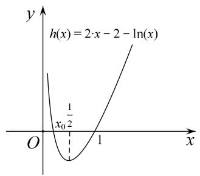
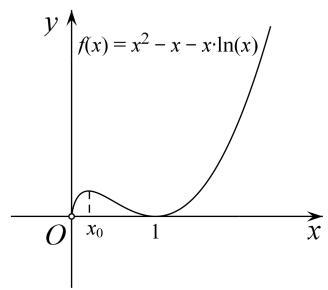

# 专题17 单变量不含参不等式证明方法之虚设零点

隐零点法本质上是最值分析法，常见形式是证明 $h(x)>0$ 或 $f(x)>g(x)$ . 对于 $f(x)>g(x)$ ，先将不等式移项，即构造函数 $h(x)=f(x)-g(x)$ ，转化为证不等式 $h(x)>0$ ，再转化为证明 $h(x)_{\min}>0$ 即可，但对函数 $h(x)$ 求导后， $f'(x)=0$ 是超越形式，我们无法利用目前所学知识求出导函数零点，但零点是存在的，我们称之为隐零点（即能确定其存在，但又无法用显性的代数表达）。用隐零点证明不等式时，先证明函数 $f'(x)$ 在某区上单调，然后用零点存在性定理说明只有一个零点．此时设出零点 $x_{0}$ ，则 $f'(x_{0})=0$ . $f(x)_{\min}=f(x_{0})$ ，而 $f(x_{0})$ 是一个超越式（含有指、对函数）和多项式函数的组合式，这时用 $f'(x_{0})=0$ 把超越式用代数式表示，同时根据 $x_{0}$ 的范围可进行适当的放缩．从而问题得以解决.

# 【例题选讲】

[例1] 已知函数 $f(x) = ae^{x} - b\ln x$ ，曲线 $y = f(x)$ 在点(1， $f(1)$ )处的切线方程为 $y = \left(\frac{1}{e} - 1\right)x + 1$ .  
（1）求 $a, b$ ;  
（2）证明： $f(x)>0$ .
解析 （1）函数 $f(x)$ 的定义域为 $(0, +\infty)$ . $f'(x)=ae^{x}-\frac{b}{x}$ ，由题意得 $f(1)=\frac{1}{e}$ , $f'（1）=\frac{1}{e}-1$ ,
所以 $\left\{\begin{aligned}a\mathrm{e}=\frac{1}{\mathrm{e}},\\ a\mathrm{e}-b=\frac{1}{\mathrm{e}}-1,\end{aligned}\right.$ 解得 $\left\{\begin{aligned}a=\frac{1}{\mathrm{e}^{2}},\\ b=1.\end{aligned}\right.$  
（2）证明：由（1）知 $f(x)=\frac{1}{\mathrm{e}^{2}}\cdot\mathrm{e}^{x}-\ln x(x>0)$ . 因为 $f'(x)=\mathrm{e}^{x-2}-\frac{1}{x}$ 在 $(0,+\infty)$ 上单调递增，又 $f'（1）<0,f'（2）>0$ 所以 $f'(x)=0$ 在 $(0,+\infty)$ 上有唯一实根 $x_{0}$ ，且 $x_{0}\in(1,2)$ .
当 $x \in (0, x_{0})$ 时， $f'(x) < 0$ ，当 $x \in (x_{0}, +\infty)$ 时， $f'(x) > 0$ ，
从而当 $x=x_{0}$ 时， $f(x)$ 取极小值，也是最小值．由 $f'(x_{0})=0$ ，得 $e^{x_{0}-2}=\frac{1}{x_{0}}$ ，则 $x_{0}-2=-\ln x_{0}$ .
故 $f(x) \geq f(x_0) = e^{x_0 - 2} - \ln x_0 = \frac{1}{x_0} + x_0 - 2 > 2\sqrt{\frac{1}{x_0} \cdot x_0} - 2 = 0$ ，所以 $f(x) > 0$ .

[例 2] (2015 全国I改编)设函数 $f(x)=\mathrm{e}^{2x}-a\ln x$ .  
（1）讨论 $f(x)$ 的导函数 $f'(x)$ 零点的个数；  
（2）求证：当 a=2 时， $f(x)\geq4$ .
解析 （1） 法一: $f(x) = 2 \mathrm{e}^{2x} - \frac{a}{x} (x > 0)$ .
当 $a \leq 0$ 时， $f'(x) > 0$ ， $f'(x)$ 没有零点．当 a > 0 时，设 $u(x) = e^{2x}$ ， $v(x) = -\frac{a}{x}$
因为 $u(x)=\mathrm{e}^{2x}$ 在 $(0,+\infty)$ 上单调递增， $v(x)=-\frac{a}{x}$ 在 $(0,+\infty)$ 上单调递增，
所以 $f'(x)$ 在 $(0, +\infty)$ 上单调递增.
又因为 $f(a)>0$ ，当 b 满足 $0<b<\frac{a}{4}$ 且 $b<\frac{1}{4}$ 时， $f'(b)<0$ ，所以当 a>0 时， $f'(x)$ 存在唯一零点.

法二： $f(x)=2\mathrm{e}^{2x}-\frac{a}{x}(x>0)$ . 令方程 $f(x)=0$ ，得 $a=2xe^{2x}(x>0)$ .
因为函数 $g(x)=2x(x>0)$ ， $h(x)=\mathrm{e}^{2x}(x>0)$ 均是函数值为正值的增函数，
所以由增函数的定义可证得函数 $u(x)=2xe^{2x}(x>0)$ 也是增函数，其值域是 $(0, +\infty)$ .
由此可得，当 $a \leq 0$ 时， $f'(x)$ 无零点；当 a > 0 时， $f'(x)$ 有唯一零点.  
（2）由（1）可设 $f'(x)$ 在 $(0, +\infty)$ 上的唯一零点为 $x_{0}$ .
当 $x \in (0, x_{0})$ 时， $f'(x) < 0$ ；当 $x \in (x_{0}, +\infty)$ 时， $f'(x) > 0$ .
所以 $f(x)$ 在 $(0, x_{0})$ 上单调递减，在 $(x_{0}, +\infty)$ 上单调递增，
当且仅当 $x=x_{0}$ 时， $f(x)$ 取得最小值，最小值为 $f(x_{0})$ .
因为 $2e^{2x_{0}} - \frac{2}{x_{0}} = 0$ ， $2x_{0} = -\ln x_{0}$ 所以 $f(x_{0}) = \frac{1}{x_{0}} + 4x_{0} \geq 4$ （当且仅当 $x_{0} = \frac{1}{2}$ 时等号成立）.
所以当 a=2 时， $f(x)\geq4$ .

[例 3] 已知函数 $f(x)=ax+\ln x$ ，函数 $g(x)$ 的导函数 $g'(x)=\mathrm{e}^{x}$ ，且 $g(0)g'（1）=\mathrm{e}$ ，其中 e 为自然对数的底数.  
（1）求 $f(x)$ 的极值;  
（2）当 a=0 时，对于任意的 $x\in(0,+\infty)$ ，求证： $f(x)<g(x)-2$ .
解析 （1）函数 $f(x)$ 的定义域为 $(0, +\infty)$ ， $f'(x)=a+\frac{1}{x}=\frac{ax+1}{x}$ .
当 $a \geq 0$ 时， $f'(x) > 0$ ，所以 $f(x)$ 在 $(0, +\infty)$ 上为增函数， $f(x)$ 没有极值；
当 a<0 时，令 $f(x)>0$ ，解得 $x<-\frac{1}{a}$ ，所以 $f(x)$ 在 $(0, -\frac{1}{a})$ 单调增，在 $(- \frac{1}{a}, +\infty)$ 单调递减.
所以 $f(x)$ 有极大值 $f(-\frac{1}{a}) = -1 - \ln(-a)$ ，无极小值.  
（2）当 a=1 时， $f(x)=\ln x$ ，令 $h(x)=g(x)-f(x)-2$ ，即 $h(x)=\mathrm{e}^{x}-\ln x-2$ ，即证 $g(x)_{\min}>0$ 恒成立，
$h'(x)=\mathrm{e}^{x}-\frac{1}{x},\quad h'(x)(0,+\infty)$ 在为增函数， $h'\left(\frac{1}{2}\right)<0,\quad h'（1）>0,$
$\therefore \exists x_{0}\in\left(\frac{1}{2},\quad1\right)$ ，使 $h'(x_{0})=0$ 成立，即 $e^{x_{0}}-\frac{1}{x_{0}}=0$ ，则当0<x<x\_{0}时， $h'(x)<0$ ，当 $x>x_{0}$ 时， $h'(x)>0$ ，
$\therefore y=h(x)$ 在 $(0, x_{0})$ 上单调递减，在 $(x_{0}, +\infty)$ 上单调递增，
$\therefore h(x)_{\min} = h(x_0) = \mathrm{e}^{x_0} - \ln x_0 - 2$ ，又 $\because \mathrm{e}^{x_0} - \frac{1}{x_0} = 0$ ，即 $\mathrm{e}^{x_0} = \frac{1}{x_0}$ ，
$\therefore h(x_0) = \mathrm{e}^{x_0} - \ln x_0 - 2 = \mathrm{e}^{x_0} + \ln \frac{1}{x_0} - 2 = \frac{1}{x_0} + x_0 - 2,$ 又 $\because x_0 \in \left(\frac{1}{2}, 1\right), \therefore x_0 + \frac{1}{x_0} > 2,$
∴ $h(x_{0})>0$ , ∴ $h(x)>h(x_{0})>0$ , 即 $f(x)<g(x)-2$ .

[例 4] (2017·全国II)已知函数 $f(x)=ax^{2}-ax-x\ln x$ ，且 $f(x)\geq0$ .  
（1）求 $a$ ;   
（2）证明： $f(x)$ 存在唯一的极大值点 $x_{0}$ ，且 $e^{-2}<f(x_{0})<2^{-2}$ .
解析 （1） $f(x)$ 的定义域为 $(0, +\infty)$ . 设 $g(x)=ax-a-\ln x$ ，则 $f(x)=xg(x)$ ， $f(x)\geq0$ 等价于 $g(x)\geq0$ .
因为 $g(1)=0,\quad g(x)\geq0$ ，故 $g'（1）=0$ ，而 $g'(x)=a-\frac{1}{x}$ ， $g'（1）=a-1$ ，得 a=1。
若 a=1，则 $g'(x)=1-\frac{1}{x}$ . 当 0<x<1 时， $g'(x)<0$ ， $g(x)$ 单调递减；当 x>1 时， $g'(x)>0$ ， $g(x)$ 单调递增.
所以 x=1 是 $g(x)$ 的极小值点，故 $g(x)\geq g(1)=0$ 。综上，a=1。  
（2）由（1）知 $f(x)=x^{2}-x-x\ln x,\quad f'(x)=2x-2-\ln x.$
设 $h(x)=2x-2-\ln x$ ，则 $h'(x)=2-\frac{1}{x}$ 。当 $x\in\left(0,\frac{1}{2}\right)$ 时， $h'(x)<0$ ；当 $x\in\left(\frac{1}{2},+\infty\right)$ 时， $h'(x)>0$ 。
所以 $h(x)$ 在 $\left(0, \frac{1}{2}\right)$ 单调递减，在 $\left(\frac{1}{2}, +\infty\right)$ 单调递增．又 $h(e^{-2})>0,\quad h\left(\frac{1}{2}\right)<0,\quad h(1)=0,$
所以 $h(x)$ 在 $\left(0, \frac{1}{2}\right)$ 有唯一零点 $x_{0}$ ，在 $\left[\frac{1}{2}, +\infty\right]$ 有唯一零点 1，且当 $x \in (0, x_0)$ 时， $h(x) > 0$ ；当 $x \in (x_0, 1)$ 时， $h(x) < 0$ ；当 $x \in (1, +\infty)$ 时， $h(x) > 0$ 。因为 $f'(x) = h(x)$ ，所以 $x = x_0$ 是 $f(x)$ 的唯一极大值点。由 $f'(x_0) = 0$ 得 $\ln x_0 = 2(x_0 - 1)$ ，故 $f(x_0) = x_0(1 - x_0)$ 。由 $x_0 \in (0, 1)$ 得 $f(x_0) < \frac{1}{4}$ 。因为 $x = x_0$ 是 $f(x)$ 在 $(0, 1)$ 的最大值点，由 $\mathrm{e}^{-1} \in (0, 1)$ ， $f'(\mathrm{e}^{-1}) \neq 0$ 得 $f(x_0) > f(\mathrm{e}^{-1}) = \mathrm{e}^{-2}$ ，所以 $\mathrm{e}^{-2} < f(x_0) < 2^{-2}$ 。

# 【对点精练】

1. (2013·全国II改编)设函数 $f(x) = \mathrm{e}^{x} - \ln (x + m)$ .  
（1）若 x=0 是 $f(x)$ 的极值点，求 m 的值，并讨论 $f(x)$ 的单调性；  
（2）当 m=2 时，求证： $f(x)>0$ .

1. 解析 $（1）f'(x) = \mathrm{e}^{x} - \frac{1}{x + m}$ . 由 $x = 0$ 是 $f(x)$ 的极值点得 $f'（0） = 0$ , 所以 $m = 1$ .
于是 $f(x)=\mathrm{e}^{x}-\ln(x+1)$ ，定义域为 $(-1, +\infty)$ ， $f'(x)=\mathrm{e}^{x}-\frac{1}{x+1}$ .

函数 $f(x)=\mathrm{e}^{x}-\frac{1}{x+1}$ 在 $(-1,+\infty)$ 单调递增，且 $f(0)=0$ .
因此当 $x \in (-1, 0)$ 时， $f'(x) < 0$ ；当 $x \in (0, +\infty)$ 时， $f'(x) > 0$ .
所以 $f(x)$ 在 $(-1, 0)$ 单调递减，在 $(0, +\infty)$ 单调递增.  
（2）当 m=2 时，函数 $f'(x)=\mathrm{e}^{x}-\frac{1}{x+2}$ 在 $(-2,+\infty)$ 单调递增．又 $f'(-1)<0,\ f'（0）>0,$
故 $f(x)=0$ 在 $(-2, +\infty)$ 有唯一实根 $x_{0}$ ，即 $f(x_{0})=0$ 得 $e^{x_{0}}=\frac{1}{x_{0}+2}$ ， $\ln(x_{0}+2)=-x_{0}$ ，且 $x_{0}\in(-1, 0)$ .
当 $x \in (-2, x_{0})$ 时， $f'(x) < 0$ ；当 $x \in (x_{0}, +\infty)$ 时， $f'(x) > 0$ ，从而当 $x = x_{0}$ 时， $f(x)$ 取得最小值.
所以 $f(x)$ 在 $(-2, x_{0})$ 上单调递减，在 $(x_{0}, +\infty)$ 单调递增.
故 $f(x) \geq f(x_0) = \frac{1}{x_0 + 2} + x_0 = \frac{(x_0 + 1)^2}{x_0 + 2} > 0$ . 综上，当 $m = 2$ 时， $f(x) > 0$ .

2. 已知函数 $f(x)=x^{2}-(a-2)x-a\ln x,\quad a>0$ .  
（1）求函数 $y=f(x)$ 的单调区间；  
（2）当 a=1 时，证明：对任意的 x>0， $f(x)+\mathrm{e}^{x}>x^{2}+x+2$ .

2. 解析 （1） $f(x)=x^{2}-(a-2)x-a\ln x,\quad a>0$ ，定义域为 $(0,+\infty)$ ， $f'(x)=2x-(a-2)-\frac{a}{x}=\frac{(2x-a)(x+1)}{x}$ ，
令 $f'(x)>0$ ，得 $x>\frac{a}{2}$ ; 令 $f'(x)<0$ ，得 $0<x<\frac{a}{2}$ .
∴函数 $y=f(x)$ 的单调递减区间为 $\left(0, \frac{a}{2}\right)$ ，单调递增区间为 $\left(\frac{a}{2}, +\infty\right)$ .  
（2）方法一 $\because a=1,\therefore f(x)=x^{2}+x-\ln x(x>0)$ ，即证 $e^{x}-\ln x-2>0$ 恒成立，
令 $g(x)=\mathrm{e}^{x}-\ln x-2,\quad x\in(0,+\infty)$ ，即证 $g(x)_{\min}>0$ 恒成立，
$g'(x)=\mathrm{e}^{x}-\frac{1}{x},\quad g'(x)$ 为增函数， $g'\left(\frac{1}{2}\right)<0,\quad g'（1）>0,$
$\therefore \exists x_0 \in \left(\frac{1}{2}, 1\right)$ ，使 $g'(x_0) = 0$ 成立，即 $\mathrm{e}^{x_0} - \frac{1}{x_0} = 0$ ，则当 $0 < x < x_0$ 时， $g'(x) < 0$ ，当 $x > x_0$ 时， $g'(x) > 0$
$\therefore y=g(x)$ 在 $(0, x_{0})$ 上单调递减，在 $(x_{0}, +\infty)$ 上单调递增，
$\therefore g(x)_{\min} = g(x_0) = \mathrm{e}^{x_0} - \ln x_0 - 2$ ，又 $\because \mathrm{e}^{x_0} - \frac{1}{x_0} = 0$ ，即 $\mathrm{e}^{x_0} = \frac{1}{x_0}$ ，
$\therefore g(x_0) = \mathrm{e}^{x_0} - \ln x_0 - 2 = \mathrm{e}^{x_0} + \ln \frac{1}{x_0} - 2 = \frac{1}{x_0} + x_0 - 2,$ 又 $\because x_0 \in \left(\frac{1}{2}, 1\right), \therefore x_0 + \frac{1}{x_0} > 2,$
∴ $g(x_{0})>0$ ，即对任意的 x>0， $f(x)+\mathrm{e}^{x}>x^{2}+x+2$ .
方法二 令 $\varphi(x)=\mathrm{e}^{x}-x-1,\quad\therefore\varphi'(x)=\mathrm{e}^{x}-1,$
∴ $\varphi(x)$ 在 $(-∞, 0)$ 上单调递减，在 $(0, +∞)$ 上单调递增，∴ $\varphi(x)_{\min} = \varphi(0) = 0$ ，∴ $e^{x} ≥ x + 1$ ，①
令 $h(x)=\ln x-x+1(x>0)$ ，∴ $h'(x)=\frac{1}{x}-1=\frac{1-x}{x}$ ,
∴ $h(x)$ 在 $(0,1)$ 上单调递增，在 $(1, +\infty)$ 上单调递减，∴ $h(x)_{\max} = h(1) = 0$ ,
$\therefore \ln x \leq x - 1, \quad \therefore x + 1 \geq \ln x + 2, \tag {②}$
要证 $f(x)+\mathrm{e}^{x}>x^{2}+x+2$ ，即证 $e^{x}>\ln x+2$ ，
由①②知 $e^{x} \geq x + 1 \geq \ln x + 2$ ，且两等号不能同时成立，
$\therefore e^{x}>\ln x+2$ ，即证原不等式成立.

3. 已知函数 $f(x) = \mathrm{e}^{-x} + ax (a \in \mathbf{R})$ .  
（1）讨论 $f(x)$ 的最值;  
（2）若 a=0，证明： $f(x)>-\frac{1}{2}x^{2}+\frac{5}{8}$ .

3. 解析 （1）依题意，得 $f(x) = -\mathrm{e}^{-x} + a$ .

①当 $a \leq 0$ 时， $f'(x) < 0$ ，所以 $f(x)$ 在 R 单调递减，故 $f(x)$ 不存在最大值和最小值；
②当 a>0 时，由 $f'(x)=0$ 得， $x=-\ln a$ .
当 $x \in (-\infty, -\ln a)$ 时， $f'(x) < 0$ ， $f(x)$ 为减函数，当 $x \in (-\ln a, +\infty)$ 时， $f'(x) > 0$ ， $f(x)$ 为增函数， $\therefore f(x)_{\min} = f(x)_{\text{极小值}} = f(-\ln a) = a - a\ln a$ ，无最大值.

综上，当 $a \leq 0$ 时， $f(x)$ 不存在最大值和最小值；当 a > 0 时， $f(x)$ 的最小值为 $a - a \ln a$ 。无最大值。  
（2） 当 $a=0$ , $f(x)=e^{-x}$ , 设 $g(x)=e^{-x}+\frac{1}{2}x^{2}-\frac{5}{8}$ , 则 $g'(x)=-e^{-x}+x$ ,
设 $p(x) = -\mathrm{e}^{-x} + x$ ，由 $p'(x) = \mathrm{e}^{-x} + 1 > 0$ ，可知 $g'(x)$ 在 R 上单调递增。因为 $g'(\frac{1}{2}) < 0$ ， $g'（1） > 0$ ，
所以存在唯一的 $x_{0}\in(\frac{1}{2},1)$ ，使得 $g'(x_{0})=0$ 。即 $e^{-x_{0}}=x_{0}$
∴ 当 $x \in (-\infty, \quad x_{0})$ 时， $g'(x) < 0$ ， $g(x)$ 为减函数，当 $x \in (x_{0}, +\infty)$ 时， $g'(x) > 0$ ， $g(x)$ 为增函数，故当 $x = x_{0}$ 时， $g(x)$ 取得极小值，也是最小值，即 $g(x)_{\min} = g(x_{0}) = e^{-x_{0}} + \frac{1}{2} x_{0}^{2} - \frac{5}{8}$ .
由 $e^{-x_{0}}=x_{0}$ ，所以 $g(x_{0})=\frac{1}{2}x_{0}^{2}+x_{0}-\frac{5}{8}$ 。又 $x_{0}\in(\frac{1}{2},1)$ ,
所以 $g(x_{0})=\frac{1}{2}x_{0}^{2}+x_{0}-\frac{5}{8}>\frac{1}{2}\times(\frac{1}{2})^{2}+\frac{1}{2}-\frac{5}{8}=0$ ，所以 $g(x)\geq g(x_{0})=0$ ，即 $e^{-x}>-\frac{1}{2}x^{2}+\frac{5}{8}$
所以不等式 $f(x)>-\frac{1}{2}x^{2}+\frac{5}{8}$ 成立.

4. 已知 $f(x)=(x-1)e^{x}+\frac{1}{2}ax^{2}$ .  
（1）当 $a = \mathrm{e}$ 时，求 $f(x)$ 的极值；  
（2）对 $\forall x > 1$ ，求证： $f(x)\geq \frac{1}{2} ax^{2} + x + 1 + \ln (x - 1).$

4. 解析 （1） 当 $a = \mathrm{e}$ 时, $f'(x) = x(\mathrm{e}^x + \mathrm{e})$ .
当 $x \in (-\infty, 0)$ 时， $f'(x) < 0$ ， $f(x)$ 为减函数，当 $x \in (0, +\infty)$ 时， $f'(x) > 0$ ， $f(x)$ 为增函数，
$\therefore f(x)_{极小值}=f(0)=-1$ ，无极大值.  
（2）令 $g(x)=f(x)-\ln(x-1)-\frac{1}{2}ax^{2}-x-1=(x-1)e^{x}-\ln(x-1)-x-1,\quad x\in(1,+\infty),$
$g ^ {'} (x) = x \mathrm{e} ^ {x} - \frac {1}{x - 1} - 1 = x \mathrm{e} ^ {x} - \frac {x}{x - 1} = x \left(\mathrm{e} ^ {x} - \frac {1}{x - 1}\right), x \in (1, + \infty).$
令 $h(x)=\mathrm{e}^{x}-\frac{1}{x-1},\quad x\in(1,+\infty),\quad h'(x)=\mathrm{e}^{x}+\frac{1}{(x-1)^{2}}>0,$
∴ $h(x)$ 为 $(1, +\infty)$ 上的增函数， $h(2)=\mathrm{e}^{2}-1>0$ ，取 $x-1=\mathrm{e}^{-2}$ ， $x=1+\mathrm{e}^{-2}$ ， $h(1+\mathrm{e}^{-2})=\mathrm{e}^{1+\mathrm{e}^{-2}}-\mathrm{e}^{2}<0$ ，
∴存在唯一的 $x_{0}\in(1,2)$ 使 $h(x_{0})=0$ ，即 $e^{x_{0}}=\frac{1}{x_{0}-1}$ ,
∴当 $x \in (1, x_{0})$ 时， $h(x) < 0$ ， $g'(x) < 0$ ， $g(x)$ 为减函数，当 $x \in (x_{0}, +\infty)$ 时， $h(x) > 0$ ， $g'(x) > 0$ ， $g(x)$ 为增函数，
$\therefore g (x) _ {\min} = g \left(x _ {0}\right) = \left(x _ {0} - 1\right) \mathrm{e} ^ {x _ {0}} - \ln \left(x _ {0} - 1\right) - x _ {0} - 1 = \left(x _ {0} - 1\right) \times \frac {1}{x _ {0} - 1} - \ln \mathrm{e} ^ {- x _ {0}} - x _ {0} - 1 = 1 + x _ {0} - x _ {0} - 1 = 0,$
∴对 $\forall x>1,\quad g(x)\geq g(x_{0})=0$ ，即 $f(x)\geq\frac{1}{2}ax^{2}+x+1+\ln(x-1)$ .

5. 已知函数 $f(x)=\ln x+\frac{1}{2}ax^{2}+x+1$ .  
（1）当 a = -2 时，求 $f(x)$ 的极值点；  
（2）当 a=0 时，证明：对任意的 x>0，不等式 $xe^{x}\geq f(x)$ 恒成立.

5. 解析 （1） 当 $a = -2$ 时, $f(x) = \ln x - x^2 + x + 1$ .
$f ^ {'} (x) = \frac {1}{x} - 2 x + 1 = \frac {- 2 x ^ {2} + x + 1}{x} = - \frac {(2 x + 1) (x - 1)}{x}.$
因为 $f(x)$ 的定义域为 $(0, +\infty)$ ，所以，x=1。
当 $x \in (0, 1)$ 时， $f'(x) > 0$ ， $f(x)$ 为增函数；当 $x \in (1, +\infty)$ 时， $f'(x) < 0$ ， $f(x)$ 为减函数。
所以， $f(x)$ 的极值点为 x=1。  
（2）当 a=0 时，要证对任意的 x>0，不等式 $xe^{x}\geq f(x)$ 恒成立，
即证 x>0 时， $xe^{x}\geq\ln x+x+1$ 恒成立，即证 $x(e^{x}-1)-\ln x-1\geq0$ 恒成立，
令 $g(x)=x(\mathrm{e}^{x}-1)-\ln x-1,\quad g'(x)=x(\mathrm{e}^{x}+1)-\frac{1}{x}-1=\frac{(x+1)(xe^{x}-1)}{x},$
再令 $h(x)=xe^{x}-1,\quad h'(x)=(x+1)e^{x}>0,\quad\therefore h(x)$ 为 $(0,+\infty)$ 上的增函数，
又 $h(0)=-1<0,\quad h(1)=\mathrm{e}-1>0,$
∴存在唯一的 $x_{0}\in(0,1)$ 使 $h(x_{0})=0$ ，即 $x_{0}e^{x_{0}}-1=0$ ，
∴ 当 $x \in (0, x_{0})$ 时， $h(x) < 0$ ， $g'(x) < 0$ ， $g(x)$ 为减函数，当 $x \in (x_{0}, 1)$ 时， $h(x) > 0$ ， $g'(x) > 0$ ， $g(x)$ 为增函数，
$\therefore g(x)_{\min} = g(x_0) = x_0(\mathrm{e}^{x_0} - 1) - \ln x_0 - 1 = x_0\mathrm{e}^{x_0} - \ln x_0 - x_0 - 1$ ，由 $x_0\mathrm{e}^{x_0} - 1 = 0$ ，得 $x_0\mathrm{e}^{x_0} = 1$ ， $-\ln x_0 = x_0.$
$\therefore g (x) _ {\min} = g \left(x _ {0}\right) = 1 - x _ {0} - 1 + x _ {0} = 0$
∴对 $\forall x>0,\quad g(x)\geq g(x_{0})=0,\quad xe^{x}\geq\ln x+x+1$ 恒成立，即对任意的x>0，不等式 $xe^{x}\geq f(x)$ 恒成立.

6. 设函数 $f(x)=x+ax\ln x(a\in\mathbf{R})$ .  
（1）讨论函数 $f(x)$ 的单调性;  
（2）若函数 $f(x)$ 的极大值点为 x=1，证明： $f(x)\leq e^{-x}+x^{2}$ .

6. 解析 （1） $f(x)$ 的定义域为 $(0, +\infty)$ , $f'(x)=1+a\ln x+a$ ,
当 a=0 时， $f(x)=x$ ，则函数 $f(x)$ 在区间 $(0, +\infty)$ 上单调递增；
当 a>0 时，由 $f(x)>0$ 得 $x>\mathrm{e}^{-\frac{a+1}{a}}$ ，由 $f'(x)<0$ 得 $0<x<\mathrm{e}^{-\frac{a+1}{a}}$ .
所以 $f(x)$ 在区间 $\left[\frac{-a+1}{a},\quad\right]$ 上单调递减，在区间 $\left[\frac{-a+1}{a},+\infty\right]$ 上单调递增；
当 a<0 时，由 $f'(x)>0$ 得 $0<x<e^{-\frac{a+1}{a}}$ ，由 $f'(x)<0$ 得 $x>e^{-\frac{a+1}{a}}$ ，
所以函数 $f(x)$ 在区间 $\left(-\frac{a+1}{a}\right)$ 上单调递增，在区间 $\left(-\frac{a+1}{a}, +\infty\right)$ 上单调递减.
综上所述，当 a=0 时，函数 $f(x)$ 在区间 $(0, +\infty)$ 上单调递增；
当 a>0 时，函数 $f(x)$ 在区间 $\left[\frac{-a+1}{a}\right]$ 上单调递减，在区间 $\left[\frac{-a+1}{a}, +\infty\right]$ 上单调递增；
当 a<0 时，函数 $f(x)$ 在区间 $\left[\frac{-a+1}{a}\right]$ 上单调递增，在区间 $\left[\frac{-a+1}{a}, +\infty\right]$ 上单调递减.  
（2）由（1）知 $a < 0$ 且 $\mathrm{e}^{-\frac{a + 1}{a}} = 1$ ，解得 $a = -1$ ， $f(x) = x - x\ln x$ 要证 $f(x)\leq \mathrm{e}^{-x} + x^2$
即证 $x - x \ln x \leq e^{-x} + x^{2}$ ，即证 $1 - \ln x \leq \frac{e^{-x}}{x} + x$ .
令 $F(x)=\ln x+\frac{\mathrm{e}^{-x}}{x}+x-1(x>0)$ ，则 $F'(x)=\frac{1}{x}+\frac{-\mathrm{e}^{-x}x-\mathrm{e}^{-x}}{x^{2}}+1=\frac{(x+1)(x-\mathrm{e}^{-x})}{x^{2}}.$
令 $g(x)=x-e^{-x}$ ，得函数 $g(x)$ 在区间 $(0,+\infty)$ 上单调递增．而 $g(1)=1-\frac{1}{e}>0,\quad g(0)=-1<0,$
所以在区间 $(0, +\infty)$ 上存在唯一的实数 $x_0$ ，使得 $g(x_0) = x_0 - \mathrm{e}^{-x_0} = 0$ ，即 $x_0 = \mathrm{e}^{-x_0}$ ，且 $x \in (0, x_0)$ 时， $g(x) < 0$ ， $x \in (x_0, +\infty)$ 时， $g(x) > 0$ 。
故 $F(x)$ 在 $(0, x_0)$ 上单调递减，在 $(x_0, +\infty)$ 上单调递增． $\therefore F(x)_{\min} = F(x_0) = \ln x_0 + \frac{e^{-x_0}}{x_0} + x_0 - 1.$
又 $\mathrm{e}^{-x_0} = x_0$ ， $\therefore F(x)_{\min} = \ln x_0 + \frac{\mathrm{e}^{-x_0}}{x_0} +x_0 - 1 = -x_0 + 1 + x_0 - 1 = 0.\quad \therefore F(x)\geq F(x_0) = 0$ 成立，
即 $f(x) \leq e^{-x} + x^{2}$ 成立.

