# 专题18 单变量不含参不等式证明方法之凹凸反转

# 一、凹函数、凸函数的几何特征

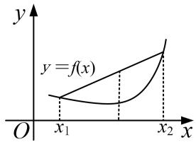

text_image

y
y = f(x)
O x₁ x₂ x

图象上任意弧段位于所在弦的下方的函数为凹函数

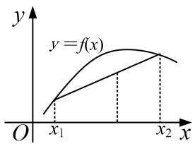

text_image

y
y=f(x)
O x₁ x₂ x

图象上任意弧段位于所在弦的上方的函数为凸函数

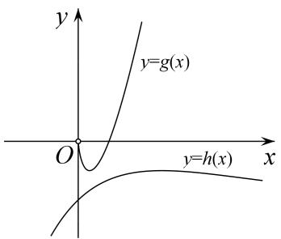

text_image

y
y=g(x)
O
y=h(x)
x

# 二、凹凸反转

很多时候, 我们需要证明 $f(x) > 0$ , 但不代表就要证明 $f(x)_{\min} > 0$ , 因为大多数情况下, $f'(x)$ 的零点是解不出来的. 当然, 导函数的零点如果解不出来, 可以用设隐零点的方法, 但是隐零点也不是万能的方法, 如果隐零点法不行可尝试用凹凸反转. 如要证明 $f(x) > 0$ , 可把 $f(x)$ 拆分成两个函数 $g(x)$ , $h(x)$ , 放在不等式的两边, 即要证 $g(x) > h(x)$ , 只要证明了 $g(x)_{\min} > h(x)_{\max}$ 即可, 如上右图, 这个命题显然更强, 注意反过来不一定成立. 很明显, $g(x)$ 是凹函数, $h(x)$ 是凸函数, 因为这两个函数的凹凸性刚好相反, 所以称为凹凸反转. 凹凸反转与隐零点都是用来处理导函数零点不可求问题的, 两种方法互为补充.

凹凸反转关键是如何分离，常见的不等式是由指数函数、对数函数、分式函数和多项式函数构成，当我们构造差值函数不易求出导函数零点时(当然可以考虑用隐零点的方法)，要考虑指、对分离(对数单身狗，指数找基友，指对在一起，常常要分手)，即指数函数和多项式函数组合与对数函数和多项式函数组合分开，构造两个单峰函数，然后利用导数分别求两个函数的最值并进行比较．当然我们要非常熟练掌握一些常见的指(对)数函数和多项式组合的函数的图象与最值.

# 三、六大经典超越函数的图象和性质

# 1. $x$ 与 $\mathrm{e}^x$ 的组合函数的图象与性质

<table><tr><td>函数</td><td> $f(x)=xe^{x}$ </td><td> $f(x)=\frac{e^{x}}{x}$ </td><td> $f(x)=\frac{x}{e^{x}}$ </td></tr><tr><td>图象</td><td>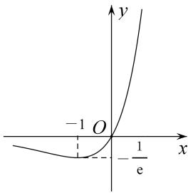</td><td>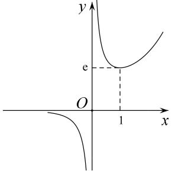</td><td>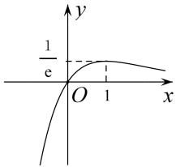</td></tr><tr><td>定义域</td><td>R</td><td> $(-∞, 0)∪(0, +∞)$ </td><td>R</td></tr><tr><td>值域</td><td> $\left[-\frac{1}{e}, +\infty\right]$ </td><td> $(-\infty, 0) \cup [(e, +\infty)$ </td><td> $(-\infty, \frac{1}{e}]$ </td></tr><tr><td>单调性</td><td>在 $(-\infty, -1)$ 上递减在 $(-1, +\infty)$ 上递增</td><td>在 $(-\infty, 0), (0, 1)$ 上递减在 $(1, +\infty)$ 上递增</td><td>在 $(-\infty, 1)$ 上递增在 $(1, +\infty)$ 上递减</td></tr><tr><td>最值</td><td> $f(x)_{\min} = f(-1) = -\frac{1}{e}$ </td><td>当 $x > 0$ 时, $f(x)_{\min} = f(1) = \frac{1}{e}$ </td><td> $f(x)_{\max} = f(1) = \frac{1}{e}$ </td></tr></table>

# 2. $x$ 与 $\ln x$ 的组合函数的图象与性质

<table><tr><td>函数</td><td> $f(x)=x\ln x$ </td><td> $f(x)=\frac{\ln x}{x}$ </td><td> $f(x)=\frac{x}{\ln x}$ </td></tr><tr><td>图象</td><td>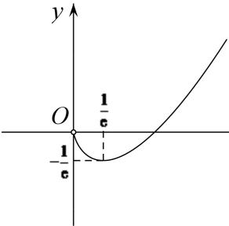</td><td>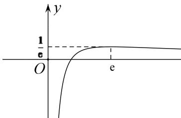</td><td>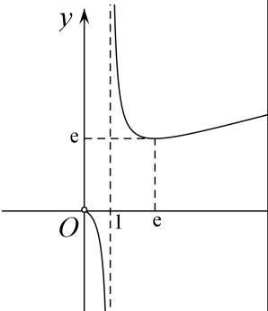</td></tr><tr><td>定义域</td><td>(0, +∞)</td><td>(0, +∞)</td><td>(0, 1)∪(1, +∞)</td></tr><tr><td>值域</td><td>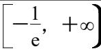</td><td>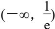</td><td>(-∞, 0)∪[e, +∞)</td></tr><tr><td>单调性</td><td>在(0,  $\frac{1}{e}$ )上递减在( $\frac{1}{e}$ , +∞)上递增</td><td>在(0, e)上递增在(e, +∞)上递减</td><td>在(0, 1), (1, e)上递减在(e, +∞)上递增</td></tr><tr><td>最值</td><td> $f(x)_{\min}=f(\frac{1}{e})=-\frac{1}{e}$ </td><td> $f(x)_{\max}=f(e)=\frac{1}{e}$ </td><td>当x&gt;0时, $f(x)_{\min}=f(e)=e$ </td></tr></table>

# 【例题选讲】

[例 1] (2014·全国I) 设函数 $f(x)=ae^{x}\ln x+\frac{be^{x-1}}{x}$ ，曲线 $y=f(x)$ 在点 $(1, f(1))$ 处的切线为 $y=e(x-1)+2$ .

(1)求 $a, b$ ;   
(2)证明： $f(x)>1$ .

[例 2] 已知函数 $f(x)=\frac{x^{2}+mx+1}{\mathrm{e}^{x}}(m\in\mathbf{R})$ .

(1)求函数 $f(x)$ 的单调区间；  
(2)当 m=0 时，证明： $\forall x>0,\quad\mathrm{ex}^{2}(1+\ln x)+\frac{1}{\mathrm{e}^{x}}>f(x)-xf(1).$

[例 3] 已知 $f(x)=\ln x+\frac{2}{ex}$ .

(1)若函数 $g(x)=xf(x)$ ，讨论 $g(x)$ 的单调性与极值；

(2)证明： $f(x)>\frac{1}{\mathrm{e}^{x}}.$

[例 4] 已知 $f(x)=x \ln x - ax$ , $g(x)=-x^{2}-2$ .

(1)当 $a = -1$ 时，求 $f(x)$ 在 $[m, m + 3](m > 0)$ 的最值；  
(2)求证： $\forall x\in (0, + \infty)$ ， $\ln x + 1 > \frac{1}{e^x} -\frac{2}{ex}$

# 【对点精练】

1. 已知函数 $f(x)=\mathrm{e}\ln x-ax(a\in\mathbf{R})$ .

(1)讨论 $f(x)$ 的单调性;  
(2)当 $a = \mathrm{e}$ 时，证明： $xf(x) - \mathrm{e}^x +2\mathrm{e}x\leq 0$

2. 已知 $f(x) = \mathrm{e}^{x} - a\ln x - a$ ，其中常数 $a > 0$ .

(1)当 $a = \mathrm{e}$ 时，求函数 $f(x)$ 的极值；  
(2)求证： $\mathrm{e}^{2x - 2} - \mathrm{e}^{x - 1}\ln x - x\geq 0$

3. 设函数 $f(x) = \ln x + \frac{a}{x} - x$ .

(1)当 $a = -2$ 时，求 $f(x)$ 的极值；  
(2)当 $a = 1$ 时，证明： $f(x) - \frac{1}{e^x} + x > 0$ 在 $(0, +\infty)$ 上恒成立.

4. 已知 $f(x)=x\ln x$ ， $g(x)=-x^{2}+ax-3$ .

(1)若对一切 $x \in (0, +\infty)$ ， $2f(x) \geq g(x)$ 恒成立，求实数 a 的取值范围.  
(2)证明：对一切 $x \in (0, +\infty)$ ， $\ln x > \frac{1}{\mathrm{e}^x} - \frac{2}{\mathrm{e}x}$ 恒成立.

5. 已知函数 $f(x) = \ln x + \frac{a}{x}$ , $g(x) = e^{-x} + bx$ , $a, b \in \mathbf{R}$ , $e$ 为自然对数的底数.

(1)若函数 $y=g(x)$ 在 R 上存在零点，求实数 b 的取值范围；  
(2)若函数 $y = f(x)$ 在 $x = \frac{1}{\mathrm{e}}$ 处的切线方程为 $\mathrm{ex} + y - 2 + b = 0$ . 求证：对任意的 $x \in (0, +\infty)$ ，总有 $f(x) > g(x)$ .

6. 已知 $f(x)=x\ln x$ .

(1)求函数 $f(x)$ 在 $[t, t+2](t>0)$ 上的最小值；  
(2)证明：对一切 $x \in (0, +\infty)$ ，都有 $\ln x > \frac{1}{\mathrm{e}^x} - \frac{2}{\mathrm{e}x}$ 成立.

