# 专题18 单变量不含参不等式证明方法之凹凸反转

# 一、凹函数、凸函数的几何特征

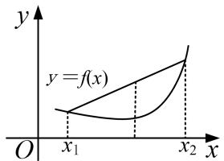

text_image

y
y = f(x)
O x₁ x₂ x

图象上任意弧段位于所在弦的下方的函数为凹函数

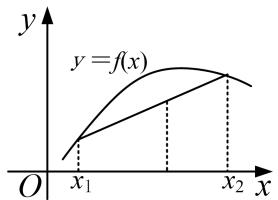

text_image

y
y=f(x)
O x₁ x₂ x

图象上任意弧段位于所在弦的上方的函数为凸函数

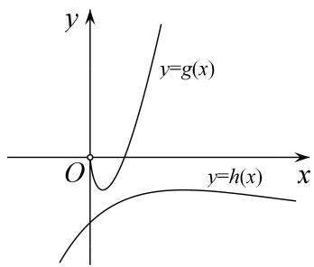

text_image

y
y=g(x)
O
y=h(x)
x

# 二、凹凸反转

很多时候，我们需要证明 $f(x) > 0$ ，但不代表就要证明 $f(x)_{\min} > 0$ ，因为大多数情况下， $f'(x)$ 的零点是解不出来的。当然，导函数的零点如果解不出来，可以用设隐零点的方法，但是隐零点也不是万能的方法，如果隐零点法不行可尝试用凹凸反转。如要证明 $f(x) > 0$ ，可把 $f(x)$ 拆分成两个函数 $g(x)$ ， $h(x)$ ，放在不等式的两边，即要证 $g(x) > h(x)$ ，只要证明了 $g(x)_{\min} > h(x)_{\max}$ 即可，如上右图，这个命题显然更强，注意反过来不一定成立。很明显， $g(x)$ 是凹函数， $h(x)$ 是凸函数，因为这两个函数的凹凸性刚好相反，所以称为凹凸反转。凹凸反转与隐零点都是用来处理导函数零点不可求问题的，两种方法互为补充。

凹凸反转关键是如何分离，常见的不等式是由指数函数、对数函数、分式函数和多项式函数构成，当我们构造差值函数不易求出导函数零点时(当然可以考虑用隐零点的方法)，要考虑指、对分离(对数单身狗，指数找基友，指对在一起，常常要分手)，即指数函数和多项式函数组合与对数函数和多项式函数组合分开，构造两个单峰函数，然后利用导数分别求两个函数的最值并进行比较．当然我们要非常熟练掌握一些常见的指(对)数函数和多项式组合的函数的图象与最值.

# 三、六大经典超越函数的图象和性质

# 1. $x$ 与 $\mathrm{e}^x$ 的组合函数的图象与性质

<table><tr><td>函数</td><td> $f(x)=xe^x$ </td><td> $f(x)=\frac{e^x}{x}$ </td><td> $f(x)=\frac{x}{e^x}$ </td></tr><tr><td>图象</td><td>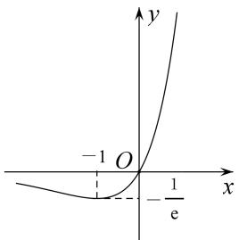</td><td>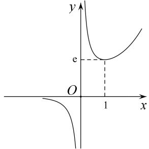</td><td>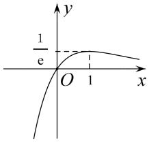</td></tr><tr><td>定义域</td><td>R</td><td> $(-∞,0)∪(0,+∞)$ </td><td>R</td></tr><tr><td>值域</td><td>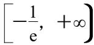</td><td> $(-∞,0)∪[(e,+∞)$ </td><td> $(-∞,\frac{1}{e}]$ </td></tr><tr><td>单调性</td><td>在 $(-∞,-1)$ 上递减在 $(-1,+∞)$ 上递增</td><td>在 $(-∞,0),(0,1)$ 上递减在 $(1,+∞)$ 上递增</td><td>在 $(-∞,1)$ 上递增在 $(1,+∞)$ 上递减</td></tr><tr><td>最值</td><td> $f(x)_{\min}=f(-1)=-\frac{1}{e}$ </td><td>当x&gt;0时, $f(x)_{\min}=f(1)=\frac{1}{e}$ </td><td> $f(x)_{\max}=f(1)=\frac{1}{e}$ </td></tr></table>

# 2. $x$ 与 $\ln x$ 的组合函数的图象与性质

<table><tr><td>函数</td><td> $f(x)=x\ln x$ </td><td> $f(x)=\frac{\ln x}{x}$ </td><td> $f(x)=\frac{x}{\ln x}$ </td></tr><tr><td>图象</td><td>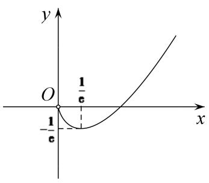</td><td>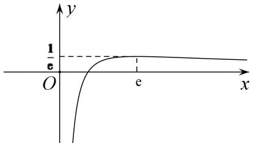</td><td>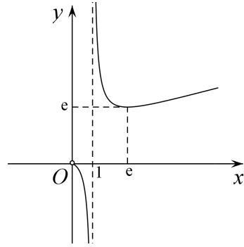</td></tr><tr><td>定义域</td><td>(0, +∞)</td><td>(0, +∞)</td><td>(0, 1)∪(1, +∞)</td></tr><tr><td>值域</td><td> $\left[-\frac{1}{e}, +\infty\right]$ </td><td>(-∞,  $\frac{1}{e}$ )</td><td>(-∞, 0)∪[e, +∞)</td></tr><tr><td>单调性</td><td>在(0,  $\frac{1}{e}$ )上递减在( $\frac{1}{e}$ , +∞)上递增</td><td>在(0, e)上递增在(e, +∞)上递减</td><td>在(0, 1), (1, e)上递减在(e, +∞)上递增</td></tr><tr><td>最值</td><td> $f(x)_{\min}=f(\frac{1}{e})=-\frac{1}{e}$ </td><td> $f(x)_{\max}=f(e)=\frac{1}{e}$ </td><td>当x&gt;0时, $f(x)_{\min}=f(e)=e$ </td></tr></table>

# 【例题选讲】

[例 1] (2014·全国I) 设函数 $f(x)=ae^{x}\ln x+\frac{be^{x-1}}{x}$ ，曲线 $y=f(x)$ 在点 $(1, f(1))$ 处的切线为 $y=e(x-1)+2$ .

(1)求 $a, b$ ;   
(2)证明： $f(x)>1$ .

解析 $(1)f'(x)=ae^{x}\left(\ln x+\frac{1}{x}\right)+\frac{be^{x-1}(x-1)}{x^{2}}(x>0)$ ，由于切线 $y=e(x-1)+2$ 的斜率为 e，图象过点 $(1,2)$ ，
所以 $\left\{\begin{aligned}f(1)&=2,\\ f'(1)&=e,\end{aligned}\right.$ 即 $\left\{\begin{aligned}b&=2,\\ ae&=e,\end{aligned}\right.$ 解得 $\left\{\begin{aligned}a&=1,\\ b&=2.\end{aligned}\right.$

(2)由(1)知 $f(x) = \mathrm{e}^{x}\ln x + \frac{2\mathrm{e}^{x - 1}}{x} (x > 0)$ ，从而 $f(x) > 1$ 等价于 $x\ln x > x\mathrm{e}^{-x} - \frac{2}{\mathrm{e}}$ .

构造函数 $g(x)=x\ln x$ ，则 $g'(x)=1+\ln x$ ，

所以当 $x \in \begin{pmatrix} 0, & \frac{1}{\mathrm{e}} \end{pmatrix}$ 时， $g'(x) < 0$ ，当 $x \in \begin{pmatrix} \frac{1}{\mathrm{e}}, & +\infty \end{pmatrix}$ 时， $g'(x) > 0$ ，

故 $g(x)$ 在 $\left(0, \frac{1}{e}\right)$ 上单调递减，在 $\left(\frac{1}{e}, +\infty\right)$ 上单调递增，

从而 $g(x)$ 在 $(0, +\infty)$ 上的最小值为 $g\left(\frac{1}{e}\right) = -\frac{1}{e}$ .

构造函数 $h(x)=xe^{-x}-\frac{2}{e}$ ，则 $h'(x)=\mathrm{e}^{-x}(1-x)$ .

所以当 $x \in (0, 1)$ 时， $h'(x) > 0$ ；当 $x \in (1, +\infty)$ 时， $h'(x) < 0$ ;

故 $h(x)$ 在 $(0, 1)$ 上单调递增，在 $(1, +\infty)$ 上单调递减，从而 $h(x)$ 在 $(0, +\infty)$ 上的最大值为 $h(1) = -\frac{1}{e}$ . 综上，当 x > 0 时， $g(x) > h(x)$ ，即 $f(x) > 1$ .

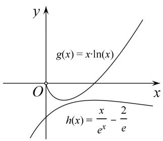

text_image

g(x) = x \cdot \ln(x)
h(x) = \frac{x}{e^x} - \frac{2}{e}

(例 1 图)

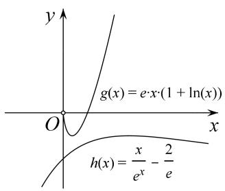

text_image

y
g(x) = e·x·(1 + ln(x))
O
x
h(x) = \frac{x}{e^x} - \frac{2}{e}

(例 2 图)

[例 2] 已知函数 $f(x)=\frac{x^{2}+mx+1}{e^{x}}(m\in\mathbf{R})$ .

(1)求函数 $f(x)$ 的单调区间；  
(2)当 $m = 0$ 时，证明： $\forall x > 0$ ， $\mathrm{ex}^2 (1 + \ln x) + \frac{1}{\mathrm{e}^x} >f(x) - xf(1).$

解析 (1)函数 $f(x)$ 的定义域为 $\mathbf{R}$ ， $f'(x)=\frac{(2x+m)\mathrm{e}^x-\mathrm{e}^x(x^2+mx+1)}{(\mathrm{e}^x)^2}=\frac{-x^2+(2-m)x+(m-1)}{\mathrm{e}^x}$

$$
= \frac {- [ x ^ {2} + (m - 2) x - (m - 1) ]}{\mathrm{e} ^ {x}} = - \frac {(x - 1) [ x + (m - 1) ]}{\mathrm{e} ^ {x}}, \text {令} f ^ {\prime} (x) = 0, \text {解得} x _ {1} = 1, x _ {2} = 1 - m.
$$

①当 m<0 时，1<1-m。故 $x\in(-\infty,1)$ 时， $f'(x)<0$ ，函数 $f(x)$ 单调递减； $x\in(1,1-m)$ 时， $f'(x)>0$ ，函数 $f(x)$ 单调递增； $x\in(1-m,+\infty)$ 时， $f'(x)<0$ ，函数 $f(x)$ 单调递减。  
②当 m=0 时，1=1-m， $f(x)\leq0$ 恒成立，函数 $f(x)$ 在 R 上单调递减.  
③当 m>0 时，1>1-m，故 $x\in(-\infty,1-m)$ 时， $f'(x)<0$ ，函数 $f(x)$ 单调递减； $x\in(1-m,1)$ 时， $f'(x)>0$ ，函数 $f(x)$ 单调递增； $x\in(1,+\infty)$ 时， $f'(x)<0$ ，函数 $f(x)$ 单调递减.

综上，当 m<0 时，函数 $f(x)$ 的单调递减区间为 $(-∞, 1)$ ， $(1-m, +∞)$ ，单调递增区间为 $(1, 1-m)$ ；当 m=0 时，函数 $f(x)$ 的单调递减区间为 R，无单调递增区间；当 m>0 时，函数 $f(x)$ 的单调递减区间为 $(-∞, 1-m)$ ， $(1, +∞)$ ，单调递增区间为 $(1-m, 1)$ 。

(2)当 m=0 时， $f(x)=\frac{x^{2}+1}{e^{x}}$ . 则所证不等式为 $\mathrm{ex}^{2}(1+\ln x)+\frac{1}{\mathrm{e}^{x}}>\frac{x^{2}+1}{\mathrm{e}^{x}}-\frac{2x}{\mathrm{e}}$ ,

即 $\mathrm{ex}^{2}(1+\ln x)>\frac{x^{2}}{\mathrm{e}^{x}}-\frac{2x}{\mathrm{e}}$ ，因为 x>0，所以所证不等式等价于 $\mathrm{ex}(1+\ln x)>\frac{x}{\mathrm{e}^{x}}-\frac{2}{\mathrm{e}}$ .

记函数 $g(x)=\mathrm{e}(x+x\ln x)$ ， $h(x)=\frac{x}{\mathrm{e}^{x}}-\frac{2}{\mathrm{e}}(x>0)$ 。则 $g'(x)=\mathrm{e}(2+\ln x)$ ，

所以当 $x \in \left(0, \frac{1}{\mathrm{e}^2}\right)$ 时， $g'(x) < 0$ ，函数 $g(x)$ 单调递减；当 $x \in \left(\frac{1}{\mathrm{e}^2}, +\infty\right)$ 时， $g'(x) > 0$ ，函数 $g(x)$ 单调递增。所以 $g(x) \geq g\left(\frac{1}{\mathrm{e}^2}\right) = \mathrm{e} \times \left(\frac{1}{\mathrm{e}^2} + \frac{1}{\mathrm{e}^2} \ln \frac{1}{\mathrm{e}^2}\right) = -\frac{1}{\mathrm{e}}$ 。

又 $h'(x)=\frac{1-x}{e^{x}}$ ，所以当 $x\in(0,1)$ 时， $h'(x)>0$ ，函数 $h(x)$ 单调递增；当 $x\in(1,+\infty)$ 时， $h'(x)<0$ ，函数 $h(x)$ 单调递减。故 $h(x)\leq h(1)=\frac{1}{e}-\frac{2}{e}=-\frac{1}{e}$ .

所以 $g(x)>h(x)$ ，即 $\mathrm{ex}(1+\ln x)>\frac{x}{\mathrm{e}^{x}}-\frac{2}{\mathrm{e}}$ 。综上，当 m=0 时， $\forall x>0,\quad\mathrm{ex}^{2}(1+\ln x)+\frac{1}{\mathrm{e}^{x}}>f(x)-xf(1)$ .

[例 3] 已知 $f(x)=\ln x+\frac{2}{ex}$ .

(1)若函数 $g(x)=xf(x)$ ，讨论 $g(x)$ 的单调性与极值；  
(2)证明： $f(x)>\frac{1}{\mathrm{e}^{x}}.$

解析 (1)由题意，得 $g(x)=x\cdot f(x)=x\ln x+\frac{2}{e}(x>0)$ ，则 $g'(x)=\ln x+1$ .

当 $x \in \begin{bmatrix} 0, & \frac{1}{\mathrm{e}} \end{bmatrix}$ 时， $g'(x) < 0$ ，所以 $g(x)$ 单调递减；当 $x \in \begin{bmatrix} \frac{1}{\mathrm{e}}, & +\infty \end{bmatrix}$ 时， $g'(x) > 0$ ，所以 $g(x)$ 单调递增，
所以 $g(x)$ 的单调递减区间为 $\begin{bmatrix}0,\frac{1}{\mathrm{e}}\end{bmatrix}$ ，单调递增区间为 $\begin{bmatrix}\frac{1}{\mathrm{e}}, & +\infty \end{bmatrix}$ ,所以 $g(x)$ 的极小值为 $g\left(\frac{1}{e}\right)=\frac{1}{e}$ ，无极大值.

(2)要证 $\ln x + \frac{2}{\mathrm{e}x} > \frac{1}{\mathrm{e}^{x}} (x > 0)$ 成立，只需证 $x \ln x + \frac{2}{\mathrm{e}} > \frac{x}{\mathrm{e}^{x}} (x > 0)$ 成立，令 $h(x) = \frac{x}{\mathrm{e}^{x}}$ ，则 $h'(x) = \frac{1 - x}{\mathrm{e}^{x}}$ ，当 $x \in (0, 1)$ 时， $h'(x) > 0$ ， $h(x)$ 单调递增，当 $x \in (1, +\infty)$ 时， $h'(x) < 0$ ， $h(x)$ 单调递减，所以 $h(x)$ 的极大值为 $h(1)$ ，即 $h(x) \leq h(1) = \frac{1}{\mathrm{e}}$ ，

由(1)知， $x\in(0,+\infty)$ 时， $g(x)\geq g\left(\frac{1}{e}\right)=\frac{1}{e}$

且 $g(x)$ 的最小值点与 $h(x)$ 的最大值点不同，所以 $x \ln x + \frac{2}{e} > \frac{x}{e^{x}}$ ，即 $\ln x + \frac{2}{ex} > \frac{1}{e^{x}}$ ，所以 $f(x) > \frac{1}{e^{x}}$ .

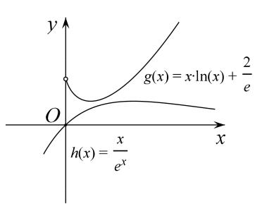

text_image

y
g(x) = x \cdot \ln(x) + \frac{2}{e}
O
h(x) = \frac{x}{e^x}
x

(例 3 图)

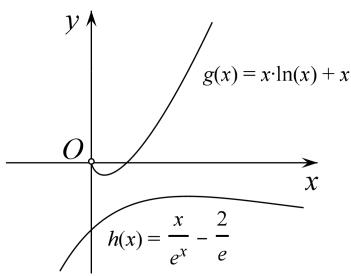

text_image

y
g(x) = x \u221a(n) + x
O
x
h(x) = \frac{x}{e^x} - \frac{2}{e}

(例 4 图)

[例 4] 已知 $f(x)=x \ln x - ax$ , $g(x)=-x^{2}-2$ .

(1)当 $a = -1$ 时，求 $f(x)$ 在 $[m, m + 3](m > 0)$ 的最值；  
(2)求证： $\forall x\in (0, + \infty)$ ， $\ln x + 1 > \frac{1}{e^x} -\frac{2}{ex}$

解析 (1) $f(x) = x \ln x + x, f'(x) = \ln x + 2$

$\therefore f(x)$ 的单调减区间为 $\left(0, \frac{1}{\mathbf{e}^2}\right)$ ，单调增区间为 $\left(\frac{1}{\mathbf{e}^2}, +\infty\right)$ . $\because m > 0, \therefore m + 3 > \frac{1}{\mathbf{e}^2}$ .

① $0 < m \leq \frac{1}{\mathrm{e}^2}$ , $f(x)_{\min} = f\left(\frac{1}{\mathrm{e}^2}\right) = -\frac{1}{\mathrm{e}^2}$ , $f(x)_{\max} = f(m + 3) = (m + 3)\ln (m + 3) + m + 3$   
② $m > \frac{1}{e^{2}}$ 时， $f(x)_{\min} = m \ln m + m, f(x)_{\max} = (m + 3) \ln (m + 3) + m + 3$ .

(2)所证不等式等价于 $\ln x + 1 > \frac{1}{\mathrm{e}^x} -\frac{2}{\mathrm{e}x}\Leftrightarrow x\ln x + x > \frac{x}{\mathrm{e}^x} -\frac{2}{\mathrm{e}}.$

设 $p(x)=x\ln x+x$ ， $p'(x)=1+\ln x+1=\ln x+2$ ，

$\therefore p(x)$ 在 $\left(0, \frac{1}{\mathbf{e}^2}\right)$ 单调递减，在 $\left(\frac{1}{\mathbf{e}^2}, +\infty\right)$ 单调递增， $\therefore p(x) > p(x)_{\min} = p\left(\frac{1}{\mathbf{e}^2}\right) = -\frac{1}{\mathbf{e}^2}$ .

设 $q(x)=xe^{-x}-\frac{2}{e}$ ， $q'(x)=(1-x)e^{-x}$

$\therefore q(x)$ 在 $(0,1)$ 单调递增，在 $(1, +\infty)$ 单调递减， $\therefore q(x) \leq q(x)_{\max} = q(1) = -\frac{1}{e}$

$\therefore p(x)_{\min} > q(x)_{\max}$ ， $\therefore \forall x \in (0, +\infty)$ ， $p(x) \geq p(x)_{\min} > q(x)_{\max} \geq q(x)$ ． $\therefore$ 所证不等式成立.

# 【对点精练】

1. 已知函数 $f(x)=\mathrm{e}\ln x-ax(a\in\mathbf{R})$ .

(1)讨论 $f(x)$ 的单调性;

(2)当 $a = \mathrm{e}$ 时，证明： $xf(x) - \mathrm{e}^x +2\mathrm{ex}\leq 0$

1. 解析 (1) $f'(x)=\frac{e}{x}-a(x>0)$ ,

①若 $a \leq 0$ ，则 $f'(x) > 0$ ， $f(x)$ 在 $(0, +\infty)$ 上单调递增；  
②若 a>0，则当 $0<x<\frac{e}{a}$ 时， $f(x)>0$ ；当 $x>\frac{e}{a}$ 时， $f(x)<0$ ，

故 $f(x)$ 在 $\left(0, \frac{e}{a}\right)$ 上单调递增，在 $\left(\frac{e}{a}, +\infty\right)$ 上单调递减.

(2)证法一：因为 x>0，所以只需证 $f(x)\leq\frac{\mathrm{e}^{x}}{x}-2\mathrm{e}$

当 a=e 时，由(1)知， $f(x)$ 在 $(0, 1)$ 上单调递增，在 $(1, +\infty)$ 上单调递减，所以 $f(x)_{\max}=f(1)=-e$ .

记 $g(x)=\frac{\mathrm{e}^{x}}{x}-2\mathrm{e}(x>0)$ ，则 $g'(x)=\frac{(x-1)\mathrm{e}^{x}}{x^{2}}$ ,

所以当 0<x<1 时， $g'(x)<0$ ， $g(x)$ 单调递减；当 x>1 时， $g'(x)>0$ ， $g(x)$ 单调递增，所以 $g(x)_{\min}=g(1)=-e$ 。综上，当 x>0 时， $f(x)\leq g(x)$ ，即 $f(x)\leq\frac{e^{x}}{x}-2e$ ，即 $xf(x)-e^{x}+2ex\leq0$ 。

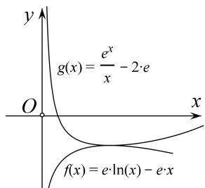

text_image

y
g(x) = \frac{e^x}{x} - 2 \cdot e
O
x
f(x) = e \cdot \ln(x) - e \cdot x

证法二：由题意知，即证 $ex\ln x - ex^{2} - e^{x} + 2ex \leq 0$ ，从而等价于 $\ln x - x + 2 \leq \frac{e^{x}}{ex}$ .

设函数 $g(x)=\ln x-x+2$ ，则 $g'(x)=\frac{1}{x}-1$ ．所以当 $x\in(0,1)$ 时， $g'(x)>0$ ；当 $x\in(1,+\infty)$ 时， $g'(x)<0$ ，故 $g(x)$ 在 $(0,1)$ 上单调递增，在 $(1,+\infty)$ 上单调递减，从而 $g(x)$ 在 $(0,+\infty)$ 上的最大值为 $g(1)=1$ 。

设函数 $h(x)=\frac{\mathrm{e}^{x}}{\mathrm{e}x}$ ，则 $h'(x)=\frac{\mathrm{e}^{x}(x-1)}{\mathrm{e}x^{2}}$ 。所以当 $x\in(0,1)$ 时， $h'(x)<0$ ；当 $x\in(1,+\infty)$ 时， $h'(x)>0$ ，故 $h(x)$ 在 $(0,1)$ 上单调递减，在 $(1,+\infty)$ 上单调递增，从而 $h(x)$ 在 $(0,+\infty)$ 上的最小值为 $h(1)=1$ 。综上，当 x>0 时， $g(x)\leq h(x)$ ，即 $xf(x)-\mathrm{e}^{x}+2\mathrm{e}x\leq0$ 。

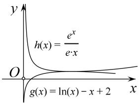

text_image

h(x) = \frac{e^x}{e \cdot x}
g(x) = \ln(x) - x + 2
O
x
y

2. 已知 $f(x) = \mathrm{e}^{x} - a\ln x - a$ ，其中常数 $a > 0$ .

(1)当 $a = \mathbf{e}$ 时，求函数 $f(x)$ 的极值；  
(2)求证： $e^{2x-2}-e^{x-1}\ln x-x\geq0$

2. 解析 (1) 当 $a = \mathbf{e}$ 时， $f(x) = \mathrm{e}^x - \mathrm{e}\ln x - \mathrm{e}$ ， $f'(x) = \mathrm{e}^x - \frac{\mathrm{e}}{x}$ ， $f'(1) = 0$ 。

$f''(x)=\mathrm{e}^{x}+\frac{\mathrm{e}}{x^{2}}>0,\quad\therefore f'(x)$ 在 $(0,+\infty)$ 单调递增.

$\therefore x \in (0, 1)$ 时， $f'(x) < f'(1) = 0$ ， $x \in (1, +\infty)$ ， $f'(x) > f'(1) = 0$ 。

∴ $f(x)$ 在 $(0,1)$ 单调递减，在 $(1,+\infty)$ 单调递增．∴ $f(x)$ 的极小值为 $f(1)=0$ ，无极大值.

(2)由(1)得 $e^{x}-e\ln x-e\geq0\Rightarrow e^{x}-e\ln x\geq e$ ，所证不等式： $e^{2x-2}-e^{x-1}\ln x-x\geq0\Leftrightarrow e^{x}-e\ln x\geq\frac{x}{e^{x-2}}$ 设 $g(x)=\frac{x}{e^{x-2}}=xe^{2-x}$ ， $g'(x)=e^{2-x}-xe^{2-x}=(1-x)e^{2-x}$ ，令 $g'(x)>0$ 可解得：x<1。

$\therefore g(x)$ 在 $(0,1)$ 单调递增，在 $(1, +\infty)$ 单调递减． $\therefore g(x)_{\max} = g(1) = e$

$\therefore \mathrm{e}^{x}-\mathrm{e}\ln x\geq\mathrm{e}\geq g(x)$ ，即 $\mathrm{e}^{x}-\mathrm{e}\ln x\geq\frac{x}{\mathrm{e}^{x-2}}$ ， $\therefore \mathrm{e}^{2x-2}-\mathrm{e}^{x-1}\ln x-x\geq0$ 。

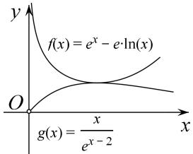

text_image

f(x) = e^x - e \cdot \ln(x)
g(x) = \frac{x}{e^{x-2}}

3. 设函数 $f(x) = \ln x + \frac{a}{x} - x$ .

(1)当a=-2时，求 $f(x)$ 的极值；  
(2)当 $a = 1$ 时，证明： $f(x) - \frac{1}{e^x} +x > 0$ 在 $(0, + \infty)$ 上恒成立.

3. 解析 (1) 当 $a = -2$ 时， $f(x) = \ln x - \frac{2}{x} - x, f'(x) = \frac{1}{x} + \frac{2}{x^2} - 1 = -\frac{(x - 2)(x + 1)}{x^2}$ ，

∴ 当 $x \in (0, 2)$ 时， $f'(x) > 0$ ；当 $x \in (2, +\infty)$ 时， $f'(x) < 0$ .

∴ $f(x)$ 在 $(0, 2)$ 上单调递增，在 $(2, +\infty)$ 上单调递减；

∴ $f(x)$ 在 x=2 处取得极大值 $f(2)=\ln2-3$ ， $f(x)$ 无极小值；

(2)当 a=1 时， $f(x)-\frac{1}{e^{x}}+x=\ln x+\frac{1}{x}-\frac{1}{e^{x}}$ ，下面证 $\ln x+\frac{1}{x}>\frac{1}{e^{x}}$ ，即证 $x\ln x+1>\frac{x}{e^{x}}$ ，设 $g(x)=x\ln x+1$ ，则 $g'(x)=1+\ln x$ ，

在 $(0,\ \frac{1}{e})$ 上， $g'(x)<0$ ， $g(x)$ 是减函数；在 $(\frac{1}{e},+\infty)$ 上， $g'(x)>0$ ， $g(x)$ 是增函数.

所以 $g(x) \geqslant g(\frac{1}{e}) = 1 - \frac{1}{e}$ ,

设 $h(x)=\frac{x}{e^{x}}$ ，则 $h'(x)=\frac{1-x}{e^{x}}$ ，

在 $(0,1)$ 上， $h'(x)>0$ ， $h(x)$ 是增函数；在 $(1,+\infty)$ 上， $h'(x)<0$ ， $h(x)$ 是减函数，

所以 $h(x) \leqslant h(1) = \frac{1}{e} < 1 - \frac{1}{e}$ ,

所以 $h(x) < g(x)$ ，即 $\frac{x}{e^x} < x\ln x + 1$ ，所以 $x\ln x + 1 - \frac{x}{e^x} > 0$ ，即 $\ln x + \frac{1}{x} - \frac{1}{e^x} > 0$ ，

即 $f(x)-\frac{1}{e^{x}}+x>0$ 在 $(0,+\infty)$ 上恒成立.

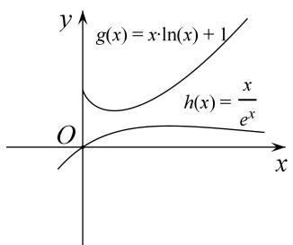

text_image

g(x) = x \cdot \ln(x) + 1
h(x) = \frac{x}{e^x}
O
x
y

4. 已知 $f(x)=x\ln x,\quad g(x)=-x^{2}+ax-3.$

(1)若对一切 $x \in (0, +\infty)$ ， $2f(x) \geq g(x)$ 恒成立，求实数 a 的取值范围.

(2)证明：对一切 $x \in (0, +\infty)$ ， $\ln x > \frac{1}{\mathrm{e}^x} - \frac{2}{\mathrm{e}x}$ 恒成立.

4. 解析 (1)由题意知 $2x \ln x \geq -x^{2} + ax - 3$ 对一切 $x \in (0, +\infty)$ 恒成立，则 $a \leq 2 \ln x + x + \frac{3}{x}$ ,

设 $h(x)=2\ln x+x+\frac{3}{x}(x>0)$ ，则 $h'(x)=\frac{(x+3)(x-1)}{x^{2}}$ .

①当 $x \in (0, 1)$ 时， $h'(x) < 0$ ， $h(x)$ 单调递减；

②当 $x \in (1, +\infty)$ 时， $h'(x) > 0$ ， $h(x)$ 单调递增．所以 $h(x)_{\min} = h(1) = 4$ ，

对一切 $x \in (0, +\infty)$ ， $2f(x) \geq g(x)$ 恒成立，所以 $a \leq h(x)_{\min} = 4$ ，即实数 a 的取值范围是 $(-∞, 4]$ .

(2)问题等价于证明 $x \ln x > \frac{x}{\mathrm{e}^{x}} - \frac{2}{\mathrm{e}} (x > 0)$ . 又 $f(x) = x \ln x (x > 0)$ , $f'(x) = \ln x + 1$ ,

当 $x \in \begin{bmatrix} 0, & \frac{1}{\mathrm{e}} \end{bmatrix}$ 时， $f'(x) < 0, f(x)$ 单调递减；当 $x \in \begin{bmatrix} \frac{1}{\mathrm{e}}, & +\infty \end{bmatrix}$ 时， $f'(x) > 0, f(x)$ 单调递增，

所以 $f(x)_{\min}=f\left(\frac{1}{e}\right)=-\frac{1}{e}$ .

设 $m(x)=\frac{x}{e^{x}}-\frac{2}{e}(x>0)$ ，则 $m'(x)=\frac{1-x}{e^{x}}$ ,

当 $x \in (0, 1)$ 时， $m'(x) > 0$ ， $m(x)$ 单调递增，当 $x \in (1, +\infty)$ 时， $m'(x) < 0$ ， $m(x)$ 单调递减，

所以 $m(x)_{\max}=m(1)=-\frac{1}{e}$ ，从而对一切 $x\in(0,+\infty)$ ， $f(x)>m(x)$ 恒成立，即 $x\ln x>\frac{x}{e^{x}}-\frac{2}{e}$ 恒成立.

即对一切 $x \in (0, +\infty)$ ， $\ln x > \frac{1}{e^{x}} - \frac{2}{ex}$ 恒成立.

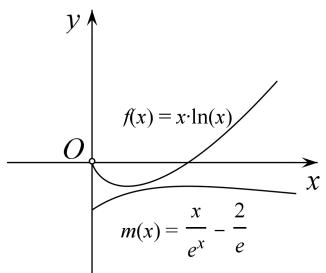

text_image

f(x) = x \cdot \ln(x)
m(x) = \frac{x}{e^x} - \frac{2}{e}

5. 已知函数 $f(x) = \ln x + \frac{a}{x}$ , $g(x) = \mathrm{e}^{-x} + bx$ , $a, b \in \mathbf{R}$ , $e$ 为自然对数的底数.

(1)若函数 $y=g(x)$ 在 R 上存在零点，求实数 b 的取值范围；  
(2)若函数 $y = f(x)$ 在 $x = \frac{1}{\mathrm{e}}$ 处的切线方程为 $\mathrm{ex} + y - 2 + b = 0$ . 求证：对任意的 $x \in (0, +\infty)$ ，总有 $f(x) > g(x)$ .

5. 解析 (1) 易得 $g'(x) = -\mathrm{e}^{-x} + b = b - \frac{1}{\mathrm{e}^{x}}$ .

若 b=0，则 $g(x)=\frac{1}{e^{x}}\in(0,+\infty)$ ，不合题意；

若 b<0，则 $g(0)=1>0$ ， $g\left(-\frac{1}{b}\right)=\mathrm{e}^{\frac{1}{b}}-1<0$ ，满足题设，

若 b>0，令 $g'(x)=-\mathrm{e}^{-x}+b=0$ ，得 $x=-\ln b$ .

∴ $g(x)$ 在 $(-∞, -ln b)$ 上单调递减；在 $(-ln b, +∞)$ 上单调递增，

则 $g(x)_{\min}=g(-\ln b)=\mathrm{e}^{\ln b}-b\ln b=b-b\ln b\leq0,\quad\therefore b\geq\mathrm{e}.$

综上所述，实数 b 的取值范围是 $(-∞, 0) ∪ [e, +∞)$ .

(2)易得 $f'(x)=\frac{1}{x}-\frac{a}{x^{2}}$ ，则由题意，得 $f'\left(\frac{1}{e}\right)=e-ae^{2}=-e$ ，解得 $a=\frac{2}{e}$ .

$\therefore f(x) = \ln x + \frac{2}{\mathrm{e}x}$ ，从而 $f\left(\frac{1}{\mathrm{e}}\right) = 1$ ，即切点为 $\left(\frac{1}{\mathrm{e}}, 1\right)$ .

将切点坐标代入 $ex + y - 2 + b = 0$ 中，解得 b = 0. $\therefore g(x) = e^{-x}$ .

要证 $f(x)>g(x)$ ，即证 $\ln x+\frac{2}{\mathrm{e}x}>\mathrm{e}^{-x}(x\in(0,+\infty))$ ，只需证 $x\ln x+\frac{2}{\mathrm{e}}>xe^{-x}(x\in(0,+\infty))$ .

令 $u(x)=x\ln x+\frac{2}{e}$ ， $v(x)=xe^{-x}$ ， $x\in(0,+\infty)$ 。则由 $u'(x)=\ln x+1=0$ ，得 $x=\frac{1}{e}$ ，

$\therefore u(x)$ 在 $\left[0, \frac{1}{e}\right]$ 上单调递减，在 $\left[\frac{1}{e}, +\infty\right]$ 上单调递增， $\therefore u(x)_{\min} = u\left[\frac{1}{e}\right] = \frac{1}{e}$ .

又由 $v'(x)=\mathrm{e}^{-x}-xe^{-x}=\mathrm{e}^{-x}(1-x)=0$ ，得 x=1，∴ $v(x)$ 在 $(0,1)$ 上单调递增，在 $(1,+\infty)$ 上单调递减，

$\therefore v(x)_{\max} = v(1) = \frac{1}{e}$ . $\therefore u(x) \geq u(x)_{\min} \geq v(x)_{\max} \geq v(x)$ , 显然, 上式的等号不能同时取到.

故对任意的 $x \in (0, +\infty)$ ，总有 $f(x) > g(x)$ .

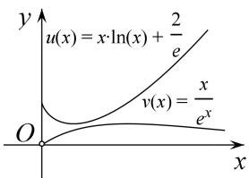

text_image

u(x) = x \cdot \ln(x) + \frac{2}{e}
v(x) = \frac{x}{e^x}
O
x
y

6. 已知 $f(x)=x\ln x$ .

(1)求函数 $f(x)$ 在 $[t, t+2](t>0)$ 上的最小值；

(2)证明：对一切 $x \in (0, +\infty)$ ，都有 $\ln x > \frac{1}{\mathrm{e}^x} - \frac{2}{\mathrm{e}x}$ 成立.

6. 解析 (1)由 $f(x)=x \ln x$ ，x>0，得 $f'(x)=\ln x+1$ ，令 $f'(x)=0$ ，得 $x=\frac{1}{e}$ .

当 $x \in (0, \frac{1}{\mathrm{e}})$ 时， $f'(x) < 0$ ， $f(x)$ 单调递减；当 $x \in (\frac{1}{\mathrm{e}}, +\infty)$ 时， $f'(x) > 0$ ， $f(x)$ 单调递增.

①当 $0 < t < \frac{1}{e} < t + 2$ ，即 $0 < t < \frac{1}{e}$ 时， $f(x)_{\min} = f(\frac{1}{e}) = -\frac{1}{e}$ ;

②当 $\frac{1}{e}\leq t<t+2$ ，即 $t\geq\frac{1}{e}$ 时， $f(x)$ 在 $[t,\ t+2]$ 上单调递增， $f(x)_{\min}=f(t)=t\ln t.$

所以 $f(x)_{\min}=\left\{\begin{aligned}-\frac{1}{\mathrm{e}},&0<t<\frac{1}{\mathrm{e}},\\ t\ln t,&t\geq\frac{1}{\mathrm{e}}.\end{aligned}\right.$

(2)问题等价于证明 $x \ln x > \frac{x}{e^{x}} - \frac{2}{e}(x \in (0, +\infty))$ .

由(1)可知 $f(x)=x \ln x (x \in (0, +\infty))$ 的最小值是 $-\frac{1}{e}$ ，当且仅当 $x=\frac{1}{e}$ 时取到.

设 $m(x)=\frac{x}{e^{x}}-\frac{2}{e}(x\in(0,+\infty))$ ，则 $m'(x)=\frac{1-x}{e^{x}}$ ,

由 $m'(x)<0$ 得 x>1 时， $m(x)$ 为减函数，由 $m'(x)>0$ 得 0<x<1 时， $m(x)$ 为增函数，易知 $m(x)_{\max}=m(1)=-\frac{1}{e}$ ，当且仅当 x=1 时取到.

从而对一切 $x \in (0, +\infty)$ ， $x \ln x \geq -\frac{1}{e} \geq \frac{x}{e^{x}} - \frac{2}{e}$ ，两个等号不同时取到，

即证对一切 $x \in (0, +\infty)$ 都有 $\ln x > \frac{1}{\mathrm{e}^x} - \frac{2}{\mathrm{e}x}$ 成立.

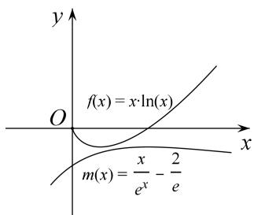

text_image

f(x) = x \cdot \ln(x)
m(x) = \frac{x}{e^x} - \frac{2}{e}

