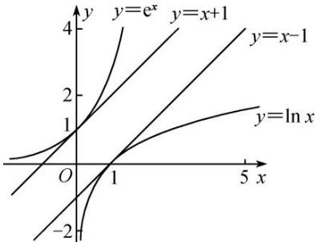
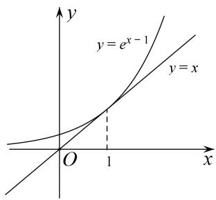
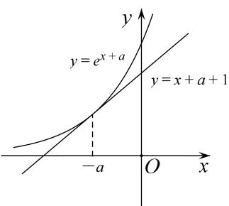
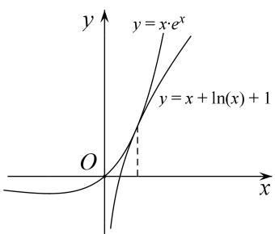
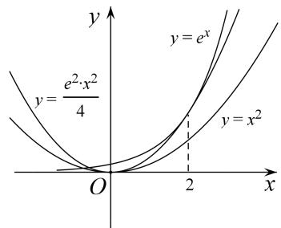
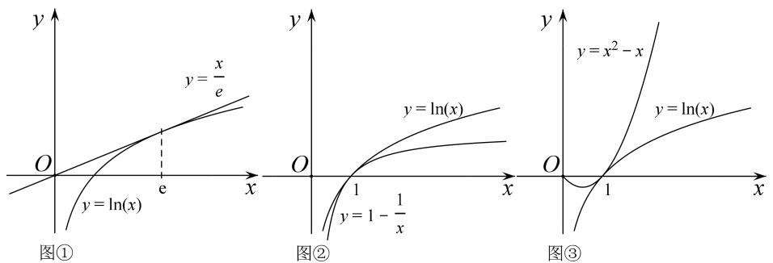
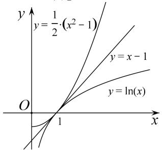

# 专题19 单变量不含参不等式证明方法之切线放缩

如图， $y = x + 1$ 是 $y = \mathrm{e}^x$ 在(0, 1)处的切线，有 $\mathrm{e}^x \geq x + 1$ 恒成立； $y = x - 1$ 是 $y = \ln x$ 在(1, 0)处的切线，有 $\ln x \leq x - 1$ 恒成立。在不等式“改造”或证明的过程中，有时借助于 $\mathrm{e}^x$ ， $\ln x$ 有关的常用不等式进行适当的放缩，再进行证明，会取得意想不到的效果。

line

| x    | y=e^x | y=x+1 | y=ln x |
| ---- | ----- | ----- | ------ |
| 0    | 0     | 0     | 0      |
| 1    | 2     | 1     | -1     |
| 5    | 4     | 3     | 0      |

由 $\mathrm{e}^x\geq x + 1$ 引出的放缩：

① $e^{x-1}\geq x$ （用x-1替换x，切点横坐标是x=1），通常表达为 $e^{x}\geq ex$ .  
② $e^{x+a}\geq x+a+1$ (用 $x+a$ 替换x，切点横坐标是x=-a)，平移模型，找到切点是关键.  
③ $x\mathrm{e}^{x}\geq x+\ln x+1$ (用 $x+\ln x$ 替换 $x$ ，切点横坐标满足 $x+\ln x=0$ )，常见的指对跨阶改头换面模型，切线的方程是按照指数函数给予的.  
④ $e^{x}\geq\frac{e^{2}}{4}x^{2}>x^{2}(x>0)\left(\text{用}\frac{x}{2}\text{替换 }x, \text{ 切点横坐标是 }x=2\right)$ ，通常有 $e^{\frac{x}{n}}\geq\frac{ex}{n}(x>0)$ 的构造模型.

text_image

y
y = e^{x-1}
y = x
O 1 x

图①

text_image

y
y = e^{x + a}
y = x + a + 1
-a O x

图②

text_image

y
y = x \u221a e^x
y = x + \u221aln(x) + 1
O
x

图③

text_image

y
y = e²·x²/4
y = e^x
y = x²
O
2
x

图④

由 $\ln x \leq x - 1$ (也可以记为 $\ln x \leq x$ ，切点为 $(1, 0)$ ) 引出的放缩：

最常见的就是 $\ln (x + 1)\leq x$ ，由 $\ln x <   x - 1$ 向左平移1个单位长度来理解，或者将 $\mathbf{e}^x\geq x + 1$ 两边取对数而来.

① $\ln x \leq \frac{x}{e}$ 用 $\frac{x}{e}$ 替换 $x$ ，切点横坐标是 $x = e$ ，表示过原点的 $f(x) = \ln x$ 的切线为 $y = \frac{x}{e}$ .  
② $\ln x \geq 1 - \frac{1}{x}\left(\text{用} \frac{1}{x} \text{替换 } x, \text{切点横坐标 } x = 1\right)$ ，或者记为 $x \ln x \geq x - 1$ 。  
③ $\ln x\leq x^{2}-x$ （由 $\ln x\leq x-1$ 及 $x-1\leq x^{2}-x$ ，切点横坐标是x=1），或者记为 $\frac{\ln x}{x}\leq x-1$ .

④ $\ln x\leq\frac{1}{2}(x^{2}-1)\left(\text{由 }\ln x\leq x-1\leq\frac{1}{2}(x^{2}-1)\right)$ ，即在点(1,0)处三曲线相切.

  
图④

# 【例题选讲】

[例 1] 求证：当 x>0 时，不等式 $2e^{x-\frac{5}{2}}-\ln x+\frac{1}{x}>0$ 恒成立.

[例 2] 已知函数 $f(x)=e^{x}-x$ (e 为自然对数的底数).

(1)求函数 $f(x)$ 的最小值;

(2)若 $n\in \mathbf{N}^*$ ，证明： $(\frac{1}{n})^n +(\frac{2}{n})^n +\ldots +(\frac{n - 1}{n})^n +(\frac{n}{n})^n <  \frac{e}{e - 1}.$

[例 3] 已知函数 $f(x)=\ln x-x+1$ .

(1)讨论 $f(x)$ 的单调性;

(2)求证：当 $x \in (1, +\infty)$ 时， $1 < \frac{x - 1}{\ln x} < x;$

[例4] 已知函数 $f(x) = a\ln x + x^2$ ，其中 $a \in \mathbf{R}$ .

(1)讨论 $f(x)$ 的单调性;

(2)当 $a = 1$ 时，证明： $f(x)\leqslant x^{2} + x - 1;$

(3)求证：对任意的 $n \in \mathbf{N}^*$ 且 $n \geqslant 2$ ，都有： $(1 + \frac{1}{2^2})(1 + \frac{1}{3^2})(1 + \frac{1}{4^2}) \ldots (1 + \frac{1}{n^2}) < e$ 。（其中 $e \approx 2.7183$ 为自然对数的底数）.

# 【对点精练】

1. 已知函数 $f(x)=\ln x-a^{2}x^{2}+ax$ .

(1)试讨论 $f(x)$ 的单调性;

(2)若 a=1，求证：当 x>0 时， $f(x)<\mathrm{e}^{2x}-x^{2}-2$ .

2. 已知函数 $f(x) = e^{x - m} - \ln (2x)$ .

(1)设 x=1 是函数 $f(x)$ 的极值点，求 m 的值并讨论 $f(x)$ 的单调性；  
(2)当 $m = 2$ 时，证明： $f(x) > -\ln 2$ ：

3. 若函数 $f(x) = \mathrm{e}^{x} - ax - 1 (a > 0)$ 在 $x = 0$ 处取极值.

(1)求 a 的值，并判断该极值是函数的最大值还是最小值；  
(2)证明： $1+\frac{1}{2}+\frac{1}{3}+\ldots+\frac{1}{n}>\ln(n+1)(n\in\mathbf{N}^{*})$ .

4. (2018·全国I改编)已知函数 $f(x)=ae^{x}-\ln x-1$ .

(1)设 x=2 是 $f(x)$ 的极值点，求 a 的值并求 $f(x)$ 的单调区间；  
(2)求证：当 $a = \frac{1}{\mathrm{e}}$ 时， $f(x) \geq 0$ .

5. 已知函数 $f(x)=x-1-a\ln x$ .

(1)若 $f(x)\geq0$ ，求a的值；  
(2)设 m 为整数，且对于任意正整数 n， $\left(1+\frac{1}{2}\right)\left(1+\frac{1}{2^{2}}\right)\cdots\left(1+\frac{1}{2^{n}}\right)<m$ ，求 m 的最小值.

6. 已知函数 $f(x) = \ln (1 + x)$ .

(1)求证：当 $x \in (0, +\infty)$ 时， $\frac{x}{1 + x} < f(x) < x;$   
(2)已知 e 为自然对数的底数，求证： $\forall n\in N^{*}$ ， $\sqrt{e}<\left(1+\frac{1}{n^{2}}\right)\left(1+\frac{2}{n^{2}}\right)\cdots\left(1+\frac{n}{n^{2}}\right)<e.$

