# 专题19 单变量不含参不等式证明方法之切线放缩

如图， $y = x + 1$ 是 $y = \mathrm{e}^x$ 在(0, 1)处的切线，有 $\mathrm{e}^x \geq x + 1$ 恒成立； $y = x - 1$ 是 $y = \ln x$ 在(1, 0)处的切线，有 $\ln x \leq x - 1$ 恒成立。在不等式“改造”或证明的过程中，有时借助于 $\mathrm{e}^x$ ， $\ln x$ 有关的常用不等式进行适当的放缩，再进行证明，会取得意想不到的效果。

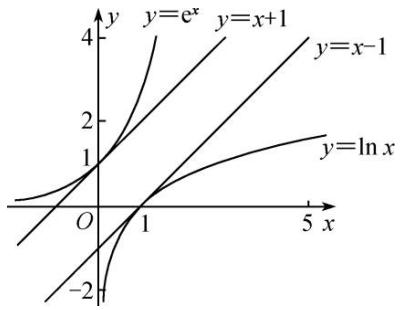

line

| x | y=e^x | y=x+1 | y=x-1 | y=ln x |
|---|---|---|---|---|
| 0 | -2 | 0 | 0 | -2 |
| 1 | 1 | 2 | 1 | 1 |
| 5 | 4 | 4 | 4 | 2 |

由 $e^{x} \geq x + 1$ 引出的放缩：

① $e^{x-1}\geq x$ （用x-1替换x，切点横坐标是x=1），通常表达为 $e^{x}\geq ex$ .  
② $e^{x^{+}a}\geq x+a+1$ (用 $x+a$ 替换x，切点横坐标是x=-a)，平移模型，找到切点是关键.  
③ $x\mathrm{e}^{x}\geq x+\ln x+1$ （用 $x+\ln x$ 替换x，切点横坐标满足 $x+\ln x=0$ ），常见的指对跨阶改头换面模型，切线的方程是按照指数函数给予的.  
④ $e^{x}\geq\frac{e^{2}}{4}x^{2}>x^{2}(x>0)\left(\text{用}\frac{x}{2}\text{替换 }x, \text{ 切点横坐标是 }x=2\right)$ ，通常有 $e^{\frac{x}{n}}\geq\frac{ex}{n}(x>0)$ 的构造模型.

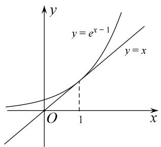

text_image

y
y = e^{x - 1}
y = x
O
1
x

图①

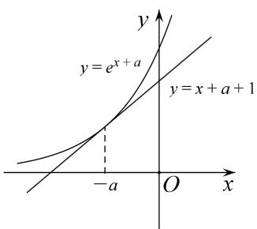

text_image

y
y = e^{x + a}
y = x + a + 1
-a O x

图②

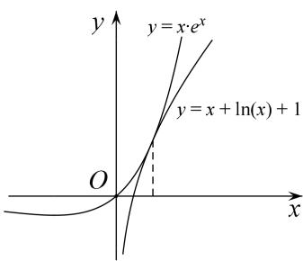

text_image

y
y = x \u03c8 e^x
y = x + \ln(x) + 1
O
x

图③

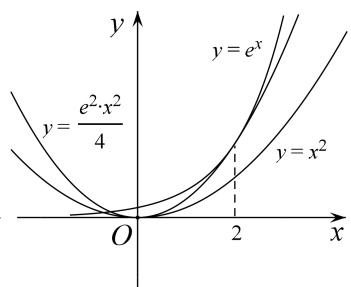

text_image

y
y = e^x
y = \frac{e^2 \cdot x^2}{4}
O
2
x
y = x^2

图④

由 $\ln x \leq x - 1$ (也可以记为 $\ln x \leq x$ ，切点为 $(1, 0)$ ) 引出的放缩：

最常见的就是 $\ln (x + 1)\leq x$ ，由 $\ln x <   x - 1$ 向左平移1个单位长度来理解，或者将 $\mathrm{e}^x\geq x + 1$ 两边取对数而来.

① $\ln x\leq\frac{x}{e}\left(\text{用}\frac{x}{e}\text{替换}x,\text{切点横坐标是}x=e\right)$ ，表示过原点的 $f(x)=\ln x$ 的切线为 $y=\frac{x}{e}$ .  
② $\ln x\geq1-\frac{1}{x}\left(\text{用}\frac{1}{x}\text{替换}x,\text{切点横坐标}x=1\right)$ ，或者记为 $x\ln x\geq x-1$ .  
③ $\ln x\leq x^{2}-x$ （由 $\ln x\leq x-1$ 及 $x-1\leq x^{2}-x$ ，切点横坐标是x=1），或者记为 $\frac{\ln x}{x}\leq x-1$ .  
④ $\ln x \leq \frac{1}{2} (x^2 - 1)$ 由 $\ln x \leq x - 1 \leq \frac{1}{2} (x^2 - 1)$ ，即在点(1, 0)处三曲线相切.

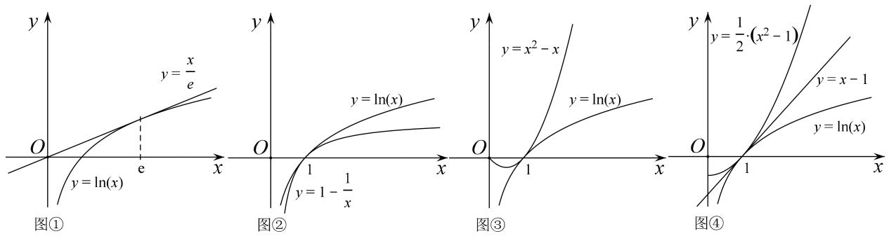

# 【例题选讲】

[例1] 求证：当 $x > 0$ 时，不等式 $2\mathrm{e}^{x - \frac{5}{2}} - \ln x + \frac{1}{x} >0$ 恒成立.

# 【思维引导】

由常用不等式 $\mathrm{e}^x\geq x + 1$ ，得 $\mathrm{e}^{x - \frac{5}{2}}\geq x - \frac{3}{2}$ 即 $2\mathrm{e}^{x - \frac{5}{2}}\geq 2x - 3$ ，于是可得到这道题的解题思路.

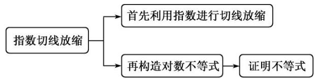

flowchart

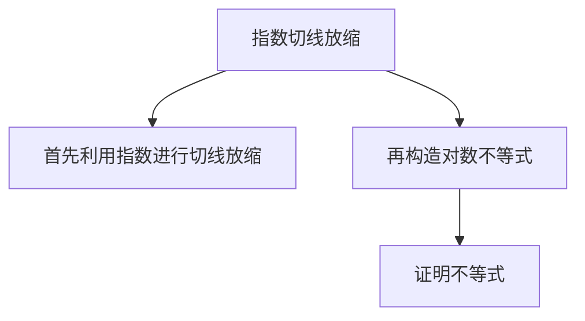

解析 令 $f(x) = 2\mathrm{e}^{x - \frac{5}{2}} - 2x + 3(x > 0)$ ，则 $f'(x) = 2\mathrm{e}^{x - \frac{5}{2}} - 2(x > 0)$ ，

由 $f\left(\frac{5}{2}\right)=0$ ，可知 $f(x)$ 在 $\left(0,\frac{5}{2}\right]$ 上是减函数，在 $\left[\frac{5}{2},+\infty\right]$ 上是增函数，

所以 $f(x) \geq f\left(\frac{5}{2}\right) = 0$ ，所以 $2e^{x - \frac{5}{2}} \geq 2x - 3$ （当且仅当 $x = \frac{5}{2}$ 时等号成立）①.

令 $g(x)=2x-3-\ln x+\frac{1}{x}(x>0)$ ，则 $g'(x)=2-\frac{1}{x}-\frac{1}{x^{2}}=\frac{(2x+1)(x-1)}{x^{2}}(x>0)$ ,

易知 $g(x)$ 在 $(0, 1]$ 上是减函数，在 $[1, +\infty)$ 上是增函数，所以 $g(x) \geq g(1) = 0$ ，

所以 $2x-3\geq\ln x-\frac{1}{x}$ (当且仅当 x=1 时等号成立) ②.

因为①和②中的等号不能同时成立，所以由①和②，得 $2\mathrm{e}^{x - \frac{5}{2}} > \ln x - \frac{1}{x}$ ，所以 $2\mathrm{e}^{x - \frac{5}{2}} - \ln x + \frac{1}{x} > 0$ .

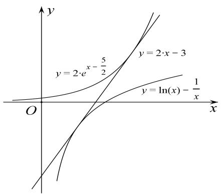

text_image

y
y = 2·e^{x - \frac{5}{2}}
y = 2·x - 3
y = \ln(x) - \frac{1}{x}
O
x

[例 2] 已知函数 $f(x)=e^{x}-x$ (e 为自然对数的底数).

(1)求函数 $f(x)$ 的最小值;  
(2)若 $n\in \mathbf{N}^*$ ，证明： $(\frac{1}{n})^n +(\frac{2}{n})^n +\ldots +(\frac{n - 1}{n})^n +(\frac{n}{n})^n <  \frac{e}{e - 1}.$

解析 (1) $\because f(x) = e^{x} - x$ ， $\therefore f'(x) = e^{x} - 1$ ，令 $f'(x) = 0$ ，得 $x = 0$ 。

∴ 当 x > 0 时， $f'(x) > 0$ ，当 x < 0 时， $f'(x) < 0$ ．∴ 函数 $f(x) = e^{x} - x$ 在区间 $(-∞, 0)$ 上单调递减，
在区间 $(0, +\infty)$ 上单调递增．∴ 当 x=0 时， $f(x)$ 有最小值 1.

(2)由(1)知，对任意实数 $x$ 均有 $e^x - x \geqslant 1$ ，即 $1 + x \leqslant e^x$ 。令 $x = -\frac{k}{n} (n \in \mathbf{N}^*$ ， $k = 1, 2, n - 1)$ ，

则 $0 < 1 - \frac{k}{n} \leqslant e^{-\frac{k}{n}}$ ， $\therefore (1 - \frac{k}{n})^n \leqslant (e^{-\frac{k}{n}})^n = e^{-k} (k = 1, 2, n - 1)$ .

即 $\left(\frac{n-k}{n}\right)^{n} \leqslant e^{-k}(k=1,2,n-1)$ . $\because\left(\frac{n}{n}\right)^{n}=1$ ，

$$
\therefore \left(\frac {1}{n}\right) ^ {n} + \left(\frac {2}{n}\right) ^ {n} + \dots + \left(\frac {n - 1}{n}\right) ^ {n} + \left(\frac {n}{n}\right) ^ {n} \leqslant e ^ {- (n - 1)} + e ^ {- (n - 2)} + \dots + e ^ {- 2} + e ^ {- 1} + 1.
$$

$$
\because e ^ {- (n - 1)} + e ^ {- (n - 2)} + \dots + e ^ {- 2} + e ^ {- 1} + 1 = \frac {1 - e ^ {- n}}{1 - e ^ {- 1}} <   \frac {1}{1 - e ^ {- 1}} = \frac {e}{e - 1},
$$

$$
\therefore \left(\frac {1}{n}\right) ^ {n} + \left(\frac {2}{n}\right) ^ {n} + \dots + \left(\frac {n - 1}{n}\right) ^ {n} + \left(\frac {n}{n}\right) ^ {n} <   \frac {e}{e - 1}.
$$

[例 3] 已知函数 $f(x)=\ln x-x+1$ .

(1)讨论 $f(x)$ 的单调性;

(2)求证：当 $x \in (1, +\infty)$ 时， $1 < \frac{x - 1}{\ln x} < x$

【思维引导】

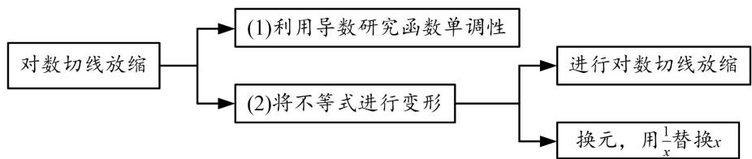

flowchart

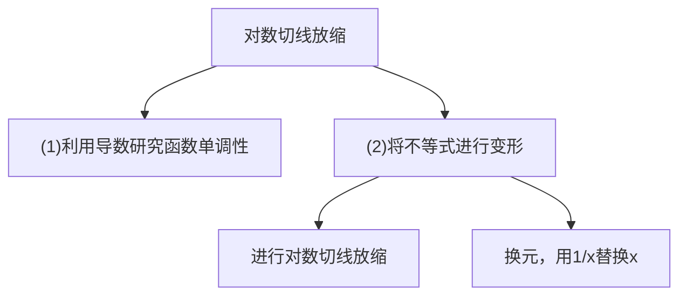

解析 (1) $f(x)$ 的定义域为 $(0, +\infty)$ ，由 $f'(x)=\frac{1}{x}-1=\frac{1-x}{x}(x>0)$ ，

可知 $f(x)$ 的单调增区间是 $(0, 1]$ ，单调减区间是 $[1, +\infty)$ .

(2)由(1)可知，当 x>0 时， $f(x)\leq f(1)=0$ （当且仅当 x=1 时，等号成立），

所以当 x>0 且 $x\neq1$ 时，有 $f(x)<0$ ，即 $\ln x<x-1$ ，

故当 $x \in (1, +\infty)$ 时，有 $\left\{ \begin{array}{l} 0 < \ln x < x - 1, \\ \ln \frac{1}{x} < \frac{1}{x} - 1 < 0, \end{array} \right.$ 故 $1 < \frac{x - 1}{\ln x} < x$ .

[例4] 已知函数 $f(x) = a\ln x + x^2$ ，其中 $a \in \mathbf{R}$ .

(1)讨论 $f(x)$ 的单调性;

(2)当 $a = 1$ 时，证明： $f(x)\leqslant x^{2} + x - 1$

(3)求证：对任意的 $n \in \mathbf{N}^*$ 且 $n \geqslant 2$ ，都有： $(1 + \frac{1}{2^2})(1 + \frac{1}{3^2})(1 + \frac{1}{4^2}) \ldots (1 + \frac{1}{n^2}) < e$ 。（其中 $e \approx 2.7183$ 为自然对数的底数）.

解析 (1)函数 $f(x)$ 的定义域为 $(0, +\infty)$ ， $f'(x)=\frac{a}{x}+2x=\frac{a+2x^{2}}{x}$ ，

①当 $a \geqslant 0$ 时， $f'(x) > 0$ ，所以 $f(x)$ 在 $(0, +\infty)$ 上单调递增，  
②当 a<0 时，令 $f'(x)=0$ ，解得 $x=\sqrt{-\frac{a}{2}}$ .

当 $0 < x < \sqrt{-\frac{a}{2}}$ 时， $a + 2x^2 < 0$ ，所以 $f'(x) < 0$ ，所以 $f(x)$ 在 $(0, \sqrt{-\frac{a}{2}})$ 上单调递减；

当 $x > \sqrt{-\frac{a}{2}}$ 时， $a + 2x^2 > 0$ ，所以 $f'(x) > 0$ ，所以 $f(x)$ 在 $(\sqrt{-\frac{a}{2}}, +\infty)$ 上单调递增.

综上，当 $a \geqslant 0$ 时，函数 $f(x)$ 在 $(0, +\infty)$ 上单调递增；

当 a<0 时，函数 $f(x)$ 在 $(0,\sqrt{-\frac{a}{2}})$ 上单调递减，在 $(\sqrt{-\frac{a}{2}},+\infty)$ 上单调递增.

(2)当 a=1 时， $f(x)=\ln x+x^{2}$ ，要证明 $f(x)\leqslant x^{2}+x-1$ ，

即证 $\ln x \leqslant x - 1$ ，即 $\ln x - x + 1 \leqslant 0$ 。即 $\ln x - x + 1 \leqslant 0$ 。

设 $g(x)=\ln x-x+1$ 则 $g'(x)=\frac{1-x}{x}$ ，令 $g'(x)=0$ 得，x=1。

当 $x \in (0, 1)$ 时， $g'(x) > 0$ ，当 $x \in (1, +\infty)$ 时， $g'(x) < 0$ 。所以 x = 1 为极大值点，也为最大值点。所以 $g(x) \leqslant g(1) = 0$ ，即 $\ln x - x + 1 \leqslant 0$ 。故 $f(x) \leqslant x^{2} + x - 1$ 。

(3)证明：由(2) $\ln x\leqslant x-1$ ，（当且仅当x=1时等号成立）令 $x=1+\frac{1}{n^{2}}$ ，则 $\ln(1+\frac{1}{n^{2}})<\frac{1}{n^{2}}$ ，

所以 $\ln(1+\frac{1}{2^{2}})+\ln(1+\frac{1}{3^{2}})+\cdots+\ln(1+\frac{1}{n^{2}})<\frac{1}{2^{2}}+\frac{1}{3^{2}}+\cdots+\frac{1}{n^{2}}$

$$
<   \frac {1}{1 \times 2} + \frac {1}{2 \times 3} + \dots + \frac {1}{n (n - 1)} = \frac {1}{1} - \frac {1}{2} + \frac {1}{2} - \frac {1}{3} + \dots + \frac {1}{n - 1} - \frac {1}{n} = 1 - \frac {1}{n} <   1 = \ln e,
$$

即 $\ln [(1 + \frac{1}{2^2})(1 + \frac{1}{3^2})(1 + \frac{1}{4^2})\ldots (1 + \frac{1}{n^2})] < \ln e$ ，所以 $(1 + \frac{1}{2^2})(1 + \frac{1}{3^2})(1 + \frac{1}{4^2})\ldots (1 + \frac{1}{n^2}) < e$

# 【对点精练】

1. 已知函数 $f(x) = \ln x - a^2 x^2 + ax$ .

(1)试讨论 $f(x)$ 的单调性;  
(2)若 a=1，求证：当 x>0 时， $f(x)<\mathrm{e}^{2x}-x^{2}-2$ .

1. 解析 (1) $f(x)$ 的定义域为 $(0, +\infty)$ ，当 a=0 时， $f(x)=\ln x$ 在 $(0, +\infty)$ 上单调递增；

当 a>0 时， $f'(x)=\frac{1}{x}-2a^{2}x+a=\frac{-2a^{2}x^{2}+ax+1}{x}=-\frac{(ax-1)(2ax+1)}{x}$ ,

当 $0 < x < \frac{1}{a}$ 时， $f'(x) > 0$ ，当 $x > \frac{1}{a}$ 时， $f'(x) < 0$ ，所以 $f(x)$ 在 $\left(0, \frac{1}{a}\right)$ 上单调递增，在 $\left(\frac{1}{a}, +\infty\right)$ 上单调递减；

当 a<0 时， $f(x)=-\frac{(ax-1)(2ax+1)}{x}$ ,

当 $0 < x < -\frac{1}{2a}$ 时， $f'(x) > 0$ ，当 $x > -\frac{1}{2a}$ 时， $f'(x) < 0$ ，所以 $f(x)$ 在 $\left(0, -\frac{1}{2a}\right)$ 上单调递增，在 $\left(-\frac{1}{2a}, +\infty\right)$ 上单调递减。

(2)当 a=1 时， $f(x)=\ln x-x^{2}+x$ ，要证当 x>0 时， $f(x)<\mathrm{e}^{2x}-x^{2}-2$ ，只需证 $\ln x<\mathrm{e}^{2x}-x-2$ .

令 $g(x)=\mathrm{e}^{2x}-2x-1$ ，则 $g'(x)=2\mathrm{e}^{2x}-2=2(\mathrm{e}^{2x}-1)$ ,

当 x>0 时， $g'(x)>0$ ，所以 $g(x)$ 在 $(0, +\infty)$ 上单调递增，所以 $g(x)>g(0)=0$ ，

所以，当 x>0 时， $e^{2x}>2x+1$ ，所以 $e^{2x}-x-2>x-1$ 。

令 $h(x)=x-1-\ln x,\quad x>0$ ，则 $h'(x)=1-\frac{1}{x}$ ，当 0<x<1 时， $h'(x)<0$ ，当 x>1 时， $h'(x)>0$

所以 $h(x)$ 在 $(0, 1)$ 上单调递减，在 $(1, +\infty)$ 上单调递增，所以 $h(x)_{\min}=h(1)=0$ ，

所以当 x>0 时， $h(x)\geq h(1)=0$ ，即当 x>0 时， $x-1\geq\ln x$

所以，当 x>0 时， $e^{2x}-x-2>x-1\geq\ln x$ ，即 $\ln x<e^{2x}-x-2$ ，

所以，当 x>0 时， $f(x)<\mathrm{e}^{2x}-x^{2}-2$ .

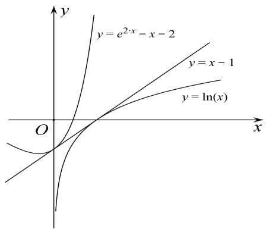

text_image

y
y = e^{2x} - x - 2
y = x - 1
y = \ln(x)
O
x

2. 已知函数 $f(x) = e^{x - m} - \ln (2x)$ .

(1)设 x=1 是函数 $f(x)$ 的极值点，求 m 的值并讨论 $f(x)$ 的单调性；

(2)当 $m = 2$ 时，证明： $f(x) > -\ln 2$

2. 解析 (1) $\because f(x) = e^{x - m} - \ln(2x)$ , $\therefore f'(x) = e^{x - m} - \frac{1}{x}$ ,

由 x=1 是函数 $f(x)$ 的极值点得 $f'(1)=0$ ，即 $e^{1-m}-1=0$ ，∴ m=1。

于是 $f(x)=e^{x-1}-\ln(2x)$ ， $f'(x)=e^{x-1}-\frac{1}{x}$ ，

由 $f''(x)=e^{x-1}+\frac{1}{x^{2}}>0$ 知 $f'(x)$ 在 $x\in(0,+\infty)$ 上单调递增，且 $f'(1)=0,\therefore x=1$ 是 $f'(x)=0$ 的唯一零点.

因此，当 $x \in (0, 1)$ 时， $f'(x) < 0$ ， $f(x)$ 递减； $x \in (1, +\infty)$ 时， $f'(x) > 0$ ， $f(x)$ 递增，

∴ 函数 $f(x)$ 在 $(0,1)$ 上单调递减，在 $(1,+\infty)$ 上单调递增.

(2)证明：当 $m = 2$ ， $x\in (0, + \infty)$ 时， $e^{x - m} = e^{x - 2}$ ，又 $e^x\geqslant x + 1$ ， $\therefore e^{x - m} = e^{x - 2}\geqslant x - 1.$

取函数 $h(x)=x-1-\ln(2x)(x>0)$ ， $h'(x)=1-\frac{1}{x}$ ，

当 0 < x < 1 时， $h'(x) < 0$ ， $h(x)$ 单调递减；当 x > 1 时， $h'(x) > 0$ ， $h(x)$ 单调递增，得函数 $h(x)$ 在 x = 1 时取唯一的极小值即最小值为 $h(1) = -\ln 2$ 。

$$
\therefore f (x) = e ^ {x - m} - \ln (2 x) = e ^ {x - 2} - \ln (2 x) \geqslant x - 1 - \ln (2 x) \geqslant - \ln 2,
$$

而上式三个不等号不能同时成立，故 $f(x) > -\ln 2$ .

3. 若函数 $f(x)=\mathrm{e}^{x}-ax-1(a>0)$ 在 x=0 处取极值.

(1)求 a 的值，并判断该极值是函数的最大值还是最小值；

(2)证明： $1+\frac{1}{2}+\frac{1}{3}+\ldots+\frac{1}{n}>\ln(n+1)(n\in\mathbf{N}^{*})$ .

3. 解析 (1) 因为 $x = 0$ 是函数极值点, 所以 $f'(0) = 0$ , 所以 $a = 1$ .

$f(x)=\mathrm{e}^{x}-x-1$ ，易知 $f'(x)=\mathrm{e}^{x}-1$ .

当 $x \in (0, +\infty)$ 时， $f'(x) > 0$ ，当 $x \in (-\infty, 0)$ 时， $f'(x) < 0$ ，故极值 $f(0)$ 是函数最小值.

(2)由(1)知 $e^{x} \geq x + 1$ 。即 $\ln(x + 1) \leq x$ ，当且仅当 x = 0 时，等号成立，

令 $x=\frac{1}{k}(k\in\mathbf{N}^{*})$ ，则 $\frac{1}{k}>\ln(1+\frac{1}{k})$ ，即 $\frac{1}{k}>\ln\frac{1+k}{k}$ ，所以 $\frac{1}{k}>\ln(1+k)-\ln k(k=1,2,\ldots,n)$ ,

累加得 $1+\frac{1}{2}+\frac{1}{3}+\ldots+\frac{1}{n}>\ln(n+1)(n\in\mathbf{N}^{*})$ .

4. (2018·全国I改编)已知函数 $f(x)=ae^{x}-\ln x-1$ .

(1)设 x=2 是 $f(x)$ 的极值点，求 a 的值并求 $f(x)$ 的单调区间；

(2)求证：当 $a = \frac{1}{\mathrm{e}}$ 时， $f(x) \geq 0$ .

4. 解析 (1) $f(x)$ 的定义域为 $(0, +\infty)$ ， $f'(x) = a \cdot e^x - \frac{1}{x}$ ，由题设知， $f'(2) = a \cdot e^2 - \frac{1}{2} = 0$ ，所以 $a = \frac{1}{2e^2}$ ，

从而 $f(x)=\frac{1}{2e^{2}}e^{x}-\ln x-1$ ， $f'(x)=\frac{1}{2e^{2}}e^{x}-\frac{1}{x}(x>0)$ .

因为 $f'(x)=\frac{1}{2e^{2}}e^{x}-\frac{1}{x}$ 在 $(0,+\infty)$ 上是增函数，且 $f'(2)=0$ ，所以当 0<x<2 时， $f'(x)<0$ ；当 x>2 时， $f'(x)>0$ .

所以 $f(x)$ 在 $(0, 2)$ 上单调递减，在 $(2, +\infty)$ 上单调递增.

(2) 当 $a=\frac{1}{e}$ 时， $f(x)=\frac{e^{x}}{e}-\ln x-1$ ，所以只要证明 $\frac{e^{x}}{e}-\ln x-1\geq0$ 即可.

设 $g(x)=\mathrm{e}^{x}-\mathrm{e}x(x>0)$ ，则 $g'(x)=\mathrm{e}^{x}-\mathrm{e}(x>0)$ ，可知 $g(x)$ 在 $(0,1]$ 上是减函数，在 $[1,+\infty)$ 上是增函数，所以 $g(x) \geq g(1) = 0$ ，即 $e^{x} \geq ex \Rightarrow \frac{e^{x}}{e} \geq x$ 。又由 $e^{x} \geq ex (x > 0) \Rightarrow x \geq 1 + \ln x (x > 0)$ ，

所以 $\frac{e^{x}}{e}-\ln x-1\geq x-\ln x-1\geq0$ ，所以 $\frac{e^{x}}{e}-\ln x-1\geq0$ 得证，

所以当 $a=\frac{1}{e}$ 时， $f(x)\geq0$ .

5. 已知函数 $f(x)=x-1-a\ln x$ .

(1)若 $f(x)\geq0$ ，求 a 的值；

(2)设 m 为整数，且对于任意正整数 n， $\left(1+\frac{1}{2}\right)\left(1+\frac{1}{2^{2}}\right)\cdots\left(1+\frac{1}{2^{n}}\right)<m$ ，求 m 的最小值.

5. 解析 (1) $f(x)$ 的定义域为 $(0, +\infty)$ .

①若 $a \leq 0$ ，因为 $f\left(\frac{1}{2}\right) = -\frac{1}{2} + a \ln 2 < 0$ ，所以不满足题意.

②若 a>0，由 $f'(x)=1-\frac{a}{x}=\frac{x-a}{x}$ 知，当 $x\in(0,a)$ 时， $f'(x)<0$ ，当 $x\in(a,+\infty)$ 时， $f'(x)>0$ ，

所以 $f(x)$ 在 $(0, a)$ 上单调递减，在 $(a, +\infty)$ 上单调递增，

故 $x = a$ 是 $f(x)$ 在 $x \in (0, +\infty)$ 上的唯一一个最小值点.

因为 $f(1) = 0$ ，所以当且仅当 $a = 1$ 时， $f(x) > 0$ 。故 $a = 1$ 。

(2)由(1)知当 $x \in (1, +\infty)$ 时， $x - 1 - \ln x > 0$ 。令 $x = 1 + \frac{1}{2^n}$ ，得 $\ln \left(1 + \frac{1}{2^n}\right) < \frac{1}{2^n}$ ，从而

$$
\ln \left(1 + \frac {1}{2}\right) + \ln \left(1 + \frac {1}{2 ^ {2}}\right) + \dots + \ln \left(1 + \frac {1}{2 ^ {n}}\right) <   \frac {1}{2} + \frac {1}{2 ^ {2}} + \dots + \frac {1}{2 ^ {n}} = 1 - \frac {1}{2 ^ {n}} <   1, \text {故} \left(1 + \frac {1}{2}\right) \left(1 + \frac {1}{2 ^ {2}}\right) \dots \cdot \left(1 + \frac {1}{2 ^ {n}}\right) <   e.
$$

因为 $\left(1+\frac{1}{2}\right)\left(1+\frac{1}{2^{2}}\right)\left(1+\frac{1}{2^{3}}\right)>2$ ，所以m的最小值为3.

6. 已知函数 $f(x)=\ln(1+x)$ .

(1)求证：当 $x \in (0, +\infty)$ 时， $\frac{x}{1 + x} < f(x) < x;$

(2)已知 e 为自然对数的底数，求证： $\forall n\in N^{*}$ ， $\sqrt{e}<\left(1+\frac{1}{n^{2}}\right)\left(1+\frac{2}{n^{2}}\right)\cdots\left(1+\frac{n}{n^{2}}\right)<e.$

6. 解析 (1) 令 $g(x) = f(x) - \frac{x}{x + 1} = \ln (1 + x) - \frac{x}{x + 1} (x > 0)$ ，则 $g'(x) = \frac{1}{x + 1} - \frac{1}{(x + 1)^2} = \frac{x}{(x + 1)^2} > 0 (x > 0)$ ,

所以 $g(x)$ 在 $(0, +\infty)$ 上是增函数，所以当 $x \in (0, +\infty)$ 时， $g(x) > g(0) = 0$ ，即 $f(x) > \frac{x}{x + 1}$ 成立.

令 $h(x)=f(x)-x=\ln(1+x)-x(x>0)$ ，则 $h'(x)=\frac{1}{x+1}-1=-\frac{x}{x+1}<0(x>0)$ ,

所以 $h(x)$ 在 $(0, +\infty)$ 上是减函数，所以当 $x \in (0, +\infty)$ 时， $h(x) < h(0) = 0$ ，即 $f(x) < x$ 成立.

综上所述，当 $x \in (0, +\infty)$ 时， $\frac{x}{1 + x} < f(x) < x$ 成立.

(2)由(1)可知， $\ln(1+x)<x$ 对 $x\in(0,+\infty)$ 都成立，

所以 $\ln\left(1+\frac{1}{n^{2}}\right)+\ln\left(1+\frac{2}{n^{2}}\right)+\ldots+\ln\left(1+\frac{n}{n^{2}}\right)<\frac{1}{n^{2}}+\frac{2}{n^{2}}+\ldots+\frac{n}{n^{2}}$

即 $\ln\left[\left(1+\frac{1}{n^{2}}\right)\left(1+\frac{2}{n^{2}}\right)\cdots\left(1+\frac{n}{n^{2}}\right)\right]<\frac{1+2+\cdots+n}{n^{2}}=\frac{n+1}{2n}.$

因为 $n \in \mathbf{N}^*$ ，所以 $\frac{n+1}{2n} = \frac{1}{2} + \frac{1}{2n} \leq \frac{1}{2} + \frac{1}{2 \times 1} = 1$ ，所以 $\ln \left[ \left(1 + \frac{1}{n^2}\right) \left(1 + \frac{2}{n^2}\right) \cdots \left(1 + \frac{n}{n^2}\right) \right] < 1$

所以 $\left(1+\frac{1}{n^{2}}\right)\left(1+\frac{2}{n^{2}}\right)\cdots\left(1+\frac{n}{n^{2}}\right)<e.$ 又由(1)可知， $\ln(1+x)>\frac{x}{x+1}$ 对 $x\in(0,+\infty)$ 都成立，

所以 $\ln\left(1+\frac{k}{n^{2}}\right)>\frac{\frac{k}{n^{2}}}{1+\frac{k}{n^{2}}}=\frac{k}{n^{2}+k}(k=1,2,\ldots,n)$ ,

所以 $\ln \left[\left(1 + \frac{1}{n^2}\right)\left(1 + \frac{2}{n^2}\right) \cdots \left(1 + \frac{n}{n^2}\right)\right] = \ln \left(1 + \frac{1}{n^2}\right) + \ln \left(1 + \frac{2}{n^2}\right) + \cdots + \ln \left(1 + \frac{n}{n^2}\right)$

$$
> \frac {1}{n ^ {2} + 1} + \frac {2}{n ^ {2} + 2} + \dots + \frac {n}{n ^ {2} + n} \geq \frac {1}{n ^ {2} + n} + \frac {2}{n ^ {2} + n} + \dots + \frac {n}{n ^ {2} + n} = \frac {1 + 2 + \dots + n}{n ^ {2} + n} = \frac {1}{2},
$$

所以 $\ln\left[\left(1+\frac{1}{n^{2}}\right)\left(1+\frac{2}{n^{2}}\right)\cdots\left(1+\frac{n}{n^{2}}\right)\right]>\frac{1}{2}$ ，所以 $\left(1+\frac{1}{n^{2}}\right)\left(1+\frac{2}{n^{2}}\right)\cdots\left(1+\frac{n}{n^{2}}\right)>\sqrt{e}$

所以 $\sqrt{\mathrm{e}} < \left(1 + \frac{1}{n^2}\right)\left(1 + \frac{2}{n^2}\right) \cdot \ldots \cdot \left(1 + \frac{n}{n^2}\right) < \mathrm{e}$ .

