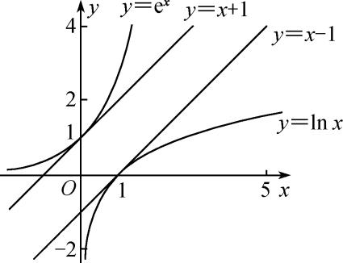
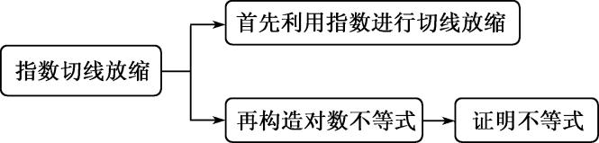

**专题19　单变量不含参不等式证明方法之切线放缩**

如图，<em>y</em>＝<em>x</em>＋1是<em>y</em>＝e<em>x</em>在(0，1)处的切线，有e<em>x</em>≥<em>x</em>＋1恒成立；<em>y</em>＝<em>x</em>－1是<em>y</em>＝ln<em>x</em>在(1，0)处的切线，有ln<em>x</em>≤<em>x</em>－1恒成立．在不等式“改造”或证明的过程中，有时借助于e<em>x</em>，ln<em>x</em>有关的常用不等式进行适当的放缩，再进行证明，会取得意想不到的效果．

由e<em>x</em>≥<em>x</em>＋1引出的放缩：

①e<em>x</em>－1≥<em>x</em>(用<em>x</em>－1替换<em>x</em>，切点横坐标是<em>x</em>＝1)，通常表达为e<em>x</em>≥e<em>x</em>．

②e<em>x</em>＋<em>a</em>≥<em>x</em>＋<em>a</em>＋1(用<em>x</em>＋<em>a</em>替换<em>x</em>，切点横坐标是<em>x</em>＝－<em>a</em>)，平移模型，找到切点是关键．

③<em>x</em>e<em>x</em>≥<em>x</em>＋ln<em>x</em>＋1(用<em>x</em>＋ln<em>x</em>替换<em>x</em>，切点横坐标满足<em>x</em>＋ln<em>x</em>＝0)，常见的指对跨阶改头换面模型，切线的方程是按照指数函数给予的．

④e<em>x</em>≥<em>x</em>2&gt;<em>x</em>2(<em>x</em>&gt;0)，通常有(<em>x</em>&gt;0)的构造模型．

由ln*x*≤*x*－1(也可以记为lne*x*≤*x*，切点为(1，0))引出的放缩：

最常见的就是ln(<em>x</em>＋1)≤<em>x</em>，由ln<em>x</em>&lt;<em>x</em>－1向左平移1个单位长度来理解，或者将e<em>x</em>≥<em>x</em>＋1两边取对数而来．

①ln*x*≤，表示过原点的*f*(*x*)＝ln*x*的切线为*y*＝．

②ln*x*≥1－，或者记为*x*ln*x*≥*x*－1．

③ln<em>x</em>≤<em>x</em>2－<em>x</em>(由ln<em>x</em>≤<em>x</em>－1及<em>x</em>－1≤<em>x</em>2－<em>x</em>，切点横坐标是<em>x</em>＝1)，或者记为≤<em>x</em>－1．

④ln<em>x</em>≤(<em>x</em>2－1)，即在点(1，0)处三曲线相切．

**【例题选讲】**

<strong>[例1]</strong>　求证：当<em>x</em>&gt;0时，不等式2－ln<em>x</em>＋&gt;0恒成立．

【思维引导】

由常用不等式e<em>x</em>≥<em>x</em>＋1，得≥<em>x</em>－，即2≥2<em>x</em>－3，于是可得到这道题的解题思路．

解析　令*f*(*x*)＝2－2*x*＋3(*x*>0)，则*f*′(*x*)＝2－2(*x*>0)，

由*f*′＝0，可知*f*(*x*)在上是减函数，在上是增函数，

所以*f*(*x*)≥*f*＝0，所以2≥2*x*－3　　　　　①．

令*g*(*x*)＝2*x*－3－ln*x*＋(*x*>0)，则*g*′(*x*)＝2－－＝(*x*>0)，

易知*g*(*x*)在(0，1]上是减函数，在[1，＋∞)上是增函数，所以*g*(*x*)≥*g*(1)＝0，

所以2*x*－3≥ln*x*－(当且仅当*x*＝1时等号成立)　　　　　②．

因为①和②中的等号不能同时成立，所以由①和②，得2>ln*x*－，所以2－ln*x*＋>0．

**[例2]**　已知函数为自然对数的底数）．

(1)求函数的最小值；

(2)若，证明：．

解析　(1)，，令，得．

当时，，当时，．函数在区间上单调递减，

在区间上单调递增．当时，有最小值1．

(2)由(1)知，对任意实数均有，即．令，，2，，

则，．

即．，

．

，

．

<strong>[例3]</strong>　已知函数<em>f</em>(<em>x</em>)＝ln<em>x</em>－<em>x</em>＋1．

(1)讨论*f*(*x*)的单调性；

(2)求证：当*x*∈(1，＋∞)时，1<<*x*；

【思维引导】

解析　(1) *f*(*x*)的定义域为(0，＋∞)，由*f*′(*x*)＝－1＝(*x*>0)，

可知*f*(*x*)的单调增区间是(0，1]，单调减区间是[1，＋∞)．

(2)由(1)可知，当*x*>0时，*f*(*x*)≤*f*(1)＝0(当且仅当*x*＝1时，等号成立)，

所以当*x*>0且*x*≠1时，有*f*(*x*)<0，即ln*x*<*x*－1，

故当*x*∈(1，＋∞)时，有故1<<*x*．

**[例4]**　已知函数，其中．

(1)讨论的单调性；

(2)当时，证明：；

(3)求证：对任意的且，都有：．(其中为自然对数的底数)．

解析　(1)函数的定义域为，，

①当时，，所以在上单调递增，

②当时，令，解得．

当时，，所以，所以在上单调递减；

当时，，所以，所以在上单调递增．

综上，当时，函数在上单调递增；

当时，函数在上单调递减，在上单调递增．

(2)当时，，要证明，

即证，即．即．

设则，令得，．

当时，，当时，．所以为极大值点，也为最大值点

所以(1)，即．故．

(3)证明：由(2)，（当且仅当时等号成立）令，则，

所以

，

即，所以．

【**对点精练**】

1．已知函数<em>f</em>(<em>x</em>)＝ln<em>x</em>－<em>a</em>2<em>x</em>2＋<em>ax</em>．

(1)试讨论*f*(*x*)的单调性；

(2)若<em>a</em>＝1，求证：当<em>x</em>&gt;0时，<em>f</em>(<em>x</em>)&lt;e2<em>x</em>－<em>x</em>2－2．

1．解析　(1) *f*(*x*)的定义域为(0，＋∞)，当*a*＝0时，*f*(*x*)＝ln*x*在(0，＋∞)上单调递增；

当<em>a</em>&gt;0时，<em>f</em>′(<em>x</em>)＝－2<em>a</em>2<em>x</em>＋<em>a</em>＝＝－，

当0<*x*<时，*f*′(*x*)>0，当*x*>时，*f*′(*x*)<0，所以*f*(*x*)在上单调递增，在上单调递减；

当*a*<0时，*f*′(*x*)＝－，

当0<*x*<－时，*f*′(*x*)>0，当*x*>－时，*f*′(*x*)<0，所以*f*(*x*)在上单调递增，在上单调递减．

(2)当<em>a</em>＝1时，<em>f</em>(<em>x</em>)＝ln<em>x</em>－<em>x</em>2＋<em>x</em>，要证当<em>x</em>&gt;0时，<em>f</em>(<em>x</em>)&lt;e2<em>x</em>－<em>x</em>2－2，只需证ln<em>x</em>&lt;e2<em>x</em>－<em>x</em>－2．

令<em>g</em>(<em>x</em>)＝e2<em>x</em>－2<em>x</em>－1，则<em>g</em>′(<em>x</em>)＝2e2<em>x</em>－2＝2(e2<em>x</em>－1)，

当*x*>0时，*g*′(*x*)>0，所以*g*(*x*)在(0，＋∞)上单调递增，所以*g*(*x*)>*g*(0)＝0，

所以，当<em>x</em>&gt;0时，e2<em>x</em>&gt;2<em>x</em>＋1，所以e2<em>x</em>－<em>x</em>－2&gt;<em>x</em>－1．

令*h*(*x*)＝*x*－1－ln*x*，*x*>0，则*h*′(*x*)＝1－，当0<*x*<1时，*h*′(*x*)<0，当*x*>1时，*h*′(*x*)>0，

所以<em>h</em>(<em>x</em>)在(0，1)上单调递减，在(1，＋∞)上单调递增，所以<em>h</em>(<em>x</em>)min＝<em>h</em>(1)＝0，

所以当*x*>0时，*h*(*x*)≥*h*(1)＝0，即当*x*>0时，*x*－1≥ln*x*，

所以，当<em>x</em>&gt;0时，e2<em>x</em>－<em>x</em>－2&gt;<em>x</em>－1≥ln<em>x</em>，即ln<em>x</em>&lt;e2<em>x</em>－<em>x</em>－2，

所以，当<em>x</em>&gt;0时，<em>f</em>(<em>x</em>)&lt;e2<em>x</em>－<em>x</em>2－2．

2．已知函数．

(1)设是函数的极值点，求的值并讨论的单调性；

(2)当时，证明：．

2．解析　(1)，，

由是函数的极值点得(1)，即，．

于是，，

由知在上单调递增，且(1)，是的唯一零点．

因此，当时，，递减；时，，递增，

函数在上单调递减，在上单调递增．

(2)证明：当，时，，又，．

取函数，，

当时，，单调递减；当时，，单调递增，得

函数在时取唯一的极小值即最小值为(1)．

，

而上式三个不等号不能同时成立，故．

3．若函数<em>f</em>(<em>x</em>)＝e<em>x</em>－<em>ax</em>－1(<em>a</em>＞0)在<em>x</em>＝0处取极值．

(1)求*a*的值，并判断该极值是函数的最大值还是最小值；

(2)证明：1＋＋＋…＋＞ln(<em>n</em>＋1)(<em>n</em>∈<strong>N</strong>\*)．

3．解析　(1)因为*x*＝0是函数极值点，所以*f*′(0)＝0，所以*a*＝1．

<em>f</em>(<em>x</em>)＝e<em>x</em>－<em>x</em>－1，易知<em>f</em>′(<em>x</em>)＝e<em>x</em>－1．

当*x*∈(0，＋∞)时，*f*′(*x*)＞0，当*x*∈(－∞，0)时，*f*′(*x*)＜0，故极值*f*(0)是函数最小值．

(2)由(1)知e<em>x</em>≥<em>x</em>＋1．即ln (<em>x</em>＋1)≤<em>x</em>，当且仅当<em>x</em>＝0时，等号成立，

令<em>x</em>＝(<em>k</em>∈<strong>N</strong>\*)，则＞ln (1＋)，即＞ln ，所以＞ln (1＋<em>k</em>)－ln <em>k</em>(<em>k</em>＝1，2，…，<em>n</em>)，

累加得1＋＋＋…＋＞ln (<em>n</em>＋1)(<em>n</em>∈<strong>N</strong>\*)．

4．(2018·全国Ⅰ改编)已知函数<em>f</em>(<em>x</em>)＝<em>a</em>e<em>x</em>－ln<em>x</em>－1．

(1)设*x*＝2是*f*(*x*)的极值点，求*a*的值并求*f*(*x*)的单调区间；

(2)求证：当*a*＝时，*f*(*x*)≥0．

4．解析　(1)<em>f</em>(<em>x</em>)的定义域为(0，＋∞)，<em>f</em>′(<em>x</em>)＝<em>a</em>·e<em>x</em>－，由题设知，<em>f</em>′(2)＝<em>a</em>·e2－＝0，所以<em>a</em>＝，

从而<em>f</em>(<em>x</em>)＝e<em>x</em>－ln<em>x</em>－1，<em>f</em>′(<em>x</em>)＝e<em>x</em>－(<em>x</em>&gt;0)．

因为<em>f</em>′(<em>x</em>)＝e<em>x</em>－在(0，＋∞)上是增函数，且<em>f</em>′(2)＝0，所以当0&lt;<em>x</em>&lt;2时，<em>f</em>′(<em>x</em>)&lt;0；当<em>x</em>&gt;2时，<em>f</em>′(<em>x</em>)&gt;0．

所以*f*(*x*)在(0，2)上单调递减，在(2，＋∞)上单调递增．

(2)当*a*＝时，*f*(*x*)＝－ln*x*－1，所以只要证明－ln*x*－1≥0即可．

设<em>g</em>(<em>x</em>)＝e<em>x</em>－e<em>x</em>(<em>x</em>&gt;0)，则<em>g</em>′(<em>x</em>)＝e<em>x</em>－e(<em>x</em>&gt;0)，可知<em>g</em>(<em>x</em>)在(0，1]上是减函数，在[1，＋∞)上是增函数，

所以<em>g</em>(<em>x</em>)≥<em>g</em>(1)＝0，即e<em>x</em>≥e<em>x</em>⇒≥<em>x</em>．又由e<em>x</em>≥e<em>x</em>(<em>x</em>&gt;0)⇒<em>x</em>≥1＋ln<em>x</em>(<em>x</em>&gt;0)，

所以－ln*x*－1≥*x*－ln*x*－1≥0，所以－ln*x*－1≥0得证，

所以当*a*＝时，*f*(*x*)≥0．

5．已知函数*f*(*x*)＝*x*－1－*a*ln*x*．

(1)若*f*(*x*)≥0，求*a*的值；

(2)设*m*为整数，且对于任意正整数*n*，·…·＜*m*，求*m*的最小值．

5．解析　(1) *f*(*x*)的定义域为(0，＋∞)．

①若*a*≤0，因为*f*＝－＋*a*ln2＜0，所以不满足题意．

②若*a*＞0，由*f*′(*x*)＝1－＝知，当*x*∈(0，*a*)时，*f*′(*x*)＜0，当*x*∈(*a*，＋∞)时，*f*′(*x*)＞0，

所以*f*(*x*)在(0，*a*)上单调递减，在(*a*，＋∞)上单调递增，

故*x*＝*a*是*f*(*x*)在*x*∈(0，＋∞)上的唯一一个最小值点．

因为*f*(1)＝0，所以当且仅当*a*＝1时，*f*(*x*)≥0．故*a*＝1．

(2)由(1)知当*x*∈(1，＋∞)时，*x*－1－ln*x*＞0．令*x*＝1＋，得ln＜，从而

ln＋ln＋…＋ln＜＋＋…＋＝1－＜1，故·…·＜e．

因为＞2，所以*m*的最小值为3．

6．已知函数*f*(*x*)＝ln(1＋*x*)．

(1)求证：当*x*∈(0，＋∞)时，<*f*(*x*)<*x*；

(2)已知e为自然对数的底数，求证：∀<em>n</em>∈<strong>N</strong>\*，&lt;·…·&lt;e．

6．解析　(1)令*g*(*x*)＝*f*(*x*)－＝ln(1＋*x*)－(*x*>0)，则*g*′(*x*)＝－＝>0(*x*>0)，

所以*g*(*x*)在(0，＋∞)上是增函数，所以当*x*∈(0，＋∞)时，*g*(*x*)>*g*(0)＝0，即*f*(*x*)>成立．

令*h*(*x*)＝*f*(*x*)－*x*＝ln(1＋*x*)－*x*(*x*>0)，则*h*′(*x*)＝－1＝－<0(*x*>0)，

所以*h*(*x*)在(0，＋∞)上是减函数，所以当*x*∈(0，＋∞)时，*h*(*x*)<*h*(0)＝0，即*f*(*x*)<*x*成立．

综上所述，当*x*∈(0，＋∞)时，<*f*(*x*)<*x*成立．

(2)由(1)可知，ln(1＋*x*)<*x*对*x*∈(0，＋∞)都成立，

所以ln＋ln＋…＋ln<＋＋…＋，

即ln<＝．

因为<em>n</em>∈<strong>N</strong>\*，所以＝＋≤＋＝1，所以ln&lt;1，

所以 ·…·<e．又由(1)可知，ln(1＋*x*)>对*x*∈(0，＋∞)都成立，

所以ln>＝(*k*＝1，2，…，*n*)，

所以ln＝ln＋ln＋…＋ln

>＋＋…＋≥＋＋…＋＝＝，

所以ln>，所以·…·>，

所以<·…·<e．

