# 专题23 极值点偏移问题概述

# 一、极值点偏移的含义

函数 $f(x)$ 满足内任意自变量 $x$ 都有 $f(x) = f(2m - x)$ ，则函数 $f(x)$ 关于直线 $x = m$ 对称。可以理解为函数 $f(x)$ 在对称轴两侧，函数值变化快慢相同，且若 $f(x)$ 为单峰函数，则 $x = m$ 必为 $f(x)$ 的极值点 $x_0$ ，如图(1)所示，函数 $f(x)$ 图象的顶点的横坐标就是极值点 $x_0$ ，若 $f(x) = c$ 的两根的中点则刚好满足 $\frac{x_1 + x_2}{2} = x_0$ ，则极值点在两根的正中间，也就是极值点没有偏移。

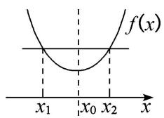

text_image

f(x)
x₁	x₀	x₂	x

图(1)

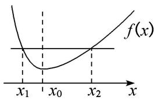

text_image

f(x)
x₁ x₀ x₂ x

图(2)

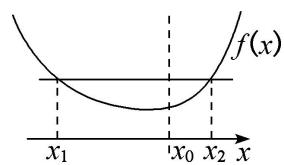

text_image

f(x)
x₁	x₀	x₂
x

图(3)

若 $\frac{x_1 + x_2}{2} \neq x_0$ ，则极值点偏移。若单峰函数 $f(x)$ 的极值点为 $x_0$ ，且函数 $f(x)$ 满足定义域内 $x = m$ 左侧的任意自变量 $x$ 都有 $f(x) > f(2m - x)$ 或 $f(x) < f(2m - x)$ ，则函数 $f(x)$ 极值点 $x_0$ 左右侧变化快慢不同。如图(2)(3)所示。故单峰函数 $f(x)$ 定义域内任意不同的实数 $x_1, x_2$ ，满足 $f(x_1) = f(x_2)$ ，则 $\frac{x_1 + x_2}{2}$ 与极值点 $x_0$ 必有确定的大小关系：若 $x_0 < \frac{x_1 + x_2}{2}$ ，则称为极值点左偏；若 $x_0 > \frac{x_1 + x_2}{2}$ ，则称为极值点右偏。

# 深层理解

1. 已知函数 $f(x)$ 的图象的顶点的横坐标就是极值点 $x_0$ ，若 $f(x) = c$ 的两根的中点刚好满足 $\frac{x_1 + x_2}{2} = x_0$ ，即极值点在两根的正中间，也就是说极值点没有偏移。此时函数 $f(x)$ 在 $x = x_0$ 两侧，函数值变化快慢相同，如图(1).  
2. 若 $\frac{x_1 + x_2}{2} \neq x_0$ ，则极值点偏移，此时函数 $f(x)$ 在 $x = x_0$ 两侧，函数值变化快慢不同，如图(2)(3).

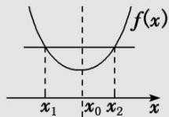

(无偏移, 左右对称, 二次函数)
若 $f(x_{1})=f(x_{2})$ ，则 $x_{1}+x_{2}=2x_{0}$ .

(1)

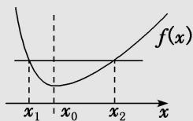

(左陡右缓,极值点向左偏移)
若 $f(x_{1})=f(x_{2})$ ，则 $x_{1}+x_{2}>2x_{0}$ .

(2)

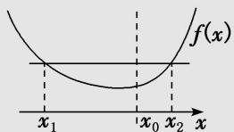

(左缓右陡,极值点向右偏移)
若 $f(x_{1})=f(x_{2})$ ，则 $x_{1}+x_{2}<2x_{0}$

(3)

(1)极值点左偏： $x_{1}+x_{2}>2x_{0}$ ， $x=\frac{x_{1}+x_{2}}{2}$ 处切线与x轴不平行.

若 $f(x)$ 上凸 $(f'(x)$ 递减)，则 $f'(\frac{x_{1}+x_{2}}{2})<f'(x_{0})=0$ ，若 $f(x)$ 下凸 $(f'(x)$ 递增)，则 $f'(\frac{x_{1}+x_{2}}{2})>f'(x_{0})=0$ .

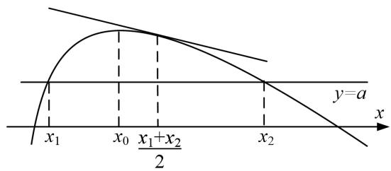

text_image

x
x₁
x₀
x₁+x₂/2
x₂
y=a

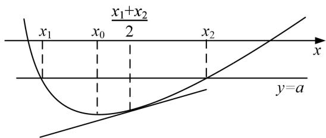

text_image

x₁
x₀
x₁+x₂/2
x₂
y=a

极值点左偏

(2)极值点右偏： $x_{1}+x_{2}>2x_{0}$ ， $x=\frac{x_{1}+x_{2}}{2}$ 处切线与x轴不平行.

若 $f(x)$ 上凸 $(f'(x)$ 递减)，则 $f'(\frac{x_{1}+x_{2}}{2})<f'(x_{0})=0$ ，若 $f(x)$ 下凸 $(f'(x)$ 递增)，则 $f'(\frac{x_{1}+x_{2}}{2})<f'(x_{0})=0$ .

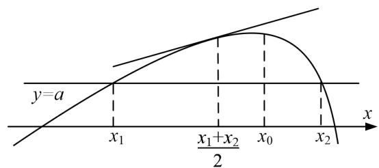

text_image

y=a
x₁
x₁+x₂/2
x₀
x₂
x

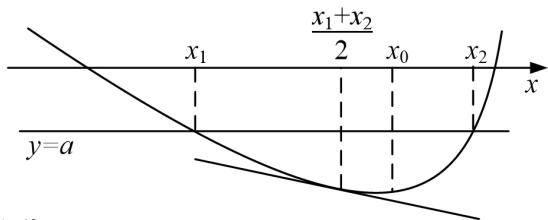

text_image

x₁
x₁+x₂/2
x₀
x₂
y=a

极值点右偏

# 二、极值点偏移问题的一般题设形式

(1)若函数 $f(x)$ 存在两个零点 $x_{1}$ ， $x_{2}$ 且 $x_{1} \neq x_{2}$ ，求证： $x_{1} + x_{2} > 2x_{0}$ （ $x_{0}$ 为函数 $f(x)$ 的极值点）；  
(2)若函数 $f(x)$ 定义域中存在 $x_{1}$ ， $x_{2}$ 且 $x_{1} \neq x_{2}$ ，满足 $f(x_{1}) = f(x_{2})$ ，求证： $x_{1} + x_{2} > 2x_{0}$ （ $x_{0}$ 为函数 $f(x)$ 的极值点）；  
(3)若函数 $f(x)$ 存在两个零点 $x_{1}$ ， $x_{2}$ 且 $x_{1} \neq x_{2}$ ，令 $x_{0} = \frac{x_{1} + x_{2}}{2}$ ，求证： $f'(x_{0}) > 0$ ;  
(4)若函数 $f(x)$ 定义域中存在 $x_{1}$ ， $x_{2}$ 且 $x_{1} \neq x_{2}$ ，满足 $f(x_{1}) = f(x_{2})$ ，令 $x_{0} = \frac{x_{1} + x_{2}}{2}$ ，求证： $f'(x_{0}) > 0$ .

# 三、极值点偏移问题的一般解法

# 1. 对称化构造法

主要用来解决与两个极值点之和，积相关的不等式的证明问题．其解题要点如下：

(1)定函数(极值点为 $x_0$ )，即利用导函数符号的变化判断函数的单调性，进而确定函数的极值点 $x_0$   
(2)构造函数，即对结论 $x_{1} + x_{2} > 2x_{0}$ 型，构造函数 $F(x) = f(x) - f(2x_0 - x)$ 或 $F(x) = f(x_0 + x) - f(x_0 - x)$ ；对结论 $x_{1}x_{2} > x$ 型，构造函数 $F(x) = f(x) - f\left(\frac{x_0}{x}\right)$ ，通过研究 $F(x)$ 的单调性获得不等式.

(3)判断单调性，即利用导数讨论 $F(x)$ 的单调性.

(4)比较大小，即判断函数 $F(x)$ 在某段区间上的正负，并得出 $f(x)$ 与 $f(2x_{0}-x)$ 的大小关系.

(5)转化，即利用函数 $f(x)$ 的单调性，将 $f(x)$ 与 $f(2x_0 - x)$ 的大小关系转化为 $x$ 与 $2x_0 - x$ 之间的关系，进而得到所证或所求.

若要证明 $f^{\prime}\left(\frac{x_{1}+x_{2}}{2}\right)$ 的符号问题，还需进一步讨论 $\frac{x_{1}+x_{2}}{2}$ 与 $x_{0}$ 的大小，得出 $\frac{x_{1}+x_{2}}{2}$ 所在的单调区间，从而

得出该处导数值的正负.

# 2. 比(差)值代换法

比(差)值换元的目的也是消参、减元，就是根据已知条件首先建立极值点之间的关系，然后利用两个极值点之比(差)作为变量，从而实现消参、减元的目的。设法用比值或差值(一般用 t 表示)表示两个极值点，即 $t=\frac{x_{1}}{x_{2}}$ ，化为单变量的函数不等式，继而将所求解问题转化为关于 t 的函数问题求解。

# 3. 对数均值不等式法

两个正数 a 和 b 的对数平均定义： $L(a, b) = \begin{cases} \frac{a - b}{\ln a - \ln b} & (a \neq b), \\ a (a = b). \end{cases}$

对数平均与算术平均、几何平均的大小关系： $\sqrt{ab}\leq L(a,b)\leq\frac{a+b}{2}$ （此式记为对数平均不等式）

取等条件：当且仅当 a=b 时，等号成立.

只证：当 $a \neq b$ 时， $\sqrt{ab} < L(a, b) < \frac{a + b}{2}$ 。不失一般性，可设 $a > b$ 。证明如下：

(1)先证： $\sqrt{ab} < L(a,b)$ ①

不等式① $\Leftrightarrow \ln a - \ln b < \frac{a - b}{\sqrt{ab}} \Leftrightarrow \ln \frac{a}{b} < \sqrt{\frac{a}{b}} - \sqrt{\frac{b}{a}} \Leftrightarrow 2\ln x < x - \frac{1}{x}$ (其中 $x = \sqrt{\frac{a}{b}} > 1$ )

构造函数 $f(x) = 2\ln x - (x - \frac{1}{x}), (x > 1)$ ，则 $f'(x) = \frac{2}{x} - 1 - \frac{1}{x^2} = -(1 - \frac{1}{x})^2$ .

因为 x > 1 时， $f'(x) < 0$ ，所以函数 $f(x)$ 在 $(1, +\infty)$ 上单调递减，

故 $f(x) < f(1) = 0$ ，从而不等式①成立；

(2)再证： $L(a, b) < \frac{a + b}{2}$ ②

不等式② $\Leftrightarrow \ln a - \ln b > \frac{2(a - b)}{a + b} \Leftrightarrow \ln \frac{a}{b} > \frac{2(\frac{a}{b} - 1)}{(\frac{a}{b} + 1)} \Leftrightarrow \ln x > \frac{2(x - 1)}{(x + 1)}$ (其中 $x = \sqrt{\frac{a}{b}} > 1$ )

构造函数 $g(x)=\ln x-\frac{2(x-1)}{(x+1)}$ ，(x>1)，则 $g'(x)=\frac{1}{x}-\frac{4}{(x+1)^{2}}=\frac{(x-1)^{2}}{x(x+1)^{2}}$ .

因为 x > 1 时， $g'(x) > 0$ ，所以函数 $g(x)$ 在 $(1, +\infty)$ 上单调递增，

故 $g(x) < g(1) = 0$ ，从而不等式②成立；

综合(1)(2)知，对 $\forall a, b \in \mathbf{R}^{+}$ ，都有对数平均不等式 $\sqrt{ab} \leq L(a, b) \leq \frac{a + b}{2}$ 成立，当且仅当 $a = b$ 时，等号成立.

[例 1] (2010 天津) 已知函数 $f(x)=xe^{-x}(x\in\mathbf{R})$ .

(1)求函数 $f(x)$ 的单调区间和极值;  
(2)若 $x_{1} \neq x_{2}$ , 且 $f(x_{1}) = f(x_{2})$ , 求证: $x_{1} + x_{2} > 2$ .

解析 $(1)f'(x)=\mathrm{e}^{-x}(1-x)$ ，令 $f'(x)>0$ 得 x<1；令 $f'(x)<0$ 得 x>1，

∴函数 $f(x)$ 在 $(-∞, 1)$ 上单调递增，在 $(1, +∞)$ 上单调递减，

∴ $f(x)$ 有极大值 $f(1)=\frac{1}{e}$ ， $f(x)$ 无极小值.

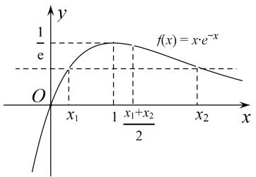

line

| x       | y         |
|---------|-----------|
| x₁      | 0         |
| 1/(x₁+x₂)/2 | 1         |
| x₂      | 0         |

(2)方法一 (对称化构造法)

分析法 欲证 $x_{1}+x_{2}>2$ ，即证 $x_{1}>2-x_{2}$ ，由(1)可设 $0<x_{1}<1<x_{2}$ ，故 $x_{1}, 2-x_{2}\in(0,1)$ ,

又因为 $f(x)$ 在 $(0, 1)$ 上单调递增，故只需证 $f(x_{1}) > f(2 - x_{2})$ ，又因为 $f(x_{1}) = f(x_{2})$ ，

故也即证 $f(x_{2})>f(2-x_{2})$ ，构造函数 $F(x)=f(x)-f(2-x)$ ， $x\in(1,+\infty)$ ，

则等价于证明 $F(x)>0$ 对 $x\in(1,+\infty)$ 恒成立.

由 $F'(x)=f'(x)+f(2-x)=\mathrm{e}^{-x}(1-x)+\mathrm{e}^{x-2}(x-1)=(x-1)(\mathrm{e}^{x-2}-\mathrm{e}^{-x})$ ,

∵ 当 x>1 时，x-1>0， $e^{x-2}-e^{-x}>0$ ，∴ $F'(x)>0$ ，

则 $F(x)$ 在 $(1, +\infty)$ 上单调递增，所以 $F(x) > F(1) > 0$ ,

即已证明 $F(x)>0$ 对 $x\in(1,+\infty)$ 恒成立，故原不等式 $x_{1}+x_{2}>2$ 亦成立.

综合法 构造辅助函数 $F(x)=f(x)-f(2-x)$ ，x>1，

则 $F'(x)=f'(x)+f(2-x)=\mathrm{e}^{-x}(1-x)+\mathrm{e}^{x-2}(x-1)=(x-1)(\mathrm{e}^{x-2}-\mathrm{e}^{-x})$ ,

∵ 当 x>1 时，x-1>0， $e^{x-2}-e^{-x}>0$ ，∴ $F'(x)>0$ ，

∴ $F(x)$ 在 $(1, +\infty)$ 上为增函数，∴ $F(x) > F(1) = 0$ ，故当 x > 1 时， $f(x) > f(2 - x)$ ，(\*)

由 $f(x_{1})=f(x_{2})$ ， $x_{1}\neq x_{2}$ ，可设 $x_{1}<1<x_{2}$ ，将 $x_{2}$ 代入 (\*) 式可得 $f(x_{2})>f(2-x_{2})$ ，又 $f(x_{1})=f(x_{2})$ ，

$\therefore f(x_{1})>f(2-x_{2})$ . 又 $x_{1}<1, 2-x_{2}<1$ ，而 $f(x)$ 在 $(-∞, 1)$ 上单调递增， $\therefore x_{1}>2-x_{2}, \therefore x_{1}+x_{2}>2$ .

总结提升 本题(2)证明的不等式中含有两个变量, 对于此类问题一般的求解思路是将两个变量分到不等式的两侧, 然后根据函数的单调性, 通过两个变量之间的关系“减元”, 建立新函数, 最终将问题转化为函数的最值问题来求解. 考查了逻辑推理、数学建模及数学运算等核心素养. 在求解此类问题时, 需要注意变量取值范围的限定, 如本题中利用 $x_{1}, 2 - x_{2}$ , 其取值范围都为 $(0, 1)$ , 若将所证不等式化为 $x_{1} > 2 - x_{2}$ , 则 $x_{2}, 2 - x_{1}$ 的取值范围都为 $(1, +\infty)$ , 此时就必须利用函数 $h(x)$ 在 $(1, +\infty)$ 上的单调性来求解. 对于 $x_{1} + x_{2}$ 型不等式的证明常用对称化构造法去解决, 书写过程可用分析法或用综合法.

方法二 (比值代换法)

设 $0 < x_{1} < 1 < x_{2}$ ， $f(x_{1}) = f(x_{2})$ 即 $x_{1} e^{-x_{1}} = x_{2} e^{-x_{2}}$ ，取对数得 $\ln x_{1} - x_{1} = \ln x_{2} - x_{2}$ .

令 $t=\frac{x_{2}}{x_{1}}>1$ ，则 $x_{2}=tx_{1}$ ，代入上式得 $\ln x_{1}-x_{1}=\ln t+\ln x_{1}-tx_{1}$ ，得 $x_{1}=\frac{\ln t}{t-1}$ ， $x_{2}=\frac{t\ln t}{t-1}$ .

$$
\therefore x _ {1} + x _ {2} = \frac {(t + 1) \ln t}{t - 1} > 2 \Leftrightarrow \ln t - \frac {2 (t - 1)}{t + 1} > 0,
$$

设 $g(t)=\ln t-\frac{2(t-1)}{t+1}$ (t>1), $\therefore g'(t)=\frac{1}{t}-\frac{2(t+1)-2(t-1)}{(t+1)^{2}}=\frac{(t-1)^{2}}{t(t+1)^{2}}>0,$

∴ 当 t>1 时， $g(t)$ 为增函数，∴ $g(t)>g(1)=0$ ，∴ $\ln t-\frac{2(t-1)}{t+1}>0$ ，故 $x_{1}+x_{2}>2$ .

总结提升 对于(2)的证明，也经常用比值代换法证明．比值代换的目的也是消参、减元，就是根据已知条件首先建立极值点之间的关系，然后利用两个极值点之比作为变量，从而实现消参、减元的目的．设法用比值(一般用 t 表示)表示两个极值点，即 $t=\frac{x_{1}}{x_{2}}$ ，化为单变量的函数不等式，继而将所求解问题转化为关于 t 的函数问题求解.

方法三 (对数均值不等式法)

设 $0 < x_{1} < 1 < x_{2}$ ， $f(x_{1}) = f(x_{2})$ ，即 $x_{1} e^{-x_{1}} = x_{2} e^{-x_{2}}$ ，取对数得 $\ln x_{1} - x_{1} = \ln x_{2} - x_{2}$ ，

可得， $1=\frac{x_{1}-x_{2}}{\ln x_{1}-\ln x_{2}}$ ，利用对数平均不等式得， $1=\frac{x_{1}-x_{2}}{\ln x_{1}-\ln x_{2}}<\frac{x_{1}+x_{2}}{2}$ ，即证， $x_{1}+x_{2}>2$ .

总结提升 对于(2)的证明, 也可用对数均值不等式法证明, 用此法往往可秒证. 但必须用前给出证明.

[例 2] 已知函数 $f(x)=\ln x-ax$ 有两个零点 $x_{1}, x_{2}$ .

(1)求实数 a 的取值范围;

(2)求证： $x_{1}\cdot x_{2}>e^{2}$ .

思维引导(2) 证明 $x_{1}x_{2} > \mathrm{e}^{2}$ , 想到把双变量 $x_{1}, x_{2}$ 转化为只含有一个变量的不等式证明.

解析 (1) $f'(x)=\frac{1}{x}-a=\frac{1-ax}{x}(x>0)$ ,

①若 $a \leq 0$ ，则 $f'(x) > 0$ ，不符合题意；  
②若 a>0，令 $f'(x)=0$ ，解得 $x=\frac{1}{a}$ 。当 $x\in\left(0,\frac{1}{a}\right)$ 时， $f'(x)>0$ ；当 $x\in\left(\frac{1}{a},+\infty\right)$ 时， $f'(x)<0$ 。  
由题意知 $f(x)=\ln x-ax$ 的极大值 $f\left(\frac{1}{a}\right)=\ln\frac{1}{a}-1>0$ ，解得 $0<a<\frac{1}{e}$ .

所以实数 a 的取值范围为 $\left(0, \frac{1}{e}\right)$ .

(2)法一：对称化构造法1

由 $x_{1}$ ， $x_{2}$ 是方程 $f(x) = 0$ 的两个不同实根得 $a = \frac{\ln x}{x}$ ，令 $g(x) = \frac{\ln x}{x}$ ， $g(x_{1}) = g(x_{2})$

由于 $g'(x)=\frac{1-\ln x}{x^{2}}$ ，因此， $g(x)$ 在 $(1, e)$ 上单调递增，在 $(e, +\infty)$ 上单调递减，

设 $1 < x_{1} < e < x_{2}$ ，需证明 $x_{1}x_{2} > e^{2}$ ，只需证明 $x_{1} > \frac{e^{2}}{x_{2}} \in (1, e)$ ，只需证明 $f(x_{1}) > f(\frac{e^{2}}{x_{2}})$ ,

即 $f(x_{2})>f(\frac{\mathrm{e}^{2}}{x_{2}})$ ，即 $f(x_{2})-f(\frac{\mathrm{e}^{2}}{x_{2}})>0$ .

令 $h(x)=f(x)-f\left(\frac{\mathrm{e}^{2}}{x}\right)(x\in(1,\mathrm{e}))$ ， $h'(x)=\frac{(1-\ln x)(\mathrm{e}^{2}-x^{2})}{x^{2}\mathrm{e}^{2}}>0.$

故 $h(x)$ 在 $(1, e)$ 上单调递增，故 $h(x) < h(0) = 0$ 。即 $f(x) < f(\frac{e^{2}}{x})$ ，令 $x = x_{1}$ ，则 $f(x_{2}) = f(x_{1}) < f(\frac{e^{2}}{x_{1}})$

因为 $x_{2}$ ， $\frac{e^{2}}{x_{1}}\in(e,+\infty)$ ， $f(x)$ 在 $(e,+\infty)$ 上单调递减，所以 $x_{1}>\frac{e^{2}}{x_{2}}$ ，即 $x_{1}x_{2}>e^{2}$ .

对称化构造法 2

由题意，函数 $f(x)$ 有两个零点 $x_{1}, x_{2}(x_{1} \neq x_{2})$ ，即 $f(x_{1}) = f(x_{2}) = 0$ ，易知 $\ln x_{1}, \ln x_{2}$ 是方程 $x = ae^{x}$ 的两根.

令 $t_{1}=\ln x_{1}$ ， $t_{2}=\ln x_{2}$ 。设 $g(x)=xe^{-x}$ ，则 $g(t_{1})=g(t_{2})$ ，从而 $x_{1}x_{2}>e^{2}\Leftrightarrow\ln x_{1}+\ln x_{2}>2\Leftrightarrow t_{1}+t_{2}>2$ 。

下证： $t_{1}+t_{2}>2$ .

$g'(x)=(1-x)e^{-x}$ ，易得 $g(x)$ 在 $(-∞, 1)$ 上单调递增，在 $(1, +∞)$ 上单调递减，

所以函数 $g(x)$ 在 x=1 处取得极大值 $g(1)=\frac{1}{e}$ . 当 $x\to-\infty$ 时, $g(x)\to-\infty$ ; 当 $x\to+\infty$ 时, $g(x)\to0$ 且 $g(x)>0$ .

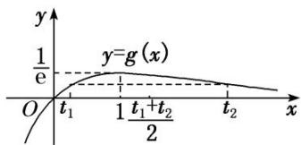

text_image

y
1/e
y=g(x)
O
t₁
1/(2)
t₁+t₂
t₂
x

由 $g(t_{1})=g(t_{2})$ ， $t_{1}\neq t_{2}$ ，不妨设 $t_{1}<t_{2}$ ，作出函数 $g(x)$ 的图象如图所示，由图知必有 $0<t_{1}<1<t_{2}$ ，

令 $F(x)=g(1+x)-g(1-x)$ ， $x\in(0,1]$ ，则 $F'(x)=g'(1+x)-g'(1-x)=\frac{x}{\mathrm{e}^{x+1}}(\mathrm{e}^{2x}-1)>0$ ，

所以 $F(x)$ 在 $(0, 1]$ 上单调递增，所以 $F(x) > F(0) = 0$ 对任意的 $x \in (0, 1]$ 恒成立，

即 $g(1+x)>g(1-x)$ 对任意的 $x\in(0,1]$ 恒成立.

由 $0<t_{1}<1<t_{2}$ ，得 $1-t_{1}\in(0,1]$ ，所以 $g[1+(1-t_{1})]=g(2-t_{1})>g[1-(1-t_{1})]=g(t_{1})=g(t_{2})$

即 $g(2-t_{1})>g(t_{2})$ ，又 $2-t_{1}\in(1,+\infty)$ ， $t_{2}\in(1,+\infty)$ ，且 $g(x)$ 在 $(1,+\infty)$ 上单调递减，

所以 $2-t_{1}<t_{2}$ ，即 $t_{1}+t_{2}>2$ 。

总结提升 上述解题过程就是解决极值点偏移问题的最基本的方法，共有四个解题要点：

(1)求函数 $g(x)$ 的极值点 $x_{0}$ ;

(2)构造函数 $F(x)=g(x_{0}+x)-g(x_{0}-x)$ ;

(3)确定函数 $F(x)$ 的单调性；

(4)结合 $F(0)=0$ ，确定 $g(x_{0}+x)$ 与 $g(x_{0}-x)$ 的大小关系.

其口诀为：极值偏离对称轴，构造函数觅行踪，四个步骤环相扣，两次单调紧跟随.

法二：比值换元法1

不妨设 $x_{1}>x_{2}>0$ ，因为 $\ln x_{1}-ax_{1}=0,\quad\ln x_{2}-ax_{2}=0,$

所以 $\ln x_{1}+\ln x_{2}=a(x_{1}+x_{2})$ ， $\ln x_{1}-\ln x_{2}=a(x_{1}-x_{2})$ ，所以 $\frac{\ln x_{1}-\ln x_{2}}{x_{1}-x_{2}}=a$ ，

欲证 $x_{1}x_{2}>e^{2}$ ，即证 $\ln x_{1}+\ln x_{2}>2$ .

因为 $\ln x_{1}+\ln x_{2}=a(x_{1}+x_{2})$ ，所以即证 $a>\frac{2}{x_{1}+x_{2}}$ ,

所以原问题等价于证明 $\frac{\ln x_{1}-\ln x_{2}}{x_{1}-x_{2}}>\frac{2}{x_{1}+x_{2}}$ ，即 $\ln\frac{x_{1}}{x_{2}}>\frac{2(x_{1}-x_{2})}{x_{1}+x_{2}}$

令 $t=\frac{x_{1}}{x_{2}}(t>1)$ ，则不等式变为 $\ln t>\frac{2(t-1)}{t+1}$ 。令 $h(t)=\ln t-\frac{2(t-1)}{t+1}$ ，t>1，

所以 $h'(t)=\frac{1}{t}-\frac{4}{(t+1)^{2}}=\frac{(t-1)^{2}}{t(t+1)^{2}}>0$ ，所以 $h(t)$ 在 $(1,+\infty)$ 上单调递增，

所以 $h(t)>h(1)=\ln1-0=0$ ，即 $\ln t-\frac{2(t-1)}{t+1}>0(t>1)$ ，因此原不等式 $x_{1}x_{2}>e^{2}$ 得证.

总结提升 用比值换元法求解本题的关键点有两个．一个是消参，把极值点转化为导函数零点之后，需要利用两个变量把参数表示出来，这是解决问题的基础，若只用一个极值点表示参数，如得到 $a=\frac{\ln x_{1}}{x_{1}}$ 之后，代入第二个方程，则无法建立两个极值点的关系，本题中利用两个方程相加(减)之后再消参，巧妙地把两个极值点与参数之间的关系建立起来；二是消“变”，即减少变量的个数，只有把方程转化为一个“变量”的式子后，才能建立与之相应的函数，转化为函数问题求解．本题利用参数a的值相等建立方程，进而利用对数运算的性质，将方程转化为关于 $\frac{x_{1}}{x_{2}}$ 的方程，通过建立函数模型求解该问题，这体现了对数学建模等核心素养的考查．

该方法的基本思路是直接消掉参数 a，再结合所证问题，巧妙引入变量 $c=\frac{x_{1}}{x_{2}}$ ，从而构造相应的函数。其解题要点为：

(1)联立消参：利用方程 $f(x_{1})=f(x_{2})$ 消掉解析式中的参数a.

(2)抓商构元：令 $t = \frac{x_1}{x_2}$ ，消掉变量 $x_{1}, x_{2}$ ，构造关于 $t$ 的函数 $h(t)$ .

(3)用导求解：利用导数求解函数 $h(t)$ 的最小值，从而可证得结论.

比值换元法 2

由题知 $a=\frac{\ln x_{1}}{x_{1}}=\frac{\ln x_{2}}{x_{2}}$ ，则 $\frac{\ln x_{2}}{\ln x_{1}}=\frac{x_{2}}{x_{1}}$ ，设 $x_{1}<x_{2}$ ， $t=\frac{x_{2}}{x_{1}}(t>1)$ ，则 $x_{2}=tx_{1}$ ，

所以 $\frac{\ln tx_1}{\ln x_1} = t$ ，即 $\frac{\ln t + \ln x_1}{\ln x_1} = t$ ，解得 $\ln x_1 = \frac{\ln t}{t - 1}$ ， $\ln x_2 = \ln tx_1 = \ln t + \ln x_1 = \ln t + \frac{\ln t}{t - 1} = \frac{t\ln t}{t - 1}$ .

由 $x_{1}x_{2} > e^{2}$ ，得 $\ln x_{1} + \ln x_{2} > 2$ ，所以 $\frac{t+1}{t-1}\ln t > 2$ ，所以 $\ln t - \frac{2(t-1)}{t+1} > 0$ ，令 $h(t) = \ln t - \frac{2(t-1)}{t+1}$ ，t > 1，

所以 $h'(t)=\frac{1}{t}-\frac{4}{(t+1)^{2}}=\frac{(t-1)^{2}}{t(t+1)^{2}}>0$ ，所以 $h(t)$ 在 $(1,+\infty)$ 上单调递增，

所以 $h(t)>h(1)=\ln1-0=0$ ，即 $\ln t-\frac{2(t-1)}{t+1}>0(t>1)$ ，因此原不等式 $x_{1}x_{2}>e^{2}$ 得证.

法三：差值换元法

由题意，函数 $f(x)$ 有两个零点 $x_{1}$ ， $x_{2}(x_{1} \neq x_{2})$ ，即 $f(x_{1}) = f(x_{2}) = 0$ ，易知 $\ln x_{1}$ ， $\ln x_{2}$ 是方程 $x = ae^{x}$ 的两根。设 $t_{1} = \ln x_{1}$ ， $t_{2} = \ln x_{2}$ ，设 $g(x) = xe^{-x}$ ，则 $g(t_{1}) = g(t_{2})$ ，从而 $x_{1}x_{2} > e^{2} \Leftrightarrow \ln x_{1} + \ln x_{2} > 2 \Leftrightarrow t_{1} + t_{2} > 2$ 。

下证： $t_{1}+t_{2}>2$

由 $g(t_{1})=g(t_{2})$ ，得 $t_{1}e^{-t_{1}}=t_{2}e^{-t_{2}}$ ，化简得 $e^{t_{2}-t_{1}}=\frac{t_{2}}{t_{1}}$ ，①

不妨设 $t_{2}>t_{1}$ ，由法二知， $0<t_{1}<1<t_{2}$ 。令 $s=t_{2}-t_{1}$ ，则 s>0， $t_{2}=s+t_{1}$ ，代入①式，

得 $e^{s}=\frac{s+t_{1}}{t_{1}}$ ，解得 $t_{1}=\frac{s}{e^{s}-1}$ 。则 $t_{1}+t_{2}=2t_{1}+s=\frac{2s}{e^{s}-1}+s$ ，故要证 $t_{1}+t_{2}>2$ ，即证 $\frac{2s}{e^{s}-1}+s>2$ ，

又 $e^{s}-1>0$ ，故要证 $\frac{2s}{e^{s}-1}+s>2$ ，即证 $2s+(s-2)(e^{s}-1)>0$ ，②

令 $G(s)=2s+(s-2)(e^{s}-1)(s>0)$ ，则 $G'(s)=(s-1)e^{s}+1$ ， $G''(s)=se^{s}>0$ ，

故 $G'(s)$ 在 $(0, +\infty)$ 上单调递增，所以 $G'(s) > G'(0) = 0$ ，从而 $G(s)$ 在 $(0, +\infty)$ 上单调递增，

所以 $G(s)>G(0)=0$ ，所以②式成立，故 $t_{1}+t_{2}>2$ 。

总结提升 该方法的关键是巧妙引入变量 s，然后利用等量关系，把 $t_{1}, t_{2}$ 消掉，从而构造相应的函数，转化所证问题．其解题要点为：

(1)取差构元：记 $s=t_{2}-t_{1}$ ，则 $t_{2}=t_{1}+s$ ，利用该式消掉 $t_{2}$ .  
(2)巧解消参：利用 $g(t_{1})=g(t_{2})$ ，构造方程，解之，利用 s 表示 $t_{1}$ .  
(3)构造函数：依据消参之后所得不等式的形式，构造关于 s 的函数 $G(s)$ .  
(4)转化求解：利用导数研究函数 $G(s)$ 的单调性和最小值，从而证得结论.

函数的极值点偏移问题，其实质是导数的应用问题，解题的策略是把含双变量的等式或不等式转化为仅含一个变量的等式或不等式进行求解，解题时要抓住三个关键量：极值点、根差、根商。

[例 3] 已知函数 $f(x)=\ln x-ax^{2}+(2-a)x$ .

(1)讨论 $f(x)$ 的单调性;

(2)设 $f(x)$ 的两个零点是 $x_{1}$ ， $x_{2}$ ，求证： $f\left(\frac{x_{1}+x_{2}}{2}\right)<0$ .

解析 (1) 函数 $f(x)=\ln x-ax^{2}+(2-a)x$ 的定义域为 $(0,+\infty)$ ,

$$
f ^ {\prime} (x) = \frac {1}{x} - 2 a x + (2 - a) = - \frac {(a x - 1) (2 x + 1)}{x},
$$

①当 $a \leq 0$ 时， $f'(x) > 0$ ，则 $f(x)$ 在 $(0, +\infty)$ 上单调递增；  
②当 a>0 时，若 $x\in\left(0,\frac{1}{a}\right)$ ，则 $f'(x)>0$ ，若 $x\in\left(\frac{1}{a},+\infty\right)$ ，则 $f'(x)<0$ ，  
则 $f(x)$ 在 $\left(0, \frac{1}{a}\right)$ 上单调递增，在 $\left(\frac{1}{a}, +\infty\right)$ 上单调递减.

(2)法一：构造差函数法

由(1)易知 a>0，且 $f(x)$ 在 $\left(\begin{aligned}0,&\frac{1}{a}\end{aligned}\right)$ 上单调递增，在 $\left(\begin{aligned}\frac{1}{a},&+\infty\end{aligned}\right)$ 上单调递减，不妨设 $0<x_{1}<\frac{1}{a}<x_{2}$

$f\left(\frac{x_1 + x_2}{2}\right) < 0 \Leftrightarrow \frac{x_1 + x_2}{2} > \frac{1}{a} \Leftrightarrow x_1 + x_2 > \frac{2}{a}$ , 故要证 $f'\left(\frac{x_1 + x_2}{2}\right) < 0$ , 只需证 $x_1 + x_2 > \frac{2}{a}$ 即可.

构造函数 $F(x)=f(x)-f\left(\frac{2}{a}-x\right)$ ， $x\in\left(0,\frac{1}{a}\right)$ ,

$$
F ^ {\prime} (x) = f ^ {\prime} (x) - \left[ f \left(\frac {2}{a} - x\right) \right] ^ {\prime} = f ^ {\prime} (x) + f ^ {\prime} \left(\frac {2}{a} - x\right) = \frac {2 a x (a x - 2) + 2}{x (2 - a x)} = \frac {2 (a x - 1) ^ {2}}{x (2 - a x)},
$$

$\because x\in\left(0,\frac{1}{a}\right),\quad\therefore F'(x)=\frac{2(ax-1)^{2}}{x(2-ax)}>0,\quad\therefore F(x)在\left(0,\frac{1}{a}\right)上单调递增,$

$\therefore F(x) < F\left(\frac{1}{a}\right) = f\left(\frac{1}{a}\right) - f\left(\frac{2}{a} - \frac{1}{a}\right) = 0$ ，即 $f(x) < f\left(\frac{2}{a} - x\right)$ ， $x \in \left(0, \frac{1}{a}\right)$ ,

又 $x_{1}$ ， $x_{2}$ 是函数 $f(x)$ 的两个零点且 $0 < x_{1} < \frac{1}{a} < x_{2}$ ，∴ $f(x_{1}) = f(x_{2}) < f\left(\frac{2}{a} - x_{1}\right)$ ,

而 $x_{2}$ ， $\frac{2}{a}-x_{1}$ 均大于 $\frac{1}{a}$ ， $\therefore x_{2}>\frac{2}{a}-x_{1}$ ， $\therefore x_{1}+x_{2}>\frac{2}{a}$ ，得证.

法二：对数平均不等式法

易知 a>0，且 $f(x)$ 在 $\left(0, \frac{1}{a}\right)$ 上单调递增，在 $\left(\frac{1}{a}, +\infty\right)$ 上单调递减，

不妨设 $0 < x_{1} < \frac{1}{a} < x_{2}$ ， $f'\left(\frac{x_{1} + x_{2}}{2}\right) < 0 \Leftrightarrow \frac{x_{1} + x_{2}}{2} > \frac{1}{a}$ 。因为 $f(x)$ 的两个零点是 $x_{1}$ ， $x_{2}$ ，

所以 $\ln x_{1}-ax_{1}^{2}+(2-a)x_{1}=\ln x_{2}-ax_{2}^{2}+(2-a)x_{2}$ ，所以 $\ln x_{1}-\ln x_{2}+2(x_{1}-x_{2})=a(x_{1}^{2}-x_{2}^{2}+x_{1}-x_{2})$ ,

所以 $a=\frac{\ln x_{1}-\ln x_{2}+2(x_{1}-x_{2})}{x_{1}^{2}-x_{2}^{2}+x_{1}-x_{2}}$ ，以下用分析法证明，要证 $\frac{x_{1}+x_{2}}{2}>\frac{1}{a}$ ,

即证 $\frac{x_1 + x_2}{2} >\frac{x_1^2 - x_2^2 + x_1 - x_2}{\ln x_1 - \ln x_2 + 2(x_1 - x_2)}$ 即证 $\frac{x_1 + x_2}{2} >\frac{x_1 + x_2 + 1}{\frac{\ln x_1 - \ln x_2}{x_1 - x_2} + 2},$

即证 $\frac{2}{x_1 + x_2} < \frac{\frac{\ln x_1 - \ln x_2}{x_1 - x_2} + 2}{x_1 + x_2 + 1}$ ，只需证 $\frac{2}{x_1 + x_2} < \frac{\ln x_1 - \ln x_2}{x_1 - x_2}$ ，即证 $\frac{x_1 + x_2}{2} > \frac{x_1 - x_2}{\ln x_1 - \ln x_2}$ ，

根据对数平均不等式，该式子成立，所以 $f'\left(\frac{x_1 + x_2}{2}\right) < 0$ .

法三：比值代换法

因为 $f(x)$ 的两个零点是 $x_{1}$ ， $x_{2}$ ，不妨设 $0 < x_{1} < x_{2}$ ，

所以 $\ln x_{1}-ax_{1}^{2}+(2-a)x_{1}=\ln x_{2}-ax_{2}^{2}+(2-a)x_{2}$ ，所以 $a(x_{2}^{2}-x_{1}^{2})+(a-2)(x_{2}-x_{1})=\ln x_{2}-\ln x_{1}$

所以 $\frac{\ln x_2 - \ln x_1}{x_2 - x_1} = a(x_2 + x_1) + a - 2, f'(x) = \frac{1}{x} - 2ax + 2 - a,$

$$
f ^ {\prime} \left(\frac {x _ {1} + x _ {2}}{2}\right) = \frac {2}{x _ {1} + x _ {2}} - a (x _ {1} + x _ {2}) - (a - 2) = \frac {2}{x _ {1} + x _ {2}} - \frac {\ln x _ {2} - \ln x _ {1}}{x _ {2} - x _ {1}} = \frac {1}{x _ {2} - x _ {1}} \left[ \frac {2 \left(\frac {x _ {2}}{x _ {1}} - 1\right)}{1 + \frac {x _ {2}}{x _ {1}}} - \ln \frac {x _ {2}}{x _ {1}} \right],
$$

令 $t=\frac{x_{2}}{x_{1}}(t>1)$ ， $g(t)=\frac{2(t-1)}{1+t}-\ln t$ ，则当 t>1 时， $g'(t)=\frac{-(t-1)^{2}}{t(t+1)^{2}}<0$ ，

所以 $g(t)$ 在 $(1, +\infty)$ 上单调递减，所以当 t>1 时， $g(t)<g(1)=0$ ，所以 $f'\left(\frac{x_{1}+x_{2}}{2}\right)<0$ .

