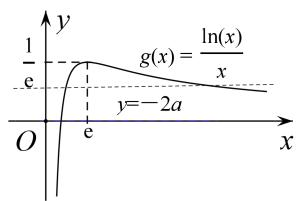
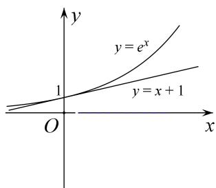
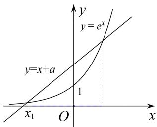

# 专题25 极值点偏移之积 $(x_{1}x_{2})$ 型不等式的证明

# 【例题选讲】

[例1] 已知 $f(x) = x \ln x - \frac{1}{2} mx^2 - x, x \in \mathbf{R}$ .  
（1）当 m=-2 时，求函数 $f(x)$ 的所有零点；  
（2）若 $f(x)$ 有两个极值点 $x_{1}$ ， $x_{2}$ ，且 $x_{1}<x_{2}$ ，求证： $x_{1}x_{2}>e^{2}(e$ 为自然对数的底数).
解析 （1） 当 $m = -2$ 时， $f(x) = x \ln x + x^2 - x = x (\ln x + x - 1)$ ， $x > 0$ 。设 $g(x) = \ln x + x - 1$ ， $x > 0$ ，则 $g'(x) = \frac{1}{x} + 1 > 0$ ，于是 $g(x)$ 在 $(0, +\infty)$ 上为增函数。
又 $g(1)=0$ ，所以 $g(x)$ 有唯一的零点 x=1，从而函数 $f(x)$ 有唯一的零点 x=1。  
（2）欲证 $x_{1}x_{2} > e^{2}$ ，只需证 $\ln x_{1} + \ln x_{2} > 2$ .
由函数 $f(x)$ 有两个极值点 $x_{1}$ ， $x_{2}$ ，可得函数 $f'(x)$ 有两个零点，又 $f'(x)=\ln x-mx$ ，所以 $x_{1}$ ， $x_{2}$ 是方程 $f'(x)=0$ 的两个不同实根。于是有 $\left\{\begin{aligned}\ln x_{1}-mx_{1}&=0,\\ \ln x_{2}-mx_{2}&=0,\end{aligned}\right.$ ①

①+②可得 $\ln x_{1}+\ln x_{2}=m(x_{1}+x_{2})$ ，即 $m=\frac{\ln x_{1}+\ln x_{2}}{x_{1}+x_{2}}$ ,  
②-①可得 $\ln x_{2}-\ln x_{1}=m(x_{2}-x_{1})$ ，即 $m=\frac{\ln x_{2}-\ln x_{1}}{x_{2}-x_{1}}$ ,
从而可得 $\frac{\ln x_2 - \ln x_1}{x_2 - x_1} = \frac{\ln x_1 + \ln x_2}{x_1 + x_2}$ ，于是 $\ln x_1 + \ln x_2 = \frac{\left(1 + \frac{x_2}{x_1}\right)\ln\frac{x_2}{x_1}}{\frac{x_2}{x_1} - 1}$ .
由 $0 < x_{1} < x_{2}$ ，设 $t = \frac{x_2}{x_1}$ ，则 $t > 1$ 。因此 $\ln x_{1} + \ln x_{2} = \frac{(1 + t)\ln t}{t - 1}, t > 1$ 。
要证 $\ln x_{1}+\ln x_{2}>2$ ，即证 $\frac{(t+1)\ln t}{t-1}>2(t>1)$ ，即证当 t>1 时，有 $\ln t>\frac{2(t-1)}{t+1}$ .
令 $h(t)=\ln t-\frac{2(t-1)}{t+1}(t>1)$ ，则 $h'(t)=\frac{1}{t}-\frac{2(t+1)-2(t-1)}{(t+1)^{2}}=\frac{(t-1)^{2}}{t(t+1)^{2}}>0,$
所以 $h(t)$ 为 $(1, +\infty)$ 上的增函数．因此 $h(t) > \ln 1 - \frac{2(1 - 1)}{1 + 1} = 0.$
于是当 $t > 1$ 时，有 $\ln t > \frac{2(t - 1)}{t + 1}$ 所以有 $\ln x_{1} + \ln x_{2} > 2$ 成立，即 $x_{1}x_{2} > \mathrm{e}^{2}$

[例2] 已知函数 $g(x) = \ln x + bx$ .  
（1）函数 $g(x)$ 有两个不同的零点 $x_{1}, x_{2}$ ，求实数 b 的取值范围；  
（2）在（1）的条件下，求证： $x_{1}x_{2} > e^{2}$ .
解析 （1） $g(x)$ 有两个不同的零点 $x_{1}, x_{2}$ ，即 $\ln x + bx = 0$ 有两个不同的根， $\therefore b = -\frac{\ln x}{x}$ .
设 $f(x)=-\frac{\ln x}{x}$ ，∴ $f'(x)=-\frac{1-\ln x}{x^{2}}$ ，令 $f'(x)>0$ 可得： $1-\ln x<0\Rightarrow x>e$ 。
∴ $f(x)$ 在 $(0, e)$ 单调递减，在 $(e, +\infty)$ 单调递增，且 $x \to +\infty$ 时， $f(x) \to 0$ ， $f(e) = -\frac{1}{e}$ ，∴ $b \in \left(-\frac{1}{e}, 0\right)$  
（2）思路一：不妨设 $x_{2} > x_{1}$ ，由已知可得： $\left\{ \begin{array}{ll}\ln x_1 + bx_1 = 0\\ \ln x_2 + bx_2 = 0 \end{array} \right.$ ，∴ $\ln x_1x_2 = -b(x_1 + x_2)$
即只需证明： $-b(x_{1}+x_{2})>2$ ，在方程 $\left\{\begin{aligned}\ln x_{1}+bx_{1}&=0\\ \ln x_{2}+bx_{2}&=0\end{aligned}\right.$ 可得： $b(x_{1}-x_{2})=\ln\frac{x_{2}}{x_{1}}$ .
$\therefore b=\frac{\ln\frac{x_{2}}{x_{1}}}{x_{1}-x_{2}},\quad\therefore$ 只需证明： $-\frac{\ln\frac{x_{2}}{x_{1}}}{x_{1}-x_{2}}(x_{1}+x_{2})>2$
即 $\frac{\ln\frac{x_2}{x_1}}{x_2 - x_1}(x_1 + x_2) > 2\Leftrightarrow \frac{\left(1 + \frac{x_2}{x_1}\right)\ln\frac{x_2}{x_1}}{\frac{x_2}{x_1} - 1} >2\Leftrightarrow \left(1 + \frac{x_2}{x_1}\right)\ln \frac{x_2}{x_1} >2\left(\frac{x_2}{x_1} -1\right).$
令 $t=\frac{x_{2}}{x_{1}}$ ，则 t>1，所以只需证明不等式： $(1+t)\ln t>2(t-1)\Rightarrow(1+t)\ln t-2t+2>0$ ①，
设 $h(t)=(1+t)\ln t-2t+2,\quad h(1)=0,\quad \therefore h'(t)=\frac{1+t}{t}+\ln t-2=\frac{1}{t}+\ln t-1,\quad h'（1）=0$
$\therefore h''(t) = \frac{1}{t} - \frac{1}{t^2} = \frac{t - 1}{t^2} > 0, \therefore h(t)$ 在 $(1, +\infty)$ 单调递增． $\therefore h'(t) > h'（1） = 0$
∴ $h(t)$ 在 $(1, +\infty)$ 单调递增，∴ $h(t) > h(1) = 0$ ，即不等式①得证.
$\therefore -b(x_{1} + x_{2}) > 2$ 即 $\ln x_1x_2 > 2$ ， $\therefore x_1x_2 > e^2$

思路二：所证不等式 $x_{1}x_{2} > \mathrm{e}^{2}\Leftrightarrow x_{1} > \frac{\mathrm{e}^{2}}{x_{2}}$ ，因为 $g(x) = \ln x + bx$ 有两不同零点 $x_{1},x_{2}$
∴ $x_{1}$ , $x_{2}$ 满足方程 $\ln x + bx = 0 \Leftrightarrow b = -\frac{\ln x}{x}$ ，由（1）可得： $0 < x_{1} < e < x_{2}$ .

考虑设 $f(x)=-\frac{\ln x}{x}$ ，∴ $f(x_{1})=f(x_{2})$ ，由（1）可得： $f(x)$ 在 $(0, e)$ 单调递减，在 $(e,+\infty)$ 单调递增.
$\because 0 < x_{1} < \mathrm{e} < x_{2}, \therefore x_{1} \in (0, \mathrm{e}), \frac{\mathrm{e}^{2}}{x_{2}} \in (0, \mathrm{e})$ 。结合 $f(x)$ 的单调性可知：只需证明 $f(x_{1}) < f\left(\frac{\mathrm{e}^{2}}{x_{2}}\right)$ .
$\because f(x_{1}) = f(x_{2})$ ，所以只需证明： $f(x_{2}) <   f(\frac{\mathrm{e}^{2}}{x_{2}})\Leftrightarrow f(x_{2}) - f(\frac{\mathrm{e}^{2}}{x_{2}}) <   0.$
即证明： $\frac{\ln\frac{e^2}{x_2}}{\frac{e^2}{x_2}} -\frac{\ln x_2}{x_2} < 0\Leftrightarrow x_2\ln \frac{\mathrm{e}^2}{x_2} -\frac{\mathrm{e}^2}{x_2}\ln x_2 <   0\Leftrightarrow 2x_2^2 -\left(x_2^2 +\mathrm{e}^2\right)\ln x_2 <   0.$
设 $h(x)=2x^{2}-\left(x^{2}+\mathrm{e}^{2}\right)\ln x,\quad x\in\left(\mathrm{e},+\infty\right)$ ，则 $h(\mathrm{e})=0$ 。
$\therefore h ^ {'} (x) = 4 x - \frac {1}{x} \left(x ^ {2} + \mathrm{e} ^ {2}\right) - 2 x \ln x = 3 x - \frac {\mathrm{e} ^ {2}}{x} - 2 x \ln x, \text {则} h ^ {'} (\mathrm{e}) = 0.$
$\therefore h ^ {' '} (x) = 3 + \frac {\mathrm{e} ^ {2}}{x ^ {2}} - 2 (1 + \ln x) = 1 + \frac {\mathrm{e} ^ {2}}{x ^ {2}} - 2 \ln x, \text {则} h ^ {' '} (\mathrm{e}) = 0.$
$\because h ^ {' '} (x) \text {单调递减，} \therefore h ^ {' '} (x) <   h ^ {' '} (e) = 0, \therefore h ^ {'} (x) \text {单调递减，} \therefore h ^ {'} (x) <   h ^ {'} (e) = 0.$
$\therefore h (x) \text {单调递减，} \therefore h (x) <   h (\mathrm{e}) = 0, \text {即} 2 x _ {2} ^ {2} - \left(x ^ {2} + \mathrm{e} ^ {2}\right) \ln x _ {2} <   0 \text {得证.}$
$\therefore f \left(x _ {1}\right) <   f \left(\frac {\mathrm{e} ^ {2}}{x _ {2}}\right) \text {得证，从而有} x _ {1} > \frac {\mathrm{e} ^ {2}}{x _ {2}} \Leftrightarrow x _ {1} x _ {2} > \mathrm{e} ^ {2}.$

[例 3] 已知函数 $f(x)=\ln x-ax(a\in\mathbf{R})$ .  
（1）求函数 $f(x)$ 的单调区间；  
（2）当 a=1 时，方程 $f(x)=m(m<-2)$ 有两个相异实根 $x_{1}$ ， $x_{2}$ ，且 $x_{1}<x_{2}$ ，求证： $x_{1}\cdot x_{2}^{2}<2$ .
解析 （1）由题意得， $f(x)=\frac{1}{x}-a=\frac{1-ax}{x}(x>0)$ .
当 $a \leq 0$ 时，由 x > 0，得 1 - ax > 0，即 $f'(x) > 0$ ，所以 $f(x)$ 在 $(0, +\infty)$ 上单调递增.
当 a>0 时，由 $f(x)>0$ ，得 $0<x<\frac{1}{a}$ ，由 $f'(x)<0$ ，得 $x>\frac{1}{a}$ ，
所以 $f(x)$ 在 $\left(0, \frac{1}{a}\right)$ 上单调递增，在 $\left(\frac{1}{a}, +\infty\right)$ 上单调递减.

综上，当 $a \leq 0$ 时， $f(x)$ 在 $(0, +\infty)$ 上单调递增；当 $a > 0$ 时， $f(x)$ 在 $\left[0, \frac{1}{a}\right]$ 上单调递增，在 $\left[\frac{1}{a}, +\infty\right]$ 上单调递减.  
（2）由题意及（1）可知，方程 $f(x)=m(m<-2)$ 的两个相异实根 $x_{1}$ ， $x_{2}$ 满足 $\ln x-x-m=0$ ，

且 $0 < x_{1} < 1 < x_{2}$ ，即 $\ln x_{1} - x_{1} - m = \ln x_{2} - x_{2} - m = 0$ .
由题意，可知 $\ln x_{1}-x_{1}=m<-2<\ln2-2,$
又由（1）可知， $f(x)=\ln x-x$ 在 $(1,+\infty)$ 上单调递减，故 $x_{2}>2$ .
令 $g(x) = \ln x - x - m$ ，则 $g(x) - g\left(\frac{2}{x^2}\right) = -x + \frac{2}{x^2} +3\ln x - \ln 2.$
令 $h(t)=-t+\frac{2}{t^{2}}+3\ln t-\ln 2(t>2)$ ，则 $h'(t)=-\frac{(t-2)^{2}(t+1)}{t^{3}}$ .
当 t>2 时， $h'(t)<0,\quad h(t)$ 单调递减，所以 $h(t)<h(2)=2\ln2-\frac{3}{2}<0$ ，所以 $g(x)<g\left(\frac{2}{x^{2}}\right)$ .
因为 $x_{2}>2$ 且 $g(x_{1})=g(x_{2})$ ，所以 $h(x_{2})=g(x_{2})-g\left(\frac{2}{x_{2}^{2}}\right)=g(x_{1})-g\left(\frac{2}{x_{2}^{2}}\right)<0$ ，即 $g(x_{1})<g\left(\frac{2}{x_{2}^{2}}\right)$ .
因为 $g(x)$ 在 $(0, 1)$ 上单调递增，所以 $x_{1} < \frac{2}{x_{2}^{2}}$ ，故 $x_{1} \cdot x_{2}^{2} < 2$ .

总结提升 本题第（2）问要证明的方程根之间的不等式关系比较复杂, 此类问题可通过不等式的等价变形, 将两个根分布在不等式两侧, 然后利用函数的单调性转化为对应函数值之间的大小关系即可. 显然构造函数的关键仍然是消掉参数, 另外根据函数性质确定“ $x_{2} > 2$ ”是解题的一个关键点, 确定其范围之后才能将 $x_{1}$ 与 $\frac{2}{x_2^2}$ 化归到函数的同一个单调区间上，这也是此类问题的一个难点——精确定位.

[例 4] 已知函数 $f(x)=\ln x-ax+b(a,\quad b\in\mathbf{R})$ 有两个不同的零点 $x_{1}$ ， $x_{2}$ .  
（1）求 $f(x)$ 的最值;  
（2）证明： $x_{1}x_{2}<\frac{1}{a^{2}}$

思维引导 （1）求出导函数，由函数 $f(x)$ 有两个不同的零点，则 $f(x)$ 在 $(0, +\infty)$ 内必不单调，得 $a > 0$ ，进而得到函数的单调性，即可求出函数的最值.  
（2）由题意转化为证明 $\ln^2\frac{x_1}{x_2} < \frac{(x_1 - x_2)^2}{x_1x_2} = \frac{x_1}{x_2} - 2 + \frac{x_2}{x_1}$ ，不妨设 $x_1 < x_2$ ，令 $\frac{x_1}{x_2} = t \in (0,1)$ ，只需证明 $\ln^2 t < t - 2 + \frac{1}{t}$ ，设 $h(t) = 2\ln t - t + \frac{1}{t}$ ，根据函数的单调性，即可作出证明.
解析 （1） $f'(x) = \frac{1}{x} - a$ ， $f(x)$ 有两个不同的零点，∴ $f(x)$ 在 $(0, +\infty)$ 内必不单调，故 $a > 0$ ，
此时 $f'(x) > 0$ ，解得 $x < \frac{1}{a}$ ， $\therefore f(x)$ 在 $\left(0, \frac{1}{a}\right)$ 上单增， $\left(\frac{1}{a}, +\infty\right)$ 上单减，
∴ $f(x)_{\max} = f(\frac{1}{a}) = -\ln a - 1 + b$ ，无最小值.  
（2）由题知 $\left\{ \begin{array}{l} \ln x_{1} - ax_{1} + b = 0 \\ \ln x_{2} - ax_{2} + b = 0 \end{array} \right.$ 两式相减得 $\ln \frac{x_1}{x_2} - a(x_1 - x_2) = 0$ ，即 $a = \frac{\ln \frac{x_1}{x_2}}{x_1 - x_2}$ ，
故要证 $x_{1}x_{2} < \frac{1}{a^{2}}$ ，即证 $x_{1}x_{2} < \frac{(x_{1} - x_{2})^{2}}{\ln^{2}\frac{x_{1}}{x_{2}}}$ ，即证 $\ln^2\frac{x_1}{x_2} < \frac{(x_1 - x_2)^2}{x_1x_2} = \frac{x_1}{x_2} - 2 + \frac{x_2}{x_1}$ ，
不妨设 $x_{1} < x_{2}$ ，令 $\frac{x_1}{x_2} = t \in (0, 1)$ ，则只需证 $\ln^2 t < t - 2 + \frac{1}{t}$ ，设 $g(t) = \ln^2 t - t - \frac{1}{t} + 2$ ，
则 $g'(t)=2\frac{1}{t}\ln t-1+\frac{1}{t^{2}}=\frac{2\ln t-t+\frac{1}{t}}{t}$ ，设 $h(t)=2\ln t-t+\frac{1}{t}$ ，则 $h'(t)=-\frac{(t-1)^{2}}{t^{2}}<0$ ，
∴ $h(t)$ 在 $(0,1)$ 上单减，∴ $h(t)>h(1)=0$ ，∴ $g(t)$ 在 $(0,1)$ 上单增，∴ $g(t)<g(1)=0$ ，
即 $\ln^{2}t < t - 2 + \frac{1}{t}$ 在 $t \in (0, 1)$ 时恒成立，原不等式得证.

总结提升 体会在用 $x_{1}, x_{2}$ 表示 $a$ 时为什么要用两个方程，而不是只用 $2 \ln x_{1} - x_{1}^{2} - ax_{1} = 0$ 来表示 $a$ ？如果只用 $x_{1}$ 或 $x_{2}$ 进行表示，则 $\ln x_{1}$ 很难处理，用 $x_{1}, x_{2}$ 两个变量表示 $a$ ，在代入的时候有 $\ln \frac{x_{2}}{x_{1}}$ 项，即可以考虑利用换元法代替 $\frac{x_{2}}{x_{1}}$ ，这也体现出双变量换元时在结构上要求“平衡”的特点。

# 【对点训练】

1. 已知函数 $f(x) = x \ln x$ 的图象与直线 $y = m$ 交于不同的两点 $A(x_{1}, y_{1})$ , $B(x_{2}, y_{2})$ . 求证: $x_{1}x_{2} < \frac{1}{\mathrm{e}^{2}}$ .

1. 解析 $f'(x) = \ln x + 1$ ，由 $f'(x) > 0$ 得 $x > \frac{1}{\mathrm{e}}$ ，由 $f'(x) < 0$ 得 $0 < x < \frac{1}{\mathrm{e}}$ ，
∴函数 $f(x)$ 在 $\left(0, \frac{1}{e}\right)$ 上单调递减，在 $\left(\frac{1}{e}, +\infty\right)$ 上单调递增．可设 $0 < x_{1} < \frac{1}{e} < x_{2}$ .
方法一 构造函数 $F(x)=f(x)-f\left(\frac{1}{e^{2}x}\right)$ ，则
$F ^ {'} (x) = f ^ {'} (x) + \frac {1}{\mathrm{e} ^ {2} x ^ {2}} f ^ {'} \left(\frac {1}{\mathrm{e} ^ {2} x}\right) = 1 + \ln x + \frac {1}{\mathrm{e} ^ {2} x ^ {2}} \cdot \left(1 + \ln \frac {1}{\mathrm{e} ^ {2} x}\right) = (1 + \ln x) \cdot \left(1 - \frac {1}{\mathrm{e} ^ {2} x ^ {2}}\right),$
当 $0 < x < \frac{1}{\mathrm{e}}$ 时， $1 + \ln x < 0$ ， $1 - \frac{1}{\mathrm{e}^2x^2} < 0$ ，则 $F'(x) > 0$ ，得 $F(x)$ 在 $\left[0, \frac{1}{\mathrm{e}}\right]$ 上是增函数， $\therefore F(x) < F\left(\frac{1}{\mathrm{e}}\right) = 0$
$\therefore f(x)<f\left(\frac{1}{e^{2}x}\right)\left(0<x<\frac{1}{e}\right)$ ，将 $x_{1}$ 代入上式得 $f(x_{1})<f\left(\frac{1}{e^{2}x_{1}}\right)$ ，又 $f(x_{1})=f(x_{2})$ ， $\therefore f(x_{2})<f\left(\frac{1}{e^{2}x_{1}}\right)$
又 $x_{2}>\frac{1}{e},\quad\frac{1}{e^{2}x_{1}}>\frac{1}{e}$ ，且 $f(x)$ 在 $\left(\frac{1}{e},+\infty\right)$ 上单调递增， $\therefore x_{2}<\frac{1}{e^{2}x_{1}},\quad\therefore x_{1}x_{2}<\frac{1}{e^{2}}.$
方法二 $f(x_{1})=f(x_{2})$ 即 $x_{1}\ln x_{1}=x_{2}\ln x_{2}$ ，令 $t=\frac{x_{2}}{x_{1}}>1$ ，则 $x_{2}=tx_{1}$ ，
代入上式得 $x_{1}\ln x_{1}=tx_{1}(\ln t+\ln x_{1})$ ，得 $\ln x_{1}=\frac{t\ln t}{1-t}$ .
$\therefore x _ {1} x _ {2} <   \frac {1}{\mathrm{e} ^ {2}} \Leftrightarrow \ln x _ {1} + \ln x _ {2} <   - 2 \Leftrightarrow 2 \ln x _ {1} + \ln t <   - 2 \Leftrightarrow \frac {2 t \ln t}{1 - t} + \ln t <   - 2 \Leftrightarrow \ln t - \frac {2 (t - 1)}{t + 1} > 0.$
设 $g(t)=\ln t-\frac{2(t-1)}{t+1}$ (t>1)，则 $g'(t)=\frac{(t-1)^{2}}{t(t+1)^{2}}>0$ .
∴当 t>1 时， $g(t)$ 为增函数， $g(t)>g(1)=0$ ，∴ $\ln t-\frac{2(t-1)}{t+1}>0$ 。故 $x_{1}x_{2}<\frac{1}{e^{2}}$

2. 已知函数 $f(x) = \ln x - ax$ .  
（1）讨论 $f(x)$ 的单调性;  
（2）若函数 $f(x)$ 有两个零点 $x_{1}$ ， $x_{2}(x_{1}<x_{2})$ .

①求 a 的取值范围；②证明： $x_{1} \cdot x_{2} > e^{2}$ .

2. 解析 （1） $f(x)$ 的定义域为 $(0, +\infty)$ ， $f'(x) = \frac{1}{x} - a$ ，

(i) 当 $a \leqslant 0$ 时 $f'(x) > 0$ ，∴ $f(x)$ 在 $(0, +\infty)$ 上单调递增；
(ii) 当 a > 0 时，若 $x \in (0, \frac{1}{a})$ ，则 $f'(x) > 0$ ， $f(x)$ 在 $(0, \frac{1}{a})$ 上单调递增；
若 $x \in \left( \frac{1}{a}, +\infty \right)$ ，则 $f'(x) < 0$ ， $f(x)$ 在区间 $\left[ \frac{1}{a}, +\infty \right)$ 上单调递减；
综上： $a \leqslant 0$ 时， $f(x)$ 在 $(0, +\infty)$ 上单调递增；
a>0 时， $f(x)$ 在 $(0, \frac{1}{a})$ 上单调递增，在 $\left[\frac{1}{a}, +\infty\right)$ 上单调递减；  
（2）①由（1）知， $a \leqslant 0$ 时， $f(x)$ 单调递增， $f(x)$ 至多一个零点，不合题意，
当 a > 0 时， $(x)$ 在 $(0, \frac{1}{a})$ 上单调递增，在区间 $\left[\frac{1}{a}, +\infty\right)$ 上单调递减；
$f(x)_{max} = f(\frac{1}{a}) = ln\frac{1}{a} - 1$ ，若函数 $f(x)$ 有两个零点 $x_{1}$ ， $x_{2}(x_{1} <   x_{2})$
由于 $x \to 0$ 时， $y \to -\infty$ ， $x \to +\infty$ 时， $y \to -\infty$ ，所以 $f(\frac{1}{a}) = \ln \frac{1}{a} - 1 > 0$ ，解得 $a < \frac{1}{e}$ ，
故所求 a 的取值范围为 $0 < a < \frac{1}{e}$ ;

②证明：由题意： $\ln x_{1}=ax_{1}$ ， $\ln x_{2}=ax_{2}$ ，∴ $a=\frac{\ln x_{2}-\ln x_{1}}{x_{2}-x_{1}}$
要证 $x_{1} \cdot x_{2} > e^{2}$ ，只要证 $\ln x_{1} + \ln x_{2} > 2$ ，即 $a(x_{1} + x_{2}) > 2$ 。
只要证 $\frac{\ln x_{2}-\ln x_{1}}{x_{2}-x_{1}}>\frac{2}{x_{1}+x_{2}}$ 即证 $\ln t>\frac{2(t-1)}{t+1}$ 其中 $t=\frac{x_{2}}{x_{1}}>1$
令 $g(t)=\ln t-\frac{2(t-1)}{t+1}(t>1)$ ， $g'(t)=\frac{(t-1)^{2}}{t(t+1)^{2}}>0,\quad\therefore g(t)$ 在 $(1,+\infty)$ 单调递增，
$g(t)>g(1)=0$ ，即 $\ln t>\frac{2(t-1)}{t+1}$ （其中 $t=\frac{x_{2}}{x_{1}}>1$ ）成立，
故原不等式 $x_{1}\cdot x_{2}>e^{2}$ 成立.

3. 已知函数 $f(x) = x\ln x + ax^2 - x + a (a \in \mathbf{R})$ 在其定义域内有两个不同的极值点.  
（1）求a的取值范围.  
（2）设 $f(x)$ 的两个极值点为 $x_{1}$ ， $x_{2}$ ，证明 $x_{1}x_{2} > e^{2}$ .

3. 解析 （1）函数 $f(x) = x\ln x + ax^2 - x + a (a \in \mathbf{R})$ 的定义域为 $(0, +\infty)$ ， $f'(x) = \ln x + 2ax$ .
$\because$ 函数 $f(x) = x\ln x + ax^2 -x + a(a\in \mathbf{R})$ 在其定义域内有两个不同的极值点.
∴方程 $f'(x)=0$ 在 $(0,+\infty)$ 有两个不同根；
转化为函数 $g(x)=\frac{\ln x}{x}$ 与函数 y=-2a 的图象在 $(0,+\infty)$ 上有两个不同交点.
又 $g'(x) = \frac{1 - \ln x}{x^2}$ ，即 $0 < x < e$ 时， $g'(x) > 0$ ， $x > e$ 时， $g'(x) < 0$ ，
故 $g(x)$ 在 $(0, e)$ 上单调增，在 $(e, +\infty)$ 上单调减．故 $g(x)_{\text{极大}} = g(e) = \frac{1}{e}$ .
又 $g(x)$ 有且只有一个零点是1，且在 $x \to 0$ 时， $g(x) \to -\infty$ ，在在 $x \to +\infty$ 时， $g(x) \to 0$ ，
故 $g(x)$ 的草图如图， $\therefore 0 < -2a < \frac{1}{e}$ ，即 $-\frac{1}{2e} < a < 0$ 。故 $a$ 的取值范围为 $(- \frac{1}{2e}, 0)$ 。

  
（2）由（1）可知 $x_{1}$ ， $x_{2}$ 分别是方程 $\ln x + 2a = 0$ 的两个根，即 $\ln x_{1} = -2ax_{1}$ ， $\ln x_{2} = -2ax_{2}$ ，
设 $x_{1} > x_{2}$ ，作差得 $\ln \frac{x_1}{x_2} = -2a(x_1 - x_2)$ .得 $-2a = \frac{\ln\frac{x_1}{x_2}}{x_1 - x_2}$
要证明 $x_{1}x_{2}>e^{2}$ 。只需证明 $\ln x_{1}+\ln x_{2}>2$ 。
$\Leftarrow -2a(x_{1} + x_{2}) > 2$ ， $\Leftarrow \frac{\ln\frac{x_1}{x_2}}{x_1 - x_2}(x_1 + x_2) > 2$ ，即只需证明 $\ln \frac{x_1}{x_2} >\frac{2(x_1 - x_2)}{x_1 + x_2}$
令 $\frac{x_{1}}{x_{2}}=t$ ，则t>1，只需证明 $\ln t>\frac{2(t-1)}{t+1}$ ，
设 $g(t)=\ln t-\frac{2(t-1)}{t+1}(t>1)$ ， $g'(t)=\frac{(t-1)^{2}}{t(t+1)}>0$ ．∴函数 $g(t)$ 在 $(1,+\infty)$ 上单调递增，
$\therefore g(t) > g(1) = 0$ ，故 $\ln t > \frac{2(t - 1)}{t + 1}$ 成立． $\therefore x_{1}x_{2} > e^{2}$ 成立.

4. 已知函数 $f(x)=\frac{\ln x}{x+a}(a\in\mathbf{R})$ ，曲线 $y=f(x)$ 在点 $(1, f(1))$ 处的切线与直线 $x+y+1=0$ 垂直.  
（1）试比较 $2018^{2019}$ 与 $2019^{2018}$ 的大小，并说明理由；  
（2）若函数 $g(x)=f(x)-k$ 有两个不同的零点 $x_{1}$ ， $x_{2}$ ，证明： $x_{1}x_{2}>e^{2}$ .

4. 解析 （1）依题意得 $f(x) = \frac{\frac{x + a}{x} - \ln x}{(x + a)^2}$ ，所以 $f'（1） = \frac{1 + a}{(1 + a)^2} = \frac{1}{1 + a}$ ,
又曲线 $y=f(x)$ 在点 $(1, f(1))$ 处的切线与直线 $x+y+1=0$ 垂直，
所以 $f(1)=1$ ，即 $\frac{1}{1+a}=1$ ，解得 a=0。故 $f(x)=\frac{\ln x}{x}$ ， $f'(x)=\frac{1-\ln x}{x^{2}}$ 。
令 $f'(x)>0$ ，则 $1-\ln x>0$ ，解得 0<x<e；令 $f'(x)<0$ ，则 $1-\ln x<0$ ，解得 x>e，
所以 $f(x)$ 的单调递增区间为 $(0, e)$ ，单调递减区间为 $(e, +\infty)$ .
所以 $f(2018)>f(2019)$ ，即 $\frac{\ln 2018}{2018}>\frac{\ln 2019}{2019}$ ，整理得 $\ln 2018^{2019}>\ln 2019^{2018}$
所以 $2018^{2019}>2019^{2018}$ .  
（2）不妨设 $x_{1}>x_{2}>0$ ，因为 $g(x_{1})=g(x_{2})=0$ ，所以 $\ln x_{1}-kx_{1}=0$ ， $\ln x_{2}-kx_{2}=0$ ，
可得 $\ln x_{1}+\ln x_{2}=k(x_{1}+x_{2})$ ， $\ln x_{1}-\ln x_{2}=k(x_{1}-x_{2})$ .
要证 $x_{1}x_{2} > e^{2}$ ，即证 $\ln x_{1}x_{2} > 2$ ，只需证 $\ln x_{1} + \ln x_{2} > 2$ ，也就是证 $k(x_{1} + x_{2}) > 2$ ，即证 $k > \frac{2}{x_{1} + x_{2}}$ .
因为 $k=\frac{\ln x_{1}-\ln x_{2}}{x_{1}-x_{2}}$ ，所以只需证 $\frac{\ln x_{1}-\ln x_{2}}{x_{1}-x_{2}}>\frac{2}{x_{1}+x_{2}}$ ，即证 $\ln\frac{x_{1}}{x_{2}}>\frac{2(x_{1}-x_{2})}{x_{1}+x_{2}}$ .
令 $\frac{x_{1}}{x_{2}}=t(t>1)$ ，则只需证 $\ln t>\frac{2(t-1)}{t+1}(t>1)$ .
令 $h(t)=\ln t-\frac{2(t-1)}{t+1}(t>1)$ ，则 $h'(t)=\frac{1}{t}-\frac{4}{(t+1)^{2}}=\frac{(t-1)^{2}}{t(t+1)^{2}}>0$ ,
故函数 $h(t)$ 在 $(1, +\infty)$ 上是单调递增的，所以 $h(t) > h(1) = 0$ ，即 $\ln t > \frac{2(t-1)}{t+1}$ ，所以 $x_{1}x_{2} > e^{2}$ .

5. 已知函数 $f(x)=\ln x+\frac{b}{x}-a$ ( $a\in R, b\in R$ ) 有最小值 M，且 $M\geq0$ .  
（1）求 $\mathrm{e}^{a - 1} - b + 1$ 的最大值；  
（2）当 $e^{a^{-1}}-b+1$ 取得最大值时，设 $F(b)=\frac{a-1}{b}-m(m\in\mathbf{R})$ ， $F(x)$ 有两个零点为 $x_{1}$ ， $x_{2}(x_{1}<x_{2})$ ，证明： $x_{1}x_{2}^{2}>e^{3}$

5. 解析 （1）有题意 $f'(x) = \frac{1}{x} - \frac{b}{x^2} = \frac{x - b}{x^2} (x > 0)$ ，
当 $b \leqslant 0$ 时， $f'(x) \geqslant 0$ ， $f(x)$ 在 $(0, +\infty)$ 上单增，此时显然不成立，
当 b > 0 时，令 $f'(x) = 0$ ，得 x = b，此时 $f(x)$ 在 $(0, b)$ 上单减，在 $(b, +\infty)$ 上单增，
$\therefore M = f(b) = \ln b + 1 - a \geqslant 0$ ，即 $\ln b \geqslant a - 1$ ，所以 $b \geqslant e^{a - 1}$ ， $e^{a - 1} - b \leqslant 0$ 。
所以 $e^{a-1}-b+1$ 的最大值为 1.  
（2）当 $e^{a - 1} - b + 1$ 取得最大值时， $a - 1 = \ln b$ ， $F(b) = \frac{a - 1}{b} -m = \frac{\ln b}{b} -m$
∵ $F(x)$ 的两个零点为 $x_{1}$ ， $x_{2}$ ，则 $\frac{lnx_{1}}{x_{1}} - m = 0; \frac{lnx_{2}}{x_{2}} - m = 0$ ，即 $lnx_{1} = mx_{1}$ ， $lnx_{2} = mx_{2}$ ，

不等式 $x_{1} \cdot x_{2}^{2} > e^{3}$ 恒成立等价于 $\ln x_{1} + 2\ln x_{2} = mx_{1} + 2mx_{2} = m(x_{1} + 2x_{2}) > 3$

两式相减得 $\ln\frac{x_{1}}{x_{2}}=m(x_{1}-x_{2})\Rightarrow m=\frac{\ln\frac{x_{1}}{x_{2}}}{x_{1}-x_{2}}$

带入上式得 $(x_{1} + 2x_{2})\cdot \frac{ln\frac{x_{1}}{x_{2}}}{x_{1} - x_{2}} >3\Leftrightarrow ln\frac{x_{1}}{x_{2}} < \frac{3(x_{1} - x_{2})}{x_{1} + 2x_{2}} = \frac{3(\frac{x_{1}}{x_{2}} - 1)}{\frac{x_{1}}{x_{2}} + 2}$
令 $\frac{x_1}{x_2} = t(0 < t < 1)$ ，则 $g(t) = lnt - \frac{3(t - 1)}{t + 2}, (0 < t < 1)$ ， $g'(t) = \frac{(t - 1)(t - 4)}{t(t + 2)^2} > 0$ ，
所以函数 $g(t)$ 在 $(0,1)$ 上单调递增，∴ $g(t) < g(1) = 0$ ，得证.

6. 已知函数 $f(x) = (\ln x - k - 1)x (k \in \mathbf{R})$ .  
（1）当 x>1 时，求 $f(x)$ 的单调区间和极值；  
（2）若对任意 $x \in [e, e^{2}]$ ，都有 $f(x) < 4\ln x$ 成立，求 k 的取值范围；  
（3）若 $x_{1} \neq x_{2}$ ，且 $f(x_{1}) = f(x_{2})$ ，证明 $x_{1}x_{2} < e^{2k}$ .

6. 解析 （1） $f'(x)=\frac{1}{x}\cdot x+\ln x-k-1=\ln x-k.$

①当 $k \leq 0$ 时，因为 x > 1，所以 $f'(x) = \ln x - k > 0$ ，
所以函数 $f(x)$ 的单调递增区间是 $(1, +\infty)$ ，无单调递减区间，无极值.

②当 k>0 时，令 $\ln x-k=0$ ，解得 $x=e^{k}$
当 $1<x<e^{k}$ 时， $f'(x)<0$ ；当 $x>e^{k}$ 时， $f'(x)>0$ 。
所以函数 $f(x)$ 的单调递减区间是 $(1, e^{k})$ ，单调递增区间是 $(e^{k}, +\infty)$ ,
在 $(1, +\infty)$ 上的极小值为 $f(\mathrm{e}^{k})=(k-k-1)\mathrm{e}^{k}=-\mathrm{e}^{k}$ ，无极大值.  
（2）由题意， $f(x)-4\ln x<0$ ，即问题转化为 $(x-4)\ln x-(k+1)x<0$ 对任意 $x\in[e,e^{2}]$ 恒成立，
即 $k+1>\frac{(x-4)\ln x}{x}$ 对任意 $x\in[e, e^{2}]$ 恒成立，
令 $g(x)=\frac{(x-4)\ln x}{x},\quad x\in[e,e^{2}]$ ，则 $g'(x)=\frac{4\ln x+x-4}{x^{2}}$ .
令 $t(x)=4\ln x+x-4,\quad x\in[e,\quad e^{2}]$ ，则 $t'(x)=\frac{4}{x}+1>0,$
所以 $t(x)$ 在区间 $[e, e^{2}]$ 上单调递增，故 $t(x)_{\min}=t(e)=4+e-4=e>0$ ，故 $g'(x)>0$ ，
所以 $g(x)$ 在区间 $[e, e^{2}]$ 上单调递增，函数 $g(x)_{\max}=g(e^{2})=2-\frac{8}{e^{2}}$ .

要使 $k+1>\frac{(x-4)\ln x}{x}$ 对任意 $x\in[e,\ e^{2}]$ 恒成立，只要 $k+1>g(x)_{\max}$ ，所以 $k+1>2-\frac{8}{e^{2}}$ ，解得 $k>1-\frac{8}{e^{2}}$ 所以实数 k 的取值范围为 $\left(1-\frac{8}{e^{2}}, +\infty\right)$ .  
（3）法一 因为 $f(x_{1})=f(x_{2})$ ，由（1）知，
当 k>0 时，函数 $f(x)$ 在区间 $(0, e^{k})$ 上单调递减，在区间 $(e^{k}, +\infty)$ 上单调递增，且 $f(e^{k+1})=0$ .
不妨设 $x_{1}<x_{2}$ ，当 $x\to0$ 时， $f(x)\to0$ ，当 $x\to+\infty$ 时， $f(x)\to+\infty$ ，则 $0<x_{1}<e^{k}<x_{2}<e^{k+1}$
要证 $x_{1}x_{2}<e^{2k}$ ，只需证 $x_{2}<\frac{e^{2k}}{x_{1}}$ ，即证 $e^{k}<x_{2}<\frac{e^{2k}}{x_{1}}$ .
因为 $f(x)$ 在区间 $(\mathrm{e}^{k}, +\infty)$ 上单调递增，所以只需证 $f(x_{2}) < f\left(\frac{\mathrm{e}^{2k}}{x_{1}}\right)$ ,
又 $f(x_{1})=f(x_{2})$ ，即证 $f(x_{1})<f\left(\frac{\mathrm{e}^{2k}}{x_{1}}\right)$ ,

构造函数 $h(x)=f(x)-f\left(\frac{\mathrm{e}^{2k}}{x}\right)=(\ln x-k-1)x-\left(\ln\frac{\mathrm{e}^{2k}}{x}-k-1\right)\frac{\mathrm{e}^{2k}}{x},$
即 $h(x)=x\ln x-(k+1)x+\mathrm{e}^{2k}\left(\frac{\ln x}{x}-\frac{k-1}{x}\right)$ ,
$h ^ {'} (x) = \ln x + 1 - (k + 1) + \mathrm{e} ^ {2 k} \left(\frac {1 - \ln x}{x ^ {2}} + \frac {k - 1}{x ^ {2}}\right) = (\ln x - k) \frac {x ^ {2} - \mathrm{e} ^ {2 k}}{x ^ {2}},$
当 $x \in (0, e^{k})$ 时， $\ln x - k < 0$ ， $x^{2} < e^{2k}$ ，即 $h'(x) > 0$ ，所以函数 $h(x)$ 在区间 $(0, e^{k})$ 上单调递增， $h(x) < h(e^{k})$ ，而 $h(\mathrm{e}^k) = f(\mathrm{e}^k) - f\left(\frac{\mathrm{e}^{2k}}{\mathrm{e}^k}\right) = 0$ ，故 $h(x) <   0$ ，所以 $f(x_{1}) <   f\left(\frac{\mathrm{e}^{2k}}{x_1}\right)$ 即 $f(x_{2}) = f(x_{1}) <   f\left(\frac{\mathrm{e}^{2k}}{x_1}\right)$ ，所以 $x_{1}x_{2} <   \mathrm{e}^{2k}$ 成立.

法二 要证 $x_{1}x_{2}<e^{2k}$ 成立，只要证 $\ln x_{1}+\ln x_{2}<2k$ .
因为 $x_{1} \neq x_{2}$ ，且 $f(x_{1}) = f(x_{2})$ ，所以 $(\ln x_{1} - k - 1)x_{1} = (\ln x_{2} - k - 1)x_{2}$ ，即 $x_{1} \ln x_{1} - x_{2} \ln x_{2} = (k + 1)(x_{1} - x_{2})$ ，
$x_{1}\ln x_{1}-x_{2}\ln x_{1}+x_{2}\ln x_{1}-x_{2}\ln x_{2}=(k+1)(x_{1}-x_{2})$ ，即 $(x_{1}-x_{2})\ln x_{1}+x_{2}\ln\frac{x_{1}}{x_{2}}=(k+1)(x_{1}-x_{2})$ ,
$k+1=\ln x_{1}+\frac{x_{2}\ln\frac{x_{1}}{x_{2}}}{x_{1}-x_{2}}$ ，同理 $k+1=\ln x_{2}+\frac{x_{1}\ln\frac{x_{1}}{x_{2}}}{x_{1}-x_{2}}$ ，从而 $2k=\ln x_{1}+\ln x_{2}+\frac{x_{2}\ln\frac{x_{1}}{x_{2}}}{x_{1}-x_{2}}+\frac{x_{1}\ln\frac{x_{1}}{x_{2}}}{x_{1}-x_{2}}-2$
要证 $\ln x_{1}+\ln x_{2}<2k$ ，只要证 $\frac{x_{2}\ln\frac{x_{1}}{x_{2}}}{x_{1}-x_{2}}+\frac{x_{1}\ln\frac{x_{1}}{x_{2}}}{x_{1}-x_{2}}-2>0$
不妨设 $0 < x_{1} < x_{2}$ ，则 $0 < \frac{x_{1}}{x_{2}} = t < 1$ ，即证 $\frac{\ln t}{t - 1} + \frac{\ln t}{1 - \frac{1}{t}} - 2 > 0$ ，即证 $\frac{(t + 1)\ln t}{t - 1} > 2$ ，
即证 $\ln t<2\cdot\frac{t-1}{t+1}$ 对 $t\in(0,1)$ 恒成立，
设 $h(t)=\ln t-2\cdot\frac{t-1}{t+1}$ ，当 0<t<1 时， $h'(t)=\frac{1}{t}-\frac{4}{(t+1)^{2}}=\frac{(t-1)^{2}}{t(t+1)^{2}}>0$ ，
所以 $h(t)$ 在 $t \in (0, 1)$ 上单调递增， $h(t) < h(1) = 0$ ，得证，所以 $x_{1}x_{2} < e^{2k}$ .

# 专题 3 $f'(\frac{x_{1}+x_{2}}{2})$ 型不等式的证明

# 【例题选讲】

[例1] 已知函数 $g(x) = \ln x - ax^2 + (2 - a)x (a \in \mathbf{R})$ .  
（1）求 $g(x)$ 的单调区间;  
（2）若函数 $f(x) = g(x) + (a + 1)x^2 - 2x$ ， $x_1, x_2 (0 < x_1 < x_2)$ 是函数 $f(x)$ 的两个零点，证明： $f\left(\frac{x_1 + x_2}{2}\right) < 0$ .

思维引导 （2）利用分析法先等价转化所证不等式：要证明 $f^{\left(\frac{x_1 + x_2}{2}\right)} < 0$ ，只需证明 $\frac{2}{x_1 + x_2} - \frac{\ln x_1 - \ln x_2}{x_1 - x_2} < 0 (0 < x_1 < x_2)$ ，即证明 $\frac{2(x_1 - x_2)}{x_1 + x_2} > \ln x_1 - \ln x_2$ ，即证明 $\frac{2\left(\frac{x_1}{x_2} - 1\right)}{\frac{x_1}{x_2} + 1} > \ln \frac{x_1}{x_2}$ ，再令 $\frac{x_1}{x_2} = t \in (0, 1)$ ，

构造函数 $h(t) = (1 + t)\ln t - 2t + 2$ ，利用导数研究函数 $h(t)$ 单调性，确定其最值： $h(t)$ 在 $(0,1)$ 上递增，所以 $h(t) < h(1) = 0$ ，即可证得结论.
解析 （1）函数 $g(x) = \ln x - ax^2 + (2 - a)x$ 的定义域为 $(0, +\infty)$ ,
$g ^ {'} (x) = \frac {1}{x} - 2 a x + (2 - a) = - \frac {(a x - 1) (2 x + 1)}{x},$

①当 $a \leq 0$ 时， $g'(x) > 0$ ，则 $g(x)$ 在 $(0, +\infty)$ 上单调递增；
②当 a>0 时，若 $x\in\left(0,\frac{1}{a}\right)$ ，则 $g'(x)>0$ ，若 $x\in\left(\frac{1}{a},+\infty\right)$ ，则 $g'(x)<0$ ，
则 $g(x)$ 在 $\left(0, \frac{1}{a}\right)$ 上单调递增，在 $\left(\frac{1}{a}, +\infty\right)$ 上单调递减.  
（2）因为 $x_{1}$ ， $x_{2}$ 是 $f(x)=\ln x+ax^{2}-ax$ 的两个零点，
所以 $\ln x_{1} + ax_{1}^{2} - ax_{1} = 0$ ， $\ln x_{2} + ax_{2}^{2} - ax_{2} = 0$ ，所以 $a = \frac{\ln x_1 - \ln x_2}{x_1 - x_2} +(x_2 + x_1)$ ，又 $f'(x) = \frac{1}{x} +2x - a,$
所以 $f\left(\frac{x_{1}+x_{2}}{2}\right)=\frac{2}{x_{1}+x_{2}}+(x_{1}+x_{2})-a=\frac{2}{x_{1}+x_{2}}-\frac{\ln x_{1}-\ln x_{2}}{x_{1}-x_{2}},$
所以要证 $f\left(\frac{x_{1}+x_{2}}{2}\right)<0$ ，只须证明 $\frac{2}{x_{1}+x_{2}}-\frac{\ln x_{1}-\ln x_{2}}{x_{1}-x_{2}}<0$
即证明 $\frac{2(x_1 - x_2)}{x_1 + x_2} >\ln x_1 - \ln x_2$ ，即证明 $\frac{2\left(\frac{x_1}{x_2} - 1\right)}{\frac{x_1}{x_2} + 1} >\ln \frac{x_1}{x_2} (*)$
令 $\frac{x_1}{x_2} = t\in (0,1)$ ，则 $h(t) = (1 + t)\ln t - 2t + 2$ ，则 $h'(t) = \ln t + \frac{1}{t} -1,\quad h^{' '}(t) = \frac{1}{t} -\frac{1}{t^{2}} < 0.$
∴ $h'(t)$ 在 $(0,1)$ 上递减， $h'(t)>h'（1）=0$ ，∴ $h(t)$ 在 $(0,1)$ 上递增， $h(t)<h(1)=0$ 。
所以 $(*)$ 成立，即 $f'\left(\frac{x_{1}+x_{2}}{2}\right)<0$ .

[例2] 已知函数 $f(x) = x^{2} + ax + b\ln x$ ，曲线 $y = f(x)$ 在点(1， $f(1)$ )处的切线方程为 $y = 2x$ .  
（1）求实数 $a, b$ 的值；  
（2）设 $F(x) = f(x) - x^2 + mx (m \in \mathbb{R}), x_1, x_2 (0 < x_1 < x_2)$ 分别是函数 $F(x)$ 的两个零点，求证： $F'(\sqrt{x_1x_2}) < 0 (F'(x))$ 为函数 $F(x)$ 的导函数).
解析 （1） $a = 1, b = -1$ ;  
（2） $f(x) = x^2 + x - \ln x$ ， $F(x) = (1 + m)x - \ln x$ ， $F'(x) = m + 1 - \frac{1}{x}$ ，因为 $x_1, x_2$ 分别是函数 $F(x)$ 的两个零点，所以 $\left\{ \begin{array}{l} (1 + m)x_1 = \ln x_1 \\ (1 + m)x_2 = \ln x_2 \end{array} \right.$ ，两式相减，得 $m + 1 = \frac{\ln x_1 - \ln x_2}{x_1 - x_2}$ ， $F'(\sqrt{x_1x_2}) = m + 1 - \frac{1}{\sqrt{x_1x_2}} = \frac{\ln x_1 - \ln x_2}{x_1 - x_2} - \frac{1}{\sqrt{x_1x_2}}$ ，要证明 $F'(\sqrt{x_1x_2}) < 0$ ，只需证 $\frac{\ln x_1 - \ln x_2}{x_1 - x_2} < \frac{1}{\sqrt{x_1x_2}}$ 。

思维引导1 因为 $0 < x_{1} < x_{2}$ ，只需证 $\ln x_{1} - \ln x_{2} > \frac{x_{1} - x_{2}}{\sqrt{x_{1}x_{2}}} \Leftrightarrow \ln \frac{x_{1}}{x_{2}} - \sqrt{\frac{x_{1}}{x_{2}}} + \frac{1}{\sqrt{\frac{x_{1}}{x_{2}}}} > 0$ 。令 $t = \sqrt{\frac{x_1}{x_2}} \in (0,1)$ ，即证 $2\ln t - t + \frac{1}{t} > 0$ ，令 $h(t) = 2\ln t - t + \frac{1}{t}(0 < t < 1)$ ，则 $h'(t) = \frac{2}{t} - 1 - \frac{1}{t^2} = -\frac{(t - 1)^2}{t^2} < 0$ ，所以函数 $h(t)$ 在 $(0,1)$ 上单调递减， $h(t) > h(1) = 0$ ，即证 $2\ln t - t + \frac{1}{t} > 0$ ，由上述分析可知 $F'(\sqrt{x_1x_2}) < 0$ 。

总结提升 这是极值点偏移问题，此类问题往往利用换元把 $x_{1}, x_{2}$ 转化为 $t$ 的函数，常把 $x_{1}, x_{2}$ 的关系变形为齐次式，设 $t = \frac{x_1}{x_2}$ ， $t = \ln \frac{x_1}{x_2}$ ， $t = x_1 - x_2$ ， $t = e^{x_1 - x_2}$ 等，构造函数来解决，可称之对称化构造函数法.

思维引导2 因为 $0 < x_{1} < x_{2}$ ，只需证 $\ln x_{1} - \ln x_{2} - \frac{x_{1} - x_{2}}{\sqrt{x_{1}x_{2}}} > 0$ ，设 $Q(x) = \ln x - \ln x_{2} - \frac{x - x_{2}}{\sqrt{x_{2}x}} (0 < x < x_{2})$ ，则 $Q'(x) = \frac{1}{x} - \frac{\sqrt{x_{2}x} - (x - x_{2})\frac{\sqrt{x_{2}}}{2\sqrt{x}}}{x_{2}x} = \frac{1}{x} - \frac{x + x_{2}}{2\sqrt{x_{2}}x\sqrt{x}} = \frac{2\sqrt{x_{2}x} - x - x_{2}}{2\sqrt{x_{2}}x\sqrt{x}} = -\frac{(\sqrt{x_{2}} - \sqrt{x})^{2}}{2\sqrt{x_{2}}x\sqrt{x}} < 0$ ，所以函数 $Q(x)$ 在 $(0, x_{2})$ 上单调递减， $Q(x) > Q(x_{2}) = 0$ ，即证 $\ln x - \ln x_{2} > \frac{x - x_{2}}{\sqrt{x_{2}x}}$ 。由上述分析可知 $F'(\sqrt{x_1x_2}) < 0$ 。

总结提升 极值点偏移问题中，由于两个变量的地位相同，将待证不等式进行变形，可以构造关于 $x_{1}$ （或 $x_{2}$ ）的一元函数来处理。应用导数研究其单调性，并借助于单调性，达到待证不等式的证明。此乃主元法。

思维引导3 要证明 $F'\left(\sqrt{x_1x_2}\right) < 0$ ，只需证 $\frac{\ln x_1 - \ln x_2}{x_1 - x_2} < \frac{1}{\sqrt{x_1x_2}}$ ，即证 $\frac{x_1 - x_2}{\ln x_1 - \ln x_2} > \sqrt{x_1x_2}$ ，由对数平均数易得.

总结提升 极值点偏移问题中，如果等式含有参数，则消参，有指数的则两边取对数，转化为对数式，通过恒等变换转化为对数平均问题，利用对数平均不等式求解，此乃对数平均法.

[例 3] 已知函数 $f(x)=x^{2}+(a-2)x-a\ln x(a>0)$ .  
（1）若 $\forall x>0$ ，使得 $f(x)>3a^{2}-3a$ 恒成立，求 a 的取值范围.  
（2）设 $P(x_{1}, y_{1})$ ， $Q(x_{2}, y_{2})$ 为函数 $f(x)$ 图象上不同的两点，PQ 的中点为 $M(x_{0}, y_{0})$ ，求证：
$\frac {f (x _ {1}) - f (x _ {2})}{x _ {1} - x _ {2}} <   f ^ {'} (x _ {0}).$
解析 （1） $f(x) > 3a^{2} - 3a$ 恒成立，即 $f(x) - 3a^{2} + 3a > 0$ 恒成立，
令 $g(x)=f(x)-3a^{2}+3a$ ， $g'(x)=2x+a-2-\frac{a}{x}=\frac{(x-1)(2x+a)}{x}$ ，
由于 $-\frac{a}{2} < 0 < 1$ ，则 $g(x)$ 在 $(0,1)$ 单调递减，在 $(1, +\infty)$ 单调递增，
故 $g(x) \geq g(1) = -3a^2 + 4a - 1 > 0$ ，解得 $a \in \left(\frac{1}{3}, 1\right)$ .  
（2）因为 $M\left(x_0,y_0\right)$ 为 $PQ$ 的中点，则 $x_0 = \frac{x_1 + x_2}{2}$ ，
故 $f'(x_0) = 2x_0 + a - 2 - \frac{a}{x_0} = x_1 + x_2 + a - 2 - \frac{2a}{x_1 + x_2}$ ，
$\frac {f \left(x _ {1}\right) - f \left(x _ {2}\right)}{x _ {1} - x _ {2}} = \frac {x _ {1} ^ {2} + (a - 2) x _ {1} - a \ln x _ {1} - x _ {2} ^ {2} - (a - 2) x _ {2} + a \ln x _ {2}}{x _ {1} - x _ {2}}$
$= \frac {x _ {1} ^ {2} - x _ {2} ^ {2} + (a - 2) \left(x _ {1} - x _ {2}\right) - a \ln \frac {x _ {1}}{x _ {2}}}{x _ {1} - x _ {2}} = x _ {1} + x _ {2} + a - 2 - \frac {a \ln \frac {x _ {1}}{x _ {2}}}{x _ {1} - x _ {2}},$
故要证 $\frac{f(x_1) - f(x_2)}{x_1 - x_2} < f'(x_0)$ ，即证 $-\frac{a\ln\frac{x_1}{x_2}}{x_1 - x_2} < -\frac{2a}{x_1 + x_2}$ ，
由于 $a > 0$ ，即证 $\frac{\ln\frac{x_1}{x_2}}{x_1 - x_2} >\frac{2}{x_1 + x_2}$ .不妨假设 $x_{1} > x_{2} > 0$

只需证明 $\ln \frac{x_1}{x_2} >\frac{2(x_1 - x_2)}{x_1 + x_2}$ ，即 $\ln \frac{x_1}{x_2} >\frac{2\left(\frac{x_1}{x_2}\right) - 1}{\frac{x_1}{x_2} + 1}.$
设 $t = \frac{x_1}{x_2} > 1$ ，构造函数 $h(t) = \ln t - \frac{2(t - 1)}{t + 1}$ ， $h'(t) = \frac{(t - 1)^2}{t(t + 1)^2} > 0$ ，则 $h(t) > h(1) = 0$
则有 $\ln\frac{x_{1}}{x_{2}}>\frac{2\left(\frac{x_{1}}{x_{2}}-1\right)}{\frac{x_{1}}{x_{2}}+1}$ ，从而 $\frac{f(x_{1})-f(x_{2})}{x_{1}-x_{2}}<f'(x_{0})$ .

[例 4] 已知函数 $f(x)=\mathrm{e}^{x}-\frac{1}{2}x^{2}-ax$ 有两个极值点 $x_{1}$ ， $x_{2}$ (e 为自然对数的底数).  
（1）求实数 a 的取值范围;  
（2）求证： $f(x_{1})+f(x_{2})>2$ .
解析 （1）由于 $f(x) = \mathrm{e}^{x} - \frac{1}{2} x^{2} - ax$ ，则 $f'(x) = \mathrm{e}^{x} - x - a$ ，
设 $g(x)=f'(x)=\mathrm{e}^{x}-x-a$ ，则 $g'(x)=\mathrm{e}^{x}-1$ ，令 $g'(x)=\mathrm{e}^{x}-1=0$ ，解得 x=0。
所以当 $x \in (-\infty, 0)$ 时， $g'(x) < 0$ ；当 $x \in (0, +\infty)$ 时， $g'(x) > 0$ 。所以 $g(x)_{\min} = g(0) = 1 - a$ 。

①当 $a \leq 1$ 时， $g(x) = f'(x) \geq 0$ ，所以函数 $f(x)$ 单调递增，没有极值点；  
②当 a>1 时， $g(x)_{\min}=1-a<0$ ，且当当 $x\to-\infty$ 时， $g(x)\to+\infty$ ；当 $x\to+\infty$ 时， $g(x)\to+\infty$ .
此时， $g(x)=f'(x)=\mathrm{e}^{x}-x-a$ 有两个零点 $x_{1}, x_{2}$ ，不妨设 $x_{1}<x_{2}$ ，则 $x_{1}<0<x_{2}$ ，
所以函数 $f(x)=\mathrm{e}^{x}-\frac{1}{2}x^{2}-ax$ 有两个极值点时，实数 a 的取值范围是 $(1,+\infty)$ ;
答案速得 函数 $f(x)$ 有两个极值点实质上就是其导数 $f'(x)$ 有两个零点，亦即函数 $y = e^x$ 与直线 $y = x + a$ 有两个交点，如图所示，显然实数 $a$ 的取值范围是 $(1, +\infty)$ .

  
（2）由（1）知， $x_{1}$ ， $x_{2}$ 为 $g(x)=0$ 的两个实数根， $x_{1}<0<x_{2}$ ， $g(x)$ 在 $(-∞,0)$ 上单调递减.

下面先证 $x_{1} < -x_{2} < 0$ ，只需证 $g(-x_{2}) < g(x_{1}) = 0$ ，由于 $g(x_{2}) = \mathrm{e}^{x_{2}} - x_{2} - a = 0$ ，得 $a = \mathrm{e}^{x_{2}} - x_{2}$ ，
所以 $g(-x_{2})=\mathrm{e}^{-x_{2}}+x_{2}-a=\mathrm{e}^{-x_{2}}-\mathrm{e}^{x_{2}}+2x_{2}.$
设 $h(x)=\mathrm{e}^{-x}-\mathrm{e}^{x}+2x(x>0)$ ，则 $h'(x)=-\frac{1}{\mathrm{e}^{x}}-\mathrm{e}^{x}+2<0$ ，所以 $h(x)$ 在 $(0,+\infty)$ 上单调递减，
所以 $h(x)<h(0)=0,\quad h(x_{2})=g(-x_{2})<0$ ，所以 $x_{1}<-x_{2}<0$
由于函数 $f(x)$ 在 $(x_{1}, 0)$ 上也单调递减，所以 $f(x_{1}) > f(-x_{2})$ .
要证 $f(x_{1}) + f(x_{2}) > 2$ ，只需证 $f(-x_{2}) + f(x_{2}) > 2$ ，即证 $e^{x_2} + e^{-x_2} - x_2^2 - 2 > 0$ .
设函数 $k(x)=\mathrm{e}^{x}+\mathrm{e}^{-x}-x^{2}-2,\quad x\in(0,+\infty)$ ，则 $k'(x)=\mathrm{e}^{x}-\mathrm{e}^{-x}-2x.$
设 $r(x)=k'(x)=\mathrm{e}^{x}-\mathrm{e}^{-x}-2x$ ，则 $r'(x)=\mathrm{e}^{x}+\mathrm{e}^{-x}-2>0$ ，

所以 $r(x)$ 在 $(0, +\infty)$ 上单调递增， $r(x) > r(0) = 0$ ，即 $k'(x) > 0$ .
所以 $k(x)$ 在 $(0, +\infty)$ 上单调递增， $k(x) > k(0) = 0$ .
故当 $x \in (0, +\infty)$ 时， $e^{x} + e^{-x} - x^{2} - 2 > 0$ ，则 $e^{x_{2}} + e^{-x_{2}} - x_{2}^{2} - 2 > 0$ ，
所以 $f(-x_{2})+f(x_{2})>2$ ，亦即 $f(x_{1})+f(x_{2})>2$ .

总结提升 本题是极值点偏移问题的泛化，是拐点的偏移，依然可以使用极值点偏移问题的有关方法来解决。只不过需要挖掘出拐点偏移中隐含的拐点的不等关系，如本题中的 $x_{1} < -x_{2} < 0$ ，如果“脑中有‘形’”，如图所示，并不难得出。

# 【对点训练】

1. 设函数 $f(x) = x^{2} - (a - 2)x - a\ln x$ .  
（1） 求函数 $f(x)$ 的单调区间;  
（2） 若方程 $f(x) = c$ 有两个不相等的实数根 $x_{1}, x_{2}$ ，求证： $f'(\frac{x_1 + x_2}{2}) > 0$ .

1. 解析 （1） $x \in (0, +\infty)$ . $f'(x) = 2x - (a - 2) - \frac{a}{x} = \frac{2x^2 - (a - 2)x - a}{x} = \frac{(2x - a)(x + 1)}{x}$ .
当 $a \leq 0$ 时， $f'(x) > 0$ ，函数 $f(x)$ 在 $(0, +\infty)$ 上单调递增，即 $f(x)$ 的单调递增区间为 $(0, +\infty)$ .
当 a > 0 时，由 $f'(x) > 0$ 得 $x > \frac{a}{2}$ ；由 $f'(x) < 0$ ，解得 $0 < x < \frac{a}{2}$ .
所以函数 $f(x)$ 的单调递增区间为 $\left(\frac{a}{2}, +\infty\right)$ ，单调递减区间为 $(0, \frac{a}{2})$ .  
（2） $\because x_{1}$ ， $x_{2}$ 是方程 $f(x)=c$ 得两个不等实数根，由（1）可知：a>0.
不妨设 $0 < x_{1} < x_{2}$ 。则 $x_{1}^{2} - (a - 2)x_{1} - a\ln x_{1} = c$ ， $x_{2}^{2} - (a - 2)x_{2} - a\ln x_{2} = c$ 。

两式相减得 $x_{1}^{2} - (a - 2)x_{1} - a\ln x_{1} - x_{2}^{2} + (a - 2)x_{2} + a\ln x_{2} = 0$ ，化为 $a = \frac{x_1^2 + 2x_1 - x_2^2 - 2x_2}{x_1 + \ln x_1 - x_2 - \ln x_2}$
∵ $f'\left(\frac{a}{2}\right)=0$ ，当 $x\in(0,\frac{a}{2})$ 时， $f'(x)<0$ ，当 $x\in(\frac{a}{2},+\infty)$ 时， $f'(x)>0$ 。
故只要证明 $\frac{x_1 + x_2}{2} >\frac{a}{2}$ 即可，即证明 $x_{1} + x_{2} > \frac{x_{1}^{2} + 2x_{1} - x_{2}^{2} - 2x_{2}}{x_{1} + \ln x_{1} - x_{2} - \ln x_{2}}$ ，即证明 $\ln \frac{x_1}{x_2} < \frac{2x_1 - 2x_2}{x_1 + x_2}$
设 $t=\frac{x_{1}}{x_{2}}(0<t<1)$ ，令 $g(t)=\ln t-\frac{2t-2}{t+1}$ ，则 $g'(t)=\frac{1}{t}-\frac{4}{(t+1)^{2}}=\frac{(t-1)^{2}}{t(t+1)^{2}}$ .
$\because 1 > t > 0, \therefore g'(t) > 0. \therefore g(t) \text{ 在 } (0, 1) \text{ 上是增函数，又在 } t = 1 \text{ 处连续且 } g(1) = 0,$
∴ 当 $t \in (0, 1)$ 时， $g(t) < 0$ 总成立．故命题得证.

2. (2011 辽宁) 已知函数 $f(x) = \ln x - ax^2 + (2 - a)x$ .  
（1）讨论 $f(x)$ 的单调性;  
（2）设 a>0，证明：当 $0<x<\frac{1}{a}$ 时， $f(\frac{1}{a}+x)>f(\frac{1}{a}-x)$ ;  
（3）若函数 $y=f(x)$ 的图象与轴交于 A, B 两点，线段 AB 中点的横坐标为 $x_{0}$ ，证明： $f'(x_{0})<0$ .

2. 解析 （1） 若 $a \leq 0$ , $f(x)$ 在 $(0, +\infty)$ 上单调增加;
若 $a > 0, f(x)$ 在 $(0, \frac{1}{a})$ 上单调递增，在 $(\frac{1}{a}, +\infty)$ 上单调递减；  
（2）法一：构造函数 $g(x) = f\left(\frac{1}{a} + x\right) > f\left(\frac{1}{a} - x\right), \quad (0 < x < \frac{1}{a})$ ，利用函数单调性证明，方法上同，略；
法二：构造以 a 为主元的函数，设函数 $h(a)=f(\frac{1}{a}+x)>f(\frac{1}{a}-x)$ ,
则 $h(a)=\ln(1+ax)-\ln(1-ax)-2ax,\quad h'(a)=\frac{x}{1+ax}+\frac{x}{1-ax}-2x=\frac{2x^{3}a^{2}}{1-a^{2}x^{2}}$
由 $0 < x < \frac{1}{a}$ ，解得 $0 < a < \frac{1}{x}$ ，当 $0 < a < \frac{1}{x}$ 时， $h'(a) > 0$ ，而 $h(0) = 0$ ，
所以 $h(a)>0$ ，故当 $0<x<\frac{1}{a}$ 时， $f(\frac{1}{a}+x)>f(\frac{1}{a}-x)$  
（2）由（1）可得 $a > 0$ ， $f'(x) = \frac{1}{x} -2ax + 2 - a$ 在 $(0, + \infty)$ 上单调递减， $f'(\frac{1}{a}) = 0$
不妨设 $A(x_{1}, 0)$ ， $B(x_{2}, 0)$ ， $0 < x_{1} < x_{2}$ ，则 $0 < x_{1} < \frac{1}{a} < x_{2}$ ，
欲证明 $f'(x)<0$ ，即 $f'(x_{0})<f'(\frac{1}{a})$ ，只需证明 $x_{0}=\frac{x_{1}+x_{2}}{2}>\frac{1}{a}$ ，即 $x_{1}>\frac{2}{a}-x_{2}$ ，

只需证明 $f(x_{2})=f(x_{1})>f(\frac{2}{a}-x_{2})$ .
由（2）得 $f(\frac{2}{a}-x_{2})=f[\frac{1}{a}+(\frac{1}{a}-x_{2})]>f[\frac{1}{a}-(\frac{1}{a}-x_{2})]=f(x_{2})$ ，得证.

3. 设函数 $f(x)=\mathrm{e}^{x}-ax+a$ ，其图象与轴交于 $A(x_{1},0)$ ， $B(x_{2},0)$ 两点，且 $x_{1}<x_{2}$ .  
（1）求 a 的取值范围;  
（2）证明： $f'(\sqrt{x_{1}x_{2}})<0(f'(x)$ 为函数 $f(x)$ 的导函数).

3. 解析 $（1）a\in (e^{2}, + \infty)$ ，且 $0 <   x_{1} <   \ln a <   x_{2}$ ， $f(x)$ 在 $(0,\ln a)$ 上单调递减，在 $(\ln a, + \infty)$ 上单调递增；  
（2）要证明 $f'(\sqrt{x_{1}x_{2}})<0$ ，只需证 $f'(\frac{x_{1}+x_{2}}{2})<0$ ，即 $f'(\frac{x_{1}+x_{2}}{2})<f'(\ln a)$ ,
因为 $f'(x)=\mathrm{e}^{x}-a$ 单调递增，所以只需证 $\frac{x_{1}+x_{2}}{2}<\ln a$ ，亦即 $x_{2}>2\ln a-x_{1}$
只要证明 $f(x_{2}) = f(x_{1}) > f(2\ln a - x_{1})$ 即可；令 $g(x) = f(x) - f(2\ln a - x)(x < \ln a)$ ，则
$g'(x)=f'(x)-f'(2\ln a-x_{1})=e^{x}-\frac{a^{2}}{e^{x}}-2a<0$ ，所以 $g(x)$ 在 $(0,\ln a)$ 上单调递减， $g(x)>g(\ln a)=0$ ，得证.

4. 已知函数 $f(x)=\ln x-ax+1$ 有两个零点.  
（1）求 a 的取值范围;  
（2）设 $x_{1}$ ， $x_{2}$ 是 $f(x)$ 的两个零点，证明： $f'(x_{1} \cdot x_{2}) < 1 - a$ .

4. 解析 （1） 由 $f(x) = 0$ ，可得 $a = \frac{1 + \ln x}{x}$ ，
转化为函数 $g(x)=\frac{1+\ln x}{x}$ 与直线 y=a 的图象在 $(0, +\infty)$ 上有两个不同交点.
$g'(x)=\frac{-\ln x}{x^{2}}(x>0)$ ，故当 $x\in(0,1)$ 时， $g'(x)>0$ ；当 $x\in(1,+\infty)$ 时， $g'(x)<0$ .
故 $g(x)$ 在 $(0, 1)$ 上单调递增，在 $(1, +\infty)$ 上单调递减，所以 $g(x)_{\max} = g(1) = 1$ .
又 $g\left(\frac{1}{e}\right)=0$ ，当 $x\to+\infty$ 时， $g(x)\to0$ ，
故当 $x \in \left(0, \frac{1}{\mathrm{e}}\right)$ 时， $g(x) < 0$ ；当 $x \in \left(\frac{1}{\mathrm{e}}, +\infty\right)$ 时， $g(x) > 0$ 。可得 $a \in (0, 1)$ .  
（2） $f'(x)=\frac{1}{x}-a$ ，由（1）知 $x_{1}$ ， $x_{2}$ 是 $\ln x-ax+1=0$ 的两个根，
故 $\ln x_{1} - ax_{1} + 1 = 0$ ， $\ln x_{2} - ax_{2} + 1 = 0\Rightarrow a = \frac{\ln x_1 - \ln x_2}{x_1 - x_2}.$
要证 $f'(x_{1} \cdot x_{2}) < 1 - a$ ，只需证 $x_{1} \cdot x_{2} > 1$ ，即证 $\ln x_{1} + \ln x_{2} > 0$ ，即证 $(ax_{1} - 1) + (ax_{2} - 1) > 0$ ，
即证 $a > \frac{2}{x_1 + x_2}$ ，即证 $\frac{\ln x_1 - \ln x_2}{x_1 - x_2} > \frac{2}{x_1 + x_2}$ .
不妨设 $0 < x_{1} < x_{2}$ ，故 $\ln \frac{x_1}{x_2} < \frac{2(x_1 - x_2)}{x_1 + x_2} = \frac{2\left(\frac{x_1}{x_2} - 1\right)}{\frac{x_1}{x_2} + 1},$ (\*)
令 $t=\frac{x_{1}}{x_{2}}\in(0,1)$ ， $h(t)=\ln t-\frac{2(t-1)}{t+1}$ ， $h'(t)=\frac{1}{t}-\frac{4}{(t+1)^{2}}=\frac{(t-1)^{2}}{t(t+1)^{2}}>0$ ，
则 $h(t)$ 在 $(0, 1)$ 上单调递增，则 $h(t) < h(1) = 0$ ，故 (\*) 式成立，即要证不等式得证.

5. 已知函数 $f(x)=\frac{a}{x}+\ln x(a\in\mathbf{R})$ .  
（1）讨论 $f(x)$ 的单调性;  
（2）设 $f(x)$ 的导函数为 $f'(x)$ ，若 $f(x)$ 有两个不相同的零点 $x_{1}$ ， $x_{2}$ .

①求实数 a 的取值范围；②证明： $x_{1}f'(x_{1})+x_{2}f'(x_{2})>2\ln a+2$ .

5. 思维引导 （1）求导函数 $f'(x)$ ，对 $a$ 分类讨论，确定导函数的正负，即可得到 $f(x)$ 的单调性；  
（2）①根据第（1）问的函数 $f(x)$ 的单调性，确定 $a > 0$ ，且 $f(x)_{\min} = f(a) < 0$ ，求得 $a$ 的取值范围，再用零点判定定理证明根的存在性。②对所要证明的结论分析，问题转化为证明 $x_1x_2 > a^2$ ，不妨设 $0 < x_1 < a < x_2$ ，问题转化为证明 $x_1 > \frac{a^2}{x_2}$ ，通过对 $f(x)$ 的单调性的分析，问题进一步转化为证明 $f(\frac{a^2}{x_2}) > f(x_2)$ ，构造函数，通过导数法不难证得结论。
解析 （1） $f(x)$ 的定义域为 $(0, +\infty)$ ，且 $f'(x)=\frac{x-a}{x^2}$ .
当 $a \leq 0$ 时， $f'(x) > 0$ 成立，所以 $f(x)$ 在 $(0, +\infty)$ 为增函数；
当 a>0 时，(i) 当 x>a 时， $f'(x)>0$ ，所以 $f(x)$ 在 $(a, +\infty)$ 上为增函数；
(ii) 当 0 < x < a 时， $f'(x) < 0$ ，所以 $f(x)$ 在 $(0, a)$ 上为减函数.  
（2）①由（1）知，当 $a \leq 0$ 时， $f(x)$ 至多一个零点，不合题意；
当 a>0 时， $f(x)$ 的最小值为 $f(a)$ ，依题意知 $f(a)=1+\ln a<0$ ，解得 $0<a<\frac{1}{e}$ .

一方面，由于 $1 > a$ ， $f(1) = a > 0$ ， $f(x)$ 在 $(a, +\infty)$ 为增函数，且函数 $f(x)$ 的图像在 $(a, 1)$ 上不间断.
所以 $f(x)$ 在 $(a, +\infty)$ 上有唯一的一个零点.
另一方面，因为 $0 < a < \frac{1}{e}$ ，所以 $0 < a^{2} < a < \frac{1}{e}$ 。 $f(a^{2}) = \frac{1}{a} + \ln a^{2} = \frac{1}{a} + 2\ln a$ ，令 $g(a) = \frac{1}{a} + 2\ln a$ ，
当 $0 < a < \frac{1}{e}$ 时， $g'(a) = -\frac{1}{a^2} + \frac{2}{a} = \frac{2a - 1}{a^2} < 0$ ，所以 $f(a^2) = g(a) = \frac{1}{a} + 2\ln a > g\left(\frac{1}{e}\right) = e - 2 > 0$
又 $f(a) < 0$ ， $f(x)$ 在 $(0, a)$ 为减函数，且函数 $f(x)$ 的图像在 $(a^2, a)$ 上不间断.
所以 $f(x)$ 在 $(0, a)$ 有唯一的一个零点.

综上，实数 a 的取值范围是 $\left(0, \frac{1}{e}\right)$ .

②设 $p=x_{1}f'(x_{1})+x_{2}f'(x_{2})=1-\frac{a}{x_{1}}+1-\frac{a}{x_{2}}=2-\left(\frac{a+a}{x_{1}+x_{2}}\right)$ . 又 $\ln x_{1}+\frac{a}{x_{1}}=0,\quad\ln x_{2}+\frac{a}{x_{2}}=0$ ，则 $p=2+\ln(x_{1}x_{2})$ .
下面证明 $x_{1}x_{2}>a^{2}$ 。不妨设 $x_{1}<x_{2}$ ，由①知 $0<x_{1}<a<x_{2}$
要证 $x_{1}x_{2}>a^{2}$ ，即证 $x_{1}>\frac{a^{2}}{x_{2}}$ 。因为 $x_{1}, \frac{a^{2}}{x_{2}}\in(0, a)$ ， $f(x)$ 在 $(0, a)$ 上为减函数，所以只要证 $f(\frac{a^{2}}{x_{2}})>f(x_{1})$ 。
又 $f(x_{1}) = f(x_{2}) = 0$ ，即证 $f(\frac{a^2}{x_2}) > f(x_2)$
设函数 $F(x)=f(\frac{a^{2}}{x})-f(x)=\frac{x}{a}-\frac{a}{x}-2\ln x+2\ln a(x>a)$ .
所以 $F'(x)=\frac{(x-a)^{2}}{ax^{2}}>0$ ，所以 $F(x)$ 在 $(a,+\infty)$ 为增函数.
所以 $F(x_{2})>F(a)=0$ ，所以 $f(\frac{a^{2}}{x_{2}})>f(x_{2})$ 成立．从而 $x_{1}x_{2}>a^{2}$ 成立．
所以 $p=2+\ln(x_{1}x_{2})>2\ln a+2$ ，即 $x_{1}f'(x_{1})+x_{2}f'(x_{2})>2\ln a+2$ 成立.

总结提升 1. 第（2）①中, 用零点判定定理证明 $f(x)$ 在 $(0, a)$ 上有一个零点是解题的一个难点, 也是一个热点问题, 就是当 $0 < a < \frac{1}{e}$ 时, 要找一个数 $x_0 < a$ , 且 $f(x_0) > 0$ , 这里需要取关于 $a$ 的代数式, 取 $x_0 = a^2$ , 再证明 $f(a^2) > 0$ , 事实上由（1）可以得到 $x \ln x \geq -\frac{1}{e}$ , 而 $f(a^2) = \frac{1}{a} + \ln a^2 = \frac{1 + 2a \ln a}{a} > 0$ 即可.

2. 在（2）②中证明 $x_{1} x_{2} > a^{2}$ 的过程, 属于构造消元构造函数方法, 将两个变量 $x_{1}, x_{2}$ 转化为证明单变量的问题, 这一处理方法, 在各类压轴题中, 经常出现, 要能领悟并加以灵活应用.

6. 已知函数 $f(x)=\mathrm{e}^{x}+ax-1(a\in\mathbf{R})$ .  
（1）若对任意的实数 x，函数 $y=f'(x)$ 的图象与直线 y=x 有且只有两个交点，求 a 的取值范围；  
（2）设 $g(x)=f(x)-\frac{1}{2}x^{2}+1$ ，若函数 $g(x)$ 有两个极值点 $x_{1}$ ， $x_{2}$ ，且 $x_{1}<x_{2}$ ，证明： $g(x_{1})+g(x_{2})>2$ .

6. 解析 （1） $f(x)=\mathrm{e}^{x}+ax-1$ ，则 $f'(x)=\mathrm{e}^{x}+a$
由已知得，函数 $y = \mathrm{e}^{x} + a$ 的图象与直线 $y = x$ 有两个交点，
即方程 $e^{x}-x+a=0$ 有两个不相等的实数解，
设 $h(x)=\mathrm{e}^{x}-x+a$ ，则 $h'(x)=\mathrm{e}^{x}-1$ ，令 $h'(x)=0$ ，解得 x=0，
当 $x \in (-\infty, 0)$ 时， $h'(x) < 0$ ， $h(x)$ 单调递减，
当 $x \in (0, +\infty)$ 时， $h'(x) > 0$ ， $h(x)$ 单调递增，
所以 $h(x)_{\min}=h(0)=a+1$ ，所以 $a+1<0$ ，所以 a<-1，
当 $x \to -\infty$ 时， $h(x) \to +\infty$ ；当 $x \to +\infty$ 时， $h(x) \to +\infty$
所以 a<-1 时，函数 $y=f'(x)$ 的图象与直线 y=x 有且只有两个交点.
$（2） g (x) = f (x) - \frac {1}{2} x ^ {2} + 1 = e ^ {x} - \frac {1}{2} x ^ {2} - a x, g ^ {'} (x) = e ^ {x} - x - a,$
因为函数 $g(x)$ 有两个极值点 $x_{1}$ ， $x_{2}$ ，∴ 方程 $g'(x)=0$ 有两个不同的实数解 $x_{1}$ ， $x_{2}$ ，
由（1）知， $h(x)=\mathrm{e}^{x}-x+a,\quad h(x_{1})=h(x_{2})=0$ ，且 $x_{1}<0<x_{2}$
所以 $g(x)$ 在区间 $(-∞, x_{1})$ ， $(x_{2}, +∞)$ 上单调递增，在区间 $(x_{1}, x_{2})$ 上单调递减，

且得 $a = \mathrm{e}^{x_2} - x_2$ ，所以 $h(-x_2) = \mathrm{e}^{-x_2} + x_2 - a = \mathrm{e}^{-x_2} - \mathrm{e}^{x_2} + 2x_2.$
设 $k(x)=\mathrm{e}^{-x}-\mathrm{e}^{x}+2x(x>0)$ ，则 $k'(x)=-\mathrm{e}^{-x}-\mathrm{e}^{x}+2<0$ ，所以 $k(x)$ 在 $(0,+\infty)$ 上单调递减，
所以 $k(x)<k(0)=0,\quad h(x_{2})=h(-x_{2})<0$ ，所以 $x_{1}<-x_{2}<0$
又因为 $g(x)$ 在 $(x_{1}, 0)$ 单调递减，所以 $g(x_{1}) > g(-x_{2})$ ,
要证 $g(x_{1}) + g(x_{2}) > 2$ ，只须证 $g(-x_2) + g(x_2) > 2$
即证 $e^{x_{2}} + e^{-x_{2}} - x_{2}^{2} - 2 > 0,$
设 $r(x) = \mathrm{e}^{x} + \mathrm{e}^{-x} - x^{2} - 2$ ，则 $r'(x) = \mathrm{e}^x -\mathrm{e}^{-x} - 2x,$
令 $p(x)=r'(x)=\mathrm{e}^{x}-\mathrm{e}^{-x}-2x$ ，则 $p'(x)=\mathrm{e}^{x}+\mathrm{e}^{-x}-2>0$ ，
所以 $p(x)$ 在 $(0, +\infty)$ 单调递增， $p(x)>p(0)=0$ ，即 $r'(x)>0$ ，
所以 $r(x)$ 在 $(0, +\infty)$ 单调递增， $r(x) > r(0) = 0$ ，
故当 x>0 时， $e^{x}+e^{-x}-x^{2}-2>0$ ，即 $e^{x_{2}}+e^{-x_{2}}-x_{2}^{2}-2>0$ ，
所以 $g(-x_2) + g(x_2) > 2$ ，亦即 $g(x_{1}) + g(x_{2}) > 2$

