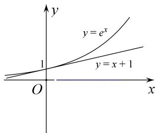
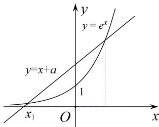

# 专题26 极值点偏移之其他型不等式的证明

# 【例题选讲】

[例 1] 已知函数 $g(x)=\ln x-ax^{2}+(2-a)x(a\in\mathbf{R})$ .

(1)求 $g(x)$ 的单调区间；

(2)若函数 $f(x) = g(x) + (a + 1)x^2 - 2x$ ， $x_1, x_2 (0 < x_1 < x_2)$ 是函数 $f(x)$ 的两个零点，证明： $f\left(\frac{x_1 + x_2}{2}\right) < 0$ .

思维引导 (2)利用分析法先等价转化所证不等式：要证明 $f^{\left(\frac{x_1 + x_2}{2}\right)} < 0$ ，只需证明 $\frac{2}{x_1 + x_2} - \frac{\ln x_1 - \ln x_2}{x_1 - x_2} < 0 (0 < x_1 < x_2)$ ，即证明 $\frac{2(x_1 - x_2)}{x_1 + x_2} > \ln x_1 - \ln x_2$ ，即证明 $\frac{2\left(\frac{x_1}{x_2} - 1\right)}{\frac{x_1}{x_2} + 1} > \ln \frac{x_1}{x_2}$ ，再令 $\frac{x_1}{x_2} = t \in (0, 1)$ ，构造函数 $h(t) = (1 + t)\ln t - 2t + 2$ ，利用导数研究函数 $h(t)$ 单调性，确定其最值： $h(t)$ 在 $(0, 1)$ 上递增，所以 $h(t) < h(1) = 0$ ，即可证得结论.

解析 (1)函数 $g(x)=\ln x-ax^{2}+(2-a)x$ 的定义域为 $(0,+\infty)$ ,

$$
g ^ {\prime} (x) = \frac {1}{x} - 2 a x + (2 - a) = - \frac {(a x - 1) (2 x + 1)}{x},
$$

①当 $a \leq 0$ 时， $g'(x) > 0$ ，则 $g(x)$ 在 $(0, +\infty)$ 上单调递增；

②当 a>0 时，若 $x\in\left(0,\frac{1}{a}\right)$ ，则 $g'(x)>0$ ，若 $x\in\left(\frac{1}{a},+\infty\right)$ ，则 $g'(x)<0$ ，

则 $g(x)$ 在 $\left(0, \frac{1}{a}\right)$ 上单调递增，在 $\left(\frac{1}{a}, +\infty\right)$ 上单调递减.

(2)因为 $x_{1}$ ， $x_{2}$ 是 $f(x)=\ln x+ax^{2}-ax$ 的两个零点，

所以 $\ln x_{1}+ax_{1}^{2}-ax_{1}=0,\quad\ln x_{2}+ax_{2}^{2}-ax_{2}=0$ ，所以 $a=\frac{\ln x_{1}-\ln x_{2}}{x_{1}-x_{2}}+(x_{2}+x_{1})$ ，又 $f'(x)=\frac{1}{x}+2x-a$

所以 $f\left(\frac{x_{1}+x_{2}}{2}\right)=\frac{2}{x_{1}+x_{2}}+(x_{1}+x_{2})-a=\frac{2}{x_{1}+x_{2}}-\frac{\ln x_{1}-\ln x_{2}}{x_{1}-x_{2}}$

所以要证 $f\left(\frac{x_{1}+x_{2}}{2}\right)<0$ ，只须证明 $\frac{2}{x_{1}+x_{2}}-\frac{\ln x_{1}-\ln x_{2}}{x_{1}-x_{2}}<0$

即证明 $\frac{2(x_{1}-x_{2})}{x_{1}+x_{2}}>\ln x_{1}-\ln x_{2}$ ，即证明 $\frac{2\left(\frac{x_{1}}{x_{2}}-1\right)}{\frac{x_{1}}{x_{2}}+1}>\ln\frac{x_{1}}{x_{2}}(*)$

令 $\frac{x_1}{x_2} = t\in (0,1)$ ，则 $h(t) = (1 + t)\ln t - 2t + 2$ ，则 $h^{\prime}(t) = \ln t + \frac{1}{t} -1$ ， $h''(t) = \frac{1}{t} -\frac{1}{t^2} < 0$

∴ $h'(t)$ 在 $(0,1)$ 上递减， $h'(t)>h'(1)=0$ ，∴ $h(t)$ 在 $(0,1)$ 上递增， $h(t)<h(1)=0$ 。

所以 $(*)$ 成立，即 $f'\left(\frac{x_{1}+x_{2}}{2}\right)<0$ .

[例 2] 已知函数 $f(x)=x^{2}+ax+b\ln x$ ，曲线 $y=f(x)$ 在点 $(1, f(1))$ 处的切线方程为 y=2x.

(1)求实数 a, b 的值;

(2)设 $F(x) = f(x) - x^2 + mx (m \in \mathbf{R}), x_1, x_2 (0 < x_1 < x_2)$ 分别是函数 $F(x)$ 的两个零点，求证： $F'(\sqrt{x_1x_2}) < 0 (F'(x))$ 为函数 $F(x)$ 的导函数).

解析 (1) $a = 1, b = -1$ ;

(2) $f(x) = x^2 + x - \ln x$ ， $F(x) = (1 + m)x - \ln x$ ， $F'(x) = m + 1 - \frac{1}{x}$ ，因为 $x_1, x_2$ 分别是函数 $F(x)$ 的两个零点，所以 $\begin{cases} (1 + m)x_1 = \ln x_1 \\ (1 + m)x_2 = \ln x_2 \end{cases}$ ，两式相减，得 $m + 1 = \frac{\ln x_1 - \ln x_2}{x_1 - x_2}$ ， $F'(\sqrt{x_1x_2}) = m + 1 - \frac{1}{\sqrt{x_1x_2}} = \frac{\ln x_1 - \ln x_2}{x_1 - x_2} - \frac{1}{\sqrt{x_1x_2}}$ ，要证明 $F'(\sqrt{x_1x_2}) < 0$ ，只需证 $\frac{\ln x_1 - \ln x_2}{x_1 - x_2} < \frac{1}{\sqrt{x_1x_2}}$ .

思维引导1 因为 $0 < x_{1} < x_{2}$ ，只需证 $\ln x_{1} - \ln x_{2} > \frac{x_{1} - x_{2}}{\sqrt{x_{1}x_{2}}} \Leftrightarrow \ln \frac{x_{1}}{x_{2}} - \sqrt{\frac{x_{1}}{x_{2}}} + \frac{1}{\sqrt{\frac{x_{1}}{x_{2}}}} > 0$ 。令 $t = \sqrt{\frac{x_1}{x_2}} \in (0,1)$ ，即证 $2\ln t - t + \frac{1}{t} > 0$ ，令 $h(t) = 2\ln t - t + \frac{1}{t}(0 < t < 1)$ ，则 $h'(t) = \frac{2}{t} - 1 - \frac{1}{t^2} = -\frac{(t - 1)^2}{t^2} < 0$ ，所以函数 $h(t)$ 在 $(0,1)$ 上单调递减， $h(t) > h(1) = 0$ ，即证 $2\ln t - t + \frac{1}{t} > 0$ ，由上述分析可知 $F'(\sqrt{x_1x_2}) < 0$ 。

总结提升 这是极值点偏移问题，此类问题往往利用换元把 $x_{1}, x_{2}$ 转化为 $t$ 的函数，常把 $x_{1}, x_{2}$ 的关系变形为齐次式，设 $t = \frac{x_1}{x_2}$ ， $t = \ln \frac{x_1}{x_2}$ ， $t = x_1 - x_2$ ， $t = e^{x_1 - x_2}$ 等，构造函数来解决，可称之对称化构造函数法.

思维引导2 因为 $0 < x_{1} < x_{2}$ ，只需证 $\ln x_{1} - \ln x_{2} - \frac{x_{1} - x_{2}}{\sqrt{x_{1}x_{2}}} > 0$ ，设 $Q(x) = \ln x - \ln x_{2} - \frac{x - x_{2}}{\sqrt{x_{2}x}} (0 < x < x_{2})$ ，则 $Q'(x) = \frac{1}{x} - \frac{\sqrt{x_{2}x} - (x - x_{2})\frac{\sqrt{x_{2}}}{2\sqrt{x}}}{x_{2}x} = \frac{1}{x} - \frac{x + x_{2}}{2\sqrt{x_{2}}x\sqrt{x}} = \frac{2\sqrt{x_{2}x} - x - x_{2}}{2\sqrt{x_{2}}x\sqrt{x}} = -\frac{(\sqrt{x_{2}} - \sqrt{x})^{2}}{2\sqrt{x_{2}}x\sqrt{x}} < 0$ ，所以函数 $Q(x)$ 在 $(0, x_{2})$ 上单调递减， $Q(x) > Q(x_{2}) = 0$ ，即证 $\ln x - \ln x_{2} > \frac{x - x_{2}}{\sqrt{x_{2}x}}$ 。由上述分析可知 $F'(\sqrt{x_1x_2}) < 0$ 。

总结提升 极值点偏移问题中，由于两个变量的地位相同，将待证不等式进行变形，可以构造关于 $x_{1}$ （或 $x_{2}$ ）的一元函数来处理。应用导数研究其单调性，并借助于单调性，达到待证不等式的证明。此乃主元法。

思维引导3 要证明 $F'\left(\sqrt{x_1x_2}\right) < 0$ ，只需证 $\frac{\ln x_1 - \ln x_2}{x_1 - x_2} < \frac{1}{\sqrt{x_1x_2}}$ ，即证 $\frac{x_1 - x_2}{\ln x_1 - \ln x_2} > \sqrt{x_1x_2}$ ，由对数平均数易得.

总结提升 极值点偏移问题中，如果等式含有参数，则消参，有指数的则两边取对数，转化为对数式，

通过恒等变换转化为对数平均问题，利用对数平均不等式求解，此乃对数平均法.

[例3] 已知函数 $f(x) = x^{2} + (a - 2)x - a\ln x (a > 0)$ .

(1)若 $\forall x > 0$ ，使得 $f(x) > 3a^{2} - 3a$ 恒成立，求 $a$ 的取值范围.

(2)设 $P(x_{1}, y_{1})$ ， $Q(x_{2}, y_{2})$ 为函数 $f(x)$ 图象上不同的两点，PQ 的中点为 $M(x_{0}, y_{0})$ ，求证： $\frac{f(x_{1})-f(x_{2})}{x_{1}-x_{2}}<f'(x_{0}).$

解析 (1) $f(x) > 3a^{2} - 3a$ 恒成立，即 $f(x) - 3a^{2} + 3a > 0$ 恒成立，

令 $g(x) = f(x) - 3a^2 + 3a$ ， $g'(x) = 2x + a - 2 - \frac{a}{x} = \frac{(x - 1)(2x + a)}{x}$ ，

由于 $-\frac{a}{2} < 0 < 1$ ，则 $g(x)$ 在 $(0,1)$ 单调递减，在 $(1, +\infty)$ 单调递增，

故 $g(x) \geq g(1) = -3a^{2} + 4a - 1 > 0$ ，解得 $a \in \left(\frac{1}{3}, 1\right)$ .

(2)因为 $M(x_{0},y_{0})$ 为 PQ 的中点，则 $x_{0}=\frac{x_{1}+x_{2}}{2}$ ,

故 $f'(x_0) = 2x_0 + a - 2 - \frac{a}{x_0} = x_1 + x_2 + a - 2 - \frac{2a}{x_1 + x_2}$ ，

$$
\frac {f \left(x _ {1}\right) - f \left(x _ {2}\right)}{x _ {1} - x _ {2}} = \frac {x _ {1} ^ {2} + (a - 2) x _ {1} - a \ln x _ {1} - x _ {2} ^ {2} - (a - 2) x _ {2} + a \ln x _ {2}}{x _ {1} - x _ {2}}
$$

$$
= \frac {x _ {1} ^ {2} - x _ {2} ^ {2} + (a - 2) \left(x _ {1} - x _ {2}\right) - a \ln \frac {x _ {1}}{x _ {2}}}{x _ {1} - x _ {2}} = x _ {1} + x _ {2} + a - 2 - \frac {a \ln \frac {x _ {1}}{x _ {2}}}{x _ {1} - x _ {2}},
$$

故要证 $\frac{f(x_1) - f(x_2)}{x_1 - x_2} < f'(x_0)$ ，即证 $-\frac{a\ln\frac{x_1}{x_2}}{x_1 - x_2} < -\frac{2a}{x_1 + x_2}$ ，

由于 a > 0，即证 $\frac{\ln\frac{x_{1}}{x_{2}}}{x_{1} - x_{2}} > \frac{2}{x_{1} + x_{2}}$ 。不妨假设 $x_{1} > x_{2} > 0$ ，

只需证明 $\ln\frac{x_{1}}{x_{2}}>\frac{2(x_{1}-x_{2})}{x_{1}+x_{2}}$ ，即 $\ln\frac{x_{1}}{x_{2}}>\frac{2\left(\frac{x_{1}}{x_{2}}\right)-1}{\frac{x_{1}}{x_{2}}+1}$ .

设 $t=\frac{x_{1}}{x_{2}}>1$ ，构造函数 $h(t)=\ln t-\frac{2(t-1)}{t+1}$ ， $h'(t)=\frac{(t-1)^{2}}{t(t+1)^{2}}>0$ ，则 $h(t)>h(1)=0$ ，

则有 $\ln\frac{x_{1}}{x_{2}}>\frac{2\left(\frac{x_{1}}{x_{2}}-1\right)}{\frac{x_{1}}{x_{2}}+1}$ ，从而 $\frac{f(x_{1})-f(x_{2})}{x_{1}-x_{2}}<f'(x_{0})$ .

[例 4] 已知函数 $f(x)=\mathrm{e}^{x}-\frac{1}{2}x^{2}-ax$ 有两个极值点 $x_{1}$ ， $x_{2}$ (e 为自然对数的底数).

(1)求实数 a 的取值范围;  
(2)求证： $f(x_{1})+f(x_{2})>2$ .

解析 (1)由于 $f(x)=\mathrm{e}^{x}-\frac{1}{2}x^{2}-ax$ ，则 $f'(x)=\mathrm{e}^{x}-x-a$ ，

设 $g(x)=f'(x)=\mathrm{e}^{x}-x-a$ ，则 $g'(x)=\mathrm{e}^{x}-1$ ，令 $g'(x)=\mathrm{e}^{x}-1=0$ ，解得 x=0。

所以当 $x \in (-\infty, 0)$ 时， $g'(x) < 0$ ；当 $x \in (0, +\infty)$ 时， $g'(x) > 0$ 。所以 $g(x)_{\min} = g(0) = 1 - a$ 。

①当 $a \leq 1$ 时， $g(x) = f'(x) \geq 0$ ，所以函数 $f(x)$ 单调递增，没有极值点；  
②当 a>1 时， $g(x)_{\min}=1-a<0$ ，且当当 $x\to-\infty$ 时， $g(x)\to+\infty$ ；当 $x\to+\infty$ 时， $g(x)\to+\infty$ .

此时， $g(x)=f'(x)=\mathrm{e}^{x}-x-a$ 有两个零点 $x_{1}, x_{2}$ ，不妨设 $x_{1}<x_{2}$ ，则 $x_{1}<0<x_{2}$ ，

所以函数 $f(x)=\mathrm{e}^{x}-\frac{1}{2}x^{2}-ax$ 有两个极值点时，实数 a 的取值范围是 $(1,+\infty)$ ;

答案速得 函数 $f(x)$ 有两个极值点实质上就是其导数 $f'(x)$ 有两个零点，亦即函数 $y = e^{x}$ 与直线 $y = x + a$ 有两个交点，如图所示，显然实数 a 的取值范围是 $(1, +\infty)$ .

text_image

y
y = e^x
y = x + 1
O
x

(2)由(1)知， $x_{1}$ ， $x_{2}$ 为 $g(x)=0$ 的两个实数根， $x_{1}<0<x_{2}$ ， $g(x)$ 在 $(-∞,0)$ 上单调递减.

下面先证 $x_{1} < -x_{2} < 0$ ，只需证 $g(-x_{2}) < g(x_{1}) = 0$ ，由于 $g(x_{2}) = \mathrm{e}^{x_{2}} - x_{2} - a = 0$ ，得 $a = \mathrm{e}^{x_{2}} - x_{2}$ ，所以 $g(-x_{2}) = \mathrm{e}^{-x_{2}} + x_{2} - a = \mathrm{e}^{-x_{2}} - \mathrm{e}^{x_{2}} + 2x_{2}$ .

设 $h(x)=\mathrm{e}^{-x}-\mathrm{e}^{x}+2x(x>0)$ ，则 $h'(x)=-\frac{1}{\mathrm{e}^{x}}-\mathrm{e}^{x}+2<0$ ，所以 $h(x)$ 在 $(0,+\infty)$ 上单调递减，

所以 $h(x)<h(0)=0,\quad h(x_{2})=g(-x_{2})<0$ ，所以 $x_{1}<-x_{2}<0$

由于函数 $f(x)$ 在 $(x_{1}, 0)$ 上也单调递减，所以 $f(x_{1}) > f(-x_{2})$ .

要证 $f(x_{1})+f(x_{2})>2$ ，只需证 $f(-x_{2})+f(x_{2})>2$ ，即证 $e^{x_{2}}+e^{-x_{2}}-x_{2}^{2}-2>0$ .

设函数 $k(x)=\mathrm{e}^{x}+\mathrm{e}^{-x}-x^{2}-2,\quad x\in(0,+\infty)$ ，则 $k'(x)=\mathrm{e}^{x}-\mathrm{e}^{-x}-2x.$

设 $r(x)=k'(x)=\mathrm{e}^{x}-\mathrm{e}^{-x}-2x$ ，则 $r'(x)=\mathrm{e}^{x}+\mathrm{e}^{-x}-2>0$ ，

text_image

y
y = e^x
y=x+a
1
x_1 O x

所以 $r(x)$ 在 $(0, +\infty)$ 上单调递增， $r(x) > r(0) = 0$ ，即 $k'(x) > 0$ .

所以 $k(x)$ 在 $(0, +\infty)$ 上单调递增， $k(x) > k(0) = 0$ .

故当 $x \in (0, +\infty)$ 时， $e^{x} + e^{-x} - x^{2} - 2 > 0$ ，则 $e^{x_{2}} + e^{-x_{2}} - x_{2}^{2} - 2 > 0$ ，

所以 $f(-x_{2})+f(x_{2})>2$ ，亦即 $f(x_{1})+f(x_{2})>2$ .

总结提升 本题是极值点偏移问题的泛化，是拐点的偏移，依然可以使用极值点偏移问题的有关方法来解决。只不过需要挖掘出拐点偏移中隐含的拐点的不等关系，如本题中的 $x_{1} < -x_{2} < 0$ ，如果“脑中有‘形’”，如图所示，并不难得出。

# 【对点训练】

1. 设函数 $f(x) = x^{2} - (a - 2)x - a\ln x$ .

(1) 求函数 $f(x)$ 的单调区间；  
(2) 若方程 $f(x) = c$ 有两个不相等的实数根 $x_{1}, x_{2}$ ，求证： $f'(\frac{x_1 + x_2}{2}) > 0$ .

1. 解析 (1) $x \in (0, +\infty)$ . $f'(x) = 2x - (a - 2) - \frac{a}{x} = \frac{2x^2 - (a - 2)x - a}{x} = \frac{(2x - a)(x + 1)}{x}$ .

当 $a \leq 0$ 时， $f'(x) > 0$ ，函数 $f(x)$ 在 $(0, +\infty)$ 上单调递增，即 $f(x)$ 的单调递增区间为 $(0, +\infty)$ .

当 a > 0 时，由 $f'(x) > 0$ 得 $x > \frac{a}{2}$ ；由 $f'(x) < 0$ ，解得 $0 < x < \frac{a}{2}$ .

所以函数 $f(x)$ 的单调递增区间为 $\left(\frac{a}{2}, +\infty\right)$ ，单调递减区间为 $(0, \frac{a}{2})$ .

(2) $\because x_{1}$ ， $x_{2}$ 是方程 $f(x)=c$ 得两个不等实数根，由(1)可知：a>0。

不妨设 $0 < x_{1} < x_{2}$ 。则 $x_{1}^{2} - (a - 2)x_{1} - a\ln x_{1} = c$ ， $x_{2}^{2} - (a - 2)x_{2} - a\ln x_{2} = c$ 。

两式相减得 $x_{1}^{2} - (a - 2)x_{1} - a\ln x_{1} - x_{2}^{2} + (a - 2)x_{2} + a\ln x_{2} = 0$ ，化为 $a = \frac{x_1^2 + 2x_1 - x_2^2 - 2x_2}{x_1 + \ln x_1 - x_2 - \ln x_2}$

∵ $f'\left(\frac{a}{2}\right)=0$ ，当 $x\in(0,\frac{a}{2})$ 时， $f'(x)<0$ ，当 $x\in(\frac{a}{2},+\infty)$ 时， $f'(x)>0$ 。

故只要证明 $\frac{x_1 + x_2}{2} >\frac{a}{2}$ 即可，即证明 $x_{1} + x_{2} > \frac{x_{1}^{2} + 2x_{1} - x_{2}^{2} - 2x_{2}}{x_{1} + \ln x_{1} - x_{2} - \ln x_{2}}$ ，即证明 $\ln \frac{x_1}{x_2} < \frac{2x_1 - 2x_2}{x_1 + x_2}$

设 $t = \frac{x_1}{x_2} (0 < t < 1)$ ，令 $g(t) = \ln t - \frac{2t - 2}{t + 1}$ ，则 $g'(t) = \frac{1}{t} - \frac{4}{(t + 1)^2} = \frac{(t - 1)^2}{t(t + 1)^2}$ .

∵1>t>0，∴ $g'(t)>0$ ．∴ $g(t)$ 在 $(0,1)$ 上是增函数，又在t=1处连续且 $g(1)=0$ ，

∴ 当 $t \in (0, 1)$ 时， $g(t) < 0$ 总成立．故命题得证．

2. (2011 辽宁) 已知函数 $f(x) = \ln x - ax^2 + (2 - a)x$ .

(1)讨论 $f(x)$ 的单调性;

(2)设 a>0，证明：当 $0<x<\frac{1}{a}$ 时， $f(\frac{1}{a}+x)>f(\frac{1}{a}-x)$ ;

(3)若函数 $y=f(x)$ 的图象与轴交于 A, B 两点，线段 AB 中点的横坐标为 $x_{0}$ ，证明： $f'(x_{0})<0$ .

2. 解析 (1) 若 $a \leq 0$ , $f(x)$ 在 $(0, +\infty)$ 上单调增加;

若 a>0, $f(x)$ 在 $(0, \frac{1}{a})$ 上单调递增，在 $(\frac{1}{a}, +\infty)$ 上单调递减；

(2)法一：构造函数 $g(x)=f(\frac{1}{a}+x)>f(\frac{1}{a}-x)$ ， $(0<x<\frac{1}{a})$ ，利用函数单调性证明，方法上同，略；
法二：构造以 a 为主元的函数，设函数 $h(a)=f(\frac{1}{a}+x)>f(\frac{1}{a}-x)$ ,

则 $h(a)=\ln(1+ax)-\ln(1-ax)-2ax,\quad h'(a)=\frac{x}{1+ax}+\frac{x}{1-ax}-2x=\frac{2x^{3}a^{2}}{1-a^{2}x^{2}}$

由 $0 < x < \frac{1}{a}$ ，解得 $0 < a < \frac{1}{x}$ ，当 $0 < a < \frac{1}{x}$ 时， $h'(a) > 0$ ，而 $h(0) = 0$ ，

所以 $h(a)>0$ ，故当 $0<x<\frac{1}{a}$ 时， $f(\frac{1}{a}+x)>f(\frac{1}{a}-x)$

(2)由(1)可得 a>0， $f'(x)=\frac{1}{x}-2ax+2-a$ 在 $(0,+\infty)$ 上单调递减， $f'(\frac{1}{a})=0$ ，

不妨设 $A(x_{1}, 0)$ ， $B(x_{2}, 0)$ ， $0 < x_{1} < x_{2}$ ，则 $0 < x_{1} < \frac{1}{a} < x_{2}$ ，

欲证明 $f'(x) < 0$ ，即 $f'(x_0) < f'(\frac{1}{a})$ ，只需证明 $x_0 = \frac{x_1 + x_2}{2} > \frac{1}{a}$ ，即 $x_1 > \frac{2}{a} - x_2$ ，

只需证明 $f(x_{2})=f(x_{1})>f(\frac{2}{a}-x_{2})$ .

由(2)得 $f(\frac{2}{a}-x_{2})=f[\frac{1}{a}+(\frac{1}{a}-x_{2})]>f[\frac{1}{a}-(\frac{1}{a}-x_{2})]=f(x_{2})$ ，得证.

3. 设函数 $f(x)=\mathrm{e}^{x}-ax+a$ ，其图象与轴交于 $A(x_{1},0)$ ， $B(x_{2},0)$ 两点，且 $x_{1}<x_{2}$ .

(1)求 a 的取值范围;

(2)证明： $f'(\sqrt{x_{1}x_{2}})<0(f'(x)$ 为函数 $f(x)$ 的导函数).

3. 解析 $(1)a\in(e^{2},+\infty)$ ，且 $0<x_{1}<\ln a<x_{2}$ ， $f(x)$ 在 $(0,\ln a)$ 上单调递减，在 $(\ln a,+\infty)$ 上单调递增；

(2)要证明 $f'(\sqrt{x_{1}x_{2}})<0$ ，只需证 $f'(\frac{x_{1}+x_{2}}{2})<0$ ，即 $f'(\frac{x_{1}+x_{2}}{2})<f'(\ln a)$ ,

因为 $f'(x)=\mathrm{e}^{x}-a$ 单调递增，所以只需证 $\frac{x_{1}+x_{2}}{2}<\ln a$ ，亦即 $x_{2}>2\ln a-x_{1}$

只要证明 $f(x_{2})=f(x_{1})>f(2\ln a-x_{1})$ 即可；令 $g(x)=f(x)-f(2\ln a-x)(x<\ln a)$ ，则

$g'(x)=f'(x)-f'(2\ln a-x_{1})=e^{x}-\frac{a^{2}}{e^{x}}-2a<0$ ，所以 $g(x)$ 在 $(0,\ln a)$ 上单调递减， $g(x)>g(\ln a)=0$ ，得证.

4. 已知函数 $f(x)=\ln x-ax+1$ 有两个零点.

(1)求 a 的取值范围;

(2)设 $x_{1}$ ， $x_{2}$ 是 $f(x)$ 的两个零点，证明： $f'(x_{1} \cdot x_{2}) < 1 - a$ .

4. 解析 (1) 由 $f(x) = 0$ ，可得 $a = \frac{1 + \ln x}{x}$ ，

转化为函数 $g(x)=\frac{1+\ln x}{x}$ 与直线 y=a 的图象在 $(0, +\infty)$ 上有两个不同交点.

$g^{\prime}(x) = \frac{-\ln x}{x^{2}} (x > 0)$ ，故当 $x\in (0,1)$ 时， $g^{\prime}(x) > 0$ ；当 $x\in (1, + \infty)$ 时， $g^{\prime}(x) <   0.$

故 $g(x)$ 在 $(0, 1)$ 上单调递增，在 $(1, +\infty)$ 上单调递减，所以 $g(x)_{\max} = g(1) = 1$ .

又 $g\left(\frac{1}{e}\right)=0$ ，当 $x\to+\infty$ 时， $g(x)\to0$ ，

故当 $x \in \left(0, \frac{1}{\mathrm{e}}\right)$ 时， $g(x) < 0$ ；当 $x \in \left(\frac{1}{\mathrm{e}}, +\infty\right)$ 时， $g(x) > 0$ 。可得 $a \in (0, 1)$ .

(2) $f(x)=\frac{1}{x}-a$ ，由(1)知 $x_{1}$ ， $x_{2}$ 是 $\ln x-ax+1=0$ 的两个根，

故 $\ln x_{1}-ax_{1}+1=0,\quad\ln x_{2}-ax_{2}+1=0\Rightarrow a=\frac{\ln x_{1}-\ln x_{2}}{x_{1}-x_{2}}.$

要证 $f'(x_{1} \cdot x_{2}) < 1 - a$ ，只需证 $x_{1} \cdot x_{2} > 1$ ，即证 $\ln x_{1} + \ln x_{2} > 0$ ，即证 $(ax_{1} - 1) + (ax_{2} - 1) > 0$ ，

即证 $a > \frac{2}{x_{1} + x_{2}}$ ，即证 $\frac{\ln x_{1} - \ln x_{2}}{x_{1} - x_{2}} > \frac{2}{x_{1} + x_{2}}$ .

不妨设 $0 < x_{1} < x_{2}$ ，故 $\ln \frac{x_1}{x_2} < \frac{2(x_1 - x_2)}{x_1 + x_2} = \frac{2\left(\frac{x_1}{x_2} - 1\right)}{\frac{x_1}{x_2} + 1},$ (\*)

令 $t=\frac{x_{1}}{x_{2}}\in(0,1)$ ， $h(t)=\ln t-\frac{2(t-1)}{t+1}$ ， $h'(t)=\frac{1}{t}-\frac{4}{(t+1)^{2}}=\frac{(t-1)^{2}}{t(t+1)^{2}}>0$

则 $h(t)$ 在 $(0, 1)$ 上单调递增，则 $h(t) < h(1) = 0$ ，故 (\*) 式成立，即要证不等式得证.

5. 已知函数 $f(x)=\frac{a}{x}+\ln x(a\in\mathbf{R})$ .

(1)讨论 $f(x)$ 的单调性;

(2)设 $f(x)$ 的导函数为 $f'(x)$ ，若 $f(x)$ 有两个不相同的零点 $x_{1}$ ， $x_{2}$ .

①求实数 a 的取值范围；②证明： $x_{1}f'(x_{1})+x_{2}f'(x_{2})>2\ln a+2$ .

5. 思维引导 (1)求导函数 $f'(x)$ ，对 a 分类讨论，确定导函数的正负，即可得到 $f(x)$ 的单调性；

(2)①根据第(1)问的函数 $f(x)$ 的单调性，确定 $a > 0$ ，且 $f(x)_{\min} = f(a) < 0$ ，求得 $a$ 的取值范围，再用零点判定定理证明根的存在性。②对所要证明的结论分析，问题转化为证明 $x_1x_2 > a^2$ ，不妨设 $0 < x_1 < a < x_2$ ，问题转化为证明 $x_1 > \frac{a^2}{x_2}$ ，通过对 $f(x)$ 的单调性的分析，问题进一步转化为证明 $f(\frac{a^2}{x_2}) > f(x_2)$ ，构造函数，通过导数法不难证得结论。

解析 (1) $f(x)$ 的定义域为 $(0, +\infty)$ ，且 $f(x)=\frac{x-a}{x^{2}}$ .

当 $a \leq 0$ 时， $f'(x) > 0$ 成立，所以 $f(x)$ 在 $(0, +\infty)$ 为增函数；

当 a>0 时，(i) 当 x>a 时， $f'(x)>0$ ，所以 $f(x)$ 在 $(a, +\infty)$ 上为增函数；

(ii) 当 0 < x < a 时， $f'(x) < 0$ ，所以 $f(x)$ 在 $(0, a)$ 上为减函数.

(2)①由(1)知，当 $a \leq 0$ 时， $f(x)$ 至多一个零点，不合题意；

当 a>0 时， $f(x)$ 的最小值为 $f(a)$ ，依题意知 $f(a)=1+\ln a<0$ ，解得 $0<a<\frac{1}{e}$ .

一方面，由于 $1 > a$ ， $f(1) = a > 0$ ， $f(x)$ 在 $(a, +\infty)$ 为增函数，且函数 $f(x)$ 的图像在 $(a, 1)$ 上不间断.

所以 $f(x)$ 在 $(a, +\infty)$ 上有唯一的一个零点.

另一方面，因为 $0 < a < \frac{1}{e}$ ，所以 $0 < a^{2} < a < \frac{1}{e}$ 。 $f(a^{2}) = \frac{1}{a} + \ln a^{2} = \frac{1}{a} + 2\ln a$ ，令 $g(a) = \frac{1}{a} + 2\ln a$ ，

当 $0 < a < \frac{1}{e}$ 时， $g'(a) = -\frac{1}{a^2} + \frac{2}{a} = \frac{2a - 1}{a^2} < 0$ ，所以 $f(a^2) = g(a) = \frac{1}{a} + 2\ln a > g\left(\frac{1}{e}\right) = e - 2 > 0$

又 $f(a)<0,\ f(x)$ 在 $(0,\ a)$ 为减函数，且函数 $f(x)$ 的图像在 $(a^{2},\ a)$ 上不间断.

所以 $f(x)$ 在 $(0, a)$ 有唯一的一个零点.

综上，实数 a 的取值范围是 $\left(0, \frac{1}{e}\right)$ .

②设 $p = x_{1}f'(x_{1}) + x_{2}f'(x_{2}) = 1 - \frac{a}{x_{1}} + 1 - \frac{a}{x_{2}} = 2 - \left(\frac{a}{x_{1}} + \frac{a}{x_{2}}\right)$ . 又 $\ln x_{1} + \frac{a}{x_{1}} = 0, \ln x_{2} + \frac{a}{x_{2}} = 0$ ，则 $p = 2 + \ln (x_{1}x_{2})$ .

下面证明 $x_{1}x_{2} > a^{2}$ ，不妨设 $x_{1} < x_{2}$ ，由①知 $0 < x_{1} < a < x_{2}$

要证 $x_{1}x_{2} > a^{2}$ ，即证 $x_{1} > \frac{a^{2}}{x_{2}}$ 因为 $x_{1},\frac{a^{2}}{x_{2}}\in (0,a),f(x)$ 在 $(0,a)$ 上为减函数，所以只要证 $f(\frac{a^2}{x_2}) > f(x_1)$

又 $f(x_{1}) = f(x_{2}) = 0$ ，即证 $f(\frac{a^2}{x_2}) > f(x_2)$

设函数 $F(x)=f\left(\frac{a^{2}}{x}\right)-f(x)=\frac{x}{a}-\frac{a}{x}-2\ln x+2\ln a(x>a)$ .

所以 $F'(x)=\frac{(x-a)^{2}}{ax^{2}}>0$ ，所以 $F(x)$ 在 $(a,+\infty)$ 为增函数。

所以 $F(x_{2})>F(a)=0$ ，所以 $f(\frac{a^{2}}{x_{2}})>f(x_{2})$ 成立．从而 $x_{1}x_{2}>a^{2}$ 成立．

所以 $p=2+\ln(x_{1}x_{2})>2\ln a+2$ ，即 $x_{1}f'(x_{1})+x_{2}f'(x_{2})>2\ln a+2$ 成立.

总结提升 1. 第(2)①中, 用零点判定定理证明 $f(x)$ 在 $(0, a)$ 上有一个零点是解题的一个难点, 也是一个热点问题, 就是当 $0 < a < \frac{1}{e}$ 时, 要找一个数 $x_0 < a$ , 且 $f(x_0) > 0$ , 这里需要取关于 $a$ 的代数式, 取 $x_0 = a^2$ , 再证明 $f(a^2) > 0$ , 事实上由(1)可以得到 $x \ln x \geq -\frac{1}{e}$ , 而 $f(a^2) = \frac{1}{a} + \ln a^2 = \frac{1 + 2a \ln a}{a} > 0$ 即可.

2. 在(2)②中证明 $x_{1} x_{2} > a^{2}$ 的过程, 属于构造消元构造函数方法, 将两个变量 $x_{1}, x_{2}$ 转化为证明单变量的问题, 这一处理方法, 在各类压轴题中, 经常出现, 要能领悟并加以灵活应用.

6. 已知函数 $f(x)=\mathrm{e}^{x}+ax-1(a\in\mathbf{R})$ .

(1)若对任意的实数 $x$ ，函数 $y = f'(x)$ 的图象与直线 $y = x$ 有且只有两个交点，求 $a$ 的取值范围；

(2)设 $g(x)=f(x)-\frac{1}{2}x^{2}+1$ ，若函数 $g(x)$ 有两个极值点 $x_{1}$ ， $x_{2}$ ，且 $x_{1}<x_{2}$ ，证明： $g(x_{1})+g(x_{2})>2$ .

6. 解析 (1) $f(x) = \mathrm{e}^{x} + ax - 1$ ，则 $f'(x) = \mathrm{e}^{x} + a$ ，

由已知得，函数 $y = \mathrm{e}^{x} + a$ 的图象与直线 $y = x$ 有两个交点，

即方程 $e^x - x + a = 0$ 有两个不相等的实数解.

设 $h(x)=\mathrm{e}^{x}-x+a$ ，则 $h'(x)=\mathrm{e}^{x}-1$ ，令 $h'(x)=0$ ，解得 x=0。

当 $x \in (-\infty, 0)$ 时， $h'(x) < 0$ ， $h(x)$ 单调递减，

当 $x \in (0, +\infty)$ 时， $h'(x) > 0$ ， $h(x)$ 单调递增，

所以 $h(x)_{\min}=h(0)=a+1$ ，所以 $a+1<0$ ，所以 a<-1，

当 $x \to -\infty$ 时， $h(x) \to +\infty$ ；当 $x \to +\infty$ 时， $h(x) \to +\infty$

所以 a<-1 时，函数 $y=f'(x)$ 的图象与直线 y=x 有且只有两个交点.

$$
g (x) = f (x) - \frac {1}{2} x ^ {2} + 1 = e ^ {x} - \frac {1}{2} x ^ {2} - a x, g ^ {\prime} (x) = e ^ {x} - x - a, \tag {2}
$$

因为函数 $g(x)$ 有两个极值点 $x_{1}$ ， $x_{2}$ ，∴ 方程 $g'(x)=0$ 有两个不同的实数解 $x_{1}$ ， $x_{2}$ ，

由(1)知， $h(x)=\mathrm{e}^{x}-x+a,\quad h(x_{1})=h(x_{2})=0$ ，且 $x_{1}<0<x_{2}$

所以 $g(x)$ 在区间 $(-∞, x_{1})$ ， $(x_{2}, +∞)$ 上单调递增，在区间 $(x_{1}, x_{2})$ 上单调递减，

且得 $a = \mathrm{e}^{x_2} - x_2$ ，所以 $h(-x_{2}) = \mathrm{e}^{-x_{2}} + x_{2} - a = \mathrm{e}^{-x_{2}} - \mathrm{e}^{x_{2}} + 2x_{2}$

设 $k(x)=\mathrm{e}^{-x}-\mathrm{e}^{x}+2x(x>0)$ ，则 $k'(x)=-\mathrm{e}^{-x}-\mathrm{e}^{x}+2<0$ ，所以 $k(x)$ 在 $(0,+\infty)$ 上单调递减，

所以 $k(x)<k(0)=0,\quad h(x_{2})=h(-x_{2})<0$ ，所以 $x_{1}<-x_{2}<0$

又因为 $g(x)$ 在 $(x_{1}, 0)$ 单调递减，所以 $g(x_{1}) > g(-x_{2})$ ,

要证 $g(x_{1}) + g(x_{2}) > 2$ ，只须证 $g(-x_2) + g(x_2) > 2$

即证 $e^{x_{2}} + e^{-x_{2}} - x_{2}^{2} - 2 > 0,$

设 $r(x)=\mathrm{e}^{x}+\mathrm{e}^{-x}-x^{2}-2$ ，则 $r'(x)=\mathrm{e}^{x}-\mathrm{e}^{-x}-2x$

令 $p(x)=r'(x)=\mathrm{e}^{x}-\mathrm{e}^{-x}-2x$ ，则 $p'(x)=\mathrm{e}^{x}+\mathrm{e}^{-x}-2>0$

所以 $p(x)$ 在 $(0, +\infty)$ 单调递增， $p(x)>p(0)=0$ ，即 $r'(x)>0$ ，

所以 $r(x)$ 在 $(0, +\infty)$ 单调递增， $r(x) > r(0) = 0$ ，

故当 x>0 时， $e^{x}+e^{-x}-x^{2}-2>0$ ，即 $e^{x_{2}}+e^{-x_{2}}-x_{2}^{2}-2>0$ ，

所以 $g(-x_{2})+g(x_{2})>2$ ，亦即 $g(x_{1})+g(x_{2})>2$ .

