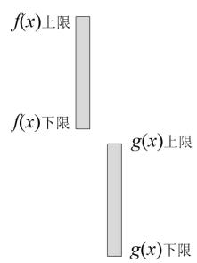
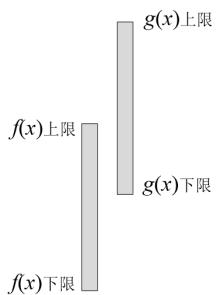
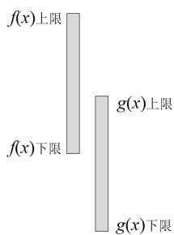
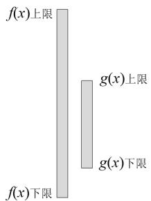
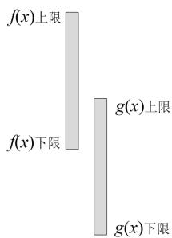
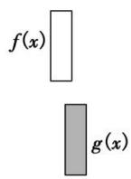
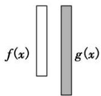
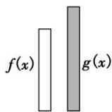
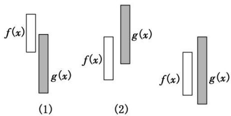

# 专题 35 双变量恒成立与能成立问题概述

# 【方法总结】

#### 1. 最值定位法解双变量不等式恒成立问题的思路策略  
（1）用最值定位法解双变量不等式恒成立问题是指通过不等式两端的最值进行定位，转化为不等式两端函数的最值之间的不等式，列出参数所满足的不等式，从而求解参数的取值范围.  
（2）有关两个函数在各自指定范围内的不等式恒成立问题，这里两个函数在指定范围内的自变量是没有关联的，这类不等式的恒成立问题就应该通过最值进行定位.

#### 2. 常见的双变量恒成立能成立问题的类型  
（1）对于任意的 $x_{1}\in [a,b],x_{2}\in [m,n]$ ，使得 $f(x_{1})\geq g(x_{2})\Leftrightarrow f(x_{1})_{\min}\geq g(x_{2})_{\max}$ .（如图1）  
（2）若存在 $x_{1}\in [a,b]$ ，总存在 $x_{2}\in [m,n]$ ，使得 $f(x_{1})\geq g(x_{2})\Leftrightarrow f(x_{1})_{\max}\geq g(x_{2})_{\min}$ .（如图2）  
（3）对于任意的 $x_{1} \in [a, b]$ ，总存在 $x_{2} \in [m, n]$ ，使得 $f(x_{1}) \geq g(x_{2}) \Leftrightarrow f(x_{1})_{\min} \geq g(x_{2})_{\min}$ . (如图3)  
（4）若存在 $x_{1} \in [a, b]$ ，对任意的 $x_{2} \in [m, n]$ ，使得 $f(x_{1}) \geq g(x_{2}) \Leftrightarrow f(x_{1})_{\max} \geq g(x_{2})_{\max}$ . (如图4)  
（5）若存在 $x_{1} \in [a, b]$ ，对任意的 $x_{2} \in [m, n]$ ，使得 $f(x_{1}) = g(x_{2}) \Leftrightarrow f(x_{1})_{\max} \geq g(x_{2})_{\max}$ . (如图4)  
（6）若存在 $x_{1} \in [a, b]$ , 总存在 $x_{2} \in [m, n]$ , 使得 $f(x_{1}) = g(x_{2}) \Leftrightarrow f(x)$ 的值域与 $g(x)$ 的值域的交集非空. (如图5)

图1

图2

图3

图4

图5

# 考点一 双任意与双存在不等问题  
（1） $f(x)$ ， $g(x)$ 是在闭区间 D 上的连续函数且 $\forall x_{1}, x_{2} \in D$ ，使得 $f(x_{1}) > g(x_{2})$ ，等价于 $f(x)_{\min} > g(x)_{\max}$ 。其等价转化的目标是函数 $y = f(x)$ 的任意一个函数值均大于函数 $y = g(x)$ 的任意一个函数值。如图⑤。

  
图⑤

  
图⑥  
（2）存在 $x_{1}$ , $x_{2} \in D$ , 使得 $f(x_{1}) > g(x_{2})$ , 等价于 $f(x)_{\max} > g(x)_{\min}$ . 其等价转化的目标是函数 $y = f(x)$ 的某一个函数值大于函数 $y = g(x)$ 的某些函数值. 如图⑥.

# 【例题选讲】

[例 1] 已知函数 $f(x)=\frac{a+1}{x}+a\ln x$ ，其中参数 a<0.  
（1）求函数 $f(x)$ 的单调区间；  
（2）设函数 $g(x)=2x^{2}f'(x)-xf(x)-3a(a<0)$ ，存在实数 $x_{1}, x_{2} \in [1, e^{2}]$ ，使得不等式 $2g(x_{1}) < g(x_{2})$ 成立，求 a 的取值范围.

[例 2] 已知函数 $f(x)=\frac{1}{2}\ln x-mx,\quad g(x)=x-\frac{a}{x}(a>0)$ .  
（1）求函数 $f(x)$ 的单调区间；  
（2）若 $m=\frac{1}{2e^{2}}$ ，对 $\forall x_{1}, x_{2}\in[2, 2e^{2}]$ 都有 $g(x_{1})\geq f(x_{2})$ 成立，求实数 a 的取值范围.

[例 3] 已知 $f(x)=x+\frac{a^{2}}{x}(a>0)$ ， $g(x)=x+\ln x$ .  
（1）若对任意的 $x_{1}$ ， $x_{2}\in[1,\ e]$ ，都有 $f(x_{1})\geq g(x_{2})$ 成立，求实数 a 的取值范围；  
（2）若存在 $x_{1}, x_{2} \in [1, e]$ ，使得 $f(x_{1}) < g(x_{2})$ ，求实数 a 的取值范围.

[例 4] 设 $f(x)=\frac{a}{x}+x\ln x,\quad g(x)=x^{3}-x^{2}-3.$  
（1）如果存在 $x_{1}, x_{2} \in [0, 2]$ ，使得 $g(x_{1}) - g(x_{2}) \geq M$ 成立，求满足上述条件的最大整数 M；  
（2）如果对于任意的 $s$ ， $t\in \left[\frac{1}{2},2\right]$ ，都有 $f(s)\geq g(t)$ 成立，求实数 $a$ 的取值范围.

# 考点二 存在与任意嵌套不等问题  
（1） $\forall x_{1} \in D_{1}$ , $\exists x_{2} \in D_{2}$ , 使 $f(x_{1}) > g(x_{2})$ , 等价于函数 $f(x)$ 在 $D_{1}$ 上的最小值大于 $g(x)$ 在 $D_{2}$ 上的最小值, 即 $f(x)_{\min} > g(x)_{\min}$ (这里假设 $f(x)_{\min}$ , $g(x)_{\min}$ 存在). 其等价转化的目标是函数 $y = f(x)$ 的任意一个函数值大于函数 $y = g(x)$ 的某一个函数值. 如图⑦.

  
图⑦

  
图⑧  
（2） $\forall x_{1} \in D_{1}$ , $\exists x_{2} \in D_{2}$ , 使 $f(x_{1}) < g(x_{2})$ , 等价于函数 $f(x)$ 在 $D_{1}$ 上的最大值小于 $g(x)$ 在 $D_{2}$ 上的最大值, 即 $f(x)_{\max} < g(x)_{\max}$ . 其等价转化的目标是函数 $y = f(x)$ 的任意一个函数值小于函数 $y = g(x)$ 的某一个函数值. 如图⑧.

# 【例题选讲】

[例 5] 设函数 $f(x)=\frac{\mathrm{e}(x^{2}-ax+a)}{\mathrm{e}^{x}}(a\in\mathbf{R})$ .  
（1）若曲线 $y=f(x)$ 在 x=1 处的切线过点 $M(2,3)$ ，求 a 的值；  
（2）设 $g(x) = x + \frac{1}{x + 1} -\frac{1}{3}$ ，若对任意的 $n\in [0,2]$ ，存在 $m\in [0,2]$ ，使得 $f(m)\geq g(n)$ 成立，求 $a$ 的取值范围.

[例6] 已知函数 $f(x) = x - (a + 1)\ln x - \frac{a}{x} (a \in \mathbf{R} \text{且 } a < e)$ ， $g(x) = \frac{1}{2} x^2 + e^x - x e^x$ .  
（1）当 $x \in [1, \mathrm{e}]$ 时，求 $f(x)$ 的最小值；  
（2）当 $a < 1$ 时，若存在 $x_{1} \in [\mathfrak{e}, \mathfrak{e}^{2}]$ ，使得对任意的 $x_{2} \in [-2, 0]$ ， $f(x_{1}) < g(x_{2})$ 恒成立，求 $a$ 的取值范围.

# 考点三 双任意与存在相等问题  
（1） $\exists x_{1} \in D_{1}$ , $\exists x_{2} \in D_{2}$ , 使得 $f(x_{1}) = g(x_{2})$ 等价于函数 $f(x)$ 在 $D_{1}$ 上的值域 $A$ 与 $g(x)$ 在 $D_{2}$ 上的值域 $B$ 的交集不是空集, 即 $A \cap B \neq \emptyset$ , 如图⑨. 其等价转化的目标是两个函数有相等的函数值.

图⑨   
图⑩  
（2） $\forall x_{1}\in D_{1},\exists x_{2}\in D_{2}$ ，使得 $f(x_{1})=g(x_{2})$ 等价于函数 $f(x)$ 在 $D_{1}$ 上的值域A是 $g(x)$ 在 $D_{2}$ 上的值域B的子集，即 $A\subseteq B$ ，如图⑩．其等价转化的目标是函数 $y=f(x)$ 的值域都在函数 $y=g(x)$ 的值域之中.
说明：图⑨，图⑩中的条形图表示函数在相应定义域上的值域在 $y$ 轴上的投影.

# 【例题选讲】

[例 7] 已知函数 $f(x)=ax-\ln x+x^{2}$ .  
（1）若 a = -1，求函数 $f(x)$ 的极值；  
（2）若 $a = 1$ ， $\forall x_{1}\in (1,2)$ ， $\exists x_2\in (1,2)$ ，使得 $f(x_{1}) - x_{1}^{2} = mx_{2} - \frac{1}{3} mx_{2}^{3}(m\neq 0)$ ，求实数 $m$ 的取值范围.

[例 8] 已知函数 $f(x)=a\ln x-x+2,\quad a\in\mathbf{R}$ .  
（1）求函数 $f(x)$ 的单调区间;  
（2）若对任意的 $x_{1}\in[1,\ e]$ ，总存在 $x_{2}\in[1,\ e]$ ，使得 $f(x_{1})+f(x_{2})=4$ ，求实数 a 的值.

[例 9] 已知函数 $f(x)=\ln x-x,\quad g(x)=\frac{1}{3}mx^{3}-mx(m\neq0)$ .  
（1）求曲线 $y=f(x)$ 在点 $(1, f(1))$ 处的切线方程；  
（2）若对任意的 $x_{1} \in (1, 2)$ ，总存在 $x_{2} \in (1, 2)$ ，使得 $f(x_{1}) = g(x_{2})$ ，求实数 $m$ 的取值范围.

[例10] 已知函数 $f(x) = (1 - x)\mathrm{e}^x - 1$ .  
（1）求 $f(x)$ 的极值;  
（2） 设 $g(x) = (x - t)^2 + \left(\ln x - \frac{m}{t}\right)^2$ ，存在 $x_1 \in (-\infty, +\infty)$ ， $x_2 \in (0, +\infty)$ ，使方程 $f(x_1) = g(x_2)$ 成立，求实数 $m$ 的最小值.

[例11] 已知函数 $f(x) = x^{2} - \frac{2}{3} ax^{3}, a > 0, x \in \mathbf{R}, g(x) = \frac{1}{x^{2}(1 - x)}$ .  
（1）若 $\exists x_{1}\in (-\infty , - 1],\exists x_{2}\in \left(-\infty , - \frac{1}{2}\right)$ ，使得 $f(x_{1}) = g(x_{2})$ ，求实数 $a$ 的取值范围；  
（2）当 $a = \frac{3}{2}$ 时，求证：对任意的 $x_{1} \in (2, +\infty)$ ，都存在 $x_{2} \in (1, +\infty)$ ，使得 $f(x_{1}) = g(x_{2})$

