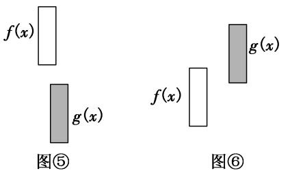
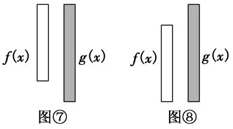
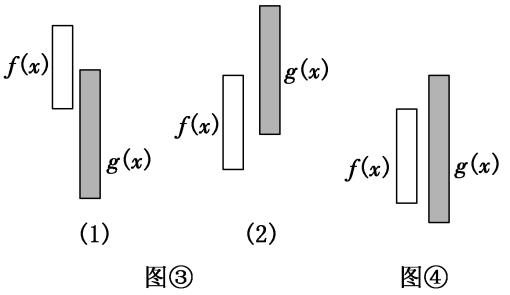

专题35　双变量恒成立与能成立问题概述

【方法总结】

1．最值定位法解双变量不等式恒成立问题的思路策略  
（1）用最值定位法解双变量不等式恒成立问题是指通过不等式两端的最值进行定位，转化为不等式两端函数的最值之间的不等式，列出参数所满足的不等式，从而求解参数的取值范围．  
（2）有关两个函数在各自指定范围内的不等式恒成立问题，这里两个函数在指定范围内的自变量是没有关联的，这类不等式的恒成立问题就应该通过最值进行定位．

2．常见的双变量恒成立能成立问题的类型  
（1）对于任意的<em>x</em>1∈[<em>a</em>，<em>b</em>]，<em>x</em>2∈[<em>m</em>，<em>n</em>]，使得<em>f</em>(<em>x</em>1)≥<em>g</em>(<em>x</em>2)⇔<em>f</em>(<em>x</em>1)min≥<em>g</em>(<em>x</em>2)max．(如图1)  
（2）若存在<em>x</em>1∈[<em>a</em>，<em>b</em>]，总存在<em>x</em>2∈[<em>m</em>，<em>n</em>]，使得<em>f</em>(<em>x</em>1)≥<em>g</em>(<em>x</em>2)⇔<em>f</em>(<em>x</em>1)max≥<em>g</em>(<em>x</em>2) min．(如图2)  
（3）对于任意的<em>x</em>1∈[<em>a</em>，<em>b</em>]，总存在<em>x</em>2∈[<em>m</em>，<em>n</em>]，使得<em>f</em>(<em>x</em>1)≥<em>g</em>(<em>x</em>2)⇔<em>f</em>(<em>x</em>1)min≥<em>g</em>(<em>x</em>2)min．(如图3)  
（4）若存在<em>x</em>1∈[<em>a</em>，<em>b</em>]，对任意的<em>x</em>2∈[<em>m</em>，<em>n</em>]，使得<em>f</em>(<em>x</em>1)≥<em>g</em>(<em>x</em>2)⇔<em>f</em>(<em>x</em>1)max≥<em>g</em>(<em>x</em>2)max．(如图4)  
（5）若存在<em>x</em>1∈[<em>a</em>，<em>b</em>]，对任意的<em>x</em>2∈[<em>m</em>，<em>n</em>]，使得<em>f</em>(<em>x</em>1)＝<em>g</em>(<em>x</em>2)⇔<em>f</em>(<em>x</em>1)max≥<em>g</em>(<em>x</em>2)max．(如图4)  
（6）若存在<em>x</em>1∈[<em>a</em>，<em>b</em>]，总存在<em>x</em>2∈[<em>m</em>，<em>n</em>]，使得<em>f</em>(<em>x</em>1)＝<em>g</em>(<em>x</em>2)⇔<em>f</em> (<em>x</em>)的值域与<em>g</em>(<em>x</em>)的值域的交集非空．(如图5)

### 考点一　双任意与双存在不等问题  
（1）<em>f</em>(<em>x</em>)，<em>g</em>(<em>x</em>)是在闭区间<em>D</em>上的连续函数且∀<em>x</em>1，<em>x</em>2∈<em>D</em>，使得<em>f</em>(<em>x</em>1)＞<em>g</em>(<em>x</em>2)，等价于<em>f</em>(<em>x</em>)min＞<em>g</em>(<em>x</em>)max．其等价转化的目标是函数<em>y</em>＝<em>f</em>(<em>x</em>)的任意一个函数值均大于函数<em>y</em>＝<em>g</em>(<em>x</em>)的任意一个函数值．如图⑤．

  
（2）存在<em>x</em>1，<em>x</em>2∈<em>D</em>，使得<em>f</em>(<em>x</em>1)＞<em>g</em>(<em>x</em>2)，等价于<em>f</em>(<em>x</em>)max＞<em>g</em>(<em>x</em>)min．其等价转化的目标是函数<em>y</em>＝<em>f</em>(<em>x</em>)的某一个函数值大于函数<em>y</em>＝<em>g</em>(<em>x</em>)的某些函数值．如图⑥．

【例题选讲】

<strong>[例1]</strong>　已知函数<em>f</em>(<em>x</em>)＝＋<em>a</em>ln <em>x</em>，其中参数<em>a</em>&lt;0．  
（1）求函数*f*(*x*)的单调区间；  
（2）设函数<em>g</em>(<em>x</em>)＝2<em>x</em>2<em>f</em>′(<em>x</em>)－<em>xf</em>(<em>x</em>)－3<em>a</em>(<em>a</em>&lt;0)，存在实数<em>x</em>1，<em>x</em>2∈[1，e2]，使得不等式2<em>g</em>(<em>x</em>1)&lt;<em>g</em>(<em>x</em>2)成立，求<em>a</em>的取值范围．
解析　（1）∵*f*(*x*)＝＋*a*ln *x*，定义域为(0，＋∞)．∴*f*′(*x*)＝－＋＝．

①当－1<*a*<0时，<0，恒有*f*′(*x*)<0．∴函数*f*(*x*)的单调减区间是(0，＋∞)．

②当*a*＝－1时，*f*′(*x*)＝－<0，∴*f*(*x*)的减区间是(0，＋∞)．

③当*a*<－1时，*x*∈，*f*′(*x*)>0，∴*f*(*x*)的增区间是；*x*∈，

*f*′(*x*)<0，∴*f*(*x*)的减区间是．  
（2）*g*(*x*)＝2*ax*－*ax*ln *x*－(6*a*＋3)(*a*<0)，
因为存在实数<em>x</em>1，<em>x</em>2∈[1，e2]，使得不等式2<em>g</em>(<em>x</em>1)&lt;<em>g</em>(<em>x</em>2)成立，∴2<em>g</em>(<em>x</em>)min&lt;<em>g</em>(<em>x</em>)max．
又*g*′(*x*)＝*a*(1－ln *x*)，且*a*<0，∴当*x*∈[1，e)时，*g*′(*x*)<0，*g*(*x*)是减函数；
当<em>x</em>∈(e，e2]时，<em>g</em>′(<em>x</em>)&gt;0，<em>g</em>(<em>x</em>)是增函数．
∴<em>g</em>(<em>x</em>)min＝<em>g</em>(e)＝<em>a</em>e－6<em>a</em>－3，<em>g</em>(<em>x</em>)max＝max{<em>g</em>（1），<em>g</em>(e2)}＝－6<em>a</em>－3．
∴2*a*e－12*a*－6<－6*a*－3，则*a*>．又*a*<0，从而<*a*<0，
即*a*的取值范围是．

<strong>[例2]</strong>　已知函数<em>f</em> (<em>x</em>)＝ln<em>x</em>－<em>mx</em>，<em>g</em>(<em>x</em>)＝<em>x</em>－(<em>a</em>&gt;0)．  
（1）求函数*f* (*x*)的单调区间；  
（2）若<em>m</em>＝，对∀<em>x</em>1，<em>x</em>2∈[2，2e2]都有<em>g</em>(<em>x</em>1)≥<em>f</em> (<em>x</em>2)成立，求实数<em>a</em>的取值范围．
解析　（1）因为*f* (*x*)＝ln *x*－*mx*，*x*>0，所以*f* ′(*x*)＝－*m*，
当*m*≤0时，*f* ′(*x*)>0，*f* (*x*)在(0，＋∞)上单调递增．当*m*>0时，由*f* ′(*x*)＝0得*x*＝；
由得0<*x*<；由得*x*>．
所以*f* (*x*)在上单调递增，在上单调递减．
综上所述，当*m*≤0时，*f* (*x*)的单调递增区间为(0，＋∞)，无单调递减区间；
当*m*>0时，*f* (*x*)的单调递增区间为，单调递减区间为．  
（2）若<em>m</em>＝，则<em>f</em> (<em>x</em>)＝ln <em>x</em>－<em>x</em>．对∀<em>x</em>1，<em>x</em>2∈[2，2e2]都有<em>g</em>(<em>x</em>1)≥<em>f</em> (<em>x</em>2)成立，

等价于对∀<em>x</em>∈[2，2e2]都有<em>g</em>(<em>x</em>)min≥<em>f</em> (<em>x</em>)max，由（1）知在[2，2e2]上<em>f</em> (<em>x</em>)的最大值为<em>f</em> (e2)＝，
又<em>g</em>′(<em>x</em>)＝1＋&gt;0(<em>a</em>&gt;0)，<em>x</em>∈[2，2e2]，所以函数<em>g</em>(<em>x</em>)在[2，2e2]上是增函数，
所以<em>g</em>(<em>x</em>)min＝<em>g</em>（2）＝2－．由2－≥，得<em>a</em>≤3，又<em>a</em>&gt;0，所以<em>a</em>∈(0，3]，
所以实数*a*的取值范围为(0，3]．

<strong>[例3]</strong>　已知<em>f</em>(<em>x</em>)＝<em>x</em>＋(<em>a</em>＞0)，<em>g</em>(<em>x</em>)＝<em>x</em>＋ln<em>x</em>．  
（1）若对任意的<em>x</em>1，<em>x</em>2∈[1，e]，都有<em>f</em>(<em>x</em>1)≥<em>g</em>(<em>x</em>2)成立，求实数<em>a</em>的取值范围；  
（2）若存在<em>x</em>1，<em>x</em>2∈[1，e]，使得<em>f</em>(<em>x</em>1)＜<em>g</em>(<em>x</em>2)，求实数<em>a</em>的取值范围．
解析　（1）对任意的<em>x</em>1，<em>x</em>2∈[1，e]，都有<em>f</em>(<em>x</em>1)≥<em>g</em>(<em>x</em>2)成立，等价于<em>x</em>∈[1，e]时，<em>f</em>(<em>x</em>)min≥<em>g</em>(<em>x</em>)max．
当<em>x</em>∈[1，e]时，<em>g</em>′(<em>x</em>)＝1＋＞0，所以<em>g</em>(<em>x</em>)在[1，e]上单调递增，所以<em>g</em>(<em>x</em>)max＝<em>g</em>(e)＝e＋1．

只需证<em>f</em>(<em>x</em>)≥e＋1，即<em>x</em>＋≥e＋1⇔<em>a</em>2≥(e＋1)<em>x</em>－<em>x</em>2在[1，e]上恒成立即可．令<em>h</em>(<em>x</em>)＝(e＋1)<em>x</em>－<em>x</em>2，
当<em>x</em>∈[1，e]时，<em>h</em>(<em>x</em>)＝(e＋1)<em>x</em>－<em>x</em>2＝－2＋2的最大值为<em>h</em>＝2．
所以<em>a</em>2≥2，即<em>a</em>≥(舍去负值)．故实数<em>a</em>的取值范围是．  
（2）存在<em>x</em>1，<em>x</em>2∈[1，e]，使得<em>f</em>(<em>x</em>1)＜<em>g</em>(<em>x</em>2)，等价于<em>x</em>∈[1，e]时，<em>f</em>(<em>x</em>)min＜<em>g</em>(<em>x</em>)max．
当<em>x</em>∈[1，e]时，<em>g</em>′(<em>x</em>)＝1＋＞0，所以<em>g</em>(<em>x</em>)在[1，e]上单调递增，所以<em>g</em>(<em>x</em>)max＝<em>g</em>(e)＝e＋1．
又*f*′(*x*)＝1－，令*f*′(*x*)＝0，得*x*＝*a*，
故*f*(*x*)＝*x*＋(*a*＞0)在(0，*a*)上单调递减，在(*a*，＋∞)上单调递增．
当0＜<em>a</em>＜1时，<em>f</em>(<em>x</em>)在[1，e]上单调递增，<em>f</em>(<em>x</em>)min＝<em>f</em>（1）＝1＋<em>a</em>2＜e＋1，符合题意；
当1≤<em>a</em>≤e时，<em>f</em>(<em>x</em>)在[1，<em>a</em>]上单调递减，在[<em>a</em>，e]上单调递增，<em>f</em>(<em>x</em>)min＝<em>f</em>(<em>a</em>)＝2<em>a</em>，
此时，2*a*＜e＋1，解得1≤*a*＜；
当<em>a</em>＞e时，<em>f</em>(<em>x</em>)在[1，e]上单调递减，<em>f</em>(<em>x</em>)min＝<em>f</em>(e)＝e＋，
此时，e＋＜e＋1，即*a*＜，与*a*＞e矛盾，不符合题意．

综上可知，实数*a*的取值范围是．

点拨　（1）本题第（1）问从数的角度看，问题的本质就是<em>f</em>(<em>x</em>)min≥<em>g</em>(<em>x</em>)max．从形的角度看，问题的本质就是函数<em>f</em>(<em>x</em>)图象的最低点不低于<em>g</em>(<em>x</em>)图象的最高点．  
（2）本题第（2）问从数的角度看，问题的本质就是<em>f</em>(<em>x</em>)min＜<em>g</em>(<em>x</em>)max．从形的角度看，问题的本质就是函数<em>f</em>(<em>x</em>)图象的最低点低于<em>g</em>(<em>x</em>)图象的最高点．

<strong>[例4]</strong>　设<em>f</em>(<em>x</em>)＝＋<em>x</em>ln<em>x</em>，<em>g</em>(<em>x</em>)＝<em>x</em>3－<em>x</em>2－3．  
（1）如果存在<em>x</em>1，<em>x</em>2∈[0，2]，使得<em>g</em>(<em>x</em>1)－<em>g</em>(<em>x</em>2)≥<em>M</em>成立，求满足上述条件的最大整数<em>M</em>；  
（2）如果对于任意的*s*，*t*∈，都有*f*(*s*)≥*g*(*t*)成立，求实数*a*的取值范围．
解析　（1）存在<em>x</em>1，<em>x</em>2∈[0，2]，使得<em>g</em>(<em>x</em>1)－<em>g</em>(<em>x</em>2)≥<em>M</em>成立，等价于[<em>g</em>(<em>x</em>1)－<em>g</em>(<em>x</em>2)]max≥<em>M</em>．
由<em>g</em>(<em>x</em>)＝<em>x</em>3－<em>x</em>2－3，得<em>g</em>′(<em>x</em>)＝3<em>x</em>2－2<em>x</em>＝3<em>x</em>．由<em>g</em>′(<em>x</em>)＜0，解得0＜<em>x</em>＜；
由*g*′(*x*)＞0，解得*x*＜0或*x*＞．又*x*∈[0，2]，
所以*g*(*x*)在区间上单调递减，在区间上单调递增，又*g*（0）＝－3，*g*（2）＝1，
故<em>g</em>(<em>x</em>)max＝<em>g</em>（2）＝1，<em>g</em>(<em>x</em>)min＝<em>g</em>＝－．
所以[<em>g</em>(<em>x</em>1)－<em>g</em>(<em>x</em>2)]max＝<em>g</em>(<em>x</em>)max－<em>g</em>(<em>x</em>)min＝1＋＝≥<em>M</em>，则满足条件的最大整数<em>M</em>＝4．  
（2）对于任意的<em>s</em>，<em>t</em>∈，都有<em>f</em>(<em>s</em>)≥<em>g</em>(<em>t</em>)成立，等价于在区间上，函数<em>f</em>(<em>x</em>)min≥<em>g</em>(<em>x</em>)max．
由（1）可知在区间上，*g*(*x*)的最大值为*g*（2）＝1．
在区间上，<em>f</em>(<em>x</em>)＝＋<em>x</em>ln <em>x</em>≥1恒成立等价于<em>a</em>≥<em>x</em>－<em>x</em>2ln <em>x</em>恒成立．
设<em>h</em>(<em>x</em>)＝<em>x</em>－<em>x</em>2ln <em>x</em>，<em>x</em>∈，则<em>h</em>′(<em>x</em>)＝1－2<em>x</em>ln <em>x</em>－<em>x</em>，易知<em>h</em>′(<em>x</em>)在区间上是减函数，
又*h*′（1）＝0，所以当1＜*x*＜2时，*h*′(*x*)＜0；当＜*x*＜1时，*h*′(*x*)＞0．
所以函数<em>h</em>(<em>x</em>)＝<em>x</em>－<em>x</em>2ln <em>x</em>在区间上单调递增，在区间[1，2]上单调递减，
所以<em>h</em>(<em>x</em>)max＝<em>h</em>（1）＝1，所以实数<em>a</em>的取值范围是[1，＋∞)．

### 考点二　存在与任意嵌套不等问题  
（1）∀<em>x</em>1∈<em>D</em>1，∃<em>x</em>2∈<em>D</em>2，使<em>f</em>(<em>x</em>1)＞<em>g</em>(<em>x</em>2)，等价于函数<em>f</em>(<em>x</em>)在<em>D</em>1上的最小值大于<em>g</em>(<em>x</em>)在<em>D</em>2上的最小值，即<em>f</em>(<em>x</em>)min＞<em>g</em>(<em>x</em>)min(这里假设<em>f</em>(<em>x</em>)min，<em>g</em>(<em>x</em>)min存在)．其等价转化的目标是函数<em>y</em>＝<em>f</em>(<em>x</em>)的任意一个函数值大于函数<em>y</em>＝<em>g</em>(<em>x</em>)的某一个函数值．如图⑦．

  
（2）∀<em>x</em>1∈<em>D</em>1，∃<em>x</em>2∈<em>D</em>2，使<em>f</em>(<em>x</em>1)＜<em>g</em>(<em>x</em>2)，等价于函数<em>f</em>(<em>x</em>)在<em>D</em>1上的最大值小于<em>g</em>(<em>x</em>)在<em>D</em>2上的最大值，即<em>f</em>(<em>x</em>)max＜<em>g</em>(<em>x</em>)max．其等价转化的目标是函数<em>y</em>＝<em>f</em>(<em>x</em>)的任意一个函数值小于函数<em>y</em>＝<em>g</em>(<em>x</em>)的某一个函数值．如图⑧．

【例题选讲】

<strong>[例5]</strong>　设函数<em>f</em>(<em>x</em>)＝(<em>a</em>∈<strong>R</strong>)．  
（1）若曲线*y*＝*f*(*x*)在*x*＝1处的切线过点*M*(2，3)，求*a*的值；  
（2）设*g*(*x*)＝*x*＋－，若对任意的*n*∈[0，2]，存在*m*∈[0，2]，使得*f*(*m*)≥*g*(*n*)成立，求*a*的取值范围．
解析　（1）因为*f*(*x*)＝，所以*f*′(*x*)＝e·＝－．
又*f*（1）＝1，即切点为(1，1)，所以*k*＝*f*′（1）＝1－*a*＝，解得*a*＝－1．  
（2）“对任意的*n*∈[0，2]，存在*m*∈[0，2]，使得*f*(*m*)≥*g*(*n*)成立”，等价于

“在[0，2]上，*f*(*x*)的最大值大于或等于*g*(*x*)的最大值”．
因为<em>g</em>(<em>x</em>)＝<em>x</em>＋－，<em>g</em>′(<em>x</em>)＝≥0，所以<em>g</em>(<em>x</em>)在[0，2]上单调递增，所以<em>g</em>(<em>x</em>)max＝<em>g</em>（2）＝2．
令*f*′(*x*)＝0，得*x*＝2或*x*＝*a*．

①当<em>a</em>≤0时，<em>f</em>′(<em>x</em>)≥0在[0，2]上恒成立，<em>f</em>(<em>x</em>)单调递增，<em>f</em>(<em>x</em>)max＝<em>f</em>（2）＝(4－<em>a</em>)e－1≥2，解得<em>a</em>≤4－2e；
②当0<*a*<2时，*f*′(*x*)≤0在[0，*a*]上恒成立，*f*(*x*)单调递减，*f*′(*x*)≥0在[*a*，2]上恒成立，*f*(*x*)单调递增，

<em>f</em>(<em>x</em>)的最大值为<em>f</em>（2）＝(4－<em>a</em>)e－1或<em>f</em>（0）＝<em>a</em>e，所以(4－<em>a</em>)e－1≥2或<em>a</em>e≥2．
解得：*a*≤4－2e或*a*≥，所以≤*a*<2；
③当<em>a</em>≥2时，<em>f</em>′(<em>x</em>)≤0在[0，2]上恒成立，<em>f</em>(<em>x</em>)单调递减，<em>f</em>(<em>x</em>)max＝<em>f</em>（0）＝<em>a</em>e≥2，解得<em>a</em>≥，所以<em>a</em>≥2．
综上所述：*a*≤4－2e或*a*≥．

<strong>[例6]</strong>　已知函数<em>f</em>(<em>x</em>)＝<em>x</em>－(<em>a</em>＋1)ln<em>x</em>－(<em>a</em>∈<strong>R</strong>且<em>a</em>&lt;e)，<em>g</em>(<em>x</em>)＝<em>x</em>2＋e<em>x</em>－<em>x</em>e<em>x</em>．  
（1）当*x*∈[1，e]时，求*f*(*x*)的最小值；  
（2）当<em>a</em>＜1时，若存在<em>x</em>1∈[e，e2]，使得对任意的<em>x</em>2∈[－2，0]，<em>f</em>(<em>x</em>1)＜<em>g</em>(<em>x</em>2)恒成立，求<em>a</em>的取值范围．
解析　（1）*f*(*x*)的定义域为(0，＋∞)，*f*′(*x*)＝．

①若<em>a</em>≤1，当<em>x</em>∈[1，e]时，<em>f</em>′(<em>x</em>)≥0，则<em>f</em>(<em>x</em>)在[1，e]上为增函数，<em>f</em>(<em>x</em>)min＝<em>f</em>（1）＝1－<em>a</em>．

②若1＜*a*＜e，当*x*∈[1，*a*]时，*f*′(*x*)≤0，*f*(*x*)为减函数；当*x*∈[*a*，e]时，*f*′(*x*)≥0，*f*(*x*)为增函数．
所以<em>f</em>(<em>x</em>)min＝<em>f</em>(<em>a</em>)＝<em>a</em>－(<em>a</em>＋1)ln <em>a</em>－1，

综上，当<em>a</em>≤1时，<em>f</em>(<em>x</em>)min＝1－<em>a</em>；当1＜<em>a</em>＜e时，<em>f</em>(<em>x</em>)min＝<em>a</em>－(<em>a</em>＋1)ln <em>a</em>－1；  
（2）由题意知：<em>f</em>(<em>x</em>)(<em>x</em>∈[e，e2])的最小值小于<em>g</em>(<em>x</em>)(<em>x</em>∈[－2，0])的最小值．
由（1）知<em>f</em>(<em>x</em>)在[e，e2]上单调递增，<em>f</em>(<em>x</em>)min＝<em>f</em>(e)＝e－(<em>a</em>＋1)－，又<em>g</em>′(<em>x</em>)＝(1－e<em>x</em>)<em>x</em>．
当<em>x</em>∈[－2，0]时，<em>g</em>′(<em>x</em>)≤0，<em>g</em>(<em>x</em>)为减函数，则<em>g</em>(<em>x</em>)min＝<em>g</em>（0）＝1，
所以e－(*a*＋1)－＜1，解得*a*＞，所以*a*的取值范围为

### 考点三　双任意与存在相等问题  
（1）∃<em>x</em>1∈<em>D</em>1，∃<em>x</em>2∈<em>D</em>2，使得<em>f</em>(<em>x</em>1)＝<em>g</em>(<em>x</em>2)等价于函数<em>f</em>(<em>x</em>)在<em>D</em>1上的值域<em>A</em>与<em>g</em>(<em>x</em>)在<em>D</em>2上的值域<em>B</em>的交集不是空集，即<em>A</em>∩<em>B</em>≠∅，如图⑨．其等价转化的目标是两个函数有相等的函数值．

图⑨　　　　　　　图⑩  
（2）∀<em>x</em>1∈<em>D</em>1，∃<em>x</em>2∈<em>D</em>2，使得<em>f</em>(<em>x</em>1)＝<em>g</em>(<em>x</em>2)等价于函数<em>f</em>(<em>x</em>)在<em>D</em>1上的值域<em>A</em>是<em>g</em>(<em>x</em>)在<em>D</em>2上的值域<em>B</em>的子集，即<em>A</em>⊆<em>B</em>，如图⑩．其等价转化的目标是函数<em>y</em>＝<em>f</em>(<em>x</em>)的值域都在函数<em>y</em>＝<em>g</em>(<em>x</em>)的值域之中．
说明：图⑨，图⑩中的条形图表示函数在相应定义域上的值域在*y*轴上的投影．

【例题选讲】

<strong>[例7]</strong>　已知函数<em>f</em>(<em>x</em>)＝<em>ax</em>－ln<em>x</em>＋<em>x</em>2．  
（1）若*a*＝－1，求函数*f*(*x*)的极值；  
（2）若<em>a</em>＝1，∀<em>x</em>1∈(1，2)，∃<em>x</em>2∈(1，2)，使得<em>f</em>(<em>x</em>1)－<em>x</em>＝<em>mx</em>2－<em>mx</em>(<em>m</em>≠0)，求实数<em>m</em>的取值范围．
解析　（1）依题意知，当<em>a</em>＝－1时，<em>f</em>(<em>x</em>)＝－<em>x</em>－ln <em>x</em>＋<em>x</em>2，<em>f</em>′(<em>x</em>)＝－1－＋2<em>x</em>＝＝，
因为*x*∈(0，＋∞)，故当*x*∈(0，1)时，*f*′(*x*)＜0，当*x*∈(1，＋∞)时，*f*′(*x*)＞0，
故当*x*＝1时，*f*(*x*)有极小值，极小值为*f*（1）＝0，无极大值．  
（2）当<em>a</em>＝1时，<em>f</em>(<em>x</em>)＝<em>x</em>－ln <em>x</em>＋<em>x</em>2．因为∀<em>x</em>1∈(1，2)，∃<em>x</em>2∈(1，2)，

使得<em>f</em>(<em>x</em>1)－<em>x</em>＝<em>mx</em>2－<em>mx</em>(<em>m</em>≠0)，故ln <em>x</em>1－<em>x</em>1＝<em>mx</em>－<em>mx</em>2．
设<em>h</em>(<em>x</em>)＝ln <em>x</em>－<em>x</em>，<em>g</em>(<em>x</em>)＝<em>mx</em>3－<em>mx</em>，
当*x*∈(1，2)时，*h*′(*x*)＝－1＜0，即函数*h*(*x*)在(1，2)上单调递减，故*h*(*x*)的值域为*A*＝(ln 2－2，－1)．
又<em>g</em>′(<em>x</em>)＝<em>mx</em>2－<em>m</em>＝<em>m</em>(<em>x</em>＋1)(<em>x</em>－1)．

①当*m*＜0时，*g*(*x*)在(1，2)上单调递减，此时*g*(*x*)的值域为*B*＝，
因为*A*⊆*B*，又－＞0＞－1，故≤ln 2－2，即*m*≤ln 2－3；
②当*m*＞0时，*g*(*x*)在(1，2)上单调递增，此时*g*(*x*)的值域为*B*＝，
因为*A*⊆*B*，又＞0＞－1，故－≤ln 2－2，故*m*≥－(ln 2－2)＝3－ln 2．
综上所述，实数*m*的取值范围为∪．

<strong>[例8]</strong>　已知函数<em>f</em>(<em>x</em>)＝<em>a</em>ln<em>x</em>－<em>x</em>＋2，<em>a</em>∈<strong>R</strong>．  
（1）求函数*f*(*x*)的单调区间；  
（2）若对任意的<em>x</em>1∈[1，e]，总存在<em>x</em>2∈[1，e]，使得<em>f</em>(<em>x</em>1)＋<em>f</em>(<em>x</em>2)＝4，求实数<em>a</em>的值．
解析　（1）因为*f*(*x*)＝*a* ln *x*－*x*＋2，所以*f*′(*x*)＝－1＝，*x*>0，
当*a*≤0时，对任意的*x*∈(0，＋∞)，*f*′(*x*)<0，所以*f*(*x*)的单调递减区间为(0，＋∞)，无单调递增区间；
当*a*>0时，令*f*′(*x*)＝0，得*x*＝*a*，因为*x*∈(0，*a*)时，*f*′(*x*)>0，*x*∈(*a*，＋∞)时，*f*′(*x*)<0，
所以*f*(*x*)的单调递增区间为(0，*a*)，单调递减区间为(*a*，＋∞)．  
（2）①当<em>a</em>≤1时，由（1）知，<em>f</em>(<em>x</em>)在[1，e]上是减函数，所以<em>f</em>(<em>x</em>)max＝<em>f</em>（1）＝1．
因为对任意的<em>x</em>1∈[1，e]，<em>x</em>2∈[1，e]，<em>f</em>(<em>x</em>1)＋<em>f</em>(<em>x</em>2)≤2<em>f</em>（1）＝2&lt;4，
所以对任意的<em>x</em>1∈[1，e]，不存在<em>x</em>2∈[1，e]，使得<em>f</em>(<em>x</em>1)＋<em>f</em>(<em>x</em>2)＝4．

②当1<*a*<e时，由（1）知，*f*(*x*)在[1，*a*]上是增函数，在(*a*，e]上是减函数，
所以<em>f</em>(<em>x</em>)max＝<em>f</em>(<em>a</em>)＝<em>a</em> ln <em>a</em>－<em>a</em>＋2．
因为对任意的<em>x</em>1∈[1，e]，<em>x</em>2∈[1，e]，<em>f</em>(<em>x</em>1)＋<em>f</em>(<em>x</em>2)≤2<em>f</em>(<em>a</em>)＝2<em>a</em>(ln <em>a</em>－1)＋4，
又1<*a*<e，所以ln *a*－1<0，2*a*(ln *a*－1)＋4<4，
所以对任意的<em>x</em>1∈[1，e]，不存在<em>x</em>2∈[1，e]，使得<em>f</em>(<em>x</em>1)＋<em>f</em>(<em>x</em>2)＝4．

③当<em>a</em>≥e时，由（1）知，<em>f</em>(<em>x</em>)在[1，e]上是增函数，<em>f</em>(<em>x</em>)min＝<em>f</em>（1）＝1，<em>f</em>(<em>x</em>)max＝<em>f</em>(e)＝<em>a</em>－e＋2，
由题意，对任意的<em>x</em>1∈[1，e]，总存在<em>x</em>2∈[1，e]，使得<em>f</em>(<em>x</em>1)＋<em>f</em>(<em>x</em>2)＝4，
则当<em>x</em>1＝1时，要使存在<em>x</em>2∈[1，e]，使得<em>f</em>(<em>x</em>1)＋<em>f</em>(<em>x</em>2)＝4，则<em>f</em>（1）＋<em>f</em>(e)≥4，

同理当<em>x</em>1＝e时，要使存在<em>x</em>2∈[1，e]，使得<em>f</em>(<em>x</em>1)＋<em>f</em>(<em>x</em>2)＝4，则<em>f</em>(e)＋<em>f</em>（1）≤4，所以<em>f</em>（1）＋<em>f</em>(e)＝4．

(对任意的<em>x</em>1∈(1，e)，令<em>g</em>(<em>x</em>)＝4－<em>f</em>(<em>x</em>)－<em>f</em>(<em>x</em>1)，<em>x</em>∈[1，e]，<em>g</em>(<em>x</em>)＝0有解．<em>g</em>（1）＝4－<em>f</em>（1）－<em>f</em>(<em>x</em>1)＝<em>f</em>(e)－<em>f</em>(<em>x</em>1)&gt;0，<em>g</em>(e)＝4－<em>f</em>(e)－<em>f</em>(<em>x</em>1)＝<em>f</em>（1）－<em>f</em>(<em>x</em>1)&lt;0，所以存在<em>x</em>2∈(1，e)，<em>g</em>(<em>x</em>2)＝4－<em>f</em>(<em>x</em>2)－<em>f</em>(<em>x</em>1)＝0，即<em>f</em>(<em>x</em>1)＋<em>f</em>(<em>x</em>2)＝4．)
所以由*f*（1）＋*f*(e)＝*a*－e＋3＝4，得*a*＝e＋1．

综上可知，实数*a*的值为e＋1．

<strong>[例9]</strong>　已知函数<em>f</em> (<em>x</em>)＝ln<em>x</em>－<em>x</em>，<em>g</em>(<em>x</em>)＝<em>mx</em>3－<em>mx</em>(<em>m</em>≠0)．  
（1）求曲线*y*＝*f* (*x*)在点(1，*f* （1）)处的切线方程；  
（2）若对任意的<em>x</em>1∈(1，2)，总存在<em>x</em>2∈(1，2)，使得<em>f</em>(<em>x</em>1)＝<em>g</em>(<em>x</em>2)，求实数<em>m</em>的取值范围．
解析　（1）易知切点为(1，－1)，*f* ′(*x*)＝－1，切线的斜率*k*＝*f* ′（1）＝0，故切线方程为*y*＝－1．  
（2）设*f* (*x*)在区间(1，2)上的值域为*A*，*g*(*x*)在区间(1，2)上的值域为*B*，则由题意可得*A*⊆*B．*
∵*f* (*x*)＝ln *x*－*x*，∴*f* ′(*x*)＝－1＝<0在(1，2)上恒成立，
∴函数*f* (*x*)在区间(1，2)上单调递减，∴值域*A*为(ln 2－2，－1)．
又<em>g</em>′(<em>x</em>)＝<em>mx</em>2－<em>m</em>＝<em>m</em>(<em>x</em>＋1)(<em>x</em>－1)，当<em>m</em>&gt;0时，<em>g</em>′(<em>x</em>)&gt;0在<em>x</em>∈(1，2)上恒成立，
则*g*(*x*)在(1，2)上是增函数，此时*g*(*x*)在区间(1，2)上的值域*B*为，
则解得*m*≥－(ln 2－2)＝3－ln 2．
当*m*<0时，*g*′(*x*)<0在*x*∈(1，2)上恒成立，则*g*(*x*)在(1，2)上是减函数，
此时*g*(*x*)在区间(1，2)上的值域*B*为，则解得*m*≤(ln 2－2)＝ln 2－3．
∴实数*m*的取值范围是∪．

<strong>[例10]</strong>　已知函数<em>f</em>(<em>x</em>)＝(1－<em>x</em>)e<em>x</em>－1．  
（1）求*f*(*x*)的极值；  
（2）设<em>g</em>(<em>x</em>)＝(<em>x</em>－<em>t</em>)2＋2，存在<em>x</em>1∈(－∞，＋∞)，<em>x</em>2∈(0，＋∞)，使方程<em>f</em>(<em>x</em>1)＝<em>g</em>(<em>x</em>2)成立，求实数<em>m</em>的最小值．
解析　（1）<em>f</em>′(<em>x</em>)＝－<em>x</em>e<em>x</em>，当<em>x</em>∈(0，＋∞)时，<em>f</em>′(<em>x</em>)&lt;0，当<em>x</em>∈(－∞，0)时，<em>f</em>′(<em>x</em>)&gt;0，
∴当<em>x</em>＝0时，<em>f</em>(<em>x</em>)有极大值<em>f</em>（0）＝e0－1＝0，<em>f</em>(<em>x</em>)没有极小值．  
（2）由（1）知<em>f</em>(<em>x</em>)≤0，又因为<em>g</em>(<em>x</em>)＝(<em>x</em>－<em>t</em>)2＋2≥0，
所以要使方程<em>f</em>(<em>x</em>1)＝<em>g</em>(<em>x</em>2)有解，必然存在<em>x</em>2∈(0，＋∞)，使<em>g</em>(<em>x</em>2)＝0，所以<em>x</em>＝<em>t</em>，ln <em>x</em>＝，

等价于方程ln *x*＝有解，即方程*m*＝*x*ln *x*在(0，＋∞)上有解，

记*h*(*x*)＝*x*ln *x*，*x*∈(0，＋∞)，则*h*′(*x*)＝ln *x*＋1，令*h*′(*x*)＝0，得*x*＝，
所以当*x*∈时，*h*′(*x*)<0，*h*(*x*)单调递减，当*x*∈时，*h*′(*x*)>0，*h*(*x*)单调递增，
所以当<em>x</em>＝时，<em>h</em>(<em>x</em>)min＝－，所以实数<em>m</em>的最小值为－．

<strong>[例11]</strong>　已知函数<em>f</em>(<em>x</em>)＝<em>x</em>2－<em>ax</em>3，<em>a</em>＞0，<em>x</em>∈<strong>R</strong>，<em>g</em>(<em>x</em>)＝．  
（1）若∃<em>x</em>1∈(－∞，－1]，∃<em>x</em>2∈，使得<em>f</em>(<em>x</em>1)＝<em>g</em>(<em>x</em>2)，求实数<em>a</em>的取值范围；  
（2）当<em>a</em>＝时，求证：对任意的<em>x</em>1∈(2，＋∞)，都存在<em>x</em>2∈(1，＋∞)，使得<em>f</em>(<em>x</em>1)＝<em>g</em>(<em>x</em>2)．
解析　（1）∵<em>f</em>(<em>x</em>)＝<em>x</em>2－<em>ax</em>3，∴<em>f</em>′(<em>x</em>)＝2<em>x</em>－2<em>ax</em>2＝2<em>x</em>(1－<em>ax</em>)．令<em>f</em>′(<em>x</em>)＝0，得<em>x</em>＝0或<em>x</em>＝．
∵*a*＞0，∴＞0，∴当*x*∈(－∞，0)时，*f*′(*x*)＜0，∴*f*(*x*)在(－∞，－1]上单调递减，*f*(*x*)≥*f*(－1)＝1＋，
故*f*(*x*)在(－∞，－1]上的值域为．
∵*g*(*x*)＝，∴*g*′(*x*)＝＝．
当*x*＜－时，*g*′(*x*)＞0，∴*g*(*x*)在上单调递增，*g*(*x*)＜*g*＝，
故*g*(*x*)在上的值域为．
若∃<em>x</em>1∈(－∞，－1]，∃<em>x</em>2∈，使得<em>f</em>(<em>x</em>1)＝<em>g</em>(<em>x</em>2)，则1＋＜，解得0＜<em>a</em>＜，
故实数*a*的取值范围是．  
（2）当<em>a</em>＝时，<em>f</em>(<em>x</em>)＝<em>x</em>2－<em>x</em>3，∴<em>f</em>′(<em>x</em>)＝2<em>x</em>－3<em>x</em>2＝3<em>x</em>．
当*x*＞2时，*f*′(*x*)＜0，∴*f*(*x*)在(2，＋∞)上单调递减，且*f*（2）＝－4，
∴*f*(*x*)在(2，＋∞)上的值域为(－∞，－4)．则*g*(*x*)＝＝在(1，＋∞)上单调递增，
∴*g*(*x*)＝在(1，＋∞)上的值域为(－∞，0)．∵(－∞，－4)(－∞，0)，
∴对于任意的<em>x</em>1∈(2，＋∞)，都存在<em>x</em>2∈(1，＋∞)，使得<em>f</em>(<em>x</em>1)＝<em>g</em>(<em>x</em>2)．

点拨　本题第（1）问等价转化的基本思想是：两个函数有相等的函数值，即它们的值域有公共部分；第（2）问等价转化的基本思想是：函数*f*(*x*)的任意一个函数值都与函数*g*(*x*)的某一函数值相等，即*f*(*x*)的值域都在*g*(*x*)的值域中．

