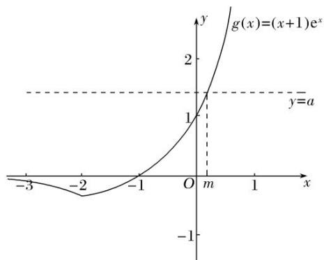

# 专题 36 双变量不等式恒成立与能成立问题考点探析

# 考点一 单函数双任意型

# 【例题选讲】

[例1] 已知函数 $f(x) = \frac{\ln x}{x} + ax + b$ 的图象在点 $A(1, f(1))$ 处的切线与直线 $l: 2x - 4y + 3 = 0$ 平行.

(1)求证：函数 $y=f(x)$ 在区间 $(1, e)$ 上存在最大值；

(2)记函数 $g(x) = xf(x) + c$ ，若 $g(x)\leqslant 0$ 对一切 $x\in (0, + \infty)$ ， $b\in \left[0,\frac{3}{2}\right]$ 恒成立，求实数 $c$ 的取值范围.

解析 (1)由题意得 $f(x)=\frac{1-\ln x}{x^{2}}+a$ .

因为函数图象在点 A 处的切线与直线 l 平行，且 l 的斜率为 $\frac{1}{2}$ ,

所以 $f(1)=\frac{1}{2}$ ，即 $1+a=\frac{1}{2}$ ，所以 $a=-\frac{1}{2}$ .

所以 $f'(x)=\frac{1-\ln x}{x^{2}}-\frac{1}{2}=\frac{2-2\ln x-x^{2}}{2x^{2}}$ ，所以 $f'(1)=\frac{1}{2}>0,\quad f'(e)=-\frac{1}{2}<0.$

因为 $y=2-2\ln x-x^{2}$ 在 $(1, e)$ 上连续，

所以 $f'(x)$ 在区间 $(1, e)$ 上存在一个零点，设为 $x_{0}$ ，则 $x_{0} \in (1, e)$ ，且 $f'(x_{0}) = 0$ .

当 $x \in (1, x_{0})$ 时， $f'(x) > 0$ ，所以 $f(x)$ 在 $(1, x_{0})$ 上单调递增；

当 $x \in (x_{0}, e)$ 时， $f'(x) < 0$ ，所以 $f(x)$ 在 $(x_{0}, e)$ 上单调递减.

所以当 $x=x_{0}$ 时，函数 $y=f(x)$ 取得最大值．故函数 $y=f(x)$ 在区间 $(1, e)$ 上存在最大值．

(2)法一 因为 $g(x)=\ln x-\frac{1}{2}x^{2}+bx+c\leq0$ 对一切 $x\in(0,+\infty)$ ， $b\in\left(0,\frac{3}{2}\right)$ 恒成立，

所以 $c \leq \frac{1}{2} x^{2} - bx - \ln x$ 。记 $h_{1}(x) = \frac{1}{2} x^{2} - bx - \ln x (x > 0)$ ，则 $c \leq h_{1}(x)_{\min}$

$h'_{1}(x)=x-b-\frac{1}{x}$ . 令 $h'_{1}(x)=0$ ，得 $x^{2}-bx-1=0$ ，所以 $x_{1}=\frac{b-\sqrt{b^{2}+4}}{2}<0$ （舍去）， $x_{2}=\frac{b+\sqrt{b^{2}+4}}{2}$ .

因为 $b \in \begin{pmatrix} 0, & \frac{3}{2} \end{pmatrix}$ ，所以 $x_{2} = \frac{b + \sqrt{b^{2} + 4}}{2} \in (1, 2)$ .

当 $0 < x < x_{2}$ 时， $h'_{1}(x) < 0$ ， $h_{1}(x)$ 单调递减；当 $x > x_{2}$ 时， $h'_{1}(x) > 0$ ， $h_{1}(x)$ 单调递增.

所以 $h_{1}(x)_{\min}=h_{1}(x_{2})=\frac{1}{2}x_{2}^{2}-bx_{2}-\ln x_{2}=\frac{1}{2}x_{2}^{2}+1-x_{2}^{2}-\ln x_{2}=-\frac{1}{2}x_{2}^{2}-\ln x_{2}+1.$

记 $h_{2}(x)=-\frac{1}{2}x^{2}-\ln x+1$ .

因为 $h_{2}(x)$ 在 $(1, 2)$ 上单调递减，所以 $h_{2}(x) > h_{2}(2) = -1 - \ln 2$ .

所以 $c \leq -1 - \ln 2$ ，故 c 的取值范围是 $(-∞, -1 - \ln 2]$ .

法二 因为 $g(x)=\ln x-\frac{1}{2}x^{2}+bx+c\leq0$ 对一切 $x\in(0,+\infty)$ 恒成立，所以 $c\leq\frac{1}{2}x^{2}-bx-\ln x$ .

设 $h_{1}(b)=-xb+\frac{1}{2}x^{2}-\ln x$ ，因为 $x\in(0,+\infty)$ ，则函数 $h_{1}(b)$ 在 $\begin{pmatrix}0,&\frac{3}{2}\end{pmatrix}$ 上为减函数，

所以 $h_{1}(b)>h\left(\frac{3}{2}\right)=\frac{1}{2}x^{2}-\frac{3}{2}x-\ln x$ ，则对 $\forall x\in(0,+\infty)$ ， $c\leq\frac{1}{2}x^{2}-\frac{3}{2}x-\ln x$ 恒成立，

设 $h_{2}(x)=\frac{1}{2}x^{2}-\frac{3}{2}x-\ln x,$

则 $h'_{2}(x)=x-\frac{3}{2}-\frac{1}{x}=\frac{2x^{2}-3x-2}{2x}=\frac{(x-2)(2x+1)}{2x},$

令 $h'_{2}(x)=0$ ，则 x=2，当 0<x<2 时， $f'(x)<0$ ，函数单调递减；

当 x>2 时， $f'(x)>0$ ，函数单调递增，则 x=2 时， $f(x)_{\min}=f(2)=-\frac{1}{2}-\ln2$

则 $c \leq -1 - \ln 2$ ，故 c 的取值范围是 $(-∞, -1 - \ln 2]$ .

[例 2] 已知函数 $f(x)=(\log_{a}x)^{2}+x-\ln x(a>1)$ .

(1)求证：函数 $f(x)$ 在 $(1, +\infty)$ 上单调递增；  
(2)若关于 $x$ 的方程 $|f(x) - t| = 1$ 在 $(0, +\infty)$ 上有三个零点，求实数 $t$ 的值；  
(3)若对任意的 $x_{1}, x_{2} \in [a^{-1}, a]$ ， $|f(x_{1}) - f(x_{2})| \leqslant e - 1$ 恒成立(e为自然对数的底数)，求实数 $a$ 的取值范围.

解析 (1)因为函数 $f(x) = (\log_a x)^2 + x - \ln x$ ，所以 $f'(x) = 1 - \frac{1}{x} + 2\log_a x \cdot \frac{1}{x \ln a}$ .

因为 a>1, x>1，所以 $f'(x)=1-\frac{1}{x}+2\log_{a}x\cdot\frac{1}{x\ln a}>0$ ，所以函数 $f(x)$ 在 $(1,+\infty)$ 上单调递增.

(2)因为当 a>1，0<x<1 时，分别有 $1-\frac{1}{x}<0$ ， $2\log_{a}x\cdot\frac{1}{x\ln a}<0$ ，所以 $f'(x)<0$ ，

结合(1)可得 $f(x)_{\min}=f(1)$ ，所以 t-1=f(1)=1，故 t=2.

(3)由(2)可知，函数 $f(x)$ 在 $[a^{-1}, 1]$ 上单调递减，在 $(1, a]$ 上单调递增，所以 $f(x)_{\min} = f(1) = 1$ ，

$$
f (x) _ {\max} = \max \left\{f \left(a ^ {- 1}\right), f (a) \right\}. f (a) - f \left(a ^ {- 1}\right) = a - a ^ {- 1} - 2 \ln a,
$$

令 $g(x)=x-x^{-1}-2\ln x(x>1)$ ，则 $g'(x)=1+x^{-2}-\frac{2}{x}=\left(\frac{1}{x}-1\right)^{2}\geq0$

所以 $g(a)>g(1)=0$ ，即 $f(a)-f(a^{-1})>0$ ，所以 $f(x)_{\max}=f(a)$ ,

所以问题等价于 $\forall x_{1},\quad x_{2}\in[a^{-1},\quad a]$ ,

$$
\left| f \left(x _ {1}\right) - f \left(x _ {2}\right) \right| _ {\max} = f (a) - f (1) = a - \ln a \leq e - 1.
$$

由 $h(x)=x-\ln x$ 的单调性，且 a>1，解得 $1<a\leq e$ ，

所以实数 a 的取值范围为 $(1, e]$ .

[例 3] 已知函数 $f(x)=x^{2}-ax+2\ln x$ .

(1)若函数 $y=f(x)$ 在定义域上单调递增，求实数 a 的取值范围；

(2)设 $f(x)$ 有两个极值点 $x_{1}$ ， $x_{2}$ ，若 $x_{1} \in \left[0, \frac{1}{\mathrm{e}}\right]$ ，且 $f(x_{1}) \geq t + f(x_{2})$ 恒成立，求实数 $t$ 的取值范围.

思路 (1)转化为恒不等式问题，即 $f'(x)=2x-a+\frac{2}{x}\geq0$ 在 $(0,+\infty)$ 上恒成立，然后用分离参数+最值分析法解决．(2)分离参数t，即 $t\leq f(x_{1})-f(x_{2})$ ，然后用条件 $f(x)$ 有两个极值点 $x_{1}$ ， $x_{2}$ ，进行消元，转化为一元不等式恒成立问题处理.

解析 (1)因为函数 $y = f(x)$ 在定义域上单调递增，所以 $f'(x) \geq 0$ ，

即 $2x - a + \frac{2}{x} \geq 0$ 在 $(0, +\infty)$ 上恒成立，

所以 $a \leq 2x + \frac{2}{x} (x \in (0, +\infty))$ 。而 $2x + \frac{2}{x} \geq 2\sqrt{2x \cdot \frac{2}{x}} = 4$ （当且仅当 $2x = \frac{2}{x}$ ，即 $x = 1$ 时等号成立），

所以 $a \leq 4$ ，所以实数 a 的取值范围是 $(-∞, 4]$ .

(2)因为 $f'(x)=\frac{2x^{2}-ax+2}{x}(x>0)$ ，由题意可得 $x_{1}$ ， $x_{2}$ 为方程 $f'(x)=0$ ，

即 $2x^{2}-ax+2=0(x>0)$ 的两个不同实根，所以 $ax_{1}=2x_{1}^{2}+2,\quad ax_{2}=2x_{2}^{2}+2.$

由根与系数的关系可得 $x_{1}x_{2}=1$ 。由已知 $0<x_{1}\leq\frac{1}{e}$ ，则 $x_{2}=\frac{1}{x_{1}}\geq e$

$$
\text {而} f \left(x _ {1}\right) - f \left(x _ {2}\right) = \left(x _ {1} ^ {2} - a x _ {1} + 2 \ln x _ {1}\right) - \left(x _ {2} ^ {2} - a x _ {2} + 2 \ln x _ {2}\right) = \left[ x _ {1} ^ {2} - \left(2 x _ {1} ^ {2} + 2\right) + 2 \ln x _ {1} \right] - \left[ x _ {2} ^ {2} - \left(2 x _ {2} ^ {2} + 2\right) + 2 \ln x _ {2} \right]
$$

$$
= \left(- x _ {1} ^ {2} - 2 + 2 \ln x _ {1}\right) - \left(- x _ {2} ^ {2} - 2 + 2 \ln x _ {2}\right) = x _ {2} ^ {2} - x _ {1} ^ {2} + 2 (\ln x _ {1} - \ln x _ {2}) = x _ {2} ^ {2} - x _ {1} ^ {2} + 2 \ln \frac {x _ {1}}{x _ {2}}
$$

$$
= x _ {2} ^ {2} - \frac {1}{x _ {2} ^ {2}} + 2 \ln \frac {1}{x _ {2} ^ {2}} = x _ {2} ^ {2} - \frac {1}{x _ {2} ^ {2}} - 2 \ln x _ {2} ^ {2} (x _ {2} \geq e).
$$

设 $p(x)=x-\frac{1}{x}-2\ln x(x\geq e^{2})$ ，则 $p'(x)=1+\frac{1}{x^{2}}-\frac{2}{x}=\frac{x^{2}-2x+1}{x^{2}}=\frac{(x-1)^{2}}{x^{2}}$ ,

显然当 $x \geq e^{2}$ 时， $p'(x) > 0$ ，函数 $p(x)$ 单调递增，故 $p(x) \geq p(e^{2}) = e^{2} - \frac{1}{e^{2}} - 2\ln e^{2} = e^{2} - \frac{1}{e^{2}} - 4$ .

故 $f(x_{1}) - f(x_{2})\geq \mathrm{e}^{2} - \frac{1}{\mathrm{e}^{2}} -4$ ，故 $t\leq \mathrm{e}^2 -\frac{1}{\mathrm{e}^2} -4$ .所以实数 $t$ 的取值范围是 $\left[-\infty ,\mathrm{e}^2 -\frac{1}{\mathrm{e}^2} -4\right].$

悟通 (2)是双变量恒不等式问题, 分离参数后通过消元, 转化为一元不等式恒成立问题处理. 但在 $f(x_{1}) - f(x_{2}) = (x_{1}^{2} - ax_{1} + 2\ln x_{1}) - (x_{2}^{2} - ax_{2} + 2\ln x_{2})$ 中含有三个变量 $x_{1}$ , $x_{2}$ 与 $a$ , 最终保留哪个? 由于 $x_{1} \in \left[0, \frac{1}{e}\right]$ , 消掉 $x_{2}$ 与 $a$ 为佳, 解答中是消掉 $x_{1}$ 与 $a$ , 保留下 $x_{2}$ 也可以, 但要注意 $x_{2}$ 的范围, 由于 $x_{1}, x_{2}$ 为 $f(x)$ 的两个极值点, 所以 $ax_{1} = 2x_{1}^{2} + 2$ , $ax_{2} = 2x_{2}^{2} + 2$ . 先消去 $ax_{1}$ 与 $ax_{2}$ , 再用韦达定理消去 $x_{1}$ , 此时构造函数 $p(x) = x - \frac{1}{x} - 2\ln x (x \geq e^{2})$ , 求的最小值.

[例 4] 已知函数 $f(x)=x-\ln x$ ， $g(x)=x^{2}-ax. +X+K]$

(1)求函数 $f(x)$ 在区间 $[t, t+1](t>0)$ 上的最小值 $m(t)$ ;

(2)令 $h(x) = g(x) - f(x)$ , $A(x_{1}, h(x_{1}))$ , $B(x_{2}, h(x_{2})) (x_{1} \neq x_{2})$ 是函数 $h(x)$ 图象上任意两点，且满足 $\frac{h(x_{1}) - h(x_{2})}{x_{1} - x_{2}} > 1$ ，求实数 $a$ 的取值范围；

解析 $(1)f'(x)=1-\frac{1}{x},\quad x>0,$ 令 $f'(x)=0,$ 则 x=1.

当 $t \geq 1$ 时， $f(x)$ 在 $[t, t+1]$ 上单调递增， $f(x)$ 的最小值为 $f(t) = t - \ln t$ ;

当 0 < t < 1 时， $f(x)$ 在区间 $(t, 1)$ 上为减函数，在区间 $(1, t + 1)$ 上为增函数， $f(x)$ 的最小值为 $f(1) = 1$ .

综上， $m(t)=\left\{\begin{aligned}t-\ln t,\quad&t\geq1,\\ 1,\quad&0<t<1.\end{aligned}\right.$

(2) $h(x)=x^{2}-(a+1)x+\ln x,\quad x>0$ ．不妨取 $0<x_{1}<x_{2}$ ，则 $x_{1}-x_{2}<0$

则由 $\frac{h(x_1) - h(x_2)}{x_1 - x_2} > 1$ ，可得 $h(x_1) - h(x_2) < x_1 - x_2$ ，变形得 $h(x_1) - x_1 < h(x_2) - x_2$ 恒成立。

令 $F(x)=h(x)-x=x^{2}-(a+2)x+\ln x,\quad x>0$ ，则 $F(x)=x^{2}-(a+2)x+\ln x$ 在 $(0,+\infty)$ 上单调递增，

故 $F'(x)=2x-(a+2)+\frac{1}{x}\geq0$ 在 $(0,+\infty)$ 上恒成立，所以 $2x+\frac{1}{x}\geq a+2$ 在 $(0,+\infty)$ 上恒成立.

因为 $2x + \frac{1}{x} \geq 2\sqrt{2}$ ，当且仅当 $x = \frac{\sqrt{2}}{2}$ 时取“=”，所以 $a \leq 2\sqrt{2} - 2$ .

故 a 的取值范围为 $(-∞, 2\sqrt{2}-2]$ .

[例 5] 已知函数 $f(x)=\ln x+ax^{2}-3x$ .

(1)若函数 $f(x)$ 的图象在点(1, $f(1)$ )处的切线方程为 $y = -2$ ，求函数 $f(x)$ 的极小值；  
(2)若 $a = 1$ ，对于任意 $x_{1}, x_{2} \in [1, 10]$ ，当 $x_{1} < x_{2}$ 时，不等式 $f(x_{1}) - f(x_{2}) > \frac{m(x_{2} - x_{1})}{x_{1}x_{2}}$ 恒成立，求实数 $m$ 的取值范围.

解析 $(1)f(x)=\ln x+ax^{2}-3x$ 的定义域为 $(0,+\infty)$ ， $f'(x)=\frac{1}{x}+2ax-3$ .

由函数 $f(x)$ 的图象在点 $(1, f(1))$ 处的切线方程为 y = -2，得 $f'(1) = 1 + 2a - 3 = 0$ ，解得 a = 1。

此时 $f'(x)=\frac{1}{x}+2x-3=\frac{(2x-1)(x-1)}{x}$ . 令 $f'(x)=0$ ，得 x=1 或 $x=\frac{1}{2}$ .

当 $x \in \begin{bmatrix} 0, & \frac{1}{2} \end{bmatrix}$ 和 $x \in (1, +\infty)$ 时， $f'(x) > 0$ ; 当 $x \in \begin{bmatrix} \frac{1}{2}, & 1 \end{bmatrix}$ 时， $f'(x) < 0$ .

所以函数 $f(x)$ 在 $\left(0, \frac{1}{2}\right)$ 和 $(1, +\infty)$ 上单调递增，在 $\left(\frac{1}{2}, 1\right)$ 上单调递减，

所以当 x=1 时，函数 $f(x)$ 取得极小值 $f(1)=\ln1+1-3=-2$ .

(2)由 a=1 得 $f(x)=\ln x+x^{2}-3x$ 。因为对于任意 $x_{1}, x_{2}\in[1, 10]$

当 $x_{1}<x_{2}$ 时， $f(x_{1})-f(x_{2})>\frac{m(x_{2}-x_{1})}{x_{1}x_{2}}$ 恒成立，所以对于任意 $x_{1}, x_{2}\in[1, 10]$ ,

当 $x_{1}<x_{2}$ 时， $f(x_{1})-\frac{m}{x_{1}}>f(x_{2})-\frac{m}{x_{2}}$ 恒成立，所以函数 $y=f(x)-\frac{m}{x}$ 在 [1, 10] 上单调递减.

令 $h(x)=f(x)-\frac{m}{x}=\ln x+x^{2}-3x-\frac{m}{x},\quad x\in[1,10]$ ,

所以 $h'(x)=\frac{1}{x}+2x-3+\frac{m}{x^{2}}\leq0$ 在 $[1,10]$ 上恒成立，则 $m\leq-2x^{3}+3x^{2}-x$ 在 $[1,10]$ 上恒成立.

设 $F(x)=-2x^{3}+3x^{2}-x(x\in[1,10])$ ，则 $F'(x)=-6x^{2}+6x-1=-6\left(x-\frac{1}{2}\right)^{2}+\frac{1}{2}$ .

当 $x \in [1, 10]$ 时， $F'(x) < 0$ ，所以函数 $F(x)$ 在 $[1, 10]$ 上单调递减，

所以 $F(x)_{\min}=F(10)=-2\times10^{3}+3\times10^{2}-10=-1710$ ，所以 $m\leq-1710$ ，

故实数 m 的取值范围为 $(-∞, -1710]$ .

悟通 (1)利用 $f'(1) = 0$ ，得 $a$ 的方程，解方程求 $a$ 的值，再求 $f'(x) = 0$ 的实数解，并判断在实数解的两侧 $f(x)$ 的导数值符号，得 $f(x)$ 的极值.

(2)“双变量不等式”变“单变量不等式”: 双变量不等式“ $f(x_1)-f(x_2)>\frac{m(x_2-x_1)}{x_1x_2}$ ”可化为“ $f(x_1)-\frac{m}{x_1}>f(x_2)-\frac{m}{x_2}$ , 只需构造函数 $h(x)=f(x)-\frac{m}{x}$ , 判断其在[1, 10]上单调递减, 从而转化为单变量不等式“ $h'(x)=\frac{1}{x}+2x-3+\frac{m}{x^2}\leq0$ 在[1, 10]上恒成立”。分离参数 $m$ , 构造新函数, 借助函数最值求 $m$ 的取值范围。

# 【对点训练】

1. 已知函数 $f(x) = a \ln x + x - \frac{1}{x}$ ，其中 $a$ 为实常数.

(1)若 $x=\frac{1}{2}$ 是 $f(x)$ 的极大值点，求 $f(x)$ 的极小值；  
(2)若不等式 $a \ln x - \frac{1}{x} \leq b - x$ 对任意 $-\frac{5}{2} \leq a \leq 0, \frac{1}{2} \leq x \leq 2$ 恒成立，求 $b$ 的最小值.

1. 解析 $(1)f'(x) = \frac{x^2 + ax + 1}{x^2}$ ，由题意知 $x > 0$ 。由 $f'\left(\frac{1}{2}\right) = 0$ ，得 $\left(\frac{1}{2}\right)^2 + \frac{1}{2} a + 1 = 0$

所以 $a=-\frac{5}{2}$ ，此时 $f(x)=-\frac{5}{2}\ln x+x-\frac{1}{x}$ 。则 $f'(x)=\frac{x^{2}-\frac{5}{2}x+1}{x^{2}}=\frac{(x-2)\left(x-\frac{1}{2}\right)}{x^{2}}$ .

所以 $f(x)$ 在 $\left[\frac{1}{2}, 2\right]$ 上为减函数，在 $[2, +\infty)$ 上为增函数.

所以 x=2 为极小值点，极小值 $f(2)=\frac{3}{2}-\frac{5\ln 2}{2}$ .

(2)不等式 $a \ln x - \frac{1}{x} \leq b - x$ 即为 $f(x) \leq b$ ，所以 $b \geq f(x)_{\max}$ 对任意 $-\frac{5}{2} \leq a \leq 0$ ， $\frac{1}{2} \leq x \leq 2$ 恒成立.

①若 $1 \leq x \leq 2$ ，则 $\ln x \geq 0$ ， $f(x) = a \ln x + x - \frac{1}{x} \leq x - \frac{1}{x} \leq 2 - \frac{1}{2} = \frac{3}{2}$ 。当 a = 0，x = 2 时取等号。  
②若 $\frac{1}{2}\leq x<1$ ，则 $\ln x<0$ ， $f(x)=a\ln x+x-\frac{1}{x}\leq-\frac{5}{2}\ln x+x-\frac{1}{x}$ .

由(1)可知 $g(x)=-\frac{5}{2}\ln x+x-\frac{1}{x}$ 在 $\left[\frac{1}{2},1\right]$ 上为减函数．所以当 $\frac{1}{2}\leq x<1$ 时， $g(x)\leq g\left(\frac{1}{2}\right)=\frac{5}{2}\ln 2-\frac{3}{2}$

因为 $\frac{5}{2}\ln2-\frac{3}{2}<\frac{5}{2}-\frac{3}{2}=1<\frac{3}{2}$ ，所以 $f(x)\leq\frac{3}{2}$ 。综上， $f(x)_{\max}=\frac{3}{2}$ 。于是 $b_{\min}=\frac{3}{2}$ 。

2. 设函数 $f(x)=\mathrm{e}^{mx}+x^{2}-mx$ .

(1)证明： $f(x)$ 在 $(-∞, 0)$ 单调递减，在 $(0, +∞)$ 单调递增；

(2)若对于任意 $x_{1}$ , $x_{2} \in [-1, 1]$ , 都有 $|f(x_{1}) - f(x_{2})| \leq e - 1$ , 求 $m$ 的取值范围.

2. 解析 $(1)f'(x)=m(\mathrm{e}^{mx}-1)+2x.$

若 $m \geq 0$ ，则当 $x \in (-\infty, 0)$ 时， $e^{mx} - 1 \leq 0$ ， $f'(x) < 0$ ；当 $x \in (0, +\infty)$ 时， $e^{mx} - 1 \geq 0$ ， $f'(x) > 0$ 。

若 m<0，则当 $x\in(-\infty,0)$ 时， $e^{mx}-1>0,\ f(x)<0$ ；当 $x\in(0,+\infty)$ 时， $e^{mx}-1<0,\ f(x)>0$ .

所以， $f(x)$ 在 $(-∞, 0)$ 单调递减，在 $(0, +∞)$ 单调递增.

(2)由(1)知，对任意的 $m$ ， $f(x)$ 在 $[-1, 0]$ 单调递减，在 $[0, 1]$ 单调递增，故 $f(x)$ 在 $x = 0$ 处取得最小值.

所以对于任意 $x_{1}, x_{2} \in [-1, 1]$ ， $|f(x_{1}) - f(x_{2})| \leq e - 1$ 的充要条件是 $\left\{\begin{aligned} f(1) - f(0) &\leq e - 1, \\ f(-1) - f(0) &\leq e - 1, \end{aligned}\right.$

即 $\left\{\begin{aligned}e^{m}-m\leq e-1,\\ e^{-m}+m\leq e-1.\end{aligned}\right.$ ①

设函数 $g(t)=\mathrm{e}^{t}-t-\mathrm{e}+1$ ，则 $g'(t)=\mathrm{e}^{t}-1$ 。当 t<0 时， $g'(t)<0$ ；当 t>0 时， $g'(t)>0$ 。

故 $g(t)$ 在 $(-∞, 0)$ 单调递减，在 $(0, +∞)$ 单调递增.

又 $g(1)=0,\quad g(-1)=\mathrm{e}^{-1}+2-\mathrm{e}<0$ ，故当 $t\in[-1,1]$ 时， $g(t)\leq0$

当 $m \in [-1, 1]$ 时， $g(m) \leq 0$ ， $g(-m) \leq 0$ ，即①式成立；

当 m>1 时，由 $g(t)$ 的单调性， $g(m)>0$ ，即 $e^{m}-m>e-1$ ;

当 m<-1 时， $g(-m)>0$ ，即 $e^{-m}+m>e-1$ .

综上，m 的取值范围是 $[-1, 1]$ .

3. 设函数 $f(x)=\frac{1-a}{2}x^{2}+ax-\ln x(a\in\mathbf{R})$ .

(1)当 a=1 时，求函数 $f(x)$ 的极值；

(2)若对任意 $a \in (4, 5)$ 及任意 $x_1, x_2 \in [1, 2]$ ，恒有 $\frac{a - 1}{2} m + \ln 2 > |f(x_1) - f(x_2)|$ 成立，求实数 $m$ 的取值范围.

3. 解析 (1)由题意知函数 $f(x)$ 的定义域为 $(0, +\infty)$ .

当 a=1 时， $f(x)=x-\ln x,\quad f'(x)=1-\frac{1}{x}=\frac{x-1}{x},$

当 0<x<1 时， $f'(x)<0$ ， $f(x)$ 单调递减，当 x>1 时， $f'(x)>0$ ， $f(x)$ 单调递增，

∴函数 $f(x)$ 的极小值为 $f(1)=1$ ，无极大值.

(2)由题意知 $f(x)=(1-a)x+a-\frac{1}{x}=\frac{(1-a)\left(x-\frac{1}{a-1}\right)(x-1)}{x}$ ,

当 $a \in (4, 5)$ 时，1 - a < -3， $0 < \frac{1}{a - 1} < \frac{1}{3}$ ,

∴在区间[1, 2]上， $f'(x) \leq 0$ ，则 $f(x)$ 单调递减， $f(1)$ 是 $f(x)$ 的最大值， $f(2)$ 是 $f(x)$ 的最小值.

$$
\therefore | f (x _ {1}) - f (x _ {2}) | \leq f (1) - f (2) = \frac {a}{2} - \frac {3}{2} + \ln 2.
$$

∵对任意 $a \in (4, 5)$ 及任意 $x_{1}, x_{2} \in [1, 2]$ ，恒有 $\frac{a-1}{2}m + \ln 2 > |f(x_{1}) - f(x_{2})|$ 成立，

$$
\therefore \frac {a - 1}{2} m + \ln 2 > \frac {a}{2} - \frac {3}{2} + \ln 2, \text {得} m > \frac {a - 3}{a - 1}.
$$

$$
\because a \in (4, 5), \therefore \frac {a - 3}{a - 1} = 1 - \frac {2}{a - 1} <   1 - \frac {2}{5 - 1} = \frac {1}{2},
$$

$$
\therefore m \geq \frac {1}{2}, \text {   故实数   } m \text {   的取值范围是   } [ \frac {1}{2}, + \infty).
$$

4. 已知函数 $f(x) = \left(2 - \frac{x}{\mathrm{e}}\right)\ln x$ (其中 $\mathbf{e}$ 为自然对数的底数).

(1)证明： $f(x)\leq f(e)$ ;

(2)对任意正实数 $x$ 、 $y$ ，不等式 $a\left(\begin{array}{c}2x - \frac{y}{\mathrm{e}}\end{array}\right)(\ln y - \ln x) - 2x\leq 0$ 恒成立，求正实数 $a$ 的最大值.

4. 解析 (1) $f'(x)=-\frac{1}{e}\ln x+\left(2-\frac{x}{e}\right)\frac{1}{x}=-\frac{1}{e}\ln x+\frac{2}{x}-\frac{1}{e}=\frac{-x\ln x+2e-x}{ex}$

$$
\text { 令 } g (x) = - x \ln x + 2 \mathrm{e} - x, g ^ {\prime} (x) = - \ln x + (- x) \cdot \frac {1}{x} - 1 = - \ln x - 2,
$$

在 $(0,\mathrm{e}^{-2})$ 上， $g'(x)>0,\quad g(x)$ 单调递增，在 $(\mathrm{e}^{-2},+\infty)$ 上， $g'(x)<0,\quad g(x)$ 单调递减，

所以 $g(x)_{\max}=g(e^{-2})=-e^{-2}\ln e^{-2}+2e-e^{-2}=2e^{-2}+2e-e^{-2}=e^{-2}+2e>0,$

又因为 $x \to 0$ 时， $g(x) \to 0$ ; $g(e) = 0$ ,

所以在 $(0, e)$ 上， $g(x)>0,\ f'(x)>0,\ f(x)$ 单调递增，在 $(e, +\infty)$ 上， $g(x)<0,\ f'(x)<0,\ f(x)$ 单调递减，所以 $f(x)_{\max}=f(e)$ ，即 $f(x)\leq f(e)$ .

(2)因为 x, y, a，都大于 0，由 $a\left(2x-\frac{y}{e}\right)(\ln y-\ln x)-2x\leq0$ 两边同除以 ax 整理得： $\frac{2}{a}\geq\left(2-\frac{y}{ex}\right)\ln\frac{y}{x}$ ，令 $\frac{y}{x}=t(t>0)$ ，所以 $\frac{2}{a}\geq\left(2-\frac{t}{e}\right)\ln t$ 恒成立，记 $h(t)=\left(2-\frac{t}{e}\right)\ln t$ ，则 $\frac{2}{a}\geq h(t)_{\max}$ ，

由(1)知 $h(t)_{\max}=g(e)=1$ ，所以 $\frac{2}{a}\geq1$ ，即 $0<a\leq2$ ， $a_{\max}=2$ .

所以正实数 a 的最大值是 2.

5. 设函数 $f(x)=\ln x+\frac{k}{x}, k\in\mathbf{R}.$

(1)若曲线 $y=f(x)$ 在点 $(e, f(e))$ 处的切线与直线 x-2=0 垂直，求 $f(x)$ 的单调性和极小值（其中 e 为自然对数的底数）；

(2)若对任意的 $x_{1} > x_{2} > 0$ ， $f(x_{1}) - f(x_{2}) <   x_{1} - x_{2}$ 恒成立，求 $k$ 的取值范围.

5. 解析 (1)由条件得 $f'(x)=\frac{1}{x}-\frac{k}{x^{2}}(x>0)$ ,

∵曲线 $y=f(x)$ 在点 $(e, f(e))$ 处的切线与直线 x-2=0 垂直，∴ $f'(e)=0$ ，即 $\frac{1}{e}-\frac{k}{e^{2}}=0$ ，得 k=e，

$\therefore f'(x) = \frac{1}{x} - \frac{\mathrm{e}}{x^2} = \frac{x - \mathrm{e}}{x^2} (x > 0)$ ，由 $f'(x) < 0$ 得 $0 < x < \mathrm{e}$ ，由 $f'(x) > 0$ 得 $x > \mathrm{e}$ ，

∴ $f(x)$ 在 $(0, e)$ 上单调递减，在 $(e, +\infty)$ 上单调递增.

当 x=e 时， $f(x)$ 取得极小值，且 $f(e)=\ln e+\frac{e}{e}=2$ ．∴ $f(x)$ 的极小值为 2.

(2)由题意知，对任意的 $x_{1}>x_{2}>0$ ， $f(x_{1})-f(x_{2})<x_{1}-x_{2}$ 恒成立，即 $f(x_{1})-x_{1}<f(x_{2})-x_{2}$ 恒成立，

设 $h(x)=f(x)-x=\ln x+\frac{k}{x}-x(x>0)$ ，则 $h(x)$ 在 $(0, +\infty)$ 上单调递减，

∴ $h'(x)=\frac{1}{x}-\frac{k}{x^{2}}-1 \leq 0$ 在 $(0, +\infty)$ 上恒成立，即当 x>0 时， $k \geq -x^{2}+x=-\left(x-\frac{1}{2}\right)^{2}+\frac{1}{4}$ 恒成立，

$\therefore k\geq\frac{1}{4}$ . 故 k 的取值范围是 $\left[\frac{1}{4},+\infty\right]$ .

6. 已知函数 $f(x) = x - 1 - a\ln x (a < 0)$ .

(1)讨论函数 $f(x)$ 的单调性;

(2)若对于任意的 $x_{1}$ ， $x_{2} \in (0, 1]$ ，且 $x_{1} \neq x_{2}$ ，都有 $|f(x_{1}) - f(x_{2})| < 4 \left| \frac{1}{x_{1}} - \frac{1}{x_{2}} \right|$ ，求实数 $a$ 的取值范围.

6. 解析 (1)由题意知 $f(x) = 1 - \frac{a}{x} = \frac{x - a}{x} (x > 0)$ ,

因为 x>0, a<0，所以 $f'(x)>0$ ，所以 $f(x)$ 在 $(0, +\infty)$ 上单调递增.

(2)不妨设 $0 < x_{1} < x_{2} \leq 1$ ，则 $\frac{1}{x_1} > \frac{1}{x_2} > 0$ ，由(1)知 $f(x_{1}) < f(x_{2})$

所以 $|f(x_{1})-f(x_{2})|<4\left|\frac{1}{x_{1}}-\frac{1}{x_{2}}\right|\Leftrightarrow f(x_{2})-f(x_{1})<4\left(\frac{1}{x_{1}}-\frac{1}{x_{2}}\right)\Leftrightarrow f(x_{1})+\frac{4}{x_{1}}>f(x_{2})+\frac{4}{x_{2}}.$

设 $g(x)=f(x)+\frac{4}{x},\quad x\in(0,\quad1],\quad|f(x_{1})-f(x_{2})|<4$ $\left|\frac{1}{x_{1}}-\frac{1}{x_{2}}\right|$ 等价于 $g(x)$ 在 $(0,\quad1]$ 上单调递减，

所以 $g'(x) \leq 0$ 在 $(0, 1]$ 上恒成立 $\Leftrightarrow 1 - \frac{a}{x} - \frac{4}{x^{2}} = \frac{x^{2} - ax - 4}{x^{2}} \leq 0$ 在 $(0, 1]$ 上恒成立 $\Leftrightarrow a \geq x - \frac{4}{x}$ 在 $(0, 1]$ 上恒成立，易知 $y = x - \frac{4}{x}$ 在 $(0, 1]$ 上单调递增，其最大值为 -3。因为 a < 0，所以 $-3 \leq a < 0$ ，

所以实数 a 的取值范围为 $[-3, 0)$ .

7. 设 $f(x)=\mathrm{e}^{x}-a(x+1)$ .

(1)若 $\forall x\in R,\ f(x)\geq0$ 恒成立，求正实数a的取值范围；

(2)设 $g(x)=f(x)+\frac{a}{\mathrm{e}^{x}}$ ，且 $A(x_{1},y_{1})$ ， $B(x_{2},y_{2})(x_{1}\neq x_{2})$ 是曲线 $y=g(x)$ 上任意两点，若对任意的 $a\leq-1$ ，直线 AB 的斜率恒大于常数 m，求 m 的取值范围.

7. 解析 (1) 因为 $f(x)=\mathrm{e}^{x}-a(x+1)$ ，所以 $f'(x)=\mathrm{e}^{x}-a$ .

由题意，知 a > 0，故由 $f'(x) = e^{x} - a = 0$ ，解得 $x = \ln a$ .

故当 $x \in (-\infty, \ln a)$ 时， $f'(x) < 0$ ，函数 $f(x)$ 单调递减；当 $x \in (\ln a, +\infty)$ 时， $f'(x) > 0$ ，函数 $f(x)$ 单调递增.

所以函数 $f(x)$ 的最小值为 $f(\ln a)=\mathrm{e}^{\ln a}-a(\ln a+1)=-a\ln a$ .

由题意，若 $\forall x\in \mathbb{R}$ ， $f(x)\geq 0$ 恒成立，即 $f(x) = \mathrm{e}^{x} - a(x + 1)\geq 0$ 恒成立，故有 $-a\ln a\geq 0$

又 $a > 0$ ，所以 $\ln a <   0$ ，解得 $0 <   a <   1$ ，所以正实数 $a$ 的取值范围为(0，1].

(2)设 $x_{1}$ , $x_{2}$ 是任意的两个实数, 且 $x_{1} < x_{2}$ . 则直线 $AB$ 的斜率为 $k = \frac{g(x_2) - g(x_1)}{x_2 - x_1}$ ,

由已知 k > m，即 $\frac{g(x_{2}) - g(x_{1})}{x_{2} - x_{1}} > m.$

因为 $x_{2}-x_{1}>0$ ，所以 $g(x_{2})-g(x_{1})>m(x_{2}-x_{1})$ ，即 $g(x_{2})-mx_{2}>g(x_{1})-mx_{1}$ .

因为 $x_{1}<x_{2}$ ，所以函数 $h(x)=g(x)-mx$ 在 R 上为增函数，故有 $h'(x)=g'(x)-m\geq0$ 恒成立，所以 $m\leq g'(x)$ .

而 $g'(x)=\mathrm{e}^{x}-a-\frac{a}{\mathrm{e}^{x}}$ ，又 $a\leq-1<0$ ，故 $g'(x)=\mathrm{e}^{x}+\frac{-a}{\mathrm{e}^{x}}-a\geq2\sqrt{\mathrm{e}^{x}\cdot\frac{(-a)}{\mathrm{e}^{x}}}-a=2\sqrt{-a}-a.$

而 $2\sqrt{-a} - a = 2\sqrt{-a} + (\sqrt{-a})^2 = (\sqrt{-a} + 1)^2 - 1 \geq 3$ ，所以 $m$ 的取值范围为 $(- \infty, 3]$ .

# 考点二 双函数双任意型

# 【例题选讲】

[例6] 已知函数 $f(x) = \ln x - ax$ ， $g(x) = ax^2 + 1$ ，其中 $e$ 为自然对数的底数.

(1)讨论函数 $f(x)$ 在区间[1，e]上的单调性；  
(2)已知 $a \notin (0, e)$ ，若对任意 $x_1, x_2 \in [1, e]$ ，有 $f(x_1) > g(x_2)$ ，求实数 $a$ 的取值范围.

解析 (1) $f(x)=\frac{1}{x}-a=\frac{1-ax}{x}$ ,

①当 $a \leq 0$ 时，1 - ax > 0，则 $f'(x) > 0$ ， $f(x)$ 在 $[1, e]$ 上单调递增；  
②当 $0 < a \leq \frac{1}{e}$ 时， $\frac{1}{a} \geq e$ ，则 $f'(x) \geq 0$ ， $f(x)$ 在 $[1, e]$ 上单调递增；  
③当 $\frac{1}{e}<a<1$ 时， $1<\frac{1}{a}<e$ ，当 $x\in\left[1,\frac{1}{a}\right]$ 时， $f'(x)\geq0$ ， $f(x)$ 在 $\left[1,\frac{1}{a}\right]$ 上单调递增，

当 $x \in \left[\frac{1}{a}, e\right]$ 时， $f'(x) \leq 0$ ， $f(x)$ 在 $\left[\frac{1}{a}, e\right]$ 上单调递减；

④当 $a \geq 1$ 时， $0 < \frac{1}{a} \leq 1$ ，则 $f'(x) \leq 0$ ， $f(x)$ 在 $[1, e]$ 上单调递减.

综上所述，当 $a \leq \frac{1}{\mathrm{e}}$ 时， $f(x)$ 在 $[1, \mathrm{e}]$ 上单调递增；当 $\frac{1}{\mathrm{e}} < a < 1$ 时， $f(x)$ 在 $\left[1, \frac{1}{a}\right]$ 上单调递增，在 $\left[\frac{1}{a}, \mathrm{e}\right]$ 上单调递减；当 $a \geq 1$ 时， $f(x)$ 在 $[1, \mathrm{e}]$ 上单调递减。

(2) $g'(x)=2ax$ ，依题意知， $x\in[1,\mathrm{e}]$ 时， $f(x)_{\min}>g(x)_{\max}$ 恒成立．已知 $a\notin(0,\mathrm{e})$ ，则

①当 $a \leq 0$ 时， $g'(x) \leq 0$ ，所以 $g(x)$ 在 $[1, e]$ 上单调递减，而 $f(x)$ 在 $[1, e]$ 上单调递增，所以 $f(x)_{\min} = f(1) = -a$ ， $g(x)_{\max} = g(1) = a + 1$ ，所以 $-a > a + 1$ ，得 $a < -\frac{1}{2}$ ;

②当 $a \geq e$ 时， $g'(x) > 0$ ，所以 $g(x)$ 在 $[1, e]$ 上单调递增，而 $f(x)$ 在 $[1, e]$ 上单调递减，
所以 $g(x)_{\max}=g(e)=ae^{2}+1,\quad f(x)_{\min}=f(e)=1-ae$ ，所以 $1-ae>ae^{2}+1$ ，得 a<0，与 $a \geq e$ 矛盾.

综上所述，实数 a 的取值范围是 $\left(-\infty, -\frac{1}{2}\right)$ .

[例 7] 已知函数 $f(x)=\frac{x}{\mathrm{e}^{x}}+x-1$ ， $g(x)=\ln x+\frac{1}{\mathrm{e}}(\mathrm{e}$ 为自然对数的底数).

(1)证明： $f(x)\geqslant g(x)$ ;

(2)若对于任意的 $x_{1}$ , $x_{2} \in [1, a](a > 1)$ , 总有 $|f(x_{1}) - g(x_{2})| \leqslant \frac{2}{\mathrm{e}^{2}} - \frac{1}{\mathrm{e}} + 1$ , 求 $a$ 的最大值.

解析 (1) 令 $F(x) = f(x) - g(x) = \frac{x}{\mathrm{e}^x} + x - \ln x - 1 - \frac{1}{\mathrm{e}}$ ,

$$
\therefore F ^ {\prime} (x) = \frac {1 - x}{\mathrm{e} ^ {x}} + 1 - \frac {1}{x} = (x - 1) \frac {\mathrm{e} ^ {x} - x}{x \mathrm{e} ^ {x}}. \quad \because x > 0, \quad \therefore \mathrm{e} ^ {x} > x + 1,
$$

∴ $F(x)$ 在 $(0, 1)$ 上单调递减，在 $(1, +\infty)$ 上单调递增，∴ $F(x)_{\min} = F(1) = 0$ ，∴ $f(x) \geq g(x)$ .

(2) $\because x\in[1,a]$ , $f'(x)=\frac{1-x}{e^{x}}+1>0$ , $g'(x)=\frac{1}{x}>0$ , $\therefore f(x)$ , $g(x)$ 均在 $[1,a]$ 上单调递增.

$\because f(x)\geq g(x),\quad F(x)=f(x)-g(x)$ 在 $[1,+\infty)$ 上单调递增，

∴ $f(x)$ 与 $g(x)$ 的图象在 $[1, a]$ 上的距离随 x 增大而增大，

$$
\therefore | f (x _ {1}) - g (x _ {2}) | _ {\max} = f (a) - g (1) \leq \frac {2}{\mathrm{e} ^ {2}} - \frac {1}{\mathrm{e}} + 1, \quad \therefore \frac {a}{\mathrm{e} ^ {a}} + a \leq \frac {2}{\mathrm{e} ^ {2}} + 2,
$$

设 $G(a)=\frac{a}{\mathrm{e}^{a}}+a(a>1)$ ， $G'(a)=\frac{1-a}{\mathrm{e}^{a}}+1=\frac{\mathrm{e}^{a}-a+1}{\mathrm{e}^{a}}$

∵ 当 a>1 时， $e^{a}>a+1$ ，∴ 当 a>1 时， $G'(a)>0$ ， $G(a)$ 在 $[1, +\infty)$ 上单调递增，∴ $a \leq 2$ ，

∴a的最大值为2.

[例 8] 已知函数 $f(x)=x^{2}-2a\ln x(a\in\mathbf{R})$ ， $g(x)=2ax$ .

(1)求函数 $f(x)$ 的极值;

(2)若 $0 < a < 1$ ，对于区间[1，2]上的任意两个不相等的实数 $x_{1}$ ， $x_{2}$ ，都有 $\vert f(x_1) - f(x_2)\vert >\vert g(x_1) - g(x_2)\vert$ 成立，求实数 $a$ 的取值范围.

解析 (1) $f(x)$ 的定义域为 $(0, +\infty)$ ， $f'(x)=2x-\frac{a}{x}$ .

当 $a \leq 0$ 时，显然 $f'(x) > 0$ 恒成立，故 $f(x)$ 无极值；

当 a>0 时，由 $f(x)<0$ ，得 $0<x<\sqrt{a}$ ， $f(x)$ 在 $(0,\sqrt{a})$ 上单调递减；

由 $f'(x)>0$ ，得 $x>\sqrt{a}$ ， $f(x)$ 在 $(\sqrt{a},+\infty)$ 上单调递增.

故 $f(x)$ 有极小值 $f(\sqrt{a})=a-a\ln a$ ，无极大值.

综上， $a \leq 0$ 时， $f(x)$ 无极值；a > 0 时， $f(x)_{\text{极小值}} = a - a \ln a$ ，无极大值.

(2)不妨令 $1 \leq x_{1} < x_{2} \leq 2$ ，因为 0 < a < 1，所以 $g(x_{1}) < g(x_{2})$ 。由(1)可知 $f(x_{1}) < f(x_{2})$ ，

因为 $|f(x_{1})-f(x_{2})|>|g(x_{1})-g(x_{2})|$ ，所以 $f(x_{2})-f(x_{1})>g(x_{2})-g(x_{1})$ ，即 $f(x_{2})-g(x_{2})>f(x_{1})-g(x_{1})$

所以 $h(x)=f(x)-g(x)=x^{2}-2a\ln x-2ax$ 在 $[1,2]$ 上单调递增，

所以 $h'(x)=2x-\frac{2a}{x}-2a\geq0$ 在 $[1,2]$ 上恒成立，即 $a\leq\frac{x^{2}}{x+1}$ 在 $[1,2]$ 上恒成立.

令 $t = x + 1 \in [2, 3]$ ，则 $\frac{x^2}{x + 1} = t + \frac{1}{t} - 2 \geq \frac{1}{2}$ ，所以 $a \in \left[0, \frac{1}{2}\right]$ .

故实数 a 的取值范围为 $\left\{0, \frac{1}{2}\right\}$ .

# 【对点训练】

8. 已知两个函数 $f(x) = 7x^{2} - 28x - c$ ， $g(x) = 2x^{3} + 4x^{2} - 40x$ 。若对任意 $x_{1}, x_{2} \in [-3, 3]$ ，都有 $f(x_{1}) \leqslant g(x_{2})$ 成立，求实数 $c$ 的取值范围。

8. 解析 由对任意 $x_{1}, x_{2} \in [-3, 3]$ , 都有 $f(x_{1}) \leq g(x_{2})$ 成立, 得 $f(x_{1})_{\max} \leq g(x_{2})_{\min}$ ,

因为 $f(x)=7x^{2}-28x-c=7(x-2)^{2}-28-c$ ，所以当 $x_{1}\in[-3,3]$ 时， $f(x_{1})_{\max}=f(-3)=147-c$ ，

因为 $g(x)=2x^{3}+4x^{2}-40x$ ，所以 $g'(x)=6x^{2}+8x-40=2(3x+10)(x-2)$ ,

当 $x \in (-3, 2)$ ，则 $g'(x) < 0$ ，当 $x \in (2, 3)$ ，则 $g'(x) > 0$ ，

所以 $f(x)$ 在 $(-3, 2)$ 上单调递减； $f(x)$ 在 $(2, 3)$ 上单调递增.

易得 $g(x)_{\min}=g(2)=-48$ ，故 $147-c\leq-48$ ，即 $c\geq195$ .

故实数 c 的取值范围是 $[195, +\infty)$ .

9. 已知函数 $f(x) = x - 1 - a\ln x (a \in \mathbf{R})$ ， $g(x) = \frac{1}{x}$ .

(1)当 a = -2 时，求曲线 $y = f(x)$ 在 x = 1 处的切线方程；

(2)若 $a < 0$ ，且对任意 $x_{1}$ ， $x_{2}\in (0,1]$ ，都有 $\vert f(x_1) - f(x_2)\vert < 4\times \vert g(x_1) - g(x_2)\vert$ ，求实数 $a$ 的取值范围.

9. 解析 (1) 当 $a = -2$ 时, $f(x) = x - 1 + 2 \ln x$ , $f'(x) = 1 + \frac{2}{x}$ , $f(1) = 0$ , 切线的斜率 $k = f'(1) = 3$ ,

故曲线 $y=f(x)$ 在 x=1 处的切线方程为 3x-y-3=0.

(2)对 $x \in (0, 1]$ , 当 $a < 0$ 时, $f(x) = 1 - \frac{a}{x} > 0$ , $\therefore f(x)$ 在 $(0, 1]$ 上单调递增,

易知 $g(x)=\frac{1}{x}$ 在 $(0,1]$ 上单调递减，

不妨设 $x_{1}, x_{2} \in (0, 1]$ ，且 $x_{1} < x_{2}, f(x_{1}) < f(x_{2}), g(x_{1}) > g(x_{2})$ ,

∴ $f(x_{2})-f(x_{1})<4\times[g(x_{1})-g(x_{2})]$ ，即 $f(x_{1})+\frac{4}{x_{1}}>f(x_{2})+\frac{4}{x_{2}}$ .

令 $h(x) = f(x) + \frac{4}{x}$ ，则当 $x_{1} < x_{2}$ 时，有 $h(x_{1}) > h(x_{2})$ ， $\therefore h(x)$ 在 $(0, 1]$ 上单调递减，

∴ $h'(x)=1-\frac{a}{x}-\frac{4}{x^{2}}=\frac{x^{2}-ax-4}{x^{2}}\leq0$ 在 $(0,1]$ 上恒成立，

∴ $x^{2}-ax-4 \leq 0$ 在 $(0,1]$ 上恒成立，等价于 $a \geq x - \frac{4}{x}$ 在 $(0,1]$ 上恒成立，∴ 只需 $a \geq (x - \frac{4}{x})_{\max}$ .

$\because y = x - \frac{4}{x}$ 在(0, 1]上单调递增， $\therefore y_{\max} = -3$ ， $\therefore -3 \leq a < 0$ ，故实数 $a$ 的取值范围为 $[-3, 0)$ .

10. 设 $f(x) = x\mathrm{e}^{x}$ , $g(x) = \frac{1}{2} x^{2} + x$ .

(1)令 $F(x)=f(x)+g(x)$ ，求 $F(x)$ 的最小值；

(2)若任意 $x_{1}$ ， $x_{2} \in [-1, +\infty)$ ，且 $x_{1} > x_{2}$ ，有 $m[f(x_1) - f(x_2)] > g(x_1) - g(x_2)$ 恒成立，求实数 $m$ 的取值范围.

10. 解析 (1) 因为 $F(x)=f(x)+g(x)=xe^{x}+\frac{1}{2}x^{2}+x$ ，所以 $F'(x)=(x+1)(e^{x}+1)$ ,

令 $F'(x)>0$ ，解得 x>-1，令 $F'(x)<0$ ，解得 x<-1，

所以 $F(x)$ 在 $(-∞, -1)$ 上单调递减，在 $(-1, +∞)$ 上单调递增.

故 $F(x)_{\min}=F(-1)=-\frac{1}{2}-\frac{1}{e}$ .

(2)因为任意 $x_{1}, x_{2} \in [-1, +\infty)$ ，且 $x_{1} > x_{2}$ ，有 $m[f(x_{1}) - f(x_{2})] > g(x_{1}) - g(x_{2})$ 恒成立，

所以 $mf(x_{1})-g(x_{1})>mf(x_{2})-g(x_{2})$ 恒成立.

令 $h(x)=mf(x)-g(x)=mxe^{x}-\frac{1}{2}x^{2}-x,\quad x\in[-1,+\infty)$ ，即只需 $h(x)$ 在 $[-1,+\infty)$ 上单调递增即可.

故 $h'(x)=(x+1)(me^{x}-1)\geq0$ 在 $[-1,+\infty)$ 上恒成立，故 $m\geq\frac{1}{e^{x}}$ ，而 $\frac{1}{e^{x}}\leq e$ ，故 $m\geq e$ ，

即实数 m 的取值范围是 $[e, +\infty)$ .

# 考点三 任意存在型

# 【例题选讲】

[例 9] 设函数 $f(x)=\ln x+x^{2}-ax(a\in\mathbf{R})$ .

(1)已知函数在定义域内为增函数，求 $a$ 的取值范围；(2)设 $g(x) = f(x) + 2\ln \frac{ax + 2}{6\sqrt{x}}$ ，对于任意 $a\in (2,4)$ ，总存在 $x\in \left[\frac{3}{2},2\right]$ ，使 $g(x) > k(4 - a^2)$ 成立，求实数 $k$ 的取值范围.

解析 (1)∵函数 $f(x)=\ln x+x^{2}-ax,\quad\therefore f'(x)=\frac{1}{x}+2x-a.$

∵函数在定义域内为增函数，∴ $f(x)\geq0$ 在 $(0,+\infty)$ 上恒成立，即 $a\leq\frac{1}{x}+2x$ 在 $(0,+\infty)$ 上恒成立，而 $x>0,\frac{1}{x}+2x\geq2\sqrt{2}$ ，当且仅当 $x=\frac{\sqrt{2}}{2}$ 时，“=”成立．即 $\frac{1}{x}+2x$ 的最小值为 $2\sqrt{2},\therefore a\leq2\sqrt{2}$ .

(2) $\because g(x)=f(x)+2\ln\frac{ax+2}{6\sqrt{x}}=2\ln(ax+2)+x^{2}-ax-2\ln6,$

$$
\therefore g ^ {\prime} (x) = \frac {2 a}{a x + 2} + 2 x - a = \frac {2 a x \left(x + \frac {4 - a ^ {2}}{2 a}\right)}{a x + 2},
$$

$$
\because a \in (2, 4), \therefore \frac {4 - a ^ {2}}{2 a} = \frac {2}{a} - \frac {a}{2} > - \frac {3}{2}, x + \frac {4 - a ^ {2}}{2 a} > 0
$$

$\therefore g'(x) > 0$ ，故 $g(x)$ 在 $\left[\frac{3}{2}, 2\right]$ 上单调递增， $\therefore$ 当 $x = 2$ 时， $g(x)$ 取最大值 $2\ln (2a + 2) - 2a + 4 - 2\ln 6$ . 即 $2\ln (2a + 2) - 2a + 4 - 2\ln 6 > k(4 - a^2)$ 在 $a \in (2, 4)$ 上恒成立，

令 $h(a)=2\ln(2a+2)-2a+4-2\ln6-k(4-a^{2})$ ，则 $h(2)=0$ ，且 $h(a)>0$ 在 $(2,4)$ 内恒成立，

$$
h ^ {\prime} (a) = \frac {2}{a + 1} - 2 + 2 k a = \frac {2 a (k a + k - 1)}{a + 1}.
$$

当 $k \leq 0$ 时， $h'(a) < 0$ ， $h(a)$ 在 $(2, 4)$ 上单调递减， $h(a) < h(2) = 0$ ，不合题意；

当 k>0 时，由 $h'(a)=0$ ，得 $a=\frac{1-k}{k}$ .

①若 $\frac{1-k}{k}>2$ ，即 $0<k<\frac{1}{3}$ 时， $h(a)$ 在 $\left(2,\frac{1-k}{k}\right)$ 内单调递减，存在 $h(a)<h(2)$ ，不合题意，  
②若 $\frac{1-k}{k}\leq2$ ，即 $k\geq\frac{1}{3}$ 时， $h(a)$ 在(2，4)内单调递增， $h(a)>h(2)=0$ 满足题意.

综上，实数 k 的取值范围为 $\left[\frac{1}{3}, +\infty\right]$ .

[例 10] 已知函数 $f(x)=2\ln\frac{x}{2}-\frac{3x-6}{x+1}$ .

(1)求 $f(x)$ 的单调区间；

(2)若 $g(x) = \ln x - ax$ ，若对任意 $x_{1}\in (1, + \infty)$ ，存在 $x_{2}\in (0, + \infty)$ ，使得 $f(x_{1})\geqslant g(x_{2})$ 成立，求实数 $a$ 的取值范围.

解析 (1) 因为 $f(x)=2\ln \frac{x}{2}-\frac{3x-6}{x+1}, x\in(0,+\infty)$ ,

所以 $f'(x)=\frac{2}{x}-\frac{9}{(x+1)^{2}}=\frac{2x^{2}-5x+2}{x(x+1)^{2}}=\frac{(2x-1)(x-2)}{x(x+1)^{2}}$ ,

当 $\frac{1}{2}<x<2$ 时， $f'(x)<0$ ，当 $0<x<\frac{1}{2}$ 或x>2时， $f'(x)>0$ ，

所以 $f(x)$ 的单调递减区间是 $\left(\frac{1}{2}, 2\right)$ ，单调递增区间是 $\left(0, \frac{1}{2}\right)$ ， $(2, +\infty)$ .

(2)由(1)知， $f(x)$ 在(1, 2)上单调递减，在 $(2, +\infty)$ 上单调递增，

所以当 x>1 时， $f(x)\geq f(2)=0$ ，又 $g(x)=\ln x-ax$ ，

所以对任意 $x_{1}\in(1,+\infty)$ ，存在 $x_{2}\in(0,+\infty)$ ，使得 $f(x_{1})\geq g(x_{2})$ 成立

$\Leftrightarrow$ 存在 $x_{2}\in(0,+\infty)$ ，使得 $g(x_{2})\leq0$ 成立

$\Leftrightarrow$ 函数 $y=\ln x$ 与直线 y=ax 的图象在 $(0, +\infty)$ 上有交点

$\Leftrightarrow$ 方程 $a=\frac{\ln x}{x}$ 在 $(0, +\infty)$ 上有解.

设 $h(x)=\frac{\ln x}{x}$ ，则 $h'(x)=\frac{1-\ln x}{x^{2}}$ ，当 $x\in(0,\mathrm{e})$ 时， $h'(x)>0$ ， $h(x)$ 单调递增，

当 $x \in (\mathrm{e}, +\infty)$ 时， $h'(x) < 0$ ， $h(x)$ 单调递减，又 $h(\mathrm{e}) = \frac{1}{\mathrm{e}}$ ， $x \to 0$ 时， $h(x) \to -\infty$ ，

所以在 $(0, +\infty)$ 上， $h(x)$ 的值域是 $\left[-\infty, \frac{1}{e}\right]$ ，

所以实数 a 的取值范围是 $\left[-\infty, \frac{1}{e}\right]$ .

[例 11] 已知函数 $f(x)=\ln x-ax+\frac{1-a}{x}-1(a\in\mathbf{R})$ .

(1)当 $0 < a < \frac{1}{2}$ 时，讨论 $f(x)$ 的单调性；

(2)设 $g(x) = x^{2} - 2bx + 4$ 。当 $a = \frac{1}{4}$ 时，若对任意 $x_{1} \in (0, 2)$ ，存在 $x_{2} \in [1, 2]$ ，使 $f(x_{1}) \geq g(x_{2})$ ，求实数 $b$ 的取值范围。

解析 (1) 因为 $f(x)=\ln x-ax+\frac{1-a}{x}-1$ ，所以 $f'(x)=\frac{1}{x}-a+\frac{a-1}{x^{2}}=-\frac{ax^{2}-x+1-a}{x^{2}}$ ， $x\in(0,+\infty)$ ，令 $f'(x)=0$ ，可得两根分别为 1， $\frac{1}{a}-1$ ，因为 $0<a<\frac{1}{2}$ ，所以 $\frac{1}{a}-1>1>0$ ，

当 $x \in (0, 1)$ 时， $f'(x) < 0$ ，函数 $f(x)$ 单调递减；当 $x \in \left(1, \frac{1}{a} - 1\right)$ 时， $f'(x) > 0$ ，函数 $f(x)$ 单调递增；
当 $x \in \left(\frac{1}{a}-1, +\infty\right)$ 时， $f'(x) < 0$ ，函数 $f(x)$ 单调递减.

(2) $a=\frac{1}{4}\in\left(0,\ \frac{1}{2}\right),\ \frac{1}{a}-1=3\notin(0,\ 2),\ \text{由}(1)\text{知},$

当 $x \in (0, 1)$ 时， $f'(x) < 0$ ，函数 $f(x)$ 单调递减；当 $x \in (1, 2)$ 时， $f'(x) > 0$ ，函数 $f(x)$ 单调递增，所以 $f(x)$ 在 $(0, 2)$ 上的最小值为 $f(1) = -\frac{1}{2}$ .

对任意 $x_{1}\in(0,2)$ ，存在 $x_{2}\in[1,2]$ ，使 $f(x_{1})\geq g(x_{2})$ 等价于

$g(x)$ 在 $[1, 2]$ 上的最小值不大于 $f(x)$ 在 $(0, 2)$ 上的最小值 $-\frac{1}{2}$ , (\*)

又 $g(x)=(x-b)^{2}+4-b^{2},\quad x\in[1,2]$ ，所以，

①当 b<1 时， $g(x)_{\min}=g(1)=5-2b>0$ ，此时与(\*)矛盾；  
②当 $1 \leq b \leq 2$ 时， $g(x)_{\min} = 4 - b^{2} \geq 0$ ，同样与(\*)矛盾；  
③当 b>2 时， $g(x)_{\min}=g(2)=8-4b$ ，且当 b>2 时，8-4b<0，解不等式 $8-4b\leq-\frac{1}{2}$ ，可得 $b\geq\frac{17}{8}$ ，
所以实数 b 的取值范围为 $\left[\frac{17}{8}, +\infty\right]$ .

[例12] 已知 $x = \frac{1}{\sqrt{\mathrm{e}}}$ 为函数 $f(x) = x^{a}\ln x$ 的极值点.

(1)求 a 的值;  
(2)设函数 $g(x) = \frac{kx}{\mathrm{e}^x}$ ，若对 $\forall x_1 \in (0, +\infty)$ ， $\exists x_2 \in \mathbf{R}$ ，使得 $f(x_1) - g(x_2) \geqslant 0$ ，求 $k$ 的取值范围.

解析 (1) $f'(x)=ax^{a-1}\ln x+x^{a}\cdot\frac{1}{x}=x^{a-1}(a\ln x+1)$ ,

$$
f ^ {\left(\frac {1}{\sqrt {\mathrm{e}}}\right)} = \left(\frac {1}{\sqrt {\mathrm{e}}}\right) _ {a ^ {- 1}} \left(a \ln \frac {1}{\sqrt {\mathrm{e}}} + 1\right) = 0, \text {解得} a = 2,
$$

当 a=2 时， $f'(x)=x(2\ln x+1)$ ，函数 $f(x)$ 在 $\left[0, \frac{1}{\sqrt{e}}\right]$ 上单调递减，在 $\left[\frac{1}{\sqrt{e}}, +\infty\right]$ 上单调递增，所以 $x=\frac{1}{\sqrt{e}}$ 为函数 $f(x)=x^{a}\ln x$ 的极小值点，因此 a=2.

(2)由(1)知 $f(x)_{\min} = f\left(\frac{1}{\sqrt{\mathrm{e}}}\right) = -\frac{1}{2\mathrm{e}}$ ，函数 $g(x)$ 的导函数 $g'(x) = k(1 - x)\mathrm{e}^{-x}$ .

①当 k>0 时，当 x<1 时， $g'(x)>0$ ， $g(x)$ 在 $(-∞, 1)$ 上单调递增；

当 x>1 时， $g'(x)<0$ ， $g(x)$ 在 $(1, +\infty)$ 上单调递减，

对 $\forall x_{1}\in (0, + \infty)$ ， $\exists x_2 = -\frac{1}{k}$ ，使得 $g(x_{2}) = g\left(-\frac{1}{k}\right) = -\mathrm{e}^{\frac{1}{k}} <   - 1 <   - \frac{1}{2\mathrm{e}}\leq f(x_1)$ ，符合题意.

②当 k=0 时， $g(x)=0$ ，取 $x_{1}=\frac{1}{\sqrt{e}}$ ，对 $\forall x_{2}\in R$ 有 $f(x_{1})-g(x_{2})<0$ ，不符合题意.

③当 k<0 时，当 x<1 时， $g'(x)<0$ ， $g(x)$ 在 $(-∞, 1)$ 上单调递减；

当 x>1 时， $g'(x)>0$ ， $g(x)$ 在 $(1, +\infty)$ 上单调递增， $g(x)_{\min}=g(1)=\frac{k}{e}$

若对 $\forall x_{1}\in(0,+\infty)$ ， $\exists x_{2}\in R$ ，使得 $f(x_{1})-g(x_{2})\geq0$ ，只需 $g(x)_{\min}\leq f(x)_{\min}$ ，即 $\frac{k}{e}\leq-\frac{1}{2e}$ ，解得 $k\leq-\frac{1}{2}$ .综上所述，k 的取值范围为 $\left[-\infty, -\frac{1}{2}\right] \cup (0, +\infty)$ .

[例13] 已知函数 $f(x) = \mathrm{e}^x\sin x - \cos x$ ， $g(x) = x\cos x - \sqrt{2}\mathrm{e}^x$ ，其中 $\mathbf{e}$ 是自然对数的底数.

(1)判断函数 $y=f(x)$ 在 $\left(0, \frac{\pi}{2}\right)$ 内零点的个数，并说明理由；

(2) $\forall x_{1} \in \left[0, \frac{\pi}{2}\right]$ , $\exists x_{2} \in \left[0, \frac{\pi}{2}\right]$ , 使得不等式 $f(x_{1}) + g(x_{2}) \geq m$ 成立, 试求实数 $m$ 的取值范围.

解析 (1) 函数 $y = f(x)$ 在 $\left[0, \frac{\pi}{2}\right]$ 内零点的个数为 1，理由如下： $f'(x) = e^x \sin x + e^x \cos x + \sin x$ ，当 $0 < x < \frac{\pi}{2}$ 时， $f'(x) > 0$ ，则函数 $y = f(x)$ 在 $\left[0, \frac{\pi}{2}\right]$ 上单调递增， $f(0) = -1 < 0$ ， $f\left(\frac{\pi}{2}\right) = e\frac{\pi}{2} > 0$ ， $f(0) \cdot f\left(\frac{\pi}{2}\right) < 0$ . 由零点存在性定理，可知函数 $y = f(x)$ 在 $\left[0, \frac{\pi}{2}\right]$ 内零点的个数为 1.

(2)因为不等式 $f(x_{1}) + g(x_{2})\geq m$ 等价于 $f(x_{1})\geq m - g(x_{2})$ ，所以 $\forall x_1\in \left[0,\frac{\pi}{2}\right],\exists x_2\in \left[0,\frac{\pi}{2}\right]$ 使得不等式 $f(x_{1}) + g(x_{2})\geq m$ 成立，等价于 $f(x)_{\min}\geq [m - g(x)]_{\min} = m - g(x)_{\max}$

由(1)知， $f(x)$ 最小值为 $f(0) = -1$ .

又 $g'(x) = \cos x - x\sin x - \sqrt{2} e^x$ ，当 $x \in \left[0, \frac{\pi}{2}\right]$ 时， $0 \leq \cos x \leq 1$ ， $x\sin x \geq 0$ ， $\sqrt{2} e^x \geq \sqrt{2}$ ，所以 $g'(x) < 0$ 。故 $g(x)$ 在区间 $\left[0, \frac{\pi}{2}\right]$ 上单调递减，当 x=0 时， $g(x)$ 取得最大值 $-\sqrt{2}$ .

所以 $-1 \geq m - (-\sqrt{2})$ ，所以 $m \leq -\sqrt{2} - 1$ ，故实数 m 的取值范围是 $(-∞, -1 - \sqrt{2}]$ .

[例 14] 已知函数 $f(x)=x^{2}\mathrm{e}^{ax+1}+1-a(a\in\mathbf{R})$ ， $g(x)=\mathrm{e}^{x-1}-x$ .

(1)求函数 $f(x)$ 的单调区间；

(2) $\forall a \in (0, 1)$ , 是否存在实数 $\lambda$ , $\forall m \in [a - 1, a]$ , $\exists n \in [a - 1, a]$ , 使 $f[(n)]^2 - \lambda g(m) < 0$ 成立? 若存在, 求 $\lambda$ 的取值范围; 若不存在, 请说明理由.

解析 (1) $f(x)=x^{2}\mathrm{e}^{ax+1}+1-a(a\in\mathbf{R})$ 的定义域为 $(-∞,+∞)$ ， $f'(x)=x(ax+2)\mathrm{e}^{ax+1}$

①当 a=0 时，x>0， $f'(x)>0$ ，x<0， $f'(x)<0$ ，

所以函数 $f(x)$ 的单调递增区间为 $(0, +\infty)$ ，单调递减区间为 $(-∞, 0)$ ;

②当 a>0 时， $x\in\left(-\infty,-\frac{2}{a}\right)$ ， $f(x)>0,\quad x\in\left(-\frac{2}{a},0\right)$ ， $f'(x)<0,\quad x\in(0,+\infty)$ ， $f'(x)>0$

所以函数 $f(x)$ 的单调递增区间为 $\left(-\infty, -\frac{2}{a}\right)$ ， $(0, +\infty)$ ，单调递减区间为 $\left(-\frac{2}{a}, 0\right)$ ;

③当 a<0 时， $x\in(-\infty,0)$ ， $f(x)<0$ ， $x\in\left(0,-\frac{2}{a}\right)$ ， $f(x)>0$ ， $x\in\left(-\frac{2}{a},+\infty\right)$ ， $f(x)<0$ ，

所以函数 $f(x)$ 的单调递减区间为 $(-∞, 0)$ ， $\left(-\frac{2}{a}, +∞\right)$ ，单调递增区间为 $\left(0, -\frac{2}{a}\right)$ .

(2)由 $g(x)=\mathrm{e}^{x-1}-x$ ，得 $g'(x)=\mathrm{e}^{x-1}-1$ ，当 x>1 时， $g'(x)>0$ ，当 x<1 时， $g'(x)<0$ ，

故 $g(x)$ 在 $(-∞, 1)$ 上单调递减，在 $(1, +∞)$ 上单调递增，

所以 $g(x)_{\min}=g(1)=0$ ，故当 $m\in[a-1,a]$ 时， $g(m)_{\min}=g(a)=\mathrm{e}^{a^{-1}}-a>0$

当 $a \in (0, 1)$ 时， $a - 1 > -\frac{2}{a}$ ，由(1)知，当 $n \in [a - 1, a]$ 时， $f(n)_{\min} = f(0) = 1 - a > 0$ ，

所以 $[f(n)]_{\min}^{2}=(1-a)^{2}$ ,

若 $\forall m\in [a - 1,a],\exists n\in [a - 1,a]$ ，使 $[f(n)]^2 -\lambda g(m) <   0$ 成立，即 $[f(n)]^2 <  \lambda g(m)$ ，则 $\lambda >0$ ，且 $[f(n)]_{\min}^{2} <   \lambda g(m)_{\min}$

所以 $(1 - a)^{2} < \lambda (\mathrm{e}^{a^{-1}} - a)$ ，所以 $\lambda >\frac{(1 - a)^2}{\mathrm{e}^{a^{-1}} - a}$

设 $h(x)=\frac{(1-x)^{2}}{\mathrm{e}^{x-1}-x},\quad x\in[0,1)$ ，则 $h'(x)=\frac{(x-1)(3\mathrm{e}^{x-1}-x\mathrm{e}^{x-1}-x-1)}{(\mathrm{e}^{x-1}-x)^{2}}$ ,

令 $r(x)=3\mathrm{e}^{x-1}-x\mathrm{e}^{x-1}-x-1,\quad x\in[0,1]$ ，则 $r'(x)=(2-x)\mathrm{e}^{x-1}-1$ ，

当 $x \in (0, 1)$ 时， $e^{1-x} > 2 - x$ ，所以 $(2 - x)e^{x-1} < 1$ ，故 $r'(x) < 0$ ，所以 $r(x)$ 在 $[0, 1]$ 上单调递减，

所以当 $x \in [0, 1)$ 时， $r(x) > r(1) = 0$ ，即 $r(x) > 0$ ，

又当 $x \in [0, 1)$ 时，x - 1 < 0，所以当 $x \in [0, 1)$ 时， $h'(x) < 0$ ， $h(x)$ 单调递减，

所以当 $x \in (0, 1)$ 时， $h(x) < h(0) = e$ ，即 $a \in (0, 1)$ 时， $\frac{(1 - a)^2}{e^{a-1} - a} < e$ ，故 $\lambda \geq e$ .

所以当 $\lambda \geq e$ 时， $\forall a \in (0, 1)$ ， $\forall m \in [a - 1, a]$ ， $\exists n \in [a - 1, a]$ ，使 $[f(n)]^2 - \lambda g(m) < 0$ 成立。

# 【对点训练】

11. 已知函数 $f(x) = x^3 + bx^2 + cx + 1$ 的单调递减区间是(1, 2).

(1)求 $f(x)$ 的解析式;

(2)若对任意的 $x_{1}\in(0,2]$ ，存在 $x_{2}\in[2,+\infty)$ ，使不等式 $\frac{1}{2}x_{1}^{3}-x_{1}\ln x_{1}-x_{1}t+3>f(x_{2})$ 成立，求实数 t 的取值范围.

11. 解析 (1)由题得 $f'(x)=3x^{2}+2bx+c$ . $\because f(x)$ 的单调递减区间是 $(1,2)$ ,

∴ $\left\{\begin{aligned}f'(1)=3+2b+c=0\\ f'(2)=12+4b+c=0\end{aligned}\right.$ 解得 $b=-\frac{9}{2}, c=6,\therefore f(x)=x^{3}-\frac{9}{2}x^{2}+6x+1;$

(2)由(1)得 $f'(x)=3x^{2}+2bx+c=3(x-1)(x-2)$

当 $x \in [2, +\infty)$ , $f'(x) \geq 0$ , $\therefore f(x)$ 在 $[2, +\infty)$ 上单调递增， $\therefore f(x)_{\min} = f(2) = 3$ ;

要使若对任意的 $x_{1}\in(0,\ 2]$ ，存在 $x_{2}\in[2,\ +\infty)$ ，使不等式 $\frac{1}{2}x_{1}^{3}-x_{1}\ln x_{1}-x_{1}t+3>f(x_{2})$ 成立，

只需对任意的 $x_{1}\in(0,2]$ ，不等式 $\frac{1}{2}x_{1}^{3}-x_{1}\ln x_{1}-x_{1}t+3>3$ 成立，

所以需对任意的 $x_{1} \in (0, 2]$ , $x_{1}t < \frac{1}{2} x_{1}^{3} - x_{1}\ln x_{1}$ 恒成立,

只需 $t<\frac{1}{2}x_{1}^{2}-\ln x_{1}$ 在 $x_{1}\in(0,2]$ 上恒成立.

设 $h(x)=\frac{1}{2}x^{2}-\ln x,\quad x\in(0,2]$ ，则 $h'(x)=x-\frac{1}{x}=\frac{(x-1)(x+1)}{x}$ ,

当 $x_{1}\in(0,2]$ 时， $h(x)$ 在 $(0,1)$ 上单调递减，在 $(1,2]$ 上单调递增， $\therefore h(x)_{\min}=h(1)=\frac{1}{2}$

要使 $t<\frac{1}{2}x^{2}-\ln x$ 在 $x\in(0,2]$ 上恒成立，只需 $t<h(x)_{\min}$ ，则 $t<\frac{1}{2}$ .

故 t 的取值范围是 $\left(-\infty, \frac{1}{2}\right)$ .

12. 已知函数 $f(x)=ax+\ln x(a\in\mathbf{R})$ .

(1)求 $f(x)$ 的单调区间;

(2)设 $g(x) = x^{2} - 2x + 2$ ，若对任意 $x_{1}\in (0, + \infty)$ ，均存在 $x_{2}\in [0,1]$ 使得 $f(x_{1}) <   g(x_{2})$ ，求 $a$ 的取值范围.

12. 解析 (1) $f'(x)=a+\frac{1}{x}=\frac{ax+1}{x}(x>0)$ ,

①当 $a \geq 0$ 时，由于 x > 0，故 $ax + 1 > 0$ ， $f'(x) > 0$ ，所以 $f(x)$ 的单调增区间为 $(0, +\infty)$ .

②当 a<0 时，由 $f(x)=0$ ，得 $x=-\frac{1}{a}$ .

在区间 $\left(0, -\frac{1}{a}\right)$ 上， $f'(x)>0$ ，在区间 $\left(-\frac{1}{a}, +\infty\right)$ 上， $f'(x)<0$ ，

所以函数 $f(x)$ 的单调递增区间为 $\left(0, -\frac{1}{a}\right)$ ，单调递减区间为 $\left(-\frac{1}{a}, +\infty\right)$ .

(2)由已知得所求可转化为 $f(x)_{\max} < g(x)_{\max}$ ， $g(x) = (x - 1)^2 + 1$ ， $x \in [0, 1]$ ，所以 $g(x)_{\max} = 2$ ，

由(1)知，当 $a \geq 0$ 时， $f(x)$ 在 $(0, +\infty)$ 上单调递增，值域为 $\mathbf{R}$ ，故不符合题意.

当 a<0 时， $f(x)$ 在 $\left(0, -\frac{1}{a}\right)$ 上单调递增，在 $\left(-\frac{1}{a}, +\infty\right)$ 上单调递减，

故 $f(x)$ 的极大值即为最大值，是 $f\left(-\frac{1}{a}\right)=-1+\ln\left(-\frac{1}{a}\right)=-1-\ln(-a)$

所以 $2 > -1 - \ln(-a)$ ，解得 $a < -\frac{1}{e^{3}}$ .

13. 已知函数 $f(x) = \ln x - ax + \frac{1 - a}{x} - 1 (a \in \mathbf{R})$ .

(1)当 a=1 时，证明： $f(x)\leq-2$ ;

(2)设 $g(x) = x^{2} - 2bx + 4$ ，当 $a = \frac{1}{4}$ 时，若 $\forall x_{1}\in (0,2)$ ， $\exists x_2\in [1,2],f(x_1)\geq g(x_2)$ ，求实数 $b$ 的取值范围.

13. 解析 (1) 当 $a = 1$ 时, $f(x) = \ln x - x - 1$ , 则 $f'(x) = \frac{1}{x} - 1$ ,

所以当 $x \in (0, 1)$ 时， $f'(x) > 0$ ，当 $x \in (1, +\infty)$ 时， $f'(x) < 0$ ，

所以 $f(x)$ 在 $(0, 1)$ 上单调递增，在 $(1, +\infty)$ 上单调递减，所以 $f(x)_{\max}=f(1)=-2$ ，故 $f(x)\leq-2$ .

(2)依题意得 $f(x)$ 在 $(0, 2)$ 上的最小值不小于 $g(x)$ 在 $[1, 2]$ 上的最小值，即 $f(x)_{\min} \geq g(x)_{\min}$ .

当 $a=\frac{1}{4}$ 时， $f(x)=\ln x-\frac{1}{4}x+\frac{3}{4x}-1$ ，所以 $f'(x)=\frac{1}{x}-\frac{1}{4}-\frac{3}{4x^{2}}=-\frac{(x-1)(x-3)}{4x^{2}}$

当 0<x<1 时， $f'(x)<0$ ，当 1<x<2 时， $f'(x)>0$ ，所以 $f(x)$ 在 $(0,1)$ 上单调递减，在 $(1,2)$ 上单调递增，
所以当 $x \in (0, 2)$ 时， $f(x)_{\min}=f(1)=-\frac{1}{2}$ . 又 $g(x)=x^{2}-2bx+4,\quad x\in[1,2]$ ,

①当 b<1 时，易得 $g(x)_{\min}=g(1)=5-2b$ ，则 $5-2b\leq-\frac{1}{2}$ ，解得 $b\geq\frac{11}{4}$ ，这与 b<1 矛盾；  
②当 $1 \leq b \leq 2$ 时，易得 $g(x)_{\min} = g(b) = 4 - b^{2}$ ，则 $4 - b^{2} \leq -\frac{1}{2}$ ，所以 $b^{2} \geq \frac{9}{2}$ ，这与 $1 \leq b \leq 2$ 矛盾；  
③当 b>2 时，易得 $g(x)_{\min}=g(2)=8-4b$ ，则 $8-4b\leq-\frac{1}{2}$ ，解得 $b\geq\frac{17}{8}$ .

综上，实数 b 的取值范围是 $\left[\frac{17}{8}, +\infty\right)$ .

14. 已知函数 $f(x) = \frac{1}{3} x^3 + x^2 + ax$ .

(1)若函数 $f(x)$ 在区间 $[1, +\infty)$ 上单调递增，求实数 a 的最小值；  
(2)若函数 $g(x) = \frac{x}{\mathrm{e}^x}$ ，对 $\forall x_1 \in \left[\frac{1}{2}, 2\right]$ ， $\exists x_2 \in \left[\frac{1}{2}, 2\right]$ ，使 $f'(x_1) \leqslant g(x_2)$ 成立，求实数 $a$ 的取值范围.

14. 解析 (1)由题设知 $f'(x)=x^{2}+2x+a\geq0$ 在 $[1, +\infty)$ 上恒成立，

即 $a \geq -(x+1)^{2} + 1$ 在 $[1, +\infty)$ 上恒成立，

而函数 $y=-(x+1)^{2}+1$ 在 $[1, +\infty)$ 单调递减，则 $y_{\max}=-3$ ,

所以 $a \geq -3$ ，所以 a 的最小值为 -3。

(2)“对 $\forall x_{1} \in \left[\frac{1}{2}, 2\right]$ , $\exists x_{2} \in \left[\frac{1}{2}, 2\right]$ , 使 $f'(x_{1}) \leq g(x_{2})$ 成立”等价于“当 $x \in \left[\frac{1}{2}, 2\right]$ 时, $f'(x)_{\max} \leq g(x)_{\max}$ .

因为 $f(x) = x^2 + 2x + a = (x + 1)^2 + a - 1$ 在 $\left[\frac{1}{2}, 2\right]$ 上单调递增，所以 $f(x)_{\max} = f(2) = 8 + a$ .

而 $g'(x)=\frac{1-x}{e^{x}}$ ，由 $g'(x)>0$ ，得 x<1，由 $g'(x)<0$ ，得 x>1，

所以 $g(x)$ 在 $(-∞, 1)$ 上单调递增，在 $(1, +∞)$ 上单调递减.

所以当 $x \in \left[\frac{1}{2}, 2\right]$ 时， $g(x)_{\max} = g(1) = \frac{1}{e}$ . 由 $8 + a \leq \frac{1}{e}$ ，得 $a \leq \frac{1}{e} - 8$

所以实数 a 的取值范围为 $\left[-\infty, \frac{1}{e}-8\right]$ .

15. 已知函数 $f(x)=\frac{1}{2}ax^{2}-(2a+1)x+2\ln x(a\in\mathbf{R})$ .

(1)求 $f(x)$ 的单调区间；

(2)设 $g(x)=x^{2}-2x$ ，若对任意 $x_{1}\in(0,2]$ ，均存在 $x_{2}\in(0,2]$ ，使得 $f(x_{1})<g(x_{2})$ ，求 a 的取值范围.

15. 解析 $(1)f'(x) = \frac{(ax - 1)(x - 2)}{x} (x > 0)$ .

①当 $a \leq 0$ 时，ax - 1 < 0，在区间 $(0, 2)$ 上， $f'(x) > 0$ ，在区间 $(2, +\infty)$ 上， $f'(x) < 0$ ，故 $f(x)$ 的单调递增区间是 $(0, 2)$ ，单调递减区间是 $(2, +\infty)$ .  
②当 $0 < a < \frac{1}{2}$ 时， $\frac{1}{a} > 2$ ，在区间 $(0, 2)$ 和 $\left[\frac{1}{a}, +\infty\right]$ 上， $f'(x) > 0$ ，在区间 $\left[2, \frac{1}{a}\right]$ 上， $f'(x) < 0$ ，故 $f(x)$ 的单调递增区间是 $(0, 2)$ 和 $\left[\frac{1}{a}, +\infty\right]$ ，单调递减区间是 $\left[2, \frac{1}{a}\right]$ .  
③当 $a=\frac{1}{2}$ 时， $f'(x)=\frac{x-2^{2}}{2x}\geq0$ ，故 $f(x)$ 的单调递增区间是 $(0,+\infty)$ .  
④当 $a > \frac{1}{2}$ 时， $0 < \frac{1}{a} < 2$ . 在区间 $\left(0, \frac{1}{a}\right)$ 和 $(2, +\infty)$ 上， $f'(x) > 0$ ，在区间 $\left(\frac{1}{a}, 2\right)$ 上 $f'(x) < 0$ .

故 $f(x)$ 的单调递增区间是 $\left[0, \frac{1}{a}\right]$ 和 $(2, +\infty)$ ，单调递减区间是 $\left[\frac{1}{a}, 2\right]$ .

(2)由已知，在 $(0, 2]$ 上有 $f(x)_{\max}<g(x)_{\max}$ . 由已知， $g(x)_{\max}=0$ ，由(1)可知，

①当 $a \leq \frac{1}{2}$ 时， $f(x)$ 在 $(0, 2]$ 上单调递增．故 $f(x)_{\max} = f(2) = 2a - 2(2a + 1) + 2\ln 2 = -2a - 2 + 2\ln 2$ ，
所以， $-2a-2+2\ln2<0$ ，解得 $a>\ln2-1.\therefore\ln2-1<a\leq\frac{1}{2}$ .

②当 $a > \frac{1}{2}$ 时， $f(x)$ 在 $\left[0, \frac{1}{a}\right]$ 上单调递增，在 $\left[\frac{1}{a}, 2\right]$ 上单调递减，

故 $f(x)_{\max} = f\left(\frac{1}{a}\right) = \frac{1}{2a} - (2a + 1)\frac{1}{a} + 2\ln \frac{1}{a} = -\frac{1}{2a} - 2 - 2\ln a < 0.$

当 $a > \frac{1}{2}$ 时， $\frac{1}{2a} + 2\ln a > \frac{1}{2a} + 2\ln e^{-1} > -2$ ，故 $a > \frac{1}{2}$ 时满足题意.

综上，a 的取值范围为 $(\ln 2-1, +\infty)$ .

16. 函数 $f(x)=\mathrm{e}^{x}\sin x$ ， $g(x)=(x+1)\cos x-\sqrt{2}\mathrm{e}^{x}$ ，其中 e 是自然对数的底数.

(1)求 $f(x)$ 的单调区间;

(2)对 $\forall x_{1}\in \left[0,\frac{\pi}{2}\right],\exists x_{2}\in \left[0,\frac{\pi}{2}\right]$ ，使 $f(x_{1}) + g(x_{2})\geq m$ 成立，求实数 $m$ 的取值范围.

16. 解析 (1) $f'(x)=\mathrm{e}^{x}\sin x+\mathrm{e}^{x}\cos x=\mathrm{e}^{x}(\sin x+\cos x)=\sqrt{2}\mathrm{e}^{x}\sin\left(x+\frac{\pi}{4}\right)$ ，当 $2k\pi<x+\frac{\pi}{4}<\pi+2k\pi(k\in\mathbf{Z})$

即 $x \in \left(-\frac{\pi}{4} + 2k\pi, \frac{3\pi}{4} + 2k\pi\right)$ ( $k \in Z$ ) 时， $f'(x) > 0$ ， $f(x)$ 单调递增；当 $\pi + 2k\pi < x + \frac{\pi}{4} < 2\pi + 2k\pi (k \in \mathbb{Z})$ ,

即 $x \in \left(\frac{3}{4}\pi + 2k\pi, \frac{7\pi}{4} + 2k\pi\right) (k \in \mathbf{Z})$ 时， $f'(x) < 0, f(x)$ 单调递减；

综上， $f(x)$ 的单调递增区间为 $\left[-\frac{\pi}{4}+2k\pi,\quad\frac{3\pi}{4}+2k\pi\right](k\in\mathbf{Z})$ ,

$f(x)$ 的单调递减区间为 $\left[\frac{3}{4}\pi + 2k\pi, \frac{7\pi}{4} + 2k\pi\right](k \in \mathbf{Z})$ .

(2) $f(x_{1})+g(x_{2})\geq m$ ，即 $f(x_{1})\geq m-g(x_{2})$ ，设 $t(x)=m-g(x)$ ，则原问题等价于 $f(x)_{\min}\geq t(x)_{\min}$ ， $x\in\left[0,\frac{\pi}{2}\right]$ ，一方面由(1)可知，当 $x\in\left[0,\frac{\pi}{2}\right]$ 时， $f'(x)\geq0$ ，故 $f(x)$ 在 $\left[0,\frac{\pi}{2}\right]$ 单调递增， $\therefore f(x)_{\min}=f(0)=0$ .

另一方面： $t(x)=m-(x+1)\cos x+\sqrt{2}e^{x},\quad t'(x)=-\cos x+(x+1)\sin x+\sqrt{2}e^{x},$

由于 $-\cos x \in [-1, 0]$ ， $\sqrt{2}e^{x} \geq \sqrt{2}$ ，∴ $-\cos x + \sqrt{2}e^{x} > 0$ ，又 $(x + 1)\sin x \geq 0$ ，

当 $x \in \left[0, \frac{\pi}{2}\right]$ , $t'(x) > 0$ , $t(x)$ 在 $\left[0, \frac{\pi}{2}\right]$ 为增函数, $t(x)_{\min} = t(0) = m - 1 + \sqrt{2}$ , 所以 $m - 1 + \sqrt{2} \leq 0$ , $m \leq 1 - \sqrt{2}$ . 即实数 $m$ 的取值范围是 $(- \infty, 1 - \sqrt{2})$ .

# 考点四 存在任意型

# 【例题选讲】

[例 15] 已知函数 $f(x)=\frac{\ln x+a}{x}$ ， $a\in R$ .

(1)求函数 $f(x)$ 的单调区间；

(2)设函数 $g(x) = (x - k)\mathrm{e}^x +k$ ， $k\in \mathbf{Z}$ ， $\mathrm{e} = 2.71828\dots$ 为自然对数的底数。当 $a = 1$ 时，若 $\exists x_{1}\in (0, + \infty)$ ， $\forall x_{2}\in (0, + \infty)$ ，不等式 $5f(x_{1}) + g(x_{2}) > 0$ 成立，求 $k$ 的最大值。

解析 $(1)f'(x)=\frac{1-a-\ln x}{x^{2}}(x>0)$ . 由 $f'(x)=0$ ，得 $x=e^{1-a}$ . 易知 $f'(x)$ 在 $(0,+\infty)$ 上单调递减，

∴ 当 $0 < x < e^{1-a}$ 时， $f'(x) > 0$ ，此时函数 $f(x)$ 单调递增；当 $x > e^{1-a}$ 时， $f'(x) < 0$ ，此时函数 $f(x)$ 单调递减。
∴ 函数 $f(x)$ 的单调递增区间是 $(0, e^{1-a})$ ，单调递减区间是 $(e^{1-a}, +\infty)$ .

(2)当 a=1 时，由(1)可知 $f(x)\leq f(\mathrm{e}^{1-a})=1,\quad\therefore\exists x_{1}\in(0,+\infty),\quad\forall x_{2}\in(0,+\infty),\quad5f(x_{1})+g(x_{2})>0$ 成立，等价于 $5+(x-k)\mathrm{e}^{x}+k>0$ 对 $x\in(0,+\infty)$ 恒成立，

∵ 当 $x \in (0, +\infty)$ 时， $e^{x} - 1 > 0,\quad \therefore x + \frac{x + 5}{e^{x} - 1} > k$ 对 $x \in (0, +\infty)$ 恒成立，

设 $h(x)=x+\frac{x+5}{\mathrm{e}^{x}-1}$ ，则 $h'(x)=\frac{\mathrm{e}^{x}(\mathrm{e}^{x}-x-6)}{(\mathrm{e}^{x}-1)^{2}}$ 。令 $F(x)=\mathrm{e}^{x}-x-6$ ，则 $F'(x)=\mathrm{e}^{x}-1$ 。

当 $x \in (0, +\infty)$ 时， $F'(x) > 0$ ，∴ 函数 $F(x) = e^{x} - x - 6$ 在 $(0, +\infty)$ 上单调递增.

而 $F(2)=\mathrm{e}^{2}-8<0,\quad F(3)=\mathrm{e}^{3}-9>0.\quad \therefore F(2)\cdot F(3)<0.$

∴存在唯一的 $x_{0}\in(2,3)$ ，使得 $F(x_{0})=0$ ，即 $ex_{0}=x_{0}+6$ .

∴ 当 $x \in (0, x_{0})$ 时， $F(x) < 0$ ， $h'(x) < 0$ ，此时函数 $h(x)$ 单调递减；

当 $x \in (x_{0}, +\infty)$ 时， $F(x) > 0,\ h'(x) > 0$ ，此时函数 $h(x)$ 单调递增.

∴ 当 $x=x_{0}$ 时，函数 $h(x)$ 有极小值（即最小值） $h(x_{0})$ .

$\because h(x_0) = x_0 + \frac{x_0 + 5}{ex_0 - 1} = x_0 + 1 \in (3, 4)$ . 又 $k < h(x_0)$ , $k \in \mathbf{Z}$ , $\therefore k$ 的最大值是 3.

[例 16] 已知函数 $f(x)=x-(a+1)\ln x-\frac{a}{x}(a\in\mathbf{R})$ ， $g(x)=\frac{1}{2}x^{2}+\mathrm{e}^{x}-x\mathrm{e}^{x}$ .

(1)当 $x \in [1, \mathrm{e}]$ 时，求 $f(x)$ 的最小值；  
(2)当 $a < 1$ 时，若存在 $x_{1} \in [\mathrm{e}, \mathrm{e}^{2}]$ ，使得对任意的 $x_{2} \in [-2, 0]$ ， $f(x_{1}) < g(x_{2})$ 恒成立，求 $a$ 的取值范围.

解析 (1) $f(x)$ 的定义域为 $(0, +\infty)$ , $f'(x)=\frac{(x-1)(x-a)}{x^2}$ .

①若 $a \leq 1$ ，当 $x \in [1, e]$ 时， $f'(x) \geq 0$ ，则 $f(x)$ 在 $[1, e]$ 上为增函数， $f(x)_{\min} = f(1) = 1 - a$ .  
②若 1 < a < e，当 $x \in [1, a]$ 时， $f(x) \leq 0$ ， $f(x)$ 为减函数；当 $x \in [a, e]$ 时， $f'(x) \geq 0$ ， $f(x)$ 为增函数。

所以 $f(x)_{\min}=f(a)=a-(a+1)\ln a-1$ .

③若 $a \geq \mathbf{e}$ ，当 $x \in [1, \mathbf{e}]$ 时， $f'(x) \leq 0$ ， $f(x)$ 在 $[1, \mathbf{e}]$ 上为减函数， $f(x)_{\min} = f(\mathbf{e}) = \mathbf{e} - (a + 1) - \frac{a}{\mathbf{e}}$ .

综上，当 $a \leq 1$ 时， $f(x)_{\min} = 1 - a$ ；当 $1 < a < e$ 时， $f(x)_{\min} = a - (a + 1)\ln a - 1$ ;

当 $a \geq e$ 时， $f(x)_{\min} = e - (a + 1) - \frac{a}{e}$ .

(2)由题意知， $f(x)(x\in[e,e^{2}])$ 的最小值小于 $g(x)(x\in[-2,0])$ 的最小值.

由(1)知， $f(x)$ 在 $[e, e^{2}]$ 上单调递增， $f(x)_{\min}=f(e)=e-(a+1)-\frac{a}{e}$ . $g'(x)=(1-e^{x})x$ .

当 $x \in [-2, 0]$ 时， $g'(x) \leq 0$ ， $g(x)$ 为减函数， $g(x)_{\min} = g(0) = 1$ ，所以 $\mathrm{e} - (a + 1) - \frac{a}{\mathrm{e}} < 1$

即 $a > \frac{e^{2} - 2e}{e + 1}$ ，所以 a 的取值范围为 $\left(\frac{e^{2} - 2e}{e + 1}, 1\right)$ .

[例 17] (2021·天津)已知 a>0，函数 $f(x)=ax-xe^{x}$ .

(1)求曲线 $y=f(x)$ 在点 $(0, f(0))$ 处的切线方程;  
(2)证明函数 $y=f(x)$ 存在唯一的极值点；  
(3)若存在实数 a，使得 $f(x) \leqslant a + b$ 对任意 $x \in R$ 成立，求实数 b 的取值范围.

解析 (1) $f'(x)=a-(x+1)e^{x}$ ，则 $f'(0)=a-1$ ，

又 $f(0)=0$ ，则所求切线方程为 $y=(a-1)x(a>0)$ .

(2)令 $f'(x)=a-(x+1)e^{x}=0$ ，则 $a=(x+1)e^{x}$ .

令 $g(x)=(x+1)e^{x}$ ，则 $g'(x)=(x+2)e^{x}$ .

当 $x \in (-\infty, -2)$ 时， $g'(x) < 0$ ， $g(x)$ 单调递减；当 $x \in (-2, +\infty)$ 时， $g'(x) > 0$ ， $g(x)$ 单调递增.

又当 $x \to -\infty$ 时， $g(x) < 0$ ，当 $x \to +\infty$ 时， $g(x) > 0$ ，

又 $g(-1)=0$ ，故画出 $g(x)$ 的大致图象如下：

line

| x    | y      |
| ---- | ------ |
| -3   | -1     |
| -2   | -1     |
| -1   | 0      |
| 0    | 1      |
| 1    | 2      |
| 2    | 3      |

所以当 a>0 时，y=a 与 $y=g(x)$ 的图象仅有一个交点.

令 $g(m)=a$ ，则 m>-1，且 $f'(m)=a-g(m)=0$ .

当 $x \in (-\infty, m)$ 时， $a > g(x)$ ，则 $f'(x) > 0$ ， $f(x)$ 单调递增；

当 $x \in (m, +\infty)$ 时， $a < g(x)$ ，则 $f(x) < 0$ ， $f(x)$ 单调递减，

所以 x=m 为 $f(x)$ 的极大值点，故 $f(x)$ 存在唯一的极值点.

(3)由(2)知 $f(x)_{\max}=f(m)$ ，此时 $a=(1+m)\mathrm{e}^{m}$ ，且 m>-1，

所以 $(f(x)-a)_{\max}=f(m)-a=(m^{2}-m-1)e^{m},\quad m>-1.$

令 $h(x)=(x^{2}-x-1)\mathrm{e}^{x}(x>-1)$ ,

若存在 a，使得 $f(x) \leq a + b$ 对任意 $x \in R$ 成立，等价于存在 $x \in (-1, +\infty)$ ，使得 $h(x) \leq b$ ，即 $b \geq h(x)_{\min}$ .

$$
h ^ {\prime} (x) = \left(x ^ {2} + x - 2\right) \mathrm{e} ^ {x} = (x - 1) (x + 2) \mathrm{e} ^ {x}, x > - 1,
$$

当 $x \in (-1, 1)$ 时， $h'(x) < 0$ ， $h(x)$ 单调递减；当 $x \in (1, +\infty)$ 时， $h'(x) > 0$ ， $h(x)$ 在 $(1, +\infty)$ 上单调递增，所以 $h(x)_{\min} = h(1) = -e$ ，故 $b \geq -e$ ，所以实数 b 的取值范围为 $[-e, +\infty)$ .

# 【对点训练】

17. 已知 $f(x) = \frac{1 - x}{ax} + \ln x$ ， $(a \in \mathbf{R}$ ，且 $a \neq 0)$ .

(1)试讨论函数 $y=f(x)$ 的单调性;

(2)若 $\exists x_0\in (0, + \infty)$ 使得 $\forall x\in (0, + \infty)$ 都有 $f(x)\geqslant f(x_0)$ 恒成立，且 $f(x_0)\geqslant 0$ ，求满足条件的实数 $a$ 的取值集合.

17. 解析 (1)由 $f(x) = \frac{1 - x}{ax} + \ln x$ ，得 $f'(x) = \frac{-1 + ax}{ax^2} (x > 0)$ .

①当 a<0 时， $f'(x)>0$ 在 $(0, +\infty)$ 上恒成立，∴ $f(x)$ 在 $(0, +\infty)$ 上单调递增；

②当 a>0 时，由 $f(x)>0$ 得 $x>\frac{1}{a}$ ，由 $f'(x)<0$ 得 $0<x<\frac{1}{a}$ ,

∴ $f(x)$ 在 $\left(0, \frac{1}{a}\right)$ 上单调递减，在 $\left(\frac{1}{a}, +\infty\right)$ 上单调递增.

综上：①当 a<0 时， $f(x)$ 在 $(0, +\infty)$ 上单调递增，无递减区间；

②当 a>0 时， $f(x)$ 在 $\left(0, \frac{1}{a}\right)$ 上单调递减，在 $\left(\frac{1}{a}, +\infty\right)$ 上单调递增.

(2)由题意函数存在最小值 $f(x_{0})$ 且 $f(x_{0}) \geq 0$ ,

①当 a<0 时，由(1)上单调递增且 $f(1)=0$ ，当 $x\in(0,1)$ 时， $f(x)<0$ ，不符合条件；

②当 a>0 时， $f(x)$ 在 $\left(0, \frac{1}{a}\right)$ 上单调递减，在 $\left(\frac{1}{a}, +\infty\right)$ 上单调递增， $\therefore f(x)_{\min}=f\left(\frac{1}{a}\right)=1-\frac{1}{a}+\ln\frac{1}{a}$

∴只需 $f(x)_{\min}\geq0$ 即 $1-\frac{1}{a}+\ln\frac{1}{a}\geq0$ ，记 $g(x)=1-x+\ln x(x>0)$ 则 $g'(x)=-1+\frac{1}{x}$

由 $g'(x)>0$ 得 0<x<1，由 $g'(x)<0$ 得 x>1，

∴ $g(x)$ 在 $(0, 1)$ 上单调递增，在 $(1, +\infty)$ 上单调递减，∴ $g(x) \leq g(1) = 0$ ，∴ $\frac{1}{a} = 1$ ，∴ a = 1，

即满足条件 a 的取值集合为 $\{1\}$ .

18. 已知函数 $f(x) = x - m\ln x - \frac{m - 1}{x} (m \in \mathbf{R})$ , $g(x) = \frac{1}{2} x^2 + e^x - xe^x$ .

(1)若 $m<e+1$ ，试求 $f(x)$ 在 $[1, e]$ 的最小值；

(2)当 $m \leqslant 2$ 时，若存在 $x_{1} \in [\mathbf{e}, \mathbf{e}^{2}]$ ，使得对任意的 $x_{2} \in [-2, 0]$ ， $f(x_{1}) \leqslant g(x_{2})$ 成立，求实数 $m$ 的取值范围.

18. 解析 $(1)f(x)=x-m\ln x-\frac{m-1}{x}$ ，且定义域 $(0,+\infty)$ ,

$$
\therefore f ^ {\prime} (x) = 1 - \frac {m}{x} + \frac {m - 1}{x ^ {2}} = \frac {(x - 1) [ x - (m - 1) ]}{x ^ {2}},
$$

①当 $m \leq 2$ 时，若 $x \in [1, e]$ ，则 $f'(x) \geq 0$ ，∴ $f(x)$ 在 $[1, e]$ 上是增函数，则 $f(x)_{\min} = f(1) = 2 - m$ .

②当 $2<m<e+1$ 时，若 $x\in[1,\ m-1]$ ，则 $f'(x)\leq0$ ;

若 $x \in [m-1, e]$ ，则 $f'(x) \geq 0$ 。 $f(x)_{\min} = f(m-1) = m - 2 - m \ln(m-1)$ .

(2)已知等价于 $f(x_{1})_{\min} \leq g(x_{2})_{\min}$ . 由(1)知 $m \leq 2$ 时，在 $x_{1} \in [e, e^{2}]$ 上有 $f'(x_{1}) \geq 0$ ,

$$
\therefore f (x _ {1}) _ {\min} = f (\mathrm{e}) = \mathrm{e} - m - \frac {m - 1}{\mathrm{e}}. \text {又} g ^ {\prime} (x) = x + \mathrm{e} ^ {x} - (x + 1) \mathrm{e} ^ {x} = x (1 - \mathrm{e} ^ {x}),
$$

当 $x_{2}\in[-2,0]$ 时， $g'(x_{2})\leq0,\quad g(x_{2})_{\min}=g(0)=1.$

所以 $m \leq 2$ 且 $e - m - \frac{m - 1}{e} \leq 1$ ，解得 $\frac{e^{2} - e + 1}{e + 1} \leq m \leq 2$ .

所以实数 m 的取值范围是 $\left[\frac{e^{2}-e+1}{e+1}, 2\right]$ .

19. 已知函数 $f(x)=\ln x$ ， $h(x)=ax(a\in\mathbf{R})$ .

(1)若函数 $f(x)$ 与 $h(x)$ 的图象无公共点，试求实数 a 的取值范围；

(2)是否存在实数 $m$ ，使得对任意的 $x\in \left(\frac{1}{2}, + \infty\right)$ ，都有函数 $y = f(x) + \frac{m}{x}$ 的图象在 $g(x) = \frac{\mathrm{e}^x}{x}$ 的图象的下方？

若存在，请求出最大整数 m 的值；若不存在，请说明理由.

参考数据： $\ln 2\approx0.693\ 1,\quad\ln 3\approx1.098\ 6,\quad\sqrt{e}\approx1.648\ 7,\quad\sqrt[3]{e}\approx1.395\ 6.$

19. 解析 (1)函数 $f(x)$ 与 $h(x)$ 的图象无公共点，等价于方程 $\frac{\ln x}{x} = a$ 在 $(0, +\infty)$ 上无解.

令 $t(x)=\frac{\ln x}{x}(x>0)$ ，则 $t'(x)=\frac{1-\ln x}{x^{2}}$ ，令 $t'(x)=0$ ，得 x=e.

当 x 变化时， $t'(x)$ ， $t(x)$ 的变化情况如下表：

<table><tr><td>x</td><td>(0, e)</td><td>e</td><td>(e, +∞)</td></tr><tr><td>t&#x27;(x)</td><td>+</td><td>0</td><td>-</td></tr><tr><td>t(x)</td><td></td><td>极大值</td><td></td></tr></table>

由表可知 x=e 是函数 $t(x)$ 的唯一极大值点，故 $t_{\max}=t(\mathrm{e})=\frac{1}{\mathrm{e}}$ ,

故要使方程 $\frac{\ln x}{x}=a$ 在 $(0,+\infty)$ 上无解，只需 $a>\frac{1}{e}$ ,

故实数 a 的取值范围为 $\left(\frac{1}{e}, +\infty.\right)$

(2)假设存在实数 m 满足题意，则不等式 $\ln x + \frac{m}{x} < \frac{e^{x}}{x}$ 对 $x \in \left(\frac{1}{2}, +\infty\right)$ 恒成立，

即 $m < e^{x} - x \ln x$ 对 $x \in \left(\frac{1}{2}, +\infty\right)$ 恒成立.

令 $r(x)=\mathrm{e}^{x}-x\ln x$ ，则 $r'(x)=\mathrm{e}^{x}-\ln x-1$ ，令 $\varphi(x)=\mathrm{e}^{x}-\ln x-1$ ，则 $\varphi'(x)=\mathrm{e}^{x}-\frac{1}{x}$

因为 $\varphi'(x)$ 在 $\left(\frac{1}{2}, +\infty\right)$ 上单调递增， $\varphi'\left(\frac{1}{2}\right) = \mathrm{e}^{\frac{1}{2}} - 2 < 0$ ， $\varphi'(1) = \mathrm{e} - 1 > 0$ ，且 $\varphi'(x)$ 的图象在 $\left(\frac{1}{2}, 1\right)$ 上连续，所以存在 $x_0 \in \left(\frac{1}{2}, 1\right)$ ，使得 $\varphi'(x_0) = 0$ ，即 $\mathrm{e}^{x_0} - \frac{1}{x_0} = 0$ ，则 $x_0 = -\ln x_0$ 。

所以当 $x \in \left(\frac{1}{2}, x_{0}\right)$ 时， $\varphi'(x) < 0$ ， $\varphi(x)$ 单调递减；当 $x \in (x_{0}, +\infty)$ 时， $\varphi'(x) > 0$ ， $\varphi(x)$ 单调递增.

所以 $\varphi(x)$ 的最小值为 $\varphi(x_0)$ ，且 $\varphi(x_0) = \mathrm{e}x_0 - \ln x_0 - 1 = x_0 + \frac{1}{x_0} - 1 > 2\sqrt{x_0 \cdot \frac{1}{x_0}} - 1 = 1 > 0$

所以 $r'(x) > 0$ ， $r(x)$ 在区间 $\left(\frac{1}{2}, +\infty\right)$ 上单调递增.

$\therefore m \leq r \left( \frac{1}{2} \right) = e^{\frac{1}{2}} - \frac{1}{2} \ln \frac{1}{2} = e^{\frac{1}{2}} + \frac{1}{2} \ln 2 \approx 1.99525.$ 存在实数 $m$ ，且最大整数 $m$ 的值为 1.

20. 已知向量 $m = (\mathrm{e}^x, \ln x + k)$ , $n = (1, f(x))$ , $m // n$ (k 为常数, e 是自然对数的底数), 曲线 $y = f(x)$ 在点(1, $f(1)$ ) 处的切线与 $y$ 轴垂直, $F(x) = x\mathrm{e}^x f'(x)$ .

(1)求 k 的值及 $F(x)$ 的单调区间；

(2)已知函数 $g(x) = -x^{2} + 2ax$ ( $a$ 为正实数)，若对于任意 $x_{2} \in [0,1]$ ，总存在 $x_{1} \in (0, +\infty)$ ，使得 $g(x_{2}) < F(x_{1})$ ，求实数 $a$ 的取值范围.

20. 解析 (1)由已知可得 $f(x) = \frac{\ln x + k}{\mathrm{e}^x}$ ，所以 $f'(x) = \frac{\frac{1}{x} - \ln x - k}{\mathrm{e}^x}$ .

由已知， $f(1)=\frac{1-k}{e}=0$ ，所以 k=1，

所以 $F(x)=xe^{x}f'(x)=x\left(\frac{1}{x}-\ln x-1\right)=1-x\ln x-x$ ，所以 $F'(x)=-\ln x-2$ .

由 $F'(x) = -\ln x - 2 \geq 0$ 得 $0 < x \leq \frac{1}{\mathrm{e}^2}$ ; 由 $F'(x) = -\ln x - 2 \leq 0$ 得 $x \geq \frac{1}{\mathrm{e}^2}$ .

所以 $F(x)$ 的单调递增区间为 $\left[0, \frac{1}{e^{2}}\right]$ ，单调递减区间为 $\left[\frac{1}{e^{2}}, +\infty\right]$ .

(2)因为对于任意 $x_{2}\in[0,1]$ ，总存在 $x_{1}\in(0,+\infty)$ ，使得 $g(x_{2})<F(x_{1})$ ，所以 $g(x)_{\max}<F(x)_{\max}$ .

由(1)知，当 $x=\frac{1}{e^{2}}$ 时， $F(x)$ 取得最大值 $F\left(\frac{1}{e^{2}}\right)=1+\frac{1}{e^{2}}$ .

对于 $g(x)=-x^{2}+2ax$ ，其对称轴为直线 x=a。

当 $0 < a \leq 1$ 时， $g(x)_{\max} = g(a) = a^2$ ，所以 $a^2 < 1 + \frac{1}{e^2}$ ，从而 $0 < a \leq 1$ ；

当 $a > 1$ 时， $g(x)_{\max} = g(1) = 2a - 1$ ，所以 $2a - 1 < 1 + \frac{1}{\mathrm{e}^2}$ ，从而 $1 < a < 1 + \frac{1}{2\mathrm{e}^2}$ .

综上可知，实数 a 的取值范围是 $\left(0, 1 + \frac{1}{2e^{2}}\right)$ .

# 考点五 双存在型

# 【例题选讲】

[例 18] 已知函数 $f(x)=a^{x}+x^{2}-x\ln a(a>0,\quad a\neq1)$ .

(1)求函数 $f(x)$ 的极小值;  
(2)若存在 $x_{1}$ ， $x_{2} \in [-1, 1]$ ，使得 $|f(x_{1}) - f(x_{2})| \geq e - 1$ （e是自然对数的底数），求实数 $a$ 的取值范围.

解析 (1) $f'(x)=a^{x}\ln a+2x-\ln a=2x+(a^{x}-1)\ln a.$

∵ 当 a>1 时， $\ln a>0$ ，函数 $y=(a^{x}-1)\ln a$ 在 R 上是增函数，

当 0<a<1 时， $\ln a<0$ ，函数 $y=(a^{x}-1)\ln a$ 在 R 上也是增函数，

∴ 当 a>1 或 0<a<1 时， $f'(x)$ 在 R 上是增函数，

又∵ $f(0)=0,\therefore f'(x)>0$ 的解集为 $(0,+\infty),f'(x)<0$ 的解集为 $(-∞,0)$ ，故函数 $f(x)$ 的单调递增区间为 $(0,+∞)$ ，单调递减区间为 $(-∞,0)$ ，

∴函数 $f(x)$ 在 x=0 处取得极小值 1.

(2)∵存在 $x_{1}, x_{2} \in [-1, 1]$ ，使得 $|f(x_{1}) - f(x_{2})| \geq e - 1$ ，∴只需 $f(x)_{\max} - f(x)_{\min} \geq e - 1$ 即可.

由(1)可知，当 $x \in [-1, 1]$ 时， $f(x)$ 在 $[-1, 0]$ 上是减函数，在 $(0, 1]$ 上是增函数，

∴ 当 $x \in [-1, 1]$ 时， $f(x)_{\min} = f(0) = 1$ ， $f(x)_{\max}$ 为 $f(-1)$ 和 $f(1)$ 中的较大者.

$$
f (1) - f (- 1) = (a + 1 - \ln a) - \left(\frac {1}{a} + 1 + \ln a\right) = a - \frac {1}{a} - 2 \ln a,
$$

令 $g(a)=a-\frac{1}{a}-2\ln a(a>0)$ ，∵ $g'(a)=1+\frac{1}{a^{2}}-\frac{2}{a}=\left(1-\frac{1}{a}\right)^{2}>0$ ,

∴ $g(a)=a-\frac{1}{a}-2\ln a$ 在 $(0, +\infty)$ 上是增函数.

而 $g(1)=0$ ，故当 a>1 时， $g(a)>0$ ，即 $f(1)>f(-1)$ ;

当 0<a<1 时， $g(a)<0$ ，即 $f(1)<f(-1)$ .

∴ 当 a>1 时， $f(1)-f(0)\geq e-1$ ，即 $a-\ln a\geq e-1$ .

由函数 $y=a-\ln a$ 在 $(1,+\infty)$ 上是增函数，解得 $a\geq e$ ;

当 $0 < a < 1$ 时， $f(-1) - f(0) \geq e - 1$ ，即 $\frac{1}{a} + \ln a \geq e - 1$

由函数 $y=\frac{1}{a}+\ln a$ 在 $(0,1)$ 上是减函数，解得 $0<a\leq\frac{1}{e}$ .

综上可知，所求实数 a 的取值范围为 $\left\{0, \frac{1}{e}\right] \cup [e, +\infty)$ .

[例 19] 已知函数 $f(x)=x-a\ln x+\frac{b}{x}$ 在 x=1 处取得极值.

(1)若 a>1，求函数 $f(x)$ 的单调区间；

(2)若 $a > 3$ ，函数 $g(x) = a^2 x^2 +3$ ，若存在 $m_{1}$ ， $m_2\in \left[\frac{1}{2},2\right]$ ，使得 $\vert f(m_1) - g(m_2)\vert < 9$ 成立，求 $a$ 的取值范围.

解析 (1) $f(x)$ 的定义域为 $(0, +\infty)$ ，且 $f'(x)=1-\frac{a}{x}-\frac{b}{x^{2}}$ .

由题意， $f(1)=1-a-b=0$ ，得 b=1-a。

则 $f'(x)=1-\frac{a}{x}-\frac{1-a}{x^{2}}=\frac{x^{2}-ax-(1-a)}{x^{2}}=\frac{(x-1)[x-(a-1)]}{x^{2}}$ ,

令 $f'(x)=0$ ，得 $x_{1}=1,\quad x_{2}=a-1$ .

若 1<a<2，则函数 $f(x)$ 的单调递增区间为 $(0, a-1)$ ， $(1, +\infty)$ ，单调递减区间为 $(a-1, 1)$ ;

若 a=2，则函数 $f(x)$ 无单调递减区间，单调递增区间为 $(0, +\infty)$ ;

若 a>2，则函数 $f(x)$ 的单调递减区间为 $(1, a-1)$ ，单调递增区间为 $(0, 1)$ ， $(a-1, +\infty)$ .

(2)若 a>3 时， $f(x)$ 在 $\left[\frac{1}{2}, 1\right]$ 上单调递增，在 $(1, 2)$ 上单调递减，所以 $f(x)$ 的最大值为 $f(1)=2-a<0$ .

易知 $g(x)$ 在 $\left[\frac{1}{2}, 2\right]$ 上单调递增，则 $g(x)_{\min}=g\left(\frac{1}{2}\right)$ .

又 $g\left(\frac{1}{2}\right)=\frac{1}{4}a^{2}+3>0,\therefore g(x)>f(x)$ 在 $\left[\frac{1}{2},2\right]$ 上恒成立，

若存在 $m_{1}, m_{2} \in \left[\frac{1}{2}, 2\right]$ ，使得 $|f(m_{1}) - g(m_{2})| < 9$ 成立，只需要 $g\left(\frac{1}{2}\right) - f(1) < 9$ ，

即 $\frac{1}{4}a^{2}+3-(2-a)<9$ ，解得 -8<a<4，

由于 a>3，所以实数 a 的取值范围是 $(3, 4)$ .

# 【对点训练】

21. 已知函数 $f(x)=a^{x}+x^{2}-x\ln a(a>0,\ a\neq1)$ .

(1)当 $a=e(e$ 是自然对数的底数)时，求函数 $f(x)$ 的单调区间；  
(2)若存在 $x_{1}$ ， $x_{2} \in [-1, 1]$ ，使得 $|f(x_{1}) - f(x_{2})| \geq e - 1$ ，求实数 $a$ 的取值范围.

21. 解析 (1) $f'(x)=a^{x}\ln a+2x-\ln a=2x+(a^{x}-1)\ln a$ .

当 a=e 时， $f'(x)=2x+e^{x}-1$ ，其在 R 上是增函数，

又 $f'(0)=0,\quad\therefore f'(x)>0$ 的解集为 $(0,+\infty)$ ， $f'(x)<0$ 的解集为 $(-∞,0)$ ，

故函数 $f(x)$ 的单调递增区间为 $(0, +\infty)$ ，单调递减区间为 $(-∞, 0)$ .

(2)∵存在 $x_{1}, x_{2} \in [-1, 1]$ ，使得 $|f(x_{1}) - f(x_{2})| \geq e - 1$ ，

又当 $x_{1}, x_{2} \in [-1, 1]$ 时， $|f(x_{1}) - f(x_{2})| \leq f(x)_{\max} - f(x)_{\min}$ ，∴ 只要 $f(x)_{\max} - f(x)_{\min} \geq e - 1$ 即可.

∵ 当 a>1 时， $\ln a>0,\quad y=(a^{x}-1)\ln a$ 在 R 上是增函数，

当 0<a<1 时， $\ln a<0,\quad y=(a^{x}-1)\ln a$ 在 R 上也是增函数，

∴当 a>1 或 0<a<1 时，总有 $f'(x)$ 在 R 上是增函数，又 $f'(0)=0$ ，

∴ 当 $x \in (-\infty, 0)$ 时， $f'(x) > 0$ ，当 $x \in (0, +\infty)$ 时， $f'(x) < 0$ .

∴ $f(x)$ 在 $(-∞, 0)$ 上是增函数， $f(x)$ 在 $(0, +∞)$ 是减函数.

∴ 当 $x \in [-1, 1]$ 时， $f(x)_{\min} = f(0) = 1$ ， $f(x)_{\max}$ 为 $f(-1)$ 和 $f(1)$ 中的较大者.

$$
f (1) - f (- 1) = (a + 1 - \ln a) - \left(\frac {1}{a} + 1 + \ln a\right) = a - \frac {1}{a} - 2 \ln a.
$$

令 $g(a)=a-\frac{1}{a}-2\ln a(a>0)$ ，∴ $g'(a)=1+\frac{1}{a^{2}}-\frac{2}{a}=\left(1-\frac{1}{a}\right)^{2}\geq0$

∴ $g(a)=a-\frac{1}{a}-2\ln a$ 在 $(0, +\infty)$ 上是增函数.

而 $g(1)=0$ ，故当 a>1 时， $g(a)>0$ ，即 $f(1)>f(-1)$ ；当 0<a<1 时， $g(a)<0$ ，即 $f(1)<f(-1)$ .

∴ 当 a>1 时， $f(x)_{\max}-f(x)_{\min}=f(1)-f(0)\geq e-1$ ，即 $a-\ln a\geq e-1$ ，

函数 $y=a-\ln a$ 在 $(1,+\infty)$ 上是增函数，解得 $a\geq e$ ;

当 0<a<1 时， $f(x)_{\max}-f(x)_{\min}=f(-1)-f(0)\geq e-1$ ，即 $\frac{1}{a}+\ln a\geq e-1$ ，

函数 $y=\frac{1}{a}+\ln a$ 在 $(0,1)$ 上是减函数，解得 $0<a\leq\frac{1}{e}$ .

综上可知，实数 a 的取值范围为 $\left\{0, \frac{1}{e}\right\} \cup [e, +\infty)$ .

22. 已知函数 $f(x) = (x - 1)\mathrm{e}^{x + 1} + mx^2$ ，当 $0 < m \leqslant 6$ 时， $g(x) = x^3 - \frac{4}{x} - mx, x \in (0, 2]$ ，若存在 $x_1 \in \mathbf{R}, x_2 \in (0, 2]$ ，使 $f(x_1) \leqslant g(x_2)$ 成立，求实数 $m$ 的取值范围.

22. 解析 $x \in (-\infty, +\infty)$ 且 $f'(x) = e^{x+1} + (x-1)e^{x+1} + 2mx = x(e^{x+1} + 2m)$ ,

当 m>0 时，因为 $e^{x+1}>0$ ，所以 $e^{x+1}+2m>0$ ，

所以当 x>0 时， $f(x)>0$ ；当 x<0 时， $f(x)<0$ 。

故 $f(x)$ 在区间 $(-∞, 0)$ 上单调递减，在区间 $(0, +∞)$ 上单调递增，所以 $f(x)_{\min}=f(0)=-e$ .

又 $g'(x)=3x^{2}+\frac{4}{x^{2}}-m\geq4\sqrt{3}-m$ ，因为 $0<m\leq6$ ，所以 $g'(x)>0$ ，

所以 $g(x)$ 在 $(0, 2]$ 上为增函数．所以 $g(x)_{\max}=g(2)=8-2-2m=6-2m$ .

依题意有 $f(x_{1})_{\min} \leq g(x_{2})_{\max}$ ，所以 $6 - 2m \geq -e$ ，所以 $0 < m \leq 3 + \frac{e}{2}$ ,

故 m 的取值范围为 $\left\{0, 3 + \frac{e}{2}\right\}$ .

23. 设 $x = 3$ 是函数 $f(x) = (x^2 + ax + b)\mathrm{e}^{3 - x}(x \in \mathbf{R})$ 的一个极值点.

(1)求 a 与 b 之间的关系式，并求当 a=2 时，函数 $f(x)$ 的单调区间；

(2)设 $a > 0$ ， $g(x) = \left(a^2 +\frac{25}{4}\right)\mathrm{e}^x$ .若存在 $x_{1}$ ， $x_{2}\in [0,4]$ 使得 $|f(x_1) - g(x_2)| <   1$ 成立，求实数 $a$ 的取值范围.

23. 解析 (1) $f'(x)=-[x^{2}+(a-2)x+b-a]e^{3-x}$ ,

由题意知 $f(3)=0$ ，即 $-[9+3(a-2)+b-a]=0$ ，解得 b=-2a-3。当 a=2 时，b=-7，

故由 $f'(x)=-(x^{2}-9)e^{3^{-x}}>0$ 得 -3<x<3,

于是 $f(x)$ 在 $(-3, 3)$ 上单调递增，在 $(-∞, -3)$ 和 $(3, +∞)$ 上单调递减.

(2)由(1)得 $f'(x)=-[x^{2}+(a-2)x-3a-3]e^{3-x}$ ，由 $f'(x)>0$ 得-a-1<x<3，

所以 $f(x)$ 在 $[0, 3)$ 上单调递增，在 $(3, 4]$ 上单调递减，

于是 $f(x)_{\max} = f(3) = a + 6$ , $f(x)_{\min} = \min \{f(0), f(4)\} = -(2a + 3)e^3$ .

$g(x)$ 在 $[0, 4]$ 上单调递增， $g(x) \in \left[a^{2} + \frac{25}{4}, \left(a^{2} + \frac{25}{4}\right)e^{4}\right]$ .

根据题意， $\left(a^{2}+\frac{25}{4}\right)-(a+6)\geq0$ 恒成立，

所以只要 $\left(a^{2}+\frac{25}{4}\right)-(a+6)<1$ ，解得 $-\frac{1}{2}<a<\frac{3}{2}$

又因为 a>0，所以 $a\in\left(0,\frac{3}{2}\right)$ .

