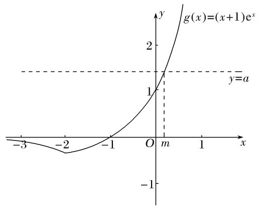

专题36   双变量不等式恒成立与能成立问题考点探析

考点一　单函数双任意型

【例题选讲】

<strong>[例1]</strong>　已知函数<em>f</em>(<em>x</em>)＝＋<em>ax</em>＋<em>b</em>的图象在点<em>A</em>(1，<em>f</em>（1）)处的切线与直线<em>l</em>：2<em>x</em>－4<em>y</em>＋3＝0平行．  
（1）求证：函数*y*＝*f*(*x*)在区间(1，e)上存在最大值；  
（2）记函数*g*(*x*)＝*xf*(*x*)＋*c*，若*g*(*x*)≤0对一切*x*∈(0，＋∞)，*b*∈恒成立，求实数*c*的取值范围．
解析　（1）由题意得*f*′(*x*)＝＋*a*．
因为函数图象在点*A*处的切线与直线*l*平行，且*l*的斜率为，
所以*f*′（1）＝，即1＋*a*＝，所以*a*＝－．
所以*f*′(*x*)＝－＝，所以*f*′（1）＝＞0，*f*′(e)＝－＜0．
因为<em>y</em>＝2－2ln <em>x</em>－<em>x</em>2在(1，e)上连续，
所以<em>f</em>′(<em>x</em>)在区间(1，e)上存在一个零点，设为<em>x</em>0，则<em>x</em>0∈(1，e)，且<em>f</em>′(<em>x</em>0)＝0．
当<em>x</em>∈(1，<em>x</em>0)时，<em>f</em>′(<em>x</em>)＞0，所以<em>f</em>(<em>x</em>)在(1，<em>x</em>0)上单调递增；
当<em>x</em>∈(<em>x</em>0，e)时，<em>f</em>′(<em>x</em>)＜0，所以<em>f</em>(<em>x</em>)在(<em>x</em>0，e)上单调递减．
所以当<em>x</em>＝<em>x</em>0时，函数<em>y</em>＝<em>f</em>(<em>x</em>)取得最大值．故函数<em>y</em>＝<em>f</em>(<em>x</em>)在区间(1，e)上存在最大值．  
（2）法一　因为<em>g</em>(<em>x</em>)＝ln <em>x</em>－<em>x</em>2＋<em>bx</em>＋<em>c</em>≤0对一切<em>x</em>∈(0，＋∞)，<em>b</em>∈恒成立，
所以<em>c</em>≤<em>x</em>2－<em>bx</em>－ln <em>x</em>．记<em>h</em>1(<em>x</em>)＝<em>x</em>2－<em>bx</em>－ln <em>x</em>(<em>x</em>＞0)，则<em>c</em>≤<em>h</em>1(<em>x</em>)min．

<em>h</em>′1(<em>x</em>)＝<em>x</em>－<em>b</em>－．令<em>h</em>′1(<em>x</em>)＝0，得<em>x</em>2－<em>bx</em>－1＝0，所以<em>x</em>1＝＜0(舍去)，<em>x</em>2＝．
因为<em>b</em>∈，所以<em>x</em>2＝∈(1，2)．
当0＜<em>x</em>＜<em>x</em>2时，<em>h</em>′1(<em>x</em>)＜0，<em>h</em>1(<em>x</em>)单调递减；当<em>x</em>＞<em>x</em>2时，<em>h</em>′1(<em>x</em>)＞0，<em>h</em>1(<em>x</em>)单调递增．
所以<em>h</em>1(<em>x</em>)min＝<em>h</em>1(<em>x</em>2)＝<em>x</em>－<em>bx</em>2－ln <em>x</em>2＝<em>x</em>＋1－<em>x</em>－ln <em>x</em>2＝－<em>x</em>－ln <em>x</em>2＋1．

记<em>h</em>2(<em>x</em>)＝－<em>x</em>2－ln <em>x</em>＋1．
因为<em>h</em>2(<em>x</em>)在(1，2)上单调递减，所以<em>h</em>2(<em>x</em>)＞<em>h</em>2（2）＝－1－ln 2．
所以*c*≤－1－ln 2，故*c*的取值范围是(－∞，－1－ln 2]．

法二　因为<em>g</em>(<em>x</em>)＝ln <em>x</em>－<em>x</em>2＋<em>bx</em>＋<em>c</em>≤0对一切<em>x</em>∈(0，＋∞)恒成立，所以<em>c</em>≤<em>x</em>2－<em>bx</em>－ln <em>x</em>．
设<em>h</em>1(<em>b</em>)＝－<em>xb</em>＋<em>x</em>2－ln <em>x</em>，因为<em>x</em>∈(0，＋∞)，则函数<em>h</em>1(<em>b</em>)在上为减函数，
所以<em>h</em>1(<em>b</em>)＞<em>h</em>＝<em>x</em>2－<em>x</em>－ln <em>x</em>，则对∀<em>x</em>∈(0，＋∞)，<em>c</em>≤<em>x</em>2－<em>x</em>－ln <em>x</em>恒成立，
设<em>h</em>2(<em>x</em>)＝<em>x</em>2－<em>x</em>－ln <em>x</em>，
则<em>h</em>′2(<em>x</em>)＝<em>x</em>－－＝＝，
令<em>h</em>′2(<em>x</em>)＝0，则<em>x</em>＝2，当0＜<em>x</em>＜2时，<em>f</em>′(<em>x</em>)＜0，函数单调递减；
当<em>x</em>＞2时，<em>f</em>′(<em>x</em>)＞0，函数单调递增，则<em>x</em>＝2时，<em>f</em>(<em>x</em>)min＝<em>f</em>（2）＝－－ln 2，
则*c*≤－1－ln 2，故*c*的取值范围是(－∞，－1－ln 2]．

<strong>[例2]</strong>　已知函数<em>f</em>(<em>x</em>)＝(log<em>ax</em>)2＋<em>x</em>－ln<em>x</em>(<em>a</em>&gt;1)．  
（1）求证：函数*f*(*x*)在(1，＋∞)上单调递增；  
（2）若关于*x*的方程|*f*(*x*)－*t*|＝1在(0，＋∞)上有三个零点，求实数*t*的值；  
（3）若对任意的<em>x</em>1，<em>x</em>2∈[<em>a</em>－1，<em>a</em>]，|<em>f</em>(<em>x</em>1)－<em>f</em>(<em>x</em>2)|≤e－1恒成立(e为自然对数的底数)，求实数<em>a</em>的取值范围．
解析　（1）因为函数<em>f</em>(<em>x</em>)＝(log<em>ax</em>)2＋<em>x</em>－ln <em>x</em>，所以<em>f</em>′(<em>x</em>)＝1－＋2log<em>ax</em>·．
因为<em>a</em>&gt;1，<em>x</em>&gt;1，所以<em>f</em>′(<em>x</em>)＝1－＋2log<em>ax</em>·&gt;0，所以函数<em>f</em>(<em>x</em>)在(1，＋∞)上单调递增．  
（2）因为当<em>a</em>&gt;1，0&lt;<em>x</em>&lt;1时，分别有1－&lt;0，2log<em>ax</em>·&lt;0，所以<em>f</em>′(<em>x</em>)&lt;0，

结合（1）可得<em>f</em>(<em>x</em>)min＝<em>f</em>（1），所以<em>t</em>－1＝<em>f</em>（1）＝1，故<em>t</em>＝2．  
（3）由（2）可知，函数<em>f</em>(<em>x</em>)在[<em>a</em>－1，1]上单调递减，在(1，<em>a</em>]上单调递增，所以<em>f</em>(<em>x</em>)min＝<em>f</em>（1）＝1，

<em>f</em>(<em>x</em>)max＝max{<em>f</em>(<em>a</em>－1)，<em>f</em>(<em>a</em>)}．<em>f</em>(<em>a</em>)－<em>f</em>(<em>a</em>－1)＝<em>a</em>－<em>a</em>－1－2ln <em>a</em>，
令<em>g</em>(<em>x</em>)＝<em>x</em>－<em>x</em>－1－2ln <em>x</em>(<em>x</em>&gt;1)，则<em>g</em>′(<em>x</em>)＝1＋<em>x</em>－2－＝≥0，
所以<em>g</em>(<em>a</em>)&gt;<em>g</em>（1）＝0，即<em>f</em>(<em>a</em>)－<em>f</em>(<em>a</em>－1)&gt;0，所以<em>f</em>(<em>x</em>)max＝<em>f</em>(<em>a</em>)，
所以问题等价于∀<em>x</em>1，<em>x</em>2∈[<em>a</em>－1，<em>a</em>]，

|<em>f</em>(<em>x</em>1)－<em>f</em>(<em>x</em>2)|max＝<em>f</em>(<em>a</em>)－<em>f</em>（1）＝<em>a</em>－ln <em>a</em>≤e－1．
由*h*(*x*)＝*x*－ln *x*的单调性，且*a*>1，解得1<*a*≤e，
所以实数*a*的取值范围为(1，e]．

<strong>[例3]</strong>　已知函数<em>f</em>(<em>x</em>)＝<em>x</em>2－<em>ax</em>＋2ln<em>x</em>．  
（1）若函数*y*＝*f*(*x*)在定义域上单调递增，求实数*a*的取值范围；  
（2）设<em>f</em>(<em>x</em>)有两个极值点<em>x</em>1，<em>x</em>2，若<em>x</em>1∈，且<em>f</em>(<em>x</em>1)≥<em>t</em>＋<em>f</em>(<em>x</em>2)恒成立，求实数<em>t</em>的取值范围．

<strong>思路</strong>　（1）转化为恒不等式问题，即<em>f</em>′(<em>x</em>)＝2<em>x</em>－<em>a</em>＋≥0在(0，＋∞)上恒成立，然后用分离参数＋最值分析法解决．（2）分离参数<em>t</em>，即<em>t</em>≤<em>f</em>(<em>x</em>1)－<em>f</em>(<em>x</em>2)，然后用条件<em>f</em>(<em>x</em>)有两个极值点<em>x</em>1，<em>x</em>2，进行消元，转化为一元不等式恒成立问题处理．

<strong>解析</strong>　（1）因为函数<em>y</em>＝<em>f</em>(<em>x</em>)在定义域上单调递增，所以<em>f</em>′(<em>x</em>)≥0，
即2*x*－*a*＋≥0在(0，＋∞)上恒成立，
所以*a*≤2*x*＋(*x*∈(0，＋∞))．而2*x*＋≥2＝4，
所以*a*≤4，所以实数*a*的取值范围是(－∞，4]．  
（2）因为<em>f</em>′(<em>x</em>)＝(<em>x</em>＞0)，由题意可得<em>x</em>1，<em>x</em>2为方程<em>f</em>′(<em>x</em>)＝0，
即2<em>x</em>2－<em>ax</em>＋2＝0(<em>x</em>＞0)的两个不同实根，所以<em>ax</em>1＝2<em>x</em>＋2，<em>ax</em>2＝2<em>x</em>＋2．
由根与系数的关系可得<em>x</em>1<em>x</em>2＝1．由已知0＜<em>x</em>1≤，则<em>x</em>2＝≥e．

而<em>f</em>(<em>x</em>1)－<em>f</em>(<em>x</em>2)＝(<em>x</em>－<em>ax</em>1＋2ln <em>x</em>1)－(<em>x</em>－<em>ax</em>2＋2ln <em>x</em>2)＝[<em>x</em>－(2<em>x</em>＋2)＋2ln <em>x</em>1]－[<em>x</em>－(2<em>x</em>＋2)＋2ln <em>x</em>2]

＝(－<em>x</em>－2＋2ln <em>x</em>1)－(－<em>x</em>－2＋2ln  <em>x</em>2)＝<em>x</em>－<em>x</em>＋2(ln <em>x</em>1－ln <em>x</em>2)＝<em>x</em>－<em>x</em>＋2ln

＝<em>x</em>－＋2ln ＝<em>x</em>－－2ln <em>x</em>(<em>x</em>2≥e)．
设<em>p</em>(<em>x</em>)＝<em>x</em>－－2ln <em>x</em>(<em>x</em>≥e2)，则<em>p</em>′(<em>x</em>)＝1＋－＝＝，
显然当<em>x</em>≥e2时，<em>p</em>′(<em>x</em>)＞0，函数<em>p</em>(<em>x</em>)单调递增，故<em>p</em>(<em>x</em>)≥<em>p</em>(e2)＝e2－－2ln e2＝e2－－4．
故<em>f</em>(<em>x</em>1)－<em>f</em>(<em>x</em>2)≥e2－－4，故<em>t</em>≤e2－－4．所以实数<em>t</em>的取值范围是．

<strong>悟通</strong>　（2）是双变量恒不等式问题，分离参数后通过消元，转化为一元不等式恒成立问题处理．但在<em>f</em>(<em>x</em>1)－<em>f</em>(<em>x</em>2)＝(<em>x</em>－<em>ax</em>1＋2ln <em>x</em>1)－(<em>x</em>－<em>ax</em>2＋2ln <em>x</em>2)中含有三个变量<em>x</em>1，<em>x</em>2与<em>a</em>，最终保留哪个？由于<em>x</em>1∈，消掉<em>x</em>2与<em>a</em>为佳，解答中是消掉<em>x</em>1与<em>a</em>，保留下<em>x</em>2也可以，但要注意<em>x</em>2的范围，由于<em>x</em>1，<em>x</em>2为<em>f</em>(<em>x</em>)的两个极值点，所以<em>ax</em>1＝2<em>x</em>＋2，<em>ax</em>2＝2<em>x</em>＋2．先消去<em>ax</em>1与<em>ax</em>2，再用韦达定理消去<em>x</em>1，此时构造函数<em>p</em>(<em>x</em>)＝<em>x</em>－－2ln <em>x</em>(<em>x</em>≥e2)，求的最小值．

<strong>[例4]</strong>　已知函数<em>f</em>(<em>x</em>)＝<em>x</em>－ln<em>x</em>，<em>g</em>(<em>x</em>)＝<em>x</em>2－<em>ax</em>．+X+K]  
（1）求函数*f*(*x*)在区间[*t*，*t*＋1](*t*＞0)上的最小值*m*(*t*)；  
（2）令<em>h</em>(<em>x</em>)＝<em>g</em>(<em>x</em>)－<em>f</em>(<em>x</em>)，<em>A</em>(<em>x</em>1，<em>h</em>(<em>x</em>1))，<em>B</em>(<em>x</em>2，<em>h</em>(<em>x</em>2))(<em>x</em>1≠<em>x</em>2)是函数<em>h</em>(<em>x</em>)图象上任意两点，且满足＞1，求实数<em>a</em>的取值范围；
解析　（1）*f*′(*x*)＝1－，*x*＞0，令*f*′(*x*)＝0，则*x*＝1．
当*t*≥1时，*f*(*x*)在[*t*，*t*＋1]上单调递增，*f*(*x*)的最小值为*f*(*t*)＝*t*－ln *t*；
当0＜*t*＜1时，*f*(*x*)在区间(*t*，1)上为减函数，在区间(1，*t*＋1)上为增函数，*f*(*x*)的最小值为*f*（1）＝1．

综上，*m*(*t*)＝  
（2）<em>h</em>(<em>x</em>)＝<em>x</em>2－(<em>a</em>＋1)<em>x</em>＋ln<em>x</em>，<em>x</em>＞0．不妨取0＜<em>x</em>1＜<em>x</em>2，则<em>x</em>1－<em>x</em>2＜0，
则由＞1，可得<em>h</em>(<em>x</em>1)－<em>h</em>(<em>x</em>2)＜<em>x</em>1－<em>x</em>2，变形得<em>h</em>(<em>x</em>1)－<em>x</em>1＜<em>h</em>(<em>x</em>2)－<em>x</em>2恒成立．
令<em>F</em>(<em>x</em>)＝<em>h</em>(<em>x</em>)－<em>x</em>＝<em>x</em>2－(<em>a</em>＋2)<em>x</em>＋ln <em>x</em>，<em>x</em>＞0，则<em>F</em>(<em>x</em>)＝<em>x</em>2－(<em>a</em>＋2)<em>x</em>＋ln <em>x</em>在(0，＋∞)上单调递增，
故*F*′(*x*)＝2*x*－(*a*＋2)＋≥0在(0，＋∞)上恒成立，所以2*x*＋≥*a*＋2在(0，＋∞)上恒成立．
因为2*x*＋≥2，当且仅当*x*＝时取“＝”，所以*a*≤2－2．
故*a*的取值范围为(－∞，2－2]．

<strong>[例5]</strong>　已知函数<em>f</em>(<em>x</em>)＝ln<em>x</em>＋<em>ax</em>2－3<em>x</em>．  
（1）若函数*f*(*x*)的图象在点(1，*f*（1）)处的切线方程为*y*＝－2，求函数*f*(*x*)的极小值；  
（2）若<em>a</em>＝1，对于任意<em>x</em>1，<em>x</em>2∈[1，10]，当<em>x</em>1&lt;<em>x</em>2时，不等式<em>f</em>(<em>x</em>1)－<em>f</em>(<em>x</em>2)&gt;恒成立，求实数<em>m</em>的取值范围．
解析　（1）<em>f</em>(<em>x</em>)＝ln <em>x</em>＋<em>ax</em>2－3<em>x</em>的定义域为(0，＋∞)，<em>f</em>′(<em>x</em>)＝＋2<em>ax</em>－3．
由函数*f*(*x*)的图象在点(1，*f*（1）)处的切线方程为*y*＝－2，得*f*′（1）＝1＋2*a*－3＝0，解得*a*＝1．
此时*f*′(*x*)＝＋2*x*－3＝．令*f*′(*x*)＝0，得*x*＝1或*x*＝．
当*x*∈和*x*∈(1，＋∞)时，*f*′(*x*)>0；当*x*∈时，*f*′(*x*)<0．
所以函数*f*(*x*)在和(1，＋∞)上单调递增，在上单调递减，
所以当*x*＝1时，函数*f*(*x*)取得极小值*f*（1）＝ln 1＋1－3＝－2．  
（2）由<em>a</em>＝1得<em>f</em>(<em>x</em>)＝ln <em>x</em>＋<em>x</em>2－3<em>x</em>．因为对于任意<em>x</em>1，<em>x</em>2∈[1，10]，
当<em>x</em>1&lt;<em>x</em>2时，<em>f</em>(<em>x</em>1)－<em>f</em>(<em>x</em>2)&gt;恒成立，所以对于任意<em>x</em>1，<em>x</em>2∈[1，10]，
当<em>x</em>1&lt;<em>x</em>2时，<em>f</em>(<em>x</em>1)－&gt;<em>f</em>(<em>x</em>2)－恒成立，所以函数<em>y</em>＝<em>f</em>(<em>x</em>)－在[1，10]上单调递减．
令<em>h</em>(<em>x</em>)＝<em>f</em>(<em>x</em>)－＝ln <em>x</em>＋<em>x</em>2－3<em>x</em>－，<em>x</em>∈[1，10]，
所以<em>h</em>′(<em>x</em>)＝＋2<em>x</em>－3＋≤0在[1，10]上恒成立，则<em>m</em>≤－2<em>x</em>3＋3<em>x</em>2－<em>x</em>在[1，10]上恒成立．
设<em>F</em>(<em>x</em>)＝－2<em>x</em>3＋3<em>x</em>2－<em>x</em>(<em>x</em>∈[1，10])，则<em>F</em>′(<em>x</em>)＝－6<em>x</em>2＋6<em>x</em>－1＝－6＋．
当*x*∈[1，10]时，*F*′(*x*)<0，所以函数*F*(*x*)在[1，10]上单调递减，
所以<em>F</em>(<em>x</em>)min＝<em>F</em>（10）＝－2×103＋3×102－10＝－1 710，所以<em>m</em>≤－1 710，
故实数*m*的取值范围为(－∞，－1 710]．

<strong>悟通</strong>　（1）利用<em>f</em>′（1）＝0，得<em>a</em>的方程，解方程求<em>a</em>的值，再求<em>f</em>′(<em>x</em>)＝0的实数解，并判断在实数解的两侧<em>f</em>(<em>x</em>)的导数值符号，得<em>f</em>(<em>x</em>)的极值．  
（2）“双变量不等式”变“单变量不等式”：双变量不等式“<em>f</em>(<em>x</em>1)－<em>f</em>(<em>x</em>2)&gt;”可化为“<em>f</em>(<em>x</em>1)－&gt;<em>f</em>(<em>x</em>2)－”，只需构造函数<em>h</em>(<em>x</em>)＝<em>f</em>(<em>x</em>)－，判断其在[1，10]上单调递减，从而转化为单变量不等式“<em>h</em>′(<em>x</em>)＝＋2<em>x</em>－3＋≤0在[1，10]上恒成立”．分离参数<em>m</em>，构造新函数，借助函数最值求<em>m</em>的取值范围．

【对点训练】

1．已知函数*f*(*x*)＝*a*ln*x*＋*x*－，其中*a*为实常数．  
（1）若*x*＝是*f*(*x*)的极大值点，求*f*(*x*)的极小值；  
（2）若不等式*a*ln*x*－≤*b*－*x*对任意－≤*a*≤0，≤*x*≤2恒成立，求*b*的最小值．

1．解析　（1）<em>f</em>′(<em>x</em>)＝，由题意知<em>x</em>&gt;0．由<em>f</em>′＝0，得2＋<em>a</em>＋1＝0，
所以*a*＝－，此时*f*(*x*)＝－ln *x*＋*x*－．则*f*′(*x*)＝＝．
所以*f*(*x*)在上为减函数，在[2，＋∞)上为增函数．
所以*x*＝2为极小值点，极小值*f*（2）＝－．  
（2）不等式<em>a</em>ln <em>x</em>－≤<em>b</em>－<em>x</em>即为<em>f</em>(<em>x</em>)≤<em>b</em>，所以<em>b</em>≥<em>f</em>(<em>x</em>)max对任意－≤<em>a</em>≤0，≤<em>x</em>≤2恒成立．

①若1≤*x*≤2，则ln *x*≥0，*f*(*x*)＝*a*ln *x*＋*x*－≤*x*－≤2－＝．当*a*＝0，*x*＝2时取等号．

②若≤*x*<1，则ln *x*<0，*f*(*x*)＝*a*ln *x*＋*x*－≤－ln *x*＋*x*－．
由（1）可知*g*(*x*)＝－ln *x*＋*x*－在上为减函数．所以当≤*x*<1时，*g*(*x*)≤*g*＝ln 2－．
因为ln 2－&lt;－＝1&lt;，所以<em>f</em>(<em>x</em>)≤．综上，<em>f</em>(<em>x</em>)max＝．于是<em>b</em>min＝．

2．设函数<em>f</em>(<em>x</em>)＝e<em>mx</em>＋<em>x</em>2－<em>mx</em>．  
（1）证明：*f*(*x*)在(－∞，0)单调递减，在(0，＋∞)单调递增；  
（2）若对于任意<em>x</em>1，<em>x</em>2∈[－1，1]，都有|<em>f</em>(<em>x</em>1)－<em>f</em>(<em>x</em>2)|≤e－1，求<em>m</em>的取值范围．

2．解析　（1）<em>f</em>′(<em>x</em>)＝<em>m</em>(e<em>mx</em>－1)＋2<em>x</em>．
若<em>m</em>≥0，则当<em>x</em>∈(－∞，0)时，e<em>mx</em>－1≤0，<em>f</em>′(<em>x</em>)＜0；当<em>x</em>∈(0，＋∞)时，e<em>mx</em>－1≥0，<em>f</em>′(<em>x</em>)＞0．
若<em>m</em>＜0，则当<em>x</em>∈(－∞，0)时，e<em>mx</em>－1＞0，<em>f</em>′(<em>x</em>)＜0；当<em>x</em>∈(0，＋∞)时，e<em>mx</em>－1＜0，<em>f</em>′(<em>x</em>)＞0．
所以，*f*(*x*)在(－∞，0)单调递减，在(0，＋∞)单调递增．  
（2）由（1）知，对任意的*m*，*f*(*x*)在[－1，0]单调递减，在[0，1]单调递增，故*f*(*x*)在*x*＝0处取得最小值．
所以对于任意<em>x</em>1，<em>x</em>2∈[－1，1]，|<em>f</em>(<em>x</em>1)－<em>f</em>(<em>x</em>2)|≤e－1的充要条件是
即①
设函数<em>g</em>(<em>t</em>)＝e<em>t</em>－<em>t</em>－e＋1，则<em>g</em>′(<em>t</em>)＝e<em>t</em>－1．当<em>t</em>＜0时，<em>g</em>′(<em>t</em>)＜0；当<em>t</em>＞0时，<em>g</em>′(<em>t</em>)＞0．
故*g*(*t*)在(－∞，0)单调递减，在(0，＋∞)单调递增．
又<em>g</em>（1）＝0，<em>g</em>(－1)＝e－1＋2－e＜0，故当<em>t</em>∈[－1，1]时，<em>g</em>(<em>t</em>)≤0．
当*m*∈[－1，1]时，*g*(*m*)≤0，*g*(－*m*)≤0，即①式成立；
当<em>m</em>＞1时，由<em>g</em>(<em>t</em>)的单调性，<em>g</em>(<em>m</em>)＞0，即e<em>m</em>－<em>m</em>＞e－1；
当<em>m</em>＜－1时，<em>g</em>(－<em>m</em>)＞0，即e－<em>m</em>＋<em>m</em>＞e－1．

综上，*m*的取值范围是[－1，1]．

3．设函数<em>f</em>(<em>x</em>)＝<em>x</em>2＋<em>ax</em>－ln<em>x</em>(<em>a</em>∈<strong>R</strong>)．  
（1）当*a*＝1时，求函数*f*(*x*)的极值；  
（2）若对任意<em>a</em>∈(4，5)及任意<em>x</em>1，<em>x</em>2∈[1，2]，恒有<em>m</em>＋ln2&gt;|<em>f</em>(<em>x</em>1)－<em>f</em>(<em>x</em>2)|成立，求实数<em>m</em>的取值范围．

3．解析　（1）由题意知函数*f*(*x*)的定义域为(0，＋∞)．
当*a*＝1时，*f*(*x*)＝*x*－ln *x*，*f*′(*x*)＝1－＝，
当0<*x*<1时，*f*′(*x*)<0，*f*(*x*)单调递减，当*x*>1时，*f*′(*x*)>0，*f*(*x*)单调递增，
∴函数*f*(*x*)的极小值为*f*（1）＝1，无极大值．  
（2）由题意知*f*′(*x*)＝(1－*a*)*x*＋*a*－＝，
当*a*∈(4，5)时，1－*a*<－3，0<<，
∴在区间[1，2]上，*f*′(*x*)≤0，则*f*(*x*)单调递减，*f*（1）是*f*(*x*)的最大值，*f*（2）是*f*(*x*)的最小值．
∴|<em>f</em>(<em>x</em>1)－<em>f</em>(<em>x</em>2)|≤<em>f</em>（1）－<em>f</em>（2）＝－＋ln 2．
∵对任意<em>a</em>∈(4，5)及任意<em>x</em>1，<em>x</em>2∈[1，2]，恒有<em>m</em>＋ln 2&gt;|<em>f</em>(<em>x</em>1)－<em>f</em>(<em>x</em>2)|成立，
∴*m*＋ln 2>－＋ln 2，得*m*>．
∵*a*∈(4，5)，∴＝1－<1－＝，
∴*m*≥，故实数*m*的取值范围是[，＋∞)．

4．已知函数*f*(*x*)＝ln*x*(其中e为自然对数的底数)．  
（1）证明：*f*(*x*)≤*f*(e)；  
（2）对任意正实数*x*、*y*，不等式*a*(ln*y*－ln*x*)－2*x*≤0恒成立，求正实数*a*的最大值．

4．解析　（1）*f*′(*x*)＝－ln *x*＋＝－ln *x*＋－＝，
令*g*(*x*)＝－*x*ln *x*＋2e－*x*，*g*′(*x*)＝－ln *x*＋(－*x*)·－1＝－ln *x*－2，
在(0，e－2)上，<em>g</em>′(<em>x</em>)＞0，<em>g</em>(<em>x</em>)单调递增，在(e－2，＋∞)上，<em>g</em>′(<em>x</em>)＜0，<em>g</em>(<em>x</em>)单调递减，
所以<em>g</em>(<em>x</em>)max＝<em>g</em>(e－2)＝－e－2ln e－2＋2e－e－2＝2e－2＋2e－e－2＝e－2＋2e＞0，
又因为*x*→0时，*g*(*x*)→0；*g*(e)＝0，
所以在(0，e)上，*g*(*x*)＞0，*f*′(*x*)＞0，*f*(*x*)单调递增，在(e，＋∞)上，*g*(*x*)＜0，*f*′(*x*)＜0，*f*(*x*)单调递减，
所以<em>f</em>(<em>x</em>)max＝<em>f</em>(e)，即<em>f</em>(<em>x</em>)≤<em>f</em>(e)．  
（2）因为*x*，*y*，*a*，都大于0，由*a*(ln *y*－ln *x*)－2*x*≤0两边同除以*ax*整理得：≥ln ，
令＝<em>t</em>(<em>t</em>＞0)，所以≥ln <em>t</em>恒成立，记<em>h</em>(<em>t</em>)＝ln <em>t</em>，则≥<em>h</em>(<em>t</em>)max，
由（1）知<em>h</em>(<em>t</em>)max＝<em>g</em>(e)＝1，所以≥1，即0＜<em>a</em>≤2，<em>a</em>max＝2．
所以正实数*a*的最大值是2．

5．设函数<em>f</em>(<em>x</em>)＝ln<em>x</em>＋，<em>k</em>∈<strong>R</strong>．  
（1）若曲线*y*＝*f*(*x*)在点(e，*f*(e))处的切线与直线*x*－2＝0垂直，求*f*(*x*)的单调性和极小值(其中e为自然对数的底数)；  
（2）若对任意的<em>x</em>1&gt;<em>x</em>2&gt;0，<em>f</em>(<em>x</em>1)－<em>f</em>(<em>x</em>2)&lt;<em>x</em>1－<em>x</em>2恒成立，求<em>k</em>的取值范围．

5．解析　（1）由条件得*f*′(*x*)＝－(*x*>0)，
∵曲线*y*＝*f*(*x*)在点(e，*f*(e))处的切线与直线*x*－2＝0垂直，∴*f*′(e)＝0，即－＝0，得*k*＝e，
∴*f*′(*x*)＝－＝(*x*>0)，由*f*′(*x*)<0得0<*x*<e，由*f*′(*x*)>0得*x*>e，
∴*f*(*x*)在(0，e)上单调递减，在(e，＋∞)上单调递增．
当*x*＝e时，*f*(*x*)取得极小值，且*f*(e)＝ln e＋＝2．∴*f*(*x*)的极小值为2．  
（2）由题意知，对任意的<em>x</em>1&gt;<em>x</em>2&gt;0，<em>f</em>(<em>x</em>1)－<em>f</em>(<em>x</em>2)&lt;<em>x</em>1－<em>x</em>2恒成立，即<em>f</em>(<em>x</em>1)－<em>x</em>1&lt;<em>f</em>(<em>x</em>2)－<em>x</em>2恒成立，
设*h*(*x*)＝*f*(*x*)－*x*＝ln *x*＋－*x*(*x*>0)，则*h*(*x*)在(0，＋∞)上单调递减，
∴<em>h</em>′(<em>x</em>)＝－－1≤0在(0，＋∞)上恒成立，即当<em>x</em>&gt;0时，<em>k</em>≥－<em>x</em>2＋<em>x</em>＝－2＋恒成立，
∴*k*≥．故*k*的取值范围是．

6．已知函数*f*(*x*)＝*x*－1－*a*ln*x*(*a*<0)．  
（1）讨论函数*f*(*x*)的单调性；  
（2）若对于任意的<em>x</em>1，<em>x</em>2∈(0，1]，且<em>x</em>1≠<em>x</em>2，都有|<em>f</em>(<em>x</em>1)－<em>f</em>(<em>x</em>2)|&lt;4，求实数<em>a</em>的取值范围．

6．解析　（1）由题意知*f*′(*x*)＝1－＝(*x*>0)，
因为*x*>0，*a*<0，所以*f*′(*x*)>0，所以*f*(*x*)在(0，＋∞)上单调递增．  
（2）不妨设0&lt;<em>x</em>1&lt;<em>x</em>2≤1，则&gt;&gt;0，由（1）知<em>f</em>(<em>x</em>1)&lt;<em>f</em>(<em>x</em>2)，
所以|<em>f</em>(<em>x</em>1)－<em>f</em>(<em>x</em>2)|&lt;4⇔<em>f</em>(<em>x</em>2)－<em>f</em>(<em>x</em>1)&lt;4⇔<em>f</em>(<em>x</em>1)＋&gt;<em>f</em>(<em>x</em>2)＋．
设<em>g</em>(<em>x</em>)＝<em>f</em>(<em>x</em>)＋，<em>x</em>∈(0，1]，|<em>f</em>(<em>x</em>1)－<em>f</em>(<em>x</em>2)|&lt;4等价于<em>g</em>(<em>x</em>)在(0，1]上单调递减，
所以*g*′(*x*)≤0在(0，1]上恒成立⇔1－－＝≤0在(0，1]上恒成立⇔*a*≥*x*－在(0，1]上恒成立，

易知*y*＝*x*－在(0，1]上单调递增，其最大值为－3．因为*a*<0，所以－3≤*a*<0，
所以实数*a*的取值范围为[－3，0)．

7．设<em>f</em>(<em>x</em>)＝e<em>x</em>－<em>a</em>(<em>x</em>＋1)．  
（1）若∀<em>x</em>∈<strong>R</strong>，<em>f</em>(<em>x</em>)≥0恒成立，求正实数<em>a</em>的取值范围；  
（2）设<em>g</em>(<em>x</em>)＝<em>f</em>(<em>x</em>)＋，且<em>A</em>(<em>x</em>1，<em>y</em>1)，<em>B</em>(<em>x</em>2，<em>y</em>2)(<em>x</em>1≠<em>x</em>2)是曲线<em>y</em>＝<em>g</em>(<em>x</em>)上任意两点，若对任意的<em>a</em>≤－1，直线<em>AB</em>的斜率恒大于常数<em>m</em>，求<em>m</em>的取值范围．

7．解析　（1）因为<em>f</em>(<em>x</em>)＝e<em>x</em>－<em>a</em>(<em>x</em>＋1)，所以<em>f</em>′(<em>x</em>)＝e<em>x</em>－<em>a</em>．
由题意，知<em>a</em>＞0，故由<em>f</em>′(<em>x</em>)＝e<em>x</em>－<em>a</em>＝0，解得<em>x</em>＝ln <em>a</em>．
故当*x*∈(－∞，ln *a*)时，*f*′(*x*)＜0，函数*f*(*x*)单调递减；当*x*∈(ln *a*，＋∞)时，*f*′(*x*)＞0，函数*f*(*x*)单调递增．
所以函数<em>f</em>(<em>x</em>)的最小值为<em>f</em>(ln<em>a</em>)＝eln <em>a</em>－<em>a</em>(ln<em>a</em>＋1)＝－<em>a</em>ln<em>a</em>．
由题意，若∀<em>x</em>∈R，<em>f</em>(<em>x</em>)≥0恒成立，即<em>f</em>(<em>x</em>)＝e<em>x</em>－<em>a</em>(<em>x</em>＋1)≥0恒成立，故有－<em>a</em>ln<em>a</em>≥0，
又*a*＞0，所以ln *a*≤0，解得0＜*a*≤1．所以正实数*a*的取值范围为(0，1]．  
（2）设<em>x</em>1，<em>x</em>2是任意的两个实数，且<em>x</em>1＜<em>x</em>2．则直线<em>AB</em>的斜率为<em>k</em>＝，
由已知*k*＞*m*，即＞*m*．
因为<em>x</em>2－<em>x</em>1＞0，所以<em>g</em>(<em>x</em>2)－<em>g</em>(<em>x</em>1)＞<em>m</em>(<em>x</em>2－<em>x</em>1)，即<em>g</em>(<em>x</em>2)－<em>mx</em>2＞<em>g</em>(<em>x</em>1)－<em>mx</em>1．
因为<em>x</em>1＜<em>x</em>2，所以函数<em>h</em>(<em>x</em>)＝<em>g</em>(<em>x</em>)－<em>mx</em>在<strong>R</strong>上为增函数，故有<em>h</em>′(<em>x</em>)＝<em>g</em>′(<em>x</em>)－<em>m</em>≥0恒成立，所以<em>m</em>≤<em>g</em>′(<em>x</em>)．

而<em>g</em>′(<em>x</em>)＝e<em>x</em>－<em>a</em>－，又<em>a</em>≤－1＜0，故<em>g</em>′(<em>x</em>)＝e<em>x</em>＋－<em>a</em>≥2－<em>a</em>＝2－<em>a</em>．

而2－<em>a</em>＝2＋()2＝(＋1)2－1≥3，所以<em>m</em>的取值范围为(－∞，3]．

考点二　双函数双任意型

【例题选讲】

<strong>[例6]</strong>　已知函数<em>f</em>(<em>x</em>)＝ln<em>x</em>－<em>ax</em>，<em>g</em>(<em>x</em>)＝<em>ax</em>2＋1，其中e为自然对数的底数．  
（1）讨论函数*f*(*x*)在区间[1，e]上的单调性；  
（2）已知<em>a</em>∉(0，e)，若对任意<em>x</em>1，<em>x</em>2∈[1，e]，有<em>f</em>(<em>x</em>1)&gt;<em>g</em>(<em>x</em>2)，求实数<em>a</em>的取值范围．
解析　（1）*f*′(*x*)＝－*a*＝，

①当*a*≤0时，1－*ax*>0，则*f*′(*x*)>0，*f*(*x*)在[1，e]上单调递增；
②当0<*a*≤时，≥e，则*f*′(*x*)≥0，*f*(*x*)在[1，e]上单调递增；
③当<*a*<1时，1<<e，当*x*∈时，*f*′(*x*)≥0，*f*(*x*)在上单调递增，
当*x*∈时，*f*′(*x*)≤0，*f*(*x*)在上单调递减；
④当*a*≥1时，0<≤1，则*f*′(*x*)≤0，*f*(*x*)在[1，e]上单调递减．
综上所述，当*a*≤时，*f*(*x*)在[1，e]上单调递增；当<*a*<1时，*f*(*x*)在上单调递增，在上单调递减；当*a*≥1时，*f*(*x*)在[1，e]上单调递减．  
（2）<em>g</em>′(<em>x</em>)＝2<em>ax</em>，依题意知，<em>x</em>∈[1，e]时，<em>f</em>(<em>x</em>)min&gt;<em>g</em>(<em>x</em>)max恒成立．已知<em>a</em>∉(0，e)，则

①当*a*≤0时，*g*′(*x*)≤0，所以*g*(*x*)在[1，e]上单调递减，而*f*(*x*)在[1，e]上单调递增，
所以<em>f</em>(<em>x</em>)min＝<em>f</em>（1）＝－<em>a</em>，<em>g</em>(<em>x</em>)max＝<em>g</em>（1）＝<em>a</em>＋1，所以－<em>a</em>&gt;<em>a</em>＋1，得<em>a</em>&lt;－；
②当*a*≥e时，*g*′(*x*)>0，所以*g*(*x*)在[1，e]上单调递增，而*f*(*x*)在[1，e]上单调递减，
所以<em>g</em>(<em>x</em>)max＝<em>g</em>(e)＝<em>a</em>e2＋1，<em>f</em>(<em>x</em>)min＝<em>f</em>(e)＝1－<em>a</em>e，所以1－<em>a</em>e&gt;<em>a</em>e2＋1，得<em>a</em>&lt;0，与<em>a</em>≥e矛盾．
综上所述，实数*a*的取值范围是．

<strong>[例7]</strong>　已知函数<em>f</em>(<em>x</em>)＝＋<em>x</em>－1，<em>g</em>(<em>x</em>)＝ln <em>x</em>＋(e为自然对数的底数)．  
（1）证明：*f*(*x*)≥*g*(*x*)；  
（2）若对于任意的<em>x</em>1，<em>x</em>2∈[1，<em>a</em>](<em>a</em>&gt;1)，总有|<em>f</em>(<em>x</em>1)－<em>g</em>(<em>x</em>2)|≤－＋1，求<em>a</em>的最大值．
解析　（1）令*F*(*x*)＝*f*(*x*)－*g*(*x*)＝＋*x*－ln *x*－1－，
∴<em>F</em>′(<em>x</em>)＝＋1－＝(<em>x</em>－1)．∵<em>x</em>&gt;0，∴e<em>x</em>&gt;<em>x</em>＋1，
∴<em>F</em>(<em>x</em>)在(0，1)上单调递减，在(1，＋∞)上单调递增，∴<em>F</em>(<em>x</em>)min＝<em>F</em>（1）＝0，∴<em>f</em>(<em>x</em>)≥<em>g</em>(<em>x</em>)．  
（2）∵*x*∈[1，*a*]，*f*′(*x*)＝＋1>0，*g*′(*x*)＝>0，∴*f*(*x*)，*g*(*x*)均在[1，*a*]上单调递增．
∵*f*(*x*)≥*g*(*x*)，*F*(*x*)＝*f*(*x*)－*g*(*x*)在[1，＋∞)上单调递增，
∴*f*(*x*)与*g*(*x*)的图象在[1，*a*]上的距离随*x*增大而增大，
∴|<em>f</em>(<em>x</em>1)－<em>g</em>(<em>x</em>2)|max＝<em>f</em>(<em>a</em>)－<em>g</em>（1）≤－＋1，∴＋<em>a</em>≤＋2，
设*G*(*a*)＝＋*a*(*a*>1)，*G*′(*a*)＝＋1＝，
∵当<em>a</em>&gt;1时，e<em>a</em>&gt;<em>a</em>＋1，∴当<em>a</em>&gt;1时，<em>G</em>′(<em>a</em>)&gt;0，<em>G</em>(<em>a</em>)在[1，＋∞)上单调递增，∴<em>a</em>≤2，
∴*a*的最大值为2．

<strong>[例8]</strong>　已知函数<em>f</em>(<em>x</em>)＝<em>x</em>2－2<em>a</em>ln<em>x</em>(<em>a</em>∈<strong>R</strong>)，<em>g</em>(<em>x</em>)＝2<em>ax</em>.  
（1）求函数*f*(*x*)的极值；  
（2）若0＜<em>a</em>＜1，对于区间[1，2]上的任意两个不相等的实数<em>x</em>1，<em>x</em>2，都有|<em>f</em>(<em>x</em>1)－<em>f</em>(<em>x</em>2)|＞|<em>g</em>(<em>x</em>1)－<em>g</em>(<em>x</em>2)|成立，求实数<em>a</em>的取值范围.
解析　（1）*f*(*x*)的定义域为(0，＋∞)，*f*′(*x*)＝2*x*－．
当*a*≤0时，显然*f*′(*x*)＞0恒成立，故*f*(*x*)无极值；
当*a*＞0时，由*f*′(*x*)＜0，得0＜*x*＜，*f*(*x*)在(0，)上单调递减；
由*f*′(*x*)＞0，得*x*＞，*f*(*x*)在(，＋∞)上单调递增．
故*f*(*x*)有极小值*f*()＝*a*－*a*ln *a*，无极大值．

综上，<em>a</em>≤0时，<em>f</em>(<em>x</em>)无极值；<em>a</em>＞0时，<em>f</em>(<em>x</em>)极小值＝<em>a</em>－<em>a</em>ln <em>a</em>，无极大值．  
（2）不妨令1≤<em>x</em>1＜<em>x</em>2≤2，因为0＜<em>a</em>＜1，所以<em>g</em>(<em>x</em>1)＜<em>g</em>(<em>x</em>2)．由（1）可知<em>f</em>(<em>x</em>1)＜<em>f</em>(<em>x</em>2)，

因为|<em>f</em>(<em>x</em>1)－<em>f</em>(<em>x</em>2)|＞|<em>g</em>(<em>x</em>1)－<em>g</em>(<em>x</em>2)|，所以<em>f</em>(<em>x</em>2)－<em>f</em>(<em>x</em>1)＞<em>g</em>(<em>x</em>2)－<em>g</em>(<em>x</em>1)，即<em>f</em>(<em>x</em>2)－<em>g</em>(<em>x</em>2)＞<em>f</em>(<em>x</em>1)－<em>g</em>(<em>x</em>1)，
所以<em>h</em>(<em>x</em>)＝<em>f</em>(<em>x</em>)－<em>g</em>(<em>x</em>)＝<em>x</em>2－2<em>a</em>ln <em>x</em>－2<em>ax</em>在[1，2]上单调递增，
所以*h*′(*x*)＝2*x*－－2*a*≥0在[1，2]上恒成立，即*a*≤在[1，2]上恒成立．
令*t*＝*x*＋1∈[2，3]，则＝*t*＋－2≥，所以*a*∈．
故实数*a*的取值范围为．

【对点训练】

8．已知两个函数<em>f</em>(<em>x</em>)＝7<em>x</em>2－28<em>x</em>－<em>c</em>，<em>g</em>(<em>x</em>)＝2<em>x</em>3＋4<em>x</em>2－40<em>x．</em>若对任意<em>x</em>1，<em>x</em>2∈[－3，3]，都有<em>f</em>(<em>x</em>1)≤<em>g</em>(<em>x</em>2)

成立，求实数*c*的取值范围．

8．解析　由对任意<em>x</em>1，<em>x</em>2∈[－3，3]，都有<em>f</em>(<em>x</em>1)≤<em>g</em>(<em>x</em>2)成立，得<em>f</em>(<em>x</em>1)max≤<em>g</em>(<em>x</em>2)min，
因为<em>f</em>(<em>x</em>)＝7<em>x</em>2－28<em>x</em>－<em>c</em>＝7(<em>x</em>－2)2－28－<em>c</em>，所以当<em>x</em>1∈[－3，3]时，<em>f</em>(<em>x</em>1)max＝<em>f</em>(－3)＝147－<em>c</em>，
因为<em>g</em>(<em>x</em>)＝2<em>x</em>3＋4<em>x</em>2－40<em>x</em>，所以<em>g</em>′(<em>x</em>)＝6<em>x</em>2＋8<em>x</em>－40＝2(3<em>x</em>＋10)(<em>x</em>－2)，
当*x*∈(－3，2)，则*g*′(*x*)<0，当*x*∈(2，3)，则*g*′(*x*)>0，
所以*f*(*x*)在(－3，2)上单调递减；*f*(*x*)在(2，3)上单调递增．

易得<em>g</em>(<em>x</em>)min＝<em>g</em>（2）＝－48，故147－<em>c</em>≤－48，即<em>c</em>≥195．
故实数*c*的取值范围是[195，＋∞)．

9．已知函数<em>f</em>(<em>x</em>)＝<em>x</em>－1－<em>a</em>ln <em>x</em>(<em>a</em>∈<strong>R</strong>)，<em>g</em>(<em>x</em>)＝．  
（1）当*a*＝－2时，求曲线*y*＝*f*(*x*)在*x*＝1处的切线方程；  
（2）若<em>a</em>&lt;0，且对任意<em>x</em>1，<em>x</em>2∈(0，1]，都有|<em>f</em>(<em>x</em>1)－<em>f</em>(<em>x</em>2)|&lt;4×|<em>g</em>(<em>x</em>1)－<em>g</em>(<em>x</em>2)|，求实数<em>a</em>的取值范围．

9．解析　（1）当*a*＝－2时，*f*(*x*)＝*x*－1＋2ln *x*，*f*′(*x*)＝1＋，*f*（1）＝0，切线的斜率*k*＝*f*′（1）＝3，
故曲线*y*＝*f*(*x*)在*x*＝1处的切线方程为3*x*－*y*－3＝0．  
（2）对*x*∈(0，1]，当*a*<0时，*f*′(*x*)＝1－>0，∴*f*(*x*)在(0，1]上单调递增，

易知*g*(*x*)＝在(0，1]上单调递减，
不妨设<em>x</em>1，<em>x</em>2∈(0，1]，且<em>x</em>1&lt;<em>x</em>2，<em>f</em>(<em>x</em>1)&lt;<em>f</em>(<em>x</em>2)，<em>g</em>(<em>x</em>1)&gt;<em>g</em>(<em>x</em>2)，
∴<em>f</em>(<em>x</em>2)－<em>f</em>(<em>x</em>1)&lt;4×[<em>g</em>(<em>x</em>1)－<em>g</em>(<em>x</em>2)]，即<em>f</em>(<em>x</em>1)＋&gt;<em>f</em>(<em>x</em>2)＋．
令<em>h</em>(<em>x</em>)＝<em>f</em>(<em>x</em>)＋，则当<em>x</em>1&lt;<em>x</em>2时，有<em>h</em>(<em>x</em>1)&gt;<em>h</em>(<em>x</em>2)，∴<em>h</em>(<em>x</em>)在(0，1]上单调递减，
∴*h*′(*x*)＝1－－＝≤0在(0，1]上恒成立，
∴<em>x</em>2－<em>ax</em>－4≤0在(0，1]上恒成立，等价于<em>a</em>≥<em>x</em>－在(0，1]上恒成立，∴只需<em>a</em>≥(<em>x</em>－)max．
∵<em>y</em>＝<em>x</em>－在(0，1]上单调递增，∴<em>y</em>max＝－3，∴－3≤<em>a</em>&lt;0，故实数<em>a</em>的取值范围为[－3，0)．

10．设<em>f</em>(<em>x</em>)＝<em>x</em>e<em>x</em>，<em>g</em>(<em>x</em>)＝<em>x</em>2＋<em>x</em>．  
（1）令*F*(*x*)＝*f*(*x*)＋*g*(*x*)，求*F*(*x*)的最小值；  
（2）若任意<em>x</em>1，<em>x</em>2∈[－1，＋∞)，且<em>x</em>1&gt;<em>x</em>2，有<em>m</em>[<em>f</em>(<em>x</em>1)－<em>f</em>(<em>x</em>2)]&gt;<em>g</em>(<em>x</em>1)－<em>g</em>(<em>x</em>2)恒成立，求实数<em>m</em>的取值范围．

10．解析　（1）因为<em>F</em>(<em>x</em>)＝<em>f</em>(<em>x</em>)＋<em>g</em>(<em>x</em>)＝<em>x</em>e<em>x</em>＋<em>x</em>2＋<em>x</em>，所以<em>F</em>′(<em>x</em>)＝(<em>x</em>＋1)(e<em>x</em>＋1)，
令*F*′(*x*)>0，解得*x*>－1，令*F*′(*x*)<0，解得*x*<－1，
所以*F*(*x*)在(－∞，－1)上单调递减，在(－1，＋∞)上单调递增．
故<em>F</em>(<em>x</em>)min＝<em>F</em>(－1)＝－－<em>．</em>  
（2）因为任意<em>x</em>1，<em>x</em>2∈[－1，＋∞)，且<em>x</em>1&gt;<em>x</em>2，有<em>m</em>[<em>f</em>(<em>x</em>1)－<em>f</em>(<em>x</em>2)]&gt;<em>g</em>(<em>x</em>1)－<em>g</em>(<em>x</em>2)恒成立，
所以<em>mf</em>(<em>x</em>1)－<em>g</em>(<em>x</em>1)&gt;<em>mf</em>(<em>x</em>2)－<em>g</em>(<em>x</em>2)恒成立．
令<em>h</em>(<em>x</em>)＝<em>mf</em>(<em>x</em>)－<em>g</em>(<em>x</em>)＝<em>mx</em>e<em>x</em>－<em>x</em>2－<em>x</em>，<em>x</em>∈[－1，＋∞)，即只需<em>h</em>(<em>x</em>)在[－1，＋∞)上单调递增即可．
故<em>h</em>′(<em>x</em>)＝(<em>x</em>＋1)(<em>m</em>e<em>x</em>－1)≥0在[－1，＋∞)上恒成立，故<em>m</em>≥，而≤e，故<em>m</em>≥e，
即实数*m*的取值范围是[e，＋∞)．

考点三　任意存在型

【例题选讲】

<strong>[例9]</strong>　设函数<em>f</em>(<em>x</em>)＝ln<em>x</em>＋<em>x</em>2－<em>ax</em>(<em>a</em>∈<strong>R</strong>)．  
（1）已知函数在定义域内为增函数，求*a*的取值范围；  
（2）设<em>g</em>(<em>x</em>)＝<em>f</em>(<em>x</em>)＋2ln，对于任意<em>a</em>∈(2，4)，总存在<em>x</em>∈，使<em>g</em>(<em>x</em>)＞<em>k</em>(4－<em>a</em>2)成立，求实数<em>k</em>的取值范围．
解析　（1）∵函数<em>f</em>(<em>x</em>)＝ln <em>x</em>＋<em>x</em>2－<em>ax</em>，∴<em>f</em>′(<em>x</em>)＝＋2<em>x</em>－<em>a</em>．
∵函数在定义域内为增函数，∴*f*′(*x*)≥0在(0，＋∞)上恒成立，即*a*≤＋2*x*在(0，＋∞)上恒成立，

而*x*＞0，＋2*x*≥2，当且仅当*x*＝时，“＝”成立．即＋2*x*的最小值为2，∴*a*≤2．  
（2）∵<em>g</em>(<em>x</em>)＝<em>f</em>(<em>x</em>)＋2ln ＝2ln (<em>ax</em>＋2)＋<em>x</em>2－<em>ax</em>－2ln 6，
∴*g*′(*x*)＝＋2*x*－*a*＝，
∵*a*∈(2，4)，∴＝－＞－，*x*＋＞0
∴*g*′(*x*)＞0，故*g*(*x*)在上单调递增，∴当*x*＝2时，*g*(*x*)取最大值2ln (2*a*＋2)－2*a*＋4－2ln 6．
即2ln (2<em>a</em>＋2)－2<em>a</em>＋4－2ln 6＞<em>k</em>(4－<em>a</em>2)在<em>a</em>∈(2，4)上恒成立，
令<em>h</em>(<em>a</em>)＝2ln (2<em>a</em>＋2)－2<em>a</em>＋4－2ln 6－<em>k</em>(4－<em>a</em>2)，则<em>h</em>（2）＝0，且<em>h</em>(<em>a</em>)＞0在(2，4)内恒成立，

*h*′(*a*)＝－2＋2*ka*＝．
当*k*≤0时，*h*′(*a*)＜0，*h*(*a*)在(2，4)上单调递减，*h*(*a*)＜*h*（2）＝0，不合题意；
当*k*＞0时，由*h*＇(*a*)＝0，得*a*＝．

①若＞2，即0＜*k*＜时，*h*(*a*)在内单调递减，存在*h*(*a*)＜*h*（2），不合题意，

②若≤2，即*k*≥时，*h*(*a*)在(2，4)内单调递增，*h*(*a*)＞*h*（2）＝0满足题意．

综上，实数*k*的取值范围为．

<strong>[例10]</strong>　已知函数<em>f</em>(<em>x</em>)＝2ln－．  
（1）求*f*(*x*)的单调区间；  
（2）若<em>g</em>(<em>x</em>)＝ln<em>x</em>－<em>ax</em>，若对任意<em>x</em>1∈(1，＋∞)，存在<em>x</em>2∈(0，＋∞)，使得<em>f</em>(<em>x</em>1)≥<em>g</em>(<em>x</em>2)成立，求实数<em>a</em>的取值范围．
解析　（1）因为*f*(*x*)＝2ln －，*x*∈(0，＋∞)，
所以*f*′(*x*)＝－＝＝，
当<*x*<2时，*f*′(*x*)<0，当0<*x*<或*x*>2时，*f*′(*x*)>0，
所以*f*(*x*)的单调递减区间是，单调递增区间是，(2，＋∞)．  
（2）由（1）知，*f*(*x*)在(1，2)上单调递减，在(2，＋∞)上单调递增，
所以当*x*>1时，*f*(*x*)≥*f*（2）＝0，又*g*(*x*)＝ln *x*－*ax*，
所以对任意<em>x</em>1∈(1，＋∞)，存在<em>x</em>2∈(0，＋∞)，使得<em>f</em>(<em>x</em>1)≥<em>g</em>(<em>x</em>2)成立

⇔存在<em>x</em>2∈(0，＋∞)，使得<em>g</em>(<em>x</em>2)≤0成立

⇔函数*y*＝ln*x*与直线*y*＝*ax*的图象在(0，＋∞)上有交点

⇔方程*a*＝在(0，＋∞)上有解．
设*h*(*x*)＝，则*h*′(*x*)＝，当*x*∈(0，e)时，*h*′(*x*)>0，*h*(*x*)单调递增，
当*x*∈(e，＋∞)时，*h*′(*x*)<0，*h*(*x*)单调递减，又*h*(e)＝，*x*→0时，*h*(*x*)→－∞，
所以在(0，＋∞)上，*h*(*x*)的值域是，
所以实数*a*的取值范围是．

<strong>[例11]</strong>　已知函数<em>f</em>(<em>x</em>)＝ln<em>x</em>－<em>ax</em>＋－1(<em>a</em>∈<strong>R</strong>)．  
（1）当0＜*a*＜时，讨论*f*(*x*)的单调性；  
（2）设<em>g</em>(<em>x</em>)＝<em>x</em>2－2<em>bx</em>＋4．当<em>a</em>＝时，若对任意<em>x</em>1∈(0，2)，存在<em>x</em>2∈[1，2]，使<em>f</em>(<em>x</em>1)≥<em>g</em>(<em>x</em>2)，求实数<em>b</em>的取值范围．
解析　（1）因为*f*(*x*)＝ln *x*－*ax*＋－1，所以*f*′(*x*)＝－*a*＋＝－，*x*∈(0，＋∞)，
令*f*′(*x*)＝0，可得两根分别为1，－1，因为0＜*a*＜，所以－1＞1＞0，
当*x*∈(0，1)时，*f*′(*x*)＜0，函数*f*(*x*)单调递减；当*x*∈时，*f*′(*x*)＞0，函数*f*(*x*)单调递增；
当*x*∈时，*f*′(*x*)＜0，函数*f*(*x*)单调递减．  
（2）*a*＝∈，－1＝3∉(0，2)，由（1）知，
当*x*∈(0，1)时，*f*′(*x*)＜0，函数*f*(*x*)单调递减；当*x*∈(1，2)时，*f*′(*x*)＞0，函数*f*(*x*)单调递增，
所以*f*(*x*)在(0，2)上的最小值为*f*（1）＝－．

对任意<em>x</em>1∈(0，2)，存在<em>x</em>2∈[1，2]，使<em>f</em>(<em>x</em>1)≥<em>g</em>(<em>x</em>2)等价于

*g*(*x*)在[1，2]上的最小值不大于*f*(*x*)在(0，2)上的最小值－，(\*)
又<em>g</em>(<em>x</em>)＝(<em>x</em>－<em>b</em>)2＋4－<em>b</em>2，<em>x</em>∈[1，2]，所以，

①当<em>b</em>＜1时，<em>g</em>(<em>x</em>)min＝<em>g</em>（1）＝5－2<em>b</em>＞0，此时与(\*)矛盾；
②当1≤<em>b</em>≤2时，<em>g</em>(<em>x</em>)min＝4－<em>b</em>2≥0，同样与(\*)矛盾；
③当<em>b</em>＞2时，<em>g</em>(<em>x</em>)min＝<em>g</em>（2）＝8－4<em>b</em>，且当<em>b</em>＞2时，8－4<em>b</em>＜0，解不等式8－4<em>b</em>≤－，可得<em>b</em>≥，
所以实数*b*的取值范围为．

<strong>[例12]</strong>　已知<em>x</em>＝为函数<em>f</em>(<em>x</em>)＝<em>xa</em>ln<em>x</em>的极值点．  
（1）求*a*的值；  
（2）设函数<em>g</em>(<em>x</em>)＝，若对∀<em>x</em>1∈(0，＋∞)，∃<em>x</em>2∈<strong>R</strong>，使得<em>f</em>(<em>x</em>1)－<em>g</em>(<em>x</em>2)≥0，求<em>k</em>的取值范围．
解析　（1）<em>f</em>′(<em>x</em>)＝<em>axa</em>－1ln <em>x</em>＋<em>xa</em>·＝<em>xa</em>－1(<em>a</em>ln <em>x</em>＋1)，

<em>f</em>′＝<em>a</em>－1＝0，解得<em>a</em>＝2，
当*a*＝2时，*f*′(*x*)＝*x*(2ln *x*＋1)，函数*f*(*x*)在上单调递减，在上单调递增，
所以<em>x</em>＝为函数<em>f</em>(<em>x</em>)＝<em>xa</em>ln <em>x</em>的极小值点，因此<em>a</em>＝2．  
（2）由（1）知<em>f</em>(<em>x</em>)min＝<em>f</em> ＝－，函数<em>g</em>(<em>x</em>)的导函数<em>g</em>′(<em>x</em>)＝<em>k</em>(1－<em>x</em>)e－<em>x</em>．

①当*k*>0时，当*x*<1时，*g*′(*x*)>0，*g*(*x*)在(－∞，1)上单调递增；
当*x*>1时，*g*′(*x*)<0，*g*(*x*)在(1，＋∞)上单调递减，

对∀<em>x</em>1∈(0，＋∞)，∃<em>x</em>2＝－，使得<em>g</em>(<em>x</em>2)＝<em>g</em>＝&lt;－1&lt;－≤<em>f</em>(<em>x</em>1)，符合题意．

②当<em>k</em>＝0时，<em>g</em>(<em>x</em>)＝0，取<em>x</em>1＝，对∀<em>x</em>2∈<strong>R</strong>有<em>f</em>(<em>x</em>1)－<em>g</em>(<em>x</em>2)&lt;0，不符合题意．

③当*k*<0时，当*x*<1时，*g*′(*x*)<0，*g*(*x*)在(－∞，1)上单调递减；
当<em>x</em>&gt;1时，<em>g</em>′(<em>x</em>)&gt;0，<em>g</em>(<em>x</em>)在(1，＋∞)上单调递增，<em>g</em>(<em>x</em>)min＝<em>g</em>（1）＝，
若对∀<em>x</em>1∈(0，＋∞)，∃<em>x</em>2∈<strong>R</strong>，使得<em>f</em>(<em>x</em>1)－<em>g</em>(<em>x</em>2)≥0，只需<em>g</em>(<em>x</em>)min≤<em>f</em>(<em>x</em>)min，即≤－，解得<em>k</em>≤－．
综上所述，*k*的取值范围为∪(0，＋∞)．

<strong>[例13]</strong>　已知函数<em>f</em>(<em>x</em>)＝e<em>x</em>sin<em>x</em>－cos<em>x</em>，<em>g</em>(<em>x</em>)＝<em>x</em>cos<em>x</em>－e<em>x</em>，其中e是自然对数的底数．  
（1）判断函数*y*＝*f*(*x*)在内零点的个数，并说明理由；  
（2）∀<em>x</em>1∈，∃<em>x</em>2∈，使得不等式<em>f</em>(<em>x</em>1)＋<em>g</em>(<em>x</em>2)≥<em>m</em>成立，试求实数<em>m</em>的取值范围．
解析　（1）函数<em>y</em>＝<em>f</em>(<em>x</em>)在内零点的个数为1，理由如下：<em>f</em>′(<em>x</em>)＝e<em>x</em>sin <em>x</em>＋e<em>x</em>cos <em>x</em>＋sin <em>x</em>，
当0<*x*<时，*f*′(*x*)>0，则函数*y*＝*f*(*x*)在上单调递增，*f*（0）＝－1<0，*f*＝e>0，*f*（0）·*f*<0．
由零点存在性定理，可知函数*y*＝*f*(*x*)在内零点的个数为1．  
（2）因为不等式<em>f</em>(<em>x</em>1)＋<em>g</em>(<em>x</em>2)≥<em>m</em>等价于<em>f</em>(<em>x</em>1)≥<em>m</em>－<em>g</em>(<em>x</em>2)，所以∀<em>x</em>1∈，∃<em>x</em>2∈，

使得不等式<em>f</em>(<em>x</em>1)＋<em>g</em>(<em>x</em>2)≥<em>m</em>成立，等价于<em>f</em>(<em>x</em>)min≥[<em>m</em>－<em>g</em>(<em>x</em>)]min＝<em>m</em>－<em>g</em>(<em>x</em>)max．
由（1）知，*f*(*x*)最小值为*f*（0）＝－1．
又<em>g</em>′(<em>x</em>)＝cos <em>x</em>－<em>x</em>sin <em>x</em>－e<em>x</em>，当<em>x</em>∈时，0≤cos <em>x</em>≤1，<em>x</em>sin <em>x</em>≥0，e<em>x</em>≥，所以<em>g</em>′(<em>x</em>)&lt;0．
故*g*(*x*)在区间上单调递减，当*x*＝0时，*g*(*x*)取得最大值－．
所以－1≥*m*－(－)，所以*m*≤－－1，故实数*m*的取值范围是(－∞，－1－]．

<strong>[例14]</strong>　已知函数<em>f</em>(<em>x</em>)＝<em>x</em>2e<em>ax</em>＋1＋1－<em>a</em>(<em>a</em>∈<strong>R</strong>)，<em>g</em>(<em>x</em>)＝e<em>x</em>－1－<em>x</em>．  
（1）求函数*f*(*x*)的单调区间；  
（2）∀<em>a</em>∈(0，1)，是否存在实数<em>λ</em>，∀<em>m</em>∈[<em>a</em>－1，<em>a</em>]，∃<em>n</em>∈[<em>a</em>－1，<em>a</em>]，使<em>f</em>[(<em>n</em>)]2－<em>λg</em>(<em>m</em>)&lt;0成立？若存在，求<em>λ</em>的取值范围；若不存在，请说明理由．
解析　（1）<em>f</em>(<em>x</em>)＝<em>x</em>2e<em>ax</em>＋1＋1－<em>a</em>(<em>a</em>∈<strong>R</strong>)的定义域为(－∞，＋∞)，<em>f</em>′(<em>x</em>)＝<em>x</em>(<em>ax</em>＋2)e<em>ax</em>＋1，

①当*a*＝0时，*x*>0，*f*′(*x*)>0，*x*<0，*f*′(*x*)<0，
所以函数*f*(*x*)的单调递增区间为(0，＋∞)，单调递减区间为(－∞，0)；
②当*a*>0时，*x*∈，*f*′(*x*)>0，*x*∈，*f*′(*x*)<0，*x*∈(0，＋∞)，*f*′(*x*)>0，
所以函数*f*(*x*)的单调递增区间为，(0，＋∞)，单调递减区间为；
③当*a*<0时，*x*∈(－∞，0)，*f*′(*x*)<0，*x*∈，*f*′(*x*)>0，*x*∈，*f*′(*x*)<0，
所以函数*f*(*x*)的单调递减区间为(－∞，0)，，单调递增区间为．  
（2）由<em>g</em>(<em>x</em>)＝e<em>x</em>－1－<em>x</em>，得<em>g</em>′(<em>x</em>)＝e<em>x</em>－1－1，当<em>x</em>&gt;1时，<em>g</em>′(<em>x</em>)&gt;0，当<em>x</em>&lt;1时，<em>g</em>′(<em>x</em>)&lt;0，
故*g*(*x*)在(－∞，1)上单调递减，在(1，＋∞)上单调递增，
所以<em>g</em>(<em>x</em>)min＝<em>g</em>（1）＝0，故当<em>m</em>∈[<em>a</em>－1，<em>a</em>]时，<em>g</em>(<em>m</em>)min＝<em>g</em>(<em>a</em>)＝e<em>a</em>－1－<em>a</em>&gt;0，
当<em>a</em>∈(0，1)时，<em>a</em>－1&gt;－，由（1）知，当<em>n</em>∈[<em>a</em>－1，<em>a</em>]时，<em>f</em>(<em>n</em>)min＝<em>f</em>（0）＝1－<em>a</em>&gt;0，
所以[<em>f</em>(<em>n</em>)]＝(1－<em>a</em>)2，
若∀<em>m</em>∈[<em>a</em>－1，<em>a</em>]，∃<em>n</em>∈[<em>a</em>－1，<em>a</em>]，使[<em>f</em>(<em>n</em>)]2－<em>λg</em>(<em>m</em>)&lt;0成立，即[<em>f</em>(<em>n</em>)]2&lt;<em>λg</em>(<em>m</em>)，则<em>λ</em>&gt;0，且[<em>f</em>(<em>n</em>)]&lt;<em>λg</em>(<em>m</em>)min．
所以(1－<em>a</em>)2&lt;<em>λ</em>(e<em>a</em>－1－<em>a</em>)，所以<em>λ</em>&gt;．
设*h*(*x*)＝，*x*∈[0，1)，则*h*′(*x*)＝，
令<em>r</em>(<em>x</em>)＝3e<em>x</em>－1－<em>x</em>e<em>x</em>－1－<em>x</em>－1，<em>x</em>∈[0，1]，则<em>r</em>′(<em>x</em>)＝(2－<em>x</em>)e<em>x</em>－1－1，
当<em>x</em>∈(0，1)时，e1－<em>x</em>&gt;2－<em>x</em>，所以(2－<em>x</em>)e<em>x</em>－1&lt;1，故<em>r</em>′(<em>x</em>)&lt;0，所以<em>r</em>(<em>x</em>)在[0，1]上单调递减，
所以当*x*∈[0，1)时，*r*(*x*)>*r*（1）＝0，即*r*(*x*)>0，
又当*x*∈[0，1)时，*x*－1<0，所以当*x*∈[0，1)时，*h*′(*x*)<0，*h*(*x*)单调递减，
所以当*x*∈(0，1)时，*h*(*x*)<*h*（0）＝e，即*a*∈(0，1)时，<e，故*λ*≥e．
所以当<em>λ</em>≥e时，∀<em>a</em>∈(0，1)，∀<em>m</em>∈[<em>a</em>－1，<em>a</em>]，∃<em>n</em>∈[<em>a</em>－1，<em>a</em>]，使[<em>f</em>(<em>n</em>)]2－<em>λg</em>(<em>m</em>)&lt;0成立．

【对点训练】

11．已知函数<em>f</em>(<em>x</em>)＝<em>x</em>3＋<em>bx</em>2＋<em>cx</em>＋1的单调递减区间是(1，2)．  
（1）求*f*(*x*)的解析式；  
（2）若对任意的<em>x</em>1∈(0，2]，存在<em>x</em>2∈[2，＋∞)，使不等式<em>x</em>－<em>x</em>1ln<em>x</em>1－<em>x</em>1<em>t</em>＋3＞<em>f</em>(<em>x</em>2)成立，求实数<em>t</em>的取值范围．

11．解析　（1）由题得<em>f</em>′(<em>x</em>)＝3<em>x</em>2＋2<em>bx</em>＋<em>c．</em>∵<em>f</em>(<em>x</em>)的单调递减区间是(1，2)，
∴解得<em>b</em>＝－，<em>c</em>＝6，∴<em>f</em>(<em>x</em>)＝<em>x</em>3－<em>x</em>2＋6<em>x</em>＋1；  
（2）由（1）得<em>f</em>′(<em>x</em>)＝3<em>x</em>2＋2<em>bx</em>＋<em>c</em>＝3(<em>x</em>－1)(<em>x</em>－2)
当<em>x</em>∈[2，＋∞)，<em>f</em>′(<em>x</em>)≥0，∴<em>f</em>(<em>x</em>)在[2，＋∞)上单调递增，∴<em>f</em>(<em>x</em>)min＝<em>f</em>（2）＝3；
要使若对任意的<em>x</em>1∈(0，2]，存在<em>x</em>2∈[2，＋∞)，使不等式<em>x</em>－<em>x</em>1ln <em>x</em>1－<em>x</em>1<em>t</em>＋3＞<em>f</em>(<em>x</em>2)成立，

只需对任意的<em>x</em>1∈(0，2]，不等式<em>x</em>－<em>x</em>1ln <em>x</em>1－<em>x</em>1<em>t</em>＋3＞3成立，
所以需对任意的<em>x</em>1∈(0，2]，<em>x</em>1<em>t</em>＜<em>x</em>－<em>x</em>1ln <em>x</em>1恒成立，

只需<em>t</em>＜<em>x</em>－ln <em>x</em>1在<em>x</em>1∈(0，2]上恒成立．
设<em>h</em>(<em>x</em>)＝<em>x</em>2－ln <em>x</em>，<em>x</em>∈(0，2]，则<em>h</em>′(<em>x</em>)＝<em>x</em>－＝，
当<em>x</em>1∈(0，2]时，<em>h</em>(<em>x</em>)在(0，1)上单调递减，在(1，2]上单调递增，∴<em>h</em>(<em>x</em>)min＝<em>h</em>（1）＝，

要使<em>t</em>＜<em>x</em>2－ln <em>x</em>在 <em>x</em>∈(0，2]上恒成立，只需<em>t</em>＜<em>h</em>(<em>x</em>)min，则<em>t</em>＜．
故*t*的取值范围是．

12．已知函数<em>f</em>(<em>x</em>)＝<em>ax</em>＋ln<em>x</em>(<em>a</em>∈<strong>R</strong>).  
（1）求*f*(*x*)的单调区间；  
（2）设<em>g</em>(<em>x</em>)＝<em>x</em>2－2<em>x</em>＋2，若对任意<em>x</em>1∈(0，＋∞)，均存在<em>x</em>2∈[0，1]使得<em>f</em>(<em>x</em>1)&lt;<em>g</em>(<em>x</em>2)，求<em>a</em>的取值范围．

12．解析　（1）*f*′(*x*)＝*a*＋＝(*x*>0)，

①当*a*≥0时，由于*x*>0，故*ax*＋1>0，*f*′(*x*)>0，所以*f*(*x*)的单调增区间为(0，＋∞)．

②当*a*<0时，由*f*′(*x*)＝0，得*x*＝－*．*
在区间上，*f*′(*x*)>0，在区间上，*f*′(*x*)<0，
所以函数*f*(*x*)的单调递增区间为，单调递减区间为*．*  
（2）由已知得所求可转化为<em>f</em>(<em>x</em>)max&lt;<em>g</em>(<em>x</em>)max，<em>g</em>(<em>x</em>)＝(<em>x</em>－1)2＋1，<em>x</em>∈[0，1]，所以<em>g</em>(<em>x</em>)max＝2，
由（1）知，当<em>a</em>≥0时，<em>f</em>(<em>x</em>)在(0，＋∞)上单调递增，值域为<strong>R</strong>，故不符合题意．
当*a*<0时，*f*(*x*)在上单调递增，在上单调递减，
故*f*(*x*)的极大值即为最大值，是*f*＝－1＋ln＝－1－ln(－*a*)，
所以2>－1－ln(－*a*)，解得*a*<－*．*

13．已知函数<em>f</em>(<em>x</em>)＝ln<em>x</em>－<em>ax</em>＋－1(<em>a</em>∈<strong>R</strong>)．  
（1）当*a*＝1时，证明：*f*(*x*)≤－2；  
（2）设<em>g</em>(<em>x</em>)＝<em>x</em>2－2<em>bx</em>＋4，当<em>a</em>＝时，若∀<em>x</em>1∈(0，2)，∃<em>x</em>2∈[1，2]，<em>f</em>(<em>x</em>1)≥<em>g</em>(<em>x</em>2)，求实数<em>b</em>的取值范围．

13．解析　（1）当*a*＝1时，*f*(*x*)＝ln *x*－*x*－1，则*f*′(*x*)＝－1，
所以当*x*∈(0，1)时，*f*′(*x*)>0，当*x*∈(1，＋∞)时，*f*′(*x*)<0，
所以<em>f</em>(<em>x</em>)在(0，1)上单调递增，在(1，＋∞)上单调递减，所以<em>f</em>(<em>x</em>)max＝<em>f</em>（1）＝－2，故<em>f</em>(<em>x</em>)≤－2．  
（2）依题意得<em>f</em>(<em>x</em>)在(0，2)上的最小值不小于<em>g</em>(<em>x</em>)在[1，2]上的最小值，即<em>f</em>(<em>x</em>)min≥<em>g</em>(<em>x</em>)min．
当*a*＝时，*f*(*x*)＝ln *x*－*x*＋－1，所以*f*′(*x*)＝－－＝－，
当0<*x*<1时，*f*′(*x*)<0，当1<*x*<2时，*f*′(*x*)>0，所以*f*(*x*)在(0，1)上单调递减，在(1，2)上单调递增，
所以当<em>x</em>∈(0，2)时，<em>f</em>(<em>x</em>)min＝<em>f</em>（1）＝－．又<em>g</em>(<em>x</em>)＝<em>x</em>2－2<em>bx</em>＋4，<em>x</em>∈[1，2]，

①当<em>b</em>&lt;1时，易得<em>g</em>(<em>x</em>)min＝<em>g</em>（1）＝5－2<em>b</em>，则5－2<em>b</em>≤－，解得<em>b</em>≥，这与<em>b</em>&lt;1矛盾；
②当1≤<em>b</em>≤2时，易得<em>g</em>(<em>x</em>)min＝<em>g</em>(<em>b</em>)＝4－<em>b</em>2，则4－<em>b</em>2≤－，所以<em>b</em>2≥，这与1≤<em>b</em>≤2矛盾；
③当<em>b</em>&gt;2时，易得<em>g</em>(<em>x</em>)min＝<em>g</em>（2）＝8－4<em>b</em>，则8－4<em>b</em>≤－，解得<em>b</em>≥．

综上，实数*b*的取值范围是[，＋∞)．

14．已知函数<em>f</em>(<em>x</em>)＝<em>x</em>3＋<em>x</em>2＋<em>ax．</em>  
（1）若函数*f*(*x*)在区间[1，＋∞)上单调递增，求实数*a*的最小值；  
（2）若函数<em>g</em>(<em>x</em>)＝，对∀<em>x</em>1∈，∃<em>x</em>2∈，使<em>f</em>′(<em>x</em>1)≤<em>g</em>(<em>x</em>2)成立，求实数<em>a</em>的取值范围．

14．解析　（1）由题设知<em>f</em>′(<em>x</em>)＝<em>x</em>2＋2<em>x</em>＋<em>a</em>≥0在[1，＋∞)上恒成立，
即<em>a</em>≥－(<em>x</em>＋1)2＋1在[1，＋∞)上恒成立，

而函数<em>y</em>＝－(<em>x</em>＋1)2＋1在[1，＋∞)单调递减，则<em>y</em>max＝－3，
所以*a*≥－3，所以*a*的最小值为－3．  
（2）“对∀<em>x</em>1∈，∃<em>x</em>2∈，使<em>f</em>′(<em>x</em>1)≤<em>g</em>(<em>x</em>2)成立”等价于“当<em>x</em>∈时，<em>f</em>′(<em>x</em>)max≤<em>g</em>(<em>x</em>)max”．
因为<em>f</em>′(<em>x</em>)＝<em>x</em>2＋2<em>x</em>＋<em>a</em>＝(<em>x</em>＋1)2＋<em>a</em>－1在上单调递增，所以<em>f</em>′(<em>x</em>)max＝<em>f</em>′（2）＝8＋<em>a．</em>

而*g*′(*x*)＝，由*g*′(*x*)>0，得*x*<1，由*g*′(*x*)<0，得*x*>1，
所以*g*(*x*)在(－∞，1)上单调递增，在(1，＋∞)上单调递减．
所以当<em>x</em>∈时，<em>g</em>(<em>x</em>)max＝<em>g</em>（1）＝<em>．</em>由8＋<em>a</em>≤，得<em>a</em>≤－8，
所以实数*a*的取值范围为*．*

15．已知函数<em>f</em>(<em>x</em>)＝<em>ax</em>2－(2<em>a</em>＋1)<em>x</em>＋2ln<em>x</em>(<em>a</em>∈<strong>R</strong>)．  
（1）求*f*(*x*)的单调区间；  
（2）设<em>g</em>(<em>x</em>)＝<em>x</em>2－2<em>x</em>，若对任意<em>x</em>1∈(0，2]，均存在<em>x</em>2∈(0，2]，使得<em>f</em>(<em>x</em>1)&lt;<em>g</em>(<em>x</em>2)，求<em>a</em>的取值范围．

15．解析　（1）*f*′(*x*)＝(*x*>0)．

①当*a*≤0时， *ax*－1<0，在区间(0，2)上，*f*′(*x*)>0，在区间(2，＋∞)上，*f*′(*x*)<0，故*f*(*x*)的单调递增区间是(0，2)，单调递减区间是(2，＋∞)．

②当0<*a*<时，>2，在区间(0，2)和上，*f*′(*x*)>0，在区间上，*f*′(*x*)<0，故*f*(*x*)的单调递增区间是(0，2)和，单调递减区间是.

③当*a*＝时，*f*′(*x*)＝≥0，故*f*(*x*)的单调递增区间是(0，＋∞)．

④当*a*>时，0<<2.在区间和(2，＋∞)上，*f*′(*x*)>0，在区间上*f*′(*x*)<0.
故*f*(*x*)的单调递增区间是和(2，＋∞)，单调递减区间是.  
（2）由已知，在(0，2]上有<em>f</em>(<em>x</em>)max&lt;<em>g</em>(<em>x</em>)max．由已知，<em>g</em>(<em>x</em>)max＝0，由（1）可知，

①当<em>a</em>≤时，<em>f</em>(<em>x</em>)在(0，2]上单调递增．故<em>f</em>(<em>x</em>)max＝<em>f</em>（2）＝2<em>a</em>－2(2<em>a</em>＋1)＋2ln 2＝－2<em>a</em>－2＋2ln 2，
所以，－2*a*－2＋2ln 2<0，解得*a*>ln 2－1.∴ln 2－1<*a*≤.

②当*a*>时，*f*(*x*)在上单调递增，在上单调递减，
故<em>f</em>(<em>x</em>)max＝<em>f</em>＝－(2<em>a</em>＋1)＋2ln＝－－2－2ln <em>a</em>&lt;0.
当<em>a</em>&gt;时，＋2ln <em>a</em>&gt;＋2ln e－1&gt;－2，故<em>a</em>&gt;时满足题意．

综上，*a*的取值范围为(ln 2－1，＋∞)．

16．函数<em>f</em>(<em>x</em>)＝e<em>x</em>sin<em>x</em>，<em>g</em>(<em>x</em>)＝(<em>x</em>＋1)cos<em>x</em>－e<em>x</em>，其中e是自然对数的底数．  
（1）求*f*(*x*)的单调区间；  
（2）对∀<em>x</em>1∈，∃<em>x</em>2∈，使<em>f</em>(<em>x</em>1)＋<em>g</em>(<em>x</em>2)≥<em>m</em>成立，求实数<em>m</em>的取值范围．

16．解析　（1）<em>f</em>′(<em>x</em>)＝e<em>x</em>sin <em>x</em>＋e<em>x</em>cos <em>x</em>＝e<em>x</em>(sin <em>x</em>＋cos <em>x</em>)＝e<em>x</em>sin，当2<em>k</em>π&lt;<em>x</em>＋&lt;π＋2<em>k</em>π(<em>k</em>∈<strong>Z</strong>)，
即<em>x</em>∈ (<em>k</em>∈<strong>Z</strong>)时，<em>f</em>′(<em>x</em>)&gt;0，<em>f</em>(<em>x</em>)单调递增；当π＋2<em>k</em>π&lt;<em>x</em>＋&lt;2π＋2<em>k</em>π(<em>k</em>∈<strong>Z</strong>)，
即<em>x</em>∈(<em>k</em>∈<strong>Z</strong>) 时，<em>f</em>′(<em>x</em>)&lt;0，<em>f</em>(<em>x</em>)单调递减；
综上，<em>f</em>(<em>x</em>)的单调递增区间为(<em>k</em>∈<strong>Z</strong>)，

<em>f</em>(<em>x</em>)的单调递减区间为(<em>k</em>∈<strong>Z</strong>)．  
（2）<em>f</em>(<em>x</em>1)＋<em>g</em>(<em>x</em>2)≥<em>m</em>，即<em>f</em>(<em>x</em>1)≥<em>m</em>－<em>g</em>(<em>x</em>2)，设<em>t</em>(<em>x</em>)＝<em>m</em>－<em>g</em>(<em>x</em>)，则原问题等价于<em>f</em>(<em>x</em>)min≥<em>t</em>(<em>x</em>)min，<em>x</em>∈，

一方面由（1）可知，当<em>x</em>∈时，<em>f</em>′(<em>x</em>)≥0，故<em>f</em>(<em>x</em>)在单调递增，∴<em>f</em>(<em>x</em>)min＝<em>f</em>（0）＝0．
另一方面：<em>t</em>(<em>x</em>)＝<em>m</em>－(<em>x</em>＋1)cos <em>x</em>＋e<em>x</em>，<em>t</em>′(<em>x</em>)＝－cos <em>x</em>＋(<em>x</em>＋1)sin <em>x</em>＋e<em>x</em>，
由于－cos <em>x</em>∈[－1，0]，e<em>x</em>≥，∴－cos <em>x</em>＋e<em>x</em>&gt;0，又(<em>x</em>＋1)sin <em>x</em>≥0，
当<em>x</em>∈，<em>t</em>′(<em>x</em>)&gt;0，<em>t</em>(<em>x</em>)在为增函数，<em>t</em>(<em>x</em>)min＝<em>t</em>（0）＝<em>m</em>－1＋，所以<em>m</em>－1＋≤0，<em>m</em>≤1－．
即实数*m*的取值范围是(－∞，1－)．

考点四　存在任意型

【例题选讲】

<strong>[例15]</strong>　已知函数<em>f</em>(<em>x</em>)＝，<em>a</em>∈<strong>R</strong>．  
（1）求函数*f*(*x*)的单调区间；  
（2）设函数<em>g</em>(<em>x</em>)＝(<em>x</em>－<em>k</em>)e<em>x</em>＋<em>k</em>，<em>k</em>∈<strong>Z</strong>，e＝2.718 28…为自然对数的底数．当<em>a</em>＝1时，若∃<em>x</em>1∈(0，＋∞)，∀<em>x</em>2∈(0，＋∞)，不等式5<em>f</em>(<em>x</em>1)＋<em>g</em>(<em>x</em>2)＞0成立，求<em>k</em>的最大值．
解析　（1）<em>f</em>′(<em>x</em>)＝(<em>x</em>＞0)．由<em>f</em>′(<em>x</em>)＝0，得<em>x</em>＝e1－<em>a</em>．易知<em>f</em>′(<em>x</em>)在(0，＋∞)上单调递减，
∴当0＜<em>x</em>＜e1－<em>a</em>时，<em>f</em>′(<em>x</em>)＞0，此时函数<em>f</em>(<em>x</em>)单调递增；当<em>x</em>＞e1－<em>a</em>时，<em>f</em>′(<em>x</em>)＜0，此时函数<em>f</em>(<em>x</em>)单调递减．
∴函数<em>f</em>(<em>x</em>)的单调递增区间是(0，e1－<em>a</em>)，单调递减区间是(e1－<em>a</em>，＋∞)．  
（2）当<em>a</em>＝1时，由（1）可知<em>f</em>(<em>x</em>)≤<em>f</em>(e1－<em>a</em>)＝1，∴∃<em>x</em>1∈(0，＋∞)，∀<em>x</em>2∈(0，＋∞)，5<em>f</em>(<em>x</em>1)＋<em>g</em>(<em>x</em>2)＞0成立，

等价于5＋(<em>x</em>－<em>k</em>)e<em>x</em>＋<em>k</em>＞0对<em>x</em>∈(0，＋∞)恒成立，
∵当<em>x</em>∈(0，＋∞)时，e<em>x</em>－1＞0，∴<em>x</em>＋＞<em>k</em>对<em>x</em>∈(0，＋∞)恒成立，
设<em>h</em>(<em>x</em>)＝<em>x</em>＋，则<em>h</em>′(<em>x</em>)＝．令<em>F</em>(<em>x</em>)＝e<em>x</em>－<em>x</em>－6，则<em>F</em>′(<em>x</em>)＝e<em>x</em>－1．
当<em>x</em>∈(0，＋∞)时，<em>F</em>′(<em>x</em>)＞0，∴函数<em>F</em>(<em>x</em>)＝e<em>x</em>－<em>x</em>－6在(0，＋∞)上单调递增．

而<em>F</em>（2）＝e2－8＜0，<em>F</em>（3）＝e3－9＞0．∴<em>F</em>（2）·<em>F</em>（3）＜0．
∴存在唯一的<em>x</em>0∈(2，3)，使得<em>F</em>(<em>x</em>0)＝0，即e<em>x</em>0＝<em>x</em>0＋6．
∴当<em>x</em>∈(0，<em>x</em>0)时，<em>F</em>(<em>x</em>)＜0，<em>h</em>′(<em>x</em>)＜0，此时函数<em>h</em>(<em>x</em>)单调递减；
当<em>x</em>∈(<em>x</em>0，＋∞)时，<em>F</em>(<em>x</em>)＞0，<em>h</em>′(<em>x</em>)＞0，此时函数<em>h</em>(<em>x</em>)单调递增．
∴当<em>x</em>＝<em>x</em>0时，函数<em>h</em>(<em>x</em>)有极小值(即最小值)<em>h</em>(<em>x</em>0)．
∵<em>h</em>(<em>x</em>0)＝<em>x</em>0＋＝<em>x</em>0＋1∈(3，4)．又<em>k</em>＜<em>h</em>(<em>x</em>0)，<em>k</em>∈<strong>Z</strong>，∴<em>k</em>的最大值是3．

<strong>[例16]</strong>　已知函数<em>f</em>(<em>x</em>)＝<em>x</em>－(<em>a</em>＋1)ln<em>x</em>－(<em>a</em>∈<strong>R</strong>)，<em>g</em>(<em>x</em>)＝<em>x</em>2＋e<em>x</em>－<em>x</em>e<em>x</em>．  
（1）当*x*∈[1，e]时，求*f*(*x*)的最小值；  
（2）当<em>a</em>＜1时，若存在<em>x</em>1∈[e，e2]，使得对任意的<em>x</em>2∈[－2，0]，<em>f</em>(<em>x</em>1)＜<em>g</em>(<em>x</em>2)恒成立，求<em>a</em>的取值范围．
解析　（1）*f*(*x*)的定义域为(0，＋∞)，*f*′(*x*)＝．

①若<em>a</em>≤1，当<em>x</em>∈[1，e]时，<em>f</em>′(<em>x</em>)≥0，则<em>f</em>(<em>x</em>)在[1，e]上为增函数，<em>f</em>(<em>x</em>)min＝<em>f</em>（1）＝1－<em>a</em>．

②若1＜*a*＜e，当*x*∈[1，*a*]时，*f*′(*x*)≤0，*f*(*x*)为减函数；当*x*∈[*a*，e]时，*f*′(*x*)≥0，*f*(*x*)为增函数．
所以<em>f</em>(<em>x</em>)min＝<em>f</em>(<em>a</em>)＝<em>a</em>－(<em>a</em>＋1)ln <em>a</em>－1．

③若<em>a</em>≥e，当<em>x</em>∈[1，e]时，<em>f</em>′(<em>x</em>)≤0，<em>f</em>(<em>x</em>)在[1，e]上为减函数，<em>f</em>(<em>x</em>)min＝<em>f</em>(e)＝e－(<em>a</em>＋1)－．

综上，当<em>a</em>≤1时，<em>f</em>(<em>x</em>)min＝1－<em>a</em>；当1＜<em>a</em>＜e时，<em>f</em>(<em>x</em>)min＝<em>a</em>－(<em>a</em>＋1)ln <em>a</em>－1；
当<em>a</em>≥e时，<em>f</em>(<em>x</em>)min＝e－(<em>a</em>＋1)－．  
（2）由题意知，<em>f</em>(<em>x</em>)(<em>x</em>∈[e，e2])的最小值小于<em>g</em>(<em>x</em>)(<em>x</em>∈[－2，0])的最小值．
由（1）知，<em>f</em>(<em>x</em>)在[e，e2]上单调递增，<em>f</em>(<em>x</em>)min＝<em>f</em>(e)＝e－(<em>a</em>＋1)－．<em>g</em>′(<em>x</em>)＝(1－e<em>x</em>)<em>x</em>．
当<em>x</em>∈[－2，0]时，<em>g</em>′(<em>x</em>)≤0，<em>g</em>(<em>x</em>)为减函数，<em>g</em>(<em>x</em>)min＝<em>g</em>（0）＝1，所以e－(<em>a</em>＋1)－＜1，
即*a*＞，所以*a*的取值范围为．

<strong>[例17]</strong>　(2021·天津)已知<em>a</em>＞0，函数<em>f</em>(<em>x</em>)＝<em>ax</em>－<em>x</em>e<em>x</em>．  
（1）求曲线*y*＝*f*(*x*)在点(0，*f*（0）)处的切线方程；  
（2）证明函数*y*＝*f*(*x*)存在唯一的极值点；  
（3）若存在实数<em>a</em>，使得<em>f</em>(<em>x</em>)≤<em>a</em>＋<em>b</em>对任意<em>x</em>∈<strong>R</strong>成立，求实数<em>b</em>的取值范围．
解析　（1） <em>f</em>′(<em>x</em>)＝<em>a</em>－(<em>x</em>＋1)e<em>x</em>，则<em>f</em>′（0）＝<em>a</em>－1，
又*f*（0）＝0，则所求切线方程为*y*＝(*a*－1)*x*(*a*＞0)．  
（2）令<em>f</em>′(<em>x</em>)＝<em>a</em>－(<em>x</em>＋1)e<em>x</em>＝0，则<em>a</em>＝(<em>x</em>＋1)e<em>x</em>．
令<em>g</em>(<em>x</em>)＝(<em>x</em>＋1)e<em>x</em>，则<em>g</em>′(<em>x</em>)＝(<em>x</em>＋2)e<em>x</em>．
当*x*∈(－∞，－2)时，*g*′(*x*)＜0，*g*(*x*)单调递减；当*x*∈(－2，＋∞)时，*g*′(*x*)＞0，*g*(*x*)单调递增．
又当*x*→－∞时，*g*(*x*)＜0，当*x*→＋∞时，*g*(*x*)＞0，
又*g*(－1)＝0，故画出*g*(*x*)的大致图象如下：

所以当*a*＞0时，*y*＝*a*与*y*＝*g*(*x*)的图象仅有一个交点．
令*g*(*m*)＝*a*，则*m*＞－1，且*f*′(*m*)＝*a*－*g*(*m*)＝0．
当*x*∈(－∞，*m*)时，*a*＞*g*(*x*)，则*f*′(*x*)＞0，*f*(*x*)单调递增；
当*x*∈(*m*，＋∞)时，*a*＜*g*(*x*)，则*f*′(*x*)＜0，*f*(*x*)单调递减，
所以*x*＝*m*为*f*(*x*)的极大值点，故*f*(*x*)存在唯一的极值点．  
（3）由（2）知<em>f</em>(<em>x</em>)max＝<em>f</em>(<em>m</em>)，此时<em>a</em>＝(1＋<em>m</em>)e<em>m</em>，且<em>m</em>＞－1，
所以(<em>f</em>(<em>x</em>)－<em>a</em>)max＝<em>f</em>(<em>m</em>)－<em>a</em>＝(<em>m</em>2－<em>m</em>－1)e<em>m</em>，<em>m</em>＞－1．
令<em>h</em>(<em>x</em>)＝(<em>x</em>2－<em>x</em>－1)e<em>x</em>(<em>x</em>＞－1)，
若存在<em>a</em>，使得<em>f</em>(<em>x</em>)≤<em>a</em>＋<em>b</em>对任意<em>x</em>∈<strong>R</strong>成立，等价于存在<em>x</em>∈(－1，＋∞)，使得<em>h</em>(<em>x</em>)≤<em>b</em>，即<em>b</em>≥<em>h</em>(<em>x</em>)min．

<em>h</em>′(<em>x</em>)＝(<em>x</em>2＋<em>x</em>－2)e<em>x</em>＝(<em>x</em>－1)(<em>x</em>＋2)e<em>x</em>，<em>x</em>＞－1，
当*x*∈(－1，1)时，*h*′(*x*)＜0，*h*(*x*)单调递减；当*x*∈(1，＋∞)时，*h*′(*x*)＞0，*h*(*x*)在(1，＋∞)上单调递增，
所以<em>h</em>(<em>x</em>)min＝<em>h</em>（1）＝－e，故<em>b</em>≥－e，所以实数<em>b</em>的取值范围为[－e，＋∞)．

【对点训练】

17．已知<em>f</em>(<em>x</em>)＝＋ln<em>x</em>，(<em>a</em>∈<strong>R</strong>，且<em>a</em>≠0)．  
（1）试讨论函数*y*＝*f*(*x*)的单调性；  
（2）若∃<em>x</em>0∈(0，＋∞)使得∀<em>x</em>∈(0，＋∞)都有<em>f</em>(<em>x</em>)≥<em>f</em>(<em>x</em>0)恒成立，且<em>f</em>(<em>x</em>0)≥0，求满足条件的实数<em>a</em>的取值集合．

17．解析　（1）由*f*(*x*)＝＋ln *x*，得*f*′(*x*)＝(*x*＞0)．

①当*a*＜0时，*f*′(*x*)＞0在(0，＋∞)上恒成立，∴*f*(*x*)在(0，＋∞)上单调递增；
②当*a*＞0时，由*f*′(*x*)＞0得*x*＞，由*f*′(*x*)＜0得0＜*x*＜，
∴*f*(*x*)在上单调递减，在上单调递增．

综上：①当*a*＜0时，*f*(*x*)在(0，＋∞)上单调递增，无递减区间；
②当*a*＞0时，*f*(*x*)在上单调递减，在上单调递增．  
（2）由题意函数存在最小值<em>f</em>(<em>x</em>0)且<em>f</em>(<em>x</em>0)≥0，

①当*a*＜0时，由（1）上单调递增且*f*（1）＝0，当*x*∈(0，1)时，*f*(*x*)＜0，不符合条件；
②当<em>a</em>＞0时，<em>f</em>(<em>x</em>)在上单调递减，在上单调递增，∴<em>f</em>(<em>x</em>)min＝<em>f</em>＝1－＋ln ，
∴只需<em>f</em>(<em>x</em>)min≥0即1－＋ln ≥0，记<em>g</em>(<em>x</em>)＝1－<em>x</em>＋ln <em>x</em>(<em>x</em>＞0)则<em>g</em>′(<em>x</em>)＝－1＋，
由*g*′(*x*)＞0得0＜*x*＜1，由*g*′(*x*)＜0得*x*＞1，
∴*g*(*x*)在(0，1)上单调递增，在(1，＋∞)上单调递减，∴*g*(*x*)≤*g*（1）＝0，∴＝1，∴*a*＝1，
即满足条件*a*的取值集合为{1}．

18．已知函数<em>f</em>(<em>x</em>)＝<em>x</em>－<em>m</em>ln<em>x</em>－(<em>m</em>∈<strong>R</strong>)，<em>g</em>(<em>x</em>)＝<em>x</em>2＋e<em>x</em>－<em>x</em>e<em>x</em>．  
（1）若*m*<e＋1，试求*f*(*x*)在[1，e]的最小值；  
（2）当<em>m</em>≤2时，若存在<em>x</em>1∈[e，e2]，使得对任意的<em>x</em>2∈[－2，0]，<em>f</em>(<em>x</em>1)≤<em>g</em>(<em>x</em>2)成立，求实数<em>m</em>的取值范围．

18．解析　（1）*f*(*x*)＝*x*－*m*ln *x*－，且定义域(0，＋∞)，
∴*f*′(*x*)＝1－＋＝，

①当<em>m</em>≤2时，若<em>x</em>∈[1，e]，则<em>f</em>′(<em>x</em>)≥0，∴<em>f</em>(<em>x</em>)在[1，e]上是增函数，则<em>f</em>(<em>x</em>)min＝<em>f</em>（1）＝2－<em>m</em>．

②当2<*m*<e＋1时，若*x*∈[1，*m*－1]，则*f*′(*x*)≤0；
若<em>x</em>∈[<em>m</em>－1，e]，则<em>f</em>′(<em>x</em>)≥0．<em>f</em>(<em>x</em>)min＝<em>f</em>(<em>m</em>－1)＝<em>m</em>－2－<em>m</em>ln(<em>m</em>－1)．  
（2）已知等价于<em>f</em>(<em>x</em>1)min≤<em>g</em>(<em>x</em>2)min．由（1）知<em>m</em>≤2时，在<em>x</em>1∈[e，e2]上有<em>f</em>′(<em>x</em>1)≥0，
∴<em>f</em>(<em>x</em>1)min＝<em>f</em>(e)＝e－<em>m</em>－．又<em>g</em>′(<em>x</em>)＝<em>x</em>＋e<em>x</em>－(<em>x</em>＋1)e<em>x</em>＝<em>x</em>(1－e<em>x</em>)，
当<em>x</em>2∈[－2，0]时，<em>g</em>′(<em>x</em>2)≤0，<em>g</em>(<em>x</em>2)min＝<em>g</em>（0）＝1．
所以*m*≤2且e－*m*－≤1，解得≤*m*≤2．
所以实数*m*的取值范围是．

19．已知函数<em>f</em>(<em>x</em>)＝ln<em>x</em>，<em>h</em>(<em>x</em>)＝<em>ax</em>(<em>a</em>∈<strong>R</strong>)．  
（1）若函数*f*(*x*)与*h*(*x*)的图象无公共点，试求实数*a*的取值范围；  
（2）是否存在实数*m*，使得对任意的*x*∈，都有函数*y*＝*f*(*x*)＋的图象在*g*(*x*)＝的图象的下方？若存在，请求出最大整数*m*的值；若不存在，请说明理由．

参考数据：ln 2≈0.693 1，ln 3≈1.098 6，≈1.648 7 ，≈1.395 6．

19．解析　（1）函数*f*(*x*)与*h*(*x*)的图象无公共点，等价于方程＝*a*在(0，＋∞)上无解．
令*t*(*x*)＝(*x*＞0)，则*t*′(*x*)＝，令*t*′(*x*)＝0，得*x*＝e．
当*x*变化时，*t*′(*x*)，*t*(*x*)的变化情况如下表：

<table><tr><td>
<em>x</em>
</td><td>
(0，e)
</td><td>
e
</td><td>
(e，＋∞)
</td></tr><tr><td>
<em>t</em>′(<em>x</em>)
</td><td>
＋
</td><td>
0
</td><td>
－
</td></tr><tr><td>
<em>t</em>(<em>x</em>)
</td><td></td><td>
极大值
</td><td></td></tr></table>
由表可知<em>x</em>＝e是函数<em>t</em>(<em>x</em>)的唯一极大值点，故<em>t</em>m<em>ax</em>＝<em>t</em>(e)＝，
故要使方程＝*a*在(0，＋∞)上无解，只需*a*＞，
故实数*a*的取值范围为  
（2）假设存在实数*m*满足题意，则不等式ln *x*＋＜对*x*∈恒成立，
即<em>m</em>＜e<em>x</em>－<em>x</em>ln <em>x</em>对<em>x</em>∈恒成立．
令<em>r</em>(<em>x</em>)＝e<em>x</em>－<em>x</em>ln <em>x</em>，则<em>r</em>′(<em>x</em>)＝e<em>x</em>－ln <em>x</em>－1，令<em>φ</em>(<em>x</em>)＝e<em>x</em>－ln <em>x</em>－1，则<em>φ</em>′(<em>x</em>)＝e<em>x</em>－，
因为*φ*′(*x*)在上单调递增，*φ*′＝e－2＜0，*φ*′（1）＝e－1＞0，且*φ*′(*x*)的图象在上连续，
所以存在<em>x</em>0∈，使得<em>φ</em>′(<em>x</em>0)＝0，即e<em>x</em>0－＝0，则<em>x</em>0＝－ln <em>x</em>0．
所以当<em>x</em>∈时，<em>φ</em>′(<em>x</em>)＜0，<em>φ</em>(<em>x</em>)单调递减；当<em>x</em>∈(<em>x</em>0，＋∞)时，<em>φ</em>′(<em>x</em>)＞0，<em>φ</em>(<em>x</em>)单调递增．
所以<em>φ</em>(<em>x</em>)的最小值为<em>φ</em>(<em>x</em>0)，且<em>φ</em>(<em>x</em>0)＝e<em>x</em>0－ln <em>x</em>0－1＝<em>x</em>0＋－1＞2－1＝1＞0，
所以*r*′(*x*)＞0，*r*(*x*)在区间上单调递增．
∴*m*≤*r*＝e－ln＝e＋ln 2≈1.995 25．∴存在实数*m*，且最大整数*m*的值为1．

20．已知向量<em><strong>m</strong></em>＝(e<em>x</em>，ln <em>x</em>＋<em>k</em>)，<em><strong>n</strong></em>＝(1，<em>f</em>(<em>x</em>))，<em><strong>m∥n</strong></em>(<em>k</em>为常数，e是自然对数的底数)，曲线<em>y</em>＝<em>f</em>(<em>x</em>)在点(1，

<em>f</em>（1）)处的切线与<em>y</em>轴垂直，<em>F</em>(<em>x</em>)＝<em>x</em>e<em>xf</em>′(<em>x</em>)．  
（1）求*k*的值及*F*(*x*)的单调区间；  
（2）已知函数<em>g</em>(<em>x</em>)＝－<em>x</em>2＋2<em>ax</em>(<em>a</em>为正实数)，若对于任意<em>x</em>2∈[0，1]，总存在<em>x</em>1∈(0，＋∞)，使得<em>g</em>(<em>x</em>2)&lt;<em>F</em>(<em>x</em>1)，求实数<em>a</em>的取值范围．

20．解析　（1）由已知可得*f*(*x*)＝，所以*f*′(*x*)＝．
由已知，*f*′（1）＝＝0，所以*k*＝1，
所以<em>F</em>(<em>x</em>)＝<em>x</em>e<em>xf</em>′(<em>x</em>)＝<em>x</em>＝1－<em>x</em>ln <em>x</em>－<em>x</em>，所以<em>F</em>′(<em>x</em>)＝－ln <em>x</em>－2．
由*F*′(*x*)＝－ln *x*－2≥0得0<*x*≤；由*F*′(*x*)＝－ln *x*－2≤0得*x*≥．
所以*F*(*x*)的单调递增区间为，单调递减区间为．  
（2）因为对于任意<em>x</em>2∈[0,1]，总存在<em>x</em>1∈(0，＋∞)，使得<em>g</em>(<em>x</em>2)&lt;<em>F</em>(<em>x</em>1)，所以<em>g</em>(<em>x</em>)max&lt;<em>F</em>(<em>x</em>)max．
由（1）知，当*x*＝时，*F*(*x*)取得最大值*F*＝1＋．

对于<em>g</em>(<em>x</em>)＝－<em>x</em>2＋2<em>ax</em>，其对称轴为直线<em>x</em>＝<em>a</em>．
当0&lt;<em>a</em>≤1时，<em>g</em>(<em>x</em>)max＝<em>g</em>(<em>a</em>)＝<em>a</em>2，所以<em>a</em>2&lt;1＋，从而0&lt;<em>a</em>≤1；
当<em>a</em>&gt;1时，<em>g</em>(<em>x</em>)max＝<em>g</em>（1）＝2<em>a</em>－1，所以2<em>a</em>－1&lt;1＋，从而1&lt;<em>a</em>&lt;1＋．

综上可知，实数*a*的取值范围是．

考点五　双存在型

【例题选讲】

<strong>[例18]</strong>　已知函数<em>f</em>(<em>x</em>)＝<em>ax</em>＋<em>x</em>2－<em>x</em>ln <em>a</em>(<em>a</em>&gt;0，<em>a</em>≠1)．  
（1）求函数*f*(*x*)的极小值；  
（2）若存在<em>x</em>1，<em>x</em>2∈[－1，1]，使得|<em>f</em>(<em>x</em>1)－<em>f</em>(<em>x</em>2)|≥e－1(e是自然对数的底数)，求实数<em>a</em>的取值范围．
解析　（1）<em>f</em>′(<em>x</em>)＝<em>ax</em>ln <em>a</em>＋2<em>x</em>－ln <em>a</em>＝2<em>x</em>＋(<em>ax</em>－1)ln <em>a</em>．
∵当<em>a</em>&gt;1时，ln <em>a</em>&gt;0，函数<em>y</em>＝(<em>ax</em>－1)ln <em>a</em>在R上是增函数，
当0&lt;<em>a</em>&lt;1时，ln <em>a</em>&lt;0，函数<em>y</em>＝(<em>ax</em>－1)ln <em>a</em>在R上也是增函数，
∴当*a*>1或0<*a*<1时，*f*′(*x*)在R上是增函数，
又∵*f*′（0）＝0，∴*f*′(*x*)>0的解集为(0，＋∞)，*f*′(*x*)<0的解集为(－∞，0)，故函数*f*(*x*)的单调递增区间为(0，＋∞)，单调递减区间为(－∞，0)，
∴函数*f*(*x*)在*x*＝0处取得极小值1．  
（2）∵存在<em>x</em>1，<em>x</em>2∈[－1，1]，使得|<em>f</em>(<em>x</em>1)－<em>f</em>(<em>x</em>2)|≥e－1，∴只需<em>f</em>(<em>x</em>)max－<em>f</em>(<em>x</em>)min≥e－1即可．
由（1）可知，当*x*∈[－1，1]时，*f*(*x*)在[－1，0]上是减函数，在(0，1]上是增函数，
∴当<em>x</em>∈[－1，1]时，<em>f</em>(<em>x</em>)min＝<em>f</em>（0）＝1，<em>f</em>(<em>x</em>)max为<em>f</em>(－1)和<em>f</em>（1）中的较大者．

*f*（1）－*f*(－1)＝(*a*＋1－ln *a*)－＝*a*－－2ln *a*，
令<em>g</em>(<em>a</em>)＝<em>a</em>－－2ln <em>a</em>(<em>a</em>&gt;0)，∵<em>g</em>′(<em>a</em>)＝1＋－＝2&gt;0，
∴*g*(*a*)＝*a*－－2ln *a*在(0，＋∞)上是增函数．

而*g*（1）＝0，故当*a*>1时，*g*(*a*)>0，即*f*（1）>*f*(－1)；
当0<*a*<1时，*g*(*a*)<0，即*f*（1）<*f*(－1)．
∴当*a*>1时，*f*（1）－*f*（0）≥e－1，即*a*－ln *a*≥e－1．
由函数*y*＝*a*－ln *a*在(1，＋∞)上是增函数，解得*a*≥e；
当0<*a*<1时，*f*(－1)－*f*（0）≥e－1，即＋ln *a*≥e－1，
由函数*y*＝＋ln *a*在(0，1)上是减函数，解得0<*a*≤．

综上可知，所求实数*a*的取值范围为∪[e，＋∞)．

<strong>[例19]</strong>　已知函数<em>f</em>(<em>x</em>)＝<em>x</em>－<em>a</em>ln<em>x</em>＋在<em>x</em>＝1处取得极值.  
（1）若*a*>1，求函数*f*(*x*)的单调区间；  
（2）若<em>a</em>&gt;3，函数<em>g</em>(<em>x</em>)＝<em>a</em>2<em>x</em>2＋3，若存在<em>m</em>1，<em>m</em>2∈，使得|<em>f</em>(<em>m</em>1)－<em>g</em>(<em>m</em>2)|&lt;9成立，求<em>a</em>的取值范围．
解析　（1）*f*(*x*)的定义域为(0，＋∞)，且*f*′(*x*)＝1－－*．*
由题意，*f*′（1）＝1－*a*－*b*＝0，得*b*＝1－*a．*
则*f*′(*x*)＝1－－＝＝，
令<em>f</em>′(<em>x</em>)＝0，得<em>x</em>1＝1，<em>x</em>2＝<em>a</em>－1．
若1<*a*<2，则函数*f*(*x*)的单调递增区间为(0，*a*－1)，(1，＋∞)，单调递减区间为(*a*－1，1)；
若*a*＝2，则函数*f*(*x*)无单调递减区间，单调递增区间为(0，＋∞)；
若*a*>2，则函数*f*(*x*)的单调递减区间为(1，*a*－1)，单调递增区间为(0，1)，(*a*－1，＋∞)．  
（2）若*a*>3时，*f*(*x*)在上单调递增，在(1，2)上单调递减，所以*f*(*x*)的最大值为*f*（1）＝2－*a*<0．

易知<em>g</em>(<em>x</em>)在上单调递增，则<em>g</em>(<em>x</em>)min＝<em>g．</em>
又<em>g</em>＝<em>a</em>2＋3&gt;0，∴<em>g</em>(<em>x</em>)&gt;<em>f</em>(<em>x</em>)在上恒成立，
若存在<em>m</em>1，<em>m</em>2∈，使得|<em>f</em>(<em>m</em>1)－<em>g</em>(<em>m</em>2)|&lt;9成立，只需要<em>g</em>－<em>f</em>（1）&lt;9，
即<em>a</em>2＋3－(2－<em>a</em>)&lt;9，解得－8&lt;<em>a</em>&lt;4，
由于*a*>3，所以实数*a*的取值范围是(3，4)．

【对点训练】

21．已知函数<em>f</em> (<em>x</em>)＝<em>ax</em>＋<em>x</em>2－<em>x</em>ln <em>a</em>(<em>a</em>&gt;0，<em>a</em>≠1)．  
（1）当*a*＝e(e是自然对数的底数)时，求函数*f* (*x*)的单调区间；  
（2）若存在<em>x</em>1，<em>x</em>2∈[－1，1]，使得|<em>f</em>(<em>x</em>1)－<em>f</em>(<em>x</em>2)|≥e－1，求实数<em>a</em>的取值范围．

21．解析　（1）<em>f</em> ′(<em>x</em>)＝<em>ax</em>ln <em>a</em>＋2<em>x</em>－ln <em>a</em>＝2<em>x</em>＋(<em>ax</em>－1)ln <em>a</em>．
当<em>a</em>＝e时，<em>f</em> ′(<em>x</em>)＝2<em>x</em>＋e<em>x</em>－1，其在<strong>R</strong>上是增函数，
又*f* ′（0）＝0，∴*f* ′(*x*)>0的解集为(0，＋∞)，*f* ′(*x*)<0的解集为(－∞，0)，
故函数*f* (*x*)的单调递增区间为(0，＋∞)，单调递减区间为(－∞，0)．  
（2）∵存在<em>x</em>1，<em>x</em>2∈[－1，1]，使得|<em>f</em> (<em>x</em>1)－<em>f</em> (<em>x</em>2)|≥e－1，
又当<em>x</em>1，<em>x</em>2∈[－1，1]时，|<em>f</em> (<em>x</em>1)－<em>f</em> (<em>x</em>2)|≤<em>f</em> (<em>x</em>)max－<em>f</em> (<em>x</em>)min，∴只要<em>f</em> (<em>x</em>)max－<em>f</em> (<em>x</em>)min≥e－1即可．
∵当<em>a</em>&gt;1时，ln <em>a</em>&gt;0，<em>y</em>＝(<em>ax</em>－1)ln <em>a</em>在<strong>R</strong>上是增函数，
当0&lt;<em>a</em>&lt;1时，ln <em>a</em>&lt;0，<em>y</em>＝(<em>ax</em>－1)ln <em>a</em>在<strong>R</strong>上也是增函数，
∴当<em>a</em>&gt;1或0&lt;<em>a</em>&lt;1时，总有<em>f</em> ′(<em>x</em>)在<strong>R</strong>上是增函数，又<em>f</em> ′（0）＝0，
∴当*x*∈(－∞，0)时，*f* ′(*x*)>0，当*x*∈(0，＋∞)时，*f* ′(*x*)<0．
∴*f* (*x*)在(－∞，0)上是增函数，*f* (*x*)在(0，＋∞)是减函数．
∴当<em>x</em>∈[－1，1]时，<em>f</em> (<em>x</em>)min＝<em>f</em> （0）＝1，<em>f</em> (<em>x</em>)max为<em>f</em> (－1)和<em>f</em> （1）中的较大者．

*f* （1）－*f* (－1)＝(*a*＋1－ln *a*)－＝*a*－－2ln *a*．
令<em>g</em>(<em>a</em>)＝<em>a</em>－－2ln <em>a</em>(<em>a</em>&gt;0)，∴<em>g</em>′(<em>a</em>)＝1＋－＝2≥0，
∴*g*(*a*)＝*a*－－2ln *a*在(0，＋∞)上是增函数．

而*g*（1）＝0，故当*a*>1时，*g*(*a*)>0，即*f* （1）>*f* (－1)；当0<*a*<1时，*g*(*a*)<0，即*f* （1）<*f* (－1)．
∴当<em>a</em>&gt;1时，<em>f</em> (<em>x</em>)max－<em>f</em> (<em>x</em>)min＝<em>f</em> （1）－<em>f</em> （0）≥e－1，即<em>a</em>－ln <em>a</em>≥e－1，

函数*y*＝*a*－ln *a*在(1，＋∞)上是增函数，解得*a*≥e；
当0&lt;<em>a</em>&lt;1时，<em>f</em> (<em>x</em>)max－<em>f</em> (<em>x</em>)min＝<em>f</em> (－1)－<em>f</em> （0）≥e－1，即＋ln <em>a</em>≥e－1，

函数*y*＝＋ln *a*在(0，1)上是减函数，解得0<*a*≤．

综上可知，实数*a*的取值范围为∪[e，＋∞)．

22．已知函数<em>f</em>(<em>x</em>)＝(<em>x</em>－1)e<em>x</em>＋1＋<em>mx</em>2，当0＜<em>m</em>≤6时，<em>g</em>(<em>x</em>)＝<em>x</em>3－－<em>mx</em>，<em>x</em>∈(0，2]，若存在<em>x</em>1∈<strong>R</strong>，<em>x</em>2∈(0，

2]，使<em>f</em>(<em>x</em>1)≤<em>g</em>(<em>x</em>2)成立，求实数<em>m</em>的取值范围．

22．解析　<em>x</em>∈(－∞，＋∞)且<em>f</em>′(<em>x</em>)＝e<em>x</em>＋1＋(<em>x</em>－1)e<em>x</em>＋1＋2<em>mx</em>＝<em>x</em>(e<em>x</em>＋1＋2<em>m</em>)，
当<em>m</em>＞0时，因为e<em>x</em>＋1＞0，所以e<em>x</em>＋1＋2<em>m</em>＞0，
所以当*x*＞0时，*f*′(*x*)＞0；当*x*＜0时，*f*′(*x*)＜0．
故<em>f</em>(<em>x</em>)在区间(－∞，0)上单调递减，在区间(0，＋∞)上单调递增，所以<em>f</em>(<em>x</em>)min＝<em>f</em>（0）＝－e．
又<em>g</em>′(<em>x</em>)＝3<em>x</em>2＋－<em>m</em>≥4－<em>m</em>，因为0＜<em>m</em>≤6，所以<em>g</em>′(<em>x</em>)＞0，
所以<em>g</em>(<em>x</em>)在(0，2]上为增函数．所以<em>g</em>(<em>x</em>)max＝<em>g</em>（2）＝8－2－2<em>m</em>＝6－2<em>m．</em>
依题意有<em>f</em>(<em>x</em>1)min≤<em>g</em>(<em>x</em>2)max，所以6－2<em>m</em>≥－e，所以0＜<em>m</em>≤3＋，
故*m*的取值范围为*．*

23．设<em>x</em>＝3是函数<em>f</em>(<em>x</em>)＝(<em>x</em>2＋<em>ax</em>＋<em>b</em>)e3－<em>x</em>(<em>x</em>∈<strong>R</strong>)的一个极值点．  
（1）求*a*与*b*之间的关系式，并求当*a*＝2时，函数*f*(*x*)的单调区间；  
（2）设<em>a</em>&gt;0，<em>g</em>(<em>x</em>)＝e<em>x</em>．若存在<em>x</em>1，<em>x</em>2∈[0，4]使得|<em>f</em>(<em>x</em>1)－<em>g</em>(<em>x</em>2)|&lt;1成立，求实数<em>a</em>的取值范围．

23．解析　（1）<em>f</em>′(<em>x</em>)＝－[<em>x</em>2＋(<em>a</em>－2)<em>x</em>＋<em>b</em>－<em>a</em>]e3－<em>x</em>，
由题意知*f*′（3）＝0，即－[9＋3(*a*－2)＋*b*－*a*]＝0，解得*b*＝－2*a*－3．当*a*＝2时，*b*＝－7，
故由<em>f</em>′(<em>x</em>)＝－(<em>x</em>2－9)e3－<em>x</em>&gt;0得－3&lt;<em>x</em>&lt;3，
于是*f*(*x*)在(－3，3)上单调递增，在(－∞，－3)和(3，＋∞)上单调递减．  
（2）由（1）得<em>f</em>′(<em>x</em>)＝－[<em>x</em>2＋(<em>a</em>－2)<em>x</em>－3<em>a</em>－3]e3－<em>x</em>，由<em>f</em>′(<em>x</em>)&gt;0得－<em>a</em>－1&lt;<em>x</em>&lt;3，
所以*f*(*x*)在[0，3)上单调递增，在(3，4]上单调递减，
于是<em>f</em>(<em>x</em>)max＝<em>f</em>（3）＝<em>a</em>＋6，<em>f</em>(<em>x</em>)min＝min{<em>f</em>（0），<em>f</em>（4）}＝－(2<em>a</em>＋3)e3．

*g*(*x*)在[0，4]上单调递增，*g*(*x*)∈．
根据题意，－(*a*＋6)≥0恒成立，
所以只要－(*a*＋6)<1，解得－<*a*<，
又因为*a*>0，所以*a*∈．

