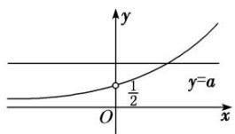
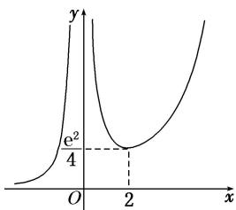
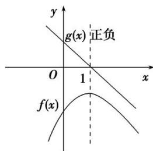
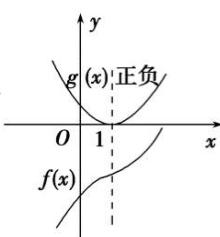
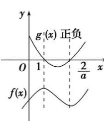
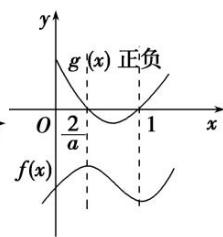
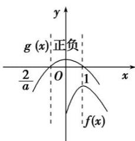
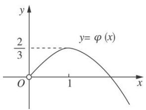

# 专题37 讨论函数零点或方程根的个数问题

# 【方法总结】

# 判断、证明或讨论函数零点个数的方法

利用零点存在性定理求解函数热点问题的前提条件为函数图象在区间 $[a, b]$ 上是连续不断的曲线，且 $f(a) \cdot f(b) < 0$ 。①直接法：判断一个零点时，若函数为单调函数，则只需取值证明 $f(a) \cdot f(b) < 0$ ；②分类讨论法：判断几个零点时，需要先结合单调性，确定分类讨论的标准，再利用零点存在性定理，在每个单调区间内取值证明 $f(a) \cdot f(b) < 0$ 。

# 【例题选讲】

[例1] 已知 $f(x) = \mathrm{e}^{-x}(ax^2 + x + 1)$ . 当 $a > 0$ 时，试讨论方程 $f(x) = 1$ 的解的个数.

[破题思路] 讨论方程 $f(x) = 1$ 的解的个数，想到 $f(x) - 1$ 的零点个数，给出 $f(x)$ 的解析式，用 $f(x) = 1$ 构造函数，转化为零点问题求解(或分离参数，结合图象求解).

# [规范解答]

法一：分类讨论法

方程 $f(x)=1$ 的解的个数即为函数 $h(x)=\mathrm{e}^{x}-ax^{2}-x-1(a>0)$ 的零点个数．而 $h'(x)=\mathrm{e}^{x}-2ax-1$

设 $H(x)=\mathrm{e}^{x}-2ax-1$ ，则 $H'(x)=\mathrm{e}^{x}-2a$ 。令 $H'(x)>0$ ，解得 $x>\ln 2a$ ；令 $H'(x)<0$ ，

解得 $x<\ln2a$ ，所以 $h'(x)$ 在 $(-∞, \ln2a)$ 上单调递减，在 $(\ln2a, +∞)$ 上单调递增.

所以 $h'(x)_{\min}=h'(\ln 2a)=2a-2a\ln 2a-1$ .

设 m=2a， $g(m)=m-m\ln m-1(m>0)$ ，则 $g'(m)=1-(1+\ln m)=-\ln m$ ，

令 $g'(m)<0$ ，得 m>1；令 $g'(m)>0$ ，得 0<m<1，所以 $g(m)$ 在 $(1,+\infty)$ 上单调递减，在 $(0,1)$ 上单调递增，所以 $g(m)_{\max}=g(1)=0$ ，即 $h'(x)_{\min}\leq0$ （当 m=1 即 $a=\frac{1}{2}$ 时取等号）.

①当 $a=\frac{1}{2}$ 时， $h'(x)_{\min}=0$ ，则 $h'(x)\geq0$ 恒成立．所以 $h(x)$ 在 R 上单调递增，故此时 $h(x)$ 只有一个零点.  
②当 $a > \frac{1}{2}$ 时， $\ln 2a > 0$ ， $h'(x)_{\min} = h'(\ln 2a) < 0$ ，

又 $h'(x)$ 在 $(-∞, �ln 2a)$ 上单调递减，在 $(\ln 2a, +∞)$ 上单调递增，

又 $h'(0)=0$ ，则存在 $x_{1}>0$ 使得 $h'(x_{1})=0$ ，

这时 $h(x)$ 在 $(-∞, 0)$ 上单调递增，在 $(0, x_{1})$ 上单调递减，在 $(x_{1}, +∞)$ 上单调递增.

所以 $h(x_{1})<h(0)=0$ ，又 $h(0)=0$ ，所以此时 $h(x)$ 有两个零点.

③当 $0 < a < \frac{1}{2}$ 时， $\ln 2a < 0$ ， $h'(x)_{\min} = h'(\ln 2a) < 0$ ，

又 $h'(x)$ 在 $(-∞, ∫2a)$ 上单调递减，在 $(\ln 2a, +∞)$ 上单调递增，

又 $h'(0)=0$ ，则存在 $x_{2}<0$ 使得 $h'(x_{2})=0$ .

这时 $h(x)$ 在 $(-∞, x_{2})$ 上单调递增，在 $(x_{2}, 0)$ 上单调递减，在 $(0, +∞)$ 上单调递增，

所以 $h(x_{2})>h(0)=0,\quad h(0)=0$ ，所以此时 $f(x)$ 有两个零点.

综上，当 $a=\frac{1}{2}$ 时，方程 $f(x)=1$ 只有一个解；当 $a\neq\frac{1}{2}$ 且 a>0 时，方程 $f(x)=1$ 有两个解.

# 法二：分离参数法

方程 $f(x)=1$ 的解的个数即方程 $e^{x}-ax^{2}-x-1=0(a>0)$ 的解的个数，方程可化为 $ax^{2}=e^{x}-x-1$ .
当 x=0 时，方程为 $0=e^{0}-0-1$ ，显然成立，所以 x=0 为方程的解.

当 $x \neq 0$ 时，分离参数可得 $a = \frac{e^{x} - x - 1}{x^{2}} (x \neq 0)$ .

设函数 $p(x) = \frac{\mathrm{e}^x - x - 1}{x^2} (x \neq 0)$ ，则 $p'(x) = \frac{(\mathrm{e}^x - x - 1)' \cdot x^2 - (x^2)' \cdot (\mathrm{e}^x - x - 1)}{(x^2)^2} = \frac{\mathrm{e}^x(x - 2) + x + 2}{x^3}$ .

记 $q(x)=\mathrm{e}^{x}(x-2)+x+2$ ，则 $q'(x)=\mathrm{e}^{x}(x-1)+1$ .

记 $t(x)=q'(x)=\mathrm{e}^{x}(x-1)+1$ ，则 $t'(x)=xe^{x}$ 。显然当 x<0 时， $t'(x)<0$ ，函数 $t(x)$ 单调递减；

当 x>0 时， $t'(x)>0$ ，函数 $t(x)$ 单调递增．所以 $t(x)>t(0)=\mathrm{e}^{0}(0-1)+1=0$ ，即 $q'(x)>0$ ，

所以函数 $q(x)$ 单调递增．而 $q(0)=\mathrm{e}^{0}(0-2)+0+2=0$

所以当 x<0 时， $q(x)<0$ ，即 $p'(x)>0$ ，函数 $p(x)$ 单调递增；

当 x>0 时， $q(x)>0$ ，即 $p'(x)>0$ ，函数 $p(x)$ 单调递增.

而当 $x \to 0$ 时， $p(x) \to \frac{(\mathrm{e}^{x} - x - 1)^{\prime}}{(x^{2})^{\prime}}_{x \to 0} = \frac{\mathrm{e}^{x} - 1}{2x}$ $_{x \to 0} = \frac{(\mathrm{e}^{x} - 1)^{\prime}}{(2x)^{\prime}}_{x \to 0} = \frac{\mathrm{e}^{x}}{2}$ $_{x \to 0} = \frac{1}{2}$ (洛必达法则)，

当 $x \to -\infty$ 时， $p(x) \to \frac{(\mathrm{e}^x - x - 1)'}{(x^2)'}_{x \to -\infty} = \frac{\mathrm{e}^x - 1}{2x}_{x \to -\infty} = 0,$

text_image

y
y=a
O
x

故函数 $p(x)$ 的图象如图所示．作出直线 y=a.

显然，当 $a = \frac{1}{2}$ 时，直线 $y = a$ 与函数 $p(x)$ 的图象无交点，即方程 $\mathrm{e}^x - ax^2 - x - 1 = 0$ 只有一个解 $x = 0$ ；当 $a \neq \frac{1}{2}$ 且 $a > 0$ 时，直线 $y = a$ 与函数 $p(x)$ 的图象有一个交点 $(x_0, a)$ ，

即方程 $e^{x}-ax^{2}-x-1=0$ 有两个解 x=0 或 $x=x_{0}$ .

综上，当 $a = \frac{1}{2}$ 时，方程 $f(x) = 1$ 只有一个解；当 $a \neq \frac{1}{2}$ 且 $a > 0$ 时，方程 $f(x) = 1$ 有两个解.

[注] 部分题型利用分离法处理时，会出现“0”型的代数式，这是大学数学中的不定式问题，解决这类问题有效的方法就是洛必达法则.

法则 1 若函数 $f(x)$ 和 $g(x)$ 满足下列条件：

(1) $\lim_{x\to a}f(x)=0$ 及 $\lim_{x\to a}g(x)=0$ ; (2)在点a的去心邻域内， $f(x)$ 与 $g(x)$ 可导且 $g'(x)\neq0$ ; (3) $\lim_{x\to a}\frac{f'(x)}{g'(x)}=l.$ 那么 $\lim_{x\to a}\frac{f(x)}{g(x)}=\lim_{x\to a}\frac{f'(x)}{g'(x)}=l.$

法则 2 若函数 $f(x)$ 和 $g(x)$ 满足下列条件：

(1) $\lim_{x\to a}f(x)=\infty$ 及 $\lim_{x\to a}g(x)=\infty$ ; (2)在点a的去心邻域内， $f(x)$ 与 $g(x)$ 可导且 $g'(x)\neq0$ ; (3) $\lim_{x\to a}\frac{f'(x)}{g'(x)}=l$ .

那么 $\lim_{x\to a}\frac{f(x)}{g(x)} = \lim_{x\to a}\frac{f'(x)}{g'(x)} = l.$

[题后悟通] 对于已知参数的取值范围，讨论零点个数的情况，借助导数解决的办法有两个．(1)分离参数：得到参数与超越函数式相等的式子，借助导数分析函数的单调区间和极值，结合图形，由参数函数与超越函数的交点个数，易得交点个数的分类情况；(2)构造新函数：求导，用单调性判定函数的取值情况，再根据零点存在定理证明零点的存在性.

[例 2] 设函数 $f(x)=\frac{x^{2}}{2}-k\ln x,\quad k>0.$

(1)求 $f(x)$ 的单调区间和极值；

(2)证明：若 $f(x)$ 存在零点，则 $f(x)$ 在区间 $(1, \sqrt{\mathrm{e}}]$ 上仅有一个零点.

[规范解答] (1)函数的定义域为 $(0, +\infty)$ . 由 $f(x) = \frac{x^2}{2} - k\ln x (k > 0)$ , 得 $f'(x) = x - \frac{k}{x} = \frac{x^2 - k}{x}$ .

由 $f'(x)=0$ ，解得 $x=\sqrt{k}$ （负值舍去）。 $f'(x)$ 与 $f(x)$ 在区间 $(0, +\infty)$ 上随 x 的变化情况如下表：

<table><tr><td>x</td><td> $(0, \sqrt{k})$ </td><td> $\sqrt{k}$ </td><td> $(\sqrt{k}, +\infty)$ </td></tr><tr><td>f&#x27;(x)</td><td>-</td><td>0</td><td>+</td></tr><tr><td>f(x)</td><td> $\searrow$ </td><td> $\frac{k(1-\ln k)}{2}$ </td><td> $\nearrow$ </td></tr></table>

所以， $f(x)$ 的单调递减区间是 $(0, \sqrt{k})$ ，单调递增区间是 $(\sqrt{k}, +\infty)$ .

$f(x)$ 在 $x = \sqrt{k}$ 处取得极小值 $f(\sqrt{k}) = \frac{k(1 - \ln k)}{2}$ ，无极大值.

(2)由(1)知， $f(x)$ 在区间 $(0, +\infty)$ 上的最小值为 $f(\sqrt{k}) = \frac{k(1 - \ln k)}{2}$ .

因为 $f(x)$ 存在零点，所以 $\frac{k(1-\ln k)}{2} \leq 0$ ，从而 $k \geq e$ ，

当 $k = \mathrm{e}$ 时， $f(x)$ 在区间 $(1, \sqrt{\mathrm{e}}]$ 上单调递减且 $f(\sqrt{\mathrm{e}}) = 0$ ，所以 $x = \sqrt{\mathrm{e}}$ 是 $f(x)$ 在区间 $(1, \sqrt{\mathrm{e}}]$ 上的唯一零点；当 $k > \mathrm{e}$ 时， $f(x)$ 在区间 $(1, \sqrt{\mathrm{e}}]$ 上单调递减且 $f(1) = \frac{1}{2} > 0$ ， $f(\sqrt{\mathrm{e}}) = \frac{\mathrm{e} - k}{2} < 0$

所以 $f(x)$ 在区间 $(1, \sqrt{e}]$ 上仅有一个零点.

综上可知，若 $f(x)$ 存在零点，则 $f(x)$ 在区间 $(1, \sqrt{e}]$ 上仅有一个零点.

[例 3] 已知函数 $f(x)=\frac{a\ln x+b}{x}(a, b \in \mathbf{R}, a \neq 0)$ 的图象在点 $(1, f(1))$ 处的切线斜率为 -a.

(1)求 $f(x)$ 的单调区间；

(2)讨论方程 $f(x)=1$ 根的个数.

[规范解答] (1)函数 $f(x)$ 的定义域为 $(0, +\infty)$ ， $f'(x)=\frac{a-b-a\ln x}{x^{2}}$ ，由 $f(1)=a-b=-a$ ，得 b=2a，
所以 $f(x)=\frac{a(\ln x+2)}{x}$ ， $f'(x)=-\frac{a(\ln x+1)}{x^{2}}$ .

当 a>0 时，由 $f'(x)>0$ ，得 $0<x<\frac{1}{e}$ ；由 $f'(x)<0$ ，得 $x>\frac{1}{e}$ .

当 a<0 时，由 $f'(x)>0$ ，得 $x>\frac{1}{e}$ ；由 $f'(x)<0$ ，得 $0<x<\frac{1}{e}$ .

综上，当 $a > 0$ 时， $f(x)$ 的单调递增区间为 $\left[0, \frac{1}{e}\right]$ ，单调递减区间为 $\left[\frac{1}{e}, +\infty\right]$ ；当 $a < 0$ 时， $f(x)$ 的单调递增区间为 $\left[\frac{1}{e}, +\infty\right]$ ，单调递减区间为 $\left[0, \frac{1}{e}\right]$ .

(2) $f(x)=1$ ，即方程 $\frac{a\ln x+2a}{x}=1$ ，即方程 $\frac{1}{a}=\frac{\ln x+2}{x}$ ，构造函数 $h(x)=\frac{\ln x+2}{x}$

则 $h'(x)=-\frac{1+\ln x}{x^{2}}$ ，令 $h'(x)=0$ ，得 $x=\frac{1}{e}$ ，且在 $\left(0,\frac{1}{e}\right)$ 上 $h'(x)>0$ ，在 $\left(\frac{1}{e},+\infty\right)$ 上 $h'(x)<0$ ，即 $h(x)$ 在 $\left(0,\frac{1}{e}\right)$ 上单调递增，在 $\left(\frac{1}{e},+\infty\right)$ 上单调递减，所以 $h(x)_{\max}=h\left(\frac{1}{e}\right)=e.$

在 $\left(\frac{1}{e},+\infty\right)$ 上， $h(x)$ 单调递减且 $h(x)=\frac{\ln x+2}{x}>0$ ，当x无限增大时， $h(x)$ 无限接近0；

在 $\left(0, \frac{1}{\mathrm{e}}\right)$ 上， $h(x)$ 单调递增且当 $x$ 无限接近 0 时， $\ln x + 2$ 负无限大，故 $h(x)$ 负无限大.

故当 $0 < \frac{1}{a} < e$ ，即 $a > \frac{1}{e}$ 时，方程 $f(x) = 1$ 有两个不等实根，当 $a = \frac{1}{e}$ 时，方程 $f(x) = 1$ 只有一个实根，当 a < 0 时，方程 $f(x) = 1$ 只有一个实根.

综上可知，当 $a > \frac{1}{e}$ 时，方程 $f(x) = 1$ 有两个实根；当 a < 0 或 $a = \frac{1}{e}$ 时，方程 $f(x) = 1$ 有一个实根；当 $0 < a < \frac{1}{e}$ 时，方程 $f(x) = 1$ 无实根.

[例 4] 已知函数 $f(x)=\mathrm{e}^{x}, x\in\mathbf{R}.$

(1)若直线 y=kx 与 $f(x)$ 的反函数的图象相切，求实数 k 的值；

(2)若 $m < 0$ ，讨论函数 $g(x) = f(x) + mx^2$ 零点的个数.

[规范解答] (1) $f(x)$ 的反函数为 $y = \ln x, x > 0$ ，则 $y' = \frac{1}{x}$ .

设切点为 $(x_{0},\ln x_{0})$ ，则切线斜率为 $k=\frac{1}{x_{0}}=\frac{\ln x_{0}}{x_{0}}$ ，故 $x_{0}=e,\quad k=\frac{1}{e}$ .

(2)函数 $g(x)=f(x)+mx^{2}$ 的零点的个数即是方程 $f(x)+mx^{2}=0$ 的实根的个数(当 x=0 时，方程无解)，等价于函数 $h(x)=\frac{\mathrm{e}^{x}}{x^{2}}(x\neq0)$ 与函数 y=-m 图象交点的个数． $h'(x)=\frac{\mathrm{e}^{x}(x-2)}{x^{3}}$ .

当 $x \in (-\infty, 0)$ 时， $h'(x) > 0$ ， $h(x)$ 在 $(-∞, 0)$ 上单调递增；

当 $x \in (0,2)$ 时， $h'(x) < 0$ ， $h(x)$ 在 $(0,2)$ 上单调递减；

当 $x \in (2, +\infty)$ 时， $h'(x) > 0$ ， $h(x)$ 在 $(2, +\infty)$ 上单调递增.

line

| x | y |
|---|---|
| 0 | e²/4 |
| 2 | 0 |

∴ $h(x)$ 的大致图象如图：∴ $h(x)$ 在 $(0, +\infty)$ 上的最小值为 $h(2)=\frac{e^{2}}{4}$ .

∴ 当 $-m \in \left(0, \frac{e^{2}}{4}\right)$ ，即 $m \in \left(-\frac{e^{2}}{4}, 0\right)$ 时，函数 $h(x) = \frac{e^{x}}{x^{2}}$ 与函数 y = -m 图象交点的个数为 1；

当 $-m=\frac{e^{2}}{4}$ ，即 $m=-\frac{e^{2}}{4}$ 时，函数 $h(x)=\frac{e^{x}}{x^{2}}$ 与函数y=-m图象交点的个数为2；

当 $-m\in \left(\frac{\mathrm{e}^2}{4}, + \infty\right)$ 即 $m\in -\infty$ ， $-\frac{\mathrm{e}^2}{4}$ 时，函数 $h(x) = \frac{\mathrm{e}^x}{x^2}$ 与函数 $y = -m$ 图象交点的个数为3.

综上所述，当 $m \in \left[-\infty, -\frac{\mathrm{e}^2}{4}\right]$ 时，函数 $g(x)$ 有三个零点；当 $m = -\frac{\mathrm{e}^2}{4}$ 时，函数 $g(x)$ 有两个零点；当 $m \in -\frac{\mathrm{e}^2}{4}$ ，0时，函数 $g(x)$ 有一个零点.

[例 5] 已知函数 $f(x) = -x^{3} + ax - \frac{1}{4}$ ， $g(x) = e^{x} - e(e$ 为自然对数的底数).

(1)若曲线 $y=f(x)$ 在 $(0, f(0))$ 处的切线与曲线 $y=g(x)$ 在 $(0, g(0))$ 处的切线互相垂直，求实数 a 的值；  
(2)设函数 $h(x) = \begin{cases} f(x), & f(x) \geq g(x), \\ g(x), & f(x) < g(x), \end{cases}$ 试讨论函数 $h(x)$ 零点的个数.

[规范解答] $(1)f'(x) = -3x^{2} + a$ ， $g^{\prime}(x) = \mathrm{e}^{x}$ ，所以 $f(0) = a$ ， $g^{\prime}(0) = 1$ ，由题意，知 $a = -1$

(2)易知函数 $g(x)=\mathrm{e}^{x}-\mathrm{e}$ 在 R 上单调递增，仅在 x=1 处有一个零点，且 x<1 时， $g(x)<0$ ，又 $f(x)=-3x^{2}+a$ ，

①当 $a \leq 0$ 时， $f'(x) \leq 0$ ， $f(x)$ 在 R 上单调递减，且过点 $\left(0, -\frac{1}{4}\right)$ ， $f(-1) = \frac{3}{4} - a > 0$ ，

即 $f(x)$ 在 $x \leq 0$ 时必有一个零点，此时 $y = h(x)$ 有两个零点；

②当 $a > 0$ 时，令 $f'(x) = -3x^2 + a = 0$ ，得两根为 $x_1 = -\sqrt{\frac{a}{3}} < 0, x_2 = \sqrt{\frac{a}{3}} > 0,$

则 $-\sqrt{\frac{a}{3}}$ 是函数 $f(x)$ 的一个极小值点， $\sqrt{\frac{a}{3}}$ 是函数 $f(x)$ 的一个极大值点，

而 $f\left(-\sqrt{\frac{a}{3}}\right) = -\left(-\sqrt{\frac{a}{3}}\right)^{3} + a\left(-\sqrt{\frac{a}{3}}\right) - \frac{1}{4} = -\frac{2a}{3}\sqrt{\frac{a}{3}} -\frac{1}{4} < 0.$

现在讨论极大值的情况:

$$
f \left(\sqrt {\frac {a}{3}}\right) = - \left(\sqrt {\frac {a}{3}}\right) ^ {3} + a \sqrt {\frac {a}{3} - \frac {1}{4}} = \frac {2 a}{3} \sqrt {\frac {a}{3} - \frac {1}{4}}, \text {当} f \left(\sqrt {\frac {a}{3}}\right) <   0, \text {即} a <   \frac {3}{4} \text {时},
$$

函数 $y=f(x)$ 在 $(0, +\infty)$ 上恒小于零，此时 $y=h(x)$ 有两个零点；

当 $f\left(\sqrt{\frac{a}{3}}\right)=0$ ，即 $a=\frac{3}{4}$ 时，函数 $y=f(x)$ 在 $(0,+\infty)$ 上有一个零点 $x_{0}=\sqrt{\frac{a}{3}}=\frac{1}{2}$

此时 $y=h(x)$ 有三个零点；

当 $f\left(\frac{\sqrt{a}}{3}\right)>0$ ，即 $a>\frac{3}{4}$ 时，函数 $y=f(x)$ 在 $(0,+\infty)$ 上有两个零点，一个零点小于 $\sqrt{\frac{a}{3}}$ ，一个零点大于 $\sqrt{\frac{a}{3}}$

若 $f(1) = a - \frac{5}{4} < 0$ ，即 $a < \frac{5}{4}$ 时， $y = h(x)$ 有四个零点；

若 $f(1)=a-\frac{5}{4}=0$ ，即 $a=\frac{5}{4}$ 时， $y=h(x)$ 有三个零点；

若 $f(1)=a-\frac{5}{4}>0$ ，即 $a>\frac{5}{4}$ 时， $y=h(x)$ 有两个零点.

综上所述：当 $a<\frac{3}{4}$ 或 $a>\frac{5}{4}$ 时， $y=h(x)$ 有两个零点；当 $a=\frac{3}{4}$ 或 $a=\frac{5}{4}$ 时， $y=h(x)$ 有三个零点；当 $\frac{3}{4}<a<\frac{5}{4}$ 时， $y=h(x)$ 有四个零点.

[例6] 已知函数 $f(x) = \frac{1}{2} ax^2 - (a + 2)x + 2\ln x (a \in \mathbf{R})$ .

(1)若 a=0，求证： $f(x)<0;$   
(2)讨论函数 $f(x)$ 零点的个数.

[破题思路] (1) 当 $a = 0$ 时, $f(x) = -2x + 2\ln x (x > 0)$ , $f'(x) = -2 + \frac{2}{x} = \frac{2(1 - x)}{x}$ , 设 $g(x) = 1 - x$ , 根据 $g(x)$ 的正负可画出 $f(x)$ 的图象如图(1)所示. (2) $f'(x) = \frac{(x - 1)(ax - 2)}{x} (x > 0)$ , 令 $g(x) = (x - 1)(ax - 2)$ , 当 $a = 0$ 时, 由(1)知 $f(x)$ 没有零点; 当 $a > 0$ 时, 画 $g(x)$ 的正负图象时, 需分 $\frac{2}{a} = 1$ , $\frac{2}{a} > 1$ , $\frac{2}{a} < 1$ 三种情形进行讨论, 再根据极值、端点走势可画出 $f(x)$ 的图象, 如图(2)(3)(4)所示; 当 $a < 0$ 时, 同理可得图(5). 综上, 易得 $f(x)$ 的零点个数.

text_image

y
g(x) 正负
O 1 x
f(x)

(1)

text_image

y
g(x)正负
O 1 x
f(x)

(2)

text_image

y
g(x) 正负
O 1 2/a x
f(x)

(3)

text_image

g(x) 正负
O 2/a 1 x
f(x)

(4)

text_image

y
g (x) 正负
2/a O 1 x
f(x)

(5)

[规范解答] (1) 当 $a = 0$ 时， $f'(x) = -2 + \frac{2}{x} = \frac{2(1 - x)}{x}$ ，由 $f'(x) = 0$ 得 $x = 1$ .

当 0<x<1 时， $f'(x)>0$ ， $f(x)$ 在 $(0,1)$ 上单调递增；当 x>1 时， $f'(x)<0$ ， $f(x)$ 在 $(1,+\infty)$ 上单调递减。所以 $f(x)\leq f(x)_{\max}=f(1)=-2$ ，即 $f(x)<0$ 。

(2)由题意知 $f'(x)=ax-(a+2)+\frac{2}{x}=\frac{ax^{2}-(a+2)x+2}{x}=\frac{(x-1)(ax-2)}{x}(x>0)$ ,

当 a=0 时，由第(1)问可得函数 $f(x)$ 没有零点.

当 a>0 时，①当 $\frac{2}{a}=1$ ，即 a=2 时， $f'(x)\geq0$ 恒成立，仅当 x=1 时取等号，

函数 $f(x)$ 在 $(0, +\infty)$ 上单调递增，又 $f(1) = -\frac{1}{2}a - 2 = -\frac{1}{2} \times 2 - 2 < 0$ ,

当 $x \to +\infty$ 时， $f(x) \to +\infty$ ，所以函数 $f(x)$ 在区间 $(0, +\infty)$ 上有一个零点.

②当 $\frac{2}{a}>1$ ，即0<a<2时，若0<x<1或 $x>\frac{2}{a}$ ，则 $f'(x)>0$ ， $f(x)$ 在 $(0,1)$ 和 $\left(\frac{2}{a},+\infty\right)$ 上单调递增；

若 $1 < x < \frac{2}{a}$ , 则 $f'(x) < 0$ , $f(x)$ 在 $\left(1, \frac{2}{a}\right)$ 上单调递减.

又 $f(1) = \frac{1}{2} a - (a + 2) + 2\ln 1 = -\frac{1}{2} a - 2 < 0$ ，则 $f\left(\frac{2}{a}\right) < f(1) < 0$

当 $x \to +\infty$ 时， $f(x) \to +\infty$ ，所以函数 $f(x)$ 仅有一个零点在区间 $\left(\frac{2}{a}, +\infty\right)$ 上；

③当 $0 < \frac{2}{a} < 1$ ，即 a > 2 时，若 $0 < x < \frac{2}{a}$ 或 x > 1，则 $f'(x) > 0$ ， $f(x)$ 在 $\begin{pmatrix} 0, & \frac{2}{a} \end{pmatrix}$ 和 $(1, +\infty)$ 上单调递增；

若 $\frac{2}{a}<x<1$ ，则 $f'(x)<0$ ， $f(x)$ 在 $\left(\frac{2}{a},1\right)$ 上单调递减.

因为 a>2，所以 $f\left(\frac{2}{a}\right)=-\frac{2}{a}-2+2\ln\frac{2}{a}<-\frac{2}{a}-2+2\ln1<0$ ，又 $x\to+\infty$ 时， $f(x)\to+\infty$

所以函数 $f(x)$ 仅有一个零点在区间 $(1, +\infty)$ 上.

当 $\frac{2}{a}<0$ ，即a<0时，若0<x<1， $f'(x)>0$ ， $f(x)$ 在 $(0,1)$ 上单调递增；

若 $x > 1$ ， $f(x) <   0$ ， $f(x)$ 在 $(1, + \infty)$ 上单调递减．当 $x\to 0$ 时， $f(x)\rightarrow -\infty$ ，当 $x\to +\infty$ 时， $f(x)\rightarrow -\infty$

又 $f(1) = \frac{1}{2} a - (a + 2) + 2\ln 1 = -\frac{1}{2} a - 2 = \frac{-a - 4}{2}.$

当 $f(1)=\frac{-a-4}{2}>0$ ，即 a<-4 时，函数 $f(x)$ 有两个零点；

当 $f(1)=\frac{-a-4}{2}=0$ ，即 a=-4 时，函数 $f(x)$ 有一个零点；

当 $f(1)=\frac{-a-4}{2}<0$ ，即 -4<a<0 时，函数 $f(x)$ 没有零点.

综上，当 a<-4 时，函数 $f(x)$ 有两个零点；当 a=-4 时，函数 $f(x)$ 有一个零点；当 $-4<a\leq0$ 时，

函数 $f(x)$ 没有零点；当 a>0 时，函数 $f(x)$ 有一个零点.

[题后悟通] 解决本题运用了分类、分层的思想方法，表面看起来非常繁杂。但若能用好“双图法”处理问题，可回避不等式 $f'(x) > 0$ 与 $f'(x) < 0$ 的求解，特别是含有参数的不等式求解，而从 $f'(x)$ 抽象出与其正负有关的函数 $g(x)$ ，画图更方便，观察图形即可直观快速地得到 $f(x)$ 的单调性，大大提高解题的效率。

# [对点训练]

1. (2018·全国Ⅱ)已知函数 $f(x) = \frac{1}{3} x^3 - a(x^2 + x + 1)$ .

(1)若 a=3，求 $f(x)$ 的单调区间；

(2)证明： $f(x)$ 只有一个零点.

1. 解析 (1) 当 $a = 3$ 时, $f(x) = \frac{1}{3} x^3 - 3x^2 - 3x - 3$ , $f'(x) = x^2 - 6x - 3$ . 令 $f'(x) = 0$ 解得 $x = 3 - 2\sqrt{3}$ 或 $x = 3 + 2\sqrt{3}$ .

当 $x \in (-\infty, 3 - 2\sqrt{3}) \cup (3 + 2\sqrt{3}, +\infty)$ 时， $f'(x) > 0$ ；当 $x \in (3 - 2\sqrt{3}, 3 + 2\sqrt{3})$ 时， $f'(x) < 0$ .

故 $f(x)$ 在 $(- \infty, 3 - 2\sqrt{3})$ ， $(3 + 2\sqrt{3}, + \infty)$ 单调递增，在 $(3 - 2\sqrt{3}, 3 + 2\sqrt{3})$ 单调递减.

(2)由于 $x^{2} + x + 1 > 0$ ，所以 $f(x) = 0$ 等价于 $\frac{x^3}{x^2 + x + 1} - 3a = 0.$

设 $g(x)=\frac{x^{3}}{x^{2}+x+1}-3a$ ，则 $g'(x)=\frac{x^{2}(x^{2}+2x+3)}{(x^{2}+x+1)^{2}}\geq0$ ，仅当 x=0 时 $g'(x)=0$ ，

所以 $g(x)$ 在 $(-∞, +∞)$ 单调递增．故 $g(x)$ 至多有一个零点，

从而 $f(x)$ 至多有一个零点．又 $f(3a-1)=-6a^{2}+2a-\frac{1}{3}=-6\left(a-\frac{1}{6}\right)^{2}-\frac{1}{6}<0,\quad f(3a+1)=\frac{1}{3}>0,$

故 $f(x)$ 有一个零点．综上， $f(x)$ 只有一个零点．

2. 已知函数 $f(x) = \mathrm{e}^x - 1$ ， $g(x) = \sqrt{x} + x$ ，其中 $\mathbf{e}$ 是自然对数的底数， $\mathrm{e} = 2.71828\ldots$

(1)证明：函数 $h(x)=f(x)-g(x)$ 在区间 $(1,2)$ 上有零点；

(2)求方程 $f(x)=g(x)$ 的根的个数，并说明理由.

2. 解析 (1)由题意可得 $h(x)=f(x)-g(x)=\mathrm{e}^{x}-1-\sqrt{x}-x$ ,

所以 $h(1)=\mathrm{e}-3<0,\quad h(2)=\mathrm{e}^{2}-3-\sqrt{2}>0$ ，所以 $h(1)h(2)<0$ ，所以函数 $h(x)$ 在区间 $(1,2)$ 上有零点.

(2)由(1)可知 $h(x) = f(x) - g(x) = \mathrm{e}^x - 1 - \sqrt{x} - x$ 。由 $g(x) = \sqrt{x} + x$ 知 $x \in [0, +\infty)$ ,

而 $h(0)=0$ ，则 x=0 为 $h(x)$ 的一个零点.

又 $h(x)$ 在 $(1, 2)$ 内有零点，因此 $h(x)$ 在 $[0, +\infty)$ 上至少有两个零点.

$h'(x)=\mathrm{e}^{x}-\frac{1}{2}x-\frac{1}{2}-1$ ，记 $\varphi(x)=\mathrm{e}^{x}-\frac{1}{2}x-\frac{1}{2}-1$ ，则 $\varphi'(x)=\mathrm{e}^{x}+\frac{1}{4}x-\frac{3}{2}$ .

当 $x \in (0, +\infty)$ 时， $\varphi'(x) > 0$ ，因此 $\varphi(x)$ 在 $(0, +\infty)$ 上单调递增，

易知 $\varphi(x)$ 在 $(0, +\infty)$ 内只有一个零点，则 $h(x)$ 在 $[0, +\infty)$ 上有且只有两个零点，

所以方程 $f(x)=g(x)$ 的根的个数为 2.

3. 设函数 $f(x) = \ln x + \frac{m}{x}, m \in \mathbf{R}$ .

(1)当 $m=e(e$ 为自然对数的底数)时，求 $f(x)$ 的极小值；

(2)讨论函数 $g(x)=f'(x)-\frac{x}{3}$ 零点的个数.

3. 解析 (1)由题设，当 $m = \mathrm{e}$ 时， $f(x) = \ln x + \frac{\mathrm{e}}{x}$ ，则 $f'(x) = \frac{x - \mathrm{e}}{x^2}$ ，

∴ 当 $x \in (0, e)$ 时， $f'(x) < 0$ ， $f(x)$ 在 $(0, e)$ 上单调递减；

当 $x \in (\mathrm{e}, +\infty)$ 时， $f'(x) > 0$ ， $f(x)$ 在 $(\mathrm{e}, +\infty)$ 上单调递增，

∴ 当 x=e 时， $f(x)$ 取得极小值 $f(e)=\ln e+\frac{e}{e}=2$ ，∴ $f(x)$ 的极小值为 2.

(2)由题设 $g(x)=f'(x)-\frac{x}{3}=\frac{1}{x}-\frac{m}{x^{2}}-\frac{x}{3}(x>0)$ ，令 $g(x)=0$ ，得 $m=-\frac{1}{3}x^{3}+x(x>0)$ .

设 $\varphi(x)=-\frac{1}{3}x^{3}+x(x>0)$ ，则 $\varphi'(x)=-x^{2}+1=-(x-1)(x+1)$ .

当 $x \in (0, 1)$ 时， $\varphi'(x) > 0$ ， $\varphi(x)$ 在 $(0, 1)$ 上单调递增；

当 $x \in (1, +\infty)$ 时， $\varphi'(x) < 0$ ， $\varphi(x)$ 在 $(1, +\infty)$ 上单调递减.

∴x=1 是 $\varphi(x)$ 的唯一极值点，且是极大值点，因此 x=1 也是 $\varphi(x)$ 的最大值点，

∴ $\varphi(x)$ 的最大值为 $\varphi(1)=\frac{2}{3}$ . 又 $\varphi(0)=0$ ，结合 $y=\varphi(x)$ 的图象(如图)，可知，

text_image

y
2/3
y=φ(x)
O
1
x

①当 $m > \frac{2}{3}$ 时，函数 $g(x)$ 无零点；②当 $m = \frac{2}{3}$ 时，函数 $g(x)$ 有且只有一个零点；  
③当 $0<m<\frac{2}{3}$ 时，函数 $g(x)$ 有两个零点；④当 $m\leq0$ 时，函数 $g(x)$ 有且只有一个零点.

综上所述，当 $m > \frac{2}{3}$ 时，函数 $g(x)$ 无零点；当 $m = \frac{2}{3}$ 或 $m \leq 0$ 时，函数 $g(x)$ 有且只有一个零点；当 $0 < m < \frac{2}{3}$ 时，函数 $g(x)$ 有两个零点.

4. 已知函数 $f(x) = \ln x + \frac{1}{ax} - \frac{1}{a}, a \in \mathbf{R}$ 且 $a \neq 0$ .

(1)讨论函数 $f(x)$ 的单调性；  
(2)当 $x \in \left[\frac{1}{\mathrm{e}}, \mathrm{e}\right]$ 时，试判断函数 $g(x) = (\ln x - 1)\mathrm{e}^x + x - m$ 的零点个数.

4. 解析 $(1)f'(x) = \frac{ax - 1}{ax^2} (x > 0)$ ，当 $a < 0$ 时， $f'(x) > 0$ 恒成立， $\therefore$ 函数 $f(x)$ 在 $(0, +\infty)$ 上单调递增；

当 a>0 时，由 $f'(x)>0$ ，得 $x>\frac{1}{a}$ ；由 $f'(x)<0$ ，得 $0<x<\frac{1}{a}$

∴函数 $f(x)$ 在 $\left(\frac{1}{a}, +\infty\right)$ 上单调递增，在 $\left(0, \frac{1}{a}\right)$ 上单调递减.

综上所述，当 $a < 0$ 时，函数 $f(x)$ 在 $(0, +\infty)$ 上单调递增；当 $a > 0$ 时，函数 $f(x)$ 在 $\left[\frac{1}{a}, +\infty\right]$ 上单调递增，在 $\left[0, \frac{1}{a}\right]$ 上单调递减.

(2)∵当 $x \in \left[\frac{1}{e}, e\right]$ 时，函数 $g(x) = (\ln x - 1)e^{x} + x - m$ 的零点，

即当 $x \in \left[\frac{1}{\mathrm{e}}, \mathrm{e}\right]$ 时，方程 $(\ln x - 1)\mathrm{e}^x + x = m$ 的根.

令 $h(x)=(\ln x-1)e^{x}+x$ ，则 $h'(x)=\left(\frac{1}{x}+\ln x-1\right)e^{x}+1$ .

由(1)知当 a=1 时， $f(x)=\ln x+\frac{1}{x}-1$ 在 $\left(\frac{1}{e},1\right)$ 上单调递减，在 $(1,e)$ 上单调递增，

∴ 当 $x \in \left[\frac{1}{e}, e\right]$ 时， $f(x) \geq f(1) = 0$ . $\therefore \frac{1}{x} + \ln x - 1 \geq 0$ 在 $x \in \left[\frac{1}{e}, e\right]$ 上恒成立.

$\therefore h'(x) = \left(\frac{1}{x} + \ln x - 1\right)\mathrm{e}^x + 1 \geq 0 + 1 > 0, \quad \therefore h(x) = (\ln x - 1)\mathrm{e}^x + x$ 在 $x \in \left[\frac{1}{\mathrm{e}}, \mathrm{e}\right]$ 上单调递增.

$$
\therefore h (x) _ {\min} = h \left(\frac {1}{e}\right) = - 2 e ^ {\frac {1}{e}} + \frac {1}{e}, h (x) _ {\max} = e.
$$

∴ 当 $m < -2e^{\frac{1}{e}} + \frac{1}{e}$ 或 m > e 时，函数 $g(x)$ 在 $\left[\frac{1}{e}, e\right]$ 上没有零点；

当 $-2\mathrm{e}^{\frac{1}{\mathrm{e}}} + \frac{1}{\mathrm{e}} \leq m \leq \mathrm{e}$ 时，函数 $g(x)$ 在 $\left[\frac{1}{\mathrm{e}}, \mathrm{e}\right]$ 上有且只有一个零点.

5. 设函数 $f(x)=\mathrm{e}^{x}-2a-\ln(x+a)$ ， $a\in R$ ，e 为自然对数的底数.

(1)若 a>0，且函数 $f(x)$ 在区间 $[0, +\infty)$ 内单调递增，求实数 a 的取值范围；

(2)若 $0<a<\frac{2}{3}$ ，试判断函数 $f(x)$ 的零点个数.

5. 解析 (1) $\because$ 函数 $f(x)$ 在 $[0, +\infty)$ 内单调递增， $\therefore f'(x) = e^x - \frac{1}{x + a} \geq 0$ 在 $[0, +\infty)$ 内恒成立.

即 $a \geq \mathrm{e}^{-x} - x$ 在 $[0, +\infty)$ 内恒成立．记 $g(x) = \mathrm{e}^{-x} - x$ ，则 $g'(x) = -\mathrm{e}^{-x} - 1 < 0$ 恒成立，

∴ $g(x)$ 在区间 $[0, +\infty)$ 内单调递减，∴ $g(x) \leq g(0) = 1$ ，∴ $a \geq 1$ ，即实数 a 的取值范围为 $[1, +\infty)$ .

(2) $\because0<a<\frac{2}{3},f'(x)=\mathrm{e}^{x}-\frac{1}{x+a}(x>-a),$ 记 $h(x)=f'(x),$ 则 $h'(x)=\mathrm{e}^{x}+\frac{1}{(x+a)^{2}}>0,$

知 $f(x)$ 在区间 $(-a, +\infty)$ 内单调递增．又 $\because f'(0)=1-\frac{1}{a}<0,\quad f'(1)=\mathrm{e}-\frac{1}{a+1}>0,$

∴ $f(x)$ 在区间 $(-a, +\infty)$ 内存在唯一的零点 $x_{0}$ ，即 $f'(x_{0}) = e^{x_{0}} - \frac{1}{x_{0} + a} = 0$ ,

于是 $e^{x_{0}}=\frac{1}{x_{0}+a},\quad x_{0}=-\ln(x_{0}+a).$

当 $-a<x<x_{0}$ 时， $f'(x)<0$ ， $f(x)$ 单调递减；当 $x>x_{0}$ 时， $f'(x)>0$ ， $f(x)$ 单调递增.

$$
\therefore f (x) _ {\min} = f \left(x _ {0}\right) = \mathrm{e} ^ {x _ {0}} - 2 a - \ln \left(x _ {0} + a\right) = \frac {1}{x _ {0} + a} - 2 a + x _ {0} = x _ {0} + a + \frac {1}{x _ {0} + a} - 3 a \geq 2 - 3 a,
$$

当且仅当 $x_{0}+a=1$ 时，取等号．由 $0<a<\frac{2}{3}$ ，得 2-3a>0，∴ $f(x)_{\min}=f(x_{0})>0$ ，即函数 $f(x)$ 没有零点．

6. 已知函数 $f(x) = \ln x - \frac{1}{2} ax^2 (a \in \mathbf{R})$ .

(1)若 $f(x)$ 在点 $(2, f(2))$ 处的切线与直线 $2x + y + 2 = 0$ 垂直，求实数 a 的值；

(2)求函数 $f(x)$ 的单调区间；

(3)讨论函数 $f(x)$ 在区间 $[1, e^{2}]$ 上零点的个数.

6. 解析 $(1)f(x) = \ln x - \frac{1}{2} ax^2$ 的定义域为 $(0, +\infty)$ , $f'(x) = \frac{1}{x} - ax = \frac{1 - ax^2}{x}$ , 则 $f'(2) = \frac{1 - 4a}{2}$ .

因为直线 $2x + y + 2 = 0$ 的斜率为 -2，所以 $(-2) \times \frac{1 - 4a}{2} = -1$ ，解得 a = 0.

(2) $f'(x)=\frac{1-ax^{2}}{x},\quad x\in(0,+\infty),$

当 $a \leq 0$ 时， $f'(x) > 0$ ，所以 $f(x)$ 在 $(0, +\infty)$ 上单调递增；

当 a>0 时，由 $\left\{\begin{aligned}f'(x)>0,\\ x>0\end{aligned}\right.$ 得 $0<x<\frac{\sqrt{a}}{a}$ ; 由 $f'(x)<0$ 得 $x>\frac{\sqrt{a}}{a}$ ,

所以 $f(x)$ 在 $\left(0, \frac{\sqrt{a}}{a}\right)$ 上单调递增，在 $\left(\frac{\sqrt{a}}{a}, +\infty\right)$ 上单调递减.

综上所述：当 $a \leq 0$ 时， $f(x)$ 的单调递增区间为 $(0, +\infty)$ ;

当 $a > 0$ 时， $f(x)$ 的单调递增区间为 $\left[0, \frac{\sqrt{a}}{a}\right]$ ，单调递减区间为 $\left[\frac{\sqrt{a}}{a}, +\infty\right]$ .

(3)由(2)可知，

(i)当 $a < 0$ 时， $f(x)$ 在 $[1, \mathrm{e}^2]$ 上单调递增，而 $f(1) = -\frac{1}{2} a > 0$ ，故 $f(x)$ 在 $[1, \mathrm{e}^2]$ 上没有零点.

(ii) 当 $a = 0$ 时， $f(x)$ 在 $[1, e^2]$ 上单调递增，而 $f(1) = -\frac{1}{2} a = 0$ ，故 $f(x)$ 在 $[1, e^2]$ 上有一个零点.

(iii)当 $a > 0$ 时，①若 $\frac{\sqrt{a}}{a} \leq 1$ ，即 $a \geq 1$ 时， $f(x)$ 在 $[1, e^2]$ 上单调递减.

因为 $f(1)=-\frac{1}{2}a<0$ ，所以 $f(x)$ 在 $[1, e^{2}]$ 上没有零点.

②若 $1 < \frac{\sqrt{a}}{a} \leq e^2$ ，即 $\frac{1}{e^4} \leq a < 1$ 时， $f(x)$ 在 $\left[1, \frac{\sqrt{a}}{a}\right]$ 上单调递增，在 $\left[\frac{\sqrt{a}}{a}, e^2\right]$ 上单调递减，

而 $f(1) = -\frac{1}{2} a < 0, f\left(\frac{\sqrt{a}}{a}\right) = -\frac{1}{2}\ln a - \frac{1}{2}, f(\mathrm{e}^2) = 2 - \frac{1}{2} a\mathrm{e}^4,$

若 $f\left(\frac{\sqrt{a}}{a}\right) = -\frac{1}{2}\ln a - \frac{1}{2} < 0$ ，即 $a > \frac{1}{e}$ 时， $f(x)$ 在 $[1, e^2]$ 上没有零点；

若 $f\left(\frac{\sqrt{a}}{a}\right) = -\frac{1}{2}\ln a - \frac{1}{2} = 0$ ，即 $a = \frac{1}{\mathrm{e}}$ 时， $f(x)$ 在 $[1, \mathrm{e}^2]$ 上有一个零点；

若 $f\left(\frac{\sqrt{a}}{a}\right) = -\frac{1}{2}\ln a - \frac{1}{2} >0$ ，即 $a <   \frac{1}{\mathrm{e}}$ 时，由 $f(\mathrm{e}^2) = 2 - \frac{1}{2} ae^4 >0$ ，得 $a <   \frac{4}{\mathrm{e}^4}$ ，此时， $f(x)$ 在[1， $\mathbf{e}^2 ]$ 上有一个零点；由 $f(\mathrm{e}^{2}) = 2 - \frac{1}{2} ae^{4}\leq 0$ ，得 $a\geq \frac{4}{\mathrm{e}^4}$ ，此时， $f(x)$ 在[1， $\mathbf{e}^2 ]$ 上有两个零点；

③若 $\frac{\sqrt{a}}{a} \geq \mathrm{e}^2$ ，即 $0 < a \leq \frac{1}{\mathrm{e}^4}$ 时， $f(x)$ 在 $[1, \mathrm{e}^2]$ 上单调递增，

因为 $f(1) = -\frac{1}{2} a < 0$ ， $f(e^2) = 2 - \frac{1}{2} ae^4 > 0$ ，所以 $f(x)$ 在 $[1, e^2]$ 上有一个零点.

综上所述：当 $a < 0$ 或 $a > \frac{1}{\mathrm{e}}$ 时， $f(x)$ 在 $[1, \mathrm{e}^2]$ 上没有零点；当 $0 \leq a < \frac{4}{\mathrm{e}^4}$ 或 $a = \frac{1}{\mathrm{e}}$ 时， $f(x)$ 在 $[1, \mathrm{e}^2]$ 上有一个零点；当 $\frac{4}{\mathrm{e}^4} \leq a < \frac{1}{\mathrm{e}}$ 时， $f(x)$ 在 $[1, \mathrm{e}^2]$ 上有两个零点。

